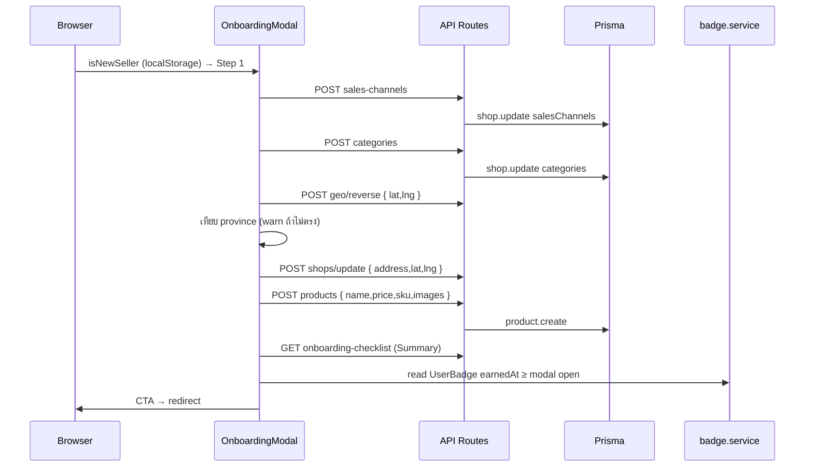

> **โมดูล:** M00001-LoginOnboarding
> **ประเภทเอกสาร:** API Contract
> **เวอร์ชัน:** 1.1
> **วันที่จัดทำ:** 2026-06-18
> **สถานะ:** Draft
> **เจ้าของเอกสาร:** SA (ดู [[Feature-Docs-Ownership]])

# API Contract: Login & Onboarding

---

## 1. Overview

API ชุดนี้รองรับระบบ **Login & Onboarding (M00001)** ฝั่ง seller (`seller.*`) ครอบคลุม Onboarding Modal 5 step (sales channels, categories, ที่อยู่+พิกัด, สินค้าแรก), Nominatim reverse-geocode proxy, Checklist computation, และ endpoint เดิมที่ใช้ต่อ

**Provider:** Next.js 16 App Router Route Handlers (nodejs runtime, Vercel Serverless)
**ผู้บริโภค:** `OnboardingModal`, `ChecklistSidebar`, `MapPicker`
**Base URL:** `https://seller.deepthailand.app` (prod) / `https://seller.deepth.local:4000` (dev)
**Content-Type:** `application/json`
**Convention:** success `{ "ok": true }` หรือ payload; error `{ "error": "<ข้อความ>" }`

- **ต้นทาง:** [[SRS]] §4, [[SDS]]; schema → [[DATABASE]] (migration เสร็จก่อน implement field ใหม่)

---

## 2. Authentication

| รายการ | ค่า |
|--------|-----|
| **Auth Method** | NextAuth v4 session cookie (`next-auth.session-token` httpOnly) |
| **Session/Scope** | seller: `session.user.id` + `isShop=true`; `getServerSession(authOptions)` |
| **ไม่มี session** | 401 `{ "error": "unauthorized" }` |
| **CSRF** | `guardApi` ตรวจ Origin ทุก mutation (ยกเว้น /api/auth/*); ผิด → 403 |
| **Rate-limit** | auth 30/min, unauth 100/min per IP (globalThis per-instance); เกิน → 429 |

---

## 3. Endpoint List

| Method | Path | คำอธิบาย | Auth | สถานะ |
|--------|------|----------|------|--------|
| `POST` | `/api/account/sales-channels` | บันทึก sales channels | seller | **ใหม่** |
| `POST` | `/api/account/categories` | บันทึก categories (≤5) | seller | **ใหม่** |
| `POST` | `/api/shops/update` | address + lat/lng (ขยาย) | seller | **ขยาย** |
| `POST` | `/api/geo/reverse` | Nominatim reverse-geocode proxy | seller | **ใหม่** |
| `POST` | `/api/products` | สร้างสินค้าแรก (+sku, maxImages=5) | seller | **ขยาย schema** |
| `GET` | `/api/account/onboarding-checklist` | Checklist computation | seller | **ใหม่** |
| `GET` | `/api/account/badge-progress` | achievement (earned + next) สำหรับ Summary step | seller | **ใหม่** |
| `POST` | `/api/account/set-phone` | ตั้งเบอร์ (immutable, L1 auto) | seller | มีอยู่ |
| `POST` | `/api/account/shop-info` | displayName/username/category | seller | มีอยู่ |
| `GET` | `/api/shops/check-slug` | ตรวจ slug ว่าง | none | มีอยู่ |
| `POST` | `/api/shops/slug` | ตั้ง slug | seller | มีอยู่ |

---

## 4. Endpoint Detail

### 4.1 `POST /api/account/sales-channels` (ใหม่)

บันทึกช่องทางการขาย (step 1) → `Shop.salesChannels`. Idempotent (overwrite). Trace: TFR-007 → FR-LO-07

**Request Body:** `{ "channels": string[] }` — array ของ `SALES_CHANNEL_KEYS`; empty = valid (ข้าม)
**enum:** `facebook`, `offline`, `line`, `tiktok_shop`, `lazada`, `shopee`
**Valibot:** `SalesChannelsSchema` = `v.object({ channels: v.array(v.picklist(SALES_CHANNEL_KEYS)) })`

**Success 200:** `{ "ok": true }`

**Errors:**
| Status | เงื่อนไข | body |
|--------|----------|------|
| 400 | key ไม่อยู่ใน enum / malformed | `{ "error": "ข้อมูลไม่ถูกต้อง" }` |
| 401 | ไม่มี session | `{ "error": "unauthorized" }` |
| 403 | CSRF | `{ "error": "Forbidden" }` |
| 404 | ไม่พบ Shop | `{ "error": "ไม่พบร้าน" }` |
| 429 | rate-limit | `{ "error": "Too Many Requests" }` |

**Side-effects:** Checklist "ช่องทางการขาย" → done เมื่อ length ≥1

```json
// Request
{ "channels": ["facebook", "line", "tiktok_shop"] }
// Response 200
{ "ok": true }
```

### 4.2 `POST /api/account/categories` (ใหม่)

บันทึก categories (step 2) → `Shop.categories`. Trace: TFR-008 → FR-LO-08, OD-4

**Request Body:** `{ "categories": string[] }` — `SHOP_CATEGORY_KEYS` ≥1 และ ≤5
**Valibot:** `CategoriesSchema` = `v.object({ categories: v.pipe(v.array(v.picklist(SHOP_CATEGORY_KEYS)), v.minLength(1), v.maxLength(5)) })`

**Success 200:** `{ "ok": true }`

**Errors:** 400 (ว่าง/>5/key ผิด → `"ข้อมูลไม่ถูกต้อง"`), 401, 403, 404, 429

**Side-effects:** Checklist "หมวดหมู่" → done เมื่อ ≥1; `Shop.category` (legacy) คงอยู่ (backward-compat, ดู [[DATABASE]])

```json
{ "categories": ["fashion", "beauty_health"] }
```

### 4.3 `POST /api/shops/update` (ขยาย — lat/lng)

มีอยู่แล้ว (category+address), ขยายรับ `latitude`+`longitude`. กฎ: lat/lng ต้องมาคู่กัน. ขอบเขตไทย lat 5–21, lng 97–106. Trace: TFR-009 → FR-LO-09, OD-1/OD-2

**Request Body:**
| field | type | req | คำอธิบาย |
|-------|------|-----|----------|
| `category` | string | no | legacy single |
| `address` | string | no | ≤500 chars (trim ≥1) |
| `latitude` | number | no* | 5–21; คู่กับ longitude |
| `longitude` | number | no* | 97–106; คู่กับ latitude |

**Valibot:** `ShopUpdateWithGeoSchema` (lat/lng optional; XOR check ที่ route handler)

**Success 200:** `{ "ok": true }`
**Errors:** 400 (นอกขอบเขต / lat ไม่มี lng / address ว่าง), 401, 403, 404, 429
**Side-effects:** Checklist "ที่อยู่" done เมื่อ address ไม่ว่าง; "ปักพิกัด" done เมื่อ latitude ไม่ null

```json
// ที่อยู่ + พิกัด
{ "address": "123 ถ.นิมมานเหมินทร์ ต.สุเทพ อ.เมือง จ.เชียงใหม่ 50200", "latitude": 18.7968, "longitude": 98.9687 }
// lat โดยไม่มี lng → 400
{ "latitude": 18.7968 }
```

### 4.4 `POST /api/geo/reverse` (ใหม่)

Server-side Nominatim proxy — รับพิกัด คืน province. กัน CORS + User-Agent + cache + timeout. Trace: TFR-010 → FR-LO-09, OD-1/OD-2

**Upstream:** `GET https://nominatim.openstreetmap.org/reverse?format=jsonv2&lat={lat}&lon={lng}&accept-language=th`
- User-Agent: `deep-platform/1.0 shinobu22@outlook.com`
- Timeout 5s (AbortController); cache key `${lat.toFixed(3)},${lng.toFixed(3)}` (globalThis Map, TTL ยาว)
- province จาก `response.address.state`

**Request Body:** `{ "lat": number, "lng": number }` — ไทย 5–21 / 97–106
**Valibot:** `GeoReverseSchema`

**Success 200:** `{ "province": string | null, "error"?: "timeout" | "upstream_error" }`
**ไม่คืน 5xx** เมื่อ Nominatim ล่ม — คืน 200 `{ province: null }` ให้ client degrade

**Errors (input):** 400 (นอกขอบเขต), 401, 403, 429
**Side-effects:** ไม่มี DB write; cache update เมื่อ miss

```json
// Request → Response สำเร็จ
{ "lat": 18.7968, "lng": 98.9687 }  →  { "province": "เชียงใหม่" }
// timeout
{ "province": null, "error": "timeout" }
```

### 4.5 `POST /api/products` (ขยาย — sku + maxImages=5)

มีอยู่แล้ว, ขยาย schema สำหรับ onboarding (step 4). Trace: TFR-011 → FR-LO-10, OD-5

**Request Body:**
| field | type | req | คำอธิบาย |
|-------|------|-----|----------|
| `name` | string | yes | 1–200 chars |
| `price` | number | yes | > 0.01 |
| `type` | string | yes | default `PHYSICAL` (onboarding) |
| `sku` | string | no | ≤100 chars (field ใหม่ — ดู [[DATABASE]] Open Q) |
| `description` | string | no | ≤5000 |
| `images` | string[] | no | fileId จาก /api/upload; ≤5 (onboarding) |

**Valibot:** `OnboardingProductSchema` (SRS §9)
**Client validate (ProductImageDropzone):** type ∈ JPG/PNG/WEBP, ≤5MB, ≤5 รูป

**Success 201:** product object (`serializeProduct()`)
**Errors:** 400 (`"Invalid input"`), 401 (`"Unauthorized"`), 403, 404 (`"No shop"`), 429
> หมายเหตุ: endpoint นี้ใช้ English error ตามโค้ดปัจจุบัน — ไม่เปลี่ยนใน scope นี้

**Side-effects:** Checklist "สร้างสินค้าแรก" → done เมื่อ count ≥1

```json
{ "name": "เสื้อยืดคอกลม สีขาว", "price": 299, "type": "PHYSICAL", "sku": "TSHIRT-WHITE-M", "images": ["fileId_abc", "fileId_def"] }
```

### 4.6 `GET /api/account/onboarding-checklist` (ใหม่)

คำนวณ checklist จาก DB fields จริง (ไม่มี flag แยก). Trace: TFR-013 → FR-LO-12/13

**Request:** ไม่มี param — ใช้ `userId` จาก session

**Success 200:**
```json
{
  "items": [
    { "key": "slug",          "label": "URL ร้าน",      "done": true  },
    { "key": "sales_channels","label": "ช่องทางการขาย", "done": false },
    { "key": "categories",    "label": "หมวดหมู่",       "done": false },
    { "key": "address",       "label": "ที่อยู่",         "done": false },
    { "key": "map_pin",       "label": "ปักพิกัด",       "done": false },
    { "key": "first_product", "label": "สร้างสินค้าแรก", "done": false }
  ],
  "isComplete": false
}
```

| key | DB field | Done condition |
|-----|----------|----------------|
| slug | `shop.slug` | `!= null` |
| sales_channels | `shop.salesChannels` | `length >= 1` |
| categories | `shop.categories` | `length >= 1` |
| address | `shop.address` | `!= null && != ""` |
| map_pin | `shop.latitude` | `!= null` |
| first_product | `shop._count.products` | `>= 1` |

**Errors:** 401, 404 (`"ไม่พบร้าน"`), 429
> field ใหม่ (salesChannels/categories/latitude) ต้อง migrate ก่อน — ห้าม implement ก่อน [[DATABASE]]

### 4.7 `GET /api/account/badge-progress` (ใหม่)

achievement ของ seller สำหรับ Summary step (step 5) — เรียก `getBadgeProgress(userId, 'seller')` (audience seller+any). Trace: TFR-012 → FR-LO-11, OD-3

**Request:** ไม่มี param — ใช้ `userId` จาก session

**Success 200:** array ของ
```json
[
  { "badge": { "id": "...", "nameTH": "สมาชิกผู้ก่อตั้ง 2026", "nameEN": "2026_BADGE", "icon": "award" },
    "earned": true, "progressLabel": null, "progressRatio": 1 },
  { "badge": { "id": "...", "nameTH": "เปิดหน้าร้าน", "nameEN": "First Sale", "icon": "award" },
    "earned": false, "progressLabel": "ยังไม่มีออเดอร์", "progressRatio": 0 }
]
```
- `nameTH` = `Badge.name` (ชื่อไทย); `icon` = short tabler name คงที่ ("award")
- client: earned = filter `earned===true`; next = `earned===false` ที่ `progressRatio` สูงสุด; degrade ถ้า fetch fail (ซ่อน achievement section)

**Errors:** 401; 429

### 4.8–4.11 Endpoints เดิม (อ้างอิง)

- **`POST /api/account/set-phone`** — `{ phone, otp }` → `{ ok: true }`; immutable (409 `"บัญชีนี้ตั้งเบอร์แล้ว..."` / เบอร์ซ้ำ `"เบอร์นี้มีบัญชีแล้ว"`); สร้าง L1 อัตโนมัติ. TFR-004 → FR-LO-04
- **`POST /api/account/shop-info`** — `{ displayName, username, category }` → `{ ok: true }`; 409 username ซ้ำ
- **`GET /api/shops/check-slug?slug=...`** — `{ available: bool, reason?: "taken"|"reserved"|"invalid" }`; ไม่ต้อง login
- **`POST /api/shops/slug`** — `{ slug, category? }` → `{ ok: true }`; 409 slug ซ้ำ; ตั้งแล้ว needsOnboarding→false. TFR-005 → FR-LO-05

---

## 5. Error Code Table

รูปแบบมาตรฐาน: `{ "error": "<ข้อความ>" }`

| Status | ความหมาย | เงื่อนไข |
|--------|----------|----------|
| 400 | Validation ผิด | body malformed / constraint ไม่ผ่าน |
| 401 | Auth ไม่ผ่าน | ไม่มี session / OTP ผิด/หมดอายุ |
| 403 | CSRF/Permission | Origin ไม่อยู่ allowlist |
| 404 | Not Found | ไม่พบ Shop/User |
| 409 | Conflict | slug ซ้ำ / เบอร์ซ้ำ / ตั้งเบอร์แล้ว |
| 429 | Too Many Requests | rate-limit เกิน |

| กรณี | message |
|------|---------|
| validation ผิด | `"ข้อมูลไม่ถูกต้อง"` |
| ไม่มี session | `"unauthorized"` |
| OTP ผิด/หมดอายุ | `"รหัส OTP ไม่ถูกต้องหรือหมดอายุ"` |
| ไม่พบ Shop | `"ไม่พบร้าน"` |
| slug ซ้ำ | `"URL นี้มีคนใช้แล้ว"` |
| เบอร์ตั้งแล้ว | `"บัญชีนี้ตั้งเบอร์แล้ว ไม่สามารถเปลี่ยนได้"` |
| เบอร์ซ้ำ | `"เบอร์นี้มีบัญชีแล้ว"` |
| username ซ้ำ | `"ชื่อผู้ใช้นี้มีคนใช้แล้ว"` |
| CSRF | `"Forbidden"` |
| products validation (เดิม) | `"Invalid input"` / `"No shop"` (English) |

---

## 6. Sequence Diagrams

### 6.1 Geo Reverse-Geocode (cache hit/miss/timeout)

```mermaid
sequenceDiagram
    participant Client as MapPicker
    participant GeoRoute as POST /api/geo/reverse
    participant Guard as guardApi
    participant Cache as globalThis Map
    participant Nom as Nominatim
    Client->>Guard: POST (cookie)
    Guard->>Guard: CSRF + rate-limit
    alt ผิด
        Guard-->>Client: 403 / 429
    end
    Guard->>GeoRoute: ผ่าน
    GeoRoute->>GeoRoute: safeParse GeoReverseSchema
    alt fail
        GeoRoute-->>Client: 400
    end
    GeoRoute->>Cache: lookup key (round 3)
    alt hit
        Cache-->>GeoRoute: { province }
        GeoRoute-->>Client: 200 { province }
    else miss
        GeoRoute->>Nom: GET /reverse (User-Agent, timeout 5s)
        alt ≤5s
            Nom-->>GeoRoute: address.state
            GeoRoute->>Cache: set
            GeoRoute-->>Client: 200 { province }
        else timeout
            GeoRoute-->>Client: 200 { province: null, error: "timeout" }
        else upstream error
            GeoRoute-->>Client: 200 { province: null, error: "upstream_error" }
        end
    end
    Client->>Client: เทียบ province; ไม่ตรง+ไม่ null → warning (ไม่ block)
```

### 6.2 Onboarding Modal Submit Chain



---

## 7. Traceability

| Endpoint | SRS TFR | BRD FR-LO | OD (PRD) |
|----------|---------|-----------|----------|
| sales-channels | TFR-007 | FR-LO-07 | — |
| categories | TFR-008 | FR-LO-08 | OD-4 |
| shops/update (lat/lng) | TFR-009 | FR-LO-09 | OD-1/2 |
| geo/reverse | TFR-010 | FR-LO-09 | OD-1/2 |
| products (sku) | TFR-011 | FR-LO-10 | OD-5 |
| onboarding-checklist | TFR-013 | FR-LO-12/13 | OD-6/7 |
| set-phone (เดิม) | TFR-004 | FR-LO-04 | — |
| shops/slug (เดิม) | TFR-005 | FR-LO-05 | — |

---

## 8. สรุป + Open Questions

API contract ครบสำหรับ DEV implement + QA วางแผน negative case. **ต้อง migrate ก่อน** implement endpoint ที่ใช้ field ใหม่ (salesChannels/categories/lat/lng/sku) + user approve (prod/dev แชร์)

**Open Questions:**
1. `OnboardingProductSchema` vs `CreateProductSchema` — เพิ่ม sku เข้า schema เดิม + client enforce maxImages=5, หรือ schema แยกตาม context? Controller ตัดสิน
2. isNewSeller detection — localStorage (เลือกไว้) vs DB field
3. `getBadgeProgress` signature — read source จริงก่อน Summary
4. `ThaiAddressSearch` province parse — ตรวจ composed string compare กับ Nominatim `address.state`

---

## 9. LINE + Instagram OAuth — API Extension (v1.1)

### 9.1 NextAuth Callback Routes (auto-managed)
NextAuth จัดการ callback ผ่าน `/api/auth/[...nextauth]` — ไม่ต้อง implement route แยก
| Provider | NextAuth route (auto) | register ที่ |
|---|---|---|
| LINE | `/api/auth/callback/line` | LINE Developers Console |
| Instagram | `/api/auth/callback/instagram` | Meta App Dashboard (prepared) |

### 9.2 Callback URL ที่ต้อง register ใน LINE Console (user ทำเอง)
```
https://deepthailand.app/api/auth/callback/line
https://seller.deepthailand.app/api/auth/callback/line
```

### 9.3 Environment Variables (ใหม่ v1.1)
| Variable | Provider | Required | หมายเหตุ |
|---|---|---|---|
| `LINE_CHANNEL_ID` | LINE | yes (live) | LINE Developers Console Channel ID |
| `LINE_CHANNEL_SECRET` | LINE | yes (live) | LINE Developers Console Channel Secret |
| `INSTAGRAM_CLIENT_ID` | Instagram | no (prepared) | Meta App Dashboard |
| `INSTAGRAM_CLIENT_SECRET` | Instagram | no (prepared) | Meta App Dashboard |
| `NEXT_PUBLIC_ENABLE_IG_LOGIN` | Instagram | no | default off; ปุ่ม IG render เมื่อ = `"true"` |

### 9.4 Traceability
| FR | SRS TFR | Component |
|---|---|---|
| FR-LO-14 | TFR-015 | auth.ts LineProvider + upsertOAuthUser |
| FR-LO-15 | TFR-016 | auth.ts InstagramProvider (flag-off) |
