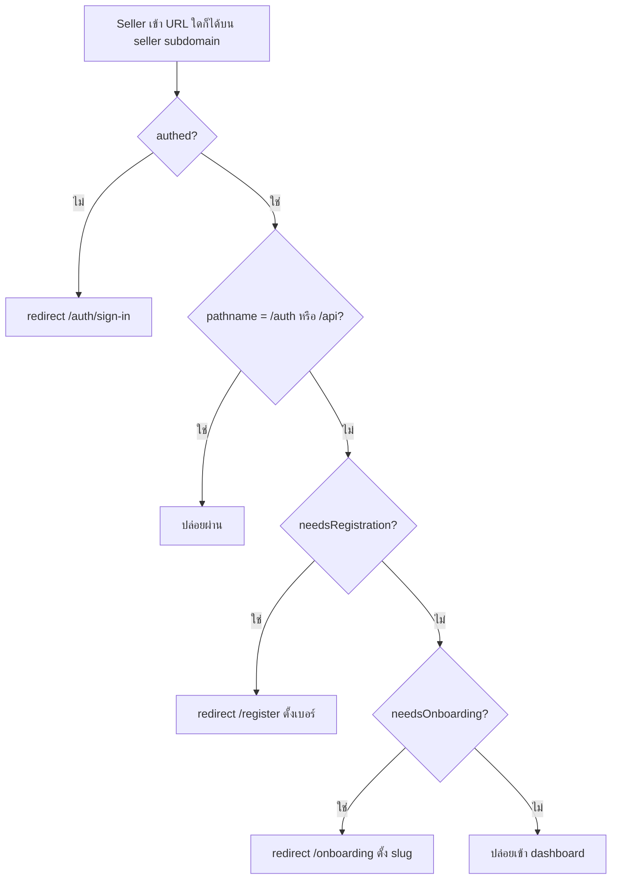
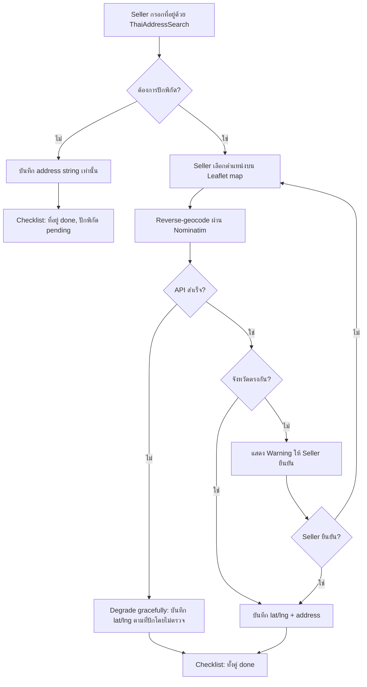
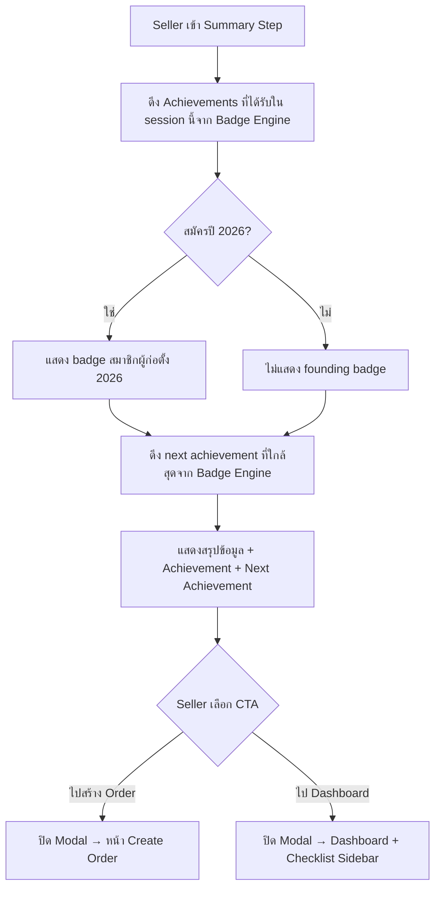
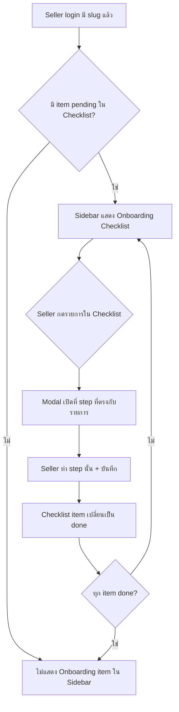
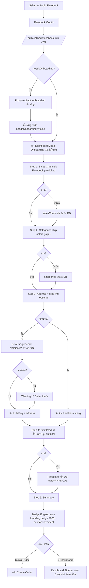
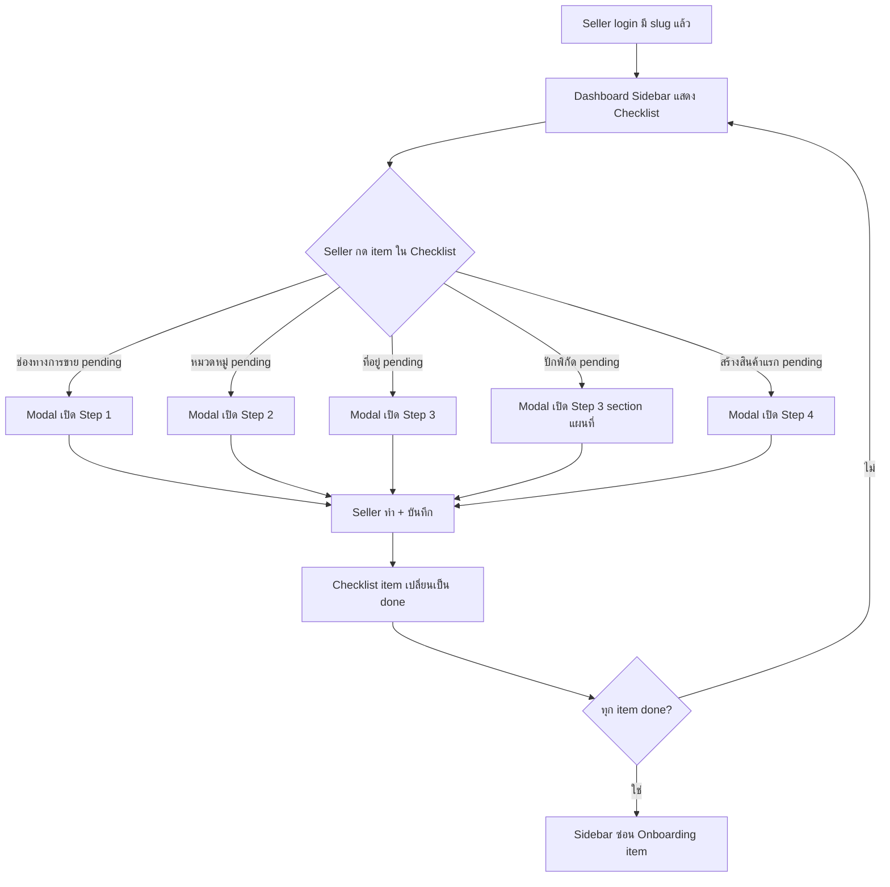
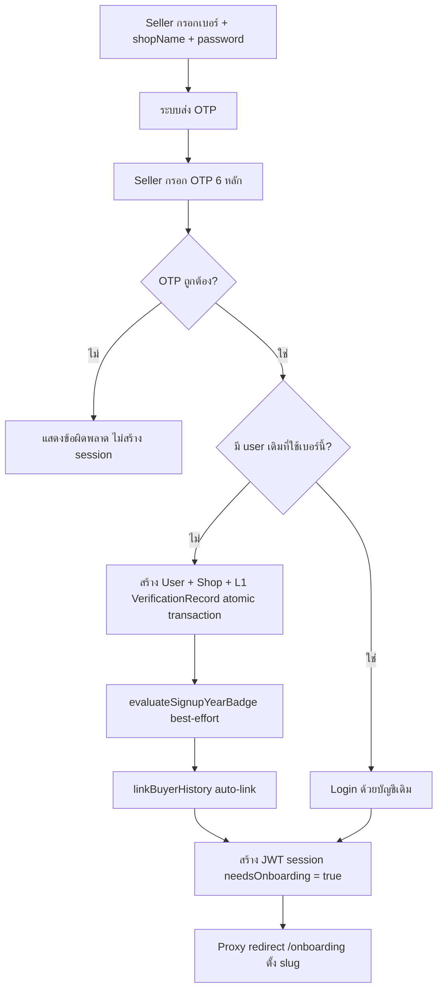

> **โมดูล:** M00001-LoginOnboarding
> **ประเภทเอกสาร:** Business Requirements Document (BRD) — NON-TECHNICAL
> **เวอร์ชัน:** 1.0
> **วันที่จัดทำ:** 2026-06-18
> **สถานะ:** Draft
> **เจ้าของเอกสาร:** BA (ดู [[Feature-Docs-Ownership]])

# BRD: Login & Onboarding (Business Requirements Document)

---

## 1. บทนำ

### 1.1 วัตถุประสงค์ของเอกสาร

เอกสารนี้มีวัตถุประสงค์เพื่อ:
1. กำหนด Functional Requirements ระดับ non-technical สำหรับระบบ Login & Onboarding ของ Seller บนแพลตฟอร์ม Deep ครอบคลุมตั้งแต่การสมัคร/เข้าสู่ระบบ ไปจนถึงการตั้งค่าร้านครั้งแรก (Onboarding Modal) และ Checklist ใน Sidebar
2. กำหนดขอบเขตการทำงาน ลำดับ step และกฎที่ระบบบังคับ รวมถึง Resolved Decisions ที่ต้องนำไปใช้ (จาก PRD §10.3)
3. ระบุเงื่อนไขการรับงาน (Acceptance Criteria) แบบ Given/When/Then ที่ทีม QA สามารถนำไปสร้าง Test Case ได้โดยตรง
4. สร้างความเข้าใจร่วมกันระหว่างทีมธุรกิจและทีมพัฒนา ก่อนเริ่ม implement feature

### 1.2 ขอบเขตของระบบ

**ระบบ Login & Onboarding** คือกระบวนการที่ Seller ทุกคนต้องผ่านเพื่อเริ่มใช้งานแพลตฟอร์ม Deep ครอบคลุม 3 ส่วนหลัก: (1) ช่องทางสมัคร/เข้าสู่ระบบ 3 ช่องทาง, (2) Onboarding Modal 5 step ที่ข้ามได้ หลัง slug ผ่าน proxy gate, (3) Checklist ใน Sidebar สำหรับติดตาม progress ของ Seller ที่ข้าม step ไป

**เข้าสู่ระบบ (Input):**
- ข้อมูล username + password จาก Seller (ช่องทางหลัก)
- เบอร์โทรศัพท์ + OTP 6 หลัก (ช่องทาง Phone OTP)
- Authorization code จาก Facebook OAuth (ช่องทาง Facebook)
- Authorization code จาก LINE OAuth (ช่องทาง LINE — ใช้งานจริง)
- Authorization code จาก Instagram OAuth (ช่องทาง Instagram — เมื่อ `NEXT_PUBLIC_ENABLE_IG_LOGIN = true` เท่านั้น)
- ข้อมูลร้านค้าจาก Seller ในแต่ละ step ของ Onboarding Modal: ช่องทางการขาย, หมวดหมู่, ที่อยู่ + พิกัด (optional), ข้อมูลสินค้าแรก (optional)

**ออกจากระบบ (Output):**
- JWT session ที่มี `needsOnboarding`, `needsRegistration`, `shopSlug` flags
- ข้อมูลร้านค้าที่บันทึกใน DB: salesChannels, categories (≤5), address, lat/lng (optional), สินค้าแรก (optional)
- L1 Verification Record (PHONE_OTP, APPROVED) เมื่อตั้งเบอร์โทรสำเร็จ
- Achievement Badge "สมาชิกผู้ก่อตั้ง 2026" (SIGNUP_YEAR) เมื่อสมัครในปี 2026
- Checklist progress ใน Sidebar ที่สะท้อนสถานะ done/pending ของแต่ละ item

**ระบบที่เกี่ยวข้อง:**
- Proxy Gate (`proxy.ts`) — บังคับ redirect Seller ที่ยังไม่มี slug ไปยัง /onboarding
- Badge Engine (`badge.service.ts`) — evaluate SIGNUP_YEAR badge ตอน signup + แสดง next achievement ใน Summary step
- Trust Score System — คำนวณหลังจาก L1 verification ถูกสร้าง
- Storage (`lib/storage`) — รับ upload รูปสินค้าใน step สร้างสินค้าแรก
- ThaiAddressSearch component — autocomplete ที่อยู่ใน step ที่อยู่
- Nominatim (OpenStreetMap) — reverse-geocode พิกัดเป็นชื่อจังหวัด สำหรับตรวจ address-map consistency

### 1.3 กลุ่มผู้ใช้งาน

| กลุ่มผู้ใช้ | บทบาท | สิทธิ์การใช้งาน |
|-----------|--------|----------------|
| **Seller ใหม่ — ช่องทาง Facebook** | เพิ่งสมัครผ่าน Facebook OAuth ครั้งแรก ยังไม่มีบัญชีในระบบ | ตั้งค่าร้านผ่าน Onboarding Modal; ระบบ pre-tick "Facebook" ในช่องทางการขายให้อัตโนมัติ |
| **Seller ใหม่ — ช่องทาง Phone OTP** | สมัครด้วยเบอร์โทรศัพท์ มี shop name + password ตั้งแต่ signup | ตั้งค่าร้านผ่าน Onboarding Modal ทุก step |
| **Seller ใหม่ — ช่องทาง username/password** | Login ด้วย username + password ที่มีอยู่แล้ว (เช่น ตั้งรหัสผ่านตอน OTP signup) | เข้า dashboard ได้ทันทีถ้ามี slug แล้ว; ถ้าไม่มี slug → proxy เด้ง /onboarding |
| **Seller ใหม่ — ช่องทาง LINE** | เพิ่งสมัครผ่าน LINE OAuth ครั้งแรก ยังไม่มีบัญชีในระบบ ไม่มี email | ตั้งค่าร้านผ่าน /register (บังคับตั้งเบอร์ก่อน) → /onboarding; ระบบ pre-tick "LINE" ในช่องทางการขายให้อัตโนมัติ |
| **Seller เก่า** | มีบัญชีและ slug อยู่แล้ว แต่ข้อมูลบางส่วนยังว่าง (เช่น ยังไม่มี salesChannels, ยังไม่ได้ปักพิกัด) | เห็น Checklist ใน Sidebar; กดรายการที่ค้างเพื่อเปิด modal ทำต่อได้ |

---

## 2. ความต้องการหลัก (Functional Requirements)

### 2.1 ช่องทางสมัคร / เข้าสู่ระบบ (Login Methods)

#### FR-LO-01: Username + Password Login (ช่องทางหลัก)

**User Story:**
> ในฐานะ Seller ที่ตั้ง username และ password ไว้แล้ว ฉันต้องการเข้าสู่ระบบด้วย username + password เพื่อไม่ต้องพึ่ง Facebook หรือ OTP ทุกครั้ง

**Acceptance Criteria:**
- [ ] **Given** Seller กรอก username ที่มีในระบบ + password ถูกต้อง **When** กดเข้าสู่ระบบ **Then** ระบบ verify bcrypt hash สำเร็จ → สร้าง session → redirect ตาม proxy gate (dashboard ถ้ามี slug / onboarding ถ้าไม่มี slug)
- [ ] **Given** กรอก password ผิด **When** กดเข้าสู่ระบบ **Then** ระบบแสดงข้อความผิดพลาด ไม่เปิดเผยว่า username ไม่มีหรือ password ผิด (กัน user enumeration)
- [ ] **Given** Seller ล็อกอินผิดเกิน 5 ครั้งใน 10 นาที **When** พยายามอีกครั้ง **Then** ระบบปฏิเสธโดยไม่ตรวจ password (rate-limit; ป้องกัน brute-force)
- [ ] **Given** password ยาวเกิน 1,000 ตัวอักษร **When** กดเข้าสู่ระบบ **Then** ระบบปฏิเสธทันที ไม่เรียก bcrypt (กัน CPU DoS)
- [ ] ช่องทางนี้ใช้ได้เฉพาะ Seller ที่มี `isShop = true` และ `passwordHash ไม่ null` — Buyer ที่ไม่มีร้านใช้ช่องทางนี้ไม่ได้

**Business Flow:**
1. Seller กรอก username + password บนหน้า sign-in ของ seller subdomain
2. ระบบ rate-limit ตรวจ (5/10min per username) ก่อน query DB
3. Query user ด้วย username → ตรวจ `isShop`, `isAdmin`, `passwordHash`
4. bcrypt.compare(password, hash) → ถ้าตรงสร้าง JWT session
5. Proxy gate ตรวจ `needsOnboarding` → redirect ไปหน้าที่ถูกต้อง

#### FR-LO-02: Phone OTP Signup + Login

**User Story:**
> ในฐานะ Seller ใหม่ที่ไม่ต้องการใช้ Facebook ฉันต้องการสมัครด้วยเบอร์โทรศัพท์พร้อมตั้ง password และชื่อร้านในคราวเดียว เพื่อเริ่มใช้งาน Deep ได้ทันที

**Acceptance Criteria:**
- [ ] **Given** Seller กรอกเบอร์โทรที่ไม่เคยลงทะเบียน + OTP ถูกต้อง + ชื่อร้าน + password **When** ยืนยัน OTP **Then** ระบบสร้าง User + Shop + L1 VerificationRecord (PHONE_OTP, APPROVED) + `isShop = true` ในธุรกรรมเดียว (atomic) → สร้าง session → proxy redirect ไป /onboarding
- [ ] **Given** Seller กรอกเบอร์โทรที่มีบัญชีอยู่แล้ว + OTP ถูกต้อง **When** ยืนยัน OTP บนหน้า sign-in **Then** ระบบ login ด้วยบัญชีเดิม → redirect ตาม proxy gate
- [ ] **Given** Seller กรอก OTP ผิด **When** ยืนยัน **Then** ระบบแสดงข้อความ "OTP ไม่ถูกต้อง" และไม่สร้าง session
- [ ] เบอร์โทรที่ตั้งผ่านช่องทางนี้เป็น immutable — ไม่มี API เปลี่ยนเบอร์ภายหลัง
- [ ] ระบบ auto-link history การซื้อที่เคยทำเป็น guest ด้วยเบอร์เดียวกัน (Buyer History Linking)
- [ ] ถ้า OTP signup สำเร็จ → `evaluateSignupYearBadge` ถูกเรียกแบบ best-effort (ไม่ให้ badge error ทำให้ login พัง)

#### FR-LO-03: Facebook OAuth Login/Signup

**User Story:**
> ในฐานะ Seller ที่มีร้าน Facebook อยู่แล้ว ฉันต้องการเข้าสู่ระบบด้วย Facebook ในคลิกเดียว เพื่อไม่ต้องจำ password เพิ่ม

**Acceptance Criteria:**
- [ ] **Given** Seller กด "เข้าสู่ระบบด้วย Facebook" บนหน้า sign-in **When** Facebook OAuth สำเร็จ **Then** ระบบ redirect ไป `/auth/callback/facebook` → spinner Paces รอ session (~1.5s) → redirect ไป /dashboard หรือ /onboarding ตาม proxy gate
- [ ] **Given** Facebook user ใหม่ (ยังไม่มีบัญชีในระบบ) **When** OAuth สำเร็จ **Then** ระบบสร้าง User ใหม่ (username = `fb{facebookId}`, avatar จาก FB userinfo) + `evaluateSignupYearBadge` best-effort → `needsOnboarding = true` → proxy redirect /onboarding
- [ ] **Given** Facebook user ที่มีบัญชีอยู่แล้ว **When** OAuth สำเร็จ **Then** ระบบ match ด้วย `providerAccountId` → login ด้วยบัญชีเดิม + refresh avatar ถ้า FB รูปเปลี่ยน
- [ ] Facebook OAuth ใช้ได้เฉพาะ production (https) — `deepth.local` ใช้ไม่ได้
- [ ] **Given** Seller login ด้วย Facebook **When** เข้า Onboarding Modal step ช่องทางการขาย **Then** ระบบ pre-tick "Facebook" ให้อัตโนมัติ (ยังเปลี่ยนได้)

#### FR-LO-14: LINE OAuth Login/Signup

**User Story:**
> ในฐานะ Seller ที่ใช้ LINE เป็นหลัก ฉันต้องการเข้าสู่ระบบ Deep ด้วยบัญชี LINE ได้ทันที เพื่อไม่ต้องจำ username/password เพิ่มและไม่ต้องพึ่ง Facebook

**Acceptance Criteria:**

**Happy Path — LINE user ใหม่:**
- [ ] `[FR-LO-14-AC-01]` **Given** Seller กด "เข้าสู่ระบบด้วย LINE" บนหน้า sign-in (seller หรือ buyer) **When** LINE OAuth สำเร็จ (ได้รับ authorization code จาก LINE) **Then** ระบบ redirect ไป `/auth/callback/line` → spinner รอ session → redirect ตาม proxy gate
- [ ] `[FR-LO-14-AC-02]` **Given** LINE user ใหม่ที่ยังไม่มีบัญชีในระบบ (ไม่พบ `AuthAccount` ที่มี `provider = "LINE"` และ `providerAccountId` ตรงกัน) **When** LINE OAuth สำเร็จ **Then** ระบบสร้าง `User` ใหม่ (username = `line{providerAccountId}`, avatar จาก LINE `profile.picture`) + `AuthAccount(provider="LINE")` + `evaluateSignupYearBadge` best-effort → `needsRegistration = true` (ไม่มีเบอร์) → proxy redirect `/register`

**Happy Path — LINE user เดิม:**
- [ ] `[FR-LO-14-AC-03]` **Given** LINE user ที่มีบัญชีอยู่แล้ว (พบ `AuthAccount(provider="LINE", providerAccountId=X)`) **When** LINE OAuth สำเร็จ **Then** ระบบ login ด้วยบัญชีเดิม + refresh `avatar` ถ้า LINE รูปเปลี่ยน → redirect ตาม proxy gate (dashboard ถ้ามี slug / onboarding ถ้าไม่มี slug)

**ปุ่ม LINE — placement:**
- [ ] `[FR-LO-14-AC-04]` **Given** ผู้ใช้เข้าหน้า seller sign-in, buyer sign-in, หรือ buyer sign-up **When** หน้าโหลด **Then** ปุ่ม "เข้าสู่ระบบด้วย LINE" ปรากฏบนทุกหน้า (3 ที่ เหมือน Facebook) — สี LINE เขียว `#06C755` (brand asset, Hard Rule 6, ต้องมี comment กำกับใน code)

**Callback URL:**
- [ ] `[FR-LO-14-AC-05]` **Given** LINE OAuth สำเร็จ **When** LINE redirect กลับ **Then** callback ถูกรับที่ `/api/auth/callback/line` และ redirect ผู้ใช้ไป `/auth/callback/line` (spinner page เดิม)

**LINE user ไม่มี email → gating เดิมทำงานได้:**
- [ ] `[FR-LO-14-AC-06]` **Given** LINE user ใหม่ที่เพิ่งสร้างบัญชี (ไม่มี phone, ไม่มี slug) **When** proxy ตรวจ JWT flags **Then** `needsRegistration = true` → redirect `/register` (บังคับตั้งเบอร์ก่อน) → หลังตั้งเบอร์ → `needsOnboarding = true` → redirect `/onboarding` ตามลำดับที่กำหนด (reuse logic เดิมจาก FR-LO-05)

**Pre-tick LINE ใน Sales Channels (BR-19):**
- [ ] `[FR-LO-14-AC-07]` **Given** Seller login ผ่าน LINE ใน session ปัจจุบัน **When** Onboarding Modal เปิดที่ step 1 (ช่องทางการขาย) **Then** ระบบ pre-tick "LINE" ให้อัตโนมัติ (ยังแก้ได้); ถ้า provider ตรวจไม่ได้ → ไม่ pre-fill (fallback graceful ไม่ error)

**Edge Cases:**
- [ ] `[FR-LO-14-AC-08]` **Given** LINE OAuth ล้มเหลว (user กดยกเลิก หรือ LINE error) **When** callback ได้รับ error **Then** ระบบ redirect กลับหน้า sign-in พร้อมแสดง error message ที่เข้าใจได้ — ไม่ crash, ไม่สร้าง orphan User
- [ ] `[FR-LO-14-AC-09]` **Given** LINE user login ซ้ำซ้อนในเวลาเดียวกัน 2 request **When** ทั้งสอง request เข้า upsertOAuthUser พร้อมกัน **Then** ระบบสร้าง User/AuthAccount เพียง 1 record (unique constraint `provider + providerAccountId` กัน race condition)
- [ ] `[FR-LO-14-AC-10]` **Given** LINE user มีอยู่แล้ว + LINE เปลี่ยนรูปโปรไฟล์ **When** login ครั้งถัดไป **Then** `User.avatar` ถูก refresh เป็นรูปใหม่จาก LINE `profile.picture`

**ข้อจำกัด:**
- [ ] `[FR-LO-14-AC-11]` LINE login ต้องลงทะเบียน callback URL 2 รายการใน LINE Developers Console ก่อน go-live: `https://deepthailand.app/api/auth/callback/line` และ `https://seller.deepthailand.app/api/auth/callback/line` (user ทำเอง — ไม่ใช่งาน Dev)

#### FR-LO-15: Instagram OAuth (เตรียมโค้ด — ปิด Feature Flag)

**User Story:**
> ในฐานะ Product team ฉันต้องการให้โค้ด Instagram OAuth พร้อม deploy แล้วแต่ซ่อนอยู่หลัง feature flag เพื่อเปิดใช้ได้ทันทีเมื่อ Meta Business Verification ผ่าน โดยไม่ต้อง deploy ใหม่

**เหตุผลที่ปิด flag:**
Instagram Basic Display API ถูก Meta ยกเลิก ธ.ค. 2024 — ปัจจุบัน Instagram login วิ่งผ่าน Meta และต้องผ่าน App Review + Business Verification ตัวเดียวกับ Facebook ซึ่งยังอยู่ระหว่างดำเนินการ

**Acceptance Criteria:**

**Feature Flag = OFF (default — พฤติกรรมที่คาดหวังตอนนี้):**
- [ ] `[FR-LO-15-AC-01]` **Given** `NEXT_PUBLIC_ENABLE_IG_LOGIN` ไม่ถูกตั้งค่า หรือ = `"false"` หรือ = ค่าอื่นที่ไม่ใช่ `"true"` **When** หน้า sign-in (seller, buyer sign-in, buyer sign-up) โหลด **Then** ปุ่ม "เข้าสู่ระบบด้วย Instagram" ไม่ปรากฏใน DOM เลย (ไม่ใช่แค่ hidden — ต้องไม่ render)
- [ ] `[FR-LO-15-AC-02]` **Given** `NEXT_PUBLIC_ENABLE_IG_LOGIN = "false"` **When** ผู้ใช้เข้า URL `/api/auth/signin/instagram` โดยตรง **Then** NextAuth ยังคง reject/redirect ตาม provider config — ไม่ crash server

**Feature Flag = ON (พฤติกรรมที่คาดหวังเมื่อ Meta Verification ผ่าน — ทดสอบได้บน staging เท่านั้น):**
- [ ] `[FR-LO-15-AC-03]` **Given** `NEXT_PUBLIC_ENABLE_IG_LOGIN = "true"` **When** หน้า sign-in โหลด **Then** ปุ่ม "เข้าสู่ระบบด้วย Instagram" ปรากฏ (3 ที่ เหมือน LINE และ Facebook)
- [ ] `[FR-LO-15-AC-04]` **Given** Instagram user ใหม่ + flag ON **When** Instagram OAuth สำเร็จ **Then** ระบบสร้าง `User` ใหม่ (username = `ig{providerAccountId}`, avatar จาก Instagram) + `AuthAccount(provider="INSTAGRAM")` → gating เดิมทำงาน (needsRegistration → needsOnboarding)
- [ ] `[FR-LO-15-AC-05]` **Given** Instagram user ที่มีบัญชีอยู่แล้ว + flag ON **When** OAuth สำเร็จ **Then** ระบบ match ด้วย `AuthAccount(provider="INSTAGRAM", providerAccountId=X)` → login บัญชีเดิม
- [ ] `[FR-LO-15-AC-06]` **Given** Instagram user ใหม่ + flag ON + login สำเร็จ **When** Onboarding Modal เปิด step 1 **Then** ระบบ**ไม่** pre-tick channel ใดๆ อัตโนมัติ (Instagram ไม่มี pre-fill rule)
- [ ] `[FR-LO-15-AC-07]` `AuthAccount.provider` สำหรับ Instagram = string `"INSTAGRAM"` เสมอ; username prefix = `ig`; callback route = `/auth/callback/instagram`

#### FR-LO-04: Reset Password ผ่าน OTP

**User Story:**
> ในฐานะ Seller ที่ลืม password ฉันต้องการรีเซ็ต password ผ่านเบอร์โทรที่ลงทะเบียนไว้ เพื่อกลับเข้าสู่ระบบได้โดยไม่ต้องติดต่อ support

**Acceptance Criteria:**
- [ ] **Given** Seller กดลืมรหัสผ่าน + กรอกเบอร์โทรที่มีในระบบ **When** ขอ OTP **Then** ระบบส่ง OTP ไปยังเบอร์นั้น
- [ ] **Given** OTP ถูกต้อง + password ใหม่ผ่าน policy (ความแข็งแกร่งที่กำหนด) **When** ยืนยัน **Then** ระบบอัปเดต `passwordHash` ด้วย bcrypt + Seller เข้าสู่ระบบได้ด้วย password ใหม่
- [ ] **Given** OTP ผิดหรือหมดอายุ **When** ยืนยัน **Then** ระบบปฏิเสธและไม่เปลี่ยน password

---

### 2.2 Proxy Gate และการ Redirect

#### FR-LO-05: Proxy Gate — slug-only mandatory

**User Story:**
> ในฐานะระบบ ฉันต้องบังคับให้ Seller ที่ยังไม่มี slug ตั้ง slug ก่อนเข้าใช้งาน เพราะ slug คือ public URL ที่ขาดไม่ได้สำหรับหน้าร้าน

**Acceptance Criteria:**
- [ ] **Given** Seller authed + `needsOnboarding = true` (ไม่มี slug) **When** เข้า URL ใดก็ได้บน seller subdomain (ยกเว้น /auth, /api) **Then** proxy redirect ไป /onboarding ทันที
- [ ] **Given** Seller authed + `needsOnboarding = false` (มี slug แล้ว) **When** เข้า /onboarding **Then** proxy redirect ออกไป /dashboard
- [ ] **Given** Seller authed + `needsRegistration = true` (ไม่มีเบอร์ — เฟส 1 สำหรับ FB user ที่ยังไม่ set phone) **When** เข้า URL ใดก็ได้ **Then** proxy redirect ไป /register ก่อน (เฟสนี้มีก่อน needsOnboarding)
- [ ] /auth และ /api ได้รับการยกเว้นจาก proxy gate เสมอ
- [ ] เมื่อ Seller ตั้ง slug สำเร็จ → `needsOnboarding` เปลี่ยนเป็น false → proxy gate ปล่อย Seller เข้า dashboard ได้

**Business Flow:**

---

### 2.3 Onboarding Modal — 5 Step

#### FR-LO-06: เปิด Modal อัตโนมัติหลัง Slug ผ่าน

**User Story:**
> ในฐานะ Seller ใหม่ที่เพิ่งตั้ง slug สำเร็จ ฉันต้องการเห็น Onboarding Modal เปิดขึ้นมาอัตโนมัติพร้อมแนะนำให้กรอกข้อมูลร้านต่อ โดยสามารถข้ามได้ทุก step

**Acceptance Criteria:**
- [ ] **Given** Seller เพิ่งตั้ง slug สำเร็จ (needsOnboarding เปลี่ยนเป็น false) **When** proxy ปล่อยเข้า dashboard **Then** Onboarding Modal เปิดอัตโนมัติที่ step 1 (ช่องทางการขาย)
- [ ] **Given** Seller เก่าที่มี slug อยู่แล้ว **When** login **Then** Modal ไม่เปิดอัตโนมัติ แต่ Sidebar แสดง Checklist item ที่ยังขาด (OD-7)
- [ ] ทุก step มีปุ่ม "ข้ามไปก่อน" ที่กดได้โดยไม่ block การไปหน้าถัดไป
- [ ] การข้าม step ไม่บันทึกข้อมูลใดๆ ของ step นั้นลง DB

#### FR-LO-07: Step 1 — ช่องทางการขาย (Sales Channels)

**User Story:**
> ในฐานะ Seller ฉันต้องการเลือกช่องทางที่ใช้ขายสินค้าจริงๆ ทั้งหมดได้ในครั้งเดียว เพื่อให้แพลตฟอร์มรู้ว่าฉันขายผ่านไหนบ้าง

**Acceptance Criteria:**
- [ ] UI แสดงตัวเลือก: Facebook, หน้าร้าน (offline), LINE, TikTok Shop, Lazada, Shopee — เป็น chip/checkbox ที่กด select/deselect ได้
- [ ] เลือกได้หลายช่องพร้อมกัน ไม่มีจำนวนขั้นต่ำ (0 ก็ได้)
- [ ] **Given** Seller login ผ่าน Facebook **When** modal เปิดที่ step 1 **Then** ระบบ pre-tick "Facebook" ให้อัตโนมัติ ยังแก้ไขได้
- [ ] **Given** Seller กด "บันทึก" ที่ step นี้ **When** บันทึกสำเร็จ **Then** `salesChannels` ใน DB อัปเดตเป็น array ที่เลือก; Checklist item "เลือกช่องทางการขาย" เปลี่ยนเป็น done
- [ ] **Given** Seller กด "ข้ามไปก่อน" **When** ข้าม **Then** `salesChannels` ยังว่าง; Checklist item ยัง pending
- [ ] ตัวเลือก channel เป็น enum คงที่ — Seller เพิ่มเองไม่ได้

#### FR-LO-08: Step 2 — หมวดหมู่ร้านค้า (Multi-Category ≤5 หมวด)

**User Story:**
> ในฐานะ Seller ที่ขายหลายหมวดสินค้า ฉันต้องการเลือกหมวดหมู่ร้านได้มากกว่าหนึ่งหมวด เพื่อให้โปรไฟล์ร้านตรงกับความจริง

**Acceptance Criteria:**
- [ ] UI แสดง 10 หมวดหมู่ (general, fashion, beauty_health, food_beverage, electronics_it, home_living, mom_baby, agri_otop, services_digital, other) เป็น chip/toggle
- [ ] เลือกได้สูงสุด **5 หมวด** (OD-4) — เมื่อเลือกครบ 5 แล้ว chip ที่ยังไม่เลือกต้องถูก disable
- [ ] **Given** Seller พยายาม select หมวดที่ 6 **When** กด chip **Then** ระบบไม่เพิ่ม และแสดง feedback ว่าเลือกได้สูงสุด 5 หมวด
- [ ] **Given** Seller เลือก ≥1 หมวด + กด "บันทึก" **When** บันทึกสำเร็จ **Then** `categories` (array) ใน DB อัปเดต; Checklist item "เลือกหมวดหมู่" เปลี่ยนเป็น done
- [ ] **Given** Seller ข้าม step **When** ข้าม **Then** category ยังว่าง; Checklist item ยัง pending
- [ ] Seller เดิมที่มี `category` เป็น string เดี่ยว ต้องยังใช้งานได้ระหว่าง migration (backward-compat)

#### FR-LO-09: Step 3 — ที่อยู่ร้าน + ปักพิกัดแผนที่ (optional)

**User Story:**
> ในฐานะ Seller ฉันต้องการกรอกที่อยู่ร้านและ (ถ้าต้องการ) ปักหมุดตำแหน่งบนแผนที่ เพื่อให้ Buyer รู้ว่าร้านอยู่ที่ไหนจริงๆ

**Acceptance Criteria:**
- [ ] UI มี ThaiAddressSearch autocomplete สำหรับกรอกที่อยู่
- [ ] มีปุ่ม/ส่วน optional "ปักพิกัดบนแผนที่" — ใช้ Leaflet + OpenStreetMap (ฟรี ไม่มี API key) (OD-1)
- [ ] **Given** Seller ปักพิกัด + กรอกที่อยู่แล้วกด "บันทึก" **When** ระบบ reverse-geocode พิกัดผ่าน Nominatim ได้จังหวัดที่ตรงกับที่อยู่ที่กรอก **Then** บันทึก lat/lng + address ลง DB โดยไม่แสดง warning
- [ ] **Given** reverse-geocode พิกัดได้จังหวัดที่ไม่ตรงกับที่อยู่ที่กรอก **When** ระบบตรวจสอบ **Then** แสดง warning "พิกัดอาจไม่ตรงกับที่อยู่ที่กรอก — กรุณาตรวจสอบ" แต่ยัง**ไม่ block** การบันทึก Seller ยืนยันได้ (OD-2)
- [ ] **Given** Nominatim API ล่ม / timeout **When** Seller กด "บันทึก" **Then** ระบบข้ามการตรวจสอบ address-map consistency และบันทึก lat/lng ตามที่ Seller ปักโดยไม่ error (degrade gracefully)
- [ ] **Given** Seller ไม่ปักพิกัด + กรอกแค่ที่อยู่ **When** กด "บันทึก" **Then** บันทึก `address` string เท่านั้น lat/lng = null; Checklist item "ที่อยู่" เปลี่ยนเป็น done, item "ปักพิกัด" ยัง pending
- [ ] **Given** Seller ข้ามทั้ง step **When** ข้าม **Then** address ยังว่าง; ทั้ง 2 Checklist item ยัง pending
- [ ] Nominatim: ต้องตั้งค่า User-Agent ตามนโยบาย OSM + cache ผลลัพธ์เพื่อลด request (ระบุใน SRS)

**Business Flow:**

#### FR-LO-10: Step 4 — สร้างสินค้าแรก (Enhanced, Optional ทั้ง step)

**User Story:**
> ในฐานะ Seller ใหม่ ฉันต้องการเพิ่มสินค้าแรกพร้อมรูปภาพได้เลยใน Onboarding เพื่อให้ Buyer เห็นร้านฉันมีสินค้าตั้งแต่วันแรก

**Acceptance Criteria:**
- [ ] ฟอร์มมี field: ชื่อสินค้า (required), SKU (optional), ราคา (required), คำอธิบาย/description (optional), รูปภาพ (optional, drag & drop + file picker)
- [ ] รูปภาพ: รองรับ JPG/PNG/WEBP, ขนาดสูงสุด **≤5MB ต่อรูป**, จำนวน **≤5 รูป** ต่อสินค้า (OD-5)
- [ ] **Given** Seller drag & drop ไฟล์ที่ไม่ใช่ JPG/PNG/WEBP **When** ไฟล์ถูก drop **Then** ระบบปฏิเสธ + แสดงข้อความ "รองรับเฉพาะ JPG, PNG, WEBP"
- [ ] **Given** Seller drag & drop ไฟล์ขนาดเกิน 5MB **When** ไฟล์ถูก drop **Then** ระบบปฏิเสธ + แสดงข้อความ "ไฟล์ขนาดเกิน 5MB"
- [ ] **Given** Seller drag & drop รูปที่ 6 ในขณะที่มี 5 รูปอยู่แล้ว **When** ไฟล์ถูก drop **Then** ระบบปฏิเสธ + แสดงข้อความ "อัปโหลดได้สูงสุด 5 รูป"
- [ ] **Given** Seller กรอก ชื่อสินค้า + ราคา + (optional รูป) + กด "สร้างสินค้า" **When** สำเร็จ **Then** Product ถูกสร้างใน DB (type = PHYSICAL default); Checklist item "สร้างสินค้าแรก" เปลี่ยนเป็น done
- [ ] **Given** Seller กด "ข้ามไปก่อน" **When** ข้าม **Then** ไม่มี Product ถูกสร้าง; Checklist item "สร้างสินค้าแรก" ยัง pending
- [ ] อุปกรณ์ที่ไม่รองรับ drag & drop → fallback เป็น file picker ปกติ (ไม่ error)

#### FR-LO-11: Step 5 — สรุปและ Achievement (Summary)

**User Story:**
> ในฐานะ Seller ที่เพิ่งทำ Onboarding เสร็จ ฉันต้องการเห็นสรุปสิ่งที่ทำในครั้งนี้ พร้อม Achievement ที่ได้รับ และรู้ว่าต้องทำอะไรต่อเพื่อได้ Achievement ถัดไป

**Acceptance Criteria:**
- [ ] Summary แสดงข้อมูลที่กรอกใน session นี้: channels ที่เลือก (ถ้ามี), หมวดหมู่ที่เลือก (ถ้ามี), ที่อยู่ (ถ้ากรอก), สินค้าแรก (ถ้าสร้าง)
- [ ] **Given** Seller สมัครในปี 2026 **When** เข้า Summary step **Then** แสดง Achievement badge "สมาชิกผู้ก่อตั้ง 2026" (SIGNUP_YEAR criteria, OD-3) พร้อมข้อความแสดงความยินดี
- [ ] **Given** Seller ข้าม step ทั้งหมดก่อนหน้า **When** เข้า Summary step **Then** ไม่มี Achievement ใหม่แสดง แต่ยังแสดง next achievement ที่ใกล้ที่สุด (เช่น "First Sale — สร้าง order แรก")
- [ ] Achievement ที่แสดงต้องมาจาก Badge Engine จริง (evaluate จาก `badge.service` + criteria ใน DB) — ห้าม hardcode
- [ ] แสดง "next achievement" = badge ถัดไปที่ Seller ยังไม่ได้และใกล้เงื่อนไขที่สุด พร้อมระบุว่าขาดอะไร (เช่น "เปิดหน้าร้าน — รับ order แรก 1 รายการ")
- [ ] มีปุ่ม CTA: "ไปหน้าสร้างคำสั่งซื้อ" → ปิด modal → ไปหน้า create order; "ไป Dashboard" → ปิด modal → ไปหน้า dashboard

**Business Flow:**

---

### 2.4 Onboarding Checklist ใน Sidebar

#### FR-LO-12: Checklist แสดงสถานะ done/pending ทุก item รวม optional

**User Story:**
> ในฐานะ Seller ที่ข้าม step ไปบางส่วน ฉันต้องการเห็น Checklist ใน Sidebar ที่บอกว่ายังขาดอะไร และกดไปทำได้เลยโดยไม่ต้องค้นหา

**Acceptance Criteria:**
- [ ] Sidebar แสดง item "Onboarding" พร้อม Checklist เมื่อยังมี item ที่ pending
- [ ] Checklist รวม **ทุก item** (OD-6): ช่องทางการขาย, หมวดหมู่, ที่อยู่, ปักพิกัด, สร้างสินค้าแรก (+ slug ที่ตั้งแล้วก่อนเข้า → นับเป็น done เสมอ)
- [ ] item ที่ทำแล้ว = แสดง icon ติ๊กถูก (สีเขียว) + ข้อความขีดฆ่า
- [ ] item ที่ยังไม่ทำ (รวม optional) = แสดงวงกลมว่าง + สถานะ "pending"
- [ ] **Given** Seller กดที่ item "ปักพิกัดร้าน" ที่ยัง pending **When** กด **Then** modal เปิดที่ step 3 (ที่อยู่) โดยตรง
- [ ] **Given** Seller ทำ item ครบทุกรายการ (รวม optional) **When** item สุดท้ายเสร็จ **Then** Sidebar ซ่อน item "Onboarding" ออกจาก nav (OD-6)
- [ ] Seller เก่าที่ login ครั้งแรกหลัง redesign เห็น Checklist โดยไม่มี modal pop อัตโนมัติ (OD-7)

**Business Flow:**

#### FR-LO-13: สถานะ Checklist Item

| Checklist Item | เงื่อนไขที่ถือว่า Done |
|---------------|----------------------|
| URL ร้าน (Slug) | `Shop.slug` ไม่ null — ตั้งก่อนเข้า modal แล้ว |
| ช่องทางการขาย | `salesChannels` array มีค่า ≥1 |
| หมวดหมู่ | `categories` array มีค่า ≥1 |
| ที่อยู่ | `address` ไม่ null / ไม่ empty string |
| ปักพิกัด | `latitude` ไม่ null |
| สร้างสินค้าแรก | `Product` ≥1 รายการที่ผูกกับ shop นี้ |

---

## 3. Acceptance Criteria สรุป

### 3.1 Login Methods

**เมื่อระบบทำงานถูกต้อง:**
- ✅ Seller login ด้วย username+password ที่ถูกต้องได้สำเร็จ และ bcrypt verify ก่อน session สร้าง
- ✅ Seller login ผิด ≥5 ครั้งใน 10 นาที → ถูก rate-limit ไม่ผ่าน (ป้องกัน brute-force)
- ✅ Seller ใหม่ OTP signup → User + Shop + L1 VerificationRecord + isShop=true ถูกสร้างใน 1 transaction
- ✅ Facebook login → สร้าง User ใหม่ (ถ้าไม่มี) หรือ login ด้วยบัญชีเดิม (match providerAccountId)
- ✅ Facebook login → pre-tick "Facebook" ใน Sales Channels step อัตโนมัติ
- ✅ Seller ที่ login ผ่าน Facebook ในปี 2026 → badge "สมาชิกผู้ก่อตั้ง 2026" ถูก evaluate best-effort ตอน signup
- ✅ LINE login → สร้าง User ใหม่ (ถ้าไม่มี, username=`line{id}`) หรือ login ด้วยบัญชีเดิม (match providerAccountId); redirect ตาม proxy gate
- ✅ LINE login → pre-tick "LINE" ใน Sales Channels step อัตโนมัติ (BR-19)
- ✅ LINE user ใหม่ ไม่มี phone → `needsRegistration = true` → proxy redirect `/register` ก่อน
- ✅ `NEXT_PUBLIC_ENABLE_IG_LOGIN = false` (default) → ปุ่ม Instagram ไม่ render ในทุกหน้า sign-in
- ✅ `NEXT_PUBLIC_ENABLE_IG_LOGIN = true` → ปุ่ม Instagram render และ IG OAuth flow ทำงานได้

### 3.2 Proxy Gate

**เมื่อระบบทำงานถูกต้อง:**
- ✅ Seller ที่ไม่มี slug ถูก redirect ไป /onboarding ทุก request (ยกเว้น /auth, /api)
- ✅ Seller ที่มี slug แล้ว เข้า /onboarding → ถูก redirect ออกไป /dashboard
- ✅ Seller ที่ไม่มีเบอร์ (FB user) ถูก redirect ไป /register ก่อน (เฟส needsRegistration)

### 3.3 Onboarding Modal

**เมื่อระบบทำงานถูกต้อง:**
- ✅ Modal เปิดอัตโนมัติที่ step 1 เมื่อ Seller ใหม่ผ่าน proxy gate ครั้งแรก
- ✅ Seller เก่า (มี slug) ไม่เห็น modal pop อัตโนมัติ
- ✅ ทุก step มีปุ่ม "ข้ามไปก่อน" ที่ไม่บันทึกข้อมูลใดๆ
- ✅ เลือก category ได้สูงสุด 5 หมวด — chip ที่ 6 ถูก disable
- ✅ Upload รูปสินค้าเกิน 5MB หรือผิด format → ระบบปฏิเสธทันทีพร้อม feedback
- ✅ Nominatim ล่ม → บันทึก lat/lng ตามที่ปักโดยไม่ error (degrade gracefully)
- ✅ Address-Map ไม่ตรงกันระดับจังหวัด → warn เท่านั้น ไม่ block การบันทึก

### 3.4 Checklist Sidebar

**เมื่อระบบทำงานถูกต้อง:**
- ✅ Checklist แสดงทุก item รวม optional — ค่า done/pending สะท้อน state จริงใน DB
- ✅ กด item ที่ pending → modal เปิดที่ step ที่ตรงกัน
- ✅ ทุก item done → Sidebar ซ่อน Onboarding item โดยอัตโนมัติ

---

## 4. Business Flows (กระบวนการทำงาน)

### 4.1 Flow หลัก: Seller ใหม่ Facebook Login → Onboarding Modal ครบ 5 Step

### 4.2 Flow: Seller เก่ากลับมาทำ Checklist ที่ค้าง

### 4.3 Flow: Phone OTP Signup

---

## 5. Use Case Scenarios (สถานการณ์การใช้งานจริง)

### Scenario 1: Seller ใหม่ Login Facebook + Onboarding ครบ (Best Case)

**ผู้เกี่ยวข้อง:** Seller ใหม่ที่มีร้าน Facebook แต่ยังไม่มีบัญชี Deep

**เงื่อนไขเริ่มต้น:**
- ไม่มีบัญชีในระบบ
- ใช้ Facebook OAuth บน production (https)

**ขั้นตอน:**
1. Seller กด "เข้าสู่ระบบด้วย Facebook" → Facebook OAuth สำเร็จ
2. ระบบสร้าง User ใหม่ + evaluate `evaluateSignupYearBadge` → badge "สมาชิกผู้ก่อตั้ง 2026" ถูก award
3. `needsOnboarding = true` → proxy redirect /onboarding
4. Seller ตั้ง slug สำเร็จ → proxy ปล่อยเข้า dashboard + Modal เปิดอัตโนมัติ step 1
5. Step 1: ระบบ pre-tick "Facebook" ให้; Seller เพิ่ม "LINE" → บันทึก
6. Step 2: เลือก "แฟชั่น-เครื่องแต่งกาย" + "ความงาม-สุขภาพ" → บันทึก
7. Step 3: ThaiAddressSearch พิมพ์ "เชียงใหม่" → เลือก → ปักหมุดบนแผนที่ → Nominatim ยืนยันตรง → บันทึก
8. Step 4: กรอกชื่อสินค้า + ราคา + drag & drop รูป 2 ไฟล์ → สร้างสินค้า
9. Step 5: เห็น badge "สมาชิกผู้ก่อตั้ง 2026" + next achievement "เปิดหน้าร้าน (First Sale)"
10. กด "ไปหน้าสร้างคำสั่งซื้อ" → modal ปิด → เข้าหน้า create order

**ผลลัพธ์:**
- Checklist ทุก item = done → Sidebar ซ่อน Onboarding item
- Seller มีสินค้า 1 รายการ, L1 Verification ยังไม่มี (FB user ยังไม่ได้ set phone), Trust Score เริ่มต้นจาก Age component

### Scenario 2: Seller เก่ากลับมาเติม Checklist ที่ค้าง

**ผู้เกี่ยวข้อง:** Seller เก่าที่มี slug แล้ว แต่ salesChannels และ lat/lng ยังว่าง

**เงื่อนไขเริ่มต้น:**
- มีบัญชีและ slug อยู่แล้ว
- `salesChannels = []`, `latitude = null`

**ขั้นตอน:**
1. Login → เข้า dashboard ปกติ (ไม่ force-redirect)
2. Sidebar แสดง Checklist: "ช่องทางการขาย" pending, "ปักพิกัด" pending
3. กด "ช่องทางการขาย" → Modal เปิด step 1 → เลือก Shopee + LINE → บันทึก → item ติ๊กถูก
4. วันถัดมา: กด "ปักพิกัดร้าน" → Modal เปิด step 3 → ปักพิกัด → บันทึก → item ติ๊กถูก
5. ทุก item done → Sidebar ซ่อน Onboarding item

**ผลลัพธ์:**
- `salesChannels = ["shopee", "line"]`, `latitude/longitude` มีค่า
- Checklist หายออกจาก Sidebar

### Scenario 3: Seller ปักพิกัดไม่ตรงกับที่อยู่ที่กรอก

**ผู้เกี่ยวข้อง:** Seller ที่กรอกที่อยู่ "กรุงเทพมหานคร" แต่ปักพิกัดผิด province

**เงื่อนไขเริ่มต้น:**
- อยู่ใน Onboarding Modal step 3

**ขั้นตอน:**
1. Seller กรอกที่อยู่ "กรุงเทพมหานคร" ผ่าน ThaiAddressSearch
2. ปักพิกัดบน Leaflet map ที่ province อื่น (เช่น ขอนแก่น)
3. ระบบ reverse-geocode ผ่าน Nominatim → ได้จังหวัด "ขอนแก่น" ≠ "กรุงเทพมหานคร"
4. Warning ปรากฏ: "พิกัดอาจไม่ตรงกับที่อยู่ที่กรอก — กรุณาตรวจสอบ"
5. Seller เลือกยืนยัน → ระบบบันทึก lat/lng ของขอนแก่น + address string กรุงเทพฯ

**ผลลัพธ์:**
- ข้อมูลถูกบันทึกตามที่ Seller เลือก (ไม่ block)
- Checklist item "ที่อยู่" และ "ปักพิกัด" = done

### Scenario 4: Seller เลือกหมวดหมู่เกิน 5

**ผู้เกี่ยวข้อง:** Seller ที่พยายามเลือก 6 หมวดหมู่

**เงื่อนไขเริ่มต้น:**
- อยู่ใน Onboarding Modal step 2
- เลือกไปแล้ว 5 หมวด

**ขั้นตอน:**
1. Seller กด chip หมวดที่ 6

**ผลลัพธ์:**
- ระบบไม่เพิ่ม chip ที่ 6
- Feedback แสดง "เลือกได้สูงสุด 5 หมวด"
- chip ที่ยังไม่เลือก disable อยู่จนกว่า Seller จะ deselect 1 ตัว

---

## 6. ความต้องการด้านคุณภาพ (Quality Requirements)

### 6.1 ความถูกต้องของข้อมูล
- ข้อมูล Seller ทุก field ที่บันทึกต้องผ่าน validation ทั้ง frontend (Yup) และ backend (Valibot) ก่อนลง DB
- Phone ตั้งได้ครั้งเดียว — API `/api/account/set-phone` ต้อง enforce 409 ถ้ามีแล้ว
- Category key ต้องอยู่ใน `SHOP_CATEGORY_KEYS` เท่านั้น — ไม่รับ freetext

### 6.2 ความรวดเร็ว
- Onboarding Modal แต่ละ step ต้อง respond ภายใน 3 วินาทีในสภาวะปกติ
- Nominatim reverse-geocode มี timeout ที่ยอมรับได้ — ถ้า timeout = degrade gracefully ไม่ block UX
- Nominatim ต้องมี response cache เพื่อลด external API call ซ้ำ

### 6.3 ความน่าเชื่อถือ
- User + Shop + L1 VerificationRecord สร้างใน atomic transaction เดียว — ถ้า step ใด fail → rollback ทั้งหมด ไม่มี orphan data
- Badge evaluation เป็น best-effort — badge error ต้องไม่ทำให้ login/signup พัง

### 6.4 ความปลอดภัย
- Password hash ด้วย bcrypt เสมอ — ห้ามเก็บ plain text
- Rate-limit login: 5 ครั้ง / 10 นาที ต่อ username (กัน brute-force)
- API rate-limit: unauth 100/min, auth 30/min per IP (guardApi)
- CSRF Origin-check ทุก mutation API (ยกเว้น /api/auth/*)
- Phone immutable: API enforce ไม่ให้เปลี่ยนเบอร์หลังตั้งแล้ว

### 6.5 ความสะดวกในการใช้งาน (Usability)
- ทุก step ของ Modal ต้องมีปุ่ม "ข้ามไปก่อน" ชัดเจน — ไม่ต้องบังคับทำ
- Checklist ใน Sidebar ต้องกด 1 ครั้งเพื่อไปยัง step ที่ค้าง ไม่ต้องผ่านเมนูอื่น
- Drag & drop รูปสินค้า ต้องมี fallback เป็น file picker สำหรับ mobile/browser ที่ไม่รองรับ
- Warning address-map ไม่ block การบันทึก — Seller เห็นแล้วเลือกได้เอง

---

## 7. ข้อจำกัด (Constraints)

### 7.1 ข้อจำกัดทางธุรกิจ
- **Slug บังคับ:** ต้องมีก่อนเข้า dashboard ได้ — proxy gate ไม่ยกเว้น
- **Phone Immutable:** เบอร์โทรตั้งได้ครั้งเดียว เปลี่ยนไม่ได้ — กระทบ Trust Score และ Buyer History Linking
- **Facebook OAuth production-only:** ทดสอบบน deepthailand.app เท่านั้น; deepth.local ใช้ OTP แทน
- **Channel enum คงที่:** Product team เป็นผู้กำหนด ไม่ใช่ Seller
- **Badge Engine authority:** Achievement ที่แสดงใน Summary ต้องมาจาก badge engine จริงเท่านั้น — ห้าม hardcode

### 7.2 ข้อจำกัดทางเทคนิค
- **Schema Migration:** `Shop.category` (String เดี่ยว) ต้องเปลี่ยนเป็น array, เพิ่ม `salesChannels`, `latitude`, `longitude` ก่อน implement — dependency กับ [[DATABASE]]
- **Backward Compatibility:** Seller เก่าที่มี `category` string เดี่ยวต้องยังใช้งานได้ระหว่าง migration
- **Nominatim Policy:** ต้องตั้งค่า User-Agent header + cache ผลลัพธ์ตามนโยบาย OpenStreetMap usage
- **Paces Theme:** ทุก UI ของ feature นี้ในหน้า seller ต้องใช้ Paces primitive เท่านั้น — ห้าม arbitrary Tailwind value (Hard Rule 7)
- **Toast/Dialog:** notification ใช้ `pacesToast` เท่านั้น; confirm dialog ใช้ Sweet Alerts

---

## 8. กฎทางธุรกิจ (Business Rules)

### 8.1 กฎการเข้าสู่ระบบ

- **BR-01 Slug Gate:** Seller ที่ไม่มี `Shop.slug` ถูก force-redirect ไป /onboarding ทุก request บน seller subdomain — หลีกเลี่ยงไม่ได้จนกว่าจะตั้ง slug สำเร็จ
- **BR-02 Phone Immutable:** `User.phone` ตั้งได้ครั้งเดียวผ่าน `POST /api/account/set-phone` — API enforce 409 ถ้ามีแล้ว ไม่มี UI เปลี่ยนเบอร์ใน settings
- **BR-03 L1 Auto-Create:** เมื่อ phone ถูกตั้งสำเร็จ → ระบบสร้าง `VerificationRecord(type=PHONE_OTP, level=1, status=APPROVED)` อัตโนมัติ ไม่ต้องผ่าน admin review
- **BR-04 Session Subdomain:** Session JWT ของ seller subdomain แยกจาก buyer และ admin — logout ฝั่งหนึ่งไม่กระทบอีกฝั่ง
- **BR-05 Seller Credentials Guard:** username+password login ใช้ได้เฉพาะ user ที่ `isShop=true` + `passwordHash ไม่ null` + `isAdmin=false` เท่านั้น
- **BR-06 Rate Limit Login:** 5 attempts / 10 นาที ต่อ username — นับทั้ง attempt ที่สำเร็จและไม่สำเร็จ

### 8.2 กฎ Onboarding Modal

- **BR-07 Facebook Pre-fill:** ถ้า Seller login ผ่าน Facebook ใน session ปัจจุบัน → ระบบ pre-tick "Facebook" ใน sales channels step อัตโนมัติ ยังแก้ไขได้; ถ้าตรวจ provider ไม่ได้ → ไม่ pre-fill (fallback graceful)
- **BR-08 Skip = No Save:** การกดข้าม step ไม่บันทึกข้อมูลบางส่วน — ทุก field ของ step นั้นยังว่างใน DB
- **BR-09 Category Max 5:** Seller เลือก category ได้สูงสุด 5 หมวด (OD-4) — เกินนี้ UI ต้อง block ทันที; API ต้อง validate และ reject ถ้าส่งมาเกิน
- **BR-10 Warn Not Block:** address-map consistency ตรวจระดับจังหวัด (OD-2) — ถ้าไม่ตรง = warn เท่านั้น ไม่ block การบันทึก
- **BR-11 Product Type Default:** สินค้าที่สร้างใน Onboarding default type = PHYSICAL — เปลี่ยนได้ใน product catalog ภายหลัง
- **BR-12 Image Constraint:** รูปสินค้าใน Onboarding: ≤5MB/รูป, ≤5 รูป/สินค้า, format JPG/PNG/WEBP เท่านั้น (OD-5)
- **BR-13 Badge Engine Authority:** Achievement ที่แสดงใน Summary step ต้องมาจาก `badge.service` evaluate criteria จาก DB จริง — ห้าม hardcode badge ใดๆ
- **BR-14 Founding Badge:** badge "สมาชิกผู้ก่อตั้ง 2026" (SIGNUP_YEAR criteria ปี 2026) ถูก evaluate ตอน signup (phone OTP + Facebook) แบบ best-effort — badge error ไม่ทำให้ login/signup พัง (OD-3)

### 8.3 กฎ Checklist Sidebar

- **BR-15 All Items Including Optional:** Checklist แสดงทุก item รวม optional — ไม่ซ่อน optional item แม้ว่า Seller จะไม่ต้องการทำ (OD-6)
- **BR-16 Sidebar Hide Condition:** Sidebar ซ่อน Onboarding item เมื่อ **ทุก item** (รวม optional ทั้งหมด) = done เท่านั้น (OD-6)
- **BR-17 No Auto-Modal for Existing Sellers:** Seller เก่าที่มี slug อยู่แล้ว ไม่เห็น modal pop อัตโนมัติเมื่อ login — เห็นเฉพาะ Checklist ใน Sidebar (OD-7)
- **BR-18 Checklist Slug Always Done:** item "URL ร้าน (Slug)" นับเป็น done เสมอสำหรับ Seller ที่ผ่าน proxy gate มาแล้ว — ไม่แสดงเป็น pending
- **BR-19 LINE Pre-fill:** ถ้า Seller login ผ่าน LINE ใน session ปัจจุบัน → ระบบ pre-tick "LINE" ใน sales channels step อัตโนมัติ ยังแก้ไขได้; ถ้าตรวจ provider ไม่ได้ → ไม่ pre-fill (fallback graceful) — mirror BR-07 ของ Facebook

---

## 9. อภิธานศัพท์ (Glossary)

| คำศัพท์ | ความหมาย |
|---------|----------|
| **Onboarding** | กระบวนการตั้งค่าร้านครั้งแรกหลัง Seller สมัครสมาชิก ปัจจุบันเป็น Modal 5 step ที่ข้ามได้ |
| **Slug** | URL ร้านค้าที่ Seller ตั้งเอง เช่น `deepthailand.app/shop/myshop`; unique ทั้งระบบ; บังคับก่อนเข้า dashboard |
| **Proxy Gate** | Logic ใน `proxy.ts` ที่ตรวจ JWT flags (`needsRegistration`, `needsOnboarding`) แล้ว redirect Seller ไปยังหน้าที่ถูกต้อง |
| **needsOnboarding** | JWT flag ที่ = true เมื่อ Seller ยังไม่มี `Shop.slug`; proxy gate ใช้ flag นี้ตัดสิน redirect |
| **needsRegistration** | JWT flag ที่ = true เมื่อ Seller ยังไม่มีเบอร์โทร (เฉพาะ FB user ที่ยังไม่ set phone); เฟส 1 ก่อน needsOnboarding |
| **Phone Immutable** | กฎที่บังคับว่าเบอร์โทรของ Seller ตั้งได้ครั้งเดียว เปลี่ยนไม่ได้ |
| **Sales Channels** | ช่องทางที่ Seller ใช้ขายสินค้า: Facebook, หน้าร้าน (offline), LINE, TikTok Shop, Lazada, Shopee |
| **Multi-Category** | ความสามารถเลือกหมวดหมู่ร้านได้มากกว่า 1 หมวด สูงสุด 5 หมวด |
| **Reverse-Geocode** | การแปลงพิกัด lat/lng กลับเป็นชื่อจังหวัด ผ่าน Nominatim (OpenStreetMap) ใช้ตรวจ address-map consistency |
| **Nominatim** | OpenStreetMap reverse-geocoding API ที่ใช้แปลงพิกัดเป็นชื่อจังหวัด (ฟรี, ต้องเคารพ rate-limit + User-Agent) |
| **Leaflet** | JavaScript library ที่ใช้แสดงแผนที่ OpenStreetMap ใน browser (ฟรี, ไม่มี API key) |
| **Achievement Badge** | Badge ที่ระบบให้อัตโนมัติเมื่อ Seller ทำสำเร็จตามเงื่อนไข evaluate จาก badge engine จริง |
| **SIGNUP_YEAR Badge** | Achievement badge ประเภท time-bound ที่ระบบ award ให้ Seller ที่สมัครในปีที่กำหนด (เช่น 2026) |
| **Badge Engine** | ระบบ data-driven (`badge.service.ts`) ที่ evaluate เงื่อนไข Achievement จาก criteria JSON ใน DB |
| **L1 Verification** | ระดับ Verification ขั้นแรก (ยืนยันเบอร์โทร Phone OTP, auto-approve) สร้างอัตโนมัติเมื่อตั้งเบอร์สำเร็จ |
| **Checklist** | รายการสิ่งที่ Seller ต้องทำใน Onboarding พร้อมสถานะ done/pending แสดงใน Sidebar อย่างถาวร |
| **force-redirect** | พฤติกรรมของ proxy ที่เด้ง Seller ไปยังหน้าบังคับโดยอัตโนมัติก่อนให้เข้าหน้าอื่น |
| **Paces** | UI framework (Preline 4 + Tailwind 4) ที่ใช้สำหรับหน้า seller และ admin บนแพลตฟอร์ม Deep |
| **bcrypt** | algorithm สำหรับ hash password ที่ต้านทาน brute-force — ใช้ผ่าน `bcryptjs` library |
| **Buyer History Linking** | กระบวนการ auto-link ประวัติการซื้อที่เคยทำเป็น guest เข้ากับบัญชีใหม่ด้วย phone/email match |
| **LINE OAuth** | ช่องทาง login ผ่าน LINE Login API (LINE Developers Console อิสระจาก Meta) — ใช้งานได้ทันที; `AuthAccount.provider = "LINE"`, username = `line{providerAccountId}` |
| **Instagram OAuth** | ช่องทาง login ผ่าน Meta (Instagram Basic Display ยกเลิก ธ.ค. 2024) — เตรียมโค้ดไว้, ปิด feature flag; `AuthAccount.provider = "INSTAGRAM"`, username = `ig{providerAccountId}` |
| **NEXT_PUBLIC_ENABLE_IG_LOGIN** | Feature flag (env var) ควบคุม render ปุ่ม Instagram — default `false`; ตั้ง `true` เมื่อ Meta Business Verification ผ่านแล้วเท่านั้น |

---

## 10. สรุป

เอกสาร BRD นี้อธิบายความต้องการหลักของ **ระบบ Login & Onboarding (M00001)** แบบไม่ใช่เทคนิค ครอบคลุม 4 กลุ่ม FR หลัก ได้แก่ Login Methods (3 ช่องทาง), Proxy Gate (slug-only mandatory), Onboarding Modal (5 step, ทุก step ข้ามได้), และ Checklist Sidebar (persistent progress tracker)

**จุดเด่นของระบบ:**
- ลด friction จาก force-redirect บังคับเป็น Modal ที่ข้ามได้ — Seller เริ่มใช้งานได้ทันทีหลังมี slug
- Checklist Sidebar ทำหน้าที่ remind โดยไม่ disruptive — Seller กลับมาทำต่อได้เองตามสะดวก
- Badge Engine แบบ data-driven ประเมิน Achievement จริงตอน signup — positive reinforcement ตั้งแต่วันแรก
- Address-Map verification ระดับจังหวัดผ่าน Leaflet + Nominatim (ฟรี) — warn ไม่ block ป้องกันความผิดพลาดโดยไม่เพิ่มแรงเสียดทาน

**ผลลัพธ์ที่คาดหวัง:**
- Onboarding Completion Rate ≥60% ของ Seller ใหม่ที่ทำ ≥3 step ภายใน 7 วัน
- Time to First Product ลดลง ≥30% จาก baseline
- Sales Channel Fill Rate ≥80% ของ Seller เลือก channel ≥1
- Achievement Earned Day 1 ≥30% ของ Seller ใหม่ได้ badge ≥1 วันแรก

---

**หมายเหตุ:**
สำหรับความต้องการทางธุรกิจระดับภาพรวม, personas, KPI, business goals ดู [[PRD]] ของโมดูลนี้
สำหรับ technical specification (architecture/API/data/NFR/state machine) ดู [[SRS]] ของโมดูลนี้
สำหรับ schema changes ดู [[DATABASE]] ของโมดูลนี้
