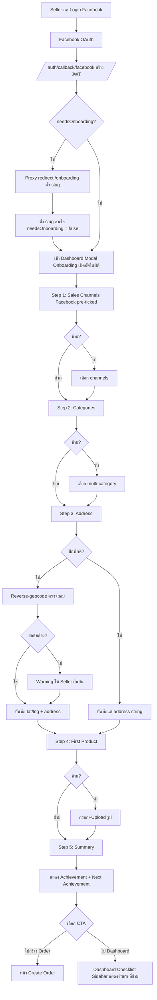
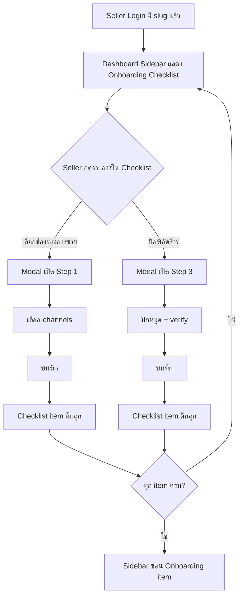

> **โมดูล:** M00001-LoginOnboarding
> **ประเภทเอกสาร:** Product Requirements Document (PRD)
> **เวอร์ชัน:** 1.0
> **วันที่จัดทำ:** 2026-06-18
> **สถานะ:** Draft
> **เจ้าของเอกสาร:** BA + PO + PM (ดู [[Feature-Docs-Ownership]])

# PRD: Login & Onboarding

---

## Executive Summary

ระบบ Login & Onboarding คือประตูแรกที่ Seller ทุกคนต้องผ่านเพื่อเข้าสู่แพลตฟอร์ม Deep ครอบคลุมตั้งแต่การสมัครสมาชิก / เข้าสู่ระบบ ไปจนถึงการตั้งค่าร้านค้าครั้งแรก (Onboarding) ปัจจุบัน Onboarding เป็นหน้าเต็มจอบังคับที่ Seller หนีไม่ได้ (force-redirect) ซึ่งสร้างแรงเสียดทานสูง เอกสารนี้กำหนดความต้องการสำหรับการออกแบบใหม่ทั้งระบบ: เปลี่ยน Onboarding เป็น **modal ที่ข้ามได้ทุก step** พร้อมเพิ่มความสามารถที่ยังขาด ได้แก่ การเลือกช่องทางการขาย, การเลือกหมวดหมู่หลายหมวดพร้อมกัน, การปักหมุดที่อยู่บนแผนที่พร้อมตรวจสอบความสอดคล้อง, ฟอร์มสร้างสินค้าที่ละเอียดยิ่งขึ้น และหน้าสรุปที่แสดง Achievement ที่ Seller จะได้รับ รวมถึง Onboarding checklist ใน Sidebar ที่คงอยู่จนกว่า Seller จะทำครบ ผลลัพธ์ทางธุรกิจหลักคือเพิ่ม Onboarding completion rate, ลดเวลาจาก signup ถึง first product, และสร้างความรู้สึกเป็นเจ้าของร้านตั้งแต่วันแรก

---

## 1. Business Goals & KPIs

### 1.1 เป้าหมายทางธุรกิจ

| เป้าหมาย | รายละเอียด |
|----------|-----------|
| **ลด Signup Friction** | เปลี่ยน Onboarding จาก force-redirect บังคับ เป็น modal ที่ข้ามได้ ให้ Seller เริ่มใช้งานแพลตฟอร์มได้เร็วขึ้น |
| **เพิ่ม Profile Completeness** | Checklist ใน Sidebar กระตุ้นให้ Seller กลับมาทำ Onboarding ให้ครบเองตามจังหวะที่สะดวก แทนการบังคับในครั้งเดียว |
| **เก็บ Sales Channel Data** | ระบบรู้ว่า Seller ขายผ่านช่องทางไหน → ช่วย targeting, feature recommendation, และ analytics |
| **เพิ่ม Trust Score ตั้งแต่เริ่ม** | ข้อมูลที่ครบ (ที่อยู่, หมวดหมู่, สินค้า) ช่วยให้ Seller มี Trust Score และ Achievement เร็วขึ้น ซึ่งดึงดูด Buyer |
| **รองรับ Multi-Category Shop** | ร้านที่ขายหลายหมวดต้องตั้งค่าได้ถูกต้องตั้งแต่แรก ลดการแก้ไขทีหลัง |

### 1.2 ตัวชี้วัดความสำเร็จ (KPIs)

| KPI | คำอธิบาย | เป้าหมาย |
|-----|----------|---------|
| **Onboarding Completion Rate** | % Seller ที่ทำ modal Onboarding ครบทุก step ที่เลือกทำ ภายใน 7 วันหลัง signup | ≥ 60% ภายใน 30 วันหลัง launch |
| **Time to First Product** | เวลา (นาที) นับจาก signup ถึงสร้าง product แรกสำเร็จ | ลดลง ≥ 30% จาก baseline ปัจจุบัน |
| **Maps Pin Rate** | % Seller ที่เลือกปักหมุดตำแหน่งบนแผนที่ (step ที่อยู่) | ≥ 40% ภายใน 90 วันหลัง launch |
| **Checklist Completion (7d)** | % Seller ที่ checklist item ทั้งหมดติ๊กถูกภายใน 7 วัน | ≥ 50% |
| **Sales Channel Coverage** | % Seller ที่เลือก sales channel ≥ 1 | ≥ 80% |
| **Seller Drop-off at Step** | % Seller ที่ออกจาก modal กลางคัน (แยก per-step) | < 20% ต่อ step |

---

## 2. User Personas (กลุ่มผู้ใช้งาน)

### 2.1 Seller ใหม่ — สมัครผ่าน Facebook

**ข้อมูลพื้นฐาน:**
- เพิ่งกด "เข้าสู่ระบบด้วย Facebook" เป็นครั้งแรก
- มีร้าน Facebook อยู่แล้ว คุ้นเคยกับการขายออนไลน์
- ยังไม่มีบัญชีบนแพลตฟอร์ม Deep

**เป้าหมาย:**
- อยากเริ่มใช้งาน Deep ได้เร็ว โดยไม่ต้องกรอกข้อมูลซ้ำที่มีใน Facebook แล้ว
- ต้องการดู dashboard หรือสร้าง order ก่อน โดยค่อยกรอก profile ทีหลัง

**ความต้องการ:**
- ระบบต้อง pre-fill channel "Facebook" ให้อัตโนมัติเมื่อ login ด้วย Facebook
- ข้าม step ที่ไม่จำเป็นได้
- ดู checklist ที่ยังค้างได้ใน Sidebar เมื่อสะดวก

**จุดปวด (Pain Points):**
- ระบบเดิม force-redirect ไป /onboarding ก่อนเข้าใช้งาน ทำให้รู้สึกถูกบังคับ
- ข้ามไม่ได้แม้แต่ step ที่ไม่เกี่ยวกับสิ่งที่ต้องการทำตอนนั้น

### 2.2 Seller ใหม่ — สมัครผ่าน Phone OTP

**ข้อมูลพื้นฐาน:**
- สมัครด้วยเบอร์โทรศัพท์ (เส้นทาง OTP ปัจจุบัน)
- อาจเป็น Seller ที่ขายหลายช่องทาง (LINE, TikTok ฯลฯ) ไม่ใช่แค่ Facebook

**เป้าหมาย:**
- ตั้งค่าร้านให้ครบเพื่อให้ Trust Score สูง
- อยากโชว์ว่าร้านตัวเองขายอะไรได้ชัดเจน (multi-category)

**ความต้องการ:**
- เลือกหลายหมวดหมู่ได้ในขั้นตอนเดียว
- เลือกช่องทางการขายที่ใช้จริงได้ครบ
- กรอกข้อมูลสินค้าได้ละเอียดตั้งแต่ onboarding รวมถึงอัปโหลดรูป

**จุดปวด (Pain Points):**
- ระบบเดิมเลือกหมวดหมู่ได้แค่หมวดเดียว ไม่ตรงกับความจริงของร้าน
- ฟอร์มสินค้าใน onboarding เดิมมีแค่ชื่อ+ราคา ไม่ครบสำหรับโชว์ลูกค้า

### 2.3 Seller เก่า — กลับมาใช้งานหลัง Redesign

**ข้อมูลพื้นฐาน:**
- มีบัญชีอยู่แล้ว ผ่าน onboarding เดิมแล้ว (มี slug แล้ว)
- แต่ข้อมูลที่เพิ่มใหม่ (sales channels, multi-category, maps pin) ยังว่างอยู่

**เป้าหมาย:**
- กรอกข้อมูลที่ขาดให้ครบเพื่อให้ profile สมบูรณ์

**ความต้องการ:**
- เห็น checklist ใน Sidebar ที่บอกว่าขาดอะไร
- กรอกข้อมูลที่ขาดจาก checklist ได้โดยตรง

**จุดปวด (Pain Points):**
- ไม่รู้ว่ายังขาดอะไร เพราะระบบเดิมไม่มี checklist progress แบบถาวร

---

## 3. Business Requirements

### 3.1 ช่องทางการสมัคร / เข้าสู่ระบบ (Login Methods)

**ความต้องการ:**
- Seller สมัครและเข้าสู่ระบบได้ 3 ช่องทาง: (1) username + password เป็นช่องทางหลัก, (2) Phone OTP, (3) Facebook OAuth
- Seller ที่ login ด้วย Facebook ครั้งแรกโดยไม่มีบัญชี → ระบบสร้างบัญชีให้อัตโนมัติ แล้วนำไปสู่ขั้นตอนตั้งค่าร้าน
- Seller ที่ login ด้วย Facebook และมีบัญชีอยู่แล้ว (match ด้วย provider account id) → เข้าสู่ dashboard ปกติ
- เบอร์โทรศัพท์ตั้งได้ครั้งเดียว เปลี่ยนไม่ได้ (phone immutable)
- ระบบต้องรองรับ reset password ผ่าน OTP

**Business Rules:**
- ช่องทาง username+password ใช้ bcrypt hash ไม่เก็บ plain text
- Phone เมื่อตั้งแล้ว → สร้าง L1 Verification (PHONE_OTP, APPROVED) อัตโนมัติ → ห้ามแก้ไขในภายหลัง
- Session ผูกกับ subdomain (seller.deepthailand.app) แยกจาก buyer และ admin
- Facebook OAuth ใช้ได้เฉพาะ production (https) ไม่ใช้ได้บน deepth.local

**เหตุผล:**
- Username+password เป็นช่องทางหลักเพราะ Seller ต้องการความเป็นส่วนตัวและไม่อยากผูกกับ Facebook ตลอดไป
- Phone immutable เพราะเบอร์โทรเป็นส่วนหนึ่งของ Trust Score — การเปลี่ยนเบอร์กระทบ identity และ Buyer History Linking

### 3.2 Onboarding Modal (แทนหน้าเต็มจอบังคับ)

**ความต้องการ:**
- Onboarding เปลี่ยนจากหน้าเต็มจอ force-redirect เป็น **modal** ที่เปิดขึ้นมาหลัง login
- **ทุก step ข้ามได้** ด้วยปุ่ม "ข้ามไปก่อน" หรือ "ทำทีหลัง"
- Modal ประกอบด้วย 5 step ตามลำดับ:
  1. ช่องทางการขาย (Sales Channels)
  2. หมวดหมู่ร้านค้า (Shop Categories — multi-select)
  3. ที่อยู่ร้าน (Address + optional map pin)
  4. สร้างสินค้าแรก (First Product — optional)
  5. สรุปและ Achievement (Summary)
- Seller ที่มี slug แล้ว (ผ่าน onboarding เดิม) → ระบบ **ไม่** force-redirect แต่ checklist ใน Sidebar ยังแสดง item ที่ขาดอยู่
- Seller ที่ยังไม่มี slug → ยังต้องตั้ง slug ก่อน (slug เป็น step บังคับเดียวที่ proxy gate คงไว้ เพราะระบบใช้ slug เป็น public URL)

**Business Rules:**
- Proxy gate (`needsOnboarding`) ยังคงทำงาน **เฉพาะกรณีไม่มี slug** — เมื่อมี slug แล้ว proxy gate ปล่อย Seller เข้า dashboard ได้
- การ "ข้าม" step ไม่บันทึกข้อมูลใด ๆ — ข้อมูล step นั้นยังว่างอยู่ใน DB
- Seller สามารถเปิด modal ซ้ำได้จาก checklist ใน Sidebar เพื่อกรอกข้อมูลที่ข้ามไป

**เหตุผล:**
- UX ที่บังคับ 100% สร้างแรงเสียดทานสูง อัตรา drop-off สูงในระบบเดิม
- การ skip ได้ทำให้ Seller เลือกทำตามลำดับความสำคัญของตัวเอง และกลับมาทำต่อได้โดย Sidebar คอย remind

### 3.3 ช่องทางการขาย (Sales Channels)

**ความต้องการ:**
- Seller เลือกช่องทางการขายที่ตนใช้จริงได้ มีตัวเลือก: Facebook, หน้าร้าน (offline), LINE, TikTok Shop, Lazada, Shopee
- เลือกได้หลายช่องพร้อมกัน (multi-select checkboxes หรือ chips)
- **Seller ที่ login ด้วย Facebook → ระบบติ๊ก "Facebook" ให้อัตโนมัติ** แต่ยังเปลี่ยนได้
- ข้อมูล sales channels บันทึกลงโปรไฟล์ร้านและแสดงใน public profile ของร้าน (ภายหลัง — Phase 2)

**Business Rules:**
- ตัวเลือก channels คงที่ (enum) กำหนดโดย Product team — Seller ไม่สามารถเพิ่ม channel เองได้
- ถ้า Seller ข้าม step นี้ → `salesChannels` เป็น array ว่างใน DB
- การ detect "login ด้วย Facebook" = ตรวจสอบ JWT provider ที่ใช้ login ครั้งล่าสุด

**เหตุผล:**
- ข้อมูล sales channels ช่วยให้ Deep เข้าใจ ecosystem ของ Seller และใช้ทำ analytics ว่าตลาดกระจายตัวอย่างไร
- Pre-fill Facebook ลด friction สำหรับ Seller ที่มาจาก Facebook เป็นหลัก

### 3.4 หมวดหมู่ร้านค้า (Multi-Category)

**ความต้องการ:**
- Seller เลือกหมวดหมู่ร้านได้ **มากกว่า 1 หมวด** (multi-select)
- รายการหมวดที่มีอยู่ปัจจุบัน 10 หมวด (จาก `shop-categories.ts`): ทั่วไป, แฟชั่น-เครื่องแต่งกาย, ความงาม-สุขภาพ, อาหาร-เครื่องดื่ม, อิเล็กทรอนิกส์-ไอที, บ้าน-เฟอร์นิเจอร์, แม่-เด็ก, เกษตร-OTOP, บริการ-ดิจิทัล, อื่นๆ
- UI แสดงเป็น chip/toggle ที่กด select/deselect ได้แต่ละหมวด

**Business Rules:**
- Schema ปัจจุบัน `Shop.category` เป็น `String?` (เดี่ยว) — ต้องแก้เป็น array หรือ relation ก่อน implement (dependency กับ [[DATABASE]])
- Seller เลือกได้สูงสุด N หมวด (ค่า N = Open Decision — ดูข้อ 10.3)
- ถ้า Seller ข้าม step → category ยังว่าง (backward-compat กับ Seller เดิมที่มี single category)

**เหตุผล:**
- ร้านค้าจริงหลายแห่งขายข้ามหมวด เช่น ขายทั้งเสื้อผ้าและเครื่องสำอาง การบังคับเลือกหมวดเดียวทำให้ข้อมูลไม่ตรงความจริง
- Multi-category ช่วยระบบ search/filter ในอนาคตได้แม่นยำขึ้น

### 3.5 ที่อยู่ร้าน + แผนที่ (Address + Map Pin)

**ความต้องการ:**
- Seller กรอกที่อยู่ด้วย ThaiAddressSearch autocomplete (มีอยู่แล้วในระบบ)
- มีตัวเลือก optional ให้ "ปักหมุดบนแผนที่" เพื่อระบุพิกัดที่แน่นอน
- **ระบบต้องตรวจสอบว่าที่อยู่ที่กรอกกับพิกัดที่ปักใกล้เคียงกัน** (กัน Seller ปักพิกัดในต่างประเทศแต่กรอกที่อยู่ไทย) โดยเปรียบเทียบจังหวัด/อำเภอจาก reverse-geocode ของพิกัด กับที่อยู่ที่กรอก
- ถ้าพิกัดกับที่อยู่ไม่สอดคล้อง → แสดง warning ให้ Seller ยืนยันหรือแก้ไข (ไม่ block การบันทึก)

**Business Rules:**
- พิกัดแผนที่เป็น optional — Seller ข้ามได้ (บันทึกแค่ `address` string ไม่มี lat/lng)
- ถ้าปักพิกัด → บันทึก lat/lng พร้อม address
- Threshold ความใกล้เคียง (ระยะ km หรือ reverse-geocode ระดับจังหวัด) = Open Decision — ดูข้อ 10.3
- Maps provider = Open Decision — ดูข้อ 10.3 (กระทบ cost และ API key)

**เหตุผล:**
- พิกัดที่แน่นอนช่วย Buyer ประเมินระยะทางจัดส่งและความน่าเชื่อถือว่าร้านอยู่จริง
- การตรวจสอบความสอดคล้องป้องกัน Seller ใส่ข้อมูลผิดโดยไม่ตั้งใจ หรือพยายามปลอมที่ตั้ง

### 3.6 สร้างสินค้าแรก (First Product — Enhanced)

**ความต้องการ:**
- ฟอร์มสร้างสินค้าใน Onboarding มี field ที่ละเอียดขึ้น: ชื่อสินค้า, SKU (optional), ราคา, คำอธิบาย (description), **รูปภาพ (drag & drop upload ได้ใน step นี้เลย)**
- Seller ข้าม step นี้ได้ทั้งหมด

**Business Rules:**
- รูปภาพ upload ผ่าน storage ที่มีอยู่แล้วใน `lib/storage`
- จำนวนรูปสูงสุดต่อสินค้า, ขนาดไฟล์สูงสุด = Open Decision — ดูข้อ 10.3
- Product type default = PHYSICAL (Seller เปลี่ยนได้ใน product catalog ภายหลัง)
- ถ้าข้าม step → ไม่สร้าง product ใด ๆ (checklist item "สร้างสินค้าแรก" ยัง pending)

**เหตุผล:**
- ฟอร์มสินค้าที่ครบกว่าใน onboarding ช่วยให้ Seller มี product พร้อมโชว์ Buyer เร็วขึ้น ลด time-to-first-product
- Drag & drop ลด friction การอัปโหลดรูปซึ่งเป็นขั้นตอนที่ทำให้หลายคนหยุดในระบบเดิม

### 3.7 สรุปและ Achievement (Summary Step)

**ความต้องการ:**
- Step สุดท้ายของ modal แสดงสรุปข้อมูลทั้งหมดที่กรอกใน session นี้ (channels, categories, address, product ถ้ามี)
- แสดง **Achievement ที่ Seller ได้รับจากการทำ Onboarding ครั้งนี้** (ถ้ามี) — เช่น badge "เปิดหน้าร้าน" (First Sale หรือ achievement ที่เกี่ยวกับ onboarding)
- แสดง **next achievement ที่ Seller จะได้ต่อไป** พร้อม progress ที่ยังขาด
- มีปุ่ม CTA ทางเลือก: "ไปหน้าสร้างคำสั่งซื้อ" เพื่อให้ Seller เริ่มใช้งานจริงได้ทันที

**Business Rules:**
- Achievement ที่แสดงในหน้าสรุปต้อง evaluate จาก badge engine จริง (**ไม่ hardcode**)
- "First Achievement จาก Onboarding" และ "Next Achievement ที่แนะนำ" = Open Decision — ดูข้อ 10.3
- ถ้า Seller ข้าม step ก่อนหน้าทั้งหมด → ไม่มี achievement ใหม่แสดง แต่ยังแสดง next achievement ที่ใกล้สุดได้

**เหตุผล:**
- การเห็น Achievement ทันทีหลัง onboarding สร้าง positive reinforcement และกระตุ้นให้ Seller กลับมาใช้งานต่อเนื่อง

### 3.8 Onboarding Checklist ใน Sidebar

**ความต้องการ:**
- เมื่อ Seller ยังทำ Onboarding ไม่ครบ → เมนูซ้าย (left sidebar) แสดง item "Onboarding" พร้อม **checklist**
- Checklist แสดงรายการ step ของ onboarding พร้อมสถานะ:
  - รายการที่ทำแล้ว = icon ติ๊กถูก (สีเขียว) พร้อมข้อความขีดฆ่า
  - รายการที่ยังไม่ทำ = วงกลมว่าง
- Seller กดที่รายการใน checklist เพื่อเปิด modal / ไปยังหน้าตั้งค่าที่เกี่ยวข้องได้โดยตรง
- เมื่อ checklist ครบ 100% → ซ่อน Sidebar item "Onboarding" ออก

**Business Rules:**
- Checklist items ที่นับว่า "ครบ" = Open Decision — ดูข้อ 10.3 (ต้องนิยามก่อน implement)
- Sidebar item "Onboarding" ต้องไม่ขัดกับ nav structure ปัจจุบันของ Paces layout

**เหตุผล:**
- Checklist ช่วย Seller ที่ข้าม step ระหว่าง onboarding รู้ว่ายังต้องทำอะไรอยู่ โดยไม่ต้องจำเอง
- Persistent reminder ที่ไม่ disruptive (ไม่ force-redirect) เป็น pattern ที่ใช้งานได้ดีใน SaaS

---

## 4. Business Rules & Constraints

### 4.1 กฎทางธุรกิจหลัก

| กฎ | คำอธิบาย |
|----|----------|
| **Slug บังคับ** | `Shop.slug` ต้องมีก่อน Seller เข้าใช้ dashboard ได้ — proxy gate (`needsOnboarding`) ยังคงบังคับเฉพาะจุดนี้ |
| **Phone Immutable** | เบอร์โทรตั้งได้ครั้งเดียว เปลี่ยนไม่ได้ เนื่องจากผูกกับ Trust Score และ Buyer History Linking |
| **Facebook Pre-fill** | Login ด้วย Facebook → pre-tick "Facebook" ใน sales channels อัตโนมัติ |
| **Badge Engine** | Achievement ที่แสดงใน Summary Step ต้องมาจาก badge engine จริง ไม่ hardcode |
| **Address-Map Consistency** | ถ้า Seller ปักพิกัด → ระบบ reverse-geocode เทียบกับจังหวัดในที่อยู่ที่กรอก และ warn ถ้าไม่สอดคล้อง |
| **Skip = No Save** | การข้าม step ไม่บันทึกค่าบางส่วน — ข้อมูล step นั้นยังว่างใน DB |
| **Checklist Disappears** | Sidebar item "Onboarding" ซ่อนเมื่อ item ทั้งหมดที่นิยามว่า "บังคับ" ครบ |

### 4.2 ข้อจำกัดทางธุรกิจ

| ข้อจำกัด | รายละเอียด |
|---------|-----------|
| **Schema Migration จำเป็น** | `Shop.category` (String เดี่ยว) → multi-category, เพิ่ม `salesChannels`, `latitude`, `longitude` — ต้องทำ migration ก่อน implement |
| **Facebook OAuth Production-only** | FB login ทดสอบบน production (https) เท่านั้น; dev environment ใช้ OTP แทน |
| **Maps ต้องใช้ API Key** | ถ้าเลือก Google Maps หรือ Longdo Map → ต้องจัดการ API key และค่าใช้จ่าย (ดู Open Decisions) |
| **Paces Theme** | ทุก UI ของ feature นี้ใน seller subdomain ต้องใช้ Paces primitive เท่านั้น ห้าม arbitrary Tailwind value |
| **Backward Compatibility** | Seller เก่าที่มี single `category` string ต้องยังใช้งานได้ระหว่าง migration |

### 4.3 เงื่อนไข Proxy Gate (ปัจจุบัน vs ใหม่)

| เงื่อนไข | พฤติกรรมปัจจุบัน | พฤติกรรมใหม่ |
|---------|-----------------|-------------|
| `needsRegistration=true` (ไม่มีเบอร์) | Force-redirect → /register | คงเดิม |
| `needsOnboarding=true` (ไม่มี slug) | Force-redirect → /onboarding (หน้าเต็มจอ) | Force-redirect → /onboarding เพื่อตั้ง slug; หลังจาก slug ผ่าน → modal onboarding เปิดอัตโนมัติ แต่ข้ามได้ |
| มี slug แล้ว แต่ขาดข้อมูลอื่น | ไม่มี gate | Checklist ใน Sidebar แสดง item ที่ยังขาด |

---

## 5. Out of Scope (นอกขอบเขต)

| หัวข้อ | คำอธิบาย |
|--------|----------|
| **Email + Password Login** | ตัดถาวร — ไม่อยู่ใน scope ทั้งระบบ (ดู PRD §2 User Stories) |
| **Multi-provider Linking หลัง Signup** | ผูก provider เพิ่มหลังสมัครแล้วไม่รองรับใน MVP |
| **การแสดง Sales Channels บน Public Profile** | เก็บข้อมูลใน MVP แต่การแสดงผลใน /u/{username} เป็น Phase 2 |
| **Phone Edit หลัง Set** | เบอร์โทร immutable — ไม่มี UI เปลี่ยนเบอร์ |
| **Paid Verified Badge** | Phase 2 (~฿299/เดือน) |
| **Username Cooldown (30 วัน)** | Feature แก้ username หลัง onboarding — Phase 2 |
| **FB App Review (scope `email`)** | ยังไม่ได้รับ public approval จาก FB — อนาคต |
| **Recurring billing / SUBSCRIPTION** | FR-6.10 — Phase 4 |
| **Redis OTP Store** | OTP ยัง in-memory — Phase 2 |
| **Admin Onboarding Analytics Dashboard** | ดู completion rate per-step แบบ real-time — Phase 2 |

---

## 6. Risks & Mitigation (ความเสี่ยงและแนวทางแก้ไข)

### 6.1 ความเสี่ยงทางธุรกิจ

| ความเสี่ยง | ผลกระทบ | ระดับความรุนแรง | แนวทางแก้ไข |
|-----------|---------|-----------------|-------------|
| **Seller ข้าม Onboarding ทั้งหมดและไม่กลับมาทำ** | Profile ว่าง Trust Score ต่ำ ลด Buyer trust | สูง | Checklist ใน Sidebar คอย remind; gamification ผ่าน achievement แสดง upside ที่ยังขาด |
| **Maps API Cost เกินงบ** | ค่าใช้จ่ายเพิ่มขึ้นหาก Seller ปักพิกัดจำนวนมาก | กลาง | เลือก provider ฟรีหรือต่ำต้นทุน (Leaflet+OSM) ก่อน; ดู Open Decisions |
| **Seller เข้าใจผิดว่า Onboarding บังคับ** | UX confusion จาก proxy gate slug vs modal ข้ามได้ | กลาง | Copy ชัดเจนว่า "ข้ามได้ ทำทีหลังก็ได้" + checklist remind ใน Sidebar |
| **Multi-category ทำให้ analytics ซับซ้อน** | Query ที่ filter ด้วย category อาจช้าลง | ต่ำ | เพิ่ม index บน category relation; รับรู้และแผน query optimization ใน DATABASE.md |

### 6.2 ความเสี่ยงทางเทคนิค

| ความเสี่ยง | ผลกระทบ | แนวทางแก้ไข |
|-----------|---------|-------------|
| **Schema Migration ล้มเหลวบน production DB** | Seller เดิมข้อมูลหาย หรือ service down | ทำ migration แบบ additive (เพิ่ม column ใหม่ ไม่ลบ category เดิมทันที); backfill ก่อน drop; ทดสอบบน staging |
| **Reverse-geocode API ช้า / ล่ม** | ตรวจสอบ address-map สอดคล้องกันไม่ได้ | Degrade gracefully: ถ้า reverse-geocode fail → ข้ามการตรวจสอบและ warn user ว่าตรวจสอบไม่ได้ชั่วคราว |
| **Badge Engine ยัง hardcode nameEN บางส่วน** | Achievement ใหม่จาก Onboarding อาจไม่ evaluate ถูกต้อง | ระบุใน DATABASE.md ว่า badge criteria ใดต้องเพิ่ม/แก้ไขก่อน launch; ทำ unit test badge evaluation |
| **Drag & Drop Upload ใน Modal** | UX ซับซ้อนใน mobile; storage cost เพิ่ม | จำกัดขนาดไฟล์และจำนวนรูป (ดู Open Decisions); fallback เป็น file picker ปกติถ้า drag&drop ไม่รองรับ |
| **Facebook Pre-fill Provider Detection** | JWT อาจไม่มี provider info หลัง session refresh | ออกแบบ fallback: ถ้าตรวจไม่ได้ → ไม่ pre-fill (ไม่ error) |

---

## 7. Glossary (อภิธานศัพท์)

| คำศัพท์ | ความหมาย |
|---------|----------|
| **Onboarding** | กระบวนการตั้งค่าร้านครั้งแรกหลัง Seller สมัครสมาชิก |
| **Slug** | URL ร้านค้าที่ Seller ตั้งเอง เช่น `deepthailand.app/shop/myshop`; unique ทั้งระบบ |
| **Sales Channels** | ช่องทางที่ Seller ใช้ขายสินค้า เช่น Facebook, LINE, Shopee |
| **Multi-Category** | ความสามารถเลือกหมวดหมู่ร้านได้มากกว่า 1 หมวด |
| **Phone Immutable** | กฎที่บังคับว่าเบอร์โทรของ Seller ตั้งได้ครั้งเดียว เปลี่ยนไม่ได้ |
| **Achievement Badge** | Badge ที่ระบบให้อัตโนมัติเมื่อ Seller ทำสำเร็จตามเงื่อนไข เช่น "เปิดหน้าร้าน" |
| **Badge Engine** | ระบบ data-driven ที่ evaluate เงื่อนไข Achievement จาก criteria JSON ใน DB |
| **Checklist** | รายการสิ่งที่ Seller ต้องทำใน Onboarding พร้อมสถานะ done/pending ที่แสดงใน Sidebar |
| **Proxy Gate** | Logic ใน `proxy.ts` ที่ตรวจ JWT flags (`needsRegistration`, `needsOnboarding`) แล้ว redirect Seller ไปยังหน้าที่ถูกต้อง |
| **Reverse-Geocode** | การแปลงพิกัด lat/lng กลับเป็นที่อยู่ข้อความ (ใช้ตรวจสอบความสอดคล้องกับที่อยู่ที่กรอก) |
| **force-redirect** | พฤติกรรมของ proxy ที่เด้ง Seller ไปยังหน้าบังคับโดยอัตโนมัติก่อนให้เข้า dashboard |
| **needsOnboarding** | JWT flag ที่ `= true` เมื่อ Seller ยังไม่มี `Shop.slug`; proxy gate ใช้ flag นี้ตัดสิน redirect |

---

## 8. Success Metrics (ตัวชี้วัดความสำเร็จ)

เมื่อระบบทำงานได้ดี ควรมีผลลัพธ์ดังนี้:

| ตัวชี้วัด | ค่าที่คาดหวัง | วิธีวัด |
|----------|---------------|--------|
| **Onboarding Completion Rate (7d)** | ≥ 60% ของ Seller ใหม่ทำ modal ครบ ≥ 3 step ภายใน 7 วัน | นับจาก event บันทึก step completion ใน DB |
| **Time to First Product** | ลดลง ≥ 30% จาก baseline | เปรียบ timestamp `createdAt` ของ User vs `createdAt` ของ Product แรก |
| **Maps Pin Rate** | ≥ 40% ของ Seller ที่ผ่าน step ที่อยู่ ปักพิกัดด้วย | นับ Seller ที่มี `latitude` ไม่ null |
| **Checklist Full Completion (30d)** | ≥ 50% ของ Seller ใหม่ทำ checklist ครบทุก item ภายใน 30 วัน | นับ Seller ที่ checklist progress = 100% |
| **Sales Channel Fill Rate** | ≥ 80% ของ Seller เลือก channel ≥ 1 | นับ Seller ที่ `salesChannels` ไม่ว่าง |
| **Drop-off per Step** | < 20% ต่อ step | วัดจาก event "step_started" vs "step_completed" แยก per step |
| **Achievement Earned on Day 1** | ≥ 30% ของ Seller ได้ achievement ≥ 1 ในวันแรก | นับ UserBadge ที่ `createdAt` ≤ signup + 1 วัน |

---

## 9. Dependencies & Assumptions

### 9.1 สิ่งที่ต้องพึ่งพา (Dependencies)

| ระบบ/ส่วนประกอบ | ความสัมพันธ์ |
|-----------------|-------------|
| **[[DATABASE]] (feature นี้)** | ต้องออกแบบ schema เปลี่ยน `category` → multi-category, เพิ่ม `salesChannels`, `latitude`, `longitude` ก่อน implement |
| **badge.service.ts** | Step สรุปดึง achievement จาก badge engine — ต้อง evaluate ถูกต้อง; badge criteria ต้องนิยาม "onboarding achievement" ก่อน |
| **lib/storage** | Upload รูปสินค้าใน step 4 — ต้องรองรับ drag & drop และจำกัดขนาด |
| **ThaiAddressSearch component** | ใช้ใน step ที่อยู่ (มีแล้ว) — ต้อง verify compatibility กับ modal layout |
| **proxy.ts** | ต้องแก้ logic guard ให้รองรับ "slug-only gate" และ modal pattern ใหม่ |
| **Maps Provider API** | ต้องเลือกและตั้งค่า API key ก่อน implement map pin feature (ดู Open Decisions) |
| **docs/PRD.md (ระบบรวม)** | auth/onboarding ปัจจุบัน — feature นี้ extend ไม่ replace |
| **docs/SRS.md (ระบบรวม)** | FR-4 Badge system spec — achievement criteria ต้อง trace กลับ SRS |

### 9.2 สมมติฐาน (Assumptions)

- Seller ที่ไม่ได้ login ด้วย Facebook ใน session ปัจจุบัน จะไม่มีการ pre-fill channel ใด ๆ (ไม่ใช้ข้อมูล AuthAccount เดิม)
- "Onboarding ครบ" สำหรับ proxy gate ยังนิยามเป็น "มี slug" เหมือนเดิม — checklist completion ไม่ส่งผลต่อ proxy
- Badge "เปิดหน้าร้าน" (First Sale) ไม่ trigger จาก onboarding เพียงอย่างเดียว — ยังต้องมี order CONFIRMED จริง
- ThaiAddressSearch ปัจจุบันคืน `address` เป็น string — ถ้าต้องการ structured address (province/amphoe) สำหรับ map verification ต้องแก้ component ให้คืนข้อมูล structured ด้วย
- Seller เดิมที่มี single `category` string จะถูก backfill เป็น array ที่มีค่าเดียวใน migration — ไม่ตัดข้อมูลเดิม

---

## 10. Appendix

### 10.1 ตัวอย่าง User Journey — Seller ใหม่ Login ด้วย Facebook

**Scenario: Seller ใหม่ login Facebook ครั้งแรก → ทำ Onboarding Modal ครบ 5 step**

1. Seller กด "เข้าสู่ระบบด้วย Facebook" บนหน้า sign-in
2. ระบบ redirect ไป Facebook OAuth → กลับมาที่ `/auth/callback/facebook`
3. JWT ถูกสร้าง: `needsOnboarding = true` (ยังไม่มี slug)
4. Proxy redirect → `/onboarding` เพื่อตั้ง slug
5. Seller ตั้ง slug สำเร็จ → `needsOnboarding` เป็น false → Proxy ปล่อยเข้า dashboard
6. Modal Onboarding เปิดอัตโนมัติ (step 1: Sales Channels) — ระบบ pre-tick "Facebook" ให้
7. Seller เลือก LINE เพิ่ม → กด "ถัดไป"
8. Step 2: เลือกหมวดหมู่ 2 หมวด (แฟชั่น + ความงาม) → กด "ถัดไป"
9. Step 3: ค้นหาที่อยู่ด้วย autocomplete → เลือก "เชียงใหม่" → ปักหมุดบนแผนที่ → ระบบ reverse-geocode ยืนยันตรงกัน → กด "ถัดไป"
10. Step 4: กรอกชื่อสินค้า + ราคา + drag & drop รูป 2 ใบ → กด "สร้างสินค้า"
11. Step 5 (สรุป): เห็น achievement "เปิดหน้าร้าน" (First Sale) ที่จะได้เมื่อ order แรก CONFIRMED + next achievement "ร้านค้ายอดนิยม" (Trusted Seller 50, เหลืออีก 50 orders)
12. Seller กด "ไปหน้าสร้างคำสั่งซื้อ" → modal ปิด → เข้าหน้า create order

### 10.2 ตัวอย่าง User Journey — Seller เก่ากลับมาทำ Checklist ที่ค้าง

**Scenario: Seller เดิมที่มี slug แล้ว แต่ยังไม่ได้เลือก Sales Channels และยังไม่ปักพิกัด**

1. Seller login → เข้า dashboard ปกติ (ไม่ force-redirect เพราะมี slug แล้ว)
2. Sidebar แสดง item "Onboarding" พร้อม checklist — มี 2 item ยังไม่ติ๊ก: "เลือกช่องทางการขาย" และ "ปักพิกัดร้าน"
3. Seller กดที่ "เลือกช่องทางการขาย" → modal เปิดที่ step 1 (Sales Channels)
4. Seller เลือก Shopee + LINE → บันทึก → modal ปิด → checklist item ติ๊กถูก
5. Seller กลับมาอีกวัน กดที่ "ปักพิกัดร้าน" → modal เปิดที่ step 3 (Address)
6. Seller ปักพิกัด → บันทึก → checklist item ติ๊กถูก → checklist ครบ → Sidebar ซ่อน item "Onboarding"

### 10.3 Open Decisions — ต้องตัดสินใจก่อนทำ BRD/SRS

รายการต่อไปนี้ต้องให้ user/ทีมตัดสินใจก่อนเริ่มเขียน BRD และ SRS เพื่อหลีกเลี่ยงการ invent business rule

**OD-1: Maps Provider**

ตัวเลือก:
- **Google Maps Platform** — API mature, geocoding แม่นยำ, มีค่าใช้จ่าย (pricing per request, ต้องตั้ง billing account)
- **Longdo Map** — Provider ไทย, รองรับภาษาไทยดี, มี free tier (ตรวจสอบ quota)
- **Leaflet + OpenStreetMap** — Open source ฟรี, geocoding ผ่าน Nominatim (rate-limited), แม่นยำในไทยน้อยกว่า

ผลต่อ: cost ของทีม, คุณภาพ reverse-geocode, API key management, ข้อกำหนด ToS

**OD-2: Reverse-Geocode Threshold (Address vs Pin Consistency)**

ต้องตัดสินใจว่านิยาม "สอดคล้องกัน" ว่าอย่างไร:
- ตัวเลือก A: เปรียบเทียบระดับจังหวัด (province) — ง่ายกว่า ยืดหยุ่นสูง
- ตัวเลือก B: เปรียบเทียบระดับอำเภอ (amphoe) — แม่นยำกว่า
- ตัวเลือก C: ระยะทาง (km) ระหว่างพิกัดกับ geocode ของที่อยู่ที่กรอก — ซับซ้อนกว่า ต้องการ forward-geocode ด้วย

และเมื่อ "ไม่สอดคล้อง" → block หรือแค่ warn? (PRD เสนอ warn ไม่ block แต่ต้องยืนยัน)

**OD-3: Achievement สำหรับ Onboarding**

ต้องนิยามว่า:
- Badge ไหนคือ "first achievement จาก onboarding" ที่แสดงใน Summary Step (ปัจจุบัน badge 10 ตัวไม่มีชิ้นที่ trigger จาก onboarding โดยตรง — "First Sale" ต้องการ order CONFIRMED จริง)
- ต้องการ badge ใหม่สำหรับ onboarding completion หรือใช้ badge เดิมที่ใกล้เคียง?
- Next Achievement ที่แนะนำ = คำนวณอัตโนมัติจาก progress ที่ใกล้สุด หรือ hardcode sequence?

**OD-4: Multi-Category Limit**

Seller เลือกหมวดหมู่ได้สูงสุดกี่หมวด? (เสนอ: 3 หมวด — ป้องกันเลือกทุกหมวดจนข้อมูลไร้ประโยชน์)

**OD-5: Image Upload Constraints (First Product Step)**

- ขนาดไฟล์สูงสุดต่อรูป (เสนอ: 5MB)
- จำนวนรูปสูงสุดต่อสินค้าในขั้นตอน onboarding (เสนอ: 5 รูป — เพิ่มเติมได้ในหน้า product catalog ภายหลัง)
- Format ที่ยอมรับ: JPG, PNG, WEBP?

**OD-6: นิยาม "Onboarding ครบ" สำหรับ Checklist**

Checklist ซ่อนเมื่อ item ครบ — แต่ต้องนิยามว่า item ไหน "บังคับ" (ครบแล้วซ่อน) vs "optional" (ทำหรือไม่ก็ได้ ยังแสดงสถานะ):

เสนอ:
- บังคับ: slug (มีอยู่แล้ว) + sales channels + categories
- Optional: address, map pin, product แรก

ต้องยืนยันกับ user ก่อน implement

**OD-7: Seller เดิม (ผ่าน onboarding หน้าเต็มจอแล้ว) — ต้องการ Modal ซ้ำไหม?**

Seller ที่ผ่าน onboarding เดิมแล้ว (มี slug, category เดิม, address เดิม) เมื่อ deploy redesign นี้:
- ตัวเลือก A: เปิด modal onboarding ใหม่อัตโนมัติ 1 ครั้งเพื่อกรอก fields ใหม่ (salesChannels, multi-category)
- ตัวเลือก B: ไม่เปิด modal อัตโนมัติ แต่ checklist ใน Sidebar แสดง item ที่ยังขาด

---

**หมายเหตุ:**
เอกสารนี้เป็นการบันทึกความต้องการทางธุรกิจ (Business Requirements) โดยไม่มีรายละเอียดทางเทคนิค
สำหรับ Functional Requirements / User Story / Acceptance Criteria ดู [[BRD]] ของโมดูลนี้
สำหรับ technical specification ดู [[SRS]] ของโมดูลนี้
สำหรับ schema changes ดู [[DATABASE]] ของโมดูลนี้
