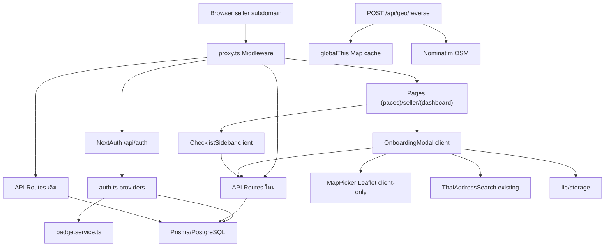
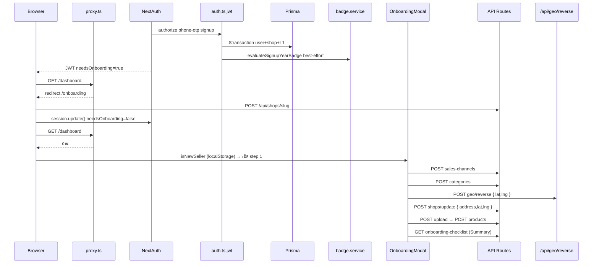
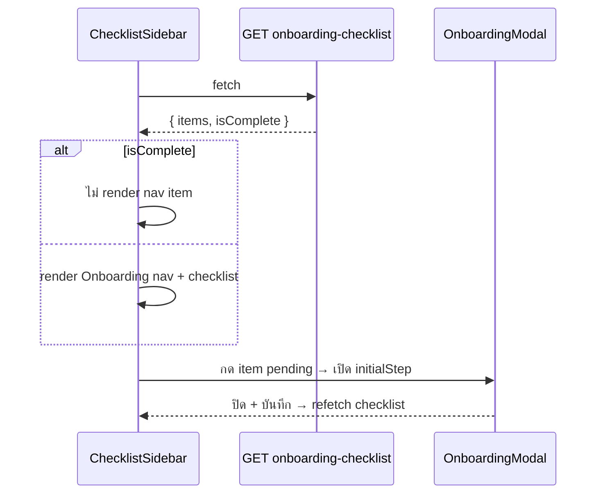
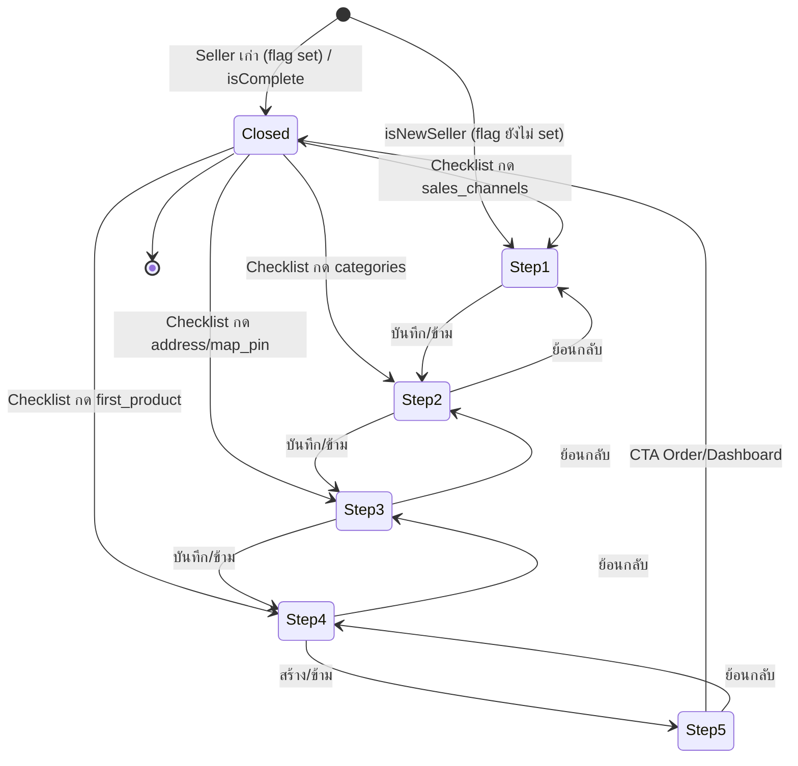
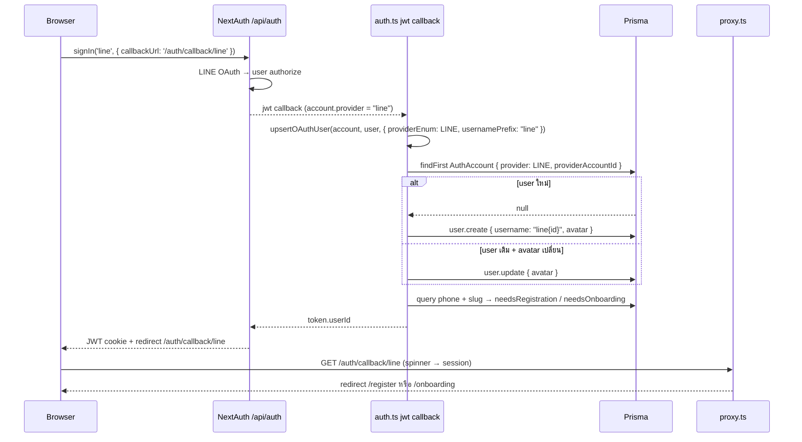

> **โมดูล:** M00001-LoginOnboarding
> **ประเภทเอกสาร:** System Design Spec (SDS)
> **เวอร์ชัน:** 1.1
> **วันที่จัดทำ:** 2026-06-18
> **สถานะ:** Draft
> **เจ้าของเอกสาร:** SA (ดู [[Feature-Docs-Ownership]])

# SDS: Login & Onboarding (System Design Spec)

---

## 1. บทนำ & References

### 1.1 วัตถุประสงค์

เอกสารนี้กำหนด **การออกแบบเชิงระบบ** ของ feature **Login & Onboarding (M00001)** เพื่อให้ DEV implement ได้โดยไม่ต้องเดา, QA วางแผนทดสอบ, safepay-database ประเมิน schema impact

SDS นี้ออกแบบ **สิ่งที่จะสร้างใหม่:**
- `OnboardingModal` client component 5 step + state machine + deep-link `initialStep`
- `MapPicker` Leaflet client-only (drag marker, emit lat/lng)
- `SalesChannelPicker`, `CategoryMultiSelect` (≤5), `ProductImageDropzone`, `ChecklistSidebar`
- `POST /api/geo/reverse` (Nominatim proxy), `POST /api/account/sales-channels`, `POST /api/account/categories`, `GET /api/account/onboarding-checklist`
- ขยาย `POST /api/shops/update` รับ lat/lng

**สิ่งที่ไม่แก้:** `src/proxy.ts` (slug-gate, TFR-005), `src/lib/auth.ts` (providers ทำงานแล้ว), `/onboarding` page (slug gate), `badge.service.ts`, `ThaiAddressSearch`

### 1.2 เอกสารอ้างอิง

| เอกสาร | ความสัมพันธ์ |
|--------|-------------|
| [[SRS]] | TFR-001..014 — requirements ที่ SDS realize |
| [[BRD]] | FR-LO-01..13, BR-01..18, AC |
| [[PRD]] | KPI, personas, OD-1..07 |
| [[DATABASE]] | migration salesChannels/categories[]/lat/lng/sku |
| [[API]] | endpoint contract เต็ม |
| `src/lib/auth.ts`, `src/proxy.ts`, `src/services/badge.service.ts`, `src/components/safepay/ThaiAddressSearch.tsx`, `src/app/(paces)/seller/(dashboard)/_seller-menu.ts` | โค้ดจริง |

---

## 2. Architecture Overview

feature นี้เป็น extension ของ Next.js App Router + service layer เดิม ไม่เพิ่ม subsystem ใหม่



### 2.1 Deploy View

- ทั้งหมดบน Vercel Serverless (Hobby)
- `proxy.ts` = Next.js Middleware (nodejs runtime)
- `globalThis` stores (rate-limit, geo cache, OTP) = per-instance best-effort (Redis = Phase 2)
- Leaflet โหลด `dynamic(() => import('./MapPicker'), { ssr: false })` เท่านั้น
- Storage: `s3` prod, `local` dev

---

## 3. Component Design

| Component | Responsibility | Dependency |
|-----------|----------------|------------|
| **`OnboardingModal`** | 5 step orchestration, useReducer state, dispatch API ต่อ step, prop `initialStep` deep-link | React, Paces dialog/card, pacesToast, Sweet Alerts |
| **`MapPicker`** | OSM map + drag marker → emit `{lat,lng}`; client-only | leaflet, dynamic ssr:false |
| **`SalesChannelPicker`** | multi-select chip 6 ตัว — pre-tick Facebook เมื่อ providerHint | React, Paces chip |
| **`CategoryMultiSelect`** | multi-select chip 10 หมวด — disable เมื่อ ≥5 | React, Paces chip, SHOP_CATEGORY_KEYS |
| **`ProductImageDropzone`** | drag&drop + validate (type/size/count) + upload → fileId[] | React, Paces card, lib/storage |
| **`ChecklistSidebar`** | fetch checklist → render nav item; กด item → เปิด modal initialStep; ซ่อนเมื่อ isComplete | React, useSession, VerticalLayout |
| **`POST /api/geo/reverse`** | Nominatim proxy — cache (globalThis), timeout 5s, User-Agent | Route Handler, fetch |
| **`GET /api/account/onboarding-checklist`** | query shop fields → checklist items + isComplete | Route Handler, Prisma, getServerSession |
| **`POST /api/account/sales-channels`** | validate + update salesChannels | Route Handler, Valibot |
| **`POST /api/account/categories`** | validate (1..5) + update categories | Route Handler, Valibot |
| **`POST /api/shops/update` (ขยาย)** | เพิ่ม lat/lng + XOR check | route ที่มีอยู่ |

---

## 4. Data Flow

### 4.1 Seller ใหม่ OTP Signup → Dashboard → Modal ครบ



### 4.2 ChecklistSidebar → Deep-link Modal



### 4.3 Nominatim Reverse-Geocode

```mermaid
sequenceDiagram
    participant MapPicker
    participant GeoAPI as /api/geo/reverse
    participant Cache as globalThis Map
    participant Nominatim
    MapPicker->>GeoAPI: POST { lat,lng }
    GeoAPI->>GeoAPI: validate ไทย (5-21, 97-106)
    GeoAPI->>Cache: lookup key round 3
    alt hit
        Cache-->>GeoAPI: { province }
    else miss
        GeoAPI->>Nominatim: GET /reverse (User-Agent, timeout 5s)
        alt ≤5s
            Nominatim-->>GeoAPI: address.state
            GeoAPI->>Cache: set
        else timeout/error
            GeoAPI-->>MapPicker: { province: null }
        end
    end
    GeoAPI-->>MapPicker: { province }
    MapPicker->>MapPicker: เทียบ province; ไม่ตรง+ไม่ null → warning (ไม่ block)
```

---

## 5. Component Design (รายละเอียด)

### 5.1 OnboardingModal — State Management



`useReducer` จัดการ step + per-step data:
```typescript
type ModalStep = 'sales_channels' | 'categories' | 'address' | 'first_product' | 'summary'
interface ModalState {
  currentStep: ModalStep
  selectedChannels: string[]; selectedCategories: string[]
  address: string; lat: number | null; lng: number | null
  productName: string; productSku: string; productPrice: string
  productDescription: string; productImageIds: string[]
  isLoading: boolean; completedSteps: Set<ModalStep>
}
```

prop `initialStep` รับจาก ChecklistSidebar (deep-link).
**isNewSeller:** ตรวจ `localStorage.getItem('onboarding_modal_shown_v1')` ที่ dashboard mount → ไม่มี → เปิด modal + set key. Seller เก่าก่อน launch → อาจเปิด 1 ครั้ง (ยอมรับ — ข้ามได้). **ต้องยืนยัน** (ดู §13 Open Q)

### 5.2 MapPicker — Leaflet Dynamic Import

- import `L` ภายใน component (ไม่ top-level) — กัน SSR
- `import 'leaflet/dist/leaflet.css'` ใน component
- default center ไทย (13.0, 101.0) zoom 6 → ปักแล้ว zoom 13
- props: `onLocationChange(lat, lng)`, `initialLat?`, `initialLng?`
- โหลดผ่าน `dynamic(..., { ssr: false })` ที่ OnboardingModal (lazy เมื่อถึง step 3)

### 5.3 ProductImageDropzone — Validate + Upload

validation client: type ∈ JPG/PNG/WEBP → size ≤5MB → count ≤5. upload ผ่าน `POST /api/upload` → fileId. fallback `<input type=file>` ซ่อน + ปุ่ม. Base: products/new-v2 ProductImagesCardV2

### 5.4 ChecklistSidebar — Layout Integration

2 แนวทาง (ต้อง explore `MenuItemType` + `VerticalLayout` ก่อน):
- **A (แนะนำ):** ChecklistSidebar เป็น children ใน DashboardLayout, overlay/fixed panel ใน page-content
- **B:** ขยาย `sellerMenuItems` เพิ่ม custom item — MenuItemType อาจไม่รองรับ custom renderer

props: `onOpenModal(initialStep)`. fetch + refetch หลัง modal ปิด

### 5.5 SalesChannelPicker — Facebook Pre-fill

```typescript
const SALES_CHANNEL_KEYS = ['facebook','offline','line','tiktok_shop','lazada','shopee'] as const
const SALES_CHANNEL_LABELS = { facebook:'Facebook', offline:'หน้าร้าน', line:'LINE', tiktok_shop:'TikTok Shop', lazada:'Lazada', shopee:'Shopee' }
```
providerHint จาก `useSession()`. **ต้องยืนยัน:** `session.user` ปัจจุบันไม่มี `provider` — ต้อง explore วิธี detect Facebook session

### 5.6 geo/reverse — Cache Design

globalThis Map, key = `${lat.toFixed(3)},${lng.toFixed(3)}` (~111m), TTL ยาว (geo stable). timeout AbortController 5s → `{ province: null, error: 'timeout' }`. User-Agent `deep-platform/1.0 shinobu22@outlook.com`

### 5.7 onboarding-checklist — Computation

```typescript
const shop = await prisma.shop.findUnique({ where:{userId}, select:{ slug, salesChannels, categories, address, latitude, _count:{select:{products:true}} } })
const items = [
  { key:'slug', done: shop.slug != null },
  { key:'sales_channels', done: (shop.salesChannels?.length ?? 0) >= 1 },
  { key:'categories', done: (shop.categories?.length ?? 0) >= 1 },
  { key:'address', done: !!shop.address?.trim() },
  { key:'map_pin', done: shop.latitude != null },
  { key:'first_product', done: shop._count.products >= 1 },
]
const isComplete = items.every(i => i.done)
```
**ต้องรอ [[DATABASE]] migration ก่อน deploy**

---

## 6. Error Handling Design

| Scenario | Behavior |
|----------|----------|
| Nominatim timeout/error | `{province:null}` → client ข้าม compare → submit ได้ |
| province ไม่ตรง | warning UI → ยืนยัน → submit (ไม่ block) |
| upload fail | pacesToast.error + ลบ preview; สร้างสินค้าได้ไม่มีรูป |
| badge error ใน Summary | catch → achievement section hidden (degrade) |
| API 401 | pacesToast + reload → sign-in |
| API 400 | pacesToast แสดง message จาก response |
| API 429 | pacesToast.warning |
| ThaiAddressSearch load fail | fallback textarea (มีใน component) |
| Leaflet load fail | map error + retry; address ยังบันทึกได้ |
| localStorage unavailable | isNewSeller=true ทุก load → ข้ามได้ (acceptable) |

---

## 7. File Structure

### ไฟล์ใหม่
```
src/app/(paces)/seller/(dashboard)/dashboard/components/
  OnboardingModal.tsx, OnboardingModal.types.ts, MapPicker.tsx,
  SalesChannelPicker.tsx, CategoryMultiSelect.tsx, ProductImageDropzone.tsx, ChecklistSidebar.tsx
src/app/api/account/sales-channels/route.ts
src/app/api/account/categories/route.ts
src/app/api/account/onboarding-checklist/route.ts
src/app/api/geo/reverse/route.ts
```

### ไฟล์แก้ไข
```
src/app/api/shops/update/route.ts   ← เพิ่ม lat/lng + XOR check
src/lib/validations.ts              ← เพิ่ม schemas ใหม่
src/app/(paces)/seller/(dashboard)/dashboard/page.tsx  ← mount Modal + Sidebar + isNewSeller
src/app/(paces)/seller/(dashboard)/layout.tsx          ← (อาจ) slot ChecklistSidebar
```

### ไม่แก้
```
src/proxy.ts, src/lib/auth.ts, src/app/(paces)/seller/onboarding/page.tsx,
src/services/badge.service.ts, src/components/safepay/ThaiAddressSearch.tsx
```

---

## 8. Auth / Permission Rules

| Endpoint | Session | Guard |
|----------|---------|-------|
| POST sales-channels / categories / shops/update / geo/reverse / GET onboarding-checklist | seller | getServerSession → 401; scoped `shop.userId === session.user.id` |
| GET check-slug | none | public (rate-limit 100/min) |

ทุก mutation ผ่าน `guardApi` (CSRF + rate-limit) อัตโนมัติ. Seller ตรวจ ownership ก่อน update (DAL)

---

## 9. Database Impact

**ต้อง dispatch `safepay-database` ก่อน implement** — `Shop.salesChannels String[]`, `Shop.categories String[]` (backfill จาก `category`), `Shop.latitude/longitude Float?`, `Product.sku String?` (Open Q). ลำดับ: migrate → backfill → user approve deploy (prod/dev แชร์) → restart dev server. **ห้าม implement** endpoint ที่ใช้ field ใหม่ก่อน migration

---

## 10. Technical Decisions

- **TD-001:** OnboardingModal = Client Component (ไม่ใช่ route) — proxy slug-gate แยกแล้ว; deep-link ผ่าน prop
- **TD-002:** isNewSeller = localStorage `onboarding_modal_shown_v1` (ไม่เพิ่ม DB field/JWT)
- **TD-003:** Nominatim = server-side proxy (User-Agent + cache + กัน CORS)
- **TD-004:** Leaflet dynamic ssr:false ที่ Modal (lazy step 3, ~150KB)
- **TD-005:** validation client (Yup) + server (Valibot) — defense in depth
- **TD-006:** lat+lng XOR check ที่ route handler (ไม่ใช่ Valibot cross-field)

---

## 11. Traceability Matrix

| SRS TFR | SDS Component / file |
|---------|----------------------|
| TFR-001..005 | auth.ts / proxy.ts (existing ไม่แก้) |
| TFR-006 | OnboardingModal.tsx + dashboard/page.tsx isNewSeller |
| TFR-007 | SalesChannelPicker + /api/account/sales-channels |
| TFR-008 | CategoryMultiSelect + /api/account/categories |
| TFR-009 | MapPicker + ThaiAddressSearch + ขยาย /api/shops/update |
| TFR-010 | /api/geo/reverse + globalThis geoCache |
| TFR-011 | ProductImageDropzone + /api/products + /api/upload |
| TFR-012 | OnboardingModal Step5 + getBadgeProgress |
| TFR-013 | /api/account/onboarding-checklist |
| TFR-014 | ChecklistSidebar + layout integration |

---

## 12. Implementation Order (แนะนำ)

1. **[[DATABASE]] migration** (database agent ก่อน) — Shop fields + Product.sku
2. **validations.ts** — schemas ใหม่ (ไม่ผูก DB)
3. **API routes** (batch ≤3 หลัง migration): sales-channels, categories, geo/reverse, ขยาย shops/update, onboarding-checklist
4. **Client components** (batch ≤3): MapPicker (อิสระ), SalesChannelPicker + CategoryMultiSelect (อิสระ), ProductImageDropzone
5. **OnboardingModal** — ประกอบ + wire (รอ 4)
6. **ChecklistSidebar** — wire checklist + callback
7. **dashboard/page.tsx** — mount + isNewSeller

---

## 13. Open Questions (ต้องยืนยันก่อน implement)

1. **isNewSeller detection:** localStorage `onboarding_modal_shown_v1` vs timestamp compare — ถ้า Seller เก่าเปิด modal ครั้งแรกเป็นปัญหา Controller ตัดสิน
2. **Facebook provider detection ใน session:** `session.user` ไม่มี `provider` — ต้อง explore session callback ก่อน implement SalesChannelPicker pre-fill
3. **ChecklistSidebar integration:** แนวทาง A (overlay) vs B (menu item) — explore MenuItemType + VerticalLayout
4. **ThaiAddressSearch province parse:** ต้อง expose `onAddressChange(composed, structured)` แทน `onChange(composed)` เดียว เพื่อให้ step 3 เข้าถึง province — **ยืนยันก่อนแก้ interface**
5. **Badge SIGNUP_YEAR backfill:** auth.ts เรียก evaluate ทุก sign-in → lazy award เองได้ (ไม่ต้อง migration script)

---

## 14. สรุป

SDS กำหนด component design, data flow, sequence, file structure จริงใน `src/`, auth rules, DB impact, implementation order. ลำดับ build: database migration → validations → API batch → client components batch → OnboardingModal → ChecklistSidebar → dashboard integration. Known risks: migration prod (additive + approve), Nominatim ล่ม (degrade warn ไม่ block), Leaflet bundle (lazy step 3)

---

## 15. LINE + Instagram OAuth — System Design Extension (v1.1)

### 15.1 Sequence Diagram — LINE Login



### 15.2 Dynamic Callback Route
สร้าง `/auth/callback/[provider]/page.tsx` (reuse spinner ของ FB เดิม) — seller (Paces) + buyer (Vuexy). ปุ่ม LINE ชี้ `callbackUrl: '/auth/callback/line'`, IG ชี้ `/auth/callback/instagram`.

### 15.3 Button Placement
| Surface | ไฟล์ | Theme | LINE | IG |
|---|---|---|---|---|
| seller sign-in | `(paces)/seller/auth/sign-in/...` | Paces auth/split | live | flag-gated |
| buyer sign-in | `(marketing)/auth/sign-in/...` | Vuexy | live | flag-gated |
| buyer sign-up | `(marketing)/auth/sign-up/...` | Vuexy | live | flag-gated |
ปุ่ม LINE สีเขียว `#06C755` (brand asset, Hard Rule 6, comment กำกับ). ปุ่ม IG render เฉพาะ `NEXT_PUBLIC_ENABLE_IG_LOGIN === 'true'`.

### 15.4 next.config.ts
เพิ่ม remotePatterns: `profile.line-scdn.net`, `*.cdninstagram.com`.

### 15.5 Files Affected
สร้าง: `src/app/(paces)/seller/auth/callback/[provider]/page.tsx`, `src/app/(marketing)/auth/callback/[provider]/page.tsx`
แก้: `src/lib/auth.ts` (providers + upsertOAuthUser refactor), 3 หน้า sign-in/up (ปุ่ม), `next.config.ts`
ไม่แก้: `src/proxy.ts`, `prisma/schema.prisma`

### 15.6 Implementation Order
1) auth.ts (upsertOAuthUser + LineProvider + InstagramProvider) → 2) next.config.ts → 3) callback [provider] route → 4) ปุ่ม LINE 3 หน้า (ผ่าน safepay-ux gate ก่อน — Hard Rule 8) → 5) IG flag-off component → 6) env + LINE console (user)
