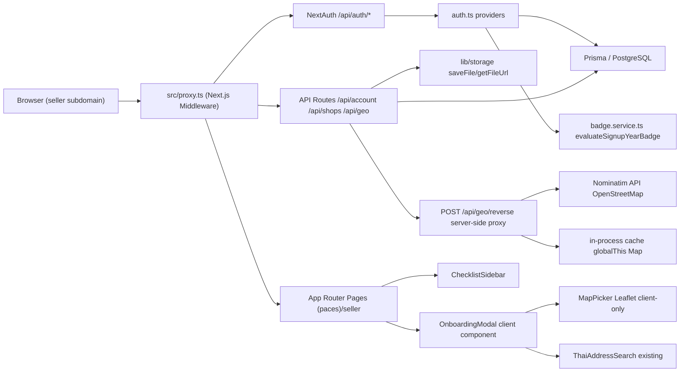
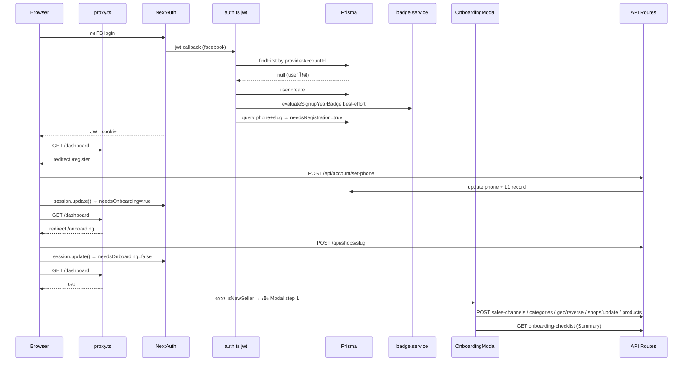
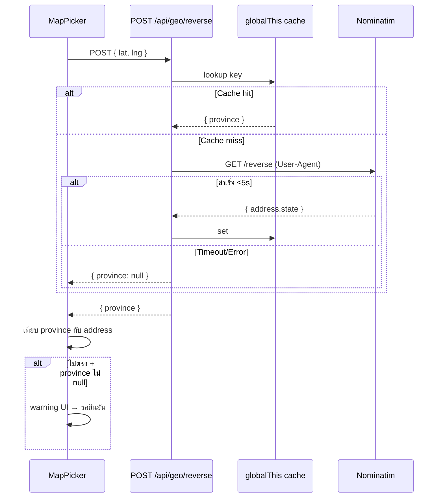
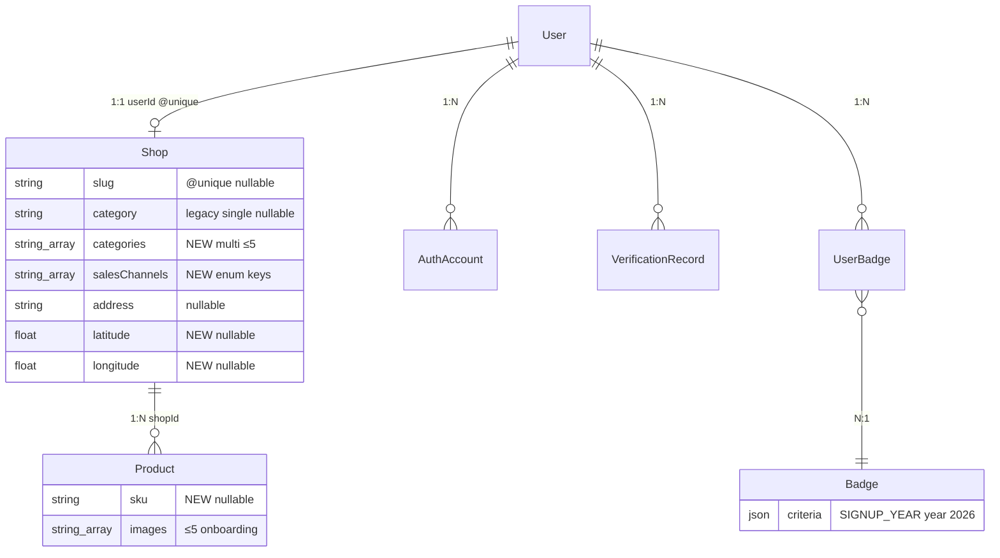
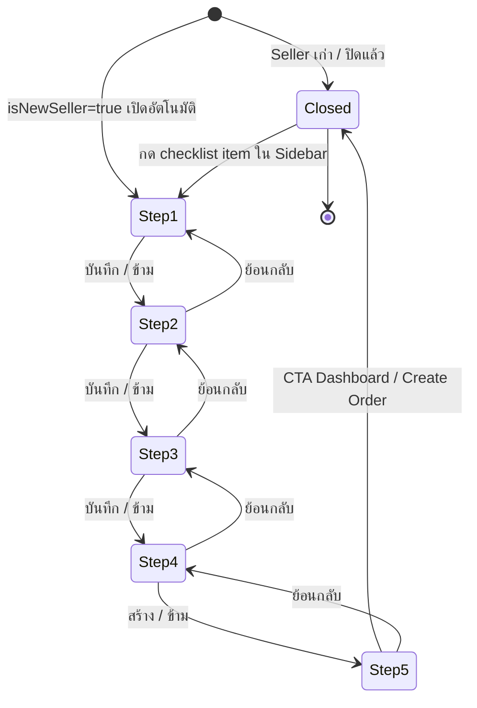
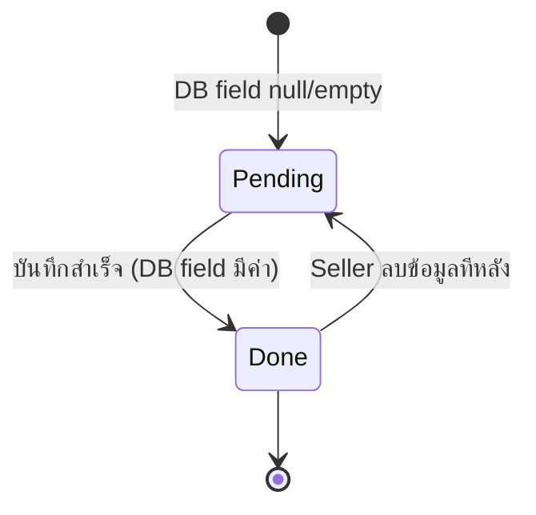

> **โมดูล:** M00001-LoginOnboarding
> **ประเภทเอกสาร:** Software Requirements Specification (SRS) — TECHNICAL
> **เวอร์ชัน:** 1.1
> **วันที่จัดทำ:** 2026-06-18
> **สถานะ:** Draft
> **เจ้าของเอกสาร:** SA (ดู [[Feature-Docs-Ownership]])

# SRS: Login & Onboarding (Software Requirements Specification — Technical)

---

## 1. บทนำ (Introduction)

### 1.1 วัตถุประสงค์ของเอกสาร

เอกสารนี้กำหนดข้อกำหนดเชิงเทคนิคสำหรับระบบ **Login & Onboarding (M00001)** ของแพลตฟอร์ม Deep ครอบคลุม (1) กลไก authentication ทั้ง 5 ช่องทาง, (2) proxy gate logic ที่ `src/proxy.ts`, (3) Onboarding Modal 5 step พร้อม state machine, (4) Nominatim reverse-geocode proxy server-side, (5) Checklist computation และ Sidebar integration, (6) validation rules ฝั่ง backend (Valibot) ทุก endpoint ใหม่, (7) badge evaluation ใน Summary step, และ (8) LINE/Instagram OAuth (FR-LO-14/FR-LO-15)

ผู้อ่านเป้าหมาย: DEV ผู้ implement, QA ผู้ออกแบบ test case, safepay-database ผู้ออกแบบ schema, Controller ผู้วางแผน dispatch

เอกสารนี้ trace กลับ FR-LO-01 ถึง FR-LO-15 ใน [[BRD]] และ Resolved Decisions OD-1 ถึง OD-7 ใน [[PRD]] §10.3

### 1.2 ขอบเขตเชิงระบบ (System Scope)

**ในขอบเขต:**
- `src/lib/auth.ts` — NextAuth providers (phone-otp, seller-credentials, facebook, line, instagram)
- `src/proxy.ts` — proxy gate logic (slug-only, needsRegistration, needsOnboarding)
- `src/app/(paces)/seller/` — หน้า auth (sign-in, sign-up, verify-otp, reset-pass, new-pass), onboarding page, dashboard
- Onboarding Modal — client component 5 step (Sales Channels, Categories, Address+Map, First Product, Summary)
- ChecklistSidebar — sidebar nav integration แสดง progress
- API routes ใหม่: `POST /api/account/sales-channels`, `POST /api/account/categories`, `POST /api/shops/update` (เพิ่ม lat/lng), `POST /api/geo/reverse`, `POST /api/products` (onboarding path), `GET /api/account/onboarding-checklist`
- API routes ที่มีอยู่แล้วและใช้ต่อ: `POST /api/account/set-phone`, `POST /api/account/shop-info`, `GET /api/shops/check-slug`, `POST /api/shops/slug`
- `src/services/badge.service.ts` — `evaluateSignupYearBadge` + next achievement computation
- Nominatim reverse-geocode server-side proxy (cache + timeout + User-Agent)

**นอกขอบเขต:**
- Email+Password login (ตัดถาวร — FR-1.6 ใน docs/SRS.md)
- Multi-provider linking หลัง signup
- Phone edit หลัง set
- Redis OTP store (Phase 2)
- Admin analytics dashboard per-step
- SUBSCRIPTION product type (FR-6.10 Phase 4)

### 1.3 เอกสารอ้างอิง (References)

| เอกสาร | ความสัมพันธ์ |
|--------|-------------|
| [[PRD]] ของโมดูลนี้ | เป้าหมายธุรกิจ, KPI, personas, Resolved Decisions OD-1..OD-7 |
| [[BRD]] ของโมดูลนี้ | Functional Requirements FR-LO-01..FR-LO-13, Business Rules BR-01..BR-18, Acceptance Criteria |
| [[DATABASE]] ของโมดูลนี้ | Schema migration: salesChannels, categories array, latitude, longitude |
| `docs/SRS.md` (ระบบรวม) | FR-1 Auth, FR-4 Badge, NFR — feature นี้ extend ไม่ replace |
| `docs/10 - Business Rules/Tier Lists.md` | Trust Tier mapping (อ่านก่อนแตะ Trust Score) |
| `src/lib/auth.ts` | NextAuth implementation ปัจจุบัน |
| `src/proxy.ts` | Proxy gate logic ปัจจุบัน |
| `src/services/badge.service.ts` | Badge engine + evaluateSignupYearBadge |
| `src/lib/validations.ts` | Valibot schemas ปัจจุบัน |

### 1.4 นิยามและตัวย่อ (Definitions & Acronyms)

| คำ/ตัวย่อ | ความหมาย |
|-----------|----------|
| **needsOnboarding** | JWT flag = `true` เมื่อ `Shop.slug` เป็น null; proxy gate ใช้ redirect ไป /onboarding |
| **needsRegistration** | JWT flag = `true` เมื่อ `User.phone` เป็น null (FB user ที่ยังไม่ set phone); proxy redirect ไป /register |
| **Proxy Gate** | Logic ใน `src/proxy.ts` ตรวจ JWT flags แล้ว redirect seller ไปหน้าที่ถูกต้อง |
| **Onboarding Modal** | Client component 5 step ที่เปิดอัตโนมัติหลัง slug ผ่าน proxy gate ครั้งแรก |
| **Checklist** | รายการ onboarding items พร้อมสถานะ done/pending derived จาก DB fields จริง |
| **SIGNUP_YEAR** | Badge criteria type ที่ evaluate ตอน signup — award ถ้า `User.createdAt` อยู่ในปีที่กำหนด |
| **Nominatim** | OpenStreetMap reverse-geocoding API ฟรี (ต้องเคารพ rate-limit + User-Agent policy) |
| **Leaflet** | JavaScript map library (OSM tiles, client-side, ไม่มี API key) |
| **ThaiAddressSearch** | Component ที่มีอยู่แล้วใน `src/components/safepay/ThaiAddressSearch.tsx` — autocomplete ที่อยู่ไทย คืน string |
| **L1** | VerificationRecord level 1 (PHONE_OTP, auto-approve) สร้างเมื่อตั้งเบอร์สำเร็จ |
| **best-effort** | pattern ที่ error จาก operation นั้นไม่ทำให้ parent operation fail (badge eval, linkBuyerHistory) |
| **atomic transaction** | Prisma `$transaction` — ถ้า step ใด fail ทั้งหมด rollback |
| **SSOT** | Single Source of Truth |
| **guardApi** | Middleware function ใน `src/proxy.ts` ที่ทำ CSRF Origin-check + rate-limit ทุก `/api` (ยกเว้น `/api/auth/*`) |

---

## 2. ภาพรวมสถาปัตยกรรม (Architecture Overview)

### 2.1 บริบทระบบ (System Context)



### 2.2 องค์ประกอบหลัก (Components)

| Component | หน้าที่ | Submodule / Stack |
|-----------|---------|-------------------|
| **`src/proxy.ts`** | Middleware: CSRF guard, rate-limit, proxy gate (needsRegistration/needsOnboarding), subdomain rewrite | Next.js Middleware (nodejs runtime) |
| **`src/lib/auth.ts`** | NextAuth providers: phone-otp, seller-credentials, facebook; JWT + session callbacks | NextAuth.js v4 |
| **`src/lib/password.ts`** | bcryptjs hash/verify; isStrongPassword policy | bcryptjs |
| **`src/lib/shop-slug.ts`** | normalizeSlug, isValidSlugFormat, isReservedSlug | pure function |
| **`src/lib/shop-categories.ts`** | SHOP_CATEGORY_KEYS enum (10 หมวด), isShopCategory | pure constant |
| **`src/lib/validations.ts`** | Valibot schemas ทุก API endpoint | Valibot |
| **`src/services/badge.service.ts`** | evaluateSignupYearBadge, checkFirstOrder, getBadgeProgress | Prisma |
| **`OnboardingModal`** | Client component 5 step, state machine, dispatch API calls | React, Paces Preline |
| **`MapPicker`** | Leaflet map ปักพิกัด (client-only dynamic import) | Leaflet + OSM tiles |
| **`ThaiAddressSearch`** | Autocomplete ที่อยู่ไทย (existing, reuse) | thai-address-database |
| **`ChecklistSidebar`** | Sidebar nav item + checklist progress (derived จาก DB) | React, Paces layout |
| **`ProductImageDropzone`** | Drag & drop + file picker upload รูปสินค้า | React, lib/storage |
| **`SalesChannelPicker`** | Multi-select chip สำหรับ sales channels | React, Paces chip |
| **`CategoryMultiSelect`** | Multi-select chip สำหรับ categories ≤5 | React, Paces chip |
| **`POST /api/geo/reverse`** | Server-side Nominatim proxy (cache + timeout + User-Agent) | Next.js Route Handler |
| **`GET /api/account/onboarding-checklist`** | Checklist computation จาก DB fields จริง | Next.js Route Handler |

### 2.3 มุมมองการ Deploy (Deployment View)

ระบบรันบน Vercel (Hobby tier) + Supabase PostgreSQL (prod/dev แชร์ DB เดียวกัน — ควรแยกในอนาคต)

- `src/proxy.ts` รันเป็น **Next.js Middleware** (nodejs runtime, ทุก request ผ่าน) — ไม่รองรับ Edge runtime เพราะ Prisma ต้องการ nodejs
- API routes รันเป็น Vercel Serverless Functions — in-memory stores (`globalThis`) เป็น best-effort per-instance (Redis = Phase 2)
- Nominatim cache อยู่ใน `globalThis` ของ serverless instance — hit rate ขึ้นอยู่กับ instance warm
- Leaflet โหลดแบบ `dynamic(() => import('./MapPicker'), { ssr: false })` เท่านั้น — ไม่มี SSR สำหรับ map component (Leaflet ต้องการ window)
- Storage: `STORAGE_DRIVER=s3` บน prod (Supabase Storage หรือ S3), `local` บน dev

---

## 3. ข้อกำหนดเชิงฟังก์ชันเชิงเทคนิค (Technical Functional Requirements)

### TFR-001: Username + Password Login — Rate-limit + bcrypt guard

- **Trace to:** FR-LO-01 (BRD)
- **คำอธิบายเชิงเทคนิค:** Provider `seller-credentials` ใน `src/lib/auth.ts`. ก่อน DB query ตรวจ (1) `credentials.password.length > 1000` → `return null` ทันที (bcrypt CPU DoS guard); (2) sliding-window rate-limit 5 attempts / 10 min per `username`. หลัง rate-limit: `prisma.user.findUnique({ where: { username } })` → ตรวจ `!user.isAdmin && user.isShop && user.passwordHash != null` → `verifyPassword(password, hash)` จาก `src/lib/password.ts`
- **Precondition:** User มี `isShop=true`, `passwordHash != null`, `isAdmin=false`
- **Postcondition:** คืน `{ id, name, email }` ให้ JWT callback สร้าง session; JWT มี `needsOnboarding`, `needsRegistration`
- **Error / Edge cases:** กรอก password ผิดหรือไม่มี user → `return null` (generic — กัน user enumeration); rate-limit เกิน → `return null` โดยไม่ตรวจ bcrypt; bcrypt throw → `return null` (catch internal)

### TFR-002: Phone OTP Signup — Atomic Transaction User+Shop+L1

- **Trace to:** FR-LO-02 (BRD)
- **คำอธิบายเชิงเทคนิค:** Provider `phone-otp`, `mode=signup`. หลัง `verifyOtp` ผ่าน → ห่อใน `prisma.$transaction`: (1) `user.create` พร้อม nested `authAccounts.create` (PHONE) + `verifications.create` (PHONE_OTP, L1, APPROVED); (2) `shop.create`; (3) `user.update` (`isShop=true`, `passwordHash` ถ้ามี). หลัง transaction: (a) `linkBuyerHistory(userId, phone)` best-effort; (b) `evaluateSignupYearBadge(userId)` best-effort. P2002 unique constraint → catch → `return null`
- **Precondition:** OTP ถูกต้องและยังไม่หมดอายุ (in-memory OTP store)
- **Postcondition:** User + Shop + L1 VerificationRecord อยู่ใน DB; JWT `needsOnboarding=true`; badge SIGNUP_YEAR evaluated best-effort
- **Error / Edge cases:** Transaction fail → rollback ทั้งหมด (ไม่มี orphan); badge error ไม่ทำ login พัง; `shopName.length > 100` → `return null` ก่อน transaction

### TFR-003: Facebook OAuth Signup/Login — avatar + evaluateSignupYearBadge

- **Trace to:** FR-LO-03 (BRD)
- **คำอธิบายเชิงเทคนิค:** `jwt` callback ตรวจ `account?.provider === "facebook"`. (1) หา user ด้วย `authAccounts.some({ provider: FACEBOOK, providerAccountId })`. (2) ไม่พบ → `user.create` (username=`fb${providerAccountId}`, avatar=`profile.picture?.data?.url`) + `linkBuyerHistory` best-effort + `evaluateSignupYearBadge` best-effort. (3) พบแล้ว + รูปเปลี่ยน → `user.update({ avatar })`. หลัง set userId: query `user.phone` + `shop.slug` → set `token.needsRegistration`, `token.needsOnboarding`
- **Precondition:** Facebook OAuth สำเร็จ (production https เท่านั้น)
- **Postcondition:** User มีอยู่ใน DB; JWT flags ตรงสถานะ; avatar อัปเดตถ้าเปลี่ยน
- **Error / Edge cases:** FB user ไม่มี email → `email: undefined`; badge error ไม่กระทบ jwt callback; avatar URL null → `avatar` ไม่ถูก set

### TFR-004: Reset Password ผ่าน OTP

- **Trace to:** FR-LO-04 (BRD)
- **คำอธิบายเชิงเทคนิค:** `POST /api/account/set-password`. Validate `SetPasswordSchema` (phone regex + OTP length 6 + PasswordSchema). `verifyOtp(phone, otp)` → `hashPassword(newPassword)` → `prisma.user.update({ where: { phone }, data: { passwordHash } })`. `isStrongPassword`: ≥8 chars, มีตัวอักษร+ตัวเลข+อักขระพิเศษ, ≤1000 chars
- **Precondition:** User มีเบอร์โทรที่ตรงกับ `phone`
- **Postcondition:** `passwordHash` อัปเดต bcrypt round 10
- **Error / Edge cases:** OTP ผิด/หมดอายุ → 401; phone ไม่มี → 404; password ไม่ผ่าน policy → 400

### TFR-005: Proxy Gate — Slug-Only Mandatory (ไม่เปลี่ยนจากปัจจุบัน)

- **Trace to:** FR-LO-05 (BRD)
- **คำอธิบายเชิงเทคนิค:** Logic ใน `src/proxy.ts` seller subdomain. ลำดับ: (1) `!isAuthed` → `/auth/sign-in`; (2) `!isExempt` (ไม่ start `/auth`, `/api`) → `token.needsRegistration` → `/register`; (3) `token.needsOnboarding` → `/onboarding`; (4) `!needsOnboarding && startsWith('/onboarding')` → `/dashboard`. **ไม่เปลี่ยน** จากปัจจุบัน — Modal ทำงาน client-side หลัง proxy ผ่าน
- **Precondition:** Seller authed + pathname ไม่ใช่ /auth หรือ /api
- **Postcondition:** ไม่มี slug → /onboarding; มี slug → ผ่าน dashboard
- **Error / Edge cases:** `needsRegistration` สำคัญกว่า `needsOnboarding` (ตรวจก่อน); `/api/auth/*` ยกเว้นเสมอ

### TFR-006: Onboarding Modal — เปิดอัตโนมัติ client-side หลัง Slug ผ่าน

- **Trace to:** FR-LO-06 (BRD), OD-7 (PRD)
- **คำอธิบายเชิงเทคนิค:** Dashboard page ตรวจ `session.user.needsOnboarding === false` + flag `isNewSeller`. ถ้า `isNewSeller && !modalShown` → เปิด `OnboardingModal`. Seller เก่า → ไม่มี flag → modal ไม่เปิด (OD-7). **ต้องยืนยัน:** ใช้ localStorage `onboarding_modal_shown_v1` หรือ DB field
- **Precondition:** Seller มี slug; เป็น Seller ใหม่
- **Postcondition:** Modal เปิด step 1; flag set กันเปิดซ้ำ
- **Error / Edge cases:** refresh ระหว่างทำ → ไม่เปิดซ้ำ; Seller เก่า → ไม่เปิด

### TFR-007: Step 1 — Sales Channels (POST /api/account/sales-channels)

- **Trace to:** FR-LO-07 (BRD)
- **คำอธิบายเชิงเทคนิค:** Endpoint ใหม่. Validate `SalesChannelsSchema`: `channels: v.array(v.picklist(SALES_CHANNEL_KEYS))` — ไม่มีขั้นต่ำ. อัปเดต `Shop.salesChannels` (field ใหม่). Facebook pre-fill: client pre-tick ถ้า session `provider=facebook`; ตรวจไม่ได้ → ไม่ pre-fill (BR-07)
- **Postcondition:** `Shop.salesChannels` อัปเดต; Checklist "ช่องทางการขาย" = done ถ้า ≥1
- **Error / Edge cases:** channel ไม่อยู่ใน enum → 400; array ว่าง = valid; skip ไม่เรียก API
- **SALES_CHANNEL_KEYS:** `facebook`, `offline`, `line`, `tiktok_shop`, `lazada`, `shopee`

### TFR-008: Step 2 — Categories Multi-select ≤5 (POST /api/account/categories)

- **Trace to:** FR-LO-08 (BRD), OD-4 (PRD)
- **คำอธิบายเชิงเทคนิค:** Endpoint ใหม่. Validate: `categories: v.pipe(v.array(v.picklist(SHOP_CATEGORY_KEYS)), v.minLength(1), v.maxLength(5))`. อัปเดต `Shop.categories` (field ใหม่). Client disable chip เมื่อ selected ≥5. Backend reject ถ้าเกิน 5. Backward-compat: backfill `category` เดิม → array (responsibility [[DATABASE]])
- **Postcondition:** `Shop.categories` อัปเดต; Checklist "หมวดหมู่" = done ถ้า ≥1
- **Error / Edge cases:** >5 → 400; key ผิด → 400; skip ไม่เรียก API

### TFR-009: Step 3 — Address + Map Pin (POST /api/shops/update พร้อม lat/lng)

- **Trace to:** FR-LO-09 (BRD), OD-1, OD-2 (PRD)
- **คำอธิบายเชิงเทคนิค:** ขยาย `POST /api/shops/update` รับ `latitude?, longitude?`. Validate: `latitude: v.optional(v.pipe(v.number(), v.minValue(5), v.maxValue(21)))`, `longitude: v.optional(v.pipe(v.number(), v.minValue(97), v.maxValue(106)))` (ขอบเขตไทย). **Address-Map Consistency (OD-2):** client-side ล้วน — หลังปักพิกัด client เรียก `POST /api/geo/reverse` → เทียบ province จาก Nominatim กับจังหวัดใน address string → ไม่ตรง = warning → Seller ยืนยัน → submit ตาม lat/lng ที่ปัก (warn ไม่ block)
- **Postcondition:** `Shop.address` + optional lat/lng; Checklist "ที่อยู่" done ถ้า address ไม่ว่าง; "ปักพิกัด" done ถ้า latitude ไม่ null
- **Error / Edge cases:** lat/lng นอกขอบเขต → 400; lat โดยไม่มี lng → 400; Nominatim ล่ม → client degrade → submit ได้

### TFR-010: Nominatim Reverse-Geocode Server-Side Proxy

- **Trace to:** FR-LO-09 (BRD), OD-1, OD-2 (PRD)
- **คำอธิบายเชิงเทคนิค:** Endpoint ใหม่ `POST /api/geo/reverse`. รับ `{ lat, lng }`. server-side proxy เพื่อ (1) กัน CORS; (2) ใส่ `User-Agent: deep-platform/1.0 shinobu22@outlook.com` ตาม Nominatim policy; (3) cache in-process (globalThis Map, key=`${lat_r},${lng_r}` round 3 ทศนิยม) TTL ยาว; (4) timeout 5s → `{ province: null, error: "timeout" }`. **URL:** `https://nominatim.openstreetmap.org/reverse?format=jsonv2&lat={lat}&lon={lng}&accept-language=th`. ดึง `address.state` (จังหวัด)
- **Postcondition:** คืน `{ province: string | null }`
- **Error / Edge cases:** out of range → 400; Nominatim ล่ม/timeout → `{ province: null }` (ไม่ใช่ 5xx); cache hit → skip call

### TFR-011: Step 4 — First Product with Images (POST /api/products)

- **Trace to:** FR-LO-10 (BRD), OD-5 (PRD)
- **คำอธิบายเชิงเทคนิค:** ใช้ `POST /api/products`. เพิ่ม `sku` (optional) ใน schema (ดู [[DATABASE]] Open Q). `type` default PHYSICAL. รูป upload ผ่าน `POST /api/upload` ก่อน → ได้ fileId → ส่ง `images: [...]`. ProductImageDropzone validate client: `file.type` ∈ JPG/PNG/WEBP, ≤5MB, ≤5 รูป. Server validate: `images: v.pipe(v.array(...), v.maxLength(5))`
- **Postcondition:** Product สร้าง; Checklist "สร้างสินค้าแรก" done ถ้า count ≥1
- **Error / Edge cases:** >5MB/format ผิด → client reject ก่อน upload; รูปที่ 6 → client block; skip → ไม่เรียก API

### TFR-012: Step 5 — Summary + Badge Engine

- **Trace to:** FR-LO-11 (BRD), OD-3 (PRD)
- **คำอธิบายเชิงเทคนิค:** Summary ดึงจาก (1) local state ของ modal; (2) `GET /api/account/onboarding-checklist`. Badge: ดึง `UserBadge` ที่ `earnedAt` ≥ เวลาเข้า modal. next achievement: `getBadgeProgress(userId, 'SELLER')` → badge ที่ยังไม่ได้ + progress สูงสุด. **ห้าม hardcode** (BR-13)
- **Postcondition:** แสดง achievement + next; CTA ปิด modal → redirect
- **Error / Edge cases:** badge error → summary ไม่มี achievement section (degrade)

### TFR-013: Checklist Computation — Derived จาก DB (GET /api/account/onboarding-checklist)

- **Trace to:** FR-LO-12, FR-LO-13 (BRD), OD-6 (PRD)
- **คำอธิบายเชิงเทคนิค:** Endpoint ใหม่. Query `shop.findUnique({ select: { slug, salesChannels, categories, address, latitude, _count: { products } } })`. Map เป็น checklist items:

| Item | Field | Done condition |
|------|-------|----------------|
| URL ร้าน (Slug) | `shop.slug` | `!= null` |
| ช่องทางการขาย | `shop.salesChannels` | `length >= 1` |
| หมวดหมู่ | `shop.categories` | `length >= 1` |
| ที่อยู่ | `shop.address` | `!= null && != ""` |
| ปักพิกัด | `shop.latitude` | `!= null` |
| สร้างสินค้าแรก | `shop._count.products` | `>= 1` |

`isComplete = items.every(i => i.done)`. **ไม่มี flag แยก** ใน schema
- **Error / Edge cases:** ไม่มี Shop → 404; field ใหม่ยังไม่ migrate → **ห้าม implement ก่อน migration**

### TFR-014: ChecklistSidebar — Integration กับ Paces Layout

- **Trace to:** FR-LO-12 (BRD), OD-6, OD-7 (PRD)
- **คำอธิบายเชิงเทคนิค:** เพิ่ม `ChecklistSidebar` fetch `GET /api/account/onboarding-checklist`. `!isComplete` → render nav item + checklist dropdown; `isComplete` → ไม่ render. กด item pending → เปิด `OnboardingModal` ที่ step ที่ตรงกัน (prop `initialStep`)
- **Error / Edge cases:** API error → ซ่อน nav item; Seller เก่า → checklist แสดงแต่ modal ไม่เปิดอัตโนมัติ

---

## 4. ข้อกำหนดส่วนต่อประสาน (Interface / API Specification)

### 4.1 API Endpoints

| Method | Path | คำอธิบาย | Auth | Rate-limit |
|--------|------|----------|------|-----------|
| `POST` | `/api/account/sales-channels` | บันทึก sales channels | seller session | guardApi (30/min) |
| `POST` | `/api/account/categories` | บันทึก categories array (≤5) | seller session | guardApi (30/min) |
| `POST` | `/api/shops/update` | อัปเดต address + lat/lng (ขยาย) | seller session | guardApi (30/min) |
| `POST` | `/api/geo/reverse` | Nominatim reverse-geocode proxy | seller session | guardApi (30/min) |
| `POST` | `/api/products` | สร้างสินค้าแรก (existing, +SKU +maxImages=5) | seller session | guardApi (30/min) |
| `GET` | `/api/account/onboarding-checklist` | Checklist computation | seller session | guardApi (30/min) |
| `POST` | `/api/account/set-phone` | ตั้งเบอร์ (existing, immutable) | seller session | guardApi (30/min) |
| `POST` | `/api/account/shop-info` | displayName/username/category (existing) | seller session | guardApi (30/min) |
| `GET` | `/api/shops/check-slug` | ตรวจ slug ว่าง (existing) | none | guardApi (100/min) |
| `POST` | `/api/shops/slug` | ตั้ง slug (existing) | seller session | guardApi (30/min) |

### 4.2 รายละเอียดต่อ Endpoint (สรุป — contract เต็มดู [[API]])

**POST /api/account/sales-channels** — req `{ "channels": ["facebook","line"] }` → 200 `{ "ok": true }`; 400/401/404/403
**POST /api/account/categories** — req `{ "categories": ["fashion","beauty_health"] }` → 200; 400 ถ้าเกิน 5
**POST /api/shops/update** — req `{ "address": "...", "latitude": 18.79, "longitude": 98.98 }` → 200; 400 lat/lng นอกขอบเขต
**POST /api/geo/reverse** — req `{ "lat": 18.79, "lng": 98.98 }` → 200 `{ "province": "เชียงใหม่" }` หรือ `{ "province": null, "error": "timeout" }`
**GET /api/account/onboarding-checklist** — 200 `{ items: [{key,label,done}...], isComplete: bool }`

### 4.3 Events / Messaging

ไม่ใช้ event queue / message broker — side-effect synchronous best-effort ภายใน request เดียว

### 4.4 Sequence ของ flow สำคัญ

**Flow: Seller ใหม่ Facebook Login → Onboarding Modal ครบ**



**Flow: Nominatim Reverse-Geocode**



---

## 5. ข้อกำหนดด้านข้อมูล (Data Requirements)

### 5.1 Data Model / Entities

| Entity | คำอธิบาย | Store |
|--------|----------|-------|
| **User** | phone (immutable), username, passwordHash | PostgreSQL |
| **Shop** | เพิ่ม `salesChannels String[]`, `categories String[]`, `latitude Float?`, `longitude Float?` | PostgreSQL |
| **VerificationRecord** | L1 PHONE_OTP auto-approved | PostgreSQL |
| **Badge / UserBadge** | badge definition + criteria; sticky award | PostgreSQL |
| **Product** | เพิ่ม `sku String?` (Open Q) | PostgreSQL |

### 5.2 ERD (entities ที่แตะ)



### 5.3 Migration / Data Lifecycle

ทั้งหมด dependency กับ [[DATABASE]] — สรุป impact: เพิ่ม `Shop.salesChannels/categories/latitude/longitude`, backfill `categories` จาก `category` เดิม (additive, ไม่ drop), seed/rename Badge "สมาชิกผู้ก่อตั้ง 2026" (มี row อยู่แล้ว). apply ด้วย `prisma migrate deploy -e .env.local` + ขอ user ยืนยัน (prod = dev Supabase แชร์)

---

## 6. ข้อกำหนดที่ไม่ใช่ฟังก์ชัน (Non-Functional Requirements)

| ด้าน | ข้อกำหนด | เป้าหมายที่วัดได้ |
|------|----------|-------------------|
| **Performance** | Modal แต่ละ step respond ≤3s | API p95 ≤3s; Nominatim timeout 5s |
| **Availability** | Nominatim ล่ม → degrade gracefully | feature ไม่ขึ้นกับ Nominatim |
| **Security — Login** | bcrypt DoS guard; rate-limit 5/10min | password>1000 → reject; ≥5 fail → 401 |
| **Security — API** | CSRF Origin-check; guardApi | unauth 100/min, auth 30/min; 403 ถ้า origin ผิด |
| **Security — Phone** | immutable enforce API | 409 ถ้ามี phone แล้ว |
| **Security — Image** | server validate format+size | ปฏิเสธ non-image; ≤5MB; ≤5 รูป |
| **Atomicity** | User+Shop+L1 ใน 1 transaction | ไม่มี orphan ถ้า fail |
| **Best-effort** | badge + linkBuyerHistory ไม่ทำ login พัง | catch + log; flow ต่อ |
| **Nominatim Policy** | User-Agent + cache; ≤1 req/sec | cache key round 3 ทศนิยม |
| **Backward Compat** | category string เดิมยังใช้ได้ | additive migration |
| **Maintainability** | ห้าม hardcode badge ใน client | achievement จาก engine + DB |

---

## 7. ข้อจำกัดทางเทคนิคและการพึ่งพา (Technical Constraints & Dependencies)

### 7.1 ข้อจำกัดทางเทคนิค

- **Paces Theme Strict** (Hard Rule 7) — ห้าม arbitrary value
- **Leaflet = client-only** — dynamic import `{ ssr: false }` เสมอ
- **Nominatim ≤1 req/sec** + User-Agent + cache
- **Facebook OAuth production-only**
- **In-memory stores (globalThis)** = per-instance (Redis = Phase 2)
- **Toast/Dialog** — `pacesToast` + Sweet Alerts (Hard Rule 9)
- **Schema migration ก่อน implement** — endpoint ที่ใช้ field ใหม่จะ error ถ้ายังไม่ migrate

### 7.2 การพึ่งพา

| Dependency | ประเภท | ความเสี่ยง |
|------------|--------|------------|
| **[[DATABASE]]** | internal | migration เสร็จก่อน implement API ใหม่ |
| **badge.service.ts (evaluateSignupYearBadge, getBadgeProgress)** | internal | มีอยู่แล้ว; ต้อง confirm getBadgeProgress signature |
| **ThaiAddressSearch** | internal | มีอยู่แล้ว; ต้องยืนยัน composed string มี province parse ได้ |
| **Leaflet npm** | external | ต้องติดตั้ง `leaflet @types/leaflet` |
| **thai-address-database** | external | มีอยู่แล้ว |
| **Nominatim OSM** | external | free; ล่มได้ → degrade |
| **lib/storage** | internal | มีอยู่แล้ว |
| **validations.ts** | internal | เพิ่ม schemas ใหม่ |

### 7.3 สมมติฐานทางเทคนิค

- `ThaiAddressSearch` composed string มี province parse ได้ — ถ้าไม่ → แก้ component ให้คืน structured
- Nominatim `address.state` (ไทย) ตรงรูปแบบจังหวัดที่ ThaiAddressSearch ใช้ — ต้องทดสอบ
- `POST /api/upload` รองรับ image upload คืน fileId
- `getBadgeProgress` signature ต้อง read source จริงก่อน implement
- session `shopSlug` ใช้ตรวจ isNewSeller ได้

---

## 8. State Machine

### 8.1 Onboarding Modal



Deep-link จาก Checklist: `sales_channels`→Step1, `categories`→Step2, `address`/`map_pin`→Step3, `first_product`→Step4

### 8.2 Checklist Item



Done/Pending ขึ้นกับ DB fields จริง (TFR-013) — ไม่ใช่ flag แยก; Done กลับ Pending ได้ถ้าลบข้อมูล (เช่น ลบสินค้าหมด)

---

## 9. Validation Rules (Valibot — Backend)

Schemas ใหม่ใน `src/lib/validations.ts`:

```typescript
const SALES_CHANNEL_KEYS = ['facebook','offline','line','tiktok_shop','lazada','shopee'] as const
export const SalesChannelsSchema = v.object({
  channels: v.array(v.picklist(SALES_CHANNEL_KEYS)), // empty = valid
})
export const CategoriesSchema = v.object({
  categories: v.pipe(
    v.array(v.picklist(SHOP_CATEGORY_KEYS)),
    v.minLength(1, "ต้องเลือกอย่างน้อย 1 หมวด"),
    v.maxLength(5, "เลือกได้สูงสุด 5 หมวด"),
  ),
})
export const ShopUpdateWithGeoSchema = v.object({
  category: v.optional(ShopCategorySchema),
  address: v.optional(v.pipe(v.string(), v.trim(), v.minLength(1), v.maxLength(500))),
  latitude: v.optional(v.pipe(v.number(), v.minValue(5), v.maxValue(21))),
  longitude: v.optional(v.pipe(v.number(), v.minValue(97), v.maxValue(106))),
  // lat+lng ต้องมาคู่กัน — custom check ที่ route handler
})
export const GeoReverseSchema = v.object({
  lat: v.pipe(v.number(), v.minValue(5), v.maxValue(21)),
  lng: v.pipe(v.number(), v.minValue(97), v.maxValue(106)),
})
export const OnboardingProductSchema = v.object({
  name: v.pipe(v.string(), v.minLength(1), v.maxLength(200)),
  sku: v.optional(v.pipe(v.string(), v.maxLength(100))),
  price: v.pipe(v.number(), v.minValue(0.01)),
  description: v.optional(v.pipe(v.string(), v.maxLength(5000))),
  type: v.optional(v.literal('PHYSICAL')),
  images: v.optional(v.pipe(v.array(v.pipe(v.string(), v.minLength(1), v.maxLength(200))), v.maxLength(5)), []),
})
```

**Frontend (Yup):** SalesChannelPicker ไม่มีขั้นต่ำ; CategoryMultiSelect disable เมื่อ ≥5; ProductImageDropzone validate type/size/count ก่อน upload

---

## 10. ความเสี่ยงเชิงสถาปัตยกรรม (Architectural Risks)

| ความเสี่ยง | ผลกระทบ | แนวทางลด |
|-----------|---------|----------|
| **Schema migration ล้มเหลว prod** | API field ใหม่พัง | additive nullable; backfill; test dev ก่อน; user approve |
| **Nominatim ล่ม/ban IP** | ตรวจ consistency ไม่ได้ | degrade (warn ไม่ block); cache; ไม่ warn ถ้า api ไม่ตอบ |
| **Leaflet bundle size** | step 3 ช้า | dynamic import ssr:false; โหลดเฉพาะ step 3 |
| **ThaiAddressSearch province parse** | compare ไม่ได้ | ทดสอบ format; แก้ component ถ้าจำเป็น |
| **globalThis cache Vercel** | per-instance hit ต่ำ | ยอมรับ (Redis Phase 2); TTL ยาว |
| **isNewSeller detection** | modal เปิดผิด | localStorage flag; test account เก่า |
| **Badge SIGNUP_YEAR backfill** | Seller ปี 2026 ก่อน launch ไม่ได้ badge | migration script หรือ lazy evaluate ใน Summary |

---

## 11. Traceability Matrix

| BRD FR-ID | SRS TFR-ID | Component |
|-----------|------------|-----------|
| FR-LO-01 | TFR-001 | auth.ts seller-credentials |
| FR-LO-02 | TFR-002 | auth.ts phone-otp |
| FR-LO-03 | TFR-003 | auth.ts jwt callback |
| FR-LO-04 | TFR-004 | /api/account/set-password |
| FR-LO-05 | TFR-005 | proxy.ts |
| FR-LO-06 | TFR-006 | OnboardingModal (dashboard) |
| FR-LO-07 | TFR-007 | /api/account/sales-channels + SalesChannelPicker |
| FR-LO-08 | TFR-008 | /api/account/categories + CategoryMultiSelect |
| FR-LO-09 | TFR-009, TFR-010 | /api/shops/update, /api/geo/reverse, MapPicker, ThaiAddressSearch |
| FR-LO-10 | TFR-011 | /api/products, ProductImageDropzone |
| FR-LO-11 | TFR-012 | OnboardingModal Step5 + badge.service |
| FR-LO-12 | TFR-013, TFR-014 | /api/account/onboarding-checklist + ChecklistSidebar |
| FR-LO-13 | TFR-013 | onboarding-checklist computation |
| FR-LO-14 | TFR-015 | auth.ts LineProvider + upsertOAuthUser |
| FR-LO-15 | TFR-016 | auth.ts InstagramProvider (flag-off) |

---

## 12. สรุป + ประเด็นที่ต้องยืนยันก่อน implement

ครอบคลุม auth 3 ช่อง + security guards, proxy slug-gate (ไม่เปลี่ยน), Modal 5 step + state machine, Nominatim proxy (cache/timeout/degrade), address-map check ระดับจังหวัด (warn ไม่ block), checklist derived จาก DB, badge SIGNUP_YEAR + next achievement (data-driven), validation ครบ, schema migration dependencies → [[DATABASE]]

**ต้องยืนยันก่อน implement:**
1. `ThaiAddressSearch` composed string มี province parse ได้หรือไม่ → ถ้าไม่ ต้องแก้ interface
2. `getBadgeProgress` signature จริงจาก `badge.service.ts`
3. "isNewSeller" detection — localStorage `onboarding_modal_shown_v1` (เลือกไว้) ต้อง confirm
4. Migration backfill SIGNUP_YEAR badge ของ Seller ปี 2026 ก่อน launch → ระบุใน [[DATABASE]]
5. `POST /api/upload` รองรับ server-side image validation หรือไม่ — ถ้าไม่ ต้องเพิ่ม

---

## 13. LINE + Instagram OAuth — Technical Specification (v1.1 extension)

### 13.1 Provider Configuration
เพิ่ม `LineProvider({ clientId: process.env.LINE_CHANNEL_ID, clientSecret: process.env.LINE_CHANNEL_SECRET })` + `InstagramProvider({ clientId: process.env.INSTAGRAM_CLIENT_ID, clientSecret: process.env.INSTAGRAM_CLIENT_SECRET })` ใน `authOptions.providers` (import จาก `next-auth/providers/line` และ `next-auth/providers/instagram`).

### 13.2 Environment Variables
| Variable | Provider | Required | หมายเหตุ |
|---|---|---|---|
| `LINE_CHANNEL_ID` | LINE | yes (live) | LINE Developers Console Channel ID |
| `LINE_CHANNEL_SECRET` | LINE | yes (live) | LINE Developers Console Channel Secret |
| `INSTAGRAM_CLIENT_ID` | Instagram | no (prepared) | Meta App Dashboard |
| `INSTAGRAM_CLIENT_SECRET` | Instagram | no (prepared) | Meta App Dashboard |
| `NEXT_PUBLIC_ENABLE_IG_LOGIN` | Instagram | no | default off; ปุ่ม IG render เมื่อ = `"true"` |

### 13.3 upsertOAuthUser Helper
generalize จาก facebook block เดิมใน `jwt` callback เป็น `upsertOAuthUser(account, user, { providerEnum, usernamePrefix })`: (1) หา user ด้วย `(provider, providerAccountId)`; (2) ไม่พบ → `user.create({ username: "{prefix}{id}", avatar })` + `linkBuyerHistory` เฉพาะมี email + `evaluateSignupYearBadge` best-effort; (3) พบ + avatar เปลี่ยน → update; (4) set `token.userId`. `AuthAccount.provider` เป็น String column (`@@unique([provider, providerAccountId])`) — รับ `LINE`/`INSTAGRAM` โดยไม่ต้อง migration.

### 13.4 Username + Avatar Scheme
| Provider | username | avatar |
|---|---|---|
| Facebook | `fb{id}` | `profile.picture?.data?.url` |
| LINE | `line{id}` | `profile.picture` |
| Instagram | `ig{id}` | (เตรียมไว้) |

### 13.5 JWT Flags (ไม่เปลี่ยน logic)
LINE/IG user ไม่มี phone/slug → `needsRegistration = !user.phone`, `needsOnboarding = !shop.slug` เหมือน FB.

### 13.6 Business Rule BR-19
LINE login → SalesChannelPicker pre-tick `"line"` (mirror BR-07 ของ FB → `"facebook"`).

### 13.7 next.config.ts remotePatterns
เพิ่ม `{ hostname: 'profile.line-scdn.net' }` (LINE) + `{ hostname: '*.cdninstagram.com' }` (Instagram).

### 13.8 Authorization Notes
LINE OAuth ใช้ได้ทั้ง prod+dev; Instagram prepared แต่ flag-off (backend active, ปุ่มไม่ render). ทั้ง 2 ไม่ขอ email scope → `linkBuyerHistory` ข้าม.

### 13.9 Out of Scope (YAGNI)
Cross-provider account linking; LINE email scope; Instagram ใช้งานจริง (blocked by Meta verify).
