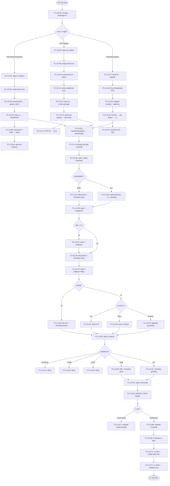
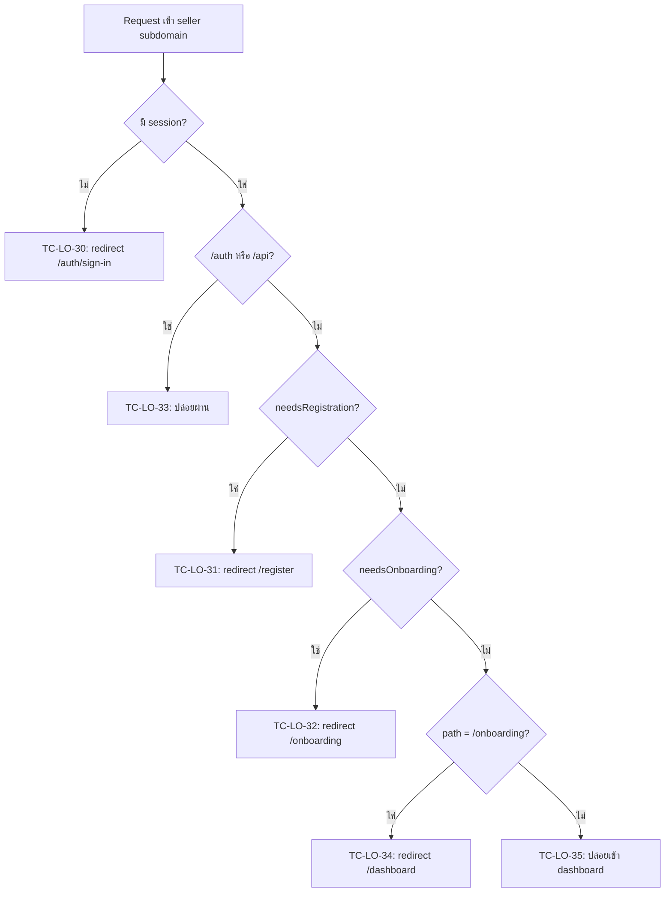

> **โมดูล:** M00001-LoginOnboarding
> **ประเภทเอกสาร:** Test Case (E2E + API + Unit)
> **เวอร์ชัน:** 1.0
> **วันที่จัดทำ:** 2026-06-18
> **สถานะ:** Draft
> **เจ้าของเอกสาร:** QA (ดู [[Feature-Docs-Ownership]])

# Test Case: Login & Onboarding (E2E)

---

## 1. Overview

ชุดทดสอบนี้ครอบคลุม feature **Login & Onboarding (M00001)** ทั้งหมด ประกอบด้วย:

1. ช่องทางสมัคร/เข้าสู่ระบบ 3 ช่องทาง (Username+Password, Phone OTP, Facebook OAuth)
2. Proxy Gate (slug-only mandatory, needsRegistration → needsOnboarding → dashboard)
3. Onboarding Modal 5 Step (Sales Channels, Multi-Category ≤5, Address+Map, Product, Summary)
4. Checklist Sidebar (done/pending, click-to-step, hide-when-all-done)

ประเภทการทดสอบ: Functional E2E (Playwright), API integration, Unit (password policy / slug validation)

**เอกสารต้นทาง:** [[BRD]] ของโมดูลนี้ — ทุก test case trace กลับ FR-LO-01..13 และ Acceptance Criteria (Given/When/Then)

**ขอบเขตชุดทดสอบ (Scope):**

- **In-scope:** seller subdomain (`seller.deepth.local:4000`), Playwright E2E, API guard tests, DB persistence verify
- **Out-of-scope:** Facebook OAuth จริง (production-only; ทดสอบได้เฉพาะ `deepthailand.app` — ใช้ cookie-bypass แทน), Nominatim live call (mock/stub), SMS จริง (ใช้ TEST_ACCOUNTS bypass `0000000009`/`123456`), Admin flow

**สภาพแวดล้อม:**

- dev server รันที่ `http://seller.deepth.local:4000` (user รันเอง — `npm run dev -- -p 4000`)
- DB: Supabase dev (`.env.local`)
- Playwright config: `playwright.config.ts` (baseURL `http://seller.deepth.local:4000`, workers 1, ไม่ auto-start server)
- Auth bypass: `e2e/helpers/auth.ts` — `createSeller(state)` + `loginAs(context, seeded)` (NextAuth cookie encode ด้วย `NEXTAUTH_SECRET`, ไม่ส่ง salt); `cleanup(userId)` ใน `finally` เสมอ

**test phone / OTP bypass:** `0000000009` / `123456` (src/lib/otp.ts TEST_ACCOUNTS)

**หมายเหตุ TDD:** test case เหล่านี้เขียนก่อน implement feature — รันได้หลัง developer สร้าง feature + migration ครบ (schema: `salesChannels`, `categories[]`, `latitude`, `longitude`, `SIGNUP_YEAR` badge definition)

---

## 2. Test Scenarios

### หมวด A — Username + Password Login (FR-LO-01)

---

#### TC-LO-01: Sign-in renders ครบ — heading, fields, FB button, links

- **Linked to:** FR-LO-01 (AC: ช่องทาง username+password login)
- **Precondition:** ไม่มี session; เปิด `/auth/sign-in` บน seller subdomain
- **ประเภท:** E2E Playwright
- **Steps:**
  1. `page.goto('/auth/sign-in')`
  2. ตรวจ heading `ยินดีต้อนรับผู้ขาย` หรือ `เข้าสู่ระบบ`
  3. ตรวจ `#username` input visible
  4. ตรวจ `#password` input visible
  5. ตรวจปุ่ม `เข้าสู่ระบบ` visible
  6. ตรวจปุ่ม `เข้าสู่ระบบด้วย Facebook` visible
  7. ตรวจ link `ลืมรหัสผ่าน` visible
  8. ตรวจ link `สมัครสมาชิก` visible
- **Expected Result:** ทุก element visible; ไม่มี console error ระดับ `error`
- **Playwright selector แนวทาง:**
  ```ts
  await expect(page.getByRole('heading', { name: /ยินดีต้อนรับผู้ขาย/ })).toBeVisible()
  await expect(page.locator('#username')).toBeVisible()
  await expect(page.locator('#password')).toBeVisible()
  await expect(page.getByRole('button', { name: /^เข้าสู่ระบบ$/ })).toBeVisible()
  await expect(page.getByRole('button', { name: /เข้าสู่ระบบด้วย Facebook/ })).toBeVisible()
  await expect(page.getByRole('link', { name: /ลืมรหัสผ่าน/ })).toBeVisible()
  await expect(page.getByRole('link', { name: /สมัครสมาชิก/ })).toBeVisible()
  ```

---

#### TC-LO-02: Sign-in empty form → Yup validation errors

- **Linked to:** FR-LO-01 (AC: ป้องกัน empty submit)
- **Precondition:** ไม่มี session; `/auth/sign-in`
- **ประเภท:** E2E Playwright
- **Steps:**
  1. `page.goto('/auth/sign-in')`
  2. กดปุ่ม `เข้าสู่ระบบ` โดยไม่กรอก username / password
  3. รอ error message ปรากฏ
- **Expected Result:** มี inline error ≥1 รายการ (`.invalid-msg`); URL ยังเป็น `/auth/sign-in`; ไม่สร้าง session

---

#### TC-LO-03: Sign-in password ผิด → generic error (กัน user enumeration)

- **Linked to:** FR-LO-01 (AC: กรอก password ผิด → ไม่เปิดเผยว่า username ไม่มีหรือ password ผิด)
- **Precondition:** ไม่มี session; `/auth/sign-in`
- **ประเภท:** E2E Playwright
- **Steps:**
  1. `page.goto('/auth/sign-in')`
  2. กรอก `username = non_existent_user_qa`, `password = wrongpass123!`
  3. กดปุ่ม `เข้าสู่ระบบ`
  4. รอ error message
- **Expected Result:** แสดง `ชื่อผู้ใช้หรือรหัสผ่านไม่ถูกต้อง` (generic ไม่บอกว่า user ไม่มีหรือ password ผิด); URL ยังเป็น `/auth/sign-in`

---

#### TC-LO-04: Sign-in ถูก (manual-complete user) → redirect /dashboard

- **Linked to:** FR-LO-01 (AC: username + password ถูก → session → redirect ตาม proxy gate)
- **Precondition:** seed `manual-complete` user (มี `isShop=true`, `passwordHash`, `slug`)
- **ประเภท:** E2E Playwright
- **Seed state:** `createSeller('manual-complete')` — คืน `{ username, password, userId }`
- **Steps:**
  1. `page.goto('/auth/sign-in')`
  2. กรอก `seeded.username`, `seeded.password`
  3. กดปุ่ม `เข้าสู่ระบบ`
  4. รอ redirect
- **Expected Result:** `page.url()` match `/dashboard`; session สร้างสำเร็จ
- **Cleanup:** `await cleanup(seeded.userId)` ใน `finally`

---

#### TC-LO-05: Sign-in password ยาวเกิน 1,000 ตัวอักษร → reject ทันที (bcrypt DoS guard)

- **Linked to:** FR-LO-01 (AC: password > 1,000 chars → ปฏิเสธทันที ไม่เรียก bcrypt); SRS TFR-001
- **Precondition:** seed `manual-complete` user
- **ประเภท:** API integration
- **Steps:**
  1. ส่ง POST `/api/auth/callback/credentials` (NextAuth endpoint) หรือทดสอบผ่าน `page.request.post` โดยส่ง password ยาว 1,001 ตัวอักษร พร้อม valid username
  2. ตรวจ response
- **Expected Result:** response ไม่ใช่ 200 (ต้องปฏิเสธ; ไม่มีการเรียก bcrypt ที่ใช้ CPU นาน); ไม่สร้าง session
- **หมายเหตุ:** ทดสอบได้ผ่าน timing check — ถ้า bcrypt เรียก latency จะ >200ms; bcrypt guard ควร <20ms

---

#### TC-LO-06: Sign-in rate-limit — ผิด 5 ครั้งใน 10 นาที → ถูก block

- **Linked to:** FR-LO-01 (AC: ≥5 ครั้งใน 10 นาที → rate-limit ไม่ผ่าน); SRS TFR-001; BR-06
- **Precondition:** seed `manual-complete` user; rate-limit in-memory (globalThis)
- **ประเภท:** API integration
- **Steps:**
  1. ส่ง sign-in request กับ username ที่มีในระบบ + password ผิด 5 ครั้งติดต่อกัน (ผ่าน `page.request.post`)
  2. ส่ง request ครั้งที่ 6 (password ถูก)
  3. ตรวจ response ครั้งที่ 6
- **Expected Result:** ครั้งที่ 6 ถูก block (ไม่ผ่าน แม้ password ถูก); แสดง error บ่งบอก rate-limit หรือ generic error
- **หมายเหตุ:** ต้อง cleanup in-memory store ระหว่างรัน test อื่น; รัน isolated

---

#### TC-LO-07: Sign-in ด้วย buyer-only account (isShop=false) → ไม่สร้าง session

- **Linked to:** FR-LO-01 (AC: ช่องทางนี้ใช้ได้เฉพาะ isShop=true + passwordHash ไม่ null); BR-05
- **Precondition:** seed user ที่ `isShop=false` มี `passwordHash` (ผ่าน Prisma โดยตรง)
- **ประเภท:** API integration
- **Steps:**
  1. สร้าง user ที่ `isShop=false`, `passwordHash = bcrypt('Test@1234!')`
  2. ส่ง sign-in request ด้วย username + `Test@1234!`
  3. ตรวจ response
- **Expected Result:** response ไม่สร้าง session (null/error); ไม่ redirect /dashboard
- **Seed state ใหม่ที่ต้องเพิ่มใน auth.ts:** `buyer-with-password` — user ที่ `isShop=false`, มี `passwordHash`

---

### หมวด B — Phone OTP Signup + Login (FR-LO-02)

---

#### TC-LO-08: Sign-up renders ครบ — heading, fields, submit

- **Linked to:** FR-LO-02 (AC: Seller สมัครด้วยเบอร์โทร)
- **Precondition:** ไม่มี session; `/auth/sign-up`
- **ประเภท:** E2E Playwright
- **Steps:**
  1. `page.goto('/auth/sign-up')`
  2. ตรวจ heading `สร้างบัญชีผู้ขาย`
  3. ตรวจ field `#displayName`, username input, `#password`, `#confirmPassword`, phone input, checkbox `#acceptTerms`, ปุ่ม `สมัครสมาชิก`
- **Expected Result:** ทุก element visible; ไม่มี console error

---

#### TC-LO-09: Sign-up empty submit → Yup validation errors ทุก required field

- **Linked to:** FR-LO-02 (validate ก่อน submit)
- **Precondition:** `/auth/sign-up`
- **ประเภท:** E2E Playwright
- **Steps:**
  1. `page.goto('/auth/sign-up')`
  2. กดปุ่ม `สมัครสมาชิก` ทันที
  3. รอ error message
- **Expected Result:** error message ≥1 รายการ; URL ยังเป็น `/auth/sign-up`

---

#### TC-LO-10: Sign-up username live-check — สั้น/reserved/valid

- **Linked to:** FR-LO-02 (validate username); SRS slug/username format
- **Precondition:** `/auth/sign-up`
- **ประเภท:** E2E Playwright
- **Steps:**
  1. กรอก username 2 ตัว → รอ 600ms → ตรวจ error `ใช้ a-z, 0-9, _ ได้ 3-30 ตัว`
  2. กรอก `admin` (reserved) → รอ 700ms → ตรวจ error
  3. กรอก username unique ≥3 ตัว (`qae2e_xxxxx`) → รอ 700ms → ตรวจ `ใช้ชื่อนี้ได้`
- **Expected Result:** feedback แสดงถูกต้องตาม 3 case; ไม่ต้อง submit form

---

#### TC-LO-11: Sign-up phone duplicate → inline error ไม่สร้าง account

- **Linked to:** FR-LO-02 (กรอกเบอร์ที่มีบัญชีอยู่แล้ว → error); BR-02
- **Precondition:** seed user ที่มี `phone = TEST_PHONE`; `/auth/sign-up`
- **ประเภท:** E2E Playwright
- **Steps:**
  1. กรอก `displayName`, `category`, unique `username`, `password`, `confirmPassword`
  2. กรอก `phone = TEST_PHONE` (มีบัญชีแล้ว)
  3. เช็ก `#acceptTerms`
  4. กดปุ่ม `สมัครสมาชิก`
- **Expected Result:** แสดง error `เบอร์นี้มีบัญชีแล้ว` (หรือ equivalent); ไม่ redirect; ไม่สร้าง user ใหม่

---

#### TC-LO-12: Sign-up full flow → verify-otp page (OTP ส่งแล้ว)

- **Linked to:** FR-LO-02 (AC: Seller กรอกครบ → ยืนยัน OTP → สร้าง User+Shop+L1)
- **Precondition:** `cleanupTestPhone(B05_PHONE)` ก่อน; ใช้ test phone ที่ไม่ชนกับ test อื่น
- **ประเภท:** E2E Playwright
- **Steps:**
  1. กรอก `displayName`, `category` (via Choices.js dropdown), `username`, `password`, `confirmPassword`, `phone`
  2. เช็ก `#acceptTerms`
  3. กดปุ่ม `สมัครสมาชิก`
  4. รอ redirect
- **Expected Result:** URL match `/auth/verify-otp`; แสดงข้อความ `ส่งรหัสแล้ว`; แสดง masked phone (`****XXXX`)

---

#### TC-LO-13: Sign-up + verify-otp (bypass) → สร้าง User+Shop+L1 + redirect /onboarding

- **Linked to:** FR-LO-02 (AC: ยืนยัน OTP → สร้าง User+Shop+L1 VerificationRecord atomic → session → proxy /onboarding)
- **Precondition:** `cleanupTestPhone(B06_PHONE)`; ใช้ `TEST_OTP = '123456'`
- **ประเภท:** E2E Playwright + DB verify
- **Steps:**
  1. กรอก sign-up form ครบ → submit → เด้ง verify-otp
  2. กรอก OTP 6 หลักผ่าน `#otp-{0..5}` inputs
  3. กดปุ่ม `ยืนยันรหัส`
  4. รอ redirect
  5. Query DB: `prisma.user.findFirst({ where: { phone: B06_PHONE } })` + ตรวจ `verifications`
- **Expected Result:** URL match `/(dashboard|onboarding)`; DB มี user ที่ `isShop=true`, `username` ตรง; มี `VerificationRecord` ที่ `type='PHONE_OTP'`, `level=1`, `status='APPROVED'`
- **Cleanup:** `cleanup(user.id)` + `cleanupTestPhone(B06_PHONE)`

---

#### TC-LO-14: OTP ผิด → error ไม่สร้าง session

- **Linked to:** FR-LO-02 (AC: OTP ผิด → แสดง OTP ไม่ถูกต้อง ไม่สร้าง session)
- **Precondition:** อยู่ที่ verify-otp page (ต่อจาก TC-LO-12 flow หรือ navigate โดยตรง)
- **ประเภท:** E2E Playwright
- **Steps:**
  1. กรอก OTP ผิด 6 หลัก (`000000`)
  2. กดปุ่ม `ยืนยันรหัส`
- **Expected Result:** แสดง error `OTP ไม่ถูกต้อง` หรือ equivalent; URL ยังเป็น `/auth/verify-otp`; ไม่สร้าง session

---

#### TC-LO-15: Sign-up + evaluateSignupYearBadge — badge "สมาชิกผู้ก่อตั้ง 2026" ถูก evaluate

- **Linked to:** FR-LO-02 (AC: OTP signup สำเร็จ → evaluateSignupYearBadge best-effort); BR-14
- **Precondition:** `cleanupTestPhone(phone)` ก่อน; DB มี badge definition `SIGNUP_YEAR`
- **ประเภท:** API integration + DB verify
- **Steps:**
  1. ทำ sign-up flow ครบผ่าน API (หรือ Playwright)
  2. รอ response สำเร็จ
  3. Query DB: `prisma.userBadge.findFirst({ where: { userId, badge: { nameEN: 'SIGNUP_YEAR' } } })`
- **Expected Result:** `userBadge` มีอยู่ใน DB (badge ถูก award); หรือถ้า badge definition ยังไม่สร้าง = test นี้ **blocked** (dependency DATABASE)
- **หมายเหตุ:** badge error ต้องไม่ทำให้ signup พัง — ทดสอบ resilience โดย mock badge.service throw error แล้ว verify signup ยัง succeed

---

#### TC-LO-16: Sign-up + linkBuyerHistory — history ที่ทำเป็น guest ถูก link

- **Linked to:** FR-LO-02 (AC: auto-link history การซื้อที่เคยทำเป็น guest ด้วยเบอร์เดียวกัน)
- **Precondition:** มี Order ที่ `buyerPhone = TEST_PHONE` และ `buyerId = null` (guest order) อยู่แล้วใน DB
- **ประเภท:** API integration + DB verify
- **Steps:**
  1. สร้าง guest Order ที่ `buyerPhone = TEST_PHONE`
  2. ทำ OTP signup ด้วย `TEST_PHONE`
  3. Query DB: `prisma.order.findFirst({ where: { buyerPhone: TEST_PHONE } })`
- **Expected Result:** Order ที่เคยเป็น guest มี `buyerId` set เป็น userId ใหม่ (auto-linked)

---

### หมวด C — Facebook OAuth Login/Signup (FR-LO-03)

---

#### TC-LO-17: Facebook login bypass — fresh-fb → /register

- **Linked to:** FR-LO-03 + FR-LO-05 (FB user ใหม่ ยังไม่มี phone → proxy → /register)
- **Precondition:** `createSeller('fresh-fb')` + `loginAs(context, seeded)`
- **ประเภท:** E2E Playwright (cookie bypass)
- **Steps:**
  1. `createSeller('fresh-fb')` → seed FB user ไม่มี phone/shop
  2. `loginAs(context, seeded)` → ฉีด session cookie
  3. `page.goto('/')` หรือ `/dashboard`
  4. รอ redirect
- **Expected Result:** URL match `/register`; heading `สร้างบัญชีผู้ขาย` visible
- **Cleanup:** `cleanup(seeded.userId)`

---

#### TC-LO-18: fresh-fb ข้าม /onboarding ไม่ได้ → เด้ง /register

- **Linked to:** FR-LO-05 (BR-01: needsRegistration ก่อน needsOnboarding)
- **Precondition:** `createSeller('fresh-fb')` + `loginAs`
- **ประเภท:** E2E Playwright
- **Steps:**
  1. seed + loginAs
  2. `page.goto('/onboarding')`
- **Expected Result:** URL match `/register` (ไม่ใช่ `/onboarding`)

---

#### TC-LO-19: fresh-fb → /register renders — username, phone, warning immutable, OTP button

- **Linked to:** FR-LO-03 + FR-LO-05; BR-02 (phone immutable warning)
- **Precondition:** `createSeller('fresh-fb')` + `loginAs`; `cleanupTestPhone(TEST_PHONE)`
- **ประเภท:** E2E Playwright
- **Steps:**
  1. seed + loginAs → `page.goto('/register')`
  2. ตรวจ heading, username input, phone input, ปุ่ม `ถัดไป`
  3. กรอก unique username + phone = TEST_PHONE → กดถัดไป
  4. ตรวจ warning step: ข้อความ `ตั้งได้ครั้งเดียว`, เบอร์ที่กรอก, ปุ่ม `ยืนยัน-ส่ง OTP`, ปุ่ม `แก้ไขเบอร์`
- **Expected Result:** warning step render ครบ; แสดงเบอร์ที่กรอก; ยังไม่ตั้งเบอร์จริง

---

#### TC-LO-20: fresh-fb → /register full flow → set-phone → /onboarding

- **Linked to:** FR-LO-03, FR-LO-05; BR-03 (L1 auto-create)
- **Precondition:** `createSeller('fresh-fb')` + `loginAs`; `cleanupTestPhone(A07_PHONE)`; ใช้ test phone ที่ไม่ซ้ำกับ test อื่น
- **ประเภท:** E2E Playwright + DB verify
- **Steps:**
  1. seed + loginAs → `/register`
  2. กรอก unique username + phone A07_PHONE → กดถัดไป
  3. warning step → กด `ยืนยัน-ส่งรหัส OTP`
  4. กรอก OTP 6 หลัก → กด `ยืนยัน OTP`
  5. รอ redirect
  6. Query DB: `prisma.user.findUnique` + ตรวจ `verifications`
- **Expected Result:** URL match `/(onboarding|dashboard)`; `user.phone = A07_PHONE`; มี L1 VerificationRecord (`PHONE_OTP`, APPROVED)
- **Cleanup:** `cleanup(seeded.userId)` + `cleanupTestPhone(A07_PHONE)`

---

#### TC-LO-21: FB user มี phone แล้ว → set-phone ซ้ำ → 409

- **Linked to:** FR-LO-03; BR-02 (phone immutable); FR-1.10 SRS
- **Precondition:** `createSeller('fb-has-phone')`
- **ประเภท:** API integration
- **Steps:**
  1. `loginAs(context, seeded)`
  2. `page.request.post('/api/account/set-phone', { phone: TEST_PHONE, otp: TEST_OTP })`
- **Expected Result:** HTTP 409; body `{ error: /ตั้งเบอร์แล้ว/ }`
- **Cleanup:** `cleanup(seeded.userId)`

---

#### TC-LO-22: FB user ใหม่ → username เริ่มต้น = `fb{facebookId}` (DB verify)

- **Linked to:** FR-LO-03 (AC: สร้าง User ใหม่ username = `fb{facebookId}`)
- **Precondition:** ทดสอบได้เฉพาะ production (FB OAuth real) — บน dev ใช้ cookie bypass ตรวจ pattern
- **ประเภท:** API integration (prod-only สำหรับ OAuth flow จริง; dev = cookie seed ตรวจ username pattern)
- **Steps (dev):**
  1. `createSeller('fresh-fb')` — ตรวจว่า authAccount.provider = `FACEBOOK`
  2. หาก seed ใช้ username แบบ `fb{id}` → ตรวจ pattern
- **Expected Result:** user ที่สมัครผ่าน FB จริงบน prod มี username prefix `fb`

---

#### TC-LO-23: FB login → avatar refresh เมื่อ FB รูปเปลี่ยน

- **Linked to:** FR-LO-03 (AC: login ด้วยบัญชีเดิม + refresh avatar ถ้า FB รูปเปลี่ยน)
- **Precondition:** prod-only (FB OAuth)
- **ประเภท:** Manual / prod-only
- **Steps:**
  1. Login ด้วย FB ครั้งแรก → บันทึก avatar URL
  2. เปลี่ยน FB profile picture
  3. Login อีกครั้ง
  4. ตรวจ avatar URL ใน DB
- **Expected Result:** `user.avatarUrl` อัปเดตเป็น URL ใหม่

---

#### TC-LO-24: FB login → pre-tick "Facebook" ใน Sales Channels step

- **Linked to:** FR-LO-03 (AC: login ด้วย Facebook → pre-tick "Facebook" ใน step 1 อัตโนมัติ); BR-07
- **Precondition:** `createSeller('fb-has-phone')` (FB user มี phone แต่ยังไม่มี slug) + `loginAs`
- **ประเภท:** E2E Playwright
- **Steps:**
  1. seed + loginAs (FB user, needsOnboarding=true)
  2. navigate ไป Onboarding Modal step 1 (Sales Channels)
  3. ตรวจ chip/checkbox "Facebook" ว่า pre-checked หรือไม่
- **Expected Result:** chip/checkbox "Facebook" ถูก pre-tick; ยังแก้ไขได้ (deselect ได้)
- **Seed state ใหม่ที่ต้องเพิ่มใน auth.ts:** `fb-no-slug` — FB user มี phone + shop แต่ไม่มี slug (ต่อจาก `fb-has-phone` บวก shop ที่ยังไม่มี slug)

---

### หมวด D — Reset Password ผ่าน OTP (FR-LO-04)

---

#### TC-LO-25: Reset-pass page renders — heading, phone input, ปุ่มขอ OTP

- **Linked to:** FR-LO-04 (AC: reset password ผ่าน OTP)
- **Precondition:** `/auth/reset-pass`
- **ประเภท:** E2E Playwright
- **Steps:**
  1. `page.goto('/auth/reset-pass')`
  2. ตรวจ heading, phone input, ปุ่มขอ OTP
- **Expected Result:** render ครบ; ไม่มี console error

---

#### TC-LO-26: Reset-pass กรอกเบอร์ที่มีในระบบ → OTP ส่ง

- **Linked to:** FR-LO-04 (AC: กรอกเบอร์ที่มีในระบบ → ส่ง OTP)
- **Precondition:** `cleanupTestPhone(TEST_PHONE)`; seed user ที่ `phone = TEST_PHONE`; `/auth/reset-pass`
- **ประเภท:** E2E Playwright
- **Steps:**
  1. กรอก phone = TEST_PHONE
  2. กดปุ่มขอ OTP
  3. รอ response
- **Expected Result:** เด้งไปหน้ากรอก OTP; แสดงข้อความส่งรหัสแล้ว (หรือ verify-otp state)

---

#### TC-LO-27: Reset-pass OTP ถูก + password ใหม่ผ่าน policy → passwordHash อัปเดต

- **Linked to:** FR-LO-04 (AC: OTP ถูกต้อง + password ใหม่ผ่าน policy → อัปเดต passwordHash); SRS TFR-004
- **Precondition:** seed `manual-complete` user; ส่ง reset OTP แล้ว; ใช้ TEST_PHONE + TEST_OTP
- **ประเภท:** API integration + DB verify
- **Steps:**
  1. POST `/api/account/set-password` ด้วย `{ phone: TEST_PHONE, otp: TEST_OTP, password: 'NewPass@2026!' }`
  2. รอ response
  3. Query DB: `prisma.user.findFirst({ where: { phone: TEST_PHONE }, select: { passwordHash: true } })`
  4. ลอง sign-in ด้วย password ใหม่
- **Expected Result:** HTTP 200; `passwordHash` เปลี่ยนใน DB; sign-in ด้วย `NewPass@2026!` สำเร็จ

---

#### TC-LO-28: Reset-pass password ไม่ผ่าน policy → 400

- **Linked to:** FR-LO-04 (AC: password ไม่ผ่าน policy → ปฏิเสธ); SRS `isStrongPassword` ≥8 chars + ตัวอักษร+ตัวเลข+special
- **Precondition:** ใช้ valid OTP (TEST_PHONE + TEST_OTP)
- **ประเภท:** API integration
- **Steps:**
  1. POST `/api/account/set-password` ด้วย `{ phone: TEST_PHONE, otp: TEST_OTP, password: '1234' }` (สั้น+ง่าย)
  2. ตรวจ response
- **Expected Result:** HTTP 400; body ระบุ password policy error; `passwordHash` ไม่เปลี่ยน

---

#### TC-LO-29: Reset-pass OTP ผิด → 401 ไม่เปลี่ยน password

- **Linked to:** FR-LO-04 (AC: OTP ผิดหรือหมดอายุ → ปฏิเสธ ไม่เปลี่ยน password)
- **Precondition:** seed `manual-complete` user
- **ประเภท:** API integration
- **Steps:**
  1. POST `/api/account/set-password` ด้วย `{ phone: TEST_PHONE, otp: '000000', password: 'Valid@2026!' }`
  2. ตรวจ response
- **Expected Result:** HTTP 401; `passwordHash` ไม่เปลี่ยน

---

### หมวด E — Proxy Gate (FR-LO-05)

---

#### TC-LO-30: ไม่ login → URL ใดๆ → redirect /auth/sign-in

- **Linked to:** FR-LO-05 (AC: authed? ไม่ → redirect /auth/sign-in)
- **Precondition:** ไม่มี session
- **ประเภท:** E2E Playwright
- **Steps:**
  1. `page.goto('/dashboard')` → ตรวจ URL match `/auth/sign-in`
  2. `page.goto('/orders')` → ตรวจ URL
  3. `page.goto('/onboarding')` → ตรวจ URL
  4. `page.goto('/register')` → ตรวจ URL
- **Expected Result:** ทุก URL redirect ไป `/auth/sign-in`

---

#### TC-LO-31: needsRegistration=true → URL ใดๆ → redirect /register ก่อน (fresh-fb)

- **Linked to:** FR-LO-05 (AC: needsRegistration → redirect /register ก่อน needsOnboarding)
- **Precondition:** `createSeller('fresh-fb')` + `loginAs`
- **ประเภท:** E2E Playwright
- **Steps:**
  1. seed + loginAs (fresh-fb)
  2. `page.goto('/dashboard')` → ตรวจ URL
  3. `page.goto('/orders')` → ตรวจ URL
  4. `page.goto('/onboarding')` → ตรวจ URL (ต้องเด้ง /register ไม่ใช่ /onboarding)
- **Expected Result:** ทุก URL redirect ไป `/register`

---

#### TC-LO-32: needsOnboarding=true → URL ใดๆ → redirect /onboarding

- **Linked to:** FR-LO-05 (AC: needsOnboarding=true → redirect /onboarding ทุก route ยกเว้น /auth, /api)
- **Precondition:** `createSeller('no-slug')` + `loginAs`
- **ประเภท:** E2E Playwright
- **Steps:**
  1. seed + loginAs (no-slug)
  2. `page.goto('/dashboard')` → ตรวจ URL `/onboarding`
  3. `page.goto('/orders')` → ตรวจ URL `/onboarding`
  4. `page.goto('/products')` → ตรวจ URL `/onboarding`
- **Expected Result:** ทุก URL redirect ไป `/onboarding`

---

#### TC-LO-33: /auth และ /api ยกเว้นจาก proxy gate เสมอ

- **Linked to:** FR-LO-05 (AC: /auth และ /api ยกเว้นจาก proxy gate เสมอ)
- **Precondition:** `createSeller('no-slug')` + `loginAs` (needsOnboarding=true)
- **ประเภท:** E2E Playwright + API
- **Steps:**
  1. seed + loginAs
  2. `page.goto('/auth/sign-in')` → ตรวจว่า render ปกติ (ไม่เด้ง /onboarding)
  3. `page.request.get('/api/shops/check-slug?slug=test')` → ตรวจ response ไม่ใช่ redirect
- **Expected Result:** `/auth/*` render ปกติ; `/api/*` ตอบ JSON ไม่ redirect

---

#### TC-LO-34: needsOnboarding=false + เข้า /onboarding → redirect /dashboard

- **Linked to:** FR-LO-05 (AC: Seller มี slug แล้ว เข้า /onboarding → redirect /dashboard)
- **Precondition:** `createSeller('complete')` + `loginAs`
- **ประเภท:** E2E Playwright
- **Steps:**
  1. seed + loginAs (complete)
  2. `page.goto('/onboarding')`
- **Expected Result:** URL match `/dashboard`

---

#### TC-LO-35: needsOnboarding=true → ตั้ง slug สำเร็จ → JWT refresh → proxy ปล่อยเข้า /dashboard

- **Linked to:** FR-LO-05 (AC: เมื่อ slug ผ่าน → needsOnboarding=false → proxy gate ปล่อย)
- **Precondition:** `createSeller('no-slug')` + `loginAs`; simulate session.update() ด้วย new cookie
- **ประเภท:** E2E Playwright + DB verify
- **Steps:**
  1. seed + loginAs
  2. POST `/api/shops/slug` ด้วย unique slug
  3. อัปเดต cookie ด้วย `encode({ needsOnboarding: false })`
  4. `page.goto('/onboarding')`
- **Expected Result:** URL match `/dashboard`; DB มี `Shop.slug` ที่ตั้ง

---

### หมวด F — Onboarding Modal Step 1: Sales Channels (FR-LO-07)

---

#### TC-LO-36: Step 1 renders — chip ครบ 6 ช่องทาง

- **Linked to:** FR-LO-07 (AC: UI แสดงตัวเลือก Facebook, หน้าร้าน, LINE, TikTok Shop, Lazada, Shopee เป็น chip)
- **Precondition:** `createSeller('no-slug-with-category')` + `loginAs`; เข้า step salesChannels ของ Onboarding
- **ประเภท:** E2E Playwright
- **Steps:**
  1. seed + loginAs → navigate ไป Onboarding Modal step salesChannels
  2. ตรวจ chip ทั้ง 6 visible: Facebook, หน้าร้าน, LINE, TikTok Shop, Lazada, Shopee
  3. ตรวจว่า select/deselect ได้
- **Expected Result:** chip ทั้ง 6 visible; กด toggle ได้; เลือก 0 ก็ได้ (ไม่บังคับ)
- **หมายเหตุ:** ขึ้นอยู่กับ Onboarding Modal UI navigation — ต้องมี mock/navigate ไปถึง step นี้โดยตรงผ่าน `?step=salesChannels` หรือ API call เพื่อ advance step

---

#### TC-LO-37: Step 1 บันทึก salesChannels → DB persist + Checklist done

- **Linked to:** FR-LO-07 (AC: กด "บันทึก" → salesChannels บันทึก DB; Checklist item done)
- **Precondition:** อยู่ที่ step salesChannels; เลือก chip ≥1
- **ประเภท:** E2E Playwright + DB verify
- **Steps:**
  1. เลือก chip `Facebook` + `LINE`
  2. กด `บันทึก`
  3. Query DB: `prisma.shop.findUnique({ where: { userId } })`
- **Expected Result:** `shop.salesChannels` มี `["facebook", "line"]` (หรือ equivalent); Checklist item "ช่องทางการขาย" = done
- **Seed state ใหม่:** ต้องมี `salesChannels` field ใน schema (dependency DATABASE)

---

#### TC-LO-38: Step 1 ข้าม → salesChannels ว่าง; Checklist pending

- **Linked to:** FR-LO-07 (AC: ข้าม → salesChannels ว่าง; Checklist pending); BR-08
- **Precondition:** อยู่ที่ step salesChannels
- **ประเภท:** E2E Playwright + DB verify
- **Steps:**
  1. กด `ข้ามไปก่อน` (ไม่เลือก chip ใดๆ)
  2. Query DB
- **Expected Result:** `shop.salesChannels = []` หรือ null; Checklist item "ช่องทางการขาย" = pending

---

#### TC-LO-39: FB user → step 1 pre-tick "Facebook" อัตโนมัติ แต่ยังแก้ไขได้

- **Linked to:** FR-LO-07 (AC: login ผ่าน Facebook → pre-tick Facebook ให้อัตโนมัติ ยังเปลี่ยนได้); BR-07
- **Precondition:** `createSeller('fb-no-slug')` (seed state ใหม่ — FB user มี phone + shop ไม่มี slug) + `loginAs`
- **ประเภท:** E2E Playwright
- **Steps:**
  1. seed + loginAs (FB user)
  2. navigate ไป step salesChannels
  3. ตรวจว่า chip `Facebook` ถูก pre-checked
  4. คลิก chip `Facebook` เพื่อ deselect → ตรวจว่า deselect ได้
- **Expected Result:** chip `Facebook` = pre-checked; สามารถ deselect ได้

---

### หมวด G — Onboarding Modal Step 2: Multi-Category ≤5 (FR-LO-08)

---

#### TC-LO-40: Step 2 renders — chip ครบ 10 หมวด

- **Linked to:** FR-LO-08 (AC: UI แสดง 10 หมวด เป็น chip/toggle)
- **Precondition:** อยู่ที่ step categories ของ Onboarding
- **ประเภท:** E2E Playwright
- **Steps:**
  1. navigate ไป step categories
  2. ตรวจ chip ทั้ง 10 หมวด visible: general, fashion, beauty_health, food_beverage, electronics_it, home_living, mom_baby, agri_otop, services_digital, other
- **Expected Result:** chip ทั้ง 10 visible; กด toggle ได้

---

#### TC-LO-41: เลือก 5 หมวด → chip ที่ 6 ถูก disable

- **Linked to:** FR-LO-08 (AC: เลือกครบ 5 → chip ที่ยังไม่เลือกต้อง disable); BR-09; OD-4
- **Precondition:** อยู่ที่ step categories; ยังไม่เลือกอะไร
- **ประเภท:** E2E Playwright
- **Steps:**
  1. เลือก chip 5 หมวดทีละหมวด
  2. ตรวจว่า chip ที่เหลือ (ยังไม่เลือก) มี `disabled` attribute หรือ class disabled
- **Expected Result:** chip ที่ยังไม่เลือกทุกตัว = disabled; ยังเลือกได้เฉพาะที่เลือกอยู่แล้ว

---

#### TC-LO-42: พยายามเลือก chip ที่ 6 → ระบบไม่เพิ่ม + feedback

- **Linked to:** FR-LO-08 (AC: เลือกครบ 5 แล้ว กด chip ที่ 6 → ไม่เพิ่ม + feedback); BR-09
- **Precondition:** เลือกไปแล้ว 5 หมวด
- **ประเภท:** E2E Playwright
- **Steps:**
  1. พยายามคลิก chip ที่ 6 (ที่ยัง disabled อยู่หรือ click ผ่าน force)
  2. ตรวจจำนวน chip ที่เลือก
  3. ตรวจ feedback message
- **Expected Result:** chip ที่เลือก = 5 (ไม่เพิ่ม); แสดง feedback `เลือกได้สูงสุด 5 หมวด` หรือ equivalent

---

#### TC-LO-43: deselect 1 chip → chip อื่นกลับมา enable

- **Linked to:** FR-LO-08 (logic toggle)
- **Precondition:** เลือกไปแล้ว 5 หมวด; chip อื่น disabled
- **ประเภท:** E2E Playwright
- **Steps:**
  1. คลิก chip ที่เลือกอยู่เพื่อ deselect
  2. ตรวจ chip ที่ disabled
- **Expected Result:** chip ที่ deselect แล้ว = unselected; chip ที่ disabled กลับมา enabled

---

#### TC-LO-44: API /api/shops/update ส่ง categories > 5 → 400

- **Linked to:** FR-LO-08 (AC: API ต้อง validate และ reject ถ้าส่งมาเกิน 5); BR-09
- **Precondition:** `createSeller('no-slug-with-category')` + `loginAs`
- **ประเภท:** API integration
- **Steps:**
  1. POST `/api/shops/update` ด้วย `{ categories: ['general','fashion','beauty_health','food_beverage','electronics_it','home_living'] }` (6 หมวด)
- **Expected Result:** HTTP 400; body ระบุ error เรื่อง category limit

---

#### TC-LO-45: Step 2 บันทึก categories → DB persist + Checklist done

- **Linked to:** FR-LO-08 (AC: เลือก ≥1 หมวด + บันทึก → categories ใน DB อัปเดต; Checklist done)
- **Precondition:** อยู่ที่ step categories
- **ประเภท:** E2E Playwright + DB verify
- **Steps:**
  1. เลือก 2 หมวด
  2. กด `บันทึก`
  3. Query DB: `shop.categories`
- **Expected Result:** `shop.categories` มี 2 หมวดที่เลือก; Checklist item "หมวดหมู่" = done

---

#### TC-LO-46: Seller เก่าที่มี `category` เป็น string เดี่ยว — backward-compat อ่านได้ปกติ

- **Linked to:** FR-LO-08 (AC: Seller เดิมที่มี `category` string เดี่ยว ต้องยังใช้งานได้); BRD 7.2
- **Precondition:** seed shop ที่มี `category = 'general'` (string เดี่ยว — legacy)
- **ประเภท:** API integration + DB verify
- **Steps:**
  1. GET `/api/shops/{shopId}` หรือ query ผ่าน Dashboard
  2. ตรวจว่า shop data ยัง render ได้โดยไม่ error
- **Expected Result:** app ไม่ crash; category แสดงผลได้; ไม่มี runtime error

---

### หมวด H — Onboarding Modal Step 3: Address + Map (FR-LO-09)

---

#### TC-LO-47: Step 3 renders — ThaiAddressSearch autocomplete + map toggle

- **Linked to:** FR-LO-09 (AC: มี ThaiAddressSearch autocomplete; มีส่วน optional ปักพิกัด Leaflet+OSM)
- **Precondition:** อยู่ที่ step address
- **ประเภท:** E2E Playwright
- **Steps:**
  1. navigate ไป step address
  2. ตรวจว่า ThaiAddressSearch input visible
  3. ตรวจว่ามีปุ่ม/section สำหรับปักพิกัดแผนที่ (Leaflet)
- **Expected Result:** render ครบ; ไม่มี console error

---

#### TC-LO-48: ThaiAddressSearch autocomplete → พิมพ์ → เห็น suggestion → เลือก → ช่องรายละเอียดโผล่

- **Linked to:** FR-LO-09 (AC: ThaiAddressSearch autocomplete)
- **Precondition:** อยู่ที่ step address
- **ประเภท:** E2E Playwright
- **Steps:**
  1. กรอก `ในคลอง` ใน ThaiAddressSearch
  2. รอ dropdown suggestion
  3. คลิก suggestion แรก
  4. ตรวจว่า address field ถูก fill + ช่องรายละเอียดเพิ่มเติมโผล่
- **Expected Result:** address select สำเร็จ; ช่อง detail visible; ปุ่มถัดไป enable

---

#### TC-LO-49: address ว่าง → ไม่ส่ง API + toast error

- **Linked to:** FR-LO-09 (UI-side guard: submitAddress() ตรวจ address.trim() === '')
- **Precondition:** อยู่ที่ step address; ไม่กรอก address
- **ประเภท:** E2E Playwright
- **Steps:**
  1. กดปุ่ม `ถัดไป` โดยไม่กรอก address
  2. ตรวจว่า API ไม่ถูกเรียก และ UI ยังอยู่ที่ step address
- **Expected Result:** ปุ่มถัดไป disabled หรือ toast error แสดง; ไม่ส่ง POST request

---

#### TC-LO-50: กรอก address + ไม่ปักพิกัด → บันทึก address string เท่านั้น; lat=null

- **Linked to:** FR-LO-09 (AC: ไม่ปักพิกัด + กรอกแค่ address → บันทึก address string, lat/lng=null; Checklist "ที่อยู่" done, "ปักพิกัด" pending)
- **Precondition:** อยู่ที่ step address; กรอก address แต่ไม่ปักพิกัด
- **ประเภท:** E2E Playwright + DB verify
- **Steps:**
  1. กรอก address ผ่าน ThaiAddressSearch
  2. กด `บันทึก` (ไม่ปักพิกัด)
  3. Query DB: `shop.address`, `shop.latitude`
- **Expected Result:** `shop.address` มีค่า; `shop.latitude = null`; Checklist "ที่อยู่" = done, "ปักพิกัด" = pending

---

#### TC-LO-51: ปักพิกัด + address ตรงกันระดับจังหวัด → บันทึก lat/lng + address ไม่มี warning

- **Linked to:** FR-LO-09 (AC: reverse-geocode ตรงจังหวัด → บันทึกโดยไม่ warning); OD-1, OD-2
- **Precondition:** อยู่ที่ step address; Nominatim mock return จังหวัดเดียวกันกับที่อยู่ที่กรอก
- **ประเภท:** E2E Playwright + DB verify (ต้อง mock Nominatim หรือใช้พิกัดจริงที่ตรงกัน)
- **Steps:**
  1. กรอก address = "กรุงเทพมหานคร" ผ่าน ThaiAddressSearch
  2. ปักพิกัดบนแผนที่ที่พิกัดใน กรุงเทพ (13.75, 100.5)
  3. รอ Nominatim reverse-geocode (หรือ mock)
  4. กด `บันทึก`
  5. ตรวจว่าไม่มี warning modal
  6. Query DB
- **Expected Result:** บันทึกสำเร็จ; ไม่แสดง warning; `shop.latitude ≠ null`; `shop.address` มีค่า

---

#### TC-LO-52: พิกัด ≠ จังหวัดที่กรอก → warning "พิกัดอาจไม่ตรง" — warn ไม่ block

- **Linked to:** FR-LO-09 (AC: reverse-geocode ต่างจังหวัด → warning แต่ยังบันทึกได้); OD-2; BR-10
- **Precondition:** อยู่ที่ step address; Nominatim mock return จังหวัด "ขอนแก่น" แต่ address = "กรุงเทพมหานคร"
- **ประเภท:** E2E Playwright (ต้อง mock Nominatim หรือใช้พิกัดขอนแก่นจริง)
- **Steps:**
  1. กรอก address = "กรุงเทพมหานคร"
  2. ปักพิกัดใน ขอนแก่น (~16.4, 102.8)
  3. รอ Nominatim response
  4. ตรวจ warning message
  5. กด `ยืนยัน` บน warning
  6. Query DB
- **Expected Result:** warning `พิกัดอาจไม่ตรงกับที่อยู่ที่กรอก — กรุณาตรวจสอบ` ปรากฏ; กด `ยืนยัน` → บันทึก lat/lng ที่ขอนแก่น + address "กรุงเทพมหานคร"; HTTP 200

---

#### TC-LO-53: Nominatim timeout → degrade gracefully บันทึก lat/lng ตามที่ปัก ไม่ error

- **Linked to:** FR-LO-09 (AC: Nominatim ล่ม/timeout → ข้ามการตรวจสอบ บันทึก lat/lng โดยไม่ error); BR-10
- **Precondition:** mock Nominatim API ให้ timeout (หรือ intercept network request ใน Playwright)
- **ประเภท:** E2E Playwright (network intercept)
- **Steps:**
  1. intercept Nominatim request ด้วย `page.route('**/nominatim.openstreetmap.org/**', route => route.abort())`
  2. ปักพิกัด
  3. กด `บันทึก`
  4. Query DB
- **Expected Result:** บันทึก lat/lng สำเร็จ (ไม่ error); ไม่มี warning timeout; Checklist "ปักพิกัด" = done

---

#### TC-LO-54: พิกัดนอกประเทศไทย (lat/lng นอก bounding box ไทย) → warning หรือ handle

- **Linked to:** FR-LO-09 edge case; FR-LO-09 (พิกัดนอกไทย reverse-geocode จะได้ประเทศอื่น → จังหวัดไม่ตรง → warn)
- **Precondition:** อยู่ที่ step address; ปักพิกัดนอกประเทศไทย เช่น ปารีส (48.8, 2.3)
- **ประเภท:** E2E Playwright
- **Steps:**
  1. กรอก address ไทย
  2. ปักพิกัดนอกไทย
  3. รอ reverse-geocode
  4. ตรวจ behavior
- **Expected Result:** warning `พิกัดอาจไม่ตรงกับที่อยู่ที่กรอก` ปรากฏ (จังหวัดต่างกันแน่); Seller ยังบันทึกได้

---

#### TC-LO-55: Step 3 ข้าม → address ว่าง; ทั้ง 2 Checklist item pending

- **Linked to:** FR-LO-09 (AC: ข้ามทั้ง step → address ว่าง; Checklist ทั้ง 2 item pending); BR-08
- **Precondition:** อยู่ที่ step address
- **ประเภท:** E2E Playwright + DB verify
- **Steps:**
  1. กด `ข้ามไปก่อน`
  2. Query DB
- **Expected Result:** `shop.address = null`; `shop.latitude = null`; Checklist "ที่อยู่" = pending, "ปักพิกัด" = pending

---

### หมวด I — Onboarding Modal Step 4: สินค้าแรก (FR-LO-10)

---

#### TC-LO-56: Step 4 renders — form fields + drag-drop zone + file picker

- **Linked to:** FR-LO-10 (AC: ฟอร์มมี ชื่อสินค้า, SKU, ราคา, description, รูปภาพ)
- **Precondition:** อยู่ที่ step product
- **ประเภท:** E2E Playwright
- **Steps:**
  1. navigate ไป step product
  2. ตรวจ input ชื่อสินค้า, SKU, ราคา, description, drag-drop zone / file input
- **Expected Result:** ทุก field visible; drag-drop zone visible; ปุ่ม `สร้างสินค้า` visible; ปุ่ม `ข้ามไปก่อน` visible

---

#### TC-LO-57: อัปโหลดไฟล์ format ผิด → ปฏิเสธ + error message

- **Linked to:** FR-LO-10 (AC: format ไม่ใช่ JPG/PNG/WEBP → ปฏิเสธ + "รองรับเฉพาะ JPG, PNG, WEBP"); BR-12; OD-5
- **Precondition:** อยู่ที่ step product
- **ประเภท:** E2E Playwright
- **Steps:**
  1. เลือก/drop ไฟล์ `.gif` หรือ `.pdf`
  2. ตรวจ feedback
- **Expected Result:** ไฟล์ถูกปฏิเสธ; แสดง `รองรับเฉพาะ JPG, PNG, WEBP` หรือ equivalent; ไม่ upload

---

#### TC-LO-58: อัปโหลดไฟล์ขนาดเกิน 5MB → ปฏิเสธ + error message

- **Linked to:** FR-LO-10 (AC: ไฟล์ > 5MB → ปฏิเสธ + "ไฟล์ขนาดเกิน 5MB"); BR-12; OD-5
- **Precondition:** อยู่ที่ step product; มีไฟล์ JPG/PNG ขนาด > 5MB สำหรับ test
- **ประเภท:** E2E Playwright
- **Steps:**
  1. drop/เลือกไฟล์ภาพขนาด > 5MB
  2. ตรวจ feedback
- **Expected Result:** ไฟล์ถูกปฏิเสธ; แสดง `ไฟล์ขนาดเกิน 5MB`; ไม่ upload

---

#### TC-LO-59: อัปโหลดรูปที่ 6 ทั้งที่มี 5 รูปอยู่แล้ว → ปฏิเสธ + error

- **Linked to:** FR-LO-10 (AC: drop รูปที่ 6 ขณะมี 5 รูปแล้ว → ปฏิเสธ + "อัปโหลดได้สูงสุด 5 รูป"); BR-12; OD-5
- **Precondition:** อยู่ที่ step product; upload ไฟล์ JPG/PNG ≤5MB ไปแล้ว 5 รูป
- **ประเภท:** E2E Playwright
- **Steps:**
  1. upload รูป 5 ใบ (≤5MB แต่ละรูป)
  2. drop/เลือกรูปที่ 6
  3. ตรวจ feedback
- **Expected Result:** รูปที่ 6 ถูกปฏิเสธ; แสดง `อัปโหลดได้สูงสุด 5 รูป`; ยังมีแค่ 5 รูปใน zone

---

#### TC-LO-60: สร้างสินค้า (ชื่อ + ราคา + รูป optional) → Product บันทึก DB; Checklist done

- **Linked to:** FR-LO-10 (AC: กรอก ชื่อสินค้า + ราคา + กด "สร้างสินค้า" → Product ถูกสร้าง DB type=PHYSICAL; Checklist done); BR-11
- **Precondition:** อยู่ที่ step product
- **ประเภท:** E2E Playwright + DB verify
- **Steps:**
  1. กรอก ชื่อสินค้า = `QA Test Product`, ราคา = `199`
  2. กด `สร้างสินค้า`
  3. Query DB: `prisma.product.findFirst({ where: { shop: { userId } } })`
- **Expected Result:** `product.name = 'QA Test Product'`; `product.price = 199`; `product.type = 'PHYSICAL'`; Checklist "สร้างสินค้าแรก" = done

---

#### TC-LO-61: ข้าม step 4 → ไม่มี Product สร้าง; Checklist pending

- **Linked to:** FR-LO-10 (AC: ข้าม → ไม่มี Product; Checklist pending); BR-08
- **Precondition:** อยู่ที่ step product
- **ประเภท:** E2E Playwright + DB verify
- **Steps:**
  1. กด `ข้ามไปก่อน`
  2. Query DB: product count ของ shop
- **Expected Result:** product count = 0; Checklist "สร้างสินค้าแรก" = pending

---

#### TC-LO-62: drag-drop ไม่รองรับ (mobile) → fallback file picker ทำงาน

- **Linked to:** FR-LO-10 (AC: อุปกรณ์ไม่รองรับ drag-drop → fallback file picker ไม่ error)
- **Precondition:** อยู่ที่ step product; simulate mobile (Playwright `isMobile: true` หรือ touch device)
- **ประเภท:** E2E Playwright (mobile viewport)
- **Steps:**
  1. เปิด page ด้วย mobile viewport
  2. ตรวจ file input มี fallback (file picker)
  3. เลือกไฟล์ผ่าน file picker
- **Expected Result:** file picker ทำงาน; รูปถูก add; ไม่มี error

---

### หมวด J — Onboarding Modal Step 5: Summary + Achievement (FR-LO-11)

---

#### TC-LO-63: Step 5 Summary แสดงข้อมูลที่กรอกใน session

- **Linked to:** FR-LO-11 (AC: Summary แสดง channels/หมวด/ที่อยู่/สินค้า ที่กรอกใน session นี้)
- **Precondition:** ทำ step 1-4 ครบ (หรือบางส่วน) ก่อนเข้า step 5
- **ประเภท:** E2E Playwright
- **Steps:**
  1. ทำ step 1: เลือก `Facebook`, step 2: เลือก `general`, step 3: กรอก address, step 4: สร้างสินค้า
  2. advance ไป step 5
  3. ตรวจ summary แสดง channel/หมวด/address/สินค้า
- **Expected Result:** ข้อมูลทุกอย่างที่กรอก แสดงใน Summary step

---

#### TC-LO-64: Seller สมัครปี 2026 → badge "สมาชิกผู้ก่อตั้ง 2026" แสดงใน Summary

- **Linked to:** FR-LO-11 (AC: สมัครปี 2026 → แสดง badge SIGNUP_YEAR พร้อม congratulations); BR-14; OD-3
- **Precondition:** seed user ที่สมัครในปี 2026 (ค่า default ถ้า `createdAt` = now); badge definition `SIGNUP_YEAR` มีใน DB
- **ประเภท:** E2E Playwright
- **Steps:**
  1. navigate ไป Summary step
  2. ตรวจ badge "สมาชิกผู้ก่อตั้ง 2026" แสดง
  3. ตรวจ congratulations message
- **Expected Result:** badge visible; message แสดง
- **หมายเหตุ:** blocked ถ้า badge definition ยังไม่สร้างใน DB (dependency DATABASE)

---

#### TC-LO-65: Seller ข้าม step ทั้งหมด → Summary ไม่มี Achievement ใหม่ แต่แสดง next achievement

- **Linked to:** FR-LO-11 (AC: ข้ามทุก step → ไม่มี Achievement ใหม่ แต่แสดง next achievement ที่ใกล้สุด); BR-13
- **Precondition:** ข้าม step 1-4 ทั้งหมด; badge engine ทำงาน
- **ประเภท:** E2E Playwright
- **Steps:**
  1. ข้าม step 1-4
  2. advance ไป step 5
  3. ตรวจว่าไม่มี "สมาชิกผู้ก่อตั้ง 2026" (ถ้าปีไม่ตรง) หรือ badge อื่น
  4. ตรวจว่า next achievement แสดง (เช่น "First Sale")
- **Expected Result:** ไม่มี Achievement ใหม่ (ถ้าปี ≠ 2026); next achievement visible พร้อมระบุว่าขาดอะไร

---

#### TC-LO-66: Achievement มาจาก Badge Engine จริง — ห้าม hardcode

- **Linked to:** FR-LO-11 (AC: Achievement ต้องมาจาก badge.service evaluate จาก DB ไม่ใช่ hardcode); BR-13
- **Precondition:** badge engine ทำงาน
- **ประเภท:** Code review / unit test
- **Steps:**
  1. grep `badge.service` call ใน Summary step component
  2. ตรวจว่า badge data มาจาก API call ไม่ใช่ hardcode string/array
- **Expected Result:** ไม่มี hardcoded badge name/icon ใน component; data มาจาก `badge.service` evaluate

---

#### TC-LO-67: CTA "ไปหน้าสร้างคำสั่งซื้อ" → ปิด modal → navigate create order

- **Linked to:** FR-LO-11 (AC: ปุ่ม CTA "ไปหน้าสร้างคำสั่งซื้อ" → ปิด modal → หน้า create order)
- **Precondition:** อยู่ที่ step 5; modal เปิดอยู่
- **ประเภท:** E2E Playwright
- **Steps:**
  1. กดปุ่ม `ไปหน้าสร้างคำสั่งซื้อ`
  2. รอ navigation
- **Expected Result:** modal ปิด; URL match `/orders/create` หรือ equivalent

---

#### TC-LO-68: CTA "ไป Dashboard" → ปิด modal → dashboard + Checklist Sidebar visible

- **Linked to:** FR-LO-11 (AC: ปุ่ม "ไป Dashboard" → ปิด modal → dashboard + Checklist Sidebar)
- **Precondition:** อยู่ที่ step 5; ข้าม step บางส่วน (มี pending Checklist item)
- **ประเภท:** E2E Playwright
- **Steps:**
  1. กดปุ่ม `ไป Dashboard`
  2. รอ navigation
  3. ตรวจ Sidebar แสดง Checklist item ที่ข้าม
- **Expected Result:** modal ปิด; URL match `/dashboard`; Sidebar แสดง Onboarding Checklist

---

### หมวด K — Checklist Sidebar (FR-LO-12, FR-LO-13)

---

#### TC-LO-69: Checklist แสดงทุก item รวม optional — slug always done

- **Linked to:** FR-LO-12 (AC: Sidebar แสดง Checklist เมื่อมี item pending); FR-LO-13; BR-15; BR-18; OD-6
- **Precondition:** `createSeller('complete')` + `loginAs` แต่ shop ไม่มี `salesChannels`, `categories`, `address`, `latitude`, ไม่มี product
- **Seed state ใหม่:** `complete-no-data` — มี slug แต่ salesChannels/categories/address/lat/product ว่างทั้งหมด
- **ประเภท:** E2E Playwright
- **Steps:**
  1. seed + loginAs (complete-no-data)
  2. `page.goto('/dashboard')`
  3. ตรวจ Sidebar: item "URL ร้าน (Slug)" = done (tick icon)
  4. ตรวจ item "ช่องทางการขาย" = pending
  5. ตรวจ item "หมวดหมู่" = pending
  6. ตรวจ item "ที่อยู่" = pending
  7. ตรวจ item "ปักพิกัด" = pending
  8. ตรวจ item "สร้างสินค้าแรก" = pending
- **Expected Result:** slug = done ✓; ทุก item อื่น = pending; Sidebar แสดง Onboarding section
- **Cleanup:** `cleanup(seeded.userId)`

---

#### TC-LO-70: item done แสดง icon ติ๊กถูก + ข้อความขีดฆ่า

- **Linked to:** FR-LO-12 (AC: item ทำแล้ว = icon ติ๊กถูก สีเขียว + ข้อความขีดฆ่า)
- **Precondition:** seed shop ที่มี `salesChannels ≠ []`
- **ประเภท:** E2E Playwright
- **Steps:**
  1. seed + loginAs (shop มี salesChannels)
  2. ตรวจ Checklist item "ช่องทางการขาย"
  3. ตรวจ CSS class / icon ที่บ่งบอก done state
- **Expected Result:** icon ✓ (สีเขียว) visible; text class มี line-through หรือ strikethrough

---

#### TC-LO-71: กด item pending → Modal เปิดที่ step ที่ตรงกัน

- **Linked to:** FR-LO-12 (AC: กด item pending → modal เปิดที่ step ที่ตรงกัน)
- **Precondition:** seed shop มี address pending แต่ salesChannels = done; Dashboard แสดง Checklist
- **ประเภท:** E2E Playwright
- **Steps:**
  1. กด Checklist item "ปักพิกัดร้าน" ที่ pending
  2. ตรวจ Modal เปิดและอยู่ที่ step 3 (address/map)
- **Expected Result:** Modal visible; แสดง step 3 (ThaiAddressSearch / Leaflet map)

---

#### TC-LO-72: ทุก item done → Sidebar ซ่อน Onboarding item

- **Linked to:** FR-LO-12 (AC: ทุก item done → Sidebar ซ่อน Onboarding item); BR-16; OD-6
- **Precondition:** seed shop ที่มี slug + salesChannels + categories + address + latitude + product ≥1
- **Seed state ใหม่:** `complete-all-data` — ทุก Checklist field มีค่าครบ
- **ประเภท:** E2E Playwright
- **Steps:**
  1. seed + loginAs (complete-all-data)
  2. `page.goto('/dashboard')`
  3. ตรวจ Sidebar ว่า Onboarding section ซ่อน
- **Expected Result:** ไม่มี Onboarding item ใน Sidebar navigation

---

#### TC-LO-73: Seller เก่า login → ไม่มี Modal pop อัตโนมัติ เห็นเฉพาะ Checklist ใน Sidebar

- **Linked to:** FR-LO-12 (AC: Seller เก่า login → Modal ไม่เปิดอัตโนมัติ แต่ Sidebar แสดง Checklist); BR-17; OD-7
- **Precondition:** `createSeller('complete')` + `loginAs` (มี slug แล้ว ถือว่า "Seller เก่า"); shop มี pending Checklist
- **ประเภท:** E2E Playwright
- **Steps:**
  1. seed + loginAs (complete ที่ salesChannels ว่าง)
  2. `page.goto('/dashboard')`
  3. ตรวจว่า Onboarding Modal ไม่ pop อัตโนมัติ
  4. ตรวจว่า Sidebar แสดง Checklist item pending
- **Expected Result:** ไม่มี Modal overlay เปิดขึ้นมาเอง; Sidebar แสดง Checklist เงียบๆ

---

#### TC-LO-74: Checklist item "URL ร้าน (Slug)" = done เสมอ สำหรับ Seller ที่ผ่าน proxy gate

- **Linked to:** FR-LO-13 (Slug done เงื่อนไข: Shop.slug ไม่ null); BR-18
- **Precondition:** `createSeller('complete')` + `loginAs`
- **ประเภท:** E2E Playwright
- **Steps:**
  1. seed + loginAs
  2. ตรวจ Checklist item "URL ร้าน" = done
- **Expected Result:** item slug = done ✓ ทุกครั้ง; ไม่แสดงเป็น pending

---

### หมวด L — API Guard + CSRF (Cross-cutting)

---

#### TC-LO-75: API mutations ไม่มี Origin header → 403

- **Linked to:** SRS NFR-2.2 (CSRF Origin-check ทุก mutation); BRD 6.4
- **Precondition:** ไม่ต้องมี session
- **ประเภท:** API integration
- **Steps:**
  1. POST `/api/shops/update` — ไม่ส่ง `Origin` header
  2. POST `/api/shops/slug` — ไม่ส่ง `Origin` header
  3. POST `/api/account/set-phone` — ไม่ส่ง `Origin` header
- **Expected Result:** ทุก request คืน HTTP 403

---

#### TC-LO-76: API ไม่มี session → 401

- **Linked to:** SRS §6 (authorization); BRD 6.4
- **Precondition:** ไม่มี session cookie
- **ประเภท:** API integration
- **Steps:**
  1. POST `/api/account/set-phone` (พร้อม Origin แต่ไม่มี session)
  2. POST `/api/account/shop-info`
  3. POST `/api/shops/update`
  4. POST `/api/shops/slug`
- **Expected Result:** ทุก request คืน HTTP 401

---

#### TC-LO-77: API /api/shops/check-slug — reserved/taken/valid

- **Linked to:** FR-LO-05; SRS §7.3 `/api/shops/check-slug`
- **Precondition:** `createSeller('complete')` เพื่อให้มี existing slug
- **ประเภท:** API integration
- **Steps:**
  1. GET `check-slug?slug=api` → ตรวจ `available=false` (reserved)
  2. GET `check-slug?slug={existingSlug}` → ตรวจ `available=false` (taken)
  3. GET `check-slug?slug=qavalid-{ts}` → ตรวจ `available=true`
- **Expected Result:** 3 case คืนค่าถูกต้อง

---

#### TC-LO-78: API /api/shops/slug ตั้งซ้ำ → 409

- **Linked to:** SRS §7.3 (`/api/shops/slug` ครั้งแรกเท่านั้น; ถ้ามีแล้ว → 409)
- **Precondition:** `createSeller('complete')` (มี slug แล้ว) + `loginAs`
- **ประเภท:** API integration
- **Steps:**
  1. POST `/api/shops/slug` ด้วย slug ใหม่
- **Expected Result:** HTTP 409

---

### หมวด M — Onboarding Modal เปิด/ปิด + ทุก step มีปุ่มข้าม (FR-LO-06)

---

#### TC-LO-79: Modal เปิดอัตโนมัติที่ step 1 เมื่อ Seller ใหม่ผ่าน proxy gate ครั้งแรก

- **Linked to:** FR-LO-06 (AC: Seller เพิ่งตั้ง slug สำเร็จ → Modal เปิด step 1 อัตโนมัติ)
- **Precondition:** seed user ที่เพิ่งตั้ง slug (simulate: cookie update `needsOnboarding=false`) + redirect เข้า dashboard
- **ประเภท:** E2E Playwright
- **Steps:**
  1. seed no-slug user + loginAs
  2. ตั้ง slug ผ่าน API
  3. อัปเดต cookie ด้วย `needsOnboarding=false`
  4. `page.goto('/dashboard')`
  5. ตรวจ Modal เปิดที่ step 1 อัตโนมัติ (ไม่ต้องกดอะไร)
- **Expected Result:** Modal overlay visible; แสดง step 1 (Sales Channels) ทันที

---

#### TC-LO-80: ทุก step ของ Modal มีปุ่ม "ข้ามไปก่อน" ที่กดได้

- **Linked to:** FR-LO-06 (AC: ทุก step มีปุ่มข้ามที่ไม่ block); BRD 6.5
- **Precondition:** Modal เปิดอยู่ที่ step 1-4
- **ประเภท:** E2E Playwright
- **Steps:**
  1. ตรวจ step 1 มีปุ่ม `ข้ามไปก่อน` visible และกดได้
  2. advance ไป step 2 → ตรวจ
  3. advance ไป step 3 → ตรวจ
  4. advance ไป step 4 → ตรวจ
- **Expected Result:** ทุก step มีปุ่มข้าม; กดแล้วไปขั้นถัดไปได้; ไม่ error

---

#### TC-LO-81: ข้าม step → ไม่บันทึกข้อมูลใดๆ ของ step นั้น (BR-08)

- **Linked to:** FR-LO-06 (AC: การข้าม step ไม่บันทึกข้อมูลใดๆ); BR-08
- **Precondition:** อยู่ที่ step salesChannels; เลือก chip ไว้แล้วแต่กด `ข้ามไปก่อน` แทน `บันทึก`
- **ประเภท:** E2E Playwright + DB verify
- **Steps:**
  1. เลือก chip `Shopee` ใน step 1
  2. กด `ข้ามไปก่อน` (ไม่กด `บันทึก`)
  3. Query DB: `shop.salesChannels`
- **Expected Result:** `shop.salesChannels = []` หรือ null; Shopee ไม่ถูกบันทึก

---

---

## 3. Traceability Matrix

| FR/AC ใน [[BRD]] | Test Case | ครอบคลุมหรือไม่ |
|---|---|---|
| FR-LO-01: Username+Password Login | TC-LO-01, TC-LO-02, TC-LO-03, TC-LO-04 | Yes |
| FR-LO-01: rate-limit 5/10min | TC-LO-06 | Yes |
| FR-LO-01: password > 1,000 chars guard | TC-LO-05 | Yes |
| FR-LO-01: isShop=true + passwordHash guard (BR-05) | TC-LO-07 | Yes |
| FR-LO-02: Phone OTP Signup → atomic transaction | TC-LO-13 | Yes |
| FR-LO-02: OTP ผิด → ไม่สร้าง session | TC-LO-14 | Yes |
| FR-LO-02: phone immutable (BR-02) | TC-LO-21 | Yes |
| FR-LO-02: evaluateSignupYearBadge best-effort (BR-14) | TC-LO-15 | Yes |
| FR-LO-02: linkBuyerHistory | TC-LO-16 | Yes |
| FR-LO-02: sign-up form renders + validate | TC-LO-08, TC-LO-09, TC-LO-10, TC-LO-11 | Yes |
| FR-LO-02: sign-up full flow → verify-otp → DB | TC-LO-12, TC-LO-13 | Yes |
| FR-LO-03: Facebook bypass → fresh-fb → /register | TC-LO-17, TC-LO-18 | Yes |
| FR-LO-03: /register renders + full flow → set-phone → L1 | TC-LO-19, TC-LO-20 | Yes |
| FR-LO-03: FB user ใหม่ username = fb{facebookId} | TC-LO-22 | Yes (partial — prod-only) |
| FR-LO-03: FB login refresh avatar | TC-LO-23 | Yes (prod-only) |
| FR-LO-03: FB login → pre-tick Facebook (BR-07) | TC-LO-24 | Yes |
| FR-LO-04: Reset password renders | TC-LO-25 | Yes |
| FR-LO-04: OTP ถูก + password ใหม่ → passwordHash อัปเดต | TC-LO-26, TC-LO-27 | Yes |
| FR-LO-04: password ไม่ผ่าน policy → 400 | TC-LO-28 | Yes |
| FR-LO-04: OTP ผิด → 401 | TC-LO-29 | Yes |
| FR-LO-05: ไม่ login → redirect /auth/sign-in | TC-LO-30 | Yes |
| FR-LO-05: needsRegistration → /register (fresh-fb) | TC-LO-31 | Yes |
| FR-LO-05: needsOnboarding → /onboarding | TC-LO-32 | Yes |
| FR-LO-05: /auth, /api ยกเว้น | TC-LO-33 | Yes |
| FR-LO-05: slug ผ่าน → needsOnboarding=false → /dashboard | TC-LO-34, TC-LO-35 | Yes |
| FR-LO-06: Modal เปิดอัตโนมัติที่ step 1 | TC-LO-79 | Yes |
| FR-LO-06: Seller เก่า → Modal ไม่เปิดอัตโนมัติ (BR-17) | TC-LO-73 | Yes |
| FR-LO-06: ทุก step มีปุ่มข้าม | TC-LO-80 | Yes |
| FR-LO-06: ข้าม → ไม่บันทึก (BR-08) | TC-LO-38, TC-LO-46 (step2), TC-LO-55 (step3), TC-LO-61 (step4), TC-LO-81 | Yes |
| FR-LO-07: Step 1 renders ครบ 6 chip | TC-LO-36 | Yes |
| FR-LO-07: บันทึก salesChannels → DB + Checklist done | TC-LO-37 | Yes |
| FR-LO-07: ข้าม → salesChannels ว่าง + Checklist pending | TC-LO-38 | Yes |
| FR-LO-07: FB pre-tick Facebook (BR-07) | TC-LO-39 | Yes |
| FR-LO-08: Step 2 renders 10 chip | TC-LO-40 | Yes |
| FR-LO-08: เลือก 5 → chip ที่ 6 disabled (BR-09) | TC-LO-41, TC-LO-42 | Yes |
| FR-LO-08: deselect 1 → chip อื่น enable กลับ | TC-LO-43 | Yes |
| FR-LO-08: API categories > 5 → 400 (BR-09) | TC-LO-44 | Yes |
| FR-LO-08: บันทึก categories → DB + Checklist done | TC-LO-45 | Yes |
| FR-LO-08: backward-compat Seller เก่า category string | TC-LO-46 | Yes |
| FR-LO-09: Step 3 renders — ThaiAddressSearch + map | TC-LO-47 | Yes |
| FR-LO-09: ThaiAddressSearch → suggestion → เลือก | TC-LO-48 | Yes |
| FR-LO-09: address ว่าง → error | TC-LO-49 | Yes |
| FR-LO-09: address-only (ไม่ปักพิกัด) → lat=null + Checklist | TC-LO-50 | Yes |
| FR-LO-09: พิกัด+address ตรง → บันทึก ไม่ warning (OD-2) | TC-LO-51 | Yes |
| FR-LO-09: พิกัด ≠ จังหวัด → warn ไม่ block (BR-10) | TC-LO-52 | Yes |
| FR-LO-09: Nominatim timeout → degrade gracefully | TC-LO-53 | Yes |
| FR-LO-09: พิกัดนอกไทย | TC-LO-54 | Yes |
| FR-LO-09: ข้าม → address ว่าง + 2 Checklist pending | TC-LO-55 | Yes |
| FR-LO-10: Step 4 renders — form + drag-drop | TC-LO-56 | Yes |
| FR-LO-10: format ผิด → ปฏิเสธ (BR-12) | TC-LO-57 | Yes |
| FR-LO-10: ขนาดเกิน 5MB → ปฏิเสธ (BR-12; OD-5) | TC-LO-58 | Yes |
| FR-LO-10: รูปที่ 6 → ปฏิเสธ (BR-12; OD-5) | TC-LO-59 | Yes |
| FR-LO-10: สร้างสินค้า → DB type=PHYSICAL + Checklist done (BR-11) | TC-LO-60 | Yes |
| FR-LO-10: ข้าม → ไม่มี Product + Checklist pending | TC-LO-61 | Yes |
| FR-LO-10: drag-drop fallback mobile | TC-LO-62 | Yes |
| FR-LO-11: Summary แสดงข้อมูล session | TC-LO-63 | Yes |
| FR-LO-11: badge SIGNUP_YEAR 2026 แสดงใน Summary (OD-3; BR-14) | TC-LO-64 | Yes |
| FR-LO-11: ข้ามทุก step → no Achievement + next achievement | TC-LO-65 | Yes |
| FR-LO-11: Achievement จาก Badge Engine ไม่ hardcode (BR-13) | TC-LO-66 | Yes |
| FR-LO-11: CTA ไปสร้าง Order | TC-LO-67 | Yes |
| FR-LO-11: CTA ไป Dashboard | TC-LO-68 | Yes |
| FR-LO-12: Checklist แสดงทุก item รวม optional (OD-6; BR-15) | TC-LO-69 | Yes |
| FR-LO-12: item done = icon + strikethrough | TC-LO-70 | Yes |
| FR-LO-12: กด item pending → Modal เปิด step ที่ตรง | TC-LO-71 | Yes |
| FR-LO-12: ทุก item done → Sidebar ซ่อน Onboarding (BR-16) | TC-LO-72 | Yes |
| FR-LO-12: Seller เก่า → ไม่ modal อัตโนมัติ (BR-17; OD-7) | TC-LO-73 | Yes |
| FR-LO-13: Slug = done เสมอ (BR-18) | TC-LO-74 | Yes |
| FR-LO-13: salesChannels done เงื่อนไข (≥1) | TC-LO-37, TC-LO-38 | Yes |
| FR-LO-13: categories done เงื่อนไข (≥1) | TC-LO-45, TC-LO-46 | Yes |
| FR-LO-13: address done เงื่อนไข (ไม่ null/empty) | TC-LO-50 | Yes |
| FR-LO-13: latitude done เงื่อนไข (ไม่ null) | TC-LO-51, TC-LO-53 | Yes |
| FR-LO-13: product done เงื่อนไข (≥1 product) | TC-LO-60, TC-LO-61 | Yes |
| Cross-cutting: CSRF Origin-check | TC-LO-75 | Yes |
| Cross-cutting: API 401 ไม่มี session | TC-LO-76 | Yes |
| Cross-cutting: check-slug reserved/taken/valid | TC-LO-77 | Yes |
| Cross-cutting: slug ตั้งซ้ำ → 409 | TC-LO-78 | Yes |

---

## 4. Flow

### Flow หลัก: Seller ใหม่ → Login → Onboarding ครบ → Checklist Done



### Flow: Proxy Gate Decision Tree



---

## 5. Seed States ที่ต้องเพิ่มใน `e2e/helpers/auth.ts`

ชุดทดสอบนี้ต้องการ seed states เพิ่มเติมจากที่มีอยู่แล้ว (`fresh-fb`, `no-slug`, `no-slug-with-category`, `complete`, `manual-complete`, `fb-has-phone`):

- [ ] **`fb-no-slug`** — FB user มี phone + shop แต่ shop ไม่มี slug (needsOnboarding=true); ใช้ทดสอบ FR-LO-07 pre-tick Facebook (TC-LO-39)
- [ ] **`buyer-with-password`** — user ที่ `isShop=false` มี `passwordHash`; ใช้ทดสอบ FR-LO-01 BR-05 guard (TC-LO-07)
- [ ] **`complete-no-data`** — มี slug แต่ `salesChannels=[]`, `categories=[]`, `address=null`, `latitude=null`, ไม่มี product; ใช้ทดสอบ Checklist Sidebar (TC-LO-69, TC-LO-73)
- [ ] **`complete-all-data`** — มี slug + salesChannels + categories + address + latitude + product ≥1; ใช้ทดสอบ Sidebar ซ่อน (TC-LO-72)
- [ ] **`complete-partial-data`** (optional) — มี slug + salesChannels แต่ไม่มี address/product; ใช้ทดสอบ Checklist done/pending mixed (TC-LO-70, TC-LO-71)

**หมายเหตุ:** states ที่ใช้ field ใหม่ (`salesChannels`, `categories[]`, `latitude`, `longitude`) blocked จนกว่า DATABASE migration จะ apply

---

## 6. Dependencies ก่อน Implement + รัน Test

| Dependency | ผลต่อ Test Case | สถานะ |
|---|---|---|
| Schema migration: `salesChannels[]`, `categories[]`, `latitude`, `longitude` ใน `Shop` | TC-LO-37..55, TC-LO-69..74, seed states ใหม่ | Blocked |
| Badge definition `SIGNUP_YEAR` ใน DB | TC-LO-15, TC-LO-64 | Blocked |
| Onboarding Modal UI component (step 1-5) | TC-LO-36..68, TC-LO-79..81 | Blocked |
| Checklist Sidebar component | TC-LO-69..74 | Blocked |
| Nominatim mock/intercept setup | TC-LO-52, TC-LO-53 | ต้องทำก่อนรัน |
| `/api/shops/update` field mapping ใหม่ | TC-LO-37..55 | Blocked |
| `npm run e2e` ผ่าน → spec ที่มีอยู่ใน `e2e/seller-onboarding-full.spec.ts` | baseline regression | ควรผ่านก่อน |

---

## 7. ผลล่าสุด

| Run | วันที่ | ผล (Pass/Fail/Blocked) | ผู้ทดสอบ |
|---|---|---|---|
| Pre-implement | 2026-06-18 | Blocked — feature ยังไม่ implement | shinobu22 |

---

## 8. สรุป

เอกสาร Test Case นี้กำหนด **81 test case** (TC-LO-01..81) สำหรับ **Login & Onboarding (M00001)** ครอบคลุมทุก FR-LO-01..13 และ Acceptance Criteria ทุกข้อใน [[BRD]] ประกอบด้วย:

- **Happy Path:** login 3 ช่องทาง, Onboarding Modal 5 step ครบ, Checklist done ทุก item
- **Negative/Edge:** password ผิด (generic error), rate-limit, bcrypt DoS guard, OTP ผิด, phone duplicate, format/size/count รูปเกิน, categories > 5, address ว่าง, พิกัด ≠ จังหวัด (warn ไม่ block), Nominatim timeout (degrade gracefully), พิกัดนอกไทย, category backward-compat
- **Guard/Redirect:** proxy gate ทุก state (fresh-fb / no-slug / complete), CSRF Origin-check, API 401, slug ซ้ำ 409, phone immutable 409
- **DB Persistence:** verify ทุก step ที่บันทึกผ่าน Prisma query ใน test
- **Cross-cutting:** Badge Engine authority (ห้าม hardcode), Seller เก่าไม่เด้ง modal อัตโนมัติ, Sidebar ซ่อนเมื่อ all done

ชุดทดสอบนี้เขียนก่อน implement (TDD-ish) — รันได้ทันทีหลัง developer สร้าง feature + migration ครบตาม dependencies ข้างต้น

**Open Questions:**
- Nominatim mock strategy: intercept network (`page.route`) หรือ test environment variable flag? — ตัดสินก่อน implement step 3
- Badge Engine evaluate sync หรือ async? — กระทบ TC-LO-64 (ต้องรอก่อน query DB)
- Onboarding Modal navigation URL pattern (`?step=salesChannels` หรือ in-memory state?) — กระทบ selector ใน TC-LO-36..68 และ TC-LO-71