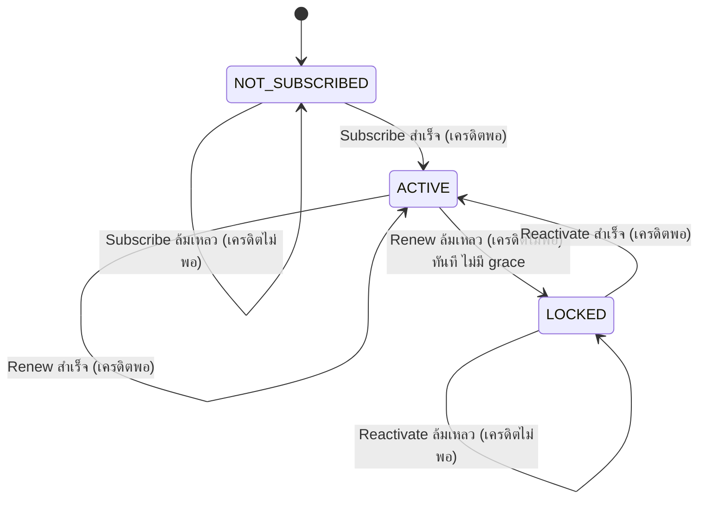
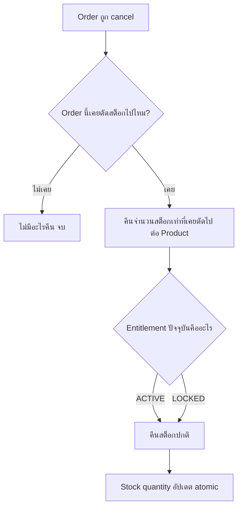
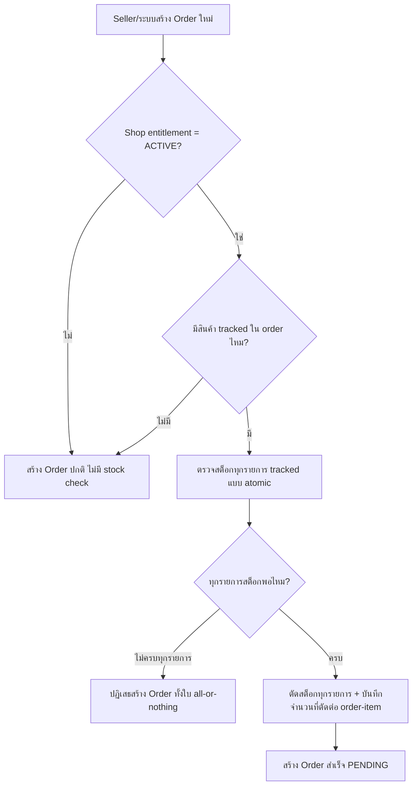
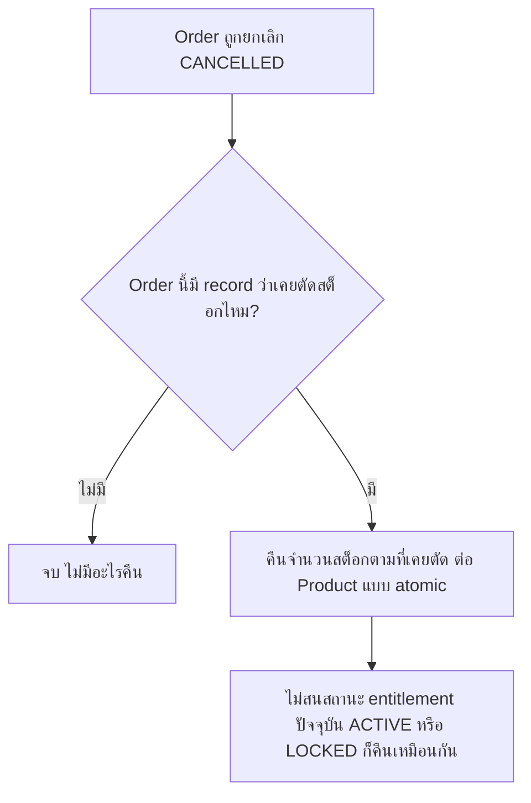
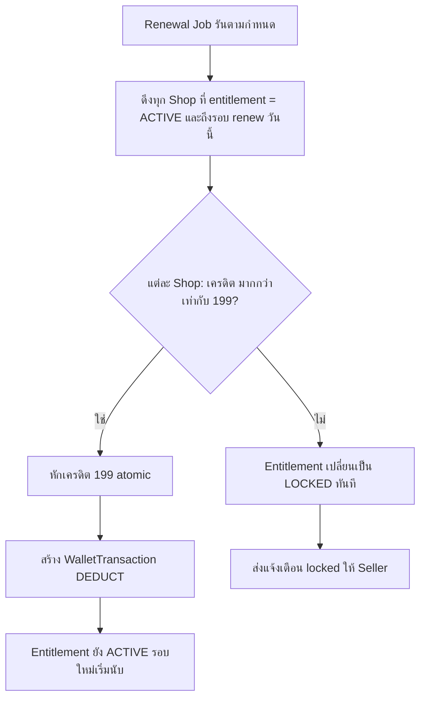

> **โมดูล:** M00002-InventoryAddon
> **ประเภทเอกสาร:** Business Requirements Document (BRD) — NON-TECHNICAL
> **เวอร์ชัน:** 1.0
> **วันที่จัดทำ:** 2026-07-01
> **สถานะ:** Draft
> **เจ้าของเอกสาร:** BA (ดู [[Feature-Docs-Ownership]])

# BRD: Inventory Add-on (Business Requirements Document)

---

## 1. บทนำ

### 1.1 วัตถุประสงค์ของเอกสาร

เอกสารนี้มีวัตถุประสงค์เพื่อ:
1. กำหนด Functional Requirements ระดับ non-technical สำหรับ Inventory Add-on — ฟีเจอร์เสริมแบบ subscription (฿199/เดือน) ที่ให้ Seller จัดการจำนวนสต็อกสินค้าประเภท PHYSICAL
2. กำหนดขอบเขตการทำงานของ subscription lifecycle (subscribe/renew/lock/reactivate) และ stock lifecycle (set/deduct/restock/block) พร้อมกฎที่ระบบต้องบังคับ
3. ระบุเงื่อนไขการรับงาน (Acceptance Criteria) แบบ Given/When/Then ที่ทีม QA นำไปสร้าง Test Case ได้โดยตรง — โดยเฉพาะเงื่อนไข backward compatibility ที่เป็นความเสี่ยงสูงสุดของ feature นี้
4. สร้างความเข้าใจร่วมกันระหว่างทีมธุรกิจและทีมพัฒนา ก่อนเริ่ม implement feature

### 1.2 ขอบเขตของระบบ

**Inventory Add-on** คือฟีเจอร์เสริมที่ให้ Seller เปิดใช้การติดตามจำนวนสต็อกต่อสินค้าประเภท PHYSICAL โดยจ่ายค่าบริการรายเดือนผ่าน SellerWallet เดิม ระบบตัดสต็อกอัตโนมัติตอนสร้าง order คืนสต็อกอัตโนมัติตอน cancel และบล็อกการสร้าง order เมื่อสต็อกหมด ทั้งหมดนี้ทำงาน**เฉพาะเมื่อ entitlement ของ Shop อยู่ในสถานะ ACTIVE** เท่านั้น

**เข้าสู่ระบบ (Input):**
- คำสั่ง subscribe / reactivate จาก Seller (ทริกเกอร์การหักเครดิต ฿199)
- จำนวนสต็อกที่ Seller ตั้ง/แก้ไขต่อ Product (PHYSICAL เท่านั้น)
- Event สร้าง order ใหม่ (PENDING) และ event ยกเลิก order (CANCELLED) จากระบบ OMS เดิม
- Renewal job (scheduled) ที่ตรวจสอบและหักเครดิตทุกรอบ

**ออกจากระบบ (Output):**
- สถานะ Entitlement ของ Shop (NOT_SUBSCRIBED / ACTIVE / LOCKED)
- WalletTransaction (DEDUCT, reason = Inventory Subscription) ทุกครั้งที่ subscribe/renew/reactivate สำเร็จ
- จำนวนสต็อกที่อัปเดตแบบ real-time ต่อ Product (ลดตอนสร้าง order / เพิ่มตอน cancel)
- Error response ปฏิเสธการสร้าง order เมื่อสต็อกไม่พอ (hard stop)
- การแจ้งเตือนล่วงหน้าก่อนรอบ renew + แจ้งเตือนเมื่อถูกล็อก

**ระบบที่เกี่ยวข้อง:**
- SellerWallet + `wallet.service` (deductCredit atomic pattern) — หักเครดิตทุกรอบ
- Order service (createOrder/cancelOrder) — จุด hook สำหรับตัด/คืนสต็อก
- Product service — field จำนวนสต็อกต่อ Product PHYSICAL
- Scheduled Job / Cron (ใหม่) — ตรวจ renewal ทุก Shop ที่ ACTIVE
- Paces seller sidebar — เมนู Inventory ที่ gate ตาม entitlement state

### 1.3 กลุ่มผู้ใช้งาน

| กลุ่มผู้ใช้ | บทบาท | สิทธิ์การใช้งาน |
|-----------|--------|----------------|
| **Seller — ยังไม่เคย subscribe** | ใช้งาน Order/Product ปกติ ยังไม่เปิดใช้ Inventory | เห็นเมนู Inventory แบบ disabled + prompt subscribe; ใช้งาน order/product เหมือนไม่มีฟีเจอร์นี้ |
| **Seller — Entitlement ACTIVE** | Subscribe แล้ว จ่ายค่าบริการต่อเนื่อง | ตั้ง/แก้จำนวนสต็อกได้; ระบบตัด/คืน/บล็อกสต็อกอัตโนมัติตาม order |
| **Seller — Entitlement LOCKED** | เคย subscribe แต่เครดิตไม่พอตอน renew | เห็นเมนู disabled + prompt reactivate; ข้อมูลสต็อกเดิมยังอยู่ครบ; order/product ทำงานเหมือนไม่มีฟีเจอร์นี้ |
| **Admin** | ดูแล WalletTransaction/TopUpRequest ของทั้งระบบ (มีอยู่แล้ว) | เห็นรายการหักเครดิต Inventory แยก label จาก SMS ในหน้า wallet transaction เดิม |

---

## 2. ความต้องการหลัก (Functional Requirements)

### 2.1 Subscription Lifecycle

#### FR-INV-01: Subscribe Inventory Add-on ครั้งแรก

**User Story:**
> ในฐานะ Seller ที่มีสต็อกจำกัด ฉันต้องการเปิดใช้ Inventory Add-on โดยจ่ายผ่านเครดิตที่มีอยู่แล้วใน SellerWallet เพื่อเริ่มติดตามสต็อกได้ทันที ไม่ต้องหาช่องทางจ่ายเงินใหม่

**Acceptance Criteria:**
- [ ] `[FR-INV-01-AC-01]` **Given** Seller อยู่ในสถานะ NOT_SUBSCRIBED และมีเครดิตใน SellerWallet ≥ ฿199 **When** กด "Subscribe" **Then** ระบบหักเครดิต ฿199 ทันที (atomic) → สร้าง WalletTransaction (DEDUCT, reason="Inventory Subscription") → entitlement เปลี่ยนเป็น ACTIVE → renewal cycle เริ่มนับจากตอนนี้
- [ ] `[FR-INV-01-AC-02]` **Given** Seller อยู่ในสถานะ NOT_SUBSCRIBED และมีเครดิต < ฿199 **When** กด "Subscribe" **Then** ระบบปฏิเสธ ไม่หักเครดิตบางส่วน + แสดง prompt ให้ top-up ก่อน (link ไปหน้า top-up เดิม)
- [ ] `[FR-INV-01-AC-03]` **Given** Subscribe สำเร็จ **When** เข้าเมนู Inventory **Then** เมนูเปลี่ยนจาก disabled เป็นใช้งานได้เต็ม ไม่ต้อง refresh หน้าเอง
- [ ] `[FR-INV-01-AC-04]` การ subscribe ไม่มี proration — เริ่มรอบ 30 วันใหม่ทันทีไม่ว่าจะกดวันไหนของเดือน

#### FR-INV-02: Renewal อัตโนมัติทุกรอบเดือน

**User Story:**
> ในฐานะระบบ ฉันต้องหักเครดิต ฿199 จาก SellerWallet ของทุก Shop ที่ entitlement ACTIVE โดยอัตโนมัติเมื่อถึงรอบ renew เพื่อให้ Seller ใช้งานต่อเนื่องได้โดยไม่ต้องกดจ่ายเอง

**Acceptance Criteria:**
- [ ] `[FR-INV-02-AC-01]` **Given** Shop มี entitlement ACTIVE ครบ 30 วันนับจาก subscribe/renew ล่าสุด **When** renewal job รัน **Then** ระบบพยายามหักเครดิต ฿199 แบบ atomic
- [ ] `[FR-INV-02-AC-02]` **Given** renewal job หักเครดิตสำเร็จ **When** หักเสร็จ **Then** สร้าง WalletTransaction (DEDUCT, reason="Inventory Subscription") ใหม่ + entitlement ยังเป็น ACTIVE + renewal cycle รอบถัดไปเริ่มนับจากวันนี้
- [ ] `[FR-INV-02-AC-03]` renewal job ต้องประมวลผลทุก Shop ที่ถึงรอบ renew อย่างครบถ้วน ไม่ตกหล่น — วัดผ่าน job execution log (รายละเอียด mechanism ดู SRS)
- [ ] `[FR-INV-02-AC-04]` renewal job ต้อง idempotent — รันซ้ำในวันเดียวกันสำหรับ Shop เดิมต้องไม่หักเครดิตซ้ำสอง

#### FR-INV-03: แจ้งเตือนล่วงหน้าก่อนถึงรอบ Renew

**User Story:**
> ในฐานะ Seller ฉันต้องการรู้ล่วงหน้าว่าเครดิตของฉันอาจไม่พอสำหรับรอบ renew ถัดไป เพื่อมีเวลา top-up ก่อนถูกล็อก

**Acceptance Criteria:**
- [ ] `[FR-INV-03-AC-01]` **Given** Shop มี entitlement ACTIVE และเหลือ 3 วันก่อนถึงรอบ renew และเครดิตปัจจุบัน < ฿199 **When** ระบบตรวจสอบรายวัน **Then** ส่งการแจ้งเตือนให้ Seller ทราบว่าเครดิตอาจไม่พอ
- [ ] `[FR-INV-03-AC-02]` **Given** เตือนแล้วและ Seller top-up จนเครดิต ≥ ฿199 ก่อนถึงรอบ **When** ถึงวัน renew **Then** renewal สำเร็จปกติ ไม่ถูกล็อก (FR-INV-02 ทำงานตามปกติ)
- [ ] `[FR-INV-03-AC-03]` การแจ้งเตือนต้องระบุจำนวนเครดิตที่ขาดและวันที่จะถึงรอบ renew ให้ชัดเจน

#### FR-INV-04: ล็อกทันทีเมื่อเครดิตไม่พอตอน Renew (ไม่มี Grace Period)

**User Story:**
> ในฐานะระบบ ฉันต้องล็อก Inventory Add-on ทันทีเมื่อ renewal job หักเครดิตไม่สำเร็จ โดยไม่มีช่วงผ่อนผัน เพื่อป้องกันการใช้งานฟรีเกินรอบที่จ่ายจริง

**Acceptance Criteria:**
- [ ] `[FR-INV-04-AC-01]` **Given** Shop มี entitlement ACTIVE และถึงรอบ renew แต่เครดิต < ฿199 **When** renewal job พยายามหัก **Then** การหักล้มเหลว (ไม่หักบางส่วน ไม่หักติดลบ) → entitlement เปลี่ยนเป็น LOCKED ทันทีในรอบเดียวกัน ไม่รอวันถัดไป
- [ ] `[FR-INV-04-AC-02]` **Given** entitlement เปลี่ยนเป็น LOCKED **When** เปลี่ยนสถานะ **Then** ระบบส่งการแจ้งเตือน "ถูกล็อกเพราะเครดิตไม่พอ" ให้ Seller ทันที
- [ ] `[FR-INV-04-AC-03]` ไม่มี state หรือ config ใดที่อนุญาตให้ Shop ใช้งาน stock check ต่อได้ระหว่างเครดิตไม่พอ (ไม่มี grace period ในทุกกรณี)

#### FR-INV-05: เก็บข้อมูลสต็อกไว้เมื่อถูก Lock

**User Story:**
> ในฐานะ Seller ที่ถูกล็อกเพราะเครดิตไม่พอ ฉันต้องการให้ข้อมูลจำนวนสต็อกที่เคยตั้งไว้ยังอยู่ครบ เพื่อไม่ต้องกรอกใหม่เมื่อกลับมาใช้อีกครั้ง

**Acceptance Criteria:**
- [ ] `[FR-INV-05-AC-01]` **Given** Shop entitlement เปลี่ยนจาก ACTIVE เป็น LOCKED **When** เปลี่ยนสถานะ **Then** จำนวนสต็อกทุก Product ที่เคยตั้งไว้ยังคงค่าเดิมทั้งหมด ไม่มีการ reset/ลบ
- [ ] `[FR-INV-05-AC-02]` **Given** Shop entitlement = LOCKED **When** สร้าง order ของสินค้าที่เคย track สต็อกไว้ **Then** ระบบไม่ตัดสต็อกและไม่ block order — order สร้างได้เหมือน Shop ที่ไม่เคย subscribe (เหมือน FR-INV-12)
- [ ] `[FR-INV-05-AC-03]` **Given** Shop entitlement = LOCKED **When** query จำนวนสต็อกของ Product (ผ่าน internal service) **Then** ค่าที่ได้ตรงกับค่าล่าสุดก่อนถูกล็อกเป๊ะ (ไม่ใช่ค่า default/null)

#### FR-INV-06: Reactivate — กลับมาใช้งานได้ทันที

**User Story:**
> ในฐานะ Seller ที่ถูกล็อกแล้ว top-up เครดิตเพิ่มแล้ว ฉันต้องการกดปุ่มเดียวเพื่อกลับมาใช้ Inventory Add-on ได้ทันที โดยเห็นข้อมูลสต็อกเดิมครบถ้วน

**Acceptance Criteria:**
- [ ] `[FR-INV-06-AC-01]` **Given** Shop entitlement = LOCKED และเครดิตใน SellerWallet ≥ ฿199 **When** Seller กด "Reactivate" ที่หน้า gate **Then** ระบบหักเครดิต ฿199 ทันที (atomic) → entitlement เปลี่ยนเป็น ACTIVE ทันที → renewal cycle ใหม่เริ่มนับจากตอนนี้ (ไม่ใช่ต่อจากรอบเดิม)
- [ ] `[FR-INV-06-AC-02]` **Given** Reactivate สำเร็จ **When** เข้าเมนู Inventory **Then** เห็นจำนวนสต็อกทุก Product ตรงกับค่าก่อนถูกล็อกทุกตัว
- [ ] `[FR-INV-06-AC-03]` **Given** Shop entitlement = LOCKED และเครดิต < ฿199 **When** กด "Reactivate" **Then** ระบบปฏิเสธ + prompt top-up ก่อน (เหมือน FR-INV-01-AC-02)
- [ ] `[FR-INV-06-AC-04]` ระบบไม่ auto-retry การหักเครดิตหลัง top-up โดยไม่มี action จาก Seller — reactivation เป็น explicit action เสมอ

**Business Flow:**

---

### 2.2 Menu Gate

#### FR-INV-07: เมนู Inventory แสดงเสมอ แต่ Disabled เมื่อไม่ ACTIVE

**User Story:**
> ในฐานะ Seller ที่ยังไม่ subscribe ฉันต้องการเห็นว่ามีฟีเจอร์ Inventory อยู่ในระบบ (แม้ยังใช้ไม่ได้) เพื่อรู้ว่ามีตัวเลือกนี้และตัดสินใจ subscribe ได้เอง

**Acceptance Criteria:**
- [ ] `[FR-INV-07-AC-01]` **Given** entitlement = NOT_SUBSCRIBED **When** Seller เปิด seller sidebar **Then** เมนู "Inventory" ปรากฏเสมอ อยู่ในสถานะ disabled พร้อม prompt "เปิดใช้จัดการสต็อก ฿199/เดือน"
- [ ] `[FR-INV-07-AC-02]` **Given** entitlement = LOCKED **When** Seller เปิด sidebar **Then** เมนูแสดง disabled เช่นกัน แต่ prompt ข้อความต่างจาก NOT_SUBSCRIBED (ระบุว่าเคย subscribe แล้วถูกล็อก + CTA reactivate)
- [ ] `[FR-INV-07-AC-03]` **Given** entitlement = ACTIVE **When** Seller เปิด sidebar **Then** เมนูใช้งานได้ปกติ ไม่มี prompt
- [ ] `[FR-INV-07-AC-04]` **Given** entitlement ไม่ ACTIVE (ทั้ง NOT_SUBSCRIBED และ LOCKED) **When** Seller พยายามเข้า URL หน้า Inventory ตรง ๆ (bypass เมนู) **Then** ระบบ block การเข้าถึงจริงที่ server-side ไม่ใช่แค่ซ่อน UI ฝั่ง client (ห้ามเป็น read-only demo)

---

### 2.3 Stock Management (PHYSICAL Only)

#### FR-INV-08: ตั้ง/แก้จำนวนสต็อกต่อ Product PHYSICAL

**User Story:**
> ในฐานะ Seller ที่ entitlement ACTIVE ฉันต้องการตั้งจำนวนสต็อกให้สินค้า PHYSICAL แต่ละชิ้นที่ต้องการติดตาม เพื่อให้ระบบช่วยตัด/บล็อกอัตโนมัติ

**Acceptance Criteria:**
- [ ] `[FR-INV-08-AC-01]` **Given** entitlement = ACTIVE **When** Seller เปิดหน้า Product ที่ type = PHYSICAL **Then** เห็น field "จำนวนสต็อก" ให้กรอก/แก้ไข
- [ ] `[FR-INV-08-AC-02]` **Given** Product type ≠ PHYSICAL (DIGITAL/SERVICE/SUBSCRIPTION) **When** Seller เปิดหน้า Product นั้น **Then** ไม่มี field จำนวนสต็อกปรากฏเลย ไม่ว่า entitlement จะเป็นสถานะใด
- [ ] `[FR-INV-08-AC-03]` **Given** Seller ไม่กรอกจำนวนสต็อก (ปล่อยว่าง) **When** บันทึก Product **Then** Product นั้นถือเป็น "untracked" — ไม่มีการตัด/บล็อกสต็อกใด ๆ กับสินค้านี้แม้ entitlement จะ ACTIVE
- [ ] `[FR-INV-08-AC-04]` **Given** Seller กรอกจำนวนสต็อกเป็นจำนวนเต็ม ≥0 **When** บันทึก **Then** Product นั้นกลายเป็น "tracked" ตั้งแต่บันทึกสำเร็จ
- [ ] `[FR-INV-08-AC-05]` จำนวนสต็อกต้องเป็นจำนวนเต็มไม่ติดลบ — ค่าติดลบหรือทศนิยมถูกปฏิเสธที่ฟอร์ม

#### FR-INV-09: ตัดสต็อกอัตโนมัติตอนสร้าง Order (Atomic, All-or-Nothing)

**User Story:**
> ในฐานะระบบ ฉันต้องตัดจำนวนสต็อกของสินค้าที่ tracked ทันทีที่ order ถูกสร้าง (PENDING) แบบ atomic เพื่อป้องกันสอง order แย่งสต็อกชิ้นเดียวกันพร้อมกัน

**Acceptance Criteria:**
- [ ] `[FR-INV-09-AC-01]` **Given** entitlement = ACTIVE และสินค้าใน order เป็น tracked product ที่มีสต็อกเพียงพอ **When** สร้าง order (PENDING) **Then** ระบบตัดสต็อกเท่ากับจำนวนที่สั่งซื้อทันที ก่อน/พร้อมกับการสร้าง order ในธุรกรรมเดียว
- [ ] `[FR-INV-09-AC-02]` **Given** order มีสินค้าหลายรายการ และรายการหนึ่งเป็น tracked product ที่สต็อกไม่พอ **When** สร้าง order **Then** ระบบปฏิเสธการสร้าง order ทั้งใบ — ไม่มีการตัดสต็อกของรายการอื่นในใบเดียวกัน (all-or-nothing)
- [ ] `[FR-INV-09-AC-03]` **Given** สอง request สร้าง order พร้อมกัน (concurrent) แข่งกันตัดสต็อกสินค้าเดียวกันที่เหลือ 1 ชิ้น **When** ทั้งสอง request ถึงจุดตัดสต็อกพร้อมกัน **Then** มีเพียง 1 order ที่สร้างสำเร็จ อีก request ถูกปฏิเสธด้วย out-of-stock error (ทดสอบด้วย atomic conditional-update pattern เดียวกับ `wallet.service.deductCredit`)
- [ ] `[FR-INV-09-AC-04]` **Given** order มีเฉพาะสินค้า untracked (ไม่เคยตั้งจำนวนสต็อก) **When** สร้าง order **Then** ไม่มีการตัดสต็อกใด ๆ — สร้าง order สำเร็จปกติ
- [ ] `[FR-INV-09-AC-05]` Order ที่สร้างสำเร็จและมีการตัดสต็อกจริง ต้องบันทึกไว้ในระดับ order-item ว่าตัดไปเท่าไร (สำหรับใช้คืนสต็อกถูกต้องใน FR-INV-10)

#### FR-INV-10: คืนสต็อกอัตโนมัติเมื่อ Order ถูกยกเลิก

**User Story:**
> ในฐานะระบบ ฉันต้องคืนจำนวนสต็อกที่เคยตัดไปกลับให้สินค้านั้นทันทีที่ order ถูก cancel เพื่อให้ตัวเลขสต็อกตรงกับความเป็นจริงเสมอ

**Acceptance Criteria:**
- [ ] `[FR-INV-10-AC-01]` **Given** order เคยตัดสต็อกไปจริง (มี record จาก FR-INV-09-AC-05) **When** order ถูก cancel (สถานะเปลี่ยนเป็น CANCELLED) **Then** ระบบคืนจำนวนสต็อกเท่ากับที่เคยตัดไปให้ Product นั้นทันที
- [ ] `[FR-INV-10-AC-02]` **Given** order เคยตัดสต็อกไปตอน entitlement ACTIVE แต่ปัจจุบัน Shop entitlement เปลี่ยนเป็น LOCKED แล้ว **When** order นั้นถูก cancel **Then** ระบบยังคงคืนสต็อกให้ครบตามที่เคยตัดไป (คืนสต็อกไม่ขึ้นกับสถานะ entitlement ปัจจุบัน)
- [ ] `[FR-INV-10-AC-03]` **Given** order ไม่เคยตัดสต็อก (สินค้า untracked หรือสร้างตอน entitlement ไม่ ACTIVE) **When** order ถูก cancel **Then** ไม่มีการคืนสต็อกใด ๆ (ไม่มีอะไรให้คืน)
- [ ] `[FR-INV-10-AC-04]` การคืนสต็อกเป็น atomic operation เช่นเดียวกับการตัด — กัน race condition กรณี cancel พร้อมกันหลาย order ของสินค้าเดียวกัน

**Business Flow:**

#### FR-INV-11: Hard Stop เมื่อสต็อกเป็น 0

**User Story:**
> ในฐานะ Seller ที่ entitlement ACTIVE ฉันต้องการให้ระบบปฏิเสธการสร้าง order ทันทีเมื่อสินค้า tracked หมดสต็อก เพื่อไม่ขายเกินของที่มีจริง

**Acceptance Criteria:**
- [ ] `[FR-INV-11-AC-01]` **Given** entitlement = ACTIVE และ Product เป็น tracked ที่มีสต็อกเหลือ 0 **When** พยายามสร้าง order ที่มีสินค้านี้ **Then** ระบบปฏิเสธการสร้าง order (hard stop) พร้อมข้อความระบุชื่อสินค้าที่หมด
- [ ] `[FR-INV-11-AC-02]` **Given** entitlement ≠ ACTIVE (NOT_SUBSCRIBED หรือ LOCKED) และ Product มีจำนวนสต็อกเก็บไว้ = 0 (จากตอนที่เคย ACTIVE) **When** พยายามสร้าง order **Then** ระบบ**ไม่**บล็อก — สร้าง order ได้ตามปกติ (ไม่มี stock check เลยเมื่อไม่ ACTIVE, สอดคล้อง FR-INV-05/FR-INV-12)
- [ ] `[FR-INV-11-AC-03]` Hard stop เป็นการปฏิเสธแบบเด็ดขาด ไม่มี override/warning-only mode ใน MVP

---

### 2.4 Backward Compatibility

#### FR-INV-12: Shop ที่ไม่มี Entitlement ACTIVE ใช้งาน Order/Product เหมือนเดิมทุกประการ

**User Story:**
> ในฐานะ Seller ที่ไม่ subscribe Inventory Add-on ฉันต้องการสร้าง order และ product ได้เหมือนก่อนมีฟีเจอร์นี้ทุกประการ ไม่มีขั้นตอน/field/ข้อจำกัดใหม่แทรกเข้ามา

**Acceptance Criteria:**
- [ ] `[FR-INV-12-AC-01]` **Given** Shop entitlement = NOT_SUBSCRIBED **When** สร้าง Product PHYSICAL **Then** ฟอร์มสร้าง Product เหมือนเดิมทุกประการ ไม่มี field จำนวนสต็อกปรากฏ
- [ ] `[FR-INV-12-AC-02]` **Given** Shop entitlement = NOT_SUBSCRIBED หรือ LOCKED **When** สร้าง order ของสินค้า PHYSICAL ใด ๆ **Then** ไม่มีการ query/ตรวจสอบ stock ใด ๆ แทรกเข้า flow การสร้าง order — response time ต้องไม่ถูกกระทบจาก stock-check logic
- [ ] `[FR-INV-12-AC-03]` **Given** Shop entitlement = NOT_SUBSCRIBED หรือ LOCKED **When** cancel order **Then** ไม่มีการพยายามคืนสต็อกสำหรับ order ที่ไม่เคยตัดสต็อกไปจริง (สอดคล้อง FR-INV-10-AC-03)
- [ ] `[FR-INV-12-AC-04]` Regression test ต้องครอบคลุมทุก endpoint/flow เดิมของ Order/Product (create, edit, cancel, list) เทียบ behavior ก่อนและหลัง feature นี้ deploy — ผลต้องเหมือนกันในทุก field ที่ไม่เกี่ยวกับ inventory

---

### 2.5 Admin Visibility

#### FR-INV-13: Admin เห็นรายการหักเครดิต Inventory ในหน้า Wallet Transaction เดิม

**User Story:**
> ในฐานะ Admin ที่ดูแล support ฉันต้องการเห็นรายการหักเครดิต Inventory Add-on แยกจากรายการ SMS ในหน้า wallet transaction ที่มีอยู่แล้ว เพื่อวินิจฉัยปัญหาให้ Seller ได้เร็ว

**Acceptance Criteria:**
- [ ] `[FR-INV-13-AC-01]` **Given** Shop มีการหักเครดิต Inventory (subscribe/renew/reactivate) **When** Admin เปิดหน้า WalletTransaction ของ Shop นั้น (หน้าเดิมที่มีอยู่แล้วจาก SMS Order Link) **Then** เห็นรายการที่ label ชัดเจนว่าเป็น "Inventory Subscription" แยกจากรายการ SMS
- [ ] `[FR-INV-13-AC-02]` **Given** Shop entitlement = LOCKED **When** Admin ดูรายการล่าสุด **Then** สามารถระบุได้จาก transaction history ว่า renewal ครั้งล่าสุดล้มเหลวเพราะเครดิตไม่พอ (ไม่ต้องเดา)
- [ ] Admin ไม่มีสิทธิ์แก้ไขจำนวนสต็อกหรือ entitlement ของ Shop โดยตรงใน MVP (out of scope — ดู PRD §5)

---

## 3. Acceptance Criteria สรุป

### 3.1 Subscription Lifecycle

**เมื่อระบบทำงานถูกต้อง:**
- ✅ Subscribe ครั้งแรกสำเร็จเมื่อเครดิตพอ, ปฏิเสธ + prompt top-up เมื่อไม่พอ
- ✅ Renewal อัตโนมัติหักเครดิตถูกต้อง, idempotent, ครบทุก Shop ที่ถึงรอบ
- ✅ เตือนล่วงหน้าก่อนรอบ renew เมื่อเครดิตไม่พอ
- ✅ เครดิตไม่พอตอน renew → LOCKED ทันที ไม่มี grace period ในทุกกรณี
- ✅ ข้อมูลสต็อกไม่หายเมื่อถูก LOCKED
- ✅ Reactivate เป็น explicit action ที่หักเครดิตทันทีและคืนการใช้งานทันที

### 3.2 Stock Management

**เมื่อระบบทำงานถูกต้อง:**
- ✅ Field จำนวนสต็อกปรากฏเฉพาะ Product PHYSICAL และเฉพาะเมื่อ entitlement ACTIVE
- ✅ Product ที่ไม่ตั้งจำนวนสต็อก = untracked ไม่มีผลกับฟีเจอร์นี้
- ✅ ตัดสต็อกตอนสร้าง order แบบ atomic, all-or-nothing สำหรับ multi-item
- ✅ Concurrent order แย่งสต็อกชิ้นสุดท้าย มีแค่ 1 order สำเร็จ
- ✅ คืนสต็อกตอน cancel ตามประวัติจริงของ order ไม่ใช่ตามสถานะ entitlement ปัจจุบัน
- ✅ Hard stop ปฏิเสธ order เมื่อสต็อก tracked = 0 (เฉพาะตอน ACTIVE)

### 3.3 Backward Compatibility

**เมื่อระบบทำงานถูกต้อง:**
- ✅ Shop ที่ไม่มี entitlement ACTIVE ใช้งาน Order/Product เหมือนไม่มีฟีเจอร์นี้เลยทุกประการ
- ✅ ไม่มี field/validation/latency ใหม่แทรกเข้า flow เดิมสำหรับ Shop เหล่านี้

### 3.4 Gate & Admin

**เมื่อระบบทำงานถูกต้อง:**
- ✅ เมนู Inventory แสดงเสมอ (ไม่ซ่อน) พร้อม disabled state ที่ถูกต้องตาม entitlement
- ✅ Bypass URL ตรง ๆ ถูก block ที่ server-side เมื่อไม่ ACTIVE
- ✅ Admin เห็นรายการหักเครดิต Inventory แยกจาก SMS ในหน้าเดิม

---

## 4. Business Flows (กระบวนการทำงาน)

### 4.1 Flow หลัก: Order Creation กับ Stock Deduction

### 4.2 Flow: Cancel Order กับ Restock

### 4.3 Flow: Renewal Job รายเดือน

---

## 5. Use Case Scenarios (สถานการณ์การใช้งานจริง)

### Scenario 1: Best Case — Subscribe แล้วขายจนสต็อกหมด

**ผู้เกี่ยวข้อง:** Seller ที่มีสต็อกจำกัด

**เงื่อนไขเริ่มต้น:**
- Shop entitlement = NOT_SUBSCRIBED, เครดิต SellerWallet = ฿500
- มี Product PHYSICAL "กระเป๋าถักมือ" ยังไม่ตั้งจำนวนสต็อก

**ขั้นตอน:**
1. Seller กด Subscribe → หักเครดิต ฿199 (เหลือ ฿301) → entitlement = ACTIVE
2. Seller ตั้งจำนวนสต็อก "กระเป๋าถักมือ" = 3
3. Buyer สร้าง order 3 ครั้ง → สต็อกลดเหลือ 0
4. Buyer พยายามสร้าง order ที่ 4 → ถูกปฏิเสธ hard stop

**ผลลัพธ์:**
- ระบบป้องกัน overselling สำเร็จ ไม่มี order ที่ 4 หลุดเข้ามา

### Scenario 2: Renewal ล้มเหลว → Lock → Reactivate

**ผู้เกี่ยวข้อง:** Seller ที่ entitlement ACTIVE เครดิตเหลือน้อย

**เงื่อนไขเริ่มต้น:**
- Shop entitlement = ACTIVE, เครดิต = ฿50, ถึงรอบ renew ในอีก 3 วัน

**ขั้นตอน:**
1. ระบบเตือนล่วงหน้า Seller ไม่ top-up ทัน
2. ถึงวัน renew → หักเครดิตล้มเหลว → entitlement = LOCKED ทันที
3. Seller top-up ฿300 (เครดิตรวม ฿350)
4. Seller กด Reactivate → หักเครดิต ฿199 → entitlement = ACTIVE ทันที

**ผลลัพธ์:**
- ไม่มี grace period หลุด, ข้อมูลสต็อกไม่หาย, กลับมาใช้งานได้ทันทีหลัง reactivate

### Scenario 3: Regression Check — Seller ไม่เคย Subscribe

**ผู้เกี่ยวข้อง:** Seller ที่ไม่สนใจ Inventory Add-on

**เงื่อนไขเริ่มต้น:**
- Shop entitlement = NOT_SUBSCRIBED ตลอดมา

**ขั้นตอน:**
1. Seller สร้าง Product PHYSICAL ใหม่ → ไม่เห็น field จำนวนสต็อก
2. Buyer สร้าง order สินค้านี้ 50 ครั้งติดกัน (ไม่มีข้อจำกัด)
3. Seller cancel order บางรายการ

**ผลลัพธ์:**
- ไม่มี error, ไม่มี field ใหม่, ไม่มี stock check ใด ๆ ปรากฏ — flow เหมือนก่อนมี feature นี้ทุกประการ

### Scenario 4: Cancel ระหว่าง Locked ยังคืนสต็อกถูกต้อง

**ผู้เกี่ยวข้อง:** Seller ที่เพิ่งถูกล็อก

**เงื่อนไขเริ่มต้น:**
- Shop entitlement = LOCKED, Product "เสื้อยืด" มีสต็อกเก็บไว้ = 2 (ตัดไปจาก order A ที่สร้างตอน ACTIVE)

**ขั้นตอน:**
1. Order A (เคยตัดสต็อกไป 1 หน่วยตอน ACTIVE) ถูก cancel ขณะ Shop ยัง LOCKED อยู่
2. ระบบคืนสต็อกให้ "เสื้อยืด" +1 (กลายเป็น 3)

**ผลลัพธ์:**
- ตัวเลขสต็อกยังถูกต้องแม้ระหว่าง LOCKED — พร้อมใช้ต่อทันทีเมื่อ Seller reactivate

---

## 6. ความต้องการด้านคุณภาพ (Quality Requirements)

### 6.1 ความถูกต้องของข้อมูล
- จำนวนสต็อกต้องสะท้อนผลรวม (ตั้งต้น - deduct จริง + restock จริง) เสมอ ไม่มี drift สะสม
- WalletTransaction ของ Inventory ต้อง reconcile กับ balance ของ SellerWallet ได้ 100%

### 6.2 ความรวดเร็ว
- Stock check (deduct/block) ต้องไม่เพิ่ม latency ที่สังเกตเห็นได้ต่อการสร้าง order ของ Shop ที่ไม่มี entitlement ACTIVE (short-circuit เร็ว)

### 6.3 ความน่าเชื่อถือ
- Renewal job ต้องรันครบทุก Shop ที่ถึงรอบ ไม่ตกหล่น แม้ job ล้มเหลวบางส่วน (ต้อง retry/log ที่ระดับ per-Shop ไม่ใช่ all-or-nothing ของทั้ง job)
- การตัด/คืนสต็อกต้อง atomic กัน race condition ทุกกรณี (concurrent create, concurrent cancel)

### 6.4 ความปลอดภัย
- Bypass URL ตรง ๆ เข้าหน้า Inventory เมื่อไม่ ACTIVE ต้องถูก block ที่ server-side เสมอ (ไม่ใช่แค่ client-side hide)
- Reactivate/Subscribe ต้องยืนยันว่าเป็น Seller ของ Shop นั้นจริง (scope ownership)

### 6.5 ความสะดวกในการใช้งาน (Usability)
- ข้อความ prompt ต้องแยกชัดระหว่าง "ยังไม่เคย subscribe" กับ "ถูกล็อก" เพื่อไม่ให้ Seller สับสน
- ข้อความ hard-stop ต้องระบุชื่อสินค้าที่หมดสต็อกชัดเจน ไม่ใช่ error ทั่วไป

---

## 7. ข้อจำกัด (Constraints)

### 7.1 ข้อจำกัดทางธุรกิจ
- ราคาคงที่ ฿199/เดือน ไม่มี proration, ไม่มี grace period ใน MVP (เป็น business decision ถาวร ไม่ใช่แค่ MVP cut)
- Entitlement ผูกกับ Shop เท่านั้น (1:1 SellerWallet) ไม่ใช่ User account
- Opt-in tracking ต่อสินค้า (Product PHYSICAL ที่ไม่ตั้งจำนวน = ไม่ track) — ยืนยันโดย user 2026-07-01 (PRD §10.3 OD-2)

### 7.2 ข้อจำกัดทางเทคนิค
- ระบบยังไม่มี scheduled job/cron infra สำหรับ recurring billing มาก่อน — เป็น dependency ใหม่ที่ต้องออกแบบใน SRS
- Deduction ใช้ SellerWallet เดิมร่วมกับ SMS Order Link — บั๊กจุด shared กระทบทั้งสอง feature
- All-or-nothing multi-item deduct ต้องเป็น DB transaction เดียว ซับซ้อนกว่า single-deduct เดิมของ wallet.service

---

## 8. กฎทางธุรกิจ (Business Rules)

### 8.1 Subscription & Billing

- **BR-INV-01 (Pricing):** ราคา flat ฿199/เดือน ไม่มี proration ไม่มี tier ใน MVP
- **BR-INV-02 (Billing Source):** หักจาก SellerWallet เท่านั้น (1 credit = ฿1) ไม่มีช่องทางจ่ายแยก
- **BR-INV-03 (Renewal Cycle):** รอบ 30 วันแบบ rolling นับจาก subscribe/renew/reactivate ล่าสุด (ไม่ใช่ calendar month คงที่)
- **BR-INV-04 (Lock on Insufficient Credit):** เครดิตไม่พอตอน renew = LOCKED ทันที ไม่มี grace period ในทุกกรณี
- **BR-INV-05 (Advance Warning):** ต้องเตือนล่วงหน้า 3 วันก่อนถึงรอบ renew เมื่อคาดว่าเครดิตจะไม่พอ (ก่อนล็อก ไม่ใช่แจ้งหลังล็อกอย่างเดียว)
- **BR-INV-06 (Data Retention on Lock):** ล็อกไม่ลบ/reset จำนวนสต็อกที่ตั้งไว้ ไม่ว่าจะถูกล็อกนานเท่าไร
- **BR-INV-07 (Entitlement Scope):** ผูกกับ Shop (1:1 SellerWallet) ไม่ใช่ User/Account
- **BR-INV-08 (Reactivation):** ต้องเป็น explicit action จาก Seller (ไม่ auto-retry แบบ passive หลัง top-up)

### 8.2 Stock Management

- **BR-INV-09 (PHYSICAL-only):** DIGITAL/SERVICE/SUBSCRIPTION ไม่มี stock field ตลอดไป เป็นข้อจำกัดถาวร
- **BR-INV-10 (Opt-in Tracking):** Product PHYSICAL ที่ไม่ได้ตั้งจำนวน = untracked ไม่มีผลกับฟีเจอร์นี้แม้ entitlement ACTIVE
- **BR-INV-11 (Deduction Timing):** ตัดสต็อกที่จุดสร้าง order (PENDING) แบบ atomic, all-or-nothing สำหรับ order หลายรายการ
- **BR-INV-12 (Restock on Cancel):** คืนสต็อกอิงจากประวัติจริงของ order (เคยตัดไปไหม) ไม่ใช่สถานะ entitlement ปัจจุบัน — คืนแม้ระหว่าง LOCKED
- **BR-INV-13 (Block on Zero):** Hard stop เมื่อสต็อก tracked = 0 เฉพาะตอน entitlement ACTIVE เท่านั้น
- **BR-INV-14 (Backward Compatibility):** Shop ที่ไม่มี entitlement ACTIVE (NOT_SUBSCRIBED/LOCKED) ต้องมี Order/Product flow เหมือนไม่มีฟีเจอร์นี้เลย ทั้งด้าน field, validation, และ latency

---

## 9. อภิธานศัพท์ (Glossary)

| คำศัพท์ | ความหมาย |
|---------|----------|
| **Entitlement** | สิทธิ์การใช้งาน Inventory Add-on ของ Shop — NOT_SUBSCRIBED / ACTIVE / LOCKED |
| **Tracked / Untracked Product** | Product PHYSICAL ที่ตั้งจำนวนสต็อกแล้ว (tracked) เทียบกับที่ปล่อยว่าง (untracked) |
| **Hard Stop** | การบล็อกสร้าง order แบบเด็ดขาดเมื่อสต็อก tracked = 0 และ entitlement ACTIVE |
| **All-or-Nothing** | กฎที่ order หลายรายการ ถ้ารายการใดสต็อกไม่พอ ต้องปฏิเสธทั้งใบ ไม่ตัดสต็อกบางส่วน |
| **Rolling 30-day Cycle** | รอบ renewal ที่นับ 30 วันจากวัน subscribe/renew/reactivate ล่าสุด ไม่ใช่ calendar month คงที่ |
| **Grace Period** | ช่วงผ่อนผันหลังเครดิตไม่พอที่ยังใช้งานต่อได้ — **feature นี้ไม่มี grace period** |
| **RC-3 Pattern** | Atomic conditional-update pattern กัน race condition ใช้ครั้งแรกใน `wallet.service.deductCredit` |

---

## 10. สรุป

เอกสาร BRD นี้อธิบายความต้องการหลักของ **Inventory Add-on** แบบไม่ใช่เทคนิค

**จุดเด่นของระบบ:**
- ผูกกับ SellerWallet เดิม — ไม่มี payment infra ใหม่
- Atomic all-or-nothing deduction ป้องกัน overselling แม้ concurrent request
- Data retention เมื่อ lock สร้างความมั่นใจให้ Seller กล้า subscribe
- Backward compatibility เข้มงวด — Seller ที่ไม่ subscribe ไม่ได้รับผลกระทบใด ๆ

**ผลลัพธ์ที่คาดหวัง:**
- เพิ่ม recurring revenue ผ่าน subscription add-on ตัวที่ 2 ของระบบ
- ลด overselling incident สำหรับ Seller ที่มีสต็อกจำกัด
- Zero regression บน core Order/Product flow ที่รันอยู่บน prod แล้ว

---

**หมายเหตุ:**
สำหรับความต้องการทางธุรกิจระดับภาพรวม/personas/KPI ดู [[PRD]] ของโมดูลนี้
สำหรับ technical specification (architecture/API/data/NFR) ดู [[SRS]] ของโมดูลนี้
