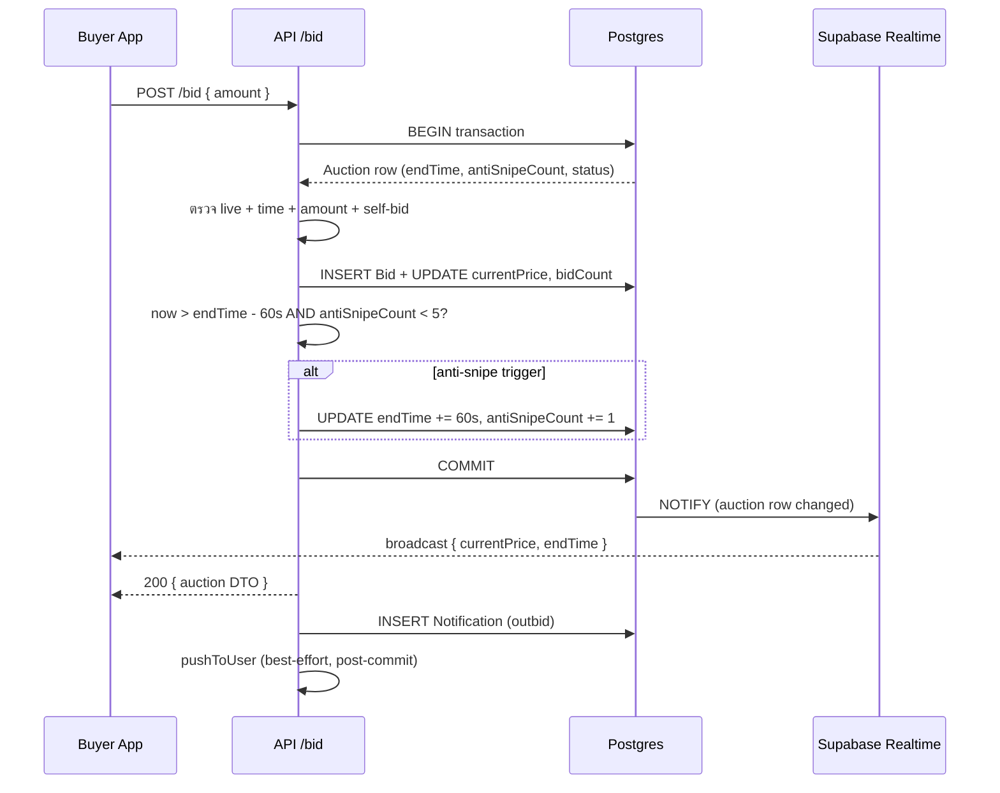
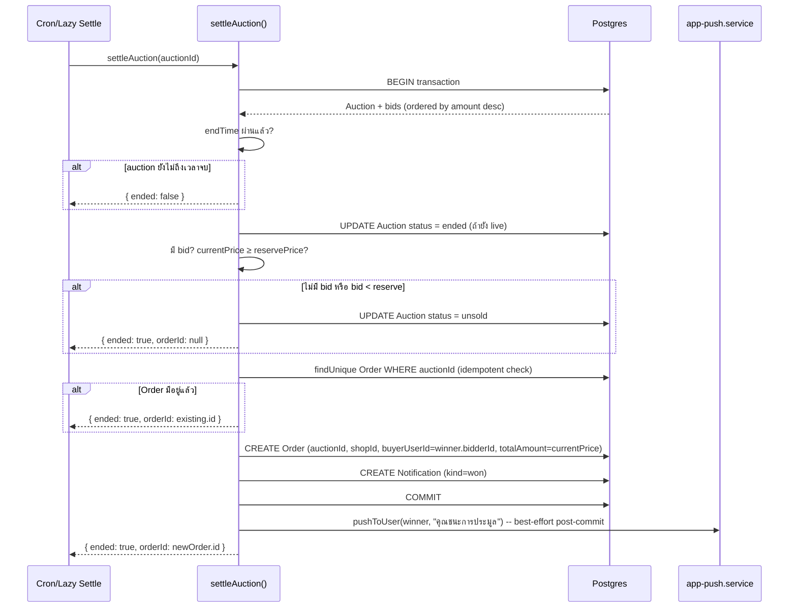
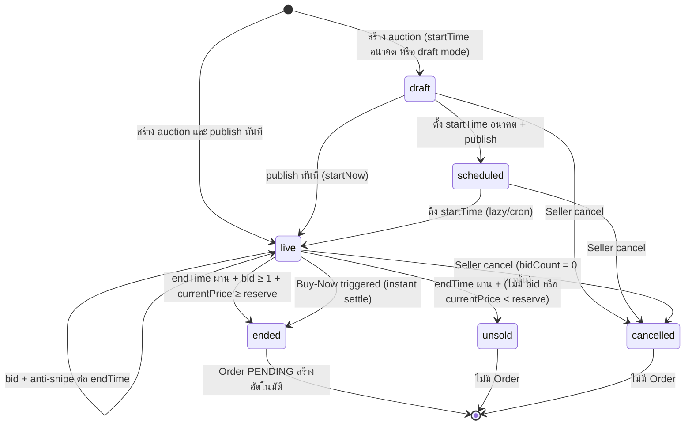
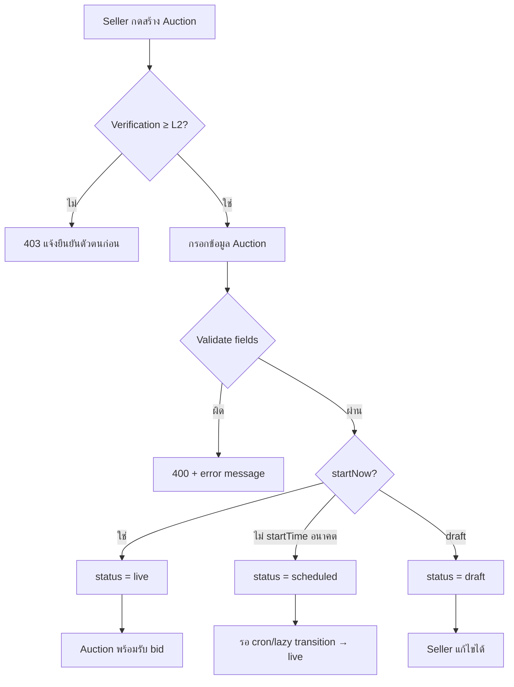
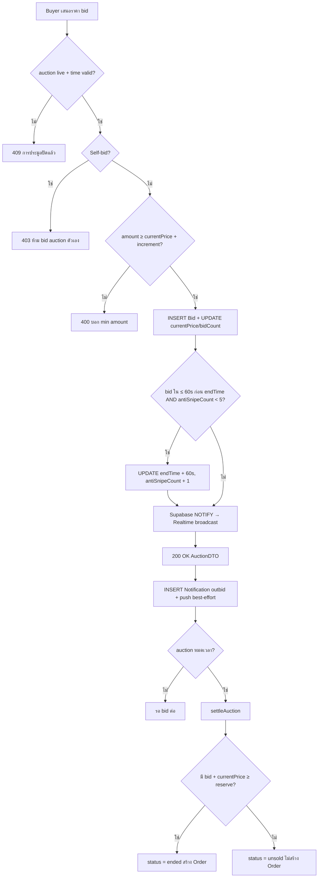

> **โมดูล:** M00002-SellerAuction
> **ประเภทเอกสาร:** Business Requirements Document (BRD) — NON-TECHNICAL
> **เวอร์ชัน:** 1.0
> **วันที่จัดทำ:** 2026-06-23
> **สถานะ:** Draft
> **เจ้าของเอกสาร:** BA (ดู [[Feature-Docs-Ownership]])

# BRD: Seller Auction + Realtime Bidding (Business Requirements Document)

---

## 1. บทนำ

### 1.1 วัตถุประสงค์ของเอกสาร

เอกสารนี้มีวัตถุประสงค์เพื่อ:
1. กำหนด Functional Requirements ระดับ non-technical สำหรับระบบประมูลสินค้าบนแพลตฟอร์ม Deep ครอบคลุม Seller สร้าง/จัดการ auction, Buyer เสนอราคาแบบ Realtime, anti-snipe, reserve price, buy-now, และ win→Order
2. กำหนดขอบเขตการทำงานและ Auction Lifecycle พร้อม state transition ที่ครบถ้วน
3. ระบุเงื่อนไขการรับงาน (Acceptance Criteria) แบบ Given/When/Then ที่ทีม QA สามารถนำไปสร้าง Test Case ได้โดยตรง
4. สร้างความเข้าใจร่วมกันระหว่างทีมธุรกิจและทีมพัฒนา ก่อนเริ่ม implement feature

### 1.2 ขอบเขตของระบบ

**ระบบ Seller Auction + Realtime Bidding** คือระบบที่ให้ Seller L2+ สร้างรายการประมูลสินค้าผ่าน seller dashboard web และ Buyer เสนอราคาผ่าน Deep-App มือถือแบบ Realtime โดยเมื่อการประมูลสิ้นสุด ระบบสร้าง SafePay Order อัตโนมัติเชื่อมต่อ OMS และ Trust Score เดิม

**เข้าสู่ระบบ (Input):**
- ข้อมูล auction จาก Seller: title, รูปภาพ, startPrice, reservePrice, buyNowPrice, bidIncrement, เวลาเริ่ม/สิ้นสุด, category, productId (optional)
- bid amount จาก Buyer ผ่าน Deep-App
- คำสั่ง buy-now จาก Buyer
- คำสั่ง publish/cancel auction จาก Seller

**ออกจากระบบ (Output):**
- Auction record พร้อม state ล่าสุด (draft/scheduled/live/ended/unsold/cancelled)
- Realtime broadcast ผ่าน Supabase Realtime เมื่อ currentPrice หรือ endTime เปลี่ยน
- SafePay Order (PENDING) เมื่อ auction ended มีผู้ชนะ
- Push notification: outbid, won, auction-ended (best-effort)
- In-app notification record ใน `Notification` table

**ระบบที่เกี่ยวข้อง:**
- `auction.service.ts` (`placeBid`, `settleAuction`, `settleEndedAuctions`) — Reuse + ขยาย
- `verification.service.ts` — `getMaxVerificationLevel` ตรวจ L2 guard
- Order/OMS system — รับ Order จาก settleAuction
- `app-push.service.ts` — ส่ง push notification
- Supabase Realtime — broadcast currentPrice/endTime
- seller dashboard UI (Paces) — auction management pages

### 1.3 กลุ่มผู้ใช้งาน

| กลุ่มผู้ใช้ | บทบาท | สิทธิ์การใช้งาน |
|-----------|--------|----------------|
| **Seller L2+ Verified** | สร้างและจัดการ auction ของร้านตัวเอง | สร้าง/แก้ไข/ยกเลิก auction; ดูรายการ bid; รับ Order อัตโนมัติเมื่อชนะ |
| **Buyer (Deep-App)** | เสนอราคา ติดตาม auction | Browse/search; watchlist; bid; buy-now; รับ push notification; รับ Order เมื่อชนะ |
| **System/Cron** | ปิดประมูลที่หมดเวลา | settle auction, transition scheduled→live (lazy + cron endpoint) |

---

## 2. ความต้องการหลัก (Functional Requirements)

### 2.1 การสร้างและจัดการ Auction (Seller)

#### FR-AUC-01: สร้าง Auction ใหม่

**User Story:**
> ในฐานะ Seller ที่ผ่านการยืนยันตัวตน L2+ ฉันต้องการสร้างรายการประมูลสินค้าพร้อมกำหนดราคาและเวลา เพื่อให้ Buyer บนแอปมือถือร่วมประมูลได้

**Acceptance Criteria:**
- [ ] `[FR-AUC-01-AC-01]` **Given** Seller มี VerificationRecord level ≥ 2, status = APPROVED **When** เรียก API สร้าง auction พร้อมข้อมูลครบ **Then** auction ถูกสร้างใน DB พร้อม status ตามที่กำหนด (draft หรือ live ถ้า publish ทันที, scheduled ถ้า startTime อยู่ในอนาคต)
- [ ] `[FR-AUC-01-AC-02]` **Given** Seller มี Verification Level < 2 หรือ PENDING/REJECTED **When** เรียก API สร้าง auction **Then** ระบบปฏิเสธ (403) พร้อม message "ต้องยืนยันตัวตนระดับ L2 ก่อนเปิดประมูล"
- [ ] `[FR-AUC-01-AC-03]` **Given** Seller กรอก startPrice ≤ 0 **When** submit **Then** ระบบปฏิเสธ (400) "startPrice ต้องมากกว่า 0"
- [ ] `[FR-AUC-01-AC-04]` **Given** Seller กรอก reservePrice < startPrice **When** submit **Then** ระบบปฏิเสธ (400) "reservePrice ต้องไม่ต่ำกว่า startPrice"
- [ ] `[FR-AUC-01-AC-05]` **Given** Seller กรอก buyNowPrice ≤ reservePrice (ถ้ามี reserve) หรือ ≤ startPrice (ถ้าไม่มี reserve) **When** submit **Then** ระบบปฏิเสธ (400) "buyNowPrice ต้องสูงกว่า reservePrice หรือ startPrice"
- [ ] `[FR-AUC-01-AC-06]` **Given** Seller กรอก endTime น้อยกว่า now + 30 นาที **When** submit **Then** ระบบปฏิเสธ (400) "endTime ต้องอยู่ในอนาคตอย่างน้อย 30 นาที"
- [ ] `[FR-AUC-01-AC-07]` **Given** ไม่มี title หรือ imageUrl **When** submit **Then** ระบบปฏิเสธ (400) "title และรูปภาพอย่างน้อย 1 ใบเป็นข้อมูลบังคับ"
- [ ] `[FR-AUC-01-AC-08]` **Given** auction สร้างสำเร็จ **When** ระบบตอบ **Then** response มี id, status, title, startPrice, currentPrice (= startPrice), endTime, bidCount (= 0)
- [ ] `[FR-AUC-01-AC-09]` **Given** Seller ไม่ใช่เจ้าของ shop ที่ระบุ **When** เรียก API สร้าง auction สำหรับ shopId อื่น **Then** ระบบปฏิเสธ (403) — scope by session shopId

**Business Flow:**
1. Seller เปิดหน้า `/seller/auctions/create` บน seller dashboard (Paces)
2. กรอกข้อมูล auction พร้อม optional fields (reserve, buy-now, productId)
3. เลือก publish ทันที (live) หรือ กำหนดเวลา (scheduled)
4. API ตรวจ L2 guard → validate fields → สร้าง Auction record
5. ถ้า live → auction รับ bid ได้ทันที; ถ้า scheduled → รอ cron/lazy transition

#### FR-AUC-02: แก้ไข Auction

**User Story:**
> ในฐานะ Seller ฉันต้องการแก้ไขรายละเอียด auction ที่ยังไม่ได้เปิด เพื่อให้ข้อมูลถูกต้องก่อน Buyer เห็น

**Acceptance Criteria:**
- [ ] `[FR-AUC-02-AC-01]` **Given** auction อยู่ใน state draft หรือ scheduled **When** Seller แก้ไข title/description/รูป/bidIncrement/endTime **Then** ข้อมูลอัปเดตใน DB สำเร็จ
- [ ] `[FR-AUC-02-AC-02]` **Given** auction อยู่ใน state live, ended, unsold หรือ cancelled **When** Seller พยายามแก้ไข **Then** ระบบปฏิเสธ (409) "ไม่สามารถแก้ไข auction ที่เปิดรับ bid แล้ว"
- [ ] `[FR-AUC-02-AC-03]` **Given** Seller ที่ไม่ใช่เจ้าของ auction **When** เรียก API แก้ไข **Then** ระบบปฏิเสธ (403)

#### FR-AUC-03: ยกเลิก Auction

**User Story:**
> ในฐานะ Seller ฉันต้องการยกเลิก auction ที่ยังไม่มีผู้เสนอราคา เพื่อไม่ผูกมัด Buyer ที่สนใจอยู่ผิด ๆ

**Acceptance Criteria:**
- [ ] `[FR-AUC-03-AC-01]` **Given** auction อยู่ใน state draft หรือ scheduled **When** Seller ยกเลิก **Then** status เปลี่ยนเป็น cancelled
- [ ] `[FR-AUC-03-AC-02]` **Given** auction อยู่ใน state live และ bidCount = 0 **When** Seller ยกเลิก **Then** status เปลี่ยนเป็น cancelled
- [ ] `[FR-AUC-03-AC-03]` **Given** auction อยู่ใน state live และ bidCount ≥ 1 **When** Seller พยายามยกเลิก **Then** ระบบปฏิเสธ (409) "ไม่สามารถยกเลิก auction ที่มีผู้เสนอราคาแล้ว"
- [ ] `[FR-AUC-03-AC-04]` **Given** auction อยู่ใน state ended, unsold หรือ cancelled **When** Seller พยายามยกเลิก **Then** ระบบปฏิเสธ (409)

#### FR-AUC-04: ดูรายการ Auction ของร้าน (Seller Dashboard)

**User Story:**
> ในฐานะ Seller ฉันต้องการเห็น auction ทั้งหมดของร้านตัวเองพร้อมสถานะล่าสุด เพื่อจัดการได้สะดวก

**Acceptance Criteria:**
- [ ] `[FR-AUC-04-AC-01]` **Given** Seller login อยู่ **When** เข้า `/seller/auctions` **Then** เห็นรายการ auction ของ shopId ตัวเองเท่านั้น (ไม่เห็น auction ร้านอื่น)
- [ ] `[FR-AUC-04-AC-02]` **Given** รายการ auction แสดงผล **When** ดู **Then** เห็น status, title, currentPrice, bidCount, endTime ของแต่ละรายการ
- [ ] `[FR-AUC-04-AC-03]` รายการกรองตามสถานะได้ (filter: draft/scheduled/live/ended/unsold/cancelled)

#### ✅ RESOLVED — Seller Command Center Controls (sign-off 2026-07-01)

> ที่มา: 2026-06-25 user ขอให้ฝั่ง seller เป็น **command center เน้นการจัดการ/ควบคุม** (ไม่ใช่มุมมอง buyer). mockup `docs/mockups/auction/seller-auction-v1.html` (frame detail-live console + list overview) ออกแบบรองรับ control เหล่านี้แล้ว. บล็อก PROPOSED เดิมผ่านการ sign-off ทีละข้อโดย user เมื่อ 2026-07-01 — เลข FR ที่ ACCEPT ถูก renumber ให้ไม่ชนกับ FR ที่ approve แล้ว (10~11) ดังนี้:
>
> | ข้อเดิม | ชื่อ | มติ | FR ใหม่ |
> |---|---|---|---|
> | FR-AUC-10 (proposed) | จบประมูลก่อนเวลา (End early) | ✅ **ACCEPT → MVP** | **FR-AUC-12** (§2.5) |
> | FR-AUC-15 (proposed) | ยอดที่คาดหวัง (expectedPrice/target) | ✅ **ACCEPT → MVP** | **FR-AUC-13** (§2.5) |
> | FR-AUC-11 (proposed) | ต่อเวลาเอง (Manual extend) | ⏸️ **DEFER Phase 2** | — (§2.6) |
> | FR-AUC-12 (proposed) | บล็อกผู้บิด (Block bidder) | ⏸️ **DEFER Phase 2** | — (§2.6) |
> | FR-AUC-13 (proposed) | ปรับ buy-now ระหว่าง live | ⏸️ **DEFER Phase 2** | — (§2.6) |
> | FR-AUC-14 (proposed) | Feature / Pin | ⏸️ **DEFER Phase 2** | — (§2.6) |
>
> รายละเอียด FR ที่ ACCEPT → §2.5 ด้านล่าง (หลัง FR-AUC-11) · รายการ DEFER → §2.6

### 2.2 Realtime Bidding (Buyer ผ่าน Deep-App)

#### FR-AUC-05: เสนอราคา (Bid)

**User Story:**
> ในฐานะ Buyer ฉันต้องการเสนอราคาสินค้าที่ต้องการ และเห็นราคาล่าสุดอัปเดต Realtime โดยไม่ต้อง refresh แอป เพื่อมีโอกาสชนะ auction

**Acceptance Criteria:**
- [ ] `[FR-AUC-05-AC-01]` **Given** auction status = live, เวลายังไม่หมด, Buyer login อยู่ **When** Buyer ส่ง bid amount ≥ currentPrice + bidIncrement **Then** bid ถูกบันทึก, currentPrice อัปเดต, bidCount + 1, Supabase Realtime broadcast ออก
- [ ] `[FR-AUC-05-AC-02]` **Given** Buyer ส่ง bid amount < currentPrice + bidIncrement **When** submit **Then** ระบบปฏิเสธ (400) พร้อมบอก min amount ที่ต้องเสนอ
- [ ] `[FR-AUC-05-AC-03]` **Given** auction status = ended หรือ endTime ผ่านแล้ว **When** Buyer ส่ง bid **Then** ระบบปฏิเสธ (409) "การประมูลปิดแล้ว"
- [ ] `[FR-AUC-05-AC-04]` **Given** Seller ของ auction นั้นพยายาม bid auction ตัวเอง (userId = auction.shop.userId) **When** API รับ request **Then** ระบบปฏิเสธ (403) "ไม่สามารถเสนอราคา auction ของตัวเองได้"
- [ ] `[FR-AUC-05-AC-05]` **Given** Buyer ที่ถูก outbid (bid สูงสุดเดิม) **When** bid ใหม่สำเร็จ **Then** Buyer เดิมได้รับ push notification + in-app notification "มีคนเสนอราคาสูงกว่า" (best-effort: ไม่ล้ม bid ถ้า push ล้มเหลว)
- [ ] `[FR-AUC-05-AC-06]` **Given** bid สำเร็จ **When** ระบบ Realtime broadcast **Then** client ทุกตัวที่ subscribe auction นั้นเห็น currentPrice ใหม่ภายใน 1 วินาที (p95)
- [ ] `[FR-AUC-05-AC-07]` **Given** bid amount เป็น Decimal ที่มีจุดทศนิยม **When** submit **Then** ระบบรับได้ (Decimal(12,2))
- [ ] `[FR-AUC-05-AC-08]` **Given** 2 Buyer bid พร้อมกัน amount เท่ากัน **When** transaction สำเร็จ **Then** bid แรกที่ commit ได้ก่อนชนะ; bid ที่สองได้รับ error (400) เพราะ amount < currentPrice ที่อัปเดตแล้ว

**Business Flow:**
1. Buyer เปิด auction detail ใน Deep-App → subscribe Supabase Realtime channel ของ auction นั้น
2. กรอก bid amount → tap Bid
3. `placeBid()` ใน atomic transaction: ตรวจ live/time/minAmount/self-bid
4. สำเร็จ → อัปเดต Auction.currentPrice + bidCount → Supabase NOTIFY → broadcast
5. สร้าง outbid Notification record → push notification best-effort

#### FR-AUC-06: Anti-Snipe (ต่อเวลาอัตโนมัติ)

**User Story:**
> ในฐานะ Buyer ฉันต้องการให้ auction ต่อเวลาอัตโนมัติเมื่อมีคนเสนอราคาช่วงท้าย เพื่อให้ฉันมีโอกาสสู้ราคากลับ ไม่ใช่แพ้เพราะ timing

**Acceptance Criteria:**
- [ ] `[FR-AUC-06-AC-01]` **Given** auction live, bid เข้าในช่วง ≤ 60 วินาทีก่อน endTime, antiSnipeCount < 5 **When** bid สำเร็จ **Then** endTime += 60 วินาที, antiSnipeCount += 1, Supabase Realtime broadcast endTime ใหม่
- [ ] `[FR-AUC-06-AC-02]` **Given** antiSnipeCount = 5 แล้ว **When** bid เข้าในช่วง ≤ 60 วินาทีก่อน endTime **Then** ไม่ต่อเวลา (endTime คงเดิม) — auction จบตามปกติ
- [ ] `[FR-AUC-06-AC-03]` **Given** bid เข้าก่อน endTime > 60 วินาที **When** bid สำเร็จ **Then** ไม่ต่อเวลา (anti-snipe ไม่ trigger)
- [ ] `[FR-AUC-06-AC-04]` **Given** anti-snipe trigger **When** Realtime broadcast **Then** client เห็น endTime ใหม่และ countdown อัปเดตทันที

**Business Flow:**

#### FR-AUC-07: Buy-Now (ซื้อทันที)

**User Story:**
> ในฐานะ Buyer ฉันต้องการซื้อสินค้าทันทีที่ราคา Buy-Now โดยไม่ต้องรอ auction จบ เพื่อไม่เสี่ยงแพ้ bid คนอื่น

**Acceptance Criteria:**
- [ ] `[FR-AUC-07-AC-01]` **Given** auction live, มี buyNowPrice, currentPrice < buyNowPrice **When** Buyer กด Buy-Now **Then** ระบบ bid ที่ buyNowPrice ทันที → `settleAuction()` ถูกเรียก → status = ended → Order สร้างทันที (ไม่รอ endTime)
- [ ] `[FR-AUC-07-AC-02]` **Given** currentPrice ≥ buyNowPrice **When** Buyer เปิด auction detail **Then** ปุ่ม Buy-Now ไม่แสดง (หรือ disabled) — ตรวจที่ API ด้วย (409 ถ้า attempt)
- [ ] `[FR-AUC-07-AC-03]` **Given** Buyer คนที่ 2 กด Buy-Now หลัง Buyer คนที่ 1 กดสำเร็จแล้ว **When** request เข้า **Then** auction จบแล้ว (status = ended) → ระบบปฏิเสธ (409) "การประมูลปิดแล้ว"
- [ ] `[FR-AUC-07-AC-04]` **Given** Seller ของ auction กด Buy-Now **When** API รับ request **Then** ปฏิเสธ (403) self-bid block เหมือนกัน
- [ ] `[FR-AUC-07-AC-05]` **Given** Buy-Now สำเร็จ **When** settle เสร็จ **Then** Buyer ได้รับ push + notification "คุณชนะการประมูล" พร้อม orderId

#### FR-AUC-08: Reserve Price + Unsold Path

**User Story:**
> ในฐานะ Seller ฉันต้องการกำหนดราคาขั้นต่ำที่จะขาย เพื่อไม่ขาดทุนถ้า bid ไม่ถึงราคาที่ต้องการ

**Acceptance Criteria:**
- [ ] `[FR-AUC-08-AC-01]` **Given** auction จบ, มี reservePrice, currentPrice < reservePrice **When** `settleAuction()` รัน **Then** status = unsold, ไม่สร้าง Order
- [ ] `[FR-AUC-08-AC-02]` **Given** auction จบ, มี reservePrice, currentPrice ≥ reservePrice, มี bid **When** `settleAuction()` รัน **Then** status = ended, Order สร้างตามปกติ
- [ ] `[FR-AUC-08-AC-03]` **Given** auction จบ, ไม่มี reservePrice, มี bid **When** `settleAuction()` รัน **Then** status = ended, Order สร้างตามปกติ (ไม่มี reserve = ขายทุกราคา)
- [ ] `[FR-AUC-08-AC-04]` **Given** auction จบ, ไม่มีใคร bid เลย **When** `settleAuction()` รัน **Then** status = unsold, ไม่สร้าง Order
- [ ] `[FR-AUC-08-AC-05]` **Given** auction มี reservePrice **When** Buyer ดูใน app **Then** แสดง "มีราคาขั้นต่ำ" แต่ไม่แสดงมูลค่าจริงของ reservePrice

#### FR-AUC-09: Win → Order (Settle + Notify)

**User Story:**
> ในฐานะ Buyer ที่เสนอราคาสูงสุด ฉันต้องการได้รับ Order อัตโนมัติเมื่อ auction จบ เพื่อดำเนินการชำระเงินได้ทันที โดยไม่ต้องรอ Seller สร้าง Order เอง

**Acceptance Criteria:**
- [ ] `[FR-AUC-09-AC-01]` **Given** auction status = ended หรือ endTime ผ่านแล้วและยัง live, มี bid, currentPrice ≥ reservePrice (หรือไม่มี reserve) **When** `settleAuction()` รัน **Then** สร้าง Order (type=PHYSICAL, status=PENDING, totalAmount=currentPrice, auctionId=auction.id) ใน DB
- [ ] `[FR-AUC-09-AC-02]` **Given** `settleAuction()` ถูกเรียกซ้ำ **When** Order ที่ผูก auctionId นั้นมีอยู่แล้ว **Then** idempotent — คืน orderId เดิม ไม่สร้างซ้ำ
- [ ] `[FR-AUC-09-AC-03]` **Given** Order สร้างสำเร็จ **When** settle เสร็จ **Then** Buyer ได้รับ in-app notification (kind=won) + push notification "คุณชนะการประมูล" พร้อม orderId
- [ ] `[FR-AUC-09-AC-04]` **Given** Seller ได้รับ notification auction ended **When** เข้า `/seller/orders` **Then** เห็น Order ใหม่ที่ผูกกับ auction นั้น (ผ่าน Order.auctionId)
- [ ] `[FR-AUC-09-AC-05]` **Given** Order จาก auction **When** Buyer ดูใน app orders **Then** flow ต่อเนื่องเหมือน OMS ปกติ (แนบสลิป → SHIPPED → confirm received → review)

**Business Flow:**

### 2.3 Realtime Update (Supabase Realtime)

#### FR-AUC-10: Realtime Price + Time Update

**User Story:**
> ในฐานะ Buyer ที่กำลังดู auction อยู่ ฉันต้องการเห็น currentPrice และ countdown อัปเดตทันทีเมื่อมีคนเสนอราคา โดยไม่ต้องกด refresh

**Acceptance Criteria:**
- [ ] `[FR-AUC-10-AC-01]` **Given** Buyer เปิด auction detail ใน app, subscribe Supabase Realtime channel `auction:{id}` หรือ table broadcast **When** bid commit สำเร็จ → DB update Auction row **Then** Supabase NOTIFY → broadcast ออกไป → client app ได้รับ event ภายใน 1 วินาที (p95) → UI แสดง currentPrice และ countdown ใหม่
- [ ] `[FR-AUC-10-AC-02]` **Given** anti-snipe trigger, endTime เปลี่ยน **When** DB update Auction.endTime **Then** Realtime broadcast รวม endTime ใหม่ → client app อัปเดต countdown ทันที
- [ ] `[FR-AUC-10-AC-03]` **Given** `supabase_realtime` publication ไม่ได้เปิด หรือ network drop **When** bid เกิดขึ้น **Then** bid ยังสำเร็จ (Realtime ไม่กระทบ write path) — client แสดง stale data จนกว่าจะ reconnect (degrade gracefully)
- [ ] `[FR-AUC-10-AC-04]` **Given** Supabase Realtime ทำงานปกติ **When** auction จบ (status = ended/unsold) **Then** broadcast สถานะสุดท้ายออกไป → client แสดงสถานะ auction จบ

**หมายเหตุ Infrastructure (ต้องทำก่อน deploy):**
- เปิด `supabase_realtime` publication: `ALTER PUBLICATION supabase_realtime ADD TABLE "Auction";`
- ตั้ง RLS policy สำหรับ anon read (ถ้า RLS เปิด): `ENABLE ROW LEVEL SECURITY; CREATE POLICY "anon read" ON "Auction" FOR SELECT TO anon USING (true);`
- ปัจจุบันไม่มี RLS → broadcast ทำงานได้โดย Supabase Realtime default — ต้องยืนยัน config ก่อน deploy (risk: ดู §7.2)

### 2.4 Seller Dashboard — Auction Management UI

#### FR-AUC-11: Seller ดูรายการ Auction + Detail

**User Story:**
> ในฐานะ Seller ฉันต้องการเห็น auction ทั้งหมดของร้านพร้อม bid ล่าสุด และจัดการ auction จากหน้าเดียวได้

**Acceptance Criteria:**
- [ ] `[FR-AUC-11-AC-01]` **Given** Seller เปิดหน้า `/seller/auctions` **When** หน้าโหลด **Then** เห็นรายการ auction ของร้านตัวเอง แสดง status chip, title, currentPrice, bidCount, endTime countdown (ถ้า live)
- [ ] `[FR-AUC-11-AC-02]` **Given** Seller คลิก auction live ที่รายการ **When** เข้า detail **Then** เห็น bid history ล่าสุด (displayName + amount + เวลา), currentPrice Realtime
- [ ] `[FR-AUC-11-AC-03]` **Given** auction status = draft/scheduled **When** Seller ดูรายการ **Then** มีปุ่ม Edit และ Cancel
- [ ] `[FR-AUC-11-AC-04]` **Given** auction status = live + bidCount = 0 **When** Seller ดูรายการ **Then** มีปุ่ม Cancel
- [ ] `[FR-AUC-11-AC-05]` **Given** auction status = live + bidCount ≥ 1 **When** Seller ดูรายการ **Then** ปุ่ม Cancel ไม่แสดง (หรือ disabled พร้อม tooltip)

### 2.5 Seller Command Center Controls (Approved — sign-off 2026-07-01)

#### FR-AUC-12: จบประมูลก่อนเวลา (End Early / Settle Now)

**User Story:**
> ในฐานะ Seller ฉันต้องการจบ auction ที่กำลัง live ก่อนถึง endTime ได้ เพื่อปิดการขายทันทีเมื่อพอใจราคาปัจจุบัน โดยไม่ต้องรอเวลาหมด

**Acceptance Criteria:**
- [ ] `[FR-AUC-12-AC-01]` **Given** Seller เป็นเจ้าของ auction status = live **When** กด "จบประมูลตอนนี้" และยืนยันใน confirm dialog **Then** ระบบเรียก `settleAuction()` ที่ currentPrice ทันที (reuse logic FR-AUC-09)
- [ ] `[FR-AUC-12-AC-02]` **Given** auction มี bidCount ≥ 1 และ (ไม่มี reservePrice **หรือ** currentPrice ≥ reservePrice) **When** end early **Then** ผู้บิดสูงสุดเป็น winner → สร้าง Order + notify (เหมือน FR-AUC-09) → status = ended
- [ ] `[FR-AUC-12-AC-03]` **Given** auction มี bidCount ≥ 1 แต่ currentPrice < reservePrice **When** Seller กด end early **Then** ระบบเตือนว่า "ราคายังไม่ถึงราคาขั้นต่ำ (reserve)" และให้ยืนยันซ้ำ → ถ้ายืนยัน → จบเป็น unsold (path FR-AUC-08); ถ้าไม่ → ยกเลิกการ end early
- [ ] `[FR-AUC-12-AC-04]` **Given** auction มี bidCount = 0 **When** Seller กด end early **Then** จบเป็น unsold (ไม่มี winner/Order) → status = unsold
- [ ] `[FR-AUC-12-AC-05]` **Given** end early สำเร็จ **When** DB update **Then** Supabase Realtime broadcast สถานะสุดท้าย (ended/unsold) ออกไป → buyer client แสดงว่า auction จบแล้ว (สอดคล้อง FR-AUC-10-AC-04)
- [ ] `[FR-AUC-12-AC-06]` **Given** ผู้ใช้ที่ไม่ใช่เจ้าของ shop หรือ auction status ≠ live **When** เรียก end early **Then** ระบบปฏิเสธ (403/409)

#### FR-AUC-13: ยอดที่คาดหวัง (Expected Price / Target — Seller-only)

**User Story:**
> ในฐานะ Seller ฉันต้องการตั้ง "ราคาเป้าหมาย" ที่หวังจะได้จาก auction เพื่อติดตามความคืบหน้าว่าราคาบิดเข้าใกล้เป้าหรือยัง โดยข้อมูลนี้เห็นเฉพาะฉัน buyer ไม่เห็น

**Acceptance Criteria:**
- [ ] `[FR-AUC-13-AC-01]` **Given** Seller สร้าง/แก้ auction **When** กรอก expectedPrice (optional, integer > 0) **Then** ระบบบันทึกลง `Auction.expectedPrice` (field ใหม่ → DATABASE.md)
- [ ] `[FR-AUC-13-AC-02]` **Given** expectedPrice เป็น optional **When** Seller ไม่กรอก **Then** auction ทำงานปกติ (expectedPrice = null, console ไม่แสดง gauge)
- [ ] `[FR-AUC-13-AC-03]` **Given** auction มี expectedPrice **When** Seller เปิด detail console **Then** เห็น gauge % ความคืบหน้า (currentPrice / expectedPrice) + เส้นเป้าหมายบนกราฟราคา
- [ ] `[FR-AUC-13-AC-04]` **Given** expectedPrice เป็นข้อมูล seller-only **When** buyer เรียก auction detail ผ่าน `/api/app/auctions/*` **Then** response **ไม่มี** field expectedPrice (ไม่รั่วออกฝั่ง buyer)
- [ ] `[FR-AUC-13-AC-05]` **Given** expectedPrice แยกจาก reservePrice โดยสิ้นเชิง **When** auction settle **Then** expectedPrice **ไม่กระทบ** เงื่อนไข sold/unsold/settle ใด ๆ (เป็น indicator ล้วน)

### 2.6 Deferred → Phase 2 (DEFER — sign-off 2026-07-01)

รายการต่อไปนี้ user ตัดสิน DEFER ออกจาก MVP นี้ ไปพิจารณา Phase 2 (เหตุผลกำกับแต่ละข้อ):

- ⏸️ **ต่อเวลาเอง (Manual extend +N นาที)** — anti-snipe (FR-AUC-06) จัดการเคสหลักแล้ว; manual extend เพิ่ม abuse surface (ยืดเวลาเอาเปรียบ) โดยได้ value น้อย → ถ้าทำต้องมี cap ครั้ง/นาที
- ⏸️ **บล็อกผู้บิด (Block bidder / ลบ bid)** — ซับซ้อนสูง (audit log, revert currentPrice, แจ้งผู้ถูกบล็อก) + เสี่ยง fraud (seller ลบคู่แข่งของพวกตัวเอง) → เกินขอบเขต MVP, ต้องออกแบบ anti-abuse ให้รัดกุมก่อน
- ⏸️ **ปรับ buy-now ระหว่าง live** — edge feature ยังไม่จำเป็นต่อ core loop; ต้องตัดสินว่าลด/ขึ้นได้แค่ไหน + broadcast Realtime
- ⏸️ **Feature / Pin (ดันรายการให้เด่น)** — พัวพัน business model (ฟรี/เสียเงิน, กี่รายการพร้อมกัน) ควรแยกคิดเป็น decision เชิง monetization ทีหลัง

---

## 3. Acceptance Criteria สรุป

### 3.1 การสร้างและจัดการ Auction

**เมื่อระบบทำงานถูกต้อง:**
- ✅ Seller L2+ สร้าง auction ด้วยข้อมูลครบถ้วนได้สำเร็จ
- ✅ Seller ที่ verify ไม่ถึง L2 ถูกปฏิเสธ (403) ทุกครั้ง
- ✅ validation fields (price, time) ทำงานครบทุกกรณี
- ✅ แก้ไขได้เฉพาะ draft/scheduled
- ✅ ยกเลิกได้เฉพาะกรณีที่ bid count = 0 หรือ state ก่อน live

### 3.2 Realtime Bidding

**เมื่อระบบทำงานถูกต้อง:**
- ✅ bid valid สำเร็จใน atomic transaction
- ✅ bid invalid (amount ต่ำเกิน / auction จบ / self-bid) ถูกปฏิเสธพร้อม error code ที่ถูกต้อง
- ✅ outbid notification ส่งถึง Buyer เดิมภายใน 2 วินาที (best-effort)
- ✅ Supabase Realtime broadcast ภายใน 1 วินาที p95 หลัง bid commit
- ✅ race condition (2 bid พร้อมกัน) จัดการได้ด้วย transaction

### 3.3 Anti-Snipe

**เมื่อระบบทำงานถูกต้อง:**
- ✅ bid ในช่วง ≤ 60s ก่อนจบ trigger extension 60s (ถ้า antiSnipeCount < 5)
- ✅ extension ≤ 5 ครั้งต่อ auction
- ✅ endTime ใหม่ broadcast ออกทันที
- ✅ bid นอกช่วง ≤ 60s ไม่ trigger extension

### 3.4 Reserve Price + Buy-Now

**เมื่อระบบทำงานถูกต้อง:**
- ✅ auction จบ + bid < reserve → status = unsold, ไม่มี Order
- ✅ Buy-Now สร้าง Order ทันทีโดยไม่รอ endTime
- ✅ Buy-Now ปิดเมื่อ currentPrice ≥ buyNowPrice
- ✅ Buyer เห็น "มีราคาขั้นต่ำ" แต่ไม่เห็นค่า

### 3.5 Win → Order

**เมื่อระบบทำงานถูกต้อง:**
- ✅ settle สร้าง Order อัตโนมัติเมื่อมีผู้ชนะ
- ✅ settle idempotent — เรียกซ้ำไม่สร้าง Order ซ้ำ
- ✅ push won notification ส่งถึงผู้ชนะ (best-effort)
- ✅ Order ต่อเข้า OMS flow เดิมได้ทุกขั้นตอน

---

## 4. Business Flows (กระบวนการทำงาน)

### 4.1 Auction Lifecycle — Full State Diagram

### 4.2 Flow สร้าง Auction (Seller)

### 4.3 Flow Bid + Anti-Snipe + Settle

---

## 5. Use Case Scenarios (สถานการณ์การใช้งานจริง)

### Scenario 1: Auction ปกติ — ขายสำเร็จมี Anti-Snipe

**ผู้เกี่ยวข้อง:** Seller L2, Buyer A, Buyer B

**เงื่อนไขเริ่มต้น:**
- Seller มี Verification Level 2, APPROVED
- auction status = live, startPrice = 1,000, bidIncrement = 100, ไม่มี reserve, ไม่มี buy-now, endTime = อีก 5 นาที

**ขั้นตอน:**
1. Buyer A bid 1,100 → currentPrice = 1,100, Realtime broadcast
2. Buyer B bid 1,500 → currentPrice = 1,500, Buyer A ได้ push outbid
3. เหลือ 45 วินาที Buyer A bid 1,600 → anti-snipe trigger → endTime + 60s, antiSnipeCount = 1, Realtime broadcast endTime ใหม่
4. Buyer B bid 1,700 (ใน extension window) → anti-snipe trigger อีก → endTime + 60s, antiSnipeCount = 2
5. เวลาหมด ไม่มี bid ใหม่ → `settleAuction()` → status = ended → Order (PENDING) สำหรับ Buyer B

**ผลลัพธ์:**
- Buyer B ได้รับ push "คุณชนะการประมูล 1,700 บาท" + Order (PENDING)
- Order เชื่อมต่อ OMS flow: Buyer B แนบสลิป → Seller ship → Buyer confirm → review

### Scenario 2: Reserve Price — auction จบแบบ Unsold

**ผู้เกี่ยวข้อง:** Seller L2, Buyer A

**เงื่อนไขเริ่มต้น:**
- auction live, startPrice = 1,000, reservePrice = 5,000, antiSnipeCount = 0

**ขั้นตอน:**
1. Buyer A bid 1,100, 2,000, 3,500 → currentPrice = 3,500
2. auction หมดเวลา
3. `settleAuction()` ตรวจ: currentPrice 3,500 < reservePrice 5,000 → status = unsold
4. ไม่สร้าง Order

**ผลลัพธ์:**
- auction status = unsold
- Buyer A ไม่มี Order (ไม่ต้องจ่ายเงิน)
- Seller ได้รับ notification "การประมูลสิ้นสุด ราคาไม่ถึงขั้นต่ำ"

### Scenario 3: Buy-Now — ซื้อทันทีก่อน auction จบ

**ผู้เกี่ยวข้อง:** Seller L2, Buyer C

**เงื่อนไขเริ่มต้น:**
- auction live, currentPrice = 5,000, buyNowPrice = 20,000 (ยังแสดงปุ่ม Buy-Now)

**ขั้นตอน:**
1. Buyer C กด Buy-Now
2. `placeBid(buyNowPrice=20,000)` → commit
3. `settleAuction()` trigger ทันที → status = ended → Order (PENDING, totalAmount=20,000)

**ผลลัพธ์:**
- Buyer C ได้ Order ทันที
- ปุ่ม Buy-Now หายจาก auction (status = ended แล้ว)
- Buyer อื่นที่ bid อยู่เห็น auction จบผ่าน Realtime

### Scenario 4: Seller พยายามยกเลิก auction ที่มี bid แล้ว

**ผู้เกี่ยวข้อง:** Seller, Buyer A

**เงื่อนไขเริ่มต้น:**
- auction live, bidCount = 3

**ขั้นตอน:**
1. Seller กด Cancel auction
2. API ตรวจ: status = live, bidCount = 3 ≥ 1 → ปฏิเสธ

**ผลลัพธ์:**
- 409 "ไม่สามารถยกเลิก auction ที่มีผู้เสนอราคาแล้ว"
- auction ยังคง live

### Scenario 5: Network Drop ระหว่าง Realtime

**ผู้เกี่ยวข้อง:** Buyer A (app)

**เงื่อนไขเริ่มต้น:**
- Buyer A กำลังดู auction live

**ขั้นตอน:**
1. Buyer A เน็ตหลุด — Supabase Realtime connection ขาด
2. มี bid ใหม่เข้า → Buyer A ไม่เห็น update
3. Buyer A เน็ตกลับ → app reconnect Supabase Realtime → fetch ข้อมูลล่าสุดจาก REST API

**ผลลัพธ์:**
- bid ของ Buyer อื่นสำเร็จตามปกติ (Realtime ไม่กระทบ write path)
- Buyer A เห็น currentPrice ล่าสุดหลัง reconnect
- bid ที่ส่งระหว่าง disconnect อาจล้มเหลว (auction อาจจบแล้ว) → app แสดง error ที่เข้าใจได้

---

## 6. ความต้องการด้านคุณภาพ (Quality Requirements)

### 6.1 ความถูกต้องของข้อมูล
- `placeBid()` ต้องเป็น atomic transaction ทุกครั้ง — currentPrice และ bidCount ต้องสอดคล้องกันเสมอ
- `settleAuction()` ต้องเป็น idempotent — เรียกซ้ำผลเหมือนเดิม
- antiSnipeCount ต้อง increment ใน transaction เดิมกับ bid — ห้าม race condition ทำให้ extension เกิน 5 ครั้ง

### 6.2 ความรวดเร็ว
- Realtime latency จาก bid commit ถึง client เห็น update: ≤ 1 วินาที (p95)
- API placeBid response time: ≤ 500ms (p95)
- `settleEndedAuctions()` sweep ต้องจบภายใน 30 วินาทีสำหรับ 100 auction

### 6.3 ความน่าเชื่อถือ
- Realtime ล้มเหลว → write path (bid/settle) ยังทำงานได้ (degrade gracefully)
- Push notification ล้มเหลว → bid ยังสำเร็จ (best-effort, post-commit)
- `settleAuction()` ล้มเหลวชั่วคราว → retry ได้เพราะ idempotent

### 6.4 ความปลอดภัย
- L2 guard ตรวจที่ API layer ทุก request สร้าง auction (ไม่ใช่แค่ UI)
- Self-bid block ตรวจที่ API layer ใน `placeBid()` transaction
- Seller เห็น auction เฉพาะ shopId ตัวเอง (scope ownership ใน WHERE clause)
- bid amount validation ทำที่ server — ไม่เชื่อ client-side amount

### 6.5 ความสะดวกในการใช้งาน (Usability)
- Seller สร้าง auction เสร็จภายใน 5 นาที (goal — ไม่ใช่ NFR วัดได้)
- countdown Realtime ใน app ต้องแสดง HH:MM:SS แบบ live ไม่กระตุก
- anti-snipe trigger ต้องมี visual feedback ชัดเจน (เช่น "ต่อเวลา +60 วินาที") ใน app

---

## 7. ข้อจำกัด (Constraints)

### 7.1 ข้อจำกัดทางธุรกิจ
- Buyer ร่วมประมูลผ่าน Deep-App มือถือเท่านั้น (Expo) — buyer web view = Phase 2
- Seller จัดการ auction ผ่าน seller dashboard web (Paces) เท่านั้น — seller mobile = Phase 2
- Winner ไม่จ่ายเงิน: ไม่มี auto-penalty ใน MVP — ใช้ OMS cancel manual เท่านั้น
- Auction category ใช้ตาม HOME_CATEGORIES ใน `auction.service.ts` (static list 16 หมวด)

### 7.2 ข้อจำกัดทางเทคนิค
- Supabase Realtime ต้องเปิด `supabase_realtime` publication สำหรับ Auction table ก่อน deploy — ถ้าไม่เปิด Realtime ไม่ทำงาน (ต้องทำใน Supabase Dashboard หรือ migration SQL)
- ปัจจุบัน production Supabase ไม่มี RLS — anon read policy สำหรับ Realtime ต้องเพิ่มเฉพาะกรณี RLS ถูกเปิดในอนาคต; ตอนนี้ Supabase Realtime broadcast ได้โดยไม่มี RLS
- Vercel serverless = per-instance state — `antiSnipeCount` ต้องอยู่ใน DB ไม่ใช่ in-memory
- Deep-App (Expo) ต้องเพิ่ม Supabase Realtime client library — ยังไม่ได้ implement (ดู Dependencies §9.1)
- ไม่มี Redis ใน stack — rate-limit auction/bid ใช้ DB-level constraint + Prisma transaction

---

## 8. กฎทางธุรกิจ (Business Rules)

### 8.1 กฎ Auction Lifecycle

- auction ใหม่เริ่มต้นที่ state draft หรือ live (ถ้า publish ทันที) หรือ scheduled (ถ้าตั้ง startTime อนาคต)
- transition scheduled → live: เกิดเมื่อ startTime ผ่าน ตรวจโดย lazy settle (ตอน browse) หรือ cron endpoint
- transition live → ended/unsold: เกิดเมื่อ endTime ผ่าน ตรวจโดย `settleAuction()` / `settleEndedAuctions()`
- การยกเลิกมีผล permanent — cancelled ย้อนกลับไม่ได้

### 8.2 กฎการเสนอราคา (Bid Rules)

- bid amount ขั้นต่ำ = currentPrice + bidIncrement
- bid หลัง endTime → ปฏิเสธทันที ไม่ว่าจะต่างกันกี่ milliseconds
- bid ที่ commit เป็น Decimal(12,2) — ไม่อนุญาตค่าลบหรือศูนย์
- Seller ห้าม bid auction ของตัวเอง (bidderId = auction.shop.userId) — enforce ที่ server เท่านั้น
- 1 user bid กี่ครั้งก็ได้ใน auction เดียวกัน (ไม่ limit จำนวน bid ต่อ user)

### 8.3 กฎ Anti-Snipe

- trigger condition: `now > endTime - 60s` ณ เวลา bid commit (ตรวจใน transaction)
- extension: `endTime += 60 วินาที` ต่อครั้ง
- max extension: 5 ครั้ง (antiSnipeCount field ใน Auction) — ไม่มีข้อยกเว้น
- anti-snipe เป็น system-wide — Seller ปิดไม่ได้ Buyer ปิดไม่ได้

### 8.4 กฎ Reserve Price

- reservePrice เก็บใน DB แต่ไม่แสดงมูลค่าแก่ Buyer (แสดงแค่ว่า "มีราคาขั้นต่ำ")
- ถ้าตั้ง reserve: auction จบ + currentPrice < reserve → unsold, ไม่สร้าง Order
- ถ้าไม่มี reserve: auction จบ + มี bid → ended เสมอ

### 8.5 กฎ Buy-Now

- buyNowPrice ต้องตั้งตั้งแต่สร้าง auction — แก้ไขหลัง live ไม่ได้
- Buy-Now ใช้ได้ครั้งเดียว (auction settle ทันที → status = ended → ทำซ้ำไม่ได้)
- ถ้า currentPrice ≥ buyNowPrice (จาก bid ปกติ) → Buy-Now ปิดอัตโนมัติ (ไม่ settle ก่อน endTime)
- Buy-Now amount = buyNowPrice เสมอ (ไม่ต่ำกว่าได้)

### 8.6 กฎ Win → Order

- winner = bidder ที่ bid amount สูงสุดเมื่อ auction จบ (เรียงโดย amount DESC, take 1)
- ถ้า bid เท่ากัน (edge case): bid ที่ createdAt เก่ากว่า = ได้สิทธิ์ก่อน (tiebreak by time)
- Order.totalAmount = currentPrice ณ เวลา settle (ไม่ใช่ startPrice)
- Order ที่เกิดจาก auction ใช้ type = PHYSICAL, fulfillmentMode = SHIPPED (default)
- Order.auctionId `@unique` — 1 auction มีได้ 1 Order เท่านั้น

### 8.7 กฎ Realtime (Supabase)

- `supabase_realtime` publication ต้อง include ตาราง Auction ก่อน Realtime ทำงาน
- broadcast ส่งเมื่อ Auction row update: currentPrice, bidCount, endTime, status
- client subscribe ด้วย channel `auction:{id}` หรือ table broadcast (ระบุใน SRS)
- Realtime failure ไม่กระทบ write path — bid/settle สำเร็จโดยไม่ขึ้นกับ Realtime connection

---

## 9. อภิธานศัพท์ (Glossary)

| คำศัพท์ | ความหมาย |
|---------|----------|
| **Auction** | รายการประมูลสินค้า สร้างโดย Seller L2+ มีสถานะ lifecycle ชัดเจน |
| **Bid** | การเสนอราคาของ Buyer ต้อง ≥ currentPrice + bidIncrement |
| **placeBid()** | service function ที่ทำ bid ใน Prisma transaction (reuse + ขยาย) |
| **settleAuction()** | service function ที่ปิดประมูล + สร้าง Order (reuse + ขยาย รองรับ reserve/unsold) |
| **Anti-Snipe** | กลไกต่อเวลา 60s อัตโนมัติ เมื่อมี bid ช่วง 60s ก่อนจบ สูงสุด 5 ครั้ง |
| **antiSnipeCount** | field ใน Auction (ต้องเพิ่มใน schema) นับจำนวน extension ที่เกิดแล้ว |
| **reservePrice** | ราคาขั้นต่ำที่ Seller ต้องการ — bid < reserve = unsold (ต้องเพิ่มใน schema) |
| **buyNowPrice** | ราคาซื้อทันที — trigger instant settle (ต้องเพิ่มใน schema) |
| **unsold** | สถานะ auction ที่จบโดยไม่มี Order (ไม่มี bid หรือ bid < reserve) |
| **Supabase Realtime** | บริการ broadcast ของ Supabase ที่ใช้ Postgres NOTIFY → client WebSocket |
| **L2 Guard** | การตรวจสอบ VerificationRecord level ≥ 2 APPROVED ก่อนอนุญาตสร้าง auction |
| **Self-Bid Block** | การปฏิเสธ bid จาก userId ที่เป็นเจ้าของ shop ของ auction นั้น |
| **Idle Buy-Now** | สถานะที่ buyNowPrice ปิดตัวเองเพราะ currentPrice ≥ buyNowPrice |
| **Deep-App** | แอปมือถือ Expo React Native สำหรับ Buyer — มี auction browse/bid/win |
| **schema delta** | field ใหม่ที่ต้องเพิ่มใน Auction model: `reservePrice`, `buyNowPrice`, `antiSnipeCount`, และ status enum ที่ขยาย — รายละเอียดใน [[DATABASE]] |

---

## 10. สรุป

เอกสาร BRD นี้อธิบายความต้องการหลักของ **ระบบ Seller Auction + Realtime Bidding** แบบไม่ใช่เทคนิค

**จุดเด่นของระบบ:**
- Seller L2+ สร้างและจัดการ auction บน seller dashboard web ได้ครบวงจร
- Buyer เสนอราคาแบบ Realtime ผ่าน Deep-App โดยไม่ต้อง refresh
- Anti-snipe ทำให้การประมูลยุติธรรม ป้องกัน sniping
- Reserve price + Buy-now ตอบโจทย์ทั้ง Seller ที่มีราคาขั้นต่ำและ Buyer ที่ต้องการซื้อทันที
- Win→Order เชื่อมต่อ OMS เดิมได้ไร้รอยต่อ → Trust Score + Review ทำงานต่อเนื่อง

**ผลลัพธ์ที่คาดหวัง:**
- GMV ≥ ฿500,000/เดือนภายใน 60 วันหลัง launch
- Sell-Through Rate ≥ 70%
- Seller L2 ที่ใช้ auction ≥ 30% ของ Seller L2+ ทั้งหมดภายใน 90 วัน

---

**หมายเหตุ:**
สำหรับความต้องการทางธุรกิจระดับภาพรวม/personas/KPI ดู [[PRD]] ของโมดูลนี้
สำหรับ technical specification (architecture/API/data/NFR) ดู [[SRS]] ของโมดูลนี้
สำหรับ schema changes ดู [[DATABASE]] ของโมดูลนี้

---

## 11. Auction Achievements (Badge System Integration)

### 11.1 ภาพรวม
ใช้ระบบ Badge เดิม (`badge.service.ts`) pattern dispatch-on-`criteria.type` → checker fn → `awardBadge()` + `recalculateTrustScore()`. badge เพิ่มใน `prisma/badge-seed-data.ts` (single source, upsert keyed by `nameEN`). Badge สาย Auction แบ่ง 2 ฝั่ง (audience `SELLER`/`BUYER`) นับรวมในกลุ่ม Achievement 10% ของ Trust Score เดิม (ไม่แยก weight). **ไม่มี tier field** ใน Badge model (RarityTier คำนวณ runtime).

### 11.2 Achievement (MVP)
**Seller (audience SELLER):**
| nameTH | nameEN | criteria | threshold | icon | MVP |
|---|---|---|---|---|---|
| นักประมูลมือใหม่ | First Auctioneer | `AUCTION_HOSTED` | ≥1 | tabler-gavel | ✅ |
| เจ้าแห่งประมูล 10 | Auction Host 10 | `AUCTION_HOSTED` | ≥10 | tabler-gavel | ✅ |
| ปิดดีลประมูล | First Auction Win | `AUCTION_SOLD` | ≥1 | tabler-trophy | ✅ |
| ขายประมูลได้ 10 ดีล | Auction Closer 10 | `AUCTION_SOLD` | ≥10 | tabler-trophy | ✅ |
| ขายประมูลได้ 50 ดีล | Auction Pro 50 | `AUCTION_SOLD` | ≥50 | tabler-award | Phase 2 |
| นักประมูลสายเร้าใจ | Bid Magnet | `AUCTION_HIGH_BID_COUNT` | bidCount≥20/auction | tabler-flame | Phase 2 |

**Buyer (audience BUYER):**
| nameTH | nameEN | criteria | threshold | icon | MVP |
|---|---|---|---|---|---|
| ประมูลครั้งแรก | First Bidder | `AUCTION_BID_COUNT` | ≥1 | tabler-podium | ✅ |
| นักประมูลตัวยง | Active Bidder | `AUCTION_BID_COUNT` | ≥50 | tabler-podium | Phase 2 |
| ชนะประมูลครั้งแรก | First Winner | `AUCTION_WON` | ≥1 | tabler-medal | ✅ |
| ชนะ 5 ดีล | Winner's Circle | `AUCTION_WON` | ≥5 | tabler-medal | Phase 2 |
| ได้ของครบ 3 รายการ | Auction Completer | `AUCTION_WON_COMPLETED` | ≥3 (CONFIRMED) | tabler-certificate | Phase 2 |

### 11.3 Checker functions ใหม่ (badge.service.ts — สเปก)
- `checkAuctionHosted` — count `Auction` (shopId→Shop WHERE userId) WHERE status NOT IN [draft,cancelled]
- `checkAuctionSold` — count `Auction` status='ended' (settle สร้าง Order แล้ว — idempotent)
- `checkAuctionHighBidCount` — มี Auction ≥1 ที่ bidCount≥minBidCount (field มีแล้ว)
- `checkAuctionBidCount` — count `Bid` WHERE bidderId=userId (ทุก bid รวมที่แพ้)
- `checkAuctionWon` — count `Order` WHERE buyerUserId=userId AND auctionId IS NOT NULL
- `checkAuctionWonCompleted` — count `Order` WHERE buyerUserId=userId AND auctionId IS NOT NULL AND status IN resolveStatuses (default CONFIRMED)

### 11.4 Criteria types ใหม่ (types/badge.ts — เพิ่มใน union BadgeCriteria)
`AUCTION_HOSTED{count}` · `AUCTION_SOLD{count}` · `AUCTION_HIGH_BID_COUNT{minBidCount}` · `AUCTION_BID_COUNT{count}` · `AUCTION_WON{count}` · `AUCTION_WON_COMPLETED{count,statuses?}`

### 11.5 Seed (MVP = 8 badge ในตาราง 11.2 ที่ ✅; Phase 2 badge ที่ checker ซับซ้อน/threshold สูงค่อย seed). badge ที่ checker ยังไม่มี → hit default switch + console.warn (ไม่ throw) → seed ก่อนได้ปลอดภัย

### 11.6 Trust Score
auction badge นับรวม Badge 10% เดิม (recalculateTrustScore นับ UserBadge ทั้งหมด ไม่ filter). **Trigger เพิ่ม:** หลัง `settleAuction()` commit → `evaluateBadges(shopOwnerId,'SELLER')` + `evaluateBadges(winnerId,'BUYER')`; หลัง `placeBid()` commit → `evaluateBadges(bidderId,'BUYER')` (best-effort post-commit ไม่ block bid)

### 11.7 จุดแสดง UI
- Public profile `/u/[username]` (Vuexy): badge grid เดิม (`getBadgeProgress`) — auction badge ผสมอัตโนมัติ ไม่ต้องแก้ layout
- Seller dashboard achievement section (Paces): `getBadgeProgress(userId,'SELLER')` — auction badge ผสม + progressLabel
- Buyer App (Deep-App): badge section หน้า Profile — เพิ่ม `GET /api/app/profile/badges` (ระบุใน API doc)

### 11.8 ข้อสังเกต (flag)
- `evaluateBadges(audience='BUYER')` ยังไม่มี caller ใน codebase — ต้องเพิ่มใน auction.service/bid handler
- `getBadgePaceEstimate` ต้องเพิ่ม case AUCTION_* (countable) สำหรับ "อีกกี่วันได้"
- `Order.auctionId` (schema:231) + `Bid.bidderId` (schema:403) มีอยู่แล้ว → MVP badge ไม่ต้อง migration
