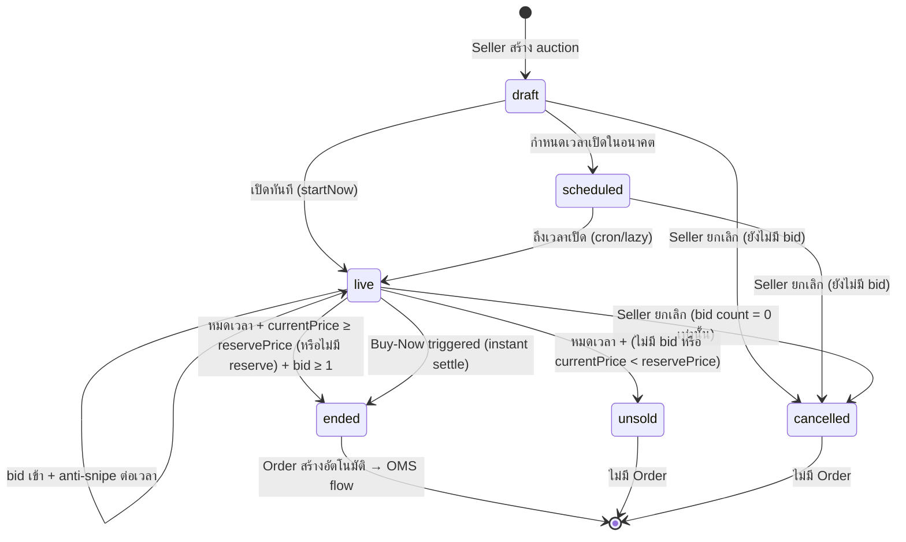
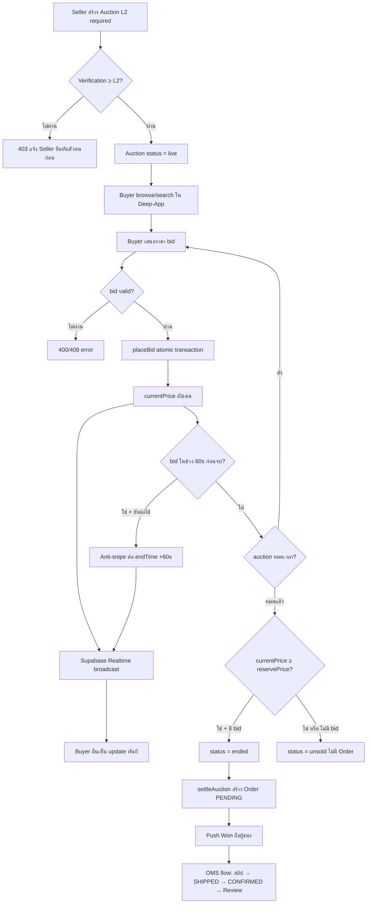

> **โมดูล:** M00002-SellerAuction
> **ประเภทเอกสาร:** Product Requirements Document (PRD)
> **เวอร์ชัน:** 1.0
> **วันที่จัดทำ:** 2026-06-23
> **สถานะ:** Draft
> **เจ้าของเอกสาร:** BA + PO + PM (ดู [[Feature-Docs-Ownership]])

# PRD: Seller Auction + Realtime Bidding

---

## Executive Summary

ระบบ Seller Auction + Realtime Bidding คือการเปิดให้ Seller ที่ผ่านการยืนยันตัวตนระดับ L2+ สร้างรายการประมูลสินค้าบนแพลตฟอร์ม Deep โดยผู้ซื้อ (Buyer) เสนอราคาผ่านแอปมือถือ Deep-App แบบ Realtime ผ่าน Supabase Realtime (Postgres LISTEN/NOTIFY broadcast) เมื่อการประมูลสิ้นสุด ผู้ชนะได้รับ SafePay Order โดยอัตโนมัติผ่านระบบ OMS เดิม ทำให้ Buyer และ Seller ได้รับการคุ้มครองผ่าน Trust Score และ Order History ตามหลักการของ Deep

ระบบนี้แก้ปัญหาการประมูลสินค้าสะสม/ของหายาก (พระเครื่อง นาฬิกา ของโบราณ ฯลฯ) ที่ปัจจุบันกระจัดกระจายอยู่ใน Facebook Live และ Line Group ซึ่งไม่มี escrow ไม่มี trust record และไม่มีกลไกป้องกันมิจฉาชีพ ผลลัพธ์ทางธุรกิจหลักคือเพิ่ม GMV บนแพลตฟอร์ม เพิ่ม Trust Profile ที่สมบูรณ์ขึ้นจาก Auction Order และสร้าง engagement ผ่าน Realtime Bidding

---

## 1. Business Goals & KPIs

### 1.1 เป้าหมายทางธุรกิจ

| เป้าหมาย | รายละเอียด |
|----------|-----------|
| **เพิ่ม GMV แพลตฟอร์ม** | ดึงธุรกรรมประมูลสินค้าสะสมที่เคยอยู่บน Facebook Live / Line เข้ามาผ่านระบบ Deep เพื่อบันทึก Order History + Trust Score |
| **สร้าง Trust ระหว่าง Buyer-Seller ประมูล** | Seller ต้อง L2+ จึงเปิดประมูลได้ — Buyer มั่นใจว่าผู้ขายผ่านการยืนยันตัวตนแล้ว |
| **เพิ่ม Engagement แอปมือถือ** | Realtime Bidding สร้าง engagement ต่อเนื่อง (push notification outbid/won ดึง Buyer กลับมาเสนอราคา) |
| **สร้าง Order History จากการประมูล** | ทุก win → Order ถูกบันทึกใน OMS เดิม → กระทบ Trust Score ทั้ง Seller และ Buyer โดยตรง |
| **ป้องกัน Snipe + ส่งเสริม Fair Bidding** | Anti-snipe (ต่อเวลาอัตโนมัติ) ทำให้การประมูลยุติธรรม ดึงดูดผู้ซื้อที่ซื้อจริง |

### 1.2 ตัวชี้วัดความสำเร็จ (KPIs)

| KPI | คำอธิบาย | เป้าหมาย |
|-----|----------|---------|
| **Auction GMV (30d)** | มูลค่ารวมของ auction ที่ settle สำเร็จ (มี winner) ต่อเดือน | ≥ ฿500,000 ภายใน 60 วันหลัง launch |
| **Auction Sell-Through Rate** | % ของ auction ที่จบแบบมีผู้ชนะ (ไม่ unsold/cancelled) | ≥ 70% |
| **Avg Bids per Auction** | จำนวน bid เฉลี่ยต่อรายการประมูล | ≥ 8 bid/auction |
| **Realtime Latency** | เวลาตั้งแต่ placeBid commit ถึง Buyer client เห็น update ใน app | ≤ 1 วินาที (p95) |
| **Anti-snipe Trigger Rate** | % ของ auction ที่ extension ถูก trigger ≥ 1 ครั้ง | 20–40% (แสดงว่ามีการแข่งช่วงท้าย = healthy) |
| **Win→Order Completion Rate** | % ของ Order ที่เกิดจาก auction ที่ถูก CONFIRMED ภายใน 7 วัน | ≥ 60% |
| **Seller L2 Conversion** | % ของ Seller ที่เปิดใช้ auction หลังจาก verify L2 สำเร็จ | ≥ 30% ภายใน 90 วัน |

---

## 2. User Personas (กลุ่มผู้ใช้งาน)

### 2.1 Seller ประมูลสินค้าสะสม (L2+ Verified)

**ข้อมูลพื้นฐาน:**
- Seller ที่ผ่านการยืนยันตัวตน L2 (บัตรประชาชน + selfie) แล้ว
- ขายสินค้าสะสม เช่น พระเครื่อง นาฬิกา ของโบราณ เหรียญ งานศิลปะ
- เคยจัดประมูลผ่าน Facebook Live หรือ Line Group แต่ไม่มีระบบป้องกัน

**เป้าหมาย:**
- สร้างรายการประมูลได้สะดวก กำหนด starting price, reserve price, buy-now price และช่วงเวลาได้เอง
- ติดตามสถานะ bid แบบ Realtime บน seller dashboard
- ได้รับ Order อัตโนมัติเมื่อ auction สิ้นสุด โดยไม่ต้องทำ manual

**ความต้องการ:**
- จัดการ auction (สร้าง/แก้ไข/ยกเลิก) จาก seller dashboard web
- เห็นรายการ bid ที่เข้ามา Realtime
- ยกเลิก auction ได้ก่อนมี bid (แต่ถ้ามี bid แล้วยกเลิกไม่ได้)

**จุดปวด (Pain Points):**
- Facebook Live ไม่มี Trust Score ของผู้ซื้อ ไม่รู้ว่าคนที่ bid จะจ่ายจริงไหม
- Line Group ไม่มี Order record — ถ้าผู้ซื้อโกง ไม่มีหลักฐาน
- การประมูลผ่าน Facebook Live ไม่ยุติธรรม (คนส่ง comment ช้า = เสียสิทธิ์)

### 2.2 Buyer นักสะสม (แอปมือถือ Deep-App)

**ข้อมูลพื้นฐาน:**
- ผู้ใช้แอปมือถือ Deep-App ที่มี phone OTP account
- นักสะสมสินค้าเฉพาะทาง: พระเครื่อง นาฬิกา ของโบราณ เหรียญ ฯลฯ
- มีประสบการณ์ประมูล Facebook Live แต่เจ็บปวดกับ seller ไม่จริงใจ

**เป้าหมาย:**
- เสนอราคาสินค้าที่ชอบแบบ Realtime ไม่พลาด bid เพราะ network ช้า
- ซื้อทันที (Buy-now) ถ้าไม่อยากรอแข่งกับคนอื่น
- ได้รับ Order อัตโนมัติเมื่อชนะ โดยมีหลักฐานเป็น Trust Record

**ความต้องการ:**
- ดูรายการประมูลทั้งหมดได้ใน app (browse/search/category)
- เห็น Trust Score ของ Seller ก่อนร่วมประมูล
- ได้รับ push notification เมื่อถูกแซงราคา (outbid) หรือชนะ (won)
- ติดตาม (watchlist) auction ที่สนใจ

**จุดปวด (Pain Points):**
- Facebook Live ไม่รู้ว่า seller ส่งของจริงไหม ไม่มี trust record
- ไม่มี push notification ที่เชื่อถือได้เมื่อถูกแซง → ต้องดู Facebook ตลอด
- Sniping (เสนอวินาทีสุดท้าย) ทำให้ไม่ได้สินค้าแม้จะสู้ราคาได้

### 2.3 Admin/Ops (internal monitoring)

**ข้อมูลพื้นฐาน:**
- ทีม Deep ที่ monitor ระบบ auction ผ่าน admin dashboard
- ไม่ได้ร่วมประมูล แต่ต้องตรวจสอบ auction ที่ผิดปกติ

**เป้าหมาย:**
- เห็น auction ทั้งหมด สถานะ และมูลค่า
- ติดตาม auction ที่ settle ล้มเหลวหรือไม่มี winner

**ความต้องการ:**
- รายการ auction ที่ admin dashboard (Phase 2 — ไม่อยู่ใน MVP scope)

**จุดปวด (Pain Points):**
- ไม่มีข้อมูลการประมูลรวมศูนย์ให้ monitor

---

## 3. Business Requirements

### 3.1 การสร้างและจัดการ Auction (Seller)

**ความต้องการ:**
- Seller L2+ สร้าง auction ผ่าน seller dashboard web
- กำหนดได้: title, รูปภาพ (≥1), startPrice, reservePrice (optional), buyNowPrice (optional), bidIncrement, วันเวลาเริ่มต้น (scheduled หรือ live ทันที), วันเวลาสิ้นสุด, หมวดหมู่ (auction category), เชื่อมกับ Product ใน catalog (optional)
- แก้ไข auction ได้ใน state draft หรือ scheduled เท่านั้น
- ยกเลิก auction ได้เฉพาะ draft / scheduled / live-ที่ยังไม่มี bid
- ดู auction ทั้งหมดของร้านตัวเองพร้อมสถานะ

**Business Rules:**
- Seller ต้องมี Verification Level ≥ L2 (APPROVED) จึงสร้าง auction ได้ — กัน anonymous/scam seller
- Seller ห้าม bid auction ของตัวเอง (enforce ที่ API — 403 ถ้า bidderId = auction.shop.userId)
- startPrice ต้องมากกว่า 0
- reservePrice (ถ้าตั้ง) ต้อง ≥ startPrice
- buyNowPrice (ถ้าตั้ง) ต้อง > reservePrice (ถ้ามี) หรือ > startPrice (ถ้าไม่มี reserve)
- endTime ต้องอยู่ในอนาคต (อย่างน้อย 30 นาทีหลังสร้าง)
- auction ที่อยู่ใน state live และมี bid ≥ 1 รายการ → ยกเลิกไม่ได้ (409)

**เหตุผล:**
- L2 guard ทำให้ผู้ซื้อมั่นใจว่า Seller ถูกยืนยันตัวตนแล้ว ลดความเสี่ยงโกง
- Self-bid block กันการโกงราคา (bid-up auction ตัวเอง)
- การห้ามยกเลิกเมื่อมี bid คุ้มครอง Buyer ที่ได้เสนอราคาไปแล้วด้วยความตั้งใจจริง

**สถานะที่ต้องรองรับ:**

| สถานะ | ชื่อภาษาไทย | คำอธิบาย | การใช้งาน |
|-------|------------|----------|----------|
| **draft** | แบบร่าง | สร้างแล้วแต่ยังไม่ publish | แก้ไขได้, ยกเลิกได้ |
| **scheduled** | รอเปิด | กำหนดเวลาเปิดในอนาคต | แก้ไขได้, ยกเลิกได้ |
| **live** | กำลังประมูล | รับ bid ได้แล้ว | ยกเลิกได้เฉพาะยังไม่มี bid |
| **ended** | ปิดประมูล (มีผู้ชนะ) | หมดเวลา + มีผู้ bid สูงสุด ≥ reserve | → Order อัตโนมัติ |
| **unsold** | ปิดประมูล (ไม่ขาย) | หมดเวลา + ไม่มี bid หรือ bid สูงสุด < reserve | ไม่มี Order |
| **cancelled** | ยกเลิก | Seller ยกเลิกก่อนมี bid | ไม่มี Order |

### 3.2 Realtime Bidding (Buyer ผ่านแอป)

**ความต้องการ:**
- Buyer เห็น currentPrice อัปเดต Realtime เมื่อมีคนส่ง bid ใหม่ (ไม่ต้อง refresh)
- Buyer เสนอราคาได้อย่างน้อย currentPrice + bidIncrement
- เมื่อ bid commit สำเร็จ → Buyer อื่นทุกคนที่ดู auction นี้เห็น currentPrice ใหม่ทันที
- Buyer ที่ถูกแซงราคา (outbid) ได้รับ push notification + in-app notification ทันที

**Business Rules:**
- bid amount ต้อง ≥ currentPrice + bidIncrement (ตรวจใน atomic transaction)
- bid หลัง endTime → ปฏิเสธ (409)
- bid หลัง auction status = ended/unsold/cancelled → ปฏิเสธ (409)
- Realtime: ใช้ Supabase Realtime (Postgres NOTIFY → broadcast → client subscribe ตาราง Auction หรือ channel `auction:{id}`)
- แต่ละ bid สำเร็จ → push notification ออกให้ Buyer ที่ถูกแซง (best-effort, ไม่ block bid)

**เหตุผล:**
- Realtime ผ่าน Supabase ใช้ infrastructure ที่มีอยู่แล้ว (ไม่ต้องตั้ง Redis/WebSocket server ใหม่)
- Outbid push notification สร้าง re-engagement loop ดึง Buyer กลับมาเสนอราคาใหม่

### 3.3 Anti-Snipe System

**ความต้องการ:**
- ถ้ามี bid เข้ามาภายใน 60 วินาทีก่อน endTime → ต่อเวลา auction อีก 60 วินาทีอัตโนมัติ
- ต่อเวลาได้สูงสุด 5 ครั้ง (รวม extension สูงสุด 5 นาที)
- แสดงให้ Buyer เห็นใน app ว่า auction ถูกต่อเวลา (Realtime update endTime)

**Business Rules:**
- Anti-snipe เป็น system-wide — ไม่มีตัวเลือกให้ Seller ปิด
- นับครั้งต่อเวลาต่อ auction (ไม่ใช่ต่อ bid)
- ถ้าต่อเวลาครบ 5 ครั้งแล้ว → extension ไม่เกิดขึ้นอีก (auction ปิดตาม endTime ปกติ)

**เหตุผล:**
- กัน "sniping" (เสนอราคาวินาทีสุดท้ายเพื่อไม่ให้คนอื่นสู้ทัน) ซึ่งเป็นปัญหาใน auction ออนไลน์ทั่วไป
- ส่งเสริม fair competition และ engagement

### 3.4 Reserve Price + Buy-Now

**Reserve Price:**
- Seller กำหนด reserve price (ราคาขั้นต่ำที่ต้องการ) — optional
- ถ้า auction จบและ currentPrice < reservePrice → auction จบแบบ **unsold** (ไม่สร้าง Order)
- Buyer เห็นว่ามี reserve price (แต่ไม่เห็นมูลค่าจริง — "มีราคาขั้นต่ำ" เท่านั้น)

**Buy-Now Price:**
- Seller กำหนด buy-now price — optional
- Buyer กด Buy-now → ระบบวางบิดที่ buyNowPrice ทันที → auction settle ทันที (bypass bid process) → สร้าง Order
- ถ้า currentPrice ≥ buyNowPrice แล้ว (มีคน bid ขึ้นมาถึง) → buy-now ปิดตัวเองอัตโนมัติ
- Buy-now ใช้ได้เฉพาะขณะ auction live และยังไม่มีใครกด buy-now

**เหตุผล:**
- Reserve price ป้องกัน Seller ขาดทุนถ้า bid ไม่ถึงราคาที่ต้องการ
- Buy-now ตอบสนอง Buyer ที่ต้องการสินค้าแน่ ๆ โดยไม่อยากเสี่ยงแพ้ bid ช่วงท้าย

### 3.5 Win → Order (เชื่อมระบบ OMS เดิม)

**ความต้องการ:**
- เมื่อ auction สิ้นสุดและมีผู้ชนะ → สร้าง SafePay Order (PENDING) อัตโนมัติ ผ่าน `settleAuction()`
- Order ผูกกับ `auctionId` (`@unique`) — idempotent (settle ซ้ำไม่สร้าง Order ซ้ำ)
- flow ต่อเนื่อง: ผู้ชนะแนบสลิป → Seller ยืนยัน shipped → ผู้ซื้อ confirm received → รีวิว
- ผู้ชนะได้รับ push notification + in-app notification "คุณชนะการประมูล"

**Business Rules:**
- Order ที่เกิดจาก auction ใช้ flow OMS เดิม (PENDING → SHIPPED → CONFIRMED) ทุกประการ
- Seller ที่ไม่ได้ยืนยันชำระภายใน timeout = ใช้กลไก OMS cancel เดิม (auto-timeout = Phase 2)
- Winner ที่ไม่จ่าย = ไม่มี penalty ใน MVP (Phase 2 feature)
- Order.type = PHYSICAL (default), totalAmount = final bid price หรือ buyNowPrice

**เหตุผล:**
- Reuse `settleAuction()` ที่มีอยู่แล้วทำให้ไม่ต้องเขียน settle logic ใหม่
- การผูก auction → Order เข้า Trust Score / Review ระบบเดิมทำให้ Buyer และ Seller ต่างได้รับผลกระทบต่อ profile

### 3.6 Seller Dashboard — Auction Management

**ความต้องการ:**
- Seller เห็นรายการ auction ทั้งหมดของร้านตัวเอง แยกตามสถานะ (draft/scheduled/live/ended/unsold/cancelled)
- เห็น bid ล่าสุด, currentPrice, จำนวน bidder แบบ Realtime ในหน้า auction detail
- ได้รับ notification เมื่อ auction ของตัวเองสิ้นสุด (won/unsold)
- จัดการ auction (สร้าง/แก้ไข/ยกเลิก) จาก dashboard เดียว

**Business Rules:**
- Seller เห็นได้เฉพาะ auction ของร้านตัวเองเท่านั้น (scoped by shopId)
- Seller ไม่เห็นข้อมูลส่วนตัวของ bidder ใน live bid (เห็นแค่ displayName + bid amount)

---

## 4. Business Rules & Constraints

### 4.1 กฎทางธุรกิจหลัก

| กฎ | คำอธิบาย |
|----|----------|
| **L2 Guard** | Seller ต้องมี VerificationRecord level ≥ 2 และ status = APPROVED จึงสร้าง auction ได้ |
| **Self-Bid Block** | Seller ห้าม bid auction ของตัวเอง — ตรวจที่ API: bidderId = auction.shop.userId → 403 |
| **Anti-Snipe (System-Wide)** | bid เข้าในช่วง 60s ก่อนจบ → ต่อเวลา 60s สูงสุด 5 ครั้ง ปิดไม่ได้ |
| **Cancel Policy** | draft/scheduled → ยกเลิกได้เสมอ; live ที่ bid count = 0 → ยกเลิกได้; live ที่ bid count ≥ 1 → ยกเลิกไม่ได้ (409) |
| **Reserve Unsold** | จบแล้ว currentPrice < reservePrice → status = unsold ไม่สร้าง Order |
| **Buy-Now Instant Settle** | Buyer กด Buy-now → bid ที่ buyNowPrice → settle ทันที → Order สร้างทันที |
| **Buy-Now Auto-Close** | currentPrice ≥ buyNowPrice → ตัวเลือก Buy-now หายไปอัตโนมัติ |
| **Win→Order Idempotent** | settleAuction() ถูกเรียกซ้ำ → ตรวจ Order เดิมก่อน ไม่สร้างซ้ำ |
| **Realtime via Supabase** | update currentPrice/endTime หลัง bid/anti-snipe → Supabase Realtime broadcast ไปยัง client ที่ subscribe |

### 4.2 ข้อจำกัดทางธุรกิจ

| ข้อจำกัด | รายละเอียด |
|---------|-----------|
| **Buyer ดูผ่าน Mobile App เท่านั้น (MVP)** | Buyer ร่วมประมูลผ่าน Deep-App (Expo) เท่านั้น; buyer web view = Phase 2 |
| **Seller จัดการ Auction ผ่าน Web เท่านั้น** | seller dashboard web; seller mobile auction mgmt = Phase 2 |
| **Realtime ต้องเปิด Supabase Realtime** | ต้อง enable `supabase_realtime` publication + policy สำหรับ anonymous read (Auction table) |
| **ไม่มี Redis/WebSocket server** | ใช้ Supabase Realtime บน Postgres NOTIFY — ไม่มี in-memory pub/sub แยก |
| **Winner ไม่จ่าย = ไม่มี auto-penalty MVP** | ใช้ OMS cancel เดิม; auto-timeout/penalty = Phase 2 |
| **Admin Auction Moderation** | admin ดู/ระงับ auction ผิดปกติ = Phase 2 |

### 4.3 Auction Lifecycle State Machine

---

## 5. Out of Scope (นอกขอบเขต)

| หัวข้อ | คำอธิบาย |
|--------|----------|
| **Auto-Bid (Proxy Bid)** | ระบบ bid แทนอัตโนมัติตาม budget สูงสุดที่ตั้ง — Phase 2 |
| **Escrow Refund อัตโนมัติ** | Winner ไม่จ่าย → auto-refund/penalty — Phase 2 |
| **WebSocket Server + Redis** | ไม่ใช้ WebSocket/Redis ใน MVP — Supabase Realtime เพียงพอ |
| **Admin Auction Moderation Dashboard** | admin ดู/ระงับ/รีพอร์ต auction ผิดปกติ — Phase 2 |
| **Live-Stream Auction** | Seller broadcast video ขณะประมูล (Facebook Live style) — Phase 2 |
| **Buyer Web View** | Buyer ร่วมประมูลผ่าน browser — Phase 2 (MVP ใช้ app เท่านั้น) |
| **Seller Mobile Auction Management** | Seller สร้าง/แก้ไข auction จากมือถือ — Phase 2 |
| **Dutch Auction / Reverse Auction** | รูปแบบประมูลอื่น — Phase 2 |
| **Auto-Timeout Winner Payment** | ผู้ชนะไม่จ่ายใน X วัน → Order auto-cancel — Phase 2 |
| **Winner Penalty Score** | ลด Trust Score ผู้ชนะที่ไม่จ่าย — Phase 2 |
| **Auction Analytics Dashboard (Seller)** | กราฟ GMV, win rate, category analysis สำหรับ Seller — Phase 2 |

---

## 6. Risks & Mitigation (ความเสี่ยงและแนวทางแก้ไข)

### 6.1 ความเสี่ยงทางธุรกิจ

| ความเสี่ยง | ผลกระทบ | ระดับความรุนแรง | แนวทางแก้ไข |
|-----------|---------|-----------------|-------------|
| **Winner ไม่จ่าย** | Order ค้าง Seller เสียโอกาส | สูง | MVP ใช้ OMS cancel manual; Phase 2 เพิ่ม auto-timeout + penalty score |
| **Seller ตั้ง reserve สูงเกินจริง** | auction จบแบบ unsold บ่อย ลด trust ของ feature | กลาง | ไม่ block แต่ระบบแสดง "มีราคาขั้นต่ำ" ให้ Buyer รู้ก่อน bid; analytics แจ้ง Seller ว่า unsold rate สูง (Phase 2) |
| **Shill Bidding (บัญชีแวง bid ราคา)** | Buyer เสียเปรียบ trust พัง | สูง | L2 guard Seller; self-bid block; report mechanism (Phase 2); badge ที่ผูก real order history กัน fake account |
| **Anti-snipe ทำให้ auction ยาวเกินไป** | UX ไม่ดี Buyer เบื่อรอ | ต่ำ | cap extension 5 ครั้ง (= สูงสุด +5 นาที) เป็น business decision ที่ตัดสินใจแล้ว |

### 6.2 ความเสี่ยงทางเทคนิค

| ความเสี่ยง | ผลกระทบ | แนวทางแก้ไข |
|-----------|---------|-------------|
| **Supabase Realtime config ผิด / RLS บล็อก** | client ไม่เห็น update → ประสบการณ์แย่มาก | เปิด `supabase_realtime` publication สำหรับ Auction table + ตั้ง anon read policy ก่อน deploy; ระบุ NFR ใน SRS |
| **Race condition placeBid concurrent** | bid ซ้ำซ้อน / currentPrice ไม่ถูกต้อง | `placeBid` เป็น Prisma transaction อยู่แล้ว — lock row ผ่าน `findUnique` + `update` ใน transaction |
| **settleAuction lazy ช้า** | auction จบแต่ Order ยังไม่ถูกสร้าง | sweep endpoint + cron (มีแล้ว `/api/app/auctions/[id]/settle`) — เพิ่มโลจิกสำหรับ state ใหม่ (unsold/scheduled) |
| **Anti-snipe update race** | extension เกิดขึ้นมากกว่า 5 ครั้ง | ต้องเพิ่ม `antiSnipeCount` field ใน Auction schema และ increment ใน transaction เดิม (ระบุใน DATABASE.md) |
| **Vercel serverless = per-instance rate-limit** | api-rate-limit ไม่ครอบคลุม cross-instance | กัน bid storm ด้วย atomic transaction (ไม่ใช่ in-memory) — Prisma CHECK และ DB constraint เป็นหลักสุดท้าย |

---

## 7. Glossary (อภิธานศัพท์)

| คำศัพท์ | ความหมาย |
|---------|----------|
| **Auction** | รายการประมูลสินค้าที่ Seller สร้าง มีราคาเริ่มต้น ช่วงเวลา และกฎการบิด |
| **Bid** | การเสนอราคาของ Buyer ต้องสูงกว่า currentPrice + bidIncrement |
| **currentPrice** | ราคาล่าสุดที่ bid สูงสุดในขณะนั้น (อัปเดตทุกครั้งที่มี bid ใหม่) |
| **startPrice** | ราคาเริ่มต้น = currentPrice ก่อนมี bid แรก |
| **bidIncrement** | ขั้นต่ำที่ bid ถัดไปต้องสูงกว่า currentPrice |
| **reservePrice** | ราคาขั้นต่ำที่ Seller ตั้ง — ถ้า currentPrice ไม่ถึง = auction จบแบบ unsold |
| **buyNowPrice** | ราคาซื้อทันที — Buyer กดได้เลย ไม่ต้องรอ auction จบ |
| **Anti-Snipe** | กลไกต่อเวลา auction อัตโนมัติ 60 วินาทีเมื่อมี bid ช่วง 60s สุดท้าย (สูงสุด 5 ครั้ง) |
| **Settle** | กระบวนการปิดประมูลและสร้าง Order สำหรับผู้ชนะ |
| **Unsold** | สถานะ auction ที่จบโดยไม่มี Order (ไม่มี bid หรือ bid ไม่ถึง reserve) |
| **Realtime** | การส่งข้อมูลจาก Supabase ไปยัง client ทันทีผ่าน Postgres LISTEN/NOTIFY broadcast ของ Supabase Realtime |
| **L2 Guard** | การตรวจสอบว่า Seller มี VerificationRecord level ≥ 2 สถานะ APPROVED ก่อนอนุญาตให้สร้าง auction |
| **Shill Bidding** | การโกงโดย Seller ใช้บัญชีแวงเสนอราคาขึ้นไปเองเพื่อดึงให้ Buyer แข่งราคาสูงขึ้น |
| **Deep-App** | แอปมือถือ Expo สำหรับ Buyer ที่มี auction browse/bid/win/order flow |
| **Win→Order** | การที่ `settleAuction()` สร้าง SafePay Order อัตโนมัติให้ผู้ bid สูงสุดเมื่อ auction สิ้นสุด |

---

## 8. Success Metrics (ตัวชี้วัดความสำเร็จ)

เมื่อระบบทำงานได้ดี ควรมีผลลัพธ์ดังนี้:

| ตัวชี้วัด | ค่าที่คาดหวัง | วิธีวัด |
|----------|---------------|--------|
| **Auction GMV (30d)** | ≥ ฿500,000 | SUM(Order.totalAmount) WHERE Order.auctionId IS NOT NULL AND status IN (PENDING, SHIPPED, CONFIRMED) |
| **Sell-Through Rate** | ≥ 70% | นับ auction status = ended / (ended + unsold) |
| **Avg Bids per Auction** | ≥ 8 | AVG(Auction.bidCount) WHERE status IN (ended, unsold) |
| **Realtime Latency p95** | ≤ 1 วินาที | วัดจาก placeBid timestamp ถึง client รับ Supabase event (Deep-App logging) |
| **Win→Order Completion (7d)** | ≥ 60% | นับ Order จาก auction ที่ CONFIRMED ภายใน 7 วัน |
| **Seller L2 Auction Adoption** | ≥ 30% ภายใน 90 วัน | นับ Seller L2+ ที่สร้าง auction ≥ 1 รายการ / Seller L2+ ทั้งหมด |

---

## 9. Dependencies & Assumptions

### 9.1 สิ่งที่ต้องพึ่งพา (Dependencies)

| ระบบ/ส่วนประกอบ | ความสัมพันธ์ |
|-----------------|-------------|
| **Supabase Realtime** | ต้องเปิด `supabase_realtime` publication + กำหนด RLS/anon policy สำหรับ Auction table ก่อน deploy |
| **`settleAuction()` (auction.service.ts)** | Reuse โดยตรง — ต้องขยาย logic รองรับ state unsold, reservePrice, buyNowPrice, antiSnipeCount |
| **`placeBid()` (auction.service.ts)** | Reuse โดยตรง — ต้องเพิ่ม self-bid check + anti-snipe logic + buy-now path |
| **verification.service.ts** | `getMaxVerificationLevel(userId)` ตรวจ L2 guard ที่ API create auction |
| **OMS (Order model)** | สร้าง Order จาก settleAuction ใช้โครงสร้างเดิม (`Order.auctionId @unique`) |
| **trust-score.service.ts + Tier Lists SSOT** | แสดง Trust Score ของ Seller ใน auction detail ฝั่ง Buyer app — ใช้ `getTierDisplay` |
| **app-push.service.ts** | ส่ง push notification outbid/won/auction-ended (best-effort post-commit) |
| **[[DATABASE]] (feature นี้)** | เพิ่ม field: `Auction.reservePrice`, `Auction.buyNowPrice`, `Auction.antiSnipeCount`, `Auction.status` ขยาย enum (`draft`, `scheduled`, `unsold`, `cancelled`) |
| **seller dashboard UI (Paces)** | สร้าง auction management pages ใหม่ใน `src/app/(paces)/seller/auctions/` — ต้องผ่าน safepay-ux ก่อน |

### 9.2 สมมติฐาน (Assumptions)

- Supabase project ปัจจุบัน (dev/prod ตัวเดียวกัน) รองรับ Supabase Realtime — assumed enabled แต่ต้องยืนยันก่อน implement
- ไม่มี RLS บน production Supabase ปัจจุบัน (auth อยู่ที่ service layer) — Realtime policy สำหรับ Auction = anon read ปลอดภัย เพราะ auction data ไม่มี PII
- `Auction.status` ปัจจุบันใช้ string `"live"` / `"ended"` เท่านั้น — การเพิ่ม `"draft"`, `"scheduled"`, `"unsold"`, `"cancelled"` ต้องการ migration แต่ backward-compatible
- Seller dashboard web (Paces) เป็นจุดเดียวที่ Seller จัดการ auction ใน MVP — ไม่มี mobile admin
- Deep-App (Expo) รองรับ Supabase Realtime client library — assumed; ต้องยืนยันใน SRS
- Timer/cron สำหรับ transition `scheduled → live` ใช้ lazy settle pattern เดิม (ตรวจตอน browse) + cron endpoint ที่มีอยู่

---

## 10. Appendix

### 10.1 ตัวอย่าง User Journey — Seller สร้าง Auction + Buyer ชนะและรับ Order

**Scenario: Seller L2 สร้าง auction พระเครื่อง → Buyer ประมูลชนะ → ได้ Order**

1. Seller เปิด `/seller/auctions/create` บน seller dashboard
2. กรอก title "พระสมเด็จวัดระฆัง เนื้อผง 3 ชั้น", รูป 3 ใบ, startPrice 5,000, reservePrice 8,000, buyNowPrice 25,000, bidIncrement 500, endTime = พรุ่งนี้ 20:00
3. กด Publish → auction status = live
4. Buyer A เปิด Deep-App เห็น auction นี้ใน category "พระเครื่อง" → กด Watch
5. Buyer A เสนอราคา 5,500 → `placeBid()` commit → currentPrice = 5,500 → Supabase Realtime broadcast → Buyer B และ C ที่ดูอยู่เห็น update ทันที
6. Buyer B เสนอ 10,000 → Buyer A ได้รับ push "มีคนเสนอราคาสูงกว่า 10,000 บาท"
7. ถึง 19:59:30 (30 วินาทีก่อนจบ) Buyer A เสนอ 10,500 → anti-snipe trigger → endTime เปลี่ยนเป็น 20:00:30 → Realtime broadcast → ทุก client เห็น countdown อัปเดต
8. 20:00:30 ผ่านไป ไม่มี bid ใหม่ → auction จบ (currentPrice 10,500 ≥ reservePrice 8,000 → status = ended)
9. `settleAuction()` สร้าง Order (PENDING) ให้ Buyer A → push notification "คุณชนะการประมูล พระสมเด็จวัดระฆัง 10,500 บาท"
10. Buyer A แนบสลิปใน app → Seller mark shipped → Buyer confirm → review → Trust Score update

### 10.2 ตัวอย่าง User Journey — Buy-Now Path

**Scenario: Buyer กด Buy-Now ซื้อทันทีก่อน auction จบ**

1. Buyer เห็น auction ที่มี buyNowPrice 25,000
2. currentPrice ปัจจุบัน 10,500 (< buyNowPrice) → ปุ่ม Buy-Now ยังแสดง
3. Buyer กด Buy-Now → ระบบ bid ที่ buyNowPrice 25,000 ในทันที
4. `placeBid()` commit → `settleAuction()` ถูกเรียกทันที (bypass endTime)
5. Order สร้างที่ 25,000 → Buyer ได้รับ Order ทันที → flow OMS ปกติ

### 10.3 ตัวอย่าง User Journey — Reserve Price Unsold

**Scenario: auction จบแต่ bid ไม่ถึง reserve**

1. Seller ตั้ง startPrice 1,000, reservePrice 5,000
2. auction จบโดย currentPrice = 3,500 (< reserve 5,000)
3. `settleAuction()` ตรวจ: 3,500 < 5,000 → status = unsold → ไม่สร้าง Order
4. Seller ได้รับ notification "การประมูลสิ้นสุด ราคาไม่ถึงขั้นต่ำ"
5. Buyer bid สูงสุดได้รับ notification "การประมูลสิ้นสุด ราคาไม่ถึงขั้นต่ำของผู้ขาย"

---

**หมายเหตุ:**
เอกสารนี้เป็นการบันทึกความต้องการทางธุรกิจ (Business Requirements) โดยไม่มีรายละเอียดทางเทคนิค
สำหรับ Functional Requirements / User Story / Acceptance Criteria ดู [[BRD]] ของโมดูลนี้
สำหรับ technical specification ดู [[SRS]] ของโมดูลนี้
สำหรับ schema changes ดู [[DATABASE]] ของโมดูลนี้
