> **โมดูล:** M00002-SellerAuction
> **ประเภทเอกสาร:** System Design Spec (SDS)
> **เวอร์ชัน:** 1.0
> **วันที่จัดทำ:** 2026-07-01
> **สถานะ:** Draft
> **เจ้าของเอกสาร:** SA (safepay-planner) — ดู [[Feature-Docs-Ownership]]

# SDS: Seller Auction + Realtime Bidding (System Design Spec)

---

## 1. บทนำ & References

### 1.1 วัตถุประสงค์

เอกสารนี้ออกแบบ **"อย่างไร"** ของ Seller Auction + Realtime Bidding (M00002) ต่อจาก [[SRS]] ซึ่งเป็น SSOT ของ **"อะไร"** (contract, endpoint, DTO field name, state machine, validation rule) — SDS นี้**ไม่เปลี่ยนแปลง contract ใด ๆ** ที่ freeze แล้วใน SRS §3–§5, แต่ลงรายละเอียดเชิง implementation: โครงสร้างไฟล์จริง, function signature, sequence การเรียกข้าม layer, module dependency, UI component tree + theme source ที่ต้อง copy, error-handling mapping และลำดับ build ที่ `safepay-developer` เอาไป implement ได้ทันทีโดยไม่ต้องเดา

ผู้อ่านหลัก: `safepay-developer` (ผู้ implement ตรง signature), `safepay-reviewer`/`safepay-security` (ผู้ตรวจ diff เทียบ design นี้), `safepay-qa` (ผู้เขียน test case จากจุดที่ระบุใน §11), `safepay-database` (ผู้ apply migration ตามลำดับ §9)

### 1.2 ขอบเขตการออกแบบ

**อยู่ในขอบเขต:** ออกแบบไฟล์/ฟังก์ชันที่ต้องสร้าง-แก้ทั้งหมดตาม SRS §1.2 in-scope — service layer (`auction.service.ts`, `badge.service.ts`, `auction-level.ts`), API route handler (seller 7 ใหม่ + buyer ขยาย 4 + ใหม่ 3), Valibot schema, seller Paces UI (list/create/detail-console), Realtime client (seller console) + Postgres trigger design

**นอกขอบเขต:** เหมือน SRS §1.2 out-of-scope ทุกข้อ (manual extend, auto-bid, admin moderation ฯลฯ) — SDS นี้ไม่ design ล่วงหน้าสำหรับ Phase 2. Deep-App (Expo, คนละ repo) เป็นเพียง "note" ไม่ใช่ deliverable ของ repo นี้

### 1.3 เอกสารอ้างอิง

| เอกสาร | ความสัมพันธ์ |
|--------|-------------|
| [[SRS]] (`SRS.md`) | Contract แบบ freeze — TFR-001~017, API §4, DTO §5.1, state machine §TFR-014, PII rule §5.5, risk §8. SDS ต้อง realize ตรงนี้ 100% |
| [[BRD]] (`BRD.md`) | FR-AUC-01~13 + AC ระดับธุรกิจ |
| [[PRD]] (`PRD.md`) | เป้าหมายธุรกิจ/persona |
| [[DATABASE]] (`DATABASE.md`) | SSOT schema delta + migration SQL จริง (Migration 1/2 + CHECK constraints) |
| [[UI-DESIGN-SPEC]] (`UI-DESIGN-SPEC.md`) | Theme source mapping ที่ approve แล้ว (v10/Command Console) |
| `src/services/auction.service.ts` | โค้ดปัจจุบันที่ refactor/ขยาย |
| `docs/conventions/paces-toast.md` | Hard Rule 9 — toast ใน seller console |
| `docs/conventions/paces-charts-source.md` | Hard Rule 10 — chart ใน console ต้อง copy จาก theme charts dir |
| `docs/conventions/date-format.md` | timestamp แสดงผลผ่าน `formatDateTime`/`formatDate` เท่านั้น |
| `docs/system/ui-guideline/paces-component-reference.md` | Paces primitive/token reference |

---

## 2. Architecture Overview

### 2.1 มุมมองสถาปัตยกรรม

ระบบเดียว (monolith Next.js App Router) — ไม่มี submodule แยก stack เหมือนระบบ polyglot ใน template ทั่วไป โครงสร้างยึด convention เดิมเป๊ะ: **Route Handler → Service layer → Prisma → Postgres**, ไม่เพิ่ม layer ใหม่ ไม่เพิ่ม framework/queue/cache ใด ๆ Realtime ใช้ Supabase ที่มีอยู่แล้ว (Broadcast from Database แทน `postgres_changes` — ดู §9)

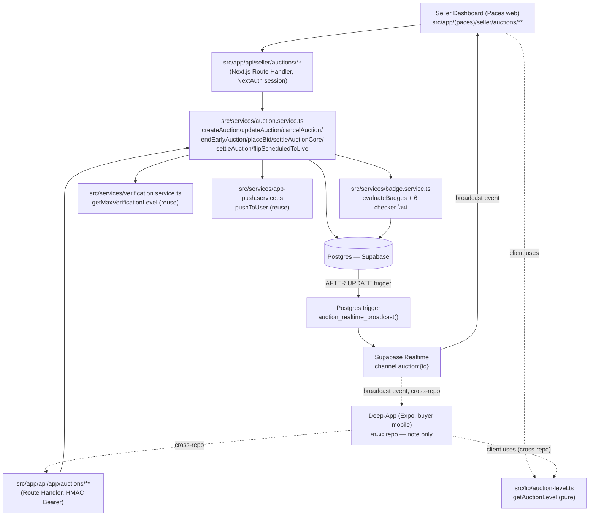

### 2.2 มุมมองการ Deploy

- **Vercel serverless (multi-instance):** ทุก route handler ข้างต้นรันแบบ stateless request/response — ห้ามพึ่ง module-level mutable state สำหรับ correctness (ตรงตาม SRS §2.3/NFR Scalability) ยกเว้น `api-rate-limit.ts`/`app-token` แบบเดิมที่ยอมรับ known-gap อยู่แล้ว
- **Postgres (Supabase) เดียว** dev/prod แชร์ — migration ทุกตัว (§9) ต้อง user approve ก่อน apply
- **ไม่เพิ่ม cron infra** — sweep function (`settleEndedAuctions`, `flipScheduledToLive`) เรียกแบบ lazy-inline จากจุดอ่านข้อมูล (เหมือนเดิม)

---

## 3. Component Design

| Component | หน้าที่ (Responsibility) | Dependency |
|-----------|--------------------------|-----------|
| **`src/services/auction.service.ts`** (ขยาย) | business logic ทั้งหมด: CRUD auction, state transition, atomic bid, anti-snipe, settle, DTO mapping (2 DTO แยก) | Prisma → Postgres; เรียก `verification.service`, `badge.service`, `app-push.service` |
| **`src/lib/auction-level.ts`** (ใหม่) | pure function: `successfulBidCount` → ladder level/label/icon — ไม่มี I/O | ไม่มี (pure) |
| **`src/lib/validations.ts`** (ขยาย) | Valibot schema สร้าง/แก้/end-early auction (seller-side) | valibot |
| **`src/lib/app-validations.ts`** (คงเดิม) | `AppPlaceBidSchema` มีอยู่แล้ว — ไม่ต้องแก้ (buy-now ไม่มี body) | valibot |
| **`src/app/api/seller/auctions/**`** (ใหม่ทั้งหมด) | รับ request seller web, ตรวจ session/ownership/L2, เรียก service, แปล error → HTTP status | NextAuth session, `auction.service.ts` |
| **`src/app/api/app/auctions/**`** (ขยาย 4 + ใหม่ 3) | รับ request buyer app, ตรวจ HMAC Bearer, เรียก service เดียวกับ seller | `app-auth.ts::requireAppUser`, `auction.service.ts` |
| **`src/app/(paces)/seller/auctions/**`** (ใหม่ — pages) | RSC data-fetch (ownership scope ที่ WHERE) + client interactive (bid feed, countdown, control panel) | `getServerSession`, `auction.service.ts` (เรียกตรงจาก RSC ไม่ผ่าน HTTP fetch เอง — ตาม convention seller orders เดิม) |
| **`src/services/badge.service.ts`** (ขยาย) | เพิ่ม 6 branch ใน `evaluateBadges` dispatch สำหรับ criteria type ใหม่ | Prisma |
| **`src/types/badge.ts`** (ขยาย) | union type criteria ใหม่ 6 ตัว | — |
| **`prisma/badge-seed-data.ts`** (ขยาย) | seed 6 badge entry MVP | — |
| **Postgres trigger `auction_realtime_broadcast`** (ใหม่ — migration SQL) | ส่ง payload ที่กรองคอลัมน์แล้วผ่าน `realtime.send()` แทน raw row replication | Supabase Realtime ≥2.x |
| **`AuctionCountdown`/`AuctionBidFeed`/`AuctionControlPanel`** (client components ใหม่) | subscribe Realtime, countdown, render bid monitor log, action cluster | `@supabase/supabase-js`, `pacesToast`, Sweet Alerts |

---

## 4. Data Flow (Sequence Diagrams)

### 4.1 Create Auction (TFR-001)

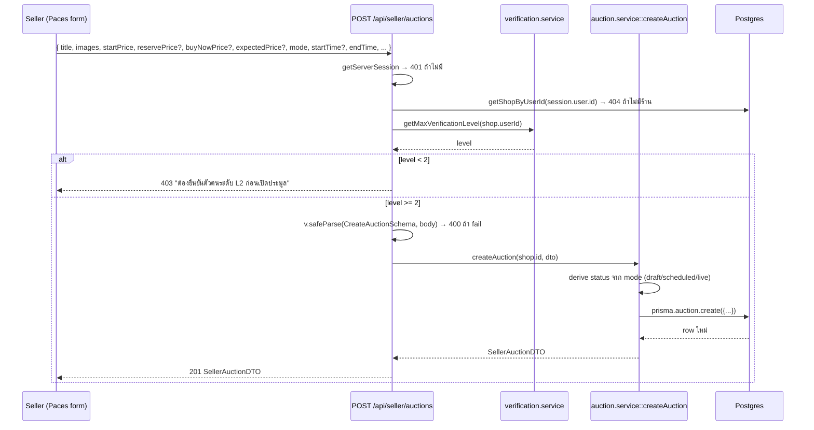

### 4.2 Place Bid + Anti-Snipe + Buy-Now hook (TFR-005/006/007)

(ขยายรายละเอียดจาก SRS §4.4 — เพิ่ม branch buy-now เต็มรูปในทรานแซคชันเดียว)

```mermaid
sequenceDiagram
    participant B as Buyer App
    participant API as POST /api/app/auctions/[id]/bid หรือ /buy-now
    participant Svc as auction.service::placeBid
    participant DB as Postgres (tx)
    participant Badge as badge.service::evaluateBadges
    participant RT as Supabase Realtime (trigger)
    participant Push as app-push.service::pushToUser

    B->>API: { amount } (bid) หรือ ไม่มี body (buy-now → amount=buyNowPrice)
    API->>API: requireAppUser → 401 ถ้าไม่มี Bearer
    API->>Svc: placeBid(auctionId, bidderId, amount)
    Svc->>DB: BEGIN tx; findUnique Auction (+shop.userId)
    DB-->>Svc: auction row (snapshot)
    Svc->>Svc: guard: status='live', ไม่หมดเวลา, ไม่ self-bid, amount>=minNext
    alt guard fail
        Svc-->>API: throw BidError(400/403/404/409)
        API-->>B: HTTP error ตาม BidError.status
    else guard ผ่าน
        Svc->>DB: updateMany WHERE id, status='live', currentPrice=<snapshot>
        alt count = 0 (race — คนอื่นแซงระหว่างนี้)
            DB-->>Svc: count 0
            Svc-->>API: throw BidError('มีคนเสนอราคาก่อนคุณ', 409)
            API-->>B: 409 (client retry ด้วยราคาล่าสุด)
        else count = 1
            Svc->>DB: INSERT Bid
            Svc->>Svc: amount >= buyNowPrice?
            alt buy-now
                Svc->>Svc: settleAuctionCore(tx, auctionId, {force:true})
                Svc->>DB: update status='ended' + create Order (idempotent)
            else ปกติ
                Svc->>Svc: endTime-now<=60s AND antiSnipeCount<5?
                opt anti-snipe
                    Svc->>DB: UPDATE endTime+=60s, antiSnipeCount+=1 (ใน tx เดียวกัน)
                end
            end
            Svc->>DB: INSERT Notification (outbid) ถ้ามีผู้ถูกแซง
            Svc->>DB: COMMIT
            DB->>RT: trigger fires → realtime.send(sanitized payload)
            RT-->>B: broadcast (ทุก client subscribe channel auction:{id})
            Svc-->>API: PublicAuctionDTO
            API-->>B: 200 PublicAuctionDTO
            Svc->>Push: pushToUser outbid (best-effort, post-commit, ไม่ throw)
            Svc->>Badge: evaluateBadges(bidderId,'BUYER') (best-effort, post-commit)
        end
    end
```

### 4.3 Buy-Now Instant Settle (TFR-007) — โฟกัส guard ก่อนเข้า transaction

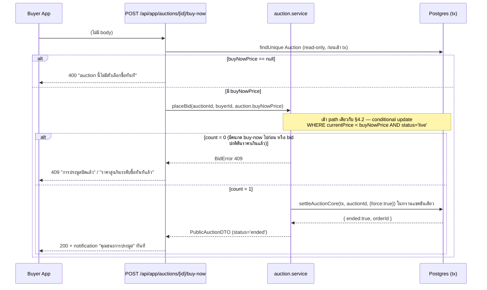

### 4.4 End-Early (TFR-012) — double-confirm below-reserve

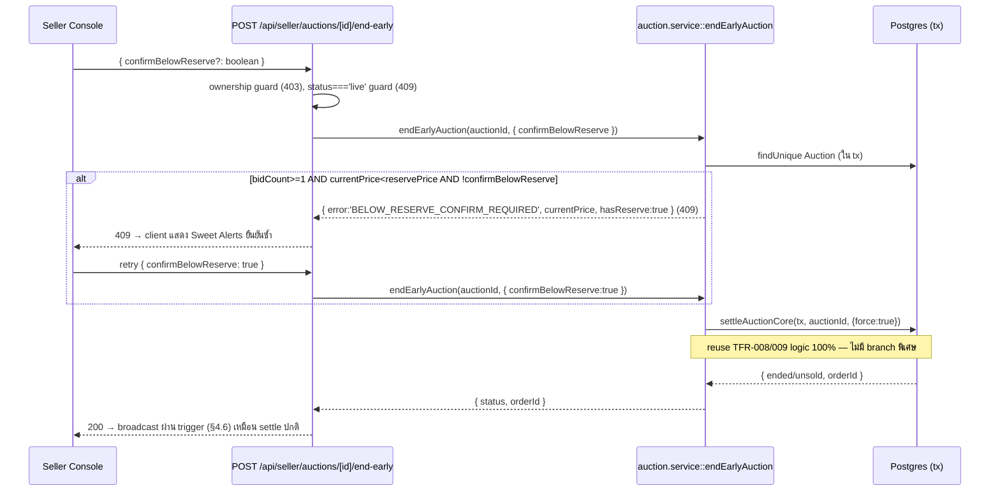

### 4.5 Settle Lazy/Cron (TFR-009/015)

```mermaid
sequenceDiagram
    participant Caller as browseAuctions()/topAuctions()/seller-list/seller-detail<br/>หรือ POST /api/app/auctions/[id]/settle (external cron)
    participant Sweep as settleEndedAuctions() / flipScheduledToLive()
    participant Svc as settleAuction(auctionId)
    participant DB as Postgres

    Caller->>Sweep: เรียก lazy ก่อน query หลัก (await)
    Sweep->>DB: findMany WHERE status='live' AND endTime<=now() (take:100)
    loop แต่ละ auction ที่ due
        Sweep->>Svc: settleAuction(id)
        Svc->>DB: $transaction(tx => settleAuctionCore(tx, id))
        Svc-->>Sweep: { ended, orderId } (idempotent — findUnique Order ก่อนสร้างซ้ำ)
        opt error
            Sweep->>Sweep: catch → console.error('[settleEndedAuctions] failed for', id, e); ทำต่อ auction ถัดไป
        end
    end
    Sweep-->>Caller: จำนวนที่ปิดสำเร็จ
    Caller->>DB: query หลัก (browse/list/detail) ด้วยข้อมูลล่าสุดหลัง sweep
```

### 4.6 Realtime Broadcast Flow (TFR-010, Broadcast from Database)

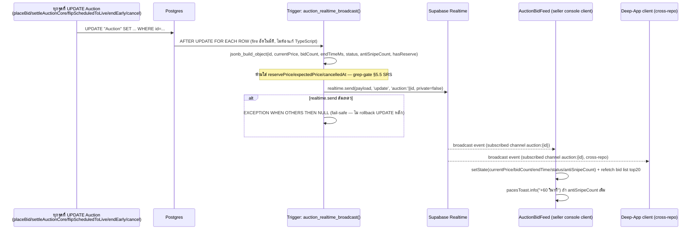

### 4.7 Data Flow ภาพรวม (ไม่ใช่ sequence — flow ของ field sensitive)

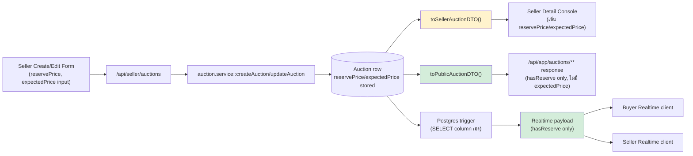

---

## 5. Component/Module Breakdown (ไฟล์จริงที่ต้องสร้าง/แก้)

### 5.1 Service layer

| ไฟล์ | Action | รายละเอียด |
|---|---|---|
| `src/services/auction.service.ts` | **แก้ (major refactor + extend)** | ดู §6 function signature ทั้งหมด |
| `src/lib/auction-level.ts` | **ใหม่** | pure function `getAuctionLevel` |
| `src/services/badge.service.ts` | **แก้** | เพิ่ม 6 checker + dispatch branch ใน `evaluateBadges`/criterion switch |
| `src/types/badge.ts` | **แก้** | เพิ่ม union `AUCTION_HOSTED \| AUCTION_SOLD \| AUCTION_HIGH_BID_COUNT \| AUCTION_BID_COUNT \| AUCTION_WON \| AUCTION_WON_COMPLETED` |
| `prisma/badge-seed-data.ts` | **แก้** | เพิ่ม 6 entry ตาม [[DATABASE]] §6.1 (upsert by `nameEN`) |
| `src/lib/validations.ts` | **แก้** | เพิ่ม `CreateAuctionSchema`, `UpdateAuctionSchema`, `EndEarlyAuctionSchema` |
| `src/lib/app-validations.ts` | **ไม่แก้** | `AppPlaceBidSchema` มีอยู่แล้วครบ (buy-now ไม่รับ body) |

### 5.2 API routes — Seller (ใหม่ทั้งหมด, ใต้ `src/app/api/seller/auctions/`)

| Path | File |
|---|---|
| `POST/GET /api/seller/auctions` | `src/app/api/seller/auctions/route.ts` |
| `GET/PATCH /api/seller/auctions/[id]` | `src/app/api/seller/auctions/[id]/route.ts` |
| `POST /api/seller/auctions/[id]/publish` | `src/app/api/seller/auctions/[id]/publish/route.ts` |
| `POST /api/seller/auctions/[id]/cancel` | `src/app/api/seller/auctions/[id]/cancel/route.ts` |
| `POST /api/seller/auctions/[id]/end-early` | `src/app/api/seller/auctions/[id]/end-early/route.ts` |

### 5.3 API routes — Buyer (ขยาย 4, ใหม่ 3, ใต้ `src/app/api/app/auctions/`)

| Path | File | สถานะ |
|---|---|---|
| `GET /api/app/auctions/browse` | `src/app/api/app/auctions/browse/route.ts` | ขยาย |
| `GET /api/app/auctions/top` | `src/app/api/app/auctions/top/route.ts` | คงเดิม |
| `GET /api/app/auctions/[id]` | `src/app/api/app/auctions/[id]/route.ts` | ขยาย |
| `POST /api/app/auctions/[id]/bid` | `src/app/api/app/auctions/[id]/bid/route.ts` | ขยาย (bug fix) |
| `POST /api/app/auctions/[id]/buy-now` | `src/app/api/app/auctions/[id]/buy-now/route.ts` | **ใหม่** |
| `POST /api/app/auctions/[id]/settle` | `src/app/api/app/auctions/[id]/settle/route.ts` | คงเดิม |
| `POST/DELETE /api/app/auctions/[id]/watch` | `src/app/api/app/auctions/[id]/watch/route.ts` | **ใหม่** (Open Question #5 SRS — รอ confirm scope) |

### 5.4 Pages (seller, Paces) — `src/app/(paces)/seller/`

| Route | File | RSC/Client |
|---|---|---|
| `/seller/auctions` | `(dashboard)/auctions/page.tsx` | RSC (data fetch scoped WHERE shopId) |
| `/seller/auctions` list interactivity | `(dashboard)/auctions/components/AuctionListClient.tsx` | client (chip filter, countdown, `FilterDropdown` action menu) |
| `/seller/auctions` list row | `(dashboard)/auctions/components/AuctionRow.tsx` | client |
| `/seller/auctions` desktop table | `(dashboard)/auctions/components/AuctionDataTable.tsx` | client |
| `/seller/auctions` stat strip | `(dashboard)/auctions/components/AuctionStatStrip.tsx` | RSC (props จาก page) |
| `/seller/auctions/new` (+ `[id]/edit` reuse) | `(fullscreen)/auctions/new/page.tsx`, `(fullscreen)/auctions/[id]/edit/page.tsx` | client (RHF+Yup) — ตาม pattern `products/new-v2` |
| create form fields | `(fullscreen)/auctions/components/AuctionForm.tsx` | client |
| `/seller/auctions/[id]` detail console | `(dashboard)/auctions/[id]/page.tsx` | RSC (ownership scope `findFirst WHERE shop.userId`) |
| console head + action cluster | `(dashboard)/auctions/[id]/components/ConsoleHead.tsx` | client |
| KPI stat cards | `(dashboard)/auctions/[id]/components/AuctionStatCards.tsx` | client (props จาก Realtime state) |
| bid monitor log | `(dashboard)/auctions/[id]/components/AuctionBidFeed.tsx` | client (Realtime subscribe) |
| control panel + danger zone | `(dashboard)/auctions/[id]/components/AuctionControlPanel.tsx` | client |
| price trend chart | `(dashboard)/auctions/[id]/components/AuctionPriceChart.tsx` | client (`ApexChart` wrapper) |
| expectedPrice gauge | `(dashboard)/auctions/[id]/components/ExpectedPriceGauge.tsx` | client (`ApexChart` wrapper, radial bar) |
| countdown | `_shared/AuctionCountdown.tsx` (shared list+detail) | client |
| command center entry tile | แก้ `(dashboard)/dashboard/components/...` (carousel tile ใหม่) + sidenav item | — |

### 5.5 Module Dependency Graph

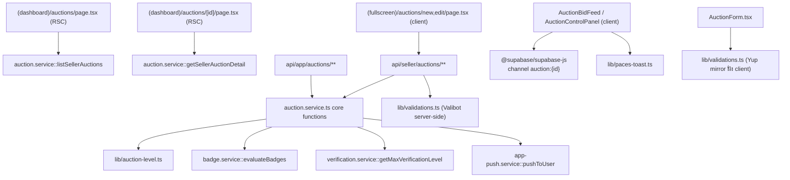

---

## 6. Function Signatures (TypeScript) — `src/services/auction.service.ts`

> ทุก signature ด้านล่างต้อง**backward-compatible**กับ caller เดิม (`settleEndedAuctions`, `/api/app/auctions/[id]/settle`, `browseAuctions`, `topAuctions`, `searchAuctions`, `watchingAuctions`, `bidHistory`) ตาม NFR Maintainability ใน SRS §6

```ts
// ── DTO types (§7 ลงรายละเอียดเต็ม) ──────────────────────────────────────────
export type PublicAuctionDTO = { /* ดู §7.1 */ }
export type SellerAuctionDTO = PublicAuctionDTO & { /* ดู §7.1 */ }

// ── Mapper (แทนที่ toAuctionDTO เดิม — เดิม export ไว้ใช้ร่วมกับ app-shop.service) ──
export function toPublicAuctionDTO(a: AuctionRow): PublicAuctionDTO
export function toSellerAuctionDTO(
  a: AuctionRow,
  bidHistory: BidDTO[],
): SellerAuctionDTO

// ── Create/Edit/Cancel (seller-side, ใหม่) ───────────────────────────────────
export type CreateAuctionInput = {
  title: string
  description?: string
  images: string[]
  category?: string
  productId?: string
  startPrice: number
  reservePrice?: number
  buyNowPrice?: number
  expectedPrice?: number
  bidIncrement: number
  mode: 'draft' | 'publishNow' | 'schedule'
  startTime?: Date
  endTime: Date
}
export async function createAuction(
  shopId: string,
  input: CreateAuctionInput,
): Promise<SellerAuctionDTO>

export type UpdateAuctionInput = Partial<
  Pick<CreateAuctionInput, 'title' | 'description' | 'images' | 'bidIncrement' | 'endTime' | 'category' | 'productId'>
> // + startPrice/reservePrice/buyNowPrice/expectedPrice ถ้า Open Question #1 confirm ว่าแก้ได้
export async function updateAuction(
  auctionId: string,
  shopUserId: string,
  input: UpdateAuctionInput,
): Promise<SellerAuctionDTO> // throw AuctionOpError (403 ownership / 409 state)

export async function cancelAuction(
  auctionId: string,
  shopUserId: string,
): Promise<{ status: 'cancelled' }> // throw AuctionOpError (403/409)

export async function publishAuction(
  auctionId: string,
  shopUserId: string,
  mode: 'publishNow' | 'schedule',
  startTime?: Date,
): Promise<SellerAuctionDTO> // draft → live/scheduled

export async function listSellerAuctions(
  shopId: string,
  opts: { status?: string; page?: number },
): Promise<{ items: SellerAuctionListItemDTO[]; nextCursor: number | null }>

export async function getSellerAuctionDetail(
  auctionId: string,
  shopUserId: string,
): Promise<SellerAuctionDTO | null> // findFirst WHERE id AND shop.userId (ไม่ใช่ findUnique+post-check)

// ── Bid / Anti-snipe / Buy-now (refactor concurrency-safe) ───────────────────
export class BidError extends Error {
  constructor(message: string, readonly status: number) { super(message) }
}

export async function placeBid(
  auctionId: string,
  bidderId: string,
  amount: number,
): Promise<PublicAuctionDTO> // เปลี่ยน return type จาก AuctionDTO เดิม → PublicAuctionDTO (superset field เท่ากัน+เพิ่ม)

// ── Settle core/wrapper (2 ชั้น ตาม TFR-009/R-SRS-5) ──────────────────────────
export async function settleAuctionCore(
  tx: Prisma.TransactionClient,
  auctionId: string,
  opts?: { force?: boolean },
): Promise<{ ended: boolean; orderId: string | null }>
// force=true: ข้าม endTime>now() check (ใช้จาก buy-now/end-early)
// force=false/undefined: ต้อง endTime<=now() (ใช้จาก settle ปกติ)

export async function settleAuction(
  auctionId: string,
): Promise<{ ended: boolean; orderId: string | null }>
// wrapper เดิม — คง signature เป๊ะ (caller เดิมไม่ต้องแก้)
// impl: return prisma.$transaction(tx => settleAuctionCore(tx, auctionId))

export async function settleEndedAuctions(): Promise<number> // คงเดิมทุกอย่าง

// ── Scheduled → Live lazy transition (ใหม่) ──────────────────────────────────
export async function flipScheduledToLive(): Promise<number>

// ── End-early (ใหม่ — wrapper เฉพาะสำหรับ seller endpoint) ────────────────────
export async function endEarlyAuction(
  auctionId: string,
  shopUserId: string,
  opts: { confirmBelowReserve?: boolean },
): Promise<{ status: 'ended' | 'unsold'; orderId: string | null }>
// throw AuctionOpError(403 ownership) | AuctionOpError(409 status!='live')
// throw BelowReserveConfirmError (409, code='BELOW_RESERVE_CONFIRM_REQUIRED') ถ้าเข้าเงื่อนไข AC-03

// ── User Level hook (TFR-016) ─────────────────────────────────────────────────
export async function adjustSuccessfulBidCount(
  userId: string,
  delta: 1 | -1,
): Promise<void>
// +1: เรียกจาก settleAuctionCore เมื่อมี winner (post-commit best-effort)
// -1: เรียกจาก order cancel flow (order.service.ts) เมื่อ Order.auctionId != null → GREATEST(0, count-1)

// ── Error class เพิ่มสำหรับ ownership/state guard (แยกจาก BidError เดิม) ───────
export class AuctionOpError extends Error {
  constructor(message: string, readonly status: 403 | 404 | 409) { super(message) }
}
```

**`src/lib/auction-level.ts` (ใหม่, pure — ไม่มี DB import):**

```ts
export type AuctionLevel = { level: 1 | 2 | 3 | 4 | 5; label: string; icon: string }

export function getAuctionLevel(successfulBidCount: number): AuctionLevel
// ladder ตาม DATABASE.md §5.2 — hardcode threshold ในไฟล์นี้ (ไม่ query DB)
```

**`src/services/badge.service.ts` (checker function ใหม่ 6 ตัว — signature pattern ตามของเดิม):**

```ts
export async function checkAuctionHosted(userId: string, criteria: CriteriaAuctionHosted): Promise<{ met: boolean; count: number }>
export async function checkAuctionSold(userId: string, criteria: CriteriaAuctionSold): Promise<{ met: boolean; count: number }>
export async function checkAuctionHighBidCount(userId: string, criteria: CriteriaAuctionHighBidCount): Promise<{ met: boolean; count: number }>
export async function checkAuctionBidCount(userId: string, criteria: CriteriaAuctionBidCount): Promise<{ met: boolean; count: number }>
export async function checkAuctionWon(userId: string, criteria: CriteriaAuctionWon): Promise<{ met: boolean; count: number }>
export async function checkAuctionWonCompleted(userId: string, criteria: CriteriaAuctionWonCompleted): Promise<{ met: boolean; count: number }>
```
(ตาม pattern `checkOrderCount`/`checkFirstOrder` เดิม — ใช้ `prisma.auction.count`/`prisma.order.count`/`prisma.bid.count` ตาม criteria แต่ละตัว, ไม่ import เพิ่มนอกจาก prisma)

---

## 7. DTO / Type Design

### 7.1 `PublicAuctionDTO` vs `SellerAuctionDTO` — 2 type แยกจริง (บังคับตาม TFR-013)

```ts
/** buyer-facing (REST /api/app/auctions/** + Realtime payload subset) */
export type PublicAuctionDTO = {
  id: string
  title: string
  description: string | null
  imageUrl: string
  images: string[]
  currentPrice: number
  bidIncrement: number
  buyNowPrice: number | null
  hasReserve: boolean            // แทน reservePrice ตัวเลขจริง
  antiSnipeCount: number
  startTimeMs: number | null
  endTimeMs: number
  bidCount: number
  shopId: string
  status: 'draft' | 'scheduled' | 'live' | 'ended' | 'unsold' | 'cancelled'
  category: string | null
}
// *** ไม่มี key `reservePrice`/`expectedPrice` เลย (ไม่ใช่ optional undefined) ***

/** seller-facing เท่านั้น (GET /api/seller/auctions/[id]) */
export type SellerAuctionDTO = PublicAuctionDTO & {
  reservePrice: number | null
  expectedPrice: number | null
  cancelledAt: string | null     // ISO string (RSC-safe — ดู §8 neutralize)
  bidHistory: BidDTO[]           // top 20, displayName only
}

export type SellerAuctionListItemDTO = Pick<
  SellerAuctionDTO,
  'id' | 'title' | 'imageUrl' | 'status' | 'currentPrice' | 'bidCount' | 'endTimeMs' | 'startTimeMs'
>
```

**เหตุผลที่ใช้ 2 type แยก ไม่ใช่ optional field เดียว:** ป้องกัน developer เผลอ populate `reservePrice`/`expectedPrice` เข้า object ที่ map เป็น `PublicAuctionDTO` แล้วส่งออก JSON — TypeScript compiler จะ error ทันทีถ้า assign object ที่มี key เกินไปยัง `PublicAuctionDTO` (excess property check เมื่อ literal) ต่างจาก optional field ที่ compiler ปล่อยผ่านเงียบ ๆ

### 7.2 Mapper function design

```ts
export function toPublicAuctionDTO(a: AuctionRow): PublicAuctionDTO {
  return {
    id: a.id, title: a.title, description: a.description,
    imageUrl: a.imageUrl, images: (a.images as string[]) ?? [],
    currentPrice: Number(a.currentPrice), bidIncrement: Number(a.bidIncrement),
    buyNowPrice: a.buyNowPrice ? Number(a.buyNowPrice) : null,
    hasReserve: a.reservePrice != null,   // ← จุดเดียวที่ "แตะ" reservePrice ใน mapper นี้ (boolean cast, ไม่คืนตัวเลข)
    antiSnipeCount: a.antiSnipeCount,
    startTimeMs: a.startTime ? a.startTime.getTime() : null,
    endTimeMs: a.endTime.getTime(),
    bidCount: a.bidCount, shopId: a.shopId, status: a.status as PublicAuctionDTO['status'],
    category: a.category,
  }
  // *** ห้าม spread ...a หรือ object literal ที่มี reservePrice/expectedPrice key ปนมา ***
}

export function toSellerAuctionDTO(a: AuctionRow, bidHistory: BidDTO[]): SellerAuctionDTO {
  return {
    ...toPublicAuctionDTO(a),
    reservePrice: a.reservePrice ? Number(a.reservePrice) : null,
    expectedPrice: a.expectedPrice ? Number(a.expectedPrice) : null,
    cancelledAt: a.cancelledAt ? a.cancelledAt.toISOString() : null,
    bidHistory,
  }
}
```

**จุด serialize ที่ต้องระวัง PII/data-exposure (SRS §5.5):**
1. Route handler `GET /api/app/auctions/**` ทุกตัว **ต้อง** เรียก `toPublicAuctionDTO` เท่านั้น ห้าม `JSON.stringify` Prisma row ดิบ หรือ spread `...a` ที่ยังมี `reservePrice`
2. Postgres trigger (§9) — เลือกคอลัมน์เองใน SQL ไม่ผ่าน TypeScript mapper เลย ต้อง grep-gate แยก (`reservePrice|expectedPrice` ใน migration SQL ต้องไม่มี)
3. RSC page `(dashboard)/auctions/[id]/page.tsx` — แม้ seller "ควรเห็น" `reservePrice`/`expectedPrice` ก็ต้องผ่าน `toSellerAuctionDTO` เสมอ (ไม่ pass Prisma row ดิบเข้า client component) ตาม `feedback_rsc_pii_neutralize_at_source` — ป้องกัน dev มือใหม่แก้โค้ดแล้วเผลอ pass object ที่ over-fetch field อื่นในอนาคต (defense-in-depth แม้ field ปัจจุบันตั้งใจให้เห็น)
4. bid history mapper (`bidHistory: BidDTO[]`) — `bidder: displayName` เท่านั้น ไม่มี `bidderId`/`phone`/`email` (`BidDTO` เดิมมี `id` (ของ bid record, ใช้เป็น React key) + `amount` + `bidder` (displayName) + `atMs` — คงรูปเดิม)

---

## 8. UI Component Design (Seller Paces)

> ทุก component ต้องขึ้นต้นด้วยการ copy theme source ตาม UI-DESIGN-SPEC §Theme Source Mapping (Hard Rule 1/3) แล้วปรับ content — ห้าม compose จาก scratch

### 8.1 List `/seller/auctions`

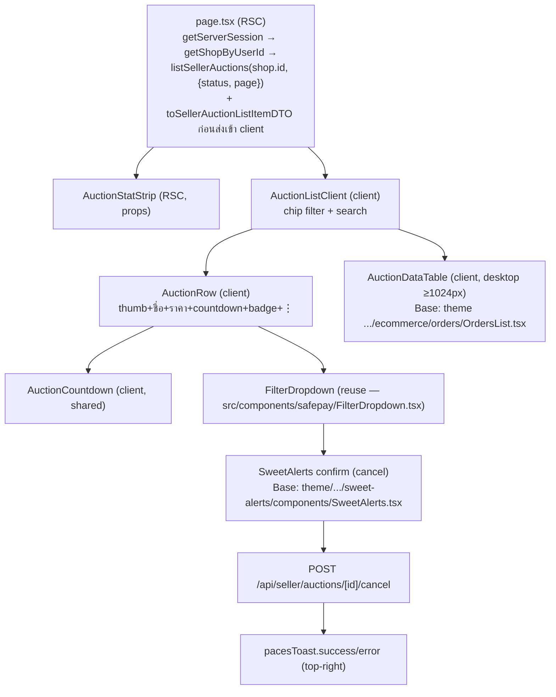

- **RSC boundary:** `page.tsx` เรียก `getSellerAuctionDetail`/`listSellerAuctions` ตรง ๆ (ไม่ผ่าน `fetch` internal HTTP — ตาม pattern seller orders เดิม) แล้ว serialize เฉพาะ `SellerAuctionListItemDTO[]` (ไม่มี `reservePrice`/`expectedPrice`/`bidHistory` ในหน้า list อยู่แล้วตาม type ที่ narrow ไว้)
- **Paces primitive:** `.card`, chip filter = `btn btn-sm` solid-active pattern (v10 mockup), status badge = `badge` token (`badge-success`/`badge-info`/...), ⋮ action = `FilterDropdown`
- **Theme source:** row/chip/bottom-nav = `docs/mockups/auction/seller-auction-v1.html` (v10 mood); desktop table = `theme/paces/Admin/TS/src/app/(admin)/apps/ecommerce/(orders)/orders-list/page.tsx` หรือ `OrdersList.tsx` (ตาม UI-DESIGN-SPEC ระบุ path `ecommerce/orders/OrdersList.tsx` — developer ต้อง `Glob` หาไฟล์จริงก่อน cp เพราะ path อาจต่างเล็กน้อยจาก nested route group; ถ้าไม่พบชื่อนี้เป๊ะ = **ต้อง Explore** ก่อน cp ไม่เดา)

### 8.2 Create `/seller/auctions/new` (+ edit reuse)

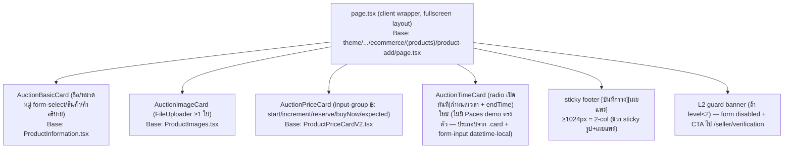

- **Client/server boundary:** ทั้งหน้าเป็น client component (React Hook Form + Yup) เหมือน `products/new-v2` — L2 level เช็คซ้ำที่ server (route handler) เสมอ ฝั่ง client banner เป็นแค่ UX shortcut ไม่ใช่ security boundary
- **Category `form-select` native:** ต้อง reuse `theme/.../form/elements/InputTextfieldType.tsx` pattern ตรงตาม Hard Rule 6 (ห้ามสลับเป็น hs-dropdown)
- **Validation client (Yup):** mirror ตรงกับ `CreateAuctionSchema` (Valibot) server-side — reserve≥start, buyNow>reserve/start, endTime≥now+30min ตาม SRS §5.4

### 8.3 Detail `/seller/auctions/[id]` — Control Console

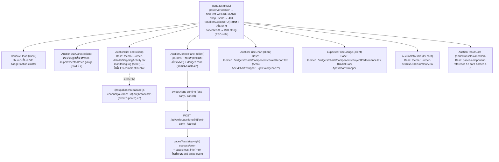

- **RSC → client boundary + PII neutralize:** `page.tsx` (RSC) เรียก `getSellerAuctionDetail` (คืน `SellerAuctionDTO` — mapper ทำที่ server แล้ว) ก่อน pass ให้ client component ทุกตัว **ห้าม** pass `AuctionRow` (Prisma type) ดิบเข้า client — เฉพาะ `SellerAuctionDTO` ที่ field เป็น primitive (number/string/ISO-string) ล้วน ตรงกับ pattern `order.service.ts::getOrderForShop` + mask ที่ `orders/[token]/page.tsx`
- **bidHistory ที่ initial-render:** มาจาก RSC (SSR top 20) — client component อัปเดตต่อผ่าน Realtime event เท่านั้น (ไม่ re-fetch top20 ทาง REST ทุกครั้งที่ broadcast — SRS ระบุ "refetch bid list top20" หมายถึง re-query ผ่าน endpoint ใหม่ที่ยังไม่มี หรือ derive จาก accumulated bid event ฝั่ง client — **ต้อง Explore: มี endpoint สำหรับ seller re-fetch bidHistory แบบ incremental ไหม หรือ reuse `GET /api/seller/auctions/[id]` เต็ม?** แนะนำ reuse endpoint เดิม (simple, ไม่ over-engineer) — เพิ่มเป็น Open Question ใหม่ §15)
- **Chart (Hard Rule 10):** `AuctionPriceChart`/`ExpectedPriceGauge`ต้อง copy จาก `theme/paces/Admin/TS/src/app/(admin)/widgets/charts/components/` เท่านั้น (ยืนยันไฟล์จริงมีอยู่: `SalesReport.tsx`, `ProjectPerformance.tsx`, `RevenueStat.tsx`, `Stat.tsx`, `FinancialOverview.tsx`, `ProjectStatus.tsx`, `StorePerformance.tsx`) — data มาจาก `bidHistory` ที่มีอยู่แล้ว (SRS §7.1 — ไม่ต้องสร้าง time-series endpoint ใหม่) คำนวณ client-side (timestamp+amount array → area chart points)
- **Toast/Sweet Alerts:** cancel/end-early = Sweet Alerts confirm (Base `SweetAlerts.tsx`) → หลัง success = `pacesToast.success` (Hard Rule 9); anti-snipe realtime event = `pacesToast.info` ทันทีไม่ต้อง confirm

---

## 9. Realtime Client Design

### 9.1 Subscribe pattern (seller console)

```ts
// AuctionBidFeed.tsx (client component) — ตัวอย่าง shape การ subscribe
useEffect(() => {
  const channel = supabase
    .channel(`auction:${auctionId}`)
    .on('broadcast', { event: 'update' }, (payload) => {
      // payload.payload = { id, currentPrice, bidCount, endTimeMs, status, antiSnipeCount, hasReserve }
      setLiveState((prev) => mergeRealtimeUpdate(prev, payload.payload))
      if (payload.payload.antiSnipeCount > prevAntiSnipeCountRef.current) {
        pacesToast.info('+60 วินาที')
      }
    })
    .subscribe((status) => {
      if (status === 'CHANNEL_ERROR' || status === 'TIMED_OUT') setConnectionState('reconnecting')
      if (status === 'SUBSCRIBED') setConnectionState('live')
    })
  return () => { supabase.removeChannel(channel) }
}, [auctionId])
```

- ใช้ `broadcast` event (ไม่ใช่ `postgres_changes`) ตาม §2.4 SRS (Broadcast from Database)
- Deep-App (cross-repo) ใช้ pattern เดียวกันทุกประการ (`@supabase/supabase-js` channel เดียวกัน) — เป็นแค่ note เพราะไม่อยู่ใน repo นี้

### 9.2 Countdown / Reconnect Strategy (SRS §11 Open Question #4 — SDS ยึดแนวที่เสนอไว้)

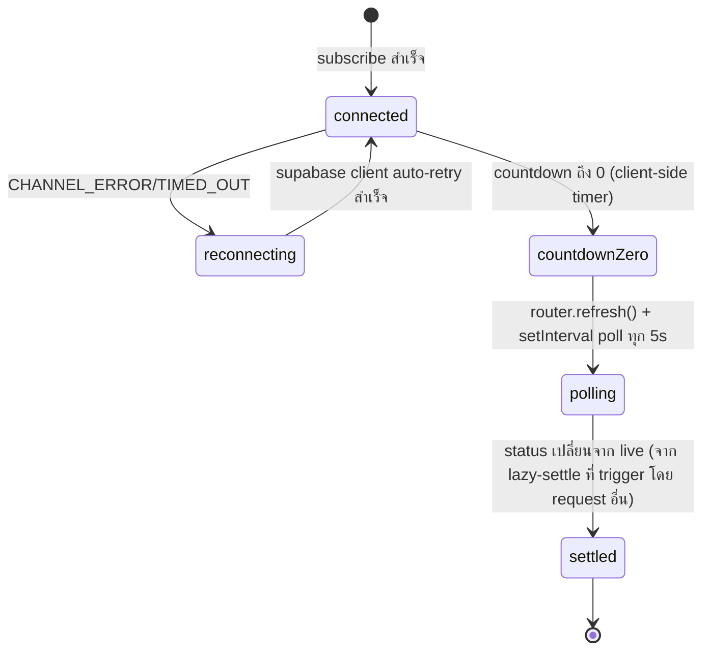

- `AuctionCountdown` เป็น client-only `setInterval(1000)` ธรรมดา (ห้าม `font-mono` ตาม UI-DESIGN-SPEC — ใช้ `tabular-nums` utility class แทน)
- เมื่อ countdown=0: เรียก `router.refresh()` (Next.js RSC refresh — re-fetch `page.tsx` ซึ่งจะ trigger lazy `settleEndedAuctions`/`flipScheduledToLive` โดยอัตโนมัติถ้ามี caller อื่น query อยู่) และ poll ทุก 5s จนกว่า `status` จาก server เปลี่ยนจาก `live` — สอดคล้องกับสถาปัตยกรรม "ไม่มี cron แยก" (§7.1 SRS) เพราะสุดท้าย seller เองที่เปิดหน้าอยู่จะเป็นคน trigger lazy-settle ผ่าน `getSellerAuctionDetail`
- Reconnect ของ Supabase client ใช้ built-in retry ของ `@supabase/supabase-js` (ไม่ implement retry logic เอง) — ถ้า reconnect ไม่สำเร็จเกิน threshold ให้ fallback เป็น polling (เหมือน countdown=0 path) เพื่อไม่ให้ UI ค้าง

---

## 10. Migration/Trigger Design

**ลำดับ apply (บังคับ — SRS §5.3, ต้องผ่าน `safepay-database` + user approve ทุกครั้งก่อนแตะ prod):**

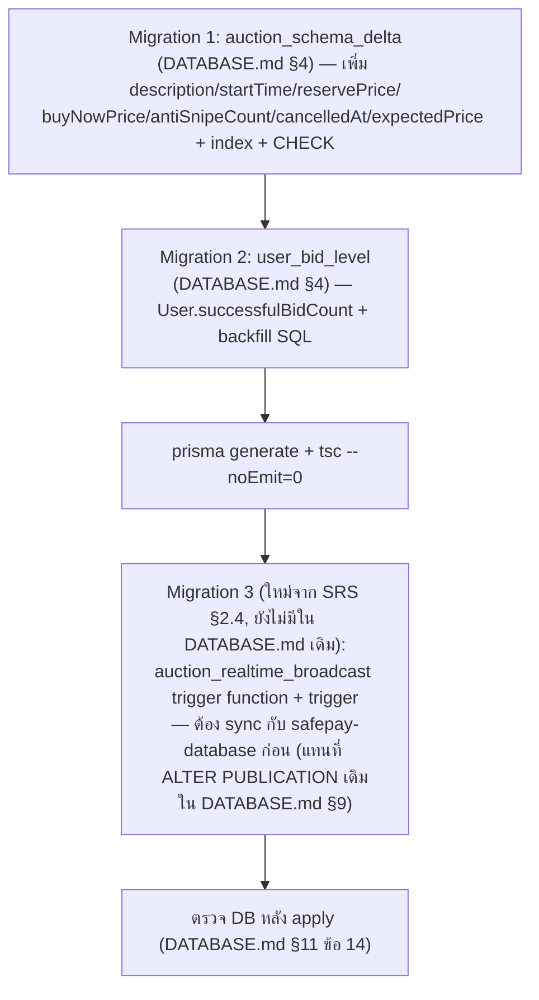

- **M1→M2:** ตามลำดับเดิมใน DATABASE.md §4 (แยกไฟล์ 1 model/migration)
- **M3 เป็นของใหม่ที่ SDS/SRS เพิ่มเติม** — ไม่ใช่ `ALTER PUBLICATION supabase_realtime ADD TABLE "Auction"` แบบเดิม (DATABASE.md §9) แต่เป็น trigger function `auction_realtime_broadcast()` (SQL เต็มอยู่ใน SRS §2.4) — **Controller ต้อง sync ให้ `safepay-database` แก้ DATABASE.md §9 ให้ตรงก่อน apply จริง** (SRS §5.3 ระบุไว้ชัด)
- **Dependency กับ dev task:** ทุก dev task ที่แตะ field ใหม่ (TFR-001,05,06,07,08,12,13,16) **ต้องรอ M1+M2 apply เสร็จก่อน** เพราะ `prisma generate` ต้องได้ type ใหม่ก่อน compile ได้; M3 (trigger) เป็น dependency เฉพาะของ TFR-010 (Realtime) เท่านั้น — service/API/UI ส่วนอื่นไม่ block รอ M3
- **Rollback:** ตาม DATABASE.md §12 + เพิ่ม `DROP TRIGGER auction_realtime_broadcast_trigger; DROP FUNCTION public.auction_realtime_broadcast();` สำหรับ M3

---

## 11. Error Handling Design

### 11.1 Error class hierarchy

```ts
// auction.service.ts
export class BidError extends Error { constructor(message: string, readonly status: number) }
export class AuctionOpError extends Error { constructor(message: string, readonly status: 403 | 404 | 409) }
export class BelowReserveConfirmError extends Error {
  readonly status = 409
  readonly code = 'BELOW_RESERVE_CONFIRM_REQUIRED'
  constructor(readonly currentPrice: number, readonly hasReserve: true) { super('ต้องยืนยันก่อนจบประมูลที่ราคาต่ำกว่า reserve') }
}
```

### 11.2 Error code mapping (service → HTTP → client)

| Error source | HTTP status | Response body | Client handling |
|---|---|---|---|
| Valibot `safeParse` fail | 400 | `{ error: '<Thai message เดียวจาก §5.4 SRS>' }` | `pacesToast.error(body.error)` — message พร้อมโชว์ตรง ๆ (SRS §7.1) |
| ไม่มี session (seller) / ไม่มี Bearer (buyer) | 401 | `{ error: 'กรุณาเข้าสู่ระบบ' }` | seller: redirect `/auth/sign-in`; buyer app: prompt login |
| L2 guard fail | 403 | `{ error: 'ต้องยืนยันตัวตนระดับ L2 ก่อนเปิดประมูล' }` | banner + CTA `/seller/verification` (ตาม UI-DESIGN-SPEC — ไม่ใช่ toast ลอย) |
| Ownership fail (`AuctionOpError` 403) | 403 | `{ error: 'ไม่มีสิทธิ์เข้าถึง' }` | seller: ไม่ควรเกิดจาก UI ปกติ (guard ที่ RSC แล้ว) — ถ้าเกิด = `pacesToast.error` |
| Self-bid (`BidError` 403) | 403 | `{ error: 'ไม่สามารถเสนอราคา auction ของตัวเองได้' }` | buyer app toast |
| Not found (`AuctionOpError`/`BidError` 404) | 404 | `{ error: 'ไม่พบรายการประมูล' }` | seller: `notFound()` ที่ RSC; buyer: toast |
| State conflict (`AuctionOpError`/`BidError` 409) | 409 | `{ error: '<Thai message>' }` (เช่น "การประมูลปิดแล้ว", "มีคนเสนอราคาก่อนคุณ") | bid race → client **retry อัตโนมัติ**ด้วย `currentPrice` ล่าสุดจาก response error (FR-AUC-05-AC-08); cancel/edit state conflict → `pacesToast.error` + `router.refresh()` |
| `BelowReserveConfirmError` (409, code เฉพาะ) | 409 | `{ error, code:'BELOW_RESERVE_CONFIRM_REQUIRED', currentPrice, hasReserve }` | **Sweet Alerts** confirm ซ้ำ (ไม่ใช่ toast — เป็น blocking decision) → retry ด้วย `confirmBelowReserve:true` |
| Unhandled exception | 500 | `{ error: 'เกิดข้อผิดพลาด กรุณาลองใหม่' }` + `console.error('[route] ...', e)` | `pacesToast.error` generic |

### 11.3 Route handler pattern (มาตรฐานเดียวกันทุก endpoint ใหม่)

```ts
try {
  const result = await auctionServiceFn(...)
  return NextResponse.json(result, { status: 200 /* หรือ 201 ตอน create */ })
} catch (e) {
  if (e instanceof BidError || e instanceof AuctionOpError) {
    return NextResponse.json({ error: e.message }, { status: e.status })
  }
  if (e instanceof BelowReserveConfirmError) {
    return NextResponse.json({ error: e.message, code: e.code, currentPrice: e.currentPrice, hasReserve: e.hasReserve }, { status: e.status })
  }
  console.error('[route-name] failed', e)
  return NextResponse.json({ error: 'เกิดข้อผิดพลาด กรุณาลองใหม่' }, { status: 500 })
}
```

### 11.4 Risks ที่กระทบ error handling (จาก SRS §8 — ยึดตามเดิม ไม่เพิ่ม)

- R-SRS-1/2/3/4/5 ทุกข้อแก้ที่ **service layer** (conditional update / tx boundary) — route handler เป็นแค่ pass-through error ไม่ต้องมี logic พิเศษเพิ่ม
- R-SRS-6 (L2 revoke ระหว่าง live) เป็น **accepted risk** — ไม่ต้อง handle error ใหม่

---

## 12. Build Sequence / Task Breakdown

> เรียงตาม dependency จริง — ให้ Controller dispatch เป็น batch ตาม agent-team-workflow (≤3 concurrent, independent file เท่านั้น)

| # | Task | ไฟล์หลัก | Dependency | Atomic commit note |
|---|---|---|---|---|
| 1 | **Migration M1+M2** (`safepay-database`) | `prisma/schema.prisma` + migration SQL | ไม่มี (ทำก่อนสุด) | commit เดี่ยว, ต้อง user approve ก่อน apply prod |
| 2 | **Migration M3 (Realtime trigger)** (`safepay-database`) — sync DATABASE.md §9 ก่อน | migration SQL ใหม่ | รอ M1+M2 apply สำเร็จ (ใช้ column เดียวกัน) | commit เดี่ยว, user approve แยกจาก M1/M2 (คนละ risk) |
| 3 | **Service core refactor** — `settleAuctionCore`/`settleAuction`/`placeBid`/`flipScheduledToLive`/DTO split | `src/services/auction.service.ts`, `src/lib/auction-level.ts` | รอ M1+M2 (ต้องมี field ใหม่ compile ได้) | 1 commit bundle (tsc ไม่ผ่านจนกว่า refactor ครบทั้งไฟล์ — ตาม retro 2026-05-10) |
| 4 | **Seller CRUD functions** — `createAuction/updateAuction/cancelAuction/publishAuction/endEarlyAuction/listSellerAuctions/getSellerAuctionDetail` | `src/services/auction.service.ts` (ต่อจาก #3), `src/lib/validations.ts` | รอ #3 | รวม commit เดียวกับ #3 ได้ถ้าทำต่อเนื่อง (same file, same atomic unit) หรือแยก commit ถัดไปถ้า #3 merge ก่อนแล้ว |
| 5 | **Badge extension** — 6 checker + criteria types + seed | `src/services/badge.service.ts`, `src/types/badge.ts`, `prisma/badge-seed-data.ts` | รอ #3 (ต้องมี `settleAuctionCore`/`adjustSuccessfulBidCount` เรียกใช้อยู่แล้ว) — **parallelizable กับ #6/#7** (ไฟล์ไม่ทับกัน) | 1 commit (ไฟล์ต่างชุดจาก auction.service — atomic แยกได้) |
| 6 | **Seller API routes** (7 endpoint) | `src/app/api/seller/auctions/**` | รอ #4 | 1 commit (route ทั้งชุด ผูก service เดียวกัน) |
| 7 | **Buyer API routes** (ขยาย 4 + ใหม่ 3) | `src/app/api/app/auctions/**` | รอ #3 (placeBid ใหม่) — **parallelizable กับ #6** (คนละ path, คนละ auth) | 1 commit |
| 8 | **Postgres trigger wiring verify** | ไม่มีไฟล์โค้ด — verify E2E broadcast | รอ #2 + #7 (ต้องมี write path ใหม่ยิง UPDATE จริงให้ trigger ทำงาน) | ไม่มี commit โค้ด (QA task) |
| 9 | **Seller UI — List page** | `src/app/(paces)/seller/(dashboard)/auctions/**` | รอ #6 | 1 commit |
| 10 | **Seller UI — Create/Edit form** | `src/app/(paces)/seller/(fullscreen)/auctions/**` | รอ #6 — **parallelizable กับ #9/#11** (คนละไฟล์) | 1 commit |
| 11 | **Seller UI — Detail Console (ไม่รวม chart/Realtime)** | `(dashboard)/auctions/[id]/page.tsx` + `components/{ConsoleHead,AuctionStatCards,AuctionControlPanel,AuctionInfoCard,AuctionResultCard}.tsx` | รอ #6 — parallelizable กับ #9/#10 | 1 commit |
| 12 | **Seller UI — Realtime bid feed + chart + gauge** | `components/{AuctionBidFeed,AuctionPriceChart,ExpectedPriceGauge}.tsx` | รอ #8 (trigger ต้อง verify ก่อน) + #11 (page ต้อง render ได้ก่อน) | 1 commit (ผูก Realtime — ทดสอบยากถ้าแยก) |
| 13 | **Command center entry tile + sidenav** | `(dashboard)/dashboard/components/...` + sidenav config | ไม่ block ใคร — parallelizable กับทุก UI task | 1 commit เล็ก |

**Batch grouping ที่แนะนำ (≤3 concurrent อิสระ):**
- Batch A (serial, ต้องเสร็จก่อน): #1 → #2
- Batch B (serial ต่อจาก A): #3 → #4
- Batch C (parallel, 3 คน): #5, #6, #7 (ทุกตัวรอ #4 เสร็จ; #5 ไฟล์ badge ไม่ชนกับ #6/#7)
- Batch D (parallel, 3 คน): #9, #10, #13 (ทุกตัวรอ #6 เสร็จ; ไฟล์คนละ route/component)
- Batch E (serial): #11 → #8(verify) → #12

---

## 13. Test Strategy Hook (สำหรับ QA — ไม่ใช่ test case เต็ม)

จุดที่ `safepay-qa` ต้อง cover เป็นพิเศษ (มาจาก risk §8 SRS + design เพิ่มเติมข้างต้น):

1. **Concurrency:** ยิง 2 bid พร้อมกัน (เท่ากัน/ต่างกัน) ตรวจว่า conditional-update guarantee ไม่มี lost update (R-SRS-1) — ต้องใช้เครื่องมือ concurrent request จริง ไม่ใช่ sequential curl
2. **Anti-snipe boundary:** bid ที่ 59s ก่อนหมดเวลา (trigger), 61s (ไม่ trigger), ครั้งที่ 6 (ไม่ trigger, DB CHECK ไม่ error) — R-SRS-3
3. **Buy-now double-trigger:** 2 buyer กด buy-now พร้อมกัน → ต้องมี Order เดียว (`auctionId @unique` backstop) — R-SRS-4
4. **PII grep-gate:** `rg -n "reservePrice|expectedPrice" src/app/api/app/` ต้องคืน 0 ก่อน merge (SRS §5.5 ข้อ 1) — รวม migration SQL ของ trigger ด้วย
5. **Realtime payload inspect:** ยิง bid จริง แล้ว inspect payload ที่ subscribe เห็น ต้องไม่มี `reservePrice`/`expectedPrice`/`cancelledAt`
6. **Settle idempotency:** เรียก `settleAuction`/`/settle` endpoint ซ้ำหลายครั้ง ต้องได้ `orderId` เดิมเสมอ ไม่มี Order ซ้ำ
7. **Reserve/unsold path:** bid ต่ำกว่า reserve ตลอด auction → จบแล้ว status ต้องเป็น `unsold` ไม่สร้าง Order; buyer ต้องไม่เห็นตัวเลข reserve แม้ตอน unsold
8. **End-early below-reserve confirm flow:** เรียกไม่ส่ง `confirmBelowReserve` ต้องได้ 409 code เฉพาะ, ส่ง `true` ต้อง settle สำเร็จ
9. **Ownership scope:** seller A พยายามเข้าถึง auction ของ seller B ผ่านทุก endpoint (`GET/PATCH/[id]`, cancel, end-early) ต้องได้ 404 (ไม่ใช่ 403) ตาม TFR-011
10. **L2 guard:** account level<2 พยายาม create auction ต้อง 403; level>=2 ผ่าน
11. **Self-bid block:** seller เจ้าของ auction พยายาม bid/buy-now auction ตัวเอง ต้อง 403
12. **User Level ladder:** seed `successfulBidCount` ที่ threshold ขอบ (2/3, 9/10, 29/30, 99/100) ตรวจ label/icon ถูกต้องตาม `getAuctionLevel` — และตรวจ order cancel (ชิ่ง) ทำให้ count ลดจริง (`GREATEST(0,...)`)
13. **Badge trigger:** ตรวจ `evaluateBadges(userId,'BUYER')` เดินจริงหลัง placeBid/settle (SRS ระบุ audience นี้ยังไม่เคยมี caller — ความเสี่ยงกลาง §7.2)
14. **UI visual QA:** Chrome DevTools MCP ตรวจ Paces primitive compliance (Hard Rule 7 grep gate: ไม่มี arbitrary value), toast placement (top-right action / anti-snipe info), chart ผ่าน `ApexChart` wrapper เท่านั้น, font Anuphan ทุกจุด, mobile bottom-sticky action bar

---

## 14. Traceability

| SRS Requirement (TFR/NFR) | SDS Element | สถานะ |
|---|---|---|
| TFR-001 (Create) | §4.1 sequence, §6 `createAuction`, §8.2 create UI, §5.2 route | Draft |
| TFR-002 (Edit) | §6 `updateAuction`, §5.2 route (Open Question #1 ยังไม่เคาะ price field) | Draft |
| TFR-003 (Cancel) | §6 `cancelAuction`, §8.1 SweetAlerts flow | Draft |
| TFR-004 (Seller List) | §6 `listSellerAuctions`, §8.1 UI tree | Draft |
| TFR-005 (Place Bid) | §4.2 sequence, §6 `placeBid` refactor, §11 error mapping | Draft |
| TFR-006 (Anti-Snipe) | §4.2 sequence (opt block), §13 test #2 | Draft |
| TFR-007 (Buy-Now) | §4.3 sequence, §5.3 route ใหม่ | Draft |
| TFR-008 (Reserve/Unsold) | §6 `settleAuctionCore`, §13 test #7 | Draft |
| TFR-009 (Win→Order idempotent) | §6 `settleAuctionCore`/`settleAuction` 2-layer, §4.5 sequence | Draft |
| TFR-010 (Realtime Broadcast) | §4.6 sequence, §9 client design, §10 trigger design | Draft |
| TFR-011 (Seller Detail Console) | §6 `getSellerAuctionDetail`, §8.3 UI tree, §7.2 neutralize | Draft |
| TFR-012 (End-Early) | §4.4 sequence, §6 `endEarlyAuction`, §11.1 `BelowReserveConfirmError` | Draft |
| TFR-013 (Expected Price DTO split) | §7.1 DTO design, §8.3 gauge component | Draft |
| TFR-014 (State Machine) | §6 guard logic ทุก function, §12 build order | Draft |
| TFR-015 (Lazy Scheduled→Live) | §6 `flipScheduledToLive`, §4.5 sequence | Draft |
| TFR-016 (User Level) | §6 `adjustSuccessfulBidCount`, `lib/auction-level.ts`, §13 test #12 | Draft |
| TFR-017 (Badge Triggers) | §5.1 badge.service extension, §6 checker signatures | Draft |
| NFR Performance/Scalability | §2.2 deploy view, §12 no-cron-infra note | Draft |
| NFR Security (§5.5 PII) | §7.2 neutralize points, §13 test #4/#5 | Draft |

---

## 15. Open Questions (เพิ่มเติมจาก SRS §11 — ที่พบระหว่าง design)

> **✅ อัปเดต 2026-07-01:** Open Questions ระดับ scope/business (SRS §11) เคาะแล้ว — ดู [[BRD]] §2.7 Decisions Log. ข้อ design-level ด้านล่าง (bidHistory re-fetch, theme path, AuctionTimeCard) = Controller technical default (BRD §2.7 Group A): re-fetch ใช้ `GET /api/seller/auctions/[id]` เดิม, theme path ให้ dev `Glob` ก่อน copy, AuctionTimeCard ประกอบจาก Paces primitive.

SRS §11 มี 9 ข้อที่ต้องเคาะอยู่แล้ว (SDS ไม่ทวนซ้ำ — Controller ต้อง sync ก่อน implement TFR ที่เกี่ยวข้อง) เพิ่มเติมจาก design-level:

1. **bidHistory re-fetch หลัง Realtime broadcast** (§8.3) — payload broadcast มีแค่ `currentPrice/bidCount/...` ไม่มี bid record ใหม่เต็ม (bidder name/amount) SDS แนะนำให้ `AuctionBidFeed` re-fetch เต็ม `GET /api/seller/auctions/[id]` (reuse endpoint เดิม ไม่สร้างใหม่) ทุกครั้งที่ broadcast event เข้า — เพื่อความง่าย ไม่ over-engineer แต่มีต้นทุน 1 REST call ต่อ bid event หนึ่งครั้ง (ยอมรับได้เพราะ bid frequency ไม่สูงมาก) **ควร confirm กับ Controller/user ก่อน implement task #12**
2. **Desktop DataTable theme source path เป๊ะ** (§8.1) — UI-DESIGN-SPEC ระบุ `ecommerce/orders/OrdersList.tsx` แต่ path จริงใน theme dir คือ `apps/ecommerce/(orders)/orders-list/...` (nested route group) — developer ต้อง `Glob` ยืนยันชื่อไฟล์ที่ shape ใกล้เคียงที่สุดก่อน cp จริง (**ต้อง Explore ที่หน้างาน ไม่ใช่เดา** — ตาม hard rule ของ planner เอง)
3. **`AuctionTimeCard` ไม่มี Paces demo ตรงตัว** — เวลาแบบ radio "เปิดทันที|กำหนดเวลา" + `datetime-local` ไม่มีในตัวอย่าง product-add เดิม (product ไม่มีแนวคิด scheduled) ต้องประกอบจาก `.card` + Paces `form-input` primitive ตรง ๆ (ไม่ใช่ arbitrary — เป็น native input type ที่ Paces รองรับอยู่แล้ว) — Controller ควร sign-off รูปแบบนี้ก่อน dispatch task #10

---

## 16. สรุป (Summary)

SDS นี้กำหนดการออกแบบเชิงระบบของ **Seller Auction + Realtime Bidding (M00002)** ให้ตรงกับ contract ที่ freeze ใน [[SRS]] 100% — ไม่เพิ่ม framework ใหม่ ไม่เพิ่ม infra ใหม่ (คง Supabase Realtime + Postgres $transaction เดิม) โดยจุดออกแบบสำคัญคือ (1) DTO แยก 2 type จริงกัน reservePrice/expectedPrice หลุด (2) settleAuctionCore/settleAuction 2-layer แก้ nested-transaction risk (3) Postgres trigger (Broadcast from Database) แทน postgres_changes ตรง ๆ กัน Realtime leak (4) UI ทุกชิ้นยึด theme source ที่ approve แล้วใน UI-DESIGN-SPEC เท่านั้น

**ลำดับการ build ที่แนะนำ:** ดู §12 เต็ม — สรุปสั้น: Migration (M1→M2→M3) → Service core refactor → Service CRUD ใหม่ → [Badge ∥ Seller API ∥ Buyer API] → [List UI ∥ Create UI ∥ Command tile] → Detail Console UI → Realtime bid feed/chart (ท้ายสุด เพราะพึ่ง trigger verify แล้ว)

**Open Questions:** ดู §15 (เพิ่มจาก SRS §11 เดิม 9 ข้อ) — ที่กระทบ build sequence ทันทีคือข้อ 1 (bidHistory re-fetch strategy) และข้อ 2 (theme path เป๊ะ)
