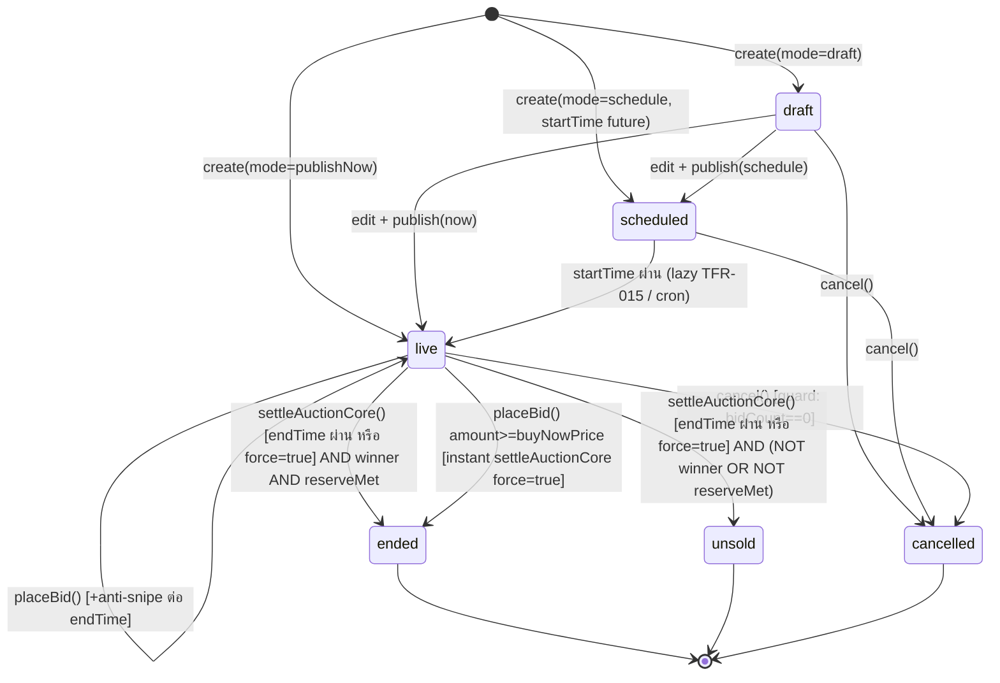
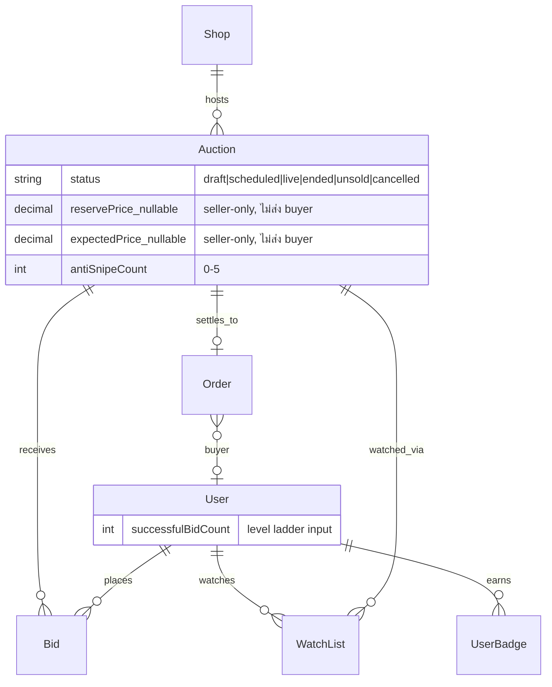

> **โมดูล:** M00002-SellerAuction
> **ประเภทเอกสาร:** Software Requirements Specification (SRS) - TECHNICAL
> **เวอร์ชัน:** 1.0
> **วันที่จัดทำ:** 2026-07-01
> **สถานะ:** Draft
> **เจ้าของเอกสาร:** SA (safepay-planner) — ดู [[Feature-Docs-Ownership]]

# SRS: Seller Auction + Realtime Bidding (Software Requirements Specification — Technical)

---

## 1. บทนำ (Introduction)

### 1.1 วัตถุประสงค์ของเอกสาร

เอกสารนี้กำหนดข้อกำหนดเชิงเทคนิคของระบบ **Seller Auction + Realtime Bidding (M00002)** สำหรับให้ DEV นำไป implement ได้ตรงกับเจตนาธุรกิจใน [[PRD]] และ [[BRD]] โดยไม่ต้องเดา ครอบคลุม: algorithm ของทุก FR-AUC-01~13 (รวม end-early FR-AUC-12 และ expectedPrice FR-AUC-13 ที่ sign-off 2026-07-01), state machine เต็ม, data model delta (อ้าง [[DATABASE]] เป็น SSOT), API contract ทั้ง seller (Paces web) และ buyer (`/api/app/*`), authorization matrix, validation rules, กฎ data-exposure (PII-equivalent สำหรับ reservePrice/expectedPrice), NFR, และ risk เชิงสถาปัตยกรรมที่ค้นพบระหว่างวิเคราะห์ (โดยเฉพาะช่องโหว่ Realtime leak ที่ยังไม่ถูกแก้ใน [[DATABASE]] §9 — ดู §2.4 และ §8)

ผู้อ่านหลัก: `safepay-developer` (ผู้ implement), `safepay-reviewer`/`safepay-security` (ผู้ตรวจ), `safepay-qa` (ผู้เขียน test case), `safepay-database` (ผู้ apply migration)

### 1.2 ขอบเขตเชิงระบบ (System Scope)

**อยู่ในขอบเขต:**
- Seller-side auction management API + service logic (`src/app/(paces)/seller/auctions/**`, `src/app/api/seller/auctions/**`) — สร้าง/แก้ไข/ยกเลิก/เผยแพร่/จบก่อนเวลา/ดูรายการ/ดู detail
- ขยาย `src/services/auction.service.ts` (`placeBid`, `settleAuction`, `settleEndedAuctions`, `toAuctionDTO`) ให้รองรับ state ใหม่ (draft/scheduled/unsold/cancelled), anti-snipe, reserve/unsold, buy-now, end-early, expectedPrice
- ขยาย buyer endpoints `/api/app/auctions/**` (browse/top/[id]/bid/settle) ให้ตรงกับ schema delta โดยไม่รั่ว reservePrice/expectedPrice
- Realtime broadcast (Supabase) ของ currentPrice/bidCount/endTime/status/antiSnipeCount
- User Level (bidder level) computation (`successfulBidCount` → ladder) — ตาม [[DATABASE]] §5
- Achievement badge trigger integration ([[BRD]] §11) — checker function ใหม่ 6 ตัวใน `badge.service.ts`

**นอกขอบเขต (อ้าง [[BRD]] §2.6 + [[PRD]] §5 — ห้าม implement):**
- Manual extend เวลาเอง, บล็อกผู้บิด, ปรับ buy-now ระหว่าง live, Feature/Pin (DEFER Phase 2 — sign-off 2026-07-01)
- Auto-Bid (Proxy Bid), auto-timeout winner payment, winner penalty score, admin auction moderation dashboard, buyer web view เต็มรูป, seller mobile auction management, live-stream auction, auction analytics dashboard

### 1.3 เอกสารอ้างอิง (References)

| เอกสาร | ความสัมพันธ์ |
|--------|-------------|
| [[PRD]] (`PRD.md`) | เป้าหมายธุรกิจ, personas, KPI, business flow ตัวอย่าง |
| [[BRD]] (`BRD.md`) | Functional Requirements FR-AUC-01~13, AC ทุกข้อ, state machine ระดับ business, sign-off 2026-07-01 (§2.5 ACCEPT / §2.6 DEFER) |
| [[DATABASE]] (`DATABASE.md`) | Schema delta จริง (SSOT) — reservePrice/buyNowPrice/antiSnipeCount/cancelledAt/expectedPrice, User Level, badge seed, migration plan |
| [[UI-DESIGN-SPEC]] (`UI-DESIGN-SPEC.md`) | UX ที่ approve — seller command console, buyer immersive view, Realtime approach, Open Questions ที่ยังไม่เคาะ |
| `docs/buyer-app-api.md` | Auth pattern `/api/app/*` (HMAC Bearer), DTO convention, endpoint list ปัจจุบัน |
| `src/services/auction.service.ts` | โค้ดจริงที่ reuse/ขยาย (placeBid/settleAuction/settleEndedAuctions) |
| `docs/conventions/date-format.md` | ทุก timestamp ที่แสดงผลใช้ `formatDateTime`/`formatDate` เท่านั้น |
| `docs/10 - Business Rules/Tier Lists.md` | SSOT tier mapping — ใช้เมื่อแสดง Trust ของ seller ใน buyer auction detail (ผ่าน `getTierDisplay` เดิม ไม่สร้างใหม่) |
| `docs/conventions/paces-toast.md` / `paces-charts-source.md` | Toast (`pacesToast`) + Chart (`ApexChart` wrapper) ที่ seller console ต้องใช้ (Hard Rule 9/10) |

### 1.4 นิยามและตัวย่อ (Definitions & Acronyms)

| คำ/ตัวย่อ | ความหมาย |
|-----------|----------|
| **TFR** | Technical Functional Requirement — ข้อกำหนดเชิงเทคนิคใน SRS นี้ ที่ trace กลับ FR-AUC ใน BRD |
| **L2 Guard** | ตรวจ `getMaxVerificationLevel(userId) >= 2` (จาก `verification.service.ts`) ก่อนอนุญาตสร้าง auction |
| **Self-Bid Block** | ปฏิเสธ bid ถ้า `bidderId === auction.shop.userId` |
| **Anti-Snipe** | ต่อ `endTime += 60s` อัตโนมัติเมื่อ bid เข้าใน 60 วินาทีสุดท้าย, สูงสุด 5 ครั้ง (`antiSnipeCount`) |
| **Conditional Update** | pattern `updateMany({ where: { ...guardCondition }, data })` แล้วเช็ค `res.count` เพื่อ atomic-guard โดยไม่ต้อง lock แถวมือ (ใช้แล้วใน `wallet.service.ts::deductCredit`) |
| **Settle** | กระบวนการปิด auction (`status → ended/unsold`) + สร้าง Order ถ้ามีผู้ชนะ |
| **End-Early** | Seller สั่ง settle ก่อนถึง `endTime` (FR-AUC-12) |
| **hasReserve** | boolean ที่ buyer DTO ใช้แทนค่า `reservePrice` จริง (ไม่ส่งตัวเลขให้ buyer) |
| **expectedPrice** | ราคาเป้าหมาย seller-only, ไม่กระทบ settle logic ใด ๆ (FR-AUC-13) — เทียบเท่าข้อมูลลับที่ต้อง "neutralize-at-source" เหมือน PII |
| **successfulBidCount** | field ใหม่บน `User` — นับ "bid สำเร็จ" (ชนะ + Order ไม่ถูก cancel) ใช้คำนวณ User Level ladder |
| **Broadcast from Database** | Supabase Realtime pattern ที่ trigger DB เรียก `realtime.send()`/`realtime.broadcast_changes()` ส่ง payload ที่ "เลือกคอลัมน์เอง" แทนการ replicate ทั้งแถวแบบ `postgres_changes` — จำเป็นเพื่อกัน reservePrice/expectedPrice หลุด (ดู §2.4) |
| **RSC** | React Server Component (Next.js 16 App Router) |
| **HMAC Bearer** | Auth token scheme ของ `/api/app/*` (`app-token.ts`, เซ็นด้วย `NEXTAUTH_SECRET`) — คนละ mechanism จาก NextAuth session ฝั่ง seller web |

---

## 2. ภาพรวมสถาปัตยกรรม (Architecture Overview)

### 2.1 บริบทระบบ (System Context)

```mermaid
flowchart LR
    SellerWeb["Seller Dashboard (Paces web)<br/>/seller/auctions/**"] -->|NextAuth session| API_S["/api/seller/auctions/**<br/>(Next.js Route Handler)"]
    BuyerApp["Deep-App (Expo, buyer mobile)"] -->|HMAC Bearer| API_B["/api/app/auctions/**<br/>(Route Handler)"]
    API_S --> SVC["auction.service.ts<br/>(placeBid/settleAuction/settleEndedAuctions)"]
    API_B --> SVC
    SVC --> DB[(Postgres — Supabase)]
    SVC --> Badge["badge.service.ts<br/>evaluateBadges()"]
    SVC --> Push["app-push.service.ts<br/>pushToUser (best-effort)"]
    DB -->|trigger: Broadcast from DB| RT["Supabase Realtime"]
    RT -->|channel auction:{id}| BuyerApp
    RT -->|channel auction:{id}| SellerWeb
    SVC --> Verif["verification.service.ts<br/>getMaxVerificationLevel (L2 guard)"]
```

### 2.2 องค์ประกอบหลัก (Components)

| Component | หน้าที่ | Submodule / Stack |
|-----------|---------|-------------------|
| **Seller Auction Pages** | สร้าง/แก้ไข/ยกเลิก/เผยแพร่/จบก่อนเวลา/ดูรายการ/console detail | `src/app/(paces)/seller/auctions/**` (Paces, RSC + client) |
| **Seller Auction API** | รับ request จาก seller web, ตรวจ session + ownership + L2, เรียก service | `src/app/api/seller/auctions/**` (ใหม่ — Next.js Route Handler) |
| **Buyer Auction API** | browse/detail/bid/buy-now/settle สำหรับ Deep-App | `src/app/api/app/auctions/**` (มีอยู่แล้ว — ต้องขยาย) |
| **`auction.service.ts`** | business logic ทั้งหมด: state machine, atomic bid, anti-snipe, settle, DTO mapping | `src/services/auction.service.ts` (reuse + ขยาย) |
| **`badge.service.ts`** | checker function ใหม่ 6 ตัว + `evaluateBadges` trigger หลัง settle/bid | `src/services/badge.service.ts` (ขยาย) |
| **`src/lib/auction-level.ts`** | runtime ladder mapping `successfulBidCount → level/label/icon` | ใหม่ (pure function, ไม่มี DB call) |
| **`verification.service.ts`** | L2 guard | มีอยู่แล้ว (reuse ตรง ๆ ไม่แก้) |
| **`app-push.service.ts`** | push notification best-effort (outbid/won/auction-ended) | มีอยู่แล้ว (reuse) |
| **Postgres trigger (ใหม่)** | Broadcast from Database — ส่ง payload ที่กรองคอลัมน์แล้วแทน raw row replication | migration SQL ใหม่ (ดู §2.4) |
| **Deep-App Realtime client** | subscribe channel `auction:{id}`, อัปเดต UI แบบ Realtime | repo แยก (Deep-App/Expo) — ต้องเพิ่ม `@supabase/supabase-js` (cross-repo dependency, นอกขอบเขตโค้ดนี้) |

### 2.3 มุมมองการ Deploy (Deployment View)

- **Vercel serverless (multi-instance):** ทุก request (seller web + buyer app) รันบน instance แยกกันได้ — ห้ามพึ่ง in-memory state ใด ๆ สำหรับความถูกต้องของ auction (เช่น antiSnipeCount, currentPrice) ต้องอยู่ใน Postgres เท่านั้น (ตรงกับที่ [[BRD]] §7.2 ระบุไว้แล้ว)
- **Postgres (Supabase):** single source of truth, ใช้ `$transaction` + conditional `updateMany` เป็น concurrency control หลัก (ไม่มี Redis/lock server แยก)
- **Supabase Realtime:** ต้องเปิด publication/trigger เพิ่มเติม (§2.4) — เป็น "best-effort broadcast layer" ที่ไม่ผูกกับ correctness ของ write path (write ต้องสำเร็จได้แม้ Realtime ล่ม — [[BRD]] FR-AUC-10-AC-03)
- **Cron / lazy settle:** ใช้ pattern เดิม (`settleEndedAuctions()` เรียกแบบ lazy ตอน `browseAuctions()`/`topAuctions()`) + `POST /api/app/auctions/[id]/settle` (เผื่อ cron ภายนอกเรียก) — ไม่เพิ่ม cron infra ใหม่

### 2.4 Realtime Architecture (สำคัญ — แก้ gap จาก [[DATABASE]] §9)

**[[DATABASE]] §9 ระบุวิธีง่ายที่สุด:** `ALTER PUBLICATION supabase_realtime ADD TABLE "Auction";` แล้วให้ client subscribe ผ่าน `postgres_changes` (event UPDATE) ตรง ๆ

**🛑 ปัญหาที่พบระหว่างวิเคราะห์ SRS (ต้องแก้ก่อน implement FR-AUC-10/FR-AUC-13):**
`postgres_changes` ของ Supabase Realtime **broadcast แถวเต็มทั้งแถว** (Postgres WAL ส่ง new-tuple เต็มเสมอสำหรับ UPDATE ไม่ว่าจะตั้ง REPLICA IDENTITY แบบไหน) และโปรเจกต์นี้ **ไม่มี RLS** ([[DATABASE]] §9 ยืนยัน) → ถ้าใช้วิธีนี้ตรง ๆ **`reservePrice` และ `expectedPrice` จะหลุดไปถึง client buyer ทุกคนที่ subscribe** — ขัดกับ **FR-AUC-13-AC-04 โดยตรง** (expectedPrice ต้องไม่รั่วออก buyer endpoint) แม้ REST DTO จะกรองถูกต้องแล้วก็ตาม เพราะ Realtime เป็นช่องทางคนละเส้นจาก REST

**แนวทางแก้ (Option A — แนะนำ, ไม่เพิ่ม framework ใหม่ ยังคง Supabase Realtime เดิม):**
ใช้ **Broadcast from Database** แทน `postgres_changes` ตรง ๆ — สร้าง Postgres trigger `AFTER UPDATE ON "Auction"` ที่เรียก `realtime.send(payload, event, topic)` (ฟังก์ชัน built-in ของ Supabase Realtime ≥ 2.x) โดย `payload` เป็น JSON ที่**เลือกคอลัมน์เอง**:

```sql
-- migration ใหม่ (ต้องผ่าน safepay-database ก่อน apply)
CREATE OR REPLACE FUNCTION public.auction_realtime_broadcast() RETURNS trigger AS $$
BEGIN
  PERFORM realtime.send(
    jsonb_build_object(
      'id', NEW.id,
      'currentPrice', NEW."currentPrice",
      'bidCount', NEW."bidCount",
      'endTimeMs', extract(epoch from NEW."endTime") * 1000,
      'status', NEW.status,
      'antiSnipeCount', NEW."antiSnipeCount",
      'hasReserve', (NEW."reservePrice" IS NOT NULL)
      -- ห้ามใส่ reservePrice / expectedPrice / cancelledAt ตรงนี้
    ),
    'update',
    'auction:' || NEW.id,
    false -- private=false: ใช้ anon key ได้ (ไม่มี RLS อยู่แล้ว)
  );
  RETURN NEW;
END;
$$ LANGUAGE plpgsql;

CREATE TRIGGER auction_realtime_broadcast_trigger
  AFTER UPDATE ON "Auction"
  FOR EACH ROW EXECUTE FUNCTION public.auction_realtime_broadcast();
```

client subscribe: `supabase.channel('auction:'+id).on('broadcast', { event: 'update' }, cb).subscribe()` (แทน `.on('postgres_changes', ...)`)

**ผลกระทบ:** เปลี่ยนแค่กลไก broadcast (ยัง Supabase Realtime ตัวเดิม, ยัง publication `supabase_realtime` ไม่ต้องเพิ่มตาราง `Auction` เข้า publication เลยด้วยซ้ำ — Broadcast from Database ไม่ผ่าน publication) — เป็นการแก้ที่ตรงจุด ไม่ over-engineer, ใช้ Postgres/Supabase ที่มีอยู่แล้วเท่านั้น

**ต้องยืนยันกับ user ก่อน apply (§11 Open Questions ข้อ 2):** นี่คือการเปลี่ยนแปลงจาก SQL ที่ [[DATABASE]] §9 เขียนไว้แล้ว — Controller ต้อง sync กับ `safepay-database` ก่อน migrate

**Option B (fallback ถ้า Option A ติดปัญหา infra):** แยก `reservePrice`/`expectedPrice` ออกเป็นตาราง `AuctionSellerMeta` (1:1 `Auction`) ไม่รวมใน publication — ต้อง migration เพิ่ม (ทำลายน้อยกว่า A ในแง่ SQL แต่เพิ่ม complexity ของ query join ทุกจุดที่ seller อ่าน auction) — **ไม่แนะนำเว้นแต่ Option A ทำไม่ได้จริง**

---

## 3. ข้อกำหนดเชิงฟังก์ชันเชิงเทคนิค (Technical Functional Requirements)

### TFR-001: สร้าง Auction (Create + Publish)
- **Trace to:** FR-AUC-01 ([[BRD]] §2.1)
- **คำอธิบายเชิงเทคนิค:**
  1. ตรวจ session (`getServerSession(authOptions)`) → 401 ถ้าไม่มี
  2. หา `Shop` ของ `session.user.id` → 404 ถ้าไม่มีร้าน (ยังไม่ onboard)
  3. **L2 Guard:** `getMaxVerificationLevel(shop.userId) >= 2` → 403 ถ้าไม่ผ่าน (`"ต้องยืนยันตัวตนระดับ L2 ก่อนเปิดประมูล"`)
  4. Validate ทุก field ตาม §5.4 (startPrice>0, reserve≥start, buyNow>reserve/start, endTime≥now+30min, title+image บังคับ, expectedPrice>0 ถ้ามี)
  5. Derive `status` เริ่มต้นจาก request:
     - `mode==='draft'` → `status='draft'`, `startTime=null`
     - `mode==='publishNow'` → `status='live'`, `startTime=null`, `currentPrice=startPrice`
     - `mode==='schedule'` (มี `startTime` ในอนาคต) → `status='scheduled'`
  6. `prisma.auction.create({ data: { ...fields, currentPrice: startPrice, bidCount: 0, antiSnipeCount: 0 } })`
- **Precondition:** session ถูกต้อง, shop มีอยู่, L2 ผ่าน, field ผ่าน validation ทั้งหมด
- **Postcondition:** Auction row ใหม่ status ตรงตาม mode; ถ้า `live` → รับ bid ได้ทันที
- **Error/Edge cases:** shopId ต้อง scope จาก session เท่านั้น (ห้ามรับ shopId จาก body — กัน seller สร้าง auction ให้ shop อื่น, FR-AUC-01-AC-09); ถ้า `mode==='schedule'` แต่ `startTime` เป็นอดีต/ปัจจุบัน → treat เป็น publishNow (validation error หรือ auto-fallback ต้องตกลง — ดู §11 Open Question)

### TFR-002: แก้ไข Auction
- **Trace to:** FR-AUC-02 ([[BRD]] §2.1)
- **คำอธิบายเชิงเทคนิค:** `PATCH /api/seller/auctions/[id]` — guard: ownership (`auction.shop.userId === session.user.id`) → 403; `status IN ('draft','scheduled')` → 409 ถ้าไม่ใช่ (`"ไม่สามารถแก้ไข auction ที่เปิดรับ bid แล้ว"`). Field ที่แก้ได้: `title, description, images, imageUrl, bidIncrement, endTime, category, productId` ตาม AC ที่ระบุชัด — ดู **§11 Open Question ข้อ 1** (ราคา startPrice/reservePrice/buyNowPrice/expectedPrice ไม่ได้ถูกระบุชัดใน BRD AC ว่าแก้ได้หรือไม่ — SRS ตั้งสมมติฐานว่า **แก้ได้เช่นกันขณะ draft/scheduled** เพราะยังไม่มี bid ผูกอยู่ ไม่กระทบใครนอกจาก seller เอง — ต้อง confirm)
  - ถ้าแก้ `endTime` → ต้อง revalidate `endTime >= now + 30min` และ `startTime < endTime` (ถ้ามี startTime) อีกครั้ง (เหมือนตอนสร้าง)
- **Precondition:** ownership ผ่าน, status draft/scheduled
- **Postcondition:** field ที่ระบุอัปเดต, `updatedAt` เปลี่ยน
- **Error/Edge cases:** race — seller เปิดฟอร์มแก้ไขค้างไว้ระหว่างที่ auction ถูก publish ไปแล้ว (จาก tab อื่น) → API ต้อง re-check status ที่ DB ตอน submit จริง ไม่เชื่อ state ฝั่ง client

### TFR-003: ยกเลิก Auction
- **Trace to:** FR-AUC-03 ([[BRD]] §2.1)
- **คำอธิบายเชิงเทคนิค:** `POST /api/seller/auctions/[id]/cancel` — ownership guard 403; ตรวจ `status`:
  - `draft`/`scheduled` → `status='cancelled', cancelledAt=now()` เสมอ
  - `live` AND `bidCount===0` → cancel ได้
  - `live` AND `bidCount>=1` → 409 (`"ไม่สามารถยกเลิก auction ที่มีผู้เสนอราคาแล้ว"`)
  - `ended`/`unsold`/`cancelled` → 409
  - ใช้ conditional update กัน race: `updateMany({ where: { id, status: { in: ['draft','scheduled'] } } })` OR `updateMany({ where: { id, status: 'live', bidCount: 0 } })` — ถ้า `count===0` แปลว่า state เปลี่ยนไปแล้วระหว่างเช็ค → 409
- **Precondition:** ownership; state ตรงเงื่อนไข
- **Postcondition:** `status='cancelled'` ถาวร (ไม่มี transition ออกจาก cancelled)

### TFR-004: รายการ Auction ของร้าน (Seller List)
- **Trace to:** FR-AUC-04, FR-AUC-11 ([[BRD]] §2.1, §2.4)
- **คำอธิบายเชิงเทคนิค:** `GET /api/seller/auctions?status=&page=` — scope `WHERE shopId = session-derived shopId` เสมอ (ownership ผ่าน WHERE clause ไม่ใช่ post-filter — ตาม convention `feedback_rsc_dal_authz`); filter `status` optional (ค่าเดียวหรือไม่ระบุ=ทั้งหมด); sort `createdAt desc`; pagination แบบ offset (`skip/take`, default take=20) ใช้ index `[shopId, status]` ที่ [[DATABASE]] เพิ่มแล้ว
  - ก่อน query ควรเรียก lazy transition (`flipScheduledToLive()` — ดู TFR-015) เพื่อให้ seller เห็น status ล่าสุดแม้ buyer ยังไม่เคย browse
- **Response:** `SellerAuctionListItemDTO[]` (id, title, thumbnail, status, currentPrice, bidCount, endTimeMs, startTimeMs)

### TFR-005: วางบิด (Place Bid) — atomic + self-bid + hook สำหรับ anti-snipe/buy-now
- **Trace to:** FR-AUC-05 ([[BRD]] §2.2), FR-AUC-07 (บางส่วน — buy-now แชร์ code path เดียวกัน)
- **คำอธิบายเชิงเทคนิค (แก้ไข concurrency bug ของโค้ดเดิม — ดู §8 Risk R-SRS-1):**
  โค้ดเดิม (`placeBid` ปัจจุบัน) อ่าน `currentPrice` ด้วย `findUnique` แล้ว `update` โดยไม่มี guard ว่า `currentPrice` ยังเป็นค่าที่เพิ่งอ่านมาจริง — ภายใต้ Postgres READ COMMITTED, 2 transaction ที่วิ่งพร้อมกันสามารถ "เขียนทับ" กันได้ (bid ที่มาทีหลังแต่ amount ต่ำกว่าอาจ overwrite currentPrice ที่สูงกว่าถ้า schedule ของ transaction ไม่เรียงตามที่คาด) ต้องแก้เป็น **conditional update pattern เดียวกับ `wallet.service.ts::deductCredit`:**

  ```ts
  // ภายใน prisma.$transaction(tx => { ... })
  const a = await tx.auction.findUnique({ where: { id: auctionId }, include: { shop: { select: { userId: true } } } })
  if (!a) throw new BidError('ไม่พบรายการประมูล', 404)
  if (!['live'].includes(a.status) || a.endTime.getTime() <= Date.now()) throw new BidError('การประมูลปิดแล้ว', 409)
  if (a.shop.userId === bidderId) throw new BidError('ไม่สามารถเสนอราคา auction ของตัวเองได้', 403)
  const minNext = Number(a.currentPrice) + Number(a.bidIncrement)
  if (amount < minNext) throw new BidError(`ต้องบิดอย่างน้อย ${minNext} บาท`, 400)

  // conditional update — WHERE currentPrice ต้องยังเท่าค่าที่เพิ่งอ่าน (optimistic guard)
  const res = await tx.auction.updateMany({
    where: { id: auctionId, status: 'live', currentPrice: a.currentPrice },
    data: { currentPrice: amount, bidCount: { increment: 1 }, /* anti-snipe fields ถ้า trigger */ },
  })
  if (res.count === 0) throw new BidError('มีคนเสนอราคาก่อนคุณ กรุณาลองใหม่', 409) // ให้ client retry ด้วย currentPrice ล่าสุด
  await tx.bid.create({ data: { auctionId, bidderId, amount } })
  ```
  - ถ้า `amount >= a.buyNowPrice` (มี buyNowPrice ตั้งไว้และยังไม่ปิดตัวเอง) → นี่คือ buy-now path (TFR-007) — เรียก `settleAuctionCore(tx, updatedAuctionRow, { force: true })` **ในทรานแซคชันเดียวกัน** ทันทีหลัง conditional update สำเร็จ
  - ถ้าไม่ใช่ buy-now → ตรวจ anti-snipe (TFR-006) ในทรานแซคชันเดียวกันก่อน commit
  - Notification (outbid) + push (best-effort, post-commit) เหมือนเดิม
  - หลัง commit สำเร็จ → best-effort `evaluateBadges(bidderId, 'BUYER')` + อัปเดต `successfulBidCount` **ไม่ทำที่นี่** (ทำตอน settle เท่านั้น — TFR-016)
- **Precondition:** auction live, ไม่หมดเวลา, ไม่ใช่ self-bid, amount ≥ minNext
- **Postcondition:** `Bid` record ใหม่, `currentPrice`/`bidCount` อัปเดต atomic, Realtime broadcast ออก (ผ่าน trigger §2.4)
- **Error/Edge cases:** 2 bid พร้อมกัน amount เท่ากัน → คนแรก commit ก่อนชนะ (conditional update guarantee), คนหลัง 409 "มีคนเสนอราคาก่อนคุณ" (client ควร retry ด้วยค่าล่าสุด — FR-AUC-05-AC-08 ตรงตามนี้)

### TFR-006: Anti-Snipe Extension
- **Trace to:** FR-AUC-06 ([[BRD]] §2.2)
- **คำอธิบายเชิงเทคนิค:** ภายใน transaction เดียวกับ TFR-005 หลัง conditional update สำเร็จ:
  ```
  if (a.endTime.getTime() - Date.now() <= 60_000 && a.antiSnipeCount < 5) {
    newEndTime = new Date(a.endTime.getTime() + 60_000)
    await tx.auction.update({ where: { id: auctionId }, data: { endTime: newEndTime, antiSnipeCount: { increment: 1 } } })
  }
  ```
  - เช็คจาก `a.endTime` (ค่าที่อ่านตอนต้น transaction) ไม่ใช่ wall-clock อย่างเดียว — ต้องอยู่ใน tx เดียวกับ bid write เพื่อกัน race ที่ antiSnipeCount เกิน 5 (DB CHECK `antiSnipeCount <= 5` เป็น backstop สุดท้ายตาม [[DATABASE]] §8.2)
- **Precondition:** bid สำเร็จ (conditional update ผ่านแล้ว), `antiSnipeCount < 5`
- **Postcondition:** `endTime += 60s`, `antiSnipeCount += 1`
- **Error/Edge cases:** `antiSnipeCount === 5` พอดี → ไม่ trigger อีก (ไม่มี error, แค่ skip); DB CHECK เป็น hard-stop ถ้า logic ชั้น application หลุด

### TFR-007: Buy-Now (ซื้อทันที)
- **Trace to:** FR-AUC-07 ([[BRD]] §2.2)
- **คำอธิบายเชิงเทคนิค:** endpoint แยก `POST /api/app/auctions/[id]/buy-now` (ไม่รับ body — amount = `auction.buyNowPrice` เสมอ, ห้าม client ส่ง amount เอง) → เรียก internal function เดียวกับ TFR-005 โดย fix `amount = auction.buyNowPrice` แล้วปล่อยให้ path buy-now (amount≥buyNowPrice) ใน TFR-005 ทำงานต่อ (settle ทันทีในทรานแซคชันเดียว)
  - **Guard ก่อนเข้า transaction:** ถ้า `auction.buyNowPrice == null` → 400 "auction นี้ไม่มีตัวเลือกซื้อทันที"
  - **Guard ใน transaction (conditional):** ต้องตรวจว่า `currentPrice < buyNowPrice` ยังจริงอยู่ ณ ตอน commit — ใช้ conditional update `WHERE currentPrice < buyNowPrice` ร่วมกับ guard เดิมของ TFR-005 → ถ้า `count===0` (เพราะมีคนกด buy-now ไปก่อนแล้ว หรือ bid ปกติดันราคาเกินไปแล้ว) → 409 "การประมูลปิดแล้ว" หรือ "ราคาสูงเกินระดับซื้อทันทีแล้ว" (FR-AUC-07-AC-02/AC-03)
- **Postcondition:** `Bid` record @ buyNowPrice, `status='ended'`, `Order` สร้างทันที (reuse `settleAuctionCore`), notification "คุณชนะการประมูล" ส่งทันที
- **Error/Edge cases:** self-bid block ใช้ guard เดียวกับ TFR-005 (FR-AUC-07-AC-04)

### TFR-008: Reserve Price + Unsold Path
- **Trace to:** FR-AUC-08 ([[BRD]] §2.2)
- **คำอธิบายเชิงเทคนิค:** ใน `settleAuctionCore(tx, auction)`:
  ```
  const winner = topBid // bid.amount DESC, tiebreak createdAt ASC (§8.6 BRD)
  const reserveMet = auction.reservePrice == null || Number(auction.currentPrice) >= Number(auction.reservePrice)
  if (!winner || !reserveMet) {
    status = 'unsold'; // ไม่สร้าง Order
  } else {
    status = 'ended'; // สร้าง Order (TFR-009)
  }
  ```
- **Postcondition:** `status` ตกที่ `unsold` หรือ `ended` ตรงเงื่อนไข reserve เท่านั้น (ไม่มี state อื่น)
- **PII/data-exposure:** buyer เห็นแค่ `hasReserve: boolean` ไม่เห็นตัวเลข reservePrice จริง แม้ตอน unsold ก็ตาม

### TFR-009: Win → Order (Settle, idempotent)
- **Trace to:** FR-AUC-09 ([[BRD]] §2.2)
- **คำอธิบายเชิงเทคนิค:** รีแฟกเตอร์ `settleAuction()` ปัจจุบันเป็น 2 ชั้น (จำเป็นสำหรับ TFR-007/TFR-012 ที่ต้องเรียก settle ภายใน transaction ที่เปิดอยู่แล้ว):
  ```ts
  // ชั้นใน — pure logic, รับ tx client ที่เปิดอยู่แล้ว, ไม่เปิด transaction เอง
  async function settleAuctionCore(
    tx: Prisma.TransactionClient,
    auctionId: string,
    opts: { force?: boolean } = {},
  ): Promise<{ ended: boolean; orderId: string | null }> { /* logic เดิม + reserve check (TFR-008) */ }

  // ชั้นนอก — wrapper เดิม เปิด transaction เอง (backward compatible กับ caller เดิม: cron/lazy)
  export async function settleAuction(auctionId: string): Promise<{ ended: boolean; orderId: string | null }> {
    return prisma.$transaction(tx => settleAuctionCore(tx, auctionId))
  }
  ```
  - Idempotent check: `tx.order.findUnique({ where: { auctionId } })` ก่อนสร้างเสมอ (โค้ดเดิมมีอยู่แล้ว คงไว้)
  - Winner = `bids ORDER BY amount DESC, createdAt ASC LIMIT 1` (เพิ่ม tiebreak ที่โค้ดเดิมยังไม่มี — [[BRD]] §8.6)
  - หลัง commit (best-effort, นอก transaction): push "คุณชนะการประมูล" + `evaluateBadges(shopOwnerId,'SELLER')` + `evaluateBadges(winnerId,'BUYER')` + `successfulBidCount += 1` ของ winner (TFR-016)
- **Postcondition:** เรียกซ้ำกี่ครั้งผลลัพธ์เหมือนเดิม (`orderId` เดิม)

### TFR-010: Realtime Broadcast (currentPrice/endTime/status/antiSnipeCount)
- **Trace to:** FR-AUC-10 ([[BRD]] §2.3)
- **คำอธิบายเชิงเทคนิค:** ดู §2.4 (Broadcast from Database ผ่าน Postgres trigger) — ทำงานอัตโนมัติทุกครั้งที่ `Auction` row ถูก `UPDATE` (ไม่ต้องแก้โค้ด TypeScript ฝั่ง service เพิ่มเพื่อ broadcast — trigger ทำงานที่ DB layer)
- **Precondition:** trigger + function ถูก apply แล้ว (migration, ต้อง user approve — [[DATABASE]] §11 checklist ข้อ 13 ปรับเป็น "apply Broadcast trigger" แทน `ALTER PUBLICATION`)
- **Postcondition:** client ที่ subscribe `channel('auction:'+id)` เห็น payload ใหม่ภายใน 1s (p95)
- **Error/Edge cases:** trigger fail (เช่น `realtime.send` unavailable) **ต้องไม่ throw จน rollback UPDATE หลัก** — ห่อ trigger function ด้วย `EXCEPTION WHEN OTHERS THEN NULL;` เพื่อ fail-safe (write path ต้องไม่ขึ้นกับ Realtime — [[BRD]] FR-AUC-10-AC-03)

### TFR-011: Seller Detail Console (Bid Monitor, ownership scope)
- **Trace to:** FR-AUC-11 ([[BRD]] §2.4)
- **คำอธิบายเชิงเทคนิค:** `GET /api/seller/auctions/[id]` — ownership guard (403 ถ้าไม่ใช่เจ้าของ — scope ที่ WHERE clause: `prisma.auction.findFirst({ where: { id, shop: { userId: session.user.id } } })` ไม่ใช่ `findUnique` + post-check เพื่อกัน RSC PII leak แบบที่เคยเกิดใน seller orders, ตาม `feedback_rsc_dal_authz`/`feedback_rsc_pii_neutralize_at_source`)
  - Response = `SellerAuctionDTO` (§5.1) รวม `reservePrice`, `expectedPrice`, `bidHistory` (top 20, displayName only — ไม่มี phone/email ตาม UI-DESIGN-SPEC "PII: แสดงแค่ displayName")
- **Postcondition:** seller เห็นเฉพาะ auction ร้านตัวเอง; auction ร้านอื่น → 404 (ไม่ใช่ 403 — กันการเดา id ว่ามีอยู่จริงไหม)

### TFR-012: จบประมูลก่อนเวลา (End-Early)
- **Trace to:** FR-AUC-12 ([[BRD]] §2.5 — sign-off 2026-07-01)
- **คำอธิบายเชิงเทคนิค:** `POST /api/seller/auctions/[id]/end-early`
  1. ownership guard (403) + `status==='live'` guard (409 ถ้าไม่ใช่)
  2. เรียก `prisma.$transaction(tx => settleAuctionCore(tx, auctionId, { force: true }))` — parameter `force:true` บอกให้ `settleAuctionCore` **ข้ามการเช็ค `endTime > now()`** (ต่างจาก caller ปกติที่ต้องรอ endTime ผ่านจริง)
  3. ผลลัพธ์ตกที่ `ended` (มี winner + reserve met) หรือ `unsold` (ไม่มี bid หรือ reserve ไม่ถึง) ตาม logic เดิมของ TFR-008/TFR-009 — **ไม่มี branch พิเศษ** สำหรับ end-early (reuse 100%)
  4. **AC-03 (double-confirm เมื่อราคายังไม่ถึง reserve):** เป็น UX-level confirm (Sweet Alerts 2 ชั้น) ฝั่ง client — backend รับ flag `confirmBelowReserve: boolean` ใน request body; ถ้า `bidCount>=1 && currentPrice<reservePrice && !confirmBelowReserve` → 409 พร้อม `{ error: 'BELOW_RESERVE_CONFIRM_REQUIRED', currentPrice, hasReserve: true }` ให้ client เด้ง confirm ซ้ำแล้วเรียกอีกครั้งพร้อม `confirmBelowReserve: true`
- **Precondition:** ownership, `status==='live'`
- **Postcondition:** `status ∈ {ended, unsold}` ถาวร, broadcast ออกผ่าน TFR-010 เหมือน settle ปกติ (FR-AUC-12-AC-05)

### TFR-013: ยอดที่คาดหวัง (Expected Price — seller-only indicator)
- **Trace to:** FR-AUC-13 ([[BRD]] §2.5 — sign-off 2026-07-01)
- **คำอธิบายเชิงเทคนิค:**
  - เก็บที่ `Auction.expectedPrice` (optional, integer/Decimal > 0) — validate เฉพาะ `> 0` ไม่มีความสัมพันธ์บังคับกับ reserve/buyNow ([[DATABASE]] §8.1)
  - **ไม่มี logic ใดใน `settleAuctionCore`/`placeBid` อ่านค่านี้เลย** — เป็น pure display indicator (FR-AUC-13-AC-05)
  - **DTO separation (บังคับ):** ต้องมี `SellerAuctionDTO` (มี `expectedPrice`) แยกจาก `PublicAuctionDTO` (ไม่มี field นี้เลย ไม่ใช่แค่ set เป็น `null`) — ป้องกัน dev มือใหม่ serialize DTO ผิดตัวแล้วเผลอส่ง field ที่เป็น `undefined`/`null` ออกไปซึ่งยัง "มี key" ปรากฏใน JSON (แนะนำใช้ 2 type ที่ TypeScript แยกกันจริง ไม่ใช่ optional field เดียวที่ conditionally populate)
  - gauge % = `Math.min(100, currentPrice / expectedPrice * 100)` คำนวณฝั่ง **client** (backend ส่งแค่ raw `expectedPrice`, `currentPrice` ให้ seller เท่านั้น) — clamp ที่ 100% เป็น UI concern
- **PII/data-exposure:** เหมือน reservePrice — ต้อง grep-gate ตรวจก่อน merge (ดู §5.5)

### TFR-014: Auction Lifecycle State Machine (cross-cutting)
- **Trace to:** ทุก FR ที่กระทบ state (FR-AUC-01,02,03,06,07,08,09,12) — [[BRD]] §4.1



**Transition guard summary:**

| Transition | ใครทำได้ | เงื่อนไข |
|---|---|---|
| `* → draft/scheduled/live` (create) | Seller (owner, L2+) | validation ผ่านทั้งหมด |
| `draft/scheduled → (edit fields)` | Seller (owner) | status ต้องเป็น draft/scheduled เท่านั้น |
| `draft/scheduled → cancelled` | Seller (owner) | เสมอ (ไม่มี bid ผูกอยู่) |
| `live → cancelled` | Seller (owner) | `bidCount === 0` เท่านั้น |
| `scheduled → live` | System (lazy/cron) | `startTime <= now()` |
| `live → live` (bid) | Buyer (ไม่ใช่ owner) | amount valid, ไม่หมดเวลา |
| `live → ended/unsold` (normal) | System (lazy/cron ผ่าน `settleEndedAuctions`) | `endTime <= now()` |
| `live → ended/unsold` (end-early) | Seller (owner) | `status==='live'` (ไม่ต้องรอ endTime) |
| `live → ended` (buy-now) | Buyer (ไม่ใช่ owner) | `amount >= buyNowPrice` |

### TFR-015: Scheduled → Live Lazy/Cron Transition
- **Trace to:** สนับสนุน FR-AUC-01, FR-AUC-04, FR-AUC-10 (ทำให้ seller/buyer เห็น status ถูกต้อง)
- **คำอธิบายเชิงเทคนิค:** ฟังก์ชันใหม่ `flipScheduledToLive(): Promise<number>` — pattern เดียวกับ `settleEndedAuctions()`:
  ```ts
  const due = await prisma.auction.findMany({ where: { status: 'scheduled', startTime: { lte: new Date() } }, select: { id: true }, take: 100 })
  for (const { id } of due) { await prisma.auction.updateMany({ where: { id, status: 'scheduled' }, data: { currentPrice: /* คงเดิม = startPrice */ undefined, status: 'live' } }) }
  ```
  - เรียกแบบ lazy ที่จุดเดียวกับ `settleEndedAuctions()` (`browseAuctions`, `topAuctions`) **และ** ที่ seller list/detail (TFR-004/TFR-011) เพื่อไม่ให้ seller เห็น status ค้างเป็น `scheduled` ทั้งที่เวลาเปิดผ่านไปแล้วแต่ยังไม่มี buyer มา browse
- **Postcondition:** ไม่มี auction ใดค้าง `scheduled` เกิน request cycle ถัดไปหลัง `startTime` ผ่าน

### TFR-016: User Level (Bidder Level) Computation
- **Trace to:** UI-DESIGN-SPEC "User Level (RESOLVED)" + [[DATABASE]] §5 (ไม่มี FR-AUC เลขเฉพาะ — เป็น cross-cutting engagement feature ที่ signed-off ผ่าน DATABASE.md)
- **คำอธิบายเชิงเทคนิค:**
  - `successfulBidCount` เพิ่มเฉพาะตอน `settleAuctionCore` มี winner จริง (`successfulBidCount += 1` ที่ `winnerId`, best-effort post-commit เหมือน push)
  - ลดกรณี "ชิ่ง": ต้อง hook เข้าจุดที่ `Order.status` ถูกเปลี่ยนเป็น `CANCELLED` **และ** `Order.auctionId != null` → `successfulBidCount = GREATEST(0, successfulBidCount - 1)` — จุดนี้คือ **order cancel flow เดิม** (`order.service.ts` หรือ endpoint ที่ยกเลิก order) ต้อง**เพิ่ม hook ใหม่** เรียก `adjustSuccessfulBidCount(buyerUserId, -1)` เมื่อ cancel order ที่มี `auctionId`
  - `src/lib/auction-level.ts` (ไฟล์ใหม่, pure function ไม่มี DB import): `getAuctionLevel(successfulBidCount: number): { level: number; label: string; icon: string }` ตาม ladder table [[DATABASE]] §5.2 (1 มือใหม่ 0-2 / 2 นักประมูล 3-9 / 3 เซียน 10-29 / 4 ระดับเพชร 30-99 / 5 ตำนาน ≥100)
  - แสดงผลที่: bid feed (seller console + buyer app), ไม่กระทบ Trust Score สูตรเดิม ([[DATABASE]] §5.4)
- **Error/Edge cases:** backfill migration ([[DATABASE]] §4 Migration 2) ต้องรันครั้งเดียวตอน migrate — SRS ไม่ต้อง re-implement backfill logic (เป็นหน้าที่ `safepay-database`)

### TFR-017: Achievement Badge Triggers (Auction)
- **Trace to:** [[BRD]] §11 (Auction Achievements)
- **คำอธิบายเชิงเทคนิค:** เพิ่ม 6 criteria type ใหม่ใน `src/types/badge.ts` (`AUCTION_HOSTED`, `AUCTION_SOLD`, `AUCTION_HIGH_BID_COUNT`, `AUCTION_BID_COUNT`, `AUCTION_WON`, `AUCTION_WON_COMPLETED`) + 6 checker function ใหม่ใน `badge.service.ts` ตาม spec [[BRD]] §11.3 ตรงตัว (ไม่ทำซ้ำรายละเอียดที่นี่ — [[BRD]] เป็น SSOT ของ criteria)
  - Trigger point: หลัง `placeBid` commit → `evaluateBadges(bidderId, 'BUYER')` (best-effort); หลัง `settleAuctionCore` commit → `evaluateBadges(shopOwnerId, 'SELLER')` + `evaluateBadges(winnerId, 'BUYER')` (ถ้ามี winner)
  - Seed data: `prisma/badge-seed-data.ts` เพิ่ม 6 entry MVP ตาม [[DATABASE]] §6.1 (upsert by `nameEN`)

---

## 4. ข้อกำหนดส่วนต่อประสาน (Interface / API Specification)

### 4.1 API Endpoints

**Seller (ใหม่ทั้งหมด — Paces web, NextAuth session):**

| Method | Path | คำอธิบาย | Auth |
|--------|------|----------|------|
| POST | `/api/seller/auctions` | สร้าง auction (draft/publish now/schedule) | Session + ownership + **L2 guard** |
| GET | `/api/seller/auctions` | รายการ auction ของร้านตัวเอง (`?status=&page=`) | Session + ownership (scope WHERE) |
| GET | `/api/seller/auctions/[id]` | รายละเอียด + bid history + `reservePrice`/`expectedPrice` | Session + ownership |
| PATCH | `/api/seller/auctions/[id]` | แก้ไข (เฉพาะ draft/scheduled) | Session + ownership |
| POST | `/api/seller/auctions/[id]/publish` | เปลี่ยน draft → live/scheduled | Session + ownership |
| POST | `/api/seller/auctions/[id]/cancel` | ยกเลิก | Session + ownership |
| POST | `/api/seller/auctions/[id]/end-early` | จบประมูลก่อนเวลา (FR-AUC-12) | Session + ownership |

**Buyer (มีอยู่แล้ว — ต้องขยาย, HMAC Bearer):**

| Method | Path | คำอธิบาย | Auth | สถานะ |
|--------|------|----------|------|-------|
| GET | `/api/app/auctions/browse` | เพิ่ม lazy `flipScheduledToLive` + field ใหม่ใน DTO | – | ขยาย |
| GET | `/api/app/auctions/top` | เหมือนเดิม (status='live' เท่านั้น) | – | คงเดิม |
| GET | `/api/app/auctions/[id]` | เพิ่ม `hasReserve`, `buyNowPrice`, `antiSnipeCount`, `description` — **ห้ามมี** `reservePrice`/`expectedPrice` | – | ขยาย (PII rule) |
| POST | `/api/app/auctions/[id]/bid` | เพิ่ม self-bid block, anti-snipe hook, conditional-update fix | ✅ Bearer | ขยาย (bug fix) |
| POST | `/api/app/auctions/[id]/buy-now` | **ใหม่** — ซื้อทันที (FR-AUC-07) | ✅ Bearer | ใหม่ |
| POST | `/api/app/auctions/[id]/settle` | เหมือนเดิม (idempotent, ไม่ auth — ปลอดภัยเพราะไม่รับ input ที่บิดผลได้) | – | คงเดิม |

**Supporting (ไม่มี FR-AUC เลขตรง — จำเป็นสำหรับ UI-DESIGN-SPEC ปุ่ม ♡ — ดู §11 Open Question ข้อ 5):**

| Method | Path | คำอธิบาย | Auth |
|--------|------|----------|------|
| POST | `/api/app/auctions/[id]/watch` | เพิ่ม/สลับ watchlist (upsert `WatchList`) | ✅ Bearer |
| DELETE | `/api/app/auctions/[id]/watch` | เอาออกจาก watchlist | ✅ Bearer |

### 4.2 รายละเอียดต่อ Endpoint (ตัวอย่างที่ซับซ้อนที่สุด)

#### POST `/api/seller/auctions`
- **Request:**
```json
{
  "title": "string (required)",
  "description": "string?",
  "images": ["url", "..."],
  "category": "string?",
  "productId": "string?",
  "startPrice": "number > 0 (required)",
  "reservePrice": "number? >= startPrice",
  "buyNowPrice": "number? > reservePrice-or-startPrice",
  "expectedPrice": "number? > 0",
  "bidIncrement": "number > 0 (required)",
  "mode": "'draft' | 'publishNow' | 'schedule'",
  "startTime": "ISO datetime? (required if mode='schedule')",
  "endTime": "ISO datetime (required, >= now+30min)"
}
```
- **Response (success, 201):** `SellerAuctionDTO` (§5.1)
- **Error codes:** `400` (validation), `401` (no session), `403` (no shop / L2 < 2), `404` (shop ไม่พบ)

#### POST `/api/app/auctions/[id]/bid`
- **Request:** `{ "amount": number }`
- **Response (success, 200):** `PublicAuctionDTO` (currentPrice ใหม่, ไม่มี reservePrice/expectedPrice)
- **Error codes:** `400` (amount ต่ำกว่า minNext), `401` (ไม่มี Bearer), `403` (self-bid), `404` (auction ไม่พบ), `409` (ปิดแล้ว / conditional update ชนกัน — client ควร retry)

#### POST `/api/seller/auctions/[id]/end-early`
- **Request:** `{ "confirmBelowReserve"?: boolean }`
- **Response (success, 200):** `{ "status": "ended" | "unsold", "orderId": string | null }`
- **Error codes:** `403` (ไม่ใช่เจ้าของ), `409` (status ≠ live, หรือ `BELOW_RESERVE_CONFIRM_REQUIRED` ต้อง confirm ซ้ำ)

### 4.3 Events / Realtime Channel

| Channel | Producer | Consumer | Payload |
|---|---|---|---|
| `auction:{id}` (Broadcast from DB, event `update`) | Postgres trigger (§2.4) หลัง `Auction` UPDATE | Seller console (subscribe เฉพาะ auction ที่กำลังดู) + Deep-App buyer client | `{ id, currentPrice, bidCount, endTimeMs, status, antiSnipeCount, hasReserve }` (ไม่มี reservePrice/expectedPrice) |

### 4.4 Sequence: Bid + Anti-Snipe + Conditional Update

```mermaid
sequenceDiagram
    participant B as Buyer App
    participant API as POST /bid
    participant DB as Postgres (tx)
    participant RT as Supabase Realtime (trigger)

    B->>API: { amount }
    API->>DB: BEGIN tx; SELECT Auction (+ shop.userId)
    DB-->>API: auction row
    API->>API: ตรวจ live/time/self-bid/minAmount
    API->>DB: updateMany WHERE id, status='live', currentPrice=<snapshot>
    alt count = 0 (มีคนแซงระหว่างนี้)
        DB-->>API: count 0
        API-->>B: 409 "มีคนเสนอราคาก่อนคุณ"
    else count = 1
        API->>DB: INSERT Bid
        API->>API: amount >= buyNowPrice?
        alt buy-now triggered
            API->>DB: settleAuctionCore(tx, force=true)
        else ปกติ
            API->>API: endTime - now <= 60s AND antiSnipeCount<5?
            opt anti-snipe
                API->>DB: UPDATE endTime+=60s, antiSnipeCount+=1
            end
        end
        API->>DB: INSERT Notification (outbid)
        API->>DB: COMMIT
        DB->>RT: trigger fires → realtime.send(sanitized payload)
        RT-->>B: broadcast (ทุก client ที่ subscribe)
        API-->>B: 200 PublicAuctionDTO
        API->>API: pushToUser outbid (best-effort, post-commit)
    end
```

### 4.5 Authorization Matrix

| Endpoint | Seller (owner) | Seller (ไม่ใช่เจ้าของ auction นั้น) | Buyer (Deep-App, authed) | Guest/Anonymous |
|---|---|---|---|---|
| `POST /api/seller/auctions` | ✅ (ต้อง L2+) | — | ❌ | ❌ |
| `GET/PATCH /api/seller/auctions/[id]` | ✅ | ❌ 403/404 | ❌ | ❌ |
| `POST .../cancel`, `.../end-early`, `.../publish` | ✅ | ❌ 403 | ❌ | ❌ |
| `GET /api/app/auctions/browse\|top\|[id]` | ✅ (เห็นเหมือน buyer ทั่วไป) | ✅ | ✅ | ✅ (ไม่ auth ก็ดูได้) |
| `POST /api/app/auctions/[id]/bid\|buy-now` | ❌ self-bid block 403 (ถ้าเป็น auction ตัวเอง) / ✅ ถ้า auction คนอื่น | ✅ | ✅ | ❌ 401 |
| `POST /api/app/auctions/[id]/watch` | ✅/❌ (เหมือน buyer, ยกเว้น self ก็ทำได้ไม่มีข้อห้าม) | ✅ | ✅ | ❌ 401 |
| `POST /api/app/auctions/[id]/settle` | ✅ (ทุกคนเรียกได้ — idempotent, ไม่มีผลต่างจาก input) | ✅ | ✅ | ✅ (by design, ดู §7.1) |

---

## 5. ข้อกำหนดด้านข้อมูล (Data Requirements)

### 5.1 Data Model / Entities (สรุปจาก [[DATABASE]] — ห้ามถือเอกสารนี้เป็น SSOT ของ schema)

| Entity | คำอธิบาย | Owner store |
|--------|----------|-------------|
| **Auction** | รายการประมูล — field ใหม่: `description`, `startTime`, `reservePrice`, `buyNowPrice`, `antiSnipeCount`, `cancelledAt`, `expectedPrice` (รายละเอียดเต็ม → [[DATABASE]] §2.1) | Postgres (Supabase) |
| **Bid** | การเสนอราคา — ไม่มี field ใหม่ | Postgres |
| **User** | เพิ่ม `successfulBidCount Int @default(0)` | Postgres |
| **Order** | ใช้ `auctionId @unique` เดิม, ไม่มี field ใหม่ | Postgres |
| **Badge/UserBadge** | ไม่แก้ schema, เพิ่ม seed data เท่านั้น | Postgres |

**DTO ใหม่ (application-layer, ไม่ใช่ schema):**
- `PublicAuctionDTO` — buyer-facing (extends `AuctionDTO` เดิม): เพิ่ม `description`, `startTimeMs?`, `buyNowPrice?`, `antiSnipeCount`, `hasReserve: boolean` — **ไม่มี** `reservePrice`, `expectedPrice`
- `SellerAuctionDTO` — seller-facing เท่านั้น: `PublicAuctionDTO` ทุก field + `reservePrice?`, `expectedPrice?`, `cancelledAt?`, `bidHistory` (top 20)

### 5.2 ERD (SRS-relevant subset — อ้าง [[DATABASE]] §3 เป็น erDiagram เต็ม)



### 5.3 Migration / Data Lifecycle

- **SSOT ของ migration = [[DATABASE]]** (Migration 1 `auction_schema_delta`, Migration 2 `user_bid_level`) — SRS นี้ **ไม่ duplicate SQL** ซ้ำ
- 🛑 **Controller ต้อง dispatch `safepay-database` ให้ apply migration ก่อน** dispatch developer task ที่แตะ field ใหม่ใด ๆ (TFR-001,05,06,07,08,12,13,16)
- **เพิ่มเติมจาก SRS นี้ (นอกเหนือ [[DATABASE]] เดิม):** Postgres trigger function `auction_realtime_broadcast()` (§2.4) — เป็น migration แยกที่ `safepay-database` ต้องเพิ่ม (ยังไม่มีใน [[DATABASE]] §9 ปัจจุบัน — ต้อง sync ก่อน apply)
- Rollback: ตาม [[DATABASE]] §12 + drop trigger/function เพิ่มถ้าใช้ Option A

### 5.4 Validation Rules (สรุปจาก [[DATABASE]] §8.1 — server-side, Valibot)

| Field | Rule | Error (400) |
|---|---|---|
| `startPrice` | `> 0` | "startPrice ต้องมากกว่า 0" |
| `reservePrice` | optional, ถ้ามี `>= startPrice` | "reservePrice ต้องไม่ต่ำกว่า startPrice" |
| `buyNowPrice` | optional, ถ้ามี `> reservePrice ?? startPrice` | "buyNowPrice ต้องสูงกว่า reservePrice หรือ startPrice" |
| `expectedPrice` | optional, ถ้ามี `> 0` | "expectedPrice ต้องมากกว่า 0" |
| `endTime` | `>= now + 30min` | "endTime ต้องอยู่ในอนาคตอย่างน้อย 30 นาที" |
| `startTime` (ถ้า mode=schedule) | `< endTime` และ `> now()` | "startTime ต้องอยู่ในอนาคตและก่อน endTime" |
| `title`, `images` | required, `images.length >= 1` | "title และรูปภาพอย่างน้อย 1 ใบเป็นข้อมูลบังคับ" |
| `bidIncrement` | `> 0` | "bidIncrement ต้องมากกว่า 0" |
| bid `amount` | `>= currentPrice + bidIncrement` | "ต้องบิดอย่างน้อย {minNext} บาท" |
| `antiSnipeCount` | app-layer `< 5` ก่อน increment; DB CHECK `<= 5` เป็น backstop | (ไม่มี user-facing error — skip silently) |

### 5.5 PII / Data-Exposure Rules (บังคับ — เทียบเท่า PII แม้ไม่ใช่ข้อมูลส่วนบุคคลจริง)

1. **`reservePrice`** และ **`expectedPrice`** ห้ามปรากฏใน: (a) buyer REST response ใด ๆ ของ `/api/app/auctions/**`, (b) Realtime broadcast payload — ต้อง grep-gate ก่อน merge: `rg -n "reservePrice|expectedPrice" src/app/api/app/` ต้องคืน 0 (ยกเว้น comment ที่อธิบายว่าห้ามใส่)
2. **bidder identity** ใน bid history/feed = `displayName` เท่านั้น (ไม่มี phone/email/userId เปิดเผยตรง ๆ นอกเหนือจาก id ที่จำเป็นสำหรับ React key)
3. **Seller PII** ที่ buyer เห็นในหน้า auction detail = เฉพาะ shop identity + Trust tier ผ่าน `getTierDisplay` (SSOT เดิม) — ไม่ใช่ field ใหม่จาก feature นี้ (reuse `app-shop.service::getSellerTrust`)
4. **RSC (seller console pages):** เพจ `/seller/auctions/[id]` เป็น Server Component ที่ render ใต้ client `VerticalLayout` (Paces) — ต้อง mask/neutralize field ที่ไม่ต้องการให้หลุดไปใน flight payload **ที่ server boundary** (pattern เดียวกับ seller orders PII fix, `feedback_rsc_pii_neutralize_at_source`) แม้ `reservePrice`/`expectedPrice` จะ "ตั้งใจให้ seller เห็น" ก็ตาม เพื่อกัน dev มือใหม่ pass ทั้ง object ดิบเข้า client component โดยไม่ผ่าน DTO mapper

### 5.6 Enums & Constants

| ชื่อ | ค่า |
|---|---|
| `Auction.status` | `draft \| scheduled \| live \| ended \| unsold \| cancelled` (String — ตาม convention project, ไม่ใช้ Prisma enum) |
| `Notification.kind` | `outbid \| won \| system` (มีอยู่แล้ว — ไม่เพิ่มค่าใหม่สำหรับ feature นี้) |
| Anti-snipe window | `60_000` ms |
| Anti-snipe max trigger | `5` ครั้ง/auction |
| Min endTime lead time (create) | `now + 30 นาที` |
| Seller L2 threshold | `VerificationRecord.level >= 2 AND status === 'APPROVED'` |
| User Level ladder | 1 มือใหม่ (0-2) / 2 นักประมูล (3-9) / 3 เซียน (10-29) / 4 ระดับเพชร (30-99) / 5 ตำนาน (≥100) — `successfulBidCount` |
| Badge criteria types (ใหม่) | `AUCTION_HOSTED`, `AUCTION_SOLD`, `AUCTION_HIGH_BID_COUNT`, `AUCTION_BID_COUNT`, `AUCTION_WON`, `AUCTION_WON_COMPLETED` |
| HTTP error codes | `400` validation, `401` unauth, `403` forbidden (ownership/L2/self-bid), `404` not found, `409` state conflict |

---

## 6. ข้อกำหนดที่ไม่ใช่ฟังก์ชัน (Non-Functional Requirements)

| ด้าน | ข้อกำหนด | เป้าหมายที่วัดได้ |
|------|----------|-------------------|
| **Performance** | Realtime latency (bid commit → client เห็น update) | ≤ 1 วินาที (p95) — [[PRD]]/[[BRD]] |
| **Performance** | `POST /bid` API response time | ≤ 500ms (p95) |
| **Scalability** | `settleEndedAuctions()` / `flipScheduledToLive()` sweep | จบภายใน 30 วินาทีสำหรับ 100 auction (take:100 ต่อรอบ) |
| **Scalability** | Vercel serverless multi-instance | ห้ามพึ่ง in-memory state ใด ๆ สำหรับ correctness (antiSnipeCount/currentPrice ต้องอยู่ DB) |
| **Availability** | Realtime ล่ม → write path (bid/settle) | ยังสำเร็จ 100% (degrade gracefully ตาม FR-AUC-10-AC-03) |
| **Availability** | Push notification ล้มเหลว | bid/settle ยังสำเร็จ (best-effort, post-commit, ไม่ throw) |
| **Security** | L2 guard, self-bid block, ownership scope | ตรวจที่ **server/service layer เท่านั้น** (ไม่ใช่ UI-only) ทุก request |
| **Security** | bid amount | validate ที่ server เสมอ ไม่เชื่อ client-side amount |
| **Security** | reservePrice/expectedPrice | ต้องไม่หลุดผ่านทั้ง REST DTO และ Realtime (§5.5) |
| **Observability** | settle/anti-snipe/bid failure | log ด้วย `console.error` pattern เดิม (`[settleEndedAuctions] failed for ...`) — ขยาย pattern เดียวกันให้ `flipScheduledToLive`, `end-early`, trigger function (ใน Postgres log) |
| **Maintainability** | Reuse service function เดิม | `placeBid`/`settleAuction` ต้อง refactor แบบ backward-compatible (caller เดิม `settleEndedAuctions`/`/api/app/auctions/[id]/settle` ต้องยังทำงานได้โดยไม่แก้ signature เดิมของ public API) |

---

## 7. ข้อจำกัดทางเทคนิคและการพึ่งพา (Technical Constraints & Dependencies)

### 7.1 ข้อจำกัดทางเทคนิค

- ไม่มี Redis/WebSocket server แยก — concurrency guard ทำที่ Postgres (`$transaction` + conditional `updateMany`) เท่านั้น
- ไม่เพิ่ม cron infrastructure ใหม่ — ใช้ lazy-settle pattern เดิม + endpoint ที่มีอยู่ (`/settle`) สำหรับ cron ภายนอก (ถ้ามี)
- `settle` endpoint (`/api/app/auctions/[id]/settle`) เปิดไม่มี auth โดยตั้งใจ (idempotent + ไม่รับ input ที่บิดผลได้) — **ห้ามเพิ่ม parameter ใด ๆ ที่ทำให้ caller กำหนดผลลัพธ์ได้** (เช่น ห้ามรับ `winnerId` จาก body)
- Chart ใน seller console (แนวโน้มราคาสด, bid velocity) ต้องผ่าน `ApexChart` wrapper + copy structure จาก `theme/paces/Admin/TS/src/app/(admin)/widgets/charts/components/` (Hard Rule 10) — **ไม่อยู่ในขอบเขต backend ของ SRS นี้** แต่ backend ต้อง provide time-series data endpoint ที่พอสำหรับ chart (เช่น bid timestamps + amounts จาก `bidHistory` ที่มีอยู่แล้ว — ไม่ต้องสร้าง endpoint ใหม่สำหรับ MVP, ใช้ `bidHistory` array คำนวณ client-side)
- Toast ทุกจุดใน seller console ต้องผ่าน `pacesToast` (Hard Rule 9) — backend ไม่เกี่ยว แต่ error response message (Thai) ต้อง "พร้อมโชว์ตรง ๆ" ใน toast ได้เลย (ไม่ต้อง frontend เขียนใหม่)

### 7.2 การพึ่งพาภายนอก/ภายใน

| Dependency | ประเภท | ความเสี่ยง |
|------------|--------|------------|
| **Supabase Realtime (Broadcast from DB)** | External (infra) | ต้อง apply trigger ใหม่ (§2.4) ก่อน FR-AUC-10 ทำงาน — ต้อง user approve (แตะ prod DB เดียวกับ dev) |
| **`verification.service::getMaxVerificationLevel`** | Internal (reuse ตรง ๆ) | ต่ำ — ฟังก์ชันมีอยู่แล้ว ไม่ต้องแก้ |
| **`wallet.service::deductCredit` pattern** | Internal (pattern reference เท่านั้น ไม่ import ตรง) | ต่ำ — ใช้เป็นต้นแบบ conditional-update |
| **`badge.service.ts` + `evaluateBadges`** | Internal (ขยาย) | กลาง — `evaluateBadges(audience='BUYER')` ยังไม่เคยมี caller ในระบบ ([[BRD]] §11.8) ต้องทดสอบ path ใหม่นี้ให้ครบ |
| **`app-push.service::pushToUser`** | Internal (reuse ตรง ๆ) | ต่ำ |
| **Deep-App Realtime client (`@supabase/supabase-js`)** | External (คนละ repo) | สูง — ยังไม่ implement ฝั่ง Deep-App; ถ้าไม่เสร็จ FR-AUC-10 ฝั่ง buyer จะ fallback เป็น REST polling เท่านั้น (ไม่ block MVP แต่ลด engagement) |
| **[[DATABASE]] migration (2 migration + trigger ใหม่)** | Internal | สูง (dev/prod Supabase ตัวเดียวกัน) — ต้อง `safepay-database` apply + approve ก่อนทุก dev task ที่แตะ field ใหม่ |

### 7.3 สมมติฐานทางเทคนิค (Assumptions)

- Supabase project ปัจจุบันรองรับ `realtime.send()` (Broadcast from Database, Supabase Realtime ≥ 2.x) — ต้องยืนยันเวอร์ชัน Supabase ก่อน implement §2.4 (ถ้าไม่รองรับ ต้อง fallback ไป Option B หรือ `postgres_changes` + ยอมรับ risk ชั่วคราว)
- ไม่มี RLS บน production Supabase ปัจจุบัน ([[DATABASE]] §9 ยืนยันแล้ว) — คงสมมติฐานนี้ตลอด feature นี้
- Buyer ไม่ต้องมี verification level ขั้นต่ำในการ bid (ไม่มี AC ใดใน BRD ระบุ L2 gate ฝั่ง buyer) — ดู §11 Open Question ข้อ 3
- `Deep-App/src/api/types.ts` ต้องขยาย type ให้ตรงกับ `PublicAuctionDTO`/`BidDTO` ใหม่ (cross-repo, ไม่อยู่ในขอบเขต repo นี้ — ต้องประสานทีม Deep-App)

---

## 8. ความเสี่ยงเชิงสถาปัตยกรรม (Architectural Risks)

| ความเสี่ยง | ผลกระทบ | แนวทางลด |
|-----------|---------|----------|
| **R-SRS-1: `placeBid` เดิมไม่มี conditional-update guard** | currentPrice อาจถูก overwrite ด้วยค่าต่ำกว่าภายใต้ concurrent bid (lost update) — ขัด FR-AUC-05-AC-08 | บังคับ refactor เป็น conditional `updateMany` (TFR-005) ก่อน implement ใด ๆ ต่อ — **ถือเป็น prerequisite ของทุก TFR ที่แตะ `placeBid`** |
| **R-SRS-2: Realtime `postgres_changes` รั่ว reservePrice/expectedPrice** | ขัด FR-AUC-13-AC-04 โดยตรง แม้ REST DTO ถูกต้องแล้ว | ใช้ Broadcast from Database (§2.4 Option A) แทน — ต้อง sync กับ `safepay-database` + user approve ก่อน apply trigger |
| **R-SRS-3: `antiSnipeCount` race ข้าม transaction** | extension เกิน 5 ครั้งได้ถ้า logic ไม่อยู่ใน tx เดียวกับ bid write | บังคับให้ anti-snipe check+update อยู่ใน **transaction เดียวกัน** กับ bid (TFR-005/006) + DB CHECK `<=5` เป็น backstop |
| **R-SRS-4: Buy-now double-trigger** | 2 buyer กด buy-now พร้อมกัน อาจสร้าง 2 Order ถ้าไม่ atomic | conditional update `WHERE currentPrice < buyNowPrice` ก่อนเข้า settle + idempotent `Order.auctionId @unique` เป็น backstop 2 ชั้น |
| **R-SRS-5: `settleAuctionCore` เรียกซ้อนกันข้าม transaction (Prisma ไม่รองรับ nested `$transaction` ตรง ๆ)** | ถ้า refactor พลาด อาจเปิด transaction ซ้อนแล้ว deadlock/error | ต้องแยก core logic (`settleAuctionCore(tx, ...)`) รับ `tx` client จากภายนอกเสมอ ไม่เปิด `$transaction` เองข้างใน — เฉพาะ wrapper `settleAuction()` เท่านั้นที่เปิด transaction (TFR-009) |
| **R-SRS-6: L2 guard เช็คเฉพาะตอน create** | seller อาจถูกลด verification level ภายหลัง (เช่น ถูก revoke) แต่ auction เดิมยัง live ต่อได้ | ยอมรับความเสี่ยงนี้ใน MVP (ตรงกับ [[BRD]] scope — ไม่มี AC ใดกำหนดให้ re-check L2 ระหว่าง live) — ระบุเป็น known-accepted-risk |
| **R-SRS-7: Vercel per-instance ไม่กระทบ correctness แต่กระทบ rate-limit** | `guardApi` rate-limit (per-instance) ไม่ครอบคลุม bid storm ข้าม instance | ไม่ใช่ปัญหาของ correctness (DB-level guard คุ้มครองแล้ว) — เป็น known-gap เดิมของระบบ (Redis = Phase 2, [[BRD]] §7.2) |

---

## 9. Traceability Matrix

| BRD FR-ID / Source | SRS TFR-ID | Component | สถานะ |
|-----------|------------|-----------|-------|
| FR-AUC-01 | TFR-001 | `api/seller/auctions` (POST), `auction.service.ts` | Draft |
| FR-AUC-02 | TFR-002 | `api/seller/auctions/[id]` (PATCH) | Draft |
| FR-AUC-03 | TFR-003 | `api/seller/auctions/[id]/cancel` | Draft |
| FR-AUC-04 | TFR-004 | `api/seller/auctions` (GET) | Draft |
| FR-AUC-05 | TFR-005 | `auction.service.ts::placeBid` | Draft |
| FR-AUC-06 | TFR-006 | `auction.service.ts::placeBid` (anti-snipe branch) | Draft |
| FR-AUC-07 | TFR-007 | `api/app/auctions/[id]/buy-now`, `placeBid` | Draft |
| FR-AUC-08 | TFR-008 | `auction.service.ts::settleAuctionCore` | Draft |
| FR-AUC-09 | TFR-009 | `auction.service.ts::settleAuctionCore/settleAuction` | Draft |
| FR-AUC-10 | TFR-010 | Postgres trigger `auction_realtime_broadcast` | Draft |
| FR-AUC-11 | TFR-011 | `api/seller/auctions/[id]` (GET) | Draft |
| FR-AUC-12 | TFR-012 | `api/seller/auctions/[id]/end-early` | Draft |
| FR-AUC-13 | TFR-013 | `SellerAuctionDTO`/`PublicAuctionDTO` split | Draft |
| BRD §4.1 state machine | TFR-014 | `auction.service.ts` (state transitions) | Draft |
| (สนับสนุน FR-AUC-01/04/10) | TFR-015 | `auction.service.ts::flipScheduledToLive` | Draft |
| UI-DESIGN-SPEC "User Level" + DATABASE §5 | TFR-016 | `lib/auction-level.ts`, `User.successfulBidCount` | Draft |
| BRD §11 (Auction Achievements) | TFR-017 | `badge.service.ts`, `types/badge.ts`, `badge-seed-data.ts` | Draft |

---

## 10. สรุป (Summary)

เอกสาร SRS นี้กำหนดข้อกำหนดเชิงเทคนิคของ **Seller Auction + Realtime Bidding (M00002)** เพื่อให้ DEV/QA implement/ทดสอบได้ตรงกับเจตนาธุรกิจใน [[PRD]] และ [[BRD]] (รวม sign-off FR-AUC-12/FR-AUC-13 เมื่อ 2026-07-01)

**ขอบเขตที่ครอบคลุม:**
- TFR-001~013 ครบทุก FR-AUC-01~13 (state machine, atomic bid, anti-snipe, reserve/unsold, buy-now, win→order idempotent, Realtime, seller console, end-early, expectedPrice)
- TFR-014 state machine เต็ม, TFR-015 lazy scheduled-transition, TFR-016 User Level, TFR-017 badge trigger
- API contract ครบทั้ง seller (ใหม่ 7 endpoint) + buyer (ขยาย 4 + ใหม่ 3) พร้อม authorization matrix
- แก้ 2 gap สำคัญที่ discover ระหว่างวิเคราะห์: **(1)** concurrency bug ใน `placeBid` เดิม (ต้อง conditional-update), **(2)** Realtime leak ของ reservePrice/expectedPrice ถ้าใช้ `postgres_changes` ตรง ๆ (ต้อง Broadcast from Database)

**ประเด็นที่ต้องตัดสินใจเพิ่ม:** ดู §11 ด้านล่าง

---

## 11. Open Questions / Assumptions (ต้องเคาะก่อน implement)

> **✅ อัปเดต 2026-07-01:** ข้อ 1 (edit price → แก้ได้), 2 (Realtime → Broadcast-from-DB), 3 (buyer bid → ไม่ gate MVP), 5 (watch → รวม M00002), 7 (schedule past → reject 400), 6 (FB copy → decorative) **เคาะแล้ว** — ดู [[BRD]] §2.7 Decisions Log (SSOT). ข้อ 4 (countdown/reconnect), 8 (Supabase version), 9 (Deep-App) = Controller technical default / dev-verify (BRD §2.7 Group A). รายการด้านล่างคง original ไว้เพื่อ traceability.

1. **FR-AUC-02 AC-01 ไม่ระบุชัดว่า price fields แก้ได้ไหม** — AC ระบุ editable fields = `title/description/รูป/bidIncrement/endTime` เท่านั้น ไม่รวม `startPrice/reservePrice/buyNowPrice/expectedPrice`. SRS สมมติว่าแก้ได้ขณะ draft/scheduled (ไม่กระทบใครเพราะยังไม่มี bid) — **ต้อง user/product confirm** ก่อน implement TFR-002
2. **Realtime delivery mechanism เปลี่ยนจาก [[DATABASE]] §9** — SRS เสนอ Broadcast from Database (trigger) แทน `ALTER PUBLICATION ... postgres_changes` ตรง ๆ เพื่อกัน reservePrice/expectedPrice รั่ว (§2.4, R-SRS-2) — **ต้อง sync กับ `safepay-database`** ก่อน migrate และ **ต้อง user approve** (แตะ prod Supabase เดียวกับ dev) เหมือนเดิม
3. **Buyer ต้องมี verification level ขั้นต่ำก่อน bid หรือไม่** — BRD ไม่มี AC กำหนดไว้ (มีแต่ L2 guard ฝั่ง seller) แต่ [[PRD]] §6.1 ระบุความเสี่ยง "Shill Bidding" — ปัจจุบัน SRS สมมติว่า **buyer ทุกคนที่ login ผ่าน Deep-App bid ได้โดยไม่มี L2 gate** (MVP) — ถ้า product ต้องการ gate เพิ่ม ต้องเพิ่ม AC ใหม่ใน BRD ก่อน (ไม่ควร invent ที่นี่)
4. **Countdown/Realtime reconnect strategy** — UI-DESIGN-SPEC Open Question ข้อ 5 เสนอ "countdown=0 → `router.refresh()` + poll 5s จนกว่า status เปลี่ยน" — SRS เห็นด้วยกับแนวทางนี้ (สอดคล้อง lazy-settle pattern เดิม, ไม่ต้องมี WebSocket แยก) แต่ยังไม่ผ่าน sign-off อย่างเป็นทางการ — ควร confirm ก่อน implement `AuctionCountdown`/`AuctionBidFeed` client component
5. **Watch/Unwatch endpoint ไม่มี FR-AUC เลขตรง** — UI-DESIGN-SPEC ระบุปุ่ม ♡ ฝั่ง buyer ชัดเจนแต่ BRD ไม่มี AC formal สำหรับมัน (schema `WatchList` มีอยู่แล้วและ GET `/me/watching` ใช้งานได้แล้ว แต่ไม่มี POST/DELETE ให้ toggle) — SRS เสนอ endpoint ใหม่ใน §4.1 (Supporting) โดยถือเป็น utility CRUD ธรรมดาไม่กระทบ auction core logic — ควร confirm scope กับ product ว่านับเป็นส่วนหนึ่งของ M00002 หรือแยก feature
6. **"ผ่าน Facebook" ใน bid feed copy (UI-DESIGN-SPEC)** — เป็น **decorative UI copy เท่านั้น** จำลอง FB-comment style, **ไม่ใช่การ integrate Facebook API จริง** — ยืนยัน assumption นี้ก่อน dev เริ่ม (กัน scope creep ไปทำ FB integration จริงโดยไม่จำเป็น)
7. **`mode==='schedule'` ที่ `startTime` เป็นอดีต/ปัจจุบัน** (TFR-001) — SRS ยังไม่เคาะว่าควร reject (400) หรือ auto-fallback เป็น publishNow — แนะนำ **reject ชัดเจน** (ปลอดภัยกว่า, ตรงไปตรงมากว่า auto-fallback ที่ seller อาจไม่ทันสังเกต) แต่ต้อง confirm
8. **Supabase Realtime version compatibility** (§7.3) — ต้องตรวจสอบว่า project ปัจจุบันรองรับ `realtime.send()` (Broadcast from Database) จริงก่อนเริ่ม TFR-010 — ถ้าไม่รองรับต้องมี decision รอบสองระหว่าง Option A (อัปเกรด) กับ Option B (แยกตาราง sensitive fields)
9. **Deep-App cross-repo readiness** — Realtime client (`@supabase/supabase-js`) และ type ใหม่ (`PublicAuctionDTO`/`BidDTO`) ฝั่ง Deep-App ยังไม่ implement — ไม่ block backend/seller-web MVP แต่ buyer Realtime UX จะไม่ทำงานจนกว่าฝั่ง Deep-App จะพร้อม (fallback = REST polling เดิม)
