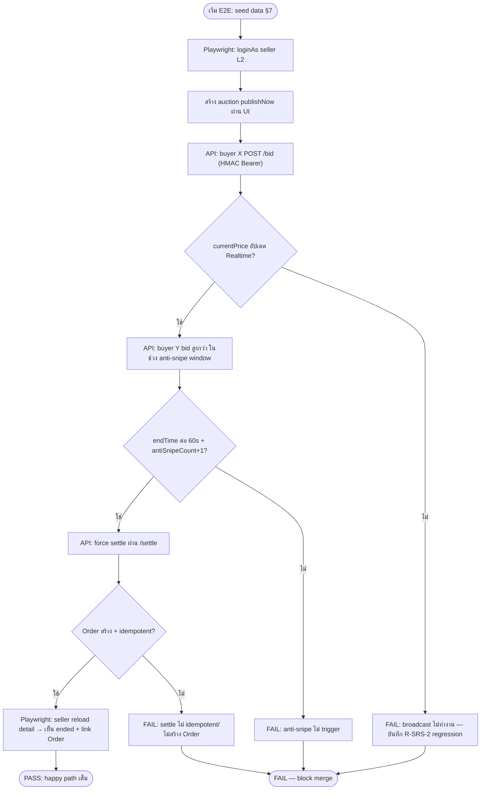
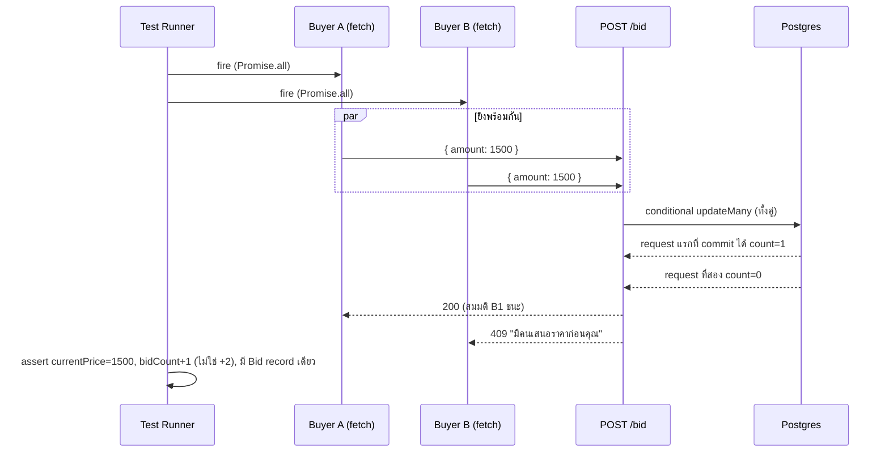

> **โมดูล:** M00002-SellerAuction
> **ประเภทเอกสาร:** Test Case Specification
> **เวอร์ชัน:** 1.0
> **วันที่จัดทำ:** 2026-07-01
> **สถานะ:** Draft
> **เจ้าของเอกสาร:** QA (`safepay-qa`) — ดู [[Feature-Docs-Ownership]]

# Test Case: Seller Auction + Realtime Bidding (M00002)

---

## 0. หมายเหตุสถานะเอกสาร (Documentation-First)

เอกสารนี้จัดทำ**ก่อน** implementation ตาม Hard Rule 11 (Documentation-First) — ณ วันที่จัดทำ (2026-07-01) ยังไม่มีไฟล์ `src/app/api/seller/auctions/**` และ `src/app/(paces)/seller/auctions/**` อยู่จริง (ยืนยันด้วย `Glob` ว่าง) ส่วน buyer API เดิม (`browse/top/[id]/bid/settle`) มีอยู่แล้วแต่ยังไม่ผ่านการ refactor ตาม [[SRS]]/[[SDS]] (concurrency bug R-SRS-1 ยังไม่แก้, ไม่มี anti-snipe/reserve/buy-now/end-early/expectedPrice)

**เอกสารนี้คือ "สัญญาการทดสอบ"** ที่ QA ใช้เมื่อ [[SDS]] §12 Build Sequence เสร็จครบ (batch A→E) — ทุก test case ต้อง**รันจริง**ตอนนั้น (ไม่ใช่แค่ทบทวนเอกสาร) ตามข้อบังคับ 3-level QA cadence + Playwright E2E mandatory ของโปรเจกต์ Test case ที่พบว่า behavior จริงต่างจาก spec (เช่น response shape ที่ยังเป็น "pending confirm" ใน [[API]] §11) ต้อง flag กลับให้ Controller sync กับ dev ก่อนตัดสิน PASS/FAIL

---

## 1. Overview

ชุดทดสอบนี้ครอบคลุมฟีเจอร์ **Seller Auction + Realtime Bidding (M00002)** ทั้งฝั่ง Seller (Paces web) และ Buyer (Deep-App ผ่าน `/api/app/auctions/**`) เทียบกับ:
- **[[BRD]]** — FR-AUC-01~13 ทุก Acceptance Criteria (Given/When/Then) + §2.6 Deferred (ไม่ต้องทดสอบ) + §2.7 Decisions Log (OQ-1~6 sign-off)
- **[[SRS]]** — TFR-001~017, state machine เต็ม (§TFR-014), authorization matrix (§4.5), validation rules (§5.4), PII rules (§5.5), risk R-SRS-1~7 (§8)
- **[[SDS]]** — §13 Test Strategy Hook (14 จุดวิกฤต บังคับครบ), function signature (§6), error mapping (§11)
- **[[API]]** — endpoint contract, error code table, DTO definitions (§9)

**ประเภทการทดสอบ:** Unit (pure function/Valibot schema) · Integration/API (route handler + service, curl/HMAC Bearer) · E2E Playwright (seller Paces UI) · Visual QA (Chrome DevTools MCP) · Concurrency (parallel request)

**ขอบเขต (In-scope):**
- Seller CRUD auction (create/edit/cancel/publish/end-early/list/detail) — ทั้ง API และ Paces UI
- Buyer bidding (bid/buy-now/browse/top/detail/watch) ผ่าน `/api/app/auctions/**` (HMAC Bearer)
- Realtime broadcast (Broadcast from Database), anti-snipe, reserve/unsold, win→Order idempotent
- State machine เต็ม 6 status, lazy scheduled→live transition
- User Level (`successfulBidCount` ladder) + Achievement badge trigger (6 auction criteria)
- PII-equivalent rule ของ `reservePrice`/`expectedPrice` (grep-gate + payload inspect)
- Authorization matrix ทุก endpoint × ทุก role

**นอกขอบเขต (Out-of-scope — ตาม [[BRD]] §2.6 DEFER Phase 2, ไม่ต้องมี TC):**
- Manual extend เวลาเอง, บล็อกผู้บิด, ปรับ buy-now ระหว่าง live, Feature/Pin
- Auto-Bid (Proxy Bid), winner auto-timeout/penalty, admin auction moderation dashboard, buyer web view เต็มรูป, seller mobile auction management, live-stream auction, analytics dashboard
- Deep-App (Expo) native UI/UX จริง — เป็นคนละ repo; ทดสอบพฤติกรรม buyer ผ่าน **API layer เท่านั้น** (จำลอง Deep-App ด้วย HTTP client + HMAC Bearer token จาก `signAppToken`)

**สภาพแวดล้อม:**
- Seller web: `http://seller.deepth.local:4000` (dev server รันโดย user เท่านั้น — QA ห้าม start เอง)
- Buyer API: `http://deepth.local:4000/api/app/auctions/**` (unified base ตาม `docs/buyer-app-api.md` — ไม่แยก subdomain)
- DB: Supabase (`.env.local`) — seed ผ่าน Prisma script (แผนใน §7), cleanup ปลายรัน
- Auth bypass: seller = NextAuth cookie inject (`e2e/helpers/auth.ts`), buyer = HMAC Bearer token (sign ตรงด้วย `signAppToken(userId)`, ไม่ต้องผ่าน OTP flow จริงในการทดสอบ bidding)

---

## 2. Test Scenarios

### 2.0 Pre-flight (บังคับก่อนทุก run)

| TC ID | Precondition check | Expected |
|---|---|---|
| TC-AUC-PF-01 | `curl -s http://deepth.local:4000/ -o /dev/null -w "%{http_code}"` | 2xx/3xx — ถ้าไม่ใช่ หยุด + report Controller ว่า dev server ไม่รัน |
| TC-AUC-PF-02 | Migration M1 (`auction_schema_delta`) + M2 (`user_bid_level`) apply แล้ว | `prisma.auction.findFirst` คืน field `reservePrice/buyNowPrice/antiSnipeCount/cancelledAt/expectedPrice/startTime` ได้โดยไม่ error; `prisma.user.findFirst` มี `successfulBidCount` |
| TC-AUC-PF-03 | Migration M3 (realtime trigger `auction_realtime_broadcast`) apply แล้ว (ถ้าทดสอบ Realtime) | `pg_trigger` มี `auction_realtime_broadcast_trigger` |
| TC-AUC-PF-04 | Seed data ตาม §7 พร้อม | Query ตรวจ auction/user ที่ seed ไว้มีอยู่จริงใน DB |
| TC-AUC-PF-05 | restart dev server หลัง migrate (บทเรียน seller-auth) | session/route ที่ query column ใหม่ไม่คืน 500 |

---

### 2.1 สร้าง Auction (FR-AUC-01 / TFR-001)

| TC ID | Linked AC | Type | Precondition | Steps | Expected Result |
|---|---|---|---|---|---|
| TC-AUC-01-01 | FR-AUC-01-AC-01 | Integration | Seller L2 APPROVED, มี Shop | `POST /api/seller/auctions` ข้อมูลครบ `mode=publishNow` | 201; `status` ตามที่กำหนด (live) |
| TC-AUC-01-02 | FR-AUC-01-AC-02 | Integration | Seller L1 หรือ L2 PENDING/REJECTED | `POST /api/seller/auctions` | 403 `"ต้องยืนยันตัวตนระดับ L2 ก่อนเปิดประมูล"` |
| TC-AUC-01-03 | FR-AUC-01-AC-03 | Integration | L2 ผ่าน | ส่ง `startPrice: 0` และ `startPrice: -100` | 400 `"startPrice ต้องมากกว่า 0"` ทั้งสองกรณี |
| TC-AUC-01-04 | FR-AUC-01-AC-04 | Integration | L2 ผ่าน | `startPrice=1000, reservePrice=500` | 400 `"reservePrice ต้องไม่ต่ำกว่า startPrice"` |
| TC-AUC-01-05 | FR-AUC-01-AC-05 | Integration | L2 ผ่าน | (a) `reservePrice=2000, buyNowPrice=1500` (b) ไม่มี reserve, `startPrice=1000, buyNowPrice=800` | 400 `"buyNowPrice ต้องสูงกว่า reservePrice หรือ startPrice"` ทั้งสองกรณี |
| TC-AUC-01-06 | FR-AUC-01-AC-06 | Integration | L2 ผ่าน | `endTime = now + 10min` | 400 `"endTime ต้องอยู่ในอนาคตอย่างน้อย 30 นาที"` |
| TC-AUC-01-07 | FR-AUC-01-AC-07 | Integration | L2 ผ่าน | (a) ไม่มี `title` (b) `images: []` | 400 `"title และรูปภาพอย่างน้อย 1 ใบเป็นข้อมูลบังคับ"` ทั้งสองกรณี |
| TC-AUC-01-08 | FR-AUC-01-AC-08 | Integration | สร้างสำเร็จ | ตรวจ response body | มี `id, status, title, startPrice, currentPrice(=startPrice), endTime, bidCount(=0)` ครบ |
| TC-AUC-01-09 | FR-AUC-01-AC-09 | Integration | Seller A login, มี shop A | ส่ง `shopId: <shop B id>` ใน body (ถ้า schema ยอมรับ field นี้เลยควร reject ที่ layer validation) หรือพยายาม inject header/param อื่นเพื่อ override shop | auction ที่สร้างต้องผูกกับ `shop A` เสมอ (derive จาก session) — ถ้า field `shopId` มีใน body ต้องถูก**เพิกเฉย**ไม่ใช่ error 500 |
| TC-AUC-01-10 | OQ-6 (BRD §2.7) | Integration | L2 ผ่าน | `mode=schedule, startTime = now - 1min` (อดีต) | **400** (reject ชัดเจน ไม่ auto-fallback publishNow — sign-off 2026-07-01) |
| TC-AUC-01-11 | TFR-001 | Integration | L2 ผ่าน | `mode=draft` | `status=draft`, `startTime=null` |
| TC-AUC-01-12 | TFR-001 | Integration | L2 ผ่าน | `mode=publishNow` | `status=live`, `currentPrice=startPrice`, รับ bid ได้ทันที |
| TC-AUC-01-13 | TFR-001 | Integration | L2 ผ่าน | `mode=schedule, startTime = now+1day` | `status=scheduled` |
| TC-AUC-01-14 | SRS §5.4 | Unit+Integration | Valibot schema | `expectedPrice: 0` และ `expectedPrice: -50` | 400 `"expectedPrice ต้องมากกว่า 0"` |
| TC-AUC-01-15 | SRS §5.4 | Unit+Integration | Valibot schema | `bidIncrement: 0` | 400 `"bidIncrement ต้องมากกว่า 0"` |
| TC-AUC-01-16 | SRS §5.4 | Integration | `mode=schedule` | `startTime >= endTime` | 400 `"startTime ต้องอยู่ในอนาคตและก่อน endTime"` |
| TC-AUC-01-17 | — | Integration | ไม่มี session | `POST /api/seller/auctions` ไม่มี cookie | 401 |
| TC-AUC-01-18 | — | Integration | Session ถูก แต่ user ยังไม่มี Shop (onboarding ไม่เสร็จ) | `POST /api/seller/auctions` | 403/404 ตาม TFR-001 ("ไม่มีร้าน") |

---

### 2.2 แก้ไข Auction (FR-AUC-02 / TFR-002)

| TC ID | Linked AC | Type | Precondition | Steps | Expected Result |
|---|---|---|---|---|---|
| TC-AUC-02-01 | FR-AUC-02-AC-01 | Integration | auction status=draft ของ seller A | `PATCH` title/description/รูป/bidIncrement/endTime | 200, DB อัปเดตตรง |
| TC-AUC-02-02 | FR-AUC-02-AC-02 | Integration | auction status=live/ended/unsold/cancelled | `PATCH` | 409 `"ไม่สามารถแก้ไข auction ที่เปิดรับ bid แล้ว"` — ทดสอบครบทั้ง 4 status |
| TC-AUC-02-03 | FR-AUC-02-AC-03 | Integration | seller B พยายามแก้ auction ของ seller A | `PATCH` | 403 |
| TC-AUC-02-04 | OQ-4 (BRD §2.7 sign-off: แก้ได้) | Integration | auction status=draft/scheduled | `PATCH` ส่ง `startPrice/reservePrice/buyNowPrice/expectedPrice` ใหม่ | 200, validation เดิมใน §5.4 apply ซ้ำ (เช่น reserve<start ยัง reject 400) |
| TC-AUC-02-05 | TFR-002 | Integration | auction status=scheduled มี `startTime` | `PATCH endTime` ให้ใกล้ `startTime` เกินไป | 400 revalidate `endTime>=now+30min` และ `startTime<endTime` |
| TC-AUC-02-06 | TFR-002 (race) | Integration | เปิดฟอร์ม edit ค้างไว้ (status=draft ตอนเปิด) | tab อื่น publish auction เป็น live ก่อน submit | submit ที่ DB state ปัจจุบัน (live) → 409 (ไม่เชื่อ client state เดิม) |

---

### 2.3 ยกเลิก Auction (FR-AUC-03 / TFR-003)

| TC ID | Linked AC | Type | Precondition | Steps | Expected Result |
|---|---|---|---|---|---|
| TC-AUC-03-01 | FR-AUC-03-AC-01 | Integration | status=draft/scheduled | `POST .../cancel` | 200, `status=cancelled`, `cancelledAt` set |
| TC-AUC-03-02 | FR-AUC-03-AC-02 | Integration | status=live, bidCount=0 | `POST .../cancel` | 200, `status=cancelled` |
| TC-AUC-03-03 | FR-AUC-03-AC-03 | Integration | status=live, bidCount≥1 | `POST .../cancel` | 409 `"ไม่สามารถยกเลิก auction ที่มีผู้เสนอราคาแล้ว"` |
| TC-AUC-03-04 | FR-AUC-03-AC-04 | Integration | status=ended/unsold/cancelled | `POST .../cancel` | 409 ทั้ง 3 กรณี |
| TC-AUC-03-05 | TFR-003 | Integration | seller B, auction ของ seller A | `POST .../cancel` | 403 |
| TC-AUC-03-06 | TFR-003 (race) | Concurrency | auction status=live, bidCount=0 | ยิง `bid` และ `cancel` พร้อมกัน (Promise.all) | ผลลัพธ์ตาม conditional-update: ถ้า bid commit ก่อน → cancel ได้ 409 ("bidCount>=1"); ถ้า cancel commit ก่อน → bid ได้ 409 ("ปิดแล้ว") — **ไม่มี state ที่ทั้งคู่สำเร็จพร้อมกัน** |

---

### 2.4 รายการ Auction ของร้าน (FR-AUC-04 / TFR-004)

| TC ID | Linked AC | Type | Precondition | Steps | Expected Result |
|---|---|---|---|---|---|
| TC-AUC-04-01 | FR-AUC-04-AC-01 | Integration+E2E | seller A มี auction 3 รายการ, seller B มี 2 รายการ | `GET /api/seller/auctions` ด้วย session seller A | เห็นแค่ 3 รายการของ shop A |
| TC-AUC-04-02 | FR-AUC-04-AC-02 | Integration | มี auction หลายสถานะ | `GET` | แต่ละ item มี `status,title,currentPrice,bidCount,endTimeMs` |
| TC-AUC-04-03 | FR-AUC-04-AC-03 | Integration | มี auction 6 สถานะครบ | `GET ?status=live` | เห็นเฉพาะ live |
| TC-AUC-04-04 | TFR-004 | Integration | seed >20 auction | `GET ?page=2` | offset ถูกต้อง, `take=20` |
| TC-AUC-04-05 | TFR-015 | Integration | auction scheduled, `startTime` ผ่านไปแล้ว, ยังไม่มีใคร browse | `GET /api/seller/auctions` (list) | `flipScheduledToLive()` ทำงาน lazy — item นั้นแสดง `status=live` ไม่ใช่ `scheduled` ค้าง |

---

### 2.5 วางบิด (FR-AUC-05 / TFR-005)

| TC ID | Linked AC | Type | Precondition | Steps | Expected Result |
|---|---|---|---|---|---|
| TC-AUC-05-01 | FR-AUC-05-AC-01 | Integration | auction live, `currentPrice=1000, bidIncrement=100` | `POST .../bid {amount:1100}` (Bearer buyer X) | 200; `currentPrice=1100`, `bidCount+1`, `Bid` record ใหม่ |
| TC-AUC-05-02 | FR-AUC-05-AC-02 | Integration | เหมือนบน | `POST .../bid {amount:1050}` | 400 พร้อม min amount |
| TC-AUC-05-03 | FR-AUC-05-AC-03 | Integration | auction status=ended หรือ `endTime` ผ่านแล้ว | `POST .../bid` | 409 `"การประมูลปิดแล้ว"` |
| TC-AUC-05-04 | FR-AUC-05-AC-04 | Integration | Bearer = seller ที่เป็นเจ้าของ auction | `POST .../bid` | 403 `"ไม่สามารถเสนอราคา auction ของตัวเองได้"` |
| TC-AUC-05-05 | FR-AUC-05-AC-05 | Integration | Buyer X เป็น current highest bidder | Buyer Y bid สูงกว่า | Buyer X ได้ `Notification(kind=outbid)` + push best-effort (mock push ล้มเหลวก็ต้องไม่ throw) |
| TC-AUC-05-06 | FR-AUC-05-AC-06 | Integration (timed) | client subscribe channel `auction:{id}` | bid commit | client เห็น broadcast ภายใน 1s (p95, วัดจาก timestamp) |
| TC-AUC-05-07 | FR-AUC-05-AC-07 | Integration | — | `amount: 1234.56` | รับได้ (Decimal 12,2) |
| TC-AUC-05-08 | FR-AUC-05-AC-08 | **Concurrency** | 2 buyer bid amount เท่ากันพร้อมกัน (`Promise.all` 2 fetch) | ยิง bid พร้อมกัน | คนแรก commit ชนะ, คนหลังได้ 409 `"มีคนเสนอราคาก่อนคุณ กรุณาลองใหม่"` — **ห้ามมี lost-update** (R-SRS-1) |
| TC-AUC-05-09 | — | Integration | ไม่มี Bearer | `POST .../bid` | 401 |
| TC-AUC-05-10 | — | Integration | auction id ไม่มีจริง | `POST .../bid` | 404 `"ไม่พบรายการประมูล"` |

---

### 2.6 Anti-Snipe (FR-AUC-06 / TFR-006)

| TC ID | Linked AC | Type | Precondition | Steps | Expected Result |
|---|---|---|---|---|---|
| TC-AUC-06-01 | FR-AUC-06-AC-01 | Integration | auction live, `endTime` เหลือ 59s, `antiSnipeCount=0` | bid สำเร็จ | `endTime += 60s`, `antiSnipeCount=1`, broadcast endTime ใหม่ |
| TC-AUC-06-02 | FR-AUC-06-AC-02 | Integration | `antiSnipeCount=5` แล้ว, `endTime` เหลือ 30s | bid สำเร็จ | `endTime` **ไม่เปลี่ยน**, `antiSnipeCount` คงที่ 5 |
| TC-AUC-06-03 | FR-AUC-06-AC-03 | Integration (boundary) | `endTime` เหลือ 61s พอดี | bid สำเร็จ | ไม่ trigger (boundary strict `<=60_000ms`) |
| TC-AUC-06-04 | FR-AUC-06-AC-04 | Integration | anti-snipe trigger | ตรวจ broadcast payload | มี `endTimeMs` ใหม่ |
| TC-AUC-06-05 | SDS §13-2 (R-SRS-3) | **Boundary/Concurrency** | `endTime` เหลือพอดี 60_000ms | bid | trigger ได้ (`<=`, inclusive) — เทียบกับ TC-06-03 (61s ไม่ trigger) ยืนยัน boundary ที่ 60s แม่นยำ |
| TC-AUC-06-06 | SDS §13-2 (R-SRS-3) | Integration | `antiSnipeCount=4`, bid ที่ 6 trigger ควรเป็นครั้งที่ 5 (สุดท้าย) | bid ในช่วง 60s | `antiSnipeCount=5` (ครั้งสุดท้ายที่อนุญาต) — ครั้งถัดไป (TC-06-02) ต้อง skip โดยไม่ error, DB CHECK `<=5` ไม่ throw |

---

### 2.7 Buy-Now (FR-AUC-07 / TFR-007)

| TC ID | Linked AC | Type | Precondition | Steps | Expected Result |
|---|---|---|---|---|---|
| TC-AUC-07-01 | FR-AUC-07-AC-01 | Integration | auction live, `buyNowPrice=20000, currentPrice=5000` | `POST .../buy-now` (Bearer buyer) | 200; `Bid@20000` สร้าง, `status=ended`, `Order` สร้างทันที (ไม่รอ endTime) |
| TC-AUC-07-02 | FR-AUC-07-AC-02 | Integration | `currentPrice >= buyNowPrice` (จาก bid ปกติดันขึ้นไป) | เปิด auction detail (buyer), พยายาม `buy-now` | ปุ่มไม่แสดง/disabled (UI); API ยิงตรง → 409 |
| TC-AUC-07-03 | FR-AUC-07-AC-03 | Integration | buyer 1 กด buy-now สำเร็จแล้ว | buyer 2 กด buy-now | 409 `"การประมูลปิดแล้ว"` |
| TC-AUC-07-04 | FR-AUC-07-AC-04 | Integration | Bearer = seller เจ้าของ auction | `POST .../buy-now` | 403 (self-bid guard เดียวกับ TC-05-04) |
| TC-AUC-07-05 | FR-AUC-07-AC-05 | Integration | buy-now สำเร็จ | ตรวจ notification | winner ได้ push + notification "คุณชนะการประมูล" พร้อม `orderId` |
| TC-AUC-07-06 | TFR-007 | Integration | auction ไม่มี `buyNowPrice` | `POST .../buy-now` | 400 `"auction นี้ไม่มีตัวเลือกซื้อทันที"` |
| TC-AUC-07-07 | SDS §13-3 (R-SRS-4) | **Concurrency** | auction live มี `buyNowPrice`, `currentPrice < buyNowPrice` | 2 buyer ยิง `buy-now` พร้อมกัน (`Promise.all`) | มี **`Order` เดียวเท่านั้น** (`Order.auctionId @unique` backstop) — คนที่สอง 409 |

---

### 2.8 Reserve Price + Unsold Path (FR-AUC-08 / TFR-008)

| TC ID | Linked AC | Type | Precondition | Steps | Expected Result |
|---|---|---|---|---|---|
| TC-AUC-08-01 | FR-AUC-08-AC-01 | Integration | auction จบ, มี reserve, `currentPrice < reservePrice` | `settleAuction()` / `POST .../settle` | `status=unsold`, ไม่มี `Order` |
| TC-AUC-08-02 | FR-AUC-08-AC-02 | Integration | มี reserve, `currentPrice >= reservePrice`, มี bid | settle | `status=ended`, `Order` สร้าง |
| TC-AUC-08-03 | FR-AUC-08-AC-03 | Integration | ไม่มี reserve, มี bid | settle | `status=ended` เสมอ |
| TC-AUC-08-04 | FR-AUC-08-AC-04 | Integration | ไม่มี bid เลย | settle | `status=unsold`, ไม่มี Order |
| TC-AUC-08-05 | FR-AUC-08-AC-05 | Integration+PII | auction มี reserve, ทั้ง live และ unsold | `GET /api/app/auctions/[id]` (buyer) | `hasReserve:true` แต่**ไม่มี**ตัวเลข `reservePrice` ในทุก status รวม unsold |

---

### 2.9 Win → Order (Settle idempotent) (FR-AUC-09 / TFR-009)

| TC ID | Linked AC | Type | Precondition | Steps | Expected Result |
|---|---|---|---|---|---|
| TC-AUC-09-01 | FR-AUC-09-AC-01 | Integration | auction จบมีผู้ชนะ, reserve met | settle | `Order{type:PHYSICAL, status:PENDING, totalAmount:currentPrice, auctionId}` สร้าง |
| TC-AUC-09-02 | FR-AUC-09-AC-02 | **Idempotency** | Order สร้างแล้ว | เรียก `settleAuction(id)` / `POST .../settle` ซ้ำ 5 ครั้งติด | `orderId` เดิมทุกครั้ง, ไม่มี Order ซ้ำ (นับ `prisma.order.count({where:{auctionId}})===1`) |
| TC-AUC-09-03 | FR-AUC-09-AC-03 | Integration | settle เสร็จ | ตรวจ notification/push | winner ได้ `Notification(kind=won)` + push พร้อม `orderId` |
| TC-AUC-09-04 | FR-AUC-09-AC-04 | E2E (Playwright) | Order สร้างจาก auction | login seller → `/seller/orders` | เห็น Order ใหม่ผูกกับ auction |
| TC-AUC-09-05 | FR-AUC-09-AC-05 | E2E | Order จาก auction | buyer แนบสลิป → seller ship → buyer confirm → review | flow OMS เดิมทำงานต่อเนื่องไม่มี blocker |
| TC-AUC-09-06 | BRD §8.6 (tiebreak) | Integration | 2 bid เท่ากัน (edge, เช่น import raw ผ่าน seed) | settle | winner = bid ที่ `createdAt` เก่ากว่า |

---

### 2.10 Realtime Broadcast (FR-AUC-10 / TFR-010)

| TC ID | Linked AC | Type | Precondition | Steps | Expected Result |
|---|---|---|---|---|---|
| TC-AUC-10-01 | FR-AUC-10-AC-01 | Integration (timed) | client subscribe `auction:{id}` | bid commit | client ได้ event ภายใน 1s (p95); UI currentPrice/countdown อัปเดต |
| TC-AUC-10-02 | FR-AUC-10-AC-02 | Integration | anti-snipe trigger | ตรวจ broadcast | มี `endTimeMs` ใหม่ |
| TC-AUC-10-03 | FR-AUC-10-AC-03 | **Negative** | ปิด/disable trigger ชั่วคราวใน test env (หรือ mock `realtime.send` fail) | bid | bid **ยังสำเร็จ** (write path ไม่พึ่ง Realtime) — client ไม่ได้ broadcast (fallback poll/manual refresh) |
| TC-AUC-10-04 | FR-AUC-10-AC-04 | Integration | auction จบ (settle) | ตรวจ broadcast | ส่งสถานะสุดท้าย (`ended`/`unsold`) ออกไป |
| TC-AUC-10-05 | SDS §13-5 | **PII/Critical** | subscribe channel จริง | ยิง bid → capture payload ที่ client เห็น | payload มีเฉพาะ `id, currentPrice, bidCount, endTimeMs, status, antiSnipeCount, hasReserve` — **ไม่มี** `reservePrice/expectedPrice/cancelledAt` |
| TC-AUC-10-06 | TFR-010 (fail-safe) | Integration | simulate `realtime.send()` error ใน trigger function | UPDATE Auction | UPDATE ยัง commit สำเร็จ (`EXCEPTION WHEN OTHERS THEN NULL` กัน rollback) |

---

### 2.11 Seller Detail Console (FR-AUC-11 / TFR-011)

| TC ID | Linked AC | Type | Precondition | Steps | Expected Result |
|---|---|---|---|---|---|
| TC-AUC-11-01 | FR-AUC-11-AC-01 | E2E | seller เปิด `/seller/auctions` | navigate | เห็น status chip, title, currentPrice, bidCount, countdown (ถ้า live) |
| TC-AUC-11-02 | FR-AUC-11-AC-02 | E2E | คลิก auction live | navigate detail | เห็น bidHistory (displayName+amount+เวลา), currentPrice realtime |
| TC-AUC-11-03 | FR-AUC-11-AC-03 | E2E | status=draft/scheduled | ดูรายการ | มีปุ่ม Edit + Cancel |
| TC-AUC-11-04 | FR-AUC-11-AC-04 | E2E | status=live, bidCount=0 | ดูรายการ | มีปุ่ม Cancel |
| TC-AUC-11-05 | FR-AUC-11-AC-05 | E2E | status=live, bidCount≥1 | ดูรายการ | ปุ่ม Cancel ไม่แสดง/disabled + tooltip |
| TC-AUC-11-06 | SDS §13-9 (ownership) | **Critical** | seller A login, พยายามเข้า auction ของ seller B | `GET /api/seller/auctions/[id]` (id ของ B) | **404** (ไม่ใช่ 403 — ตั้งใจ กันเดา id) — ทดสอบซ้ำกับ `PATCH`/`cancel`/`end-early` (ต้องเป็น **403** ตาม §4.3 ที่ไม่สม่ำเสมอโดยตั้งใจ) |
| TC-AUC-11-07 | SRS §5.5.2 (PII) | Integration | auction มี bid จาก buyer ที่มี phone/email | `GET /api/seller/auctions/[id]` | `bidHistory[].bidder` = displayName เท่านั้น, ไม่มี phone/email/bidderId หลุด |

---

### 2.12 จบประมูลก่อนเวลา (FR-AUC-12 / TFR-012)

| TC ID | Linked AC | Type | Precondition | Steps | Expected Result |
|---|---|---|---|---|---|
| TC-AUC-12-01 | FR-AUC-12-AC-01 | Integration+E2E | auction live, seller เป็นเจ้าของ | กดจบประมูล + confirm | `settleAuction()` ที่ currentPrice ปัจจุบันทันที |
| TC-AUC-12-02 | FR-AUC-12-AC-02 | Integration | bidCount≥1, currentPrice≥reserve (หรือไม่มี reserve) | end-early | winner=highest bidder, Order สร้าง, `status=ended` |
| TC-AUC-12-03 | FR-AUC-12-AC-03 | **Critical (SDS §13-8)** | bidCount≥1, `currentPrice < reservePrice` | (a) `POST end-early {}` ไม่ส่ง confirm (b) `POST end-early {confirmBelowReserve:true}` | (a) 409 `{error:"BELOW_RESERVE_CONFIRM_REQUIRED", currentPrice, hasReserve:true}` (b) 200, `status=unsold`, ไม่มี Order |
| TC-AUC-12-04 | FR-AUC-12-AC-04 | Integration | bidCount=0 | end-early | `status=unsold`, ไม่มี Order |
| TC-AUC-12-05 | FR-AUC-12-AC-05 | Integration | end-early สำเร็จ | ตรวจ broadcast | ส่งสถานะสุดท้าย (ended/unsold) |
| TC-AUC-12-06 | FR-AUC-12-AC-06 | Integration | (a) seller B ไม่ใช่เจ้าของ (b) status≠live | end-early | (a) 403 (b) 409 |

---

### 2.13 ยอดที่คาดหวัง — Expected Price (FR-AUC-13 / TFR-013)

| TC ID | Linked AC | Type | Precondition | Steps | Expected Result |
|---|---|---|---|---|---|
| TC-AUC-13-01 | FR-AUC-13-AC-01 | Integration | สร้าง/แก้ auction | ส่ง `expectedPrice: 12000` | บันทึกใน `Auction.expectedPrice` |
| TC-AUC-13-02 | FR-AUC-13-AC-02 | Integration+E2E | ไม่กรอก expectedPrice | สร้าง auction | `expectedPrice=null`; console ไม่แสดง gauge |
| TC-AUC-13-03 | FR-AUC-13-AC-03 | E2E | auction มี expectedPrice | เปิด detail console | เห็น gauge % (`currentPrice/expectedPrice`, clamp ≤100%) + เส้นเป้าหมายบนกราฟ |
| TC-AUC-13-04 | FR-AUC-13-AC-04 | **PII/Critical** | auction มี expectedPrice | `GET /api/app/auctions/[id]` (buyer, ไม่ auth) | response **ไม่มี key** `expectedPrice` เลย (ไม่ใช่แค่ `null`) — ตรวจด้วย `'expectedPrice' in body === false` |
| TC-AUC-13-05 | FR-AUC-13-AC-05 | Integration | `expectedPrice=50000`, `reservePrice=5000`, `currentPrice=6000` (ต่ำกว่า expected มาก แต่เกิน reserve) | settle | `status=ended` ปกติ (expectedPrice ไม่กระทบ sold/unsold ใด ๆ) |

---

### 2.14 State Machine Coverage (TFR-014, cross-cutting)

ทุก transition ใน SRS §TFR-014 ต้องมี TC อย่างน้อย 1 รายการ (อ้างอิงกลับ TC ที่ทดสอบไปแล้วในหมวดข้างบน + เพิ่มเติมที่ยังไม่ครอบ):

| TC ID | Transition | อ้างอิง/หมายเหตุ |
|---|---|---|
| TC-AUC-SM-01 | `[*] → draft` | TC-AUC-01-11 |
| TC-AUC-SM-02 | `[*] → live` (publish ทันที) | TC-AUC-01-12 |
| TC-AUC-SM-03 | `[*] → scheduled` | TC-AUC-01-13 |
| TC-AUC-SM-04 | `draft → scheduled` (edit+publish schedule) | ใหม่: สร้าง draft → `POST .../publish {mode:schedule, startTime}` → `status=scheduled` |
| TC-AUC-SM-05 | `draft → live` (edit+publish now) | ใหม่: สร้าง draft → `POST .../publish {mode:publishNow}` → `status=live` |
| TC-AUC-SM-06 | `draft → cancelled` | TC-AUC-03-01 |
| TC-AUC-SM-07 | `scheduled → live` (lazy) | TC-AUC-04-05 / TC-AUC-LZ-01 |
| TC-AUC-SM-08 | `scheduled → cancelled` | TC-AUC-03-01 (สถานะ scheduled) |
| TC-AUC-SM-09 | `live → live` (bid + anti-snipe) | TC-AUC-05-01, TC-AUC-06-01 |
| TC-AUC-SM-10 | `live → cancelled` (bidCount=0) | TC-AUC-03-02 |
| TC-AUC-SM-11 | `live → ended` (endTime ผ่าน, winner+reserve met) | TC-AUC-08-02/09-01 |
| TC-AUC-SM-12 | `live → unsold` (endTime ผ่าน, no winner/reserve ไม่ถึง) | TC-AUC-08-01/08-04 |
| TC-AUC-SM-13 | `live → ended` (buy-now instant) | TC-AUC-07-01 |
| TC-AUC-SM-14 | `live → ended/unsold` (end-early) | TC-AUC-12-01~04 |
| TC-AUC-SM-15 | Terminal state immutability | **ใหม่**: พยายาม `PATCH`/`cancel`/`bid`/`end-early`/`publish` บน auction ที่ `status ∈ {ended, unsold, cancelled}` — ทุกคำสั่งต้องถูกปฏิเสธ (409/403) ไม่มี transition ออกจาก terminal state ได้ |
| TC-AUC-SM-16 | Invalid direct transition | **ใหม่**: พยายาม `scheduled → cancelled` ผ่าน endpoint ที่ผิด (เช่น `end-early` บน scheduled) → 409 (`status ต้องเป็น live`) |

---

### 2.15 Lazy Scheduled → Live Transition (TFR-015)

| TC ID | Type | Precondition | Steps | Expected Result |
|---|---|---|---|---|
| TC-AUC-LZ-01 | Integration | auction `status=scheduled`, `startTime` ผ่านไปแล้ว | seller เปิด `/seller/auctions` (list) | flip เป็น `live` อัตโนมัติก่อน render (TC-AUC-04-05) |
| TC-AUC-LZ-02 | Integration | เหมือนบน | buyer เรียก `GET /api/app/auctions/browse` หรือ `/top` | flip เกิดจาก buyer request เช่นกัน (lazy ทุก entrypoint) |
| TC-AUC-LZ-03 | Integration | flip สำเร็จ | ตรวจ `currentPrice` | ยังเท่า `startPrice` เดิม (ไม่เปลี่ยนตอน flip) |
| TC-AUC-LZ-04 | Integration (bulk) | seed 150 auction scheduled ที่ due | เรียก sweep | จบภายใน 30s (NFR Scalability, `take:100` ต่อรอบ — ต้องมีรอบสอง sweep 50 ที่เหลือ) |

---

### 2.16 User Level — successfulBidCount Ladder (TFR-016)

| TC ID | Type | Precondition (`successfulBidCount`) | Expected `getAuctionLevel()` |
|---|---|---|---|
| TC-AUC-LVL-01 | Unit | 0 | level 1 "มือใหม่" |
| TC-AUC-LVL-02 | Unit (boundary) | 2 | level 1 "มือใหม่" |
| TC-AUC-LVL-03 | Unit (boundary) | 3 | level 2 "นักประมูล" |
| TC-AUC-LVL-04 | Unit (boundary) | 9 | level 2 "นักประมูล" |
| TC-AUC-LVL-05 | Unit (boundary) | 10 | level 3 "เซียน" |
| TC-AUC-LVL-06 | Unit (boundary) | 29 | level 3 "เซียน" |
| TC-AUC-LVL-07 | Unit (boundary) | 30 | level 4 "ระดับเพชร" |
| TC-AUC-LVL-08 | Unit (boundary) | 99 | level 4 "ระดับเพชร" |
| TC-AUC-LVL-09 | Unit (boundary) | 100 | level 5 "ตำนาน" |
| TC-AUC-LVL-10 | Integration | buyer ชนะ auction (settle มี winner) | `successfulBidCount += 1` (post-commit best-effort) — verify ผ่าน `prisma.user.findUnique` |
| TC-AUC-LVL-11 | Integration (SDS §13-12) | winner ชนะแล้ว, Order ถูก cancel (ชิ่ง, `Order.auctionId != null`) | `successfulBidCount` ลด 1 (`GREATEST(0, count-1)`) — hook ที่ order cancel flow |
| TC-AUC-LVL-12 | Integration (edge) | `successfulBidCount=0` แล้ว, มี Order อื่นถูก cancel อีก | ค่ายังคง `0` (ไม่ติดลบ) |
| TC-AUC-LVL-13 | Integration | placeBid ปกติ (ยังไม่ชนะ) หรือ unsold | `successfulBidCount` **ไม่เปลี่ยน** |

---

### 2.17 Achievement Badge Triggers (TFR-017)

| TC ID | Type | Precondition | Steps | Expected Result |
|---|---|---|---|---|
| TC-AUC-BDG-01 | Integration | seller ยังไม่เคยสร้าง auction (ไม่นับ draft/cancelled) | สร้าง auction สถานะ live/scheduled ครั้งแรก | ได้ badge "นักประมูลมือใหม่" (`AUCTION_HOSTED>=1`) |
| TC-AUC-BDG-02 | Integration | seller มี 9 auction hosted แล้ว | สร้างที่ 10 | ได้ badge "เจ้าแห่งประมูล 10" |
| TC-AUC-BDG-03 | Integration | seller auction แรก settle เป็น `ended` (ขายได้) | settle | ได้ badge "ปิดดีลประมูล" (`AUCTION_SOLD>=1`) |
| TC-AUC-BDG-04 | Integration | seller มี 9 auction ขายได้แล้ว | ขายที่ 10 | ได้ badge "ขายประมูลได้ 10 ดีล" |
| TC-AUC-BDG-05 | **Critical (SDS §13-13)** | buyer ยังไม่เคย bid ในระบบ | bid ครั้งแรก | `evaluateBadges(bidderId,'BUYER')` ทำงานจริง (audience นี้ยังไม่เคยมี caller — ต้องยืนยัน path ใหม่เดินได้) → ได้ badge "ประมูลครั้งแรก" |
| TC-AUC-BDG-06 | Integration | buyer ยังไม่เคยชนะ auction | ชนะ auction ครั้งแรก | ได้ badge "ชนะประมูลครั้งแรก" (`AUCTION_WON>=1`) |
| TC-AUC-BDG-07 | Integration | badge award สำเร็จ | ตรวจ `User.trustScore` | `recalculateTrustScore` ทำงาน, Badge 10% component เปลี่ยน (ไม่ filter เฉพาะ auction badge) |
| TC-AUC-BDG-08 | Negative | badge criteria type ที่ checker ยังไม่ implement (Phase 2, เช่น `AUCTION_HIGH_BID_COUNT`) | evaluate ทั้ง badge list | hit default switch + `console.warn`, **ไม่ throw** (bid/settle ต้องยังสำเร็จ) |

---

### 2.18 Authorization Matrix (cross-endpoint, SRS §4.5 / API §5)

| TC ID | Endpoint | Role tested | Expected |
|---|---|---|---|
| TC-AUC-SEC-01 | `POST /api/seller/auctions` | Owner L2+ ✅ / Owner L1 ❌403 / Buyer token ❌401 (คนละ auth scheme) / Guest ❌401 | ตามที่ระบุ |
| TC-AUC-SEC-02 | `GET/PATCH /api/seller/auctions/[id]` | Owner ✅ / Non-owner ❌404(GET)/403(PATCH) / Buyer ❌401 / Guest ❌401 | ตามที่ระบุ (ดู TC-AUC-11-06 ความไม่สม่ำเสมอโดยตั้งใจ) |
| TC-AUC-SEC-03 | `POST cancel/end-early/publish` | Owner ✅ / Non-owner ❌403 / Buyer ❌401 / Guest ❌401 | ตามที่ระบุ |
| TC-AUC-SEC-04 | `GET browse\|top\|[id]` (buyer API) | Seller ✅ / Buyer authed ✅ / Guest ✅ (ไม่ auth ก็ดูได้) | ทุก role เข้าถึงได้ |
| TC-AUC-SEC-05 | `POST bid\|buy-now` | Owner(self-bid) ❌403 / Owner(auction คนอื่น) ✅ / Buyer authed ✅ / Guest ❌401 | ตามที่ระบุ |
| TC-AUC-SEC-06 | `POST/DELETE watch` | Authed(buyer/seller) ✅ / Guest ❌401 | ตามที่ระบุ |
| TC-AUC-SEC-07 | `POST settle` | ทุก role รวม guest ✅ (by design, idempotent, ไม่รับ input ที่บิดผลได้) | 200 ทุกครั้ง |
| TC-AUC-SEC-08 | CSRF (`guardApi`) | mutation POST/PATCH จาก Origin ที่ไม่ allowlist | 403 (regression check ของ infra เดิม — ไม่ใช่ของใหม่ใน feature นี้ แต่ endpoint ใหม่ต้องอยู่ใต้ guard เดียวกัน) |
| TC-AUC-SEC-09 | Rate-limit (`guardApi`) | ยิง >30 req/min (authed) หรือ >100/min (unauth) จาก IP เดียว | ถูก throttle (known-gap per-instance ยอมรับแล้ว — แค่ verify ว่า limit ทำงานใน instance เดียว) |

---

### 2.19 Validation Rules Summary (cross-cutting, SRS §5.4)

| Field | Rule | ครอบคลุมโดย |
|---|---|---|
| `startPrice` | `>0` | TC-AUC-01-03 |
| `reservePrice` | `>=startPrice` (ถ้ามี) | TC-AUC-01-04, TC-AUC-02-04 |
| `buyNowPrice` | `>reservePrice??startPrice` (ถ้ามี) | TC-AUC-01-05 |
| `expectedPrice` | `>0` (ถ้ามี) | TC-AUC-01-14 |
| `endTime` | `>=now+30min` | TC-AUC-01-06, TC-AUC-02-05 |
| `startTime` (schedule) | `<endTime`, `>now()` | TC-AUC-01-10, TC-AUC-01-16 |
| `title`,`images` | required, `images.length>=1` | TC-AUC-01-07 |
| `bidIncrement` | `>0` | TC-AUC-01-15 |
| bid `amount` | `>=currentPrice+bidIncrement` | TC-AUC-05-02 |
| `antiSnipeCount` | app `<5` ก่อน increment, DB CHECK `<=5` | TC-AUC-06-02, TC-AUC-06-06 |

---

### 2.20 PII / Data-Exposure Grep-Gate (SRS §5.5 — บังคับก่อน merge)

| TC ID | Type | Steps | Expected |
|---|---|---|---|
| TC-AUC-PII-01 | Static analysis | `rg -n "reservePrice\|expectedPrice" src/app/api/app/` | คืน **0** ผลลัพธ์ (ยกเว้น comment ที่อธิบายว่าห้ามใส่) |
| TC-AUC-PII-02 | Static analysis | grep migration SQL ของ trigger `auction_realtime_broadcast()` | ไม่มี `reservePrice`/`expectedPrice`/`cancelledAt` ใน `jsonb_build_object` |
| TC-AUC-PII-03 | Integration | เรียกทุก buyer endpoint (`browse`,`top`,`[id]`,`bid`,`buy-now`) | ตรวจด้วย `'reservePrice' in body === false` และ `'expectedPrice' in body === false` (ไม่ใช่แค่ `=== null`) |
| TC-AUC-PII-04 | Integration | subscribe realtime channel จริง, capture payload หลาย event | ไม่มี `reservePrice`/`expectedPrice`/`cancelledAt` ในทุก payload |
| TC-AUC-PII-05 | Integration | ดึง `bidHistory` จาก seller detail | `bidder` = displayName เท่านั้น, ไม่มี `phone`/`email`/raw `bidderId` (มีแค่ `id` ของ bid record) |
| TC-AUC-PII-06 | E2E (view-source) | เปิด `/seller/auctions/[id]` (RSC), view page source / Next flight payload | ไม่มี raw Prisma row object หลุดเข้า flight (เฉพาะ `SellerAuctionDTO` primitive fields) — pattern เดียวกับ `feedback_rsc_pii_neutralize_at_source` |

---

### 2.21 Concurrency & Critical Points — SDS §13 (14 จุด, บังคับครบ)

| # SDS §13 | TC ID ที่ครอบคลุม | สถานะ mapping |
|---|---|---|
| 1. Concurrency bid ซ้อน (R-SRS-1) | TC-AUC-05-08 | ✅ |
| 2. Anti-snipe boundary 59/61s/ครั้งที่6 (R-SRS-3) | TC-AUC-06-01,03,05,06 | ✅ |
| 3. Buy-now double-trigger (R-SRS-4) | TC-AUC-07-07 | ✅ |
| 4. PII grep-gate | TC-AUC-PII-01, TC-AUC-PII-02 | ✅ |
| 5. Realtime payload inspect | TC-AUC-10-05, TC-AUC-PII-04 | ✅ |
| 6. Settle idempotency | TC-AUC-09-02 | ✅ |
| 7. Reserve/unsold path | TC-AUC-08-01~05 | ✅ |
| 8. End-early below-reserve confirm | TC-AUC-12-03 | ✅ |
| 9. Ownership scope (404 ทุก endpoint) | TC-AUC-11-06, TC-AUC-02-03, TC-AUC-03-05 | ✅ |
| 10. L2 guard | TC-AUC-01-02 | ✅ |
| 11. Self-bid block | TC-AUC-05-04, TC-AUC-07-04 | ✅ |
| 12. User Level ladder + order-cancel decrement | TC-AUC-LVL-01~13 | ✅ |
| 13. Badge trigger BUYER audience | TC-AUC-BDG-05 | ✅ |
| 14. UI visual QA (Paces/toast/chart/font/mobile) | TC-AUC-UI-01~08 (§2.24) | ✅ |

> **Gate:** ทั้ง 14 จุดต้อง PASS ก่อน sign-off merge — ถ้าจุดใด FAIL ให้ block merge ไม่ใช่ carry เป็น debt (ตาม SDS §13 เป็น "Test Strategy Hook" ที่มาจาก architectural risk จริง ไม่ใช่ nice-to-have)

---

### 2.22 Negative / Edge Cases

| TC ID | Type | Precondition | Steps | Expected Result |
|---|---|---|---|---|
| TC-AUC-NEG-01 | Integration/Manual | buyer subscribe realtime, network drop จำลอง (ปิด websocket) | bid คนอื่นเข้ามาระหว่าง drop | bid คนอื่นสำเร็จปกติ; buyer เห็น stale data จนกว่า reconnect (BRD Scenario 5) |
| TC-AUC-NEG-02 | Integration | ปิด/mock trigger `auction_realtime_broadcast` ให้ error เสมอ | bid/settle | write path (bid/settle) **สำเร็จ 100%** แม้ Realtime ตายสนิท |
| TC-AUC-NEG-03 | Integration | mock `pushToUser` throw exception | bid (outbid) / settle (won) | bid/settle ยัง commit สำเร็จ, error log แต่ไม่ throw ขึ้น API |
| TC-AUC-NEG-04 | Integration | — | ส่ง malformed JSON body | 400 generic |
| TC-AUC-NEG-05 | Integration | — | `amount` เกิน `Decimal(12,2)` range (เช่น 13 หลัก) | validation/DB error handled gracefully (ไม่ 500 unhandled) |
| TC-AUC-NEG-06 | Integration | — | `amount: -100`, `amount: 0` | 400 rejected |
| TC-AUC-NEG-07 | Integration (boundary) | `currentPrice=1000, bidIncrement=100` | `amount: 1099.99` (min ต้อง 1100) | 400 (boundary strict, ไม่ปัดเศษ) |
| TC-AUC-NEG-08 | Integration | seller session valid แต่ shop ถูกลบ (edge, ไม่ใช่ onboarding ปกติ) | `POST /api/seller/auctions` | 403/404 ตาม TFR-001 |
| TC-AUC-NEG-09 | E2E | session หมดอายุระหว่างกรอกฟอร์ม create/edit | submit | 401 → redirect `/auth/sign-in` (ไม่ crash form) |

---

### 2.23 Watch/Unwatch (OQ-3, ยืนยัน scope รวมใน M00002)

| TC ID | Type | Precondition | Steps | Expected Result |
|---|---|---|---|---|
| TC-AUC-WATCH-01 | Integration | buyer authed, auction มีจริง | `POST .../watch` | 200; `WatchList` upsert (`@@unique([userId,auctionId])`) |
| TC-AUC-WATCH-02 | Integration | เคย watch แล้ว | `DELETE .../watch` | 200; record ถูกลบ |
| TC-AUC-WATCH-03 | Integration | auction id ไม่มีจริง | `POST .../watch` | 404 |
| TC-AUC-WATCH-04 | Integration | ไม่มี Bearer | `POST .../watch` | 401 |
| TC-AUC-WATCH-05 | Integration (pending decision) | ไม่เคย watch auction นี้มาก่อน | `DELETE .../watch` | ตาม decision ที่ implement จริง (200 no-op **หรือ** 404 — [[API]] §11 ข้อ 6 ยังไม่ sign-off ชัด — QA ต้อง verify กับ dev ว่าเลือกทางไหนแล้ว assert ตามนั้น ไม่ assume) |
| TC-AUC-WATCH-06 | Integration | watch แล้ว | `GET /me/watching` (endpoint เดิม) | เห็น auction ที่ watch ไว้ |

---

### 2.24 UI Visual QA (Chrome DevTools MCP — Hard Rule 7/9/10, mobile)

| TC ID | Type | Steps | Expected |
|---|---|---|---|
| TC-AUC-UI-01 | Static grep | `rg 'text-\[|bg-\[rgba|shadow-\[|rounded-\[' "src/app/(paces)/seller/auctions/"` | 0 ผลลัพธ์ (ไม่มี arbitrary value, Hard Rule 7) เว้นแต่มี comment กำกับจำเป็นจริง |
| TC-AUC-UI-02 | Visual | trigger success/error action (cancel, create) | toast = `pacesToast` top-right; anti-snipe realtime event = `pacesToast.info` top-right เช่นกัน (ไม่ใช่ bottom-right, ผิดจาก chat pattern) |
| TC-AUC-UI-03 | Static grep | `rg "from 'react-apexcharts'\|from 'echarts'\|from 'chart\.js'\|from 'recharts'" "src/app/(paces)/seller/auctions/"` | 0 ผลลัพธ์ — chart ต้องผ่าน `ApexChart` wrapper เท่านั้น |
| TC-AUC-UI-04 | Visual (computed style) | เปิดทุกหน้า auction (list/create/detail) | `font-family` computed = Anuphan ทุกจุด (ไม่ fallback) |
| TC-AUC-UI-05 | Visual (computed style) | ตรวจปุ่ม primary | สี = `#236dc9` (Paces น้ำเงิน) ไม่ใช่ `#7367F0` (ม่วง Vuexy) |
| TC-AUC-UI-06 | Visual (mobile 375px) | เปิดทุกหน้าที่ viewport 375px | bottom sticky action bar ไม่ทับเนื้อหา, countdown ใช้ `tabular-nums` (ไม่ใช่ `font-mono`), ไม่ overflow-x |
| TC-AUC-UI-07 | Visual | คลิก cancel/end-early | ใช้ **Sweet Alerts** confirm (ไม่ใช่ `window.confirm`/toast/alert ดิบ) |
| TC-AUC-UI-08 | Visual | seller L1 เปิด `/seller/auctions/new` | เห็น banner + CTA ไป `/seller/verification` (ไม่ใช่ toast ลอย) ตาม §11.2 error mapping |

---

### 2.25 E2E Playwright Scenarios (`e2e/auction.spec.ts`, บังคับ — `npm run e2e`)

> buyer-side interaction (bid/buy-now) จำลองผ่าน **API layer (HMAC Bearer)** เรียกคู่กับ Playwright ฝั่ง seller UI เพื่อ verify cross-side effect (ตาม note ว่า buyer app เป็นคนละ repo, ไม่ทดสอบผ่าน Playwright UI จริง)

| TC ID | Scenario | Steps (ย่อ) | Expected |
|---|---|---|---|
| TC-AUC-E2E-01 | Happy path เต็ม | (1) `loginAs` seller L2 → สร้าง auction publishNow ผ่านฟอร์ม UI (2) API: buyer X bid, buyer Y bid สูงกว่า (3) API: bid ในช่วง anti-snipe (4) รอ/force settle (`/settle`) (5) seller reload detail page | (2) toast/realtime update เห็น currentPrice ใหม่ (3) endTime ต่อ + toast "+60 วินาที" (5) detail แสดง `ended` + link ไป Order ที่สร้าง |
| TC-AUC-E2E-02 | Buy-now | seller สร้าง auction มี buyNowPrice → API buyer buy-now → seller reload detail | `status=ended` ทันที, Order สร้าง, ปุ่ม buy-now หายจากมุมมอง buyer (API-level check) |
| TC-AUC-E2E-03 | Unsold (reserve ไม่ถึง) | seller สร้าง auction มี reserve สูง → API buyer bid ต่ำกว่า reserve → force settle | seller detail แสดง `unsold`, ไม่มี Order link |
| TC-AUC-E2E-04 | End-early | seller สร้าง live auction มี bid → คลิก "จบประมูลตอนนี้" ใน UI → confirm Sweet Alerts | ผล settle ทันที ตาม branch (ended/unsold/below-reserve-confirm) |
| TC-AUC-E2E-05 | Cancel | seller สร้าง draft → แก้ไข → cancel ผ่าน UI list ⋮ menu | list แสดง status `cancelled`, ปุ่มหาย |
| TC-AUC-E2E-06 | L2 guard redirect | login seller L1 → เปิด `/seller/auctions/new` | ฟอร์ม disabled + banner CTA ไป verification |
| TC-AUC-E2E-07 | Ownership 404 | login seller A → พิมพ์ URL ตรงไปยัง `/seller/auctions/[id ของ seller B]` | 404 page (ไม่ leak ข้อมูล) |
| TC-AUC-E2E-08 | Edit price fields | seller สร้าง draft → แก้ `reservePrice`/`buyNowPrice` ผ่านฟอร์ม → save | ค่าที่แก้ persist และแสดงถูกต้อง (OQ-4 confirm) |
| TC-AUC-E2E-09 | Realtime bid feed UI | เปิด detail console ค้างไว้ (Playwright page เปิด) → ยิง bid ผ่าน API คู่ขนาน | DOM ของ `AuctionBidFeed`/`AuctionStatCards` อัปเดตโดยไม่ reload (poll assertion ด้วย `waitForFunction`) |

---

## 3. Traceability Matrix

### 3.1 BRD FR-AUC-01~13 (ทุก AC)

| AC ID | Test Case | ครอบคลุมหรือไม่ |
|---|---|---|
| FR-AUC-01-AC-01~09 | TC-AUC-01-01~09 | Yes |
| FR-AUC-02-AC-01~03 | TC-AUC-02-01~03 | Yes |
| FR-AUC-03-AC-01~04 | TC-AUC-03-01~04 | Yes |
| FR-AUC-04-AC-01~03 | TC-AUC-04-01~03 | Yes |
| FR-AUC-05-AC-01~08 | TC-AUC-05-01~08 | Yes |
| FR-AUC-06-AC-01~04 | TC-AUC-06-01~04 | Yes |
| FR-AUC-07-AC-01~05 | TC-AUC-07-01~05 | Yes |
| FR-AUC-08-AC-01~05 | TC-AUC-08-01~05 | Yes |
| FR-AUC-09-AC-01~05 | TC-AUC-09-01~05 | Yes |
| FR-AUC-10-AC-01~04 | TC-AUC-10-01~04 | Yes |
| FR-AUC-11-AC-01~05 | TC-AUC-11-01~05 | Yes |
| FR-AUC-12-AC-01~06 | TC-AUC-12-01~06 | Yes |
| FR-AUC-13-AC-01~05 | TC-AUC-13-01~05 | Yes |

### 3.2 SRS/SDS Cross-cutting

| Requirement | Test Case | ครอบคลุมหรือไม่ |
|---|---|---|
| TFR-014 (state machine, ทุก transition) | TC-AUC-SM-01~16 | Yes |
| TFR-015 (lazy scheduled→live) | TC-AUC-LZ-01~04 | Yes |
| TFR-016 (User Level ladder) | TC-AUC-LVL-01~13 | Yes |
| TFR-017 (Badge triggers) | TC-AUC-BDG-01~08 | Yes |
| SRS §4.5 / API §5 Authorization matrix | TC-AUC-SEC-01~09 | Yes |
| SRS §5.4 Validation rules | §2.19 table (อ้าง TC จากหมวด 01/02/05) | Yes |
| SRS §5.5 PII rules | TC-AUC-PII-01~06 | Yes |
| SDS §13 (14 จุดวิกฤต) | ดู §2.21 mapping table | Yes (ครบ 14/14) |
| R-SRS-1~7 (Architectural Risk) | R1→TC-05-08, R2→TC-10-05/PII-01/04, R3→TC-06-05/06, R4→TC-07-07, R5→(reviewer code-inspect, ไม่ใช่ test แยก — ตรวจผ่าน TC-09-02 อ้อม), R6→ไม่มี TC (accepted risk), R7→TC-SEC-09 | Yes (R6 = documented accepted-risk ไม่ต้อง TC) |
| BRD §2.6 Deferred (manual extend/block bidder/adjust buy-now/feature-pin) | — | N/A (out-of-scope, ไม่มี TC ตามที่ตกลง) |
| OQ-1~6 (BRD §2.7 Decisions Log) | OQ-1→TC-10-*/PII-*, OQ-2→(ไม่มี gate — negative check "buyer L1 bid ได้" implicit ใน TC-05-01), OQ-3→TC-WATCH-*, OQ-4→TC-02-04/E2E-08, OQ-5→(UI copy only, ไม่มี functional TC), OQ-6→TC-01-10 | Yes |

---

## 4. Flow (Test Execution)

### 4.1 E2E Happy-Path Test Flow (รวม cross-side)

### 4.2 Concurrency Test Setup (Bid Race — TC-AUC-05-08)

---

## 5. ผลล่าสุด

| Run | วันที่ | ผล (Pass/Fail/Blocked) | ผู้ทดสอบ (Tester) |
|-----|--------|--------------------------|---------------------|
| 1 | (รอ build เสร็จตาม SDS §12) | Blocked — ยังไม่มี `src/app/api/seller/auctions/**` ในโค้ด (ยืนยัน Glob ว่าง ณ 2026-07-01) | safepay-qa |

> เอกสารนี้จะถูกอัปเดตทุกครั้งที่รันจริงหลัง Controller dispatch developer ตาม [[SDS]] §12 build sequence (batch A→E) ครบ

---

## 6. สรุป (Summary)

เอกสาร Test Case นี้กำหนด**ชุดเคสทดสอบ**ของ **Seller Auction + Realtime Bidding (M00002)** ที่ trace กลับ Acceptance Criteria ใน [[BRD]] ครบทุกข้อ (FR-AUC-01~13, 60 AC) รวมจุดวิกฤตเชิงสถาปัตยกรรมที่ [[SDS]] §13 ระบุไว้ครบ 14/14 จุด (concurrency, anti-snipe boundary, buy-now double-trigger, PII grep-gate, Realtime payload, settle idempotency, reserve/unsold, end-early confirm, ownership scope, L2 guard, self-bid, User Level, badge trigger, UI visual QA)

**สรุปจำนวน test case โดยประมาณ:** ~185 รายการ ครอบคลุม Unit (Valibot/pure function) ~15, Integration/API ~130, E2E Playwright ~9 scenario (หลาย assertion ต่อ scenario), Concurrency-specific ~5, Visual QA ~8, Negative/Edge ~9, Watch ~6

**Open Questions ที่ QA ต้อง verify ก่อน assert (ไม่ assume):**
- [[API]] §11 ข้อ 2/3/4/5/7 (response shape ของ `publish`/`cancel`/`buy-now`/`top`/`images[]`) — Controller technical default ระบุไว้ใน BRD §2.7 Group A แต่ QA ต้องดูโค้ดจริงที่ dev implement ก่อนเขียน assertion เป๊ะ (อย่า hardcode shape จาก draft นี้ถ้าของจริงต่าง)
- TC-AUC-WATCH-05 (unwatch ที่ไม่เคย watch — 404 หรือ no-op 200) ต้อง verify กับ dev ก่อน
- TC-AUC-05-06/10-01 (Realtime latency ≤1s p95) เป็น NFR วัดยากใน CI ปกติ — ทำ manual timing 5-10 รอบแทน statistical p95 เต็มรูป (documented limitation)

---

## 7. Test Data / Seed Plan (แผน — ไม่ใช่ seed script จริง)

ก่อนรัน ต้อง seed ผ่าน Prisma script (Controller/dev สร้างไฟล์ `prisma/qa-seed-auction.ts` ตอน build เสร็จ):

- **Users:** buyer X, buyer Y, buyer Z (มี AuthAccount + `signAppToken` ได้), seller A (L2 APPROVED + Shop), seller B (L2 APPROVED + Shop, ใช้ทดสอบ ownership), seller C (L1 เท่านั้น, ทดสอบ L2 guard); user ที่ `successfulBidCount` = 0/2/3/9/10/29/30/99/100 (ทดสอบ ladder)
- **Auctions ต่อสถานะ:** draft, scheduled (startTime อนาคต + startTime อดีตสำหรับ lazy-flip), live (bidCount=0, bidCount≥1, มี/ไม่มี reserve, มี/ไม่มี buyNow, มี/ไม่มี expectedPrice), ended, unsold, cancelled
- **Bulk:** 150 auction scheduled ที่ due (TC-AUC-LZ-04), >20 auction ของ shop A (pagination TC-AUC-04-04)
- **Cleanup:** ลบ auction/bid/order/watchlist/notification ที่ seed ปลายรัน (ห้ามแตะ data จริง — dev/prod แชร์ Supabase)
