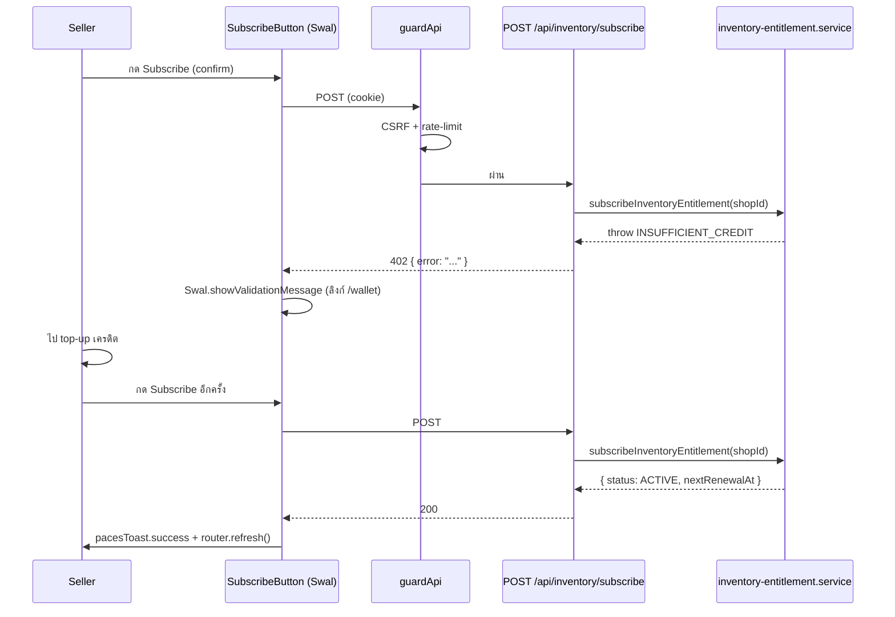
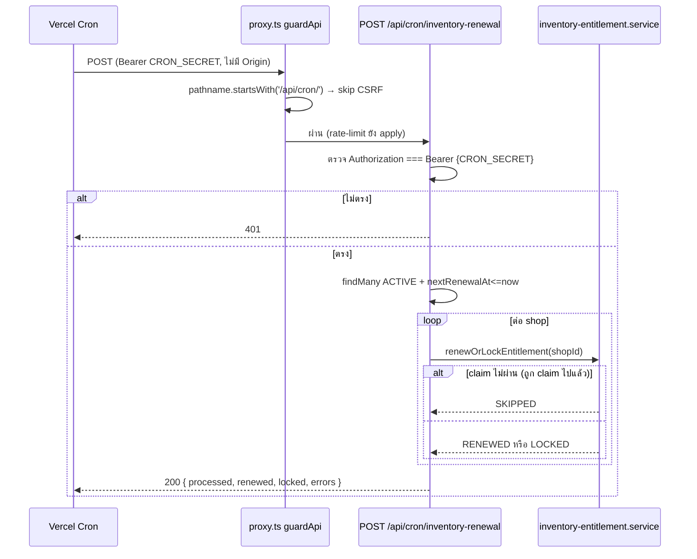
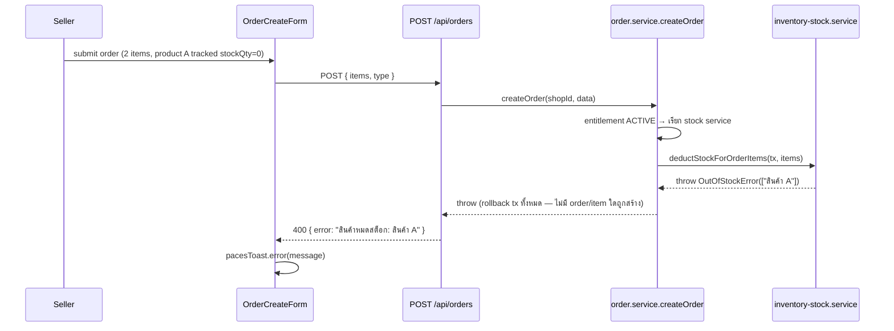

> **โมดูล:** M00003-InventoryAddon
> **ประเภทเอกสาร:** API Contract
> **เวอร์ชัน:** 1.0
> **วันที่จัดทำ:** 2026-07-01
> **สถานะ:** Draft
> **เจ้าของเอกสาร:** SA (ดู [[Feature-Docs-Ownership]])

# API Contract: Inventory Add-on

---

## 1. Overview

API ชุดนี้รองรับ **Inventory Add-on (M00003)** ฝั่ง seller (`seller.*`): subscription lifecycle (subscribe/reactivate), renewal cron (internal, server-to-server), และการขยาย endpoint สินค้า/order เดิมด้วย internal side-effect (stock deduct/restock — ไม่เปลี่ยน external request/response contract)

**Provider:** Next.js 16 App Router Route Handlers (nodejs runtime, Vercel Serverless)
**ผู้บริโภค:** `SubscribeButton`/`ReactivateButton` (seller UI), Vercel Cron scheduler (internal), `ProductFormV2` (ขยาย)
**Base URL:** `https://seller.deepthailand.app` (prod) / `https://seller.deepth.local:4000` (dev)
**Content-Type:** `application/json`
**Convention:** success `{ ... }` หรือ `{ ok: true }`; error `{ "error": "<ข้อความ/โค้ด>" }` (ดู §5)

- **ต้นทาง:** [[SDS]] §3-5; schema → [[DATABASE]] (**migration ต้อง apply ก่อน** implement endpoint ที่แตะ field ใหม่)

---

## 2. Authentication

| รายการ | ค่า |
|--------|-----|
| **Auth Method (seller endpoints)** | NextAuth v4 session cookie (`next-auth.session-token` httpOnly); `getServerSession(authOptions)` |
| **Auth Method (cron endpoint)** | `Authorization: Bearer {CRON_SECRET}` เท่านั้น — **ไม่มี session/JWT, ไม่ผ่าน guardApi CSRF Origin-check** (proxy.ts exclude `/api/cron/*` — ดู [[SDS]] TD-002) |
| **Session/Scope (seller)** | `session.user.id` → resolve shop ผ่าน `getShopByUserId` (ไม่รับ `shopId` จาก client body ที่จุดใดเลย) |
| **ไม่มี session** | 401 `{ "error": "unauthorized" }` |
| **CSRF** | `guardApi` ตรวจ Origin ทุก mutation ยกเว้น `/api/auth/*`, `/api/app/*`, **`/api/cron/*` (ใหม่)** |
| **Rate-limit** | auth 30/min, unauth 100/min per IP (globalThis per-instance); cron ตกใน unauth bucket (ไม่มีปัญหาเพราะรัน ≤1 ครั้ง/วัน) |

---

## 3. Endpoint List

| Method | Path | คำอธิบาย | Auth | สถานะ |
|--------|------|----------|------|--------|
| `POST` | `/api/inventory/subscribe` | Subscribe ครั้งแรก | seller session | **ใหม่** |
| `POST` | `/api/inventory/reactivate` | Reactivate จาก LOCKED | seller session | **ใหม่** |
| `POST` | `/api/cron/inventory-renewal` | Renewal batch รายวัน | `CRON_SECRET` bearer | **ใหม่** |
| `POST` | `/api/products` | สร้างสินค้า (ขยายรับ `stockQty`) | seller session | **ขยาย** |
| `PATCH` | `/api/products/[id]` | แก้สินค้า (ขยายรับ `stockQty`) | seller session (owner) | **ขยาย** |
| `POST` | `/api/orders` | สร้าง order (external contract **ไม่เปลี่ยน** — stock deduct = internal side-effect) | seller session | **ไม่เปลี่ยน contract**, เพิ่ม error case |
| `POST` | `/api/orders/[token]/cancel` | ยกเลิก order (external contract **ไม่เปลี่ยน** — restock = internal side-effect) | seller session หรือ buyer phone-parity | **ไม่เปลี่ยน contract** |

---

## 4. Endpoint Detail

### 4.1 `POST /api/inventory/subscribe` (ใหม่)

Subscribe ครั้งแรก — หักเครดิต ฿199 atomic จาก SellerWallet, สร้าง `InventoryEntitlement` (status=ACTIVE). Trace: SDS §3.2/§4.1 → SRS TFR-001 → BRD FR-INV-01

**Request Body:** `{}` (empty — shopId resolve จาก session)

**Success 200:**
```json
{ "status": "ACTIVE", "nextRenewalAt": "2026-07-31T19:00:00.000Z" }
```

**Errors:**
| Status | เงื่อนไข | body |
|--------|----------|------|
| 401 | ไม่มี session | `{ "error": "unauthorized" }` |
| 404 | ไม่พบ shop | `{ "error": "ไม่พบร้านค้า" }` |
| 409 | มี `InventoryEntitlement` row อยู่แล้ว (ACTIVE หรือ LOCKED) | `{ "error": "สมัครใช้งานอยู่แล้ว" }` |
| 402 | เครดิต < ฿199 | `{ "error": "เครดิตไม่พอ กรุณาเติมเครดิตก่อนสมัคร" }` |
| 429 | rate-limit | `{ "error": "Rate limit exceeded" }` |

**Idempotency:** ไม่ idempotent โดยตัวเอง — กดซ้ำ 2 ครั้งเร็ว ๆ ครั้งที่สองเจอ 409 (transaction แรก commit entitlement ไปแล้ว) client ควร disable ปุ่มระหว่างรอ (Sweet Alerts `showLoaderOnConfirm` ทำอยู่แล้ว — ดู [[SDS]] §5.2)

**Side-effects:** `WalletTransaction` (DEDUCT, `reason="INVENTORY_SUBSCRIPTION"`, `refId=<entitlementId>`) 1 รายการ; balance ลด 199; เมนู Inventory เปลี่ยนจาก disabled→enabled รอบ request ถัดไป (ไม่ realtime — client `router.refresh()` เอง)

```json
// Request → Response
{}  →  { "status": "ACTIVE", "nextRenewalAt": "2026-07-31T19:00:00.000Z" }
```

### 4.2 `POST /api/inventory/reactivate` (ใหม่)

Reactivate จาก LOCKED — หักเครดิต ฿199 atomic, รอบใหม่เริ่มนับจาก**ตอนนี้** (ไม่ต่อจากรอบเดิม). Trace: SDS §3.2/§4.1 → SRS TFR-006 → BRD FR-INV-06

**Request Body:** `{}`

**Success 200:**
```json
{ "status": "ACTIVE", "nextRenewalAt": "2026-08-01T19:00:00.000Z" }
```

**Errors:**
| Status | เงื่อนไข | body |
|--------|----------|------|
| 401 | ไม่มี session | `{ "error": "unauthorized" }` |
| 404 | ไม่พบ shop | `{ "error": "ไม่พบร้านค้า" }` |
| 409 | entitlement ไม่ใช่ LOCKED (ไม่มี row หรือเป็น ACTIVE อยู่แล้ว) | `{ "error": "บัญชีนี้ไม่ได้ถูกล็อก" }` |
| 402 | เครดิต < ฿199 | `{ "error": "เครดิตไม่พอ กรุณาเติมเครดิตก่อนเปิดใช้อีกครั้ง" }` |
| 429 | rate-limit | `{ "error": "Rate limit exceeded" }` |

**Idempotency:** ไม่ idempotent (เหมือน subscribe) — reactivate สำเร็จแล้วเรียกซ้ำเจอ 409

**Side-effects:** `WalletTransaction` DEDUCT ใหม่ (`reason="INVENTORY_SUBSCRIPTION"`, `refId=<entitlementId เดิม>`); `stockQty` ทุก Product **ไม่เปลี่ยน** (data retention — ดู SRS TFR-005)

### 4.3 `POST /api/cron/inventory-renewal` (ใหม่, internal)

Renewal batch รายวัน — Vercel Cron trigger เอง, per-shop isolated. Trace: SDS §3.2/§4.2 → SRS TFR-002 → BRD FR-INV-02/04

**Header required:** `Authorization: Bearer {CRON_SECRET}`
**Request Body:** ไม่มี (ไม่ parse)

**Success 200:**
```json
{ "processed": 12, "renewed": 10, "locked": 2, "errors": 0 }
```
| field | ความหมาย |
|-------|----------|
| `processed` | จำนวน shop ที่ query เจอ (`status=ACTIVE AND nextRenewalAt<=now`) |
| `renewed` | จำนวน shop ที่หักเครดิตสำเร็จ (`RENEWED`) |
| `locked` | จำนวน shop ที่ถูกล็อกเพราะเครดิตไม่พอ (`LOCKED`) |
| `errors` | จำนวน shop ที่ throw error อื่น (DB ฯลฯ — ไม่ใช่ `INSUFFICIENT_CREDIT`) ระหว่าง process (per-shop isolation — shop อื่นไม่ถูกกระทบ) |

หมายเหตุ: `processed - renewed - locked - errors` = จำนวน `SKIPPED` (idempotent no-op — ถูก claim ไปแล้วโดย invocation อื่น)

**Errors:**
| Status | เงื่อนไข | body |
|--------|----------|------|
| 401 | header ไม่มี/ไม่ตรง `CRON_SECRET` | `{ "error": "unauthorized" }` (ไม่แตะ DB เลย) |

**Idempotency:** idempotent จริง — atomic claim (`updateMany` WHERE `nextRenewalAt` snapshot) กันหักซ้ำแม้ retry/double-trigger ในวันเดียวกัน (ดู [[SDS]] §3.2 `renewOrLockEntitlement`)

**maxDuration:** `60` วินาที (route segment config) — กัน Hobby default timeout

**Config:** ทริกเกอร์โดย `vercel.json` `crons` entry (`0 19 * * *` = 02:00 ICT) — ไม่มี manual trigger endpoint อื่นใน MVP

### 4.4 `POST /api/products` (ขยาย — `stockQty`)

**Request Body (เพิ่ม field):**
| field | type | req | คำอธิบาย |
|-------|------|-----|----------|
| `stockQty` | `number \| null` | no | undefined=ไม่แตะ(ไม่ track), `null`=explicit untrack, `number>=0`=track ด้วยจำนวนนี้ |

**Valibot (เพิ่มเข้า `CreateProductSchema`):**
```typescript
stockQty: v.optional(v.nullable(v.pipe(v.number(), v.integer(), v.minValue(0)))),
```

**Response:** เดิม (`serializeProduct()`) — **เพิ่ม `stockQty: number | null`** เข้า response body

**Errors (เพิ่ม):**
| Status | เงื่อนไข | body |
|--------|----------|------|
| 400 | `stockQty` ส่งมาแต่ `type !== 'PHYSICAL'` | `{ "error": "STOCK_QTY_INVALID_PRODUCT_TYPE" }` |
| 403 | `stockQty` ส่งมาแต่ shop entitlement ≠ ACTIVE | `{ "error": "INVENTORY_NOT_ACTIVE" }` |
| 400 (เดิม) | validation อื่นผิด | `{ "error": "Invalid input" }` |

**Side-effects:** ไม่มี extra query เมื่อ `stockQty === undefined` (backward-compat — TFR-012)

```json
// Track ด้วยจำนวน 10
{ "name": "กระเป๋าถักมือ", "price": 590, "type": "PHYSICAL", "stockQty": 10 }
// ไม่ track (ปล่อยว่าง) — field หายไปเลยจาก body
{ "name": "เสื้อยืด", "price": 199, "type": "PHYSICAL" }
```

### 4.5 `PATCH /api/products/[id]` (ขยาย — `stockQty`)

เหมือน §4.4 + ownership check เดิม (`product.shop.userId === session.user.id`). `type` เป็น optional ใน PATCH — ถ้าไม่ส่งมา ใช้ `type` เดิมของ product ในการตรวจ `STOCK_QTY_INVALID_PRODUCT_TYPE`

**Valibot (เพิ่มเข้า `UpdateProductSchema`):** เหมือน §4.4

**ตัวอย่าง untrack กลับ:**
```json
{ "stockQty": null }
```

### 4.6 `POST /api/orders` (ไม่เปลี่ยน request/response contract — เพิ่ม error case)

**Errors (เพิ่ม):**
| Status | เงื่อนไข | body |
|--------|----------|------|
| 400 | สินค้า tracked ใน order หมดสต็อก (`OutOfStockError`) | `{ "error": "สินค้าหมดสต็อก: กระเป๋าถักมือ, เสื้อยืด" }` (รวมทุกชื่อสินค้าที่หมด — ดู [[SDS]] TD-006) |

**Behavior เปลี่ยน (ไม่ใช่ contract แต่ dev/QA ต้องรู้):** เมื่อ shop entitlement=ACTIVE และ order มีสินค้า tracked → สต็อกถูกตัด atomic ก่อน order ถูก commit (ไม่มี field ใหม่ใน response — `stockDeducted` เป็น internal field ของ `OrderItem` ไม่ serialize ออก external ใน MVP นี้)

### 4.7 `POST /api/orders/[token]/cancel` (ไม่เปลี่ยน request/response contract)

**Behavior เปลี่ยน (internal):** ถ้า order เคยตัดสต็อกไปตอนสร้าง (ไม่ว่า entitlement ปัจจุบันจะเป็นอะไร) → คืนสต็อกอัตโนมัติ ไม่มี error case ใหม่ (restock ไม่ล้มเหลวในทางธุรกิจ — orphan product ถูกลบไปแล้ว = skip เงียบ + log)

---

## 5. Error Code Table

รูปแบบมาตรฐาน: `{ "error": "<ข้อความ/โค้ด>" }`

| Status | ความหมาย | เงื่อนไข |
|--------|----------|----------|
| 400 | Validation ผิด / business rule ผิด | body malformed, `STOCK_QTY_INVALID_PRODUCT_TYPE`, `OutOfStockError` |
| 401 | Auth ไม่ผ่าน | ไม่มี session (seller endpoints) / `CRON_SECRET` ผิด-ไม่มี (cron endpoint) |
| 402 | เครดิตไม่พอ | `INSUFFICIENT_CREDIT` (subscribe/reactivate) |
| 403 | Permission/CSRF | `INVENTORY_NOT_ACTIVE` (product stock guard) / CSRF Origin ผิด |
| 404 | Not Found | ไม่พบ shop |
| 409 | Conflict | `ENTITLEMENT_ALREADY_EXISTS` / `ENTITLEMENT_NOT_LOCKED` |
| 429 | Too Many Requests | rate-limit เกิน |

| กรณี | message/code |
|------|--------------|
| subscribe เครดิตไม่พอ | `"เครดิตไม่พอ กรุณาเติมเครดิตก่อนสมัคร"` |
| reactivate เครดิตไม่พอ | `"เครดิตไม่พอ กรุณาเติมเครดิตก่อนเปิดใช้อีกครั้ง"` |
| subscribe ซ้ำ | `"สมัครใช้งานอยู่แล้ว"` |
| reactivate ทั้งที่ไม่ LOCKED | `"บัญชีนี้ไม่ได้ถูกล็อก"` |
| ไม่พบร้าน | `"ไม่พบร้านค้า"` |
| ไม่มี session | `"unauthorized"` |
| cron auth ผิด | `"unauthorized"` |
| stock field ผิดประเภทสินค้า | `"STOCK_QTY_INVALID_PRODUCT_TYPE"` |
| stock field ตอน entitlement ไม่ ACTIVE | `"INVENTORY_NOT_ACTIVE"` |
| order สินค้าหมดสต็อก | `"สินค้าหมดสต็อก: {ชื่อสินค้า, ...}"` |
| products validation (เดิม) | `"Invalid input"` (English — คงตามโค้ดเดิม ไม่เปลี่ยนใน scope นี้) |

---

## 6. Sequence Diagrams

### 6.1 Subscribe → Insufficient Credit → Top-up → Retry



### 6.2 Cron Renewal — Auth + Idempotent Claim



### 6.3 Order Create — Out of Stock (all-or-nothing)



---

## 7. Traceability

| Endpoint | SDS Component | SRS TFR | BRD FR |
|----------|----------------|---------|--------|
| `POST /api/inventory/subscribe` | §3.2 `subscribeInventoryEntitlement` | TFR-001 | FR-INV-01 |
| `POST /api/inventory/reactivate` | §3.2 `reactivateInventoryEntitlement` | TFR-006 | FR-INV-06 |
| `POST /api/cron/inventory-renewal` | §3.2 `renewOrLockEntitlement` + TD-002/TD-003 | TFR-002, TFR-004 | FR-INV-02, FR-INV-03, FR-INV-04 |
| `POST /api/products` (stockQty) | §3.6-3.7 | TFR-008 | FR-INV-08 |
| `PATCH /api/products/[id]` (stockQty) | §3.6-3.7 | TFR-008 | FR-INV-08 |
| `POST /api/orders` (out-of-stock case) | §3.5 `createOrder` + TD-001 | TFR-009, TFR-011, TFR-012 | FR-INV-09, FR-INV-11, FR-INV-12 |
| `POST /api/orders/[token]/cancel` (restock) | §3.5 `cancelOrder` | TFR-010, TFR-012 | FR-INV-10, FR-INV-12 |
| Admin `topups/[id]` sidebar (ไม่ใช่ API แยก — RSC query โดยตรง) | §5.5 | TFR-013 | FR-INV-13 |

---

## 8. สรุป + Open Questions

API contract ครบสำหรับ DEV implement + QA วางแผน negative case ทุก endpoint ใหม่/ขยาย. **ต้อง migrate ก่อน** implement endpoint ที่ใช้ field ใหม่ (`InventoryEntitlement`, `Product.stockQty`, `OrderItem.stockDeducted`, `WalletTransaction.reason`) + user approve (prod/dev แชร์ Supabase เดียวกัน)

**⚠️ Confirmed prerequisite fix (ไม่ใช่ open question — ต้องทำก่อน cron ใช้งานได้จริง):** `src/proxy.ts` ต้อง exclude `/api/cron/*` จาก CSRF Origin-check มิฉะนั้น `POST /api/cron/inventory-renewal` จะได้ 403 เสมอแม้ `CRON_SECRET` ถูกต้อง (ดู [[SDS]] TD-002 — verified จาก `src/lib/csrf-origin.ts:17`)

**Internal signature change ที่กระทบ caller เดิม (ไม่ใช่ public API แต่ dev ต้อง sync):**
```typescript
// เดิม
deductCredit(shopId, amount, refId, description, tx?)
// ใหม่ — บังคับแก้ call-site เดียวที่มีอยู่ (send-sms/route.ts) พร้อมกันในคอมมิตเดียว
deductCredit(shopId, amount, refId, description, reason, tx?)
```

**Open Questions:**
1. icon slug `boxes` สำหรับเมนู Inventory — ยัง verify ไม่ครบว่า iconify tabler set มีชื่อนี้ตรง (ไม่ block implement — เปลี่ยนชื่อ icon ทีหลังได้โดยไม่กระทบ API)
2. `WALLET_REASON`/`WALLET_REASON_LABEL_TH` (รวม `SMS_ORDER_LINK`) อยู่ในไฟล์ `inventory-addon.ts` ที่ตั้งชื่อเฉพาะ inventory — Controller อาจพิจารณาย้ายไปไฟล์กลางชื่อเป็นกลางกว่า (เช่น `wallet-reasons.ts`) ในอนาคต ไม่กระทบ contract ตอนนี้
