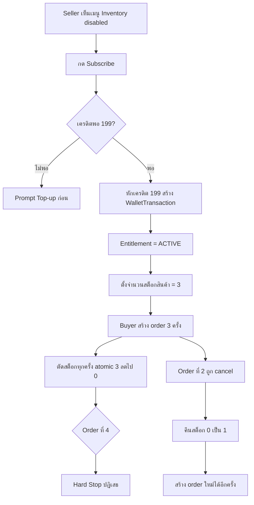
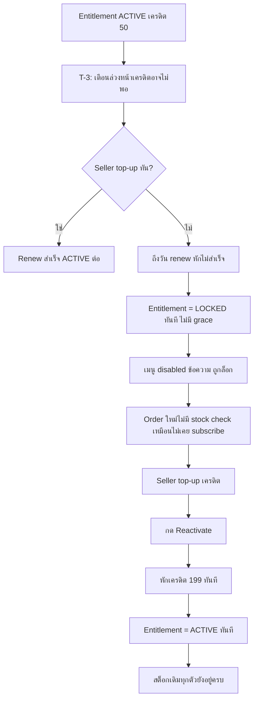

> **โมดูล:** M00003-InventoryAddon
> **ประเภทเอกสาร:** Product Requirements Document (PRD)
> **เวอร์ชัน:** 1.0
> **วันที่จัดทำ:** 2026-07-01
> **สถานะ:** Draft
> **เจ้าของเอกสาร:** BA + PO + PM (ดู [[Feature-Docs-Ownership]])

# PRD: Inventory Add-on

---

## Executive Summary

Inventory Add-on คือฟีเจอร์เสริมแบบ subscription (฿199/เดือน) ตัวที่สองของแพลตฟอร์ม Deep ต่อจาก SMS Order Link — ให้ Seller ที่มีสต็อกสินค้าจำกัดสามารถเปิดใช้การจัดการจำนวนสต็อก (stock quantity) ต่อสินค้าประเภท **PHYSICAL** เท่านั้น ระบบจะตัดสต็อกอัตโนมัติทุกครั้งที่มีการสร้าง order ใหม่ (สถานะ PENDING) คืนสต็อกอัตโนมัติเมื่อ order ถูกยกเลิก และปฏิเสธการสร้าง order ทันทีเมื่อสินค้าหมดสต็อก (hard stop) ค่าบริการหักจาก **SellerWallet** เดิม (เครดิตเดียวกับที่ใช้จ่าย SMS Order Link) อัตโนมัติทุกรอบเดือน หากเครดิตไม่พอตอน renew ระบบจะ**ล็อกฟีเจอร์ทันที**โดยไม่มี grace period แต่จะเตือนล่วงหน้าก่อนถึงรอบเสมอ และเมื่อล็อกแล้วข้อมูลสต็อกที่มีอยู่จะไม่ถูกลบ — เพียงหยุดตัด/บล็อกอัตโนมัติ กลับมา subscribe ใหม่แล้วใช้ต่อได้ทันที ผลลัพธ์ทางธุรกิจหลักคือเพิ่มรายได้ recurring ต่อร้าน (ARPU) และแก้ปัญหา overselling ซึ่งเป็นความเสี่ยงจริงของร้านที่ขายสินค้ามีจำนวนจำกัด โดยไม่กระทบ flow สร้าง order/product เดิมของ Seller ที่ไม่ subscribe แม้แต่น้อย (backward compatibility เป็นเงื่อนไขบังคับ เพราะ Order/Product เป็น core flow ที่รันอยู่บน prod แล้ว)

---

## 1. Business Goals & KPIs

### 1.1 เป้าหมายทางธุรกิจ

| เป้าหมาย | รายละเอียด |
|----------|-----------|
| **เพิ่ม Recurring Revenue (ARPU)** | Add-on subscription ตัวที่ 2 ของระบบ (ต่อจาก SMS Order Link) — สร้างรายได้ประจำต่อร้านนอกเหนือจาก pay-per-use |
| **ลด Overselling** | Seller ที่มีสต็อกจำกัด (เช่น handmade, ของ pre-order จำนวนจำกัด) ป้องกันการรับ order เกินสต็อกจริงโดยอัตโนมัติ |
| **เพิ่ม Wallet Stickiness** | ผูก feature ใหม่กับ SellerWallet เดิม — กระตุ้นให้ Seller top-up และรักษายอดเครดิตต่อเนื่อง |
| **Zero Regression บน Core Flow** | Seller ที่ไม่ subscribe ต้องใช้งาน Order/Product ได้ครบทุกประการเหมือนก่อนมีฟีเจอร์นี้ — ป้องกันความเสี่ยงต่อ prod ที่มีผู้ใช้งานจริงอยู่แล้ว |
| **เพิ่ม Conversion ผ่าน Visible Gate** | โชว์เมนู Inventory เสมอ (แบบ disabled) แทนการซ่อน — เป็นช่องทาง discover + convert Seller ที่ยังไม่ subscribe |

### 1.2 ตัวชี้วัดความสำเร็จ (KPIs)

| KPI | คำอธิบาย | เป้าหมาย |
|-----|----------|---------|
| **Subscription Conversion Rate** | % ของ Shop ที่มี Product PHYSICAL ≥1 ที่กด subscribe ภายใน 90 วันหลัง launch | ≥ 10% (เป้าเบื้องต้น — ไม่มี baseline, ปรับหลัง launch) |
| **MRR จาก Inventory Add-on** | ผลรวม ฿199 × จำนวน Shop ที่ entitlement = ACTIVE ในแต่ละเดือน | Baseline เดือนแรกหลัง launch → ใช้เทียบเดือนถัดไป |
| **Renewal Success Rate** | % ของรอบ renew ที่หักเครดิตสำเร็จ (ไม่ถูกล็อก) เทียบทั้งหมด | ≥ 80% |
| **Lock Rate จากเครดิตไม่พอ** | % ของ subscription ที่ถูกล็อกเพราะเครดิตไม่พอในแต่ละเดือน | < 20% (สูงกว่านี้ = สัญญาณว่าราคา/เตือนล่วงหน้าไม่พอ) |
| **Reactivation Rate** | % ของ Shop ที่ถูกล็อกแล้วกลับมา subscribe ซ้ำภายใน 30 วัน | ≥ 40% |
| **Zero-Stock Block Count** | จำนวนครั้งที่ระบบ block การสร้าง order เพราะ stock=0 (proxy วัดว่าฟีเจอร์ป้องกัน overselling ได้จริง) | วัด trend เพิ่มขึ้น = ฟีเจอร์ถูกใช้งานจริง |

---

## 2. User Personas (กลุ่มผู้ใช้งาน)

### 2.1 Seller ที่มีสต็อกจำกัด (กลุ่มเป้าหมายหลัก)

**ข้อมูลพื้นฐาน:**
- ขายสินค้า PHYSICAL ที่มีจำนวนจำกัดจริง เช่น งาน handmade, ของสะสม, สินค้า pre-order รอบละไม่กี่ชิ้น
- มี SellerWallet อยู่แล้ว (top-up ใช้ SMS Order Link มาก่อน หรือเปิดใหม่)

**เป้าหมาย:**
- ไม่อยากขายเกินจำนวนที่มีจริง (ป้องกันปัญหาลูกค้าจ่ายเงินแล้วของหมด)
- อยากเห็นจำนวนสต็อกที่เหลือแบบ real-time ต่อสินค้า

**ความต้องการ:**
- ตั้งจำนวนสต็อกต่อสินค้าได้
- ระบบตัดสต็อกอัตโนมัติทุกครั้งที่มี order ใหม่ ไม่ต้องมานับเอง
- ระบบคืนสต็อกอัตโนมัติเมื่อ order ถูกยกเลิก
- ถ้าสต็อกหมด ห้ามสร้าง order ซ้อนได้อีก

**จุดปวด (Pain Points):**
- ปัจจุบันต้องนับสต็อกเองนอกระบบ (สมุด/แชท) เสี่ยงรับ order เกินจำนวนที่มี
- ยกเลิก order แล้วลืมเอาของกลับเข้าสต็อก ทำให้ตัวเลขจริงกับระบบไม่ตรงกัน

### 2.2 Seller เดิมที่ยังไม่ subscribe (regression-sensitive)

**ข้อมูลพื้นฐาน:**
- ใช้งาน Order/Product flow เดิมอยู่แล้วบน prod ไม่สนใจ/ไม่จำเป็นต้องใช้ inventory tracking
- อาจขายสินค้าที่ไม่มีข้อจำกัดสต็อก (digital, service) หรือสต็อกไม่จำกัดจริง

**เป้าหมาย:**
- ใช้งาน Order/Product ได้เหมือนเดิมทุกประการ ไม่อยากเจอ validation หรือขั้นตอนใหม่ที่ไม่เกี่ยวกับตน

**ความต้องการ:**
- เห็นเมนู Inventory (รับรู้ว่ามีฟีเจอร์นี้) แต่ไม่ต้องถูกบังคับใช้
- สร้าง order/product ได้โดยไม่มี stock check ใด ๆ แทรกเข้ามา

**จุดปวด (Pain Points):**
- กลัวว่าฟีเจอร์ใหม่จะทำให้ flow เดิมช้าลงหรือมีเงื่อนไขแปลกใหม่โดยไม่ได้ตั้งใจ subscribe

### 2.3 Admin (Wallet / Support)

**ข้อมูลพื้นฐาน:**
- ดูแล WalletTransaction / TopUpRequest ของทั้งระบบอยู่แล้ว (จาก SMS Order Link feature)

**เป้าหมาย:**
- เมื่อ Seller ติดต่อ support ("ทำไม inventory ฉันถูกล็อก") สามารถตรวจสอบสาเหตุได้จากหน้าที่มีอยู่แล้ว โดยไม่ต้องเปิดหน้าใหม่

**ความต้องการ:**
- เห็นรายการหักเครดิต Inventory Add-on แยกแยะได้จากรายการ SMS ในหน้า wallet transaction เดิม

**จุดปวด (Pain Points):**
- ถ้ารายการหักเครดิตไม่มี label ชัดเจน จะแยกไม่ออกว่าเครดิตหายไปเพราะ SMS หรือ Inventory renewal ทำให้ support ช้า

---

## 3. Business Requirements

### 3.1 Subscription Pricing & Billing

**ความต้องการ:**
- Seller เปิดใช้ Inventory Add-on ด้วยการ subscribe ในราคา **฿199/เดือน** แบบ flat rate ไม่มี proration
- ค่าบริการหักจาก **SellerWallet** เดิม (เครดิต 1 = ฿1) — ไม่มีช่องทางจ่ายเงินแยกใหม่
- การหักเครดิตทำงานอัตโนมัติทุกรอบเดือน (renewal) ตราบใดที่ entitlement ยัง ACTIVE

**Business Rules:**
- ราคาคงที่ ฿199/เดือน ไม่มี tier, ไม่มีส่วนลด ใน MVP
- ต้องมีเครดิตเพียงพอ (≥฿199) ณ ตอน subscribe ครั้งแรก — ถ้าไม่พอ ระบบปฏิเสธการ subscribe พร้อม prompt ให้ top-up ก่อน (reuse TopUpRequest flow เดิม)
- รอบ renewal = **รายเดือนแบบหมุนต่อเนื่อง (rolling 30 วัน)** นับจากวันที่ subscribe ครั้งแรก หรือวันที่ renew/reactivate ล่าสุด (ไม่ใช่ calendar month คงที่)

**เหตุผล:**
- Reuse SellerWallet เดิมลดความซับซ้อนด้าน payment infra และตรงกับโมเดล "à la carte add-on" ที่ระบบวางไว้ใน PRD §6
- Flat rate ไม่มี proration ทำให้ business logic เรียบง่ายและ predictable สำหรับทั้ง Seller และระบบ billing

### 3.2 Menu Gate — ยังไม่ Subscribe

**ความต้องการ:**
- เมนู "Inventory" ต้องปรากฏใน seller sidebar เสมอ (ไม่ซ่อน) แม้ Seller ยังไม่ subscribe
- เมื่อยังไม่ subscribe → เมนูอยู่ในสถานะ disabled และเมื่อกด/hover ต้องแสดง prompt ชวน subscribe (ดีต่อ conversion)
- ห้ามทำเป็น read-only demo — ต้อง disabled จริง ไม่ปล่อยให้เข้าดู/แก้ไขข้อมูลใด ๆ

**Business Rules:**
- สถานะเมนู Inventory มี 3 แบบ: **ยังไม่ subscribe** (disabled + prompt subscribe), **ACTIVE** (ใช้งานได้เต็ม), **LOCKED** (disabled + prompt reactivate — ข้อความต่างจาก "ยังไม่ subscribe")
- Prompt ต้องมี CTA ไปหน้า subscribe/top-up โดยตรง ไม่ใช่แค่ข้อความเฉย ๆ

**เหตุผล:**
- เมนูที่มองเห็นได้แต่ล็อกไว้เป็น pattern conversion ที่พิสูจน์แล้วใน SaaS ทั่วไป — Seller รู้ว่ามีของอยู่ตรงหน้า เกิดแรงจูงใจกดสมัคร
- แยกข้อความระหว่าง "ยังไม่เคย subscribe" กับ "ถูกล็อก" ช่วยลด confusion และช่วย support วินิจฉัยปัญหาได้เร็วขึ้น

### 3.3 Insufficient Credit ตอน Renew → ล็อกทันที + เตือนล่วงหน้า

**ความต้องการ:**
- ถ้าถึงรอบ renew แล้วเครดิตใน SellerWallet ไม่พอ (< ฿199) → ระบบล็อกฟีเจอร์**ทันที** ไม่มี grace period
- ก่อนถึงรอบ renew ระบบต้องเตือน Seller ล่วงหน้าถ้าคาดว่าเครดิตจะไม่พอ ให้มีโอกาส top-up ทัน

**Business Rules:**
- เตือนล่วงหน้า **3 วันก่อนถึงรอบ renew** ถ้ายอดเครดิตปัจจุบัน < ฿199 (ยืนยันโดย user 2026-07-01 — ดู §10.3 OD-1)
- ไม่มี grace period ใด ๆ — ถึงรอบแล้วเครดิตไม่พอ = ล็อกทันทีในรอบนั้นเลย ไม่รอวันถัดไป
- การล็อกไม่ทำให้ Order/Product ที่มีอยู่แล้วเสียหาย — กระทบเฉพาะความสามารถ track/deduct stock ใหม่

**เหตุผล:**
- Grace period เพิ่มความซับซ้อนของ state machine และเสี่ยงให้ Seller เข้าใจผิดว่ายังใช้ได้ทั้งที่เครดิตหมดแล้ว
- เตือนล่วงหน้าเป็นการลด friction ของ "ล็อกทันทีไม่มี grace" ให้ Seller มีโอกาสป้องกันไม่ให้ถูกล็อกตั้งแต่แรก

### 3.4 Data Retention เมื่อ Feature ถูกล็อก

**ความต้องการ:**
- เมื่อ feature ถูกล็อก ข้อมูลจำนวนสต็อกที่ Seller เคยตั้งไว้ต้อง**ไม่ถูกลบหรือ reset** — เก็บไว้ทั้งหมด
- ระบบเพียงหยุดการตัด/บล็อกสต็อกอัตโนมัติ — Order/Product flow กลับไปทำงานเหมือน Seller ที่ไม่เคย subscribe (ไม่มี stock check)
- เมื่อ Seller reactivate สำเร็จ → เห็นจำนวนสต็อกเดิมทุกตัวทันที ไม่ต้องกรอกใหม่

**Business Rules:**
- ห้ามมี hard-delete หรือ batch-reset stock quantity เมื่อ entitlement เปลี่ยนสถานะ (ทั้งตอนล็อกและตอน reactivate)
- ระหว่างล็อก การสร้าง order ใหม่ของสินค้า PHYSICAL ที่เคยมี stock ต้องไม่ error และไม่ deduct/block ใด ๆ (เหมือนไม่เคย subscribe)

**เหตุผล:**
- ป้องกันความเสียหายทางธุรกิจ — Seller ที่แค่ top-up ช้าไปหนึ่งรอบไม่ควรต้องเสียข้อมูลสต็อกที่กรอกไว้
- สร้างความมั่นใจให้ Seller กล้า subscribe ต่อ เพราะรู้ว่าเครดิตหมดแล้วข้อมูลไม่หาย

### 3.5 Stock Management — เฉพาะ Product ประเภท PHYSICAL

**ความต้องการ:**
- Seller ตั้งจำนวนสต็อก (stock quantity) ต่อ Product ได้ **เฉพาะ product type = PHYSICAL** เท่านั้น
- Product ประเภท DIGITAL / SERVICE / SUBSCRIPTION ไม่มี stock quantity ให้ตั้ง — เป็นข้อจำกัดถาวร ไม่ใช่แค่ MVP

**Business Rules:**
- Field จำนวนสต็อกไม่ปรากฏใน UI ของ Product ที่ type ≠ PHYSICAL เลย ไม่ใช่แค่ซ่อนเงื่อนไข
- การตั้งจำนวนสต็อกเป็นแบบ **opt-in ต่อสินค้า** — Product PHYSICAL ที่ Seller ยังไม่ตั้งจำนวน (ค่าว่าง) ถือเป็น "ไม่ track" — ไม่มีการตัด/บล็อกสต็อกสำหรับสินค้านั้น แม้ entitlement จะ ACTIVE ก็ตาม (ยืนยันโดย user 2026-07-01 — ดู §10.3 OD-2)

**เหตุผล:**
- DIGITAL/SERVICE/SUBSCRIPTION ไม่มีข้อจำกัดปริมาณทางกายภาพ — การมี stock field จะสร้างความสับสนและ validation ที่ไม่มีความหมายทางธุรกิจ
- Opt-in ต่อสินค้าให้ Seller ที่มีสินค้าหลายแบบ (บางชิ้นจำกัด บางชิ้นไม่จำกัด) ควบคุมได้ละเอียด ไม่ต้องตั้งทุกชิ้นพร้อมกัน

### 3.6 ตัดสต็อกตอนสร้าง Order (Atomic, Race-Safe)

**ความต้องการ:**
- สต็อกถูกตัดทันทีที่มีการสร้าง order ใหม่ (สถานะ PENDING) ไม่ใช่ตอน order confirmed หรือ shipped
- การตัดสต็อกต้องกัน race condition ได้ — สอง order พร้อมกันแย่งสต็อกชิ้นสุดท้ายต้องมีแค่ order เดียวสำเร็จ

**Business Rules:**
- ใช้ atomic conditional-update pattern เดียวกับที่ระบบใช้ใน `wallet.service.deductCredit` (RC-3 pattern) — กัน overselling จาก concurrent request
- Order ที่มีสินค้าหลายรายการ (multi-item): ถ้ารายการใดรายการหนึ่งสต็อกไม่พอ → **ปฏิเสธการสร้าง order ทั้งใบ** (all-or-nothing) ไม่สร้าง order แบบสต็อกตัดไปครึ่งเดียว
- การตัดสต็อกใช้เฉพาะสินค้าที่ "track" อยู่ (มีจำนวนสต็อกตั้งไว้ ดู §3.5) ภายใต้ entitlement ACTIVE เท่านั้น

**เหตุผล:**
- ตัดที่ PENDING เพราะเป็นจุดที่ Seller "commit" ขายแล้ว — รอจนถึง confirmed อาจสายเกินไป (สินค้าถูกจองซ้ำระหว่างรอ)
- All-or-nothing ป้องกันปัญหา partial fulfillment ที่ทำให้ Seller ต้องแก้ order เองภายหลัง

### 3.7 คืนสต็อกอัตโนมัติเมื่อ Order ถูกยกเลิก

**ความต้องการ:**
- เมื่อ order ที่เคยตัดสต็อกไปถูก cancel (ไม่ว่าฝั่งไหนเป็นคนกด) ระบบต้องคืนจำนวนสต็อกกลับให้สินค้านั้นอัตโนมัติ ครบตามจำนวนที่ order เคยตัดไป

**Business Rules:**
- คืนสต็อกอิงจาก "order นี้เคยตัดสต็อกไปจริง" ไม่ใช่อิงสถานะ entitlement ปัจจุบัน — แม้ระหว่างนั้น feature จะถูกล็อกไปแล้ว การคืนสต็อกของ order เก่ายังต้องทำงาน เพื่อรักษาความถูกต้องของตัวเลขสต็อก
- คืนสต็อกเฉพาะ order ที่ถูก cancel จากสถานะที่เคยตัดสต็อกไปแล้วเท่านั้น — order ที่ไม่เคยตัดสต็อก (เพราะสินค้าไม่ track หรือ entitlement ไม่ active ตอนสร้าง) ไม่มีอะไรให้คืน

**เหตุผล:**
- ถ้าคืนสต็อกอิงตามสถานะ entitlement ปัจจุบัน (เช่น ข้าม logic ตอน locked) ตัวเลขสต็อกจะเพี้ยนไปเรื่อย ๆ ทุกครั้งที่ล็อก/ปลดล็อกสลับกัน ซึ่งขัดกับหลักการ "เก็บ stock data ไว้" ที่ user ยืนยัน

### 3.8 Block เมื่อ Stock = 0 (Hard Stop)

**ความต้องการ:**
- สินค้าที่ track สต็อก (มีจำนวนตั้งไว้) และเหลือ 0 → ห้ามสร้าง order ของสินค้านั้นได้อีกโดยเด็ดขาด (hard stop ไม่ใช่แค่ warning)

**Business Rules:**
- Hard stop ทำงานเฉพาะเมื่อ entitlement = ACTIVE เท่านั้น — ถ้ายังไม่เคย subscribe หรือถูกล็อกอยู่ ระบบไม่ทำ stock check ใด ๆ เลย (สอดคล้อง §3.4/§3.9)
- ข้อความ error ต้องระบุชัดว่าสินค้าใดหมดสต็อก เพื่อให้ Seller แก้ order (ลบ/เปลี่ยนสินค้า) ได้ทันที

**เหตุผล:**
- Hard stop คือคุณค่าหลักของฟีเจอร์นี้ (ป้องกัน overselling) — ถ้าเป็นแค่ warning ที่ยังสร้าง order ต่อได้ ฟีเจอร์จะไม่มีความหมายทางธุรกิจ

### 3.9 Backward Compatibility — Seller ที่ไม่ Subscribe

**ความต้องการ:**
- Seller ที่ไม่เคย subscribe (หรือถูกล็อกอยู่) ต้องสร้าง order/product ได้ด้วย flow เดิมทุกประการ — ไม่มี stock check, ไม่มี field ใหม่บังคับกรอก, ไม่มี latency เพิ่มจากการเช็ค entitlement ที่สังเกตเห็นได้

**Business Rules:**
- Logic การตรวจสอบ entitlement ต้อง short-circuit เร็วที่สุดสำหรับ Shop ที่ไม่มี entitlement ACTIVE — ไม่ query stock table โดยไม่จำเป็น
- Regression risk นี้ถือเป็น**ความเสี่ยงสูงสุด**ของ feature นี้ เพราะ Order/Product เป็น core flow ที่รันบน prod แล้ว — ต้องมี regression test ครอบคลุม flow เดิมทั้งหมดก่อน sign-off (ดู §6.2)

**เหตุผล:**
- ฟีเจอร์เสริมต้องไม่ทำลาย core flow ที่มีผู้ใช้งานจริงอยู่แล้ว — เป็นเงื่อนไขที่ผู้ใช้ (Controller) ระบุไว้ชัดเจนว่าเป็นความเสี่ยงสูง

---

## 4. Business Rules & Constraints

### 4.1 กฎทางธุรกิจหลัก

| กฎ | คำอธิบาย |
|----|----------|
| **ราคาคงที่ ฿199/เดือน** | Flat rate หักจาก SellerWallet อัตโนมัติทุกรอบ ไม่มี proration/tier |
| **ไม่มี Grace Period** | เครดิตไม่พอตอน renew = ล็อกทันทีในรอบนั้น |
| **เตือนล่วงหน้าเสมอ** | เตือนก่อนถึงรอบ renew ถ้าคาดว่าเครดิตจะไม่พอ (ก่อนล็อก ไม่ใช่หลังล็อก) |
| **Data Retention on Lock** | ล็อกไม่ลบข้อมูลสต็อก — หยุดแค่ auto-deduct/auto-block |
| **Entitlement = Shop-level** | ผูกกับ Shop (1:1 SellerWallet) ไม่ใช่ User account |
| **PHYSICAL-only ถาวร** | DIGITAL/SERVICE/SUBSCRIPTION ไม่มี stock field ตลอดไป ไม่ใช่แค่ MVP |
| **Opt-in Tracking ต่อสินค้า** | Product PHYSICAL ที่ไม่ได้ตั้งจำนวน = ไม่ track ไม่มีผลกับฟีเจอร์นี้เลย |
| **ตัดสต็อกที่ PENDING** | Atomic conditional-update, all-or-nothing สำหรับ multi-item order |
| **คืนสต็อกที่ Cancel** | คืนตามประวัติของ order (order นี้เคยตัดจริงไหม) ไม่ใช่ตามสถานะ entitlement ปัจจุบัน |
| **Hard Stop ที่ Stock=0** | Block การสร้าง order ทันที เฉพาะตอน entitlement ACTIVE |
| **Backward Compat บังคับ** | Seller ไม่ subscribe = ไม่มี stock check ใด ๆ แทรกเข้า flow เดิม |

### 4.2 ข้อจำกัดทางธุรกิจ

| ข้อจำกัด | รายละเอียด |
|---------|-----------|
| **ผูกกับ SellerWallet เดิม** | ไม่มีช่องทางจ่ายเงินแยก — ถ้า Wallet infra มีปัญหา (เช่น per-instance rate-limit บน Vercel) จะกระทบทั้ง SMS และ Inventory |
| **ต้องมี Scheduled Job ใหม่** | ระบบยังไม่มี cron/scheduler สำหรับ recurring billing มาก่อน (SMS เป็น pay-per-use ไม่ใช่ subscription) — เป็น infra ใหม่ที่ต้องออกแบบใน SRS |
| **1 Shop ต่อ 1 Wallet ต่อ 1 Entitlement** | ถ้าระบบในอนาคตรองรับ multi-shop ต่อ User ต้อง revisit entitlement scope |
| **ไม่มี Manual Unsubscribe ใน MVP** | Seller ไม่มีปุ่มยกเลิกเอง — วิธีเดียวที่ "หยุดใช้" คือปล่อยให้เครดิตหมดแล้วโดนล็อกตามรอบ (ดู Out of Scope) |

### 4.3 เงื่อนไข Entitlement State Machine

| สถานะ | เมนู Inventory | Stock Check ทำงานไหม | ข้อมูลสต็อกที่มีอยู่ |
|-------|----------------|----------------------|----------------------|
| **NOT_SUBSCRIBED** (ไม่เคย subscribe) | แสดง แต่ disabled + prompt "subscribe" | ไม่ทำงานเลย | ไม่มี (ไม่เคยตั้ง) |
| **ACTIVE** | ใช้งานได้เต็ม | ทำงาน (deduct/block ตาม §3.6-3.8) | แก้ไข/ดูได้ |
| **LOCKED** (เคย subscribe แล้วเครดิตไม่พอตอน renew) | แสดง แต่ disabled + prompt "reactivate" (ข้อความต่างจาก NOT_SUBSCRIBED) | ไม่ทำงาน (เหมือน NOT_SUBSCRIBED) | เก็บไว้ครบ รอ reactivate |

---

## 5. Out of Scope (นอกขอบเขต)

| หัวข้อ | คำอธิบาย |
|--------|----------|
| **Low-stock Alert / Notification** | เตือนเมื่อสต็อกใกล้หมด (เช่น เหลือ ≤5 ชิ้น) — Phase 2 |
| **Stock Movement History / Audit Log** | ประวัติการตัด/คืน/ปรับสต็อกแบบละเอียด — Phase 2 |
| **SKU-level Variant (ไซส์/สี)** | สต็อกแยกตาม variant ของสินค้าเดียวกัน — Phase 2 |
| **Manual Stock Adjustment หน้าแยก** | หน้าปรับสต็อกมือ (เช่น รับของเข้าคลัง, ของเสียหาย) แยกจากการแก้ในหน้า product — Phase 2 |
| **Bulk Import/Export CSV** | นำเข้า/ส่งออกจำนวนสต็อกเป็นไฟล์ — Phase 2 |
| **Stock ของ DIGITAL/SERVICE/SUBSCRIPTION** | ตัดถาวร — ไม่ใช่แค่ MVP ที่ยังไม่ทำ แต่เป็นข้อจำกัดถาวรของ feature (ดู §3.5) |
| **Voluntary Unsubscribe / Downgrade UI** | ปุ่มยกเลิก subscription เอง — MVP ไม่มี ต้องปล่อยเครดิตหมดแล้วโดนล็อกตามรอบเท่านั้น — Phase 2 |
| **Admin Inventory Dashboard เต็มรูป** | หน้า analytics/monitor subscription แยกสำหรับ admin — MVP มีแค่ label ใน wallet transaction เดิม (§3 persona 2.3) — Phase 2 |
| **Grace Period ทุกรูปแบบ** | ตัดถาวรตามการยืนยันของ user — ไม่ใช่ Phase 2 เช่นกัน (business decision, ไม่ใช่ MVP cut) |
| **Proration / ราคาแบบ tier** | ราคาคงที่ ฿199/เดือนเท่านั้นใน MVP — โมเดลราคาที่ซับซ้อนกว่านี้เป็น Phase 2 |

---

## 6. Risks & Mitigation (ความเสี่ยงและแนวทางแก้ไข)

### 6.1 ความเสี่ยงทางธุรกิจ

| ความเสี่ยง | ผลกระทบ | ระดับความรุนแรง | แนวทางแก้ไข |
|-----------|---------|-----------------|-------------|
| **Seller ไม่พอใจถูกล็อกทันทีไม่มี grace period** | Churn / negative sentiment / support ticket เพิ่ม | กลาง | เตือนล่วงหน้าชัดเจน (§3.3) + ข้อความ locked ระบุวิธี reactivate ทันที + data retention สร้างความมั่นใจว่าไม่เสียของ |
| **Conversion ต่ำกว่าคาด (เมนู disabled ไม่ดึงดูดพอ)** | MRR ไม่โต ต้นทุน dev ไม่คุ้ม | กลาง | วัด KPI conversion ตั้งแต่เดือนแรก + ปรับ copy/placement ของ prompt ได้โดยไม่กระทบ business rule หลัก |
| **Regression บน Order/Product flow เดิม** | กระทบ Seller ทุกคนที่ใช้งานอยู่บน prod แล้ว ความเสี่ยงสูงสุดของ feature นี้ | **สูง** | Regression test suite ครอบคลุม flow เดิม (สร้าง/แก้/cancel order-product) ก่อน sign-off ทุก phase; feature ต้อง short-circuit เร็วสำหรับ Shop ที่ไม่มี entitlement (§3.9) |
| **Opt-in tracking ทำให้ Seller เข้าใจผิดว่าสินค้า track อัตโนมัติ** | Seller subscribe แล้วแต่ลืมตั้งจำนวนสต็อก → order ขายเกินจริงโดยไม่รู้ตัว | กลาง | UI ต้องระบุสถานะ "track/ไม่ track" ชัดต่อสินค้าแต่ละชิ้น (รายละเอียด UI = SDS/UX layer) |

### 6.2 ความเสี่ยงทางเทคนิค

| ความเสี่ยง | ผลกระทบ | แนวทางแก้ไข |
|-----------|---------|-------------|
| **Race condition ตอนตัดสต็อก (concurrent order)** | Overselling ทั้งที่มีฟีเจอร์ป้องกันอยู่ | ใช้ atomic conditional-update pattern เดียวกับ `wallet.service.deductCredit` (RC-3) — ต้อง unit test concurrent request |
| **Scheduled Job (renewal cron) ไม่มีมาก่อนในระบบ** | Recurring billing ไม่ทำงานตรงเวลา หรือ deploy บน Vercel serverless (no persistent cron) มีข้อจำกัด | ต้องออกแบบ mechanism ใน SRS (Vercel Cron Jobs หรือ external scheduler) ก่อน implement — เป็น dependency ใหม่ที่ระบบไม่เคยมี |
| **All-or-nothing multi-item deduct ซับซ้อนกว่า single deduct เดิม** | Transaction logic ผิดพลาดเสี่ยง partial deduct | ออกแบบเป็น DB transaction เดียวครอบทุก item ใน SRS/SDS พร้อม rollback path ชัดเจน |
| **Restock-on-cancel ต้องรู้ "order นี้เคยตัดสต็อกไปจริงไหม"** | ถ้าไม่มี flag บันทึกไว้ อาจคืนสต็อกผิด (คืนของสินค้าที่ไม่เคย track ตอนสร้าง) | ต้องมี field/flag ระดับ order-item บันทึกว่า "stock ถูกตัดไปแล้วจำนวนเท่าไร" ณ ตอนสร้าง — ระบุใน DATABASE.md |
| **Wallet deduction shared กับ SMS Order Link** | Bug ในจุด shared อาจกระทบทั้งสอง feature พร้อมกัน | Reuse ผ่าน service layer เดิม (`wallet.service`) พร้อม unit test แยกต่อ deduction reason |

---

## 7. Glossary (อภิธานศัพท์)

| คำศัพท์ | ความหมาย |
|---------|----------|
| **Inventory Add-on** | ฟีเจอร์เสริม subscription ฿199/เดือน ให้ Seller จัดการจำนวนสต็อกต่อสินค้า PHYSICAL |
| **Entitlement** | สิทธิ์การใช้งาน Inventory Add-on ของ Shop หนึ่ง ๆ มี 3 สถานะ: NOT_SUBSCRIBED / ACTIVE / LOCKED |
| **Lock (ล็อก)** | สถานะที่ feature ถูกปิดใช้งานทันทีเพราะ renew ไม่สำเร็จ (เครดิตไม่พอ) — ข้อมูลยังอยู่ครบ |
| **Renewal Cycle** | รอบการหักเครดิตอัตโนมัติ รายเดือนแบบ rolling 30 วันจาก subscribe/renew ล่าสุด |
| **SellerWallet** | ระบบเครดิตของร้าน (1:1 Shop) ที่ใช้ร่วมกันระหว่าง SMS Order Link และ Inventory Add-on |
| **Credit (เครดิต)** | หน่วยเงินใน SellerWallet — 1 เครดิต = ฿1 |
| **Stock Quantity** | จำนวนสินค้าคงเหลือที่ผูกกับ Product แต่ละชิ้น (เฉพาะ PHYSICAL) |
| **Tracked / Untracked Product** | Product PHYSICAL ที่ตั้งจำนวนสต็อกแล้ว (tracked) เทียบกับที่ยังไม่ตั้ง (untracked — ไม่มีผลกับฟีเจอร์นี้) |
| **Hard Stop** | การบล็อกการสร้าง order แบบเด็ดขาด เมื่อสต็อกสินค้า tracked เหลือ 0 |
| **Atomic Conditional Update (RC-3 Pattern)** | รูปแบบการตัด/หักค่าแบบ atomic ที่กัน race condition — ใช้ครั้งแรกใน `wallet.service.deductCredit` |
| **Gate (เมนู Gate)** | สถานะ disabled ของเมนู Inventory เมื่อ entitlement ไม่ ACTIVE พร้อม prompt ชวน subscribe/reactivate |
| **Backward Compatibility** | ข้อกำหนดว่า Seller ที่ไม่มี entitlement ACTIVE ต้องใช้งาน Order/Product เหมือนไม่มีฟีเจอร์นี้อยู่เลย |

---

## 8. Success Metrics (ตัวชี้วัดความสำเร็จ)

เมื่อระบบทำงานได้ดี ควรมีผลลัพธ์ดังนี้:

| ตัวชี้วัด | ค่าที่คาดหวัง | วิธีวัด |
|----------|---------------|--------|
| **Zero Regression บน Core Flow** | Shop ที่ไม่มี entitlement ACTIVE ไม่มี error/behavior change ใด ๆ ใน order/product flow | Regression test suite ผ่าน 100% ก่อน sign-off ทุก phase |
| **Stock Accuracy** | จำนวนสต็อกในระบบตรงกับผลรวม (ตั้งต้น - order ที่ deduct จริง + order ที่ cancel และคืนจริง) | เทียบค่าจาก DB query กับ manual calculation ใน QA scenario |
| **Renewal Job Reliability** | Job รันตรงรอบทุก Shop ที่ ACTIVE ไม่มี Shop ตกหล่น | Log/monitor renewal job execution เทียบจำนวน Shop ที่ควร renew |
| **Lock Correctness** | Shop ที่เครดิตไม่พอตอน renew ถูกล็อกทันที ไม่มี grace period หลุด | Test scenario เครดิตไม่พอ → ตรวจสถานะ entitlement ทันทีหลัง renewal job รัน |
| **Subscription Conversion** | ดู §1.2 KPI | Dashboard/query จำนวน Shop ที่ entitlement เคย ACTIVE เทียบ Shop ที่มี Product PHYSICAL |

---

## 9. Dependencies & Assumptions

### 9.1 สิ่งที่ต้องพึ่งพา (Dependencies)

| ระบบ/ส่วนประกอบ | ความสัมพันธ์ |
|-----------------|-------------|
| **SellerWallet + `wallet.service`** | หักเครดิต ฿199 ทุกรอบ renew ผ่าน atomic deduct pattern เดิม (deductCredit) |
| **WalletTransaction** | บันทึกรายการหักเครดิตของ Inventory Add-on แยก reason label จาก SMS (สำหรับ Admin persona §2.3) |
| **Product service (PHYSICAL type)** | เพิ่ม field จำนวนสต็อกต่อ Product — ต้องออกแบบ schema ใน [[DATABASE]] |
| **Order service (createOrder / cancelOrder)** | ต้อง hook stock deduction เข้า createOrder และ restock เข้า cancelOrder — จุดเสี่ยง regression สูงสุด |
| **Scheduled Job / Cron infra (ใหม่)** | ยังไม่มีในระบบ — ต้องออกแบบ mechanism สำหรับ renewal รายเดือน ใน [[SRS]] |
| **Paces UI (seller sidebar menu)** | Gate เมนู Inventory ตาม entitlement state (§4.3) |
| **docs/PRD.md §6 Business Model (ระบบรวม)** | Feature นี้เป็น Paid Add-on ตัวที่ 2 — ต้อง sync เพิ่มแถวใน §6.2 |
| **docs/PRD.md FR-5 (Product Capability Model) / FR-6 (Simple OMS)** | Inventory extend ไม่ replace — PHYSICAL type และ order state machine (PENDING/CANCELLED) ที่มีอยู่แล้ว |

### 9.2 สมมติฐาน (Assumptions)

- **รอบ renewal = 30 วันแบบ rolling** นับจากวันที่ subscribe/renew ล่าสุด (ไม่ใช่ calendar month คงที่)
- **เตือนล่วงหน้า 3 วันก่อนรอบ renew** ถ้ายอดเครดิตปัจจุบันไม่พอ (ยืนยันโดย user 2026-07-01, OD-1)
- **Opt-in tracking ต่อสินค้า** — Product PHYSICAL ที่ยังไม่ตั้งจำนวนสต็อก (ค่าว่าง/null) ถือว่าไม่ track และไม่มีผลกับฟีเจอร์นี้เลย แม้ entitlement จะ ACTIVE (ยืนยันโดย user 2026-07-01, OD-2 — กระทบ schema: ต้องมี field แยก "มีการตั้ง stock หรือยัง" ไม่ใช่แค่ nullable quantity)
- **Reactivation เป็น explicit action** — ระบบไม่ auto-retry deduct หลัง top-up สำเร็จ Seller ต้องกดปุ่ม subscribe/reactivate เองจากหน้า gate (ยืนยันโดย user 2026-07-01, OD-3)
- **ไม่มี proration** — ถ้า Seller subscribe กลางเดือนหรือ reactivate กลางรอบ ถือว่าเริ่มรอบใหม่ 30 วันทันที ไม่คิดเศษวัน
- **1 Shop = 1 SellerWallet = 1 Entitlement** เหมือนโครงสร้างปัจจุบันของระบบ (Shop 1:1 SellerWallet ตาม SMS Order Link feature ที่มีอยู่แล้ว)
- **Admin visibility ขั้นต่ำพอสำหรับ MVP** — การเพิ่ม label ใน WalletTransaction เดิมเพียงพอสำหรับ support ไม่จำเป็นต้องมีหน้า dashboard แยกใน MVP

---

## 10. Appendix

### 10.1 ตัวอย่าง User Journey — Seller Subscribe และใช้งานจนสต็อกหมด

**Scenario: Seller มีสต็อกจำกัด subscribe ครั้งแรก แล้วขายจนสต็อกหมด**

1. Seller เปิด seller dashboard เห็นเมนู "Inventory" อยู่ในสถานะ disabled พร้อมข้อความ "เปิดใช้จัดการสต็อก ฿199/เดือน"
2. Seller กดเมนู → เห็น prompt subscribe → กด "Subscribe"
3. ระบบตรวจ SellerWallet มีเครดิต ≥฿199 → หักทันที → สร้าง WalletTransaction (DEDUCT, reason "Inventory Subscription") → entitlement = ACTIVE
4. Seller เข้าเมนู Inventory (ใช้งานได้แล้ว) → ตั้งจำนวนสต็อกสินค้า "กระเป๋าถักมือ" = 3 ชิ้น
5. Buyer สั่งซื้อผ่าน order link 3 ครั้ง (คนละ order) → ทุกครั้งที่สร้าง order สำเร็จ ระบบตัดสต็อกทันที (3→2→1→0)
6. Order ที่ 4 พยายามสร้าง → ระบบ hard-stop ปฏิเสธ พร้อมข้อความ "กระเป๋าถักมือ หมดสต็อก"
7. Buyer ของ order ที่ 2 ขอยกเลิก → Seller cancel order → ระบบคืนสต็อกอัตโนมัติ (0→1)
8. Order ที่เคยถูกปฏิเสธ (ข้อ 6) สร้างใหม่ได้สำเร็จ เพราะสต็อกกลับมาเป็น 1

### 10.2 ตัวอย่าง User Journey — เครดิตไม่พอตอน Renew → Lock → Reactivate

**Scenario: Seller ถูกเตือนล่วงหน้าแต่ไม่ top-up ทัน จนถูกล็อก แล้วกลับมาเปิดใช้ใหม่**

1. Seller subscribe มา 1 เดือน entitlement = ACTIVE เครดิตคงเหลือ ฿50
2. 3 วันก่อนถึงรอบ renew → ระบบเตือน Seller ว่าเครดิตอาจไม่พอสำหรับรอบถัดไป
3. Seller ไม่ top-up ทัน → ถึงวัน renew → renewal job พยายามหัก ฿199 → เครดิตไม่พอ (มี ฿50)
4. ระบบล็อก entitlement ทันที (LOCKED) — ไม่หักเครดิตบางส่วน ไม่มี partial deduct
5. เมนู Inventory กลับเป็น disabled พร้อมข้อความ "ถูกล็อกเพราะเครดิตไม่พอ — ข้อมูลสต็อกของคุณยังอยู่ครบ"
6. Order ใหม่ที่สร้างระหว่างนี้ไม่มีการตัด/บล็อกสต็อกใด ๆ (เหมือน Seller ที่ไม่เคย subscribe)
7. Seller top-up เครดิตเพิ่ม ฿300 → กลับมากดปุ่ม "Reactivate" ที่หน้า gate
8. ระบบหักเครดิต ฿199 ทันที → entitlement = ACTIVE ทันที → Seller เห็นจำนวนสต็อกเดิมทุกตัวครบถ้วน (ไม่หาย)

### 10.3 Decisions (ยืนยันแล้ว 2026-07-01)

Open decisions ทั้ง 4 ที่ PM เสนอ ได้รับการยืนยันจาก user แล้วเมื่อ 2026-07-01 — ใช้เป็นฐานของ SRS/SDS/DATABASE ต่อได้:

| # | เรื่อง | Decision (ยืนยันแล้ว) |
|---|------|----------------------|
| **OD-1** | จำนวนวันเตือนล่วงหน้าก่อน renew | 3 วัน (§3.3, §9.2) |
| **OD-2** | Opt-in tracking ต่อสินค้า vs บังคับตั้งทุกชิ้น | Opt-in (ค่าว่าง = ไม่ track) — กระทบ schema, ต้องมี field แยก "tracked flag" (§3.5, §9.2) |
| **OD-3** | Reactivation เป็น manual action หรือ auto-retry หลัง top-up | Manual action (กดปุ่ม) (§9.2) |
| **OD-4** | ช่องทางแจ้งเตือน (advance warning + locked) — reuse notification/timeline เดิม หรือสร้างใหม่ | ปล่อยเป็น SRS/SDS decision (technical layer) |

---

**หมายเหตุ:**
เอกสารนี้เป็นการบันทึกความต้องการทางธุรกิจ (Business Requirements) โดยไม่มีรายละเอียดทางเทคนิค
สำหรับ Functional Requirements / User Story / Acceptance Criteria ดู [[BRD]] ของโมดูลนี้
สำหรับ technical specification ดู [[SRS]] ของโมดูลนี้
