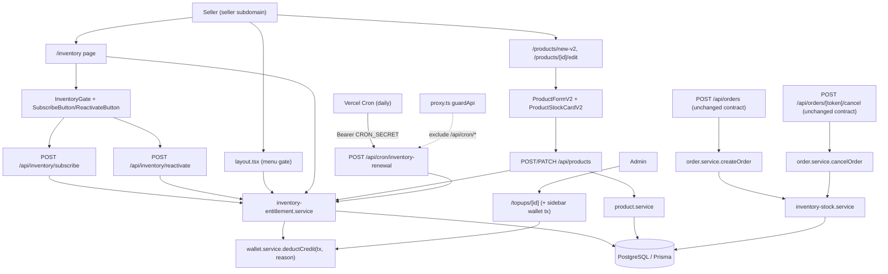
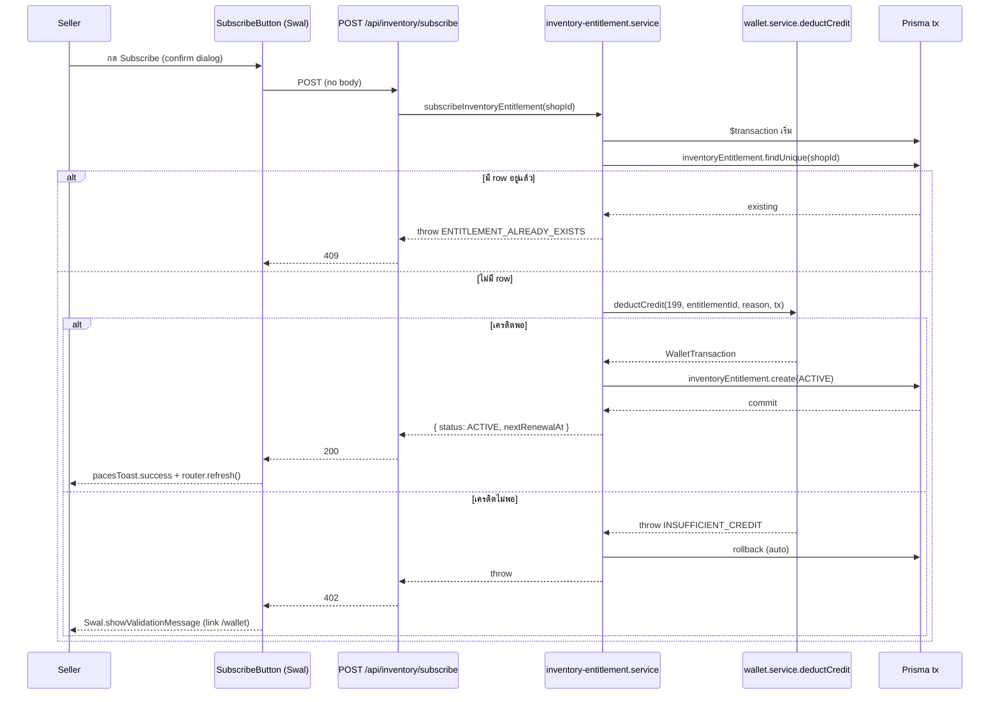
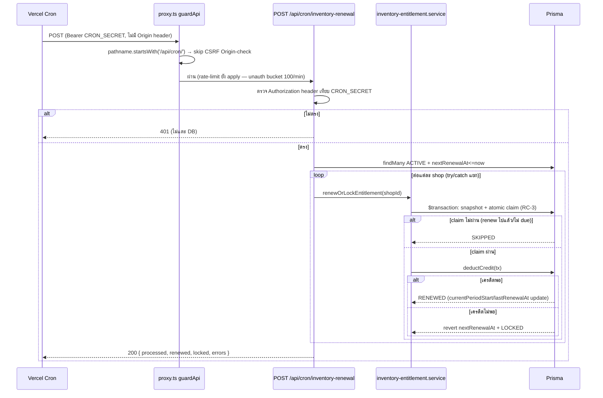
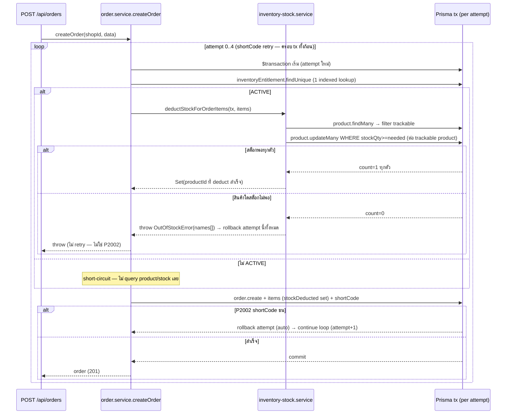
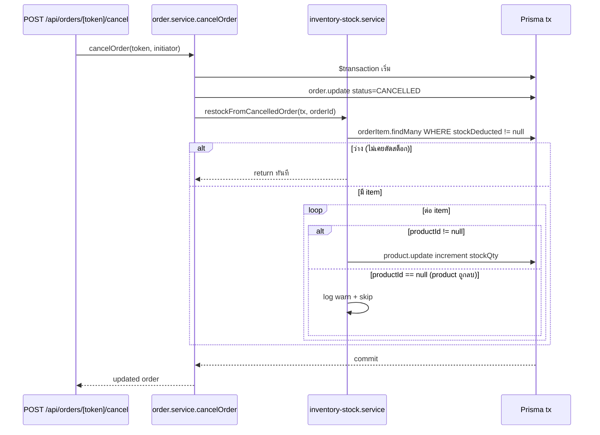

> **โมดูล:** M00003-InventoryAddon
> **ประเภทเอกสาร:** System Design Spec (SDS)
> **เวอร์ชัน:** 1.0
> **วันที่จัดทำ:** 2026-07-01
> **สถานะ:** Draft
> **เจ้าของเอกสาร:** SA (ดู [[Feature-Docs-Ownership]])

# SDS: Inventory Add-on (System Design Spec)

---

## 1. บทนำ & References

### 1.1 วัตถุประสงค์

เอกสารนี้กำหนด **การออกแบบเชิงระบบ** ของ feature **Inventory Add-on (M00003)** ระดับ implementation ให้ DEV เขียนโค้ดได้โดยไม่ต้องเดา, QA วางแผน regression test, safepay-database ยืนยัน schema impact (เอกสารแยก [[DATABASE]] มีอยู่แล้ว — รอ apply)

SDS นี้ **verify กับ source จริงในโค้ด** (ไม่ใช่แค่ paraphrase SRS) — ทุก signature/pseudocode อ้างบรรทัดจริงจาก `src/` ณ วันที่เขียน (2026-07-01, branch `shinobu22/feature-addon-inventory`) และแก้ 2 จุดที่ SRS ทิ้งเป็น "verify ตอน implement" ให้เป็นข้อสรุปแล้ว (ดู §6 TD-002, TD-004)

### 1.2 ขอบเขตการออกแบบ

**สร้างใหม่:**
- `src/lib/inventory-addon.ts` — constants
- `src/services/inventory-entitlement.service.ts` — entitlement lifecycle
- `src/services/inventory-stock.service.ts` — stock deduct/restock
- `src/app/api/inventory/subscribe/route.ts`, `src/app/api/inventory/reactivate/route.ts`
- `src/app/api/cron/inventory-renewal/route.ts`
- `src/app/(paces)/seller/(dashboard)/inventory/page.tsx` + 5 subcomponent (`InventoryGate.tsx`, `SubscribeButton.tsx`, `ReactivateButton.tsx`, `AdvanceWarningBanner.tsx`, `InventoryManagementTable.tsx`)
- `src/app/(paces)/seller/(dashboard)/products/components/ProductStockCardV2.tsx`

**แก้ไข (breaking หรือ additive ตามระบุ):**
- `src/services/wallet.service.ts` (**breaking** — เพิ่ม param `reason` ใน `deductCredit`)
- `src/app/api/orders/[token]/send-sms/route.ts` (call-site fix ตาม signature ใหม่)
- `src/services/order.service.ts` (**breaking-internal** — `createOrder`/`cancelOrder` เปลี่ยนเป็น transactional)
- `src/services/product.service.ts` (additive — `stockQty` ใน input/output types)
- `src/app/api/products/route.ts`, `src/app/api/products/[id]/route.ts` (additive guard)
- `src/lib/validations.ts` (additive — `stockQty` schema)
- `src/proxy.ts` (**จำเป็น** — exclude `/api/cron/` จาก CSRF Origin-check; ดู §6 TD-002)
- `src/app/(paces)/seller/(dashboard)/_seller-menu.ts` + `layout.tsx` (additive — menu gate)
- `src/app/(paces)/seller/(dashboard)/products/components/ProductFormV2.tsx` + `.types.ts` (additive — stock field)
- `src/app/(paces)/seller/(fullscreen)/products/new-v2/page.tsx` + `[id]/edit/page.tsx` (additive — pass `entitlementActive`)
- `src/app/(paces)/admin/(dashboard)/topups/[id]/page.tsx` (additive — sidebar section)
- `vercel.json` (additive — `crons` array)

**ไม่แตะ:** `src/app/api/orders/route.ts`, `src/app/api/orders/[token]/cancel/route.ts` (external contract ไม่เปลี่ยน — internal side-effect ผ่าน `order.service` เท่านั้น)

### 1.3 เอกสารอ้างอิง

| เอกสาร | ความสัมพันธ์ |
|--------|-------------|
| [[SRS]] ของโมดูลนี้ | TFR-001..013 — requirements ที่ SDS นี้ realize |
| [[BRD]] ของโมดูลนี้ | FR-INV-01..13, BR-INV-01..14, AC |
| [[PRD]] ของโมดูลนี้ | KPI, OD-1..4 |
| [[DATABASE]] ของโมดูลนี้ | `InventoryEntitlement`, `Product.stockQty`, `OrderItem.stockDeducted`, `WalletTransaction.reason` — **ต้อง apply migration ก่อน implement service/API ใด ๆ ที่แตะ field เหล่านี้** |
| `src/services/wallet.service.ts:82-152` | `deductCredit` RC-3 pattern ต้นแบบของ stock-deduct |
| `src/services/order.service.ts:39-138, 208-217` | `createOrder`/`cancelOrder` จุด hook |
| `src/app/api/orders/[token]/send-sms/route.ts:174-219` | ตัวอย่าง atomic tx + Sweet-Alerts button pattern (`SendSmsButton.tsx`) |
| `src/proxy.ts:9-37` | `guardApi` — CSRF/rate-limit middleware ที่ cron endpoint ต้อง bypass บางส่วน |

---

## 2. Architecture Overview

Extension ของ Next.js App Router + service layer เดิม ไม่เพิ่ม subsystem ใหม่ (ยกเว้น Vercel Cron ซึ่งเป็น infra-level scheduler ไม่ใช่ subsystem ในแอป)



### 2.1 Deploy View

- Vercel Serverless Functions (Hobby tier), region `sin1` — เหมือนทุก route ปัจจุบัน
- Vercel Cron ใหม่ — daily-only (Hobby constraint), auth ผ่าน `CRON_SECRET` bearer เท่านั้น (ไม่ผ่าน session/JWT)
- ไม่มี state ใน `globalThis` สำหรับ correctness ของ cron — ทุกอย่างอิง DB (`InventoryEntitlement.nextRenewalAt`)
- ไม่เพิ่ม dependency ใหม่ (Prisma/Next.js เดิม, ไม่มี queue/Redis)

---

## 3. Component Design

| Component | หน้าที่ (Responsibility) | Signature หลัก | Dependency |
|-----------|--------------------------|----------------|------------|
| **`src/lib/inventory-addon.ts`** (ใหม่) | Constants ล้วน — ราคา, รอบ renew, เตือนล่วงหน้า, wallet reason/description labels, date helper | ดู §3.1 | ไม่มี (pure) |
| **`src/services/inventory-entitlement.service.ts`** (ใหม่) | Entitlement lifecycle — subscribe/renew-or-lock/reactivate/status query | ดู §3.2 | Prisma, `wallet.service.deductCredit`, `inventory-addon.ts` |
| **`src/services/inventory-stock.service.ts`** (ใหม่) | Stock deduct (all-or-nothing) / restock; รับ `tx` จาก caller เสมอ (ไม่เปิด `$transaction` เอง) | ดู §3.3 | Prisma `TransactionClient` |
| **`wallet.service.deductCredit`** (แก้) | เพิ่ม param `reason` เขียนลง `WalletTransaction.reason` | ดู §3.4 | Prisma |
| **`order.service.createOrder`/`cancelOrder`** (แก้) | ห่อ `prisma.$transaction`, hook stock deduct/restock | ดู §3.5 | `inventory-stock.service`, Prisma |
| **`product.service`** (แก้) | `CreateProductInput`/`UpdateProductInput`/`SerializedProduct` เพิ่ม `stockQty` | ดู §3.6 | Prisma |
| **`POST /api/inventory/subscribe`** (ใหม่) | Subscribe ครั้งแรก | session-auth, no body | `inventory-entitlement.service` |
| **`POST /api/inventory/reactivate`** (ใหม่) | Reactivate จาก LOCKED | session-auth, no body | `inventory-entitlement.service` |
| **`POST /api/cron/inventory-renewal`** (ใหม่) | Renewal batch รายวัน, per-shop isolation | `CRON_SECRET` bearer เท่านั้น | `inventory-entitlement.service` |
| **`POST/PATCH /api/products*`** (แก้) | เพิ่ม route-layer guard (`STOCK_QTY_INVALID_PRODUCT_TYPE`/`INVENTORY_NOT_ACTIVE`) | ดู §3.7 | `inventory-entitlement.service.isEntitlementActive` |
| **`_seller-menu.ts` + `layout.tsx`** (แก้) | เพิ่ม static "Inventory" entry + `applyInventoryGate()` runtime transform | ดู §3.8 | `inventory-entitlement.service` |
| **`InventoryPage`** (ใหม่ RSC) | Query entitlement → gate หรือ management UI | ดู §5.1 | `inventory-entitlement.service`, Paces |
| **`InventoryGate`/`SubscribeButton`/`ReactivateButton`** (ใหม่) | CTA subscribe/reactivate — Sweet Alerts confirm (Hard Rule 9) | ดู §5.2 | sweetalert2, `pacesToast` |
| **`InventoryManagementTable`** (ใหม่, client) | List PHYSICAL product + track status + link ไปแก้ที่หน้า product เดิม | ดู §5.3 | `@/components/table/DataTable` |
| **`ProductStockCardV2`** (ใหม่, client) | Toggle "ติดตามสต็อก" + number input — render เฉพาะ `type===PHYSICAL && entitlementActive` | ดู §5.4 | RHF |
| **admin `topups/[id]/page.tsx`** (แก้) | เพิ่ม sidebar "รายการเครดิตล่าสุด" + badge locked-reason | ดู §5.5 | `wallet.service.getTransactions` |

### 3.1 `src/lib/inventory-addon.ts`

```typescript
export type EntitlementStatus = 'NOT_SUBSCRIBED' | 'ACTIVE' | 'LOCKED'

export const INVENTORY_ADDON_PRICE = 199
export const INVENTORY_RENEWAL_PERIOD_DAYS = 30
export const INVENTORY_ADVANCE_WARNING_DAYS = 3

export const WALLET_REASON = {
  INVENTORY_SUBSCRIPTION: 'INVENTORY_SUBSCRIPTION',
  SMS_ORDER_LINK: 'SMS_ORDER_LINK',
} as const

export const WALLET_DESC = {
  SUBSCRIBE: 'สมัคร Inventory Add-on',
  RENEW: 'ต่ออายุ Inventory Add-on (รายเดือน)',
  REACTIVATE: 'เปิดใช้ Inventory Add-on อีกครั้ง',
} as const

// label ไทยสำหรับ admin sidebar (FR-INV-13) — ใช้คู่กับ WALLET_REASON
export const WALLET_REASON_LABEL_TH: Record<string, string> = {
  INVENTORY_SUBSCRIPTION: 'Inventory Add-on',
  SMS_ORDER_LINK: 'SMS Order Link',
}

export function addDays(date: Date, days: number): Date {
  return new Date(date.getTime() + days * 86_400_000)
}
```

> **หมายเหตุ naming smell (ไม่บล็อก):** `WALLET_REASON.SMS_ORDER_LINK`/`WALLET_REASON_LABEL_TH.SMS_ORDER_LINK` อยู่ในไฟล์ `inventory-addon.ts` ที่ตั้งชื่อเฉพาะ inventory แต่ SRS §1.2/§2.2 ระบุตำแหน่งไฟล์นี้ไว้ชัดแล้วว่าเก็บ label ทั้งคู่ — คง location ตาม SRS ไว้ (ไม่ rename เป็นไฟล์กลาง เช่น `wallet-reasons.ts` เพราะนอก scope SRS) แต่ flag ไว้ให้ Controller ตัดสินใจถ้าต้องการแยกภายหลัง (ดู §10)

### 3.2 `inventory-entitlement.service.ts`

```typescript
import { randomUUID } from 'node:crypto'
import { prisma } from '@/lib/prisma'
import { deductCredit } from '@/services/wallet.service'
import {
  EntitlementStatus, INVENTORY_ADDON_PRICE, INVENTORY_ADVANCE_WARNING_DAYS,
  INVENTORY_RENEWAL_PERIOD_DAYS, WALLET_REASON, WALLET_DESC, addDays,
} from '@/lib/inventory-addon'

export async function getEntitlementStatus(shopId: string): Promise<EntitlementStatus> {
  const row = await prisma.inventoryEntitlement.findUnique({
    where: { shopId },
    select: { status: true },
  })
  return row?.status ?? 'NOT_SUBSCRIBED'
}

export async function isEntitlementActive(shopId: string): Promise<boolean> {
  return (await getEntitlementStatus(shopId)) === 'ACTIVE'
}

export async function subscribeInventoryEntitlement(
  shopId: string,
): Promise<{ status: 'ACTIVE'; nextRenewalAt: Date }> {
  return prisma.$transaction(async (tx) => {
    const existing = await tx.inventoryEntitlement.findUnique({ where: { shopId }, select: { id: true } })
    if (existing) throw new Error('ENTITLEMENT_ALREADY_EXISTS')

    // pre-generate id (Prisma @default(uuid()) เป็น client-side generation อยู่แล้ว —
    // generate เองที่นี่เพื่อใช้เป็น WalletTransaction.refId ก่อน row จะถูก create จริง
    // ตาม guidance ใน DATABASE.md §3.4 "refId แนะนำ = InventoryEntitlement.id")
    const entitlementId = randomUUID()

    // deductCredit ก่อน — ถ้า INSUFFICIENT_CREDIT throw → rollback ทั้ง tx (ไม่มี entitlement ค้าง)
    await deductCredit(
      shopId, INVENTORY_ADDON_PRICE, entitlementId,
      WALLET_DESC.SUBSCRIBE, WALLET_REASON.INVENTORY_SUBSCRIPTION, tx,
    )

    const now = new Date()
    const nextRenewalAt = addDays(now, INVENTORY_RENEWAL_PERIOD_DAYS)
    await tx.inventoryEntitlement.create({
      data: {
        id: entitlementId, shopId, status: 'ACTIVE',
        activatedAt: now, currentPeriodStart: now, nextRenewalAt,
      },
    })
    return { status: 'ACTIVE', nextRenewalAt }
  })
}

export async function reactivateInventoryEntitlement(
  shopId: string,
): Promise<{ status: 'ACTIVE'; nextRenewalAt: Date }> {
  return prisma.$transaction(async (tx) => {
    const existing = await tx.inventoryEntitlement.findUnique({ where: { shopId } })
    if (!existing || existing.status !== 'LOCKED') throw new Error('ENTITLEMENT_NOT_LOCKED')

    await deductCredit(
      shopId, INVENTORY_ADDON_PRICE, existing.id,
      WALLET_DESC.REACTIVATE, WALLET_REASON.INVENTORY_SUBSCRIPTION, tx,
    )

    const now = new Date()
    const nextRenewalAt = addDays(now, INVENTORY_RENEWAL_PERIOD_DAYS)
    await tx.inventoryEntitlement.update({
      where: { shopId },
      data: {
        // ห้าม set activatedAt (DATABASE.md §3.1 — ตั้งครั้งเดียวตอน subscribe แรก, ไม่แตะตอน reactivate)
        status: 'ACTIVE', currentPeriodStart: now,
        nextRenewalAt, lastRenewalAt: now, lockedAt: null,
      },
    })
    return { status: 'ACTIVE', nextRenewalAt }
  })
}

export async function renewOrLockEntitlement(
  shopId: string,
): Promise<'RENEWED' | 'LOCKED' | 'SKIPPED'> {
  return prisma.$transaction(async (tx) => {
    const now = new Date()
    const before = await tx.inventoryEntitlement.findUnique({ where: { shopId } })
    if (!before || before.status !== 'ACTIVE' || before.nextRenewalAt > now) return 'SKIPPED'

    // RC-3 atomic "claim" — WHERE เทียบ nextRenewalAt snapshot ที่เพิ่งอ่าน (optimistic lock)
    // กัน 2 invocation ของ cron (double-trigger/retry) deduct ซ้ำสำหรับ shop เดียวกัน
    const claimed = await tx.inventoryEntitlement.updateMany({
      where: { shopId, status: 'ACTIVE', nextRenewalAt: before.nextRenewalAt },
      data: { nextRenewalAt: addDays(now, INVENTORY_RENEWAL_PERIOD_DAYS) },
    })
    if (claimed.count === 0) return 'SKIPPED' // ถูก claim ไปแล้วโดย invocation อื่น

    try {
      await deductCredit(
        shopId, INVENTORY_ADDON_PRICE, before.id,
        WALLET_DESC.RENEW, WALLET_REASON.INVENTORY_SUBSCRIPTION, tx,
      )
    } catch (e) {
      if (e instanceof Error && e.message === 'INSUFFICIENT_CREDIT') {
        // revert nextRenewalAt กลับค่าเดิม — DATABASE.md §3.1 กำหนดว่า lock ต้องไม่แตะ
        // currentPeriodStart/nextRenewalAt (เก็บไว้เป็นหลักฐานว่ารอบไหน fail)
        await tx.inventoryEntitlement.update({
          where: { shopId },
          data: { status: 'LOCKED', lockedAt: now, nextRenewalAt: before.nextRenewalAt },
        })
        return 'LOCKED'
      }
      throw e
    }

    await tx.inventoryEntitlement.update({
      where: { shopId },
      data: { currentPeriodStart: now, lastRenewalAt: now }, // nextRenewalAt ถูก advance จาก claim แล้ว
    })
    return 'RENEWED'
  })
}

export function shouldWarnAdvance(
  entitlement: { status: EntitlementStatus; nextRenewalAt: Date } | null,
  balance: number,
): boolean {
  if (!entitlement || entitlement.status !== 'ACTIVE') return false
  const daysUntilRenewal = Math.ceil((entitlement.nextRenewalAt.getTime() - Date.now()) / 86_400_000)
  return daysUntilRenewal <= INVENTORY_ADVANCE_WARNING_DAYS && daysUntilRenewal >= 0
    && balance < INVENTORY_ADDON_PRICE
}
```

> **TD สำคัญ — `renewOrLockEntitlement` claim-before-deduct-with-revert:** SRS TFR-002 pseudocode เขียน idempotent guard ก่อน deduct แต่ไม่ได้ reconcile กับ DATABASE.md §3.1 ("lock ต้องไม่แตะ nextRenewalAt") อย่างชัดเจน — ออกแบบข้างบนแก้ทั้งสองข้อพร้อมกัน (claim ล่วงหน้าด้วย atomic `updateMany` แบบ RC-3 แล้ว **revert กลับ** ถ้า deduct ล้มเหลว) ดู §6 TD-003

### 3.3 `inventory-stock.service.ts`

```typescript
import type { Prisma } from '@prisma/client'

export class OutOfStockError extends Error {
  productNames: string[]
  constructor(productNames: string[]) {
    super('OUT_OF_STOCK')
    this.name = 'OutOfStockError'
    this.productNames = productNames
  }
}

/**
 * deductStockForOrderItems — all-or-nothing atomic deduct ต่อ trackable product
 * คืน Set<productId> ของสินค้าที่ deduct สำเร็จ (ใช้ set OrderItem.stockDeducted = item.qty ต่อ item เอง
 * ไม่ใช่ aggregate — refine จาก SRS TFR-009 pseudocode ที่เสนอ Map<id,qty>: ผลลัพธ์ต่อ item เหมือนกัน
 * เพราะ item ที่ productId อยู่ใน Set = ถูก deduct เต็มจำนวน item.qty เสมอ ผลรวมยังตรงตาม all-or-nothing)
 */
export async function deductStockForOrderItems(
  tx: Prisma.TransactionClient,
  items: { productId?: string; name: string; qty: number }[],
): Promise<Set<string>> {
  // 1) aggregate qty ต่อ productId (item ซ้ำ productId ในใบเดียวกัน)
  const qtyByProductId = new Map<string, number>()
  const nameByProductId = new Map<string, string>()
  for (const item of items) {
    if (!item.productId) continue
    qtyByProductId.set(item.productId, (qtyByProductId.get(item.productId) ?? 0) + item.qty)
    if (!nameByProductId.has(item.productId)) nameByProductId.set(item.productId, item.name)
  }
  if (qtyByProductId.size === 0) return new Set()

  // 2) โหลด product จริง แล้วกรอง trackable (PHYSICAL + stockQty != null) ก่อนเข้า updateMany เสมอ
  //    ⚠️ ห้ามข้าม step นี้ — NULL >= n ประเมิน unknown ใน Postgres ทำให้ untracked product
  //    ถูกเข้าใจผิดว่า "หมดสต็อก" (count=0) ทั้งที่จริงคือ "ไม่ track" (SRS TFR-009 risk)
  const products = await tx.product.findMany({
    where: { id: { in: Array.from(qtyByProductId.keys()) } },
    select: { id: true, type: true, stockQty: true },
  })
  const trackable = products.filter((p) => p.type === 'PHYSICAL' && p.stockQty !== null)

  const deductedIds = new Set<string>()
  const outOfStock: string[] = []

  for (const product of trackable) {
    const needed = qtyByProductId.get(product.id)!
    const res = await tx.product.updateMany({
      where: { id: product.id, stockQty: { gte: needed } },
      data: { stockQty: { decrement: needed } },
    })
    if (res.count === 0) {
      outOfStock.push(nameByProductId.get(product.id) ?? product.id)
      continue // สะสมชื่อสินค้าที่หมดทั้งหมดก่อน throw รวด (UX ดีกว่า throw ตัวแรกที่เจอ)
    }
    deductedIds.add(product.id)
  }

  if (outOfStock.length > 0) {
    // throw = rollback decrement ทั้งหมดที่ทำไปในลูปนี้อัตโนมัติ (all-or-nothing, tx เดียวกับ order.create)
    throw new OutOfStockError(outOfStock)
  }
  return deductedIds
}

/**
 * restockFromCancelledOrder — คืนสต็อกตามประวัติจริงของ order (ไม่สนสถานะ entitlement ปัจจุบัน)
 */
export async function restockFromCancelledOrder(
  tx: Prisma.TransactionClient,
  orderId: string,
): Promise<void> {
  const items = await tx.orderItem.findMany({
    where: { orderId, stockDeducted: { not: null } },
    select: { productId: true, stockDeducted: true },
  })
  if (items.length === 0) return // ไม่เคยตัดสต็อก — ไม่มีอะไรคืน (short-circuit)

  for (const item of items) {
    if (!item.productId) {
      // product ถูกลบไปแล้ว (OrderItem.productId onDelete: SetNull) — skip + log, ห้าม throw
      // (cancel ต้องสำเร็จเสมอ — accepted data-integrity gap ตาม DATABASE.md §8 risk #3)
      console.warn(`[inventory-stock] orphan restock — orderId=${orderId} product ถูกลบไปแล้ว ข้าม`)
      continue
    }
    // increment ไม่ต้อง conditional WHERE (ไม่มีเงื่อนไข business ที่ปฏิเสธการบวกกลับ)
    // ถ้า product ถูก untrack ไปแล้ว (stockQty=null) → increment บน NULL = NULL, no-op (expected)
    await tx.product.update({
      where: { id: item.productId },
      data: { stockQty: { increment: item.stockDeducted! } },
    })
  }
}
```

### 3.4 `wallet.service.ts` — signature change

**เดิม** (`src/services/wallet.service.ts:82-88`):
```typescript
export async function deductCredit(
  shopId: string, amount: number, refId: string | undefined,
  description: string, tx?: Prisma.TransactionClient,
): Promise<WalletTransaction>
```

**ใหม่:**
```typescript
export async function deductCredit(
  shopId: string, amount: number, refId: string | undefined,
  description: string, reason: string | undefined, tx?: Prisma.TransactionClient,
): Promise<WalletTransaction>
```

เพิ่ม `reason: reason ?? null,` ใน `client.walletTransaction.create({ data: {...} })` (บรรทัด ~126-135 ใน `run()` closure) — ทุกอย่างอื่นใน RC-3 logic **ไม่แตะ**

**Call-site fix (บังคับคู่กันในคอมมิตเดียว — มิฉะนั้น tsc พัง):** `src/app/api/orders/[token]/send-sms/route.ts:180-186`
```typescript
await deductCredit(
  shop.id,
  SMS_COST_BAHT,
  order.id,
  `ส่ง SMS คำสั่งซื้อ ${token.slice(0, 8)}...`,
  WALLET_REASON.SMS_ORDER_LINK, // ใหม่ — import จาก '@/lib/inventory-addon'
  tx,
);
```
`creditWallet()` **ไม่แก้** — SRS/DATABASE ระบุเฉพาะ `deductCredit`; TOPUP flow ไม่ต้องแยก reason

### 3.5 `order.service.ts` — createOrder/cancelOrder

**⚠️ TD สำคัญ — Postgres transaction-abort bug ใน SRS TFR-009 pseudocode:** SRS เขียน "retry loop `order.create` เดิม แต่ผูก tx" โดยนัยว่า retry loop (5 attempt กัน P2002 shortCode collision) อยู่ **ใน** `$transaction` เดียวกัน — ถ้าทำแบบนั้นจริง: เมื่อ `tx.order.create` throw P2002 ครั้งแรก Postgres จะ mark ทั้ง transaction เป็น **aborted** (current transaction is aborted, commands ignored until end of transaction block) → attempt ที่ 2 เป็นต้นไปจะ fail ทันทีด้วย aborted-transaction error ไม่ใช่ retry จริง. **แก้โดยย้าย retry loop ไปครอบ `$transaction` แทน** (แต่ละ attempt = tx ใหม่ทั้งก้อน รวม stock-deduct ด้วย — ปลอดภัยเพราะ attempt ที่ fail จะ rollback หมดอัตโนมัติ, attempt ถัดไป re-read stock สดใหม่):

```typescript
export async function createOrder(shopId: string, data: { /* เดิมทั้งหมด */ }) {
  // ...คำนวณ subtotal/totalAmount/fulfillmentMode/shippingAddress guard เดิมทั้งหมด (ไม่เปลี่ยน)...
  const orderDataBase = { shopId, type: data.type, totalAmount, fulfillmentMode, /* ...fields เดิม... */ };

  for (let attempt = 0; attempt < 5; attempt++) {
    try {
      return await prisma.$transaction(async (tx) => {
        // NEW — เข้าก่อน order.create เสมอ (1 indexed lookup, short-circuit สำหรับ shop ที่ไม่มี entitlement)
        const entitlement = await tx.inventoryEntitlement.findUnique({
          where: { shopId }, select: { status: true },
        });
        const deductedIds = entitlement?.status === 'ACTIVE'
          ? await deductStockForOrderItems(tx, data.items) // throw OutOfStockError = rollback ทั้ง attempt
          : new Set<string>();

        const itemsCreateData = data.items.map((item) => ({
          ...item,
          stockDeducted: item.productId && deductedIds.has(item.productId) ? item.qty : null,
        }));

        return tx.order.create({
          data: { ...orderDataBase, items: { create: itemsCreateData }, shortCode: genShortCode() },
          include: { items: true },
        });
      });
    } catch (e) {
      const isUnique = e instanceof Prisma.PrismaClientKnownRequestError && e.code === "P2002";
      if (isUnique && attempt < 4) continue; // retry ทั้ง tx ใหม่ (รวม stock-deduct re-read สด)
      throw e; // รวม OutOfStockError — ไม่ retry (ไม่ใช่ P2002)
    }
  }
  throw new Error("SHORT_CODE_COLLISION");
}
```

```typescript
export async function cancelOrder(publicToken: string, initiator: "seller" | "buyer") {
  const order = await prisma.order.findUnique({ where: { publicToken } });
  if (!order) throw new Error("Order not found");
  assertTransition(order.status, "CANCELLED");
  return prisma.$transaction(async (tx) => {
    const updated = await tx.order.update({
      where: { publicToken }, data: { status: "CANCELLED", cancelInitiator: initiator },
    });
    await restockFromCancelledOrder(tx, order.id); // ไม่เช็ค entitlement เลย (BR-INV-12)
    return updated;
  });
}
```

`getOrderByToken`/`getOrderForShop`/`getOrdersByShop`/etc — **ไม่แตะ**

### 3.6 `product.service.ts` — additive

```typescript
export interface SerializedProduct {
  // ...เดิมทั้งหมด...
  stockQty: number | null; // NEW — null=untracked (Inventory Add-on)
}
export function serializeProduct(product: ProductWithTags): SerializedProduct {
  return { /* ...เดิม... */, stockQty: product.stockQty ?? null };
}
export interface CreateProductInput { /* ...เดิม... */ stockQty?: number | null; }
export interface UpdateProductInput { /* ...เดิม... */ stockQty?: number | null; }
```
`createProduct`: เพิ่ม `stockQty: data.stockQty ?? null,` ใน `prisma.product.create({data:{...}})`
`updateProduct`: เพิ่ม `if (data.stockQty !== undefined) scalarUpdate.stockQty = data.stockQty;` (pattern เดียวกับ field อื่นในฟังก์ชันนี้ — omit=ไม่แตะ)

### 3.7 Route-layer guard — `POST/PATCH /api/products*`

```typescript
// POST /api/products (เพิ่มหลัง parsed.success check, ก่อน createProduct)
if (parsed.output.stockQty !== undefined) {
  if (parsed.output.type !== 'PHYSICAL') {
    return NextResponse.json({ error: 'STOCK_QTY_INVALID_PRODUCT_TYPE' }, { status: 400 });
  }
  if (!(await isEntitlementActive(shop.id))) {
    return NextResponse.json({ error: 'INVENTORY_NOT_ACTIVE' }, { status: 403 });
  }
}
```
```typescript
// PATCH /api/products/[id] — product (จาก ownership findUnique เดิม) มี .type/.shopId อยู่แล้ว
if (parsed.output.stockQty !== undefined) {
  const effectiveType = parsed.output.type ?? product.type;
  if (effectiveType !== 'PHYSICAL') {
    return NextResponse.json({ error: 'STOCK_QTY_INVALID_PRODUCT_TYPE' }, { status: 400 });
  }
  if (!(await isEntitlementActive(product.shopId))) {
    return NextResponse.json({ error: 'INVENTORY_NOT_ACTIVE' }, { status: 403 });
  }
}
```

### 3.8 Menu Gate — `_seller-menu.ts` + `layout.tsx`

**`_seller-menu.ts`** — เพิ่ม static entry (SSOT คงอยู่สำหรับ `getSellerPageTitle.ts`/`SellerMobileHeader.tsx` ที่ import `sellerMenuItems` ตรง ๆ — ยืนยันจาก grep, ห้ามเปลี่ยนเป็น function-only) และเพิ่ม transform helper แยก:

```typescript
// ใน children ของ group slug: 'seller-store' — แทรกระหว่าง '/shop' กับ '/wallet'
{ url: '/inventory', slug: 'seller:inventory', label: 'จัดการสต็อก', icon: 'boxes' },
```

```typescript
import type { EntitlementStatus } from '@/lib/inventory-addon'

export function applyInventoryGate(items: MenuItemType[], status: EntitlementStatus): MenuItemType[] {
  if (status === 'ACTIVE') return items // enabled by default — ไม่ต้อง override
  const badge = status === 'LOCKED'
    ? { className: 'bg-danger', text: 'ถูกล็อก' }
    : { className: 'bg-primary', text: '฿199/ด.' }
  return items.map((group) => !group.children ? group : {
    ...group,
    children: group.children.map((child) =>
      child.slug === 'seller:inventory' ? { ...child, isDisabled: true, badge } : child,
    ),
  })
}
```

**`layout.tsx`** — เพิ่มหลัง shop resolve (บรรทัด ~49), ก่อน render:
```typescript
import { sellerMenuItems, applyInventoryGate } from './_seller-menu'
import { getEntitlementStatus } from '@/services/inventory-entitlement.service'
import type { EntitlementStatus } from '@/lib/inventory-addon'
// ...
let entitlementStatus: EntitlementStatus = 'NOT_SUBSCRIBED'
if (shop?.id) {
  try {
    entitlementStatus = await getEntitlementStatus(shop.id)
  } catch (e) {
    console.error('[layout] getEntitlementStatus failed, fallback NOT_SUBSCRIBED', e) // fail-closed (TFR-007)
  }
}
const menuItems = applyInventoryGate(sellerMenuItems, entitlementStatus)
// ...
<VerticalLayout menuItems={menuItems} .../>  // เดิมส่ง sellerMenuItems ตรง ๆ
```

**⚠️ Client-side click ไม่ถูก block จริง** — `MenuItem` component (`src/layouts/components/Sidenav/components/AppMenu.tsx:77-90`) render `isDisabled` เป็นแค่ CSS class บน `<Link>` เท่านั้น (ไม่มี `preventDefault`/`aria-disabled` guard ใน `onClick`) — ยืนยันจากอ่าน source จริง. **ดังนั้น server-side gate ที่ `InventoryPage` (§5.1) คือ enforcement ตัวจริง** (ตรง FR-INV-07-AC-04) เมนู disabled เป็นแค่ UX hint

---

## 4. Data Flow

### 4.1 Subscribe (ครั้งแรก)



### 4.2 Renewal Cron รายวัน (per-shop isolated)



### 4.3 สร้าง Order พร้อม Stock Deduct — transaction boundary



### 4.4 Cancel Order + Restock (ไม่สนสถานะ entitlement ปัจจุบัน)



### Transaction boundary สรุป

| Operation | อยู่ใน `$transaction` เดียวกับ | เหตุผล |
|-----------|-------------------------------|--------|
| subscribe/reactivate/renew | `deductCredit` + `inventoryEntitlement.create/update` | atomic billing — ไม่มี entitlement ACTIVE ที่ไม่มี WalletTransaction คู่กัน |
| createOrder | entitlement lookup + stock deduct + `order.create` + `OrderItem.stockDeducted` | all-or-nothing — ห้ามมี order ที่ตัดสต็อกไปครึ่งเดียว หรือ order ที่ไม่มี stockDeducted บันทึกทั้งที่ตัดจริง |
| cancelOrder | `order.update(CANCELLED)` + restock | ห้าม order เป็น CANCELLED แล้วสต็อกไม่คืน (หรือกลับกัน) |
| createProduct/updateProduct (stockQty) | **ไม่ต้องอยู่ใน tx เดียวกับอะไร** — เป็น single scalar write ปกติ (entitlement check ทำที่ route layer แยก request ก่อนหน้า ไม่ใช่ part of the write tx) | ไม่มี concurrent-write risk เพราะเป็นการตั้งค่า ไม่ใช่ deduct |

---

## 5. UI Component Design (Paces theme mapping)

Hard Rule 1/7/8: ทุก UI ต้อง copy จาก theme file ที่ระบุ ก่อน implement จริงต้องผ่าน `safepay-ux` (Design Spec) — ตารางนี้ระบุ **theme source mapping** ให้ ux ทำงานต่อ ไม่ใช่ final pixel spec

| Component ใหม่ | Theme source (Base) | หมายเหตุการปรับ |
|-----------------|----------------------|-------------------|
| `InventoryGate.tsx` (NOT_SUBSCRIBED state) | `theme/paces/Admin/TS/src/app/(admin)/pages/pricing/page.tsx` (single-plan card: title/price/feature-list ticks/CTA button) | ใช้ 1 card เดียวไม่ใช่ grid 4 แผน; primary token น้ำเงิน (Hard Rule Paces primary) ไม่ใช่ `!bg-primary` เต็มการ์ดแบบ theme popular-plan |
| `InventoryGate.tsx` (LOCKED state) | `src/app/(paces)/seller/(dashboard)/wallet/components/WalletCard.tsx` error-banner pattern (บรรทัด 42-52 — `border-danger/20 bg-danger/10` alert block) | เปลี่ยนสีเป็น warning/danger ตาม severity, ข้อความ "ถูกล็อกเพราะเครดิตไม่พอ" + `lockedAt` |
| `SubscribeButton.tsx` / `ReactivateButton.tsx` | `src/app/(paces)/seller/(dashboard)/orders/[token]/components/SendSmsButton.tsx` (in-project precedent เต็มไฟล์ — Swal confirm + `preConfirm` fetch + `showValidationMessage` error + `pacesToast.success`) | เปลี่ยน endpoint/ข้อความ/cost เป็น ฿199; ไม่มี success-icon-reset state (subscribe ทำครั้งเดียวแล้ว router.refresh ทันที) |
| `AdvanceWarningBanner.tsx` | `WalletCard.tsx` low-balance chip pattern (บรรทัด 91-102 — `badge bg-warning/15 text-warning`) ขยายเป็น full banner | ข้อความ "เครดิตอาจไม่พอสำหรับรอบต่ออายุวันที่ {nextRenewalAt} (ขาดอีก ฿{shortfall})" |
| `InventoryManagementTable.tsx` | `theme/paces/Admin/TS/src/app/(admin)/apps/ecommerce/(inventory)/product-stocks/components/ProductStockTable.tsx` (columns: product+image, sku/category, availableStock badge, status badge, actions) **+** in-project precedent `src/app/(paces)/seller/(dashboard)/wallet/components/WalletTransactionTable.tsx` (`DataTable`/`TablePagination` wiring pattern จริงในโปรเจกต์) | ตัด column sku/category (ไม่มีในโดเมนนี้); "Actions" เหลือปุ่มเดียว "แก้ไข" → link `/products/{id}/edit` (ไม่มี inline edit ในตารางนี้ — ดู TD-005) |
| `ProductStockCardV2.tsx` | `src/app/(paces)/seller/(dashboard)/products/components/ProductPriceCardV2.tsx` (การ์ด shell + label pattern, in-project) **+** toggle: `src/assets/css/custom/_forms.css` class `.form-switch` (ยืนยันมีจริงในโปรเจกต์ ใช้แล้วที่ `src/layouts/components/Customizer/components/SidenavUser.tsx`) | ไม่มี quick-pick chip (ไม่เกี่ยวกับ stock); toggle "ติดตามสต็อก" ควบคุม null↔0 |

### 5.1 `InventoryPage` (RSC) — `src/app/(paces)/seller/(dashboard)/inventory/page.tsx`

```typescript
export default async function InventoryPage() {
  const session = await getServerSession(authOptions)
  const user = (session as any)?.user
  if (!user) redirect('/auth/sign-in')

  const shop = await getShopByUserId(user.id) // pattern เดียวกับ products/new-v2/page.tsx
  if (!shop) return <NoShopCard /* reuse pattern จาก new-v2/page.tsx บรรทัด 40-60 */ />

  let status: EntitlementStatus = 'NOT_SUBSCRIBED'
  try { status = await getEntitlementStatus(shop.id) } catch { /* fail-closed */ }

  if (status !== 'ACTIVE') {
    const lockedAt = status === 'LOCKED'
      ? (await prisma.inventoryEntitlement.findUnique({
          where: { shopId: shop.id }, select: { lockedAt: true },
        }))?.lockedAt ?? null
      : null
    // ไม่ query stock/product ใด ๆ เพิ่ม — ตรง TFR-007 (gate ไม่ leak data)
    return <InventoryGate status={status} lockedAt={lockedAt ? formatDateTime(lockedAt) : null} />
  }

  const [entitlement, balance, products] = await Promise.all([
    prisma.inventoryEntitlement.findUnique({
      where: { shopId: shop.id }, select: { status: true, nextRenewalAt: true },
    }),
    getBalance(shop.id),
    prisma.product.findMany({
      where: { shopId: shop.id, type: 'PHYSICAL', isActive: true },
      select: { id: true, name: true, images: true, stockQty: true, updatedAt: true },
      orderBy: { updatedAt: 'desc' },
    }),
  ])
  const warn = shouldWarnAdvance(entitlement, balance)

  return (
    <>
      <PageBreadcrumb title="จัดการสต็อก" />
      {warn && entitlement && (
        <AdvanceWarningBanner nextRenewalAt={formatDateTime(entitlement.nextRenewalAt)} shortfall={199 - balance} />
      )}
      <InventoryManagementTable products={products.map(serializeInventoryProduct)} />
    </>
  )
}
```

### 5.2 InventoryGate / SubscribeButton / ReactivateButton

- `InventoryGate` เป็น **server component** (ไม่ต้อง client — ไม่มี state ของตัวเอง) รับ `status`/`lockedAt` เป็น prop, render pricing-card + embed `<SubscribeButton />` (status=NOT_SUBSCRIBED) หรือ `<ReactivateButton lockedAt={lockedAt} />` (status=LOCKED)
- `SubscribeButton`/`ReactivateButton` = `'use client'`, คัดลอกโครง `SendSmsButton.tsx` ทั้งไฟล์ (Swal `preConfirm` + `showValidationMessage`) เปลี่ยน: endpoint (`/api/inventory/subscribe` หรือ `/reactivate`), ข้อความ dialog ("สมัคร Inventory Add-on ฿199/เดือน?" / "เปิดใช้งานอีกครั้ง ฿199?"), error map (402→"เครดิตไม่พอ — ซื้อเครดิต", 409→"สมัครใช้งานอยู่แล้ว"/"ยังไม่ได้ถูกล็อก"), success → `pacesToast.success(...)` + `router.refresh()` (ไม่ใช่ setShowSuccess local state เพราะกดครั้งเดียวจบ ไม่ใช่ ปุ่มที่กดซ้ำได้)

### 5.3 InventoryManagementTable

Props: `{ products: { id, name, image, stockQty, updatedAt }[] }` (serialize `images[0]`→`image`, `updatedAt`→`formatDateTime` ก่อนส่งเข้า client ตาม RSC boundary convention)

Columns: สินค้า (thumbnail+name+link `/products/{id}`) → สถานะติดตาม (badge "ติดตาม"/"ไม่ติดตาม" ตาม `stockQty !== null`) → จำนวนคงเหลือ (`stockQty` หรือ "—") → สถานะสต็อก (badge "หมด" สีแดงเมื่อ `stockQty === 0`, ไม่มี badge อื่นเพราะ low-stock alert = out of scope) → อัปเดตล่าสุด → Actions (`btn btn-icon` ลิงก์ไป `/products/{id}/edit`)

Empty state (ไม่มี PHYSICAL product เลย): การ์ดข้อความ "ยังไม่มีสินค้าประเภทจับต้องได้ — เพิ่มสินค้าก่อนเพื่อเริ่มจัดการสต็อก" + ปุ่มลิงก์ `/products/new-v2` (reuse pattern เดียวกับ `NoShopCard` ใน `new-v2/page.tsx:40-60`)

**TD-005 — ไม่มี inline stock edit ในตารางนี้:** BRD FR-INV-08-AC-01 ระบุชัดว่า field จำนวนสต็อกอยู่ "หน้า Product ที่ type=PHYSICAL" — `InventoryManagementTable` จึงเป็น **overview/monitoring list** เท่านั้น (list + gate), การแก้ไขจริงทำที่หน้า product form เดิม (`ProductStockCardV2`) ผ่านปุ่ม "แก้ไข" — เลี่ยง duplicate stock-editing UI 2 ที่ (drift risk)

### 5.4 ProductStockCardV2

```typescript
'use client'
interface Props {
  register: UseFormRegister<ProductFormV2Values>
  errors: FieldErrors<ProductFormV2Values>
  setValue: UseFormSetValue<ProductFormV2Values>
  watch: UseFormWatch<ProductFormV2Values>
}
export default function ProductStockCardV2({ register, errors, setValue, watch }: Props) {
  const stockQty = watch('stockQty')
  const tracked = stockQty !== null && stockQty !== undefined
  return (
    <div className="px-3 py-2.5">
      <div className="flex items-center justify-between gap-2">
        <label htmlFor="v2-stock-toggle" className="text-dark text-sm font-medium">ติดตามจำนวนสต็อก</label>
        <input id="v2-stock-toggle" type="checkbox" className="form-switch"
          checked={tracked}
          onChange={(e) => setValue('stockQty', e.target.checked ? 0 : null, { shouldValidate: true, shouldTouch: true })} />
      </div>
      {tracked && (
        <>
          <input type="number" step="1" min="0" inputMode="numeric" className="form-input mt-2"
            placeholder="จำนวนสต็อก*" {...register('stockQty', { valueAsNumber: true })} />
          {errors.stockQty && <p className="text-danger mt-1 text-sm">{errors.stockQty.message}</p>}
          <p className="text-default-400 mt-1 text-xs">ระบบจะตัดสต็อกอัตโนมัติทุกครั้งที่มี order ใหม่ และคืนอัตโนมัติเมื่อยกเลิก</p>
        </>
      )}
      {!tracked && <p className="text-default-400 mt-1 text-xs">ยังไม่ติดตามสต็อกสินค้านี้ — order จะสร้างได้ไม่จำกัดจำนวน</p>}
    </div>
  )
}
```

**ProductFormV2.types.ts** เพิ่ม `stockQty: number | null` เข้า `ProductFormV2Values` (**breaking ภายในไฟล์เดียวกับ ProductFormV2.tsx** — RHF `defaultValues` ต้อง supply ทุก key ของ type มิฉะนั้น tsc error → บังคับ bundle 2 ไฟล์นี้คอมมิตเดียวกัน)

**ProductFormV2.tsx**:
- `defaultValues`: เพิ่ม `stockQty: product?.stockQty ?? null,`
- Yup schema: เพิ่ม `stockQty: Yup.number().integer('ต้องเป็นจำนวนเต็ม').min(0,'ห้ามติดลบ').nullable().default(null),`
- Props เพิ่ม `entitlementActive?: boolean` (default false)
- Render แทรกหลัง `ProductTypePickerCardV2` (ก่อน `ProductCapabilityCardV2`, บรรทัด ~317-320):
  ```tsx
  {watch('type') === 'PHYSICAL' && entitlementActive && (
    <>
      <div className="border-default-100 border-t" />
      <ProductStockCardV2 register={register} errors={errors} setValue={setValue} watch={watch} />
    </>
  )}
  ```
- Submit body: เพิ่ม `stockQty: (values.type === 'PHYSICAL' && entitlementActive) ? (values.stockQty ?? null) : undefined,`

**Page wiring** (`new-v2/page.tsx`, `[id]/edit/page.tsx`) — เพิ่มหลัง shop resolve:
```typescript
const entitlementActive = await isEntitlementActive(shop.id).catch(() => false)
// ...
<ProductFormV2 shopId={shop.id} formId={FORM_ID} entitlementActive={entitlementActive} /* + product ถ้า edit */ />
```

### 5.5 Admin `topups/[id]/page.tsx` — extension

`shop: { select: { shopName: true, userId: true } }` (บรรทัด 56-62) → เพิ่ม `id: true`

หลัง `isSelfRecord` (บรรทัด ~72) เพิ่ม:
```typescript
const [walletTx, entitlement] = await Promise.all([
  getTransactions(record.shop.id, 10),
  prisma.inventoryEntitlement.findUnique({
    where: { shopId: record.shop.id }, select: { status: true, lockedAt: true },
  }),
])
```

Sidebar ใหม่ (แทรกหลัง card "ข้อมูลคำขอ" บรรทัด ~232, Base: `dl.divide-y` pattern เดียวกับ card ที่มีอยู่แล้วในไฟล์นี้):
```tsx
<div className="card">
  <div className="card-header">
    <h4 className="text-dark text-sm font-semibold">รายการเครดิตล่าสุด</h4>
    {entitlement?.status === 'LOCKED' && (
      <span className="badge bg-danger/10 text-danger text-2xs mt-1">
        ล็อกจากเครดิตไม่พอ{entitlement.lockedAt && ` เมื่อ ${formatDateTime(entitlement.lockedAt)}`}
      </span>
    )}
  </div>
  <div className="card-body">
    {walletTx.length === 0 ? (
      <p className="text-default-400 text-sm">ยังไม่มีรายการ</p>
    ) : (
      <dl className="divide-default-200 divide-y">
        {walletTx.map((t) => (
          <div key={t.id} className="flex items-center justify-between py-2.5">
            <div>
              <dt className="text-default-700 text-sm font-medium">
                {WALLET_REASON_LABEL_TH[t.reason ?? ''] ?? t.description}
              </dt>
              <dd className="text-default-400 text-xs">{formatDateTime(t.createdAt)}</dd>
            </div>
            <span className={t.type === 'DEDUCT' ? 'text-danger text-sm' : 'text-success text-sm'}>
              {t.type === 'DEDUCT' ? '-' : '+'}฿{t.amount.toLocaleString('th-TH')}
            </span>
          </div>
        ))}
      </dl>
    )}
  </div>
</div>
```

`wallet.service.getTransactions` (`src/services/wallet.service.ts:49-63`) — **ต้องเพิ่ม `reason: true`** ใน `select` object (ปัจจุบันไม่มี field นี้เลย) มิฉะนั้น `t.reason` ข้างบนจะเป็น `undefined` เสมอ

---

## 6. Technical Decisions

### TD-001: Retry loop ต้องครอบ `$transaction` ไม่ใช่อยู่ข้างใน (Postgres abort bug)
- **ตัดสินใจ:** ย้าย shortCode P2002 retry loop ของ `createOrder` ให้ครอบ `prisma.$transaction` ทั้งก้อน (แต่ละ attempt = tx อิสระ รวม stock-deduct ด้วย)
- **เหตุผล:** ยืนยันจากอ่าน `order.service.ts:123-137` จริง — retry loop เดิมอยู่นอก transaction เพราะไม่เคยมี tx มาก่อน. ถ้าย้าย tx เข้ามาแต่ทำตาม SRS TFR-009 pseudocode ตรง ๆ (retry ข้างใน tx เดียว) จะชน Postgres "current transaction is aborted" หลัง P2002 ครั้งแรก — retry ไม่ทำงานจริง
- **ทางเลือกที่ตัดทิ้ง:** ทำ savepoint ต่อ attempt (Prisma ไม่ expose savepoint API ระดับที่ควบคุมง่ายพอ); เปลี่ยน shortCode generation เป็น non-retry unique-by-design (นอก scope นี้)
- **ผลกระทบ:** stock deduct ถูก re-execute ทุก attempt ที่ retry (safe เพราะ attempt ก่อนหน้า rollback หมดแล้ว) — ความน่าจะเป็นชนแทบ 0 (32^8 keyspace) จึงแทบไม่มี overhead จริง

### TD-002: `guardApi` (proxy.ts) ต้อง exclude `/api/cron/*` จาก CSRF Origin-check (**confirmed bug — ไม่ใช่แค่ verify ตอน implement**)
- **ตัดสินใจ:** แก้ `src/proxy.ts:19` เงื่อนไข `if (MUTATION_METHODS.has(request.method) && !pathname.startsWith('/api/app/') && !pathname.startsWith('/api/cron/'))`
- **เหตุผล:** อ่าน `src/lib/csrf-origin.ts:17` — `isAllowedOrigin(null)` return `false` เสมอ. Vercel Cron ยิง server-to-server ไม่มี browser `Origin` header เลย → `POST /api/cron/inventory-renewal` (mutation method) จะโดน `guardApi` ตอบ **403 CSRF check failed ก่อนถึง route handler เลย** แม้ `CRON_SECRET` จะถูกต้อง. นี่คือ bug จริงที่ SRS §2.3 ทิ้งไว้เป็น "ต้องเพิ่ม path นี้ใน allowlist/exclusion ของ proxy.ts ถ้า guardApi block cron user-agent (verify ตอน implement)" — SDS นี้ verify แล้วและยืนยันว่าจำเป็นแน่นอน (ไม่ใช่ "ถ้า")
- **ทางเลือกที่ตัดทิ้ง:** ปล่อยให้ CSRF บล็อกแล้วให้ cron caller ส่ง fake Origin header (ไม่ทำ — Vercel Cron ไม่ support custom header injection ใน `vercel.json` สำหรับ crons)
- **ผลกระทบ:** rate-limit (unauth bucket, 100/min) ยัง apply กับ cron ปกติ (ปลอดภัย เพราะรันแค่ 1 ครั้ง/วัน) — เฉพาะ CSRF Origin-check เท่านั้นที่ยกเว้น

### TD-003: `renewOrLockEntitlement` = claim-before-deduct + revert-on-fail (ไม่ใช่ simple read-then-decide)
ดู §3.2 hint — คำอธิบายเต็มอยู่ที่นั่น (ย่อ: SRS TFR-002 ไม่ reconcile "idempotent guard" กับ "lock ต้องไม่แตะ nextRenewalAt" ให้ครบ — SDS แก้ด้วย atomic claim + revert)

### TD-004: Menu `sellerMenuItems` คงเป็น static array (ไม่แปลงเป็น function-only)
- **ตัดสินใจ:** เก็บ static entry "Inventory" ไว้ใน `sellerMenuItems` เสมอ (ไม่ disabled by default), แยก `applyInventoryGate()` เป็น pure transform function ที่ใช้เฉพาะจุด render nav
- **เหตุผล:** grep ยืนยัน `sellerMenuItems` ถูก import ตรงจาก `getSellerPageTitle.ts` และ `SellerMobileHeader.tsx` เพื่อ derive page title จาก URL (ไม่เกี่ยวกับ gate state) — ถ้าเปลี่ยน `sellerMenuItems` เป็น function ที่ต้องรับ `EntitlementStatus` จะ breaking 2 ไฟล์นี้โดยไม่จำเป็น
- **ผลกระทบ:** `/inventory` แสดงชื่อหน้าถูกต้องใน mobile header แม้ตอน gate ยังไม่ ACTIVE (desirable — ไม่ใช่ side-effect เสีย)

### TD-005: ดู §5.3 (InventoryManagementTable = overview only, ไม่มี inline edit)

### TD-006: `OutOfStockError` collect ชื่อสินค้าทั้งหมดก่อน throw (ไม่ throw ตัวแรกที่เจอ)
- **ตัดสินใจ:** วน `trackable` products ทั้งหมด สะสม `outOfStock: string[]` แล้ว throw ครั้งเดียวหลัง loop จบ
- **เหตุผล:** `OutOfStockError.productNames: string[]` design ไว้รองรับหลายชื่ออยู่แล้ว (SRS TFR-011) — Seller เห็น error message ที่บอกสินค้าหมดสต็อก**ครบทุกตัว**ในครั้งเดียว ดีกว่าต้องลอง submit ซ้ำทีละตัว
- **ผลกระทบ:** transaction ยัง all-or-nothing เหมือนเดิม (throw ก่อน return เสมอ — decrement ที่ทำไปก่อนหน้า rollback หมด)

---

## 7. Error Handling Map

| Error (throw message / class) | เกิดที่ | HTTP Status | Route error body | UI treatment (Hard Rule 9) |
|-------------------------------|---------|-------------|-------------------|------------------------------|
| `INSUFFICIENT_CREDIT` | `deductCredit` (reused) | 402 | `{ error: "เครดิตไม่พอ กรุณาเติมเครดิตก่อนสมัคร" }` (subscribe) / `"...ก่อนเปิดใช้อีกครั้ง"` (reactivate) | `Swal.showValidationMessage` (dialog ค้าง, ลิงก์ `/wallet`) |
| `ENTITLEMENT_ALREADY_EXISTS` | `subscribeInventoryEntitlement` | 409 | `{ error: "สมัครใช้งานอยู่แล้ว" }` | `pacesToast.error` (double-click race — dialog ปิดไปแล้วตอนนี้) |
| `ENTITLEMENT_NOT_LOCKED` | `reactivateInventoryEntitlement` | 409 | `{ error: "บัญชีนี้ไม่ได้ถูกล็อก" }` | `pacesToast.error` |
| `OutOfStockError` (class, `productNames[]`) | `deductStockForOrderItems` → `createOrder` | 400 | `{ error: "สินค้าหมดสต็อก: ${productNames.join(', ')}" }` (pattern เดียวกับ `ShippingAddressRequiredError` ที่มีอยู่แล้วใน `api/orders/route.ts:51-56`) | seller order-create form: `pacesToast.error` (ไม่ใช่ Sweet Alerts — ไม่ใช่ confirm flow) |
| `STOCK_QTY_INVALID_PRODUCT_TYPE` | route guard `POST/PATCH /api/products*` | 400 | `{ error: "STOCK_QTY_INVALID_PRODUCT_TYPE" }` | ป้องกันฝั่ง UI อยู่แล้ว (field ไม่โผล่เมื่อ type≠PHYSICAL) — error นี้ควรไม่เกิดจาก UI ปกติ, `pacesToast.error('เกิดข้อผิดพลาด กรุณาลองใหม่')` เป็น fallback |
| `INVENTORY_NOT_ACTIVE` | route guard `POST/PATCH /api/products*` | 403 | `{ error: "INVENTORY_NOT_ACTIVE" }` | เดียวกับข้างบน — defense-in-depth, ไม่ควรเกิดจาก UI ปกติ (field ถูกซ่อนเมื่อ `entitlementActive=false`) |
| `Authorization` header ไม่ตรง | `POST /api/cron/inventory-renewal` | 401 | `{ error: "unauthorized" }` | ไม่มี UI (server-to-server) — log เท่านั้น |
| DB/unknown error ใน cron loop (per-shop) | `renewOrLockEntitlement` throw ที่ไม่ใช่ `INSUFFICIENT_CREDIT` | ไม่ตอบ error ต่อ shop นั้น — นับใน `errors` counter | — | ไม่มี UI — Controller/DevOps ตรวจผ่าน response `{errors: N}` + `console.error` log |

**Confirm dialogs ที่ต้อง Sweet Alerts (Hard Rule 9):** Subscribe, Reactivate (มีผลทางการเงิน — mirror `SendSmsButton.tsx` เป๊ะ)
**Non-blocking (pacesToast):** ผลลัพธ์สำเร็จ/error ทั่วไปของทุก action ข้างต้น, `OutOfStockError` บน order-create form

---

## 8. Config / Env

| ตัวแปร/ไฟล์ | ค่า | ที่มา |
|-------------|-----|-------|
| `CRON_SECRET` | random secret (`openssl rand -hex 32`) | Vercel env var (**Production** scope) + `.env.local` (dev testing เท่านั้น — manual curl พร้อม header) |
| `vercel.json` `crons` | เพิ่ม array ใหม่: `{ "path": "/api/cron/inventory-renewal", "schedule": "0 19 * * *" }` | 19:00 UTC = 02:00 ICT (นอกเวลาทำการ — low-traffic window); **Hobby plan รองรับความถี่สูงสุด 1 ครั้ง/วันเท่านั้น** (deploy fail ถ้าถี่กว่านี้) |
| `src/app/api/cron/inventory-renewal/route.ts` | `export const maxDuration = 60` (วินาที) | กัน Hobby default timeout เมื่อจำนวน shop เยอะ (SRS §4.2) |

**`vercel.json` เต็มหลังแก้:**
```json
{
  "$schema": "https://openapi.vercel.sh/vercel.json",
  "framework": "nextjs",
  "buildCommand": "prisma migrate deploy && prisma generate && next build",
  "installCommand": "npm install",
  "regions": ["sin1"],
  "git": { "deploymentEnabled": { "main": true } },
  "crons": [
    { "path": "/api/cron/inventory-renewal", "schedule": "0 19 * * *" }
  ]
}
```

---

## 9. File Structure

### ไฟล์ใหม่
```
src/lib/inventory-addon.ts
src/services/inventory-entitlement.service.ts
src/services/inventory-stock.service.ts
src/app/api/inventory/subscribe/route.ts
src/app/api/inventory/reactivate/route.ts
src/app/api/cron/inventory-renewal/route.ts
src/app/(paces)/seller/(dashboard)/inventory/page.tsx
src/app/(paces)/seller/(dashboard)/inventory/components/InventoryGate.tsx
src/app/(paces)/seller/(dashboard)/inventory/components/SubscribeButton.tsx
src/app/(paces)/seller/(dashboard)/inventory/components/ReactivateButton.tsx
src/app/(paces)/seller/(dashboard)/inventory/components/AdvanceWarningBanner.tsx
src/app/(paces)/seller/(dashboard)/inventory/components/InventoryManagementTable.tsx
src/app/(paces)/seller/(dashboard)/products/components/ProductStockCardV2.tsx
```

### ไฟล์แก้ไข
```
src/services/wallet.service.ts                — deductCredit signature (+reason) + getTransactions select (+reason)
src/app/api/orders/[token]/send-sms/route.ts   — call-site fix (import WALLET_REASON)
src/services/order.service.ts                  — createOrder/cancelOrder transactional + hook
src/services/product.service.ts                — stockQty ใน input/output types
src/app/api/products/route.ts                  — route guard
src/app/api/products/[id]/route.ts             — route guard
src/lib/validations.ts                         — stockQty schema (Create/UpdateProductSchema)
src/proxy.ts                                   — exclude /api/cron/* จาก CSRF Origin-check (TD-002)
src/app/(paces)/seller/(dashboard)/_seller-menu.ts   — static entry + applyInventoryGate()
src/app/(paces)/seller/(dashboard)/layout.tsx        — wire entitlement status
src/app/(paces)/seller/(dashboard)/products/components/ProductFormV2.tsx
src/app/(paces)/seller/(dashboard)/products/components/ProductFormV2.types.ts
src/app/(paces)/seller/(fullscreen)/products/new-v2/page.tsx      — pass entitlementActive
src/app/(paces)/seller/(fullscreen)/products/[id]/edit/page.tsx   — pass entitlementActive
src/app/(paces)/admin/(dashboard)/topups/[id]/page.tsx  — sidebar section
vercel.json                                    — crons array
prisma/schema.prisma                           — (safepay-database ทำ — ดู DATABASE.md, ไม่ใช่ scope SDS นี้)
```

### ไม่แก้
```
src/app/api/orders/route.ts                     — external contract ไม่เปลี่ยน (internal side-effect เท่านั้น)
src/app/api/orders/[token]/cancel/route.ts       — เดียวกัน
src/layouts/components/Sidenav/components/AppMenu.tsx  — isDisabled behavior เดิมพอ (server-side gate คือตัวจริง)
src/services/wallet.service.ts creditWallet()    — ไม่ต้อง reason (SRS/DATABASE ไม่ระบุ)
```

---

## 10. Traceability (SRS TFR ↔ SDS)

| SRS TFR | SDS Element | สถานะ |
|---------|-------------|-------|
| TFR-001 | §3.2 `subscribeInventoryEntitlement` | Done — เพิ่ม pre-generated `entitlementId` เพื่อใช้เป็น `refId` (ไม่มีใน SRS pseudocode ตรง ๆ) |
| TFR-002 | §3.2 `renewOrLockEntitlement` (TD-003) | Done — **แก้ pseudocode SRS** ให้ reconcile กับ DATABASE.md ครบ (claim-before-deduct + revert-on-fail) |
| TFR-003 | §5.1 `shouldWarnAdvance` + `AdvanceWarningBanner` | Done |
| TFR-004 | §3.2 catch branch ใน `renewOrLockEntitlement` | Done |
| TFR-005 | (no-op by design) — ไม่มี code path แตะ `stockQty` ใน entitlement service เลย ยืนยันจาก §3.2/§3.3 | Done |
| TFR-006 | §3.2 `reactivateInventoryEntitlement` | Done |
| TFR-007 | §3.8 menu gate + §5.1 `InventoryPage` server guard | Done — เพิ่มหมายเหตุ client `isDisabled` ไม่ preventDefault จริง (verified) |
| TFR-008 | §3.6-3.7 product.service + route guard + §5.4 `ProductStockCardV2` | Done |
| TFR-009 | §3.5 `createOrder` + §3.3 `deductStockForOrderItems` (TD-001, TD-006) | Done — **แก้ bug retry-in-tx ของ SRS pseudocode** |
| TFR-010 | §3.5 `cancelOrder` + §3.3 `restockFromCancelledOrder` | Done |
| TFR-011 | §3.3 `OutOfStockError` (ส่วนหนึ่งของ TFR-009) | Done |
| TFR-012 | §3.5/§3.6/§3.7 short-circuit design (1 indexed lookup) | Done |
| TFR-013 | §5.5 admin `topups/[id]` extension | Done |

---

## 11. Implementation Task Breakdown

**Task 0 (prerequisite, นอก scope SDS นี้):** dispatch `safepay-database` apply migration ตาม `DATABASE.md` §5 (ยัง**ไม่ได้ apply** — ต้อง user ยืนยันก่อน touch prod-shared Supabase) ก่อน Task ใดที่แตะ field ใหม่

| # | Task | ไฟล์ | Dependency | Batch/Unit |
|---|------|------|------------|------------|
| 1 | Constants | `lib/inventory-addon.ts` (ใหม่) | Task 0 | Unit A (เดี่ยว) |
| 2 | Wallet reason (**breaking bundle**) | `wallet.service.ts` + `send-sms/route.ts` | Task 1 | Unit B (bundle 2 ไฟล์ — tsc พังถ้าแยก) |
| 3 | Entitlement service | `inventory-entitlement.service.ts` (ใหม่) | Task 1, 2, DB migration | Unit C (เดี่ยว) |
| 4 | Stock service | `inventory-stock.service.ts` (ใหม่) | DB migration | Unit D (เดี่ยว, parallelizable กับ Task 3) |
| 5 | Order service rewrite (**highest risk**) | `order.service.ts` | Task 4 | Unit E (เดี่ยว — ต้อง regression test เต็มก่อน merge, ดู BRD §6.2) |
| 6 | Proxy CSRF fix | `proxy.ts` | ไม่มี | Unit F (เดี่ยว, parallelizable กับทุก task) |
| 7 | Cron route | `api/cron/inventory-renewal/route.ts` (ใหม่) | Task 3 | Unit G (เดี่ยว) |
| 8 | Cron config | `vercel.json` | ไม่มี (functional ต้องรอ Task 6+7) | Unit H (เดี่ยว, trivial) |
| 9 | Subscribe/Reactivate API | `api/inventory/subscribe/route.ts` + `api/inventory/reactivate/route.ts` (ใหม่) | Task 3 | Unit I (batch 2 ไฟล์ parallel, bundle 1 commit ได้เพราะ thematic เดียวกัน) |
| 10 | Product stockQty wiring (**bundle บังคับ**) | `validations.ts` + `product.service.ts` + `api/products/route.ts` + `api/products/[id]/route.ts` | Task 3 | Unit J (bundle 4 ไฟล์ — coupled กันทาง type/guard) |
| 11 | Menu gate | `_seller-menu.ts` + `layout.tsx` | Task 3 | Unit K (bundle 2 ไฟล์ — functional coherence) |
| 12a | Inventory UI leaves (batch ≤3 parallel) | `SubscribeButton.tsx`, `ReactivateButton.tsx`, `AdvanceWarningBanner.tsx` | Task 9 | Batch (3 ไฟล์ อิสระต่อกัน) |
| 12b | Inventory UI composite (batch ≤2 parallel) | `InventoryGate.tsx` (รอ 12a Subscribe/Reactivate), `InventoryManagementTable.tsx` (อิสระ) | 12a | Batch (2 ไฟล์) |
| 12c | Inventory page wiring | `inventory/page.tsx` (ใหม่) | 12a, 12b, Task 3 | Unit เดี่ยว (สุดท้ายของกลุ่ม 12) |
| 13 | Product form stock field (**bundle บังคับ**) | `ProductFormV2.types.ts` + `ProductStockCardV2.tsx` + `ProductFormV2.tsx` | Task 10 | Unit L (bundle 3 ไฟล์ — types.ts breaking ProductFormV2.tsx ถ้าแยก) |
| 14 | Product page wiring (batch ≤2 parallel) | `new-v2/page.tsx`, `[id]/edit/page.tsx` | Task 13, Task 3 | Batch (2 ไฟล์ อิสระต่อกัน) |
| 15 | Admin extension | `admin/topups/[id]/page.tsx` | Task 2 (getTransactions reason select) | Unit เดี่ยว |

**ลำดับแนะนำ (sequential phase):** Task 0 → {1,6} → 2 → {3,4} (parallel) → {5,7,9,10} (5 ต้องรอ 4; 7,9 ต้องรอ 3; 10 ต้องรอ 3 — ใส่ batch ≤3 ตาม Hard Rule) → {8,11,15} → {12a→12b→12c} และ {13→14} (2 สาย parallel กันได้)

**QA gate ก่อน sign-off phase:** regression suite เต็มสำหรับ shop ที่ `entitlementStatus !== 'ACTIVE'` (create/edit/cancel order+product) ต้องผ่าน 100% ก่อน merge (PRD §6.2 ความเสี่ยงสูงสุด) — dispatch `safepay-qa` แยกหลัง Task 5 เสร็จ ก่อนไป Task ถัดไปที่ build บน order.service

---

## 12. สรุป (Summary)

SDS นี้ออกแบบ entitlement lifecycle แบบ atomic (reuse `wallet.service.deductCredit` + `reason` param ใหม่), stock deduct/restock all-or-nothing ที่ hook เข้า `order.service` (พร้อมแก้ Postgres transaction-abort bug ที่ SRS pseudocode พลาด), Vercel Cron renewal แบบ per-shop-isolated + RC-3 atomic claim (พร้อม revert-on-fail ให้ตรง DATABASE.md), page-level server guard สำหรับ menu gate, และยืนยัน (ไม่ใช่แค่ "verify ตอน implement") ว่า `proxy.ts` ต้องแก้เพื่อให้ cron endpoint เรียกได้จริง

**Implementation order:** DB migration → constants+wallet fix → {entitlement service, stock service} → order.service rewrite (+ QA gate) → {cron, subscribe/reactivate API, product wiring} → {menu gate, inventory UI, product form UI} → admin extension

**Open Questions (ยกไป safepay-ux ตอน design spec):**
- OTQ-3 (SRS §12) — menu group placement "STORE" ระหว่าง `/shop` กับ `/wallet` ยังเป็นข้อเสนอ ไม่ใช่ final (SDS วางตำแหน่งนี้ไว้เป็น default ที่สมเหตุสมผล)
- icon slug `boxes` สำหรับเมนู Inventory — ยึดตาม pattern single-word icon เดิม (`package`,`settings`) แต่ยังไม่ verify ว่า iconify tabler set มี `boxes` จริงหรือควรใช้ `package-export`/`archive` — ตรวจตอน implement (ไม่ block)
