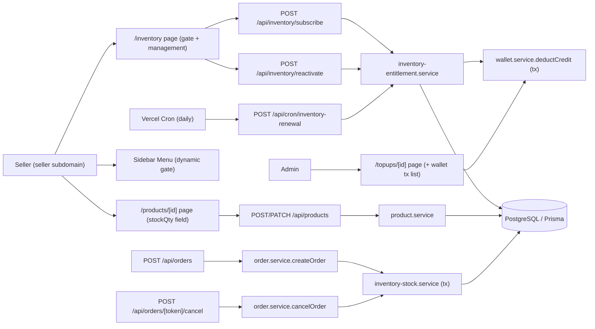
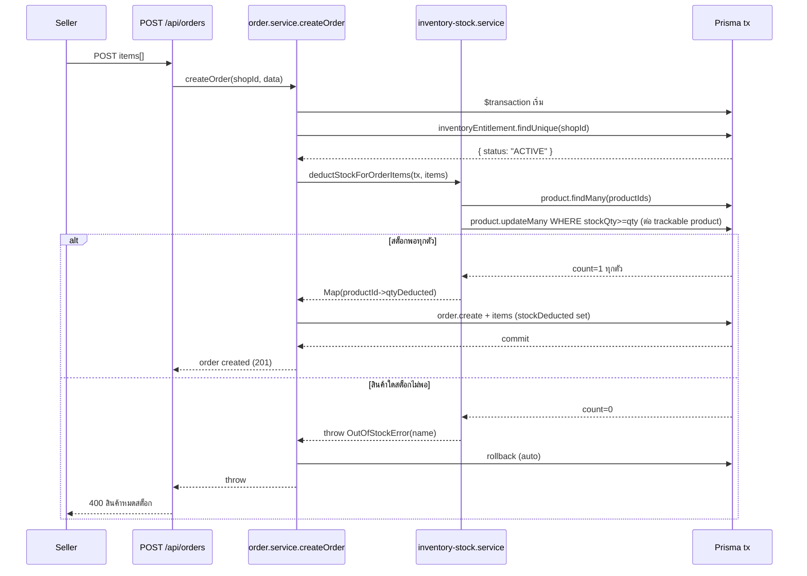
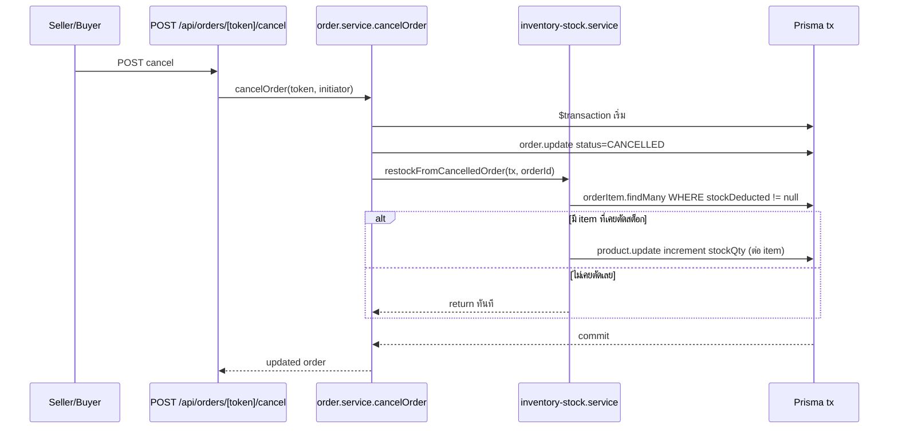
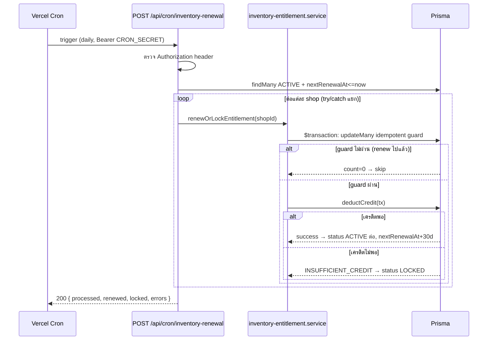
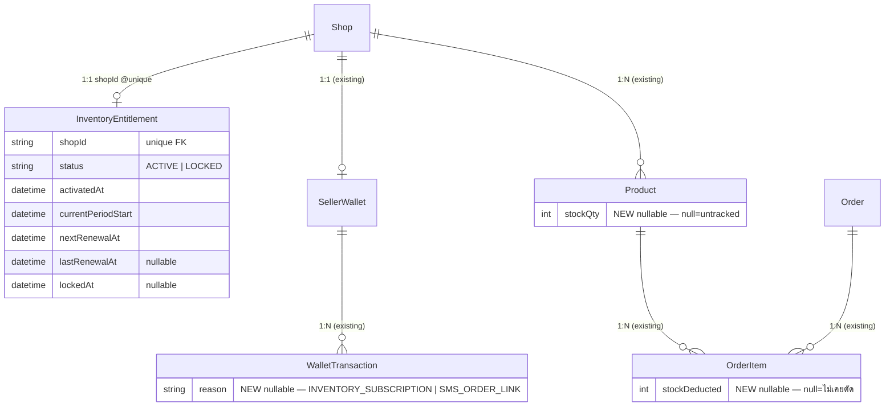
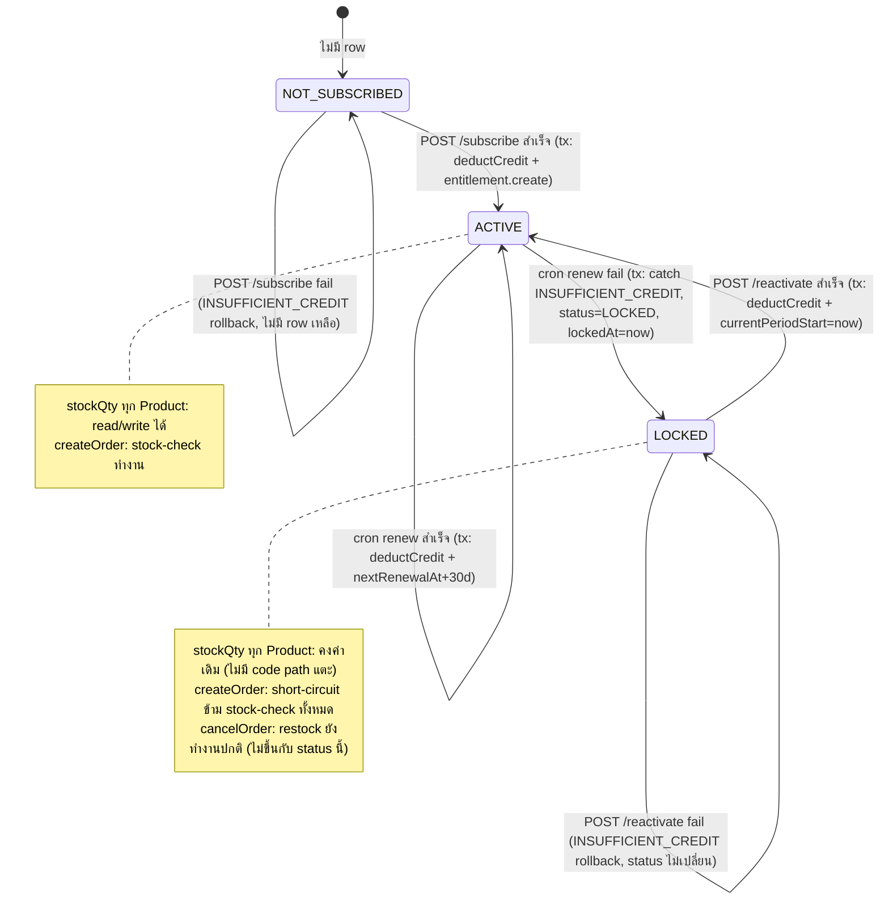
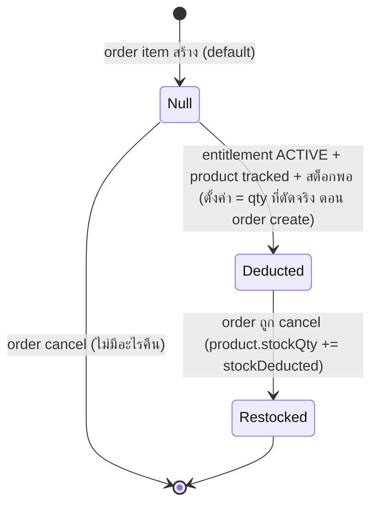

> **โมดูล:** M00003-InventoryAddon
> **ประเภทเอกสาร:** Software Requirements Specification (SRS) — TECHNICAL
> **เวอร์ชัน:** 1.0
> **วันที่จัดทำ:** 2026-07-01
> **สถานะ:** Draft
> **เจ้าของเอกสาร:** SA (ดู [[Feature-Docs-Ownership]])

# SRS: Inventory Add-on (Software Requirements Specification — Technical)

---

## 1. บทนำ (Introduction)

### 1.1 วัตถุประสงค์ของเอกสาร

เอกสารนี้กำหนดข้อกำหนดเชิงเทคนิคสำหรับ **Inventory Add-on (M00003)** ครอบคลุม (1) entitlement lifecycle (subscribe/renew/lock/reactivate) แบบ atomic ผูกกับ `wallet.service` เดิม, (2) stock deduction/restock แบบ atomic all-or-nothing ที่ hook เข้า `order.service.createOrder`/`cancelOrder`, (3) Vercel Cron job สำหรับ renewal รายเดือน (infra ใหม่ที่ระบบไม่เคยมี), (4) menu gate + page-level server guard, (5) API contract ของ endpoint ใหม่/ที่ขยาย, (6) validation rules (Valibot), (7) backward-compatibility/short-circuit design สำหรับ Shop ที่ไม่มี entitlement ACTIVE (ความเสี่ยงสูงสุดของ feature นี้)

ผู้อ่านเป้าหมาย: DEV ผู้ implement, QA ผู้ออกแบบ test case, safepay-database ผู้ออกแบบ schema (รันขนาน), Controller ผู้วางแผน dispatch

เอกสารนี้ trace กลับ FR-INV-01 ถึง FR-INV-13 ใน [[BRD]] และ Resolved Decisions OD-1 ถึง OD-4 ใน [[PRD]] §10.3

### 1.2 ขอบเขตเชิงระบบ (System Scope)

**ในขอบเขต:**
- `src/services/inventory-entitlement.service.ts` (ใหม่) — entitlement lifecycle: subscribe/renew/lock/reactivate, atomic ร่วมกับ `wallet.service.deductCredit`
- `src/services/inventory-stock.service.ts` (ใหม่) — stock deduct/restock helper รับ `Prisma.TransactionClient` จาก caller (order.service)
- `src/services/wallet.service.ts` — **แก้ signature `deductCredit()` เพิ่ม parameter `reason`** (sync กับ DATABASE `WalletTransaction.reason` — user ยืนยัน 2026-07-01) + แก้ SMS call-site เดิมให้ส่ง `reason: "SMS_ORDER_LINK"`
- `src/services/order.service.ts` — แก้ `createOrder` ให้ห่อทั้งหมดใน `prisma.$transaction` + hook stock deduct; แก้ `cancelOrder` ให้ hook restock
- `src/services/product.service.ts` — ขยาย `createProduct`/`updateProduct` รับ `stockQty`
- `src/app/api/inventory/subscribe/route.ts`, `src/app/api/inventory/reactivate/route.ts` (ใหม่)
- `src/app/api/cron/inventory-renewal/route.ts` (ใหม่) — Vercel Cron endpoint
- `src/app/api/products/route.ts`, `src/app/api/products/[id]/route.ts` — ขยาย schema รับ `stockQty`
- `src/app/(paces)/seller/(dashboard)/inventory/` (ใหม่) — หน้า Inventory (gate + management UI)
- `src/app/(paces)/seller/(dashboard)/_seller-menu.ts` + `layout.tsx` — เมนู gate แบบ dynamic ตาม entitlement status
- `src/app/(paces)/admin/(dashboard)/topups/[id]/page.tsx` — ขยาย sidebar แสดง WalletTransaction ล่าสุดของ shop (FR-INV-13 — user ยืนยัน location นี้ 2026-07-01)
- `vercel.json` — เพิ่ม `crons` config
- `src/lib/inventory-addon.ts` (ใหม่) — constants (ราคา, รอบ renew, เตือนล่วงหน้า, wallet reason labels + description text)
- `src/lib/validations.ts` — schema ใหม่/ขยาย

**นอกขอบเขต:**
- Low-stock alert, stock movement audit log, SKU variant, bulk CSV, manual unsubscribe UI, admin analytics dashboard เต็มรูป, grace period, proration (ทั้งหมดตาม PRD §5 Out of Scope)
- Push/email/SMS notification pipeline ใหม่ (ไม่มีโครงสร้างพื้นฐานอยู่แล้ว — MVP ใช้ render-time banner แทน, user ยืนยัน 2026-07-01, ดู §12 OTQ-1)
- Redis-backed cache/rate-limit (ระบบยังเป็น per-instance globalThis ทั้งระบบ — Phase 2 เดิม)

### 1.3 เอกสารอ้างอิง (References)

| เอกสาร | ความสัมพันธ์ |
|--------|-------------|
| [[PRD]] ของโมดูลนี้ | เป้าหมายธุรกิจ, KPI, Resolved Decisions OD-1..OD-4 |
| [[BRD]] ของโมดูลนี้ | Functional Requirements FR-INV-01..13, Business Rules BR-INV-01..14, AC |
| [[DATABASE]] ของโมดูลนี้ | schema `InventoryEntitlement`/`Product.stockQty`/`OrderItem.stockDeducted`/`WalletTransaction.reason` + migration |
| `docs/SRS.md` (ระบบรวม) | FR-5 Product Capability Model, FR-6 Simple OMS — feature นี้ extend ไม่ replace |
| `src/services/wallet.service.ts` | `deductCredit` RC-3 atomic pattern (บรรทัด 82-152) — ต้น pattern ของ stock-deduct |
| `src/services/order.service.ts` | `createOrder`/`cancelOrder` จุด hook |
| `src/app/api/orders/[token]/send-sms/route.ts` | ตัวอย่าง atomic transaction + 402 INSUFFICIENT_CREDIT convention |
| `vercel.json` | Deploy config — ยังไม่มี `crons` |

### 1.4 นิยามและตัวย่อ (Definitions & Acronyms)

| คำ/ตัวย่อ | ความหมาย |
|-----------|----------|
| **Entitlement** | Row ใน `InventoryEntitlement` (1:1 Shop); ไม่มี row = NOT_SUBSCRIBED |
| **Tracked Product** | `Product.stockQty != null` และ `type === 'PHYSICAL'` |
| **Untracked Product** | `Product.stockQty === null` — ไม่มีผลกับฟีเจอร์นี้เลย |
| **RC-3 Pattern** | Atomic conditional-update (`updateMany` WHERE + compare) กัน race condition — ต้นแบบ `wallet.service.deductCredit` |
| **Short-circuit** | Logic ที่ return/skip ทันทีเมื่อ Shop ไม่มี entitlement ACTIVE โดยไม่ query stock table เพิ่ม |
| **Rolling 30-day cycle** | `nextRenewalAt = currentPeriodStart + 30 วัน`, คำนวณใหม่ทุกครั้งที่ subscribe/renew/reactivate |
| **Hard Stop** | ปฏิเสธสร้าง order แบบเด็ดขาดเมื่อ tracked product เหลือ 0 และ entitlement ACTIVE |
| **guardApi** | CSRF Origin-check + rate-limit middleware ใน `src/proxy.ts` (ทุก `/api` ยกเว้น `/api/auth/*`) — cron endpoint ใหม่ต้องพิจารณาแยก (ดู §6) |
| **CRON_SECRET** | Env var ที่ Vercel ส่งเป็น `Authorization: Bearer {CRON_SECRET}` อัตโนมัติเมื่อ trigger cron ของตัวเอง |

---

## 2. ภาพรวมสถาปัตยกรรม (Architecture Overview)

### 2.1 บริบทระบบ (System Context)



### 2.2 องค์ประกอบหลัก (Components)

| Component | หน้าที่ | Submodule / Stack |
|-----------|---------|-------------------|
| **`src/services/inventory-entitlement.service.ts`** (ใหม่) | `getEntitlementStatus`, `subscribeInventoryEntitlement`, `reactivateInventoryEntitlement`, `renewOrLockEntitlement` (ใช้โดย cron), `isEntitlementActive` (short-circuit helper) | Prisma, reuse `wallet.service` |
| **`src/services/inventory-stock.service.ts`** (ใหม่) | `deductStockForOrderItems(tx, items)` — all-or-nothing atomic; `restockFromCancelledOrder(tx, orderId)` | Prisma `TransactionClient` |
| **`src/lib/inventory-addon.ts`** (ใหม่) | Constants: `INVENTORY_ADDON_PRICE=199`, `INVENTORY_RENEWAL_PERIOD_DAYS=30`, `INVENTORY_ADVANCE_WARNING_DAYS=3`, `WALLET_REASON` labels (`INVENTORY_SUBSCRIPTION`/`SMS_ORDER_LINK`) + description text ไทย | pure constant |
| **`src/services/wallet.service.ts`** (แก้) | เพิ่ม param `reason` เข้า `deductCredit(shopId, amount, refId, description, reason, tx)` เขียนลง `WalletTransaction.reason`; แก้ SMS call-site เดิมส่ง `reason` ด้วย | Prisma |
| **`src/services/order.service.ts`** | `createOrder` ห่อ `prisma.$transaction`, เรียก stock-service ก่อน `order.create`; `cancelOrder` เรียก restock หลัง status update ใน tx เดียวกัน | Prisma |
| **`src/services/product.service.ts`** | `createProduct`/`updateProduct` รับ+persist `stockQty` (ตรวจ guard ที่ route layer) | Prisma |
| **`POST /api/inventory/subscribe`** (ใหม่) | Subscribe ครั้งแรก | Next.js Route Handler, session-auth |
| **`POST /api/inventory/reactivate`** (ใหม่) | Reactivate จาก LOCKED | Next.js Route Handler, session-auth |
| **`POST /api/cron/inventory-renewal`** (ใหม่) | Renewal batch รายวัน — per-shop atomic + per-shop error isolation | Next.js Route Handler, CRON_SECRET-auth เท่านั้น |
| **`InventoryPage`** (ใหม่ `src/app/(paces)/seller/(dashboard)/inventory/page.tsx`) | Server component: query entitlement status → render gate หรือ management UI | RSC, Paces |
| **`_seller-menu.ts` + `layout.tsx`** | Compose เมนู Inventory แบบ dynamic (`isDisabled` + label ตาม entitlement status) ต่อ request | RSC |
| **admin `/topups/[id]/page.tsx`** | ขยาย sidebar แสดง WalletTransaction ล่าสุดของ shop (reuse `wallet.service.getTransactions`) | RSC |

### 2.3 มุมมองการ Deploy (Deployment View)

- API routes รันเป็น Vercel Serverless Functions (Hobby tier) — เหมือน route อื่นทั้งหมดในระบบ
- **Vercel Cron ใหม่**: `POST /api/cron/inventory-renewal` ทริกเกอร์โดย Vercel scheduler เอง (ไม่ผ่าน `guardApi`'s CSRF/rate-limit — ไม่มี browser Origin, ไม่มี session/JWT) — auth แยกด้วย `CRON_SECRET` bearer เท่านั้น (ดู §6.4)
- **Hobby plan constraint**: cron รันได้ **1 ครั้ง/วัน เท่านั้น** (expression ที่ถี่กว่า daily จะ deploy fail); Vercel อาจ trigger เวลาใดก็ได้ภายใน "ชั่วโมง" ที่ระบุ (jitter ≤1 ชม.) — ไม่กระทบความถูกต้องเพราะ correctness อิง DB state (`nextRenewalAt <= now()`) ไม่ใช่ wall-clock exact time [Sources: Vercel Cron Jobs docs, Vercel Hobby plan limits]
- ไม่พึ่ง `globalThis` in-memory store ใด ๆ สำหรับ correctness ของ renewal (ต่างจาก rate-limit/Nominatim cache เดิมที่เป็น per-instance) — ทุก state (entitlement status, nextRenewalAt) อยู่ใน DB เพียงที่เดียว ทำให้ cron ทำงานถูกต้องแม้รันบน serverless instance คนละตัวทุกครั้ง

---

## 3. ข้อกำหนดเชิงฟังก์ชันเชิงเทคนิค (Technical Functional Requirements)

### TFR-001: Subscribe ครั้งแรก — Atomic Deduct + Create Entitlement

- **Trace to:** FR-INV-01
- **คำอธิบายเชิงเทคนิค:** `subscribeInventoryEntitlement(shopId)` ใน `inventory-entitlement.service.ts`:
  1. `prisma.$transaction(async (tx) => { ... })`
  2. ตรวจ precondition: `tx.inventoryEntitlement.findUnique({where:{shopId}})` ต้องเป็น `null` — ถ้ามี row อยู่แล้ว (ACTIVE หรือ LOCKED) → throw `Error("ENTITLEMENT_ALREADY_EXISTS")`
  3. `await deductCredit(shopId, INVENTORY_ADDON_PRICE, entitlementRefId, WALLET_DESC.SUBSCRIBE, WALLET_REASON.INVENTORY_SUBSCRIPTION, tx)` — reuse `wallet.service.deductCredit` ทุกกลไก RC-3 เดิม (ดู `src/services/wallet.service.ts:82-152`); ถ้า `INSUFFICIENT_CREDIT` throw → transaction rollback ทั้งหมด (ไม่มี entitlement ค้าง)
  4. `tx.inventoryEntitlement.create({ data: { shopId, status: 'ACTIVE', activatedAt: now, currentPeriodStart: now, nextRenewalAt: now + 30d } })`
- **Precondition:** ไม่มี `InventoryEntitlement` row ของ shop นี้มาก่อน
- **Postcondition:** entitlement ACTIVE; `WalletTransaction` DEDUCT ใหม่ 1 รายการ `reason="INVENTORY_SUBSCRIPTION"` description="สมัคร Inventory Add-on"; balance ลด 199
- **Error / Edge cases:** เครดิตไม่พอ → 402 `INSUFFICIENT_CREDIT` (ไม่หักบางส่วน — rollback ทั้ง tx); มี entitlement อยู่แล้ว → 409 `ENTITLEMENT_ALREADY_EXISTS` (กัน double-subscribe จาก double-click/retry)

### TFR-002: Renewal Job รายวัน — Vercel Cron, Atomic per-Shop

- **Trace to:** FR-INV-02
- **คำอธิบายเชิงเทคนิค:** `POST /api/cron/inventory-renewal`:
  1. ตรวจ `Authorization: Bearer {CRON_SECRET}` — ไม่ตรง → 401 (ไม่แตะ DB)
  2. Query due shops: `prisma.inventoryEntitlement.findMany({ where: { status: 'ACTIVE', nextRenewalAt: { lte: now } } })`
  3. Loop ทีละ shop (**per-shop isolation** — ไม่ห่อทั้ง batch ใน tx เดียว): เรียก `renewOrLockEntitlement(shopId)` ใน `try/catch` แยก; error ของ shop หนึ่งไม่ทำให้ shop อื่นถูกข้าม (NFR 6.3)
  4. `renewOrLockEntitlement(shopId)` ภายใน `prisma.$transaction`:
     - **Idempotent guard**: `tx.inventoryEntitlement.updateMany({ where: { shopId, status: 'ACTIVE', nextRenewalAt: { lte: now } }, data: { ... } })` — ถ้า shop นี้ถูก renew ไปแล้ว (เช่น retry/double-trigger) `nextRenewalAt` จะขยับไปอนาคตแล้ว → WHERE ไม่ตรง → `count === 0` → skip เงียบ ๆ (ไม่ throw, ไม่ error) — satisfies FR-INV-02-AC-04 โดยไม่ต้องมี lock table แยก
     - ถ้า guard ผ่าน: เรียก `deductCredit(shopId, 199, entitlementRefId, WALLET_DESC.RENEW, WALLET_REASON.INVENTORY_SUBSCRIPTION, tx)`
     - สำเร็จ → `tx.inventoryEntitlement.update({ where: { shopId }, data: { status: 'ACTIVE', lastRenewalAt: now, currentPeriodStart: now, nextRenewalAt: now + 30d } })`
     - `INSUFFICIENT_CREDIT` → catch ภายใน closure เดียวกัน (ไม่ throw ออกนอก tx) → `tx.inventoryEntitlement.update({ where: { shopId }, data: { status: 'LOCKED', lockedAt: now } })` (ไม่แตะ `currentPeriodStart`/`nextRenewalAt` — ข้อมูลยังอยู่ครบ, ดู TFR-005)
  5. Response: `{ processed: number, renewed: number, locked: number, errors: number }` (สำหรับ log/monitor — NFR 6.3 job execution log)
- **Precondition:** entitlement status ACTIVE + `nextRenewalAt <= now`
- **Postcondition:** renew สำเร็จ → ACTIVE ต่อ + WalletTransaction ใหม่; renew ล้มเหลว → LOCKED ทันที ไม่มี partial deduct
- **Error / Edge cases:** shop ที่ query ไม่เจอ (ถูกลบระหว่างทาง) → catch → log skip; DB connection error กลางทาง → catch ต่อ shop → ไม่ crash job ทั้งก้อน

### TFR-003: Advance Warning ก่อน Renew — Render-time Computed (ไม่ใช้ Cron แยก)

- **Trace to:** FR-INV-03, OD-1 (3 วัน), OD-4 (banner — user ยืนยัน 2026-07-01)
- **คำอธิบายเชิงเทคนิค:** **ไม่มี batch/cron แยกสำหรับ advance warning** — คำนวณสดทุกครั้งที่ page render (เหตุผลใน §12 OTQ-1) `shouldWarnAdvance(entitlement, balance): boolean` ใน `inventory-entitlement.service.ts`:
  ```
  daysUntilRenewal = Math.ceil((entitlement.nextRenewalAt - now) / 86400000)
  return entitlement.status === 'ACTIVE'
    && daysUntilRenewal <= INVENTORY_ADVANCE_WARNING_DAYS  // 3
    && daysUntilRenewal >= 0
    && balance < INVENTORY_ADDON_PRICE  // 199
  ```
  เรียกจาก `InventoryPage`, Dashboard page, Wallet page (ทุกที่ที่ entitlement ACTIVE) — render banner "เครดิตอาจไม่พอสำหรับรอบ renew วันที่ {nextRenewalAt} (ขาดอีก ฿{199-balance})" เมื่อ true
- **Precondition:** entitlement ACTIVE
- **Postcondition:** Seller เห็น banner ทุกครั้งที่เข้าเว็บในช่วง T-3 ถึง T-0 ถ้าเครดิตยังไม่พอ (แสดงซ้ำได้ทุก page load — ไม่ต้อง track "เตือนไปแล้วหรือยัง")
- **Error / Edge cases:** ไม่มี entitlement (NOT_SUBSCRIBED/LOCKED) → ฟังก์ชัน return false ทันที (short-circuit)

### TFR-004: Lock ทันทีเมื่อเครดิตไม่พอ

- **Trace to:** FR-INV-04
- **คำอธิบายเชิงเทคนิค:** ส่วนหนึ่งของ TFR-002 (`renewOrLockEntitlement` catch branch) — ไม่มี grace state ใด ๆ ใน state machine (ดู §8.1); การแจ้งเตือน "ถูกล็อกแล้ว" (FR-INV-04-AC-02) ใช้กลไกเดียวกับ TFR-003 คือ computed-at-render (`entitlement.status === 'LOCKED'` → banner แสดงทุกครั้งที่เข้า `/inventory` หรือ dashboard) แทน push-ทันที (user ยืนยัน trade-off นี้ 2026-07-01 — ดู §12 OTQ-1)
- **Error / Edge cases:** ไม่มี config/flag ใดอนุญาตให้ status อื่นนอกจาก ACTIVE ผ่าน stock-check ได้ (enforced ที่ `isEntitlementActive` ซึ่งเป็น exact string compare `=== 'ACTIVE'`)

### TFR-005: Data Retention เมื่อ Lock — ไม่มี Code Path ที่แตะ stockQty

- **Trace to:** FR-INV-05
- **คำอธิบายเชิงเทคนิค:** ไม่ใช่ operation ที่ต้อง implement เพิ่ม — เป็นผลจาก design ที่ไม่มี code path ใดใน `renewOrLockEntitlement`/lock flow แตะ `Product.stockQty` เลย (เขียนแค่ `InventoryEntitlement.status`) การไม่ลบข้อมูลคือ **ค่า default ตามธรรมชาติ** ไม่ใช่ feature ที่ต้อง build; QA ต้องเขียน regression test ยืนยันว่า lock ไม่มี `product.update` call ใด ๆ เกิดขึ้น (assert ผ่าน DB query ก่อน/หลัง lock)
- **Postcondition:** `stockQty` ทุก Product ของ shop คงค่าเดิม 100% หลัง status เปลี่ยน ACTIVE→LOCKED→ACTIVE (reactivate)

### TFR-006: Reactivate — Explicit Action, Atomic Deduct + Reset Cycle

- **Trace to:** FR-INV-06, OD-3 (manual action เท่านั้น ไม่มี auto-retry)
- **คำอธิบายเชิงเทคนิค:** `reactivateInventoryEntitlement(shopId)`:
  1. `prisma.$transaction`
  2. Precondition: `tx.inventoryEntitlement.findUnique({where:{shopId}})?.status === 'LOCKED'` — ไม่ใช่ (ไม่มี row หรือ status ACTIVE) → throw `Error("ENTITLEMENT_NOT_LOCKED")`
  3. `deductCredit(shopId, 199, entitlementRefId, WALLET_DESC.REACTIVATE, WALLET_REASON.INVENTORY_SUBSCRIPTION, tx)` — INSUFFICIENT_CREDIT → rollback
  4. `tx.inventoryEntitlement.update({ where: { shopId }, data: { status: 'ACTIVE', activatedAt: now, currentPeriodStart: now, nextRenewalAt: now + 30d, lockedAt: null } })` — รอบใหม่เริ่มนับจาก **ตอนนี้** ไม่ใช่ต่อจากรอบเดิม (BR-INV-08)
  5. ไม่มี auto-retry: endpoint นี้ถูกเรียกจาก explicit user action (ปุ่ม "Reactivate" บนหน้า gate) เท่านั้น — cron **ไม่** เรียก endpoint นี้เลย
- **Error / Edge cases:** 409 `ENTITLEMENT_NOT_LOCKED`; 402 `INSUFFICIENT_CREDIT`; หลัง reactivate สำเร็จ `stockQty` ทุกตัวยังเป็นค่าที่ query ตรงจาก DB (ไม่มี cache แยก — ดู TFR-005)

### TFR-007: Menu Gate + Page-level Server Guard (ไม่ใช้ proxy.ts)

- **Trace to:** FR-INV-07
- **คำอธิบายเชิงเทคนิค — Design decision (สำคัญ):** เลือก **page-level server guard** แทนการเพิ่ม business-gate logic ใน `src/proxy.ts` ด้วยเหตุผล:
  1. `proxy.ts` เป็น cross-cutting middleware (auth/subdomain/CSRF) ที่รันทุก request ทุก path — เพิ่ม DB query เฉพาะ feature ที่นี่ขัดกับ separation of concern เดิม (auth/onboarding gate ใน proxy.ts เป็น flag ที่มาจาก JWT อยู่แล้ว ไม่ต้อง query สด)
  2. Colocate กับ pattern DAL ownership ที่ใช้อยู่แล้วทั้งระบบ (memory `feedback_rsc_dal_authz`) — scope check ทำที่ query layer ของหน้านั้นเอง
  3. **Menu item ไม่ preventDefault** — `MenuItem` component (`src/layouts/components/Sidenav/components/AppMenu.tsx:79`) render `isDisabled` เป็นแค่ CSS class เท่านั้น (ยังคลิกได้จริงและ navigate — ดูโค้ดปัจจุบันไม่มี `onClick preventDefault`) → ดังนั้นการ "block" ตัวจริงต้องเกิดที่หน้าปลายทาง ไม่ใช่ที่เมนู (สอดคล้อง FR-INV-07-AC-04 ที่ระบุชัดว่าต้อง block ที่ server-side ไม่ใช่ client-side hide)
  4. **สรุป implementation:**
     - `layout.tsx` (ของ seller dashboard group) เรียก `getEntitlementStatus(shop.id)` เพิ่ม (try/catch fallback `'NOT_SUBSCRIBED'` — ไม่ block layout render ถ้า query error) → build เมนูแบบ dynamic ผ่าน helper ใหม่ `buildInventoryMenuItem(status)` ใน `_seller-menu.ts` ที่คืน `{ url: '/inventory', label: '...', isDisabled: status !== 'ACTIVE', badge: status==='NOT_SUBSCRIBED' ? {text:'฿199/ด.'} : status==='LOCKED' ? {text:'ถูกล็อก'} : undefined }` แล้ว inject เข้ากลุ่ม "STORE"
     - `src/app/(paces)/seller/(dashboard)/inventory/page.tsx` (server component ใหม่): เรียก `getEntitlementStatus(shop.id)` เอง (ไม่พึ่งค่าจาก layout — RSC tree แยก request แต่ละ segment); ถ้า `!== 'ACTIVE'` → render `<InventoryGate status={status} />` (prompt + CTA subscribe/reactivate) เท่านั้น — **ไม่ query stock/product data ใด ๆ เพิ่ม** (ไม่ใช่ read-only demo เพราะไม่มี data ให้อ่านเลยในโหมดนี้); ถ้า ACTIVE → query + render management UI จริง
- **Postcondition:** bypass URL ตรง ๆ (`/inventory`) เมื่อไม่ ACTIVE → ได้ gate page เท่านั้น (HTTP 200 แต่ไม่มี stock data ใน RSC flight เลย — ปลอดภัยกว่า 403 ที่อาจ leak ว่ามี route อยู่พร้อมข้อมูลบางส่วน)
- **Error / Edge cases:** `getEntitlementStatus` throw → fallback NOT_SUBSCRIBED (fail-closed — ปลอดภัยกว่า fail-open ที่อาจเผลอโชว์ management UI)

### TFR-008: ตั้ง/แก้จำนวนสต็อก — ขยาย Product Create/Update

- **Trace to:** FR-INV-08
- **คำอธิบายเชิงเทคนิค:**
  - `CreateProductSchema`/`UpdateProductSchema` (`src/lib/validations.ts`) เพิ่ม `stockQty: v.optional(v.nullable(v.pipe(v.number(), v.integer(), v.minValue(0))))`
  - **Route-layer guard (defense-in-depth, ไม่ไว้ใจ client):** ใน `POST /api/products` และ `PATCH /api/products/[id]` — ถ้า body มี `stockQty !== undefined`:
    1. `type` (หรือ existing product type กรณี PATCH) ต้อง `=== 'PHYSICAL'` — ไม่ใช่ → 400 `STOCK_QTY_INVALID_PRODUCT_TYPE`
    2. `getEntitlementStatus(shopId) === 'ACTIVE'` — ไม่ใช่ → 403 `INVENTORY_NOT_ACTIVE`
  - `product.service.createProduct`/`updateProduct` เพิ่ม `stockQty` เข้า `data` ตรง ๆ (nullable Int, no transform)
  - **Opt-in semantics:** ไม่ส่ง `stockQty` เลย (undefined) = ไม่แตะ (create → เก็บ null default = untracked); ส่ง `null` explicit = untrack (สำหรับ Seller ที่เคย track แล้วอยากเลิก); ส่งตัวเลข ≥0 = track
- **Precondition:** entitlement ACTIVE + product type PHYSICAL (เมื่อจะเขียนค่า)
- **Postcondition:** `Product.stockQty` สะท้อนสถานะ track/untrack ตรงตาม input
- **Error / Edge cases:** ค่าติดลบ/ทศนิยม → 400 ที่ Valibot ก่อนถึง route guard; UI ไม่ควรส่ง field นี้เลยเมื่อ type≠PHYSICAL หรือ entitlement≠ACTIVE (แต่ backend ไม่ไว้ใจ UI — reject เสมอ)

### TFR-009: ตัดสต็อกอัตโนมัติตอนสร้าง Order — Atomic All-or-Nothing ใน Transaction เดียวกับ Order Creation

- **Trace to:** FR-INV-09
- **คำอธิบายเชิงเทคนิค — การเปลี่ยนแปลงสำคัญต่อ `createOrder`:** ปัจจุบัน `createOrder` (`src/services/order.service.ts:39-138`) เรียก `prisma.order.create` ตรง ๆ (retry loop เฉพาะ shortCode P2002) ไม่มี `$transaction` ครอบ ต้องปรับเป็น:
  ```
  export async function createOrder(shopId, data) {
    // ...คำนวณ subtotal/totalAmount/fulfillmentMode เดิมทั้งหมด (ไม่เปลี่ยน)...
    return prisma.$transaction(async (tx) => {
      // NEW STEP — ก่อน order.create:
      const entitlement = await tx.inventoryEntitlement.findUnique({
        where: { shopId }, select: { status: true },
      })
      let stockDeductionMap: Map<string, number> | null = null // productId -> qty deducted (สำหรับ set OrderItem.stockDeducted)
      if (entitlement?.status === 'ACTIVE') {
        // เฉพาะตอนนี้เท่านั้นที่ query product — short-circuit สำหรับ shop อื่นทั้งหมด
        stockDeductionMap = await deductStockForOrderItems(tx, data.items) // throws OutOfStockError
      }
      // ...retry loop order.create เดิม แต่ผูก tx + set items[].stockDeducted จาก stockDeductionMap...
    })
  }
  ```
  - **`deductStockForOrderItems(tx, items)`** (ใน `inventory-stock.service.ts`):
    1. Aggregate `qty` ต่อ `productId` ที่ไม่ null (item ซ้ำ productId ในใบเดียวกัน — รวมจำนวนก่อน)
    2. `tx.product.findMany({ where: { id: { in: productIds } }, select: { id, name, type, stockQty } })`
    3. กรอง trackable = `type === 'PHYSICAL' && stockQty !== null`
    4. สำหรับแต่ละ trackable product: `tx.product.updateMany({ where: { id, stockQty: { gte: totalQtyNeeded } }, data: { stockQty: { decrement: totalQtyNeeded } } })` — RC-3 pattern เป๊ะ (mirror `wallet.service.deductCredit:100-113`)
    5. ถ้า `count === 0` (สต็อกไม่พอ) → **throw ทันที** `OutOfStockError(productName)` — เพราะอยู่ใน `prisma.$transaction` แล้ว, throw = rollback การ decrement ที่ทำไปก่อนหน้าโดยอัตโนมัติ (all-or-nothing โดยไม่ต้อง manual compensate)
    6. สำเร็จทุก product → return `Map<productId, qtyDeducted>` ให้ caller ใช้ set `OrderItem.stockDeducted` ต่อ order-item (ไม่ใช่ต่อ product — ถ้า item ซ้ำ productId 2 รายการ แต่ละ item เก็บ `stockDeducted` ของตัวเอง ผลรวมยังตรง)
  - **⚠️ NULL-comparison bug ที่ต้องกัน:** ถ้า WHERE เขียนเป็น `stockQty: { gte: qty }` ตรง ๆ โดยไม่กรอง `type/stockQty!==null` ก่อน — Postgres `NULL >= n` ประเมินเป็น unknown (ไม่ true) → `updateMany` จะได้ `count=0` เสมอสำหรับ untracked product ทำให้ระบบเข้าใจผิดว่า "หมดสต็อก" ทั้งที่จริงคือ "ไม่ track" — **ต้อง pre-filter ด้วย step 2-3 ก่อนเสมอ** ห้ามข้าม
- **Precondition:** `shopId` ของ order นั้นมี entitlement `status === 'ACTIVE'`
- **Postcondition:** ทุก trackable product ที่อยู่ใน order ถูกตัดสต็อกตรงจำนวน; `OrderItem.stockDeducted` บันทึกค่าที่ตัดจริงต่อ item (untracked/non-ACTIVE items → `stockDeducted = null`)
- **Error / Edge cases:** concurrent 2 orders แย่งสต็อกชิ้นสุดท้าย → คนแรกชนะ (count=1), คนที่สอง WHERE ไม่ตรง (count=0) → throw → order ที่สองไม่ถูกสร้างเลย (ตอบ error ให้ client, ไม่ commit อะไรเลย); multi-item บาง item พอ บาง item ไม่พอ → throw ตัวแรกที่เจอ → rollback ทั้งใบ (ไม่สร้าง order เลยแม้ item อื่นจะพอ — ตรง AC-02)

### TFR-010: คืนสต็อกอัตโนมัติเมื่อ Order ถูกยกเลิก

- **Trace to:** FR-INV-10
- **คำอธิบายเชิงเทคนิค:** `cancelOrder` (`src/services/order.service.ts:208-217`) ปัจจุบันเป็น single `prisma.order.update` ไม่มี transaction ต้องปรับเป็น:
  ```
  export async function cancelOrder(publicToken, initiator) {
    const order = await prisma.order.findUnique({ where: { publicToken } })
    if (!order) throw new Error("Order not found")
    assertTransition(order.status, "CANCELLED")
    return prisma.$transaction(async (tx) => {
      const updated = await tx.order.update({
        where: { publicToken }, data: { status: "CANCELLED", cancelInitiator: initiator },
      })
      await restockFromCancelledOrder(tx, order.id) // ไม่เช็ค entitlement เลย
      return updated
    })
  }
  ```
  - **`restockFromCancelledOrder(tx, orderId)`** (ใน `inventory-stock.service.ts`):
    1. `tx.orderItem.findMany({ where: { orderId, stockDeducted: { not: null } }, select: { productId, stockDeducted } })`
    2. ว่าง → return ทันที (ไม่เคยตัดสต็อก — ไม่มีอะไรคืน, ไม่ query อะไรเพิ่ม)
    3. สำหรับแต่ละ item: ถ้า `productId === null` (product ถูกลบไปแล้ว, `onDelete: SetNull`) → **log warning "orphan restock — ไม่มี product ให้คืน" แล้ว skip** (ไม่ throw — cancel ต้องสำเร็จเสมอ); ไม่ null → `tx.product.update({ where: { id: productId }, data: { stockQty: { increment: stockDeducted } } })`
    4. **ไม่ query/ตรวจ entitlement status ปัจจุบันเลย** — ทำงานเสมอตามประวัติจริงของ order (BR-INV-12) แม้ shop จะ LOCKED อยู่ ณ ตอน cancel
    5. **Edge — product ถูก untrack (`stockQty=null`) ระหว่างรอ cancel:** `increment` บน NULL column ให้ผล NULL (ไม่ error, no-op restock) — expected behavior ยอมรับได้ (product untracked แล้วไม่มีความหมายทางธุรกิจที่จะคืน)
- **Precondition:** ไม่มี — ทำงานได้ทุกสถานะ entitlement (นี่คือจุดต่างจาก TFR-009 ที่มี precondition ACTIVE)
- **Postcondition:** `stockQty` ของทุก tracked product ที่เคยถูกตัดใน order นี้เพิ่มกลับตรงจำนวน
- **Error / Edge cases:** product ถูกลบระหว่างทาง → skip เงียบ ๆ + log (accepted data-integrity gap, unavoidable เพราะ `onDelete: SetNull`); increment เป็น atomic single-statement (ไม่ต้อง conditional WHERE เหมือนตอนตัด เพราะการ "บวกกลับ" ไม่มีเงื่อนไข business ที่ต้อง reject)

### TFR-011: Hard Stop เมื่อสต็อก = 0

- **Trace to:** FR-INV-11
- **คำอธิบายเชิงเทคนิค:** เป็นผลโดยตรงของ TFR-009 ขั้นตอน 5 (conditional `updateMany` WHERE `stockQty >= qty` — เมื่อ `stockQty = 0` และ `qty >= 1` เงื่อนไขไม่ผ่านเสมอ → `count = 0` → throw `OutOfStockError`) ไม่ต้องมี logic แยก
  - **Error message:** `OutOfStockError` class เก็บ `productNames: string[]` (จาก `item.name` ที่ client ส่งมาตอนสร้าง order — ไม่ต้อง query DB เพิ่มเพื่อเอาชื่อ) → route handler map เป็น 400: `"สินค้าหมดสต็อก: {productNames.join(', ')}"`
- **Precondition:** entitlement ACTIVE (บังคับจาก TFR-009 — ถ้าไม่ ACTIVE ทั้ง block นี้ไม่ทำงานเลย ตรง AC-02)
- **Postcondition:** order ไม่ถูกสร้าง เมื่อสินค้า tracked เหลือ 0
- **Error / Edge cases:** ไม่มี override/warning-only mode ใน MVP (ตรง BRD)

### TFR-012: Backward Compatibility — Short-circuit สำหรับ Shop ที่ไม่มี Entitlement ACTIVE

- **Trace to:** FR-INV-12 (ความเสี่ยงสูงสุดของ feature)
- **คำอธิบายเชิงเทคนิค:** Cross-cutting requirement ที่ enforce ผ่าน TFR-009 ขั้นตอน 1 (entitlement lookup เดี่ยว) — สำหรับ shop ที่ `entitlement === null` (NOT_SUBSCRIBED) หรือ `status === 'LOCKED'`:
  - `createOrder`: query เพิ่มเพียง **1 คำสั่ง** (`inventoryEntitlement.findUnique` โดย unique index `shopId`) แล้ว short-circuit ทันที — **ไม่มี** `product.findMany`, **ไม่มี** `updateMany` ใด ๆ ต่อจากนั้น; ทุก `OrderItem.stockDeducted` เป็น `null` เหมือนเดิม (schema default)
  - `cancelOrder`: query เพิ่มเพียง **1 คำสั่ง** (`orderItem.findMany where stockDeducted not null` — ถ้าไม่เคย subscribe จะว่างเสมอ) แล้ว return ทันที — ไม่มี `product.update` ใด ๆ
  - `createProduct`/`updateProduct` ที่ไม่ส่ง `stockQty` เลย: **ไม่มี extra query อะไรเลย** (route guard เช็คเฉพาะเมื่อ `stockQty !== undefined` ใน body — TFR-008)
- **Postcondition:** Regression บน core flow เดิม = เพิ่ม latency ไม่เกิน 1 indexed unique-key lookup ต่อ request (สำหรับ order create/cancel เท่านั้น) — ไม่มี table scan, ไม่มี N+1
- **Error / Edge cases:** ต้องมี regression test suite (safepay-qa) เปรียบเทียบ response ก่อน/หลัง deploy ของ order/product endpoints ทั้งหมดสำหรับ shop ที่ไม่มี entitlement (ตรง FR-INV-12-AC-04)

### TFR-013: Admin เห็นรายการหักเครดิต Inventory แยกจาก SMS (ผ่าน `WalletTransaction.reason`)

- **Trace to:** FR-INV-13 (location = admin `topups/[id]`, labeling = structured `reason` field — user ยืนยันทั้งคู่ 2026-07-01)
- **คำอธิบายเชิงเทคนิค:** reuse `wallet.service.getTransactions(shopId, limit)` (ต้องขยาย view ให้คืน `reason` ด้วย นอกจาก `description`) — filter/แยกประเภทด้วย **`WalletTransaction.reason` (structured field)** ไม่ใช่ parse `description` free text:
  - `reason = "SMS_ORDER_LINK"` (SMS Order Link เดิม — ตั้งค่าผ่าน backfill migration + call-site เดิมหลังแก้ signature)
  - `reason = "INVENTORY_SUBSCRIPTION"` (subscribe/renew/reactivate ของ feature นี้) — `description` ยังต่างกันต่อ event ("สมัคร..."/"ต่ออายุ..."/"เปิดใช้อีกครั้ง...") สำหรับแสดงผลมนุษย์อ่าน
  - **การแสดงผล (location ยืนยันแล้ว):** ขยาย `src/app/(paces)/admin/(dashboard)/topups/[id]/page.tsx` sidebar section ใหม่ "รายการเครดิตล่าสุด" เรียก `getTransactions(record.shop.id, 10)` (ต้องเพิ่ม `select: { id: true }` ของ shop ใน query เดิมบรรทัด 53-67 — ปัจจุบัน select เฉพาะ `shopName`+`userId`); Admin filter/highlight รายการ `reason === 'INVENTORY_SUBSCRIPTION'` ได้เชื่อถือได้ (indexed)
  - FR-INV-13-AC-02 (ระบุได้ว่า renewal ล่าสุดล้มเหลวเพราะเครดิตไม่พอ): derive จาก `entitlement.status === 'LOCKED'` + `lockedAt` — แสดง badge "ล็อกจากเครดิตไม่พอ" (การหักที่ fail ไม่สร้าง WalletTransaction เลย จึงไม่ต้อง log renewal-attempt-failed แยก; ใช้ `status`/`lockedAt` เป็น signal ตรง ๆ แทน absence-of-entry heuristic เดิม — เชื่อถือได้กว่าเพราะมี structured state)
  - **ผลกระทบ signature (sync DATABASE):** `deductCredit(shopId, amount, refId, description, tx)` → เพิ่ม param `reason` เป็น `deductCredit(shopId, amount, refId, description, reason, tx)`; แก้ SMS call-site `send-sms/route.ts` ส่ง `WALLET_REASON.SMS_ORDER_LINK` ด้วย (breaking เล็กน้อยต่อ SMS — ต้อง regression test SMS deduct หลังแก้)
- **Error / Edge cases:** shop ไม่มี wallet เลย → `getTransactions` คืน `[]` อยู่แล้ว (มี guard ในนั้น)

---

## 4. ข้อกำหนดส่วนต่อประสาน (Interface / API Specification)

### 4.1 API Endpoints

| Method | Path | คำอธิบาย | Auth | Rate-limit |
|--------|------|----------|------|-----------|
| `POST` | `/api/inventory/subscribe` | Subscribe ครั้งแรก | seller session (owner) | guardApi (30/min) |
| `POST` | `/api/inventory/reactivate` | Reactivate จาก LOCKED | seller session (owner) | guardApi (30/min) |
| `POST` | `/api/products` | สร้างสินค้า (ขยายรับ `stockQty`) | seller session | guardApi (30/min) |
| `PATCH` | `/api/products/[id]` | แก้สินค้า (ขยายรับ `stockQty`) | seller session (owner) | guardApi (30/min) |
| `POST` | `/api/orders` | สร้าง order (ไม่เปลี่ยน contract ภายนอก — deduct เป็น internal side-effect) | seller session | guardApi (30/min) |
| `POST` | `/api/orders/[token]/cancel` | ยกเลิก order (ไม่เปลี่ยน contract ภายนอก — restock เป็น internal side-effect) | seller session หรือ buyer phone-parity | guardApi (30/100 min ตาม auth) |
| `POST` | `/api/cron/inventory-renewal` | Renewal batch รายวัน | **CRON_SECRET bearer เท่านั้น** (ไม่มี session) | ไม่ผ่าน guardApi rate-limit ปกติ — ดู §6.4 |

### 4.2 รายละเอียดต่อ Endpoint

#### POST /api/inventory/subscribe
- **Request:** `{}` (empty body — shopId จาก session)
- **Response (success 200):** `{ "status": "ACTIVE", "nextRenewalAt": "2026-07-31T..." }`
- **Error codes:** `401` ไม่มี session; `404` ไม่มี shop; `409 ENTITLEMENT_ALREADY_EXISTS`; `402 INSUFFICIENT_CREDIT` (body: `{ "error": "เครดิตไม่พอ กรุณาเติมเครดิตก่อนสมัคร" }`)
- **Idempotency:** ไม่ idempotent โดยตัวมันเอง (ปุ่มกดซ้ำ 2 ครั้งเร็ว ๆ = request ที่สองจะเจอ 409 เพราะ transaction แรก commit entitlement ไปแล้ว) — ปุ่ม client ควร disable ระหว่างรอ response (SDS/UX layer)

#### POST /api/inventory/reactivate
- **Request:** `{}`
- **Response (success 200):** `{ "status": "ACTIVE", "nextRenewalAt": "..." }`
- **Error codes:** `401`; `404` ไม่มี shop; `409 ENTITLEMENT_NOT_LOCKED`; `402 INSUFFICIENT_CREDIT`

#### POST /api/products (ส่วนที่เพิ่ม)
- **Request (เพิ่ม field):** `{ ..., "stockQty": 3 | null | undefined }`
- **Response:** เดิม (`serializeProduct` — **ต้องเพิ่ม `stockQty` เข้า `SerializedProduct` interface**)
- **Error codes (เพิ่ม):** `400 STOCK_QTY_INVALID_PRODUCT_TYPE`; `403 INVENTORY_NOT_ACTIVE`

#### PATCH /api/products/[id] (ส่วนที่เพิ่ม)
- เหมือน POST ข้างบน + ownership check เดิม (บรรทัด 18-21 ของไฟล์)

#### POST /api/orders (ไม่เปลี่ยน request/response contract)
- **Error codes (เพิ่ม):** `400` body: `{ "error": "สินค้าหมดสต็อก: กระเป๋าถักมือ" }` (จาก `OutOfStockError` — pattern เดียวกับ `ShippingAddressRequiredError` ที่มีอยู่แล้วบรรทัด 51-56 ของ route)

#### POST /api/cron/inventory-renewal
- **Request:** ไม่มี body ที่ต้อง parse (Vercel Cron ส่ง GET หรือ POST ตาม config — ยึด `POST` เพื่อสื่อว่าเป็น mutation)
- **Header required:** `Authorization: Bearer {CRON_SECRET}`
- **Response (success 200):** `{ "processed": 12, "renewed": 10, "locked": 2, "errors": 0 }`
- **Error codes:** `401` header ไม่ตรง/ไม่มี (ไม่แตะ DB เลย)
- **Idempotency:** idempotent ตาม design TFR-002 ข้อ 4 (conditional updateMany WHERE nextRenewalAt<=now)
- **maxDuration:** ควร export `export const maxDuration = 60` (วินาที) กัน Hobby default timeout ถ้าจำนวน shop มาก (ดู §10 Architectural Risks)

### 4.3 Events / Messaging

ไม่ใช้ event queue — side-effect ทั้งหมด synchronous ภายใน request/transaction เดียว (เหมือนระบบเดิมทั้งหมด)

### 4.4 Sequence ของ flow สำคัญ

**Flow: สร้าง Order พร้อม Stock Deduct (entitlement ACTIVE)**



**Flow: Cancel Order พร้อม Restock (ไม่สนสถานะ entitlement ปัจจุบัน)**



**Flow: Renewal Cron รายวัน**



---

## 5. ข้อกำหนดด้านข้อมูล (Data Requirements)

> **หมายเหตุ:** schema ละเอียดอยู่ใน [[DATABASE]] (รันขนาน) — ตารางนี้อ้างชื่อ model/field ตาม **FROZEN CONTRACT** ที่ Controller ล็อกไว้ + `WalletTransaction.reason` ที่ user ยืนยันเพิ่ม (2026-07-01)

### 5.1 Data Model / Entities (frozen names)

| Entity | คำอธิบาย | Store |
|--------|----------|-------|
| **`InventoryEntitlement`** (ใหม่) | 1:1 `Shop` (`shopId` @unique); `status` enum `ACTIVE`\|`LOCKED`; ไม่มี row = NOT_SUBSCRIBED; fields เวลา: `activatedAt`, `currentPeriodStart`, `nextRenewalAt`, `lastRenewalAt?`, `lockedAt?` | PostgreSQL |
| **`Product.stockQty`** (ใหม่) | `Int?` — null=untracked, ≥0=tracked | PostgreSQL |
| **`OrderItem.stockDeducted`** (ใหม่) | `Int?` — จำนวนที่ตัดจริงตอนสร้าง order นี้; null=ไม่เคยตัด | PostgreSQL |
| **`WalletTransaction.reason`** (ใหม่) | `String?` — structured label แยก Inventory (`INVENTORY_SUBSCRIPTION`) จาก SMS (`SMS_ORDER_LINK`); indexed สำหรับ admin filter | PostgreSQL |

### 5.2 ERD (entities ที่แตะ)



### 5.3 Migration / Data Lifecycle

- ทั้งหมด **additive + nullable** — existing Product rows ได้ `stockQty=null` = untracked โดยอัตโนมัติ ตรงกับ opt-in semantics พอดี; `WalletTransaction.reason` backfill `SMS_ORDER_LINK` ให้ DEDUCT เดิม (ปลอดภัยเพราะ SMS เป็น paid-deduct เดียวก่อนหน้า) — รายละเอียดเต็มดู [[DATABASE]] §5
- Index/constraint สำคัญ: `InventoryEntitlement @@index([status, nextRenewalAt])` (cron query), `@@unique([shopId])`; DB CHECK `stockQty >= 0`/`stockDeducted >= 0` (backstop RC-3); `WalletTransaction.reason` index
- ใช้ `prisma migrate deploy -e .env.local` + ขอ user ยืนยันก่อน apply (prod = dev Supabase แชร์)

---

## 6. ข้อกำหนดที่ไม่ใช่ฟังก์ชัน (Non-Functional Requirements)

| ด้าน | ข้อกำหนด | เป้าหมายที่วัดได้ |
|------|----------|-------------------|
| **Atomicity — Stock** | ตัด/คืนสต็อกต้อง atomic กับ order create/cancel ใน tx เดียว | ไม่มี partial deduct/order-without-deduct ในทุก failure mode |
| **Atomicity — Billing** | subscribe/renew/reactivate ต้อง atomic (deduct + entitlement update) | rollback ทั้งคู่เมื่อ deduct fail — ไม่มี entitlement ACTIVE ที่ไม่มี WalletTransaction คู่กัน |
| **Race-safety** | concurrent order create แย่งสต็อกชิ้นสุดท้าย | RC-3 conditional update — มีแค่ 1 request สำเร็จเสมอ (unit test concurrent 10 requests) |
| **Backward-compat latency** | Shop ที่ไม่มี entitlement ACTIVE ไม่มี latency เพิ่มที่สังเกตได้ | เพิ่มไม่เกิน 1 indexed unique lookup ต่อ order create/cancel request; 0 query เพิ่มสำหรับ product create/update ที่ไม่ส่ง `stockQty` |
| **Cron reliability** | renewal job รันครบทุก shop ที่ถึงรอบ, per-shop isolation | error ของ shop หนึ่งไม่ทำให้ shop อื่นถูกข้าม (try/catch แยกต่อ shop); response คืน count ให้ตรวจสอบได้ |
| **Idempotency — Cron** | รันซ้ำวันเดียวกัน (retry/double-trigger) ต้องไม่หักซ้ำ | conditional `updateMany` WHERE `nextRenewalAt<=now` — รอบสองไม่ match |
| **Security — Cron auth (§6.4)** | endpoint ต้อง reject ทุก caller ที่ไม่มี `CRON_SECRET` ถูกต้อง | 401 ทันทีก่อนแตะ DB; secret เก็บใน Vercel env var เท่านั้น (ไม่ commit) |
| **Security — Ownership** | subscribe/reactivate/stock-set ต้องยืนยันเป็น owner ของ shop นั้นจริง | session-based shop resolve (`getShopByUserId`), ไม่รับ `shopId` จาก client body |
| **Security — Gate bypass** | เข้า URL `/inventory` ตรง ๆ เมื่อไม่ ACTIVE | server component ไม่ query/render stock data เลย (TFR-007) |
| **Availability** | Wallet infra shared กับ SMS — bug จุด shared กระทบทั้งคู่ | unit test แยกต่อ `reason` เพื่อ isolate regression |

**§6.4 Cron auth detail:** `POST /api/cron/inventory-renewal` ไม่ผ่าน `guardApi` CSRF/rate-limit ปกติ (ไม่มี browser Origin/session) — verify `Authorization: Bearer {CRON_SECRET}` ที่ต้นฟังก์ชันก่อนแตะ DB; ถ้าไม่มี/ไม่ตรง → 401. `CRON_SECRET` เก็บใน Vercel env var (production) เท่านั้น, dev ทดสอบด้วย local env. ต้องเพิ่ม path นี้ใน allowlist/exclusion ของ `proxy.ts` ถ้า guardApi block cron user-agent (verify ตอน implement)

---

## 7. ข้อจำกัดทางเทคนิคและการพึ่งพา (Technical Constraints & Dependencies)

### 7.1 ข้อจำกัดทางเทคนิค

- **Paces Theme Strict** (Hard Rule 7) — หน้า `/inventory` ต้อง Paces primitive ล้วน
- **pacesToast + Sweet Alerts** (Hard Rule 9) — subscribe/reactivate confirm ใช้ Sweet Alerts (blocking action ที่มีผลทางการเงิน), ผลลัพธ์สำเร็จ/error ใช้ pacesToast
- **Vercel Hobby cron = daily only** — ห้ามตั้ง schedule ถี่กว่า 1 ครั้ง/วัน (deploy จะ fail)
- **In-memory `globalThis` ไม่ใช้กับ cron correctness** — ทุก state อิง DB (ต่างจาก rate-limit เดิมที่ยอมรับ per-instance)
- **Prisma interactive transaction default timeout** (~5s) — `createOrder`/`cancelOrder` ที่ห่อ tx เพิ่มต้องยังอยู่ในขอบเขตนี้ (query ที่เพิ่มมาเป็น indexed lookup เดี่ยว ๆ ไม่ควรกระทบ)
- **Schema migration ก่อน implement** — endpoint/service ที่ใช้ field ใหม่ (`InventoryEntitlement`, `Product.stockQty`, `OrderItem.stockDeducted`, `WalletTransaction.reason`) จะ error ถ้ายังไม่ migrate — ต้องรอ [[DATABASE]] เสร็จก่อน

### 7.2 การพึ่งพา

| Dependency | ประเภท | ความเสี่ยง |
|------------|--------|------------|
| **[[DATABASE]]** | internal | migration เสร็จก่อน implement service/API ใหม่ทั้งหมด |
| **`wallet.service.deductCredit(tx)`** | internal | มี `tx` param แล้ว (บรรทัด 138-146); **ต้องแก้ signature เพิ่ม `reason` param** (sync `WalletTransaction.reason`) + แก้ SMS call-site เดิม — breaking เล็กน้อยต่อ SMS, ต้อง regression test |
| **`order.service.createOrder`/`cancelOrder`** | internal | ต้องแก้ไข logic เดิม (non-transactional → transactional) — จุดเสี่ยง regression สูงสุดของทั้ง feature |
| **Vercel Cron (Hobby tier)** | external/infra | daily-only constraint; jitter ≤1 ชม.; ต้องตั้ง `CRON_SECRET` env var ใน Vercel dashboard |
| **`vercel.json`** | internal | เพิ่ม `crons` array — ไม่กระทบ `buildCommand`/`git.deploymentEnabled` เดิม |
| **`_seller-menu.ts` + `layout.tsx`** | internal | แปลงจาก static import เป็น request-time compute — กระทบทุกหน้า seller (ต้อง regression test เมนูทั้งหมด) |

### 7.3 สมมติฐานทางเทคนิค

- `AppMenu.tsx` MenuItem ไม่มี `preventDefault` บน `isDisabled` — ยืนยันจากอ่าน source จริง (`src/layouts/components/Sidenav/components/AppMenu.tsx:79`) → gate ตัวจริงต้องอยู่ที่หน้าปลายทาง (TFR-007) ไม่ใช่ property นี้
- Vercel Cron ส่ง `Authorization: Bearer {CRON_SECRET}` อัตโนมัติเมื่อ trigger cron ของโปรเจกต์ตัวเอง (ยืนยันจาก Vercel docs — ดู source ท้ายเอกสาร)
- `getServerSession` + `getShopByUserId` pattern เดิมยังใช้ได้กับทุก endpoint ใหม่ (ไม่มี auth mechanism ใหม่)
- Admin `/topups/[id]/page.tsx` เป็นจุดสำหรับ FR-INV-13 (user ยืนยัน location นี้ 2026-07-01 — มี shop context อยู่แล้ว, Admin เข้าหน้านี้เวลา investigate ปัญหาเครดิต)

---

## 8. State Machine

### 8.1 InventoryEntitlement (technical — ผูก transaction ต่อ transition)



### 8.2 OrderItem.stockDeducted (per-item, ไม่ใช่ entitlement-level)



หมายเหตุ: `stockDeducted` เป็นค่าคงที่ (immutable) ตั้งครั้งเดียวตอนสร้าง order — ไม่มี transition กลับเป็น `Null` แม้ restock แล้ว (ใช้เป็น audit trail ว่า order นี้เคยตัดสต็อกไปเท่าไร แม้จะ cancel/restock ไปแล้ว)

---

## 9. Validation Rules (Valibot — Backend)

Schemas ใหม่/ขยายใน `src/lib/validations.ts`:

```typescript
// เพิ่มเข้า CreateProductSchema และ UpdateProductSchema (ทั้งคู่)
stockQty: v.optional(
  v.nullable(
    v.pipe(v.number(), v.integer(), v.minValue(0))
  )
),
// semantics: undefined = ไม่แตะ, null = untrack explicit, number>=0 = track

// เพิ่มเข้า CreateOrderSchema — ไม่ต้อง (stock check เป็น internal side-effect,
// client ไม่ต้องส่ง field ใหม่ใด ๆ เพื่อสร้าง order — contract เดิมพอ)

// ไม่มี body schema สำหรับ /api/inventory/subscribe และ /reactivate (empty POST)
```

**Frontend (Yup, SDS/UX layer จะ detail):** stock field render เฉพาะเมื่อ `product.type === 'PHYSICAL'` และ session entitlement status === ACTIVE (ต้องส่ง entitlement status ลง client ผ่าน RSC prop — ไม่ query ฝั่ง client เอง)

---

## 10. ความเสี่ยงเชิงสถาปัตยกรรม (Architectural Risks)

| ความเสี่ยง | ผลกระทบ | แนวทางลด |
|-----------|---------|----------|
| **Race condition ตอนตัดสต็อก** | Overselling | RC-3 conditional `updateMany` — mirror `wallet.service.deductCredit` เป๊ะ; unit test concurrent request บังคับก่อน sign-off |
| **`createOrder` เปลี่ยนจาก non-transactional เป็น transactional** | เพิ่ม transaction duration ต่อ order create ทุกใบ (แม้ shop ไม่ subscribe ก็ยังห่อ tx เพื่อ atomicity กับ stock-check) | คำนวณ heavy logic (subtotal/fulfillmentMode) **ก่อน** เข้า `$transaction` เหมือนเดิม — เอาเฉพาะ DB write ที่ต้อง atomic เข้า tx; retry loop shortCode ยังอยู่ใน tx (มีอยู่แล้ว, ความน่าจะเป็นชนต่ำมาก) |
| **NULL-comparison bug ใน conditional update** (§TFR-009) | Untracked product ถูกเข้าใจผิดว่า "หมดสต็อก" (`NULL >= n` = false ใน Postgres) | บังคับ pre-filter `type==='PHYSICAL' && stockQty!==null` ก่อนเข้า `updateMany` เสมอ — unit test เฉพาะ case นี้ |
| **Cron Hobby daily-only + jitter** | ไม่สามารถ renew ตรงเวลานาทีเป๊ะได้ | ยอมรับ — correctness อิง DB state ไม่ใช่ wall-clock; ถ้าต้อง sub-day precision ในอนาคต → upgrade Vercel plan (Phase 2, ไม่ใช่ MVP blocker) |
| **จำนวน shop มากในอนาคต ทำให้ cron loop เกิน `maxDuration`** | Job timeout กลางทาง → shop ที่เหลือไม่ถูกประมวลผลรอบนั้น (แต่จะถูกจับใน cron วันถัดไปเพราะ `nextRenewalAt` ยัง <= now) | MVP: ยอมรับ (scale ปัจจุบันน้อย); Phase 2: batch/paginate + `maxDuration` เพิ่ม หรือแยก queue |
| **ไม่มี push/notification infra จริง** (ดู §12 OTQ-1) | FR-INV-03/FR-INV-04-AC-02 "แจ้งเตือน" ตอบสนองแบบ pull (page-render) ไม่ใช่ push ทันที | render-time banner เป็น MVP interpretation — **user ยืนยันยอมรับ trade-off 2026-07-01** |
| **`layout.tsx` เมนู static→dynamic** | ทุกหน้า seller เพิ่ม 1 query (`getEntitlementStatus`) แม้ shop ไม่เคย subscribe | query เป็น indexed unique lookup เดี่ยว (`shopId`) — cost เทียบเท่า query อื่นที่ layout ทำอยู่แล้ว (shop lookup, `getOrderStatusCounts`); wrap try/catch fallback ไม่ block layout |
| **แก้ signature `deductCredit` กระทบ SMS** | SMS deduct regression | เพิ่ม `reason` param + แก้ SMS call-site พร้อมกัน; regression test SMS deduct flow หลังแก้ (NFR Availability) |

---

## 11. Traceability Matrix

| BRD FR-ID | SRS TFR-ID | Component |
|-----------|------------|-----------|
| FR-INV-01 | TFR-001 | `inventory-entitlement.service.subscribeInventoryEntitlement` |
| FR-INV-02 | TFR-002 | `POST /api/cron/inventory-renewal` + `renewOrLockEntitlement` |
| FR-INV-03 | TFR-003 | render-time `shouldWarnAdvance` (banner) |
| FR-INV-04 | TFR-004 | `renewOrLockEntitlement` catch branch |
| FR-INV-05 | TFR-005 | (no-op by design — regression test only) |
| FR-INV-06 | TFR-006 | `inventory-entitlement.service.reactivateInventoryEntitlement` |
| FR-INV-07 | TFR-007 | `_seller-menu.ts` + `InventoryPage` gate + `layout.tsx` |
| FR-INV-08 | TFR-008 | `product.service` + `POST/PATCH /api/products*` |
| FR-INV-09 | TFR-009 | `order.service.createOrder` + `inventory-stock.service.deductStockForOrderItems` |
| FR-INV-10 | TFR-010 | `order.service.cancelOrder` + `inventory-stock.service.restockFromCancelledOrder` |
| FR-INV-11 | TFR-011 | (ส่วนหนึ่งของ TFR-009 — `OutOfStockError`) |
| FR-INV-12 | TFR-012 | short-circuit design ใน TFR-009/010/008 |
| FR-INV-13 | TFR-013 | admin `topups/[id]/page.tsx` extension + `wallet.service.getTransactions` reuse + `WalletTransaction.reason` |

---

## 12. สรุป + Resolved Decisions

เอกสารนี้ครอบคลุม entitlement lifecycle แบบ atomic (reuse `wallet.service.deductCredit` เต็มรูปแบบ + เพิ่ม `reason` param), stock deduct/restock all-or-nothing ที่ hook เข้า `order.service` โดยเปลี่ยน `createOrder`/`cancelOrder` จาก non-transactional เป็น transactional, Vercel Cron renewal job แบบ per-shop-isolated + idempotent-by-DB-state (ไม่ต้อง lock table แยก), page-level server guard แทนการแก้ `proxy.ts`, และ short-circuit design ที่จำกัด extra query สำหรับ shop ที่ไม่ subscribe ไว้ที่ไม่เกิน 1 indexed lookup ต่อ request

### Resolved Decisions (ยืนยันโดย user 2026-07-01)

**OTQ-1 — ช่องทางแจ้งเตือน (OD-4): ✅ RESOLVED = render-time banner**
ระบบยังไม่มี push/email/SMS pipeline สำหรับ seller-side event ใด ๆ (`/notifications` page ปัจจุบันเป็น **mock data ล้วน** — `notification-data.ts:4`; DB model `Notification` ใช้เฉพาะ Buyer App มือถือ). User เลือก **render-time banner** (pull) สำหรับ FR-INV-03 (advance warning) + FR-INV-04-AC-02 (locked notice) — Seller เห็นคำเตือนเมื่อเข้าเว็บช่วง T-3 ถึง T-0 ไม่ใช่ push ทันที; ยอมรับ trade-off นี้แล้ว (ไม่ scope SMS-based warning ที่มีต้นทุน ฿/ครั้ง)

**OTQ-2 — Location หน้า Admin สำหรับ FR-INV-13: ✅ RESOLVED = ขยาย `topups/[id]`**
BRD อ้าง "หน้าเดิม" แต่ตรวจ source จริงแล้ว**ไม่มี** wallet ledger view ของ admin (`admin/topups/[id]/page.tsx` แสดงเฉพาะ `TopUpRequest` เดี่ยว). User เลือก **ขยาย sidebar ของ `topups/[id]`** เพิ่ม section "รายการเครดิตล่าสุด" (minimal scope, มี shop context, Admin เข้าหน้านี้เวลา investigate อยู่แล้ว) + labeling ผ่าน structured `WalletTransaction.reason` field (แทน parse description)

**OTQ-3 — Menu Item Group Placement: ยังเปิดสำหรับ safepay-ux**
เสนอ inject Inventory เข้ากลุ่ม "STORE" ใน `_seller-menu.ts` (ข้าง Wallet/Settings) — เป็น design decision ระดับ IA ที่ SDS/UX layer (safepay-ux) ยืนยันอีกชั้นตอน design spec

---

**หมายเหตุ:**
สำหรับความต้องการทางธุรกิจระดับภาพรวม ดู [[PRD]] ของโมดูลนี้
สำหรับ Functional Requirements / Business Rules / AC ดู [[BRD]] ของโมดูลนี้
สำหรับ schema migration เต็มรูป ดู [[DATABASE]] ของโมดูลนี้

**Sources (Vercel Cron):**
- Vercel — Managing Cron Jobs: https://vercel.com/docs/cron-jobs/manage-cron-jobs
- Vercel — Cron Jobs overview: https://vercel.com/docs/cron-jobs
- Securing Vercel Cron routes (Next.js App Router): CRON_SECRET bearer pattern
