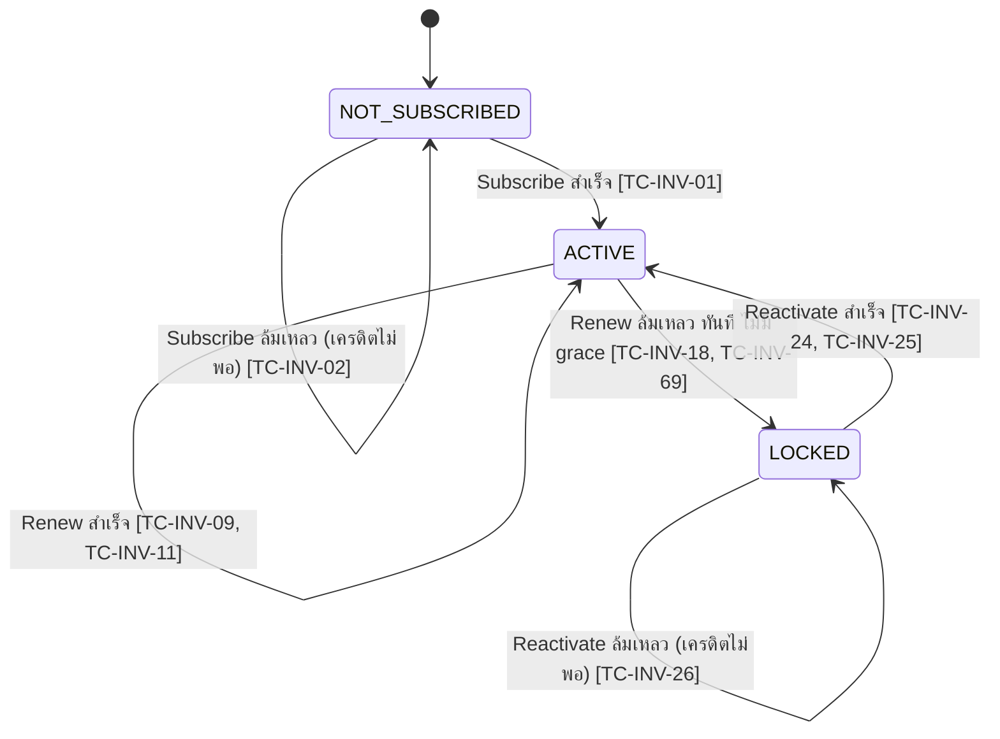
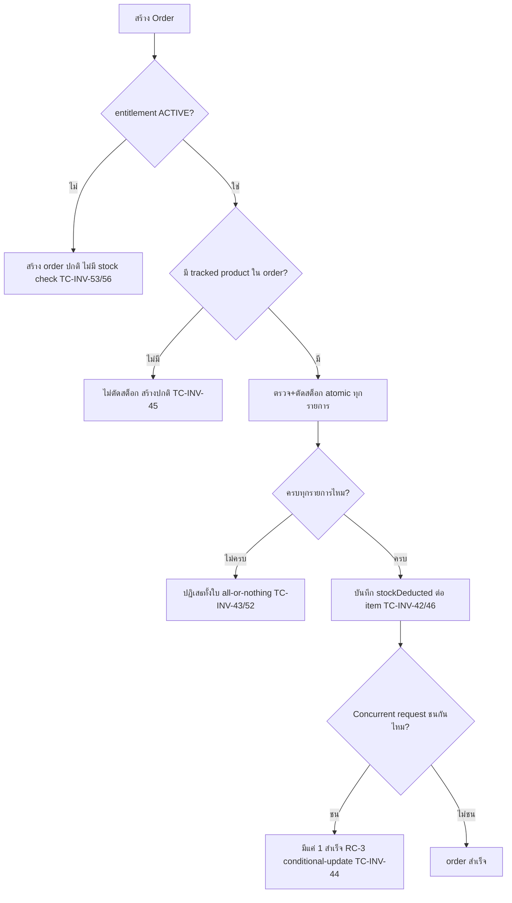

> **โมดูล:** M00003-InventoryAddon
> **ประเภทเอกสาร:** Test Case (E2E + API/Service Integration + Unit)
> **เวอร์ชัน:** 1.0
> **วันที่จัดทำ:** 2026-07-01
> **สถานะ:** Draft
> **เจ้าของเอกสาร:** QA (ดู [[Feature-Docs-Ownership]])

# Test Case: Inventory Add-on (E2E)

---

## 1. Overview

ชุดทดสอบนี้ครอบคลุม feature **Inventory Add-on (M00003)** ทั้งหมด ประกอบด้วย:

1. Subscription lifecycle (subscribe / renewal cron / advance-warning / lock / data-retention / reactivate) — FR-INV-01..06
2. Menu Gate 3 สถานะ (NOT_SUBSCRIBED / ACTIVE / LOCKED) + server-side bypass block — FR-INV-07
3. Stock management PHYSICAL-only (set/edit, opt-in tracking, atomic deduct, all-or-nothing, concurrent race, restock on cancel, hard-stop) — FR-INV-08..11
4. **Backward Compatibility Regression (blocking gate)** — FR-INV-12
5. Admin visibility ผ่านหน้า `topups/[id]` เดิม — FR-INV-13
6. Technical Debt / edge case ที่ planner+SDS เจอระหว่างออกแบบ (TD-001 shortCode retry-in-tx bug, TD-002 cron CSRF exclude, TD-003 renewal idempotent claim-before-deduct, NULL-comparison bug บน untracked product)

ประเภทการทดสอบ: Functional E2E (Playwright), API integration, Service-level integration (concurrent race / cron — ทำ E2E ตรงยาก), Unit (pure function เช่น `shouldWarnAdvance`)

**เอกสารต้นทาง:** [[BRD]] ของโมดูลนี้ — ทุก test case trace กลับ FR-INV-01..13 และ Acceptance Criteria (Given/When/Then) แบบ `[FR-INV-XX-AC-YY]`

**ขอบเขตชุดทดสอบ (Scope):**

- **In-scope:** seller subdomain (`seller.deepth.local:4000`), admin subdomain (`admin.deepth.local:4000`) หน้า `topups/[id]`, Playwright E2E, API integration (`page.request.*`), service-level integration test (concurrent deduct, cron idempotent — เรียก service function ตรงผ่าน Vitest ไม่ใช่ Playwright เพราะ concurrency ต้องควบคุม timing แม่นยำกว่า UI driver), DB persistence verify ผ่าน Prisma
- **Out-of-scope:** payment gateway จริง (reuse SellerWallet เดิม — ไม่มี payment ใหม่), Vercel Cron scheduler จริง (ทดสอบด้วยการยิง endpoint ตรงแทนรอ cron trigger), Facebook OAuth/OTP (ไม่เกี่ยวกับ feature นี้)

**สภาพแวดล้อม:**

- dev server รันที่ `http://seller.deepth.local:4000` + `http://admin.deepth.local:4000` (user รันเอง — `npm run dev -- -p 4000`)
- DB: Supabase dev (`.env.local`) — **ต้อง apply migration `add_inventory_addon_schema` ก่อนรันชุดทดสอบนี้ได้จริง** (ดู [[DATABASE]] §5)
- Playwright config: `playwright.config.ts` (baseURL `http://seller.deepth.local:4000`, workers 1, ไม่ auto-start server)
- Vitest: `npm run test` (`dotenv -e .env -- npx vitest`) สำหรับ unit/service-integration ที่ไม่ต้องใช้ browser
- Auth bypass: `e2e/helpers/auth.ts` — `createSeller('manual-complete')` (มี username+password, ใช้ login ผ่าน UI จริงได้) หรือ `createSeller('complete')` + `loginAs(context, seeded)` (cookie inject, เร็วกว่า ไม่ต้องผ่านฟอร์ม login)
- **Seed strategy ใหม่ (Prisma โดยตรง, ไม่ผ่าน UI):** ดู §5 — ฟีเจอร์นี้ต้อง seed `SellerWallet`/`InventoryEntitlement`/`Product.stockQty`/`OrderItem.stockDeducted`/`WalletTransaction.reason` ซึ่งไม่มี UI flow ให้ตั้งค่าตรง ๆ ทุกสถานะ (เช่น entitlement ที่ใกล้ครบรอบ renew, entitlement ที่เพิ่งถูกล็อก) — ต้อง seed ผ่าน `prisma` client ตรงในไฟล์ test helper ใหม่
- **admin session bypass:** ยังไม่มี helper `loginAsAdmin()` ใน `e2e/helpers/` (มีแต่ seller) — เป็น **dependency ใหม่ที่ต้องสร้างก่อนรัน TC-INV-61..63** (ดู §6)
- **cron auth:** `Authorization: Bearer {CRON_SECRET}` — ใช้ `process.env.CRON_SECRET` จาก `.env.local`; ถ้ายังไม่ตั้งค่า ให้ QA/dev ตกลง secret ทดสอบชั่วคราวก่อนรัน TC-INV-09..13/65/68

**หมายเหตุ TDD:** test case เหล่านี้เขียนก่อน implement feature (Documentation-First, Hard Rule 11) — รันได้หลัง developer สร้าง feature + migration ครบ ทุก test case ที่แตะ field/table ใหม่ = **Blocked** จนกว่า migration `add_inventory_addon_schema` จะ apply (ดู [[DATABASE]] §5.3)

---

## 2. Test Scenarios

### หมวด A — Subscribe ครั้งแรก (FR-INV-01)

---

#### TC-INV-01: Subscribe สำเร็จ — เครดิตพอ → หักอะตอมมิก + entitlement ACTIVE

- **Linked to:** `[FR-INV-01-AC-01]`
- **Precondition:** seed shop entitlement=NOT_SUBSCRIBED (ไม่มี `InventoryEntitlement` row), `SellerWallet.balance = 500`
- **ประเภท:** E2E Playwright + DB verify
- **Seed:** `seedShopWithWallet(500)` (ดู §5) — ไม่ seed entitlement
- **Steps:**
  1. `loginAs(context, seeded)` → `page.goto('/inventory')` (เห็น `InventoryGate` NOT_SUBSCRIBED)
  2. กดปุ่ม `Subscribe` (Sweet Alerts confirm) → ยืนยัน
  3. รอ toast success
  4. Query DB: `prisma.inventoryEntitlement.findUnique({ where: { shopId } })`, `prisma.walletTransaction.findFirst({ where: { walletId, reason: 'INVENTORY_SUBSCRIPTION' } })`, `prisma.sellerWallet.findUnique({ where: { shopId } })`
- **Expected Result:** HTTP 200 จาก `/api/inventory/subscribe`; `entitlement.status = 'ACTIVE'`; `entitlement.activatedAt = entitlement.currentPeriodStart`; `entitlement.nextRenewalAt ≈ now + 30d`; `WalletTransaction` DEDUCT ฿199 `reason='INVENTORY_SUBSCRIPTION'` `refId=entitlement.id`; `wallet.balance = 301`
- **Cleanup:** ลบ shop/user/wallet/entitlement ที่ seed

---

#### TC-INV-02: Subscribe เครดิตไม่พอ → ปฏิเสธทั้งก้อน ไม่หักบางส่วน + prompt top-up

- **Linked to:** `[FR-INV-01-AC-02]`
- **Precondition:** seed `SellerWallet.balance = 50` (< 199), entitlement=NOT_SUBSCRIBED
- **ประเภท:** E2E Playwright + DB verify
- **Steps:**
  1. `loginAs` → `/inventory` → กด `Subscribe` → ยืนยัน
  2. รอ error dialog/toast
  3. Query DB: `sellerWallet.balance`, `inventoryEntitlement` count
- **Expected Result:** HTTP 402 `{ error: "เครดิตไม่พอ กรุณาเติมเครดิตก่อนสมัคร" }`; error แสดง link ไปหน้า top-up เดิม; `wallet.balance` ยังเป็น 50 (ไม่ลดแม้แต่บาทเดียว); ไม่มี `InventoryEntitlement` row ถูกสร้าง

---

#### TC-INV-03: Subscribe สำเร็จ → เมนู Inventory เปลี่ยนเป็นใช้งานได้ทันที ไม่ต้อง manual refresh

- **Linked to:** `[FR-INV-01-AC-03]`
- **Precondition:** เหมือน TC-INV-01 (balance=500)
- **ประเภท:** E2E Playwright
- **Steps:**
  1. `loginAs` → `page.goto('/dashboard')` → ตรวจ sidebar เมนู "จัดการสต็อก" มี `isDisabled` class + badge `฿199/ด.`
  2. `page.goto('/inventory')` → กด Subscribe → ยืนยัน → รอ toast success (component เรียก `router.refresh()` เอง ไม่ใช่ `page.reload()`)
  3. ตรวจ sidebar อีกครั้งโดย**ไม่เรียก** `page.reload()`
- **Expected Result:** หลัง toast success เมนูไม่มี `isDisabled`/badge อีกต่อไป (RSC re-render จาก `router.refresh()`); ไม่ต้อง F5 เอง

---

#### TC-INV-04: Subscribe ไม่มี proration — เริ่มรอบ 30 วันเต็มไม่ว่ากดวันไหนของเดือน

- **Linked to:** `[FR-INV-01-AC-04]`
- **Precondition:** seed 2 shop ที่ balance เพียงพอ
- **ประเภท:** Service integration (Vitest) + DB verify
- **Steps:**
  1. เรียก `subscribeInventoryEntitlement(shopIdA)` วันที่ 1 ของเดือน (mock `Date.now()` หรือรันจริงแล้วเทียบ delta)
  2. เรียก `subscribeInventoryEntitlement(shopIdB)` วันที่ 28 ของเดือน (mock เวลา)
  3. เปรียบเทียบ `nextRenewalAt - currentPeriodStart` ของทั้งสอง
- **Expected Result:** ทั้งสอง shop ได้ `nextRenewalAt - currentPeriodStart = 30 วันเป๊ะ` ไม่ว่าจะ subscribe วันไหน (ไม่มี pro-rate ตาม calendar month)

---

#### TC-INV-05: Subscribe ซ้ำขณะ ACTIVE → 409

- **Linked to:** API.md `ENTITLEMENT_ALREADY_EXISTS` (นอกเหนือ BRD AC ตรง — supplementary technical contract)
- **Precondition:** seed entitlement=ACTIVE อยู่แล้ว
- **ประเภท:** API integration
- **Steps:**
  1. `loginAs` → `page.request.post('/api/inventory/subscribe')`
- **Expected Result:** HTTP 409 `{ error: "สมัครใช้งานอยู่แล้ว" }`; ไม่มี `WalletTransaction` ใหม่ถูกสร้าง

---

#### TC-INV-06: Subscribe ขณะ LOCKED → 409 (ไม่ใช่ reactivate)

- **Linked to:** API.md `ENTITLEMENT_ALREADY_EXISTS`
- **Precondition:** seed entitlement=LOCKED
- **ประเภท:** API integration
- **Steps:**
  1. `loginAs` → `page.request.post('/api/inventory/subscribe')`
- **Expected Result:** HTTP 409 (มี row อยู่แล้วไม่ว่า status ใด — ต้องใช้ `/reactivate` แทน)

---

#### TC-INV-07: Subscribe ไม่มี Origin header → 403

- **Linked to:** Cross-cutting NFR-2.2 (CSRF)
- **Precondition:** ไม่ต้อง login ก็ได้ (CSRF เช็คก่อน auth)
- **ประเภท:** API integration
- **Steps:**
  1. POST `/api/inventory/subscribe` ไม่ส่ง `Origin` header
- **Expected Result:** HTTP 403

---

#### TC-INV-08: Subscribe ไม่มี session → 401

- **Linked to:** Cross-cutting auth
- **Precondition:** ไม่มี session cookie
- **ประเภท:** API integration
- **Steps:**
  1. POST `/api/inventory/subscribe` พร้อม Origin แต่ไม่มี cookie
- **Expected Result:** HTTP 401 `{ error: "unauthorized" }`

---

### หมวด B — Renewal อัตโนมัติ (FR-INV-02)

---

#### TC-INV-09: Cron renewal — ถึงรอบ + เครดิตพอ → หักสำเร็จ + entitlement ยัง ACTIVE + รอบใหม่เริ่มนับ

- **Linked to:** `[FR-INV-02-AC-01]`, `[FR-INV-02-AC-02]`
- **Precondition:** seed entitlement `status=ACTIVE`, `nextRenewalAt = now - 1 hour` (ถึงรอบแล้ว), `SellerWallet.balance = 500`
- **ประเภท:** API integration (เรียก cron endpoint ตรง)
- **Steps:**
  1. POST `/api/cron/inventory-renewal` พร้อม `Authorization: Bearer {CRON_SECRET}`
  2. Query DB: `inventoryEntitlement`, `walletTransaction`, `sellerWallet.balance`
- **Expected Result:** response `{ processed:1, renewed:1, locked:0, errors:0 }`; `entitlement.status='ACTIVE'`; `entitlement.lastRenewalAt ≈ now`; `entitlement.currentPeriodStart ≈ now`; `entitlement.nextRenewalAt ≈ now + 30d`; `WalletTransaction` DEDUCT ใหม่ `reason='INVENTORY_SUBSCRIPTION'`; `wallet.balance = 301`

---

#### TC-INV-10: Cron renewal ประมวลผลครบทุก Shop ที่ถึงรอบ ไม่ตกหล่น

- **Linked to:** `[FR-INV-02-AC-03]`
- **Precondition:** seed 5 shop ที่ `status=ACTIVE, nextRenewalAt<=now` (balance ผสม: 3 shop พอ, 2 shop ไม่พอ) + 2 shop ที่ `nextRenewalAt` ยังไม่ถึง (ไม่ควรถูกแตะ)
- **ประเภท:** API integration + DB verify
- **Steps:**
  1. POST `/api/cron/inventory-renewal`
  2. Query DB entitlement ทั้ง 7 shop
- **Expected Result:** response `{ processed:5, renewed:3, locked:2, errors:0 }`; 2 shop ที่ยังไม่ถึงรอบ **ไม่ถูกแตะเลย** (`updatedAt` ไม่เปลี่ยน)

---

#### TC-INV-11: Cron renewal idempotent — รันซ้ำวันเดียวกัน ไม่หักซ้ำสอง

- **Linked to:** `[FR-INV-02-AC-04]`
- **Precondition:** seed entitlement ถึงรอบ + เครดิตพอ (500)
- **ประเภท:** API integration + DB verify
- **Steps:**
  1. POST `/api/cron/inventory-renewal` ครั้งที่ 1 → ตรวจ `wallet.balance = 301`
  2. POST `/api/cron/inventory-renewal` ครั้งที่ 2 ทันที (จำลอง retry/double-trigger เดียวกันในวันนั้น)
  3. Query DB `wallet.balance`, จำนวน `WalletTransaction` ที่ `reason='INVENTORY_SUBSCRIPTION'`
- **Expected Result:** ครั้งที่ 2 response แสดง shop นี้เป็น `SKIPPED` (คำนวณจาก `processed-renewed-locked-errors`); `wallet.balance` ยังคง 301 (ไม่ลดเป็น 102); มี `WalletTransaction` DEDUCT รายการเดียวเท่านั้นจากรอบนี้

---

#### TC-INV-12: Cron auth ผิด/ไม่มี CRON_SECRET → 401 ไม่แตะ DB

- **Linked to:** API.md §4.3 errors
- **Precondition:** seed entitlement ถึงรอบพร้อมหัก
- **ประเภท:** API integration
- **Steps:**
  1. POST `/api/cron/inventory-renewal` ไม่ส่ง header หรือส่ง secret ผิด
  2. Query DB entitlement/wallet
- **Expected Result:** HTTP 401; entitlement/wallet **ไม่เปลี่ยนแปลงเลย** (guard ก่อนแตะ DB)

---

#### TC-INV-13 (TD-002): Cron endpoint ไม่มี Origin header + CRON_SECRET ถูกต้อง → ผ่าน CSRF (200)

- **Linked to:** SDS TD-002 (`guardApi`/`proxy.ts` ต้อง exclude `/api/cron/*`)
- **Precondition:** seed entitlement ถึงรอบ; **ไม่ส่ง** `Origin` header (จำลอง Vercel Cron caller จริงที่ไม่มี browser Origin)
- **ประเภท:** API integration — **regression gate สำคัญ** (ถ้า fail = cron ใช้งานจริงไม่ได้เลยบน prod)
- **Steps:**
  1. POST `/api/cron/inventory-renewal` พร้อม `Authorization: Bearer {CRON_SECRET}` แต่**ไม่ใส่** `Origin`/`Referer` header ใด ๆ
- **Expected Result:** HTTP ไม่ใช่ 403 (ต้องผ่าน CSRF Origin-check เพราะ `proxy.ts` exclude `/api/cron/*`); ดำเนินการ renewal ปกติต่อ (200 พร้อม stats)

---

### หมวด C — แจ้งเตือนล่วงหน้า (FR-INV-03)

---

#### TC-INV-14: เหลือ 3 วันก่อน renew + เครดิต < 199 → banner แจ้งเตือนพร้อมจำนวนที่ขาด+วันที่

- **Linked to:** `[FR-INV-03-AC-01]`, `[FR-INV-03-AC-03]`
- **Precondition:** seed entitlement `status=ACTIVE`, `nextRenewalAt = now + 3 days`, `SellerWallet.balance = 50`
- **ประเภท:** E2E Playwright
- **Steps:**
  1. `loginAs` → `page.goto('/inventory')`
  2. ตรวจ `AdvanceWarningBanner` visible
  3. ตรวจข้อความระบุ `shortfall = 199-50 = 149` และวันที่ `nextRenewalAt` (format ตาม `formatDate.ts` — พ.ศ.)
- **Expected Result:** banner render พร้อมข้อความ "เครดิตอาจไม่พอสำหรับรอบต่ออายุวันที่ {nextRenewalAt} (ขาดอีก ฿149)" หรือ equivalent

---

#### TC-INV-15: เตือนแล้ว top-up ทันจนเครดิตพอก่อนถึงรอบ → renew สำเร็จปกติไม่ล็อก

- **Linked to:** `[FR-INV-03-AC-02]`
- **Precondition:** seed entitlement `nextRenewalAt = now - 1h` (ถึงรอบแล้ว), balance เดิม 50 → top-up เป็น 300 ก่อนรัน cron
- **ประเภท:** API integration + DB verify
- **Steps:**
  1. Prisma อัปเดต `SellerWallet.balance = 300` (จำลอง top-up สำเร็จ)
  2. POST `/api/cron/inventory-renewal`
  3. Query DB entitlement/wallet
- **Expected Result:** `renewed:1, locked:0`; `entitlement.status` ยังคง `ACTIVE`; `wallet.balance = 101`

---

#### TC-INV-16: เครดิตพอ (≥199) แม้ใกล้ renew → banner ไม่แสดง

- **Linked to:** FR-INV-03 (negative — ไม่ over-warn)
- **Precondition:** seed `nextRenewalAt = now + 2 days`, `balance = 500`
- **ประเภท:** E2E Playwright
- **Steps:**
  1. `loginAs` → `/inventory`
  2. ตรวจ `AdvanceWarningBanner` ไม่ปรากฏ
- **Expected Result:** ไม่มี banner render

---

#### TC-INV-17: ยังเหลือ >3 วันก่อน renew แม้เครดิตน้อย → banner ไม่แสดง (ยังไม่ถึงช่วงเตือน)

- **Linked to:** FR-INV-03 (negative — boundary)
- **Precondition:** seed `nextRenewalAt = now + 5 days`, `balance = 50`
- **ประเภท:** Unit (`shouldWarnAdvance` pure function) + E2E สนับสนุน
- **Steps:**
  1. เรียก `shouldWarnAdvance({status:'ACTIVE', nextRenewalAt: now+5d}, 50)` โดยตรง
  2. (สนับสนุน) `loginAs` → `/inventory` → ตรวจไม่มี banner
- **Expected Result:** คืน `false`; ไม่มี banner UI

---

### หมวด D — Lock ทันทีไม่มี Grace Period (FR-INV-04)

---

#### TC-INV-18: Renewal ล้มเหลว (เครดิตไม่พอ) → LOCKED ทันที ไม่หักบางส่วน/ไม่หักติดลบ

- **Linked to:** `[FR-INV-04-AC-01]`
- **Precondition:** seed entitlement `status=ACTIVE`, `nextRenewalAt=now-1h`, `SellerWallet.balance=50`
- **ประเภท:** API integration + DB verify
- **Steps:**
  1. POST `/api/cron/inventory-renewal`
  2. Query DB entitlement/wallet
- **Expected Result:** response `locked:1`; `entitlement.status='LOCKED'`; `entitlement.lockedAt ≈ now`; `wallet.balance` ยังคง 50 (ไม่ถูกหักแม้บางส่วน ไม่ติดลบ)

---

#### TC-INV-19: Entitlement เปลี่ยนเป็น LOCKED → แจ้งเตือน Seller ทันที

- **Linked to:** `[FR-INV-04-AC-02]`
- **Precondition:** เหมือน TC-INV-18
- **ประเภท:** E2E Playwright + DB/notification verify
- **Steps:**
  1. รัน cron renewal ให้ shop นี้ถูก LOCKED
  2. `loginAs` → `page.goto('/dashboard')` หรือ `/inventory`
  3. ตรวจว่ามีข้อความ/banner "ถูกล็อกเพราะเครดิตไม่พอ" แสดงให้ seller เห็น (Notification bell/banner ตามกลไกที่ dev เลือก — verify ว่ามีช่องทางแจ้งจริง ไม่ใช่ silent state change)
- **Expected Result:** seller เห็นข้อความล็อกเมื่อ login ครั้งถัดไป (ผ่าน `InventoryGate` LOCKED state เป็นอย่างน้อย — ดู TC-INV-30/33)

---

#### TC-INV-20: ไม่มี grace period ในทุกกรณี — order ที่สร้างทันทีหลังถูกล็อกในรอบเดียวกันไม่ตัดสต็อกอีกต่อไป

- **Linked to:** `[FR-INV-04-AC-03]`
- **Precondition:** seed entitlement ที่กำลังจะถูกล็อก (balance ไม่พอ) + tracked product `stockQty=5`
- **ประเภท:** API integration + DB verify
- **Steps:**
  1. รัน cron ให้ shop ถูก LOCKED (TC-INV-18 flow)
  2. ทันทีหลังจากนั้น `page.request.post('/api/orders', { items: [{productId, qty:2}], ... })`
  3. Query DB `product.stockQty`
- **Expected Result:** order สร้างสำเร็จ (เหมือนไม่มี feature นี้); `product.stockQty` ยังคง 5 (ไม่ถูกตัด) — ยืนยันว่าไม่มี state ใดให้ stock check ทำงานต่อระหว่างเครดิตไม่พอ

---

### หมวด E — เก็บข้อมูลสต็อกไว้เมื่อ Lock (FR-INV-05)

---

#### TC-INV-21: Entitlement เปลี่ยนเป็น LOCKED → stockQty ทุก Product ยังคงค่าเดิม

- **Linked to:** `[FR-INV-05-AC-01]`
- **Precondition:** seed entitlement ACTIVE + 3 product tracked (`stockQty` = 10, 0, 25)
- **ประเภท:** API integration + DB verify
- **Steps:**
  1. รัน cron ให้ entitlement นี้ถูก LOCKED
  2. Query DB `product.stockQty` ทั้ง 3 ตัว
- **Expected Result:** `stockQty` ทั้ง 3 ตัวยังเป็น 10, 0, 25 เป๊ะ — ไม่มีการ reset/ลบ

---

#### TC-INV-22: LOCKED + order สินค้าเคย track → ไม่ตัดสต็อกไม่บล็อก order (เหมือน FR-INV-12)

- **Linked to:** `[FR-INV-05-AC-02]`
- **Precondition:** seed entitlement LOCKED, product `stockQty=0` (หมดสต็อกจากตอน ACTIVE)
- **ประเภท:** API integration + DB verify
- **Steps:**
  1. `page.request.post('/api/orders', { items: [{productId, qty:1}] })`
  2. Query DB `order` + `product.stockQty`
- **Expected Result:** HTTP 200/201 order สร้างสำเร็จ (ไม่ถูก hard-stop แม้ `stockQty=0`); `product.stockQty` ยังคง 0 (ไม่เปลี่ยน — ไม่มีการ deduct)

---

#### TC-INV-23: Query จำนวนสต็อกระหว่าง LOCKED ผ่าน internal service → ค่าตรงกับก่อนถูกล็อกเป๊ะ

- **Linked to:** `[FR-INV-05-AC-03]`
- **Precondition:** เหมือน TC-INV-21 (stockQty = 10, 0, 25 ก่อนล็อก)
- **ประเภท:** Service integration
- **Steps:**
  1. รัน cron ให้ล็อก
  2. เรียก service ภายใน (เช่น `getProductsByShop`/query ตรง) อ่าน `stockQty` ของทั้ง 3 product
- **Expected Result:** ค่าที่ได้ = 10, 0, 25 (ไม่ใช่ `null`/default 0 โดยไม่ตั้งใจ)

---

### หมวด F — Reactivate (FR-INV-06)

---

#### TC-INV-24: Reactivate สำเร็จ — หักเครดิตอะตอมมิก + ACTIVE ทันที + รอบใหม่เริ่มนับจากตอนนี้

- **Linked to:** `[FR-INV-06-AC-01]`
- **Precondition:** seed entitlement `status=LOCKED`, `lockedAt` = 10 วันก่อน, `activatedAt` = 40 วันก่อน (fixed marker), `SellerWallet.balance = 350`
- **ประเภท:** E2E Playwright + DB verify
- **Steps:**
  1. `loginAs` → `/inventory` (เห็น `InventoryGate` LOCKED state)
  2. กดปุ่ม `Reactivate` → ยืนยัน
  3. Query DB `inventoryEntitlement`, `walletTransaction`, `sellerWallet.balance`
- **Expected Result:** `entitlement.status='ACTIVE'`; `entitlement.lockedAt=null`; `entitlement.currentPeriodStart≈now` (ไม่ใช่ต่อจาก `nextRenewalAt` เดิม); `entitlement.nextRenewalAt≈now+30d`; **`entitlement.activatedAt` = 40 วันก่อน ไม่เปลี่ยน** (DATABASE.md §3.1 — marker วันสมัครเดิม ห้ามแตะตอน reactivate; regression guard สำหรับ bug ที่ SRS/SDS pseudocode เคยมี `activatedAt: now`); `WalletTransaction` DEDUCT ใหม่ `reason='INVENTORY_SUBSCRIPTION'`; `wallet.balance=151`

---

#### TC-INV-25: Reactivate สำเร็จ → เห็นจำนวนสต็อกทุก Product ตรงกับก่อนถูกล็อกทุกตัว

- **Linked to:** `[FR-INV-06-AC-02]`
- **Precondition:** seed entitlement LOCKED, 3 product tracked (10, 0, 25), balance เพียงพอ
- **ประเภท:** E2E Playwright
- **Steps:**
  1. `loginAs` → `/inventory` → กด Reactivate → ยืนยัน
  2. หลังสำเร็จ → ตรวจ `InventoryManagementTable` แสดง `stockQty` 3 แถว
- **Expected Result:** ตารางแสดง 10, 0, 25 ตรงกับก่อนล็อกทุกตัว

---

#### TC-INV-26: Reactivate เครดิตไม่พอ → ปฏิเสธ + prompt top-up (ยังคง LOCKED)

- **Linked to:** `[FR-INV-06-AC-03]`
- **Precondition:** seed entitlement LOCKED, `balance=50`
- **ประเภท:** E2E Playwright + DB verify
- **Steps:**
  1. `loginAs` → `/inventory` → กด Reactivate → ยืนยัน
  2. Query DB `entitlement.status`, `wallet.balance`
- **Expected Result:** HTTP 402 `{ error: "เครดิตไม่พอ กรุณาเติมเครดิตก่อนเปิดใช้อีกครั้ง" }`; `entitlement.status` ยังคง `LOCKED`; `wallet.balance` ยังคง 50

---

#### TC-INV-27: Reactivate ขณะไม่ LOCKED (ACTIVE หรือไม่มี row) → 409

- **Linked to:** API.md `ENTITLEMENT_NOT_LOCKED`
- **Precondition:** seed entitlement `status=ACTIVE` (หรือไม่มี row เลย)
- **ประเภท:** API integration
- **Steps:**
  1. `page.request.post('/api/inventory/reactivate')`
- **Expected Result:** HTTP 409 `{ error: "บัญชีนี้ไม่ได้ถูกล็อก" }`

---

#### TC-INV-28: ไม่มี auto-retry หลัง top-up โดยไม่มี action จาก Seller

- **Linked to:** `[FR-INV-06-AC-04]`
- **Precondition:** seed entitlement LOCKED, `balance=50` → top-up เป็น 300 (ผ่าน Prisma โดยตรง จำลอง top-up สำเร็จ) แต่ **ไม่กด** Reactivate
- **ประเภท:** Service integration + code review
- **Steps:**
  1. top-up ให้ balance=300
  2. รอ (จำลองเวลาผ่านไปหลายชั่วโมง — ไม่ต้อง sleep จริง แค่ query ทันที เพราะไม่มี background job ให้รอ)
  3. Query DB `entitlement.status`
  4. Grep source: ยืนยันไม่มี cron/job อื่นใดนอกจาก `inventory-renewal` (ซึ่งไม่ครอบคลุม LOCKED shop) ที่ auto-reactivate
- **Expected Result:** `entitlement.status` ยังคง `LOCKED` แม้เครดิตพอแล้ว — ต้องมี explicit action (`POST /api/inventory/reactivate`) เท่านั้นที่เปลี่ยนสถานะ

---

### หมวด G — Menu Gate 3 สถานะ (FR-INV-07)

---

#### TC-INV-29: NOT_SUBSCRIBED — เมนู Inventory แสดงเสมอ disabled + prompt "เปิดใช้จัดการสต็อก ฿199/เดือน"

- **Linked to:** `[FR-INV-07-AC-01]`
- **Precondition:** seed shop ไม่มี `InventoryEntitlement` row
- **ประเภท:** E2E Playwright
- **Steps:**
  1. `loginAs` → `page.goto('/dashboard')`
  2. ตรวจ sidebar เมนู "จัดการสต็อก" visible + มี badge/prompt `฿199/ด.`
- **Expected Result:** เมนูปรากฏเสมอ (ไม่ซ่อน); มี disabled indicator + prompt ข้อความ subscribe

---

#### TC-INV-30: LOCKED — เมนู disabled พร้อม prompt ต่างจาก NOT_SUBSCRIBED (ระบุถูกล็อก + CTA reactivate)

- **Linked to:** `[FR-INV-07-AC-02]`
- **Precondition:** seed entitlement LOCKED
- **ประเภท:** E2E Playwright
- **Steps:**
  1. `loginAs` → `/dashboard`
  2. ตรวจ sidebar เมนู "จัดการสต็อก" มี badge `ถูกล็อก` (className `bg-danger`) — **ต่างจาก** badge `฿199/ด.` ของ NOT_SUBSCRIBED
- **Expected Result:** ข้อความ/badge ระบุ "ถูกล็อก" ชัดเจน แยกจาก prompt ของ NOT_SUBSCRIBED

---

#### TC-INV-31: ACTIVE — เมนูใช้งานได้ปกติ ไม่มี prompt

- **Linked to:** `[FR-INV-07-AC-03]`
- **Precondition:** seed entitlement ACTIVE
- **ประเภท:** E2E Playwright
- **Steps:**
  1. `loginAs` → `/dashboard`
  2. ตรวจเมนู "จัดการสต็อก" ไม่มี `isDisabled`/badge; คลิกได้ปกติ
- **Expected Result:** เมนูใช้งานได้เต็ม; คลิกแล้วเข้า `/inventory` แสดงเนื้อหาจริง

---

#### TC-INV-32: Bypass URL `/inventory` ตรง ๆ ขณะ NOT_SUBSCRIBED → block server-side ไม่ leak stock data

- **Linked to:** `[FR-INV-07-AC-04]`
- **Precondition:** seed shop ไม่มี entitlement row + มี product tracked อยู่ก่อนหน้า (สมมติเคย subscribe historical data — เพื่อพิสูจน์ว่าไม่ leak)
- **ประเภท:** E2E Playwright + network response verify
- **Steps:**
  1. `loginAs` → `page.goto('/inventory')` โดยตรง (ไม่ผ่านเมนู)
  2. ตรวจ response HTML/RSC payload ว่า**ไม่มี** ชื่อ product หรือ `stockQty` ปรากฏที่ใดในหน้า/flight data
  3. ตรวจว่า render เป็น `InventoryGate` (pricing card) ไม่ใช่ `InventoryManagementTable`
- **Expected Result:** แสดง `InventoryGate` เท่านั้น; ไม่มี product data ใด ๆ ถูก query/serialize ออกมา (grep `list_network_requests`/page content ไม่พบชื่อสินค้า)

---

#### TC-INV-33: Bypass URL `/inventory` ตรง ๆ ขณะ LOCKED → block server-side เดียวกัน แสดง lockedAt

- **Linked to:** `[FR-INV-07-AC-04]`
- **Precondition:** seed entitlement LOCKED + product tracked
- **ประเภท:** E2E Playwright
- **Steps:**
  1. `loginAs` → `page.goto('/inventory')` โดยตรง
  2. ตรวจแสดง `InventoryGate` LOCKED state พร้อม `lockedAt` (formatDateTime พ.ศ.)
  3. ตรวจไม่มี product data leak (เหมือน TC-INV-32)
- **Expected Result:** แสดง gate + `lockedAt`; ไม่มี stock data leak

---

#### TC-INV-34: `getEntitlementStatus` throw error → fail-closed เป็น NOT_SUBSCRIBED ไม่ crash

- **Linked to:** SDS TFR-007 (fail-closed) — สนับสนุน FR-INV-07-AC-04
- **Precondition:** mock/force `getEntitlementStatus` ให้ throw (เช่น DB connection error ชั่วคราว)
- **ประเภท:** Service integration / code review
- **Steps:**
  1. mock service throw
  2. `loginAs` → `page.goto('/inventory')`
- **Expected Result:** ไม่ crash (500); fallback แสดง `InventoryGate` NOT_SUBSCRIBED (fail-closed ปลอดภัยกว่า fail-open)

---

### หมวด H — ตั้ง/แก้จำนวนสต็อก (FR-INV-08)

---

#### TC-INV-35: ACTIVE + Product PHYSICAL → field "จำนวนสต็อก" ปรากฏ

- **Linked to:** `[FR-INV-08-AC-01]`
- **Precondition:** seed entitlement ACTIVE
- **ประเภท:** E2E Playwright
- **Steps:**
  1. `loginAs` → `page.goto('/products/new-v2')` (หรือหน้าแก้ product PHYSICAL ที่มีอยู่)
  2. ตรวจ field "จำนวนสต็อก" (`ProductStockCardV2`) visible พร้อม toggle "ติดตามสต็อก"
- **Expected Result:** field ปรากฏ; toggle ควบคุม null↔0 ได้

---

#### TC-INV-36: Product type ≠ PHYSICAL → ไม่มี field จำนวนสต็อกเลย ไม่ว่า entitlement เป็นสถานะใด

- **Linked to:** `[FR-INV-08-AC-02]`
- **Precondition:** seed entitlement ACTIVE; เปิดหน้าสร้าง product type=DIGITAL/SERVICE/SUBSCRIPTION
- **ประเภท:** E2E Playwright
- **Steps:**
  1. เลือก type = DIGITAL ในฟอร์มสร้าง product
  2. ตรวจว่า field จำนวนสต็อกไม่ปรากฏ
  3. ทำซ้ำกับ SERVICE, SUBSCRIPTION
- **Expected Result:** ทั้ง 3 type ไม่มี field จำนวนสต็อกปรากฏเลย

---

#### TC-INV-37: ไม่กรอกจำนวนสต็อก (ปล่อยว่าง) → Product untracked แม้ entitlement ACTIVE

- **Linked to:** `[FR-INV-08-AC-03]`
- **Precondition:** seed entitlement ACTIVE
- **ประเภท:** E2E Playwright + DB verify
- **Steps:**
  1. สร้าง Product PHYSICAL ใหม่ ไม่แตะ toggle "ติดตามสต็อก" (ปล่อย default off/ว่าง)
  2. บันทึก
  3. Query DB `product.stockQty`
- **Expected Result:** `stockQty = null` (untracked); ไม่มีการตัด/บล็อกสต็อกกับสินค้านี้ในอนาคต

---

#### TC-INV-38: กรอกจำนวนสต็อกเป็นจำนวนเต็ม ≥0 → Product กลายเป็น tracked

- **Linked to:** `[FR-INV-08-AC-04]`
- **Precondition:** seed entitlement ACTIVE
- **ประเภท:** E2E Playwright + DB verify
- **Steps:**
  1. เปิด toggle "ติดตามสต็อก" → กรอก `stockQty = 15`
  2. บันทึก
  3. Query DB `product.stockQty`
- **Expected Result:** `stockQty = 15`

---

#### TC-INV-39: กรอกค่าติดลบ/ทศนิยม → ฟอร์มปฏิเสธ (client validation)

- **Linked to:** `[FR-INV-08-AC-05]`
- **Precondition:** เหมือน TC-INV-38 อยู่ที่ฟอร์ม product
- **ประเภท:** E2E Playwright
- **Steps:**
  1. กรอก `stockQty = -5` → ตรวจ inline error
  2. กรอก `stockQty = 3.5` → ตรวจ inline error
- **Expected Result:** ทั้ง 2 กรณีถูกปฏิเสธที่ฟอร์ม (ไม่ submit); error message ระบุต้องเป็นจำนวนเต็มไม่ติดลบ

---

#### TC-INV-40: API `POST/PATCH /api/products*` — stockQty ส่งมาแต่ type ≠ PHYSICAL → 400

- **Linked to:** API.md §4.4/4.5 `STOCK_QTY_INVALID_PRODUCT_TYPE`
- **Precondition:** entitlement ACTIVE
- **ประเภท:** API integration
- **Steps:**
  1. POST `/api/products` `{ name, price, type: "DIGITAL", stockQty: 5 }`
- **Expected Result:** HTTP 400 `{ error: "STOCK_QTY_INVALID_PRODUCT_TYPE" }`

---

#### TC-INV-41: API `POST/PATCH /api/products*` — stockQty ส่งมาแต่ entitlement ≠ ACTIVE → 403

- **Linked to:** API.md §4.4/4.5 `INVENTORY_NOT_ACTIVE`
- **Precondition:** entitlement NOT_SUBSCRIBED หรือ LOCKED
- **ประเภท:** API integration
- **Steps:**
  1. POST `/api/products` `{ name, price, type: "PHYSICAL", stockQty: 5 }`
- **Expected Result:** HTTP 403 `{ error: "INVENTORY_NOT_ACTIVE" }`; ไม่มี product ถูกสร้าง (หรือ implementation อาจสร้างแบบไม่มี stockQty — ยืนยัน behavior จริงตอน implement แล้วปรับ TC นี้)

---

### หมวด I — ตัดสต็อกอัตโนมัติตอนสร้าง Order (FR-INV-09)

---

#### TC-INV-42: ACTIVE + tracked product สต็อกพอ → ตัดสต็อก atomic ตอนสร้าง order

- **Linked to:** `[FR-INV-09-AC-01]`
- **Precondition:** seed entitlement ACTIVE, product tracked `stockQty=10`
- **ประเภท:** API integration + DB verify
- **Steps:**
  1. POST `/api/orders` `{ items: [{productId, name, qty:3, price}], type:"PHYSICAL", ... }`
  2. Query DB `product.stockQty`, `orderItem.stockDeducted`
- **Expected Result:** order สร้างสำเร็จ; `product.stockQty = 7`; `orderItem.stockDeducted = 3`

---

#### TC-INV-43: Multi-item order — 1 รายการสต็อกไม่พอ → ปฏิเสธทั้งใบ (all-or-nothing)

- **Linked to:** `[FR-INV-09-AC-02]`
- **Precondition:** seed entitlement ACTIVE, product A `stockQty=10` (พอ), product B `stockQty=1` (ต้องการ 5 — ไม่พอ)
- **ประเภท:** API integration + DB verify
- **Steps:**
  1. POST `/api/orders` `{ items: [{productA, qty:2}, {productB, qty:5}] }`
  2. Query DB `product A.stockQty`, `product B.stockQty`, จำนวน order/orderItem ที่ถูกสร้าง
- **Expected Result:** HTTP 400 `{ error: "สินค้าหมดสต็อก: {ชื่อ product B}" }`; **ไม่มี order/orderItem ใดถูกสร้างเลย**; `product A.stockQty` ยังคง 10 (ไม่ถูกตัดแม้จะพอ — rollback ทั้ง transaction)

---

#### TC-INV-44 (สำคัญที่สุด — Race Condition): Concurrent 2 order แย่งสต็อกชิ้นสุดท้าย → มีแค่ 1 สำเร็จ

- **Linked to:** `[FR-INV-09-AC-03]`
- **Precondition:** seed entitlement ACTIVE, product tracked `stockQty=1`
- **ประเภท:** **Service integration (Vitest)** — ทำ E2E ผ่าน UI ยาก เพราะต้องควบคุม timing ให้สอง request ชนกันจริง
- **Steps:**
  1. เรียก `createOrder(shopId, { items:[{productId, qty:1}] })` 2 ครั้งพร้อมกันด้วย `Promise.allSettled([...])` (ไม่ await ทีละอัน)
  2. ตรวจผลลัพธ์ทั้งสอง promise
  3. Query DB `product.stockQty`, จำนวน order ที่ถูกสร้างจริง
- **Expected Result:** มีเพียง 1 promise สำเร็จ (order ถูกสร้าง), อีก 1 promise reject ด้วย `OutOfStockError`/HTTP 400; `product.stockQty = 0` สุดท้าย (ไม่ติดลบ, ไม่ใช่ตัดสองครั้ง); ยืนยันด้วย atomic conditional-update pattern (`updateMany WHERE stockQty >= needed`) เดียวกับ `wallet.service.deductCredit` (RC-3)
- **หมายเหตุ:** รันซ้ำ ≥10 รอบเพื่อลด flakiness (race condition อาจไม่ reproduce ทุกครั้งถ้า DB connection pool/latency ต่างกัน)

---

#### TC-INV-45: Order มีเฉพาะสินค้า untracked → ไม่มีการตัดสต็อกใด ๆ สร้าง order สำเร็จปกติ

- **Linked to:** `[FR-INV-09-AC-04]`
- **Precondition:** seed entitlement ACTIVE, product `stockQty=null` (untracked)
- **ประเภท:** API integration + DB verify
- **Steps:**
  1. POST `/api/orders` `{ items: [{productId, qty:5}] }`
  2. Query DB `product.stockQty`, `orderItem.stockDeducted`
- **Expected Result:** order สร้างสำเร็จ; `product.stockQty` ยังคง `null`; `orderItem.stockDeducted = null`

---

#### TC-INV-46: Order สำเร็จที่ตัดสต็อกจริง → บันทึก `OrderItem.stockDeducted` ถูกต้องระดับ item

- **Linked to:** `[FR-INV-09-AC-05]`
- **Precondition:** seed entitlement ACTIVE, 2 tracked product (`stockQty=10`, `stockQty=20`)
- **ประเภท:** API integration + DB verify
- **Steps:**
  1. POST `/api/orders` `{ items: [{productA, qty:3}, {productB, qty:7}] }`
  2. Query DB `orderItem` ทั้ง 2 แถว
- **Expected Result:** `orderItem[productA].stockDeducted = 3`; `orderItem[productB].stockDeducted = 7` (ตรงกับ `qty` เสมอเพราะ all-or-nothing ไม่มี partial)

---

### หมวด J — คืนสต็อกอัตโนมัติเมื่อ Cancel (FR-INV-10)

---

#### TC-INV-47: Cancel order ที่เคยตัดสต็อก → คืนสต็อกเท่ากับที่ตัดไปทันที

- **Linked to:** `[FR-INV-10-AC-01]`
- **Precondition:** seed order ที่มี `orderItem.stockDeducted=3`, product `stockQty=7` (หลังตัดจาก 10)
- **ประเภท:** API integration + DB verify
- **Steps:**
  1. `page.request.post('/api/orders/{token}/cancel')`
  2. Query DB `product.stockQty`
- **Expected Result:** order.status = CANCELLED; `product.stockQty = 10` (คืนกลับ +3)

---

#### TC-INV-48: Cancel order ระหว่าง entitlement เปลี่ยนเป็น LOCKED แล้ว → ยังคืนสต็อกครบ (ไม่ขึ้นกับ entitlement ปัจจุบัน)

- **Linked to:** `[FR-INV-10-AC-02]`
- **Precondition:** seed order ที่เคยตัดสต็อกตอน ACTIVE (`stockDeducted=1`), แล้วเปลี่ยน entitlement เป็น LOCKED ภายหลัง (ตรง BRD Scenario 4)
- **ประเภท:** API integration + DB verify
- **Steps:**
  1. เปลี่ยน entitlement เป็น LOCKED (ผ่าน cron หรือ Prisma ตรง)
  2. Cancel order นี้
  3. Query DB `product.stockQty`
- **Expected Result:** คืนสต็อก +1 สำเร็จแม้ entitlement ปัจจุบันเป็น LOCKED (ไม่ short-circuit ข้าม restock เพราะ entitlement)

---

#### TC-INV-49: Cancel order ที่ไม่เคยตัดสต็อก (untracked หรือสร้างตอนไม่ ACTIVE) → ไม่มีการคืนสต็อกใด ๆ

- **Linked to:** `[FR-INV-10-AC-03]`
- **Precondition:** seed order ที่ `orderItem.stockDeducted=null` ทุกรายการ; product `stockQty` คงที่ (เช่น 5)
- **ประเภท:** API integration + DB verify
- **Steps:**
  1. Cancel order นี้
  2. Query DB `product.stockQty`
- **Expected Result:** `product.stockQty` ยังคง 5 (ไม่เปลี่ยน — short-circuit ไม่มีอะไรให้คืน)

---

#### TC-INV-50: Concurrent cancel หลาย order ของ product เดียวกัน → คืนสต็อก atomic ไม่ race

- **Linked to:** `[FR-INV-10-AC-04]`
- **Precondition:** seed 2 order ที่เคยตัดสต็อกจาก product เดียวกัน (`stockDeducted=2` และ `stockDeducted=3`), product `stockQty` ปัจจุบัน = 5 (หลังตัดทั้งสอง)
- **ประเภท:** Service integration (Vitest)
- **Steps:**
  1. เรียก `cancelOrder(tokenA)` และ `cancelOrder(tokenB)` พร้อมกันด้วย `Promise.all`
  2. Query DB `product.stockQty`
- **Expected Result:** `product.stockQty = 10` (5+2+3) เป๊ะ ไม่มีค่าใดหายจาก race (increment เป็น atomic ไม่ overwrite กัน)

---

#### TC-INV-51: Cancel order ที่ product ถูกลบไปแล้ว (orphan, `productId=null`) → skip เงียบ + log ไม่ throw

- **Linked to:** SDS §3.3 `restockFromCancelledOrder` orphan handling (DATABASE §8 risk #3)
- **Precondition:** seed order ที่มี `orderItem.stockDeducted=2` แต่ `orderItem.productId=null` (จำลอง product ถูกลบไปแล้ว — SetNull)
- **ประเภท:** API integration
- **Steps:**
  1. Cancel order นี้
  2. ตรวจ response + console log
- **Expected Result:** cancel สำเร็จ (order.status=CANCELLED) — **ไม่ throw error**; มี console.warn log ระบุ orphan restock skip

---

### หมวด K — Hard Stop เมื่อสต็อกเป็น 0 (FR-INV-11)

---

#### TC-INV-52: ACTIVE + tracked product สต็อกเหลือ 0 → ปฏิเสธพร้อมชื่อสินค้าที่หมด

- **Linked to:** `[FR-INV-11-AC-01]`
- **Precondition:** seed entitlement ACTIVE, product "กระเป๋าถักมือ" `stockQty=0`
- **ประเภท:** API integration
- **Steps:**
  1. POST `/api/orders` `{ items: [{productId, qty:1}] }`
- **Expected Result:** HTTP 400 `{ error: "สินค้าหมดสต็อก: กระเป๋าถักมือ" }`

---

#### TC-INV-53: entitlement ≠ ACTIVE + product เก็บค่า stockQty=0 ไว้ → ไม่บล็อก order

- **Linked to:** `[FR-INV-11-AC-02]`
- **Precondition:** seed entitlement NOT_SUBSCRIBED (หรือ LOCKED), product `stockQty=0` (ค่าตกค้างจากตอน ACTIVE)
- **ประเภท:** API integration
- **Steps:**
  1. POST `/api/orders` `{ items: [{productId, qty:1}] }`
- **Expected Result:** HTTP 200/201 order สร้างสำเร็จ (ไม่มี stock check เลยเมื่อไม่ ACTIVE)

---

#### TC-INV-54: Hard stop เป็นการปฏิเสธเด็ดขาด — ไม่มี override/warning-only mode

- **Linked to:** `[FR-INV-11-AC-03]`
- **Precondition:** seed entitlement ACTIVE, product `stockQty=0`
- **ประเภท:** API integration + code review
- **Steps:**
  1. POST `/api/orders` ลองส่ง query param/field พิเศษที่อาจเป็น bypass (เช่น `force:true`, `allowOversell:true`) ถ้ามีในโค้ด — คาดว่าไม่มี
  2. ตรวจ response
- **Expected Result:** ยังคง HTTP 400 เสมอ ไม่มี field ใดข้าม hard-stop ได้ (grep source ยืนยันไม่มี override path)

---

### หมวด L — 🛑 Backward Compatibility Regression (FR-INV-12) — BLOCKING GATE ก่อน merge

> **หมวดนี้ต้อง PASS ทั้งหมดก่อนอนุมัติ merge feature นี้เข้า main** — ความเสี่ยงสูงสุดของ feature คือกระทบ Order/Product flow เดิมที่รันอยู่บน prod แล้วสำหรับ shop ที่ไม่ subscribe (majority ของ seller ทั้งหมดตอน launch)

---

#### TC-INV-55: NOT_SUBSCRIBED สร้าง Product PHYSICAL → ฟอร์มเหมือนเดิมทุกประการ ไม่มี field stock

- **Linked to:** `[FR-INV-12-AC-01]`
- **Precondition:** seed shop entitlement=NOT_SUBSCRIBED (ไม่มี row เลย)
- **ประเภท:** E2E Playwright (**visual regression** — เทียบกับ screenshot/DOM ก่อนมี feature นี้ ถ้ามี baseline)
- **Steps:**
  1. `loginAs` → `page.goto('/products/new-v2')`
  2. ตรวจฟอร์มมี field ครบเหมือนเดิม (name, price, description, images, sku, ...) **ไม่มี** field จำนวนสต็อก/toggle ติดตามสต็อกปรากฏเลย
- **Expected Result:** DOM เหมือนก่อน feature นี้ deploy เป๊ะ (ไม่มี component ใหม่ปรากฏ)

---

#### TC-INV-56: NOT_SUBSCRIBED/LOCKED สร้าง order → ไม่มี stock query แทรกเข้า flow, latency ไม่กระทบ

- **Linked to:** `[FR-INV-12-AC-02]`
- **Precondition:** seed shop NOT_SUBSCRIBED และ shop อีกตัว LOCKED, product PHYSICAL ปกติ (ไม่มี stockQty)
- **ประเภท:** API integration + query-count verify
- **Steps:**
  1. POST `/api/orders` ของทั้งสอง shop
  2. ตรวจ query log/Prisma middleware (ถ้ามี) ว่าไม่มี `product.findMany({select:{stockQty}})`/`updateMany` เพิ่มเข้ามาสำหรับ shop เหล่านี้ (เพราะ `entitlement lookup` คืน `null`/`status≠ACTIVE` แล้ว short-circuit ทันที — มี query เดียวคือ `inventoryEntitlement.findUnique` ที่เบามาก)
  3. เปรียบเทียบ response time กับ baseline ก่อน feature deploy (sanity — ไม่ควรต่างอย่างมีนัยสำคัญ)
- **Expected Result:** order สร้างสำเร็จเหมือนเดิมทุกประการ; ไม่มี extra stock-check query เดินเข้า flow (มีแค่ 1 indexed lookup เพิ่มที่เบามาก); latency ไม่กระทบอย่างมีนัยสำคัญ

---

#### TC-INV-57: NOT_SUBSCRIBED/LOCKED cancel order → ไม่มีการพยายามคืนสต็อก

- **Linked to:** `[FR-INV-12-AC-03]`
- **Precondition:** seed order ปกติของ shop NOT_SUBSCRIBED/LOCKED (ไม่เคยมี `stockDeducted`)
- **ประเภท:** API integration + DB verify
- **Steps:**
  1. Cancel order
  2. ตรวจว่า cancel flow ทำงานเหมือนเดิมทุกประการ (ไม่มี error/side-effect ใหม่)
- **Expected Result:** cancel สำเร็จเหมือนเดิม; ไม่มีการ query/update `Product.stockQty` เกิดขึ้นเลย

---

#### TC-INV-58: Regression suite เต็ม — create/edit/cancel/list Order+Product เทียบ behavior ก่อน/หลัง deploy

- **Linked to:** `[FR-INV-12-AC-04]`
- **Precondition:** shop entitlement=NOT_SUBSCRIBED (baseline persona ส่วนใหญ่ตอน launch)
- **ประเภท:** E2E Playwright (รัน `e2e/order-short-link.spec.ts`, `e2e/seller-onboarding-full.spec.ts` และ spec order/product อื่นที่มีอยู่เดิมทั้งหมด)
- **Steps:**
  1. รัน `npm run e2e` เต็มชุด (ไม่กรอง spec) หลัง feature นี้ deploy
  2. ตรวจว่าทุก spec เดิมยัง PASS (ไม่มี regression จาก field/validation ใหม่ที่แทรกเข้า)
- **Expected Result:** ทุก spec เดิม PASS 100% เหมือนก่อน feature นี้ merge

---

#### TC-INV-59: Regression — Product type DIGITAL/SERVICE/SUBSCRIPTION ไม่ถูกแตะโดย stock logic เลยไม่ว่า entitlement ใด

- **Linked to:** `[FR-INV-12-AC-04]` (ขยาย — cross-type regression)
- **Precondition:** seed entitlement ACTIVE (เพื่อพิสูจน์ว่าแม้ ACTIVE ก็ไม่กระทบ non-PHYSICAL), product type=DIGITAL
- **ประเภท:** API integration + DB verify
- **Steps:**
  1. สร้าง order ที่มีสินค้า DIGITAL เท่านั้น (แม้ entitlement=ACTIVE)
  2. ตรวจว่าไม่มีการ query/deduct stock ใด ๆ (เพราะ `deductStockForOrderItems` filter เฉพาะ `type==='PHYSICAL' && stockQty!==null`)
- **Expected Result:** order สร้างสำเร็จปกติ; ไม่มี stock-related side-effect ใด ๆ ต่อ product DIGITAL

---

#### TC-INV-60: Regression — `wallet.service.deductCredit()` signature เปลี่ยน ไม่กระทบ SMS Order Link เดิม

- **Linked to:** `[FR-INV-12-AC-04]` (ขยาย — shared-service regression, SDS §3.4)
- **Precondition:** seed shop ที่มี order + ใช้ SMS Order Link ปกติ (ต้อง L2+ ตาม feature เดิม)
- **ประเภท:** API integration + DB verify + code review
- **Steps:**
  1. grep call-site `deductCredit` ทั้งหมดในโปรเจกต์ (`send-sms/route.ts` + จุดใหม่ของ inventory) ยืนยันทุกจุดส่ง `reason` parameter ตรงตำแหน่งใหม่ (ไม่ shift parameter ผิดตำแหน่งจน `tx` หาย)
  2. เรียก `POST /api/orders/{token}/send-sms` (feature เดิม) จริง
  3. Query DB `WalletTransaction` ที่เกิดจาก SMS
- **Expected Result:** SMS Order Link ยังหักเครดิตสำเร็จปกติ; `WalletTransaction.reason = 'SMS_ORDER_LINK'` (ไม่ใช่ `undefined`/`null` จาก parameter shift ผิดที่); ไม่มี TypeScript compile error ที่ call-site เดิม (`tsc --noEmit` ผ่าน)

---

### หมวด M — Admin เห็นรายการหักเครดิต Inventory (FR-INV-13)

---

#### TC-INV-61: Admin เปิดหน้า `topups/[id]` ของ Shop ที่มีหักเครดิต Inventory → label แยกจาก SMS ชัดเจน

- **Linked to:** `[FR-INV-13-AC-01]`
- **Precondition:** seed shop ที่มีทั้ง `WalletTransaction reason='SMS_ORDER_LINK'` และ `reason='INVENTORY_SUBSCRIPTION'`; seed admin user (`isAdmin=true`) + **ต้องสร้าง `loginAsAdmin()` helper ก่อน** (ดู §6 dependency)
- **ประเภท:** E2E Playwright (admin subdomain)
- **Steps:**
  1. `loginAsAdmin(context, seededAdmin)` → `page.goto('/topups/{someTopUpRequestId ของ shop นี้}')` (หรือ route ที่ dev เลือกสำหรับแสดง wallet transaction history ของ shop — ยืนยัน route จริงตอน implement)
  2. ตรวจรายการ transaction ในหน้า sidebar/history
- **Expected Result:** รายการที่ `reason='INVENTORY_SUBSCRIPTION'` แสดง label "Inventory Subscription" (หรือ TH equivalent) แยกชัดจากรายการ SMS ที่แสดง label "SMS Order Link"

---

#### TC-INV-62: Admin ระบุได้จาก transaction history ว่า renewal ล่าสุดล้มเหลวเพราะเครดิตไม่พอ (shop LOCKED)

- **Linked to:** `[FR-INV-13-AC-02]`
- **Precondition:** seed shop entitlement=LOCKED (renewal ล้มเหลวจริงจาก cron), มี `WalletTransaction` history ที่แสดงว่าไม่มี DEDUCT รอบล่าสุด (หรือ badge locked แสดงเสริม)
- **ประเภท:** E2E Playwright (admin)
- **Steps:**
  1. `loginAsAdmin` → เปิดหน้า transaction ของ shop นี้
  2. ตรวจว่ามี indicator (badge/ข้อความ) บ่งบอกว่า entitlement ปัจจุบัน = LOCKED เพราะเครดิตไม่พอ (ไม่ต้องเดาจาก timestamp เอง)
- **Expected Result:** admin เห็น badge/label "ถูกล็อก" หรือ equivalent โดยไม่ต้องคำนวณเอง

---

#### TC-INV-63: Admin ไม่มีปุ่ม/action แก้ไข stockQty หรือ entitlement ของ Shop โดยตรง

- **Linked to:** FR-INV-13 (out-of-scope bullet — ไม่มี AC number ใน BRD, ระบุเป็น `[FR-INV-13-AC-03]` สำหรับ traceability)
- **Precondition:** `loginAsAdmin`
- **ประเภท:** E2E Playwright (negative — UI ต้องไม่มี)
- **Steps:**
  1. เปิดหน้า shop/transaction ใด ๆ ที่เกี่ยวกับ inventory
  2. grep/ตรวจ DOM ว่าไม่มีปุ่ม "แก้ไขสต็อก"/"ปลดล็อก"/"เปลี่ยน entitlement" ใด ๆ ให้ admin กด
- **Expected Result:** ไม่มี UI control ใดให้ admin แก้ไข stockQty/entitlement โดยตรง (out of scope ยืนยันจริงใน UI)

---

### หมวด N — Technical Debt / Edge Case จาก SDS (dev เสี่ยงพลาด)

---

#### TC-INV-64 (TD-001): shortCode P2002 retry loop ทำงานถูกต้องเมื่อครอบ `$transaction` (ไม่ชน Postgres transaction-abort)

- **Linked to:** SDS TD-001; SRS TFR-009
- **Precondition:** จำลอง shortCode ชนกัน (mock `genShortCode()` ให้คืนค่าเดิมซ้ำ 2 ครั้งก่อนค่อยสุ่มใหม่ หรือ seed order ที่มี `shortCode` ตรงกับค่าที่จะถูก generate ในการทดสอบ)
- **ประเภท:** Service integration (Vitest, mock `genShortCode`)
- **Steps:**
  1. Mock `genShortCode()` ให้คืนค่า `"CONFLICT1"` 2 ครั้งแรก แล้วค่อยคืนค่า unique ในครั้งที่ 3
  2. เรียก `createOrder(shopId, data)` ที่มี tracked product (เพื่อยืนยัน stock-deduct re-read สดในแต่ละ attempt ด้วย)
  3. ตรวจ order ที่สร้างสำเร็จ + จำนวนครั้งที่ `genShortCode` ถูกเรียก
- **Expected Result:** order ถูกสร้างสำเร็จในที่สุด (attempt ที่ 3); **ไม่มี** error "current transaction is aborted"; แต่ละ attempt เป็น transaction อิสระ (stock ไม่ถูกตัดซ้ำจาก attempt ที่ fail — ตรวจ `product.stockQty` ลดแค่ 1 ครั้งเท่ากับ qty ไม่ใช่ 3 ครั้ง)

---

#### TC-INV-65 (TD-002): `guardApi` exclude `/api/cron/*` จาก CSRF — ยืนยันซ้ำเป็น regression gate

- **Linked to:** SDS TD-002 (ซ้ำกับ TC-INV-13 แต่เพิ่มมุม "ก่อน fix ต้องล้มเหลว" เพื่อพิสูจน์ test มีความหมายจริง)
- **Precondition:** ก่อน dev แก้ `proxy.ts` (baseline พิสูจน์บั๊ก) → บันทึกผลว่า FAIL (403) แล้วหลัง fix ต้อง PASS
- **ประเภท:** API integration — **regression gate**, รันทุกครั้งที่แก้ `proxy.ts`/`csrf-origin.ts`
- **Steps:**
  1. เหมือน TC-INV-13
  2. เพิ่ม: ยืนยันด้วย grep `src/lib/csrf-origin.ts` ว่ามี `/api/cron/` อยู่ใน exclusion list จริง (ไม่ใช่ hardcode เฉพาะ path นี้ path เดียวโดยไม่ general)
- **Expected Result:** เหมือน TC-INV-13 (200 ไม่ใช่ 403); source มี exclusion ที่ถูกต้อง

---

#### TC-INV-66 (NULL-comparison bug): Untracked product ไม่ถูกเข้าใจผิดว่า "หมดสต็อก"

- **Linked to:** SDS §3.3 `deductStockForOrderItems` comment ("ห้ามข้าม step กรอง trackable — NULL >= n ประเมิน unknown ใน Postgres")
- **Precondition:** entitlement ACTIVE, product A tracked `stockQty=5`, product B **untracked** `stockQty=null`
- **ประเภท:** Service integration (เรียก `deductStockForOrderItems` ตรง)
- **Steps:**
  1. เรียก `deductStockForOrderItems(tx, [{productId:A, qty:2}, {productId:B, qty:100}])` (qty B สูงเกินจริงตั้งใจ เพื่อพิสูจน์ว่าไม่ error)
  2. ตรวจผลลัพธ์ (`Set<productId>` ที่ deduct สำเร็จ) + ไม่มี exception
- **Expected Result:** function คืน `Set` ที่มีแค่ `productId A` (deduct สำเร็จ); product B (untracked) **ไม่ถูกเข้าใจว่าหมดสต็อก** และไม่ถูกแตะเลย (กรองออกจาก `trackable` list ตั้งแต่ต้น ไม่ผ่าน `updateMany` เงื่อนไข `stockQty>=n` ที่จะได้ `count=0` ถ้าไม่กรองก่อน)

---

#### TC-INV-67: `deductCredit()` signature ใหม่ (`reason` param) — regression ที่ SMS call-site ยังคอมไพล์และทำงานถูก

- **Linked to:** SDS §3.4 (ซ้ำเสริม TC-INV-60 ในมุม unit-level signature)
- **Precondition:** โค้ด `wallet.service.ts` แก้ signature แล้ว
- **ประเภท:** Unit (Vitest) + `tsc --noEmit`
- **Steps:**
  1. รัน `tsc --noEmit` เต็ม project
  2. เรียก `deductCredit(shopId, 199, refId, "desc", "INVENTORY_SUBSCRIPTION", tx)` ตรง ๆ ใน test
  3. เรียก `deductCredit(shopId, 1, refId, "desc", "SMS_ORDER_LINK", tx)` (SMS call-site pattern)
- **Expected Result:** `tsc --noEmit` ผ่าน 0 error; ทั้งสองเรียกสำเร็จ สร้าง `WalletTransaction.reason` ตรงตาม parameter ที่ส่ง

---

#### TC-INV-68 (TD-003): Renewal claim-before-deduct-with-revert — concurrent invocation ไม่หักซ้ำ ไม่ advance ผิด

- **Linked to:** SDS TD-003; DATABASE §3.1/§8 risk #1
- **Precondition:** seed entitlement ถึงรอบ renew พอดี, balance พอ (300)
- **ประเภท:** Service integration (Vitest, `Promise.all`)
- **Steps:**
  1. เรียก `renewOrLockEntitlement(shopId)` 2 ครั้งพร้อมกันด้วย `Promise.all` (จำลอง cron ถูก trigger ซ้ำพร้อมกันเป๊ะ — edge case เข้มกว่า TC-INV-11 ที่ทดสอบผ่าน endpoint เรียงกัน)
  2. Query DB `entitlement`, `wallet.balance`, จำนวน `WalletTransaction`
- **Expected Result:** มีเพียง 1 การเรียกที่ได้ `'RENEWED'` อีกอันได้ `'SKIPPED'` (claim ไม่ผ่าน); `wallet.balance` ลดแค่ 199 ครั้งเดียว (ไม่ใช่ 398); `entitlement.nextRenewalAt` advance แค่ครั้งเดียว

---

#### TC-INV-69: Lock ไม่แตะ `currentPeriodStart`/`nextRenewalAt` (เก็บหลักฐานรอบที่ fail)

- **Linked to:** DATABASE §3.1 semantics (สนับสนุน FR-INV-04)
- **Precondition:** seed entitlement ACTIVE `currentPeriodStart=X`, `nextRenewalAt=Y` (ถึงรอบ), balance ไม่พอ
- **ประเภท:** Service integration + DB verify
- **Steps:**
  1. รัน cron renewal ให้ shop นี้ถูก LOCKED
  2. Query DB `entitlement.currentPeriodStart`, `entitlement.nextRenewalAt`
- **Expected Result:** `currentPeriodStart` และ `nextRenewalAt` ยังเป็นค่า `X`/`Y` เดิม **ไม่เปลี่ยน** (ต่างจาก renew สำเร็จที่จะ advance ทั้งคู่) — ใช้เป็นหลักฐานว่ารอบไหนที่ fail

---

### หมวด O — Cross-cutting: CSRF + Auth บน Endpoint ใหม่

---

#### TC-INV-70: `POST /api/inventory/reactivate` ไม่มี Origin header → 403

- **Linked to:** Cross-cutting NFR-2.2
- **ประเภท:** API integration
- **Steps:**
  1. POST `/api/inventory/reactivate` ไม่ส่ง `Origin`
- **Expected Result:** HTTP 403

---

#### TC-INV-71: `POST /api/inventory/reactivate` ไม่มี session → 401

- **Linked to:** Cross-cutting auth
- **ประเภท:** API integration
- **Steps:**
  1. POST `/api/inventory/reactivate` พร้อม Origin แต่ไม่มี cookie
- **Expected Result:** HTTP 401

---

#### TC-INV-72: `POST /api/products`/`PATCH /api/products/[id]` (stockQty) ไม่มี Origin → 403

- **Linked to:** Cross-cutting NFR-2.2 (endpoint เดิมที่ขยาย — ยืนยัน guard ไม่หลุดหลัง merge field ใหม่)
- **ประเภท:** API integration
- **Steps:**
  1. POST/PATCH โดยไม่ส่ง Origin พร้อม `stockQty` ใน body
- **Expected Result:** HTTP 403 เหมือนเดิม (ไม่ผ่านเพราะมี `stockQty`)

---

#### TC-INV-73: Rate-limit บน `/api/inventory/subscribe`+`/reactivate` — เกิน 30/min (auth bucket) → 429

- **Linked to:** API.md §2 rate-limit
- **ประเภท:** API integration
- **Steps:**
  1. ยิง POST `/api/inventory/subscribe` (หรือ endpoint ใดก็ได้ในชุด auth 30/min) ซ้ำเกิน 30 ครั้งใน 1 นาทีจาก session เดียวกัน
- **Expected Result:** ครั้งที่เกิน limit คืน HTTP 429 `{ error: "Rate limit exceeded" }`

---

## 3. Traceability Matrix

| FR/AC ใน [[BRD]] | Test Case | ครอบคลุมหรือไม่ |
|---|---|---|
| `[FR-INV-01-AC-01]` หักอะตอมมิก + ACTIVE | TC-INV-01 | Yes |
| `[FR-INV-01-AC-02]` เครดิตไม่พอ → ปฏิเสธ + prompt | TC-INV-02 | Yes |
| `[FR-INV-01-AC-03]` เมนู enable ไม่ต้อง refresh | TC-INV-03 | Yes |
| `[FR-INV-01-AC-04]` ไม่มี proration | TC-INV-04 | Yes |
| Subscribe ซ้ำ → 409 (API.md) | TC-INV-05, TC-INV-06 | Yes |
| Subscribe CSRF/401 | TC-INV-07, TC-INV-08 | Yes |
| `[FR-INV-02-AC-01]` renewal พยายามหักเมื่อถึงรอบ | TC-INV-09 | Yes |
| `[FR-INV-02-AC-02]` หักสำเร็จ → WalletTransaction + ACTIVE ต่อ | TC-INV-09 | Yes |
| `[FR-INV-02-AC-03]` ประมวลผลครบทุก shop ไม่ตกหล่น | TC-INV-10 | Yes |
| `[FR-INV-02-AC-04]` idempotent ไม่หักซ้ำ | TC-INV-11, TC-INV-68 | Yes |
| Cron auth guard | TC-INV-12 | Yes |
| Cron CSRF exclude (TD-002) | TC-INV-13, TC-INV-65 | Yes |
| `[FR-INV-03-AC-01]` เตือนล่วงหน้า 3 วัน + เครดิตไม่พอ | TC-INV-14 | Yes |
| `[FR-INV-03-AC-02]` top-up ทันก่อนรอบ → renew ปกติ | TC-INV-15 | Yes |
| `[FR-INV-03-AC-03]` ระบุจำนวนขาด+วันที่ชัดเจน | TC-INV-14 | Yes |
| Banner negative (เครดิตพอ/ยังไม่ถึงช่วง) | TC-INV-16, TC-INV-17 | Yes |
| `[FR-INV-04-AC-01]` renew ล้มเหลว → LOCKED ทันที ไม่หักบางส่วน | TC-INV-18 | Yes |
| `[FR-INV-04-AC-02]` แจ้งเตือนเมื่อถูกล็อก | TC-INV-19 | Yes |
| `[FR-INV-04-AC-03]` ไม่มี grace period ทุกกรณี | TC-INV-20 | Yes |
| `[FR-INV-05-AC-01]` stockQty ไม่หายเมื่อ LOCKED | TC-INV-21 | Yes |
| `[FR-INV-05-AC-02]` LOCKED order ไม่ตัด/ไม่บล็อก | TC-INV-22 | Yes |
| `[FR-INV-05-AC-03]` query stock ระหว่าง LOCKED ตรงเป๊ะ | TC-INV-23 | Yes |
| `[FR-INV-06-AC-01]` reactivate หักอะตอมมิก + ACTIVE ทันที + รอบใหม่ | TC-INV-24 | Yes |
| `[FR-INV-06-AC-02]` เห็นสต็อกเดิมครบหลัง reactivate | TC-INV-25 | Yes |
| `[FR-INV-06-AC-03]` reactivate เครดิตไม่พอ → ปฏิเสธ | TC-INV-26 | Yes |
| `[FR-INV-06-AC-04]` ไม่ auto-retry หลัง top-up | TC-INV-28 | Yes |
| Reactivate ขณะไม่ LOCKED → 409 (API.md) | TC-INV-27 | Yes |
| `[FR-INV-07-AC-01]` NOT_SUBSCRIBED เมนู disabled+prompt | TC-INV-29 | Yes |
| `[FR-INV-07-AC-02]` LOCKED เมนู disabled ข้อความต่าง | TC-INV-30 | Yes |
| `[FR-INV-07-AC-03]` ACTIVE เมนูใช้งานปกติ | TC-INV-31 | Yes |
| `[FR-INV-07-AC-04]` bypass URL block server-side ไม่ leak | TC-INV-32, TC-INV-33, TC-INV-34 | Yes |
| `[FR-INV-08-AC-01]` field สต็อกปรากฏ ACTIVE+PHYSICAL | TC-INV-35 | Yes |
| `[FR-INV-08-AC-02]` type≠PHYSICAL ไม่มี field เลย | TC-INV-36 | Yes |
| `[FR-INV-08-AC-03]` ว่าง = untracked | TC-INV-37 | Yes |
| `[FR-INV-08-AC-04]` กรอกค่า = tracked | TC-INV-38 | Yes |
| `[FR-INV-08-AC-05]` ปฏิเสธค่าติดลบ/ทศนิยม | TC-INV-39 | Yes |
| API stock guard 400/403 (API.md) | TC-INV-40, TC-INV-41 | Yes |
| `[FR-INV-09-AC-01]` ตัดสต็อก atomic ตอนสร้าง order | TC-INV-42 | Yes |
| `[FR-INV-09-AC-02]` multi-item all-or-nothing | TC-INV-43 | Yes |
| `[FR-INV-09-AC-03]` concurrent race แย่งชิ้นสุดท้าย | **TC-INV-44** | Yes |
| `[FR-INV-09-AC-04]` untracked ไม่ตัดสต็อก | TC-INV-45 | Yes |
| `[FR-INV-09-AC-05]` บันทึก stockDeducted ต่อ item | TC-INV-46 | Yes |
| `[FR-INV-10-AC-01]` cancel คืนสต็อกตามที่ตัดไป | TC-INV-47 | Yes |
| `[FR-INV-10-AC-02]` คืนสต็อกไม่ขึ้นกับ entitlement ปัจจุบัน | TC-INV-48 | Yes |
| `[FR-INV-10-AC-03]` ไม่เคยตัด → ไม่คืน | TC-INV-49 | Yes |
| `[FR-INV-10-AC-04]` restock atomic กัน race | TC-INV-50, TC-INV-51 | Yes |
| `[FR-INV-11-AC-01]` hard stop สต็อก 0 + ชื่อสินค้า | TC-INV-52 | Yes |
| `[FR-INV-11-AC-02]` ไม่ ACTIVE ไม่บล็อกแม้ stockQty=0 | TC-INV-53 | Yes |
| `[FR-INV-11-AC-03]` ปฏิเสธเด็ดขาด ไม่มี override | TC-INV-54 | Yes |
| `[FR-INV-12-AC-01]` ฟอร์ม product เหมือนเดิม | TC-INV-55 | Yes |
| `[FR-INV-12-AC-02]` ไม่มี stock query แทรก latency ไม่กระทบ | TC-INV-56 | Yes |
| `[FR-INV-12-AC-03]` cancel ไม่พยายามคืนสต็อก | TC-INV-57 | Yes |
| `[FR-INV-12-AC-04]` regression suite เต็ม create/edit/cancel/list | TC-INV-58, TC-INV-59, TC-INV-60 | Yes |
| `[FR-INV-13-AC-01]` admin เห็น label แยกจาก SMS | TC-INV-61 | Yes |
| `[FR-INV-13-AC-02]` admin ระบุ renewal ล้มเหลวได้ | TC-INV-62 | Yes |
| `[FR-INV-13-AC-03]` (out-of-scope) admin ไม่มีสิทธิ์แก้ไข | TC-INV-63 | Yes |
| TD-001 shortCode retry ครอบ tx (Postgres abort) | TC-INV-64 | Yes |
| TD-002 cron CSRF exclude | TC-INV-13, TC-INV-65 | Yes |
| TD-003 renewal claim-before-deduct-with-revert | TC-INV-68 | Yes |
| NULL-comparison untracked ≠ out-of-stock | TC-INV-66 | Yes |
| `deductCredit()` signature change regression | TC-INV-60, TC-INV-67 | Yes |
| Lock ไม่แตะ currentPeriodStart/nextRenewalAt | TC-INV-69 | Yes |
| Cross-cutting CSRF/401/429 endpoint ใหม่+ขยาย | TC-INV-70, TC-INV-71, TC-INV-72, TC-INV-73 | Yes |

> ทุก AC ใน [[BRD]] (FR-INV-01..13, BR-INV-01..14 โดยนัย) ปรากฏในตารางนี้ครบ — ไม่มี AC ที่ไม่มี TC รองรับ

---

## 4. Flow

### Flow หลัก: Subscription Lifecycle State Machine + Test Case ที่ยืนยันแต่ละ transition



### Flow: Order Create — Stock Deduction Decision Tree



### Flow: Regression Gate ก่อน Merge (หมวด L)

```mermaid
flowchart TD
    Start([เริ่ม Regression Gate]) --> R1[TC-INV-55: ฟอร์ม product เหมือนเดิม]
    R1 --> R2[TC-INV-56: ไม่มี stock query แทรก]
    R2 --> R3[TC-INV-57: cancel ไม่พยายามคืนสต็อก]
    R3 --> R4[TC-INV-58: npm run e2e เต็มชุดผ่าน]
    R4 --> R5[TC-INV-59: non-PHYSICAL ไม่ถูกแตะ]
    R5 --> R6[TC-INV-60/67: deductCredit signature ไม่พัง SMS]
    R6 --> Decision{ทุก TC PASS?}
    Decision -- ใช่ --> Merge([อนุมัติ merge])
    Decision -- ไม่ --> Block([Block merge — แก้ก่อน]))
```

---

## 5. Seed Strategy (Prisma)

feature นี้ต้อง seed สถานะที่ **ไม่มี UI flow ให้ตั้งค่าตรง ๆ** (เช่น entitlement ใกล้ครบรอบ renew, entitlement ที่ nextRenewalAt ในอดีต, WalletTransaction ประวัติ) — ต้องเพิ่มไฟล์ helper ใหม่ `e2e/helpers/inventory-seed.ts` (คู่กับ `e2e/helpers/auth.ts` เดิม ไม่แก้ของเดิม) ประกอบด้วยฟังก์ชัน:

- [ ] **`seedShopWithWallet(balance: number)`** — เรียก `createSeller('complete')` (มี slug, ใช้ login ผ่าน cookie ได้ทันที) ต่อด้วยสร้าง `SellerWallet` (`balance` ตามที่ระบุ); คืน `{ userId, shopId, walletId }`
- [ ] **`seedEntitlement(shopId, { status, activatedAt?, currentPeriodStart?, nextRenewalAt?, lastRenewalAt?, lockedAt? })`** — insert `InventoryEntitlement` ตรง (default ให้ `activatedAt=currentPeriodStart=now`, `nextRenewalAt=now+30d` ถ้าไม่ระบุ); ใช้สร้างสถานะ ACTIVE ปกติ, ACTIVE ใกล้ renew (`nextRenewalAt=now±Xdays`), LOCKED (`lockedAt=X วันก่อน`)
- [ ] **`seedTrackedProduct(shopId, { name?, stockQty })`** — สร้าง `Product` type=PHYSICAL พร้อม `stockQty` ที่ระบุ (รวม 0 สำหรับ hard-stop case)
- [ ] **`seedUntrackedProduct(shopId, { name? })`** — สร้าง `Product` type=PHYSICAL `stockQty=null`
- [ ] **`seedOrderWithDeduction(shopId, productId, { qty, stockDeducted })`** — สร้าง `Order`+`OrderItem` ที่มี `stockDeducted` ตั้งไว้แล้ว (จำลอง order ที่เคยตัดสต็อกไปแล้ว โดยไม่ต้องเดินผ่าน `/api/orders` จริง — เร็วกว่าเมื่อทดสอบเฉพาะ cancel/restock)
- [ ] **`seedWalletTransaction(walletId, { type, amount, reason, refId? })`** — สร้าง `WalletTransaction` ประวัติ (สำหรับ admin visibility test — ต้องมีทั้ง `SMS_ORDER_LINK` และ `INVENTORY_SUBSCRIPTION` ปนกัน)
- [ ] **`cleanupInventoryFixtures(shopId)`** — ลบ `InventoryEntitlement`/`Product`/`Order`(+`OrderItem`)/`WalletTransaction`/`SellerWallet` ของ shop ที่ seed ไว้ ใน `finally` เสมอ (ตาม pattern `cleanup(userId)` เดิม)

**Admin bypass helper ที่ต้องสร้างใหม่ (ยังไม่มี):**

- [ ] **`loginAsAdmin(context, seededAdmin)`** ใน `e2e/helpers/auth.ts` หรือไฟล์แยก `e2e/helpers/admin-auth.ts` — seed `User` ที่ `isAdmin=true` แล้วฉีด session cookie แบบเดียวกับ `loginAs` (encode ด้วย `NEXTAUTH_SECRET`, ไม่ส่ง salt) แต่ scope ที่ host `admin.deepth.local` แทน `seller.deepth.local` — จำเป็นสำหรับ TC-INV-61/62/63

**test-account ที่ใช้:**

- `manual-complete` (จาก `e2e/helpers/auth.ts` เดิม) — สำหรับ UI login จริงผ่านฟอร์ม (username/password `Test@1234!`) ในเคสที่ต้องพิสูจน์ full login flow
- `complete` + `loginAs` cookie-bypass — ค่า default สำหรับ test ส่วนใหญ่ (เร็วกว่า)
- `CRON_SECRET` จาก `.env.local` — สำหรับเรียก `/api/cron/inventory-renewal` ตรง
- ไม่ต้องใช้ test-phone/OTP bypass (`0000000009`/`123456`) — feature นี้ไม่มี OTP flow ของตัวเอง

---

## 6. Dependencies ก่อน Implement + รัน Test

| Dependency | ผลต่อ Test Case | สถานะ |
|---|---|---|
| Migration `add_inventory_addon_schema` apply (InventoryEntitlement table, `Product.stockQty`, `OrderItem.stockDeducted`, `WalletTransaction.reason`) | **ทุก test case ในเอกสารนี้** | Blocked |
| `wallet.service.deductCredit()` signature เปลี่ยน + แก้ call-site `send-sms/route.ts` | TC-INV-01, 09, 24, 60, 67 | Blocked |
| `src/proxy.ts` exclude `/api/cron/*` จาก CSRF Origin-check (TD-002) | TC-INV-09..13, 65, 68 | Blocked (confirmed bug ต้องแก้ก่อน) |
| Retry loop ครอบ `$transaction` แทนอยู่ข้างใน (TD-001) | TC-INV-42..46, 64 | Blocked |
| `CRON_SECRET` env var ตั้งค่าใน `.env.local` | TC-INV-09..13, 65, 68 | ต้องตกลงก่อนรัน |
| `e2e/helpers/inventory-seed.ts` (ใหม่) | ทุก TC ที่ seed entitlement/wallet/stock โดยตรง | ต้องสร้างก่อนรัน |
| `loginAsAdmin()` helper (ใหม่ — ยังไม่มีใน `e2e/helpers/`) | TC-INV-61, 62, 63 | ต้องสร้างก่อนรัน |
| `InventoryPage`/`InventoryGate`/`SubscribeButton`/`ReactivateButton`/`InventoryManagementTable`/`ProductStockCardV2`/`AdvanceWarningBanner` UI component (SDS §5) | TC-INV-03, 14, 16, 17, 19, 25, 29..38 | Blocked |
| `_seller-menu.ts` `applyInventoryGate()` + `layout.tsx` wiring | TC-INV-29..31 | Blocked |
| Admin `topups/[id]` sidebar เพิ่ม inventory transaction list (FR-INV-13) | TC-INV-61, 62 | Blocked |
| `npm run e2e` ผ่าน baseline (spec เดิมก่อน feature นี้) | TC-INV-58 (regression gate) | ควรผ่านก่อน |

---

## 7. ผลล่าสุด

| Run | วันที่ | ผล (Pass/Fail/Blocked) | ผู้ทดสอบ (Tester) |
|-----|--------|--------------------------|---------------------|
| Pre-implement | 2026-07-01 | Blocked — feature ยังไม่ implement (migration ยังไม่ apply) | shinobu22 |

---

## 8. สรุป (Summary)

เอกสาร Test Case นี้กำหนด **73 test case** (TC-INV-01..73) สำหรับ **Inventory Add-on (M00003)** ครอบคลุมทุก FR-INV-01..13 และ Acceptance Criteria ทุกข้อใน [[BRD]] ประกอบด้วย:

- **Happy Path:** subscribe/renew/reactivate ครบวงจร, stock set/deduct/restock ปกติ, admin visibility
- **Negative/Edge:** เครดิตไม่พอ (subscribe/reactivate/renew→lock), OTP-less auth guard (401/403/409/429), hard-stop สต็อก 0, field validation (ติดลบ/ทศนิยม), format ผิดประเภทสินค้า
- **Race Condition (สำคัญที่สุด):** TC-INV-44 concurrent order แย่งสต็อกชิ้นสุดท้าย (มีแค่ 1 สำเร็จ), TC-INV-50 concurrent cancel restock, TC-INV-68 concurrent renewal claim
- **Backward Compatibility (หมวด L — blocking gate):** TC-INV-55..60 พิสูจน์ shop ที่ไม่ subscribe ไม่ได้รับผลกระทบใด ๆ ทั้ง UI/API/latency/shared-service
- **Technical Debt ที่ SDS เจอ:** TD-001 (retry-in-tx Postgres abort bug), TD-002 (cron CSRF exclude), TD-003 (renewal idempotent claim-before-deduct-with-revert), NULL-comparison (untracked ≠ out-of-stock)
- **Admin:** label แยก reason, ระบุ locked-reason ได้, ไม่มีสิทธิ์แก้ไขตรง

**แยกประเภทชัดเจนตามความเหมาะสม:** E2E Playwright (UI flow ส่วนใหญ่), API integration (`page.request.*` สำหรับ endpoint contract/error case), Service integration ผ่าน Vitest (concurrent race, cron idempotent — ควบคุม timing แม่นยำกว่า UI driver), Unit (pure function `shouldWarnAdvance`), Code review (grep source ยืนยัน exclusion list/no-override-path)

ชุดทดสอบนี้เขียนก่อน implement (Documentation-First, Hard Rule 11) — รันได้ทันทีหลัง developer สร้าง feature + migration ครบตาม §6 Dependencies

**Open Questions:**
- Route จริงที่ admin ดู WalletTransaction history ต่อ shop (สำหรับ TC-INV-61/62) — API.md ระบุ "topups/[id] sidebar" แต่ยังไม่ชัดว่าเข้าถึงประวัติ shop ได้จาก route ไหนถ้าไม่มี TopUpRequest ของ shop นั้นเลย (shop ที่ไม่เคยใช้ SMS Order Link แต่ subscribe Inventory) — ต้องยืนยันตอน implement ว่ามี entry point อื่นเข้าถึงหน้านี้ หรือต้องเพิ่ม route ใหม่
- Notification mechanism สำหรับ FR-INV-03/04 (เตือนล่วงหน้า/แจ้งล็อก) — SRS/SDS ยังไม่ระบุ channel ชัดเจน (in-app banner เท่านั้น หรือมี SMS/email ด้วย) — กระทบ TC-INV-14, TC-INV-19 ว่าต้อง assert ช่องทางไหนบ้าง
- Behavior ที่แน่นอนของ `POST /api/products` เมื่อ 403 `INVENTORY_NOT_ACTIVE` — validation reject ทั้ง request หรือสร้าง product โดยไม่มี stockQty (silent drop)? กระทบ TC-INV-41 ต้องปรับ assertion ให้ตรง implementation จริง
