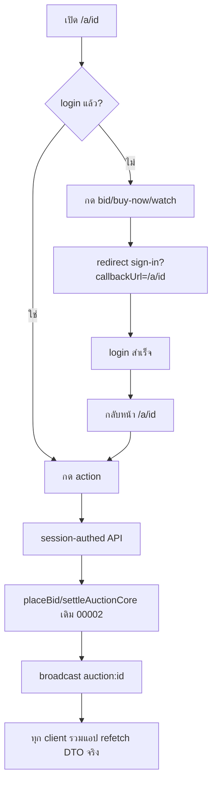
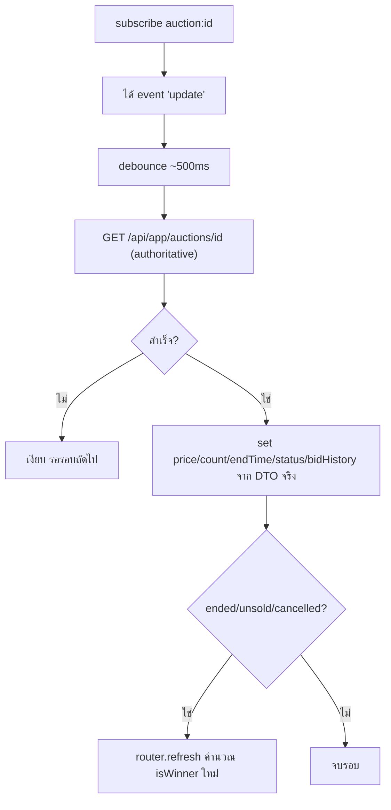

> **โมดูล:** M00004-BuyerWebAuction · **BRD (NON-TECHNICAL)** · v1.0 · 2026-07-02
> **สถานะ:** As-Is Documentation (retroactive) — อ้างอิงโค้ดจริง ณ commit `49343b1` (merge PR #3)

# BRD: Buyer Web Auction

## 1. บทนำ
กำหนด FR ระดับ non-technical ของหน้าเว็บสาธารณะ `/a/[id]` ที่ผู้ซื้อดู/ประมูลผ่านเบราว์เซอร์ โดย reuse auction engine 00002 ทั้งหมด + AC แบบ Given/When/Then + บันทึกย้อนหลัง

**ขอบเขต:** หน้าเว็บสาธารณะ `deepthailand.app/a/{auctionId}` — **ไม่มี business logic ประมูลใหม่** ทุก action เรียก service เดิม
- **Input:** auction ID จาก URL, session cookie, bid amount, buy-now/watch command
- **Output:** หน้ารายละเอียด (SSR+realtime), Bid record (table เดียวกับแอป), WatchList, Order (buy-now/จบมีผู้ชนะ ผ่าน settleAuctionCore), broadcast event
- **ระบบเกี่ยวข้อง:** `auction.service.ts` (00002 reuse), NextAuth, Supabase Realtime, `getSellerTrust`, seller console (จุดกำเนิดลิงก์)

**กลุ่มผู้ใช้:**
| กลุ่ม | สิทธิ์ |
|---|---|
| Visitor (ไม่ login) | ดูรายละเอียดสาธารณะ — ทำรายการไม่ได้ |
| Buyer เว็บ (login) | bid, buy-now, watch/unwatch, ดูผล+ไป orders ถ้าชนะ |
| Seller | กด "แชร์" คัดลอกลิงก์ (ไม่มีสิทธิ์พิเศษบน `/a/[id]`) |
| System (broadcast) | ยิง event `update` — client refetch ยืนยันเอง |

## 2. Functional Requirements

### 2.1 Public View

**FR-BWA-01: ดูรายละเอียดสาธารณะ** — *ในฐานะผู้กดลิงก์ ต้องการเห็นรายละเอียด+ราคา+เวลาทันทีไม่ต้อง login*
- AC-01: auction ≠ draft + ไม่ login → แสดงรูป/ชื่อ/ราคา/เวลา/ราคาเริ่มต้น/ขั้นบิด/มี-ไม่มีราคาขั้นต่ำ (ไม่เห็นตัวเลข)/trust ผู้ขาย/ประวัติ bid ≤20
- AC-02: auction ไม่มีจริง → 404
- AC-03: จอ <600px → MobileFrame เต็มจอ (ไม่มี navbar)
- AC-04: จอ ≥600px → เว็บกลางจอ (~840px) + navbar

**FR-BWA-02: กัน Draft ผ่าน direct link**
- AC-01: draft → 404 เหมือนไม่มีอยู่ (ไม่ leak ว่ามีแต่เป็น draft)
- AC-02: scheduled/live/ended/unsold/cancelled → แสดงตามสถานะจริง

### 2.2 Login Gate

**FR-BWA-03: Login-Gate + กลับหน้าเดิม**
- AC-01: ไม่ login + กด bid/buy-now/watch → redirect `/auth/sign-in?callbackUrl=/a/{id}` (ไม่เรียก API)
- AC-02: login สำเร็จผ่าน callbackUrl validated → กลับหน้า `/a/{id}` เดิม

**FR-BWA-04: กัน Open-Redirect**
- AC-01: callbackUrl absolute URL (`https://evil.com`) → fallback `/`
- AC-02: protocol-relative (`//evil.com`)/backslash-trick (`/\evil.com`) → fallback `/`
- AC-03: relative path จริงโดเมนเดียว → ใช้ได้ (normalize pathname+search+hash)

### 2.3 Web Bidding

**FR-BWA-05: เสนอราคา (session-authed)**
- AC-01: login + live + ยังไม่หมดเวลา + amount ≥ currentPrice+increment → สร้าง Bid, update currentPrice/bidCount, ตอบ DTO (200)
- AC-02: ไม่ login → 401 "กรุณาเข้าสู่ระบบก่อนใช้งาน"
- AC-03: self-bid (เจ้าของร้าน) → 403 (reuse guard 00002)
- AC-04: ไม่ live/หมดเวลา → 409 "การประมูลปิดแล้ว"
- AC-05: amount < currentPrice+increment → 400 "ต้องบิดอย่างน้อย X บาท"
- AC-06: race (มีคนแซง) → 409 "ราคาปัจจุบันเปลี่ยนแล้ว มีผู้เสนอราคาแซงก่อนคุณ" → client sync ราคาล่าสุด
- AC-07: bid ใน 60s สุดท้าย + antiSnipeCount<5 → ต่อเวลา 60s, count+1

**FR-BWA-06: ซื้อทันที (Buy-Now)**
- AC-01: login + มี buyNowPrice + currentPrice<buyNowPrice → วางบิดที่ buyNowPrice, settle ทันที (ended), สร้าง Order, ตอบ `{auction, orderId}`
- AC-02: ไม่มี buyNowPrice → 400 "ไม่มีตัวเลือกซื้อทันที"
- AC-03: currentPrice ≥ buyNowPrice แล้ว → 409 "ราคาสูงเกินระดับซื้อทันทีแล้ว"
- AC-04: ราคา buy-now จาก `Auction.buyNowPrice` DB เท่านั้น (ไม่รับ client body)

### 2.4 Watch

**FR-BWA-07: ติดตาม/เลิกติดตาม**
- AC-01: login + `POST /watch` → upsert WatchList, `{watching:true}`
- AC-02: watch ซ้ำ → ไม่สร้าง record ซ้ำ (idempotent)
- AC-03: `DELETE /watch` → ลบ, `{watching:false}` (idempotent)
- AC-04: ไม่ login → 401

### 2.5 Realtime

**FR-BWA-08: รับ Realtime update (live)**
- AC-01: live + mount → subscribe channel `auction:{id}`
- AC-02: ได้ event `update` → fetch `/api/app/auctions/{id}` authoritative ยืนยันก่อน update UI — **ห้าม**ใช้ payload ตรง
- AC-03: ไม่ live → ไม่ subscribe (static)
- AC-04: DTO refetch status = ended/unsold/cancelled → trigger re-fetch RSC คำนวณ isWinner ใหม่

**FR-BWA-09: แสดง connection state**
- AC-01: SUBSCRIBED → "สด"; AC-02: CHANNEL_ERROR/TIMED_OUT → "กำลังเชื่อมต่อใหม่"

### 2.6 ผลลัพธ์เมื่อจบ

**FR-BWA-10: แสดงผลตามสถานะสุดท้าย**
- AC-01: ended + session=Order.buyerUserId → การ์ด "คุณชนะการประมูล!" + ราคา + ปุ่มไป `/orders`
- AC-02: ended + ไม่ใช่ผู้ชนะ/ไม่ login → "จบการประมูลแล้ว" + ชื่อผู้ชนะ (displayName) + ราคา (ไม่มีปุ่ม orders)
- AC-03: unsold → "ไม่มีผู้ชนะ" + เหตุผล (ไม่มีผู้เสนอ/ราคาไม่ถึงขั้นต่ำ ตาม hasReserve)
- AC-04: cancelled → "ถูกยกเลิกโดยผู้ขาย"
- AC-05: isWinner อิง `Order.buyerUserId` เทียบ session เฉพาะ ended — ไม่ login/ไม่ตรง = false (fail-closed)

### 2.7 Share Link

**FR-BWA-11: Seller คัดลอกลิงก์จริง**
- AC-01: Seller อยู่ console ตัวเอง + กด "แชร์" → คัดลอก `{domain}/a/{auctionId}` (ไม่ใช่ placeholder)
- AC-02: ลิงก์เปิดในเบราว์เซอร์ (ไม่ login) → เข้าหน้ารายละเอียดตาม FR-BWA-01

## 3. Acceptance สรุป
- **Public:** เปิด `/a/{id}` ดูได้ทันทีไม่ login (draft=404); responsive ตาม breakpoint
- **Login+Security:** action ตอนไม่ login → redirect validated → กลับหน้าเดิม; callbackUrl absolute/trick → fallback `/`
- **Bid/Buy/Watch:** กติกาเดียวกับแอป 100%; bidderId จาก session; race → 409 sync
- **Realtime:** subscribe + refetch authoritative (ไม่เชื่อ payload); ไม่ live = ไม่ subscribe
- **ผลลัพธ์:** ผู้ชนะเห็นการ์ด+ปุ่ม orders; ไม่ leak isWinner ผิดคน

## 4. Business Flows

### 4.1 Buyer bid ผ่าน Login Gate

### 4.2 Realtime Reconciliation

## 5. Use Cases (ย่อ)
1. **Visitor ดูเฉยๆ:** เปิดลิงก์ Line → เห็นรูป/ราคา/ประวัติทันที ไม่ต้อง login
2. **เว็บ vs แอป bid ชนกัน:** A(เว็บ) bid 6,000 → B(แอป) bid 6,500 → A bid 6,000 ซ้ำ → 409 sync 6,500 (ไม่มี bid ผิดบันทึก)
3. **Buy-Now เว็บ:** กด "ซื้อทันที ฿25,000" → placeBid+settleAuctionCore tx เดียว → ended, Order สร้าง, ได้ orderId
4. **Watch toggle:** หัวใจ → watching:true → หัวใจอีก → false (ไม่มี record ค้าง)
5. **Draft direct link:** เปิด draft → 404 ไม่ leak
6. **Phishing callbackUrl:** `?callbackUrl=https://evil.com` → getSafeCallbackUrl ปฏิเสธ → fallback `/`

## 6. Quality Requirements
- **ถูกต้อง:** ราคา/สถานะ/ประวัติตรง DB เสมอ (ไม่ cache client เกิน 1 refetch cycle)
- **รวดเร็ว:** realtime latency ≤1.5s (รวม debounce 500ms)
- **น่าเชื่อถือ:** payload ปลอม/ผิด self-heal ผ่าน authoritative refetch (ไม่ค้างค่าผิดถาวร)
- **ปลอดภัย:** session auth ทุก mutation (ไม่รับ userId client); callbackUrl whitelist relative; draft ไม่หลุด (RSC guard); bid history ไม่มี PII
- **Usability:** มือถือ bid panel sticky bottom; จอกว้าง in-flow + navbar

## 7. Constraints
- **ธุรกิจ:** ไม่มี browse/search เว็บ; ไม่มีหน้ารายการติดตามเว็บ
- **เทคนิค:** ห้าม logic บิด/settle ใหม่ (reuse `auction.service.ts`); หน้าเว็บ Vuexy/MUI (ห้าม Paces); ไม่มี WebSocket/Redis แยก (Supabase Realtime เดิม)

## 8. Business Rules
**8.1 Reuse ตรงจาก 00002 (ไม่มีข้อยกเว้นเว็บ):** self-bid block (403); min increment; auction ปิด → ปฏิเสธ (409); anti-snipe 60s×5; reserve → unsold ไม่มี Order; buy-now หมดอายุอัตโนมัติ (409); settle idempotent

**8.2 เฉพาะเว็บ (00004):** session auth only (userId จาก getServerSession); draft=404 เสมอ; callbackUrl relative path เดียวโดเมน; realtime refetch ก่อน update; isWinner จาก Order.buyerUserId เทียบ session เฉพาะ ended

## 9. Glossary
| คำ | ความหมาย |
|---|---|
| `/a/[id]` | route หน้ารายละเอียด auction สาธารณะเว็บ (00004) |
| `/api/auctions/[id]/*` | REST session-authed bid/buy-now/watch (เว็บ) — คู่ขนาน `/api/app/auctions/[id]/*` (Bearer, แอป) |
| PublicAuctionDTO | shape ปลอดภัยสำหรับผู้ซื้อ (ไม่มี reservePrice/expectedPrice) — จาก 00002 |
| Login Gate | บังคับ login ก่อนทำรายการ (ไม่ใช่ก่อนดู) |
| Reconciliation | refetch authoritative แทนเชื่อ broadcast payload |
| Fail-Closed | isWinner/ownership = false เป็นค่าเริ่มต้นเมื่อไม่แน่ใจ |

*(ศัพท์ engine พื้นฐานดู [[../00002 - Seller Auction/BRD]] §9)*

## 10. สรุป
บันทึกย้อนหลัง feature ที่ build/merge/deploy prod แล้ว — เปิดช่องทางประมูลให้ผู้ไม่มีแอปผ่าน public web (ดูไม่ต้อง login), reuse engine 00002 100% (ไม่มีกฎขัดข้าม platform), ปิด open-redirect + realtime spoof ตั้งแต่ review-fix commit เดียวกับ merge

**หมายเหตุ:** PRD ดู [[PRD]]. retroactive — ไม่มี SRS/SDS/DATABASE/API/Tests แยก (backend reuse 100% จาก 00002 ซึ่งมีครบชุด). ถ้าต้องการ SRS/SDS ของ 2 endpoint ใหม่ (`/api/auctions/[id]/bid|watch|buy-now` + DTO reuse) มอบ safepay-planner ตาม HR11
