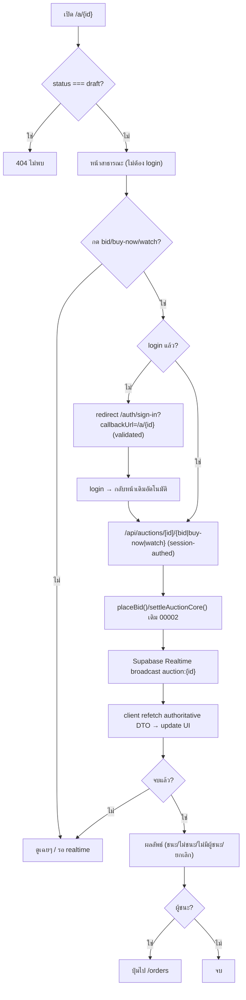

> **โมดูล:** M00004-BuyerWebAuction · **PRD** · v1.0 · 2026-07-02
> **สถานะ:** As-Is Documentation (retroactive — build/merge/deploy prod ไปแล้วก่อนมีเอกสาร ตาม HR11) อ้างอิงโค้ดจริง ณ commit `49343b1` (merge PR #3 `feat/buyer-web-auction`; commit `1af46e8`/`347f9f5`/`40af546`/`34bbff4`)

# PRD: Buyer Web Auction

## Executive Summary
Buyer Web Auction = หน้าเว็บสาธารณะ `deepthailand.app/a/{auctionId}` ให้ผู้ซื้อดู+ร่วมประมูลสินค้าที่ Seller สร้าง (feat 00002) ผ่าน**เบราว์เซอร์โดยตรง** ไม่ต้องติดตั้ง Deep-App. **ไม่สร้าง auction engine ใหม่** — reuse `placeBid`/self-bid check/anti-snipe/reserve/buy-now/`settleAuction` จาก `auction.service.ts` (00002) 100%. 00004 เพิ่มแค่ **ทางเข้าอีกช่องทาง** (public web view + session-auth action) ต่างจาก Deep-App เฉพาะชั้น auth (NextAuth session cookie แทน HMAC Bearer) + UI (Vuexy/MUI แทน React Native)

**ปัญหาที่แก้:** ก่อนหน้า (00002 MVP) ประมูลได้เฉพาะผู้มี Deep-App — ลิงก์ที่ Seller แชร์ผ่าน FB/Line ไปคนไม่มีแอป = dead-end. 00004 ปิดช่องว่างด้วยหน้า public ดูได้ทันทีไม่ต้อง login + login-gate เฉพาะตอนทำรายการ

## 1. Business Goals & KPIs
| เป้าหมาย | รายละเอียด |
|---|---|
| ปิด dead-end ลิงก์แชร์ | ลิงก์ auction เปิดในเบราว์เซอร์ได้ทันที ไม่บังคับติดตั้งแอป |
| ขยายฐาน Buyer | ผู้มีบัญชี Deep แต่ไม่มีแอป bid/buy-now/watch ผ่านเว็บได้ |
| สอดคล้อง engine เดิม | bid เว็บ+แอปแข่งสังเวียนเดียว (table เดียว) ไม่มี engine แยก |
| engagement ผ่าน Realtime บนเว็บ | เห็นราคา/ต่อเวลา realtime ไม่ต้อง refresh |

**KPIs (retroactive — วัด baseline):** Web-originated Bid Share, Realtime Latency (web) ≤1.5s (รวม throttle 500ms), Login-gate Conversion, Share-link Open Rate (เดิม 0% เพราะไม่มีหน้าเว็บ)

## 2. Personas
**2.1 Web-first Buyer (ไม่มีแอป):** คลิกลิงก์จาก FB/Line, อาจมี/ไม่มีบัญชี Deep, ไม่อยากติดตั้งแอปเพื่อดูรายการเดียว. ต้องการดูทันทีไม่ login + login เร็วๆ กลับมา bid ต่อ + เห็นราคา realtime. Pain: ลิงก์ไม่รองรับเว็บ = เสีย momentum; ไม่มั่นใจว่าเว็บ/แอป pool เดียวกัน

**2.2 Seller (ผู้แชร์ลิงก์):** L2+ สร้าง auction แล้วอยากกระจายลิงก์ไปกลุ่มที่ไม่อยู่ในแอป. ต้องการปุ่ม "แชร์" ได้ลิงก์ใช้จริง. Pain: ปุ่มแชร์เดิมเป็น placeholder ไม่มีปลายทาง

## 3. Business Requirements (สรุป — รายละเอียด AC ดู BRD)
- **3.1 Public View:** ใครมีลิงก์ `/a/{id}` ดูได้ทันทีไม่ต้อง login (รูป/ราคา/countdown/ขั้นบิด/มี-ไม่มีราคาขั้นต่ำ [ไม่เห็นตัวเลข]/trust ผู้ขาย/ประวัติ bid). responsive: มือถือ full-bleed MobileFrame, จอกว้าง เว็บกลางจอ+navbar. **draft = 404**; ไม่มีหน้า browse/listing (เข้าเฉพาะลิงก์ตรง)
- **3.2 Login Gate:** กด bid/buy-now/watch ตอนไม่ login → redirect login แล้วกลับหน้าเดิม. callbackUrl ต้อง relative path โดเมนเดียว (กัน open-redirect)
- **3.3 Web Bidding:** login แล้ว bid (quick ×1/×2/×4 หรือระบุเอง) + buy-now. กฎบิดทั้งหมด reuse 00002 ไม่มีข้อยกเว้นเว็บ. bidderId จาก session เท่านั้น; buy-now price จาก DB เท่านั้น
- **3.4 Watch:** login แล้ว toggle ติดตาม (idempotent unique constraint). ใช้ `WatchList` เดิมร่วมแอป
- **3.5 Realtime:** live → ราคา/บิด/เวลา/ต่อเวลา update ไม่ต้อง refresh + แสดง connection state. **ไม่เชื่อ broadcast payload** — refetch authoritative เสมอ (channel public spoofable)
- **3.6 ผลลัพธ์จบ:** แสดงตามสถานะจริง; ผู้ชนะมีปุ่มไป orders. isWinner อิง `Order.buyerUserId` เทียบ session เฉพาะ `ended` (fail-closed)
- **3.7 Share Link:** Seller กด "แชร์" คัดลอก `/a/{id}` ใช้จริง (ปิด placeholder เดิม)

## 4. Business Rules & Constraints
| กฎ | คำอธิบาย |
|---|---|
| Reuse 100% engine (00002) | ไม่มี logic บิด/settle/anti-snipe/reserve ใหม่ — เรียก service เดิม route คนละตัว auth ต่างกัน |
| Session Auth แทน Bearer | web `/api/auctions/[id]/*` = NextAuth cookie; app `/api/app/auctions/[id]/*` = HMAC Bearer — table/logic เดียว |
| Draft Guard (404) | draft ผ่าน `/a/{id}` = "ไม่พบ" เสมอ |
| Open-Redirect Guard | callbackUrl relative path โดเมนเดียวเท่านั้น |
| Realtime Payload ไม่น่าเชื่อถือ | event = signal → refetch authoritative ก่อน update UI |
| No PII ใน Bid History | สาธารณะ = displayName เท่านั้น (ไม่มี bidderId/เบอร์/อีเมล) |
| hasReserve Boolean | เห็นแค่ "มี/ไม่มีราคาขั้นต่ำ" ไม่เห็นตัวเลข reservePrice/expectedPrice (DTO 00002 ไม่มี key นี้) |

**ข้อจำกัด:** ไม่มีหน้า browse/search auction บนเว็บ, ไม่มีหน้ารายการที่ติดตาม, Seller ยังจัดการผ่าน dashboard เดิม, ไม่มี Redis/WebSocket แยก (ใช้ Supabase Realtime เดิม)

### Buyer Web Journey

## 5. Out of Scope
Deep-App native (คนละ repo); หน้า Browse/search เว็บ; หน้า Watchlist เว็บ; Auction Engine ใหม่; Seller management เว็บ; **feat 00005 (reaction), 00006 (presence/viewer count), 00007 (self-outbid block/level badge visual/price-flash/carousel/winner modal)** = enhancement ต่อยอดภายหลัง (โค้ดปัจจุบัน merge ทับในไฟล์เดียวกันแล้วแต่คนละ feature/เอกสาร); Admin moderation

## 6. Risks & Mitigation
| ความเสี่ยง | ระดับ | mitigation |
|---|---|---|
| เข้าใจผิดว่าเว็บ/แอปแยกระบบ | กลาง | UI แสดงราคา/บิด realtime ตรงกัน (table เดียว 100%) |
| ลิงก์แชร์ใช้ phishing (ปลอม callbackUrl) | สูง | Open-redirect guard `getSafeCallbackUrl` (ปิดแล้ว review-fix) |
| Draft หลุดสาธารณะ | ต่ำ | `notFound()` RSC layer เมื่อ draft (ปิดแล้ว) |
| Realtime payload spoof | — | refetch authoritative เสมอ (reconciliation, ปิดแล้ว) |
| Race bid เว็บ+แอป | — | conditional updateMany (optimistic guard) เดิม 00002 |
| Broadcast รัว → GET ถล่ม | — | throttle refetch ~500ms |
| Session auth ผิด → bidderId จาก client | — | บังคับ userId จาก getServerSession เท่านั้น |

## 7-10. (Glossary / Metrics / Dependencies / Appendix)
- **Deps:** `auction.service.ts` (00002 reuse 100%), NextAuth, Supabase Realtime (channel `auction:{id}` เดิม), `getSellerTrust`, `MobileFrame` (`/o/[token]`), `getSafeCallbackUrl`, Vuexy theme
- **Assumptions:** บัญชี Deep เดียวกับแอป; table เดียว (ไม่มี sync batch); ไม่มี rate-limit แยก (guardApi ครอบ mutation แล้ว); Seller เข้าใจปุ่มแชร์ใช้จริงแล้ว
- **Glossary:** ศัพท์ auction engine พื้นฐาน (Auction/Bid/currentPrice/bidIncrement/reservePrice/buyNowPrice/Anti-Snipe/Settle/Unsold) ดู [[../00002 - Seller Auction/PRD]]
- **Success Metrics:** web bid ไม่ขัด app bid = 0 กรณี; open-redirect ปฏิเสธ 100%; draft 404 100%; realtime p95 ≤1.5s

**หมายเหตุ:** FR/User Story/AC ดู [[BRD]]. retroactive doc — ไม่มี SRS/SDS/DATABASE/API/Tests แยก (backend reuse 100% จาก 00002 ซึ่งมีครบชุดแล้ว)
