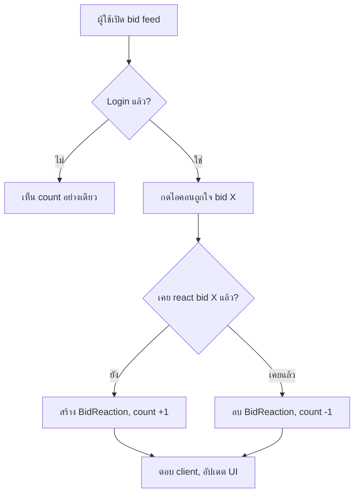

> **โมดูล:** M00005-AuctionBidReactions
> **ประเภทเอกสาร:** Business Requirements Document (BRD) — NON-TECHNICAL
> **เวอร์ชัน:** 1.0
> **สถานะ:** scope = **Reaction-only MVP** (FR-REACT-*). Reply/Realtime = Phase 2 (ดู [[PRD]] Controller Decisions)

# BRD: ระบบรีแอคชั่นการเสนอราคา (Auction Bid Reactions)

---

## 1. บทนำ

### 1.1 วัตถุประสงค์
กำหนด Functional Requirements ระดับ non-technical ของระบบ Reaction บน Auction Bid Feed + Acceptance Criteria (Given/When/Then) ที่ QA นำไปสร้าง Test Case ได้ตรง รวม edge case (react ตัวเอง, ยกเลิก reaction, auction จบแล้ว react ได้ไหม, double-click)

### 1.2 ขอบเขต
ส่วนขยายบน bid feed ที่มีอยู่ (feature 00002 + 00004) — **ขยาย ไม่แก้ logic เดิม**
- Input: toggle reaction จาก user login (`bidId`, `userId` จาก session)
- Output: `reactionCount` + `reactedByMe` เพิ่มเข้า `BidDTO` เดิม (ไม่กระทบ field เดิม)
- ระบบเกี่ยว: `auction.service.ts`, `AuctionBidFeed.tsx` (seller), `AuctionBidHistory.tsx` (buyer), `src/lib/api-rate-limit.ts`

### 1.3 กลุ่มผู้ใช้

| กลุ่ม | สิทธิ์ |
|------|--------|
| ผู้ใช้ login (ใดก็ได้) | กด/ยกเลิก reaction |
| Guest (ไม่ login) | เห็น count เท่านั้น |
| Seller เจ้าของ auction | เห็น count read-only ใน console |

---

## 2. Functional Requirements (Reaction — MVP)

### FR-REACT-01: กดถูกใจ (Like) bid

**User Story:** ในฐานะผู้ใช้ที่ login ฉันต้องการกดถูกใจ bid ที่สนใจ เพื่อแสดงปฏิกิริยาโดยไม่ต้องพิมพ์

**Acceptance Criteria:**
- [ ] `FR-REACT-01-AC-01` **Given** user login + ยังไม่เคย react bid X **When** กดถูกใจ bid X **Then** สร้าง reaction record `(bidId=X, userId)` + `reactionCount` +1
- [ ] `FR-REACT-01-AC-02` **Given** user ยังไม่ login **When** พยายามกด **Then** ปฏิเสธ/เด้ง login (401) ไม่สร้าง record
- [ ] `FR-REACT-01-AC-03` **Given** bid X อยู่ใน auction ended/unsold/cancelled **When** user login กด **Then** react ได้ปกติ (ไม่ผูก state ประมูล)
- [ ] `FR-REACT-01-AC-04` **Given** user เป็น bidder ของ bid นั้นเอง **When** กดถูกใจ bid ตัวเอง **Then** อนุญาต (ไม่มี self-react block)
- [ ] `FR-REACT-01-AC-05` **Given** amount ที่แสดง **When** react **Then** ไม่กระทบ currentPrice/bidCount/settle เดิมเลย

### FR-REACT-02: ยกเลิกถูกใจ (Toggle off)

**User Story:** ในฐานะผู้เคยกดถูกใจ ฉันต้องการยกเลิกได้ถ้าเปลี่ยนใจ

**Acceptance Criteria:**
- [ ] `FR-REACT-02-AC-01` **Given** user เคย react bid X **When** กดถูกใจ bid X อีกครั้ง **Then** ลบ record เดิม + `reactionCount` -1
- [ ] `FR-REACT-02-AC-02` **Given** user กด react/un-react ติดกันเร็ว (double-click) **When** ประมวลผล **Then** state สุดท้ายสอดคล้องจำนวนกดจริง (odd=reacted, even=not) — ไม่มี duplicate record (unique constraint DB)

### FR-REACT-03: ดูจำนวน reaction (public view)

**User Story:** ในฐานะผู้ชม (login หรือไม่) ฉันต้องการเห็นจำนวนคนถูกใจ bid แต่ละรายการ

**Acceptance Criteria:**
- [ ] `FR-REACT-03-AC-01` **Given** หน้าสาธารณะ `/a/[id]` **When** เปิด (login หรือไม่) **Then** เห็น `reactionCount` ทุก bid
- [ ] `FR-REACT-03-AC-02` **Given** API ส่ง bid list **When** ตรวจ payload **Then** **ไม่มี**รายชื่อ/userId ผู้ react (มีแค่ count + `reactedByMe` ของผู้เรียกเอง)
- [ ] `FR-REACT-03-AC-03` **Given** seller console **When** seller เปิด **Then** เห็น `reactionCount` เท่ากัน (read-only, ไม่มีปุ่มกด)

### FR-REACT-04: ป้องกัน spam / rate-limit

**Acceptance Criteria:**
- [ ] `FR-REACT-04-AC-01` **Given** user เรียก toggle เกินอัตรา (reuse `api-rate-limit.ts`) **When** เรียกครั้งถัดไป **Then** ตอบ 429 โดยไม่กระทบ core bid/settle flow

---

## 3. Acceptance Criteria สรุป (Reaction MVP)

- ✅ user login react/un-react bid ได้ toggle เดียว ไม่ duplicate
- ✅ user ไม่ login เห็น count กดไม่ได้
- ✅ ไม่มีรายชื่อ reactor หลุดใน response
- ✅ seller console เห็น count read-only ตรงกับ buyer web
- ✅ react ได้ทุก auction state
- ✅ react bid ตัวเองได้ (ไม่ถูก block)

---

## 4. Business Flow

---

## 5. Use Case Scenarios

**S1 (happy):** Buyer A เปิด `/a/[id]` เห็น bid ของ B count=4 → กดถูกใจ → count=5, ปุ่ม active
**S2 (toggle off):** A กดซ้ำ bid เดิม → count=4, ปุ่มกลับปกติ
**S3 (guest):** guest กดถูกใจ → เด้ง login, count ไม่เปลี่ยน
**S4 (ended):** auction จบแล้ว → user ยัง react ได้ (ย้อนหลัง)

---

## 6. Quality Requirements
- reactionCount ตรงกับ record จริงเสมอ; ห้าม duplicate `(bidId, userId)`
- toggle ตอบ UI < 300ms (optimistic)
- bid feed query ไม่ช้าลงมีนัยสำคัญ
- **core auction (placeBid/settle) ไม่กระทบแม้ reaction layer ล่ม** (fail-safe)
- login + rate-limit บังคับ; ไม่ส่งรายชื่อ reactor

---

## 7. ข้อจำกัด
- extend `BidDTO` โดยไม่กระทบ field เดิมที่ 2 component ใช้
- DTO separation: ไม่รั่วรายชื่อ reactor (ตาม pattern feature 00002)
- Deep-App มือถือ cross-repo — endpoint generic พอ web/mobile เรียกได้อนาคต

---

## 8. Business Rules
- Login required เพื่อ react; view สาธารณะ
- 1 user : 1 bid = 1 record (unique)
- react ไม่ผูก auction state
- ไม่มี self-react block
- ไม่ส่งรายชื่อ reactor

---

## 9. Glossary

| คำ | ความหมาย |
|----|----------|
| Reaction | กดถูกใจ 1 ครั้ง/user/bid (toggle) |
| Toggle | กดครั้งแรก=สร้าง, ครั้งถัดไป=ลบ |
| Reactor | ผู้กด reaction |

---

## 10. Deferred (Phase 2 — ไม่ implement รอบนี้)

> เก็บไว้เผื่ออนาคต — ตัดออกจาก MVP ตาม Controller Decisions (PRD OQ-4/OQ-5)

- **Reply / comment ต่อ bid** — public UGC เต็มรูป ต้องมี report + admin moderation queue ใหม่ทั้งระบบ (~+5-8 dev-day) + PDPA (user-generated public text). ทางเลือกที่เคยเสนอ: (A) seller-only reply, (B) public reply เต็มรูป
- **Realtime reaction count** — broadcast เหมือน currentPrice; MVP ใช้ refetch ปกติ
- **Multi-emoji picker / who-reacted list** — Phase 2

---

**หมายเหตุ:** ภาพรวม/KPI/effort ดู [[PRD]]; technical spec (schema `BidReaction`, API, DTO) ดู [[SRS]] (ออกหลัง user review PRD/BRD)
