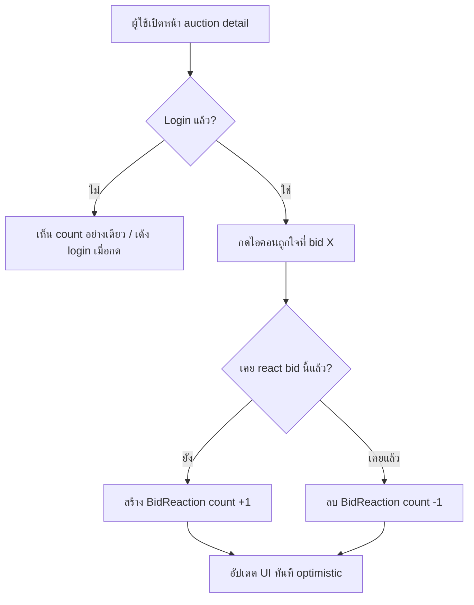

> **โมดูล:** M00005-AuctionBidReactions
> **ประเภทเอกสาร:** Product Requirements Document (PRD)
> **เวอร์ชัน:** 1.0
> **วันที่จัดทำ:** 2026-07-02
> **สถานะ:** OQ resolved (ดู "Controller Decisions" ด้านล่าง) — scope = **Reaction-only MVP**

---

## 🔒 Controller Decisions (OQ resolved — 2026-07-02)

user สั่ง "build ระบบ reaction" + "ลุยต่อให้จบ". เคาะ Open Questions ทั้งหมดตาม PM recommendation:

| OQ | คำถาม | มติ |
|---|---|---|
| OQ-1 | ใคร react ได้ | **ผู้ใช้ที่ login ใดก็ได้** |
| OQ-2 | seller react หรือ read-only | **read-only count** (ลด scope UI console) |
| OQ-3 | 1 Like หรือ multi-emoji | **Like เดียว (toggle)** |
| OQ-4 | **Reply เข้า scope ไหม** | **ไม่ทำรอบนี้** (defer) — user ขอ "reaction" เท่านั้น; reply = public UGC + moderation ใหม่ทั้งระบบ (~+5-8 dev-day) เสี่ยงสูง → Phase 2 |
| OQ-5 | realtime | **ไม่ทำ** (refetch ปกติ) — ลดความเสี่ยงต่อ Realtime layer ที่เพิ่ง harden |
| OQ-6 | แสดงรายชื่อ reactor | **count อย่างเดียว** (privacy-conservative) |

**Scope รอบนี้ = FR-REACT-01..04 เท่านั้น** (Reaction toggle + count + rate-limit). FR-REPLY-* / FR-RT-* = Phase 2 (docs เก็บไว้ใน BRD เผื่ออนาคต แต่ไม่ implement)

---

## Executive Summary

ระบบ Reaction บน Auction Bid Feed ให้ผู้ใช้ที่ login แล้วกด "ถูกใจ" (toggle) การเสนอราคาแต่ละรายการได้ ในสไตล์ Facebook-comment ตามที่ mockup แสดง (reaction pill มุมล่างขวา bubble) เพื่อเสริม engagement/social-proof ให้ bid feed ของระบบ Seller Auction (feature 00002/00004)

ฟีเจอร์นี้ **ไม่กระทบ core flow ประมูล/บิด/settle/Order เดิม** (additive เท่านั้น — bid list ทำงานเหมือนเดิมแม้ reaction ปิด/พัง) เพิ่ม write path ใหม่ที่ป้องกันด้วย login-required + rate-limit เดิม

---

## 1. Business Goals & KPIs

### 1.1 เป้าหมายทางธุรกิจ

| เป้าหมาย | รายละเอียด |
|----------|-----------|
| เพิ่ม engagement บน bid feed | ทำให้หน้าประมูล "มีชีวิต" จูงใจให้ผู้ชม/ผู้บิดกลับมาดูซ้ำ |
| เพิ่ม social proof ต่อผู้นำการประมูล | reaction ที่กองที่ bid ผู้นำสื่อว่ามีคนเห็นด้วย/ตื่นเต้น (สมมติฐาน ยังไม่มีหลักฐานเชิงพฤติกรรม) |

> จงใจ **ไม่ตั้งเป้า GMV/Trust Score** — ฟีเจอร์นี้เป็น engagement candy ไม่มี mechanism เชื่อมรายได้ตรง

### 1.2 KPIs

| KPI | สูตร | เป้าหมาย |
|-----|------|---------|
| Reaction Adoption Rate | % auction ที่ live แล้วมี reaction ≥1 | ≥ 30% (ประเมินเบื้องต้น) |
| Reactions per Live Auction | เฉลี่ย reaction/auction | วัด baseline (feature ใหม่) |

---

## 2. User Personas

### 2.1 Buyer/ผู้ชมประมูล (Reactor)
- ผู้ใช้ login แล้ว (บัญชี Deep ใดก็ได้) ดู `/a/[id]` — กดถูกใจ bid ที่ชอบ 1 คลิก, ยกเลิกได้, เห็น count รวม

### 2.2 Seller เจ้าของ Auction
- เห็น reaction count ใน console (`/seller/auctions/[id]`) แบบ read-only — สัญญาณ engagement เสริมข้าง currentPrice/bidCount

---

## 3. Business Requirements

### 3.1 Reaction ต่อ Bid
- ผู้ใช้ login กด "ถูกใจ" ที่ bid รายการหนึ่งได้ (ต่อ bid ไม่ใช่ทั้ง auction)
- กดซ้ำ = ยกเลิก (toggle) — 1 คน : 1 bid = react ได้สูงสุด 1
- ทุกคนเห็น count แม้ไม่ login; กด react ต้อง login
- แสดง 2 หน้า: seller console (read-only) + buyer web (`/a/[id]`, react ได้จริง)

**Business Rules:**
- login required (ไม่มี guest-react — ระบบไม่มี anti-bot ที่ guest write path)
- ไม่จำกัดว่าต้องเป็นผู้บิดจริง — ผู้ชม login ทั่วไป react ได้
- ไม่มี self-react block (react bid ตัวเองได้ — ต่างจาก self-bid block)
- react ได้แม้ auction จบ (ended/unsold/cancelled) — ไม่ผูก state machine
- 1 ประเภท reaction (Like) เท่านั้น

### 3.2 Privacy — count อย่างเดียว
- แสดงแค่จำนวนรวม ไม่แสดงรายชื่อ reactor
- API/DTO ไม่ส่ง array รายชื่อผู้ react — เก็บที่ DB สำหรับนับ/unique-constraint เท่านั้น
- `BidDTO` เดิม (`{id, amount, bidder, atMs, level, avatar}`) ขยายเพิ่ม `reactionCount` + `reactedByMe` (boolean ของผู้เรียกเอง)

### 3.3 การแสดงผล 2 หน้าจอ (integrate component เดิม)
- Seller `AuctionBidFeed.tsx` (Paces): reaction count read-only badge — ไม่มีปุ่มกด
- Buyer `AuctionBidHistory.tsx` (Vuexy `/a/[id]`): ปุ่ม/ไอคอน react กดได้จริง (mockup `.cmt-react` pill)
- Deep-App (มือถือ, cross-repo) = นอกขอบเขต UI (endpoint `/api/*` ต้องพร้อมใช้)

---

## 4. Business Rules & Constraints

| กฎ | คำอธิบาย |
|----|----------|
| Login Required to React | ต้อง login จึงกดได้; guest เห็น count อย่างเดียว |
| Toggle Single Reaction | 1 user : 1 bid ได้สูงสุด 1 (กดซ้ำ = ยกเลิก) |
| React Anytime | react ได้ไม่ว่า auction live/ended/unsold/cancelled |
| No Reactor List Exposed | API ส่งแค่ count + reactedByMe |
| No Self-React Block | react bid ตัวเองได้ |

**Effort ประเมิน (reaction-only):** ~2-3 dev-day (1 ตาราง `BidReaction` + 1-2 endpoint + 2 frontend + QA)

---

## 5. Out of Scope

| หัวข้อ | หมายเหตุ |
|--------|----------|
| Reply / comment (ทุกทางเลือก) | Phase 2 — public UGC + moderation ใหม่ทั้งระบบ |
| Realtime reaction count | Phase 2 — MVP ใช้ refetch ปกติ |
| Multi-emoji picker | MVP มี Like เดียว |
| รายชื่อผู้ react (who-reacted) | Phase 2 |
| Deep-App native UI | cross-repo |
| Reaction ต่อ auction โดยรวม (ไม่ผูก bid) | scope นี้ผูก bid เท่านั้น |

---

## 6. Risks & Mitigation

| ความเสี่ยง | ระดับ | แก้ไข |
|-----------|-------|-------|
| Race condition — double reaction (double-click/retry) | กลาง | unique constraint `[bidId,userId]` + upsert/conditional (pattern wallet.service) |
| Load เพิ่มบน bid list query (aggregate count) | ต่ำ-กลาง | index `[bidId]` + bid feed ≤20 แถว → groupBy ถูก (เหมือน WatchList count ใน livestrip) |
| spam bot กด react ถล่ม | ต่ำ | reuse `src/lib/api-rate-limit.ts` |
| vanity metric (count ขึ้นแต่ไม่แปลง GMV) | ต่ำ | ไม่ตั้ง KPI เชื่อมรายได้ |

---

## 7. Glossary

| คำ | ความหมาย |
|----|----------|
| Reaction | กด "ถูกใจ" ของ user 1 คน ต่อ bid 1 รายการ (toggle) |
| Reactor | ผู้กด reaction |
| reactedByMe | boolean บอกว่าผู้เรียก API react bid นี้แล้วหรือยัง |

---

## 8. Success Metrics

| ตัวชี้วัด | ค่า | วิธีวัด |
|----------|-----|--------|
| Reaction Adoption | ≥30% auction live มี reaction | COUNT(DISTINCT auctionId) จาก BidReaction join Bid |
| ไม่ regress core bid flow | placeBid/settle latency ไม่เปลี่ยน | เทียบ p95 ก่อน/หลัง |

---

## 9. Dependencies & Assumptions

**Dependencies:** feature 00002 (`Bid`, `BidDTO`, `auction.service.ts`), feature 00004 (`AuctionBidHistory.tsx`, web session), `AuctionBidFeed.tsx`, `src/lib/api-rate-limit.ts`

**Assumptions:** reaction ผูก `Bid.id` (ตาม mockup); login = บัญชี Deep ใดก็ได้ (Profile-Centric); login-required (ไม่มี guest-react)

---

## 10. Appendix — Reaction Flow

---

**หมายเหตุ:** FR/User Story/Acceptance ดู [[BRD]]; technical spec ดู [[SRS]] (ออกหลัง PRD/BRD)
