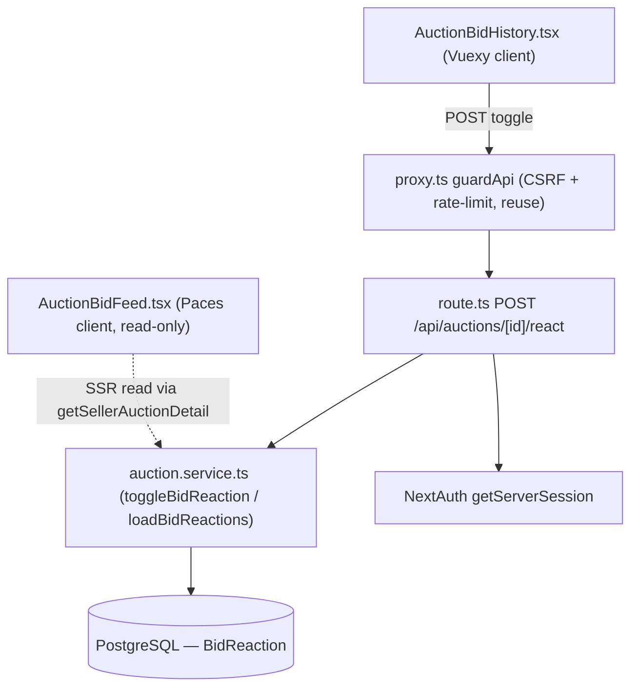
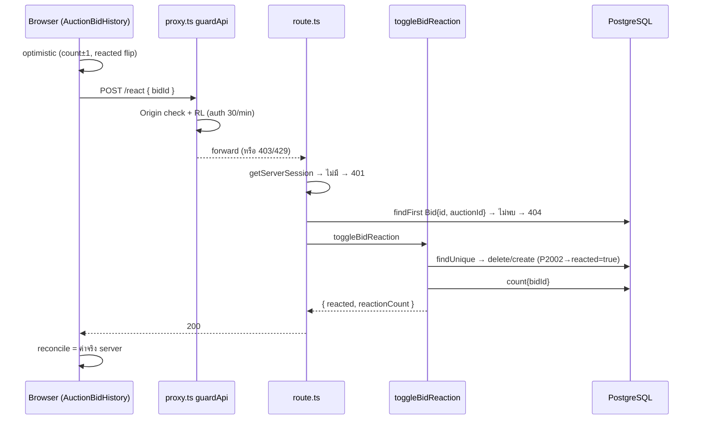
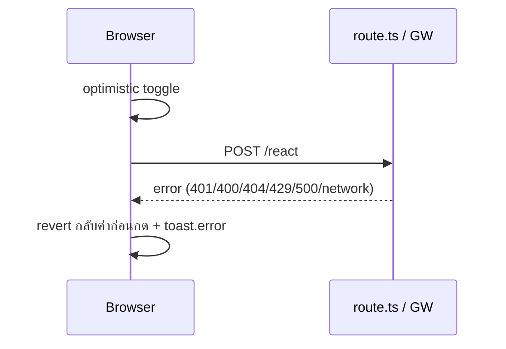

> **โมดูล:** M00005-AuctionBidReactions · **SDS** · v1.0 · 2026-07-02
> **สถานะ:** Retroactive — บันทึกการออกแบบตามที่ implement จริง (HR11 gap-fill)

---

## 1. บทนำ & References
ออกแบบ (ย้อนหลัง) ว่า Reaction ถูกสร้างอย่างไรระดับ component/data-flow — ให้ DEV ต่อยอด (Phase 2 reply/realtime), QA เขียน test, SA reference. แตะ 5 ไฟล์: `schema.prisma` (+1 migration), `auction.service.ts`, `api/auctions/[id]/react/route.ts`, `AuctionBidHistory.tsx` (buyer), `AuctionBidFeed.tsx` (seller). **ไม่แตะ core auction flow** (placeBid/settle/flip) — additive เท่านั้น

อ้างอิง: [[SRS]] (TFR-001..004), [[BRD]] (FR-REACT-01..04), [[PRD]] (OQ resolved), 00002 SDS §6/§7 (DTO/mapper pattern เดิม)

---

## 2. Architecture Overview
pattern เดิมทั้งหมด — Route Handler (API) → Service (`src/services/`) → Prisma → PostgreSQL เดียว. ไม่มี service แยก/queue/cache ใหม่ (ตาม "ห้าม over-engineer")

**Deploy:** ร่วมกับ Next.js app เดิมบน Vercel, DB Supabase เดียว — ไม่มี scaling concern (traffic ผูก bid feed ≤20 แถว/หน้า)

---

## 3. Component Design
| Component | Responsibility | Dependency |
|---|---|---|
| `BidReaction` (Prisma) | 1 record ต่อ (bidId,userId); unique+index = correctness | schema.prisma → PostgreSQL |
| `toggleBidReaction` | toggle + คืน `{reacted,reactionCount}` — pure logic ไม่รู้ HTTP/session | auction.service.ts → Prisma |
| `loadBidReactions` | batch count + viewer set — 2 caller (get*AuctionDetail) | auction.service.ts → Prisma |
| `POST /react` | HTTP boundary: session→body→ownership→service→map error | route.ts → NextAuth + service |
| `AuctionBidHistory.tsx` | buyer optimistic+revert, ไม่มี business logic | Vuexy/MUI, `react-toastify` (marketing ไม่ใช่ pacesToast) |
| `AuctionBidFeed.tsx` | seller read-only count (OQ-2) | Paces client |

หนึ่ง component = หนึ่งความรับผิดชอบ — service ไม่รู้ HTTP, route ไม่รู้ Prisma detail, FE ไม่มี business rule (race handling อยู่ที่ service)

---

## 4. Data Flow

### 4.1 Toggle (buyer web)

### 4.2 ล้มเหลว/ชดเชย

ไม่มี compensating tx ฝั่ง backend — toggle เป็น atomic single op; ชดเชยที่ client-revert เท่านั้น

---

## 5. Integration Points
| จุดเชื่อม | ประเภท | ความเสี่ยงเมื่อล่ม |
|---|---|---|
| NextAuth `getServerSession` | internal | session ล่ม → react 401 (core auction ไม่กระทบ) |
| `proxy.ts guardApi` (reuse) | cross-cutting | middleware ล่ม/bypass = ไม่มี CSRF/RL (เหมือนทุก endpoint) |
| PostgreSQL (Prisma) | internal | DB ล่ม = reaction+core auction ใช้ไม่ได้ (shared) |

Retry/idempotency: ไม่มี retry client (ปุ่ม disable ระหว่าง pending กันกดซ้ำ); ไม่มี timeout เฉพาะ. API contract เต็ม = [[SRS]] §4

---

## 6. Technical Decisions

### TD-001: นับ count แบบ aggregate (groupBy/count) ไม่ denormalize counter
ไม่มี field `reactionCount` บน Bid — คำนวณสดจาก BidReaction. **เหตุผล:** bid feed ≤20 แถว/หน้า → aggregate เบา, ไม่ต้องแบก write-amplification/drift ของ counter แยก. **ตัดทิ้ง:** denormalized counter+increment (เพิ่ม complexity ต้อง tx 2 table). **ผลกระทบ:** query KPI ต้อง join ผ่าน BidReaction เสมอ

### TD-002: Race handling ด้วย unique constraint + catch P2002 (ไม่ใช่ tx lock)
`@@unique([bidId,userId])` + try/catch P2002 แทน `$transaction`+row lock. **เหตุผล:** pattern เดียวกับ wallet.service (conditional atomic), เรียบง่ายกว่า, พอสำหรับ toggle. **ตัดทิ้ง:** `SELECT FOR UPDATE` (overkill + เสี่ยง lock contention บน Bid row ที่ placeBid แข่งเขียนอยู่). **ผลกระทบ:** extreme race ไม่ handle 100% (accept-risk, SRS §8)

### TD-003: ไม่มี rate-limit เฉพาะทาง — reuse guardApi
route ไม่เรียก checkApiRateLimit เอง. **เหตุผล:** สอดคล้อง placeBid, เลี่ยง double-RL diverge. **ตัดทิ้ง:** bespoke key `${ip}:react`. **ผลกระทบ:** reaction แชร์ quota กับ mutation อื่นของ user เดียวกัน

### TD-004: ไม่มี realtime broadcast — optimistic + manual reconcile
reaction count ไม่ผ่าน Realtime (ต่างจาก currentPrice). **เหตุผล:** OQ-5 — ลดความเสี่ยงต่อ Realtime layer ที่เพิ่ง harden (00004). **ตัดทิ้ง:** broadcast count. **ผลกระทบ:** user คนอื่นไม่เห็น reaction real-time (เห็นตอน refresh) — known-limitation ตั้งใจ

---

## 7. Traceability
| SRS | SDS element | สถานะ |
|---|---|---|
| TFR-001 | §3 toggleBidReaction, Flow 4.1, TD-002 | Done |
| TFR-002 | §3 loadBidReactions, TD-001 | Done |
| TFR-003 | TD-002 | Done |
| TFR-004 | TD-003, guardApi (§5) | Done |
| NFR Availability (fail-safe) | §2 (แยก table/service จาก core) | Done (verified no cross-import) |
| NFR Observability | ไม่มี design element (gap) | Not built |

---

## 8. สรุป
additive layer บน bid feed เดิม (00002/00004) ไม่แตะ core auction — pattern เดิมทั้งหมด (service/API แยก, unique-constraint race-safety, reuse CSRF/RL). ไม่มี infra/framework ใหม่

**ลำดับ build จริง:** schema+migration → service (toggle/load + extend BidDTO wire เข้า get*AuctionDetail) → API → FE (buyer optimistic+revert / seller read-only, คู่ขนานได้เพราะ BidDTO เดียว)

**Open (สืบทอด SRS §10):** observability/KPI dashboard, extreme-race formal accept

**หมายเหตุ Controller:** retroactive — ไม่แตะ schema เพิ่ม (migration อยู่ใน repo แล้ว) ไม่ต้อง dispatch safepay-database
