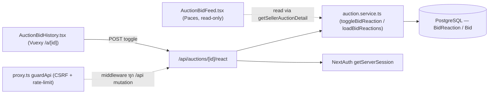
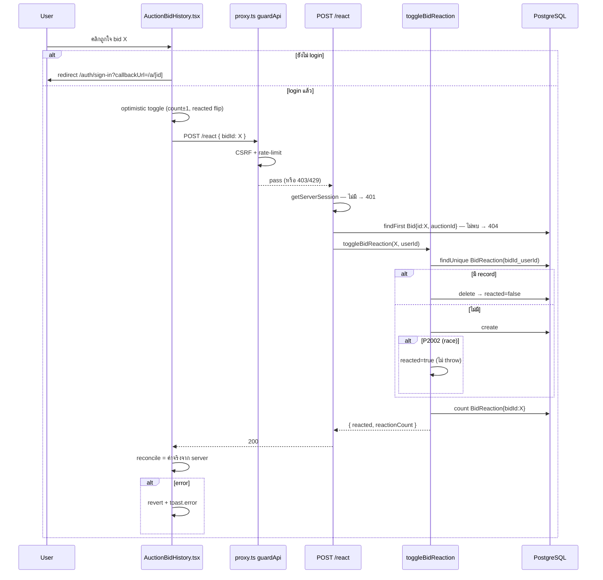
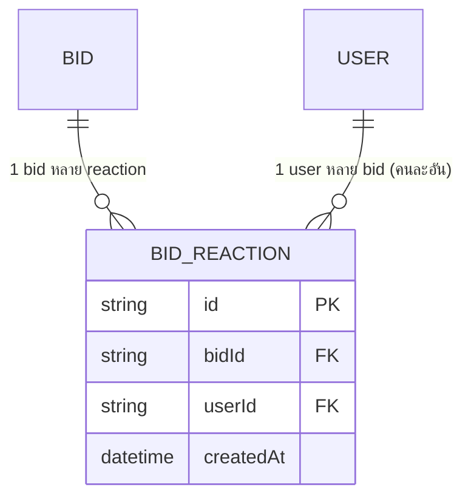

> **โมดูล:** M00005-AuctionBidReactions
> **ประเภทเอกสาร:** Software Requirements Specification (SRS) - TECHNICAL
> **เวอร์ชัน:** 1.0 · **วันที่:** 2026-07-02
> **สถานะ:** Retroactive — บันทึกสิ่งที่ **implement + deploy prod ไปแล้ว** (Documentation-First gap-fill ตาม Hard Rule 11) ไม่ใช่ spec ก่อน build

---

## 1. บทนำ

### 1.1 วัตถุประสงค์
กำหนดข้อกำหนดเชิงเทคนิคของระบบ Reaction บน Auction Bid Feed (feature 00005) **ตามที่ implement จริง** — ผู้อ่าน: DEV (แก้/ต่อยอด), QA (test case ย้อนหลัง), SA (ก่อนต่อยอด Phase 2 reply/realtime)

### 1.2 ขอบเขต (built)
- Prisma model `BidReaction` (toggle 1 user : 1 bid)
- Service: `toggleBidReaction`, `loadBidReactions` (`src/services/auction.service.ts`)
- Extend `BidDTO` +`reactionCount`/`reactedByMe` (ใช้ร่วม buyer+seller)
- API เดียว: `POST /api/auctions/[id]/react`
- Buyer UI `AuctionBidHistory.tsx` (Vuexy, react ได้จริง optimistic+revert); Seller UI `AuctionBidFeed.tsx` (Paces, read-only count)
- reuse NextAuth session + `guardApi` (CSRF+rate-limit) ใน `proxy.ts`

**นอกขอบเขต (deferred):** reply/comment, realtime reaction, multi-emoji, who-reacted, Deep-App native UI

### 1.3 นิยาม
| คำ | ความหมาย |
|---|---|
| Reaction | record ใน `BidReaction` = user "ถูกใจ" bid หนึ่ง |
| Toggle | operation เดียว: ไม่มี record→สร้าง, มี→ลบ |
| reactedByMe | boolean ของผู้เรียก API เอง (จาก session userId) |
| reactionCount | จำนวนรวม `BidReaction` ต่อ bidId (aggregate ไม่ denormalize) |
| P2002 | Prisma unique-constraint violation (ใช้เป็น concurrency signal) |

---

## 2. ภาพรวมสถาปัตยกรรม



| Component | หน้าที่ |
|---|---|
| `BidReaction` (Prisma) | record toggle ต่อคู่ (bidId,userId) |
| `toggleBidReaction` | toggle + race-safe + คืน count ล่าสุด |
| `loadBidReactions` | batch count + set ที่ viewer react (ใช้ร่วม buyer/seller) |
| `POST /react` | session guard + validate + verify bid∈auction + call service + map error |
| `AuctionBidHistory.tsx` | buyer react optimistic+revert |
| `AuctionBidFeed.tsx` | seller read-only count |
| `guardApi` (reuse) | CSRF Origin-check + per-IP rate-limit (cross-cutting) |

**Deploy:** ไม่มี infra ใหม่ — Vercel serverless + Supabase เดิม. rate-limit in-memory per-instance (known-gap เดิม)

---

## 3. Technical Functional Requirements

### TFR-001: Toggle Reaction — trace FR-REACT-01/02
`toggleBidReaction(bidId, userId)`: (1) verify bid มีจริง (findUnique) ไม่งั้น `AuctionOpError(404)`; (2) findUnique `BidReaction` ด้วย composite unique `bidId_userId`; (3) มี→delete (reacted=false), ไม่มี→create (reacted=true); (4) count ล่าสุด → คืน `{reacted, reactionCount}`
- **Pre:** bid มีจริง; userId จาก session (route รับผิดชอบ)
- **Post:** สถานะ record ตรงกับ `reacted`; count = ค่าจริงหลัง toggle
- **Edge:** concurrent create → unique กัน dup ที่ DB, catch P2002 → reacted=true (TFR-003)

### TFR-002: Aggregate ต่อ batch — trace FR-REACT-03
`loadBidReactions(bidIds, viewerUserId?)` รัน 2 query ขนาน (Promise.all): (a) `groupBy bidId _count` → countMap; (b) viewerUserId → findMany เฉพาะ user นั้น → mySet (ไม่มี viewer → คืน [] ไม่ query). merge เข้า BidDTO ที่ `getAuctionDetail`+`getSellerAuctionDetail` เรียกร่วม
- **Post:** buyer/seller เห็น count ตรงกันเสมอ (mapper เดียว, ไม่มี denormalized drift)
- **Edge:** `bidIds.length===0` → short-circuit คืน map/set ว่าง

### TFR-003: Race-safety ด้วย DB unique — trace FR-REACT-02-AC-02
`@@unique([bidId, userId])` = single source of correctness (ไม่ใช้ app-lock). concurrent create ชนกัน → DB ปฏิเสธ 1 ตัวด้วย P2002 → service จับแล้วถือ reacted=true (ไม่ error กลับ client)
- **Edge:** delete-then-create สลับเร็วมาก → ไม่มี lock, ผลสุดท้ายยัง valid แต่ reacted อาจไม่ตรงลำดับกดจริงใน extreme race (accept-risk, §8)

### TFR-004: Rate-limit / Spam — trace FR-REACT-04
ไม่มี rate-limit เฉพาะใน route — พึ่ง generic `guardApi` (proxy.ts) ครอบทุก `/api` mutation (POST auth 30/min, unauth 100/min ต่อ IP, sliding-window in-memory) — pattern เดียวกับ `placeBid`
- **Edge:** in-memory per-instance ไม่ global (known-gap NFR-2.3 เดิม, Redis=Phase 2)

---

## 4. API Specification

### POST `/api/auctions/{id}/react`
- **Path param:** `id` = auctionId (ใช้ verify bid∈auction กัน bidId ข้าม context)
- **Body:** `{ "bidId": "uuid ของ Bid" }`
- **200:** `{ "reacted": boolean, "reactionCount": number }`
- **Error (as-built):**

| Status | เงื่อนไข | Body |
|---|---|---|
| 401 | ไม่มี session | `{"error":"กรุณาเข้าสู่ระบบก่อนใช้งาน"}` |
| 400 | bidId ว่าง/ไม่ใช่ string (parse fail ก็ถือค่านี้) | `{"error":"ต้องระบุ bidId"}` |
| 404 | bid ไม่พบใน auctionId (route findFirst) | `{"error":"ไม่พบรายการเสนอราคาใน auction นี้"}` |
| 500 | error อื่น (ไม่ใช่ AuctionOpError) | `{"error":"ทำรายการไม่สำเร็จ กรุณาลองใหม่"}` |
| 403/429 (จาก middleware) | CSRF fail (403) / rate-limit เกิน (429) | ตาม guardApi (proxy.ts) |

- **Idempotency:** **ไม่ idempotent โดยเจตนา** (toggle) — client พึ่ง optimistic+reconcile ไม่ใช่ retry
- **Events:** ไม่มี realtime (OQ-5) — client อัปเดตด้วย optimistic + reconcile จาก response

### Sequence — Toggle


---

## 5. Data Requirements

### 5.1 Schema จริง (`prisma/schema.prisma`)
```prisma
model BidReaction {
  id        String   @id @default(uuid())
  bidId     String
  userId    String
  createdAt DateTime @default(now())

  bid  Bid  @relation(fields: [bidId], references: [id], onDelete: Cascade)
  user User @relation("UserBidReactions", fields: [userId], references: [id], onDelete: Cascade)

  @@unique([bidId, userId]) // กัน double-reaction (FR-REACT-02-AC-02)
  @@index([bidId])
  @@index([userId])
}
```
- `Bid` +`reactions BidReaction[]`, `User` +`bidReactions BidReaction[] @relation("UserBidReactions")` (back-relation only)

### 5.2 ERD

unique `(bidId,userId)` → ≤1 record ต่อคู่ (junction table enforce cardinality)

### 5.3 Migration / Lifecycle
- `prisma/migrations/20260702000000_add_bid_reaction/migration.sql` — CREATE TABLE + unique index + index bidId/userId + FK `ON DELETE CASCADE`
- ลบ Bid/User → BidReaction cascade (ไม่มี orphan); ไม่มี soft-delete; ไม่ต้อง backfill

---

## 6. NFR (as-built)
| ด้าน | ข้อกำหนด |
|---|---|
| Performance | optimistic update (ไม่รอ round-trip); เป้า <300ms เชิง UX (unverified — ไม่มี benchmark ในโค้ด) |
| Scalability | `groupBy` ต่อ batch ≤20 bidIds; `@@index([bidId])` รองรับ groupBy+count |
| Availability | core auction (placeBid/settle) **ไม่พึ่ง** reaction layer (คนละ table/service, ไม่มี tx ร่วม) — verified ไม่มี cross-import |
| Security | login required (401); CSRF (reuse guardApi); ไม่มี self-react block (business rule) |
| Observability | **ไม่มี** logging/metric เฉพาะ — KPI adoption ต้อง manual SQL (gap สืบทอด) |
| Maintainability | DTO เดียว, mapper รวมที่ `loadBidReactions` จุดเดียว (ไม่มี counter drift) |

---

## 7. Constraints & Dependencies
- stack เดิม (Route Handler + Prisma + service layer); `BidDTO` shared buyer/seller (เพิ่ม field ต้องไม่กระทบเดิม); rate-limit in-memory per-instance (known-gap)
- **internal deps:** 00002 (`Bid`, `auction.service`, `AuctionOpError`), 00004 (`AuctionBidHistory.tsx`), NextAuth, `guardApi`, Prisma/PostgreSQL
- **assumptions:** DB unique = atomic เพียงพอ (ไม่ต้อง app-lock); reaction traffic ต่ำ (≤20/หน้า); ไม่มี anti-bot ที่ write path → บังคับ login แทน

---

## 8. Architectural Risks
| ความเสี่ยง | mitigation |
|---|---|
| Double-click concurrent | ✅ `@@unique` + catch P2002 |
| Extreme race delete/create สลับเร็ว | ⚠️ ไม่มี lock — accept-risk ต่ำ |
| in-memory RL ไม่ global | ⚠️ known-gap (Redis=Phase 2) |
| ไม่มี observability | ⚠️ KPI ต้อง manual SQL |

---

## 9. Traceability
| BRD FR | SRS TFR | สถานะ |
|---|---|---|
| FR-REACT-01 | TFR-001 | Done (prod) |
| FR-REACT-02 | TFR-001, TFR-003 | Done |
| FR-REACT-03 | TFR-002 | Done |
| FR-REACT-04 | TFR-004 | Done (generic) |

**Open (สืบทอด):** observability KPI, extreme-race formal accept, reply/realtime/multi-emoji = Phase 2

**หมายเหตุ:** retroactive — ไม่แตะ schema เพิ่ม (migration อยู่ใน repo แล้ว) ไม่ต้อง dispatch safepay-database
