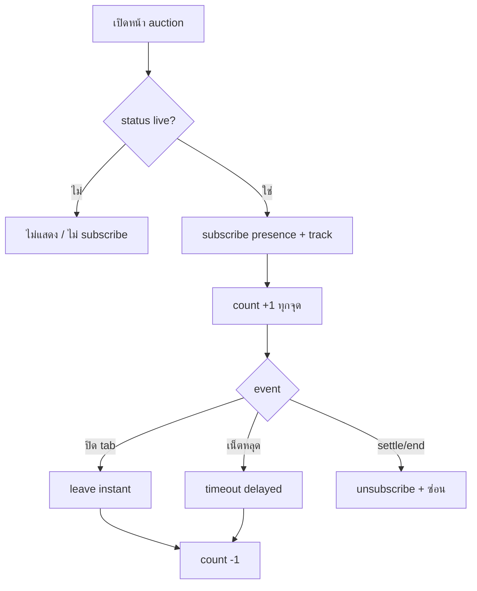

> **โมดูล:** M00006-AuctionViewerPresence · **BRD** (NON-TECHNICAL) · v1.0
> **สถานะ:** scope = **Live Viewer Count (FR-VIEW-01..03)**. Peak (FR-VIEW-04) = Phase 2 (ดู [[PRD]] Controller Decisions OQ-4)

# BRD: ระบบนับผู้ชมกำลังดูประมูล (Auction Viewer Presence)

## 1. บทนำ

### 1.1 วัตถุประสงค์
กำหนด FR non-technical ของ live viewer count บนหน้าประมูล + AC (Given/When/Then) ที่ QA ใช้ได้ตรง + accuracy limitation ที่ยอมรับ (approximate ไม่ใช่ unique-human)

### 1.2 ขอบเขต
ส่วนขยายบนหน้า auction เดิม (00002 + 00004) แสดงจำนวนผู้ชมพร้อมกัน ผ่าน Supabase Realtime Presence
- Input: client subscribe/unsubscribe presence channel เมื่อเปิด/ปิดหน้า auction live
- Output: `viewerCount` (integer) real-time — แสดง ไม่ persist (live count ephemeral)
- ระบบเกี่ยว: Supabase Realtime Presence (ใหม่, คนละ layer จาก broadcast-from-DB เดิม), `supabase-browser.ts`, buyer `/a/[id]` hero, seller console + list

### 1.3 กลุ่มผู้ใช้
| กลุ่ม | สิทธิ์ |
|------|--------|
| Buyer/ผู้ชม (login หรือไม่) | ถูกนับอัตโนมัติ, เห็น count (passive) |
| Seller | เห็น count read-only (console + list) |

## 2. Functional Requirements (Live Viewer Count — MVP)

### FR-VIEW-01: นับผู้ชม (Presence Tracking)
**User Story:** ในฐานะผู้ชม ฉันต้องการเห็นจำนวนคนดูพร้อมกัน เพื่อรู้สึกถึงความคึกคัก

- [ ] `FR-VIEW-01-AC-01` **Given** auction live **When** เปิดหน้า detail **Then** subscribe presence + count +1 (ทุกคนเห็นเลขใหม่)
- [ ] `FR-VIEW-01-AC-02` **Given** ปิด tab/navigate ออกปกติ **When** leave event **Then** count -1
- [ ] `FR-VIEW-01-AC-03` **Given** เน็ตหลุดกะทันหัน **When** presence timeout **Then** count -1 แต่ **ไม่ instant** (bounded delay — known-limitation ไม่ใช่ bug)
- [ ] `FR-VIEW-01-AC-04` **Given** ไม่มีผู้ชม **When** เปิดหน้า **Then** "0 กำลังดู" (component แสดง ไม่ error)
- [ ] `FR-VIEW-01-AC-05` **Given** คนเดียวเปิดหลาย tab **When** นับ **Then** นับซ้ำได้ (known-limitation, ไม่ dedupe ใน MVP)

### FR-VIEW-02: แสดง 3 จุด
- [ ] `FR-VIEW-02-AC-01` buyer `/a/[id]` hero → "N กำลังดู" (`.watch` pill)
- [ ] `FR-VIEW-02-AC-02` seller console → "N กำลังดู" (stat) ตรงกับ buyer
- [ ] `FR-VIEW-02-AC-03` seller list live card → "N กำลังดู" ตรงกับ console
- [ ] `FR-VIEW-02-AC-04` 3 จุดเปิดพร้อมกัน auction เดียว → ตัวเลขซิงก์ตรงกัน (ตาม freshness)

### FR-VIEW-03: Live-Only Scope Guard
- [ ] `FR-VIEW-03-AC-01` **Given** status ∈ {draft,scheduled,ended,unsold,cancelled} **When** เปิด detail **Then** ไม่มี component + ไม่ subscribe
- [ ] `FR-VIEW-03-AC-02` **Given** live → ended/unsold/cancelled ระหว่างดู **When** state เปลี่ยน **Then** unsubscribe + ซ่อน component ทันที (sync กับ status broadcast เดิม)
- [ ] `FR-VIEW-03-AC-03` **Given** scheduled flip → live **When** flip **Then** component เริ่มแสดง/track ได้ (ไม่ต้อง refresh)

## 3. Acceptance สรุป
- ✅ live แสดง count ตาม join/leave (leave จาก network drop ไม่ instant)
- ✅ auction ไม่ live = ไม่มี component
- ✅ ตัวเลขตรงกัน 3 จุด
- ✅ ไม่มี identity ผู้ชมใน response
- ✅ placeBid/settle ไม่กระทบแม้ presence ล่ม

## 4. Business Flow

## 5. Use Cases
- **S1:** A เปิด→1, B เปิด→2 (ทั้งคู่เห็น 2), A ปิด→1 (ตรงกันทุกจุด)
- **S2:** ไม่มีคนดู → "0 กำลังดู" ปกติ
- **S3:** seller จบก่อนเวลา → component หายจากหน้า buyer ที่เปิดค้าง (sync status)
- **S4:** เน็ตหลุด → count ลดช้ากว่าปิด tab ปกติ (known-limitation)

## 6. Quality Requirements
- approximate count (ไม่รับประกัน unique-human); ตรงกันทุกจุด
- join ~real-time; leave จาก drop อาจช้า (ยอมรับ)
- **presence ล่ม ไม่กระทบ placeBid/settle** (fail-safe)
- ไม่มี identity leak

## 7. Constraints
- viewer count ไม่ใช่ตัวชี้วัดแม่นยำ — ห้ามผูก Trust Score/badge/settle
- ไม่แทน WatchList
- ขึ้นกับ Supabase Realtime Presence (ล่ม = count ไม่แสดง แต่ auction ปกติ)
- **ไม่แตะ broadcast-from-DB เดิม** (00002 §2.4) — ใช้ presence channel แยก

## 8. Business Rules
- นับเฉพาะ live; นับทุก client (login/guest); multi-tab นับซ้ำได้
- แสดงแค่ count รวม ไม่มีรายชื่อ; ตรงกันทุกจุด; ไม่ค้างเมื่อ auction ไม่ live

## 9. Glossary
- **Presence** — Supabase Realtime ติดตาม client subscribe ณ ขณะนี้ (ephemeral)
- **Viewer/กำลังดู** — จำนวน client subscribe presence ของ auction ปัจจุบัน
- **Approximate count** — ไม่รับประกัน unique-human (multi-tab ซ้ำ)

## 10. Deferred (Phase 2)
- **Peak Viewers (พีคผู้ชม)** — persist server-write (OQ-4 defer)
- viewer analytics/timeline, anti-bot dedupe, cross-auction total, Deep-App native UI

**หมายเหตุ:** ภาพรวม/OQ ดู [[PRD]]; technical spec ดู [[SRS]] (ออกหลัง review, HR11 — planner)
