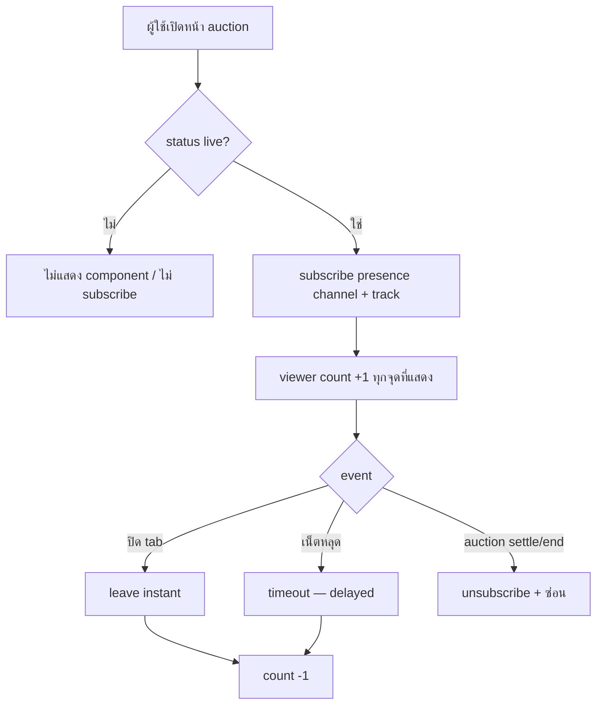

> **โมดูล:** M00006-AuctionViewerPresence · **PRD** · v1.0 · 2026-07-02
> **สถานะ:** OQ resolved (ดู Controller Decisions) — scope = **Live Viewer Count only (MVP)**

---

## 🔒 Controller Decisions (OQ resolved — 2026-07-02)

user สั่งทำ presence ("กำลังดู") + "ลุยต่อให้จบ". เคาะ OQ ตาม PM recommendation:

| OQ | คำถาม | มติ |
|---|---|---|
| OQ-1 | นับใคร | **ทุก client รวม guest** (ephemeral session/tab) — social proof แบบ live |
| OQ-2 | แสดงที่ไหน | **3 จุด**: buyer `/a/[id]` hero, seller console, seller list (live card) |
| OQ-3 | live-only | **ใช่** — เฉพาะ status='live' |
| OQ-4 | **peak (พีคผู้ชม)** | **DEFER → Phase 2** — ต้อง server-write persist ใหม่ (ไม่มี infra), vanity metric, client-report ปลอมได้ |
| OQ-5 | vs WatchList | **เสริมคู่กัน ไม่แทน** — presence=บรรยากาศ ณ ขณะนี้ (ประมาณ), WatchList=intent สะสม (แม่น) |

**Scope รอบนี้ = FR-VIEW-01..03 (live count)** เท่านั้น. peak (FR-VIEW-04) = Phase 2. **ไม่ต้อง DB migration** (live count ephemeral ผ่าน Supabase Presence).

---

## Executive Summary

แสดงจำนวนผู้ชมที่กำลังเปิดหน้า auction พร้อมกัน ("กำลังดู N") แบบ real-time สำหรับ auction status=`live` บน buyer detail (`/a/[id]`), seller console, seller list — ด้วย **Supabase Realtime Presence API** (โปรเจกต์ใช้ Supabase Realtime สำหรับ broadcast currentPrice/bidCount อยู่แล้ว — feature 00002 §2.4)

เป็น **social-proof/engagement signal เสริม ไม่ใช่ core commerce** — ไม่กระทบ placeBid/settle/Order (additive, fail-safe เหมือน feature 00005) และมี **accuracy limitation ที่ยอมรับตั้งแต่ต้น** (นับ session/tab ไม่ใช่ unique-human — multi-tab นับซ้ำได้)

## 1. Business Goals & KPIs

**เป้าหมาย:** ทำให้หน้า live auction "มีชีวิต" (แทน placeholder "142 กำลังดู" ใน mockup ด้วยข้อมูลจริง); seller เห็น engagement signal เพิ่มจาก bidCount ประกอบการตัดสินใจต่อเวลา/จบก่อนเวลา. **ไม่ตั้ง KPI เชื่อมรายได้** (engagement candy).

**KPIs:** viewer count coverage 100% ของ 3 จุด; freshness join ~real-time (leave อาจช้าตาม presence timeout); ไม่ regress placeBid/settle latency.

## 2. Personas
- **Buyer/ผู้ชม** (login หรือไม่ก็ได้) — เปิด `/a/[id]` ถูกนับอัตโนมัติ, เห็น count (passive)
- **Seller** — เห็น count read-only ใน console + list ประกอบการตัดสินใจ

## 3. Business Requirements

### 3.1 Live Viewer Count (presence)
- นับ + แสดงจำนวนคนที่กำลังเปิดหน้า auction นั้นพร้อมกัน real-time ต่อ auction status='live'
- อัปเดตเมื่อคนเข้า/ออก โดยไม่ refresh
- นับทุก client (รวม guest); **ค่าประมาณ** — multi-tab/device นับซ้ำได้ (known-limitation); leave จาก network drop ลดช้าตาม presence timeout

### 3.2 แสดง 3 จุด (integrate component เดิม)
- buyer `/a/[id]` hero overlay (`.watch` pill), seller console (stat), seller list live card
- ตัวเลขตรงกันทุกจุดสำหรับ auction เดียวกัน

### 3.3 Peak (Phase 2 — ไม่ทำรอบนี้)
- "พีคผู้ชม" ต้อง persist (server-write) → defer (OQ-4)

## 4. Business Rules & Constraints
- **Live-only** — presence เฉพาะ status='live'; สถานะอื่นไม่มี component
- **Approximate count** — ไม่ใช่ unique-human; disclose ไม่ label ว่าแม่นยำ
- **No core-flow impact** — presence ล่ม/ช้า ไม่กระทบ placeBid/settle (fail-safe)
- **No viewer identity** — แสดงแค่ตัวเลข ไม่มีรายชื่อ/avatar
- **ไม่ผูก mechanism จริง** — ห้ามใช้ viewer count เป็น input ของ Trust Score/badge/settle
- **ไม่แทน WatchList** — คนละความหมาย (OQ-5)

## 5. Out of Scope
รายชื่อคนดู, viewer analytics/timeline, historical peak chart, anti-bot/dedupe, peak persist (Phase 2), Deep-App native UI, presence สำหรับ auction ไม่ live

## 6. Risks & Mitigation
| ความเสี่ยง | ระดับ | แก้ |
|---|---|---|
| count ไม่แม่น (multi-tab/bot inflate) | กลาง | disclose เป็นค่าประมาณ; ไม่ผูก mechanism จริง; UI ไม่ label "แม่นยำ" |
| แตะ Realtime layer ที่ harden (00002 broadcast-from-DB) | กลาง | ใช้ **presence channel แยก** (`presence:auction:{id}`) ไม่แตะ broadcast trigger เดิม — presence เป็นคนละ protocol (ไม่ผ่าน DB, ไม่มี write) |
| load Realtime เพิ่ม (viewer เยอะ) | ต่ำ-กลาง | live-only scope ลด surface; วัด load ตอน QA |
| vanity metric | ต่ำ | ไม่ตั้ง KPI เชื่อมรายได้ |

## 7. Glossary
- **Presence** — กลไก Supabase Realtime ติดตาม client ที่ subscribe channel ณ ขณะนี้ (ephemeral, ไม่ persist)
- **Viewer/กำลังดู** — จำนวน client subscribe presence ของ auction ณ ปัจจุบัน
- **Approximate count** — ไม่รับประกัน unique-human (multi-tab นับซ้ำ)

## 8. Success Metrics
- viewer count จริงแทน placeholder 100% (3 จุด)
- ไม่ regress placeBid/settle p95
- ไม่มี identity leak ใน payload

## 9. Dependencies & Assumptions
**Deps:** Supabase Realtime Presence API (ใหม่ — คนละ layer จาก broadcast-from-DB เดิม), feature 00002 (channel/status/console), feature 00004 (`/a/[id]` hero), `src/lib/supabase-browser.ts`

**Assumptions:** Presence รองรับ viewer หลักร้อย/auction; live count ephemeral (ไม่ลง Postgres); buyer ส่วนใหญ่ยังไม่ login ตอนดู (สนับสนุน OQ-1 นับ guest); Presence state จัดการที่ Supabase server → ไม่กระทบ Vercel multi-instance (ต่างจาก in-memory rate-limit)

## 10. Appendix — Presence Flow

**หมายเหตุ:** FR/AC ดู [[BRD]]; technical spec ดู [[SRS]] (ออกหลัง review, HR11)
