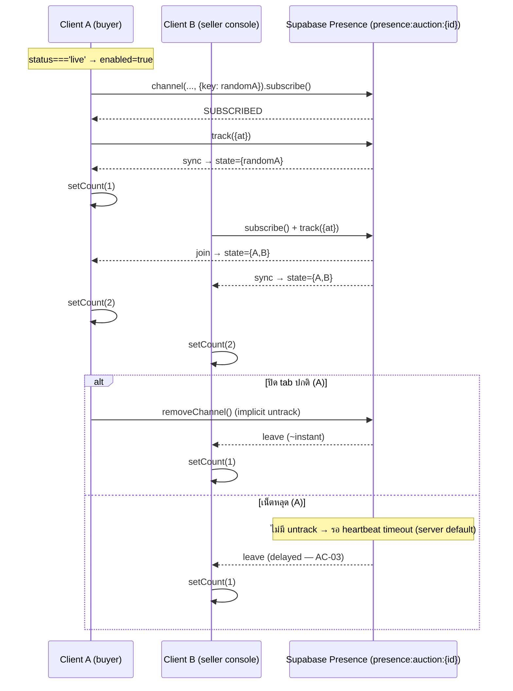
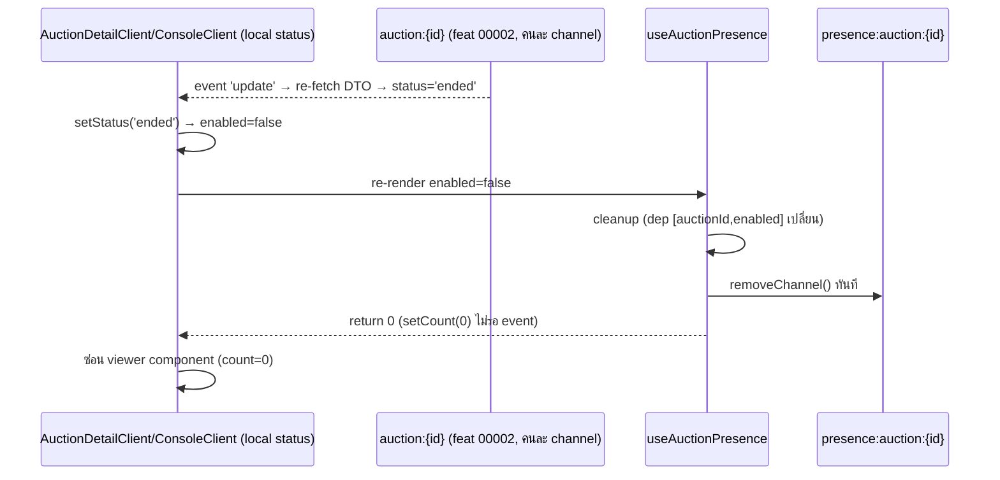

> **โมดูล:** M00006-AuctionViewerPresence · **SDS** · v1.0 · 2026-07-02
> **สถานะ:** Retroactive (HR11) — บันทึกการออกแบบตามโค้ดจริงที่ deploy แล้ว

---

## 1. บทนำ & References
อธิบายการออกแบบ (as-built) ของ Live Viewer Count — component ทำอะไร, data flow client↔Supabase Presence, เหตุผล decision (โดยเฉพาะทำไมแยก channel จาก broadcast) เพื่อ DEV ต่อยอด/แก้ bug โดยไม่ทำลาย isolation. ครอบ 1 hook + 3 จุด integration. ไม่ครอบ backend/DB (ไม่มี — SRS §5) และ broadcast layer เดิม (00002, อ้างอิงเท่านั้น)

อ้างอิง: [[SRS]] (TFR-001~003), [[BRD]] (FR-VIEW), [[PRD]] (OQ-1..5), 00002 SRS §2.4 (broadcast channel — เหตุผลแยก channel)

---

## 2. Architecture Overview
client-only feature — ไม่มี API route/service layer/Prisma model. ทั้งหมดคือ 1 React hook คุย Supabase Realtime **ตรง** ผ่าน `getSupabaseBrowserClient()` (reuse จาก 00002 — ไม่สร้าง client ใหม่)

**decision หลัก:** channel แยก (`presence:auction:{id}`) จาก broadcast (`auction:{id}`) แม้ auction เดียวกัน เพราะ:
1. broadcast harden ไว้แล้ว (sanitize กัน reservePrice/expectedPrice leak) — รวม channel เพิ่ม surface ให้ dev เผลอพลาด payload sensitive
2. presence event (sync/join/leave) กับ broadcast event (update) semantic ต่างกันสิ้นเชิง — แยก = single responsibility ต่อ channel
3. presence ต้อง fail-safe สมบูรณ์ — แยก channel = isolation จริงทาง infra (คนละ WebSocket subscription, ล่มแยกกันได้)

```mermaid
graph TD
    Buyer["Buyer /a/[id] (AuctionDetailClient)"]
    SellerConsole["Seller Console (AuctionConsoleClient)"]
    SellerList["Seller List (AuctionLiveStrip × N cards)"]
    Hook["useAuctionPresence(auctionId, enabled)"]
    SBClient["getSupabaseBrowserClient() singleton"]
    PresenceCh[("Supabase Presence\npresence:auction:{id}")]
    BroadcastCh[("Broadcast (feat 00002)\nauction:{id}")]
    DB[(Postgres — Auction)]
    Buyer -->|เรียก hook| Hook
    SellerConsole -->|เรียก hook| Hook
    SellerList -->|เรียก hook × N| Hook
    Hook --> SBClient
    SBClient -->|subscribe + track| PresenceCh
    Buyer -.->|subscribe แยก (ไม่ใช่ hook นี้)| BroadcastCh
    SellerConsole -.->|subscribe แยก| BroadcastCh
    DB -.->|trigger AFTER UPDATE| BroadcastCh
```
**Deploy:** ไม่มี topology ใหม่ — client bundle +1 hook, ต่อ Supabase Realtime เดิม, ไม่มี env var ใหม่ (reuse `NEXT_PUBLIC_SUPABASE_*`)

---

## 3. Component Design
| Component | Responsibility | Dependency |
|---|---|---|
| `useAuctionPresence` | subscribe/track/count/cleanup — จุดเดียวที่คุย Presence API | hook → supabase-browser.ts |
| `AuctionHero` (buyer) | รับ viewerCount prop → pill `tabler-eye` "N กำลังดู" เฉพาะ count>0 | AuctionHero.tsx |
| `AuctionDetailClient` | เรียก `useAuctionPresence(id, isLive)` 1 ครั้ง ส่งลง hero ตอน isLive | AuctionDetailClient.tsx |
| `ConsoleHead` (seller) | รับ viewerCount prop → chip token (bg-default-100/text-default-600) เฉพาะ count>0 | ConsoleHead.tsx |
| `AuctionConsoleClient` | เรียก `useAuctionPresence(id, status==='live')` 1 ครั้ง ส่งลง ConsoleHead | AuctionConsoleClient.tsx |
| `LiveCardViewers` (list sub-comp) | เรียก `useAuctionPresence(id, true)` **ต่อการ์ด** → text "N กำลังดู" เฉพาะ count>0 | AuctionLiveStrip.tsx |

**หมายเหตุ:** `LiveCardViewers` เรียก hook เอง (ไม่รับ prop) เพราะ strip เป็น pure presentational ไม่มี per-item state holder → seller เปิด list track ตัวเองเป็น viewer ทุก live card พร้อมกัน (ยอมรับใต้ "approximate count" แต่ควรรู้เวลา debug — SRS §8)

---

## 4. Data Flow

### 4.1 Join → Count → Leave


### 4.2 Live-Only Guard (status เปลี่ยนระหว่างเปิดค้าง)

presence **ไม่รู้จัก** status เอง — เชื่อ `enabled` param ที่ parent คำนวณจาก broadcast layer 00002 (separation of concerns)

---

## 5. Integration Points
| จุดเชื่อม | ประเภท | ความเสี่ยงเมื่อล่ม |
|---|---|---|
| Supabase Realtime Presence | External (managed) | count ไม่แสดง/ค้าง 0 — **ไม่กระทบ** auction/placeBid/settle (fail-safe by isolation §2) |
| Broadcast channel (00002) | Internal (คนละ channel, ใช้คำนวณ enabled) | broadcast delay → presence toggle delay ตาม (indirect ไม่ใช่ hard dep) |

Timeout/retry: default `@supabase/supabase-js` ทั้งหมด (heartbeat/reconnect library-internal). API contract: N/A (ไม่มี REST — SRS §4)

---

## 6. Technical Decisions

### TD-001: Presence channel แยกจาก Broadcast-from-DB
`presence:auction:{id}` แทน piggyback บน `auction:{id}`. **เหตุผล:** broadcast harden payload sanitization (00002 §2.4/R-SRS-2) — รวม concern เพิ่มความเสี่ยงให้ dev แก้ผิดจุดกระทบ security guard; presence คนละ Supabase API โดยธรรมชาติ. **ตัดทิ้ง:** รวม channel (ลด 1 WebSocket) — แลกกับ isolation/security ไม่คุ้ม (PRD risk §6). **ผลกระทบ:** +1 WebSocket connection ต่อ subscription (ยอมรับ — live-only + load "ต่ำ-กลาง")

### TD-002: Presence key สุ่มต่อ mount (ไม่ผูก userId)
`${Date.now()}-${random}` แทน session.user.id. **เหตุผล:** OQ-1 (นับทุก client รวม guest) — buyer ส่วนใหญ่ไม่ login; สุ่ม key = ไม่มี PII ผูก presence เลย (BRD §4). **ตัดทิ้ง:** ผูก session.user.id (dedupe login user) — buyer ส่วนใหญ่ guest, ไม่ช่วยลด multi-tab จริง + เพิ่ม complexity. **ผลกระทบ:** ยืนยัน known-limit multi-tab (AC-05) เป็นผลตรงจาก decision ไม่ใช่ bug

### TD-003: hook เดียวทำทั้ง track + read
ไม่แยก track-only/read-only mode — ทุกจุด track ตัวเองเสมอ (เมื่อ enabled). **เหตุผล:** เรียบง่าย ตรง mental model "เปิดหน้า=ผู้ชม 1", ถูกต้องกับ buyer hero + seller console. **ตัดทิ้ง:** แยก 2 hook (track vs read) ให้ list ใช้ read-only — ตัดเพื่อความเรียบง่าย. **ผลกระทบ:** ที่มาของ risk SRS §8 — seller list inflate count เพราะใช้ track-mode ในบริบทที่ควร read-only. **known as-built** (แก้ต้องเปิด scope ใหม่)

---

## 7. Traceability
| SRS | SDS element | สถานะ |
|---|---|---|
| TFR-001 | §3 hook, §4.1 sequence, TD-002 | Done |
| TFR-002 | §4.2 sequence, `enabled` param | Done |
| TFR-003 | §3 (Hero/ConsoleHead/LiveCardViewers), TD-003 | Done (พร้อม known-limit TD-003) |
| NFR Availability (fail-safe) | §2 channel isolation (TD-001) | Done |
| NFR Security (no identity leak) | TD-002 (random key, no PII) | Done |
| NFR Observability (gap) | ไม่มี design element (SRS §6/§8) | Not addressed (documented gap) |

---

## 8. สรุป
hook เดียว (`useAuctionPresence`) คุย Supabase Presence API ตรงจาก client, แยก channel เด็ดขาดจาก broadcast (00002) เพื่อรักษา security isolation, ไม่มี DB/API layer ใหม่ (ephemeral ล้วน)

**ลำดับ build จริง:** (1) `useAuctionPresence.ts` (2) buyer AuctionDetailClient+AuctionHero (3) seller AuctionConsoleClient+ConsoleHead (4) seller AuctionLiveStrip (LiveCardViewers)

**Open:** TD-003 (track ทุกจุดรวม list) ควรทบทวนเป็น read-only ถ้า Phase 2 (peak) ต้องแม่นขึ้น; observability gap ควรเพิ่ม log ก่อนขยาย business-critical
