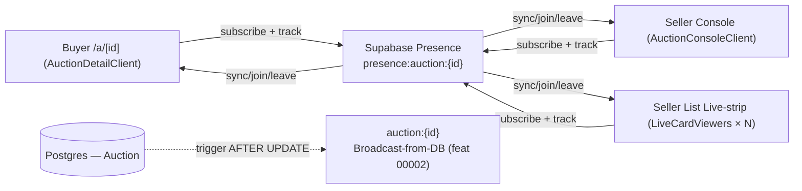
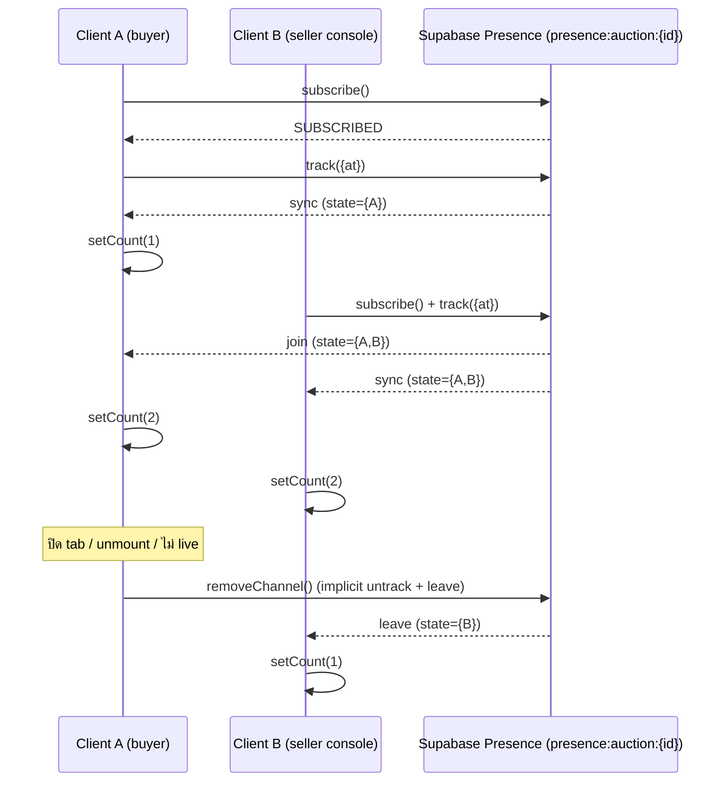

> **โมดูล:** M00006-AuctionViewerPresence · **SRS (TECHNICAL)** · v1.0 · 2026-07-02
> **สถานะ:** Retroactive (HR11) — implement + deploy prod ไปแล้วก่อนมีเอกสาร; บันทึก **as-built**

---

## 1. บทนำ

### 1.1 วัตถุประสงค์
ข้อกำหนดเชิงเทคนิค (retroactive, ตามโค้ดจริง) ของ **Live Viewer Count** บนหน้าประมูล — ผู้อ่าน: DEV (ต่อยอด/maintain), QA (regression), SA (ก่อนแตะ Realtime layer)

### 1.2 ขอบเขต (built)
- hook เดียว `useAuctionPresence` — subscribe Supabase Realtime **Presence API** channel แยกต่อ auction (`presence:auction:{id}`)
- 3 จุดแสดงผล: buyer `/a/[id]` hero (`AuctionHero.tsx`), seller console (`ConsoleHead.tsx` ผ่าน `AuctionConsoleClient.tsx`), seller list live-strip (`AuctionLiveStrip.tsx` → `LiveCardViewers`)
- guard: subscribe เฉพาะ `status === 'live'`

**นอกขอบเขต (ไม่แตะ):** Broadcast-from-DB channel `auction:{id}` เดิม (00002 §2.4); ไม่มี API route ใหม่ (client↔Supabase ตรง); ไม่มี DB schema/migration (§5); peak viewer = defer Phase 2 (OQ-4)

### 1.3 นิยาม
| คำ | ความหมาย |
|---|---|
| Presence | Supabase Realtime Presence API — registry ของ client ที่ track ตัวเองบน channel ขณะนั้น (ephemeral, ไม่ persist Postgres) |
| Presence key | id ต่อ track entry = `${Date.now()}-${random}` สุ่มทุก mount (ต่อ tab, ไม่ผูก userId) |
| presenceState() | เมธอด RealtimeChannel คืน object key = ทุก track entry บน channel |
| viewerCount | `Object.keys(channel.presenceState()).length` |

---

## 2. ภาพรวมสถาปัตยกรรม


**สำคัญ:** 2 channel (`presence:auction:{id}` vs `auction:{id}`) เป็นคนละ object สิ้นเชิง ไม่มี dependency ข้ามกัน — presence ล่มไม่กระทบ broadcast (§7/§8)

| Component | หน้าที่ |
|---|---|
| `useAuctionPresence(auctionId, enabled)` | subscribe/track/count/cleanup — จุดเดียวที่คุย Presence API |
| `getSupabaseBrowserClient()` | client singleton (reuse) |
| `AuctionHero` (buyer) | pill "N กำลังดู" เฉพาะ count>0 |
| `AuctionDetailClient` (buyer) | เรียก hook 1 ครั้ง ส่ง viewerCount ตอน isLive |
| `ConsoleHead` (seller) | chip "N กำลังดู" ข้าง status (รับ prop) |
| `AuctionConsoleClient` (seller) | เรียก hook 1 ครั้ง ส่งลง ConsoleHead |
| `LiveCardViewers` (seller list) | เรียก hook **ต่อการ์ด** (N instance ต่อ N live auction ในแถบ) |

**Deploy:** ไม่มี server component ใหม่ — client↔Supabase Realtime ตรงผ่าน WebSocket. ไม่มี multi-instance state problem (presence state อยู่ที่ Supabase ฝั่งเดียว — ต่างจาก in-memory RL)

---

## 3. Technical Functional Requirements

### TFR-001: Presence Tracking (join/leave/count) — trace FR-VIEW-01
เมื่อ `enabled===true` (live): สร้าง channel `presence:auction:{id}` ด้วย `config:{presence:{key}}` (key สุ่มต่อ mount, **ไม่ผูก userId**). ผูก listener `sync`/`join`/`leave` → handler เดียว คำนวณ count ใหม่ทั้งหมดจาก `presenceState()` (ไม่ใช่ incremental ±1 → กัน drift จาก event ผิดลำดับ). หลัง `SUBSCRIBED` เรียก `channel.track({at:Date.now()})`
- **Edge:** ปิด tab/unmount → cleanup `removeChannel` → leave เกือบทันที (AC-02); เน็ตหลุด → server heartbeat timeout (default, ไม่ config เอง) → leave ช้ากว่า (AC-03 known-limit); ไม่มีใคร track → count=0 (AC-04); คนเดียวหลาย tab → key ต่างกัน → นับหลาย entry inflate (AC-05, by-design)

### TFR-002: Live-Only Scope Guard — trace FR-VIEW-03
hook รับ `enabled` ที่ parent คำนวณจาก client-side `status` state (`status==='live'`) — ไม่ใช่ SSR status (parent ถือ status เป็น local state sync กับ broadcast-from-DB 00002). `enabled===false` → ไม่สร้าง channel, `setCount(0)`, return early
- **Edge:** live→ended (broadcast ทำ status เปลี่ยน) → enabled=false → cleanup removeChannel + setCount(0) ทันที (AC-02); scheduled→live → enabled=true → subscribe ใหม่ทันทีไม่ต้อง refresh (AC-03). **พึ่ง** ความถูกต้อง status sync จาก 00002 — broadcast delay → presence toggle delay ตาม (ไม่ใช่ bug ของ presence)

### TFR-003: แสดงผล 3 จุด ตรงกัน — trace FR-VIEW-02
ทั้ง 3 จุดเรียก hook แยก instance แต่ subscribe **channel name เดียวกัน** → Presence server รวม state เป็นชุดเดียว (server-side SSOT) → ทุก instance count ตรงกัน (modulo propagation timing). **ข้อสำคัญ:** ทั้ง 3 จุด **track ตัวเองด้วย** ไม่ใช่แค่อ่าน → seller เปิดหน้า list ถูกนับเป็น viewer ของ**ทุก live auction ในแถบ**พร้อมกัน (as-built side-effect จาก reuse hook เดียวที่ track+read — ดู SDS TD-003, §8)
- **Edge:** ไม่มี custom retry/reconnect นอกจาก default ของ `@supabase/supabase-js`

---

## 4. Interface Specification
**ไม่มี REST API endpoint ใหม่** — interface = Supabase Realtime Presence protocol (WebSocket ตรง ไม่ผ่าน Next.js server)

### 4.1 Presence Channel Contract
| รายการ | ค่า |
|---|---|
| Channel name | `presence:auction:{auctionId}` |
| Presence key | `${Date.now()}-${Math.random().toString(36).slice(2)}` (สุ่มต่อ mount, ไม่ผูก identity) |
| Track payload | `{ at: number }` timestamp เท่านั้น (ไม่มี PII) |
| Events | `presence` + `sync`/`join`/`leave` (handler เดียว) |
| Auth | Supabase anon key เดิม (public-readable เหมือนหน้า auction) |

### 4.2 Hook Signature
```ts
function useAuctionPresence(auctionId: string, enabled: boolean): number
```
input: auctionId, enabled (จาก `status==='live'`); output: viewer count (0 เมื่อ disabled/ว่าง); **ไม่มี error state** — fail-safe silent (§6/§8)

### 4.3 Sequence (join → count → leave)


---

## 5. Data Requirements
**ไม่มี** DB model/schema/migration. Viewer count = ephemeral ที่ Supabase Realtime Presence server เก็บใน memory เท่านั้น (ไม่ persist Postgres) — ตรง PRD/BRD ("live count ephemeral"); peak (ต้อง persist) = defer Phase 2 (OQ-4). ERD/lifecycle: N/A (track เมื่อ subscribe → หายเมื่อ disconnect/timeout, ไม่มี retention)

---

## 6. NFR (as-built)
| ด้าน | สถานะ |
|---|---|
| Performance | ไม่มี formal latency measurement (client-only); sub-second ผ่าน WebSocket ปกติเชิงคุณภาพ |
| Scalability | รองรับ viewer หลักร้อย/auction (PRD assumption); ไม่มี load test ทางการ |
| Availability | **fail-safe by design** — hook ไม่ throw เมื่อ subscribe fail; ไม่มี dependency จาก broadcast/order/bid → presence (one-way: presence อ่านแค่ status จาก parent) |
| Security | track payload = `{at}` เท่านั้น (ไม่มี userId/email/phone); key random ไม่ reverse หา identity |
| Observability | **Gap (as-built):** ไม่มี `.catch`/error log เมื่อ subscribe fail — silent ทั้งหมด; debug prod ต้องพึ่ง Supabase dashboard |
| Maintainability | hook เดียวทั้ง 3 จุด (ไม่ copy-paste) |

---

## 7. Constraints & Dependencies
- ใช้ Supabase Presence API เดิม (ผ่าน singleton client); timeout/heartbeat = default library/server (ไม่ override); ต้อง subscribe channel **แยก** จาก broadcast เสมอ (กันกระทบ reservePrice/expectedPrice leak guard 00002)
- **deps:** Supabase Realtime Presence (external managed), `status` state จาก 00002 broadcast (internal), `supabase-browser.ts` singleton
- **assumptions:** Presence รองรับ concurrent หลักร้อย/channel โดยไม่ tune (ยังไม่ load-test); Vercel multi-instance ไม่กระทบ (ไม่มี in-memory state ฝั่ง Next.js)

---

## 8. Architectural Risks
| ความเสี่ยง | ผลกระทบ | mitigation |
|---|---|---|
| seller list auto-track ทุก live card ในแถบ (§3 TFR-003) | inflate count ของ auction ที่ seller ไม่ได้เปิด detail จริง | ยอมรับใต้ "approximate count" BRD — แต่ควรรู้เวลา query "ทำไม count เยอะกว่าคาด" |
| ไม่มี error/log เมื่อ subscribe fail (§6) | debug prod ยาก (count ค้าง 0) | ยังไม่มี — known-gap (retroactive-only) |
| แตะ Realtime layer ที่ 00002 harden | dev รุ่นถัดไปอาจ reintroduce leak ถ้ารวม channel | mitigation = **แยก channel เด็ดขาด** (§2, §7 = guardrail) |
| Load เพิ่มบน Realtime เมื่อ auction ร้อน | connection คูณจาก 3 จุด track | ยังไม่มี load test ยืนยัน threshold |

---

## 9. Traceability
| BRD FR | SRS TFR | Component | สถานะ |
|---|---|---|---|
| FR-VIEW-01 (AC-01..05) | TFR-001 | useAuctionPresence.ts | Done |
| FR-VIEW-02 (AC-01..04) | TFR-003 | AuctionHero/ConsoleHead/AuctionLiveStrip | Done |
| FR-VIEW-03 (AC-01..03) | TFR-002 | useAuctionPresence (enabled) + parent status (00002) | Done |

**Open (พบตอนเขียนย้อนหลัง):** seller list auto-track (feature/bug?), observability gap — ควรพิจารณาก่อนขยาย scope (Phase 2 peak)
