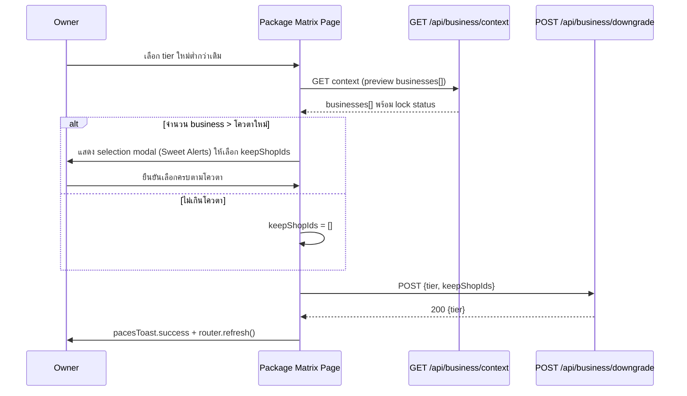

> **โมดูล:** M00008-BusinessAccountPackages
> **ประเภทเอกสาร:** API Contract
> **เวอร์ชัน:** 1.0
> **วันที่จัดทำ:** 2026-07-02
> **สถานะ:** Draft
> **เจ้าของเอกสาร:** SA (ดู [[Feature-Docs-Ownership]])

# API Contract: Business Account & Packages

---

## 1. Overview

API ชุดนี้รองรับ **Business Account & Packages (M00008)** ฝั่ง seller (`seller.*`): owner-level subscription lifecycle, business shop lifecycle (create/soft-delete/restore), membership (invite/accept/remove), active-shop-context switch, และ lifecycle cron (internal, server-to-server)

**Provider:** Next.js 16 App Router Route Handlers (nodejs runtime, Vercel Serverless)
**ผู้บริโภค:** package matrix page, create-business form, invite management page, `AccountSwitcher` (seller UI), Vercel Cron scheduler (internal)
**Base URL:** `https://seller.deepthailand.app` (prod) / `https://seller.deepth.local:4000` (dev)
**Content-Type:** `application/json`
**Convention:** success `{ ... }`; error `{ "error": "<CODE>" }` (ดู §5) — pattern เดียวกับ feature 00003

- **ต้นทาง:** [[SDS]] §3-4; schema → [[DATABASE]] + DATABASE DELTA (**Phase 1 migration ต้อง apply ก่อน**; Phase 2 gated แยก — ดู [[SRS]] §7.2)
- ไม่มี endpoint ฝั่ง buyer app (`/api/app/*`) เกี่ยวข้อง — feature นี้เป็น seller-side ล้วน

---

## 2. Authentication

| รายการ | ค่า |
|--------|-----|
| **Auth Method (seller endpoints)** | NextAuth v4 session cookie; `getServerSession(authOptions)` |
| **Auth Method (cron endpoint)** | `Authorization: Bearer {CRON_SECRET}` เท่านั้น — ไม่มี session |
| **Owner-only endpoints** | resolve `ownerId = session.user.id` เสมอ (ไม่รับจาก client body) — action ผูก ownership check เดี่ยว (`shop.userId===session.user.id`) ไม่ใช่ RBAC matrix (ดู [[SRS]] §5) |
| **Member-scoped endpoints** | `isShopMember(shopId, session.user.id)` guard — Owner/Admin เข้าถึงเท่ากัน (membership-based, MVP) |
| **ไม่มี session** | 401 `{ "error": "unauthorized" }` |
| **CSRF** | `guardApi` ตรวจ Origin ทุก mutation ยกเว้น `/api/auth/*`, `/api/app/*`, `/api/cron/*` (exclude มีอยู่แล้ว — ไม่ต้องแก้ proxy.ts) |
| **Rate-limit** | auth 30/min, unauth 100/min per IP (globalThis) — cron ตกใน unauth bucket (รัน 1 ครั้ง/วัน ไม่มีปัญหา) |

---

## 3. Endpoint List

| Method | Path | คำอธิบาย | Auth |
|--------|------|----------|------|
| `GET` | `/api/business/context` | Owner/member ของ user — Personal + Business list (role, lock/soft-delete status) + subscription summary | session |
| `POST` | `/api/business/subscribe` | Subscribe package ครั้งแรก | session (owner) |
| `POST` | `/api/business/upgrade` | อัพเกรด tier | session (owner) |
| `POST` | `/api/business/downgrade` | ดาวน์เกรด tier + owner-selected lock | session (owner) |
| `POST` | `/api/business/cancel` | ยกเลิก package กลับ Free — lock ALL + 30-day grace | session (owner) |
| `POST` | `/api/business/reactivate` | Reactivate จาก LOCKED_RENEWAL_FAILED | session (owner) |
| `POST` | `/api/business/shops` | สร้าง Business ใหม่ | session (owner) |
| `DELETE` | `/api/business/shops/[shopId]` | Soft-delete Business (30-day retention) | session (owner) |
| `POST` | `/api/business/shops/[shopId]/restore` | Restore Business ภายใน 30 วัน | session (owner) |
| `POST` | `/api/business/shops/[shopId]/invites` | Invite admin | session (owner) |
| `GET` | `/api/business/shops/[shopId]/invites` | List invite PENDING | session (member) |
| `DELETE` | `/api/business/shops/[shopId]/invites/[inviteId]` | ยกเลิก invite ที่ยังไม่ accept | session (owner) |
| `POST` | `/api/invites/[inviteId]/accept` | ผู้ถูก invite กด accept | session (invitee) |
| `DELETE` | `/api/business/shops/[shopId]/members/[memberId]` | ลบ admin | session (owner) |
| `POST` | `/api/business/switch-context` | Validate membership ก่อน client เรียก `session.update()` | session |
| `POST` | `/api/cron/business-package-lifecycle` | Renewal + auto-soft-delete + purge (3-phase, daily) | `CRON_SECRET` bearer |

---

## 4. Endpoint Detail

### 4.1 `GET /api/business/context`

คืนข้อมูล switcher + package summary ของ session user ปัจจุบัน — เรียกโดย `AccountSwitcher` และหน้า package matrix (preview ก่อน downgrade/cancel)

**Response 200:**
```json
{
  "personal": { "shopId": "uuid", "shopName": "ร้านของฉัน" },
  "subscription": {
    "tier": "PRO", "status": "ACTIVE", "nextRenewalAt": "2026-08-01T13:00:00.000Z",
    "quota": { "maxBusinesses": 3, "maxAdminsPerBusiness": 3 }
  },
  "businesses": [
    { "shopId": "uuid", "shopName": "สาขา 2", "role": "OWNER", "locked": false, "lockReason": null, "deletedAt": null },
    { "shopId": "uuid", "shopName": "สาขา 3", "role": "ADMIN", "locked": true, "lockReason": "QUOTA_EXCEEDED_ADMIN_COUNT", "deletedAt": null }
  ],
  "hasBusinessMembership": true
}
```
`subscription: null` = NOT_SUBSCRIBED (FREE — ไม่มี row) — client แสดง upsell

**Errors:** 401

---

### 4.2 `POST /api/business/subscribe`

Trace: [[SRS]] TFR-001, [[SDS]] §3.2

**Request:** `{ "tier": "GROWTH" | "PRO" | "BUSINESS" }`

**Response 200:** `{ "status": "ACTIVE", "nextRenewalAt": "2026-08-01T..." }`

**Errors:**
| Status | Code | เงื่อนไข |
|--------|------|----------|
| 401 | — | ไม่มี session |
| 412 | `PERSONAL_SHOP_REQUIRED` | owner ยังไม่มี Personal shop |
| 409 | `SUBSCRIPTION_ALREADY_EXISTS` | มี subscription row อยู่แล้ว |
| 402 | `INSUFFICIENT_CREDIT` | เครดิต Personal wallet ไม่พอ |
| 400 | `VALIDATION_ERROR` | `tier` ไม่ใช่ enum ที่รู้จัก |

**Side-effects:** `WalletTransaction` (DEDUCT, `reason="BUSINESS_PACKAGE_SUBSCRIPTION"`) 1 รายการ; ถ้ามี Business shop ค้าง grace จาก cancel ก่อนหน้า → ปลดล็อกอัตโนมัติเข้ากรอบโควตาใหม่

```json
// Request → Response
{ "tier": "GROWTH" }  →  { "status": "ACTIVE", "nextRenewalAt": "2026-08-01T13:00:00.000Z" }
```

---

### 4.3 `POST /api/business/upgrade`

Trace: TFR-014. **Request:** `{ "tier": "PRO" }` (ต้องสูงกว่า tier ปัจจุบัน)

**Response 200:** `{ "tier": "PRO" }`

**Errors:** 401; 409 `SUBSCRIPTION_NOT_ACTIVE`; 409 `NOT_AN_UPGRADE`; 402 `INSUFFICIENT_CREDIT`; 412 `PERSONAL_SHOP_REQUIRED`

**Side-effects:** หักเต็มราคา tier ใหม่ทันที + **reset renewal cycle**; auto-unlock business/admin ที่กลับมาอยู่ในโควตา (RD-3, TFR-016)

---

### 4.4 `POST /api/business/downgrade`

Trace: TFR-015. **Request:**
```json
{ "tier": "GROWTH", "keepShopIds": ["uuid-1"] }
```
`keepShopIds` = business ที่ owner เลือกให้คง ACTIVE (ต้อง ≤ โควตาใหม่); ส่ง `[]` ได้ถ้าจำนวน business ปัจจุบัน ≤ โควตาใหม่อยู่แล้ว

**Response 200:** `{ "tier": "GROWTH" }`

**Errors:** 401; 409 `SUBSCRIPTION_NOT_ACTIVE`; 409 `NOT_A_DOWNGRADE`; 400 `KEEP_SELECTION_EXCEEDS_QUOTA`; 400 `INVALID_SHOP_SELECTION`

**Side-effects:** **ไม่หักเครดิตทันที** (RD-4) — ล็อก business ที่ไม่ถูกเลือก (`QUOTA_EXCEEDED_BUSINESS_COUNT`, ไม่มี grace) + ล็อก business ที่ admin เกินโควตาต่อธุรกิจแยกต่างหาก (`QUOTA_EXCEEDED_ADMIN_COUNT`)

---

### 4.5 `POST /api/business/cancel`

Trace: TFR-018 (ใหม่ — ปิด DATABASE.md open item #2). **Request:** `{}`

**Response 200:** `{ "status": "NOT_SUBSCRIBED" }`

**Errors:** 401; 409 `SUBSCRIPTION_NOT_ACTIVE`

**Side-effects:** ล็อก **ทุก** Business shop ของ owner ทันที (`reason="OWNER_CANCELLED_PACKAGE"`, grace-eligible) + ลบ `BusinessPackageSubscription` row ทันที (owner=FREE ทันที) — grace 30 วันเริ่มนับต่อ shop จาก `packageLockedAt` (ไม่ผูกกับ subscription row ที่ถูกลบไปแล้ว) — **client ต้อง confirm dialog (Sweet Alerts) แสดงจำนวน business + deadline ก่อนยิง request นี้** (เรียก `GET /context` มา preview ก่อน)

---

### 4.6 `POST /api/business/reactivate`

Trace: TFR-005. **Request:** `{}`

**Response 200:** `{ "status": "ACTIVE" }`

**Errors:** 401; 409 `SUBSCRIPTION_NOT_LOCKED` (ใช้ได้เฉพาะตอน `LOCKED_RENEWAL_FAILED` — ถ้า cancel ไปแล้ว (row ถูกลบ) ต้องใช้ `/subscribe` แทน); 402 `INSUFFICIENT_CREDIT`; 412 `PERSONAL_SHOP_REQUIRED`

---

### 4.7 `POST /api/business/shops`

Trace: TFR-006. **Request:**
```json
{ "shopName": "สาขา 2", "businessType": "INDIVIDUAL", "category": "fashion", "description": "..." }
```

**Response 201:** `{ "shopId": "uuid", "shopName": "สาขา 2", "kind": "BUSINESS" }`

**Errors:** 401; 403 `NO_ACTIVE_PACKAGE`; 403 `BUSINESS_QUOTA_EXCEEDED`; 400 `VALIDATION_ERROR`

**Side-effects:** `ShopMember(role=OWNER)` + `SellerWallet(balance=0)` สร้างพร้อมกัน (atomic)

---

### 4.8 `DELETE /api/business/shops/[shopId]`

Trace: TFR-019 (ใหม่). Soft-delete — **ไม่ลบข้อมูลจริง**

**Response 200:** `{ "shopId": "uuid", "deletedAt": "2026-07-02T...", "purgeDeadline": "2026-08-01T..." }`

**Errors:** 401; 403 `NOT_OWNER`; 409 `ALREADY_DELETED`

---

### 4.9 `POST /api/business/shops/[shopId]/restore`

Trace: TFR-020 (ใหม่). **Request:** `{}`

**Response 200:** `{ "shopId": "uuid", "status": "ACTIVE" | "LOCKED", "lockReason": null | "QUOTA_EXCEEDED_BUSINESS_COUNT" }`

**Errors:** 401; 403 `NOT_OWNER`; 409 `NOT_DELETED`; **410** `RESTORE_WINDOW_EXPIRED` (purged แล้ว — ถาวร)

---

### 4.10 `POST /api/business/shops/[shopId]/invites`

Trace: TFR-008. **Request:** `{ "contact": "0812345678", "contactType": "PHONE" }`

**Response 201:** `{ "inviteId": "uuid", "status": "PENDING" }`

**Errors:** 401; 403 `NOT_OWNER`; 403 `NO_ACTIVE_PACKAGE` (owner ไม่มี package ACTIVE — defensive, ปกติ shop จะ `SHOP_LOCKED` ก่อนอยู่แล้ว); 403 `SHOP_LOCKED`; 403 `ADMIN_QUOTA_EXCEEDED`; 409 `INVITE_ALREADY_PENDING`; 400 `VALIDATION_ERROR`

---

### 4.11 `GET /api/business/shops/[shopId]/invites`

Trace: TFR-008. List PENDING invite ของ shop (owner management page)

**Response 200:** `{ "invites": [{ "id": "uuid", "invitedContact": "***-***-5678", "contactType": "PHONE", "status": "PENDING", "createdAt": "..." }] }`

**หมายเหตุ PII:** `invitedContact` **mask ที่ server ก่อนส่ง** (RSC boundary neutralize-at-source — SRS NFR §8) — ไม่ส่งเบอร์/อีเมลดิบเข้า client component

**Errors:** 401; 403 `NOT_MEMBER`

---

### 4.12 `DELETE /api/business/shops/[shopId]/invites/[inviteId]`

**Response 200:** `{ "status": "CANCELLED" }`

**Errors:** 401; 403 `NOT_OWNER`; 409 `INVITE_NOT_PENDING`

---

### 4.13 `POST /api/invites/[inviteId]/accept`

Trace: TFR-009. **Request:** `{}` (ต้อง login แล้ว — ถ้ายังไม่มีบัญชี client redirect ไป signup ก่อน)

**Response 200:** `{ "shopId": "uuid", "role": "ADMIN" }`

**Errors:** 401; 409 `INVITE_NOT_PENDING`; 403 `CONTACT_MISMATCH`; 403 `ADMIN_QUOTA_EXCEEDED_AT_ACCEPT`

---

### 4.14 `DELETE /api/business/shops/[shopId]/members/[memberId]`

Trace: TFR-010. **Response 200:** `{ "status": "REMOVED" }`

**Errors:** 401; 403 `NOT_OWNER`; 400 `NOT_AN_ADMIN` (พยายามลบ OWNER)

**Side-effects:** hard delete `ShopMember`; auto-unlock ถ้า shop เคย `QUOTA_EXCEEDED_ADMIN_COUNT` และตอนนี้พอดีโควตา

---

### 4.15 `POST /api/business/switch-context`

Trace: TFR-012. **Request:** `{ "shopId": "uuid" }`

**Response 200:** `{ "shopId": "uuid", "kind": "PERSONAL" | "BUSINESS", "role": "OWNER" | "ADMIN" }`

**Errors:** 401; 403 `NOT_MEMBER`

**หมายเหตุ:** endpoint นี้ **ไม่ persist อะไรฝั่ง server เอง** (ไม่มี session store แยก) — แค่ validate membership แล้วคืน ok ให้ client เรียก NextAuth `useSession().update({ activeShopId })` ต่อ (ซึ่งจะ re-verify อีกชั้นใน jwt callback — ดู [[SDS]] TD-004) — 2-layer verify โดยตั้งใจ

---

### 4.16 `POST /api/cron/business-package-lifecycle`

Trace: TFR-002, TFR-021, TFR-022. Internal, server-to-server เท่านั้น

**Header required:** `Authorization: Bearer {CRON_SECRET}`

**Response 200:**
```json
{
  "renewal": { "processed": 12, "renewed": 10, "locked": 2, "errors": 0 },
  "autoSoftDelete": { "processed": 3, "softDeleted": 3, "errors": 0 },
  "purge": { "processed": 1, "purged": 1, "errors": 0 }
}
```

**Errors:** 401 (header ไม่ตรง — ไม่แตะ DB เลย)

**Idempotency:** ทุก phase idempotent ตาม design ของ [[SDS]] §3.2-3.3 (RC-3 claim สำหรับ renewal; WHERE-filter กันซ้ำเองสำหรับ auto-soft-delete/purge)

**maxDuration:** `export const maxDuration = 60`

---

## 5. Error Code Table

| Error Code | HTTP Status | ความหมาย |
|------------|-------------|----------|
| `VALIDATION_ERROR` | 400 | Valibot schema fail |
| `KEEP_SELECTION_EXCEEDS_QUOTA` | 400 | downgrade — เลือก keep เกินโควตาใหม่ |
| `INVALID_SHOP_SELECTION` | 400 | downgrade — keepShopIds มี id ที่ไม่ใช่ของ owner |
| `NOT_AN_ADMIN` | 400 | remove-member พยายามลบ OWNER |
| `UNAUTHORIZED` | 401 | ไม่มี session / CRON_SECRET ไม่ตรง |
| `NOT_OWNER` | 403 | action owner-only แต่ caller ไม่ใช่ owner |
| `NOT_MEMBER` | 403 | action member-only แต่ caller ไม่ใช่สมาชิก shop นั้น |
| `SHOP_LOCKED` | 403 | shop ถูกล็อก (ทุกเหตุผล) — ปฏิเสธ mutation |
| `NO_ACTIVE_PACKAGE` | 403 | สร้าง business แต่ owner ไม่มี package ACTIVE |
| `BUSINESS_QUOTA_EXCEEDED` | 403 | สร้าง business เกินโควตาจำนวนธุรกิจ |
| `ADMIN_QUOTA_EXCEEDED` | 403 | invite เกินโควตา admin ต่อธุรกิจ |
| `ADMIN_QUOTA_EXCEEDED_AT_ACCEPT` | 403 | accept invite — โควตาหดตัวระหว่างรอ |
| `CONTACT_MISMATCH` | 403 | accept invite — contact ไม่ตรงกับ user login |
| `PERSONAL_SHOP_REQUIRED` | 412 | ยังไม่มี Personal shop สำหรับจ่ายเงิน |
| `SUBSCRIPTION_ALREADY_EXISTS` | 409 | subscribe ซ้ำ |
| `SUBSCRIPTION_NOT_ACTIVE` | 409 | upgrade/downgrade/cancel แต่ status ไม่ใช่ ACTIVE |
| `SUBSCRIPTION_NOT_LOCKED` | 409 | reactivate แต่ status ไม่ใช่ LOCKED_RENEWAL_FAILED |
| `NOT_AN_UPGRADE` / `NOT_A_DOWNGRADE` | 409 | tier ที่ส่งมาไม่ใช่ทิศทางที่ endpoint รองรับ |
| `ALREADY_DELETED` / `NOT_DELETED` | 409 | soft-delete/restore ผิดสถานะปัจจุบัน |
| `INVITE_ALREADY_PENDING` / `INVITE_NOT_PENDING` | 409 | invite ผิดสถานะ |
| `RESTORE_WINDOW_EXPIRED` | 410 | restore หลัง purge ไปแล้ว — ถาวร |
| `INSUFFICIENT_CREDIT` | 402 | เครดิต Personal wallet ไม่พอ |
| `Rate limit exceeded` | 429 | guardApi rate-limit |

**โครง error response มาตรฐาน:**
```json
{ "error": "SHOP_LOCKED" }
```
(convention เดิมของโปรเจกต์เป็น string เดียว ไม่ใช่ nested object — มิเรอร์ feature 00003)

---

## 6. Sequence — Downgrade Preview + Confirm (ตัวอย่าง flow ซับซ้อนที่สุด)



---

## 7. Traceability

| Endpoint | SDS Component | SRS TFR | BRD FR |
|----------|----------------|---------|--------|
| `GET /business/context` | shop-context.ts + business-package.service | TFR-012 | FR-BIZ-14 |
| `POST /business/subscribe` | business-package.service.subscribeBusinessPackage | TFR-001 | FR-BIZ-01 |
| `POST /business/upgrade` | .upgradeBusinessPackage | TFR-014 | FR-BIZ-16, 21 |
| `POST /business/downgrade` | .downgradeBusinessPackage | TFR-015 | FR-BIZ-17, 18, 19 |
| `POST /business/cancel` | .cancelBusinessPackage | TFR-018 | FR-BIZ-27 (ใหม่) |
| `POST /business/reactivate` | .reactivateBusinessPackage | TFR-005 | FR-BIZ-05 |
| `POST /business/shops` | business-shop.service.createBusinessShop | TFR-006 | FR-BIZ-06, 07 |
| `DELETE /business/shops/[id]` | .softDeleteBusinessShop | TFR-019 | FR-BIZ-25 (ใหม่) |
| `POST /business/shops/[id]/restore` | .restoreBusinessShop | TFR-020 | FR-BIZ-26 (ใหม่) |
| `POST/GET/DELETE /business/shops/[id]/invites*` | shop-member.service (invite/list/cancel) | TFR-008 | FR-BIZ-09, 12 |
| `POST /invites/[id]/accept` | shop-member.service.acceptShopInvite | TFR-009 | FR-BIZ-10 |
| `DELETE /business/shops/[id]/members/[id]` | shop-member.service.removeShopMember | TFR-010 | FR-BIZ-11 |
| `POST /business/switch-context` | shop-context.ts isShopMember + auth.ts jwt callback | TFR-012, 013 | FR-BIZ-14, 15 |
| `POST /cron/business-package-lifecycle` | renewOrLockBusinessPackage + autoSoftDeleteLapsedShops + purgeExpiredShops | TFR-002, 021, 022 | FR-BIZ-02, 28 (ใหม่), 29 (ใหม่) |

---

## 8. สรุป (Summary)

API Contract นี้กำหนด 16 endpoint ใหม่ (8 owner-only, 3 member-scoped, 1 invitee-scoped, 1 hybrid validate, 1 cron) ครอบคลุม subscription lifecycle เต็มรูป (subscribe/upgrade/downgrade/**cancel**/reactivate — cancel เป็น endpoint ใหม่ที่ปิด DATABASE.md open item #2), business shop lifecycle รวม **soft-delete/restore** (ใหม่จาก decision 2026-07-02), membership (invite/accept/remove — membership-based เท่านั้น ไม่มี granular RBAC endpoint), และ context switch แบบ 2-layer verify (`switch-context` API + NextAuth `session.update()` trigger ที่ re-verify ซ้ำใน jwt callback)

**Error model** มิเรอร์ feature 00003 เป๊ะ (`{ "error": "<CODE>" }`, ไม่ nested object) — QA ใช้ตาราง §5 วางแผน negative test ทุก boundary (quota เป๊ะพอดี, grace เป๊ะ 30 วัน, retention เป๊ะ 30 วัน)

**Open Questions (ยกไป Controller):**
- Endpoint `/business/cancel` และ `/business/shops/[id]/restore` — response shape สุดท้าย (`purgeDeadline` ISO string) ต้อง cross-check กับ UX ว่า client ต้องการ field ไหนเพิ่มสำหรับแสดง countdown (เช่น `daysRemaining` แทน raw timestamp) — ไม่ block implement, ปรับ response ได้ตอน build
- `GET /invites` PII masking format (`***-***-5678`) — ต้อง cross-check กับ pattern masking ที่ใช้อยู่แล้วสำหรับ `Order.buyerContact`/`Review.reviewerContact` (memory `feedback_rsc_pii_neutralize_at_source`) ให้ตรงกันเป๊ะ ไม่ใช่คิดใหม่
