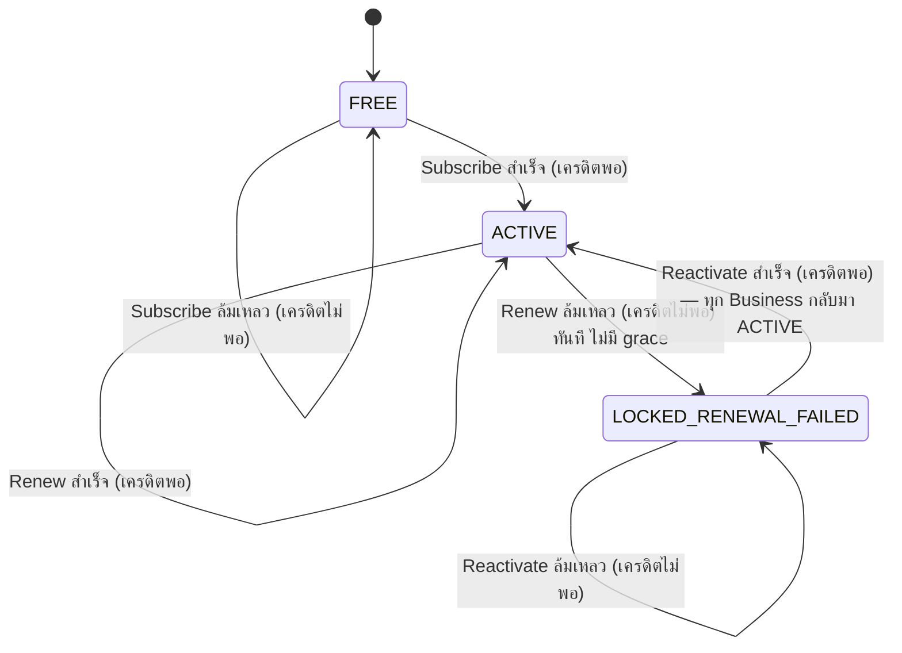
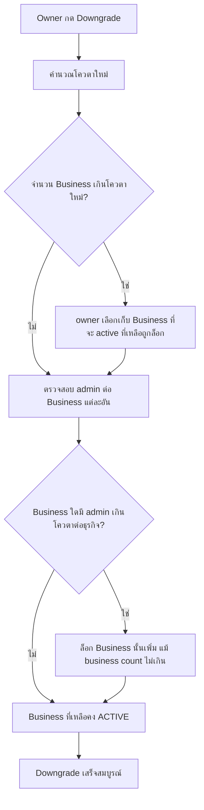
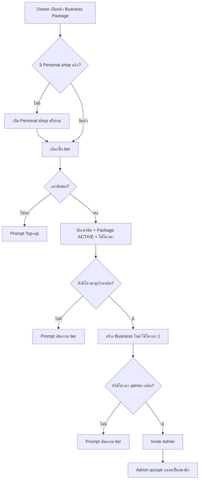
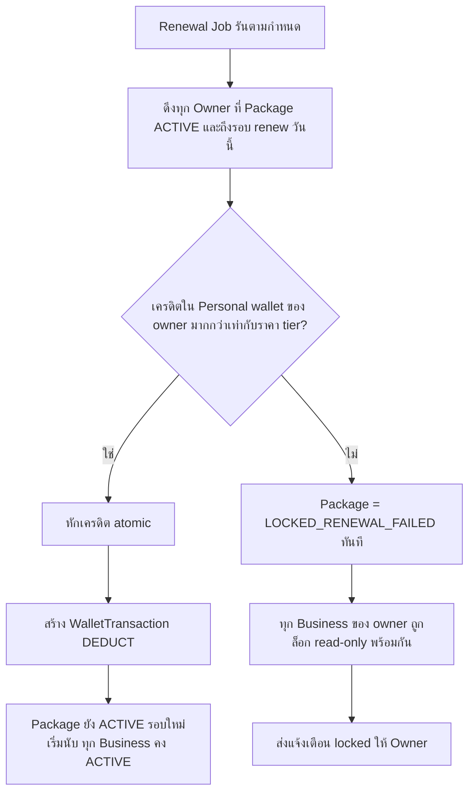
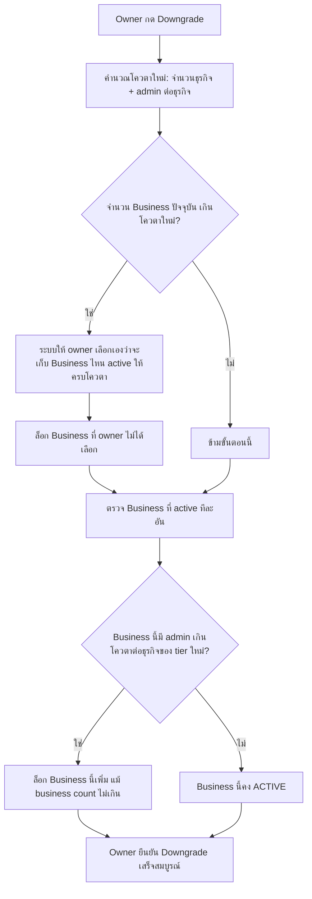

> **โมดูล:** M00008-BusinessAccountPackages
> **ประเภทเอกสาร:** Business Requirements Document (BRD) — NON-TECHNICAL
> **เวอร์ชัน:** 1.0
> **วันที่จัดทำ:** 2026-07-02
> **สถานะ:** Draft
> **เจ้าของเอกสาร:** BA (ดู [[Feature-Docs-Ownership]])

# BRD: ระบบอัพเกรดเป็น Business (Business Account & Packages) (Business Requirements Document)

---

## 1. บทนำ

### 1.1 วัตถุประสงค์ของเอกสาร

เอกสารนี้มีวัตถุประสงค์เพื่อ:
1. กำหนด Functional Requirements ระดับ non-technical สำหรับ Business Account & Packages — subscription tier ใหม่ (Free/Growth/Pro/Business) ที่ให้ Seller สร้าง Business account แบบทีม แยกจาก Personal account เดิม
2. กำหนดขอบเขตการทำงานของ package lifecycle (subscribe/renew/upgrade/downgrade/lock), business lifecycle (create/lock/unlock), และ membership lifecycle (invite/accept/remove admin) พร้อมกฎที่ระบบต้องบังคับ
3. ระบุเงื่อนไขการรับงาน (Acceptance Criteria) แบบ Given/When/Then ที่ทีม QA นำไปสร้าง Test Case ได้โดยตรง — โดยเฉพาะเงื่อนไข backward compatibility ต่อ Personal/Free flow เดิม ซึ่งเป็นความเสี่ยงสูงสุดของ feature นี้ (แตะ core relation ของทั้งระบบ)
4. สร้างความเข้าใจร่วมกันระหว่างทีมธุรกิจและทีมพัฒนา ก่อนเริ่ม implement feature

### 1.2 ขอบเขตของระบบ

**Business Account & Packages** คือระบบ subscription 4 ระดับที่ให้ Owner (Seller ที่มี Personal shop อยู่แล้ว) ซื้อสิทธิ์สร้าง Business account — Shop แบบทีมที่แยกขาดจาก Personal shop เดิม — พร้อม invite พนักงานเข้ามาเป็น admin ช่วยบริหาร ภายใต้โควตาจำนวนธุรกิจ/admin ตาม tier ที่ซื้อ ระบบต้องรองรับการสลับ context ระหว่าง Personal และ Business ได้ตลอด และต้องล็อกอ่านอย่างเดียว (ไม่ลบข้อมูล) เมื่อ renewal ล้มเหลวหรือดาวน์เกรดจนเกินโควตา

**เข้าสู่ระบบ (Input):**
- คำสั่งซื้อ/อัพเกรด/ดาวน์เกรด package จาก Owner (ทริกเกอร์การหักเครดิตจาก SellerWallet ของ Personal shop)
- คำสั่งสร้าง Business ใหม่จาก Owner (บริโภคโควตาจำนวนธุรกิจ)
- คำสั่ง invite/remove admin จาก Owner (บริโภค/ปลดปล่อยโควตา admin ต่อธุรกิจ)
- คำสั่งสลับ context (Personal ⇄ Business) จาก Owner/Admin
- Renewal job (scheduled) ที่ตรวจสอบและหักเครดิตทุกรอบต่อ owner

**ออกจากระบบ (Output):**
- สถานะ Package Entitlement ของ Owner (FREE / ACTIVE ตาม tier / LOCKED-RENEWAL-FAILED)
- สถานะแต่ละ Business (ACTIVE / LOCKED read-only)
- WalletTransaction (DEDUCT, reason = "Business Package Subscription") แยกจาก Inventory Add-on
- Membership record ต่อ Business (OWNER/ADMIN)
- Error/prompt เมื่อพยายามสร้าง Business หรือ invite admin เกินโควตา
- การแจ้งเตือนล่วงหน้าก่อนรอบ renew + แจ้งเตือนเมื่อถูกล็อก

**ระบบที่เกี่ยวข้อง:**
- SellerWallet + `wallet.service` (deductCredit atomic pattern เดิม) — หักเครดิต package ทุกรอบ
- `Shop` model + membership relation ใหม่ — core relation change จาก 1:1 เป็น 1:N
- Product/Order/Review service (shopId-scoped เดิม) — reuse ทั้งหมดผ่าน shopId ของ Business ใหม่
- Inventory Add-on entitlement (feature 00003) — แยกขาดสมบูรณ์ ต้องไม่ชนกัน
- Scheduled Job/Cron infra — ตรวจ renewal ทุก owner ที่ package ACTIVE
- Session/JWT — ต้องรองรับ "active shop context" สำหรับ switcher
- Paces seller sidebar — account/business switcher UI

### 1.3 กลุ่มผู้ใช้งาน

| กลุ่มผู้ใช้ | บทบาท | สิทธิ์การใช้งาน |
|-----------|--------|----------------|
| **Personal User** | ผู้ใช้ default ที่ไม่มี Business — อาจมี/ไม่มี Personal shop | ใช้งาน Personal shop/Order/Product เหมือนเดิมทุกประการ ไม่เห็น business switcher (เห็นแค่ upsell entry แบบเบา) |
| **Business Owner** | User ที่ซื้อ package และสร้าง Business ≥1 | เต็มสิทธิ์: billing/package, invite/remove admin, สร้าง/ลบ business, จัดการ order/product ของทุก business ที่ตนเป็น owner, ยังใช้ Personal ได้ตามปกติ |
| **Business Admin (พนักงาน)** | ถูก owner invite เข้ามาช่วยบริหาร 1 หรือหลาย Business | จัดการ order/product/chat เฉพาะ Business ที่ตนเป็น admin — ไม่มีสิทธิ์ billing/invite/ลบ business |
| **Admin/Ops (internal)** | ดูแล WalletTransaction/subscription ของทั้งระบบ (มีอยู่แล้ว) | เห็น package/quota status ของทุก owner, เห็นรายการหักเครดิต Business Package แยก label จาก SMS/Inventory |

---

## 2. ความต้องการหลัก (Functional Requirements)

### 2.1 Package Subscription & Billing

#### FR-BIZ-01: Subscribe Package ครั้งแรก (Free → Growth/Pro/Business)

**User Story:**
> ในฐานะ Owner ที่มี Personal shop อยู่แล้ว ฉันต้องการซื้อ Business Package โดยจ่ายผ่านเครดิตที่มีอยู่แล้วใน SellerWallet เพื่อเริ่มได้สิทธิ์สร้าง Business ทันที ไม่ต้องหาช่องทางจ่ายเงินใหม่

**Acceptance Criteria:**
- [ ] `[FR-BIZ-01-AC-01]` **Given** Owner มี Personal shop + SellerWallet เครดิต ≥ ราคา tier ที่เลือก (Growth ฿159 / Pro ฿599 / Business ฿1,299) **When** กด "ซื้อ" tier นั้น **Then** ระบบหักเครดิตทันที (atomic) → สร้าง WalletTransaction (DEDUCT, reason="Business Package Subscription") → Package Entitlement ของ owner เปลี่ยนเป็น ACTIVE ที่ tier นั้น → renewal cycle เริ่มนับจากตอนนี้
- [ ] `[FR-BIZ-01-AC-02]` **Given** Owner มีเครดิต < ราคา tier ที่เลือก **When** กด "ซื้อ" **Then** ระบบปฏิเสธ ไม่หักเครดิตบางส่วน + แสดง prompt top-up ก่อน
- [ ] `[FR-BIZ-01-AC-03]` **Given** Owner ยังไม่มี Personal shop เลย **When** พยายามซื้อ package **Then** ระบบพา flow เปิด Personal shop ฟรีก่อน (reuse flow เดิม) แล้วจึงให้ซื้อ package ต่อได้
- [ ] `[FR-BIZ-01-AC-04]` Subscribe สำเร็จ = ได้โควตาตาม tier ทันที (Growth: 1 ธุรกิจ/1 admin ต่อธุรกิจ; Pro: 3 ธุรกิจ/3 admin ต่อธุรกิจ; Business: ไม่จำกัดทั้งคู่)

#### FR-BIZ-02: Renewal อัตโนมัติทุกรอบเดือน

**User Story:**
> ในฐานะระบบ ฉันต้องหักเครดิตตามราคา tier ปัจจุบันจาก SellerWallet ของ Personal shop ของทุก Owner ที่ package ACTIVE โดยอัตโนมัติเมื่อถึงรอบ renew เพื่อให้ Owner ใช้งานต่อเนื่องได้โดยไม่ต้องกดจ่ายเอง

**Acceptance Criteria:**
- [ ] `[FR-BIZ-02-AC-01]` **Given** Owner มี Package ACTIVE ครบรอบ (rolling 30 วัน) นับจาก subscribe/renew/upgrade/downgrade ล่าสุด **When** renewal job รัน **Then** ระบบพยายามหักเครดิตตามราคา tier ปัจจุบันแบบ atomic
- [ ] `[FR-BIZ-02-AC-02]` **Given** หักเครดิตสำเร็จ **When** หักเสร็จ **Then** สร้าง WalletTransaction (DEDUCT, reason="Business Package Subscription") ใหม่ + Package ยัง ACTIVE + รอบถัดไปเริ่มนับจากวันนี้ + ทุก Business ที่เคยเป็น ACTIVE ยังคง ACTIVE ต่อ
- [ ] `[FR-BIZ-02-AC-03]` renewal job ต้อง idempotent — รันซ้ำวันเดียวกันต่อ owner เดิมต้องไม่หักเครดิตซ้ำสอง
- [ ] `[FR-BIZ-02-AC-04]` renewal job ต้องประมวลผลทุก Owner ที่ถึงรอบ renew อย่างครบถ้วน ไม่ตกหล่น (รายละเอียด mechanism ดู SRS)

#### FR-BIZ-03: แจ้งเตือนล่วงหน้าก่อนถึงรอบ Renew

**User Story:**
> ในฐานะ Owner ฉันต้องการรู้ล่วงหน้าว่าเครดิตของฉันอาจไม่พอสำหรับรอบ renew ถัดไป เพื่อมีเวลา top-up ก่อนทุก Business ของฉันถูกล็อก

**Acceptance Criteria:**
- [ ] `[FR-BIZ-03-AC-01]` **Given** Owner มี Package ACTIVE, เหลือ 3 วันก่อนถึงรอบ renew, เครดิตปัจจุบันน้อยกว่าราคา tier **When** ระบบตรวจสอบรายวัน **Then** ส่งการแจ้งเตือนให้ Owner ทราบว่าเครดิตอาจไม่พอ พร้อมระบุจำนวนที่ขาดและวันครบกำหนด
- [ ] `[FR-BIZ-03-AC-02]` **Given** เตือนแล้วและ Owner top-up จนเครดิตพอก่อนถึงรอบ **When** ถึงวัน renew **Then** renewal สำเร็จปกติตาม FR-BIZ-02 ไม่ถูกล็อก

#### FR-BIZ-04: Renewal ล้มเหลว → Lock ทุก Business ทันที (ไม่มี Grace Period)

**User Story:**
> ในฐานะระบบ ฉันต้องล็อกทุก Business ของ Owner ทันทีเมื่อ renewal job หักเครดิต package ไม่สำเร็จ โดยไม่มีช่วงผ่อนผัน เพื่อป้องกันการใช้งานฟรีเกินรอบที่จ่ายจริง

**Acceptance Criteria:**
- [ ] `[FR-BIZ-04-AC-01]` **Given** Owner มี Package ACTIVE และถึงรอบ renew แต่เครดิต < ราคา tier **When** renewal job พยายามหัก **Then** การหักล้มเหลว (ไม่หักบางส่วน ไม่หักติดลบ) → Package Entitlement เปลี่ยนเป็น LOCKED-RENEWAL-FAILED ทันที
- [ ] `[FR-BIZ-04-AC-02]` **Given** Package เปลี่ยนเป็น LOCKED-RENEWAL-FAILED **When** เปลี่ยนสถานะ **Then** **ทุก Business** ภายใต้ owner นั้นเปลี่ยนเป็น LOCKED (read-only) พร้อมกันทั้งหมด — ไม่ใช่แค่บางอัน
- [ ] `[FR-BIZ-04-AC-03]` **Given** Package เปลี่ยนเป็น LOCKED-RENEWAL-FAILED **When** เปลี่ยนสถานะ **Then** ระบบส่งการแจ้งเตือน "Package ถูกล็อกเพราะเครดิตไม่พอ — ทุก Business ของคุณอยู่ในโหมดอ่านอย่างเดียว" ให้ Owner ทันที
- [ ] `[FR-BIZ-04-AC-04]` ไม่มี state หรือ config ใดที่อนุญาตให้ Business ทำงานต่อได้ระหว่างเครดิตไม่พอ (ไม่มี grace period ในทุกกรณี)

#### FR-BIZ-05: Reactivate หลัง Renewal ล้มเหลว

**User Story:**
> ในฐานะ Owner ที่ถูกล็อกเพราะเครดิตไม่พอ ฉันต้องการ top-up แล้วกดปุ่มเพื่อกลับมาใช้งานทุก Business ได้ทันที โดยข้อมูลทุกอย่างยังอยู่ครบ

**Acceptance Criteria:**
- [ ] `[FR-BIZ-05-AC-01]` **Given** Package = LOCKED-RENEWAL-FAILED และเครดิตใน SellerWallet ≥ ราคา tier เดิม **When** Owner กด "Reactivate" **Then** ระบบหักเครดิตทันที (atomic) → Package เปลี่ยนเป็น ACTIVE ทันที → renewal cycle ใหม่เริ่มนับจากตอนนี้
- [ ] `[FR-BIZ-05-AC-02]` **Given** Reactivate สำเร็จ **When** เปลี่ยนสถานะ **Then** ทุก Business ที่เคยถูกล็อกจาก renewal-failed กลับมา ACTIVE ทันทีทั้งหมด (ไม่ต้องปลดล็อกทีละอัน) โดยข้อมูล Product/Order เดิมครบถ้วน
- [ ] `[FR-BIZ-05-AC-03]` ระบบไม่ auto-retry การหักเครดิตหลัง top-up โดยไม่มี action จาก Owner — reactivation เป็น explicit action เสมอ (align pattern Inventory Add-on)

**Business Flow:**

---

### 2.2 Business Creation

#### FR-BIZ-06: สร้าง Business ใหม่ (บริโภคโควตา)

**User Story:**
> ในฐานะ Owner ที่มี Package ACTIVE และยังมีโควตาเหลือ ฉันต้องการสร้าง Business ใหม่ (คล้ายเปิดร้าน) เพื่อแยกการขายของธุรกิจออกจาก Personal ของฉัน

**Acceptance Criteria:**
- [ ] `[FR-BIZ-06-AC-01]` **Given** Owner มี Package ACTIVE และจำนวน Business ปัจจุบัน < โควตาของ tier **When** กรอกฟอร์มสร้าง Business (ชื่อ/ประเภท/รายละเอียด) แล้วยืนยัน **Then** ระบบสร้าง Shop ใหม่ (kind=BUSINESS) + สร้าง membership row (userId=owner, role=OWNER) + สถานะ Business = ACTIVE + ใช้โควตาไป 1 หน่วย
- [ ] `[FR-BIZ-06-AC-02]` **Given** Owner ไม่เคยซื้อ package เลย (tier=FREE) **When** พยายามเข้าหน้าสร้าง Business **Then** ระบบปฏิเสธ + prompt ไปหน้าซื้อ package ก่อน
- [ ] `[FR-BIZ-06-AC-03]` Business ใหม่ **ไม่ใช่และไม่ใช่การแปลง** Personal shop เดิมของ owner — เป็นคนละ Shop record โดยสมบูรณ์ (ชื่อ/สินค้า/order แยกกันเด็ดขาด)

#### FR-BIZ-07: Quota Enforcement ตอนสร้าง Business

**User Story:**
> ในฐานะระบบ ฉันต้องปฏิเสธการสร้าง Business ทันทีที่ owner ใช้โควตาเต็มแล้ว เพื่อไม่ให้เกิด Business เกินกว่าที่จ่ายเงินไว้

**Acceptance Criteria:**
- [ ] `[FR-BIZ-07-AC-01]` **Given** Owner มีจำนวน Business เท่ากับโควตาของ tier ปัจจุบันพอดี (เช่น Growth มี 1 แล้ว) **When** พยายามสร้าง Business ที่ 2 **Then** ระบบปฏิเสธ พร้อมข้อความชัดเจน + prompt อัพเกรด tier
- [ ] `[FR-BIZ-07-AC-02]` **Given** Owner tier = Business (unlimited) **When** สร้าง Business ที่เท่าไรก็ได้ **Then** ไม่มีการปฏิเสธจากเหตุผลโควตาจำนวนธุรกิจ

#### FR-BIZ-08: Business มี Wallet/Product/Order เป็นของตัวเอง (Independent)

**User Story:**
> ในฐานะ Owner ฉันต้องการให้ Business ใหม่ที่สร้าง มีระบบ order/product/wallet เป็นของตัวเอง เหมือนร้านค้าอิสระ ไม่ปนกับ Personal ของฉัน

**Acceptance Criteria:**
- [ ] `[FR-BIZ-08-AC-01]` **Given** Business ถูกสร้างสำเร็จ **When** Owner/Admin สร้าง Product ภายใต้ Business นั้น **Then** Product ผูกกับ `shopId` ของ Business นั้นเท่านั้น ไม่ปรากฏใน Personal shop ของ owner
- [ ] `[FR-BIZ-08-AC-02]` **Given** Business ถูกสร้างสำเร็จ **When** ตรวจสอบ SellerWallet **Then** Business มี SellerWallet เป็นของตัวเอง (แยกจาก wallet ของ Personal shop ที่จ่ายค่า package) เริ่มต้นเครดิต ฿0

---

### 2.3 Admin Invitation & RBAC

#### FR-BIZ-09: Invite Admin เข้า Business

**User Story:**
> ในฐานะ Owner ฉันต้องการเชิญพนักงานเข้ามาเป็น admin ของ Business ที่ฉันสร้าง ผ่านเบอร์โทร/อีเมล เพื่อมอบหมายงานให้ช่วยบริหารโดยไม่ต้องแชร์ password

**Acceptance Criteria:**
- [ ] `[FR-BIZ-09-AC-01]` **Given** Business มีจำนวน admin ปัจจุบัน < โควตา admin ต่อธุรกิจของ tier ปัจจุบัน (Growth=1, Pro=3, Business=ไม่จำกัด) **When** Owner ใส่เบอร์โทร/อีเมลแล้วกด invite **Then** ระบบสร้าง invite record (สถานะ PENDING) ผูกกับ Business นั้น
- [ ] `[FR-BIZ-09-AC-02]` **Given** Business มีจำนวน admin เท่ากับโควตาแล้ว **When** Owner พยายาม invite เพิ่ม **Then** ระบบปฏิเสธ + prompt อัพเกรด tier
- [ ] `[FR-BIZ-09-AC-03]` Owner เท่านั้นที่ invite ได้ — Admin ไม่มีสิทธิ์ invite admin คนอื่น (ดู FR-BIZ-13)

#### FR-BIZ-10: Accept Invite (มี/ไม่มีบัญชี Deep)

**User Story:**
> ในฐานะพนักงานที่ถูก invite ฉันต้องการ accept invite ได้ง่าย ไม่ว่าจะมีบัญชี Deep อยู่แล้วหรือยังไม่มี

**Acceptance Criteria:**
- [ ] `[FR-BIZ-10-AC-01]` **Given** ผู้ถูก invite มีบัญชี Deep อยู่แล้ว (เบอร์/อีเมลตรงกับ invite) **When** เปิด link invite แล้วกด accept **Then** ระบบสร้าง membership (role=ADMIN) ผูกกับ Business นั้นทันที invite เปลี่ยนสถานะเป็น ACCEPTED
- [ ] `[FR-BIZ-10-AC-02]` **Given** ผู้ถูก invite ยังไม่มีบัญชี Deep **When** เปิด link invite **Then** ระบบพา flow สมัครบัญชี Deep ก่อน แล้วจึง accept invite ได้ต่อทันทีหลังสมัครสำเร็จ
- [ ] `[FR-BIZ-10-AC-03]` invite ที่ owner ยกเลิกก่อน accept (ดู FR-BIZ-11) จะ accept ไม่ได้อีก

#### FR-BIZ-11: Remove Admin

**User Story:**
> ในฐานะ Owner ฉันต้องการลบ admin ออกจาก Business ได้ตลอดเวลา เพื่อคืนโควตาและตัดสิทธิ์การเข้าถึงทันที

**Acceptance Criteria:**
- [ ] `[FR-BIZ-11-AC-01]` **Given** Owner กด remove admin คนหนึ่งออกจาก Business **When** ยืนยัน **Then** membership ของ admin คนนั้นถูกลบออกจาก Business นั้นทันที + admin คนนั้นเข้าถึงข้อมูล Business นี้ไม่ได้อีกในครั้งถัดไป + โควตา admin ของ Business นั้นว่างเพิ่ม 1
- [ ] `[FR-BIZ-11-AC-02]` การ remove ไม่กระทบ Order/Product ที่ admin คนนั้นเคยสร้าง/แก้ไว้ (ประวัติยังอยู่ครบ)

#### FR-BIZ-12: Admin Quota ต่อธุรกิจ ผูกกับ Tier ปัจจุบันของ Owner

**User Story:**
> ในฐานะระบบ ฉันต้องบังคับจำนวน admin สูงสุดต่อ 1 Business ตาม tier ปัจจุบันของ owner เสมอ ไม่ว่า Business นั้นจะสร้างมานานแค่ไหน

**Acceptance Criteria:**
- [ ] `[FR-BIZ-12-AC-01]` **Given** Owner tier = Growth **When** ตรวจสอบทุก Business ของ owner **Then** แต่ละ Business มี admin ได้สูงสุด 1 คน
- [ ] `[FR-BIZ-12-AC-02]` **Given** Owner tier = Pro **When** ตรวจสอบทุก Business ของ owner **Then** แต่ละ Business มี admin ได้สูงสุด 3 คน (ต่อ 1 ธุรกิจ ไม่ใช่รวมทุกธุรกิจ)
- [ ] `[FR-BIZ-12-AC-03]` **Given** Owner tier = Business **When** ตรวจสอบ **Then** ไม่จำกัดจำนวน admin ต่อธุรกิจ

#### FR-BIZ-13: RBAC — Owner-only vs Admin Actions

**User Story:**
> ในฐานะ Admin ฉันต้องการจัดการ order/product/chat ของ Business ที่ฉันถูก invite ได้ แต่ต้องไม่สามารถแตะเรื่อง billing หรือเชิญ/ลบคนอื่นได้ เพื่อป้องกันการใช้สิทธิ์เกินขอบเขต

**Acceptance Criteria:**
- [ ] `[FR-BIZ-13-AC-01]` **Given** ผู้ใช้ login เป็น Admin ของ Business **When** สร้าง/แก้/ยกเลิก Order, จัดการ Product, ตอบ chat ของ Business นั้น **Then** ระบบอนุญาต
- [ ] `[FR-BIZ-13-AC-02]` **Given** ผู้ใช้ login เป็น Admin ของ Business **When** พยายามเข้าหน้า billing/package, invite/remove admin, หรือลบ Business **Then** ระบบปฏิเสธ (403) ทั้ง UI (ซ่อน/disable) และ server-side (block จริง ไม่ใช่ read-only demo)
- [ ] `[FR-BIZ-13-AC-03]` **Given** ผู้ใช้ login เป็น Owner **When** เข้าหน้าใด ๆ ของ Business ที่ตนเป็น owner **Then** ทำได้ทุกอย่างไม่มีข้อจำกัด
- [ ] RBAC matrix ละเอียดกว่านี้ (per-action) รอ finalize ตอน SRS — ใช้ default ตามที่ระบุใน AC ข้างต้นเป็นฐาน

---

### 2.4 Account/Business Switcher

#### FR-BIZ-14: สลับ Context Personal ⇄ Business

**User Story:**
> ในฐานะ Owner (หรือ Admin ที่ถูก invite หลาย Business) ฉันต้องการสลับไปมาระหว่าง Personal และ Business ที่ฉันเกี่ยวข้องได้ตลอดเวลา โดยไม่ต้อง logout/login ใหม่

**Acceptance Criteria:**
- [ ] `[FR-BIZ-14-AC-01]` **Given** ผู้ใช้ login แล้วมี Personal shop + เป็นสมาชิก (owner/admin) ของ Business ≥1 **When** เปิด account switcher **Then** เห็นรายการ Personal + ทุก Business ที่ตนเป็นสมาชิก
- [ ] `[FR-BIZ-14-AC-02]` **Given** ผู้ใช้เลือก context ใดใน switcher **When** ยืนยัน **Then** หน้าจอ/ข้อมูลที่แสดงเปลี่ยนเป็นของ context นั้นทันที โดยไม่ต้อง re-login
- [ ] `[FR-BIZ-14-AC-03]` **Given** ผู้ใช้เป็น Personal user ล้วน (ไม่มี Business เกี่ยวข้องเลย) **When** เปิดหน้า seller **Then** ไม่เห็น switcher เต็มรูปแบบ — เห็นเพียง upsell entry point เบา ๆ ชวนอัพเกรด (ไม่ใช่ dropdown ที่ดู confusing)

#### FR-BIZ-15: Context Isolation

**User Story:**
> ในฐานะผู้ใช้ที่มีหลาย context ฉันต้องมั่นใจว่าเมื่ออยู่ context หนึ่ง จะไม่เห็นหรือแก้ข้อมูลของ context อื่นที่ตนไม่มีสิทธิ์

**Acceptance Criteria:**
- [ ] `[FR-BIZ-15-AC-01]` **Given** Admin เป็นสมาชิกของ Business A เท่านั้น (ไม่ใช่ B) **When** พยายามเข้าถึงข้อมูล Business B ผ่าน URL ตรง ๆ **Then** ระบบปฏิเสธที่ server-side (ไม่ใช่แค่ซ่อน UI)
- [ ] `[FR-BIZ-15-AC-02]` **Given** Owner สลับไป context Business A **When** ดูรายการ Order **Then** เห็นเฉพาะ Order ของ Business A เท่านั้น ไม่ปนกับ Personal หรือ Business อื่น

---

### 2.5 Package Upgrade / Downgrade & Lock Lifecycle

#### FR-BIZ-16: Upgrade Package

**User Story:**
> ในฐานะ Owner ฉันต้องการอัพเกรด tier ได้ตลอดเวลาเมื่อธุรกิจโตขึ้น เพื่อได้โควตามากขึ้นทันที

**Acceptance Criteria:**
- [ ] `[FR-BIZ-16-AC-01]` **Given** Owner มี Package ACTIVE ที่ tier ต่ำกว่า (หรือ FREE) และมีเครดิตพอ **When** กดอัพเกรดเป็น tier สูงกว่า **Then** ระบบหักเครดิตตามราคา tier ใหม่ทันที → Package tier เปลี่ยนทันที → โควตาใหม่มีผลทันที
- [ ] `[FR-BIZ-16-AC-02]` **Given** อัพเกรดสำเร็จ และมี Business/Admin ที่เคยถูกล็อกเพราะเกินโควตาเดิม แต่ตอนนี้อยู่ในโควตาใหม่แล้ว **When** อัพเกรดสำเร็จ **Then** Business/Admin เหล่านั้นกลับมา ACTIVE ทันทีอัตโนมัติ ไม่ต้องกด unlock ทีละอัน

#### FR-BIZ-17: Downgrade Package

**User Story:**
> ในฐานะ Owner ฉันต้องการดาวน์เกรด tier ได้เมื่อธุรกิจเล็กลงหรือต้องการลดค่าใช้จ่าย

**Acceptance Criteria:**
- [ ] `[FR-BIZ-17-AC-01]` **Given** Owner กดดาวน์เกรดเป็น tier ต่ำกว่า **When** ยืนยัน **Then** Package tier เปลี่ยนทันที (มีผลตั้งแต่รอบถัดไปหรือทันที — ราคาที่จ่ายไปแล้วของรอบปัจจุบันไม่คืน)
- [ ] `[FR-BIZ-17-AC-02]` ระบบต้องแสดง**คำเตือนล่วงหน้าก่อนยืนยัน** ถ้าดาวน์เกรดจะทำให้ Business หรือ admin บางส่วนถูกล็อก (ระบุจำนวน/รายชื่อที่จะถูกล็อก)

#### FR-BIZ-18: Selective Lock — Business เกินโควตาจำนวนธุรกิจหลัง Downgrade (Owner เลือกเอง)

**User Story:**
> ในฐานะ Owner เมื่อ downgrade แล้ว Business เกินโควตาใหม่ ฉันต้องการเลือกเองว่าจะเก็บ Business ไหนไว้ active (ธุรกิจสำคัญของฉัน) เพื่อไม่ให้ระบบล็อกธุรกิจหลักของฉันโดยไม่ตั้งใจ

**Acceptance Criteria:**
- [ ] `[FR-BIZ-18-AC-01]` **Given** Owner มี Business มากกว่าที่โควตาใหม่รองรับหลัง downgrade **When** กด downgrade **Then** ก่อนยืนยัน ระบบให้ owner **เลือกเอง**ว่าจะเก็บ Business ไหนไว้ active ให้ครบพอดีตามโควตาใหม่ (เช่น Pro→Growth เหลือ 1 → เลือก 1 อัน) — Business ที่ไม่ถูกเลือกถูกล็อกเป็น read-only
- [ ] `[FR-BIZ-18-AC-02]` Business ที่ owner เลือกเก็บไว้ (อยู่ในโควตาใหม่) ทำงานต่อได้ปกติทันที ไม่มี downtime
- [ ] `[FR-BIZ-18-AC-03]` ระบบ **ไม่เลือกอัตโนมัติ** — ถ้า owner ยังไม่เลือกให้ครบ ระบบต้องไม่ดำเนินการ downgrade (ยืนยัน 2026-07-02: owner-selects ไม่ใช่ auto-LIFO)

#### FR-BIZ-19: Selective Lock — Business เกินโควตา Admin ต่อธุรกิจหลัง Downgrade

**User Story:**
> ในฐานะระบบ ฉันต้องล็อก Business ที่มี admin เกินโควตาต่อธุรกิจของ tier ใหม่ แม้ตัว Business เองยังอยู่ในโควตาจำนวนธุรกิจ

**Acceptance Criteria:**
- [ ] `[FR-BIZ-19-AC-01]` **Given** Business หนึ่งมี admin มากกว่าที่โควตา tier ใหม่อนุญาตต่อธุรกิจ (เช่น เดิม Pro มี admin 3 คน ดาวน์เกรดเป็น Growth ที่รับได้แค่ 1 คน) **When** downgrade มีผล **Then** Business นั้นถูกล็อกเป็น read-only ทันที แม้จำนวน Business โดยรวมยังไม่เกินโควตา
- [ ] `[FR-BIZ-19-AC-02]` **Given** Business ถูกล็อกจากเหตุผลนี้ **When** Owner ลบ admin ส่วนเกินเองจนเหลือไม่เกินโควตาใหม่ **Then** Business นั้นกลับมา ACTIVE ทันทีอัตโนมัติ โดยไม่ต้องรออัพเกรด tier

#### FR-BIZ-20: Locked Business = Read-only (ไม่ลบข้อมูล)

**User Story:**
> ในฐานะ Owner ที่มี Business ถูกล็อก ฉันต้องการให้ข้อมูล Product/Order/สมาชิกเดิมยังอยู่ครบ เพียงแค่สร้าง/แก้ใหม่ไม่ได้ เพื่อไม่เสียหายทางธุรกิจ

**Acceptance Criteria:**
- [ ] `[FR-BIZ-20-AC-01]` **Given** Business ถูกล็อก (ไม่ว่าจาก renewal-failed หรือ downgrade-เกิน-quota) **When** Owner/Admin เปิดหน้า Business นั้น **Then** ดูรายการ Product/Order/ประวัติเดิมได้ครบ แต่ปุ่มสร้าง/แก้ใหม่ถูก disable + server-side block การเขียนจริง
- [ ] `[FR-BIZ-20-AC-02]` **Given** Business ถูกล็อก **When** ตรวจสอบข้อมูลใน DB **Then** ไม่มี record ใดถูกลบหรือ reset ค่า
- [ ] `[FR-BIZ-20-AC-03]` ลิงก์ order สาธารณะ (`/o/{token}`) ของ order ที่เคยสร้างไว้ก่อนล็อก — buyer เดิมยังดูข้อมูล order ที่ผูกไว้แล้วได้ปกติ (ไม่ล็อกย้อนหลังสิ่งที่ buyer เคยเห็น/ยืนยันไปแล้ว) แต่ Business จะสร้าง order ใหม่ไม่ได้จนกว่าจะปลดล็อก

#### FR-BIZ-21: Unlock อัตโนมัติเมื่อกลับมาอยู่ในโควตา

**User Story:**
> ในฐานะ Owner ฉันไม่ต้องการกดปลดล็อกทีละ Business เมื่อฉันแก้ปัญหาที่ทำให้เกินโควตาแล้ว (อัพเกรด tier หรือลบ admin/business ส่วนเกินเอง)

**Acceptance Criteria:**
- [ ] `[FR-BIZ-21-AC-01]` **Given** Business ถูกล็อกเพราะเกินโควตา (จำนวนธุรกิจหรือ admin) **When** สถานการณ์กลับมาอยู่ในโควตา (อัพเกรด tier หรือ owner ลบสิ่งที่เกินเอง) **Then** ระบบปลดล็อก Business นั้นให้กลับเป็น ACTIVE ทันที ไม่ต้องมี action เพิ่มเติม
- [ ] `[FR-BIZ-21-AC-02]` การปลดล็อกไม่กระทบ Product/Order เดิม — ทุกอย่างกลับมาใช้งานได้ทันทีเหมือนไม่เคยถูกล็อก

**Business Flow:**

---

### 2.6 Independent จาก Inventory Add-on

#### FR-BIZ-22: แยกขาด Entitlement/Wallet-Transaction/Wallet-Source จาก Inventory Add-on

**User Story:**
> ในฐานะ Owner ฉันต้องการให้ Business Package ของฉันและ Inventory Add-on ของแต่ละ Business ทำงานเป็นอิสระต่อกันโดยสมบูรณ์ เพื่อไม่ให้การจ่ายเงินหรือสถานะของอย่างหนึ่งกระทบอีกอย่างโดยไม่ตั้งใจ

**Acceptance Criteria:**
- [ ] `[FR-BIZ-22-AC-01]` **Given** Business shop หนึ่ง subscribe ทั้ง Inventory Add-on ของตัวเอง **and** อยู่ภายใต้ Owner ที่มี Business Package ACTIVE **When** ตรวจสอบ entitlement ทั้งสอง **Then** เป็นคนละ record กันโดยสมบูรณ์ ไม่มี field ใดอ้างอิงกัน
- [ ] `[FR-BIZ-22-AC-02]` **Given** Inventory Add-on ของ Business หนึ่งถูกล็อกเพราะเครดิตของ**ตัว Business shop เอง**ไม่พอ **When** ตรวจสอบ Business Package ของ owner **Then** Business Package ยังคง ACTIVE ปกติ ไม่ถูกกระทบ (และในทางกลับกัน)
- [ ] `[FR-BIZ-22-AC-03]` **Given** Business ถูกล็อกจาก Business Package (renewal-failed/downgrade) **When** ตรวจสอบ Inventory Add-on ของ Business นั้น **Then** Inventory Add-on entitlement ของ Business นั้นไม่เปลี่ยนสถานะ (ยัง ACTIVE ในเชิงข้อมูล) แต่**ใช้งานไม่ได้ในทางปฏิบัติ**เพราะเข้าถึงตัว Business shop เองไม่ได้แล้ว (ผลพวงจาก FR-BIZ-20 ไม่ใช่การ cascade lock ของ entitlement)
- [ ] `[FR-BIZ-22-AC-04]` WalletTransaction ของ Business Package (`reason="Business Package Subscription"`) และของ Inventory Add-on (`reason="Inventory Subscription"`) ปรากฏแยกกันชัดเจนในหน้า wallet transaction — คนละ wallet คนละก้อนเครดิต (Business Package หักจาก wallet ของ Personal shop ของ owner; Inventory Add-on หักจาก wallet ของ Business shop นั้นเอง)

---

### 2.7 Backward Compatibility — Personal/Free User

#### FR-BIZ-23: Personal User ไม่ได้รับผลกระทบใด ๆ

**User Story:**
> ในฐานะ Personal user ที่ไม่เคยซื้อ package ฉันต้องการใช้งาน Personal shop, Order, Product เหมือนเดิมทุกประการ แม้ระบบจะเปลี่ยนความสัมพันธ์ภายในของ Shop ก็ตาม

**Acceptance Criteria:**
- [ ] `[FR-BIZ-23-AC-01]` **Given** User ไม่เคยซื้อ Business Package (tier=FREE) **When** สร้าง/แก้/ลบ Product หรือ Order ผ่าน Personal shop **Then** flow, field, response time เหมือนก่อนมี feature นี้ทุกประการ ไม่มี field หรือขั้นตอนใหม่ปรากฏ
- [ ] `[FR-BIZ-23-AC-02]` **Given** User มี Personal shop เดิม (isShop=true จากก่อน feature นี้) **When** ระบบ migrate ความสัมพันธ์ Shop-User เป็น membership-based **Then** Personal shop เดิมของ user ทุกคนยังคง query ได้ผลลัพธ์เดียวกัน (shopId, ข้อมูล, สิทธิ์) เหมือนก่อน migrate
- [ ] `[FR-BIZ-23-AC-03]` Regression test ต้องครอบคลุมทุก endpoint/flow เดิมของ Personal shop/Order/Product (create, edit, cancel, list, public profile) เทียบ behavior ก่อนและหลัง feature นี้ deploy — ผลต้องเหมือนกันทุกกรณี

---

### 2.8 Admin/Ops Visibility

#### FR-BIZ-24: Admin เห็น Package/Quota Status ของทุก Owner

**User Story:**
> ในฐานะ Admin/Ops ฉันต้องการเห็นสถานะ package และการใช้โควตาของทุก owner เพื่อ support ปัญหา billing/lock ได้เร็ว

**Acceptance Criteria:**
- [ ] `[FR-BIZ-24-AC-01]` **Given** Owner มี Package ACTIVE/LOCKED ที่ tier ใดก็ตาม **When** Admin เปิดหน้า owner นั้น (ต่อยอดจากหน้า wallet transaction เดิม) **Then** เห็น tier ปัจจุบัน, จำนวน Business/Admin ที่ใช้จริงเทียบโควตา, สถานะ lock (ถ้ามี) และสาเหตุ
- [ ] `[FR-BIZ-24-AC-02]` **Given** มีการหักเครดิต Business Package (subscribe/renew/upgrade/downgrade/reactivate) **When** Admin ดู WalletTransaction ของ Personal shop ของ owner นั้น **Then** เห็นรายการ label ชัดเจนว่าเป็น "Business Package Subscription" แยกจาก SMS/Inventory
- [ ] Admin ไม่มีสิทธิ์แก้ไข quota/entitlement ของ owner โดยตรงใน MVP (out of scope — ดู PRD §5)

---

## 3. Acceptance Criteria สรุป

### 3.1 Package Subscription & Billing

**เมื่อระบบทำงานถูกต้อง:**
- ✅ Subscribe ครั้งแรกสำเร็จเมื่อเครดิตพอ, ปฏิเสธ + prompt top-up เมื่อไม่พอ
- ✅ Owner ที่ไม่มี Personal shop ถูกพา flow เปิด Personal shop ฟรีก่อนซื้อ package
- ✅ Renewal อัตโนมัติหักเครดิตถูกต้อง, idempotent, ครบทุก owner ที่ถึงรอบ
- ✅ เตือนล่วงหน้าก่อนรอบ renew เมื่อเครดิตไม่พอ
- ✅ เครดิตไม่พอตอน renew → LOCKED-RENEWAL-FAILED ทันที ทุก Business ถูกล็อกพร้อมกัน ไม่มี grace period
- ✅ Reactivate เป็น explicit action ที่หักเครดิตทันทีและคืนการใช้งานทุก Business ทันที

### 3.2 Business Creation & Membership

**เมื่อระบบทำงานถูกต้อง:**
- ✅ สร้าง Business สำเร็จเมื่อยังมีโควตาเหลือ, ปฏิเสธเมื่อเต็มโควตา
- ✅ Business ใหม่แยกขาดจาก Personal shop เดิมเสมอ (ไม่มีการแปลง)
- ✅ Business มี Product/Order/Wallet เป็นของตัวเอง
- ✅ Invite/accept/remove admin ทำงานถูกต้อง ภายใต้โควตา admin ต่อธุรกิจตาม tier
- ✅ RBAC: Admin ทำงานปฏิบัติการได้ แต่เข้าถึง billing/invite/ลบ business ไม่ได้ทั้ง UI และ server-side

### 3.3 Switcher & Isolation

**เมื่อระบบทำงานถูกต้อง:**
- ✅ Owner/Admin สลับ context ได้ตลอดโดยไม่ต้อง re-login
- ✅ Personal user ล้วนไม่เห็น switcher เต็มรูปแบบ
- ✅ Context หนึ่งไม่รั่วข้อมูลของอีก context ทั้ง UI และ server-side (bypass URL ตรง ๆ ถูก block)

### 3.4 Upgrade/Downgrade & Lock Lifecycle

**เมื่อระบบทำงานถูกต้อง:**
- ✅ อัพเกรดมีผลทันที, Business/Admin ที่เคยเกินโควตาเดิมปลดล็อกอัตโนมัติถ้าอยู่ในโควตาใหม่
- ✅ ดาวน์เกรดเตือนล่วงหน้าก่อนยืนยัน ระบุว่าจะล็อกอะไรบ้าง
- ✅ Selective lock: owner เลือกเองว่าจะเก็บ Business ไหน active (จำนวนธุรกิจ) + ตรวจ admin เกินโควตาต่อธุรกิจแยกต่างหาก
- ✅ Business ที่ถูกล็อก = read-only เท่านั้น ข้อมูลไม่หาย
- ✅ ปลดล็อกอัตโนมัติทันทีที่กลับมาอยู่ในโควตา ไม่ต้องกดทีละอัน

### 3.5 Independence & Backward Compatibility

**เมื่อระบบทำงานถูกต้อง:**
- ✅ Business Package และ Inventory Add-on เป็นคนละ entitlement, คนละ wallet-transaction reason, คนละ wallet ที่จ่าย
- ✅ Personal/Free user ใช้งานเหมือนเดิมทุกประการ ไม่มี field/latency ใหม่แทรกเข้ามา
- ✅ Admin/Ops เห็น package/quota status + label แยกชัดในหน้า wallet transaction เดิม

---

## 4. Business Flows (กระบวนการทำงาน)

### 4.1 Flow หลัก: Subscribe Package → สร้าง Business → Invite Admin

### 4.2 Flow: Renewal Job รายเดือน (Package-level)

### 4.3 Flow: Downgrade → Selective Lock (จำนวนธุรกิจ + admin ต่อธุรกิจ)

---

## 5. Use Case Scenarios (สถานการณ์การใช้งานจริง)

### Scenario 1: Best Case — Subscribe → สร้าง Business → Invite Admin สำเร็จ

**ผู้เกี่ยวข้อง:** Owner ที่มี Personal shop อยู่แล้ว

**เงื่อนไขเริ่มต้น:**
- Owner มี Personal shop, SellerWallet เครดิต ฿500, Package = FREE

**ขั้นตอน:**
1. Owner ซื้อ Growth (฿159) → เครดิตเหลือ ฿341 → Package = ACTIVE (Growth) โควตา 1 ธุรกิจ/1 admin
2. สร้าง Business "ร้านกาแฟสาขา 2" → ใช้โควตาไป 1/1
3. Invite พนักงาน 1 คนเป็น admin → accept สำเร็จ → ใช้โควตา admin 1/1
4. Owner สลับกลับ Personal → สร้าง order ซื้อของส่วนตัวได้ปกติ

**ผลลัพธ์:**
- Owner มีทั้ง Personal (เดิม) และ Business ใหม่ 1 อัน พร้อมพนักงาน 1 คนช่วยดูแล — ไม่มีผลกระทบต่อ Personal shop เดิม

### Scenario 2: Downgrade ทำให้ Business เกินโควตา → Selective Lock

**ผู้เกี่ยวข้อง:** Owner tier Pro ที่มี 3 Business

**เงื่อนไขเริ่มต้น:**
- Owner tier=Pro, มี Business A, B, C ทุกอัน ACTIVE

**ขั้นตอน:**
1. Owner กด downgrade เป็น Growth → ระบบแจ้งว่าโควตาเหลือ 1 ธุรกิจ ให้เลือกเก็บ 1 อัน
2. Owner เลือกเก็บ B ไว้ active (ธุรกิจหลักที่ขายดี) → A, C ถูกล็อก
3. Owner พยายามสร้าง order ใหม่ใน A → ระบบปฏิเสธ (read-only)
4. Owner อัพเกรดกลับเป็น Pro ภายหลัง → A, C กลับมา ACTIVE ทันที ข้อมูลครบ

**ผลลัพธ์:**
- ไม่มี grace period หลุด, ไม่มีข้อมูลหาย, Business กลับมาใช้งานได้ทันทีหลังอัพเกรดคืน

### Scenario 3: Renewal ล้มเหลว → Lock ทั้งหมด → Reactivate

**ผู้เกี่ยวข้อง:** Owner tier Growth ที่เครดิตในกระเป๋าไม่พอ

**เงื่อนไขเริ่มต้น:**
- Owner tier=Growth, มี Business 1 อัน (ACTIVE), เครดิตในกระเป๋า Personal wallet = ฿50, ถึงรอบ renew ในอีก 3 วัน

**ขั้นตอน:**
1. ระบบเตือนล่วงหน้า Owner ไม่ top-up ทัน
2. ถึงวัน renew → หักเครดิตล้มเหลว → Package = LOCKED-RENEWAL-FAILED → Business เดียวถูกล็อกทันที
3. Owner top-up ฿200 (เครดิตรวม ฿250)
4. Owner กด Reactivate → หักเครดิต ฿159 → Package = ACTIVE → Business กลับมา ACTIVE ทันที

**ผลลัพธ์:**
- Business ถูกล็อกเพียงช่วงสั้น ๆ ไม่มีข้อมูลเสียหาย

### Scenario 4: Regression Check — Personal User ไม่ได้รับผลกระทบ

**ผู้เกี่ยวข้อง:** Personal user ทั่วไปที่ไม่รู้จัก feature นี้เลย

**เงื่อนไขเริ่มต้น:**
- User มี Personal shop เดิม (isShop=true มาก่อน feature นี้), ไม่เคยเปิดหน้า Business Package

**ขั้นตอน:**
1. User สร้าง Product ใหม่ในร้านของตัวเอง
2. Buyer สร้าง order ผ่านลิงก์ปกติ
3. User ดู dashboard ยอดขาย

**ผลลัพธ์:**
- ไม่มี field ใหม่, ไม่มี prompt แปลกปลอม, ไม่มี switcher หรือ UI ใหม่ที่รบกวน — flow เหมือนก่อนมี feature นี้ทุกประการ

### Scenario 5: Admin สลับ Context ระหว่าง 2 Business ของคนละ Owner

**ผู้เกี่ยวข้อง:** Admin ที่ถูก invite เป็น admin ของ Business X (owner คนที่ 1) และ Business Y (owner คนที่ 2)

**เงื่อนไขเริ่มต้น:**
- Admin login แล้วเห็น switcher มี Personal + Business X + Business Y

**ขั้นตอน:**
1. Admin เลือก context Business X → เห็น order/product ของ X เท่านั้น
2. Admin สลับไป Business Y → เห็นเฉพาะข้อมูลของ Y เท่านั้น ไม่เห็น X ค้างอยู่
3. Admin พยายามเข้า URL ตรงของ Order ใน Business Z ที่ตนไม่ได้เป็นสมาชิก → ถูกปฏิเสธ

**ผลลัพธ์:**
- Context isolation ทำงานถูกต้อง 100% ไม่มีข้อมูลรั่วข้าม business

---

## 6. ความต้องการด้านคุณภาพ (Quality Requirements)

### 6.1 ความถูกต้องของข้อมูล
- จำนวน Business/Admin ที่ใช้งานจริงต้องตรงกับโควตาที่ tier ปัจจุบันอนุญาตเสมอ ไม่มี drift
- WalletTransaction ของ Business Package ต้อง reconcile กับ balance ของ SellerWallet (Personal shop ของ owner) ได้ 100%
- สถานะ lock ของแต่ละ Business ต้องสะท้อนสาเหตุจริง (renewal-failed หรือ over-quota) เพื่อให้ UI แสดงข้อความถูกต้อง

### 6.2 ความรวดเร็ว
- การ query Personal shop เดิมของ user ที่ไม่มี Business ต้องไม่ถูกกระทบ latency จาก membership-relation ใหม่ (short-circuit เร็วสำหรับ user ที่ไม่มี Business เกี่ยวข้อง)

### 6.3 ความน่าเชื่อถือ
- Renewal job ต้องรันครบทุก Owner ที่ถึงรอบ ไม่ตกหล่น แม้ job ล้มเหลวบางส่วน (retry/log ระดับ per-owner)
- การเปลี่ยนสถานะ lock/unlock ของหลาย Business พร้อมกัน (เช่น ตอน renewal-failed หรือ reactivate) ต้องเป็น atomic operation ไม่เกิดสถานะครึ่ง ๆ กลาง ๆ

### 6.4 ความปลอดภัย
- ทุก query ที่ scope ด้วย Business ต้องตรวจ membership ของ session user จริงเสมอ (owner หรือ admin ของ Business นั้น) — ห้าม trust แค่ client-side context
- Bypass URL ตรง ๆ เข้าข้อมูล Business ที่ตนไม่ได้เป็นสมาชิก ต้องถูก block ที่ server-side เสมอ
- การซื้อ/อัพเกรด/ดาวน์เกรด package ต้องยืนยันว่าเป็น Owner ตัวจริงของบัญชีนั้น (ไม่ใช่ admin ที่แอบเข้าถึง)

### 6.5 ความสะดวกในการใช้งาน (Usability)
- ข้อความ prompt ต้องแยกชัดระหว่าง "ยังไม่มี package" / "ถูกล็อกจาก renewal ล้มเหลว" / "ถูกล็อกจาก downgrade เกินโควตา" เพื่อไม่ให้ owner สับสน
- คำเตือนก่อน downgrade ต้องระบุชัดว่า Business/Admin ตัวไหนจะได้รับผลกระทบ ก่อนให้ owner ยืนยัน
- Personal user ที่ไม่เกี่ยวข้องกับ feature นี้เลย ต้องไม่เห็น UI ที่สร้างความสับสนหรือรบกวน (switcher ซ่อนสมบูรณ์ ไม่ใช่แค่ disabled)

---

## 7. ข้อจำกัด (Constraints)

### 7.1 ข้อจำกัดทางธุรกิจ
- ราคาคงที่ต่อ tier ไม่มี proration ใน MVP (default — รอ confirm ตอน SRS)
- ไม่มี refund สำหรับโควตาที่จ่ายแล้วแต่ไม่ได้ใช้
- RBAC มีแค่ 2 ระดับ (Owner/Admin) ไม่มี role ย่อยกว่านี้ใน MVP
- ไม่มี co-ownership (หลาย Owner ต่อ Business เดียว) ใน MVP
- Trust Score ผูกที่ User (owner) เท่านั้น ไม่มี trust profile ระดับ Business ใน MVP

### 7.2 ข้อจำกัดทางเทคนิค
- ต้อง relax `Shop.userId @unique` เดิมเป็นความสัมพันธ์ 1:N ผ่าน membership table — เป็น core schema change ที่กระทบทุก query เดิมที่อิง `user.shop` โดยตรง (ความเสี่ยงสูงสุดของ feature นี้)
- Session/JWT ปัจจุบันไม่มี concept "active shop context" — ต้องออกแบบใหม่โดยไม่กระทบ session/subdomain เดิม
- ต้องมี Scheduled Job สำหรับ Business Package renewal แยกจาก Inventory Add-on renewal (แม้อาจ reuse infra เดียวกัน)
- Deduction ของ Business Package ใช้ SellerWallet ของ Personal shop เดิมของ owner ร่วมกับการซื้อของส่วนตัวปกติ — บั๊กจุด shared กระทบได้ทั้งคู่

---

## 8. กฎทางธุรกิจ (Business Rules)

### 8.1 Package Subscription & Billing

- **BR-BIZ-01 (Pricing):** ราคาคงที่ต่อ tier — Free ฿0 / Growth ฿159 / Pro ฿599 / Business ฿1,299 ต่อเดือน ไม่มี proration ใน MVP
- **BR-BIZ-02 (Billing Source):** หักจาก SellerWallet ของ **Personal shop ของ Owner เท่านั้น** ไม่มีช่องทางจ่ายแยก
- **BR-BIZ-03 (Precondition):** Owner ต้องมี Personal shop (isShop=true) ก่อนซื้อ package ครั้งแรก
- **BR-BIZ-04 (Renewal Cycle):** รอบ 30 วันแบบ rolling นับจาก subscribe/renew/upgrade/downgrade/reactivate ล่าสุด
- **BR-BIZ-05 (Lock on Renewal Failure):** เครดิตไม่พอตอน renew = **ทุก Business ของ owner** ถูก LOCKED ทันที ไม่มี grace period
- **BR-BIZ-06 (Advance Warning):** ต้องเตือนล่วงหน้าก่อนถึงรอบ renew เมื่อคาดว่าเครดิตจะไม่พอ
- **BR-BIZ-07 (Reactivation):** ต้องเป็น explicit action จาก Owner (ไม่ auto-retry แบบ passive หลัง top-up)

### 8.2 Business Creation & Quota

- **BR-BIZ-08 (Quota per Tier):** Growth = 1 ธุรกิจ/1 admin ต่อธุรกิจ; Pro = 3 ธุรกิจ/3 admin ต่อธุรกิจ; Business = ไม่จำกัดทั้งคู่
- **BR-BIZ-09 (Personal ≠ Business):** ห้ามแปลง Personal shop เดิมเป็น Business ไม่ว่ากรณีใด — สร้างแยกใหม่เสมอ
- **BR-BIZ-10 (Quota Enforcement):** สร้าง Business หรือ invite admin เกินโควตาปัจจุบัน = ปฏิเสธทันที
- **BR-BIZ-11 (Independence):** Business ที่สร้างสำเร็จมี Product/Order/SellerWallet เป็นของตัวเอง แยกจาก Personal shop เดิม

### 8.3 RBAC & Membership

- **BR-BIZ-12 (Owner-only Actions):** billing/package, invite/remove admin, สร้าง/ลบ business — เฉพาะ Owner เท่านั้น
- **BR-BIZ-13 (Admin Actions):** order/product/chat ของ Business ที่ตนเป็น admin เท่านั้น
- **BR-BIZ-14 (Multi-membership):** 1 User เป็น admin ของหลาย Business (จาก owner คนละคน) ได้ไม่จำกัด
- **BR-BIZ-15 (Invite without Deep account):** ผู้ถูก invite ที่ยังไม่มีบัญชี Deep ต้องสมัครก่อนถึง accept ได้จริง

### 8.4 Upgrade/Downgrade & Lock Lifecycle

- **BR-BIZ-16 (Upgrade = Immediate + Auto-unlock):** อัพเกรดมีผลทันที และปลดล็อก Business/Admin ที่กลับมาอยู่ในโควตาใหม่โดยอัตโนมัติ
- **BR-BIZ-17 (Downgrade Warning):** ต้องเตือนล่วงหน้าก่อนยืนยัน downgrade ว่าจะกระทบ Business/Admin ใดบ้าง
- **BR-BIZ-18 (Selective Lock — Business Count):** เมื่อ downgrade แล้ว Business เกินโควตา **owner เลือกเอง**ว่าจะเก็บ Business ไหน active ให้ครบโควตาใหม่ ส่วนที่เหลือถูกล็อก — ระบบไม่เลือกอัตโนมัติ (ยืนยัน 2026-07-02)
- **BR-BIZ-19 (Selective Lock — Admin per Business):** ล็อก Business ที่มี admin เกินโควตาต่อธุรกิจของ tier ใหม่ แยกต่างหากจากการล็อกจากจำนวนธุรกิจ
- **BR-BIZ-20 (Data Retention on Lock):** Business ที่ถูกล็อกไม่ถูกลบ/reset ข้อมูลใด ๆ — เป็น read-only เท่านั้น
- **BR-BIZ-21 (Auto-unlock):** Business กลับมา ACTIVE อัตโนมัติทันทีที่สถานการณ์กลับมาอยู่ในโควตา ไม่ต้องมี action แยกต่อ Business

### 8.5 Independence จาก Inventory Add-on

- **BR-BIZ-22 (Separate Entitlement):** Business Package entitlement และ Inventory Add-on entitlement เป็นคนละ record กันโดยสมบูรณ์
- **BR-BIZ-23 (Separate Wallet Source):** Business Package หักจาก wallet ของ Personal shop ของ owner; Inventory Add-on หักจาก wallet ของ Business shop นั้นเอง
- **BR-BIZ-24 (Separate Transaction Reason):** WalletTransaction ของทั้งสองมี `reason` แยกกันเสมอ ห้ามใช้ label เดียวกัน

### 8.6 Backward Compatibility

- **BR-BIZ-25 (Zero Impact on Personal):** User ที่ไม่มี Business ต้องไม่พบ field/ขั้นตอน/latency ใหม่ใน Personal shop/Order/Product flow ไม่ว่ากรณีใด

---

## 9. อภิธานศัพท์ (Glossary)

| คำศัพท์ | ความหมาย |
|---------|----------|
| **Personal Account / Personal Shop** | บัญชี/ร้านเริ่มต้นของทุก User (isShop, ฟรีตลอดไป) — ไม่ใช่ Business |
| **Business Account / Business** | Shop record ประเภท BUSINESS ที่สร้างเพิ่มหลังซื้อ package — แยกขาดจาก Personal shop เสมอ |
| **Business Package** | Subscription 4 ระดับ (Free/Growth/Pro/Business) — อย่าสับสนกับ field `Shop.businessType` เดิม (label ประเภทนิติบุคคลสำหรับ L3 verification) |
| **Owner** | User ที่ซื้อ Business Package และสร้าง Business — สิทธิ์เต็มทุกด้าน |
| **Admin (พนักงาน)** | User ที่ถูก owner invite เข้าช่วยบริหาร 1 หรือหลาย Business — สิทธิ์จำกัดกว่า owner |
| **Membership** | ความสัมพันธ์ User↔Shop (role: OWNER/ADMIN) แทนที่ FK ตรงแบบ 1:1 เดิม |
| **Quota (โควตา)** | จำนวน Business/Admin สูงสุดที่ tier ปัจจุบันของ owner อนุญาต |
| **Lock (ล็อก) / Read-only** | สถานะ Business ที่สร้าง/แก้ order-product ไม่ได้ แต่ข้อมูลไม่หาย |
| **LOCKED-RENEWAL-FAILED** | สถานะ Package ที่ renewal หักเครดิตไม่สำเร็จ — ทำให้ทุก Business ของ owner ถูกล็อกพร้อมกัน |
| **Selective Lock** | การล็อกเฉพาะ Business บางส่วน (ไม่ใช่ทั้งหมด) เมื่อ downgrade ทำให้เกินโควตา |
| **Owner-selected Lock** | เมื่อ downgrade แล้ว Business เกินโควตา owner เป็นผู้เลือกเองว่าจะเก็บ Business ไหน active ส่วนที่เหลือถูกล็อก (ยืนยัน 2026-07-02 — ไม่ใช่ auto-LIFO) |
| **Account/Business Switcher** | UI ให้ owner/admin สลับ context ระหว่าง Personal และ Business ที่ตนเกี่ยวข้อง |
| **Context Isolation** | หลักการที่ผู้ใช้เห็น/แก้ข้อมูลได้เฉพาะของ context (Personal/Business) ที่ active อยู่เท่านั้น |
| **Rolling 30-day Cycle** | รอบ renewal ที่นับ 30 วันจากวัน subscribe/renew/upgrade/downgrade/reactivate ล่าสุด |

---

## 10. สรุป

เอกสาร BRD นี้อธิบายความต้องการหลักของ **Business Account & Packages** แบบไม่ใช่เทคนิค

**จุดเด่นของระบบ:**
- Reuse SellerWallet + core service (Product/Order/Review) เดิมทั้งหมดผ่าน `shopId` — ไม่สร้างระบบคู่ขนาน
- Personal และ Business แยกขาดชัดเจนแต่สลับใช้งานได้จากบัญชีเดียว
- Lock เป็น read-only ไม่ลบข้อมูล + auto-unlock อัตโนมัติ — สร้างความมั่นใจให้ owner กล้าซื้อ/อัพเกรด/ดาวน์เกรดโดยไม่กลัวข้อมูลหาย
- แยกขาดสมบูรณ์จาก Inventory Add-on (entitlement/wallet/reason คนละก้อน) — ไม่สร้างความสับสนเรื่อง billing
- Backward compatibility เข้มงวดที่สุดเท่าที่เคยมี — เพราะแตะ core relation ของทั้งระบบเป็นครั้งแรก

**ผลลัพธ์ที่คาดหวัง:**
- เปิด revenue stream แบบ tiered subscription ตัวแรกของ Deep นอกเหนือ à la carte add-on เดิม
- รองรับ Seller ที่เติบโตเป็นทีมได้โดยไม่ต้องแชร์บัญชีส่วนตัว
- Zero regression บน Personal/Free core flow ที่มีผู้ใช้งานจริงอยู่บน prod แล้ว

---

**หมายเหตุ:**
สำหรับความต้องการทางธุรกิจระดับภาพรวม/personas/KPI ดู [[PRD]] ของโมดูลนี้
สำหรับ technical specification (architecture/API/data/NFR) ดู [[SRS]] ของโมดูลนี้
