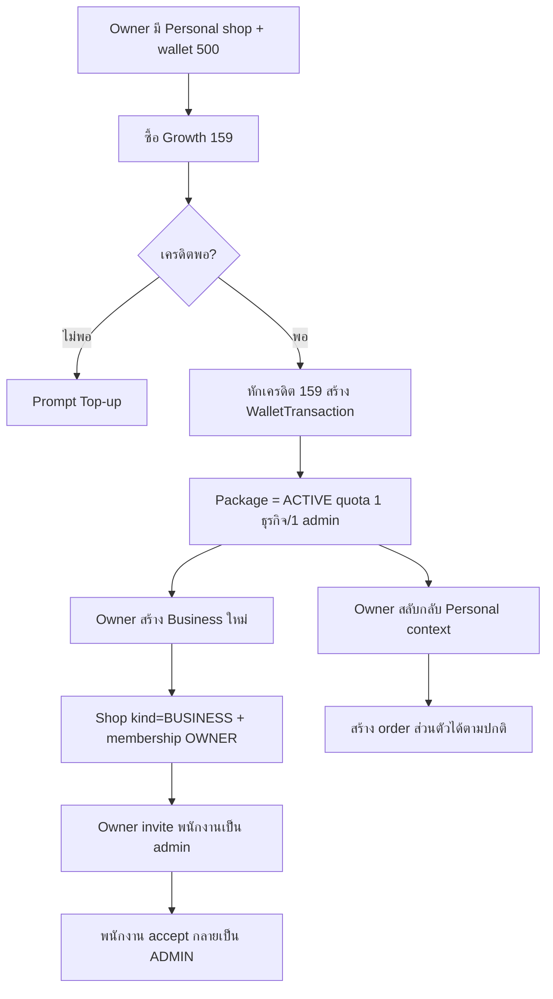
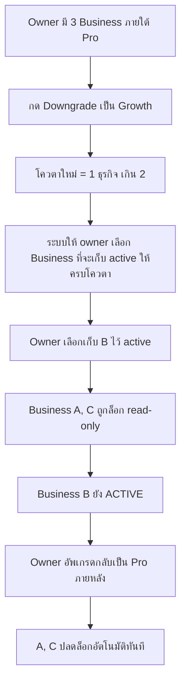

> **โมดูล:** M00008-BusinessAccountPackages
> **ประเภทเอกสาร:** Product Requirements Document (PRD)
> **เวอร์ชัน:** 1.0
> **วันที่จัดทำ:** 2026-07-02
> **สถานะ:** Draft
> **เจ้าของเอกสาร:** BA + PO + PM (ดู [[Feature-Docs-Ownership]])

# PRD: ระบบอัพเกรดเป็น Business (Business Account & Packages)

---

## Executive Summary

Business Account & Packages คือระบบ subscription tier ใหม่ของ Deep (**Free → Growth ฿159 → Pro ฿599 → Business ฿1,299 ต่อเดือน**) ที่เปิดให้ Seller ที่ธุรกิจขยายตัว (มีพนักงานเพิ่ม) ซื้อสิทธิ์สร้าง **"Business account"** — บัญชีร้านค้าแบบทีม แยกขาดจาก **Personal account** เดิม (ที่ทุกคนมีฟรีตลอดไปและซื้อขายได้ปกติเหมือนวันนี้ทุกประการ) แต่ละ package tier ให้โควตาจำนวน Business ที่สร้างได้ + จำนวน admin (พนักงาน) ที่ invite เข้ามาช่วยบริหารต่อ 1 Business ได้ Owner (ผู้ซื้อ package) ยังคงใช้ Personal account ซื้อ-ขายส่วนตัวได้ตามปกติควบคู่กันไป และสามารถสลับ (switch) ไปมาระหว่าง Personal ↔ Business account ได้ตลอดเวลาจากบัญชี Deep เดียว

ในเชิง data model, "ธุรกิจ" 1 หน่วย = **Shop record ประเภท BUSINESS** ที่เพิ่มเข้ามาในระบบเดิม (แยกจาก Personal shop ที่มีอยู่แล้วผ่าน `isShop`) ผูกกับ Owner และ Admin ผ่านตาราง membership ใหม่ — reuse โครงสร้าง **Product / Order / SellerWallet / Inventory Add-on** เดิมทั้งหมดผ่าน `shopId` โดยไม่ต้องสร้างระบบคู่ขนาน นี่คือการเปลี่ยนแปลง **core relation ระดับรากฐานของระบบเป็นครั้งแรก** (จาก "1 User = 1 Shop" เป็น "1 User เป็นสมาชิกได้หลาย Shop") และเป็นการเปลี่ยนโมเดลธุรกิจครั้งใหญ่ครั้งแรกของ Deep (จาก **à la carte add-on อย่างเดียว** สู่ **tiered recurring subscription**) — ความเสี่ยง regression ต่อ Personal/Free flow เดิมที่มีผู้ใช้งานจริงอยู่บน prod แล้ว จึงเป็นเงื่อนไขบังคับที่ต้องเข้มงวดที่สุดของ feature นี้ เทียบเท่าหรือสูงกว่า Inventory Add-on (feature 00003)

---

## 1. Business Goals & KPIs

### 1.1 เป้าหมายทางธุรกิจ

| เป้าหมาย | รายละเอียด |
|----------|-----------|
| **เปิด Revenue Stream แบบ Tiered Subscription** | โมเดลรายได้ recurring รูปแบบใหม่ของ Deep (นอกเหนือ à la carte add-on เดิม) — 3 tier ราคาไล่ระดับตามขนาดธุรกิจ (Growth/Pro/Business) |
| **รองรับการเติบโตของ Seller เป็นทีม** | Seller ที่มีพนักงานแพคของ/ตอบแชท สามารถมอบสิทธิ์ให้คนอื่นช่วยบริหารร้านได้โดยไม่ต้องแชร์บัญชีส่วนตัว |
| **เพิ่ม ARPU ต่อ Power Seller** | Seller ที่ธุรกิจโตจริงมีแนวโน้มจ่ายมากขึ้นตามจำนวนธุรกิจ/ทีมที่ต้องการ — จับกลุ่ม high-value seller ที่ MVP เดิม (Free core) จับไม่ได้ |
| **แยกตัวตน Personal / Business ชัดเจนแต่ไม่ตัดขาดจากกัน** | Owner ยังคงใช้ Personal เพื่อซื้อขายส่วนตัวได้ปกติ — ไม่บังคับให้เลือกอย่างใดอย่างหนึ่ง |
| **Zero Regression บน Personal/Free Core Flow** | ผู้ใช้ที่ไม่อัพเกรด (คนส่วนใหญ่ของระบบวันนี้) ต้องใช้งานเหมือนเดิมทุกประการ — เงื่อนไขบังคับเพราะกระทบ core relation ของทั้งระบบ |

### 1.2 ตัวชี้วัดความสำเร็จ (KPIs)

| KPI | คำอธิบาย | เป้าหมาย |
|-----|----------|---------|
| **Package Conversion Rate** | % ของ Shop (Personal) ที่มี Order ≥ N รายการ/เดือน ที่อัพเกรดซื้อ package ภายใน 90 วัน | ≥ 5% (เป้าเบื้องต้น — ไม่มี baseline, ปรับหลัง launch) |
| **MRR จาก Business Packages** | ผลรวม (จำนวน owner ที่ package ACTIVE ต่อ tier) × ราคาต่อ tier ในแต่ละเดือน | Baseline เดือนแรกหลัง launch → เทียบเดือนถัดไป |
| **Tier Upgrade Rate** | % ของ owner ที่อัพเกรด tier สูงขึ้น (Growth→Pro→Business) ภายใน 6 เดือนแรก | วัด trend เพิ่มขึ้น = สัญญาณว่าโควตาตอบโจทย์การเติบโตจริง |
| **Renewal Success Rate** | % ของรอบ renew package ที่หักเครดิตสำเร็จ (ไม่ถูกล็อก) | ≥ 80% |
| **Admin Seat Utilization** | เฉลี่ยจำนวน admin ที่ invite จริง / quota ที่มีต่อ tier | ใช้ประเมินว่าตั้งราคา/quota เหมาะสมไหม |
| **Business Creation Rate หลังซื้อ Package** | % ของ owner ที่ซื้อ package แล้วสร้าง Business จริงภายใน 7 วัน | ≥ 70% (วัดว่า quota ที่จ่ายเงินไปถูกใช้จริง ไม่ใช่ dead purchase) |

---

## 2. User Personas (กลุ่มผู้ใช้งาน)

### 2.1 Personal User (default — ไม่เปลี่ยนแปลง)

**ข้อมูลพื้นฐาน:**
- ทุก User ในระบบ Deep วันนี้ — อาจซื้อของอย่างเดียว หรือเปิด Personal shop ขายของด้วย (isShop=true) เหมือนที่ทำได้ฟรีอยู่แล้ว
- ไม่รู้จัก ไม่สนใจ หรือยังไม่พร้อมสำหรับ Business account

**เป้าหมาย:**
- ใช้งาน Deep ซื้อ-ขายได้ตามปกติโดยไม่ถูกบังคับให้ทำความเข้าใจ feature ใหม่

**ความต้องการ:**
- ทุกหน้า/ทุก flow ที่เคยใช้ (สร้าง order, product, ดู trust score ฯลฯ) ต้องเหมือนเดิมทุกประการ

**จุดปวด (Pain Points):**
- กลัวว่า core flow ที่ใช้อยู่ทุกวันจะช้าลง/ซับซ้อนขึ้นเพราะมี feature ใหม่ที่ตัวเองไม่ได้ใช้

### 2.2 Business Owner

**ข้อมูลพื้นฐาน:**
- Personal user เดิมที่ธุรกิจขยายตัว มีพนักงานที่ต้องมอบหมายงานให้ช่วยแพค/ตอบลูกค้า
- มี Personal shop (isShop=true) อยู่แล้ว หรืออย่างน้อยมีบัญชี Deep ที่พร้อมเปิด Personal shop เพื่อใช้เป็นช่องทางจ่ายค่า package

**เป้าหมาย:**
- แยกการบริหารธุรกิจ (มีทีม) ออกจากบัญชีส่วนตัว โดยไม่ต้องสร้างบัญชี Deep ใหม่หรือแชร์ password ให้พนักงาน
- ควบคุมสิทธิ์ของพนักงานได้ (ไม่ให้แตะเรื่อง billing/invite คนอื่น)
- ยังซื้อของ/ขายของส่วนตัวได้ตามปกติผ่าน Personal account เดิม

**ความต้องการ:**
- ซื้อ package ตามขนาดธุรกิจ (Growth/Pro/Business)
- สร้าง Business ใหม่ได้ง่าย (คล้ายเปิดร้านเดิม)
- Invite/ลบพนักงานเป็น admin ได้ตลอด ภายใต้โควตาที่จ่ายไป
- สลับไปมาระหว่าง Personal ↔ Business ได้จากที่เดียว ไม่ต้อง logout/login ใหม่

**จุดปวด (Pain Points):**
- ถ้าไม่มีระบบทีม ต้องแชร์ username/password ร้านให้พนักงาน (เสี่ยง security + ตรวจสอบไม่ได้ว่าใครทำอะไร)
- กลัวจ่ายเงินซื้อ package แล้วโดนล็อกกะทันหันโดยไม่รู้ตัว/ไม่มีเวลาตั้งตัว

### 2.3 Business Admin (พนักงาน)

**ข้อมูลพื้นฐาน:**
- มีบัญชี Deep ของตัวเอง (หรือสมัครใหม่ตอนรับ invite) — ถูก owner เชิญเข้ามาช่วยบริหาร 1 Business
- อาจเป็น admin ของหลาย Business พร้อมกัน (จาก owner คนละคน) ได้

**เป้าหมาย:**
- ช่วยจัดการ order/product/ตอบแชทของ Business ที่ตนถูก invite ได้ โดยไม่ต้องรู้ password ของ owner

**ความต้องการ:**
- Accept invite ง่าย ๆ (มีบัญชี Deep อยู่แล้ว หรือสมัครใหม่ผ่าน link invite)
- เห็นเฉพาะข้อมูลของ Business ที่ตนเป็น admin เท่านั้น ไม่เห็นข้อมูล billing/Business อื่นของ owner

**จุดปวด (Pain Points):**
- ถ้าไม่มีระบบสิทธิ์ชัดเจน อาจเข้าไปแก้/ลบสิ่งที่ไม่ควรแตะ (billing, invite คนอื่น, ลบ business)

### 2.4 Admin/Ops (internal)

**ข้อมูลพื้นฐาน:**
- ทีมดูแลระบบ Deep — ดูแล WalletTransaction/subscription อยู่แล้ว (จาก feature SMS Wallet + Inventory Add-on)

**เป้าหมาย:**
- เมื่อ owner ติดต่อ support ("ทำไม business ฉันถูกล็อก / quota ฉันเหลือเท่าไร") ตรวจสอบได้จากหน้าที่มีอยู่ ไม่ต้องเปิดหน้าใหม่ทั้งหมด

**ความต้องการ:**
- เห็นสถานะ package/quota usage ต่อ owner ทั้งระบบ
- เห็นรายการหักเครดิต Business Package แยก label ชัดจาก SMS/Inventory ในหน้า wallet transaction เดิม

**จุดปวด (Pain Points):**
- ถ้า label ไม่ชัดเจน แยกไม่ออกว่าเครดิตหายเพราะ package renewal, SMS, หรือ Inventory — support ช้า

---

## 3. Business Requirements

### 3.1 Package Subscription & Pricing

**ความต้องการ:**
- Owner ซื้อ/อัพเกรด/ดาวน์เกรด package ได้ 4 ระดับ: **Free (฿0) → Growth (฿159) → Pro (฿599) → Business (฿1,299)** ต่อเดือน
- ค่าบริการหักจาก **SellerWallet ของ Personal shop ของ Owner เอง** (ไม่ใช่ wallet ของ Business shop ที่ยังไม่มีอยู่ตอนซื้อครั้งแรก — chicken-and-egg)

**Business Rules:**
- ราคาคงที่ต่อ tier ไม่มี proration ใน MVP (เหมือน pattern Inventory Add-on)
- Owner ต้องมี Personal shop (isShop=true, มี SellerWallet) อยู่แล้วก่อนซื้อ package ครั้งแรก — ถ้ายังไม่มี ระบบพา flow เปิด Personal shop ฟรีก่อน (reuse flow เดิม) แล้วค่อยซื้อ package
- ต้องมีเครดิตเพียงพอ ณ ตอนซื้อ/อัพเกรด — ไม่พอ ระบบปฏิเสธ + prompt top-up (reuse TopUpRequest เดิม)
- รอบ renewal = รายเดือนแบบ rolling 30 วัน (align pattern เดียวกับ Inventory Add-on เพื่อความสอดคล้องของระบบ billing)

**เหตุผล:**
- Reuse SellerWallet เดิมลดความซับซ้อน payment infra ใหม่ทั้งหมด
- ผูกกับ Personal shop ของ owner แก้ปัญหา "Business shop ใหม่ยังไม่มี wallet ตอนกำลังจะถูกสร้าง"

### 3.2 สร้าง Business (Business Creation)

**ความต้องการ:**
- Owner ที่มี package ACTIVE และยังไม่เต็มโควตา สร้าง Business ใหม่ได้ผ่านหน้า "สร้าง Business" (คล้ายหน้าเปิดร้านเดิม — ชื่อ/ประเภท/รายละเอียด)
- Business ที่สร้างสำเร็จ = แยกขาดจาก Personal shop ของ owner โดยสมบูรณ์ — มี Product/Order/Wallet เป็นของตัวเอง

**Business Rules:**
- 1 ครั้งที่สร้าง Business สำเร็จ = ใช้โควตา "จำนวนธุรกิจ" ไป 1 หน่วยของ tier ปัจจุบัน
- Personal shop ของ owner **ไม่นับรวม** และ **ไม่ถูกแปลง** เป็น Business ไม่ว่ากรณีใด — สร้าง Business ใหม่แยกเสมอ
- สร้าง Business เกินโควตาที่เหลืออยู่ = ระบบปฏิเสธ พร้อม prompt อัพเกรด tier

**เหตุผล:**
- แยกขาดชัดเจนตามที่ user ยืนยัน (Personal ≠ Business เสมอ) ป้องกันความสับสนเรื่อง "ร้านไหนคือร้านไหน"

### 3.3 Invite/Remove Admin (พนักงาน)

**ความต้องการ:**
- Owner invite คนอื่นเข้ามาเป็น admin ของ 1 Business ผ่านเบอร์โทร/อีเมล
- Owner ลบ admin ออกจาก Business ได้ตลอดเวลา

**Business Rules:**
- จำนวน admin ต่อ 1 Business ถูกจำกัดตาม tier ปัจจุบันของ owner (Growth=1, Pro=3, Business=ไม่จำกัด)
- คนที่ยังไม่มีบัญชี Deep รับ invite ได้ (pending) → ต้องสมัครบัญชี Deep ก่อนถึง accept ได้จริง
- 1 User เป็น admin ของหลาย Business พร้อมกันได้ (จาก owner คนละคน) — ไม่จำกัด

**เหตุผล:**
- Invite by contact (ไม่ต้องรู้ password ร้าน) ตรงกับ pattern auth เดิมของระบบ (phone/email เป็น identity หลัก)

### 3.4 RBAC — สิทธิ์ Owner vs Admin

**ความต้องการ:**
- Owner ทำได้ทุกอย่างของ Business รวมถึง billing/invite/ลบ Business
- Admin ทำได้เฉพาะงานปฏิบัติการประจำวัน — จัดการ order/product/ตอบแชท — ไม่แตะ billing/invite/ลบ business

**Business Rules:**
- Owner-only: ซื้อ/อัพเกรด/ดาวน์เกรด package, invite/remove admin, ลบ Business, ดู/แก้ billing
- Admin: สร้าง/แก้/ยกเลิก order, จัดการ product, ตอบ chat/แชท ของ Business ที่ตนเป็น admin เท่านั้น
- **(default — รอ finalize matrix ละเอียดตอน SRS)**

**เหตุผล:**
- ลดความเสี่ยงพนักงานแตะเรื่องเงิน/สิทธิ์คนอื่นโดยไม่ตั้งใจหรือโดยไม่ได้รับอนุญาต

### 3.5 Account/Business Switcher (Personal ⇄ Business)

**ความต้องการ:**
- Owner (และ Admin ที่ถูก invite หลาย Business) สลับ context ระหว่าง Personal และ Business ที่ตนเกี่ยวข้องได้ตลอดจากบัญชี Deep เดียว ไม่ต้อง logout/login ใหม่

**Business Rules:**
- Context ที่ active กำหนดว่ากำลังดู/แก้ไขข้อมูลของ shop ไหน (Personal หรือ Business ใด)
- สลับ context ต้องไม่รั่วข้อมูลของ context อื่นที่ไม่ active อยู่ (แต่ละ context เห็นเฉพาะของตัวเอง)
- **(default — switcher อยู่บน `seller.*` subdomain เดิม, UI = dropdown แบบ workspace-switcher ใน seller sidebar — รายละเอียด UI รอ safepay-ux)**

**เหตุผล:**
- Owner ต้องบริหารทั้ง Personal และ Business (หลายอัน) ได้สะดวกโดยไม่ต้องมีหลายบัญชี Deep

### 3.6 Package Upgrade

**ความต้องการ:**
- Owner อัพเกรด tier ได้ตลอดเวลา (Growth→Pro, Pro→Business, Growth→Business)

**Business Rules:**
- อัพเกรดสำเร็จ = โควตาใหม่มีผลทันที — Business/Admin ที่เคยถูกล็อกเพราะเกินโควตาเดิม (ถ้าอยู่ในโควตาใหม่แล้ว) กลับมาใช้งานได้ทันทีโดยอัตโนมัติ ไม่ต้องกดปลดล็อกทีละอัน
- ไม่มี proration — จ่ายเต็มราคาของ tier ใหม่ตั้งแต่รอบถัดไป (หรือจ่ายส่วนต่างทันที — **รายละเอียดการคิดเงินตอนอัพเกรดกลางรอบ เป็น open item รอ SRS**)

**เหตุผล:**
- ลด friction ให้ owner อยากอัพเกรดทันทีที่ต้องการขยายทีม

### 3.7 Package Downgrade → Selective Lock

**ความต้องการ:**
- Owner ดาวน์เกรด tier ได้ (เช่น Pro→Growth) — ถ้าจำนวน Business หรือ admin ที่มีอยู่จริงเกินโควตาของ tier ใหม่ ระบบต้องจัดการอย่างเป็นธรรมและคาดเดาได้

**Business Rules:**
- ดาวน์เกรดสำเร็จทันที — ไม่มี grace period ในการ "ค้าง" โควตาเดิมไว้ชั่วคราว
- **Owner เป็นผู้เลือกเองว่าจะให้ Business ไหนคง active ต่อ (ภายในโควตาใหม่) และ Business ไหนถูกล็อก** — ระบบไม่เลือกอัตโนมัติ. ก่อนยืนยัน downgrade ถ้าจำนวน Business เกินโควตาใหม่ ระบบต้องให้ owner เลือก Business ที่จะเก็บไว้ active ให้ครบพอดีตามโควตา ส่วนที่เหลือถูกล็อกเป็น read-only
- Business ที่มี admin เกินโควตา "ต่อธุรกิจ" ของ tier ใหม่ (แม้ตัว Business เองยังอยู่ในโควตาจำนวนธุรกิจ) ก็ถูกล็อกเป็น read-only เช่นกัน จนกว่า owner จะลบ admin ส่วนเกินเองหรืออัพเกรดคืน
- **(ยืนยันแล้ว 2026-07-02: owner-selects ไม่ใช่ auto-LIFO)**

**เหตุผล:**
- ป้องกันไม่ให้ owner ดาวน์เกรดแล้วยังใช้ resource เกินราคาที่จ่ายจริงได้แบบไม่มีที่สิ้นสุด

### 3.8 Renewal ล้มเหลว → Lock ทั้งหมด (Read-only)

**ความต้องการ:**
- ถ้าถึงรอบ renew package แล้วเครดิตใน SellerWallet (Personal shop ของ owner) ไม่พอ → ทุก Business ภายใต้ package นั้นถูกล็อกเป็น read-only ทันที (เทียบเท่าดาวน์เกรดเป็น Free — โควตา 0)

**Business Rules:**
- ไม่มี grace period — เหมือน pattern Inventory Add-on เป๊ะ
- เตือนล่วงหน้าก่อนถึงรอบ renew ถ้าคาดว่าเครดิตจะไม่พอ (จำนวนวันเตือนล่วงหน้า — align 3 วันเหมือน Inventory Add-on เป็น default)
- ทุก Business ของ owner คนนั้นถูกล็อกพร้อมกัน (ไม่ใช่แค่บางอัน) — ต่างจาก downgrade ที่ล็อกเฉพาะส่วนเกิน

**เหตุผล:**
- Renewal ล้มเหลว = owner ไม่มี package ที่ ACTIVE เลย จึงไม่มีโควตาเหลือให้ Business ใดทำงานได้ต่อ

### 3.9 Data Retention เมื่อ Business ถูก Lock

**ความต้องการ:**
- Business ที่ถูกล็อก (ไม่ว่าจากเหตุผลใดใน 3.7/3.8) ต้อง**ไม่ถูกลบข้อมูล** — Product, Order เดิม, ประวัติ, สมาชิก (owner/admin) ต้องอยู่ครบ
- Business ที่ถูกล็อก = **read-only** เท่านั้น (ดู/export ข้อมูลได้ แต่สร้าง/แก้ order-product ใหม่ไม่ได้, ลิงก์ order สาธารณะที่มีอยู่แล้วของ Business นั้นเข้าถึงไม่ได้เพื่อทำรายการใหม่)

**Business Rules:**
- ห้าม hard-delete หรือ batch-reset ข้อมูลใด ๆ เมื่อ Business เปลี่ยนสถานะเป็น locked
- เมื่อ Business กลับมา ACTIVE (จ่าย/อัพเกรดคืน) ข้อมูลทั้งหมดกลับมาใช้งานได้ทันทีเหมือนไม่เคยถูกล็อก

**เหตุผล:**
- ป้องกันความเสียหายทางธุรกิจจาก renewal พลาด/ดาวน์เกรดชั่วคราว — สร้างความมั่นใจให้ owner กล้าซื้อ package ต่อ (pattern เดียวกับ Inventory Add-on §3.4)

### 3.10 Independent Subscription จาก Inventory Add-on

**ความต้องการ:**
- Business Package (Growth/Pro/Business) และ Inventory Add-on (feature 00003) เป็น **subscription คนละเรื่องกันโดยสิ้นเชิง** — Business shop 1 อัน สมัคร Business Package (ที่ owner ระดับบนถืออยู่) พร้อมกับสมัคร Inventory Add-on ของตัวเอง (ที่ shop ระดับล่าง) ได้พร้อมกัน โดยไม่ผูกกัน

**Business Rules:**
- Entitlement/สถานะของ Business Package ไม่มีผลต่อสถานะ Inventory Add-on ของ Business shop นั้น และในทางกลับกัน
- WalletTransaction ของทั้งสองมี `reason` แยกกันชัดเจน (เช่น "Business Package Subscription" ≠ "Inventory Subscription")
- Business Package หักจาก wallet ของ **Owner (Personal shop)**; Inventory Add-on ของ Business shop หนึ่ง ๆ หักจาก **wallet ของ Business shop นั้นเอง** — คนละก้อนเครดิต
- Business shop ที่ถูกล็อกจาก Business Package (read-only) → Inventory Add-on ของ shop นั้น (ถ้าเคย subscribe ไว้) ก็ใช้งานไม่ได้ไปด้วย เพราะตัว Business shop เองเข้าไม่ได้แล้ว (ผลพวงจาก 3.9 ไม่ใช่ entitlement ผูกกัน)

**เหตุผล:**
- ผู้ใช้ยืนยันชัดเจนว่าต้องแยกขาด — ป้องกันความสับสนเรื่อง billing และให้แต่ละ subscription คิดราคา/renew อิสระต่อกัน

### 3.11 Backward Compatibility — Personal/Free User

**ความต้องการ:**
- User ที่ไม่ซื้อ package (ส่วนใหญ่ของระบบวันนี้) ต้องใช้งาน Personal shop, Order, Product เหมือนเดิมทุกประการ ไม่มี field/ขั้นตอน/latency ใหม่แทรกเข้ามา

**Business Rules:**
- การเปลี่ยน core relation (Shop 1:1 User → 1:N ผ่าน membership) ต้อง**โปร่งใสสมบูรณ์**ต่อ Personal shop เดิม — query/flow ที่มีอยู่ต้องได้ผลลัพธ์เหมือนเดิมทุกกรณี
- Regression risk นี้ถือเป็น**ความเสี่ยงสูงสุด**ของ feature นี้ (สูงกว่า Inventory Add-on เพราะแตะ core relation ไม่ใช่แค่ additive field)

**เหตุผล:**
- Personal/Free เป็น core flow ที่มีผู้ใช้งานจริงบน prod แล้วตั้งแต่ day 1 ของระบบ — ต้องไม่เสียหายเด็ดขาด

---

## 4. Business Rules & Constraints

### 4.1 กฎทางธุรกิจหลัก

| กฎ | คำอธิบาย |
|----|----------|
| **Personal ฟรีตลอดไป** | ไม่เปลี่ยนแปลง — ทุกคน default Personal, ซื้อขายได้ปกติ ไม่มีค่าใช้จ่าย |
| **4 Tier ราคาคงที่** | Free ฿0 / Growth ฿159 / Pro ฿599 / Business ฿1,299 ต่อเดือน ไม่มี proration ใน MVP |
| **โควตาต่อ Tier** | Growth = 1 ธุรกิจ/1 admin ต่อธุรกิจ; Pro = 3 ธุรกิจ/3 admin ต่อธุรกิจ; Business = ไม่จำกัดทั้งคู่ |
| **Personal ≠ Business เสมอ** | สร้าง Business ใหม่แยกจาก Personal shop เสมอ ไม่มีการแปลง Personal shop เดิมเป็น Business |
| **Billing แหล่งเดียว** | หักจาก SellerWallet ของ Personal shop ของ Owner เท่านั้น (ไม่มีช่องทางจ่ายแยกใหม่) |
| **ไม่มี Grace Period** | Renewal ล้มเหลว = ล็อกทันที (เหมือน pattern Inventory Add-on) |
| **Lock = Read-only ไม่ลบข้อมูล** | Business ที่เกินโควตา/renewal ล้มเหลว ถูกล็อกอ่านอย่างเดียว ข้อมูลไม่หาย |
| **Independent จาก Inventory Add-on** | คนละ entitlement, คนละ wallet-transaction reason, คนละ wallet ที่จ่าย |
| **Upgrade = Unlock อัตโนมัติ** | อัพเกรด tier แล้ว Business/Admin ที่กลับมาอยู่ในโควตาใหม่ ถูกปลดล็อกทันทีไม่ต้องกดทีละอัน |

### 4.2 ข้อจำกัดทางธุรกิจ

| ข้อจำกัด | รายละเอียด |
|---------|-----------|
| **ไม่มี Refund** | ซื้อ/อัพเกรด package แล้วไม่ใช้โควตาเต็ม ไม่มีการคืนเงิน (standard subscription) |
| **RBAC มีแค่ 2 ระดับใน MVP** | Owner / Admin เท่านั้น — ไม่มี role ย่อยกว่านี้ (เช่น ผู้จัดการ/คลัง) |
| **Owner เดี่ยวต่อ Business** | ไม่มี co-ownership (หลาย owner ร่วมกัน) ใน MVP |
| **ต้องมี Personal shop ก่อนซื้อ Package** | ใช้เป็นแหล่งจ่ายเงิน (SellerWallet) — ถ้ายังไม่มีต้องเปิด Personal shop ก่อน |
| **Trust Score ผูกที่ User ไม่ใช่ Business** | Business ไม่มี trust profile แยกใน MVP — ผูกกับ owner ตามเดิม (Profile-Centric architecture) |

### 4.3 Entitlement / Lock State Matrix

| สถานะ Package (Owner-level) | Business ภายใต้โควตา | Business เกินโควตา (business count หรือ admin count) |
|---|---|---|
| **FREE** (ไม่เคยซื้อ/quota=0) | ไม่มี Business ใด ๆ (สร้างไม่ได้เลย) | — |
| **ACTIVE** (Growth/Pro/Business) | ใช้งานได้เต็ม | LOCKED (read-only) — เฉพาะส่วนที่เกิน |
| **LOCKED-RENEWAL-FAILED** | — | ทุก Business ถูก LOCKED (read-only) ทั้งหมด |

---

## 5. Out of Scope (นอกขอบเขต)

| หัวข้อ | คำอธิบาย |
|--------|----------|
| **Billing gateway ใหม่ (บัตรเครดิต/พร้อมเพย์อัตโนมัติ)** | นอกเหนือ SellerWallet เดิม — Phase 2 |
| **Business-level Trust Score / Public Profile แยก** | MVP ผูก trust ที่ owner User ตามเดิม — Phase 2 |
| **RBAC granularity เกิน Owner/Admin 2 ระดับ** | เช่น role ผู้จัดการ/พนักงานคลัง แยกสิทธิ์ย่อย — Phase 2 |
| **Co-ownership (หลาย Owner ต่อ Business)** | MVP มี Owner เดียวต่อ Business — Phase 2 |
| **Cross-Business Analytics/Reporting รวมยอด** | Dashboard รวมยอดทุก Business ของ owner คนเดียว — Phase 2 |
| **Proration ตอนอัพเกรด/ดาวน์เกรดกลางรอบ** | MVP ไม่คิดเศษวัน (คิดแบบเดียวกับ Inventory Add-on) — TBD รายละเอียดใน SRS |
| **Refund/คืนเงินโควตาที่ไม่ได้ใช้** | ไม่มีใน MVP |
| **Admin Invite แบบ bulk / CSV** | Invite ทีละคนเท่านั้นใน MVP — Phase 2 |
| **Notification/Chat ระดับ Business แยกจาก Personal** | ใช้ระบบแจ้งเตือนเดิม ไม่สร้างช่องทางใหม่ — รายละเอียดรอ SRS |

---

## 6. Risks & Mitigation (ความเสี่ยงและแนวทางแก้ไข)

### 6.1 ความเสี่ยงทางธุรกิจ

| ความเสี่ยง | ผลกระทบ | ระดับความรุนแรง | แนวทางแก้ไข |
|-----------|---------|-----------------|-------------|
| **Owner ไม่พอใจถูกล็อกทันทีไม่มี grace period** | Churn / support ticket เพิ่ม | กลาง | เตือนล่วงหน้าชัดเจน + ข้อความ locked ระบุวิธี reactivate ทันที + data retention สร้างความมั่นใจว่าไม่เสียของ (pattern เดียวกับ Inventory Add-on ที่พิสูจน์แล้ว) |
| **Downgrade แล้วธุรกิจสำคัญถูกล็อก** | Owner โกรธที่ธุรกิจสำคัญถูกล็อกแทนที่จะเป็นธุรกิจรอง | ต่ำ | แก้ที่ต้นเหตุแล้ว — owner เป็นผู้เลือกเองว่าจะเก็บ Business ไหน active (ไม่ใช่ระบบ auto-LIFO) ก่อนยืนยัน downgrade |
| **Conversion ต่ำกว่าคาด (ราคา/quota ไม่ตรงใจตลาด)** | MRR ไม่โต | กลาง | วัด KPI ตั้งแต่เดือนแรก ปรับราคา/quota ได้โดยไม่กระทบ business rule หลัก |
| **Personal user รู้สึกถูกรบกวนจาก UI ใหม่ (switcher/upsell)** | Negative sentiment ต่อผู้ใช้ 90%+ ที่ไม่ต้องการ feature นี้ | สูง | Personal ที่ไม่มี Business ต้องไม่เห็น switcher เลย (ไม่ใช่แค่ disabled) — เห็นแค่ upsell entry point แบบเบา ๆ |

### 6.2 ความเสี่ยงทางเทคนิค

| ความเสี่ยง | ผลกระทบ | แนวทางแก้ไข |
|-----------|---------|-------------|
| **Relax `Shop.userId` unique → 1:N ผ่าน membership** | Core relation ของทั้งระบบเปลี่ยน — กระทบทุก query ที่เคยอิง `user.shop` โดยตรง (seller ทั้ง `(paces)/seller/**`) | Migration plan ทีละขั้นใน DATABASE.md, regression test ครอบคลุม Personal flow เดิมทั้งหมดก่อน sign-off ทุก phase — **ความเสี่ยงสูงสุดของ feature นี้** |
| **Session/JWT ปัจจุบันไม่มี concept "active shop context"** | Account switcher ต้องเปลี่ยนวิธี resolve shop ปัจจุบันจาก session — เสี่ยงข้อมูลรั่วข้าม context ถ้า scope ผิด | ทุก query ต้อง scope ด้วย membership ของ active context เสมอ (ตาม memory `feedback_rsc_dal_authz`) — ออกแบบ mechanism ชัดใน SRS/SDS |
| **Renewal cron ใหม่ (คนละตัวกับ Inventory Add-on)** | ต้องมี scheduled job แยกสำหรับ Business Package renewal — หรือ reuse mechanism เดียวกับ Inventory Add-on แต่คนละ entitlement | ออกแบบให้ reuse cron infra เดียวกัน (ถ้ามีอยู่แล้วจาก feat 00003) แต่ประมวลผลแยก entitlement table |
| **Wallet เดียวกันจ่ายทั้ง Package + Personal shop ปกติ** | Owner top-up ไม่พอ อาจกระทบทั้งการซื้อของส่วนตัวและ package renewal พร้อมกัน | ต้อง design ชัดว่า SellerWallet ของ Personal shop ใช้ร่วมกันทุกการหักเงินของ owner คนนั้น — สื่อสารให้ owner เข้าใจในหน้า wallet |

---

## 7. Glossary (อภิธานศัพท์)

| คำศัพท์ | ความหมาย |
|---------|----------|
| **Personal Account / Personal Shop** | บัญชี/ร้านเริ่มต้นของทุก User (isShop, ฟรีตลอดไป) — ไม่ใช่ Business |
| **Business Account / Business** | Shop record ประเภท BUSINESS ที่สร้างเพิ่มหลังซื้อ package — แยกขาดจาก Personal shop เสมอ |
| **Business Package** (ตัวเข้ม — ชื่อ tier) | Subscription 4 ระดับ: Free/Growth/Pro/Business — **อย่าสับสนกับคำว่า "ธุรกิจ" ทั่วไป หรือ field `Shop.businessType` เดิมที่มีอยู่แล้ว (label ประเภทนิติบุคคลสำหรับ L3 verification — คนละเรื่องกัน)** |
| **Owner** | User ที่ซื้อ Business Package และสร้าง Business — มีสิทธิ์เต็มทุกด้าน (billing, invite, ลบ) |
| **Admin (พนักงาน)** | User ที่ถูก owner invite เข้ามาช่วยบริหาร 1 Business — สิทธิ์จำกัดกว่า owner |
| **Membership** | ความสัมพันธ์ระหว่าง User กับ Shop (role: OWNER / ADMIN) ที่แทนที่ FK ตรงแบบ 1:1 เดิม |
| **Quota (โควตา)** | จำนวน Business/Admin สูงสุดที่ tier ปัจจุบันอนุญาต |
| **Lock / Read-only** | สถานะ Business ที่ใช้งานสร้าง/แก้ order-product ไม่ได้ แต่ข้อมูลไม่หาย — เกิดจาก renewal ล้มเหลว หรือ downgrade เกินโควตา |
| **Account/Business Switcher** | UI ให้ owner/admin สลับ context ระหว่าง Personal และ Business ที่ตนเกี่ยวข้อง |
| **Owner-selected Lock** | เมื่อ downgrade แล้ว Business เกินโควตา owner เป็นผู้เลือกเองว่าจะเก็บ Business ไหน active ให้ครบโควตาใหม่ ส่วนที่เหลือถูกล็อก (ยืนยัน 2026-07-02 — ไม่ใช่ auto-LIFO) |

---

## 8. Success Metrics (ตัวชี้วัดความสำเร็จ)

| ตัวชี้วัด | ค่าที่คาดหวัง | วิธีวัด |
|----------|---------------|--------|
| **Zero Regression บน Personal/Free Core** | User ที่ไม่มี Business ไม่มี error/behavior change ใด ๆ ใน order/product/shop flow | Regression test suite ครอบคลุม Personal flow เดิม 100% ก่อน sign-off ทุก phase |
| **Quota Accuracy** | จำนวน Business/Admin ที่ใช้งานจริงไม่เกินโควตาของ tier ปัจจุบันเสมอ | ทดสอบ create/invite ที่ boundary ของโควตาทุก tier |
| **Lock Correctness** | Business ที่ควรถูกล็อก (renewal ล้มเหลว/downgrade เกินโควตา) ถูกล็อกถูกต้อง 100% ไม่มีหลุด | Test scenario ต่อ trigger ทั้งสองแบบ |
| **Context Isolation** | Admin/Owner ที่ switch ไป context หนึ่ง ไม่เห็นข้อมูลของ context อื่นที่ตนไม่ได้เป็นสมาชิก | Security test ต่อ role/context ทุกคู่ |
| **Package Conversion / MRR** | ดู §1.2 KPI | Dashboard/query จำนวน owner ที่ package ACTIVE ต่อ tier |

---

## 9. Dependencies & Assumptions

### 9.1 สิ่งที่ต้องพึ่งพา (Dependencies)

| ระบบ/ส่วนประกอบ | ความสัมพันธ์ |
|-----------------|-------------|
| **SellerWallet + `wallet.service`** | หักเครดิต package subscription จาก wallet ของ Personal shop ของ owner ผ่าน atomic deduct pattern เดิม |
| **WalletTransaction** | บันทึกรายการหักเครดิต Business Package แยก `reason` จาก SMS/Inventory |
| **`Shop` model + relation ใหม่ (membership)** | ต้อง relax `Shop.userId @unique` → 1:N ผ่านตาราง membership ใหม่ — เป็น core schema change ที่ใหญ่ที่สุดของระบบจนถึงตอนนี้ |
| **Product/Order/Review service (shopId-scoped)** | Reuse ทั้งหมดผ่าน `shopId` ของ Business shop ใหม่ — ไม่ต้องแก้ logic เดิม แค่ scope เพิ่ม |
| **Inventory Add-on entitlement (feature 00003)** | แยกขาดสมบูรณ์ (§3.10) — ต้อง double-check ว่า entitlement/wallet ของทั้งสอง feature ไม่ชนกันตอน implement |
| **Session/JWT (subdomain-scoped เดิม)** | ต้องขยายให้รองรับ "active shop context" สำหรับ switcher — ออกแบบใน SRS |
| **Scheduled Job/Cron infra (จาก feature 00003)** | ต้องรองรับ renewal ของ Business Package entitlement เพิ่มเติม (แยก table จาก Inventory) |
| **docs/PRD.md §6 Business Model (ระบบรวม)** | ต้อง sync — เพิ่มหมวด "Tiered Subscription" แยกจาก à la carte add-on เดิม |

### 9.2 สมมติฐาน (Assumptions — รวม default ที่ยังไม่ยืนยัน mark ไว้ชัดเจน)

- **Owner ต้องมี Personal shop (มี SellerWallet) ก่อนซื้อ package ครั้งแรก** — ถ้ายังไม่มี ต้องเปิด Personal shop ฟรีก่อน (reuse flow เดิม)
- **รอบ renewal = 30 วันแบบ rolling** align pattern เดียวกับ Inventory Add-on — **(default, รอ confirm ตอน SRS)**
- **เตือนล่วงหน้า 3 วันก่อนรอบ renew** align pattern เดียวกับ Inventory Add-on — **(default, รอ confirm ตอน SRS)**
- **RBAC matrix Owner-only vs Admin** — default: admin จัดการ order/product/chat ได้; owner-only = billing/package, invite/remove admin, สร้าง/ลบ business — **(default, ต้อง finalize matrix ละเอียดตอน SRS)**
- **Pro tier "3 admins" = 3 admin ต่อ 1 business** (ไม่ใช่รวมทั้งหมดกระจาย 3 business) — **(default ตามที่ระบุ)**
- **Subdomain/Switcher** — อยู่บน `seller.*` เดิม, UI = dropdown แบบ workspace-switcher ใน seller sidebar — **(default, รายละเอียด UI รอ safepay-ux)**
- **Trust Score ระดับ Business** — Phase 2 (out-of-scope รอบแรก), MVP ผูก trust ที่ owner User ตามเดิม — **(default)**
- **Invite พนักงานที่ยังไม่มีบัญชี Deep** — invite by phone/email → pending invite → พนักงานสมัคร Deep แล้ว accept — **(default)**
- **Refund/churn ของ quota ที่จ่ายแต่ไม่ใช้** — out-of-scope MVP (no refund, standard subscription)
- **กติกาเลือก Business ที่ถูกล็อกตอน downgrade = owner เลือกเอง** — **(ยืนยันแล้ว 2026-07-02: owner เลือกว่าจะเก็บ Business ไหน active ให้ครบโควตาใหม่ ส่วนที่เหลือถูกล็อก — ไม่ใช่ auto-LIFO)**
- **การคิดเงินตอนอัพเกรด/ดาวน์เกรดกลางรอบ (proration)** — default ไม่มี proration (เหมือน Inventory Add-on) — **(รอ confirm ตอน SRS)**

---

## 10. Appendix

### 10.1 ตัวอย่าง User Journey — Owner ซื้อ Growth → สร้าง Business → Invite Admin

**Scenario: Seller ที่มี Personal shop อยู่แล้ว ธุรกิจเริ่มโต ต้องการมีพนักงานช่วย**

1. Owner (มี Personal shop, เครดิตใน wallet ฿500) เปิดหน้า "อัพเกรดเป็น Business" เห็น package matrix
2. กด "ซื้อ Growth ฿159" → ระบบตรวจเครดิตพอ → หักเครดิต ฿159 → สร้าง WalletTransaction (reason="Business Package Subscription") → Owner ได้โควตา 1 ธุรกิจ / 1 admin
3. Owner กด "สร้าง Business" → กรอกชื่อ/ประเภทธุรกิจ → ระบบสร้าง Shop ใหม่ (kind=BUSINESS) ผูก membership OWNER ให้ Owner → ใช้โควตาไป 1/1
4. Owner เปิด Business ที่สร้างใหม่ → invite พนักงาน (เบอร์โทร) → พนักงานได้รับ invite (มีบัญชี Deep อยู่แล้ว) → accept → กลายเป็น admin
5. Owner สลับกลับไป Personal context → สร้าง order ส่วนตัวได้ตามปกติเหมือนเดิม

### 10.2 ตัวอย่าง User Journey — Downgrade เกินโควตา → Selective Lock

**Scenario: Owner เคยเป็น Pro (3 ธุรกิจ) ดาวน์เกรดเป็น Growth (1 ธุรกิจ)**

1. Owner มี Business 3 อัน (A, B, C) ภายใต้ Pro
2. Owner กด "ดาวน์เกรดเป็น Growth" → ระบบแจ้งว่าโควตาใหม่เหลือ 1 ธุรกิจ ต้องเลือกเก็บ 1 อัน
3. Owner เลือกเก็บ B ไว้ active (ธุรกิจหลักที่ขายดี) → A, C ถูกล็อก read-only
4. Business A, C กลายเป็น read-only — Product/Order เดิมยังดูได้ แต่สร้าง/แก้ใหม่ไม่ได้
5. Owner อัพเกรดกลับเป็น Pro ภายหลัง → A, C กลับมา ACTIVE ทันทีอัตโนมัติ

### 10.3 Decisions (ยืนยันแล้วโดย Controller — 2026-07-02)

| # | เรื่อง | Decision (ยืนยันแล้ว) |
|---|------|----------------------|
| **D-1** | Data model ของ "ธุรกิจ" | Option A — Shop record (kind=BUSINESS) + ตาราง membership ใหม่ (`ShopMember{shopId, userId, role}`), relax `Shop.userId @unique` (§Executive Summary, §9.1) |
| **D-2** | ความสัมพันธ์กับ Inventory Add-on | Subscription แยกขาดสมบูรณ์ — คนละ entitlement, คนละ `WalletTransaction.reason`, คนละ wallet ที่จ่าย (§3.10) |
| **D-3** | Personal → Business | สร้างแยกเสมอ ไม่มีการแปลง Personal shop เดิม, quota นับเฉพาะ BUSINESS-kind shop (§3.2) |
| **D-4** | Expiry/Downgrade policy | Lock เป็น read-only (ไม่มี grace period, ไม่ลบข้อมูล) — pattern เดียวกับ Inventory Add-on (§3.7, §3.8, §3.9) |
| **D-5** | ราคา/โควตาต่อ tier | Free ฿0(0/-) / Growth ฿159(1/1) / Pro ฿599(3/3 ต่อธุรกิจ) / Business ฿1,299(ไม่จำกัด/ไม่จำกัด) (§4.1) |
| **D-6** | กติกาเลือก Business ที่ถูกล็อกตอน downgrade | **Owner เลือกเอง** ว่าจะเก็บ Business ไหน active ให้ครบโควตาใหม่ ส่วนที่เหลือถูกล็อก — ไม่ใช่ auto-LIFO (§3.7, §10.2) |

**Open items ที่ยังไม่ยืนยัน (ใช้ default ตามที่ระบุ — ต้อง confirm ตอน SRS ก่อน implement):** RBAC matrix ละเอียด, Pro "3 admin ต่อธุรกิจ", Subdomain/switcher UI, Trust Score ระดับ Business (Phase 2), invite flow คนไม่มีบัญชี, refund policy (no-refund), proration ตอนอัพเกรด/ดาวน์เกรดกลางรอบ — ดู §9.2 ทั้งหมด

---

**หมายเหตุ:**
เอกสารนี้เป็นการบันทึกความต้องการทางธุรกิจ (Business Requirements) โดยไม่มีรายละเอียดทางเทคนิค
สำหรับ Functional Requirements / User Story / Acceptance Criteria ดู [[BRD]] ของโมดูลนี้
สำหรับ technical specification ดู [[SRS]] ของโมดูลนี้
