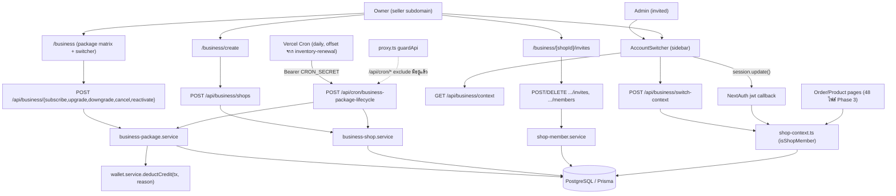
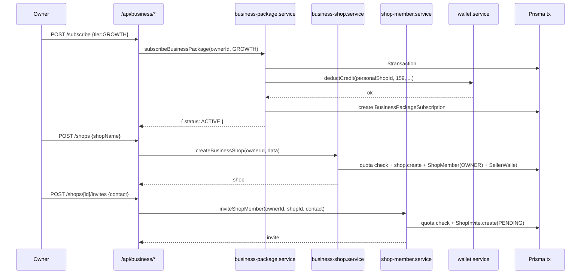
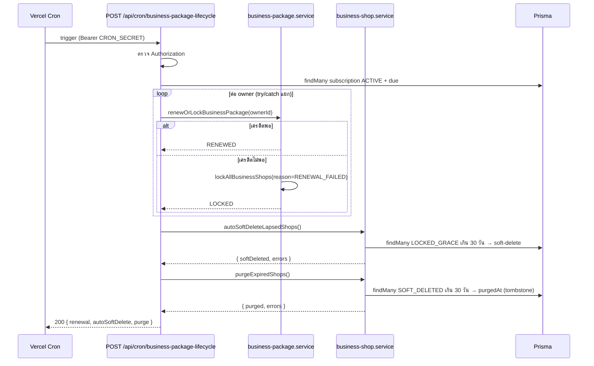
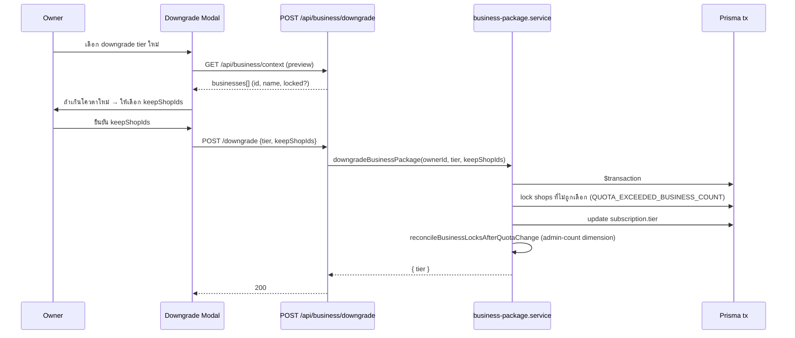
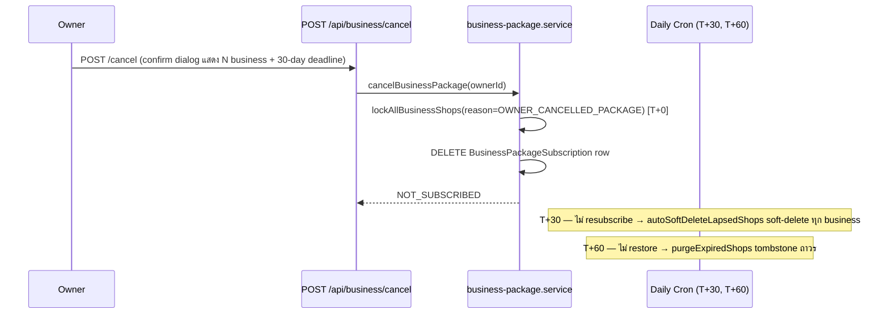
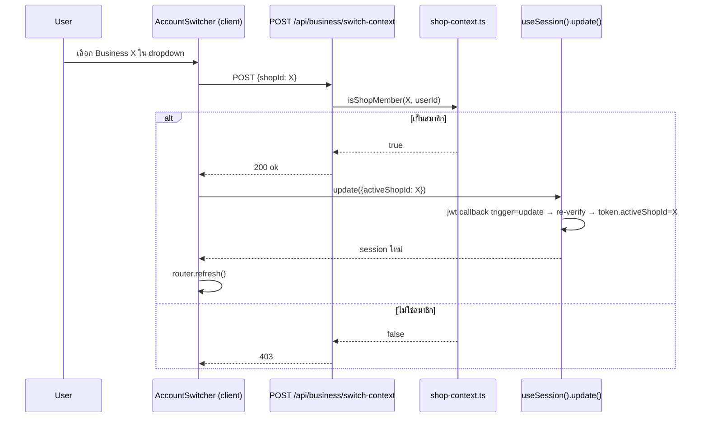

> **โมดูล:** M00008-BusinessAccountPackages
> **ประเภทเอกสาร:** System Design Spec (SDS)
> **เวอร์ชัน:** 1.0
> **วันที่จัดทำ:** 2026-07-02
> **สถานะ:** Draft
> **เจ้าของเอกสาร:** SA (ดู [[Feature-Docs-Ownership]])

# SDS: Business Account & Packages (System Design Spec)

---

## 1. บทนำ & References

### 1.1 วัตถุประสงค์

SDS นี้ออกแบบ implementation ระดับ signature/pseudocode ของ **Business Account & Packages (M00008)** ให้ DEV เขียนโค้ดได้โดยไม่ต้องเดา — realize SRS TFR-001..025 (รวม lifecycle decision 2026-07-02: soft-delete+grace+purge, membership-based RBAC)

### 1.2 ขอบเขตการออกแบบ

**สร้างใหม่:**
- `src/lib/business-package.ts` — constants (SRS §10)
- `src/lib/shop-context.ts` — `getPersonalShop`, `resolveActiveShopContext`, `isShopMember`
- `src/services/business-package.service.ts` — subscription lifecycle
- `src/services/business-shop.service.ts` — business shop lifecycle (create/lock/softDelete/restore/purge)
- `src/services/shop-member.service.ts` — invite/accept/cancel/remove/list
- `src/app/api/business/{context,subscribe,upgrade,downgrade,cancel,reactivate}/route.ts` (6 ไฟล์)
- `src/app/api/business/shops/route.ts`, `src/app/api/business/shops/[shopId]/route.ts`, `.../restore/route.ts`
- `src/app/api/business/shops/[shopId]/invites/route.ts`, `.../invites/[inviteId]/route.ts`
- `src/app/api/business/shops/[shopId]/members/[memberId]/route.ts`
- `src/app/api/business/switch-context/route.ts`
- `src/app/api/invites/[inviteId]/accept/route.ts`
- `src/app/api/cron/business-package-lifecycle/route.ts`
- `src/app/(paces)/seller/(dashboard)/business/page.tsx` (+ subcomponent — package matrix, switcher trigger)
- `src/app/(paces)/seller/(dashboard)/business/create/page.tsx`
- `src/app/(paces)/seller/(dashboard)/business/[shopId]/invites/page.tsx`
- `src/layouts/components/**/AccountSwitcher.tsx` (client)

**แก้ไข (additive เท่านั้น — ไม่ breaking):**
- `src/lib/auth.ts` — jwt/session callback เพิ่ม `activeShopId`/`hasBusinessMembership` (SRS TFR-012)
- `src/app/(paces)/seller/(dashboard)/layout.tsx` — mount `AccountSwitcher` ใน sidebar header, ส่ง `hasBusinessMembership`
- `src/lib/validations.ts` — schema ใหม่ (SRS §9)
- `vercel.json` — เพิ่ม 1 cron entry
- **48 ไฟล์ Phase 3 cutover** (SRS §7.2) — เปลี่ยน `getShopByUserId`/`user.shop` → `getPersonalShop`/`resolveActiveShopContext` (ไม่แตะ business logic อื่นในไฟล์เหล่านั้น)

**ไม่แตะ:** `product.service.ts`/`order.service.ts`/`review.service.ts` internal logic (ยัง scope ด้วย `shopId` เดิมทุกจุด — เปลี่ยนแค่ "shopId มาจากไหน" ที่ caller ไม่ใช่ signature ของ service เอง) — ยกเว้นเพิ่ม guard `SHOP_LOCKED` ที่จุดเขียน (TFR-017)

### 1.3 เอกสารอ้างอิง

| เอกสาร | ความสัมพันธ์ |
|--------|-------------|
| [[SRS]] ของโมดูลนี้ | TFR-001..025 — requirements ที่ SDS นี้ realize |
| [[DATABASE]] ของโมดูลนี้ + DATABASE DELTA แนบท้าย SRS | schema FROZEN + delta ใหม่ (`deletedAt`/`deletedReason`/`purgedAt`, reason values ใหม่) — **ต้อง apply migration ก่อน implement** |
| `src/services/wallet.service.ts:85-157` | `deductCredit` (มี `reason` param แล้ว — ไม่ต้องแก้ signature) |
| `src/app/api/cron/inventory-renewal/route.ts` | ต้นแบบ CRON_SECRET + per-entity try/catch |
| `src/lib/auth.ts:534-591`, `src/proxy.ts:9-49` | จุดแก้ session/JWT + cron exclude (มีอยู่แล้ว ไม่ต้องแก้ proxy.ts เพิ่ม) |

---

## 2. Architecture Overview

Extension ของ Next.js App Router + service layer เดิม — ไม่เพิ่ม subsystem ใหม่ (Vercel Cron reuse infra pattern เดิม)



### 2.1 Deploy View

- Vercel Serverless Functions (Hobby), region `sin1` — เหมือนเดิม
- Cron ใหม่ 1 ตัว (`business-package-lifecycle`, daily) — **รวม 3 responsibility ใน 1 endpoint** เพื่อลดความเสี่ยง Vercel cron-count limit (SRS Risk R-1)
- ไม่มี dependency ใหม่

---

## 3. Component Design

| Component | หน้าที่ | Dependency |
|-----------|---------|------------|
| **`business-package.ts`** | Constants (SRS §10) | pure |
| **`shop-context.ts`** | `getPersonalShop`, `resolveActiveShopContext`, `isShopMember` | Prisma |
| **`business-package.service.ts`** | subscribe/upgrade/downgrade/cancel/reactivate/renewOrLock + `reconcileBusinessLocksAfterQuotaChange` (shared, export ให้ `business-shop.service` เรียกได้ด้วย) | Prisma, `wallet.service` |
| **`business-shop.service.ts`** | create/softDelete/restore + cron helpers (`lockAllBusinessShops`/`autoSoftDeleteLapsedShops`/`purgeExpiredShops`) | Prisma |
| **`shop-member.service.ts`** | invite/accept/cancelInvite/removeMember/listMembers/listInvites | Prisma |
| **`AccountSwitcher.tsx`** (client) | Dropdown — fetch context, call switch-context API + `session.update()` | React, next-auth/react |

### 3.1 `src/lib/shop-context.ts`

```typescript
import { prisma } from '@/lib/prisma'

/** getPersonalShop — SSOT helper แทน `user.shop` singular หลัง Phase 2 cutover
 *  ก่อน Phase 2: prisma.shop.findUnique({where:{userId}}) ก็ได้ผลเดียวกัน (userId ยัง @unique เต็ม)
 *  หลัง Phase 2: userId ไม่ unique เต็มอีกต่อไป — ต้องกรอง kind='PERSONAL' เสมอ (partial-unique DB constraint
 *  รับประกันว่า findFirst จะได้ไม่เกิน 1 แถวจริง) — ใช้ signature เดียวกันได้ทั้ง 2 ช่วง ไม่ต้องแก้ call-site ซ้ำ
 */
export async function getPersonalShop(userId: string) {
  return prisma.shop.findFirst({ where: { userId, kind: 'PERSONAL' } })
}

export async function isShopMember(shopId: string, userId: string): Promise<boolean> {
  const m = await prisma.shopMember.findUnique({
    where: { shopId_userId: { shopId, userId } },
    select: { shopId: true },
  })
  return m !== null
}

export interface ActiveShopContext {
  shopId: string
  kind: 'PERSONAL' | 'BUSINESS'
  role: 'OWNER' | 'ADMIN'
  locked: boolean
  lockReason: string | null
}

/** resolveActiveShopContext — ใช้ใน page/route ที่ต้อง operate บน "shop ปัจจุบัน" ของ session
 *  ไม่ trust session.user.activeShopId เปล่า ๆ — re-verify membership เสมอ (defense-in-depth, TFR-013)
 */
export async function resolveActiveShopContext(session: {
  user: { id: string; activeShopId?: string | null }
}): Promise<ActiveShopContext | null> {
  const shopId = session.user.activeShopId
  if (!shopId) {
    const personal = await getPersonalShop(session.user.id)
    if (!personal) return null
    return { shopId: personal.id, kind: 'PERSONAL', role: 'OWNER', locked: false, lockReason: null }
  }
  const shop = await prisma.shop.findUnique({
    where: { id: shopId },
    select: { id: true, kind: true, userId: true, packageLockedAt: true, packageLockReason: true, deletedAt: true },
  })
  if (!shop || shop.deletedAt) return null // soft-deleted/ไม่มี → fallback caller ควรพากลับ Personal
  if (shop.kind === 'PERSONAL') {
    if (shop.userId !== session.user.id) return null // ไม่ควรเกิด (Personal เป็นของ user เดียวเสมอ) — defense
    return { shopId: shop.id, kind: 'PERSONAL', role: 'OWNER', locked: false, lockReason: null }
  }
  // BUSINESS — verify membership จริง (ไม่ trust JWT เพียงอย่างเดียว)
  const member = await prisma.shopMember.findUnique({
    where: { shopId_userId: { shopId: shop.id, userId: session.user.id } },
    select: { role: true },
  })
  if (!member) return null
  return {
    shopId: shop.id, kind: 'BUSINESS', role: member.role as 'OWNER' | 'ADMIN',
    locked: shop.packageLockedAt !== null, lockReason: shop.packageLockReason,
  }
}
```

### 3.2 `src/services/business-package.service.ts`

```typescript
import { randomUUID } from 'node:crypto'
import { prisma } from '@/lib/prisma'
import { deductCredit } from '@/services/wallet.service'
import { getPersonalShop } from '@/lib/shop-context'
import {
  BUSINESS_PACKAGE_TIER_CONFIG, TIER_ORDER, BUSINESS_PACKAGE_RENEWAL_PERIOD_DAYS,
  WALLET_REASON_BUSINESS, WALLET_DESC_BUSINESS, SHOP_LOCK_REASON, GRACE_ELIGIBLE_LOCK_REASONS,
  type BusinessPackageTier,
} from '@/lib/business-package'
import type { Prisma } from '@prisma/client'

function addDays(d: Date, n: number) { return new Date(d.getTime() + n * 86_400_000) }

export async function getSubscriptionStatus(ownerId: string) {
  const sub = await prisma.businessPackageSubscription.findUnique({ where: { ownerId } })
  return sub ?? null // null = NOT_SUBSCRIBED (FREE pseudo-state)
}

export async function subscribeBusinessPackage(ownerId: string, tier: BusinessPackageTier) {
  return prisma.$transaction(async (tx) => {
    const existing = await tx.businessPackageSubscription.findUnique({ where: { ownerId }, select: { id: true } })
    if (existing) throw new Error('SUBSCRIPTION_ALREADY_EXISTS')

    const personal = await getPersonalShop(ownerId) // read-only lookup, ผูก tx ผ่าน tx.shop เพื่อ consistency ในทางปฏิบัติ
    if (!personal) throw new Error('PERSONAL_SHOP_REQUIRED')

    const subId = randomUUID()
    await deductCredit(
      personal.id, BUSINESS_PACKAGE_TIER_CONFIG[tier].priceBaht, subId,
      WALLET_DESC_BUSINESS.SUBSCRIBE, WALLET_REASON_BUSINESS.BUSINESS_PACKAGE_SUBSCRIPTION, tx,
    )

    const now = new Date()
    await tx.businessPackageSubscription.create({
      data: {
        id: subId, ownerId, tier, status: 'ACTIVE',
        activatedAt: now, currentPeriodStart: now,
        nextRenewalAt: addDays(now, BUSINESS_PACKAGE_RENEWAL_PERIOD_DAYS),
      },
    })

    await reconcileBusinessLocksAfterQuotaChange(ownerId, tier, tx) // ปลดล็อก shop ที่ค้าง grace จาก cancel ก่อนหน้า (ถ้ามี)
    return { status: 'ACTIVE' as const, nextRenewalAt: addDays(now, BUSINESS_PACKAGE_RENEWAL_PERIOD_DAYS) }
  })
}

export async function upgradeBusinessPackage(ownerId: string, newTier: BusinessPackageTier) {
  return prisma.$transaction(async (tx) => {
    const sub = await tx.businessPackageSubscription.findUnique({ where: { ownerId } })
    if (!sub || sub.status !== 'ACTIVE') throw new Error('SUBSCRIPTION_NOT_ACTIVE')
    if (TIER_ORDER[newTier] <= TIER_ORDER[sub.tier as BusinessPackageTier]) {
      throw new Error('NOT_AN_UPGRADE')
    }
    const personal = await getPersonalShop(ownerId)
    if (!personal) throw new Error('PERSONAL_SHOP_REQUIRED')

    await deductCredit(
      personal.id, BUSINESS_PACKAGE_TIER_CONFIG[newTier].priceBaht, sub.id,
      WALLET_DESC_BUSINESS.UPGRADE, WALLET_REASON_BUSINESS.BUSINESS_PACKAGE_SUBSCRIPTION, tx,
    )
    const now = new Date()
    await tx.businessPackageSubscription.update({
      where: { ownerId },
      data: { tier: newTier, currentPeriodStart: now, nextRenewalAt: addDays(now, BUSINESS_PACKAGE_RENEWAL_PERIOD_DAYS), lastRenewalAt: now },
    })
    await reconcileBusinessLocksAfterQuotaChange(ownerId, newTier, tx)
    return { tier: newTier }
  })
}

export async function downgradeBusinessPackage(
  ownerId: string, newTier: BusinessPackageTier, keepShopIds: string[],
) {
  return prisma.$transaction(async (tx) => {
    const sub = await tx.businessPackageSubscription.findUnique({ where: { ownerId } })
    if (!sub || sub.status !== 'ACTIVE') throw new Error('SUBSCRIPTION_NOT_ACTIVE')
    if (TIER_ORDER[newTier] >= TIER_ORDER[sub.tier as BusinessPackageTier]) {
      throw new Error('NOT_A_DOWNGRADE')
    }
    const newQuota = BUSINESS_PACKAGE_TIER_CONFIG[newTier]
    const allShops = await tx.shop.findMany({
      where: { userId: ownerId, kind: 'BUSINESS', deletedAt: null }, select: { id: true },
    })
    if (newQuota.maxBusinesses !== null) {
      if (keepShopIds.length > newQuota.maxBusinesses) throw new Error('KEEP_SELECTION_EXCEEDS_QUOTA')
      const validIds = new Set(allShops.map((s) => s.id))
      if (!keepShopIds.every((id) => validIds.has(id))) throw new Error('INVALID_SHOP_SELECTION')
      const keepSet = new Set(keepShopIds)
      const toLock = allShops.filter((s) => !keepSet.has(s.id)).map((s) => s.id)
      if (toLock.length) {
        await tx.shop.updateMany({
          where: { id: { in: toLock } },
          data: { packageLockedAt: new Date(), packageLockReason: SHOP_LOCK_REASON.QUOTA_EXCEEDED_BUSINESS_COUNT },
        })
      }
    }
    await tx.businessPackageSubscription.update({ where: { ownerId }, data: { tier: newTier } }) // ไม่แตะ cycle (RD-4)
    await reconcileBusinessLocksAfterQuotaChange(ownerId, newTier, tx)
    return { tier: newTier }
  })
}

export async function cancelBusinessPackage(ownerId: string) {
  return prisma.$transaction(async (tx) => {
    const sub = await tx.businessPackageSubscription.findUnique({ where: { ownerId } })
    if (!sub || sub.status !== 'ACTIVE') throw new Error('SUBSCRIPTION_NOT_ACTIVE')
    await lockAllBusinessShops(ownerId, SHOP_LOCK_REASON.OWNER_CANCELLED_PACKAGE, tx)
    await tx.businessPackageSubscription.delete({ where: { ownerId } })
    return { status: 'NOT_SUBSCRIBED' as const }
  })
}

export async function reactivateBusinessPackage(ownerId: string) {
  return prisma.$transaction(async (tx) => {
    const sub = await tx.businessPackageSubscription.findUnique({ where: { ownerId } })
    if (!sub || sub.status !== 'LOCKED_RENEWAL_FAILED') throw new Error('SUBSCRIPTION_NOT_LOCKED')
    const personal = await getPersonalShop(ownerId)
    if (!personal) throw new Error('PERSONAL_SHOP_REQUIRED')
    await deductCredit(
      personal.id, BUSINESS_PACKAGE_TIER_CONFIG[sub.tier as BusinessPackageTier].priceBaht, sub.id,
      WALLET_DESC_BUSINESS.REACTIVATE, WALLET_REASON_BUSINESS.BUSINESS_PACKAGE_SUBSCRIPTION, tx,
    )
    const now = new Date()
    await tx.businessPackageSubscription.update({
      where: { ownerId },
      data: { status: 'ACTIVE', currentPeriodStart: now, nextRenewalAt: addDays(now, BUSINESS_PACKAGE_RENEWAL_PERIOD_DAYS), lastRenewalAt: now, lockedAt: null },
    })
    await reconcileBusinessLocksAfterQuotaChange(ownerId, sub.tier as BusinessPackageTier, tx)
    return { status: 'ACTIVE' as const }
  })
}

/** renewOrLockBusinessPackage — เรียกจาก cron เท่านั้น (ไม่มี HTTP endpoint ตรง) */
export async function renewOrLockBusinessPackage(ownerId: string): Promise<'RENEWED' | 'LOCKED' | 'SKIPPED'> {
  return prisma.$transaction(async (tx) => {
    const now = new Date()
    const before = await tx.businessPackageSubscription.findUnique({ where: { ownerId } })
    if (!before || before.status !== 'ACTIVE' || before.nextRenewalAt > now) return 'SKIPPED'

    const claimed = await tx.businessPackageSubscription.updateMany({
      where: { ownerId, status: 'ACTIVE', nextRenewalAt: before.nextRenewalAt },
      data: { nextRenewalAt: addDays(now, BUSINESS_PACKAGE_RENEWAL_PERIOD_DAYS) },
    })
    if (claimed.count === 0) return 'SKIPPED'

    const personal = await getPersonalShop(ownerId)
    if (!personal) { // edge: Personal shop หาย — ปฏิบัติเหมือนเครดิตไม่พอ
      await tx.businessPackageSubscription.update({
        where: { ownerId }, data: { status: 'LOCKED_RENEWAL_FAILED', lockedAt: now, nextRenewalAt: before.nextRenewalAt },
      })
      await lockAllBusinessShops(ownerId, SHOP_LOCK_REASON.RENEWAL_FAILED, tx)
      return 'LOCKED'
    }

    try {
      await deductCredit(
        personal.id, BUSINESS_PACKAGE_TIER_CONFIG[before.tier as BusinessPackageTier].priceBaht, before.id,
        WALLET_DESC_BUSINESS.RENEW, WALLET_REASON_BUSINESS.BUSINESS_PACKAGE_SUBSCRIPTION, tx,
      )
    } catch (e) {
      if (e instanceof Error && e.message === 'INSUFFICIENT_CREDIT') {
        await tx.businessPackageSubscription.update({
          where: { ownerId }, data: { status: 'LOCKED_RENEWAL_FAILED', lockedAt: now, nextRenewalAt: before.nextRenewalAt },
        })
        await lockAllBusinessShops(ownerId, SHOP_LOCK_REASON.RENEWAL_FAILED, tx)
        return 'LOCKED'
      }
      throw e
    }
    await tx.businessPackageSubscription.update({ where: { ownerId }, data: { currentPeriodStart: now, lastRenewalAt: now } })
    return 'RENEWED'
  })
}

/** lockAllBusinessShops — shared helper (TFR-004) ใช้โดย renewOrLock + cancel */
export async function lockAllBusinessShops(ownerId: string, reason: string, tx: Prisma.TransactionClient) {
  await tx.shop.updateMany({
    where: { userId: ownerId, kind: 'BUSINESS', deletedAt: null, purgedAt: null },
    data: { packageLockedAt: new Date(), packageLockReason: reason },
  })
}

/** reconcileBusinessLocksAfterQuotaChange — SRS TFR-016 (pseudocode เต็มอ้างอิงจาก SRS) */
export async function reconcileBusinessLocksAfterQuotaChange(
  ownerId: string, tier: BusinessPackageTier, tx: Prisma.TransactionClient,
) {
  const quota = BUSINESS_PACKAGE_TIER_CONFIG[tier]

  // A) business-count — unlock candidates (grace-eligible + quota-exceeded) ตาม slot ว่าง, เก่าสุดก่อน (RD-10)
  const activeCount = await tx.shop.count({
    where: { userId: ownerId, kind: 'BUSINESS', deletedAt: null, packageLockedAt: null },
  })
  const candidates = await tx.shop.findMany({
    where: {
      userId: ownerId, kind: 'BUSINESS', deletedAt: null,
      packageLockReason: { in: [...GRACE_ELIGIBLE_LOCK_REASONS, SHOP_LOCK_REASON.QUOTA_EXCEEDED_BUSINESS_COUNT] },
    },
    orderBy: { createdAt: 'asc' }, select: { id: true },
  })
  const slots = quota.maxBusinesses === null ? candidates.length : Math.max(0, quota.maxBusinesses - activeCount)
  const toUnlock = candidates.slice(0, slots).map((c) => c.id)
  if (toUnlock.length) {
    await tx.shop.updateMany({ where: { id: { in: toUnlock } }, data: { packageLockedAt: null, packageLockReason: null } })
  }

  // B) admin-count — re-lock ที่เกิน, unlock ที่พอดี (ทุก shop ที่ active ตอนนี้ รวมที่เพิ่ง unlock ใน A)
  const activeShops = await tx.shop.findMany({
    where: { userId: ownerId, kind: 'BUSINESS', deletedAt: null, packageLockedAt: null }, select: { id: true },
  })
  for (const shop of activeShops) {
    const adminCount = await tx.shopMember.count({ where: { shopId: shop.id, role: 'ADMIN' } })
    if (quota.maxAdminsPerBusiness !== null && adminCount > quota.maxAdminsPerBusiness) {
      await tx.shop.update({
        where: { id: shop.id },
        data: { packageLockedAt: new Date(), packageLockReason: SHOP_LOCK_REASON.QUOTA_EXCEEDED_ADMIN_COUNT },
      })
    }
  }
  const adminLocked = await tx.shop.findMany({
    where: { userId: ownerId, kind: 'BUSINESS', deletedAt: null, packageLockReason: SHOP_LOCK_REASON.QUOTA_EXCEEDED_ADMIN_COUNT },
    select: { id: true },
  })
  for (const shop of adminLocked) {
    const adminCount = await tx.shopMember.count({ where: { shopId: shop.id, role: 'ADMIN' } })
    if (quota.maxAdminsPerBusiness === null || adminCount <= quota.maxAdminsPerBusiness) {
      await tx.shop.update({ where: { id: shop.id }, data: { packageLockedAt: null, packageLockReason: null } })
    }
  }
}
```

### 3.3 `src/services/business-shop.service.ts`

```typescript
import { prisma } from '@/lib/prisma'
import {
  BUSINESS_PACKAGE_TIER_CONFIG, SHOP_LOCK_REASON, SHOP_DELETE_REASON,
  GRACE_ELIGIBLE_LOCK_REASONS, BUSINESS_LOCK_GRACE_DAYS, BUSINESS_DELETE_RETENTION_DAYS,
  type BusinessPackageTier,
} from '@/lib/business-package'

export async function createBusinessShop(ownerId: string, data: {
  shopName: string; businessType: string; category?: string; description?: string
}) {
  return prisma.$transaction(async (tx) => {
    const sub = await tx.businessPackageSubscription.findUnique({ where: { ownerId } })
    if (!sub || sub.status !== 'ACTIVE') throw new Error('NO_ACTIVE_PACKAGE')
    const quota = BUSINESS_PACKAGE_TIER_CONFIG[sub.tier as BusinessPackageTier]
    if (quota.maxBusinesses !== null) {
      const count = await tx.shop.count({ where: { userId: ownerId, kind: 'BUSINESS', deletedAt: null } })
      if (count >= quota.maxBusinesses) throw new Error('BUSINESS_QUOTA_EXCEEDED')
    }
    const shop = await tx.shop.create({
      data: { userId: ownerId, kind: 'BUSINESS', shopName: data.shopName, businessType: data.businessType, category: data.category, description: data.description },
    })
    await tx.shopMember.create({ data: { shopId: shop.id, userId: ownerId, role: 'OWNER' } })
    await tx.sellerWallet.create({ data: { shopId: shop.id, balance: 0 } })
    return shop
  })
}

export async function softDeleteBusinessShop(ownerId: string, shopId: string) {
  const shop = await prisma.shop.findUnique({ where: { id: shopId } })
  if (!shop || shop.userId !== ownerId || shop.kind !== 'BUSINESS') throw new Error('NOT_OWNER')
  if (shop.deletedAt) throw new Error('ALREADY_DELETED')
  return prisma.shop.update({
    where: { id: shopId },
    data: { deletedAt: new Date(), deletedReason: SHOP_DELETE_REASON.OWNER_DELETED },
  })
}

export async function restoreBusinessShop(ownerId: string, shopId: string) {
  return prisma.$transaction(async (tx) => {
    const shop = await tx.shop.findUnique({ where: { id: shopId } })
    if (!shop || shop.userId !== ownerId || shop.kind !== 'BUSINESS') throw new Error('NOT_OWNER')
    if (!shop.deletedAt) throw new Error('NOT_DELETED')
    if (shop.purgedAt) throw new Error('RESTORE_WINDOW_EXPIRED')

    const sub = await tx.businessPackageSubscription.findUnique({ where: { ownerId } })
    const quota = sub && sub.status === 'ACTIVE' ? BUSINESS_PACKAGE_TIER_CONFIG[sub.tier as BusinessPackageTier] : null
    const activeCount = await tx.shop.count({ where: { userId: ownerId, kind: 'BUSINESS', deletedAt: null, packageLockedAt: null } })
    const fits = !quota || quota.maxBusinesses === null || activeCount < quota.maxBusinesses

    return tx.shop.update({
      where: { id: shopId },
      data: fits
        ? { deletedAt: null, deletedReason: null, packageLockedAt: null, packageLockReason: null }
        : { deletedAt: null, deletedReason: null, packageLockedAt: new Date(), packageLockReason: SHOP_LOCK_REASON.QUOTA_EXCEEDED_BUSINESS_COUNT },
    })
  })
}

/** autoSoftDeleteLapsedShops — cron phase 2 (TFR-021) */
export async function autoSoftDeleteLapsedShops(): Promise<{ processed: number; softDeleted: number; errors: number }> {
  const cutoff = new Date(Date.now() - BUSINESS_LOCK_GRACE_DAYS * 86_400_000)
  const lapsed = await prisma.shop.findMany({
    where: {
      kind: 'BUSINESS', deletedAt: null, purgedAt: null,
      packageLockReason: { in: [...GRACE_ELIGIBLE_LOCK_REASONS] },
      packageLockedAt: { lte: cutoff },
    },
    select: { id: true },
  })
  let softDeleted = 0, errors = 0
  for (const { id } of lapsed) {
    try {
      await prisma.shop.update({ where: { id }, data: { deletedAt: new Date(), deletedReason: SHOP_DELETE_REASON.PACKAGE_LAPSED } })
      softDeleted += 1
    } catch (e) { errors += 1; console.error(`[cron] autoSoftDelete shopId=${id}`, e) }
  }
  return { processed: lapsed.length, softDeleted, errors }
}

/** purgeExpiredShops — cron phase 3 (TFR-022) — tombstone เท่านั้น ไม่ physical DELETE (ดู DATABASE DELTA) */
export async function purgeExpiredShops(): Promise<{ processed: number; purged: number; errors: number }> {
  const cutoff = new Date(Date.now() - BUSINESS_DELETE_RETENTION_DAYS * 86_400_000)
  const expired = await prisma.shop.findMany({
    where: { deletedAt: { not: null, lte: cutoff }, purgedAt: null },
    select: { id: true },
  })
  let purged = 0, errors = 0
  for (const { id } of expired) {
    try {
      await prisma.shop.update({ where: { id }, data: { purgedAt: new Date() } })
      purged += 1
    } catch (e) { errors += 1; console.error(`[cron] purge shopId=${id}`, e) }
  }
  return { processed: expired.length, purged, errors }
}
```

### 3.4 `src/app/api/cron/business-package-lifecycle/route.ts`

```typescript
import { NextResponse } from 'next/server'
import { prisma } from '@/lib/prisma'
import { renewOrLockBusinessPackage } from '@/services/business-package.service'
import { autoSoftDeleteLapsedShops, purgeExpiredShops } from '@/services/business-shop.service'

export const maxDuration = 60

export async function POST(request: Request) {
  const cronSecret = process.env.CRON_SECRET
  if (!cronSecret) return NextResponse.json({ error: 'unauthorized' }, { status: 401 })
  if (request.headers.get('authorization') !== `Bearer ${cronSecret}`) {
    return NextResponse.json({ error: 'unauthorized' }, { status: 401 })
  }

  // Phase 1: renewal (per-owner isolated)
  const due = await prisma.businessPackageSubscription.findMany({
    where: { status: 'ACTIVE', nextRenewalAt: { lte: new Date() } }, select: { ownerId: true },
  })
  let renewed = 0, locked = 0, renewalErrors = 0
  for (const { ownerId } of due) {
    try {
      const r = await renewOrLockBusinessPackage(ownerId)
      if (r === 'RENEWED') renewed += 1; else if (r === 'LOCKED') locked += 1
    } catch (e) { renewalErrors += 1; console.error(`[cron] renewal ownerId=${ownerId}`, e) }
  }

  // Phase 2: auto soft-delete lapsed grace
  const phase2 = await autoSoftDeleteLapsedShops()

  // Phase 3: purge (tombstone) expired retention
  const phase3 = await purgeExpiredShops()

  return NextResponse.json({
    renewal: { processed: due.length, renewed, locked, errors: renewalErrors },
    autoSoftDelete: phase2,
    purge: phase3,
  })
}
```

### 3.5 `src/lib/auth.ts` — jwt/session callback (diff เท่านั้น, ดู SRS TFR-012 เต็ม)

```typescript
// jwt callback — เพิ่มหลัง needsOnboarding block เดิม (บรรทัด ~562)
if (token.userId && (user || account || trigger === 'update')) {
  // ...(u query เดิม)...
  const personal = await getPersonalShop(token.userId as string)
  if (trigger === 'update' && session?.activeShopId) {
    const ok = await isShopMember(session.activeShopId, token.userId as string)
      || session.activeShopId === personal?.id
    token.activeShopId = ok ? session.activeShopId : (token.activeShopId ?? personal?.id ?? null)
  } else if (!token.activeShopId) {
    token.activeShopId = personal?.id ?? null
  }
}
```

```typescript
// session callback — เพิ่มหลัง user query เดิม (บรรทัด ~574)
const activeShopId = token.activeShopId as string | null
let activeShopRole: 'OWNER' | 'ADMIN' = 'OWNER'
let resolvedActiveShopId = shopSlug ? user.shop?.id ?? null : null // Personal fallback เดิม
if (activeShopId && activeShopId !== resolvedActiveShopId) {
  const m = await prisma.shopMember.findUnique({
    where: { shopId_userId: { shopId: activeShopId, userId: user.id } }, select: { role: true },
  })
  if (m) { resolvedActiveShopId = activeShopId; activeShopRole = m.role as 'OWNER' | 'ADMIN' }
  // ไม่เจอ (ถูก remove/soft-delete ระหว่างทาง) → fallback Personal ที่ resolve ไว้ข้างบนแล้ว
}
const hasBusinessMembership = await prisma.shopMember.count({
  where: { userId: user.id, shop: { kind: 'BUSINESS', deletedAt: null, purgedAt: null } },
}) > 0
(session as any).user = {
  ...(session as any).user, // เดิมทั้งหมด
  activeShopId: resolvedActiveShopId, activeShopRole, hasBusinessMembership,
}
```

> **หมายเหตุ type-safety:** โปรเจกต์ไม่มี `src/types/next-auth.d.ts` (module augmentation) — session ใช้ `as any` cast สม่ำเสมออยู่แล้ว (ยืนยันจาก grep) — SDS นี้คง convention เดิม ไม่ introduce augmentation ใหม่ (nice-to-have เก็บไว้พิจารณาแยก ไม่ block feature นี้)

---

## 4. Data Flow (Sequence Diagrams)

### 4.1 Subscribe → Create Business → Invite Admin



### 4.2 Renewal + Lifecycle Cron (daily, 3-phase)



### 4.3 Downgrade + Owner-selected Lock



### 4.4 Cancel Package → 60-day Compound Timeline



### 4.5 Account/Business Switch



---

## 5. UI Surface List (theme mapping — รอ `safepay-ux` ออกแบบ Design Spec เต็ม, Hard Rule 8)

> SDS นี้ **แค่ list surface + component ที่ต้องมี** ไม่ออกแบบ visual/spacing/pixel — ทุกหน้าต้องผ่าน `safepay-ux` ก่อน implement (Hard Rule 8) และ copy จาก Paces theme source ตาม Hard Rule 1/7

| Surface | Path | หน้าที่ | Theme source (ต้อง verify กับ ux) |
|---------|------|---------|-----------------------------------|
| Package matrix page | `(paces)/seller/(dashboard)/business/page.tsx` | แสดง tier ปัจจุบัน, ปุ่ม subscribe/upgrade/downgrade/cancel, quota usage, advance-warning banner, locked-state banner | Paces pricing-table pattern (`theme/paces/...`) — ux เลือก |
| Create Business form | `(paces)/seller/(dashboard)/business/create/page.tsx` | ฟอร์มชื่อ/ประเภท/หมวดหมู่ (คล้าย onboarding step 2 เดิม) | reuse `ShopInfoForm` pattern เดิมถ้ามี |
| Invite management | `(paces)/seller/(dashboard)/business/[shopId]/invites/page.tsx` | list PENDING invite + form invite ใหม่ + list ShopMember + remove | Paces table + form primitive |
| Downgrade selection modal | component ภายใน package matrix page | ให้ owner เลือก `keepShopIds` เมื่อเกินโควตา | Sweet Alerts custom HTML (Hard Rule "Sweet Alerts for modal dialogs") |
| Cancel confirm dialog | component | Sweet Alerts confirm พร้อมนับจำนวน business + deadline 30 วัน | Sweet Alerts (Hard Rule) |
| Locked-state banner | shared component, ใช้ทั้ง order/product pages ของ Business context | แสดงเหตุผล lock + deadline (grace) + CTA reactivate/upgrade | pacesToast หรือ inline banner — ux ตัดสิน |
| AccountSwitcher | `src/layouts/components/Sidenav/**` | Dropdown Personal + Business list (ซ่อนสมบูรณ์ถ้า `!hasBusinessMembership`) | Paces workspace-switcher pattern |
| Accept invite page | `(paces)/seller/(auth or dashboard)/invites/[id]/accept/page.tsx` | รับ invite, redirect signup ถ้ายังไม่มีบัญชี | Paces auth/split pattern (ถ้า pre-login) |
| Admin summary extension | `(paces)/admin/(dashboard)/topups/[id]/page.tsx` (แก้เพิ่ม section) | Business Package summary ของ owner | reuse pattern เดิมจาก feature 00003 |

---

## 6. Technical Decisions (TD)

### TD-001: รวม 3 cron responsibility เป็น endpoint เดียว
- **ตัดสินใจ:** `/api/cron/business-package-lifecycle` ทำ renewal + auto-soft-delete + purge ใน request เดียว (sequential, per-entity try/catch)
- **เหตุผล:** ลดความเสี่ยง Vercel Hobby cron-count limit (SRS Risk R-1) — โปรเจกต์มี cron อยู่แล้ว 1 ตัว
- **ทางเลือกที่ตัดทิ้ง:** แยก 3 cron ตาม responsibility (สะอาดกว่าเชิง separation-of-concern แต่เสี่ยง platform limit)
- **ผลกระทบ:** handler ยาวขึ้น แต่ per-phase error isolation ยังคงอยู่ (แต่ละ phase คนละ try/catch loop)

### TD-002: Purge = tombstone (`purgedAt`) ไม่ใช่ physical DELETE
- **ตัดสินใจ:** cron purge เพียงตั้ง `purgedAt` marker — ไม่เรียก `prisma.shop.delete()`
- **เหตุผล:** FK `Order→Shop` (restrict, ไม่ระบุ onDelete) จะ throw ทันทีถ้ามี Order ค้าง (แทบทุกกรณีจริง); แม้ลบสำเร็จ `Product.shopId onDelete:Cascade` จะทำลาย Product data ขัด BR-BIZ-20 + Hard Rule ห้าม drop ข้อมูล
- **ทางเลือกที่ตัดทิ้ง:** physical DELETE จริงตามคำ "purge" ตรงตัว — ปฏิเสธเพราะขัด Hard Rule ที่มีมาก่อน feature นี้
- **ผลกระทบ:** **ต้องยืนยันกับ user/Controller อีกชั้น** (RD-11 ใน SRS) — ถ้า user ยืนยันต้องการ hard-delete จริง ต้องออกแบบ compensating step แยก (เช่น anonymize Order ก่อน หรือยอมรับ Product data loss อย่างชัดแจ้ง) ซึ่งเป็นงานออกแบบเพิ่มนอกเหนือ SDS ฉบับนี้

### TD-003: `reconcileBusinessLocksAfterQuotaChange` เป็น shared function ไม่ใช่แยก 3 เวอร์ชันตาม caller
- **ตัดสินใจ:** function เดียวใช้ร่วมกันทั้ง subscribe (หลัง cancel), upgrade, downgrade, reactivate
- **เหตุผล:** logic ทั้ง business-count + admin-count dimension เหมือนกันทุก caller (ต่างแค่ tier ที่ส่งเข้า) — DRY
- **ผลกระทบ:** caller ทุกตัวต้องเรียกหลัง update `subscription.tier`/สร้าง subscription เสมอ (ห้ามลืม — ตรวจด้วย unit test ต่อ caller)

### TD-004: Session callback re-verify membership ทุก render (ไม่ trust JWT เพียงอย่างเดียว)
- **ตัดสินใจ:** `session` callback query `ShopMember` ซ้ำทุกครั้งแม้ `activeShopId` มาจาก JWT ที่ signed แล้ว
- **เหตุผล:** JWT อายุ 30 วัน — ถ้า admin ถูก remove ระหว่างทาง (TFR-010) ต้องมีจุด invalidate ภายใน 1 render ไม่ใช่รอ JWT หมดอายุ (security, defense-in-depth ตาม memory `feedback_rsc_dal_authz`)
- **ทางเลือกที่ตัดทิ้ง:** trust JWT (`token.activeShopId`) ตรง ๆ ทุกจุด — เร็วกว่าแต่เสี่ยง stale-access window ยาวถึง 30 วัน
- **ผลกระทบ:** เพิ่ม 1-2 indexed query ต่อ session render เฉพาะกรณีมี business context — Personal-only user ไม่กระทบ (NFR §8 ของ SRS)

### TD-005: ไม่สร้าง `PackageTierConfig` table — hardcode app-layer (คงตาม DATABASE.md)
- **ตัดสินใจ:** `BUSINESS_PACKAGE_TIER_CONFIG` เป็น TS constant ไม่ใช่ DB table
- **เหตุผล:** ตรง DATABASE.md ที่ตัดสินใจไว้แล้ว (ราคาปรับไม่บ่อย, code deploy เร็วกว่า data migration)
- **ผลกระทบ:** เปลี่ยนราคา/โควตาต้อง deploy code ใหม่ (accepted trade-off เดิม)

---

## 7. Migration/Rollout Sequence

| ลำดับ | งาน | Dependency | หมายเหตุ |
|-------|-----|------------|----------|
| 0 | dispatch `safepay-database` sync DATABASE.md ตาม DATABASE DELTA (แนบท้าย SRS) + apply Phase 1 migration | Controller ยืนยัน RD-11 ก่อน | ต้องเสร็จก่อนแตะ code ใด ๆ ที่อ้าง field ใหม่ |
| 1 | `lib/business-package.ts` + `lib/shop-context.ts` (constants + helper, ไม่พึ่ง schema ใหม่ยกเว้น `deletedAt/purgedAt`) | Task 0 | เดี่ยว |
| 2 | `business-package.service.ts` + `business-shop.service.ts` + `shop-member.service.ts` | Task 0, 1 | 3 ไฟล์ อิสระต่อกัน (parallel ได้ — คนละ domain) แต่ share import จาก Task 1 |
| 3 | API routes (`/api/business/**`, `/api/invites/[id]/accept`) | Task 2 | batch ≤3 ตาม Hard Rule |
| 4 | Cron route + `vercel.json` | Task 2 | เดี่ยว, ต้อง Controller verify Vercel cron-limit ก่อน |
| 5 | `lib/auth.ts` jwt/session callback | Task 1 (getPersonalShop/isShopMember) | เดี่ยว, **high-risk** — กระทบทุก session render ทั้งระบบ ต้อง regression test เต็มก่อน merge |
| 6 | **Phase 2 DB cutover** (`Shop.userId` ตัด unique) — gated, ต้อง user ยืนยันแยก | Task 0 burn-in + grep audit 48 ไฟล์เสร็จ | dispatch `safepay-database` แยกรอบ |
| 7 | Phase 3 app cutover — 48 ไฟล์ (`getPersonalShop`/`resolveActiveShopContext`) | Task 6 | batch ทีละกลุ่ม (services → API routes → pages) ตาม Hard Rule ≤3 concurrent |
| 8 | UI surfaces (business page, create, invites, switcher) | Task 3, `safepay-ux` Design Spec | ตาม UX spec output |
| 9 | Admin extension (`topups/[id]`) | Task 2 | เดี่ยว |

**QA gate บังคับก่อน sign-off:** regression suite Personal-only flow (FR-BIZ-23-AC-03) ต้อง PASS 100% ก่อน merge Task 6/7 — dispatch `safepay-qa` แยกหลัง Task 5 และหลัง Task 7

---

## 8. Traceability

| SRS Requirement | SDS Element | สถานะ |
|---|---|---|
| TFR-001..005, 014, 015, 018 | §3.2 `business-package.service.ts` | Draft |
| TFR-006, 019, 020, 021, 022 | §3.3 `business-shop.service.ts` | Draft |
| TFR-008, 009, 010 | shop-member.service.ts (pseudocode อ้าง SRS ตรง — ไม่ต้องขยาย SDS แยก) | Draft |
| TFR-011, 013 | §3.1 `shop-context.ts` | Draft |
| TFR-012 | §3.5 `lib/auth.ts` diff | Draft |
| TFR-016 | §3.2 `reconcileBusinessLocksAfterQuotaChange`, TD-003 | Draft |
| TFR-017 | product/order service guard (SHOP_LOCKED — ไม่ต้องขยาย SDS แยก, pattern เหมือน `INVENTORY_NOT_ACTIVE`) | Draft |
| TFR-024 | §7 Migration/Rollout Sequence | Draft |
| TFR-025 | §5 UI Surface List (admin extension) | Draft |
| NFR (SRS §8) | TD-004 (session re-verify) | Draft |

---

## 9. สรุป (Summary)

SDS นี้ออกแบบ owner-level subscription service reuse `wallet.service` เดิม (ไม่ต้องแก้ signature — มี `reason` param จาก feature 00003 แล้ว), business-shop 5-state lifecycle พร้อม shared reconciliation function เดียว (`reconcileBusinessLocksAfterQuotaChange`), cron รวม 3 responsibility ใน 1 endpoint (ลดความเสี่ยง platform limit), session/JWT extension ที่ re-verify membership ทุก render (defense-in-depth), และ purge design เป็น tombstone (ไม่ physical DELETE) พร้อม flag ให้ Controller/user ยืนยันชั้นสุดท้าย

**Implementation order:** DB Phase 1 → constants+helpers → services (parallel) → API routes → cron+auth → **DB Phase 2 (gated)** → app cutover 48 ไฟล์ → UI (รอ ux) → admin extension

**Open Questions (ยกไป Controller):**
- RD-11 (purge=tombstone vs hard-delete) — ต้องยืนยันก่อน dispatch Task 4 ของ §7
- เวลารัน cron ที่แน่นอน (เสนอ `0 20 * * *`) + verify Vercel cron-count limit จริง ก่อน apply `vercel.json`
