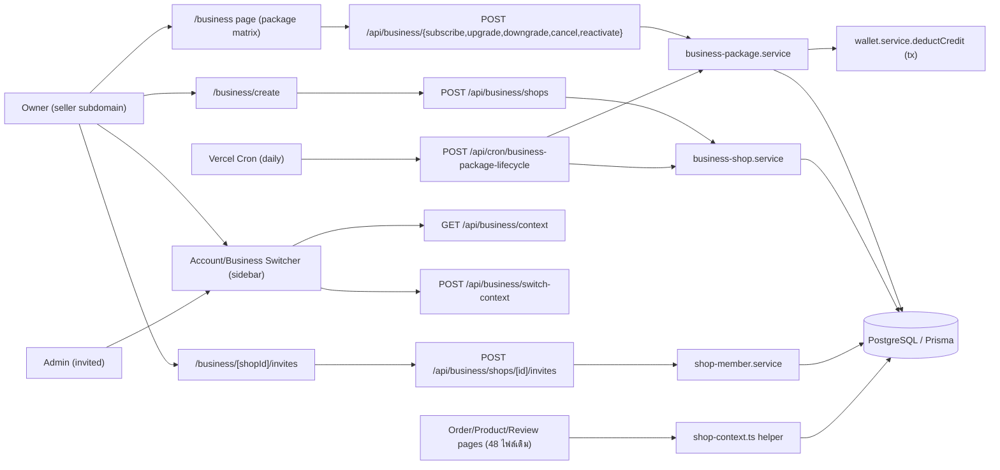
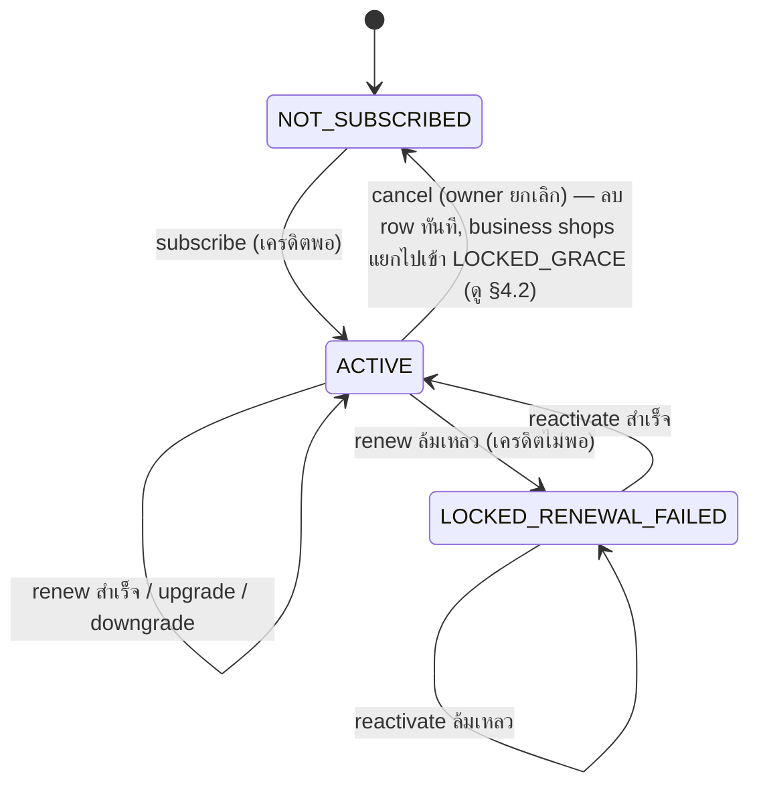
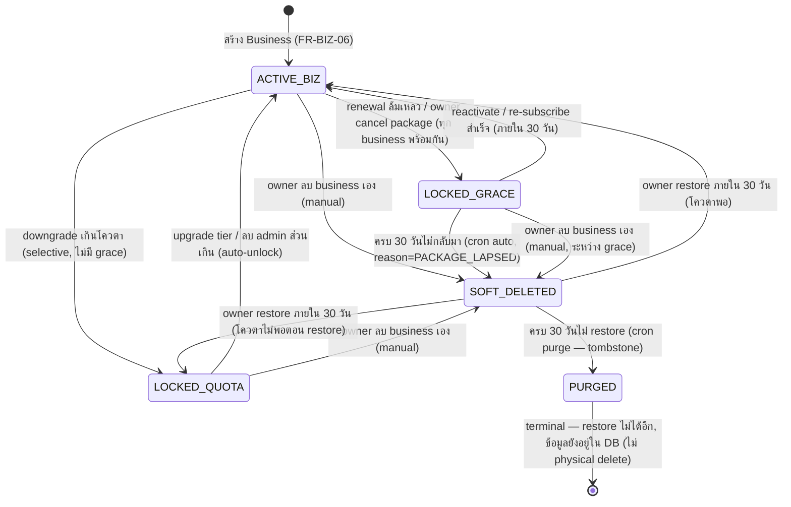

> **โมดูล:** M00008-BusinessAccountPackages
> **ประเภทเอกสาร:** Software Requirements Specification (SRS) — TECHNICAL
> **เวอร์ชัน:** 1.0
> **วันที่จัดทำ:** 2026-07-02
> **สถานะ:** Draft
> **เจ้าของเอกสาร:** SA (ดู [[Feature-Docs-Ownership]])

# SRS: Business Account & Packages (Software Requirements Specification — Technical)

---

## 1. บทนำ (Introduction)

### 1.1 วัตถุประสงค์ของเอกสาร

เอกสารนี้กำหนดข้อกำหนดเชิงเทคนิคของ **Business Account & Packages (M00008)** ครอบคลุม (1) owner-level subscription lifecycle (subscribe/renew/upgrade/downgrade/cancel/reactivate) แบบ atomic ผูกกับ `wallet.service` เดิม, (2) business-shop lifecycle รวม **lock → 30-day grace → auto soft-delete → 30-day retention → purge (tombstone)**, (3) membership lifecycle (invite/accept/remove admin) แบบ **membership-based access เท่านั้น** (ไม่มี granular RBAC ใน MVP), (4) **active shop context** ใน session/JWT + account/business switcher, (5) 2 Vercel Cron jobs (renewal + lifecycle housekeeping รวมเป็น cron เดียวเพื่อประหยัด slot), (6) Phased migration (`Shop.userId` 1:1→1:N) ที่กระทบ **48 ไฟล์ / 91 call-site** (verified grep — ดู §7.2), (7) API contract, validation, enums/constants

ผู้อ่านเป้าหมาย: DEV ผู้ implement, QA ผู้ออกแบบ test case, safepay-database ผู้ apply migration, Controller ผู้วางแผน dispatch

เอกสารนี้ trace กลับ FR-BIZ-01 ถึง FR-BIZ-24 ใน [[BRD]] บวก **FR-BIZ-25..29 (ใหม่ — lifecycle เพิ่มจาก decision 2026-07-02)** และ D-1..D-6 ใน [[PRD]] §10.3

> **🛑 อัปเดต decision สำคัญ (2026-07-02, override DATABASE.md §9 เดิม):**
> 1. **ลบ Business = soft-delete + 30 วัน retention + restore ได้** (ไม่ใช่ permanent-lock ทันที)
> 2. **ยกเลิก package (cancel-to-Free) = lock ทุก business ทันที + 30-day grace → auto soft-delete ถ้าไม่กลับมา** (ปิด DATABASE §9 open item #2 — ไม่ deferred อีกต่อไป)
> 3. **RBAC granular ตัดออกจาก MVP** — คงแค่ membership-based access + context isolation (security, ไม่ใช่ RBAC-granularity) — billing/invite/create/delete-business ยังเป็น owner-only โดยธรรมชาติ (initiate จาก personal wallet ของ owner) ไม่ต้องมี permission-matrix engine

### 1.2 ขอบเขตเชิงระบบ (System Scope)

**ในขอบเขต:**
- `src/lib/business-package.ts` (ใหม่) — constants: ราคา/โควตาต่อ tier, รอบ renew, เตือนล่วงหน้า, grace/retention period, wallet reason, lock/delete reason labels
- `src/lib/shop-context.ts` (ใหม่) — `getPersonalShop(userId)`, `resolveActiveShopContext(session)`, `isShopMember(shopId, userId)` — helper กลางจำกัด blast radius ของ `user.shop`→`user.shops` (ตาม DATABASE.md §4 คำแนะนำ)
- `src/services/business-package.service.ts` (ใหม่) — owner-level subscription lifecycle: subscribe/upgrade/downgrade/cancel/reactivate/renewOrLock + `reconcileBusinessLocksAfterQuotaChange`
- `src/services/business-shop.service.ts` (ใหม่) — business shop lifecycle: create/quota-check + softDelete/restore/purge + lock/unlock helper
- `src/services/shop-member.service.ts` (ใหม่) — invite/accept/cancel-invite/remove-member/list-members
- `src/services/wallet.service.ts` — **ไม่แก้ signature เพิ่ม** (มี `reason` param อยู่แล้วจาก feature 00003) — เพิ่มแค่ import ค่า `WALLET_REASON.BUSINESS_PACKAGE_SUBSCRIPTION` ใหม่ที่ call-site
- `src/lib/auth.ts` — jwt/session callback เพิ่ม `activeShopId` + `hasBusinessMembership`
- `src/proxy.ts` — เพิ่ม exclude `/api/cron/business-package-lifecycle` เข้า CSRF-skip list (ตาม pattern `/api/cron/*` เดิม — **ไม่ต้องแก้เพิ่ม** เพราะ exclude เป็น prefix `/api/cron/` อยู่แล้ว ครอบคลุมอัตโนมัติ)
- `src/app/api/business/**` (ใหม่ทั้งหมด) — ดู [[API]]
- `src/app/api/invites/[inviteId]/accept/route.ts` (ใหม่)
- `src/app/api/cron/business-package-lifecycle/route.ts` (ใหม่)
- `vercel.json` — เพิ่ม 1 cron entry
- `src/app/(paces)/seller/(dashboard)/business/**` (ใหม่) — package page, create-business, invite management, locked-state banner
- `src/layouts/components/**` (แก้) — account/business switcher component ใน sidebar header
- ~48 ไฟล์ที่อ่าน/เขียน shop ผ่าน `getShopByUserId`/`prisma.shop.findUnique({where:{userId}})` (Phase 3 cutover — ดู §7.2 รายชื่อ representative)

**นอกขอบเขต (MVP, ตาม PRD §5 + decision ใหม่):**
- Granular RBAC เกิน membership-based (Owner/Admin ไม่มี permission ย่อยกว่านี้)
- Business-level Trust Score/Public Profile แยก
- Co-ownership, Cross-Business Analytics รวมยอด
- Proration ระหว่างรอบ (คงไว้ตาม default — ดู §11 RD-3/RD-4)
- Bulk/CSV invite
- Billing gateway ใหม่ (คง SellerWallet)
- **Restore หลัง purge** (tombstone แล้ว = ถาวร ไม่มี self-service restore ใน MVP)

### 1.3 เอกสารอ้างอิง (References)

| เอกสาร | ความสัมพันธ์ |
|--------|-------------|
| [[PRD]] ของโมดูลนี้ | เป้าหมายธุรกิจ, KPI, D-1..D-6 |
| [[BRD]] ของโมดูลนี้ | FR-BIZ-01..24, BR-BIZ-01..25, AC |
| [[DATABASE]] ของโมดูลนี้ | schema FROZEN CONTRACT (`ShopMember`,`BusinessPackageSubscription`,`ShopInvite`,`Shop.kind/packageLockedAt/packageLockReason`) — **§9 open item #2/#3 ถูกปิดโดย decision 2026-07-02 ใน SRS นี้ ไม่ใช่ default เดิมแล้ว — ต้อง sync DATABASE.md กลับ (ดู DATABASE DELTA แนบท้าย)** |
| `docs/20 - Features/00003 - Inventory Add-on/{SRS,SDS,API}.md` | ต้นแบบ subscription lifecycle, RC-3 atomic pattern, Vercel Cron, page-level guard |
| `src/lib/auth.ts:534-591` | jwt/session callback ปัจจุบัน — จุดเพิ่ม `activeShopId` |
| `src/proxy.ts:9-49` | `guardApi` — CSRF/rate-limit, `/api/cron/*` exclude มีอยู่แล้ว |
| `src/services/wallet.service.ts:85-157` | `deductCredit` (มี `reason` param แล้ว) |
| `src/app/api/cron/inventory-renewal/route.ts` | ต้นแบบ CRON_SECRET auth + per-entity try/catch isolation |
| `src/services/shop.service.ts:37-39` | `getShopByUserId` — 1 ใน 48 ไฟล์ที่ต้อง cutover Phase 3 |

### 1.4 นิยามและตัวย่อ (Definitions & Acronyms)

| คำ/ตัวย่อ | ความหมาย |
|-----------|----------|
| **Owner** | User ที่ถือ `BusinessPackageSubscription` (ownerId) — ซื้อ/อัพเกรด/ยกเลิก package, สร้าง/ลบ Business |
| **Personal Shop** | `Shop.kind='PERSONAL'` — 1 ต่อ user, ฟรีตลอดไป, ไม่เปลี่ยนแปลง |
| **Business Shop** | `Shop.kind='BUSINESS'` — สร้างเพิ่มโดย owner ที่มี package ACTIVE |
| **Active Shop Context** | Shop (Personal หรือ Business) ที่ session ปัจจุบันกำลัง "ดู/แก้ไข" อยู่ — เก็บใน JWT (`activeShopId`) |
| **LOCKED (grace-eligible)** | `packageLockReason` = `RENEWAL_FAILED` หรือ `OWNER_CANCELLED_PACKAGE` — เข้าเงื่อนไข auto-soft-delete หลัง 30 วัน |
| **LOCKED (quota, ไม่ grace)** | `packageLockReason` = `QUOTA_EXCEEDED_BUSINESS_COUNT`/`QUOTA_EXCEEDED_ADMIN_COUNT` — ล็อกไม่มีกำหนด จนกว่า owner แก้เอง (upgrade/ลบ admin/ลบ business) — **ไม่มี grace timer** |
| **Soft-deleted** | `Shop.deletedAt != null, purgedAt == null` — read-only, กู้คืนได้ภายใน 30 วัน |
| **Purged** | `Shop.purgedAt != null` — tombstone ถาวร, restore ไม่ได้อีก, **แถวข้อมูลไม่ถูกลบจริง** (ดู §11 RD-11 + DATABASE DELTA) |
| **RC-3 Pattern** | Atomic conditional-update (`updateMany` WHERE + compare) กัน race — ต้นแบบ `wallet.service.deductCredit` |
| **Membership-based access** | Owner หรือ Admin (มีแถว `ShopMember`) ของ shop นั้นเข้าถึงได้ทั้งหมดในระดับ operational — ไม่มี permission ย่อยกว่านี้ (MVP) |
| **Context Isolation** | Session ที่ active context หนึ่งต้องไม่เห็น/แก้ข้อมูลของ shop ที่ไม่ได้เป็นสมาชิก — enforce ที่ query-layer เสมอ (security, ไม่ใช่ RBAC) |
| **guardApi/CRON_SECRET** | ดู [[00003 SRS]] §1.4 — pattern เดียวกัน |

---

## 2. ภาพรวมสถาปัตยกรรม (Architecture Overview)

### 2.1 บริบทระบบ (System Context)



### 2.2 องค์ประกอบหลัก (Components)

| Component | หน้าที่ | Submodule / Stack |
|-----------|---------|-------------------|
| **`business-package.service.ts`** (ใหม่) | subscribe/upgrade/downgrade/cancel/reactivate/renewOrLock owner-level entitlement | Prisma, reuse `wallet.service` |
| **`business-shop.service.ts`** (ใหม่) | create/quota-check business shop; softDelete/restore/purge/lock-reconcile | Prisma |
| **`shop-member.service.ts`** (ใหม่) | invite/accept/cancel-invite/remove-member/list | Prisma |
| **`shop-context.ts`** (ใหม่) | `getPersonalShop`, `resolveActiveShopContext`, `isShopMember` — SSOT helper | Prisma (pure query) |
| **`business-package.ts`** (ใหม่) | Constants: tier config, grace/retention days, wallet/lock reason labels | pure |
| **`POST /api/business/*`** (ใหม่ 8 endpoint) | ดู [[API]] | Next.js Route Handler, session-auth |
| **`POST /api/cron/business-package-lifecycle`** (ใหม่) | Renewal + auto-soft-delete + purge — 1 cron, 3 phase ภายใน | Next.js Route Handler, CRON_SECRET-auth |
| **Account/Business Switcher** (ใหม่, client) | Dropdown สลับ context — เรียก `/api/business/context` + `session.update()` | React client, Paces sidebar |

### 2.3 มุมมองการ Deploy (Deployment View)

- API routes รันเป็น Vercel Serverless Functions (Hobby tier) — เหมือนเดิม
- **Vercel Cron:** โปรเจกต์มี cron อยู่แล้ว 1 ตัว (`inventory-renewal`, `0 19 * * *`). Vercel Hobby จำกัดจำนวน cron ต่อ project (แนะนำตรวจสอบ current limit ก่อน deploy จริง — ดู §8 Risk R-1) — **การออกแบบนี้รวม renewal + lifecycle housekeeping (auto-soft-delete + purge) เข้า cron เดียว (`business-package-lifecycle`)** เพื่อไม่เพิ่มจำนวน cron เกิน 1 ตัวใหม่ (รวมเป็น 2 ตัวทั้งโปรเจกต์) แทนที่จะแยก 2-3 cron ตามความรับผิดชอบ — trade-off คือ handler ยาวขึ้นแต่ปลอดภัยกว่าเรื่อง platform limit
- เวลารัน: เสนอ `0 20 * * *` (offset 1 ชม.จาก inventory-renewal เดิม กันชนกันถ้า Vercel jitter) — final เวลาให้ Controller ยืนยันตอน dispatch
- Correctness ไม่พึ่ง `globalThis` — ทุก state ใน DB (`BusinessPackageSubscription`, `Shop.packageLockedAt/deletedAt/purgedAt`) — ปลอดภัยแม้รันคนละ serverless instance

---

## 3. ข้อกำหนดเชิงฟังก์ชันเชิงเทคนิค (Technical Functional Requirements)

### TFR-001: Subscribe Package ครั้งแรก — Atomic Deduct + Reconcile Locked Shops เดิม

- **Trace to:** FR-BIZ-01
- **คำอธิบายเชิงเทคนิค:** `subscribeBusinessPackage(ownerId, tier)`:
  1. `prisma.$transaction`
  2. Precondition: ไม่มี `BusinessPackageSubscription` row ของ owner นี้ — มีอยู่แล้ว → throw `SUBSCRIPTION_ALREADY_EXISTS` (ต้องใช้ upgrade/downgrade/reactivate แทน)
  3. Resolve Personal shop ของ owner ผ่าน `getPersonalShop(ownerId)` — ไม่มี Personal shop → throw `PERSONAL_SHOP_REQUIRED` (client พา flow เปิดร้านฟรีก่อน ตาม FR-BIZ-01-AC-03)
  4. `deductCredit(personalShopId, TIER_CONFIG[tier].priceBaht, subscriptionId, WALLET_DESC.SUBSCRIBE, WALLET_REASON.BUSINESS_PACKAGE_SUBSCRIPTION, tx)` — INSUFFICIENT_CREDIT → rollback ทั้ง tx
  5. `tx.businessPackageSubscription.create({ tier, status:'ACTIVE', activatedAt:now, currentPeriodStart:now, nextRenewalAt:now+30d })`
  6. **ใหม่ (decision 2026-07-02):** เรียก `reconcileBusinessLocksAfterQuotaChange(ownerId, tier, tx)` — ถ้า owner มี Business shop ที่ยังค้าง `LOCKED (grace-eligible)` จากการ cancel-package ครั้งก่อน (ยังไม่ auto-soft-delete) จะถูกปลดล็อกเข้ากรอบโควตาใหม่ทันที (ดู TFR-013)
- **Postcondition:** subscription ACTIVE; `WalletTransaction` ใหม่ 1 รายการ; shop ที่เคย lock ค้างจาก cancel ก่อนหน้า (ถ้ามี, ยังไม่ครบ grace) กลับมาใช้งานได้ทันทีถ้าอยู่ในโควตาใหม่
- **Error/Edge:** 402 INSUFFICIENT_CREDIT; 409 SUBSCRIPTION_ALREADY_EXISTS; 412 PERSONAL_SHOP_REQUIRED

### TFR-002: Renewal — Atomic per-Owner (ส่วนหนึ่งของ cron รวม)

- **Trace to:** FR-BIZ-02
- **คำอธิบายเชิงเทคนิค:** `renewOrLockBusinessPackage(ownerId)` (เรียกจาก cron phase 1):
  1. `prisma.$transaction`: snapshot `nextRenewalAt` ปัจจุบัน → atomic claim ด้วย `updateMany WHERE ownerId, status='ACTIVE', nextRenewalAt=<snapshot>` (RC-3, มิเรอร์ `renewOrLockEntitlement` ของ 00003 เป๊ะ — กัน double-trigger) → claim ไม่ผ่าน = `SKIPPED`
  2. Resolve Personal shop ของ owner → `deductCredit(personalShopId, TIER_CONFIG[sub.tier].priceBaht, sub.id, WALLET_DESC.RENEW, WALLET_REASON.BUSINESS_PACKAGE_SUBSCRIPTION, tx)`
  3. สำเร็จ → `currentPeriodStart=now, lastRenewalAt=now` (nextRenewalAt ถูก advance จาก claim แล้ว) → `RENEWED`
  4. ล้มเหลว (INSUFFICIENT_CREDIT) → revert `nextRenewalAt` กลับ snapshot เดิม, `status='LOCKED_RENEWAL_FAILED', lockedAt=now` → **lock ALL Business shop ของ owner** (ดู TFR-004) → `LOCKED`
- **Postcondition:** idempotent ต่อ owner ต่อวัน; ไม่มี partial-deduct
- **Error/Edge:** owner ไม่มี Personal shop อีกต่อไป (ลบบัญชี/edge case) → catch ระดับ cron loop, `errors+=1`, log, ไม่ crash owner อื่น

### TFR-003: Advance Warning ก่อน Renew — Render-time (ไม่ cron แยก)

- **Trace to:** FR-BIZ-03
- **คำอธิบายเชิงเทคนิค:** `shouldWarnAdvanceBusinessPackage(sub, balance)` มิเรอร์ `shouldWarnAdvance` ของ 00003 เป๊ะ — `daysUntilRenewal <= 3 && balance < TIER_CONFIG[sub.tier].priceBaht`. เรียกจาก `/business` page + dashboard banner
- **Postcondition:** banner แสดงทุก page load ในช่วง T-3..T-0 ถ้าเครดิตไม่พอ (ไม่ track "เตือนแล้วหรือยัง" — เหมือน 00003)

### TFR-004: Renewal ล้มเหลว → Lock ALL Business ทันที (grace-eligible)

- **Trace to:** FR-BIZ-04
- **คำอธิบายเชิงเทคนิค:** `lockAllBusinessShops(ownerId, reason, tx)` (shared helper ใช้ทั้ง renewal-fail และ cancel):
  ```
  tx.shop.updateMany({
    where: { userId: ownerId, kind: 'BUSINESS', deletedAt: null, purgedAt: null },
    data: { packageLockedAt: now, packageLockReason: reason },
  })
  ```
  `reason` เป็นได้ 2 ค่า: `RENEWAL_FAILED` (จาก TFR-002) หรือ `OWNER_CANCELLED_PACKAGE` (จาก TFR-018) — ทั้งคู่เป็น **grace-eligible** (นับ 30 วัน auto-soft-delete จาก TFR-021) แยกจาก `QUOTA_EXCEEDED_*` (ไม่มี grace)
  **หมายเหตุ:** ทับ `packageLockReason`/`packageLockedAt` เดิมของ shop ที่เคยถูกล็อกจาก downgrade-quota ไปแล้ว (uniform overwrite ตาม BR-BIZ-05 "ทุก Business ถูกล็อกพร้อมกัน") — เมื่อ reactivate ภายหลัง (TFR-005/013) ทุกอันจึงกลับมา ACTIVE พร้อมกันแทนที่จะค้าง quota-lock เดิม (ยึด simplicity ตาม BRD literal)
- **Error/Edge:** ไม่มี — pure `updateMany`, ไม่มี condition ที่ fail

### TFR-005: Reactivate จาก LOCKED_RENEWAL_FAILED (row subscription ยังอยู่)

- **Trace to:** FR-BIZ-05
- **คำอธิบายเชิงเทคนิค:** `reactivateBusinessPackage(ownerId)`:
  1. Precondition: subscription row มีอยู่ + `status==='LOCKED_RENEWAL_FAILED'` — ไม่ใช่ → throw `SUBSCRIPTION_NOT_LOCKED`
  2. `deductCredit(personalShopId, TIER_CONFIG[sub.tier].priceBaht, sub.id, WALLET_DESC.REACTIVATE, WALLET_REASON.BUSINESS_PACKAGE_SUBSCRIPTION, tx)`
  3. `tx.businessPackageSubscription.update({ status:'ACTIVE', currentPeriodStart:now, nextRenewalAt:now+30d, lastRenewalAt:now, lockedAt:null })` — **ห้ามแตะ `activatedAt`**
  4. `reconcileBusinessLocksAfterQuotaChange(ownerId, sub.tier, tx)` — unlock ทุก shop ที่ `packageLockReason IN ('RENEWAL_FAILED','OWNER_CANCELLED_PACKAGE')` และยังไม่ผ่าน grace (ยังไม่ soft-deleted) กลับมา ACTIVE (มี admin-count re-check ด้วย — ดู TFR-016)
- **Postcondition:** ทุก Business ที่ locked จาก renewal-failed กลับมาใช้งานได้ทันที; Business ที่ auto-soft-delete ไปแล้ว (เกิน grace) **ไม่กลับมา** — ต้องใช้ `restoreBusiness` แยก (TFR-020) ถ้ายังอยู่ใน retention window
- **Error/Edge:** 402 INSUFFICIENT_CREDIT; 409 SUBSCRIPTION_NOT_LOCKED

### TFR-006: สร้าง Business ใหม่ + Quota Enforcement

- **Trace to:** FR-BIZ-06, FR-BIZ-07
- **คำอธิบายเชิงเทคนิค:** `createBusinessShop(ownerId, data)`:
  1. Precondition: `BusinessPackageSubscription` ACTIVE — ไม่มี/ไม่ ACTIVE → throw `NO_ACTIVE_PACKAGE`
  2. Quota check: `count = tx.shop.count({ where: { userId: ownerId, kind:'BUSINESS', deletedAt: null } })` — **นับเฉพาะที่ยังไม่ soft-deleted** (soft-deleted ไม่กินโควตาต่อ — decision ใหม่, ดู §11 RD-9) แต่ **รวม LOCKED** ทุกเหตุผล (locked ≠ deleted ยังกินโควตาอยู่)
  3. `maxBusinesses = TIER_CONFIG[sub.tier].maxBusinesses`; ถ้าไม่ใช่ `null` (unlimited) และ `count >= maxBusinesses` → throw `BUSINESS_QUOTA_EXCEEDED`
  4. `tx.shop.create({ userId: ownerId, kind:'BUSINESS', shopName, businessType, category })` + `tx.shopMember.create({ shopId, userId: ownerId, role:'OWNER' })` + `tx.sellerWallet.create({ shopId, balance: 0 })`
- **Postcondition:** Business shop ใหม่ ACTIVE, มี wallet ฿0 ของตัวเอง, owner เป็นสมาชิก role OWNER
- **Error/Edge:** 403 NO_ACTIVE_PACKAGE; 403 BUSINESS_QUOTA_EXCEEDED

### TFR-007: Business Independent (Product/Order/Wallet ของตัวเอง)

- **Trace to:** FR-BIZ-08
- **คำอธิบายเชิงเทคนิค:** ไม่มี code path ใหม่ต้อง build — Business shop คือ `Shop` record ปกติ (`kind='BUSINESS'`) ทุก service เดิม (`product.service`, `order.service`, `review.service`) reuse ผ่าน `shopId` ที่ resolve จาก **active shop context** (TFR-012) แทนที่จะ hardcode Personal shop เสมอ — **นี่คือหัวใจของ Phase 3 cutover** (ดู §7.2)
- **Postcondition:** Product/Order สร้างภายใต้ Business shop ไม่ปรากฏใน Personal shop ของ owner

### TFR-008: Invite Admin เข้า Business + Quota ต่อธุรกิจ

- **Trace to:** FR-BIZ-09, FR-BIZ-12
- **คำอธิบายเชิงเทคนิค:** `inviteShopMember(ownerId, shopId, contact, contactType)`:
  1. Verify `shop.userId === ownerId && shop.kind === 'BUSINESS'` — ไม่ตรง → 403/404
  2. Verify shop ไม่ locked (`packageLockedAt === null`) — locked → throw `SHOP_LOCKED` (invite เพิ่มเข้า business ที่ over-quota อยู่แล้วไม่มีประโยชน์)
  3. `adminCount = tx.shopMember.count({ where: { shopId, role:'ADMIN' } })`; `maxAdmins = TIER_CONFIG[sub.tier].maxAdminsPerBusiness` (ต่อ 1 business ไม่ใช่รวม — BR-BIZ-08); ไม่ใช่ `null` และ `adminCount >= maxAdmins` → throw `ADMIN_QUOTA_EXCEEDED`
  4. Guard duplicate: `findFirst({ shopId, invitedContact: contact, status: 'PENDING' })` มีอยู่แล้ว → throw `INVITE_ALREADY_PENDING`
  5. `tx.shopInvite.create({ shopId, invitedContact: contact, contactType, invitedByUserId: ownerId, status:'PENDING' })`
- **Error/Edge:** 403 NOT_OWNER; 403 SHOP_LOCKED; 403 ADMIN_QUOTA_EXCEEDED; 409 INVITE_ALREADY_PENDING

### TFR-009: Accept Invite (มี/ไม่มีบัญชี Deep)

- **Trace to:** FR-BIZ-10
- **คำอธิบายเชิงเทคนิค:** `acceptShopInvite(inviteId, currentUserId)`:
  1. `invite = findUnique(inviteId)`; `!invite || invite.status !== 'PENDING'` → throw `INVITE_NOT_PENDING`
  2. Contact match guard (security — กัน accept invite ของคนอื่น): ถ้า `contactType==='PHONE'` → `currentUser.phone === invite.invitedContact`; ถ้า `EMAIL` → `currentUser.email === invite.invitedContact` — ไม่ตรง → throw `CONTACT_MISMATCH`
  3. Re-check quota ณ ตอน accept (race — quota อาจหดตัวระหว่างรอ accept เช่น owner downgrade): `adminCount >= maxAdmins` (ปัจจุบัน) → throw `ADMIN_QUOTA_EXCEEDED_AT_ACCEPT`
  4. `tx.shopMember.upsert({ where: { shopId_userId: {shopId, userId: currentUserId} }, create: { role:'ADMIN' }, update: {} })` (idempotent กันกด accept ซ้ำ)
  5. `tx.shopInvite.update({ status:'ACCEPTED', acceptedByUserId: currentUserId, acceptedAt: now })`
- **UI flow (ไม่ใช่ service logic):** ผู้ถูก invite ที่ยังไม่มีบัญชี Deep → client redirect ไป signup (phone-OTP เดิม) ก่อน แล้วกลับมา accept อัตโนมัติ (ต้อง login แล้วเท่านั้นถึงเรียก endpoint นี้ได้ — 401 ถ้าไม่มี session)
- **Error/Edge:** 401; 409 INVITE_NOT_PENDING; 403 CONTACT_MISMATCH; 403 ADMIN_QUOTA_EXCEEDED_AT_ACCEPT

### TFR-010: Remove Admin + Auto-unlock (admin-count)

- **Trace to:** FR-BIZ-11
- **คำอธิบายเชิงเทคนิค:** `removeShopMember(ownerId, shopId, memberId)`:
  1. Verify caller เป็น Owner ของ shop (`shop.userId === ownerId`)
  2. Verify `member.role === 'ADMIN'` (ห้ามลบ OWNER ผ่าน path นี้)
  3. `tx.shopMember.delete({ id: memberId })` — **hard delete** (ตาม DATABASE.md §3.1 — ไม่กระทบ Product/Order ที่ admin เคยสร้าง เพราะไม่มี FK อ้าง `ShopMember`)
  4. ถ้า `shop.packageLockReason === 'QUOTA_EXCEEDED_ADMIN_COUNT'` → re-check adminCount ปัจจุบัน ≤ quota → unlock (`packageLockedAt:null, packageLockReason:null`)
- **Postcondition:** admin คนนั้นเข้าถึง shop ไม่ได้อีก "ครั้งถัดไป" (session ปัจจุบันของ admin ยัง valid จนกว่า session callback รอบถัดไปจะ re-verify membership — ดู TFR-013)
- **Error/Edge:** 403 NOT_OWNER; 400 NOT_AN_ADMIN (พยายามลบ OWNER)

### TFR-011: Membership-based Access (แทน RBAC granular — MVP)

- **Trace to:** FR-BIZ-13 (simplified ตาม decision 2026-07-02)
- **คำอธิบายเชิงเทคนิค:** **ไม่มี permission-matrix engine** — ทุก endpoint/page ที่ scope ด้วย `shopId` ใช้ guard เดียว:
  ```
  const isMember = await isShopMember(shopId, session.user.id) // ShopMember.findUnique(shopId_userId) !== null
  if (!isMember) return 403
  ```
  ยกเว้น action ที่เป็น **owner-only โดยธรรมชาติ** (ไม่ต้องมี RBAC layer บังคับ เพราะ initiate จาก personal wallet/ownership โดยตรง): subscribe/upgrade/downgrade/cancel/reactivate package (ownerId = session.user.id เสมอ, ไม่มีทางเป็น admin เรียกได้เพราะ endpoint ไม่รับ ownerId จาก client), invite/remove-member, create/delete/restore business — ทั้งหมด guard ด้วย `shop.userId === session.user.id` (single check, ไม่ใช่ matrix)
  Order/Product/Chat operational actions — guard ด้วย `isShopMember` เท่านั้น (Owner หรือ Admin ทำได้เหมือนกันทุกอย่างใน MVP — ไม่มี distinction เพิ่ม)
- **Postcondition:** non-member ถูก 403 เสมอทั้ง UI (ซ่อน) และ server (block จริง)

### TFR-012: Active Shop Context — Session/JWT Design

- **Trace to:** FR-BIZ-14
- **คำอธิบายเชิงเทคนิค — ส่วนสำคัญที่สุดของ session design:**
  - **JWT เพิ่ม field:** `token.activeShopId: string | null` (ไม่เพิ่ม `hasBusinessMembership` เข้า JWT เพื่อลด token size — คำนวณที่ session callback แทน จาก query ที่มีอยู่แล้ว)
  - **กำหนดค่า default:** ใน `jwt` callback ที่จุดเดียวกับที่คำนวณ `needsOnboarding` (บรรทัด ~553-562 ปัจจุบัน) เพิ่ม:
    ```
    if (token.userId && (user || account || trigger === 'update')) {
      const personalShop = await getPersonalShop(token.userId)
      if (trigger === 'update' && session?.activeShopId) {
        // switch request — ต้อง verify membership ก่อนเชื่อค่าจาก client (security)
        const isMember = await isShopMember(session.activeShopId, token.userId)
        token.activeShopId = isMember ? session.activeShopId : (token.activeShopId ?? personalShop?.id ?? null)
      } else if (!token.activeShopId) {
        token.activeShopId = personalShop?.id ?? null // default แรกเข้า = Personal
      }
    }
    ```
  - **Switch mechanism:** client เรียก `POST /api/business/switch-context {shopId}` (validate + audit) → สำเร็จ → client เรียก NextAuth `useSession().update({ activeShopId: shopId })` → trigger jwt callback ด้วย `trigger==='update'` → verify ซ้ำอีกชั้น (defense-in-depth — ไม่เชื่อ client value เปล่า ๆ แม้ endpoint ก่อนหน้าจะ validate แล้ว)
  - **`session` callback** (บรรทัด ~565-590 ปัจจุบัน) — เพิ่ม:
    ```
    const activeShopId = token.activeShopId as string | null
    // re-verify ทุก render (session callback เรียกทุก getServerSession/useSession — cost เดิมอยู่แล้ว ไม่เพิ่ม query ใหม่ถ้า merge เข้า query เดิม)
    const activeMembership = activeShopId
      ? await prisma.shopMember.findUnique({ where: { shopId_userId: { shopId: activeShopId, userId: user.id } }, select: { role: true } })
      : null
    const resolvedActiveShopId = activeMembership ? activeShopId : (personalShopId ?? null) // fallback ถ้าถูก remove ระหว่างทาง (TFR-010 postcondition)
    const hasBusinessMembership = await prisma.shopMember.count({
      where: { userId: user.id, shop: { kind: 'BUSINESS', deletedAt: null, purgedAt: null } },
    }) > 0
    session.user.activeShopId = resolvedActiveShopId
    session.user.activeShopRole = activeMembership?.role ?? 'OWNER' // Personal context = เจ้าของเสมอ
    session.user.hasBusinessMembership = hasBusinessMembership
    ```
  - **ทำไม fold เข้า session callback ที่มีอยู่แล้ว ไม่เพิ่ม round-trip ใหม่:** session callback ทำ `prisma.user.findUnique` ทุกครั้งอยู่แล้ว (cost เดิม) — เพิ่ม 2 query เล็ก (`shopMember.findUnique` indexed, `shopMember.count` indexed) เฉพาะกรณีมี `activeShopId`/ต้องเช็ค — Personal-only user (ไม่เคยมี Business เกี่ยวข้อง) ยัง short-circuit ได้บางส่วน (ดู NFR §8)
  - **Onboarding semantics ไม่ผูกกับ activeShopId:** `needsOnboarding`/`needsRegistration` คำนวณจาก **Personal shop ของ user เท่านั้น** เหมือนเดิมทุกประการ (ไม่เกี่ยวกับ Business) — ป้องกันไม่ให้ Business context สร้าง onboarding loop แปลก ๆ
- **Postcondition:** Personal user ล้วน (ไม่มี Business membership) → `hasBusinessMembership=false` → switcher ไม่ render เลย (FR-BIZ-14-AC-03, ไม่ใช่แค่ disabled)
- **Error/Edge:** ถ้า `getToken`/session query error → fail-closed กลับไป Personal context (ปลอดภัยกว่า fail-open ไปทาง Business ที่อาจไม่ใช่ของ user)

### TFR-013: Context Isolation — Query-layer Enforcement

- **Trace to:** FR-BIZ-15
- **คำอธิบายเชิงเทคนิค:** ทุก page/route ที่ operate บน "active shop" ต้อง **resolve shopId จาก `resolveActiveShopContext(session)` เท่านั้น ห้ามรับ `shopId` จาก client body/query โดยไม่ verify** (ตาม memory `feedback_rsc_dal_authz` — scope ownership ใน WHERE clause) 2 ชั้นป้องกัน:
  1. Session-layer (TFR-012) — re-verify membership ทุก render
  2. Service-layer — ทุก query ที่แตะ Product/Order ของ Business shop ต้องผ่าน `isShopMember(shopId, userId)` guard ก่อนเสมอ (ไม่ trust session.activeShopId เฉย ๆ ในกรณี direct-URL bypass เช่น `/orders/[token]` ที่ resolve shopId จาก URL ไม่ใช่ session)
- **Postcondition:** bypass URL ตรง ๆ เข้า Business ที่ตนไม่ใช่สมาชิก → 403/404 เสมอที่ server-side

### TFR-014: Upgrade Package + Cycle Reset + Auto-unlock

- **Trace to:** FR-BIZ-16, FR-BIZ-21
- **คำอธิบายเชิงเทคนิค:** `upgradeBusinessPackage(ownerId, newTier)`:
  1. Precondition: subscription ACTIVE (ไม่ใช่ LOCKED — ต้อง reactivate ก่อน); `TIER_ORDER[newTier] > TIER_ORDER[sub.tier]` — ไม่ใช่ → throw `NOT_AN_UPGRADE`
  2. `deductCredit(personalShopId, TIER_CONFIG[newTier].priceBaht, sub.id, WALLET_DESC.UPGRADE, WALLET_REASON.BUSINESS_PACKAGE_SUBSCRIPTION, tx)` — เต็มราคา tier ใหม่ ไม่ prorate (**RD-3**)
  3. `tx.businessPackageSubscription.update({ tier: newTier, currentPeriodStart: now, nextRenewalAt: now+30d, lastRenewalAt: now })` — **reset cycle** (กัน double-charge ใกล้รอบเดิม — RD-3)
  4. `reconcileBusinessLocksAfterQuotaChange(ownerId, newTier, tx)`
- **Postcondition:** โควตาใหม่มีผลทันที; Business/Admin ที่เคย over-quota เดิมและตอนนี้พอดี → ACTIVE อัตโนมัติ
- **Error/Edge:** 402 INSUFFICIENT_CREDIT; 409 NOT_AN_UPGRADE; 409 SUBSCRIPTION_NOT_ACTIVE (ถ้า LOCKED ต้อง reactivate ก่อน)

### TFR-015: Downgrade Package + Selective Lock (Owner-selected)

- **Trace to:** FR-BIZ-17
- **คำอธิบายเชิงเทคนิค:** `downgradeBusinessPackage(ownerId, newTier, keepShopIds[])`:
  1. Precondition: ACTIVE; `TIER_ORDER[newTier] < TIER_ORDER[sub.tier]` — ไม่ใช่ → `NOT_A_DOWNGRADE`
  2. `allBusinessShops = tx.shop.findMany({ where: { userId: ownerId, kind:'BUSINESS', deletedAt: null } })`
  3. ถ้า `TIER_CONFIG[newTier].maxBusinesses !== null`:
     - `keepShopIds.length > maxBusinesses` → `KEEP_SELECTION_EXCEEDS_QUOTA`
     - ทุก id ใน `keepShopIds` ต้องเป็นของ owner จริง — ไม่ตรง → `INVALID_SHOP_SELECTION`
     - `toLock = allBusinessShops - keepShopIds` → `tx.shop.updateMany({ id: {in: toLock}, packageLockedAt: now, packageLockReason: 'QUOTA_EXCEEDED_BUSINESS_COUNT' })` (**ไม่ grace — ล็อกไม่มีกำหนดจนกว่า owner แก้เอง**)
  4. **ไม่หักเครดิตทันที** (RD-4 — ราคาใหม่มีผลรอบ renew ถัดไป, ไม่คืนเงินส่วนที่จ่ายไปแล้ว ตาม FR-BIZ-17-AC-01)
  5. `tx.businessPackageSubscription.update({ tier: newTier })` (ไม่แตะ cycle — currentPeriodStart/nextRenewalAt เดิม)
  6. `reconcileBusinessLocksAfterQuotaChange(ownerId, newTier, tx)` — resolve มิติ admin-count ต่อ
- **Client-side ก่อนยืนยัน (ไม่ใช่ service):** เรียก `GET /api/business/context` preview จำนวนที่จะเกิน → แสดง selection UI ให้ owner เลือก `keepShopIds` (ถ้าไม่เกิน quota — ส่ง `keepShopIds=[]` ได้เลย ไม่ต้องเลือก)
- **Error/Edge:** 409 NOT_A_DOWNGRADE; 400 KEEP_SELECTION_EXCEEDS_QUOTA; 400 INVALID_SHOP_SELECTION

### TFR-016: `reconcileBusinessLocksAfterQuotaChange` — Shared Reconciliation Logic

- **Trace to:** FR-BIZ-18, FR-BIZ-19, FR-BIZ-21 (ใช้ร่วมโดย TFR-001/005/014/015)
- **คำอธิบายเชิงเทคนิค:** `reconcileBusinessLocksAfterQuotaChange(ownerId, tier, tx)`:
  ```
  const quota = TIER_CONFIG[tier]

  // A) business-count dimension — unlock เท่าที่ slot เหลือ (grace-eligible + quota-exceeded ทั้งคู่)
  const grace = ['RENEWAL_FAILED', 'OWNER_CANCELLED_PACKAGE']
  const quotaReason = 'QUOTA_EXCEEDED_BUSINESS_COUNT'
  const activeCount = await tx.shop.count({ where: { userId: ownerId, kind:'BUSINESS', deletedAt: null, packageLockedAt: null } })
  const lockedCandidates = await tx.shop.findMany({
    where: { userId: ownerId, kind: 'BUSINESS', deletedAt: null, packageLockReason: { in: [...grace, quotaReason] } },
    orderBy: { createdAt: 'asc' }, // tie-break: เก่าสุดปลดล็อกก่อน (RD-10)
  })
  const slots = quota.maxBusinesses === null ? Infinity : quota.maxBusinesses - activeCount
  const toUnlock = lockedCandidates.slice(0, Math.max(0, slots)).map(s => s.id)
  if (toUnlock.length) {
    await tx.shop.updateMany({ where: { id: { in: toUnlock } }, data: { packageLockedAt: null, packageLockReason: null } })
  }

  // B) admin-count dimension — re-check ทุก shop ที่ตอนนี้ active (รวมที่เพิ่ง unlock ใน A)
  const activeShops = await tx.shop.findMany({ where: { userId: ownerId, kind:'BUSINESS', deletedAt: null, packageLockedAt: null } })
  for (const shop of activeShops) {
    const adminCount = await tx.shopMember.count({ where: { shopId: shop.id, role: 'ADMIN' } })
    const overQuota = quota.maxAdminsPerBusiness !== null && adminCount > quota.maxAdminsPerBusiness
    if (overQuota) {
      await tx.shop.update({ where: { id: shop.id }, data: { packageLockedAt: now, packageLockReason: 'QUOTA_EXCEEDED_ADMIN_COUNT' } })
    }
  }
  // B') unlock admin-count locks ที่ตอนนี้พอดีแล้ว (เช่น หลัง remove-admin หรือ upgrade)
  const adminLocked = await tx.shop.findMany({ where: { userId: ownerId, kind:'BUSINESS', deletedAt: null, packageLockReason: 'QUOTA_EXCEEDED_ADMIN_COUNT' } })
  for (const shop of adminLocked) {
    const adminCount = await tx.shopMember.count({ where: { shopId: shop.id, role: 'ADMIN' } })
    if (quota.maxAdminsPerBusiness === null || adminCount <= quota.maxAdminsPerBusiness) {
      await tx.shop.update({ where: { id: shop.id }, data: { packageLockedAt: null, packageLockReason: null } })
    }
  }
  ```
- **หมายเหตุ N+1:** loop ต่อ shop ยอมรับได้ใน MVP scale (จำนวน Business ต่อ owner เล็ก, บังคับด้วย quota เอง) — ไม่ optimize เป็น bulk aggregate query (over-engineer เกินความจำเป็น)
- **Postcondition:** ทุกมิติ (business-count + admin-count) สอดคล้องโควตาปัจจุบันเสมอหลังเรียก — idempotent (เรียกซ้ำไม่มีผลข้างเคียง)

### TFR-017: Locked = Read-only Enforcement (ทุกเหตุผล)

- **Trace to:** FR-BIZ-20
- **คำอธิบายเชิงเทคนิค:** Mutation guard ที่ service layer (product/order create/update) — เมื่อ resolve active shop context แล้วพบ `shop.kind==='BUSINESS' && shop.packageLockedAt !== null` → throw `SHOP_LOCKED` ก่อนเข้า business logic ใด ๆ (ไม่ query ต่อ — คล้าย pattern TFR-007 ของ 00003) อ่าน (`GET`) ยังทำได้ปกติเสมอ (ไม่ block read)
- **Postcondition:** ไม่มี record ใดถูกลบ/reset เมื่อ lock — DB ยังเขียนได้ทางเทคนิค แต่ service layer block เสมอ (ตรง FR-BIZ-20-AC-02)

### TFR-018: Cancel Package (Downgrade-to-Free) — Lock ALL + 30-day Grace **(ใหม่, FR-BIZ-27)**

- **Trace to:** FR-BIZ-27 (ปิด DATABASE.md §9 open item #2 — ไม่ deferred อีกต่อไป)
- **คำอธิบายเชิงเทคนิค:** `cancelBusinessPackage(ownerId)`:
  1. Precondition: subscription ACTIVE — ไม่ใช่ → `SUBSCRIPTION_NOT_ACTIVE`
  2. `lockAllBusinessShops(ownerId, 'OWNER_CANCELLED_PACKAGE', tx)` (TFR-004 helper — grace-eligible)
  3. `tx.businessPackageSubscription.delete({ where: { ownerId } })` — กลับเป็น **NOT_SUBSCRIBED (ไม่มี row)** ทันที (adopt DATABASE.md §9 default เดิม — ยังใช้ได้เพราะ grace-timer อยู่ที่ `Shop.packageLockedAt` ต่อ shop ไม่ใช่ที่ subscription row จึงลบ row ได้ทันทีโดยไม่เสีย grace state)
- **Postcondition:** owner = FREE ทันที; Business shop ทุกอันของ owner = LOCKED (`OWNER_CANCELLED_PACKAGE`) พร้อมกัน; grace 30 วันเริ่มนับจาก `packageLockedAt` ของแต่ละ shop ทันที
- **UI:** ต้อง confirm dialog (Sweet Alerts, Hard Rule 9) แสดงจำนวน Business ที่จะถูกล็อก + เส้นตาย 30 วัน ก่อนยืนยัน (คำนวณจาก `GET /api/business/context` ฝั่ง client)
- **Error/Edge:** 409 SUBSCRIPTION_NOT_ACTIVE; ถ้า owner ไม่มี Business shop เลย (สมัคร package แต่ยังไม่เคยสร้าง) → step 2 เป็น no-op (updateMany count=0), ไม่ error

### TFR-019: Manual Soft-delete Business **(ใหม่, FR-BIZ-25)**

- **Trace to:** FR-BIZ-25
- **คำอธิบายเชิงเทคนิค:** `softDeleteBusinessShop(ownerId, shopId)`:
  1. Verify `shop.userId === ownerId && shop.kind === 'BUSINESS' && shop.deletedAt === null`
  2. `tx.shop.update({ where: { id: shopId }, data: { deletedAt: now, deletedReason: 'OWNER_DELETED' } })` — **ทำได้ไม่ว่า shop จะ ACTIVE หรือ LOCKED (เหตุผลใดก็ตาม) ณ ตอนนั้น** — ไม่แตะ `packageLockedAt`/`packageLockReason` เดิม (เก็บเป็น audit trail ว่า "ก่อนถูกลบ เคยอยู่สถานะอะไร")
  3. **ไม่ hard-delete `Product`/`Order`/`ShopMember`/`ShopInvite`** ใด ๆ — ยังอยู่ครบ (BR-BIZ-20 หลักการเดิมยังใช้)
- **Postcondition:** Business shop หายจาก switcher/list ปกติทันที แต่กู้คืนได้ 30 วัน (TFR-020); ไม่กินโควตาต่อ (TFR-006 ข้อ 2)
- **Error/Edge:** 403 NOT_OWNER; 409 ALREADY_DELETED

### TFR-020: Restore Business ภายใน 30 วัน **(ใหม่, FR-BIZ-26)**

- **Trace to:** FR-BIZ-26
- **คำอธิบายเชิงเทคนิค:** `restoreBusinessShop(ownerId, shopId)`:
  1. Verify `shop.userId === ownerId && shop.deletedAt !== null && shop.purgedAt === null` — purged แล้ว → `RESTORE_WINDOW_EXPIRED`
  2. Re-check quota ปัจจุบัน (เหมือน TFR-006 ข้อ 2-3 แต่ไม่ throw ถ้าเกิน — lock แทน):
     - พอ quota → `data: { deletedAt: null, deletedReason: null, packageLockedAt: null, packageLockReason: null }` (คืนสภาพเต็ม ACTIVE)
     - ไม่พอ quota → `data: { deletedAt: null, deletedReason: null, packageLockedAt: now, packageLockReason: 'QUOTA_EXCEEDED_BUSINESS_COUNT' }` (คืนสภาพแต่ล็อก — owner ต้อง upgrade/เลือกใหม่เอง)
- **Postcondition:** shop กลับมาแสดงในระบบ (ไม่ soft-deleted อีก); ข้อมูล Product/Order/สมาชิกเดิมครบ 100%
- **Error/Edge:** 403 NOT_OWNER; 409 NOT_DELETED; 410 RESTORE_WINDOW_EXPIRED (purged แล้ว)

### TFR-021: Auto Soft-delete หลัง Grace Lapse — Cron Phase 2 **(ใหม่, FR-BIZ-28)**

- **Trace to:** FR-BIZ-28
- **คำอธิบายเชิงเทคนิค:** ส่วนหนึ่งของ `/api/cron/business-package-lifecycle` (รันหลัง phase renewal):
  ```
  const lapsed = await prisma.shop.findMany({
    where: {
      kind: 'BUSINESS', deletedAt: null, purgedAt: null,
      packageLockReason: { in: ['RENEWAL_FAILED', 'OWNER_CANCELLED_PACKAGE'] },
      packageLockedAt: { lte: new Date(Date.now() - 30 * 86_400_000) },
    },
    select: { id: true },
  })
  for (const { id } of lapsed) {
    try {
      await prisma.shop.update({ where: { id }, data: { deletedAt: new Date(), deletedReason: 'PACKAGE_LAPSED' } })
      autoSoftDeleted += 1
    } catch (e) { errors += 1; console.error(...) }
  }
  ```
  **สำคัญ:** `QUOTA_EXCEEDED_BUSINESS_COUNT`/`QUOTA_EXCEEDED_ADMIN_COUNT` **ไม่อยู่ในเงื่อนไขนี้** — ล็อกจาก downgrade-quota ไม่มี grace timer, ค้างจนกว่า owner แก้เอง (ตรง decision ใหม่ "ข้อ 2 เฉพาะ cancel/renewal-fail เท่านั้น")
- **Postcondition:** Business ที่ owner "หายเงียบ" 30 วันหลัง cancel/renewal-fail ถูก soft-delete อัตโนมัติ เริ่มนับ retention 30 วันที่สอง (TFR-022) — **รวมสูงสุด 60 วันจาก cancel ถึง purge**

### TFR-022: Purge (Tombstone) หลัง Retention — Cron Phase 3 **(ใหม่, FR-BIZ-29)**

- **Trace to:** FR-BIZ-29
- **คำอธิบายเชิงเทคนิค:** ส่วนที่ 3 ของ cron เดียวกัน:
  ```
  const expired = await prisma.shop.findMany({
    where: { deletedAt: { not: null, lte: new Date(Date.now() - 30*86_400_000) }, purgedAt: null },
    select: { id: true },
  })
  for (const { id } of expired) {
    try {
      await prisma.shop.update({ where: { id }, data: { purgedAt: new Date() } }) // tombstone เท่านั้น — ไม่ physical DELETE (ดู DATABASE DELTA)
      purged += 1
    } catch (e) { errors += 1 }
  }
  ```
  **🛑 Purge = tombstone ไม่ใช่ physical DELETE:** `Order.shopId` เป็น FK แบบ Restrict (ไม่ระบุ `onDelete`) — literal `DELETE FROM Shop` จะ fail ทันทีถ้ามี Order ค้าง (แทบทุกกรณีจริง) และแม้จะลบสำเร็จ `Product.shopId` เป็น `onDelete: Cascade` จะพา Product หายไปด้วย ซึ่งขัดกับ BR-BIZ-20/Hard Rule "ห้าม drop ข้อมูลเว้นแต่สั่งชัด" ที่มีมาก่อน feature นี้ — จึงออกแบบ purge = ตั้ง `purgedAt` (marker) แทน ข้อมูลจริงยังอยู่ครบตลอดไป (ดู DATABASE DELTA ท้ายเอกสาร — ต้องยืนยันกับ user ว่ายอมรับ interpretation นี้)
- **Postcondition:** shop หายจากทุก list/quota-count ถาวร; ไม่มี restore path เหลือ (TFR-020 บล็อกด้วย `purgedAt !== null`)

### TFR-023: Independent จาก Inventory Add-on

- **Trace to:** FR-BIZ-22
- **คำอธิบายเชิงเทคนิค:** ไม่มี FK/field เชื่อม `BusinessPackageSubscription` ↔ `InventoryEntitlement` เลย (DATABASE.md ยืนยันแล้ว) — `WalletTransaction.reason` แยกค่า (`BUSINESS_PACKAGE_SUBSCRIPTION` vs `INVENTORY_SUBSCRIPTION`) คนละ wallet (Personal ของ owner vs Business shop เอง) — ไม่มี code path ใดใน feature นี้แตะ `InventoryEntitlement` table โดยตรง
- **Postcondition:** Business shop ที่ locked จาก Business Package → `InventoryEntitlement` ของ shop นั้น (ถ้ามี) ไม่เปลี่ยนสถานะข้อมูล แต่ใช้งานไม่ได้ในทางปฏิบัติเพราะเข้า shop เองไม่ได้ (ผลพวงจาก TFR-017 ไม่ใช่ cascade)

### TFR-024: Backward Compatibility — Phased Migration (3-phase, verified 48 ไฟล์)

- **Trace to:** FR-BIZ-23 (ความเสี่ยงสูงสุดของ feature)
- **คำอธิบายเชิงเทคนิค:**
  - **Phase 1 (additive):** apply DATABASE.md §6.2 migration — ไม่กระทบ TypeScript/behavior ใด ๆ (`Shop.userId @unique` ยังอยู่)
  - **Phase 2 (constraint cutover, gated):** apply DATABASE.md §6.3 (`DROP`/`CREATE partial UNIQUE`) **พร้อมกับ** แก้ `prisma/schema.prisma` (`Shop.userId` ตัด `@unique`, `User.shop Shop?` → `User.shops Shop[]`) ในดีพลอยเดียว — ต้องเสร็จ**ก่อนหรือพร้อม**เปิดใช้ FR-BIZ-06 (สร้าง Business) เพราะ unique เดิมบล็อก insert Shop แถวที่ 2 ของ userId เดียวกัน
  - **Phase 3 (app cutover):** แก้ 48 ไฟล์ / 91 call-site (verified grep 2026-07-02, ดู §7.2 รายชื่อ representative) ที่เรียก `getShopByUserId`/`prisma.shop.findUnique({where:{userId}})`/`user.shop` singular → เปลี่ยนเป็น `getPersonalShop(userId)` (คง behavior เดิม 100% สำหรับ Personal-only flow เพราะ helper คืนค่าเดียวกันทุกกรณีที่ user มีแค่ Personal shop) — เฉพาะหน้าที่ต้อง support Business context (orders/products/dashboard) ต้องเปลี่ยนเพิ่มเติมเป็น `resolveActiveShopContext(session)`
  - **Regression gate บังคับ (FR-BIZ-23-AC-03):** QA suite ครอบคลุม create/edit/cancel/list Product+Order+public-profile ของ Personal shop เทียบ behavior ก่อน/หลัง Phase 2+3 ต้อง PASS 100% ก่อน merge
- **Postcondition:** Personal-only user ไม่เห็นความต่างใด ๆ (field/latency/behavior) ตลอดทั้ง 3 phase

### TFR-025: Admin/Ops Visibility

- **Trace to:** FR-BIZ-24
- **คำอธิบายเชิงเทคนิค:** ไม่สร้าง endpoint ใหม่ — reuse RSC direct-service-call pattern เดียวกับที่ feature 00003 ใช้กับ `admin/topups/[id]/page.tsx` (extend sidebar section เพิ่ม "Business Package" summary) เรียก service ใหม่ `getBusinessPackageSummaryForOwner(ownerId)` (คืน tier/status/businessCount(active/locked/soft-deleted)/adminUsage/nextRenewalAt) + `wallet.service.getTransactions` (มี `reason` filter อยู่แล้วจาก feature 00003 — ครอบคลุมค่าใหม่โดยอัตโนมัติ ไม่ต้องแก้)
- **Postcondition:** Admin เห็น tier/quota-usage/lock-reason ของทุก owner ผ่านหน้าที่มีอยู่แล้ว ไม่ต้องเปิดหน้าใหม่

---

## 4. State Machines (Mermaid)

### 4.1 Owner-level: `BusinessPackageSubscription`



### 4.2 Business Shop-level (`Shop.kind='BUSINESS'`) — Lock/Delete/Purge Lifecycle **(ใหม่ ครบ 5 state)**



**Timeline สรุป (worst-case จาก cancel ถึง purge):**

| เหตุการณ์ | Day | State |
|-----------|-----|-------|
| Owner cancel package (หรือ renewal ล้มเหลว) | T+0 | `LOCKED_GRACE` |
| ไม่ reactivate ภายใน 30 วัน | T+30 | auto → `SOFT_DELETED` (reason=PACKAGE_LAPSED) |
| ไม่ restore ภายใน 30 วันถัดมา | T+60 | auto → `PURGED` (tombstone ถาวร) |

`QUOTA_EXCEEDED_*` (จาก downgrade) **ไม่มี timeline นี้** — ค้าง `LOCKED_QUOTA` ไม่มีกำหนดจนกว่า owner แก้เอง หรือ manual-delete (→ SOFT_DELETED ปกติ 30 วัน)

---

## 5. RBAC (Simplified — MVP)

> **🛑 ตัด granular permission matrix ตาม decision 2026-07-02.** MVP ใช้ **membership-based access**: Owner หรือ Admin ที่มีแถว `ShopMember` ของ shop นั้น เข้าถึง/จัดการ Order-Product-Chat ระดับ operational ได้เหมือนกันทั้งคู่ — ไม่มี permission ย่อยกว่านี้

**สิ่งที่ยัง enforce เสมอ (security, ไม่ใช่ RBAC-granularity):**

| หลักการ | Enforce ที่ |
|---------|-------------|
| **Context Isolation** — non-member เข้าถึง shop ที่ตนไม่ได้เป็นสมาชิกไม่ได้เลย | Service-layer `isShopMember` guard ทุก mutation/query ที่ scope shopId (TFR-013) |
| **Owner-only โดยธรรมชาติ** (ไม่ใช่ RBAC — แค่ ownership check เดี่ยว) — billing (subscribe/upgrade/downgrade/cancel/reactivate), invite/remove member, create/delete/restore business | `shop.userId === session.user.id` หรือ `subscription.ownerId === session.user.id` (single check ต่อ action ไม่ใช่ matrix) |
| **Operational actions** (Order/Product/Chat) — Owner กับ Admin เท่ากันหมด | `isShopMember(shopId, userId)` |

**Phase 2 (out of scope MVP):** granular per-action RBAC (เช่น admin ทำได้แค่ order ไม่แตะ product), role เพิ่มนอกเหนือ Owner/Admin

---

## 6. Quota Enforcement Rules (สรุปรวม)

| จุดเช็ค | สูตร | Error |
|---------|------|-------|
| สร้าง Business ใหม่ | `count(Shop WHERE userId,kind=BUSINESS,deletedAt=null) >= TIER_CONFIG[tier].maxBusinesses` (null=unlimited) | `BUSINESS_QUOTA_EXCEEDED` |
| Invite admin | `count(ShopMember WHERE shopId,role=ADMIN) >= TIER_CONFIG[tier].maxAdminsPerBusiness` **ต่อ 1 business** | `ADMIN_QUOTA_EXCEEDED` |
| Accept invite (race re-check) | เหมือนข้างบน ณ เวลา accept | `ADMIN_QUOTA_EXCEEDED_AT_ACCEPT` |
| Downgrade — keep selection | `keepShopIds.length > TIER_CONFIG[newTier].maxBusinesses` | `KEEP_SELECTION_EXCEEDS_QUOTA` |
| Restore หลัง soft-delete | เหมือนสร้างใหม่ — ถ้าเกิน → lock แทน throw (TFR-020) | — (ไม่ error, lock) |

**Boundary case ที่ต้อง unit test:** quota พอดี (n = max) ต้องผ่าน; n+1 ต้องถูกปฏิเสธ; tier=BUSINESS (`null`) ต้องไม่มีทางถูกปฏิเสธจากเหตุผลโควตาเลย

---

## 7. ข้อกำหนดส่วนต่อประสาน (Interface Specification)

ดู [[API]] สำหรับ contract เต็ม — สรุป endpoint:

| Method | Path | Auth |
|--------|------|------|
| `GET` | `/api/business/context` | session |
| `POST` | `/api/business/subscribe` | session (owner) |
| `POST` | `/api/business/upgrade` | session (owner) |
| `POST` | `/api/business/downgrade` | session (owner) |
| `POST` | `/api/business/cancel` | session (owner) |
| `POST` | `/api/business/reactivate` | session (owner) |
| `POST` | `/api/business/shops` | session (owner) |
| `DELETE` | `/api/business/shops/[shopId]` | session (owner) |
| `POST` | `/api/business/shops/[shopId]/restore` | session (owner) |
| `POST` | `/api/business/shops/[shopId]/invites` | session (owner) |
| `GET` | `/api/business/shops/[shopId]/invites` | session (member) |
| `DELETE` | `/api/business/shops/[shopId]/invites/[inviteId]` | session (owner) |
| `POST` | `/api/invites/[inviteId]/accept` | session (invitee) |
| `DELETE` | `/api/business/shops/[shopId]/members/[memberId]` | session (owner) |
| `POST` | `/api/business/switch-context` | session |
| `POST` | `/api/cron/business-package-lifecycle` | CRON_SECRET |

### 7.2 Phase 3 Cutover — Representative Call Sites (verified grep 2026-07-02)

**48 ไฟล์ / 91 occurrence** ของ `getShopByUserId`/`prisma.shop.findUnique({where:{userId}})` pattern — ตัวอย่าง representative (ไม่ครบทุกไฟล์ — SDS/Developer ต้อง grep audit เต็มก่อน Phase 2 apply):

```
src/services/shop.service.ts, trust-score.service.ts, badge.service.ts, auction.service.ts, app-shop.service.ts
src/app/api/{shops,products,orders,wallet,inventory,account}/**/route.ts (~20 ไฟล์)
src/app/(paces)/seller/(dashboard)/{dashboard,orders,products,sales,customers,shop,wallet,categories,auctions,notifications}/page.tsx
src/app/(paces)/seller/(fullscreen)/{orders,products,auctions}/**/page.tsx
src/app/(paces)/seller/(dashboard)/layout.tsx
src/lib/auth.ts (jwt/session callback — user.shop singular)
src/app/(marketing)/u/[username]/page.tsx, src/app/api/public/profile/[username]/route.ts, src/app/api/app/users/[username]/route.ts
```

---

## 8. Non-Functional Requirements (NFR)

| ด้าน | ข้อกำหนด | เป้าหมายที่วัดได้ |
|------|----------|-------------------|
| **Latency (Personal-only)** | Session callback เพิ่ม query เฉพาะเมื่อมี `activeShopId`/business membership — Personal-only user ที่ไม่เคยมี Business เกี่ยวข้องเลย ต้องไม่มี query เพิ่มเกิน 1 indexed `shopMember.count` | ไม่เกิน 1 extra indexed lookup ต่อ session render |
| **Atomicity** | ทุก lock/unlock หลายรายการพร้อมกัน (lock-all, reconcile) ต้องอยู่ใน `$transaction` เดียว — ห้าม partial state | 100% atomic |
| **Idempotency (cron)** | renewal ต้อง idempotent ต่อ owner ต่อวัน (RC-3 claim); auto-soft-delete/purge เป็น `updateMany`/loop ที่รันซ้ำได้โดยไม่ error (WHERE filter กันซ้ำเองแล้ว) | รันซ้ำในวันเดียวกันไม่มีผลข้างเคียงซ้ำ |
| **Security — Context Isolation** | ทุก shopId ที่ query ต้องผ่าน `isShopMember` guard เสมอ (ไม่ trust session.activeShopId เพียงอย่างเดียวสำหรับ URL-based resolve) | 0 bypass ใน security test |
| **PII neutralize-at-source** | `ShopInvite.invitedContact` (เบอร์/อีเมลดิบ) ที่ render ใน owner invite-management page ต้อง mask/neutralize ที่ RSC boundary (Paces client `VerticalLayout` — memory `feedback_rsc_pii_neutralize_at_source`) | ไม่มี raw PII หลุดเข้า flight payload |
| **Observability (cron)** | response body ต้องมี count แยกทุก phase (`renewal`, `autoSoftDelete`, `purge`) พร้อม error count | log ตรวจสอบได้ต่อ run |

---

## 9. Validation Rules (Valibot — `src/lib/validations.ts`)

```typescript
export const SubscribeBusinessPackageSchema = v.object({
  tier: v.picklist(['GROWTH', 'PRO', 'BUSINESS']),
})

export const UpgradeBusinessPackageSchema = v.object({
  tier: v.picklist(['GROWTH', 'PRO', 'BUSINESS']),
})

export const DowngradeBusinessPackageSchema = v.object({
  tier: v.picklist(['GROWTH', 'PRO', 'BUSINESS']),
  keepShopIds: v.array(v.pipe(v.string(), v.uuid())),
})

export const CreateBusinessShopSchema = v.object({
  shopName: v.pipe(v.string(), v.minLength(1), v.maxLength(100)),
  businessType: v.string(),
  category: v.optional(v.string()),
  description: v.optional(v.pipe(v.string(), v.maxLength(500))),
})

export const InviteShopMemberSchema = v.object({
  contact: v.pipe(v.string(), v.minLength(1), v.maxLength(255)),
  contactType: v.picklist(['PHONE', 'EMAIL']),
})

export const SwitchActiveShopSchema = v.object({
  shopId: v.pipe(v.string(), v.uuid()),
})
```

`cancel`/`reactivate`/`accept-invite`/`remove-member`/`restore`/`delete-business` — ไม่มี body (path param เท่านั้น) → ไม่ต้องมี schema

---

## 10. Enums/Constants (`src/lib/business-package.ts`)

```typescript
export type BusinessPackageTier = 'GROWTH' | 'PRO' | 'BUSINESS'
export type BusinessPackageStatusApp = 'NOT_SUBSCRIBED' | 'ACTIVE' | 'LOCKED_RENEWAL_FAILED'

export const BUSINESS_PACKAGE_TIER_CONFIG: Record<BusinessPackageTier, {
  priceBaht: number; maxBusinesses: number | null; maxAdminsPerBusiness: number | null; label: string
}> = {
  GROWTH:   { priceBaht: 159,  maxBusinesses: 1,    maxAdminsPerBusiness: 1,    label: 'Growth' },
  PRO:      { priceBaht: 599,  maxBusinesses: 3,    maxAdminsPerBusiness: 3,    label: 'Pro' },
  BUSINESS: { priceBaht: 1299, maxBusinesses: null, maxAdminsPerBusiness: null, label: 'Business' },
}
export const TIER_ORDER: Record<BusinessPackageTier, number> = { GROWTH: 1, PRO: 2, BUSINESS: 3 }

export const BUSINESS_PACKAGE_RENEWAL_PERIOD_DAYS = 30
export const BUSINESS_PACKAGE_ADVANCE_WARNING_DAYS = 3
export const BUSINESS_LOCK_GRACE_DAYS = 30      // LOCKED_GRACE → SOFT_DELETED
export const BUSINESS_DELETE_RETENTION_DAYS = 30 // SOFT_DELETED → PURGED

export const GRACE_ELIGIBLE_LOCK_REASONS = ['RENEWAL_FAILED', 'OWNER_CANCELLED_PACKAGE'] as const

export const SHOP_LOCK_REASON = {
  RENEWAL_FAILED: 'RENEWAL_FAILED',
  OWNER_CANCELLED_PACKAGE: 'OWNER_CANCELLED_PACKAGE', // ใหม่ — ต้อง sync DATABASE.md
  QUOTA_EXCEEDED_BUSINESS_COUNT: 'QUOTA_EXCEEDED_BUSINESS_COUNT',
  QUOTA_EXCEEDED_ADMIN_COUNT: 'QUOTA_EXCEEDED_ADMIN_COUNT',
} as const

export const SHOP_DELETE_REASON = {
  OWNER_DELETED: 'OWNER_DELETED',   // ใหม่ — ต้อง sync DATABASE.md
  PACKAGE_LAPSED: 'PACKAGE_LAPSED', // ใหม่ — ต้อง sync DATABASE.md
} as const

export const WALLET_REASON_BUSINESS = {
  BUSINESS_PACKAGE_SUBSCRIPTION: 'BUSINESS_PACKAGE_SUBSCRIPTION', // ยืนยันรูปเต็ม ตาม DATABASE.md §9 default
} as const

export const WALLET_DESC_BUSINESS = {
  SUBSCRIBE: 'สมัคร Business Package',
  RENEW: 'ต่ออายุ Business Package (รายเดือน)',
  UPGRADE: 'อัพเกรด Business Package',
  REACTIVATE: 'เปิดใช้ Business Package อีกครั้ง',
} as const
```

---

## 11. Resolved Decisions (RD) — ปิด Open Items ทั้งหมดจาก PRD/BRD/DATABASE

| # | เรื่อง | Resolution |
|---|--------|-----------|
| **RD-1** | Renewal cycle | 30 วัน rolling (ยืนยัน — align Inventory Add-on) |
| **RD-2** | Advance warning | 3 วันก่อนรอบ (ยืนยัน — align Inventory Add-on) |
| **RD-3** | Upgrade billing | หักเต็มราคา tier ใหม่ทันที **+ reset cycle** (`currentPeriodStart=now`) กันเก็บเงินซ้ำใกล้รอบเดิม |
| **RD-4** | Downgrade billing | **ไม่หักทันที** — ราคาลดมีผลรอบ renew ถัดไป (ไม่คืนเงินรอบปัจจุบัน) |
| **RD-5** | Business-count quota นับ locked ด้วยไหม | **นับ** (locked ≠ soft-deleted ยังกินโควตา) |
| **RD-6** (เดิม open item #3 DATABASE) | ความหมาย "ลบ Business" | **soft-delete + 30-day retention + restore ได้** (override default เดิม "permanent-lock" — decision ใหม่ 2026-07-02) |
| **RD-7** (เดิม open item #2 DATABASE) | Downgrade-to-FREE เต็มรูป | **cancel = lock ALL (grace-eligible) + DELETE subscription row ทันที** — grace timer อยู่ที่ระดับ shop ไม่ใช่ subscription row (decision ใหม่ 2026-07-02, ปิด open item ไม่ deferred แล้ว) |
| **RD-8** | `WalletTransaction.reason` รูปเต็ม/ย่อ | รูปเต็ม `BUSINESS_PACKAGE_SUBSCRIPTION` (ยืนยัน default เดิม) |
| **RD-9** | `ShopMember` 1-owner invariant DB-level หรือ app-layer | app-layer เท่านั้น (ยืนยัน default เดิม — ไม่มี co-ownership MVP) |
| **RD-10** | Tie-break ตอน auto-unlock บางส่วน (upgrade ไม่พอสำหรับทุกอันที่ locked) | เก่าสุด (`createdAt asc`) ปลดล็อกก่อน |
| **RD-11** | Purge = physical DELETE จริง หรือ tombstone | **✅ CONFIRMED 2026-07-02 (user): tombstone (`purgedAt`)** — business หายจากทุก list/quota/switcher ถาวร (เหมือนถูกลบ 100% จากมุมผู้ใช้) ข้อมูลดิบไม่ลบจริง (FK `Order→Shop` restrict + `Product` cascade + Hard Rule ห้าม drop ข้อมูล). physical delete = Phase 2 ถ้าจำเป็น (PDPA ฯลฯ) |
| **RD-12** | RBAC granular | **ตัดออกจาก MVP** — membership-based access เท่านั้น (decision ใหม่ 2026-07-02) |
| **RD-13** | Timing Phase 2 cutover | ต้องเกิดก่อน/พร้อม launch FR-BIZ-06 เสมอ (ไม่ optional) — burn-in ขั้นต่ำแนะนำ 3 วัน traffic จริงหลัง Phase 1 + QA regression green (ไม่ใช่ hard requirement ทางเทคนิค เป็นข้อแนะนำ process) |

**ไม่มี Open Item เหลือ** ที่ยังไม่ resolve จาก PRD §9.2 / BRD §9 / DATABASE.md §9 — ยกเว้น RD-11 ที่ flag ให้ Controller/user ยืนยันชั้นสุดท้ายเพราะขัดกับ Hard Rule ที่มีอยู่ก่อน

---

## 12. Architectural Risks

| ความเสี่ยง | ผลกระทบ | แนวทางลด |
|-----------|---------|----------|
| **R-1: Vercel Hobby cron-count limit ไม่ทราบค่าปัจจุบันแน่ชัด** | ถ้าเพิ่ม cron ที่ 2 เกิน limit → deploy fail | ออกแบบรวม renewal+lifecycle เป็น cron เดียว (`business-package-lifecycle`) แทน 2-3 ตัวแยก — ต้อง verify ค่า limit จริงตอน dispatch ก่อน apply `vercel.json` |
| **R-2: Phase 2/3 migration กระทบ 48 ไฟล์** | Regression บน Personal flow ที่มีผู้ใช้จริงบน prod | Regression suite เต็ม + burn-in ตาม RD-13 + `getPersonalShop` helper รวม blast radius จุดเดียว |
| **R-3: 60-day compound timeline (grace+retention) อาจสร้างความสับสน owner** | Support ticket เพิ่ม | UI ต้องแสดง countdown ชัดทั้ง 2 ช่วง (จาก `packageLockedAt`/`deletedAt` + constant days) — ยกไป safepay-ux |
| **R-4: `reconcileBusinessLocksAfterQuotaChange` N+1 query ต่อ shop** | Latency สูงถ้า owner มี Business เยอะผิดปกติ (ไม่ควรเกิดเพราะ quota คุมอยู่) | ยอมรับใน MVP scale — ไม่ optimize เกินจำเป็น |
| **R-5: RD-11 (tombstone แทน hard-delete) อาจไม่ตรงกับสิ่งที่ user ต้องการจริง ๆ** | Business ไม่ถูกลบจริงตามที่คาด | flag ชัดใน DATABASE DELTA — ต้อง confirm ก่อน implement cron purge |

---

## 13. Traceability Matrix

| BRD/Decision FR-ID | SRS TFR-ID | Component | สถานะ |
|-----------|------------|-----------|-------|
| FR-BIZ-01 | TFR-001 | `business-package.service.subscribeBusinessPackage` | Draft |
| FR-BIZ-02 | TFR-002 | `business-package.service.renewOrLockBusinessPackage` | Draft |
| FR-BIZ-03 | TFR-003 | `shouldWarnAdvanceBusinessPackage` | Draft |
| FR-BIZ-04 | TFR-004 | `lockAllBusinessShops` | Draft |
| FR-BIZ-05 | TFR-005 | `reactivateBusinessPackage` | Draft |
| FR-BIZ-06/07 | TFR-006 | `business-shop.service.createBusinessShop` | Draft |
| FR-BIZ-08 | TFR-007 | (reuse product/order/review service) | Draft |
| FR-BIZ-09/12 | TFR-008 | `shop-member.service.inviteShopMember` | Draft |
| FR-BIZ-10 | TFR-009 | `shop-member.service.acceptShopInvite` | Draft |
| FR-BIZ-11 | TFR-010 | `shop-member.service.removeShopMember` | Draft |
| FR-BIZ-13 | TFR-011 | `isShopMember` guard | Draft |
| FR-BIZ-14 | TFR-012 | `lib/auth.ts` jwt/session callback | Draft |
| FR-BIZ-15 | TFR-013 | `shop-context.ts` | Draft |
| FR-BIZ-16/21 | TFR-014 | `upgradeBusinessPackage` | Draft |
| FR-BIZ-17 | TFR-015 | `downgradeBusinessPackage` | Draft |
| FR-BIZ-18/19/21 | TFR-016 | `reconcileBusinessLocksAfterQuotaChange` | Draft |
| FR-BIZ-20 | TFR-017 | mutation guard (product/order service) | Draft |
| **FR-BIZ-27 (ใหม่)** | TFR-018 | `cancelBusinessPackage` | Draft |
| **FR-BIZ-25 (ใหม่)** | TFR-019 | `softDeleteBusinessShop` | Draft |
| **FR-BIZ-26 (ใหม่)** | TFR-020 | `restoreBusinessShop` | Draft |
| **FR-BIZ-28 (ใหม่)** | TFR-021 | cron phase 2 | Draft |
| **FR-BIZ-29 (ใหม่)** | TFR-022 | cron phase 3 | Draft |
| FR-BIZ-22 | TFR-023 | (design-only, no code) | Draft |
| FR-BIZ-23 | TFR-024 | Phase 1-3 migration | Draft |
| FR-BIZ-24 | TFR-025 | `admin/topups/[id]/page.tsx` extension | Draft |

---

## 14. สรุป (Summary)

SRS นี้กำหนด owner-level subscription lifecycle (subscribe/renew/upgrade/downgrade/cancel/reactivate) แบบ atomic reuse `wallet.service` เดิม, business-shop lifecycle 5-state ครบวงจร (ACTIVE→LOCKED_GRACE/LOCKED_QUOTA→SOFT_DELETED→PURGED) ตาม decision 2026-07-02, active-shop-context ผ่าน JWT/session extension (ไม่เพิ่ม round-trip สำหรับ Personal-only user), membership-based access แบบง่าย (ตัด RBAC granular), และ 3-phase migration plan ที่ verify กระทบจริง 48 ไฟล์/91 call-site

**ขอบเขตที่ครอบคลุม:** FR-BIZ-01..24 (BRD เดิม) + FR-BIZ-25..29 (ใหม่จาก lifecycle decision)

**ปิด Open Items ทั้งหมด** จาก PRD §9.2 / BRD §9 / DATABASE.md §9 — ยกเว้น **RD-11 (purge=tombstone vs hard-delete)** ที่ flag ให้ Controller/user ยืนยันชั้นสุดท้ายเพราะขัด Hard Rule เดิม (ดู DATABASE DELTA แนบท้าย)
