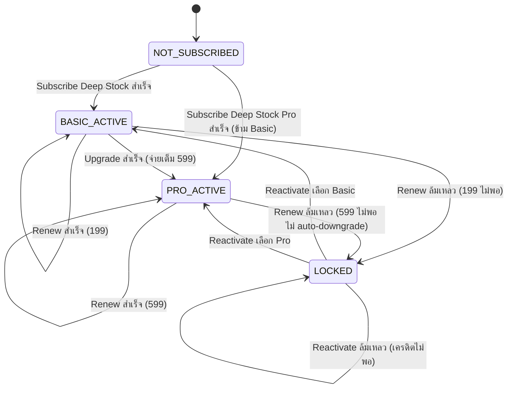
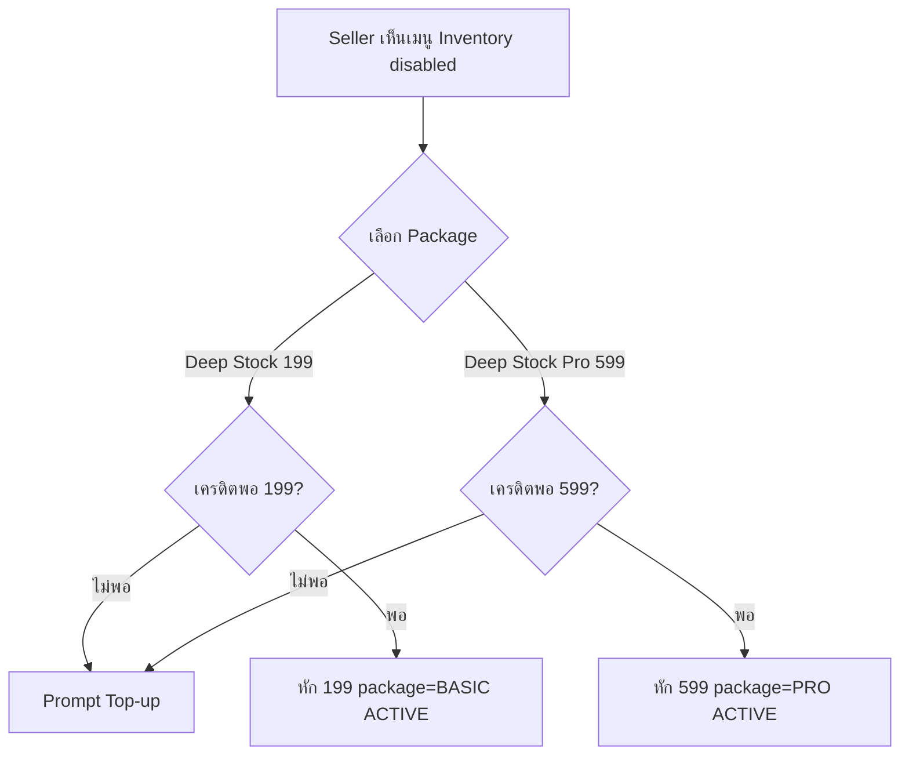
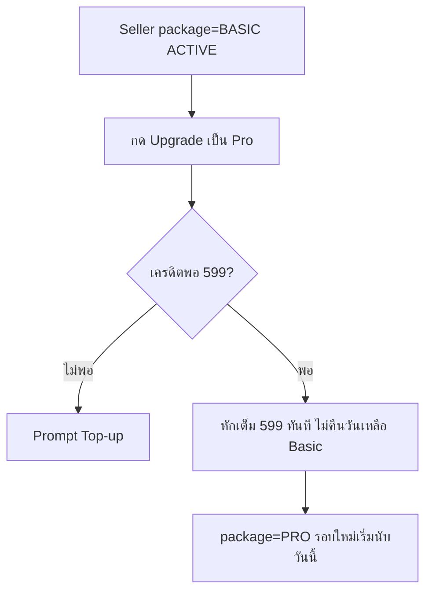
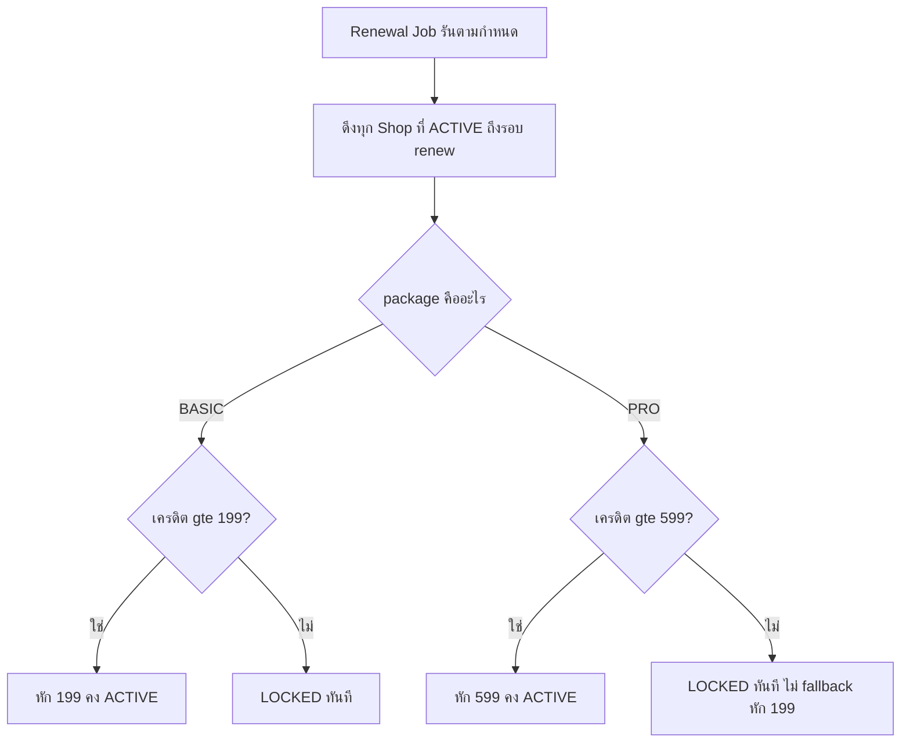
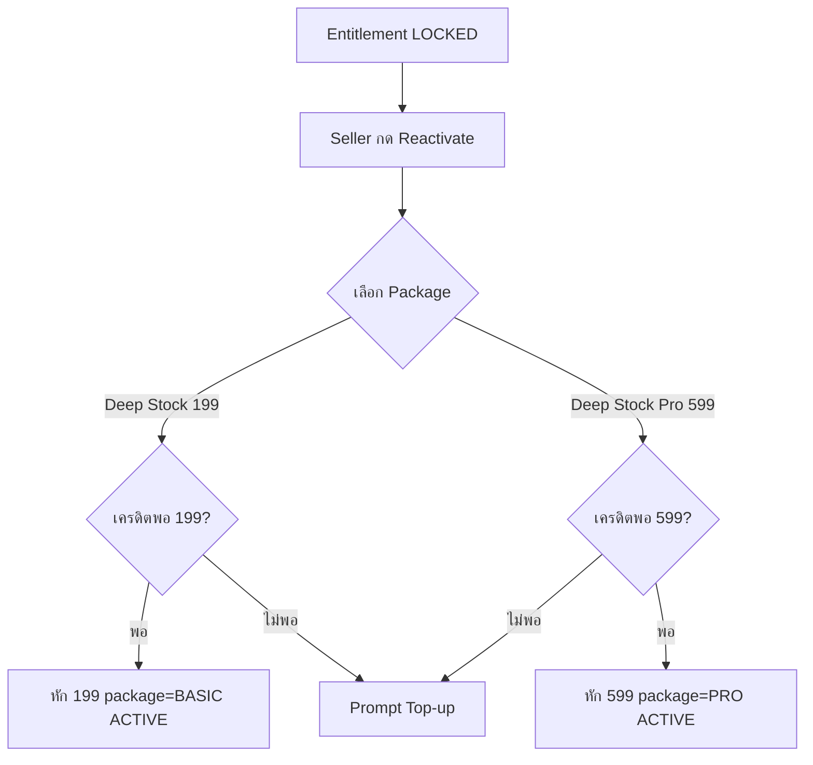

> **โมดูล:** M00009-DeepStockPro
> **ประเภทเอกสาร:** Business Requirements Document (BRD) — NON-TECHNICAL
> **เวอร์ชัน:** 1.0
> **วันที่จัดทำ:** 2026-07-02
> **สถานะ:** Draft — รอ user sign-off
> **เจ้าของเอกสาร:** BA (ดู [[Feature-Docs-Ownership]])

> ⚠️ **Provisional decisions (ตั้งโดย Controller ระหว่าง user ไม่อยู่หน้าจอ, ต้อง confirm):** feature number = **00009** (00008 ชนกับ Business Account & Packages); Variant แยกไป **00010** (OD-B); Renewal ไม่พอ = **Lock ทั้งก้อน** (OD-A); Audit log = **record-always/display-gated** (OD-C); **ไม่มี free trial** (OD-D). ดูรายละเอียดใน PRD §Decisions Log.

# BRD: Deep Stock Pro (Business Requirements Document)

---

## 1. บทนำ

### 1.1 วัตถุประสงค์ของเอกสาร

1. กำหนด Functional Requirements ระดับ non-technical สำหรับการขยาย Inventory Add-on (feat 00003) เป็น **2 แพ็กเกจ**: Deep Stock (฿199/เดือน) และ Deep Stock Pro (฿599/เดือน)
2. กำหนดกฎ billing lifecycle ของการ upgrade/reactivate ข้าม package, กฎ grandfather สำหรับ subscriber เดิมของ 00003, และ entitlement matrix ที่รองรับมิติ package
3. ระบุเงื่อนไขการรับงาน (Acceptance Criteria) แบบ Given/When/Then สำหรับทีม QA — โดยเฉพาะ backward compatibility กับ 00003 เดิม (ความเสี่ยงสูงสุด)
4. สร้างความเข้าใจร่วมกันระหว่างทีมธุรกิจและทีมพัฒนาก่อนเริ่ม implement — โดยเฉพาะจุด Open Decision ที่ต้อง confirm ก่อนเข้า SRS

### 1.2 ขอบเขตของระบบ

**Deep Stock Pro** คือการขยาย Inventory Add-on (feat 00003, live บน prod) จาก 1 ราคาคงที่ให้กลายเป็น 2 แพ็กเกจที่ stack กัน — Deep Stock (฿199, เนื้อหาเดิม + Manual Stock Adjustment ใหม่) และ Deep Stock Pro (฿599, Deep Stock + Alert + Audit Log + CSV) ทั้งหมดหักผ่าน SellerWallet เดิม ทำงานเฉพาะเมื่อ entitlement ของ Shop มี **status=ACTIVE** (ไม่ว่า package ใด) เท่านั้น. **Variant ไม่อยู่ใน scope นี้** (ย้ายไป 00010).

**Input:** คำสั่ง subscribe (ตรง Basic/Pro) / upgrade (Basic→Pro) / reactivate (เลือก package); จำนวนสต็อกต่อ Product (opt-in, PHYSICAL); คำสั่งปรับสต็อกเองผ่านหน้า Manual Adjustment; Threshold low-stock (Pro); ไฟล์ CSV import (Pro); Event สร้าง/cancel order จาก OMS เดิม; Renewal job รายวัน (ขยายให้รู้ราคาต่อ package)

**Output:** สถานะ Entitlement (NOT_SUBSCRIBED / ACTIVE / LOCKED) + package (BASIC / PRO); WalletTransaction (DEDUCT) แยก label ตาม package; จำนวนสต็อกที่อัปเดต real-time; Movement/Audit log entry; Low-stock alert notification (Pro); ไฟล์ CSV export (Pro); Error response ปฏิเสธ order เมื่อสต็อกไม่พอ

**ระบบที่เกี่ยวข้อง:** feat 00003, SellerWallet + `wallet.service`, Order service, Product service, Scheduled Job/Cron, Notification/timeline channel, Paces seller sidebar + forms

### 1.3 กลุ่มผู้ใช้งาน

| กลุ่มผู้ใช้ | บทบาท | สิทธิ์การใช้งาน |
|-----------|--------|----------------|
| **Seller — ยังไม่เคย subscribe** | ใช้งาน Order/Product ปกติ | เห็นเมนู Inventory disabled + prompt เลือก 2 package |
| **Seller — Deep Stock (BASIC) ACTIVE** | Subscribe/เคย subscribe 00003 | ทุกอย่างของ 00003 + Manual Adjustment; ไม่มี Alert/Audit/CSV |
| **Seller — Deep Stock Pro (PRO) ACTIVE** | Subscribe ตรงหรือ upgrade มาจาก Basic | ทุกอย่างของ BASIC + Alert + Audit Log + CSV |
| **Seller — LOCKED** | เคย ACTIVE แต่เครดิตไม่พอตอน renew | เมนู disabled + prompt reactivate เลือก package; ข้อมูลเดิมเก็บไว้ครบ |
| **Admin** | ดูแล WalletTransaction/TopUpRequest | เห็นรายการหักเครดิตแยก label ตาม package |

---

## 2. ความต้องการหลัก (Functional Requirements)

### 2.1 Deep Stock (Basic) Enhancement & Grandfather

#### FR-DSP-01: Manual Stock Adjustment เพิ่มเข้า Deep Stock (Basic)

**User Story:** ในฐานะ Seller ที่ ACTIVE บน Deep Stock ฉันต้องการหน้าปรับสต็อกเองแยกจากหน้า product (รับของเข้าคลัง/ของเสียหาย) เพื่อจัดการสต็อกได้ตรงความเป็นจริงโดยไม่ต้องผ่านการแก้ product ทีละครั้ง

**Acceptance Criteria:**
- [ ] `[FR-DSP-01-AC-01]` **Given** Shop entitlement status=ACTIVE (ไม่ว่า package BASIC หรือ PRO) **When** Seller เข้าเมนู Inventory **Then** เห็นหน้า/action "ปรับสต็อกเอง" ที่แก้ stockQty ของสินค้า tracked ได้โดยตรง พร้อมระบุเหตุผล (รับของเข้า/ของเสียหาย/อื่น ๆ)
- [ ] `[FR-DSP-01-AC-02]` **Given** Shop entitlement ไม่ ACTIVE (NOT_SUBSCRIBED หรือ LOCKED) **When** พยายามเข้าหน้านี้ **Then** ระบบ block ที่ server-side (pattern FR-INV-07-AC-04 ของ 00003)
- [ ] `[FR-DSP-01-AC-03]` การปรับสต็อกเองต้องเป็น atomic เหมือน deduct/restock เดิม (ป้องกัน race condition กับ order concurrent)

#### FR-DSP-02: Grandfather — Subscriber เดิมของ 00003 ได้ Manual Adjustment ฟรี

**User Story:** ในฐานะ Seller ที่ ACTIVE บน Inventory Add-on เดิม (00003) ฉันต้องการได้ฟีเจอร์ใหม่นี้ทันทีโดยไม่ถูกเรียกเก็บเงินเพิ่มหรือถูกขอ action ใด ๆ

**Acceptance Criteria:**
- [ ] `[FR-DSP-02-AC-01]` **Given** Shop มี entitlement status=ACTIVE จาก 00003 อยู่ก่อน feature นี้ deploy **When** feature deploy สำเร็จ **Then** entitlement นั้นถูก backfill เป็น package=BASIC โดยอัตโนมัติ ไม่มี WalletTransaction ใหม่เกิดขึ้น ไม่มี action จาก Seller
- [ ] `[FR-DSP-02-AC-02]` **Given** entitlement ถูก backfill แล้ว **When** Seller เข้าเมนู Inventory **Then** เห็นหน้า Manual Adjustment ใช้งานได้ทันที (FR-DSP-01)

---

### 2.2 Deep Stock Pro — Subscription Lifecycle

#### FR-DSP-03: Subscribe ตรงเป็น Deep Stock Pro (ข้าม Basic)

**User Story:** ในฐานะ Seller ที่ยังไม่เคย subscribe อะไรเลย ฉันต้องการ subscribe ตรงเป็น Deep Stock Pro ได้เลยถ้าต้องการฟีเจอร์ระดับสูงตั้งแต่แรก ไม่ต้องผ่าน Basic ก่อน

**Acceptance Criteria:**
- [ ] `[FR-DSP-03-AC-01]` **Given** entitlement=NOT_SUBSCRIBED และเครดิต ≥ ฿599 **When** Seller เลือก "Subscribe Deep Stock Pro" **Then** หักเครดิต ฿599 ทันที (atomic) → WalletTransaction (DEDUCT, `reason=INVENTORY_SUBSCRIPTION_PRO` machine-key, map→label ไทยผ่าน `WALLET_REASON_LABEL_TH`) → entitlement = ACTIVE, package=PRO
- [ ] `[FR-DSP-03-AC-02]` **Given** entitlement=NOT_SUBSCRIBED และเครดิต < ฿599 **When** กด subscribe Pro **Then** ปฏิเสธ + prompt top-up (ไม่หักบางส่วน)
- [ ] `[FR-DSP-03-AC-03]` UI ต้องให้ Seller เลือกระหว่าง 2 package ชัดเจนตั้งแต่จุดเริ่ม ไม่ใช่บังคับผ่าน Basic ก่อนเสมอ

#### FR-DSP-04: Upgrade — Deep Stock (Basic) → Deep Stock Pro

**User Story:** ในฐานะ Seller ที่ ACTIVE บน Deep Stock ฉันต้องการ upgrade เป็น Pro ได้ทุกเมื่อกลางรอบ เพื่อได้ฟีเจอร์ระดับสูงทันทีโดยไม่ต้องรอรอบ renew

**Acceptance Criteria:**
- [ ] `[FR-DSP-04-AC-01]` **Given** entitlement ACTIVE, package=BASIC และเครดิต ≥ ฿599 **When** Seller กด "Upgrade เป็น Pro" **Then** หักเครดิตเต็ม ฿599 ทันที (atomic, ไม่ใช่ผลต่าง ฿400) → WalletTransaction (DEDUCT, `reason=INVENTORY_SUBSCRIPTION_PRO_UPGRADE` machine-key แยก event upgrade ออกจาก subscribe ตรง — สำหรับ KPI Basic→Pro Upgrade Rate) → entitlement เปลี่ยน package=PRO ทันที → renewal cycle 30 วันเริ่มนับใหม่จากวันนี้
- [ ] `[FR-DSP-04-AC-02]` **Given** upgrade สำเร็จ **When** เข้าเมนู Inventory **Then** เห็นฟีเจอร์ Pro (Alert/Audit/CSV) ใช้งานได้ทันที
- [ ] `[FR-DSP-04-AC-03]` **Given** entitlement ACTIVE, package=BASIC และเครดิต < ฿599 **When** กด upgrade **Then** ปฏิเสธ + prompt top-up (ไม่หักบางส่วน)
- [ ] `[FR-DSP-04-AC-04]` การ upgrade ไม่คืน/ไม่ credit วันที่เหลือของรอบ Basic เดิมไม่ว่ากรณีใด (ไม่มี proration)

#### FR-DSP-05: Downgrade — ไม่มี Self-service ใน MVP

**User Story:** ในฐานะระบบ ฉันต้องไม่มีปุ่มให้ Seller เปลี่ยนจาก Pro เป็น Basic เองใน MVP เพื่อคงความเรียบง่ายของ billing state machine

**Acceptance Criteria:**
- [ ] `[FR-DSP-05-AC-01]` ไม่มี UI/API endpoint ใดให้ Seller เปลี่ยน package=PRO → package=BASIC โดยตรงขณะ status=ACTIVE
- [ ] `[FR-DSP-05-AC-02]` ทางเดียวที่ package เปลี่ยนจาก PRO เป็น BASIC คือผ่าน LOCKED → Reactivate เลือก BASIC เอง (FR-DSP-07)

#### FR-DSP-06: Renewal — หักตามราคา Package ปัจจุบัน

**User Story:** ในฐานะระบบ ฉันต้องหักเครดิตตามราคาของ package ปัจจุบันของแต่ละ Shop (199 หรือ 599) ที่ถึงรอบ renew โดยอัตโนมัติ

**Acceptance Criteria:**
- [ ] `[FR-DSP-06-AC-01]` **Given** Shop entitlement ACTIVE, package=BASIC ครบ 30 วัน **When** renewal job รัน **Then** หัก ฿199 (atomic)
- [ ] `[FR-DSP-06-AC-02]` **Given** Shop entitlement ACTIVE, package=PRO ครบ 30 วัน **When** renewal job รัน **Then** หัก ฿599 (atomic)
- [ ] `[FR-DSP-06-AC-03]` **Given** เครดิตไม่พอสำหรับราคาของ package ปัจจุบัน (ไม่ว่าจะพอสำหรับ package ที่ต่ำกว่าหรือไม่) **When** renewal job พยายามหัก **Then** entitlement เปลี่ยนเป็น LOCKED ทันที **ไม่มี auto-downgrade** ⚠️ (OD-A provisional = lock ทั้งก้อน, รอ confirm)
- [ ] `[FR-DSP-06-AC-04]` renewal job ต้อง idempotent ต่อ Shop ต่อวัน (สืบทอด FR-INV-02-AC-04 ของ 00003)
- [ ] `[FR-DSP-06-AC-05]` เตือนล่วงหน้า 3 วันก่อนรอบ ถ้าเครดิตปัจจุบัน < ราคาของ package ปัจจุบัน (สืบทอด FR-INV-03)

#### FR-DSP-07: Reactivate — เลือก Package เอง (Explicit)

**User Story:** ในฐานะ Seller ที่ถูกล็อก ฉันต้องการเลือกเองว่าจะ reactivate เป็น Deep Stock หรือ Deep Stock Pro โดยไม่ถูกบังคับกลับไป package เดิมก่อนล็อก

**Acceptance Criteria:**
- [ ] `[FR-DSP-07-AC-01]` **Given** entitlement LOCKED (ไม่ว่า package เดิมก่อนล็อกจะเป็นอะไร) **When** Seller กด Reactivate **Then** ระบบให้เลือก package (Deep Stock หรือ Deep Stock Pro) ก่อนหักเครดิต
- [ ] `[FR-DSP-07-AC-02]` **Given** เลือก package แล้วและเครดิต ≥ ราคาของ package ที่เลือก **When** ยืนยัน **Then** หักเครดิตเต็มจำนวนทันที → entitlement=ACTIVE, package=ตามที่เลือก → renewal cycle ใหม่เริ่มนับจากวันนี้
- [ ] `[FR-DSP-07-AC-03]` **Given** เลือก package แล้วแต่เครดิตไม่พอ **When** ยืนยัน **Then** ปฏิเสธ + prompt top-up
- [ ] `[FR-DSP-07-AC-04]` **Given** Seller reactivate เป็น BASIC ทั้งที่ก่อนล็อกเป็น PRO **When** reactivate สำเร็จ **Then** ข้อมูล Pro เดิม (movement history) ยังเก็บไว้ครบ แต่ฟีเจอร์ Pro หยุดทำงานจนกว่าจะ upgrade กลับ (FR-DSP-04)

**Business Flow:**

---

### 2.3 Deep Stock Pro Features

#### FR-DSP-08: Low-Stock Alert

**User Story:** ในฐานะ Seller ที่ Pro ACTIVE ฉันต้องการตั้ง threshold แจ้งเตือนต่อสินค้า เพื่อรู้ก่อนของหมดจริง มีเวลาสั่งของเพิ่ม

**Acceptance Criteria:**
- [ ] `[FR-DSP-08-AC-01]` **Given** entitlement ACTIVE, package=PRO และสินค้า tracked **When** Seller ตั้ง threshold (จำนวนเต็ม ≥0) **Then** ระบบบันทึกและเริ่มตรวจสอบ
- [ ] `[FR-DSP-08-AC-02]` **Given** stockQty ของสินค้าลดถึงหรือต่ำกว่า threshold **When** เกิด deduct event **Then** ส่งแจ้งเตือนให้ Seller (ช่องทาง = OD-E, TBD ที่ SRS)
- [ ] `[FR-DSP-08-AC-03]` **Given** entitlement เปลี่ยนจาก PRO เป็นอื่น (LOCKED หรือ reactivate เป็น BASIC) **When** เปลี่ยนสถานะ **Then** alert หยุดทำงาน แต่ threshold ที่เคยตั้งไว้ไม่ถูกลบ (data retention pattern เดียวกับ stockQty)

#### FR-DSP-09: Stock Movement History / Audit Log

**User Story:** ในฐานะ Seller ที่ Pro ACTIVE ฉันต้องการดูประวัติการเปลี่ยนแปลงสต็อกย้อนหลัง เพื่อตรวจสอบว่าตัวเลขถูกต้องและรู้ว่าใคร/อะไรทำให้เปลี่ยน

**Acceptance Criteria:**
- [ ] `[FR-DSP-09-AC-01]` ทุก event ที่กระทบ stockQty (order deduct, order-cancel restock, manual adjustment จาก FR-DSP-01) ต้องถูกบันทึกเป็น movement entry พร้อมเวลา/จำนวน/แหล่งที่มา
- [ ] `[FR-DSP-09-AC-02]` **Given** entitlement ACTIVE, package=PRO **When** Seller เปิดหน้า movement history ของสินค้าหนึ่ง **Then** เห็นรายการเรียงเวลาล่าสุดก่อน พร้อมระบุแหล่งที่มาแต่ละรายการ
- [ ] `[FR-DSP-09-AC-03]` **OD-C (provisional = record-always/display-gated):** ระบบบันทึก movement event **เสมอทุก package** (รวมตอน BASIC ก่อน upgrade) — gate เฉพาะการ query/แสดงผลด้วย package=PRO เพื่อไม่ให้ audit log ขาดช่วง

#### FR-DSP-10: CSV Import/Export

**User Story:** ในฐานะ Seller ที่ Pro ACTIVE และมีหลาย SKU ฉันต้องการ import/export จำนวนสต็อกเป็นไฟล์ CSV เพื่อจัดการทีเดียวแทนแก้ทีละชิ้น

**Acceptance Criteria:**
- [ ] `[FR-DSP-10-AC-01]` **Given** entitlement ACTIVE, package=PRO **When** Seller กด export **Then** ได้ไฟล์ CSV รายการสินค้า PHYSICAL ทั้งหมดพร้อม stockQty ปัจจุบัน
- [ ] `[FR-DSP-10-AC-02]` **Given** entitlement ACTIVE, package=PRO **When** Seller upload CSV ที่แก้จำนวนแล้ว **Then** ระบบอัปเดต stockQty ของสินค้าที่ match เป็น batch พร้อม validation (รายละเอียด format = SDS)
- [ ] `[FR-DSP-10-AC-03]` Import ที่มีแถวผิดพลาด (สินค้าที่หาไม่เจอ/ค่าติดลบ) ต้องรายงานว่าแถวไหนล้มเหลว ไม่ทำให้ทั้งไฟล์ fail เงียบ ๆ

> **หมายเหตุ:** SKU-level Variant (ไซส์/สี) ที่เคยพิจารณาเป็น Pro feature **ย้ายไป proposed feature 00010** (OD-B) — ไม่อยู่ใน scope ของ 00009. ดูเหตุผลที่ PRD §6.1/§6.3.

---

### 2.4 Admin Visibility

#### FR-DSP-11: Admin เห็น Label แยกตาม Package

**User Story:** ในฐานะ Admin ฉันต้องการเห็นรายการหักเครดิตที่ระบุชัดว่าเป็น Deep Stock หรือ Deep Stock Pro เพื่อวินิจฉัยปัญหา support ได้เร็ว

**Acceptance Criteria:**
- [ ] `[FR-DSP-11-AC-01]` **Given** Shop มีการหักเครดิต Deep Stock (subscribe/renew) **When** Admin เปิดหน้า WalletTransaction **Then** เห็น label "Inventory Subscription - Deep Stock"
- [ ] `[FR-DSP-11-AC-02]` **Given** Shop มีการหักเครดิต Deep Stock Pro (subscribe/upgrade/renew) **When** Admin เปิดหน้าเดียวกัน **Then** เห็น label "Inventory Subscription - Deep Stock Pro"
- [ ] `[FR-DSP-11-AC-03]` Transaction เก่าของ 00003 (label "Inventory Subscription" แบบไม่ระบุ package) **ไม่ถูก relabel ย้อนหลัง**
- [ ] `[FR-DSP-11-AC-04]` Admin เห็นได้ว่า Shop ปัจจุบันอยู่ package ไหน (Basic/Pro) จากหน้า wallet transaction เดิมหรือหน้าที่เกี่ยวข้อง

---

### 2.5 Backward Compatibility (สืบทอดจาก 00003)

#### FR-DSP-12: Shop ที่ไม่มี Entitlement ACTIVE ใช้งานเหมือนเดิมทุกประการ

**User Story:** ในฐานะ Seller ที่ไม่ subscribe อะไรเลย ฉันต้องการสร้าง order/product ได้เหมือนก่อนมี feature นี้ทุกประการ

**Acceptance Criteria:**
- [ ] `[FR-DSP-12-AC-01]` สืบทอด FR-INV-12-AC-01 ถึง AC-04 ของ 00003 ทุกข้อ ไม่มีข้อยกเว้นเพิ่ม
- [ ] `[FR-DSP-12-AC-02]` **Given** Shop เคย ACTIVE บน Basic (00003 เดิม) ก่อน feature นี้ deploy **When** feature deploy **Then** flow การสร้าง/แก้/cancel order-product ของ shop นั้นไม่เปลี่ยนแปลง ยกเว้นได้ Manual Adjustment เพิ่ม (FR-DSP-02)

---

## 3. Acceptance Criteria สรุป

### 3.1 Basic Enhancement & Grandfather
- ✅ Subscriber เดิมของ 00003 ได้ Manual Adjustment ทันทีหลัง deploy ไม่มี billing event ใหม่
- ✅ Manual Adjustment ใช้ได้กับทั้ง package BASIC และ PRO (ไม่ผูก Pro-only)

### 3.2 Subscription Lifecycle (2 Package)
- ✅ Subscribe ตรงเป็น Pro ได้โดยไม่ต้องผ่าน Basic
- ✅ Upgrade Basic→Pro จ่ายเต็ม ไม่มี proration รอบใหม่เริ่มนับทันที
- ✅ ไม่มี downgrade self-service — ทางเดียวคือผ่าน LOCKED→Reactivate
- ✅ Renewal หักตามราคาของ package ปัจจุบันเสมอ ไม่มี auto-downgrade
- ✅ Reactivate เป็น explicit choice เลือก package เองเสมอ

### 3.3 Pro Features
- ✅ Low-stock alert แจ้งเตือนถูกต้องตาม threshold
- ✅ Movement/Audit log บันทึกครบทุก event ที่กระทบ stockQty (record-always)
- ✅ CSV import/export ทำงานถูกต้อง พร้อม error report ต่อแถว

### 3.4 Backward Compatibility & Admin
- ✅ Shop ที่ไม่มี entitlement ACTIVE ไม่ถูกกระทบเลย
- ✅ Admin แยก label package ได้ถูกต้อง ไม่กระทบ transaction ประวัติศาสตร์

---

## 4. Business Flows (กระบวนการทำงาน)

### 4.1 เลือก Package ตอน Subscribe ครั้งแรก

### 4.2 Upgrade กลางรอบ

### 4.3 Renewal ตามราคา Package + ไม่ Auto-downgrade

### 4.4 Reactivate เลือก Package เอง

---

## 5. Use Case Scenarios

### Scenario 1: Subscriber เดิม (00003) ได้ฟีเจอร์ใหม่ฟรี แล้ว Upgrade
1. Feature 00009 deploy → migration backfill package=BASIC ให้ entitlement เดิม
2. Seller เห็น Manual Adjustment ใหม่ ใช้ได้ทันที ไม่มีการหักเครดิต
3. Seller กด Upgrade เป็น Pro กลางรอบ → หักเต็ม 599 → package=PRO
→ **ผลลัพธ์:** ไม่มี billing event ที่ไม่ตั้งใจระหว่าง deploy, upgrade เป็นไปตามกฎ no-proration

### Scenario 2: Subscribe ตรงเป็น Pro (ข้าม Basic)
1. Seller (NOT_SUBSCRIBED, เครดิต ฿700) เลือก "Deep Stock Pro" ตรง ๆ
2. หัก 599 → package=PRO ACTIVE ทันที
→ **ผลลัพธ์:** Seller ได้ Alert/Audit/CSV ทันทีโดยไม่ต้องผ่าน Basic

### Scenario 3: Pro โดนล็อก แล้ว Reactivate เป็น Basic แทน (Edge Case)
1. Shop LOCKED (เดิม PRO), เครดิตหลัง top-up = ฿550 (พอ Basic ไม่พอ Pro)
2. Seller กด Reactivate → เลือก Deep Stock (Basic) → หัก 199 → package=BASIC ACTIVE
→ **ผลลัพธ์:** ข้อมูล Pro เดิม (movement history) เก็บไว้ครบ แต่ใช้ไม่ได้จนกว่าจะ upgrade กลับ

### Scenario 4: Regression Check — Shop ที่ไม่เคย Subscribe เลย
1. Seller (NOT_SUBSCRIBED ตลอดมา) สร้าง/แก้/cancel order-product ปกติ
→ **ผลลัพธ์:** ไม่มี field/validation/latency ใหม่ปรากฏ — เหมือนก่อนมี feature 00009 (สืบทอด 00003)

---

## 6. ความต้องการด้านคุณภาพ (Quality Requirements)

- **6.1 ความถูกต้อง:** ราคาที่หักตรงกับ package จริงเสมอ (199/599) ไม่หักผิดราคาข้าม package; Movement/audit log reconcile กับ stockQty ปัจจุบันได้ 100%
- **6.2 ความรวดเร็ว:** สืบทอด NFR ของ 00003 — stock check short-circuit เร็วสำหรับ Shop ที่ไม่มี entitlement ACTIVE
- **6.3 ความน่าเชื่อถือ:** Renewal job รู้ราคาต่อ package ถูกต้อง 100%; Migration backfill package=BASIC ครอบคลุม entitlement เดิมทุกแถว (verify DB query ก่อน/หลัง)
- **6.4 ความปลอดภัย:** สืบทอด 00003 — bypass URL block ที่ server-side, scope ownership ทุก action (subscribe/upgrade/reactivate ยืนยัน seller ของ shop นั้นจริง)
- **6.5 Usability:** ข้อความ UI แยกชัด 3 สถานการณ์ (ยังไม่ subscribe / ACTIVE พร้อม CTA upgrade ถ้า Basic / LOCKED เลือก package ใหม่); ข้อความ grandfather deploy สื่อสารว่า "ได้ฟีเจอร์ใหม่ฟรี ไม่มีการเรียกเก็บเงินเพิ่ม"

---

## 7. ข้อจำกัด (Constraints)

**7.1 ธุรกิจ:** ไม่มี proration ทุกทิศทาง; ไม่มี downgrade self-service; ไม่มี free trial (OD-D); ไม่มี SKU cap แยก package; ไม่รวม Variant (→ 00010)

**7.2 เทคนิค:** Entitlement schema ต้องเพิ่มมิติ package โดยไม่กระทบ row เดิม (migration + backfill); Renewal job รู้ราคาต่อ package; Alert/Audit/CSV ทำงานระดับ product เดิม (ถ้า 00010 Variant มาทีหลัง ต้อง rework รองรับระดับ variant)

---

## 8. กฎทางธุรกิจ (Business Rules)

**8.1 Pricing & Package**
- **BR-DSP-01:** Deep Stock ฿199/เดือน, Deep Stock Pro ฿599/เดือน — flat rate ทั้งคู่ ไม่มี proration
- **BR-DSP-02 (Stack ไม่ Replace):** Pro = Basic + เพิ่มเสมอ
- **BR-DSP-03 (Billing Source):** หักผ่าน SellerWallet เดิมเท่านั้น (สืบทอด BR-INV-02)

**8.2 Grandfather & Basic Enhancement**
- **BR-DSP-04 (Grandfather):** Subscriber เดิมของ 00003 ที่ ACTIVE ได้ Manual Adjustment ทันทีหลัง deploy ไม่มี billing event
- **BR-DSP-05 (Manual Adjustment Scope):** ใช้ได้ทั้ง BASIC และ PRO ไม่ผูก Pro-only

**8.3 Upgrade/Downgrade/Reactivate**
- **BR-DSP-06 (Upgrade No-Proration):** Basic→Pro กลางรอบ จ่ายเต็ม 599 ทันที ไม่คืนวันที่เหลือ รอบใหม่เริ่มนับจากวันนี้
- **BR-DSP-07 (No Self-service Downgrade):** ไม่มีปุ่ม downgrade ใน MVP — ทางเดียวคือ LOCKED→Reactivate
- **BR-DSP-08 (Reactivate Explicit Choice):** Reactivate ต้องเลือก package เอง ไม่ auto-restore
- **BR-DSP-09 (Renewal ตามราคา Package):** หักตามราคาของ package ปัจจุบันเท่านั้น ไม่ auto-downgrade ⚠️ (OD-A)
- **BR-DSP-10 (No Grace Period):** สืบทอด BR-INV-04

**8.4 Data Retention**
- **BR-DSP-11:** ล็อกไม่ลบ stockQty/movement history ไม่ว่า package ใด (สืบทอด BR-INV-06)

**8.5 Admin & Labeling**
- **BR-DSP-12:** WalletTransaction ใหม่หลัง launch ต้องระบุ package ในชื่อ reason; transaction เก่าไม่ relabel ย้อนหลัง

---

## 9. อภิธานศัพท์ (Glossary)

| คำศัพท์ | ความหมาย |
|---------|----------|
| **Package** | Deep Stock (฿199) หรือ Deep Stock Pro (฿599) — ตั้งใจเลี่ยงคำว่า "Tier" |
| **Grandfather** | การให้สิทธิ์ feature ใหม่แก่ subscriber เดิมโดยไม่มี billing event |
| **Upgrade** | BASIC→PRO กลางรอบ จ่ายเต็มไม่มี proration |
| **Downgrade** | PRO→BASIC — ไม่มี self-service ใน MVP |
| **Auto-downgrade (ที่ renewal)** | แนวคิดที่ระบบหักราคาต่ำกว่าอัตโนมัติถ้าหักราคาปัจจุบันไม่สำเร็จ — **BR-DSP-09 กำหนดว่าไม่ทำ** (OD-A, รอ confirm) |

---

## 10. Open Decisions ที่ต้อง Confirm ก่อนเข้า SRS

| # | เรื่อง | provisional (Controller ตั้ง) | ทางเลือก |
|---|------|-------------------------------|---------|
| **OD-A** | Renewal ไม่พอสำหรับราคา package ปัจจุบัน แต่พอสำหรับ package ต่ำกว่า | **Lock ทั้งก้อน** | (1) Lock ทั้งก้อน [แนะนำ] (2) auto-downgrade หัก package ต่ำกว่า |
| **OD-B** | Variant แยกเป็น feature ใหม่ หรือคงใน 00009 | ✅ **ข้าม Variant ก่อน** (user 2026-07-02) — พักเป็น 00010 อนาคต | resolved |
| **OD-C** | Movement/Audit log บันทึกเฉพาะ PRO หรือบันทึกตลอด gate เฉพาะการดู | **record-always/display-gated** | (1) record-always [ครบกว่า] (2) record เฉพาะ PRO |
| **OD-D** | Free trial สำหรับ Pro | **ไม่มี trial** | (1) ไม่มี [default] (2) มี N วัน |
| **OD-E** | ช่องทางแจ้งเตือน low-stock alert | defer → SRS | reuse channel เดิม (00003 OD-4) vs สร้างใหม่ |

---

**หมายเหตุ:** สำหรับความต้องการระดับภาพรวม/personas/KPI ดู [[PRD]]. สำหรับ technical specification ดู [[SRS]] (ยังไม่เริ่ม — รอ sign-off).
