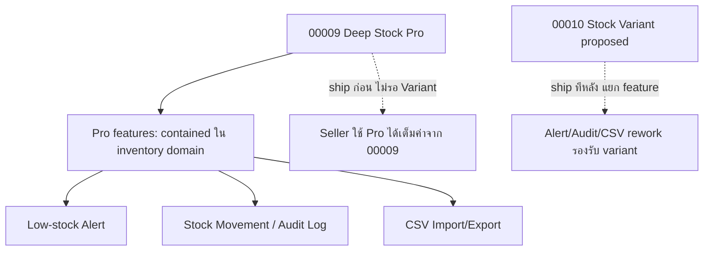
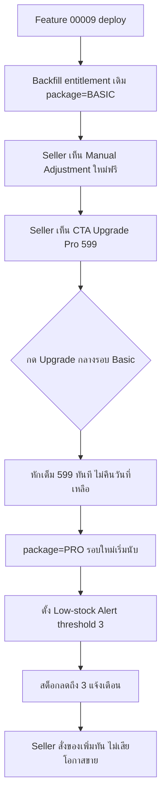
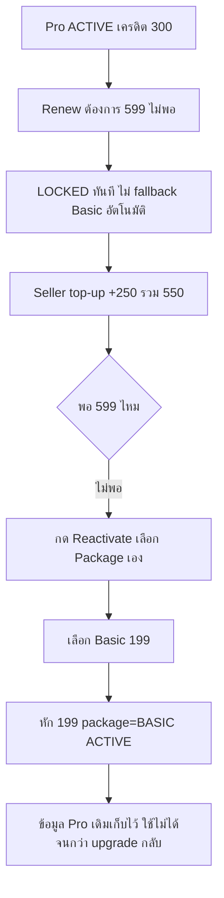

> **โมดูล:** M00009-DeepStockPro
> **ประเภทเอกสาร:** Product Requirements Document (PRD)
> **เวอร์ชัน:** 1.0
> **วันที่จัดทำ:** 2026-07-02
> **สถานะ:** Draft — รอ user sign-off ก่อนส่งต่อ SRS/SDS/DATABASE/API/Tests
> **เจ้าของเอกสาร:** BA + PO + PM (ดู [[Feature-Docs-Ownership]])

---

## ⚠️ Decisions Log (provisional — ตั้งโดย Controller ระหว่าง user ไม่อยู่หน้าจอ 2026-07-02, ต้อง confirm ก่อน sign-off)

| # | ประเด็น | ค่าที่ตั้งไว้ (provisional) | สถานะ |
|---|---------|---------------------------|-------|
| **Feature number** | 00008 ที่ agent เดา **ชนกับ "00008 - Business Account & Packages"** (branch อื่น, ยืนยันด้วย `git log --all`) | ใช้ **00009 - Deep Stock Pro** | ยึดแล้ว (collision-checked) |
| **OD-B Variant** | **ข้าม Variant ก่อน** (user 2026-07-02) — 00009 ไม่รวม Variant; พักเป็น 00010 อนาคต ยังไม่เริ่ม | ✅ resolved |
| **OD-A Renewal ไม่พอ** | **Lock ทั้งก้อน** ไม่ auto-downgrade | รอ confirm |
| **OD-C Audit log** | **บันทึกทุก event เสมอทุก package, gate เฉพาะการแสดงผลด้วย Pro** | รอ confirm |
| **OD-D Free trial** | **ไม่มี trial ใน MVP** | รอ confirm |
| **OD-E Alert channel** | ปล่อยให้ SRS ตัดสิน (reuse notification channel เดิม vs สร้างใหม่) | defer → SRS |

> ผลของ OD-B: เอกสารนี้ (00009) จำกัด scope ไว้ที่ **Manual Adjustment (Basic) + Low-stock Alert + Audit Log + CSV (Pro)** เท่านั้น. Variant ถูกย้ายออกไปเป็น proposed feature 00010 — คงอ้างอิงไว้ที่ §6.1/§6.3 เพื่อบันทึก rationale แต่ **ไม่อยู่ใน build scope ของ 00009**.

---

# PRD: Deep Stock Pro (Inventory Add-on แบบ 2 แพ็กเกจ)

---

## Executive Summary

Deep Stock Pro คือการอัพเกรด Inventory Add-on จาก 1 ราคาคงที่ (฿199/เดือน, feature 00003 — SIGNED-OFF และ live บน prod แล้ว) ให้กลายเป็น **2 แพ็กเกจ**: **Deep Stock** (฿199/เดือน, เนื้อหาเดิมของ 00003 + เพิ่มความสามารถ "ปรับสต็อกเอง" ที่ 00003 ไม่เคยมี) และ **Deep Stock Pro** (฿599/เดือน, stack เพิ่มจาก Deep Stock ด้วยชุดฟีเจอร์เชิง proactive: แจ้งเตือนสต็อกใกล้หมด, ประวัติการเคลื่อนไหวสต็อก/audit log, นำเข้า-ส่งออก CSV) ทั้งสองแพ็กเกจยังคงหักเครดิตผ่าน **SellerWallet** เดิม ไม่มี proration ทั้งขาขึ้น/ขาลง เป้าหมายทางธุรกิจหลักคือเปลี่ยน value proposition ของ Inventory Add-on จาก "ป้องกันเรื่องแย่ (defensive)" อย่างเดียว ให้มีชั้น "ช่วยบริหารสต็อกเชิงรุก (proactive)" ที่ seller เห็นคุณค่ารายวันมากขึ้น เพิ่ม ARPU ผ่าน upsell path ที่ชัดเจน (Free → Deep Stock → Deep Stock Pro) โดยไม่กระทบ 00003 ที่ sign-off และ live แล้วแม้แต่น้อย (00003 ยังเป็น record ของแพ็กเกจ Basic เดิม — เอกสารนี้ extend ไม่ replace)

⚠️ **หมายเหตุ scope:** ฟีเจอร์ SKU-level Variant (ไซส์/สี) ที่ user เสนอเข้ามา ถูกวิเคราะห์แล้วว่ามี blast radius ข้าม domain (Product/OrderItem ที่ 00003 เพิ่งฝัง live) จึง**ถูกย้ายออกเป็น proposed feature 00010 แยกต่างหาก** (ดู §6.1/§6.3) — 00009 นี้ไม่รวม Variant ในbuild scope.

---

## 1. Business Goals & KPIs

### 1.1 เป้าหมายทางธุรกิจ

| เป้าหมาย | รายละเอียด |
|----------|-----------|
| **เพิ่ม ARPU ผ่าน Upsell Path** | สร้างขั้นบันไดราคา Free → Deep Stock (฿199) → Deep Stock Pro (฿599) ที่ seller เห็นคุณค่าต่างชัดพอจะจ่ายเพิ่ม ไม่ใช่แค่เพิ่มราคาเฉย ๆ |
| **เปลี่ยน Value Prop จาก Defensive เป็น Proactive** | ฿199 เดิม = กันขายเกิน (reactive). ฿599 ใหม่ = รู้ก่อนของหมด + ตรวจสอบย้อนหลังได้ + จัดการเร็วขึ้น (proactive) — ให้ seller เปิดใช้งานบ่อยขึ้น ไม่ใช่เข้าเฉพาะตอนของใกล้หมด |
| **รักษา Backward Compatibility กับ 00003** | subscriber เดิมที่ ACTIVE บนแพ็กเกจ ฿199 ต้องไม่ถูกกระทบ (ไม่โดนเรียกเก็บเงินเพิ่ม, ไม่เสีย feature เดิม) — และยังได้ "ปรับสต็อกเอง" เพิ่มฟรีทันที (grandfather) |
| **Zero Regression บน Order/Product Core Flow** | เช่นเดียวกับ 00003 — Shop ที่ไม่มี entitlement ACTIVE ต้องไม่ถูกกระทบจาก feature นี้เลย |

### 1.2 ตัวชี้วัดความสำเร็จ (KPIs)

> หมายเหตุ: เป้าหมายตัวเลขทั้งหมดเป็น **เป้าเบื้องต้น (proposed)** ไม่มี baseline จริง — ปรับได้หลัง launch เหมือนที่ 00003 ทำ

| KPI | คำอธิบาย | เป้าหมาย (เสนอ) |
|-----|----------|---------|
| **Basic→Pro Upgrade Rate** | % ของ Shop ที่ entitlement=Deep Stock ACTIVE ที่กด upgrade เป็น Pro ภายใน 90 วัน | ≥ 15% |
| **Direct-to-Pro Conversion Rate** | % ของ Shop ที่ subscribe ตรงเป็น Pro (ข้าม Basic) เทียบ subscriber ใหม่ทั้งหมด | วัด trend (ไม่มี baseline) |
| **Pro MRR** | ผลรวม ฿599 × จำนวน Shop ที่ entitlement package=PRO, status=ACTIVE | Baseline เดือนแรกหลัง launch |
| **Pro Retention (30/60/90 วัน)** | % ของ Shop ที่ upgrade เป็น Pro แล้วยัง ACTIVE หลัง 30/60/90 วัน | ≥ 70% ที่ 30 วัน |
| **Alert Engagement Rate** | % ของ low-stock alert ที่ seller เปิดดู/กดเข้า inventory ภายใน 24 ชม. | ≥ 40% |
| **CSV Feature Adoption** | % ของ Pro subscriber ที่ใช้ import/export CSV อย่างน้อย 1 ครั้ง/เดือน | วัด trend |
| **Manual Adjustment Adoption (Basic)** | % ของ Deep Stock (Basic) subscriber ที่ใช้หน้าปรับสต็อกเองอย่างน้อย 1 ครั้ง/เดือน | วัด trend — วัด value ของ feature ที่ grandfather เข้าไปให้ subscriber เดิม |

---

## 2. User Personas (กลุ่มผู้ใช้งาน)

### 2.1 Seller ที่ ACTIVE บน Deep Stock (฿199) เดิมอยู่แล้ว — grandfather target

**ข้อมูลพื้นฐาน:** เคย subscribe 00003 มาก่อน feature นี้ launch, entitlement ACTIVE, มี stockQty ตั้งไว้แล้วในหลาย product

**เป้าหมาย:** ใช้งานต่อเนื่องเหมือนเดิม ไม่อยากถูกบังคับจ่ายเพิ่มเพื่อได้ของเดิม

**ความต้องการ:**
- ได้ "ปรับสต็อกเอง" (Manual Stock Adjustment) เพิ่มโดยอัตโนมัติ ไม่ต้องทำอะไรเพิ่ม ไม่มีการเรียกเก็บเงิน
- เห็น CTA upgrade เป็น Pro แบบไม่รบกวน (informative ไม่ pushy เกิน)

**จุดปวด:** กลัว "อัพเกรดระบบ" แปลว่าต้องจ่ายเพิ่มโดยไม่ยินยอม/ไม่รู้ตัว

### 2.2 Seller ที่มีหลาย SKU / ขายหลายช่องทาง — Pro upsell target หลัก

**ข้อมูลพื้นฐาน:** มีสินค้า PHYSICAL จำนวนมาก (>10-20 ชิ้น) และ/หรือขายพร้อมกันหลายแพลตฟอร์ม (Deep + Shopee/LINE/Facebook)

**เป้าหมาย:**
- รู้ก่อนของหมดเพื่อสั่งของ/แจ้ง supplier ทัน ไม่ใช่รู้ตอนระบบ block แล้ว
- reconcile ตัวเลขสต็อกข้ามช่องทางได้ ไม่สงสัยว่าทำไมเลขไม่ตรง
- จัดการสต็อกจำนวนมากได้เร็วกว่าการแก้ทีละชิ้น

**ความต้องการ:** Low-stock alert ตั้ง threshold ได้, Movement/audit log ดูย้อนหลังได้ว่าใคร/เมื่อไหร่/เท่าไหร่, Import/export CSV แทนแก้ทีละชิ้น

**จุดปวด:** ของหมดกะทันหันเพราะไม่มี early-warning; ตัวเลขสต็อกเพี้ยนแล้วหาสาเหตุไม่ได้ (มีพนักงานหลายคนแก้); แก้สต็อกทีละชิ้นช้าเกินไปเมื่อร้านโต

### 2.3 Seller ที่ยังไม่ subscribe อะไรเลย (regression-sensitive, สืบทอดจาก 00003)

**ข้อมูลพื้นฐาน:** ใช้ Order/Product flow เดิมอยู่แล้วบน prod ไม่สนใจ inventory tracking

**เป้าหมาย:** ใช้งานเหมือนเดิมทุกประการ ไม่ถูกกระทบจากการมี 2 แพ็กเกจใหม่

**ความต้องการ:** เห็นเมนู Inventory disabled พร้อม CTA ที่อธิบาย 2 แพ็กเกจชัดเจน (ไม่ใช่แค่ "subscribe" เฉย ๆ เหมือน 00003 เดิม)

**จุดปวด:** กลัวว่าการมี 2 แพ็กเกจใหม่จะทำให้ flow เดิมซับซ้อนขึ้นทั้งที่ตัวเองไม่ subscribe

### 2.4 Admin (Wallet / Support) — สืบทอดจาก 00003, ขอบเขตกว้างขึ้น

**ข้อมูลพื้นฐาน:** ดูแล WalletTransaction/TopUpRequest ของทั้งระบบอยู่แล้ว

**เป้าหมาย:** แยกแยะได้ว่า shop หนึ่ง ๆ อยู่แพ็กเกจไหน (Basic/Pro) และ transaction ไหนเป็นของแพ็กเกจไหน เมื่อ support ติดต่อมา

**ความต้องการ:** WalletTransaction label แยกชัดระหว่าง "Deep Stock" กับ "Deep Stock Pro" ไม่ใช่ label เดียวกันแบบ 00003 เดิม

**จุดปวด:** ถ้า label ไม่แยก จะแยกไม่ออกว่า seller จ่าย 199 หรือ 599 ตอนวินิจฉัยปัญหา billing

---

## 3. Business Requirements

### 3.1 Deep Stock (฿199) — คงเดิม + เพิ่ม Manual Stock Adjustment

**ความต้องการ:**
- ทุกความสามารถของ 00003 เดิม (ตั้ง/แก้จำนวนสต็อก opt-in, ตัด/คืนสต็อกอัตโนมัติ, hard stop, data retention on lock) **คงเดิมทุกประการ ห้ามแก้ logic**
- เพิ่มความสามารถใหม่: **หน้าปรับสต็อกเอง (Manual Stock Adjustment)** — แยกจากการแก้ในหน้า product (เช่น รับของเข้าคลัง, ของเสียหาย/สูญหาย) ให้กับ Deep Stock (Basic) **ไม่ใช่แค่ Pro**

**Business Rules:**
- Manual Stock Adjustment เป็นสิทธิ์ของทุก entitlement ที่ **status=ACTIVE ไม่ว่า package จะเป็น Deep Stock หรือ Deep Stock Pro** (feature นี้ inherit ขึ้นบนสุด ไม่ผูกกับ package ใดโดยเฉพาะ)
- Subscriber เดิมที่ ACTIVE บน 00003 ก่อน feature นี้ launch ต้องได้ความสามารถนี้ทันทีที่ deploy โดย**ไม่มี billing event ใหม่เกิดขึ้น** (ไม่หักเครดิตซ้ำ, ไม่ต้องกด action ใด ๆ)

**เหตุผล:** 00003 เดิมไม่มีหน้านี้เลย — เป็นช่องว่างที่ระบุใน Discovery ว่าทำให้ ฿199 "คุณค่าไม่พอ"; ให้ subscriber เดิมได้ฟีเจอร์เพิ่มฟรีเป็นการรักษาความไว้ใจ (goodwill) ก่อนเปิดขาย Pro

### 3.2 Deep Stock Pro (฿599) — Subscription ใหม่, Stack บน Deep Stock

**ความต้องการ:**
- Seller เปิดใช้ Deep Stock Pro ได้ 2 ทาง: (a) **subscribe ตรง** จาก NOT_SUBSCRIBED (ข้าม Basic) หรือ (b) **upgrade** จาก Deep Stock ที่ ACTIVE อยู่แล้ว
- Deep Stock Pro = ทุกอย่างของ Deep Stock (§3.1) **บวก** ฟีเจอร์ Pro (§3.7-§3.9)

**Business Rules:**
- ราคา flat ฿599/เดือน ไม่มี proration เหมือน Deep Stock เดิม
- ต้องมีเครดิต ≥ ฿599 ตอนกด subscribe/upgrade — ถ้าไม่พอ ปฏิเสธ + prompt top-up (pattern เดียวกับ FR-INV-01-AC-02 ของ 00003)
- หักผ่าน SellerWallet เดิม — ไม่มีช่องทางจ่ายแยก

### 3.3 Upgrade: Deep Stock → Deep Stock Pro (No Proration)

**ความต้องการ:** Seller ที่ ACTIVE บน Deep Stock กด "Upgrade เป็น Pro" ได้ทุกเมื่อระหว่างรอบ (ไม่ต้องรอ renew)

**Business Rules:**
- Upgrade กลางรอบ = **จ่ายเต็ม ฿599 ทันที** (ไม่ใช่ผลต่าง ฿400) — ไม่มีการคืน/หักลบวันที่เหลือของรอบ Basic เดิม
- รอบ renewal ใหม่เริ่มนับ 30 วัน rolling จากวันที่ upgrade สำเร็จ (ไม่ใช่ต่อจากรอบ Basic เดิม) — pattern เดียวกับ reactivate ของ 00003
- หลัง upgrade สำเร็จ renewal รอบถัดไปทั้งหมดจะหักในราคา ฿599 (Pro) จนกว่าจะถูก LOCKED หรือมี action เปลี่ยนแปลงอื่น

### 3.4 Downgrade: Deep Stock Pro → Deep Stock (ไม่ทำใน MVP)

**ความต้องการ:** ไม่มี — Seller ไม่มีทางเปลี่ยนจาก Pro กลับเป็น Basic เองใน MVP นี้

**Business Rules:**
- ไม่มี self-service downgrade UI (สืบทอด BR-INV เดิมของ 00003 ที่ "ไม่มี manual unsubscribe")
- ทางเดียวที่ "ลดระดับ" ได้คือปล่อยเครดิตหมดจน LOCKED แล้ว reactivate เลือก package ใหม่เอง (ดู §3.6)

### 3.5 Renewal & Lock — ขยายให้รองรับ 2 แพ็กเกจ

**ความต้องการ:** Renewal job ต้องหักเครดิตตาม **ราคาของ package ปัจจุบัน** ของแต่ละ Shop (฿199 ถ้า Basic, ฿599 ถ้า Pro) ไม่ใช่ราคาคงที่เดียวเหมือน 00003 เดิม

**Business Rules:**
- ไม่มี grace period (สืบทอดจาก 00003 เดิม, ไม่เปลี่ยน)
- เตือนล่วงหน้า 3 วันก่อนถึงรอบ ถ้าเครดิตปัจจุบัน < ราคาของ package ปัจจุบัน (สืบทอด BR-INV-05)
- **ไม่มี auto-downgrade ที่ renewal** — ถ้า Shop เป็น Pro (฿599) และเครดิตไม่พอสำหรับ ฿599 แต่พอสำหรับ ฿199 ระบบ**ไม่**หัก ฿199 แทนอัตโนมัติ — ต้อง LOCKED ทั้งก้อน **(OD-A: ตั้ง provisional = Lock ทั้งก้อน, รอ user confirm)**
- Data retention on lock: สืบทอด BR-INV-06 เดิม (ไม่ลบข้อมูลสต็อกไม่ว่า package ไหน)

### 3.6 Reactivate — เลือก Package เองเสมอ (Explicit Action)

**ความต้องการ:** Seller ที่ LOCKED กด reactivate ต้อง**เลือก package เอง** (Deep Stock หรือ Deep Stock Pro) ไม่ใช่ auto-restore package เดิมก่อนล็อก

**Business Rules:**
- ถ้าเครดิตพอแค่ ฿199 แต่ก่อนล็อกเป็น Pro (฿599) → seller เลือก reactivate เป็น Deep Stock (Basic) ได้ ระบบไม่บังคับต้อง Pro เท่านั้น
- ข้อมูลสต็อกและ movement history ที่เคยตั้งไว้ตอน Pro ยังคงอยู่ครบไม่ว่าจะ reactivate กลับเป็น package ไหน — แต่ถ้า reactivate เป็น Basic เท่านั้น ฟีเจอร์ Pro (alert/audit/CSV) จะ **หยุดทำงาน** จนกว่าจะ upgrade กลับ Pro อีกครั้ง

### 3.7 Deep Stock Pro Feature: Low-Stock Alert

**ความต้องการ:** Seller ที่ Pro ACTIVE ตั้ง threshold แจ้งเตือนต่อสินค้าได้ (เช่น เหลือ ≤5 ชิ้น) ระบบแจ้งเตือนเมื่อสต็อกลดถึงระดับนั้น

**Business Rules:**
- ใช้ได้เฉพาะสินค้าที่ tracked (มี stockQty ตั้งไว้) และ entitlement package=PRO, status=ACTIVE เท่านั้น
- ช่องทางแจ้งเตือน: TBD (reuse notification/timeline channel เดิมที่ 00003 OD-4 ทิ้งไว้ หรือสร้างใหม่ — OD-E, ตัดสินที่ SRS)

**เหตุผล:** ตอบ pain "รู้ตอนของหมดแล้ว" ตรงที่สุด — เปลี่ยนฟีเจอร์จาก reactive เป็น proactive

### 3.8 Deep Stock Pro Feature: Stock Movement History / Audit Log

**ความต้องการ:** Seller ที่ Pro ACTIVE ดูประวัติการเปลี่ยนแปลงสต็อกย้อนหลังได้ (ตัดจาก order, คืนจาก cancel, ปรับเองจาก Manual Adjustment) ต่อสินค้า

**Business Rules:**
- **บันทึกทุก event ที่กระทบ stockQty เสมอทุก package** (order deduct/restock, manual adjustment) — gate เฉพาะการ**แสดงผล**ด้วย package=PRO **(OD-C: ตั้ง provisional = record-always/display-gated, รอ user confirm)**
- Log ต้องแสดง: เวลา, จำนวนที่เปลี่ยน, สาเหตุ/แหล่งที่มา (order ID หรือ manual)

**เหตุผล:** ตอบ pain "ตัวเลขไม่ตรง ไม่รู้ทำไม" — สร้างความไว้ใจในตัวเลขสต็อกเอง ตรงกับ mission ของ Deep; record-always กัน log ขาดช่วงเมื่อ upgrade ทีหลัง

### 3.9 Deep Stock Pro Feature: CSV Import/Export

**ความต้องการ:** Seller ที่ Pro ACTIVE นำเข้า/ส่งออกจำนวนสต็อกเป็นไฟล์ CSV ได้ (แทนแก้ทีละสินค้า)

**Business Rules:**
- Export: ดึงรายการสินค้า PHYSICAL ทั้งหมดของ shop พร้อมจำนวนสต็อกปัจจุบัน
- Import: อัปเดต stockQty ของสินค้าที่มีอยู่แล้วเป็น batch (รายละเอียด format/validation = SRS/SDS)
- ใช้ได้เฉพาะ package=PRO, status=ACTIVE

**เหตุผล:** ตอบ pain ร้านหลาย SKU ที่แก้ทีละชิ้นไม่ scale — willingness-to-pay สูงสำหรับร้านที่กำลังโต

### 3.10 Menu Gate & Backward Compatibility — ขยายจาก 00003

**ความต้องการ:**
- เมนู Inventory ต้องสื่อสาร 2 แพ็กเกจชัดเจน (ไม่ใช่แค่ subscribe/reactivate เหมือน 00003 เดิม) — Seller ต้องเห็นว่ามี 2 ตัวเลือกราคาต่างกัน
- Shop ที่ไม่มี entitlement ACTIVE เลย (ทั้ง Basic และ Pro) ต้องใช้งาน Order/Product เหมือนไม่มี feature นี้อยู่เลย — สืบทอด FR-INV-12/BR-INV-14 ของ 00003 ทุกประการ

**Business Rules:** Backward compatibility กับ 00003 = ความเสี่ยงสูงสุด — Shop ที่เคย ACTIVE บน Deep Stock (Basic) ต้องทำงานเหมือนเดิมทุกประการ ยกเว้นได้ Manual Adjustment เพิ่ม (§3.1)

### 3.11 Admin Visibility — ขยาย Label

**ความต้องการ:** Admin เห็น WalletTransaction label แยกชัดระหว่าง "Deep Stock" (฿199) กับ "Deep Stock Pro" (฿599) ในหน้า wallet transaction เดิม

**Business Rules:**
- Transaction ใหม่ตั้งแต่ feature นี้ launch ใช้ label ใหม่ที่ระบุ package
- Transaction เก่าของ 00003 (label "Inventory Subscription" เดิม) **ไม่ backfill/relabel ย้อนหลัง** — คงเดิมตามประวัติจริง

---

## 4. Business Rules & Constraints

### 4.1 กฎทางธุรกิจหลัก

| กฎ | คำอธิบาย |
|----|----------|
| **2 ราคาคงที่** | Deep Stock ฿199/เดือน, Deep Stock Pro ฿599/เดือน — ไม่มี proration ทั้งคู่ |
| **Stack ไม่ Replace** | Pro = Basic + เพิ่ม เสมอ ไม่มีฟีเจอร์คนละชุด |
| **Grandfather Manual Adjustment** | subscriber Deep Stock เดิม (00003) ได้ฟีเจอร์นี้ฟรีทันทีที่ deploy ไม่มี billing event |
| **Upgrade = จ่ายเต็ม ไม่มี proration** | Basic→Pro กลางรอบ จ่ายเต็ม ฿599 เริ่มรอบใหม่ทันที ไม่คืน/หักลบวันที่เหลือ |
| **ไม่มี Downgrade Self-service ใน MVP** | ทางเดียวคือ LOCKED แล้ว reactivate เลือก package ใหม่ |
| **ไม่มี Grace Period** | สืบทอดจาก 00003 ทุกประการ ไม่ว่า package ไหน |
| **Reactivate = Explicit Package Choice** | ไม่ auto-restore package เดิมก่อนล็อก ให้ seller เลือกเอง |
| **Data Retention ทุก Package** | ล็อกไม่ลบข้อมูลสต็อก/movement history ไม่ว่า package ไหน |

### 4.2 ข้อจำกัดทางธุรกิจ

| ข้อจำกัด | รายละเอียด |
|---------|-----------|
| **ผูกกับ SellerWallet เดิม** | เหมือน 00003 — บั๊ก wallet infra กระทบทั้ง SMS/Basic/Pro พร้อมกัน |
| **ไม่มี Free Trial ใน MVP** | OD-D provisional = ไม่มี trial |
| **ไม่มี SKU cap แยกตาม package** | Basic/Pro ไม่จำกัดจำนวนสินค้า track |
| **Renewal ไม่ auto-downgrade** | OD-A provisional = ล็อกทั้งก้อน ไม่ fallback ราคาต่ำกว่า |
| **ไม่รวม Variant** | Variant ย้ายไป proposed feature 00010 (OD-B) |

### 4.3 เงื่อนไข Entitlement State Machine (ขยายจาก 00003)

| Status | Package | เมนู Inventory | ฟีเจอร์ที่ใช้ได้ |
|--------|---------|----------------|-------------------|
| **NOT_SUBSCRIBED** | — | disabled + prompt เลือก Deep Stock / Deep Stock Pro | ไม่มี |
| **ACTIVE** | BASIC | ใช้งานเต็ม | สต็อกพื้นฐาน (00003) + Manual Adjustment |
| **ACTIVE** | PRO | ใช้งานเต็ม | ทุกอย่างของ BASIC + Alert + Audit Log + CSV |
| **LOCKED** | (จำค่า package ล่าสุดไว้เพื่อแสดงข้อความ แต่ reactivate เลือกใหม่ได้เสมอ) | disabled + prompt reactivate | ไม่มี — ข้อมูลเก็บไว้ครบ |

> ตาราง entitlement นี้เป็น PM-level intent — รายละเอียด schema (จะเพิ่ม field `package` ใน `InventoryEntitlement` หรือสร้าง enum ใหม่) เป็นงานของ [[SRS]]/[[DATABASE]] รอบถัดไป

---

## 5. Out of Scope (นอกขอบเขต)

| หัวข้อ | คำอธิบาย |
|--------|----------|
| **SKU-level Variant (ไซส์/สี)** | ย้ายไป proposed feature 00010 — blast radius กระทบ Product/OrderItem ข้าม domain (OD-B, §6.1) |
| **Downgrade Self-service UI** | ไม่ทำใน MVP — ตาม decision ของ user (§3.4) |
| **Proration ทุกทิศทาง** | Upgrade/downgrade/renewal ไม่มี proration ใน MVP |
| **แพ็กเกจที่ 3 ขึ้นไป** | มีแค่ 2 แพ็กเกจ (Deep Stock / Deep Stock Pro) ใน MVP |
| **Free Trial** | ไม่มีใน MVP (OD-D) |
| **SKU cap แยกตาม package** | ไม่ทำ — ไม่จำกัดจำนวนสินค้า track ทั้ง 2 package |
| **Reorder Point / Sell-velocity Analytics** | ยังไม่ทำแม้ใน Pro MVP — รอ data source จาก Movement History ก่อน |
| **Barcode / QR Scan** | ยังไม่ทำ — นอก context ของ platform (web มือถือ ไม่มี POS hardware) |
| **Supplier Management** | ไม่ทำ — นอก product model ของ Deep ทั้งหมด |
| **Admin แก้ไข entitlement/stock โดยตรง** | สืบทอด Out of Scope เดิมจาก 00003 |
| **Stock ของ DIGITAL/SERVICE/SUBSCRIPTION** | ตัดถาวรเหมือน 00003 — ไม่เปลี่ยน |
| **Retroactive relabel ของ WalletTransaction เดิม** | Transaction ประวัติศาสตร์ของ 00003 คงเดิม ไม่แก้ label ย้อนหลัง |

---

## 6. Risks & Mitigation (ความเสี่ยงและแนวทางแก้ไข)

### 6.1 ⚠️ ความเสี่ยงสูงสุด: SKU-level Variant (เป็นเหตุให้ย้ายออกเป็น 00010)

**หลักฐานเชิงเทคนิคจาก schema จริง (`prisma/schema.prisma`):**
- `Product.stockQty` เป็น `Int?` ระดับ **product เดียว** (feature 00003 เพิ่งฝัง live บน prod) — Variant ต้องการ stockQty **ระดับ variant** ซึ่งเป็นโครงสร้างคนละชั้น ไม่ใช่แค่เพิ่ม field
- `OrderItem.productId` เป็น nullable FK (`onDelete: SetNull`) และ snapshot ชื่อ/ราคาลง OrderItem แยกจาก product แล้ว — decoupling นี้ช่วยลดความเสี่ยงระดับ order-history ได้บางส่วน แต่ยังต้องเพิ่ม field ใหม่ (`variantId` + snapshot ข้อความ variant) เข้า OrderItem
- Stock deduct/restock/hard-stop logic ทั้งหมด (FR-INV-09/10/11 ของ 00003) เขียนให้ทำงานที่ระดับ **Product row** — ต้อง retarget ไปที่ variant row โดยไม่กระทบ product ที่ไม่มี variant (majority case)
- Seller-side UI ต้องเพิ่ม variant management + variant picker ในหน้าสร้าง order (seller เป็นคนเลือก เพราะ Deep เป็น seller-creates-order model — ลดความเสี่ยง buyer-facing UI)
- ฟีเจอร์ Pro อีก 3 ตัว (Alert/Audit/CSV) ถ้าต้องรองรับ variant ด้วย จะต้องทำงาน "ระดับ variant" — ถ้า Variant มาทีหลัง ต้อง rework รอบสองของทั้ง 3 ฟีเจอร์

| ความเสี่ยง | ผลกระทบ | ระดับ | แนวทางแก้ไข |
|-----------|---------|-------|-------------|
| Schema ของ Product/OrderItem ที่ 00003 เพิ่ง sign-off เปลี่ยนโครงสร้างอีกรอบ | เสี่ยง regression บน entitlement/stock logic ที่เพิ่ง live | **สูงมาก** | design ให้ variant เป็น additive layer (product ที่ไม่เปิด variant ทำงานเหมือนเดิม 100%) — regression test 00003 ทั้งชุดซ้ำ |
| Alert/Audit/CSV ต้อง rework ถ้า Variant มาทีหลัง | ต้นทุน dev ซ้ำ | กลาง | แยก Variant ออกเป็น 00010 — ยอมรับ rework cost แลกกับไม่ block การ ship 3 ฟีเจอร์ contained ก่อน |

### 6.2 คำแนะนำ Phasing (ผลของ OD-B)

### 6.3 เหตุผลการแยก Variant เป็น Feature เอกเทศ (OD-B)

Variant ควรแยกเป็น feature number ของตัวเอง (**00010**) ที่ depend on 00009 (สำหรับ package/entitlement plumbing) เพราะ:
1. กระทบ schema ที่ 00003 เพิ่ง sign-off (Product, OrderItem) ไม่ใช่แค่เพิ่มฟีเจอร์ในโดเมน inventory
2. กระทบ seller-side create-product และ create-order flow ซึ่งเป็น core flow ที่ใช้ร่วมกันกับ non-inventory sellers ทุกคน
3. มี unknown เรื่อง backward-compat กับสินค้าที่ไม่มี variant มากพอที่ควรมี BRD/SRS ของตัวเองแยก

> **สถานะ:** provisional (Controller ตั้งไว้ระหว่าง user ไม่อยู่). ถ้า user เลือก "คงไว้ใน 00009 เป็น Phase 2" จะ merge Variant กลับเข้าเอกสารนี้เป็น §3.x + FR แยก phase.

### 6.4 ความเสี่ยงทางธุรกิจอื่น

| ความเสี่ยง | ผลกระทบ | ระดับ | แนวทางแก้ไข |
|-----------|---------|-------|-------------|
| Seller สับสน "อัพเกรดระบบ = ต้องจ่ายเพิ่มไหม" | Negative sentiment กับ subscriber เดิม | กลาง | สื่อสารชัดว่า Manual Adjustment ได้ฟรี (§3.1) |
| Renewal ไม่ auto-downgrade → Pro subscriber ที่เครดิตพอแค่ Basic โดนล็อกทั้งก้อน | Churn สูงกว่าที่ควร ถ้า user ไม่เห็นด้วย | กลาง | ต้อง confirm OD-A ก่อนเข้า SRS |
| Regression บน Order/Product/00003 flow เดิม | กระทบผู้ใช้จริงบน prod | **สูง** | Regression suite ครอบคลุม 00003 เดิม + backward-compat ของ non-subscriber |

### 6.5 ความเสี่ยงทางเทคนิค

| ความเสี่ยง | ผลกระทบ | แนวทางแก้ไข |
|-----------|---------|-------------|
| Entitlement schema ต้องเพิ่มมิติ "package" ใน `InventoryEntitlement` | Migration กระทบ entitlement row เดิม (00003) ต้อง backfill package=BASIC | migration script backfill ที่ SRS/DATABASE — test ว่า subscriber เดิมไม่ขาดช่วง |
| Renewal job ต้องรู้ราคาต่อ package แทนราคาคงที่ | Bug จุดนี้กระทบ billing correctness ทั้ง Basic + Pro | Unit test แยก renewal scenario ต่อ package |
| Wallet deduction shared กับ SMS + Basic + Pro | บั๊กจุด shared กระทบ 3 ฟีเจอร์พร้อมกัน | Reuse `wallet.service` เดิม + unit test แยกต่อ deduction reason |

---

## 7. Glossary (อภิธานศัพท์)

| คำศัพท์ | ความหมาย |
|---------|----------|
| **Deep Stock** | ชื่อทางการค้าของแพ็กเกจ ฿199/เดือน (เนื้อหา = 00003 เดิม + Manual Stock Adjustment) |
| **Deep Stock Pro** | ชื่อทางการค้าของแพ็กเกจ ฿599/เดือน (Deep Stock + Alert + Audit Log + CSV) |
| **Package** | คำที่ใช้แทน "Tier" โดยตั้งใจ — เลี่ยงชนกับ "Trust Tier" (SSOT: `docs/10 - Business Rules/Tier Lists.md`) |
| **Upgrade** | Seller เปลี่ยนจาก Deep Stock (Basic) เป็น Deep Stock Pro กลางรอบ จ่ายเต็ม ไม่มี proration |
| **Grandfather** | การให้สิทธิ์ feature ใหม่ (Manual Adjustment) แก่ subscriber เดิมโดยไม่มี billing event |
| **Entitlement** | สืบทอดความหมายจาก 00003 — ขยายให้มีมิติ package เพิ่ม |

---

## 8. Success Metrics (ตัวชี้วัดความสำเร็จ)

| ตัวชี้วัด | ค่าที่คาดหวัง | วิธีวัด |
|----------|---------------|--------|
| **Zero Regression บน 00003 เดิม** | Basic subscriber เดิมไม่มี behavior change ที่ไม่ตั้งใจ (ยกเว้น Manual Adjustment ที่เพิ่มมาโดยตั้งใจ) | Regression suite เทียบ 00003 test case เดิมทั้งชุด |
| **Zero Regression บน Core Order/Product Flow** | Shop ที่ไม่มี entitlement ACTIVE ไม่มี error/behavior change | สืบทอด regression suite จาก 00003 |
| **Grandfather Correctness** | Basic subscriber เดิมทุกรายเข้าหน้า Manual Adjustment ได้ทันทีหลัง deploy โดยไม่มี WalletTransaction ใหม่ | ตรวจ DB query เทียบ entitlement ACTIVE ก่อน/หลัง deploy |
| **Upgrade/Renewal Billing Correctness** | ราคาที่หักตรงกับ package จริงทุกครั้ง (199 หรือ 599) | Unit test ต่อ scenario + reconcile WalletTransaction |

---

## 9. Dependencies & Assumptions

### 9.1 Dependencies

| ระบบ/ส่วนประกอบ | ความสัมพันธ์ |
|-----------------|-------------|
| **feat 00003 (Inventory Add-on)** | เป็นฐานทั้งหมดของ Deep Stock (Basic) — extend ไม่ replace, ต้องไม่ regression |
| **SellerWallet + `wallet.service`** | หักเครดิตทั้ง 2 package ผ่าน atomic deduct pattern เดิม |
| **WalletTransaction** | บันทึกรายการหักเครดิต แยก label ตาม package (§3.11) |
| **Product/OrderItem schema (00003)** | `Product.stockQty`, `OrderItem.stockDeducted` เป็นฐานที่ Pro features ต่อยอด |
| **Scheduled Job / Cron infra (00003)** | Renewal job ต้องขยายให้รู้ราคาต่อ package |
| **Notification/timeline channel** | Low-stock Alert ต้องมีช่องทางส่ง (OD-E = SRS decision) |
| **Paces UI (seller sidebar + product/order forms)** | Menu gate ต้องสื่อสาร 2 package |
| **proposed feature 00010 (Stock Variant)** | depend on 00009 สำหรับ package/entitlement plumbing (ถ้า OD-B = แยก) |
| **docs/PRD.md §6.2 / §7** | ต้อง sync แถว Inventory Add-on ให้สะท้อน 2 package + ปิด doc-debt S-9 (แยกเรื่อง) |

### 9.2 Assumptions

- **Grandfather ไม่มี billing event** — Manual Adjustment เป็น feature addition ล้วน ๆ ไม่ใช่ pricing change สำหรับ subscriber เดิม
- **Package field ใหม่ใน entitlement** — สมมติว่าต้องเพิ่มมิติ package เข้า entitlement model เดิม (ต้อง confirm รายละเอียดที่ SRS/DATABASE)
- **ไม่มี free trial** — สมมติ default ตาม OD-D จนกว่า user จะสั่งเพิ่ม

---

## 10. Appendix — User Journeys

### 10.1 Subscriber เดิม (00003) รับ Manual Adjustment ฟรี แล้ว Upgrade เป็น Pro

### 10.2 Pro Subscriber โดนล็อก แล้ว Reactivate เลือก Package ใหม่

---

**หมายเหตุ:** เอกสารนี้เป็นการบันทึกความต้องการทางธุรกิจ (Business/Product Requirements). สำหรับ FR/User Story/Acceptance Criteria ดู [[BRD]]. สำหรับ technical specification ดู [[SRS]] (ยังไม่เริ่ม — รอ sign-off PRD/BRD ก่อน).
