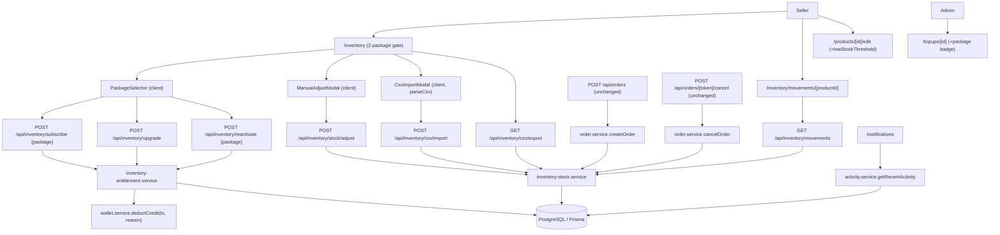
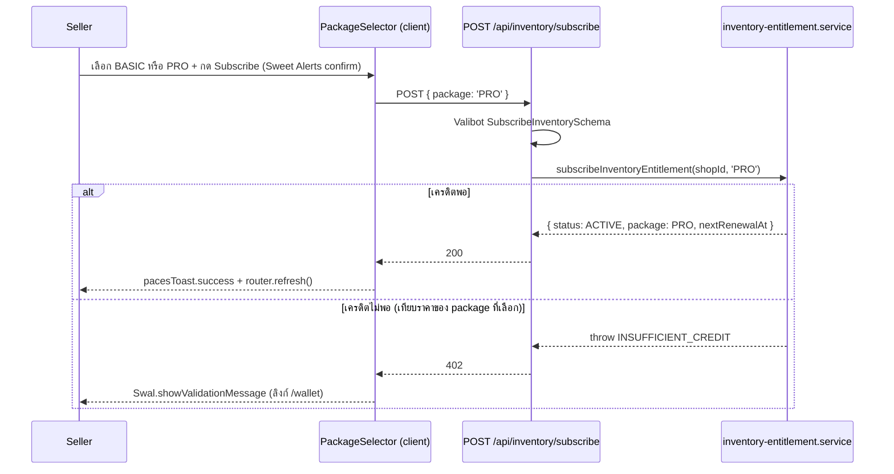
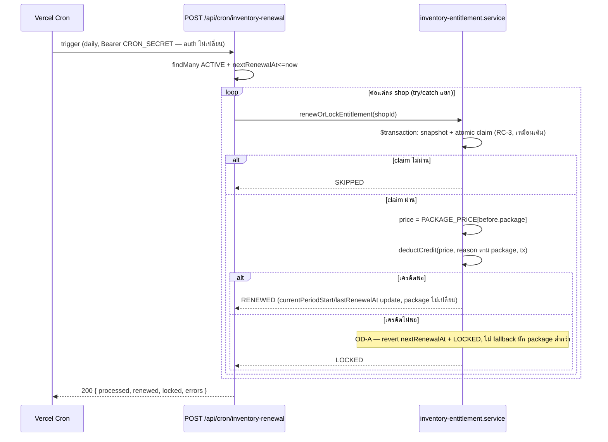
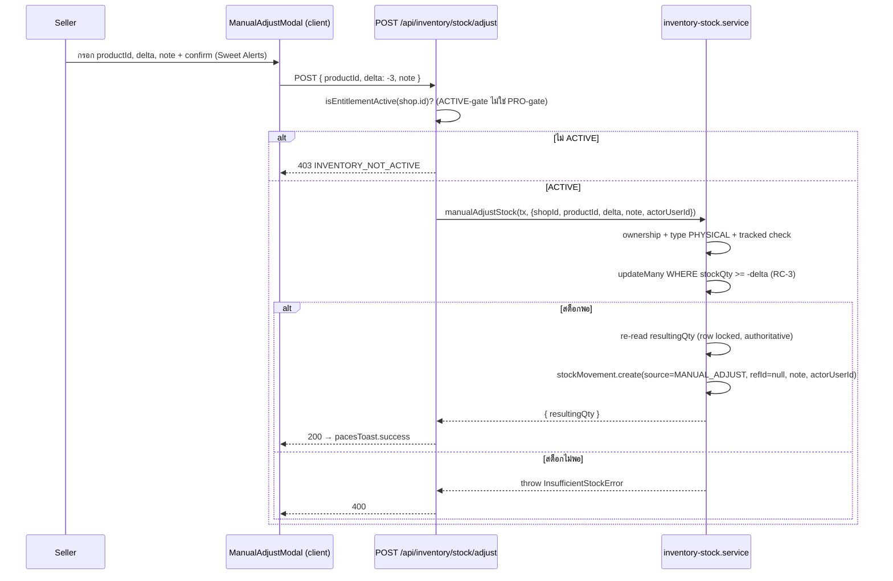
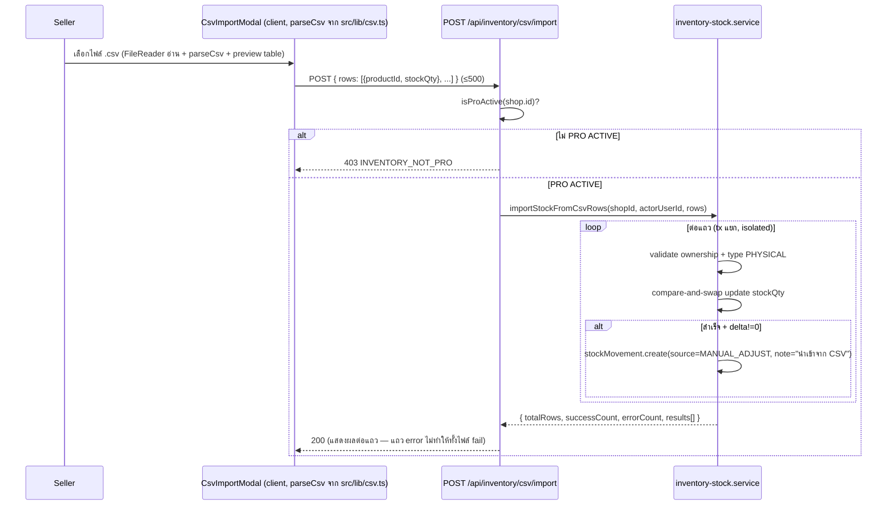

> **โมดูล:** M00009-DeepStockPro
> **ประเภทเอกสาร:** System Design Spec (SDS)
> **เวอร์ชัน:** 1.0
> **วันที่จัดทำ:** 2026-07-02
> **สถานะ:** Draft
> **เจ้าของเอกสาร:** SA (ดู [[Feature-Docs-Ownership]])

# SDS: Deep Stock Pro (System Design Spec)

---

## 1. บทนำ & Scope

### 1.1 วัตถุประสงค์

SDS นี้กำหนดการออกแบบระดับ implementation ของ M00009 ให้ DEV เขียนโค้ดได้โดยไม่ต้องเดา — ทุก signature อ้างจากโค้ดจริงที่มีอยู่ ณ วันที่เขียน (2026-07-02) ไม่ใช่ paraphrase จาก SRS

### 1.2 ขอบเขตการออกแบบ

**สร้างใหม่:**
- `src/lib/csv.ts` — `parseCsv`/`stringifyCsv` (pure, ไม่มี dependency)
- `src/app/api/inventory/upgrade/route.ts`
- `src/app/api/inventory/stock/adjust/route.ts`
- `src/app/api/inventory/movements/route.ts`
- `src/app/api/inventory/csv/export/route.ts`
- `src/app/api/inventory/csv/import/route.ts`
- `src/app/(paces)/seller/(dashboard)/inventory/movements/[productId]/page.tsx` + component
- `src/app/(paces)/seller/(dashboard)/inventory/components/ManualAdjustModal.tsx` (client)
- `src/app/(paces)/seller/(dashboard)/inventory/components/CsvImportModal.tsx` (client)
- `src/app/(paces)/seller/(dashboard)/inventory/components/PackageSelector.tsx` (client — radio card BASIC/PRO ใช้ร่วม subscribe/reactivate)

**แก้ไข (breaking หรือ additive ตามระบุ):**
- `src/lib/inventory-addon.ts` (**breaking** — `WALLET_DESC` object→function; additive — package types/prices/labels)
- `src/services/inventory-entitlement.service.ts` (**breaking** — `subscribeInventoryEntitlement`/`reactivateInventoryEntitlement`/`shouldWarnAdvance` signature; additive — `getEntitlementInfo`/`isProActive`/`upgradeToProEntitlement`)
- `src/services/inventory-stock.service.ts` (**breaking-internal** — `deductStockForOrderItems` return type `Set→Map`, `restockFromCancelledOrder` param เพิ่ม; additive — `manualAdjustStock`/`getStockMovementHistory`/`exportStockToCsv`/`importStockFromCsvRows`)
- `src/services/order.service.ts` (**breaking-internal** — `createOrder`/`cancelOrder` เพิ่ม StockMovement insert step)
- `src/services/product.service.ts` (additive — `lowStockThreshold`)
- `src/services/activity.service.ts` (additive — source 5 + `ActivityItem['type']` union ค่าใหม่)
- `src/lib/validations.ts` (additive)
- `src/app/api/inventory/subscribe/route.ts`, `.../reactivate/route.ts` (**breaking** — parse `package` จาก body)
- `src/app/api/products/route.ts`, `src/app/api/products/[id]/route.ts` (additive guard — `lowStockThreshold`)
- `src/app/(paces)/seller/(dashboard)/_seller-menu.ts` + `layout.tsx` (breaking-internal — `applyInventoryGate` รับ `package`)
- `src/app/(paces)/seller/(dashboard)/inventory/page.tsx` (additive — 2-package gate, package-aware `shouldWarnAdvance` call, Pro section)
- `src/app/(paces)/seller/(dashboard)/notifications/components/NotificationFeed.tsx` (additive — `ICON_MAP`/`ICON_COLOR_MAP` key ใหม่)
- `src/app/(paces)/seller/(dashboard)/dashboard/components/RecentActivityFeed.tsx` (additive — `ACTIVITY_STYLE` key ใหม่)
- `src/app/(paces)/seller/(fullscreen)/products/[id]/edit/page.tsx` + `ProductStockCardV2.tsx` (additive — `lowStockThreshold` field, PRO-gate)
- `src/app/(paces)/admin/(dashboard)/topups/[id]/page.tsx` (additive — `package` select + badge)

**ไม่แตะ:** `src/app/api/orders/route.ts`, `src/app/api/orders/[token]/cancel/route.ts` (external contract ไม่เปลี่ยน — internal เปลี่ยนใน `order.service.ts`)

### 1.3 เอกสารอ้างอิง

| เอกสาร | ความสัมพันธ์ |
|--------|-------------|
| [[SRS]] ของโมดูลนี้ | TFR-DSP-01..12 — requirements ที่ SDS นี้ realize |
| [[DATABASE]] ของโมดูลนี้ | FROZEN CONTRACT — ต้อง apply migration ก่อน implement |
| `src/services/inventory-entitlement.service.ts` (โค้ดจริง) | ฐานที่ต้อง extend |
| `src/services/inventory-stock.service.ts` (โค้ดจริง) | ฐานที่ต้อง extend |
| `src/services/wallet.service.ts:85-157` (โค้ดจริง) | `deductCredit` signature ปัจจุบันมี `reason` param แล้ว (00003) — **ไม่ต้องแก้ signature รอบนี้** |
| `src/services/activity.service.ts` (โค้ดจริง) | ฐานที่ต้อง extend สำหรับ OD-E |
| `src/app/(paces)/seller/(dashboard)/inventory/page.tsx:108-143` (โค้ดจริง) | call-site ที่ต้อง sync (`shouldWarnAdvance`) |

---

## 2. Architecture Overview

Extension ของ service layer เดิม — ไม่เพิ่ม subsystem ใหม่, ไม่เพิ่ม cron ใหม่ (renewal cron เดิมของ 00003 พอ), ไม่เพิ่ม dependency ใหม่



---

## 3. Component Design

### 3.1 `src/lib/inventory-addon.ts` — ส่วนที่เพิ่ม/แก้

```typescript
export type InventoryPackage = 'BASIC' | 'PRO'
export type EntitlementStatus = 'NOT_SUBSCRIBED' | 'ACTIVE' | 'LOCKED' // เดิม ไม่เปลี่ยน

export const INVENTORY_ADDON_PRICE = 199 // เดิม — คงชื่อไว้ (= BASIC price) กัน breaking import
export const INVENTORY_PRO_PRICE = 599   // ใหม่
export const INVENTORY_RENEWAL_PERIOD_DAYS = 30 // เดิม ไม่เปลี่ยน
export const INVENTORY_ADVANCE_WARNING_DAYS = 3 // เดิม ไม่เปลี่ยน

export const PACKAGE_PRICE: Record<InventoryPackage, number> = {
  BASIC: INVENTORY_ADDON_PRICE,
  PRO: INVENTORY_PRO_PRICE,
}

export const PACKAGE_LABEL_TH: Record<InventoryPackage, string> = {
  BASIC: 'Deep Stock',
  PRO: 'Deep Stock Pro',
}

export const WALLET_REASON = {
  INVENTORY_SUBSCRIPTION: 'INVENTORY_SUBSCRIPTION', // legacy — ห้ามเขียนใหม่
  INVENTORY_SUBSCRIPTION_BASIC: 'INVENTORY_SUBSCRIPTION_BASIC',
  INVENTORY_SUBSCRIPTION_PRO: 'INVENTORY_SUBSCRIPTION_PRO',
  INVENTORY_SUBSCRIPTION_PRO_UPGRADE: 'INVENTORY_SUBSCRIPTION_PRO_UPGRADE',
  SMS_ORDER_LINK: 'SMS_ORDER_LINK', // เดิม ไม่แตะ
} as const

export const WALLET_REASON_LABEL_TH: Record<string, string> = {
  INVENTORY_SUBSCRIPTION: 'Inventory Add-on',
  INVENTORY_SUBSCRIPTION_BASIC: 'Deep Stock',
  INVENTORY_SUBSCRIPTION_PRO: 'Deep Stock Pro',
  INVENTORY_SUBSCRIPTION_PRO_UPGRADE: 'อัพเกรดเป็น Deep Stock Pro',
  SMS_ORDER_LINK: 'SMS Order Link',
}

// ⚠️ BREAKING — เดิมเป็น const string object (WALLET_DESC.SUBSCRIBE ฯลฯ) เปลี่ยนเป็น function
// ทุก call-site ใน inventory-entitlement.service.ts ต้องแก้พร้อมกัน (ดู §3.2)
export const WALLET_DESC = {
  subscribe: (pkg: InventoryPackage) => `สมัคร ${PACKAGE_LABEL_TH[pkg]}`,
  renew: (pkg: InventoryPackage) => `ต่ออายุ ${PACKAGE_LABEL_TH[pkg]} (รายเดือน)`,
  reactivate: (pkg: InventoryPackage) => `เปิดใช้ ${PACKAGE_LABEL_TH[pkg]} อีกครั้ง`,
  UPGRADE: 'อัพเกรดเป็น Deep Stock Pro',
} as const

export function addDays(date: Date, days: number): Date {
  return new Date(date.getTime() + days * 86_400_000)
} // เดิม ไม่เปลี่ยน
```

### 3.2 `inventory-entitlement.service.ts` — diff จากโค้ดจริง

```typescript
import { randomUUID } from 'node:crypto'
import { prisma } from '@/lib/prisma'
import { deductCredit } from '@/services/wallet.service'
import {
  EntitlementStatus, InventoryPackage, INVENTORY_RENEWAL_PERIOD_DAYS,
  INVENTORY_ADVANCE_WARNING_DAYS, PACKAGE_PRICE, WALLET_REASON, WALLET_DESC, addDays,
} from '@/lib/inventory-addon'

// NEW — คืนทั้ง status+package ในควอรี่เดียว
export async function getEntitlementInfo(
  shopId: string,
): Promise<{ status: EntitlementStatus; package: InventoryPackage | null }> {
  const row = await prisma.inventoryEntitlement.findUnique({
    where: { shopId }, select: { status: true, package: true },
  })
  return { status: row?.status ?? 'NOT_SUBSCRIBED', package: row?.package ?? null }
}

// UNCHANGED signature — internally reuse getEntitlementInfo (backward-compat 100% กับทุก call-site เดิม)
export async function getEntitlementStatus(shopId: string): Promise<EntitlementStatus> {
  return (await getEntitlementInfo(shopId)).status
}

// UNCHANGED
export async function isEntitlementActive(shopId: string): Promise<boolean> {
  return (await getEntitlementStatus(shopId)) === 'ACTIVE'
}

// NEW — PRO-gate helper (ใช้กับ Alert/Audit/CSV)
export async function isProActive(shopId: string): Promise<boolean> {
  const info = await getEntitlementInfo(shopId)
  return info.status === 'ACTIVE' && info.package === 'PRO'
}

// BREAKING — เพิ่ม param pkg (เดิม: subscribeInventoryEntitlement(shopId))
export async function subscribeInventoryEntitlement(
  shopId: string,
  pkg: InventoryPackage,
): Promise<{ status: 'ACTIVE'; package: InventoryPackage; nextRenewalAt: Date }> {
  return prisma.$transaction(async (tx) => {
    const existing = await tx.inventoryEntitlement.findUnique({ where: { shopId }, select: { id: true } })
    if (existing) throw new Error('ENTITLEMENT_ALREADY_EXISTS')
    const entitlementId = randomUUID()
    const price = PACKAGE_PRICE[pkg]
    const reason = pkg === 'PRO' ? WALLET_REASON.INVENTORY_SUBSCRIPTION_PRO : WALLET_REASON.INVENTORY_SUBSCRIPTION_BASIC
    await deductCredit(shopId, price, entitlementId, WALLET_DESC.subscribe(pkg), reason, tx)
    const now = new Date()
    const nextRenewalAt = addDays(now, INVENTORY_RENEWAL_PERIOD_DAYS)
    await tx.inventoryEntitlement.create({
      data: { id: entitlementId, shopId, status: 'ACTIVE', package: pkg, activatedAt: now, currentPeriodStart: now, nextRenewalAt },
    })
    return { status: 'ACTIVE', package: pkg, nextRenewalAt }
  })
}

// NEW
export async function upgradeToProEntitlement(
  shopId: string,
): Promise<{ status: 'ACTIVE'; package: 'PRO'; nextRenewalAt: Date }> {
  return prisma.$transaction(async (tx) => {
    const existing = await tx.inventoryEntitlement.findUnique({ where: { shopId } })
    if (!existing || existing.status !== 'ACTIVE') throw new Error('ENTITLEMENT_NOT_ACTIVE')
    if (existing.package === 'PRO') throw new Error('ALREADY_PRO')
    await deductCredit(
      shopId, PACKAGE_PRICE.PRO, existing.id,
      WALLET_DESC.UPGRADE, WALLET_REASON.INVENTORY_SUBSCRIPTION_PRO_UPGRADE, tx,
    )
    const now = new Date()
    const nextRenewalAt = addDays(now, INVENTORY_RENEWAL_PERIOD_DAYS)
    await tx.inventoryEntitlement.update({
      where: { shopId },
      data: { package: 'PRO', currentPeriodStart: now, nextRenewalAt, lastRenewalAt: now }, // ห้ามแตะ activatedAt
    })
    return { status: 'ACTIVE', package: 'PRO', nextRenewalAt }
  })
}

// BREAKING — เพิ่ม param pkg
export async function reactivateInventoryEntitlement(
  shopId: string,
  pkg: InventoryPackage,
): Promise<{ status: 'ACTIVE'; package: InventoryPackage; nextRenewalAt: Date }> {
  return prisma.$transaction(async (tx) => {
    const existing = await tx.inventoryEntitlement.findUnique({ where: { shopId } })
    if (!existing || existing.status !== 'LOCKED') throw new Error('ENTITLEMENT_NOT_LOCKED')
    const price = PACKAGE_PRICE[pkg]
    const reason = pkg === 'PRO' ? WALLET_REASON.INVENTORY_SUBSCRIPTION_PRO : WALLET_REASON.INVENTORY_SUBSCRIPTION_BASIC
    await deductCredit(shopId, price, existing.id, WALLET_DESC.reactivate(pkg), reason, tx)
    const now = new Date()
    const nextRenewalAt = addDays(now, INVENTORY_RENEWAL_PERIOD_DAYS)
    await tx.inventoryEntitlement.update({
      where: { shopId },
      data: { status: 'ACTIVE', package: pkg, currentPeriodStart: now, nextRenewalAt, lastRenewalAt: now, lockedAt: null },
    })
    return { status: 'ACTIVE', package: pkg, nextRenewalAt }
  })
}

// แก้ internal logic — เพิ่ม package-aware pricing (RC-3 claim ไม่เปลี่ยน)
export async function renewOrLockEntitlement(shopId: string): Promise<'RENEWED' | 'LOCKED' | 'SKIPPED'> {
  return prisma.$transaction(async (tx) => {
    const now = new Date()
    const before = await tx.inventoryEntitlement.findUnique({ where: { shopId } })
    if (!before || before.status !== 'ACTIVE' || before.nextRenewalAt > now) return 'SKIPPED'

    const claimed = await tx.inventoryEntitlement.updateMany({
      where: { shopId, status: 'ACTIVE', nextRenewalAt: before.nextRenewalAt },
      data: { nextRenewalAt: addDays(now, INVENTORY_RENEWAL_PERIOD_DAYS) },
    })
    if (claimed.count === 0) return 'SKIPPED'

    const price = PACKAGE_PRICE[before.package as InventoryPackage]
    const reason = before.package === 'PRO' ? WALLET_REASON.INVENTORY_SUBSCRIPTION_PRO : WALLET_REASON.INVENTORY_SUBSCRIPTION_BASIC
    try {
      await deductCredit(shopId, price, before.id, WALLET_DESC.renew(before.package as InventoryPackage), reason, tx)
    } catch (e) {
      if (e instanceof Error && e.message === 'INSUFFICIENT_CREDIT') {
        // OD-A: ไม่ fallback หัก package ต่ำกว่า — LOCKED ทันที, package ไม่เปลี่ยน
        await tx.inventoryEntitlement.update({
          where: { shopId }, data: { status: 'LOCKED', lockedAt: now, nextRenewalAt: before.nextRenewalAt },
        })
        return 'LOCKED'
      }
      throw e
    }
    await tx.inventoryEntitlement.update({ where: { shopId }, data: { currentPeriodStart: now, lastRenewalAt: now } })
    return 'RENEWED'
  })
}

// BREAKING — เพิ่ม field package ใน entitlement param
export function shouldWarnAdvance(
  entitlement: { status: EntitlementStatus; package: InventoryPackage; nextRenewalAt: Date } | null,
  balance: number,
): boolean {
  if (!entitlement || entitlement.status !== 'ACTIVE') return false
  const daysUntilRenewal = Math.ceil((entitlement.nextRenewalAt.getTime() - Date.now()) / 86_400_000)
  const price = PACKAGE_PRICE[entitlement.package]
  return daysUntilRenewal <= INVENTORY_ADVANCE_WARNING_DAYS && daysUntilRenewal >= 0 && balance < price
}
```

**⚠️ Call-site บังคับแก้พร้อมกัน (ไม่ทำ tsc พัง):**
1. `src/app/api/inventory/subscribe/route.ts` — parse `{package}` จาก body (Valibot `SubscribeInventorySchema`), ส่งเข้า `subscribeInventoryEntitlement(shop.id, parsed.package)`
2. `src/app/api/inventory/reactivate/route.ts` — เหมือนกัน
3. `src/app/(paces)/seller/(dashboard)/inventory/page.tsx:108-143`:
   - บรรทัด 109-112: select เพิ่ม `package: true`
   - บรรทัด 121-124: `shouldWarnAdvance({status, package: entitlement.package as InventoryPackage, nextRenewalAt}, balance)`
   - บรรทัด 141: `shortfall={PACKAGE_PRICE[entitlement.package as InventoryPackage] - balance}` (แทน `INVENTORY_ADDON_PRICE - balance`)

### 3.3 `inventory-stock.service.ts` — diff จากโค้ดจริง

```typescript
import type { Prisma } from '@prisma/client'

export class OutOfStockError extends Error { /* เดิม ไม่เปลี่ยน */ }
export class InsufficientStockError extends Error {
  productName: string
  constructor(productName: string) { super('INSUFFICIENT_STOCK'); this.name = 'InsufficientStockError'; this.productName = productName }
}

// BREAKING return type: Set<string> → Map<productId, {qty, resultingQty, name}>
// เหตุผล: ต้องรู้ resultingQty ต่อ product เพื่อ insert StockMovement ที่ order.service (record-always)
export async function deductStockForOrderItems(
  tx: Prisma.TransactionClient,
  items: { productId?: string; name: string; qty: number }[],
): Promise<Map<string, { qty: number; resultingQty: number; name: string }>> {
  const qtyByProductId = new Map<string, number>()
  const nameByProductId = new Map<string, string>()
  for (const item of items) {
    if (!item.productId) continue
    qtyByProductId.set(item.productId, (qtyByProductId.get(item.productId) ?? 0) + item.qty)
    if (!nameByProductId.has(item.productId)) nameByProductId.set(item.productId, item.name)
  }
  if (qtyByProductId.size === 0) return new Map()

  const products = await tx.product.findMany({
    where: { id: { in: Array.from(qtyByProductId.keys()) } },
    select: { id: true, type: true, stockQty: true },
  })
  const trackable = products.filter((p) => p.type === 'PHYSICAL' && p.stockQty !== null)

  const deducted = new Map<string, { qty: number; resultingQty: number; name: string }>()
  const outOfStock: string[] = []

  for (const product of trackable) {
    const needed = qtyByProductId.get(product.id)!
    const res = await tx.product.updateMany({
      where: { id: product.id, stockQty: { gte: needed } },
      data: { stockQty: { decrement: needed } },
    })
    if (res.count === 0) { outOfStock.push(nameByProductId.get(product.id) ?? product.id); continue }
    // NEW — re-read resultingQty (row locked จาก updateMany เราเอง — authoritative)
    const updated = await tx.product.findUniqueOrThrow({ where: { id: product.id }, select: { stockQty: true } })
    deducted.set(product.id, { qty: needed, resultingQty: updated.stockQty!, name: nameByProductId.get(product.id)! })
  }

  if (outOfStock.length > 0) throw new OutOfStockError(outOfStock)
  return deducted
}

// BREAKING params — เพิ่ม shopId (สำหรับ StockMovement.shopId), ใช้ orderId ที่ caller ส่งเข้ามา (ไม่ query ซ้ำ)
export async function restockFromCancelledOrder(
  tx: Prisma.TransactionClient, shopId: string, orderId: string,
): Promise<void> {
  const items = await tx.orderItem.findMany({
    where: { orderId, stockDeducted: { not: null } },
    select: { productId: true, stockDeducted: true, name: true }, // +name (snapshot — productName)
  })
  if (items.length === 0) return

  for (const item of items) {
    if (!item.productId) {
      console.warn(`[inventory-stock] orphan restock — orderId=${orderId} product ถูกลบไปแล้ว ข้าม`)
      continue
    }
    const updated = await tx.product.update({
      where: { id: item.productId }, data: { stockQty: { increment: item.stockDeducted! } }, select: { stockQty: true },
    })
    // increment บน NULL (product ถูก untrack ไปแล้ว) = NULL → no-op, ห้าม insert StockMovement (CHECK delta<>0)
    if (updated.stockQty === null) continue
    await tx.stockMovement.create({
      data: {
        shopId, productId: item.productId, productName: item.name, delta: item.stockDeducted!,
        resultingQty: updated.stockQty, source: 'ORDER_RESTOCK', refId: orderId, note: null, actorUserId: null,
      },
    })
  }
}

// NEW — Manual Stock Adjustment (ACTIVE-gate ที่ caller, ไม่ใช่ PRO-gate)
export async function manualAdjustStock(
  tx: Prisma.TransactionClient,
  params: { shopId: string; productId: string; delta: number; note: string; actorUserId: string },
): Promise<{ resultingQty: number }> {
  const product = await tx.product.findUnique({
    where: { id: params.productId }, select: { id: true, shopId: true, type: true, stockQty: true, name: true },
  })
  if (!product || product.shopId !== params.shopId) throw new Error('PRODUCT_NOT_FOUND')
  if (product.type !== 'PHYSICAL' || product.stockQty === null) throw new Error('PRODUCT_NOT_TRACKED')
  if (params.delta === 0) throw new Error('DELTA_ZERO')

  const res = await tx.product.updateMany({
    where: { id: params.productId, stockQty: { gte: -params.delta } }, // ดู SRS TFR-DSP-01 ข้อ 4 เหตุผล gte:-delta
    data: { stockQty: { increment: params.delta } },
  })
  if (res.count === 0) throw new InsufficientStockError(product.name)

  const updated = await tx.product.findUniqueOrThrow({ where: { id: params.productId }, select: { stockQty: true } })
  await tx.stockMovement.create({
    data: {
      shopId: params.shopId, productId: params.productId, productName: product.name,
      delta: params.delta, resultingQty: updated.stockQty!, source: 'MANUAL_ADJUST',
      refId: null, note: params.note, actorUserId: params.actorUserId,
    },
  })
  return { resultingQty: updated.stockQty! }
}

// NEW — Movement history query (PRO-gate ที่ caller/route)
export type StockMovementView = {
  id: string; delta: number; resultingQty: number; source: string
  refId: string | null; note: string | null; actorUserId: string | null; createdAt: Date
}
export async function getStockMovementHistory(
  shopId: string, productId: string, opts: { cursor?: string; take?: number } = {},
): Promise<{ items: StockMovementView[]; nextCursor: string | null }> {
  const take = opts.take ?? 20
  const rows = await prisma.stockMovement.findMany({
    where: {
      shopId, productId,
      ...(opts.cursor ? { createdAt: { lt: new Date(opts.cursor) } } : {}),
    },
    orderBy: { createdAt: 'desc' },
    take: take + 1, // +1 เพื่อรู้ว่ามีหน้าต่อไปไหม โดยไม่ต้อง COUNT แยก
    select: {
      id: true, delta: true, resultingQty: true, source: true,
      refId: true, note: true, actorUserId: true, createdAt: true,
    },
  })
  const hasMore = rows.length > take
  const page = hasMore ? rows.slice(0, take) : rows
  return {
    items: page,
    nextCursor: hasMore ? page[page.length - 1].createdAt.toISOString() : null,
  }
}

// NEW — CSV export (ค่า string, ไม่ gate ในตัว — gate ที่ route)
export async function exportStockToCsv(shopId: string): Promise<string> {
  const products = await prisma.product.findMany({
    where: { shopId, type: 'PHYSICAL', isActive: true },
    select: { id: true, sku: true, name: true, stockQty: true },
    orderBy: { name: 'asc' },
  })
  const rows = [
    ['productId', 'sku', 'name', 'stockQty'],
    ...products.map((p) => [p.id, p.sku ?? '', p.name, p.stockQty === null ? '' : String(p.stockQty)]),
  ]
  return stringifyCsv(rows)
}

// NEW — CSV import (per-row isolation)
export type CsvImportRowResult =
  | { row: number; productId: string; status: 'OK'; resultingQty: number }
  | { row: number; productId: string; status: 'ERROR'; error: string }

export async function importStockFromCsvRows(
  shopId: string, actorUserId: string, rows: { productId: string; stockQty: number }[],
): Promise<{ totalRows: number; successCount: number; errorCount: number; results: CsvImportRowResult[] }> {
  const results: CsvImportRowResult[] = []
  for (let i = 0; i < rows.length; i++) {
    const { productId, stockQty: newQty } = rows[i]
    try {
      const result = await prisma.$transaction(async (tx) => {
        const product = await tx.product.findUnique({
          where: { id: productId }, select: { id: true, shopId: true, type: true, name: true, stockQty: true },
        })
        if (!product || product.shopId !== shopId) throw new Error('PRODUCT_NOT_FOUND')
        if (product.type !== 'PHYSICAL') throw new Error('PRODUCT_NOT_PHYSICAL')
        const oldQty = product.stockQty
        const delta = newQty - (oldQty ?? 0)
        // compare-and-swap บน snapshot เดิม — กัน concurrent modification (เช่น order deduct ระหว่าง import)
        const updated = await tx.product.updateMany({
          where: { id: productId, stockQty: oldQty }, data: { stockQty: newQty },
        })
        if (updated.count === 0) throw new Error('CONCURRENT_MODIFICATION')
        if (delta !== 0) {
          await tx.stockMovement.create({
            data: {
              shopId, productId, productName: product.name, delta, resultingQty: newQty,
              source: 'MANUAL_ADJUST', refId: null, note: 'นำเข้าจาก CSV', actorUserId,
            },
          })
        }
        return { resultingQty: newQty }
      })
      results.push({ row: i + 1, productId, status: 'OK', resultingQty: result.resultingQty })
    } catch (e) {
      results.push({ row: i + 1, productId, status: 'ERROR', error: e instanceof Error ? e.message : 'UNKNOWN' })
    }
  }
  return {
    totalRows: rows.length,
    successCount: results.filter((r) => r.status === 'OK').length,
    errorCount: results.filter((r) => r.status === 'ERROR').length,
    results,
  }
}
```

### 3.4 `order.service.ts` — diff เฉพาะจุด StockMovement insert

```typescript
export async function createOrder(shopId: string, data: { /* เดิมทั้งหมด */ }) {
  // ...คำนวณ subtotal/totalAmount/fulfillmentMode/shippingAddress guard เดิมทั้งหมด (ไม่เปลี่ยน)...
  for (let attempt = 0; attempt < 5; attempt++) {
    try {
      return await prisma.$transaction(async (tx) => {
        const entitlement = await tx.inventoryEntitlement.findUnique({ where: { shopId }, select: { status: true } })
        // BREAKING — deductStockForOrderItems คืน Map แทน Set (ดู §3.3)
        const deductions = entitlement?.status === 'ACTIVE'
          ? await deductStockForOrderItems(tx, data.items)
          : new Map<string, { qty: number; resultingQty: number; name: string }>()

        const itemsCreateData = data.items.map((item) => ({
          ...item,
          stockDeducted: item.productId && deductions.has(item.productId) ? item.qty : null,
        }))

        const order = await tx.order.create({
          data: { /* ...เดิม... */ items: { create: itemsCreateData }, shortCode: genShortCode() },
          include: { items: true },
        })

        // NEW — StockMovement record-always (ทุก package, ไม่ gate ที่นี่)
        // insert หลัง order.create สำเร็จ เพราะต้องใช้ order.id เป็น refId
        for (const [productId, d] of deductions) {
          await tx.stockMovement.create({
            data: {
              shopId, productId, productName: d.name, delta: -d.qty, resultingQty: d.resultingQty,
              source: 'ORDER_DEDUCT', refId: order.id, note: null, actorUserId: null,
            },
          })
        }
        return order
      })
    } catch (e) {
      const isUnique = e instanceof Prisma.PrismaClientKnownRequestError && e.code === 'P2002'
      if (isUnique && attempt < 4) continue // retry ทั้ง tx ใหม่ (รวม stock-deduct + movement re-read สด)
      throw e // รวม OutOfStockError — ไม่ retry
    }
  }
  throw new Error('SHORT_CODE_COLLISION')
}
```

```typescript
export async function cancelOrder(publicToken: string, initiator: 'seller' | 'buyer') {
  const order = await prisma.order.findUnique({ where: { publicToken } }) // มี shopId, id อยู่แล้ว (ไม่ select เฉพาะเจาะจง)
  if (!order) throw new Error('Order not found')
  assertTransition(order.status, 'CANCELLED')
  return prisma.$transaction(async (tx) => {
    const updated = await tx.order.update({ where: { publicToken }, data: { status: 'CANCELLED', cancelInitiator: initiator } })
    // BREAKING — เพิ่ม param shopId (ดู §3.3)
    await restockFromCancelledOrder(tx, order.shopId, order.id)
    return updated
  })
}
```

**⚠️ TD-DSP-01 — Transaction duration เพิ่ม:** การ insert StockMovement (1 query ต่อ deducted-product) เกิดขึ้น**ใน tx เดียวกัน**กับ order.create — เพิ่ม query count ต่อ order ที่มี tracked-product หลายตัว แต่ยังอยู่ในขอบเขต Prisma interactive-tx timeout (~5s) เพราะเป็น indexed insert เดี่ยว ๆ (ไม่ scan) — เหมือนที่ 00003 SRS เคยประเมินไว้สำหรับ deduct queries เดิม

**⚠️ HIGH RISK regression note:** ทั้ง `createOrder`/`cancelOrder` แก้ฟังก์ชันที่ **live บน prod จริง** (00003 SIGNED-OFF) — บังคับรัน regression suite 00003 เต็มชุดซ้ำ (concurrent deduct, out-of-stock, restock-on-untrack, backward-compat shop ที่ไม่ subscribe) ก่อน sign-off 00009

### 3.5 `product.service.ts` — additive

```typescript
export interface SerializedProduct { /* เดิม */ lowStockThreshold: number | null }
export function serializeProduct(product: ProductWithTags): SerializedProduct {
  return { /* เดิม */, lowStockThreshold: product.lowStockThreshold ?? null }
}
export interface CreateProductInput { /* เดิม */ lowStockThreshold?: number | null }
export interface UpdateProductInput { /* เดิม */ lowStockThreshold?: number | null }
```
`createProduct`/`updateProduct`: เพิ่ม `lowStockThreshold` เข้า data object ตาม pattern เดียวกับ `stockQty` เดิม (`if (data.lowStockThreshold !== undefined) scalarUpdate.lowStockThreshold = data.lowStockThreshold` — omit=ไม่แตะ)

### 3.6 Route-layer guard — `POST/PATCH /api/products*` (ขยายจาก 00003)

```typescript
// เพิ่มต่อจาก guard เดิมของ stockQty (00003) — ทั้ง POST และ PATCH
if (parsed.output.lowStockThreshold !== undefined) {
  const effectiveType = parsed.output.type ?? product?.type // product = existing ใน PATCH, undefined ใน POST
  if (effectiveType !== 'PHYSICAL') {
    return NextResponse.json({ error: 'STOCK_QTY_INVALID_PRODUCT_TYPE' }, { status: 400 })
  }
  const effectiveStockQty = parsed.output.stockQty !== undefined ? parsed.output.stockQty : product?.stockQty
  if (effectiveStockQty === null || effectiveStockQty === undefined) {
    return NextResponse.json({ error: 'PRODUCT_NOT_TRACKED' }, { status: 400 })
  }
  if (!(await isProActive(shop.id))) { // shop.id (POST) หรือ product.shopId (PATCH)
    return NextResponse.json({ error: 'INVENTORY_NOT_PRO' }, { status: 403 })
  }
}
```

### 3.7 `activity.service.ts` — source 5 (OD-E)

```typescript
export type ActivityItem = {
  type: 'ORDER_CREATED' | 'ORDER_CONFIRMED' | 'SMS_SENT' | 'REVIEW_RECEIVED' | 'TOPUP' | 'LOW_STOCK_ALERT' // NEW
  label: string
  at: Date
  href?: string
}

export async function getRecentActivity(shopId: string, take = 10): Promise<ActivityItem[]> {
  try {
    // ...source 1-4 เดิมทั้งหมด (Orders, SmsCode, Reviews, WalletTransaction TOPUP) — ไม่เปลี่ยน...

    // ─── Source 5: Low-stock alert (Pro only) — NEW ──────────────────────────
    let lowStockItems: ActivityItem[] = []
    const entitlement = await prisma.inventoryEntitlement.findUnique({
      where: { shopId }, select: { status: true, package: true },
    })
    if (entitlement?.status === 'ACTIVE' && entitlement.package === 'PRO') {
      const recentDeducts = await prisma.stockMovement.findMany({
        where: { shopId, source: { in: ['ORDER_DEDUCT', 'MANUAL_ADJUST'] }, delta: { lt: 0 } },
        orderBy: { createdAt: 'desc' },
        take: take * 2, // over-fetch เพราะต้อง filter อีกชั้นด้วย threshold
        select: { productId: true, productName: true, resultingQty: true, createdAt: true },
      })
      const productIds = [...new Set(recentDeducts.map((m) => m.productId).filter((id): id is string => !!id))]
      const products = await prisma.product.findMany({
        where: { id: { in: productIds } }, select: { id: true, lowStockThreshold: true },
      })
      const thresholdMap = new Map(products.map((p) => [p.id, p.lowStockThreshold]))
      lowStockItems = recentDeducts
        .filter((m) => m.productId && thresholdMap.get(m.productId) != null && m.resultingQty <= thresholdMap.get(m.productId)!)
        .map((m) => ({
          type: 'LOW_STOCK_ALERT' as const,
          label: `สต็อกใกล้หมด: ${m.productName} (เหลือ ${m.resultingQty})`,
          at: m.createdAt,
          href: `/products/${m.productId}/edit`,
        }))
    }

    const all: ActivityItem[] = [...orderItems, ...smsItems, ...reviewItems, ...topupItems, ...lowStockItems]
    all.sort((a, b) => b.at.getTime() - a.at.getTime())
    return all.slice(0, take)
  } catch (err) {
    console.error('[activity.service] getRecentActivity failed', err)
    return []
  }
}
```

**Style map ที่ต้องแก้พร้อมกัน (tsc exhaustive-check บังคับ):**
- `RecentActivityFeed.tsx` → `ACTIVITY_STYLE`: `LOW_STOCK_ALERT: { icon: 'alert-triangle', nodeClass: 'bg-danger' }`
- `NotificationFeed.tsx` → `ICON_MAP`: `LOW_STOCK_ALERT: 'solar:danger-triangle-bold-duotone'`, `ICON_COLOR_MAP`: `LOW_STOCK_ALERT: 'text-danger'`

### 3.8 `src/lib/csv.ts` (ใหม่, pure)

```typescript
// parse/stringify CSV แบบ minimal RFC4180-lite (รองรับ quoted field ที่มี comma/newline/escaped-quote)
// ไม่เพิ่ม npm dependency — ใช้ทั้ง client (parseCsv สำหรับ import) และ server (stringifyCsv สำหรับ export)
// pure module (ไม่มี import ภายนอก) — client-safe ตาม memory feedback_verify_import_safety

export function parseCsv(text: string): string[][] {
  const rows: string[][] = []
  let row: string[] = []
  let field = ''
  let inQuotes = false
  let i = 0
  const n = text.length

  while (i < n) {
    const ch = text[i]
    if (inQuotes) {
      if (ch === '"') {
        if (text[i + 1] === '"') { field += '"'; i += 2; continue } // escaped quote
        inQuotes = false; i++; continue
      }
      field += ch; i++; continue
    }
    if (ch === '"') { inQuotes = true; i++; continue }
    if (ch === ',') { row.push(field); field = ''; i++; continue }
    if (ch === '\r') { i++; continue } // normalize CRLF
    if (ch === '\n') { row.push(field); rows.push(row); row = []; field = ''; i++; continue }
    field += ch; i++
  }
  // แถวสุดท้ายไม่มี trailing newline
  if (field.length > 0 || row.length > 0) { row.push(field); rows.push(row) }

  // cap 501 แถว (500 data + 1 header) — ป้องกัน parse ไฟล์ใหญ่เกินจำเป็นฝั่ง client
  return rows.slice(0, 501)
}

export function stringifyCsv(rows: string[][]): string {
  const escapeField = (f: string): string => {
    if (/[",\n\r]/.test(f)) return `"${f.replace(/"/g, '""')}"`
    return f
  }
  const body = rows.map((r) => r.map(escapeField).join(',')).join('\r\n')
  // UTF-8 BOM นำหน้า — กัน Excel เปิดภาษาไทยเพี้ยน
  return '' + body
}
```

### 3.9 Menu Gate — `_seller-menu.ts` (package-aware)

```typescript
export function applyInventoryGate(
  items: MenuItemType[],
  entitlement: { status: EntitlementStatus; package: InventoryPackage | null },
): MenuItemType[] {
  if (entitlement.status === 'ACTIVE') {
    const badge = entitlement.package === 'PRO' ? { className: 'bg-primary', text: 'Pro' } : undefined
    // BASIC ACTIVE: ไม่ disabled, badge เป็น undefined (หรือ upsell hint เบา ๆ — safepay-ux ตัดสิน)
    return items.map((group) => !group.children ? group : {
      ...group,
      children: group.children.map((child) =>
        child.slug === 'seller:inventory' ? { ...child, badge } : child,
      ),
    })
  }
  const badge = entitlement.status === 'LOCKED'
    ? { className: 'bg-danger', text: 'ถูกล็อก' }
    : { className: 'bg-primary', text: 'เลือกแพ็กเกจ' } // NOT_SUBSCRIBED — เปลี่ยนข้อความจาก "฿199/ด." เดิม (สื่อว่ามี 2 ตัวเลือก)
  return items.map((group) => !group.children ? group : {
    ...group,
    children: group.children.map((child) =>
      child.slug === 'seller:inventory' ? { ...child, isDisabled: true, badge } : child,
    ),
  })
}
```

`layout.tsx`: เปลี่ยน `getEntitlementStatus(shop.id)` → `getEntitlementInfo(shop.id)`, ส่ง object ทั้งก้อนเข้า `applyInventoryGate` (แทน `status` เดี่ยว)

```typescript
let entitlementInfo: { status: EntitlementStatus; package: InventoryPackage | null } = { status: 'NOT_SUBSCRIBED', package: null }
if (shop?.id) {
  try {
    entitlementInfo = await getEntitlementInfo(shop.id)
  } catch (e) {
    console.error('[layout] getEntitlementInfo failed, fallback NOT_SUBSCRIBED', e) // fail-closed
  }
}
const menuItems = applyInventoryGate(sellerMenuItems, entitlementInfo)
```

---

## 4. Data Flow

### 4.1 Subscribe (เลือก package)



### 4.2 Renewal Cron รายวัน (package-aware, per-shop isolated)



### 4.3 Manual Adjustment → StockMovement



### 4.4 CSV Import (client-parse → JSON POST → per-row isolation)



### Transaction Boundary สรุป

| Operation | tx เดียวกับ | เหตุผล |
|-----------|-------------|--------|
| subscribe/upgrade/reactivate/renew | `deductCredit` + `inventoryEntitlement.update/create` | atomic billing (เหมือน 00003) |
| createOrder | entitlement lookup + stock deduct + `order.create` + StockMovement insert (NEW) | all-or-nothing รวม audit trail — ไม่มี order ที่ตัดสต็อกแต่ไม่มี movement บันทึก |
| cancelOrder | `order.update` + restock + StockMovement insert (NEW) | เหมือนกัน |
| manualAdjustStock | `product.updateMany` + `stockMovement.create` ใน tx เดียว (caller เปิด `$transaction`) | resultingQty ต้อง 100% ถูกต้อง |
| CSV import (ต่อแถว) | `product.updateMany` (CAS) + `stockMovement.create` ต่อแถว **แยก tx** | per-row isolation — แถวหนึ่ง fail ไม่ rollback แถวอื่น |
| createProduct/updateProduct (`stockQty`/`lowStockThreshold`) | ไม่ต้องอยู่ใน tx เดียวกับอะไร — single scalar write ปกติ | ไม่มี concurrent-write risk เพราะเป็นการตั้งค่า ไม่ใช่ deduct |

---

## 5. UI Component Design (Paces theme mapping — deferred detail ให้ safepay-ux)

Hard Rule 1/7/8 — ก่อน implement จริงต้องผ่าน `safepay-ux` Design Spec เสมอ ตารางนี้แค่ระบุ **theme source ที่แนะนำ** (ไม่ใช่ pixel spec):

| Component | Base theme source (แนะนำ) |
|-----------|---------------------------|
| `PackageSelector` (radio card 2 ตัวเลือก) | `theme/paces/Admin/TS/src/app/(admin)/pages/pricing/page.tsx` (pricing card pattern — มีอยู่แล้วจาก 00003 `InventoryGate`) |
| `ManualAdjustModal` | pattern เดียวกับ TopUp modal ที่มีอยู่ใน `wallet/components/` (form + Sweet Alerts confirm) |
| `CsvImportModal` (FileReader + preview table) | `theme/paces/Admin/TS/.../product-stocks/components/ProductStockTable.tsx` (ใช้แล้วใน 00003 `InventoryManagementTable`) + native `<input type="file">` Paces style |
| Movement History page/table | `ProductStockTable.tsx` เดิม (list pattern เดียวกับ `InventoryManagementTable`) |
| `lowStockThreshold` field | ขยาย `ProductStockCardV2.tsx` (มีอยู่แล้วจาก 00003) — เพิ่ม number input ข้าง toggle ติดตามสต็อก |
| Low-stock alert badge (สี danger) ใน timeline | `RecentActivityFeed.tsx`/`NotificationFeed.tsx` เดิม (ขยาย style map เท่านั้น — ไม่มี component ใหม่) |

---

## 6. Technical Decisions (TD) สรุป

| TD-ID | ประเด็น | การตัดสินใจ |
|-------|---------|--------------|
| TD-DSP-01 | ลำดับ insert StockMovement ใน createOrder | insert **หลัง** `order.create` สำเร็จ (ใช้ `order.id` เป็น refId โดยตรง — ไม่ต้อง pre-generate id เหมือน entitlementId pattern ของ subscribe) |
| TD-DSP-02 | resultingQty accuracy | re-read ใน tx เดียวกันหลัง `updateMany`/`update` เสมอ (row-locked จากเราเอง — authoritative, ไม่ query แยกหลัง commit) |
| TD-DSP-03 | CSV import concurrency | compare-and-swap (`updateMany where stockQty: oldSnapshot`) แทน RC-3 range-check (CSV คือ set-absolute ไม่ใช่ delta-relative) |
| TD-DSP-04 | Low-stock query | JS filter หลัง fetch (ไม่ raw SQL, ไม่ Prisma column-to-column compare ที่ไม่รองรับ) |
| TD-DSP-05 | CSV parse location | client-side (`src/lib/csv.ts` ใช้ทั้ง 2 ฝั่ง) — เลี่ยง multipart/file-storage ที่ไม่จำเป็น |

---

**หมายเหตุ:** สำหรับ requirement เต็มดู [[SRS]]. สำหรับ business rules ดู [[BRD]]. สำหรับ schema ดู [[DATABASE]]. สำหรับ API contract เต็มดู [[API]].
