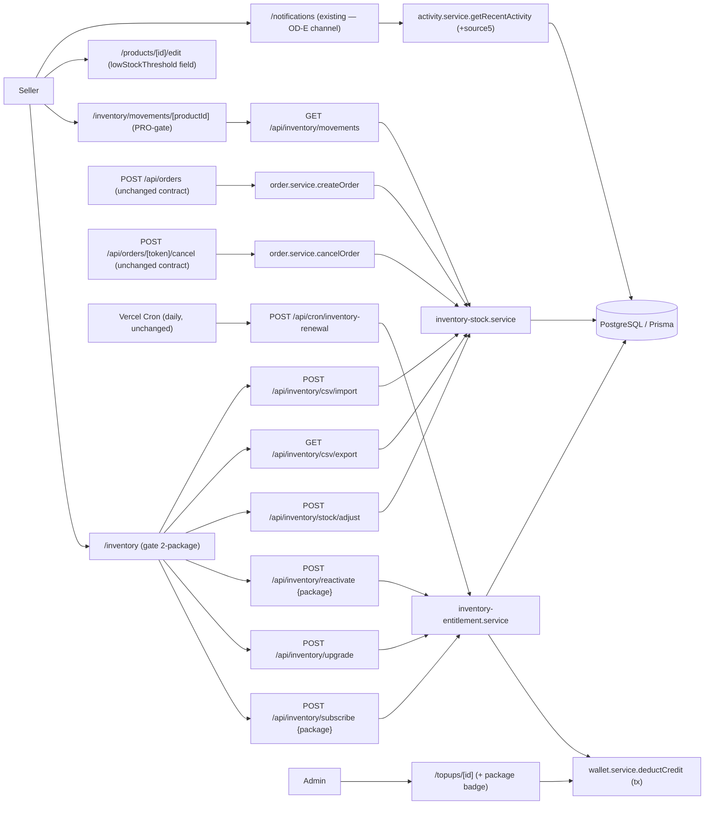
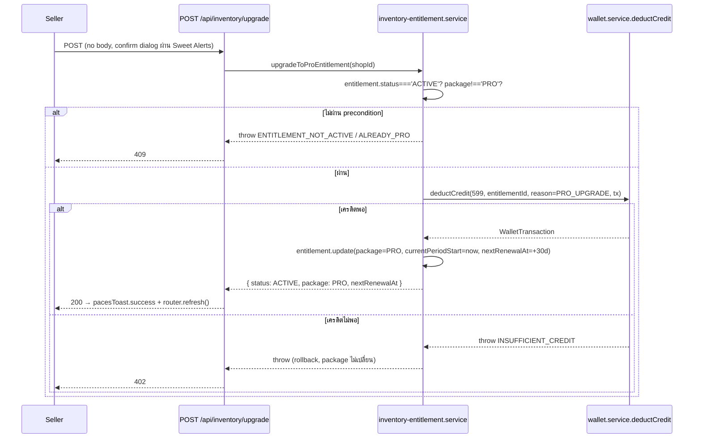
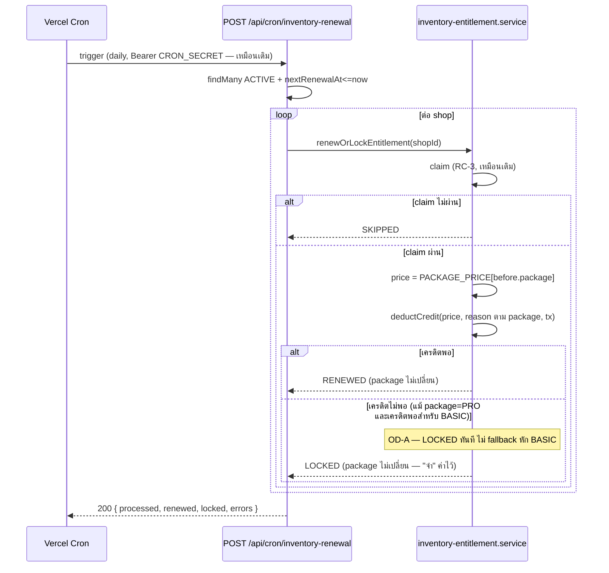
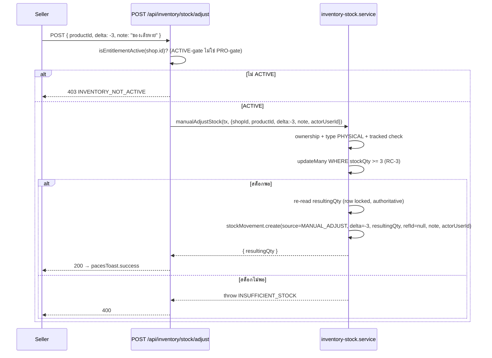
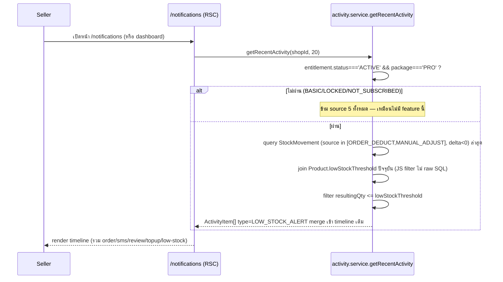
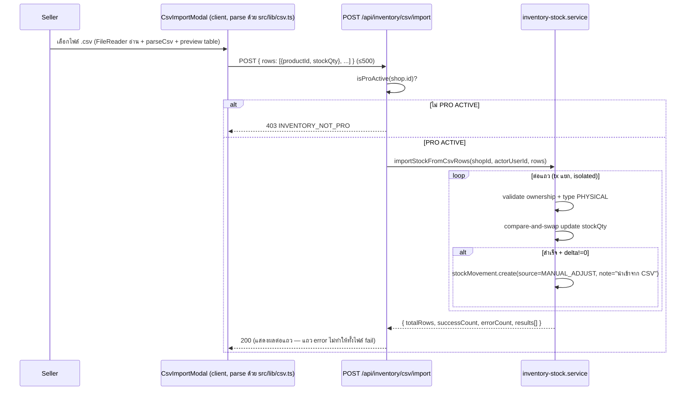
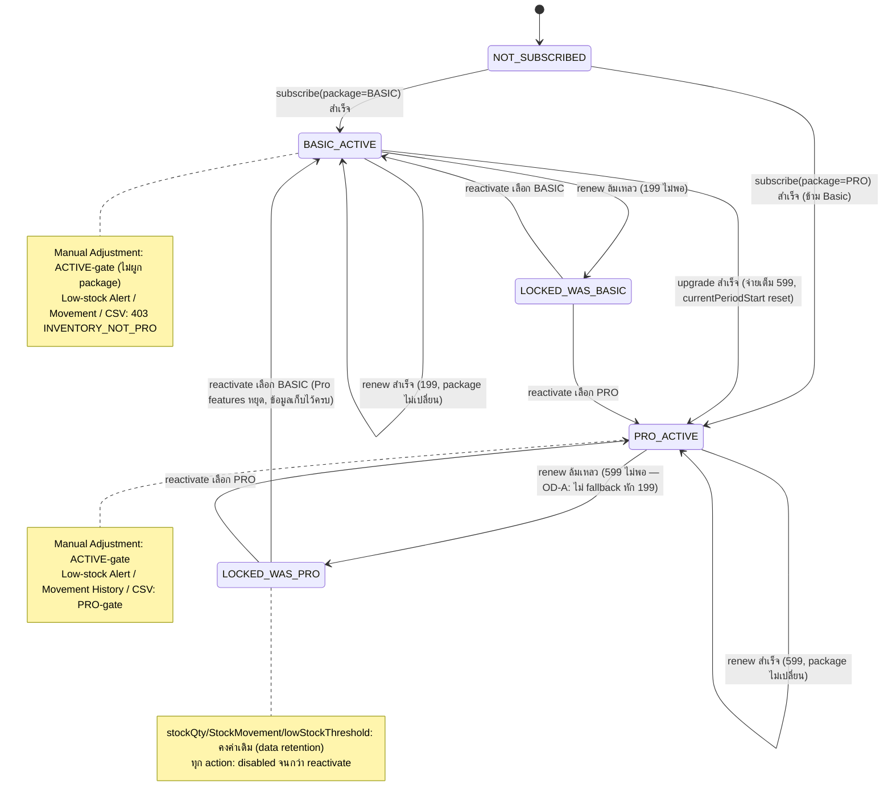
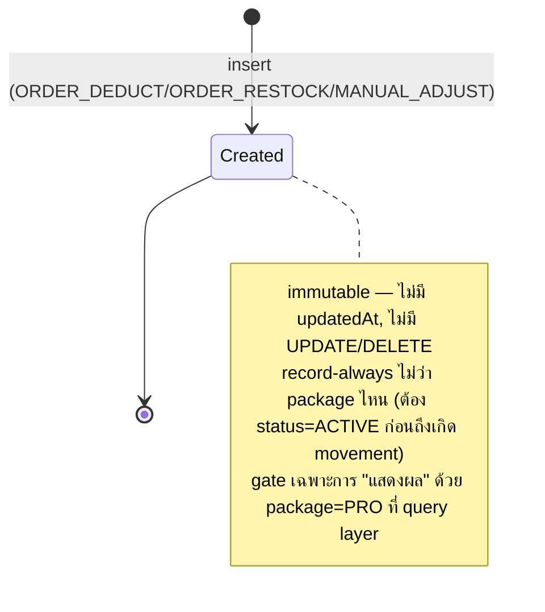

> **โมดูล:** M00009-DeepStockPro
> **ประเภทเอกสาร:** Software Requirements Specification (SRS) — TECHNICAL
> **เวอร์ชัน:** 1.0
> **วันที่จัดทำ:** 2026-07-02
> **สถานะ:** Draft
> **เจ้าของเอกสาร:** SA (ดู [[Feature-Docs-Ownership]])

# SRS: Deep Stock Pro (Software Requirements Specification — Technical)

---

## 1. บทนำ

### 1.1 วัตถุประสงค์ของเอกสาร

เอกสารนี้กำหนดข้อกำหนดเชิงเทคนิคของ **Deep Stock Pro (M00009)** ซึ่ง **ขยาย** Inventory Add-on (M00003, SIGNED-OFF + live บน prod) จาก 1 ราคาคงที่ (฿199) ให้เป็น **2 แพ็กเกจ stack กัน** (BASIC ฿199 / PRO ฿599) ครอบคลุม: (1) package dimension บน entitlement lifecycle เดิม, (2) Manual Stock Adjustment (grandfather ทุก package), (3) Stock Movement / Audit Log แบบ record-always (OD-C), (4) Low-stock Alert ผ่านช่องทาง timeline ที่มีอยู่แล้ว (OD-E — ตัดสินใจในเอกสารนี้ §14), (5) CSV Import/Export (PRO only), (6) Admin label แยก package

ผู้อ่านเป้าหมาย: DEV ผู้ implement, QA ผู้ออกแบบ test case, Controller ผู้วางแผน dispatch. เอกสารนี้ trace กลับ FR-DSP-01..12 ใน [[BRD]] และ frozen contract ใน [[DATABASE]]

**หลักการออกแบบสำคัญ (ต้องยึดตลอดเอกสาร):** extend ไม่ replace — ทุก call-site เดิมของ 00003 (`getEntitlementStatus`/`isEntitlementActive`/`deductStockForOrderItems`/`restockFromCancelledOrder`) ต้องยัง**ทำงานถูกต้องเหมือนเดิม**สำหรับ shop ที่ package=BASIC (default ทุก entitlement เดิมหลัง backfill) — regression suite ของ 00003 ต้อง PASS ทั้งชุดก่อน sign-off (PRD §6.4 ความเสี่ยงสูงสุด)

### 1.2 ขอบเขตเชิงระบบ (System Scope)

**ในขอบเขต:**
- `src/lib/inventory-addon.ts` — เพิ่ม `InventoryPackage`, ราคา Pro, wallet reason/description ใหม่ 3 ค่า
- `src/services/inventory-entitlement.service.ts` — package-aware: subscribe/reactivate รับ `package` param, upgrade ใหม่, renewal หักตามราคา package ปัจจุบัน, helper ใหม่ `getEntitlementInfo`/`isProActive`
- `src/services/inventory-stock.service.ts` — เพิ่ม StockMovement insert เข้า `deductStockForOrderItems`/`restockFromCancelledOrder` (record-always) + ฟังก์ชันใหม่ `manualAdjustStock` + `getStockMovementHistory`
- `src/services/order.service.ts` — `createOrder`/`cancelOrder` ปรับลำดับเล็กน้อยเพื่อได้ `order.id`/`shopId` ก่อน insert StockMovement (ดู §3, TFR-DSP-09)
- `src/services/product.service.ts` — เพิ่ม `lowStockThreshold` เข้า input/output types
- `src/services/activity.service.ts` — เพิ่ม source ที่ 5 (`LOW_STOCK_ALERT`) เข้า `getRecentActivity` (OD-E)
- `src/lib/validations.ts` — schema ใหม่/ขยาย (package picklist, manual-adjust, csv rows, lowStockThreshold)
- `src/lib/csv.ts` (ใหม่) — pure parse/stringify CSV helper (ไม่เพิ่ม npm dependency)
- API routes ใหม่/ขยาย — ดู §4 และ [[API]]
- Seller UI: `/inventory` (ขยาย gate 2-package), `/inventory/movements/[productId]` (ใหม่, PRO-gate), modal ปรับสต็อกเอง + modal CSV import (บน `/inventory`), field `lowStockThreshold` บน product edit form
- Admin `topups/[id]/page.tsx` — เพิ่ม `package` เข้า select + badge

**นอกขอบเขต (ตาม PRD §5 Out of Scope):**
- SKU Variant (→ 00010), proration ทุกทิศทาง, downgrade self-service UI, free trial, SKU cap แยก package, reorder-point/sell-velocity analytics, barcode/QR, supplier management, admin แก้ entitlement/stock ตรง ๆ, retroactive relabel ของ WalletTransaction เดิม
- Push/email/SMS notification pipeline ใหม่ — สืบทอด 00003 OTQ-1 (ไม่มี infra นี้อยู่แล้ว) — ดู §14 OD-E
- Async import job queue / import-history table — CSV import เป็น synchronous batch (DATABASE.md Open Question #3 resolved ที่ §9.4)
- Redis-backed rate-limit/cache

### 1.3 เอกสารอ้างอิง

| เอกสาร | ความสัมพันธ์ |
|--------|-------------|
| [[PRD]] ของโมดูลนี้ | Business goals, KPI, personas, Decisions Log |
| [[BRD]] ของโมดูลนี้ | FR-DSP-01..12, BR-DSP-01..12, AC, Open Decisions OD-A..E |
| [[DATABASE]] ของโมดูลนี้ | **FROZEN CONTRACT**: `InventoryPackage` enum, `InventoryEntitlement.package`, `StockMovement` (ทุก field), `StockMovementSource` enum, `Product.lowStockThreshold` |
| [[00003 - Inventory Add-on/SRS]] + `/SDS` + `/API` | ต้นแบบ pattern ทุกจุด — เอกสารนี้ extend ไม่ paraphrase ซ้ำ |
| `src/services/inventory-entitlement.service.ts` | โค้ดจริงที่ต้อง extend (live, ไม่ใช่ draft) |
| `src/services/inventory-stock.service.ts` | โค้ดจริงที่ต้อง extend |
| `src/services/activity.service.ts` | โค้ดจริง — `getRecentActivity`, ต้นทาง OD-E |
| `src/app/(paces)/seller/(dashboard)/notifications/page.tsx` + `notification-data.ts` | ยืนยันว่า `/notifications` ปัจจุบัน **real data** แล้ว (T8/S-9 เปลี่ยนจาก mock — ใหม่กว่า 00003 OTQ-1 ที่เขียนไว้ว่ายัง mock) — ดู §14 |

### 1.4 นิยามและตัวย่อ

| คำ/ตัวย่อ | ความหมาย |
|-----------|----------|
| **Package** | `BASIC` (฿199) หรือ `PRO` (฿599) — มิติใหม่บน `InventoryEntitlement` |
| **Grandfather** | Entitlement เดิม (00003) ได้ `package=BASIC` อัตโนมัติจาก migration DEFAULT — ไม่มี code path ต้อง implement (DATABASE.md §7) |
| **Record-always** | `StockMovement` insert ทุกครั้งที่กระทบ `stockQty` ไม่ว่า entitlement จะเป็น package ไหน (ต้อง status=ACTIVE ก่อนถึงจะมี movement เกิดขึ้นเลย — NOT_SUBSCRIBED/LOCKED ไม่มี movement ใหม่) — gate เฉพาะการ **query/แสดงผล** ด้วย package=PRO |
| **PRO-gate** | เงื่อนไข `entitlement.status==='ACTIVE' && entitlement.package==='PRO'` — ใช้กับ Alert/Audit/CSV เท่านั้น (Manual Adjustment ไม่ใช้ PRO-gate — ใช้ ACTIVE-gate เดิมของ 00003) |
| **RC-3 Pattern** | สืบทอดจาก 00003 — atomic conditional `updateMany` (WHERE+compare) |

---

## 2. ภาพรวมสถาปัตยกรรม

### 2.1 System Context



### 2.2 องค์ประกอบหลัก

| Component | หน้าที่ | สถานะ |
|-----------|---------|-------|
| `inventory-entitlement.service.ts` | +`getEntitlementInfo`, `isProActive`, `upgradeToProEntitlement`; แก้ `subscribeInventoryEntitlement`/`reactivateInventoryEntitlement` (รับ `package`); แก้ `renewOrLockEntitlement` (ราคาตาม package); แก้ `shouldWarnAdvance` (รับ package) | แก้ไฟล์ที่มีอยู่จริง |
| `inventory-stock.service.ts` | แก้ `deductStockForOrderItems`/`restockFromCancelledOrder` (insert StockMovement); +`manualAdjustStock`, +`getStockMovementHistory`, +`importStockFromCsvRows`, +`exportStockToCsv` | แก้ไฟล์ที่มีอยู่จริง |
| `order.service.ts` | `createOrder` insert StockMovement **หลัง** `order.create` สำเร็จ (ใช้ `order.id` เป็น `refId`); `cancelOrder` ส่ง `shop.id`+`order.id` เข้า `restockFromCancelledOrder` | แก้ไฟล์ที่มีอยู่จริง — **HIGH RISK regression surface** |
| `activity.service.ts` | +source 5 (`LOW_STOCK_ALERT`) จาก `StockMovement` ที่ delta<0 + `resultingQty <= lowStockThreshold` ปัจจุบัน, gate PRO+ACTIVE | แก้ไฟล์ที่มีอยู่จริง (OD-E) |
| `POST /api/inventory/subscribe` | รับ `{package}` (breaking จาก 00003 `{}`) | แก้ route |
| `POST /api/inventory/upgrade` | ใหม่ | ใหม่ |
| `POST /api/inventory/reactivate` | รับ `{package}` (breaking) | แก้ route |
| `POST /api/inventory/stock/adjust` | Manual Adjustment | ใหม่ |
| `GET /api/inventory/movements` | Movement history (PRO-gate) | ใหม่ |
| `GET /api/inventory/csv/export` | CSV export (PRO-gate) | ใหม่ |
| `POST /api/inventory/csv/import` | CSV import (PRO-gate) | ใหม่ |
| `PATCH /api/products/[id]` (+`POST /api/products`) | เพิ่ม `lowStockThreshold` guard (PRO+ACTIVE+tracked) | แก้ route (ขยายจาก 00003 pattern) |

---

## 3. ข้อกำหนดเชิงฟังก์ชันเชิงเทคนิค (TFR-DSP-01..12)

### TFR-DSP-01: Manual Stock Adjustment (ทุก package, ไม่ใช่ PRO-gate)

- **Trace:** FR-DSP-01, BR-DSP-05
- **Gate:** `isEntitlementActive(shopId)` เดิมของ 00003 เท่านั้น (status===ACTIVE, **ไม่เช็ค package**) — ตรง BR-DSP-05 "ใช้ได้ทั้ง BASIC และ PRO ไม่ผูก Pro-only"
- **คำอธิบาย:** `manualAdjustStock(tx, {shopId, productId, delta, note, actorUserId})` ใน `inventory-stock.service.ts`:
  1. โหลด product (`findUnique`), ยืนยัน `product.shopId === shopId` (ownership — กัน IDOR ข้ามร้าน) → ไม่ตรง/ไม่เจอ → throw `PRODUCT_NOT_FOUND`
  2. `product.type !== 'PHYSICAL' || product.stockQty === null` → throw `PRODUCT_NOT_TRACKED` (ต้อง track อยู่ก่อนแล้วถึงปรับเองได้ — สอดคล้อง opt-in semantics เดิม)
  3. `delta === 0` → throw `DELTA_ZERO` (defense-in-depth — Valibot กันไว้ชั้นนอกแล้ว, กัน CHECK constraint `delta<>0` ที่ DB)
  4. RC-3 atomic: `tx.product.updateMany({ where: { id: productId, stockQty: { gte: -delta } }, data: { stockQty: { increment: delta } } })` — เหตุผลที่ `gte: -delta` ใช้ได้ทั้ง 2 ทิศทาง: delta บวก (รับเข้า) → `-delta` เป็นค่าลบ/ศูนย์ → `stockQty>=ค่าลบ` จริงเสมอ (ไม่บล็อก); delta ลบ (ของเสียหาย/ตัดออก) → `-delta` เป็นค่าบวก → เช็คว่ามีพอให้ตัดจริง (กันติดลบ — mirror RC-3 ของ `deductCredit`)
  5. `count===0` → throw `INSUFFICIENT_STOCK(productName)`
  6. re-read `stockQty` ใน tx เดียวกัน (row locked จาก updateMany ของเราเองแล้ว — อ่านซ้ำ authoritative 100%, ดู §DATABASE.md §6 Performance) → ได้ `resultingQty`
  7. `tx.stockMovement.create({ shopId, productId, productName: product.name, delta, resultingQty, source: 'MANUAL_ADJUST', refId: null, note, actorUserId })`
- **Route:** `POST /api/inventory/stock/adjust` — session-auth, guard `isEntitlementActive(shop.id)` ก่อนเรียก service (403 `INVENTORY_NOT_ACTIVE` ถ้าไม่ผ่าน), ห่อ `manualAdjustStock` ใน `prisma.$transaction`
- **Error/Edge:** `note` required (min 1 char — BR "พร้อมระบุเหตุผล"); delta ที่ทำให้ stockQty ติดลบ → 400 `INSUFFICIENT_STOCK` (ไม่ใช่ 500); concurrent manual-adjust 2 ครั้งพร้อมกัน → RC-3 กัน race เหมือน deduct

### TFR-DSP-02: Grandfather — ไม่มี Code Path (Migration-only)

- **Trace:** FR-DSP-02, BR-DSP-04
- **คำอธิบาย:** **ไม่ต้อง implement โค้ดใด ๆ** — `ADD COLUMN package ... DEFAULT 'BASIC'` (DATABASE.md §3.1/§5) ทำให้ entitlement เดิมทุกแถวได้ `package=BASIC` ทันทีที่ migration apply โดยไม่ผ่าน `deductCredit` เลย (ไม่มี WalletTransaction ใหม่) Manual Adjustment (TFR-DSP-01) ใช้ ACTIVE-gate เดิม — subscriber เก่าจึงเข้าถึงได้ทันทีโดยอัตโนมัติ
- **QA responsibility:** regression test ต้องยืนยัน DB query ก่อน/หลัง migration ว่าทุก entitlement เดิม (ACTIVE+LOCKED) ได้ `package='BASIC'` ครบ ไม่มีแถวตกหล่น, และไม่มี `WalletTransaction` แถวใหม่เกิดจาก migration

### TFR-DSP-03: Subscribe เลือก Package (BASIC หรือ PRO ตรง)

- **Trace:** FR-DSP-03, BR-DSP-01/02/03
- **คำอธิบาย:** `subscribeInventoryEntitlement(shopId, pkg: InventoryPackage)` — เพิ่ม param `pkg` (**breaking signature** จาก 00003):
  ```typescript
  export async function subscribeInventoryEntitlement(
    shopId: string,
    pkg: InventoryPackage,
  ): Promise<{ status: 'ACTIVE'; package: InventoryPackage; nextRenewalAt: Date }> {
    return prisma.$transaction(async (tx) => {
      const existing = await tx.inventoryEntitlement.findUnique({ where: { shopId }, select: { id: true } })
      if (existing) throw new Error('ENTITLEMENT_ALREADY_EXISTS')
      const entitlementId = randomUUID()
      const price = PACKAGE_PRICE[pkg]
      const reason = pkg === 'PRO' ? WALLET_REASON.INVENTORY_SUBSCRIPTION_PRO : WALLET_REASON.INVENTORY_SUBSCRIPTION_BASIC
      await deductCredit(shopId, price, entitlementId, WALLET_DESC.subscribe(pkg), reason, tx)
      const now = new Date()
      const nextRenewalAt = addDays(now, INVENTORY_RENEWAL_PERIOD_DAYS)
      await tx.inventoryEntitlement.create({
        data: { id: entitlementId, shopId, status: 'ACTIVE', package: pkg, activatedAt: now, currentPeriodStart: now, nextRenewalAt },
      })
      return { status: 'ACTIVE', package: pkg, nextRenewalAt }
    })
  }
  ```
- **Precondition:** ไม่มี entitlement row มาก่อน (เหมือน 00003)
- **Postcondition:** entitlement ACTIVE ตาม package ที่เลือก; `WalletTransaction` DEDUCT 1 รายการ `reason` ตรงกับ package
- **Error/Edge:** เครดิตไม่พอ (เทียบราคาของ package ที่เลือก ไม่ใช่ ฿199 คงที่) → 402; มี entitlement อยู่แล้ว → 409

### TFR-DSP-04: Upgrade BASIC→PRO (No Proration)

- **Trace:** FR-DSP-04, BR-DSP-06
- **คำอธิบาย:** ฟังก์ชันใหม่ `upgradeToProEntitlement(shopId)`:
  ```typescript
  export async function upgradeToProEntitlement(
    shopId: string,
  ): Promise<{ status: 'ACTIVE'; package: 'PRO'; nextRenewalAt: Date }> {
    return prisma.$transaction(async (tx) => {
      const existing = await tx.inventoryEntitlement.findUnique({ where: { shopId } })
      if (!existing || existing.status !== 'ACTIVE') throw new Error('ENTITLEMENT_NOT_ACTIVE')
      if (existing.package === 'PRO') throw new Error('ALREADY_PRO')
      await deductCredit(shopId, INVENTORY_PRO_PRICE, existing.id, WALLET_DESC.UPGRADE, WALLET_REASON.INVENTORY_SUBSCRIPTION_PRO_UPGRADE, tx)
      const now = new Date()
      const nextRenewalAt = addDays(now, INVENTORY_RENEWAL_PERIOD_DAYS)
      await tx.inventoryEntitlement.update({
        where: { shopId },
        // ห้ามแตะ activatedAt (เหมือน reactivate เดิม — DATABASE.md §3.1)
        data: { package: 'PRO', currentPeriodStart: now, nextRenewalAt, lastRenewalAt: now },
      })
      return { status: 'ACTIVE', package: 'PRO', nextRenewalAt }
    })
  }
  ```
- **Postcondition:** จ่ายเต็ม ฿599 ทันที (ไม่หัก ฿400 ผลต่าง — ตรง BR-DSP-06); รอบใหม่ 30 วัน rolling เริ่มจากวันนี้; `WalletTransaction.reason='INVENTORY_SUBSCRIPTION_PRO_UPGRADE'` (แยกจาก subscribe ตรง — สำหรับ KPI "Basic→Pro Upgrade Rate" vs "Direct-to-Pro Conversion Rate", PRD §1.2)
- **Error/Edge:** entitlement ไม่ ACTIVE (NOT_SUBSCRIBED/LOCKED) → 409 `ENTITLEMENT_NOT_ACTIVE`; ACTIVE แต่เป็น PRO อยู่แล้ว → 409 `ALREADY_PRO`; เครดิต<599 → 402 (ไม่หักบางส่วน, ไม่แตะ package เดิม)

### TFR-DSP-05: Downgrade — ไม่มี Endpoint (Design Constraint)

- **Trace:** FR-DSP-05, BR-DSP-07
- **คำอธิบาย:** ไม่มี endpoint ให้เปลี่ยน `package: PRO→BASIC` ขณะ `status=ACTIVE` — enforce โดย**การไม่สร้าง code path** (ไม่ใช่ runtime guard) ทางเดียวคือผ่าน LOCKED→Reactivate (TFR-DSP-07)
- **QA responsibility:** regression test ต้องยืนยันว่าไม่มี route ใดรับ mutation `package` โดยตรงนอกจาก subscribe(create)/upgrade(BASIC→PRO เท่านั้น)/reactivate

### TFR-DSP-06: Renewal ตามราคา Package ปัจจุบัน — ไม่ Auto-downgrade (OD-A)

- **Trace:** FR-DSP-06, BR-DSP-09 (⚠️ OD-A — Lock ทั้งก้อน)
- **คำอธิบาย:** แก้ `renewOrLockEntitlement(shopId)` เดิม — จุดเดียวที่เปลี่ยนคือราคาที่ deduct มาจาก `PACKAGE_PRICE[before.package]` แทนค่าคงที่ 199, และ `reason` ตาม package (ไม่ใช่ `_UPGRADE` — renew ไม่ใช่ upgrade event):
  ```typescript
  // ...claim (RC-3, เหมือนเดิมทุกประการ)...
  const price = PACKAGE_PRICE[before.package]
  const reason = before.package === 'PRO' ? WALLET_REASON.INVENTORY_SUBSCRIPTION_PRO : WALLET_REASON.INVENTORY_SUBSCRIPTION_BASIC
  try {
    await deductCredit(shopId, price, before.id, WALLET_DESC.renew(before.package), reason, tx)
  } catch (e) {
    if (e instanceof Error && e.message === 'INSUFFICIENT_CREDIT') {
      // ⚠️ OD-A: LOCKED ทั้งก้อน — ไม่มี fallback ลองหักราคา BASIC แทนแม้เครดิตพอ
      // package ไม่เปลี่ยน (คงค่าล่าสุดไว้ "จำ" ตาม DATABASE.md §3.1)
      await tx.inventoryEntitlement.update({
        where: { shopId }, data: { status: 'LOCKED', lockedAt: now, nextRenewalAt: before.nextRenewalAt },
      })
      return 'LOCKED'
    }
    throw e
  }
  // RENEWED — currentPeriodStart/lastRenewalAt update เหมือนเดิม, package ไม่เปลี่ยน
  ```
- **Postcondition:** Shop package=PRO เครดิตพอแค่ ฿199 (ไม่พอ ฿599) → LOCKED ทันที **ไม่มี** การหัก ฿199 แทน — ตรง BRD FR-DSP-06-AC-03 เป๊ะ
- **⚠️ OD-A เป็น provisional ใน BRD/PRD** — SRS ยึดตาม "Lock ทั้งก้อน" (แนะนำในเอกสารต้นทาง) เป็น implementation baseline; ถ้า user confirm เป็นทางเลือก (2) auto-downgrade ภายหลัง ต้องกลับมาแก้ TFR-DSP-06 นี้ก่อน implement — **Controller ต้อง confirm OD-A ก่อน dispatch developer**
- **Call-site sync บังคับ:** `src/app/(paces)/seller/(dashboard)/inventory/page.tsx:108-112` (`shouldWarnAdvance` call) ต้องแก้ select เพิ่ม `package: true` และแก้ signature call (ดู TFR-DSP-06b)

### TFR-DSP-06b: `shouldWarnAdvance` ต้อง Package-aware

- **คำอธิบาย:** แก้ signature:
  ```typescript
  export function shouldWarnAdvance(
    entitlement: { status: EntitlementStatus; package: InventoryPackage; nextRenewalAt: Date } | null,
    balance: number,
  ): boolean {
    if (!entitlement || entitlement.status !== 'ACTIVE') return false
    const daysUntilRenewal = Math.ceil((entitlement.nextRenewalAt.getTime() - Date.now()) / 86_400_000)
    const price = PACKAGE_PRICE[entitlement.package]
    return daysUntilRenewal <= INVENTORY_ADVANCE_WARNING_DAYS && daysUntilRenewal >= 0 && balance < price
  }
  ```
- **บังคับ sync ที่ call-site:** `inventory/page.tsx` ต้องเพิ่ม `package: true` เข้า `select` ของ entitlement query (บรรทัด 109-112 ปัจจุบัน) + ส่ง `package: entitlement.package` เข้า call + เปลี่ยน `shortfall={INVENTORY_ADDON_PRICE - balance}` (บรรทัด 141) เป็น `shortfall={PACKAGE_PRICE[entitlement.package] - balance}` — มิฉะนั้น Pro subscriber จะเห็น banner เตือนผิดจำนวน (คำนวณจาก ฿199 แทน ฿599)

### TFR-DSP-07: Reactivate เลือก Package เอง (Explicit)

- **Trace:** FR-DSP-07, BR-DSP-08
- **คำอธิบาย:** `reactivateInventoryEntitlement(shopId, pkg: InventoryPackage)` — เพิ่ม param `pkg` (**breaking signature**):
  ```typescript
  export async function reactivateInventoryEntitlement(
    shopId: string,
    pkg: InventoryPackage,
  ): Promise<{ status: 'ACTIVE'; package: InventoryPackage; nextRenewalAt: Date }> {
    return prisma.$transaction(async (tx) => {
      const existing = await tx.inventoryEntitlement.findUnique({ where: { shopId } })
      if (!existing || existing.status !== 'LOCKED') throw new Error('ENTITLEMENT_NOT_LOCKED')
      const price = PACKAGE_PRICE[pkg]
      const reason = pkg === 'PRO' ? WALLET_REASON.INVENTORY_SUBSCRIPTION_PRO : WALLET_REASON.INVENTORY_SUBSCRIPTION_BASIC
      await deductCredit(shopId, price, existing.id, WALLET_DESC.reactivate(pkg), reason, tx)
      const now = new Date()
      const nextRenewalAt = addDays(now, INVENTORY_RENEWAL_PERIOD_DAYS)
      await tx.inventoryEntitlement.update({
        where: { shopId },
        data: { status: 'ACTIVE', package: pkg, currentPeriodStart: now, nextRenewalAt, lastRenewalAt: now, lockedAt: null },
        // ห้ามแตะ activatedAt
      })
      return { status: 'ACTIVE', package: pkg, nextRenewalAt }
    })
  }
  ```
- **Postcondition:** เลือก BASIC ได้แม้ก่อนล็อกเป็น PRO — `stockQty`/`StockMovement`/`lowStockThreshold` เก็บไว้ครบ (data retention เดิม) แต่ฟีเจอร์ Pro (Alert/Audit/CSV) หยุดทำงานจนกว่า upgrade กลับ (ตรง PRO-gate ที่ query-time — ไม่ต้องลบ/reset อะไร)

### TFR-DSP-08: Low-Stock Alert — ผ่านช่องทาง Activity Timeline ที่มีอยู่แล้ว (OD-E)

- **Trace:** FR-DSP-08, ดูรายละเอียดเต็มที่ **§14 (OD-E Decision)**
- **Gate:** `status==='ACTIVE' && package==='PRO'`
- **Threshold เขียน:** ผ่าน `PATCH /api/products/[id]` เดิม (ขยาย field `lowStockThreshold`) — ไม่ใช่ endpoint แยก (ดู TFR-DSP-08b)
- **ตรวจจับ:** query-time — ไม่มี cron/batch แยก (สืบทอดหลักการ TFR-003 ของ 00003)

### TFR-DSP-08b: `lowStockThreshold` — ขยาย Product Update (PRO-gate)

- **คำอธิบาย:** `UpdateProductSchema`/`CreateProductSchema` เพิ่ม `lowStockThreshold: v.optional(v.nullable(v.pipe(v.number(), v.integer(), v.minValue(0))))`
- **Route-layer guard** (`POST /api/products`, `PATCH /api/products/[id]` — ขยายจาก guard เดิมของ `stockQty`): ถ้า body มี `lowStockThreshold !== undefined`:
  1. `type` (หรือ existing type กรณี PATCH) ต้อง `PHYSICAL` — ไม่ใช่ → 400 `STOCK_QTY_INVALID_PRODUCT_TYPE` (reuse error code เดิม — semantic เดียวกัน)
  2. effective `stockQty` (จาก body หรือ product เดิม) ต้องไม่เป็น `null` (ต้อง tracked อยู่ก่อน — ตั้ง threshold บนสินค้าที่ไม่ track ไม่มีความหมาย) — ไม่ผ่าน → 400 `PRODUCT_NOT_TRACKED`
  3. `getEntitlementInfo(shopId)` ต้อง `status==='ACTIVE' && package==='PRO'` — ไม่ผ่าน → 403 `INVENTORY_NOT_PRO` (error code ใหม่ — แยกจาก `INVENTORY_NOT_ACTIVE` เดิมที่หมายถึง status!=ACTIVE)
- **Semantics:** เหมือน `stockQty` เดิม — `undefined`=ไม่แตะ, `null`=ปิด alert (explicit), `number>=0`=ตั้งค่า

### TFR-DSP-09: Stock Movement History — Record-Always (OD-C), Query-Gate PRO

- **Trace:** FR-DSP-09, BR ตาม OD-C ("record-always/display-gated")
- **คำอธิบายเชิงเทคนิค — 3 จุดเขียน StockMovement:**

**(a) ORDER_DEDUCT — แก้ `order.service.createOrder`:**
โค้ดเดิม (00003, live) เรียก `deductStockForOrderItems(tx, items)` **ก่อน** `tx.order.create(...)` — ปัญหา: ตอน deduct ยังไม่มี `order.id` ให้ใช้เป็น `refId`. แก้โดย **insert StockMovement หลัง `order.create` สำเร็จ** (ยังอยู่ใน tx เดียวกัน, ถ้า `order.create` throw P2002 ทั้ง attempt rollback รวมถึง movement ที่ยังไม่ insert อยู่ดี — ไม่มีปัญหา):

```typescript
export async function createOrder(shopId: string, data: { /* เดิม */ }) {
  // ...คำนวณเดิมทั้งหมด...
  for (let attempt = 0; attempt < 5; attempt++) {
    try {
      return await prisma.$transaction(async (tx) => {
        const entitlement = await tx.inventoryEntitlement.findUnique({ where: { shopId }, select: { status: true } })
        // deductStockForOrderItems คืน Map แทน Set (เปลี่ยน return type — ดู inventory-stock.service.ts)
        const deductions = entitlement?.status === 'ACTIVE'
          ? await deductStockForOrderItems(tx, data.items)
          : new Map<string, { qty: number; resultingQty: number; name: string }>()

        const itemsCreateData = data.items.map((item) => ({
          ...item,
          stockDeducted: item.productId && deductions.has(item.productId) ? item.qty : null,
        }))

        const order = await tx.order.create({
          data: { /* ...เดิม... */ items: { create: itemsCreateData }, shortCode: genShortCode() },
          include: { items: true },
        })

        // NEW — StockMovement record-always (ทุก package, ไม่ gate ที่นี่)
        for (const [productId, d] of deductions) {
          await tx.stockMovement.create({
            data: {
              shopId, productId, productName: d.name, delta: -d.qty, resultingQty: d.resultingQty,
              source: 'ORDER_DEDUCT', refId: order.id, note: null, actorUserId: null,
            },
          })
        }
        return order
      })
    } catch (e) {
      const isUnique = e instanceof Prisma.PrismaClientKnownRequestError && e.code === 'P2002'
      if (isUnique && attempt < 4) continue
      throw e
    }
  }
  throw new Error('SHORT_CODE_COLLISION')
}
```

**(b) ORDER_RESTOCK — แก้ `order.service.cancelOrder` + `restockFromCancelledOrder`:**
```typescript
export async function cancelOrder(publicToken: string, initiator: 'seller' | 'buyer') {
  const order = await prisma.order.findUnique({ where: { publicToken } }) // มี shopId, id อยู่แล้ว (ไม่ select เฉพาะเจาะจง)
  if (!order) throw new Error('Order not found')
  assertTransition(order.status, 'CANCELLED')
  return prisma.$transaction(async (tx) => {
    const updated = await tx.order.update({ where: { publicToken }, data: { status: 'CANCELLED', cancelInitiator: initiator } })
    await restockFromCancelledOrder(tx, order.shopId, order.id) // NEW params: shopId, orderId
    return updated
  })
}
```
```typescript
// inventory-stock.service.ts
export async function restockFromCancelledOrder(
  tx: Prisma.TransactionClient, shopId: string, orderId: string,
): Promise<void> {
  const items = await tx.orderItem.findMany({
    where: { orderId, stockDeducted: { not: null } },
    select: { productId: true, stockDeducted: true, name: true }, // +name (snapshot — ใช้เป็น productName)
  })
  if (items.length === 0) return
  for (const item of items) {
    if (!item.productId) { console.warn(`[inventory-stock] orphan restock — orderId=${orderId}`); continue }
    const updated = await tx.product.update({
      where: { id: item.productId }, data: { stockQty: { increment: item.stockDeducted! } }, select: { stockQty: true },
    })
    // ⚠️ DATABASE.md §6: ถ้า product ถูก untrack (stockQty=null) increment บน NULL = NULL (no-op)
    // ต้อง skip insert StockMovement กรณีนี้ (ห้าม insert delta=0/NULL — ชน CHECK constraint)
    if (updated.stockQty === null) continue
    await tx.stockMovement.create({
      data: {
        shopId, productId: item.productId, productName: item.name, delta: item.stockDeducted!,
        resultingQty: updated.stockQty, source: 'ORDER_RESTOCK', refId: orderId, note: null, actorUserId: null,
      },
    })
  }
}
```

**(c) MANUAL_ADJUST — ดู TFR-DSP-01 (insert อยู่ใน `manualAdjustStock` แล้ว)**

- **⚠️ HIGH RISK regression note:** ทั้ง (a)/(b) แก้ฟังก์ชันที่ **live บน prod จริง** (00003 SIGNED-OFF) — บังคับรัน regression suite 00003 เต็มชุดซ้ำ (concurrent deduct, out-of-stock, restock-on-untrack, backward-compat shop ที่ไม่ subscribe) ก่อน sign-off 00009

- **Query (Movement History):** `getStockMovementHistory(shopId, productId, {cursor?, take=20})` — cursor-based pagination ผ่าน `createdAt`, ใช้ index `(productId, createdAt)` ที่ DATABASE.md ออกแบบไว้แล้ว
- **PRO-gate ที่ query:** enforce ที่ **route layer** (`GET /api/inventory/movements`) — 403 `INVENTORY_NOT_PRO` ถ้า `status!=='ACTIVE' || package!=='PRO'`; service เองไม่เช็ค gate (บริสุทธิ์ query-only, gate เป็นความรับผิดชอบ caller — pattern เดียวกับที่ route-layer เช็ค `isEntitlementActive` ก่อนเรียก stock-service ใน 00003)

### TFR-DSP-10: CSV Import/Export — Synchronous Batch (PRO-gate)

- **Trace:** FR-DSP-10, BR — Open Question #3 ของ DATABASE.md **resolved ที่นี่**: ไม่มี table/queue ใหม่ — synchronous, StockMovement ที่ insert ต่อแถวที่สำเร็จ**คือ** audit trail ของ import เอง (ไม่ต้องมี import-history table แยก)

**Export:** `exportStockToCsv(shopId): Promise<string>`
```typescript
export async function exportStockToCsv(shopId: string): Promise<string> {
  const products = await prisma.product.findMany({
    where: { shopId, type: 'PHYSICAL', isActive: true },
    select: { id: true, sku: true, name: true, stockQty: true },
    orderBy: { name: 'asc' },
  })
  const rows = [
    ['productId', 'sku', 'name', 'stockQty'],
    ...products.map((p) => [p.id, p.sku ?? '', p.name, p.stockQty === null ? '' : String(p.stockQty)]),
  ]
  return stringifyCsv(rows) // src/lib/csv.ts — pure helper
}
```
รวมสินค้าที่ยัง**ไม่ track** ด้วย (`stockQty` คอลัมน์ว่าง) — เปิดทางให้ seller กรอกจำนวนแล้ว import เพื่อเริ่ม track ผ่าน CSV ได้เลย (ไม่บังคับต้อง track มาก่อน)

**Import:** ออกแบบเป็น **client-side parse → JSON POST** (ไม่ใช่ multipart upload server-side) — เหตุผล: (1) ไม่มี CSV library ในโปรเจกต์อยู่แล้ว การ parse ฝั่ง client ด้วย `src/lib/csv.ts` (pure, ไม่เพิ่ม dependency) แล้วโชว์ preview table ให้ seller ตรวจก่อน submit ได้ UX ที่ดีกว่า (2) หลีกเลี่ยง multipart-parsing + file storage ฝั่ง server ที่ไม่จำเป็น (Hard Rule: ห้าม over-engineer)

```typescript
export type CsvImportRowResult =
  | { row: number; productId: string; status: 'OK'; resultingQty: number; skipped?: boolean }
  | { row: number; productId: string; status: 'ERROR'; error: string }

export async function importStockFromCsvRows(
  shopId: string, actorUserId: string, rows: { productId: string; stockQty: number }[],
): Promise<{ totalRows: number; successCount: number; errorCount: number; results: CsvImportRowResult[] }> {
  const results: CsvImportRowResult[] = []
  for (let i = 0; i < rows.length; i++) {
    const { productId, stockQty: newQty } = rows[i]
    try {
      // แต่ละแถว = tx แยก (per-row isolation — แถวหนึ่ง fail ไม่ทำให้ทั้ง batch fail, ตรง FR-DSP-10-AC-03)
      const result = await prisma.$transaction(async (tx) => {
        const product = await tx.product.findUnique({
          where: { id: productId }, select: { id: true, shopId: true, type: true, name: true, stockQty: true },
        })
        if (!product || product.shopId !== shopId) throw new Error('PRODUCT_NOT_FOUND')
        if (product.type !== 'PHYSICAL') throw new Error('PRODUCT_NOT_PHYSICAL')
        const oldQty = product.stockQty
        const delta = newQty - (oldQty ?? 0)
        // compare-and-swap บน snapshot เดิม — กัน concurrent modification (เช่น order deduct ระหว่าง import)
        const updated = await tx.product.updateMany({
          where: { id: productId, stockQty: oldQty }, data: { stockQty: newQty },
        })
        if (updated.count === 0) throw new Error('CONCURRENT_MODIFICATION')
        if (delta !== 0) {
          await tx.stockMovement.create({
            data: {
              shopId, productId, productName: product.name, delta, resultingQty: newQty,
              source: 'MANUAL_ADJUST', refId: null, note: 'นำเข้าจาก CSV', actorUserId,
            },
          })
        }
        return { resultingQty: newQty }
      })
      results.push({ row: i + 1, productId, status: 'OK', resultingQty: result.resultingQty })
    } catch (e) {
      results.push({ row: i + 1, productId, status: 'ERROR', error: e instanceof Error ? e.message : 'UNKNOWN' })
    }
  }
  return {
    totalRows: rows.length,
    successCount: results.filter((r) => r.status === 'OK').length,
    errorCount: results.filter((r) => r.status === 'ERROR').length,
    results,
  }
}
```

- **⚠️ หมายเหตุ semantics ต่างจาก Manual Adjustment:** CSV import คือการ **set ค่าสมบูรณ์** (`stockQty = newQty`) ไม่ใช่ delta-relative เหมือน Manual Adjustment — ใช้ compare-and-swap (`updateMany where stockQty: oldQty`) แทน RC-3 range-check เพราะ "การตั้งค่าสัมบูรณ์" ไม่มีเงื่อนไข "พอ/ไม่พอ" แบบ deduct แต่ยังต้องกัน concurrent-write race (ตรวจพบ → รายงาน error แถวนั้น ไม่ auto-retry ใน MVP)
- **delta=0 (ค่าไม่เปลี่ยน):** ไม่ insert StockMovement (กัน CHECK `delta<>0`) แต่ยังนับเป็น `status: 'OK'` ในผลลัพธ์ (ไม่ใช่ error — ปกติถ้า seller export แล้ว import กลับโดยไม่แก้อะไร)
- **Cap:** `rows.length <= 500` (validate ที่ Valibot ก่อนเข้า service — เกิน → 400 `CSV_TOO_MANY_ROWS`)
- **Postcondition:** response คืนผลต่อแถว — ตรง FR-DSP-10-AC-03 ("รายงานว่าแถวไหนล้มเหลว ไม่ทำให้ทั้งไฟล์ fail เงียบ ๆ")

### TFR-DSP-11: Admin Label แยก Package

- **Trace:** FR-DSP-11
- **คำอธิบาย:** ส่วนใหญ่คือ**เพิ่มค่าคงที่** ไม่ใช่ logic ใหม่ (`WALLET_REASON`/`WALLET_REASON_LABEL_TH` — ดู §12) เพราะ `topups/[id]/page.tsx` render ผ่าน `WALLET_REASON_LABEL_TH[reason] ?? description` อยู่แล้ว (pattern เดิมของ 00003, ยืนยันจาก source `page.tsx:269`)
- **ส่วนที่ต้องแก้จริง (additive):** `topups/[id]/page.tsx` เพิ่ม `package: true` เข้า `select` ของ entitlement query (บรรทัด 81-84 ปัจจุบัน select แค่ `status, lockedAt`) + render badge "Deep Stock"/"Deep Stock Pro" ข้าง sidebar (FR-DSP-11-AC-04 "Admin เห็นได้ว่า Shop ปัจจุบันอยู่ package ไหน")
- **⚠️ WalletTransaction.reason reconciliation (DATABASE.md §3.4, Open Question #4):** SRS นี้ **adopt แนวทางของ DATABASE.md** (reuse `reason` เป็น machine-key UPPER_SNAKE_CASE + ขยาย `WALLET_REASON_LABEL_TH` map) — ไม่ใช้ literal string เต็มตาม BRD AC ตรง ๆ (เหตุผล: UI ทั้งระบบภาษาไทย, `reason` เป็น query-able key สำหรับ KPI aggregation) **ยังต้องให้ Controller/user confirm ก่อน implement จริง** (DATABASE.md ระบุไว้ชัดว่าเป็น decision ที่รอ confirm — SRS นี้แค่ตั้ง baseline ให้ SDS/API เดินต่อได้ ไม่ใช่ final sign-off)

### TFR-DSP-12: Backward Compatibility — สืบทอด TFR-012 ของ 00003 เต็มรูป

- **Trace:** FR-DSP-12
- ไม่มีอะไรเปลี่ยนจาก 00003 TFR-012 — short-circuit design (entitlement lookup เดี่ยว, ไม่ query stock เพิ่มถ้า NOT_SUBSCRIBED/LOCKED) **ยังคงเดิมทุกประการ** เพราะ TFR-DSP-09 (a)/(b) แค่เพิ่ม insert StockMovement **หลัง** deduct/restock สำเร็จ (เกิดเฉพาะกรณี entitlement ACTIVE ที่มี deduction จริงอยู่แล้ว) — ไม่เพิ่ม query สำหรับ shop ที่ไม่มี entitlement ACTIVE เลย

---

## 4. Interface / API Specification (สรุป — รายละเอียดเต็มดู [[API]])

### 4.1 Endpoint Summary

| Method | Path | สถานะ | Auth | PRO-gate |
|--------|------|-------|------|----------|
| `POST` | `/api/inventory/subscribe` | แก้ (breaking body) | seller session | — |
| `POST` | `/api/inventory/upgrade` | ใหม่ | seller session | — |
| `POST` | `/api/inventory/reactivate` | แก้ (breaking body) | seller session | — |
| `POST` | `/api/inventory/stock/adjust` | ใหม่ | seller session | ไม่ (ACTIVE-gate เท่านั้น) |
| `GET` | `/api/inventory/movements` | ใหม่ | seller session | ✅ |
| `GET` | `/api/inventory/csv/export` | ใหม่ | seller session | ✅ |
| `POST` | `/api/inventory/csv/import` | ใหม่ | seller session | ✅ |
| `PATCH` | `/api/products/[id]` (+`POST /api/products`) | ขยาย (`lowStockThreshold`) | seller session | ✅ (เฉพาะ field นี้) |
| `POST` | `/api/cron/inventory-renewal` | internal logic เปลี่ยน, external contract เดิม | `CRON_SECRET` | — |

### 4.2 Sequence — Upgrade กลางรอบ



### 4.3 Sequence — Renewal Package-aware + Lock (ไม่ Auto-downgrade)



### 4.4 Sequence — Manual Adjustment → StockMovement



### 4.5 Sequence — Low-Stock Alert Evaluation (Query-time, ไม่มี Cron แยก)



### 4.6 Sequence — CSV Import (per-row isolation)



---

## 5. ข้อกำหนดด้านข้อมูล

อ้างอิง [[DATABASE]] เต็มรูป (FROZEN CONTRACT) — ไม่มีการเปลี่ยนแปลงจากที่ DATABASE.md ออกแบบไว้ ตารางนี้สรุปเฉพาะ field ที่ TFR ข้างต้นอ้างถึง:

| Entity/Field | ที่มา | ใช้ใน TFR |
|--------------|-------|-----------|
| `InventoryPackage` enum, `InventoryEntitlement.package` | DATABASE.md §3.1 | TFR-DSP-03/04/06/07 |
| `StockMovement` (ทุก field) + `StockMovementSource` enum | DATABASE.md §3.2 | TFR-DSP-01/08/09/10 |
| `Product.lowStockThreshold` | DATABASE.md §3.3 | TFR-DSP-08b |
| `WalletTransaction.reason`/`description` (ค่าใหม่, ไม่มี DDL) | DATABASE.md §3.4 | TFR-DSP-03/04/06/07/11 |

**Migration ต้อง apply ก่อน** implement service/route ใด ๆ ที่แตะ field ใหม่ (เหมือน 00003) — ขอ user ยืนยันก่อน apply จริง (prod=dev Supabase แชร์)

---

## 6. Non-Functional Requirements

| ด้าน | ข้อกำหนด | เป้าหมายที่วัดได้ |
|------|----------|-------------------|
| **Backward-compat กับ 00003** | ทุก call-site เดิม (`getEntitlementStatus`/`isEntitlementActive`/product route guard) ทำงานเหมือนเดิม 100% สำหรับ shop package=BASIC | regression suite 00003 เต็มชุด PASS ก่อน sign-off |
| **Atomicity — StockMovement** | insert StockMovement ต้องอยู่ใน tx เดียวกับ Product.stockQty update เสมอ (deduct/restock/manual/csv-row) | `resultingQty` ถูกต้อง 100% — ไม่มี movement ที่ resultingQty ไม่ตรงกับ stockQty จริง ณ เวลานั้น |
| **Race-safety — Manual Adjustment** | RC-3 pattern กัน stockQty ติดลบ | unit test concurrent manual-adjust 2 คำสั่งพร้อมกันบนสินค้าเดียว |
| **Race-safety — CSV Import** | compare-and-swap กัน concurrent order-deduct ระหว่าง import | unit test: order deduct เกิดขึ้นกลางที่ CSV import กำลังรัน → row นั้นได้ `CONCURRENT_MODIFICATION` ไม่ silent-overwrite |
| **Billing correctness** | ราคาที่หักตรงกับ package จริงเสมอ (199/599) ทุก event (subscribe/upgrade/renew/reactivate) | unit test ต่อ scenario ครบ 2×4 (package × event) |
| **No auto-downgrade (OD-A)** | Renewal ล้มเหลวต้อง LOCKED เสมอ ไม่มี fallback หัก package ต่ำกว่า | unit test: Pro shop เครดิตพอ BASIC ไม่พอ PRO → ต้องได้ LOCKED ไม่ใช่ RENEWED-as-BASIC |
| **CSV bounded input** | ≤500 rows ต่อ import request | validate ที่ Valibot ก่อนถึง service — reject เกินก่อนแตะ DB |
| **Query-time low-stock (no batch)** | ไม่มี cron/job ใหม่สำหรับ alert | 0 endpoint ใหม่ประเภท scheduled job (เหมือน 00003 OTQ-1) |
| **Security — Ownership** | ทุก mutation ยืนยัน shop เจ้าของจริง (`getShopByUserId` จาก session, ไม่รับ `shopId`/`productId` cross-shop) | manual-adjust/movements/csv-import ทุกตัวเช็ค `product.shopId === session-derived shopId` |
| **PRO-gate consistency** | Alert/Audit/CSV เช็ค `status==='ACTIVE' && package==='PRO'` ทุกจุดเข้าถึง (route + query) ไม่มี client-only gate | grep ยืนยันทุก PRO-only endpoint มี server-side check |

---

## 7. ข้อจำกัดทางเทคนิคและการพึ่งพา

### 7.1 ข้อจำกัดทางเทคนิค

- **Paces Theme Strict (Hard Rule 7)** — `/inventory`, `/inventory/movements/[productId]`, modal ใหม่ ต้อง Paces primitive ล้วน
- **pacesToast + Sweet Alerts (Hard Rule 9)** — upgrade/manual-adjust confirm ใช้ Sweet Alerts (มีผลทางการเงิน/แก้ข้อมูล); ผลลัพธ์ใช้ pacesToast
- **ไม่เพิ่ม npm dependency ใหม่** — CSV parse/stringify เขียนเองใน `src/lib/csv.ts` (pure function)
- **ไม่แก้ DATABASE contract** — ทุก model/field/enum ชื่อต้องตรง DATABASE.md เป๊ะ (FROZEN)
- **Prisma ไม่รองรับ column-to-column compare ใน WHERE** — low-stock filter (`stockQty <= lowStockThreshold`) ต้อง filter ใน JS หลัง fetch (ไม่ raw SQL, ไม่ column compare ใน Prisma `where`) — bounded โดย shop's own product count (เล็กพอ ไม่ต้อง raw SQL)
- **Prisma interactive transaction timeout (~5s)** — CSV import 500 rows × 1 tx/row (ไม่ใช่ 1 tx ทั้ง batch) จึงไม่เสี่ยง timeout เดี่ยว ๆ แต่ **wall-clock รวมของ request** อาจนาน (500 sequential tx) — พิจารณา `maxDuration` เพิ่มที่ route (ดู [[API]] §4.8)

### 7.2 การพึ่งพา

| Dependency | ความเสี่ยง |
|------------|------------|
| **[[DATABASE]]** | migration ต้อง apply ก่อน implement ทั้งหมด |
| **`order.service.createOrder`/`cancelOrder`** (live prod) | จุดเสี่ยง regression สูงสุด — ต้อง unit+E2E test ครอบคลุมก่อน sign-off |
| **`inventory-entitlement.service.ts`/`inventory-stock.service.ts`** (live prod) | breaking signature change (`subscribeInventoryEntitlement`/`reactivateInventoryEntitlement`/`shouldWarnAdvance`) — ทุก call-site ต้อง sync ในคอมมิตเดียวกัน (tsc พังถ้าไม่ครบ) |
| **`activity.service.ts` + `RecentActivityFeed.tsx` + `NotificationFeed.tsx`** (live prod) | เพิ่ม `ActivityItem['type']` ค่าใหม่ — ทั้ง 2 style map (`ACTIVITY_STYLE`/`ICON_MAP`+`ICON_COLOR_MAP`) ต้องเพิ่ม key พร้อมกัน มิฉะนั้น tsc error (`Record<ActivityItem['type'], ...>` จะ exhaustive-check พัง) |
| **`_seller-menu.ts` + `layout.tsx`** | `applyInventoryGate` ต้องรับ `package` เพิ่ม — กระทบทุกหน้า seller (regression test เมนูทั้งหมด) |

### 7.3 สมมติฐานทางเทคนิค

- Vercel Hobby cron ยังคง daily-only — renewal logic เปลี่ยนแค่ "ราคาไหนที่หัก" ไม่เปลี่ยน infra cron เลย
- `getServerSession` + `getShopByUserId` pattern เดิมใช้ได้กับทุก endpoint ใหม่

---

## 8. State Machine

### 8.1 InventoryEntitlement — Status × Package (2 มิติ)



### 8.2 StockMovement — Append-only, ไม่มี transition กลับ



---

## 9. Routing (Seller UI)

| Route | สถานะ | Gate | หมายเหตุ |
|-------|-------|------|---------|
| `/inventory` | ขยาย (existing) | status!==ACTIVE → gate 2-package prompt | เพิ่ม CTA "Upgrade เป็น Pro" เมื่อ package=BASIC; เพิ่ม section Pro (link movements/CSV/threshold) เมื่อ package=PRO |
| `/inventory/movements/[productId]` | ใหม่ | PRO-gate (redirect/gate ถ้าไม่ผ่าน — pattern เดียวกับ TFR-007 ของ 00003: page-level server guard ไม่ใช่ proxy.ts) | เข้าถึงจาก link ใน `InventoryManagementTable` row |
| Manual Adjustment | ไม่ใช่ route แยก — **modal** บน `/inventory` (row action) | ACTIVE-gate | หลีกเลี่ยง route ใหม่โดยไม่จำเป็น — consistent กับ pattern modal อื่นในระบบ (TopUp, WalletCard) |
| CSV Import/Export | ไม่ใช่ route แยก — ปุ่ม+modal บน `/inventory` (export=download link ตรง, import=modal FileReader+preview) | PRO-gate | เหตุผลเดียวกัน |
| `lowStockThreshold` | ไม่ใช่ route แยก — field บน `/products/[id]/edit` (`ProductStockCardV2` ขยาย) | PRO-gate (render + server guard) | แสดงเฉพาะเมื่อ product tracked แล้ว |
| `/notifications` | ไม่แก้ route — เพิ่ม source ข้อมูลเท่านั้น | PRO-gate ที่ source 5 (ไม่กระทบ 4 source เดิม) | — |

**เมนู sidebar (`_seller-menu.ts`):** ยังมี entry เดียว `/inventory` (ไม่เพิ่ม top-level menu item สำหรับ Pro features — ทุกอย่างเข้าถึงผ่าน `/inventory` page เดียว, รักษา IA เดิม) — `applyInventoryGate` ต้องรับ `{status, package}` แทน `status` เดี่ยว เพื่อแสดง badge ต่างกัน (NOT_SUBSCRIBED="เลือกแพ็กเกจ", BASIC ACTIVE="Basic" + upsell hint, PRO ACTIVE="Pro", LOCKED="ถูกล็อก")

---

## 10. Validation Rules (Valibot — Backend)

เพิ่มเข้า `src/lib/validations.ts`:

```typescript
export const InventoryPackageSchema = v.picklist(['BASIC', 'PRO'] as const)

export const SubscribeInventorySchema = v.object({
  package: InventoryPackageSchema,
})

export const ReactivateInventorySchema = v.object({
  package: InventoryPackageSchema,
})

// POST /api/inventory/upgrade — ไม่มี body schema (empty POST เหมือน subscribe เดิมของ 00003)

export const ManualStockAdjustSchema = v.object({
  productId: v.pipe(v.string(), v.uuid()),
  delta: v.pipe(v.number(), v.integer(), v.check((n) => n !== 0, 'delta ห้ามเป็น 0')),
  note: v.pipe(v.string(), v.minLength(1, 'กรุณาระบุเหตุผล'), v.maxLength(200)),
})

// เพิ่มเข้า CreateProductSchema และ UpdateProductSchema (ทั้งคู่ — เหมือน stockQty เดิม)
lowStockThreshold: v.optional(v.nullable(v.pipe(v.number(), v.integer(), v.minValue(0)))),
// semantics: undefined=ไม่แตะ, null=ปิด alert explicit, number>=0=ตั้งค่า

export const CsvImportRowSchema = v.object({
  productId: v.pipe(v.string(), v.uuid()),
  stockQty: v.pipe(v.number(), v.integer(), v.minValue(0)),
})

export const CsvImportSchema = v.object({
  rows: v.pipe(v.array(CsvImportRowSchema), v.minLength(1), v.maxLength(500, 'นำเข้าได้สูงสุด 500 แถวต่อครั้ง')),
})

// GET /api/inventory/movements query params (validate ผ่าน manual parse — searchParams ไม่ใช่ JSON body)
export const MovementHistoryQuerySchema = v.object({
  productId: v.pipe(v.string(), v.uuid()),
  cursor: v.optional(v.pipe(v.string())), // ISO datetime ของ createdAt รายการสุดท้ายที่เห็น
  take: v.optional(v.pipe(v.number(), v.integer(), v.minValue(1), v.maxValue(100)), 20),
})
```

**Frontend (Yup, deferred ให้ safepay-ux/dev detail):** ปุ่ม subscribe/reactivate ต้อง render 2 ตัวเลือก package ชัดเจน (radio/card selector) — ไม่ default เป็น BASIC โดยไม่ให้เลือก

---

## 11. Authorization Matrix (ขยายจาก root `docs/SRS.md` §9.4)

> shop derive จาก session userId เสมอ (DAL ownership — ห้ามรับ shopId/productId cross-shop จาก client โดยไม่ verify ownership)

| Operation | Guest | Seller (ไม่ใช่เจ้าของ shop) | Seller-owner (BASIC ACTIVE) | Seller-owner (PRO ACTIVE) | Seller-owner (LOCKED) | Admin |
|-----------|-------|------------------------------|-------------------------------|------------------------------|--------------------------|-------|
| subscribe (เลือก package) | — | — | — (already exists → 409) | — | — | — |
| upgrade BASIC→PRO | — | — | ✅ | — (409 ALREADY_PRO) | — (409 ENTITLEMENT_NOT_ACTIVE) | — |
| reactivate (เลือก package) | — | — | — (409 ENTITLEMENT_NOT_LOCKED) | — (409) | ✅ | — |
| Manual Stock Adjustment | — | — (ownership check 404/403) | ✅ | ✅ | ❌ (403 INVENTORY_NOT_ACTIVE) | — |
| ตั้ง `lowStockThreshold` | — | — | ❌ (403 INVENTORY_NOT_PRO) | ✅ (เฉพาะ product tracked) | ❌ | — |
| ดู Stock Movement History | — | — | ❌ (403 INVENTORY_NOT_PRO) | ✅ (เฉพาะสินค้าของตัวเอง) | ❌ | — |
| CSV Export/Import | — | — | ❌ (403 INVENTORY_NOT_PRO) | ✅ | ❌ | — |
| ดู `package` badge ของ shop | — | — | — | — | — | ✅ (`topups/[id]`) |

---

## 12. Enums / Constants (`src/lib/inventory-addon.ts`)

```typescript
export type InventoryPackage = 'BASIC' | 'PRO'

// คง INVENTORY_ADDON_PRICE เดิมไว้ (backward-compat — call-site เก่าใช้ชื่อนี้อยู่)
// อ้างถึงราคา BASIC โดยนัย — ไม่ rename เพื่อกัน breaking import ทั่วโปรเจกต์
export const INVENTORY_ADDON_PRICE = 199 // = BASIC price
export const INVENTORY_PRO_PRICE = 599

export const PACKAGE_PRICE: Record<InventoryPackage, number> = {
  BASIC: INVENTORY_ADDON_PRICE,
  PRO: INVENTORY_PRO_PRICE,
}

export const PACKAGE_LABEL_TH: Record<InventoryPackage, string> = {
  BASIC: 'Deep Stock',
  PRO: 'Deep Stock Pro',
}

export const WALLET_REASON = {
  INVENTORY_SUBSCRIPTION: 'INVENTORY_SUBSCRIPTION', // legacy 00003 — ไม่เขียนใหม่, ไม่ backfill
  INVENTORY_SUBSCRIPTION_BASIC: 'INVENTORY_SUBSCRIPTION_BASIC',
  INVENTORY_SUBSCRIPTION_PRO: 'INVENTORY_SUBSCRIPTION_PRO',
  INVENTORY_SUBSCRIPTION_PRO_UPGRADE: 'INVENTORY_SUBSCRIPTION_PRO_UPGRADE',
  SMS_ORDER_LINK: 'SMS_ORDER_LINK', // เดิม, ไม่แตะ
} as const

export const WALLET_REASON_LABEL_TH: Record<string, string> = {
  INVENTORY_SUBSCRIPTION: 'Inventory Add-on', // legacy, คงไว้ (ไม่ relabel ย้อนหลัง — FR-DSP-11-AC-03)
  INVENTORY_SUBSCRIPTION_BASIC: 'Deep Stock',
  INVENTORY_SUBSCRIPTION_PRO: 'Deep Stock Pro',
  INVENTORY_SUBSCRIPTION_PRO_UPGRADE: 'อัพเกรดเป็น Deep Stock Pro',
  SMS_ORDER_LINK: 'SMS Order Link', // เดิม, ไม่แตะ
}

// WALLET_DESC เดิมเป็น const object แบน — เปลี่ยนเป็น function ต่อ package (breaking แต่ scope จำกัด)
export const WALLET_DESC = {
  subscribe: (pkg: InventoryPackage) => `สมัคร ${PACKAGE_LABEL_TH[pkg]}`,
  renew: (pkg: InventoryPackage) => `ต่ออายุ ${PACKAGE_LABEL_TH[pkg]} (รายเดือน)`,
  reactivate: (pkg: InventoryPackage) => `เปิดใช้ ${PACKAGE_LABEL_TH[pkg]} อีกครั้ง`,
  UPGRADE: 'อัพเกรดเป็น Deep Stock Pro',
} as const
```

**⚠️ Breaking change ที่ต้อง sync พร้อมกันในคอมมิตเดียว:** `WALLET_DESC.SUBSCRIBE`/`.RENEW`/`.REACTIVATE` (เดิมเป็น string คงที่) เปลี่ยนเป็นฟังก์ชัน — ทุก call-site ใน `inventory-entitlement.service.ts` ต้องเปลี่ยนจาก `WALLET_DESC.SUBSCRIBE` เป็น `WALLET_DESC.subscribe(pkg)` เป็นต้น (tsc จะจับได้ทันทีถ้าพลาด)

---

## 13. Architectural Risks

| ความเสี่ยง | ผลกระทบ | แนวทางลด |
|-----------|---------|----------|
| **แก้ `order.service.createOrder`/`cancelOrder` ที่ live prod** | Regression บน Order flow ทั้งระบบ — กระทบทุก shop ไม่ว่า subscribe หรือไม่ | รัน regression suite 00003 เต็มชุด + เพิ่ม test case StockMovement insert ก่อน sign-off; TFR-DSP-12 ยืนยัน short-circuit ยังเหมือนเดิมสำหรับ shop ที่ไม่ ACTIVE |
| **Breaking signature (`subscribeInventoryEntitlement`/`reactivateInventoryEntitlement`/`shouldWarnAdvance`/`WALLET_DESC`)** | tsc พังถ้า call-site ไม่ sync ครบในคอมมิตเดียว | grep ทุก call-site ก่อน commit (memory `feedback_verify_dont_assume` — 2-pass grep) |
| **`ActivityItem['type']` exhaustive Record ใน 2 style map** | tsc error ถ้าลืมเพิ่ม `LOW_STOCK_ALERT` ใน `ACTIVITY_STYLE`/`ICON_MAP`/`ICON_COLOR_MAP` | tsc จะจับเองถ้าใช้ `Record<ActivityItem['type'], X>` (exhaustive by construction) — verify ด้วย build |
| **CSV import 500 sequential tx** | latency สูงสำหรับ import ใหญ่ | flag `maxDuration` ที่ route; MVP ยอมรับ (ไม่ block) — Phase 2 ค่อย batch/parallel ถ้าจำเป็น |
| **JS-filter low-stock แทน raw SQL** | ถ้า shop มีสินค้า PHYSICAL จำนวนมาก (>1000) อาจ over-fetch | MVP ยอมรับ (scale ปัจจุบันเล็ก, เหมือน DATABASE.md Open Question #2 ที่ flag ไว้แล้วว่ายังไม่ต้อง optimize) |
| **OD-A ยังเป็น provisional** | ถ้า user ไม่ confirm ก่อน implement → ต้อง rework TFR-DSP-06 | Controller ต้อง confirm ก่อน dispatch developer (ระบุชัดใน §3 TFR-DSP-06) |
| **WalletTransaction.reason reconciliation ยังรอ confirm** | ถ้า user ต้องการ literal string ตาม BRD AC เป๊ะ ๆ แทน machine-key → ต้อง rework `WALLET_REASON_LABEL_TH` + label-lookup | Controller confirm ก่อน implement (DATABASE.md §3.4 ระบุไว้ชัด) |

---

## 14. OD-E Decision — ช่องทางแจ้งเตือน Low-Stock Alert

### 14.1 หลักฐานจากโค้ดจริง (verified 2026-07-02)

- `src/app/(paces)/seller/(dashboard)/notifications/page.tsx` — **ไม่ใช่ mock แล้ว** (คอมเมนต์ในไฟล์ระบุ "T8 (S-9): เปลี่ยนจาก MOCK_NOTIFICATIONS + NotificationTimeline → real data จาก `getRecentActivity`") — ใหม่กว่าที่ 00003 OTQ-1 บันทึกไว้ (ตอนนั้นยัง mock)
- `src/services/activity.service.ts` — `getRecentActivity(shopId, take)` aggregate จาก 4 source จริง (Order, SmsCode, Review, WalletTransaction) → merge → sort by `at` desc → slice — **นี่คือ "Notification/timeline channel" ที่ PRD §9.1 Dependencies พูดถึง**
- `RecentActivityFeed.tsx` (dashboard) + `NotificationFeed.tsx` (`/notifications` เต็มหน้า) ต่างก็ consume `ActivityItem[]` ตัวเดียวกันจาก service นี้
- Prisma model `Notification` (มีจริงใน schema) เป็น**ของ Buyer App มือถือเท่านั้น** (`kind: outbid|won|system`, ใช้กับ Expo push token ผ่าน `PushToken` model) — **ไม่เกี่ยวกับ seller** และไม่ใช่ candidate สำหรับ feature นี้
- ไม่มี push/email/SMS pipeline สำหรับ seller-side event ใด ๆ ในระบบ (สืบทอด 00003 OTQ-1 — ยังจริงอยู่)

### 14.2 การตัดสินใจ

**เลือก: Reuse `activity.service.ts` → `getRecentActivity` (seller timeline channel ที่มีอยู่แล้ว)** — เพิ่ม source ที่ 5 คำนวณ query-time จาก `StockMovement` (ORDER_DEDUCT/MANUAL_ADJUST ที่ `delta<0`) join กับ `Product.lowStockThreshold` ปัจจุบัน กรอง PRO+ACTIVE เท่านั้น

**เหตุผล:**
1. **มีอยู่แล้วจริง** ไม่ต้องสร้าง infra ใหม่ — ตรง Hard Rule "ห้าม invent channel ที่ไม่มีจริง"
2. **คำศัพท์ตรงกับ PRD/BRD เป๊ะ** — PRD §9.1 เขียนคำว่า "Notification/**timeline** channel" ตรงกับชื่อไฟล์/หน้า `/notifications` ที่มีอยู่แล้ว
3. **สอดคล้อง 00003 OTQ-1 precedent** — user เคยยอมรับ trade-off "pull/render-time ไม่ push" มาแล้วสำหรับ advance-warning banner — Alert นี้ก็เป็น pull-based เช่นกัน (ไม่ scope SMS/push ที่มีต้นทุน)
4. **Event-based ตรงกับ AC** — FR-DSP-08-AC-02 เขียนว่า "เกิด deduct event → ส่งแจ้งเตือน" — การ derive จาก `StockMovement` rows จริง (ซึ่งมี timestamp จริงของแต่ละ deduct event) ตรงความหมายนี้กว่าการทำ banner แบบ live-state (ซึ่งเป็น pattern ของ TFR-003 คนละ use case — advance-warning เป็น "สถานะปัจจุบัน" ไม่ใช่ "เหตุการณ์")
5. **ไม่ต้องมี dedup state ใหม่** (ตอบ DATABASE.md Open Question #1) — แต่ละ movement event ที่เข้าเงื่อนไข = 1 timeline entry แยกกัน ไม่ต้องมี field `lastLowStockAlertAt` เพิ่มที่ Product

### 14.3 Implementation

- `activity.service.ts`: เพิ่ม `'LOW_STOCK_ALERT'` เข้า `ActivityItem['type']` union; เพิ่ม logic query `StockMovement` (`source: {in:['ORDER_DEDUCT','MANUAL_ADJUST']}, delta:{lt:0}`) เฉพาะเมื่อ `entitlement.status==='ACTIVE' && entitlement.package==='PRO'`, join threshold ปัจจุบันจาก `Product` แล้ว filter ใน JS (`resultingQty <= lowStockThreshold`), map เป็น `{type:'LOW_STOCK_ALERT', label: 'สต็อกใกล้หมด: {productName} (เหลือ {resultingQty})', at: movement.createdAt, href: '/products/{productId}/edit'}`
- `RecentActivityFeed.tsx`: เพิ่ม key `LOW_STOCK_ALERT` เข้า `ACTIVITY_STYLE` (แนะนำ `icon: 'alert-triangle', nodeClass: 'bg-danger'` — สีเตือนต่างจาก order/review/topup)
- `NotificationFeed.tsx`: เพิ่ม key `LOW_STOCK_ALERT` เข้า `ICON_MAP` (Solar Duotone ตาม convention ไฟล์นี้ เช่น `solar:danger-triangle-bold-duotone`) + `ICON_COLOR_MAP` (`text-danger`)
- ไม่แก้ `notification-data.ts`/`NotificationTimeline.tsx` (deprecated-in-place ตาม comment เดิม "ห้ามลบในงานนี้")

---

## 15. Traceability Matrix

| BRD FR-ID | SRS TFR-ID | Component |
|-----------|------------|-----------|
| FR-DSP-01 | TFR-DSP-01 | `inventory-stock.service.manualAdjustStock` + `POST /api/inventory/stock/adjust` |
| FR-DSP-02 | TFR-DSP-02 | migration-only (no code) |
| FR-DSP-03 | TFR-DSP-03 | `inventory-entitlement.service.subscribeInventoryEntitlement(shopId, pkg)` |
| FR-DSP-04 | TFR-DSP-04 | `inventory-entitlement.service.upgradeToProEntitlement` + `POST /api/inventory/upgrade` |
| FR-DSP-05 | TFR-DSP-05 | design constraint (no endpoint) |
| FR-DSP-06 | TFR-DSP-06/06b | `renewOrLockEntitlement` + `shouldWarnAdvance` (package-aware) |
| FR-DSP-07 | TFR-DSP-07 | `reactivateInventoryEntitlement(shopId, pkg)` |
| FR-DSP-08 | TFR-DSP-08/08b | `activity.service` source 5 (OD-E) + `lowStockThreshold` product guard |
| FR-DSP-09 | TFR-DSP-09 | `order.service` StockMovement insert + `getStockMovementHistory` |
| FR-DSP-10 | TFR-DSP-10 | `exportStockToCsv`/`importStockFromCsvRows` + CSV routes |
| FR-DSP-11 | TFR-DSP-11 | `WALLET_REASON_LABEL_TH` ขยาย + `topups/[id]` badge |
| FR-DSP-12 | TFR-DSP-12 | สืบทอด TFR-012 ของ 00003 เต็มรูป |

---

## 16. สรุป + Resolved/Open Decisions

เอกสารนี้ขยาย entitlement lifecycle ของ 00003 ให้เป็น 2 มิติ (status × package) โดย**ไม่แก้ semantics เดิมของ status** เลย, เพิ่ม audit trail แบบ record-always ที่ hook เข้าจุดเดิม (deduct/restock) บวก flow ใหม่ (manual-adjust/csv), และแก้ปัญหา OD-E ด้วยการ reuse channel ที่มีอยู่จริงแทนสร้างใหม่

### Resolved ที่นี่
- **OD-E:** ✅ reuse `activity.service.getRecentActivity` (seller timeline) — ดู §14
- **DATABASE Open Question #1 (dedup):** ✅ ไม่ต้อง — event-based ไม่ใช่ state-based
- **DATABASE Open Question #3 (CSV table):** ✅ ไม่ต้อง — synchronous, StockMovement เป็น audit trail ในตัว

### ยังต้อง Confirm ก่อน Implement (ส่งต่อ Controller)
- **OD-A** (renewal ไม่พอ = lock ทั้งก้อน) — SRS ยึด "Lock ทั้งก้อน" เป็น baseline ตามที่ PRD/BRD แนะนำ แต่ยังเป็น provisional ใน BRD — **ต้อง user confirm ก่อน dispatch developer**
- **DATABASE.md §3.4** (WalletTransaction.reason reconciliation — machine-key vs literal string) — SRS adopt แนวทาง DATABASE.md แล้ว แต่เอกสารต้นทางระบุชัดว่ารอ confirm

---

**หมายเหตุ:** สำหรับความต้องการทางธุรกิจดู [[PRD]]/[[BRD]]. สำหรับ schema เต็มดู [[DATABASE]]. สำหรับ software design ระดับ implementation ดู [[SDS]]. สำหรับ API contract เต็มดู [[API]].
