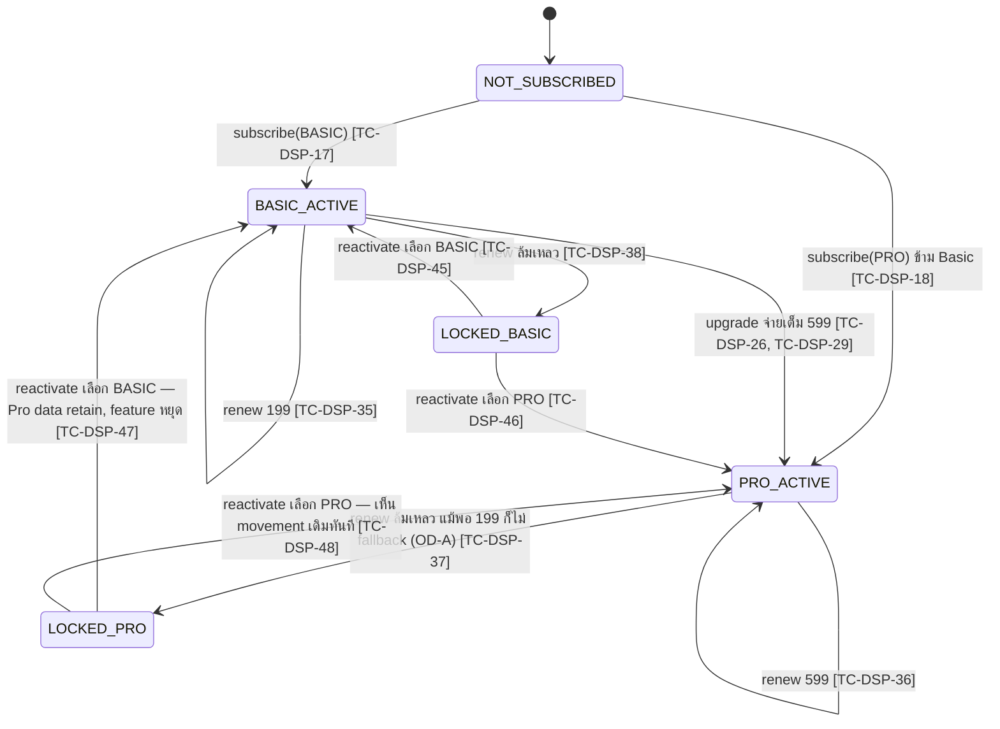
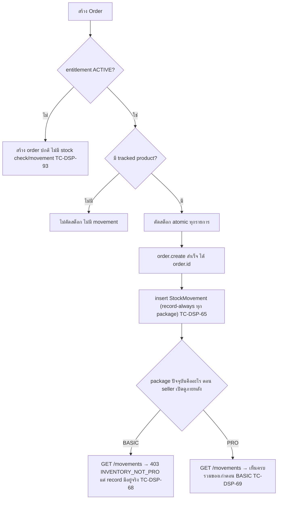
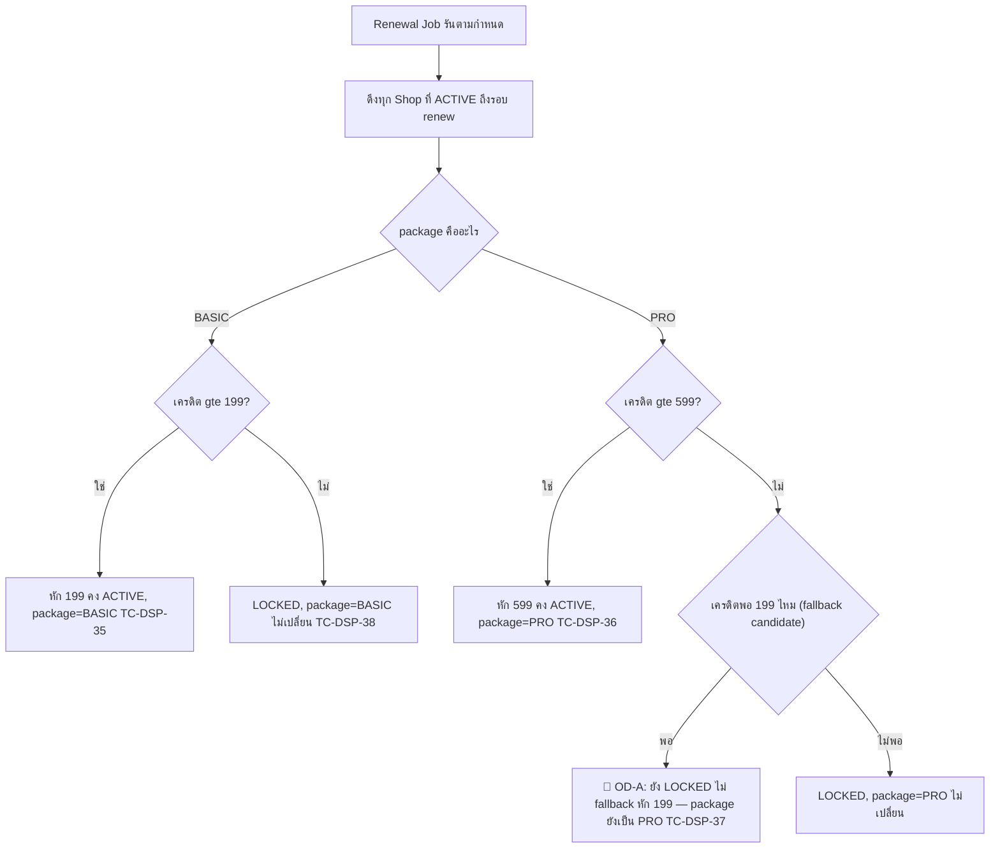
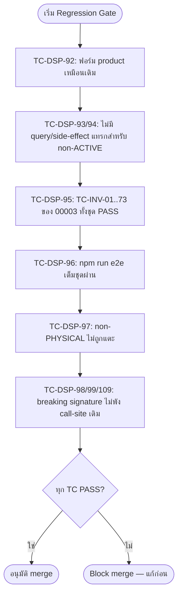

> **โมดูล:** M00009-DeepStockPro
> **ประเภทเอกสาร:** Test Case (E2E + API/Service Integration + Unit + Regression)
> **เวอร์ชัน:** 1.0
> **วันที่จัดทำ:** 2026-07-02
> **สถานะ:** Draft — เขียนก่อน implement (Documentation-First, Hard Rule 11) — **ห้าม execute** จนกว่า developer สร้างฟีเจอร์ + migration ครบตาม §6
> **เจ้าของเอกสาร:** QA (ดู [[Feature-Docs-Ownership]])

# Test Case: Deep Stock Pro (M00009)

---

## 1. Overview

ชุดทดสอบนี้ครอบคลุมฟีเจอร์ **Deep Stock Pro (M00009)** ทั้งหมด ซึ่ง**ขยาย** Inventory Add-on (M00003, SIGNED-OFF + live บน prod) จาก 1 ราคาคงที่ (฿199) ให้เป็น 2 แพ็กเกจ stack กัน (BASIC ฿199 / PRO ฿599) ประกอบด้วย:

1. Manual Stock Adjustment — grandfather ทุก package, ACTIVE-gate ไม่ใช่ PRO-gate (FR-DSP-01)
2. Grandfather migration/backfill — entitlement เดิมได้ `package=BASIC` โดยไม่มี billing event (FR-DSP-02)
3. Subscribe เลือก package ตรง (FR-DSP-03)
4. Upgrade BASIC→PRO กลางรอบ ไม่มี proration (FR-DSP-04)
5. ไม่มี Downgrade self-service (FR-DSP-05)
6. Renewal package-aware + **ไม่ auto-downgrade (OD-A)** (FR-DSP-06)
7. Reactivate เลือก package เอง explicit (FR-DSP-07)
8. Low-Stock Alert ผ่าน `/notifications` timeline (FR-DSP-08, OD-E)
9. Stock Movement History / Audit Log — record-always, query-gate PRO (FR-DSP-09, OD-C)
10. CSV Import/Export — synchronous, per-row isolation (FR-DSP-10)
11. Admin label แยก package (FR-DSP-11)
12. **Backward Compatibility Regression กับ 00003 (blocking gate)** (FR-DSP-12)

ประเภทการทดสอบ: Functional E2E (Playwright), API integration (`page.request.*`), Service-level integration (Vitest — concurrent race, cron idempotent, migration-default), Unit (billing matrix, `src/lib/csv.ts`, `shouldWarnAdvance`), Regression (00003 ทั้งชุด), Code review (grep — no-downgrade-endpoint, PRO-gate consistency)

**เอกสารต้นทาง:** [[BRD]] ของโมดูลนี้ — ทุก test case trace กลับ FR-DSP-01..12 และ Acceptance Criteria `[FR-DSP-XX-AC-YY]`; รายละเอียด implementation อ้าง [[SRS]] (TFR-DSP-01..12), [[SDS]] (TD-DSP-01..05), [[API]], [[DATABASE]]

**ขอบเขตชุดทดสอบ (Scope):**

- **In-scope:** seller subdomain (`seller.deepth.local:4000`), admin subdomain (`admin.deepth.local:4000` หน้า `topups/[id]`), Playwright E2E, API integration, service-level integration (Vitest — race/cron/migration-default), DB persistence verify ผ่าน Prisma, **regression suite เต็มชุดของ 00003** (`docs/20 - Features/00003 - Inventory Add-on/Tests/00001-inventory-addon-e2e.md`, TC-INV-01..73)
- **Out-of-scope:** payment gateway จริง (reuse SellerWallet), Vercel Cron scheduler จริง (ยิง endpoint ตรง), Facebook OAuth/OTP, SKU Variant (→ feature 00010, ไม่อยู่ scope 00009), free trial (ไม่มีใน MVP), push/email/SMS notification pipeline ใหม่ (ไม่มีใน scope — ใช้ timeline เดิม)
- **สภาพแวดล้อม:**
  - dev server `http://seller.deepth.local:4000` + `http://admin.deepth.local:4000` (user รันเอง — ห้าม QA agent start เอง)
  - DB: Supabase dev (`.env.local`) — **ต้อง apply migration `add_deep_stock_pro_schema` ก่อน** (ดู [[DATABASE]] §5) — ทุก test case ในเอกสารนี้ **Blocked** จนกว่าจะ apply
  - Playwright: `playwright.config.ts` (baseURL `http://seller.deepth.local:4000`, workers 1, ไม่ auto-start server)
  - Vitest: `npm run test` — สำหรับ unit/service-integration ที่ไม่ต้องใช้ browser (race condition, billing matrix, csv parse, migration-default)
  - Auth bypass: `e2e/helpers/auth.ts` — `createSeller('complete')` + `loginAs(context, seeded)`; `manual-complete` สำหรับเคสที่ต้องพิสูจน์ full login form
  - `CRON_SECRET` จาก `.env.local` — สำหรับ `/api/cron/inventory-renewal`
  - `loginAsAdmin()` helper — ถ้ายังไม่มีใน `e2e/helpers/` (00003 Tests §6 ระบุว่ายังไม่มี) ต้องสร้างก่อนรัน TC-DSP หมวด K

**หมายเหตุ TDD:** test case เขียนก่อน implement (Documentation-First) — รันได้หลัง developer สร้างฟีเจอร์ + migration ครบตาม §6 Dependencies. ทุก test case ที่แตะ field/table ใหม่ (`InventoryEntitlement.package`, `StockMovement`, `Product.lowStockThreshold`) = **Blocked** จนกว่า migration apply

**⚠️ HIGH RISK — เหตุผลที่หมวด L (regression) เป็น blocking gate:** feature นี้แก้ `order.service.createOrder`/`cancelOrder` ที่ **live บน prod จริง** (00003 SIGNED-OFF) — shop ส่วนใหญ่ตอน launch ยังไม่ subscribe อะไรเลย ความเสี่ยงสูงสุดคือกระทบ flow ที่ไม่เกี่ยวกับ feature นี้เลย

---

## 2. Test Scenarios

### หมวด A — Manual Stock Adjustment (FR-DSP-01, TFR-DSP-01) — ACTIVE-gate ไม่ใช่ PRO-gate

---

#### TC-DSP-01: BASIC ACTIVE — เข้าหน้า/action ปรับสต็อกเองได้ พร้อมระบุเหตุผล

- **Linked to:** `[FR-DSP-01-AC-01]`
- **Precondition:** seed entitlement `status=ACTIVE, package=BASIC`, product tracked `stockQty=10`
- **ประเภท:** E2E Playwright + DB verify
- **Steps:**
  1. `loginAs` → `page.goto('/inventory')` → เปิด modal "ปรับสต็อกเอง" จาก row action ของสินค้า
  2. กรอก `delta=+5`, `note="รับของเข้าคลัง"` → ยืนยัน (Sweet Alerts)
  3. รอ `pacesToast.success` → Query DB `product.stockQty`, `stockMovement` แถวล่าสุด
- **Expected Result:** HTTP 200 `{resultingQty:15}`; `product.stockQty=15`; `stockMovement` แถวใหม่ `source='MANUAL_ADJUST', delta=5, resultingQty=15, refId=null, note='รับของเข้าคลัง', actorUserId=session userId`

---

#### TC-DSP-02: PRO ACTIVE — ปรับสต็อกเองได้เหมือนกัน (ไม่ผูก Pro-only)

- **Linked to:** `[FR-DSP-01-AC-01]` (ขยาย — ยืนยัน BR-DSP-05 "ไม่ผูก Pro-only")
- **Precondition:** seed entitlement `status=ACTIVE, package=PRO`, product tracked `stockQty=10`
- **ประเภท:** API integration + DB verify
- **Steps:**
  1. `page.request.post('/api/inventory/stock/adjust', {data:{productId, delta:-3, note:'ของเสียหาย'}})`
  2. Query DB `product.stockQty`
- **Expected Result:** HTTP 200 `{resultingQty:7}`; ไม่มีความแตกต่างจาก TC-DSP-01 แม้ package ต่างกัน — พิสูจน์ manual adjustment ใช้ **ACTIVE-gate เท่านั้น**

---

#### TC-DSP-03: NOT_SUBSCRIBED — ปรับสต็อกเองถูก block server-side

- **Linked to:** `[FR-DSP-01-AC-02]`
- **Precondition:** seed shop ไม่มี `InventoryEntitlement` row
- **ประเภท:** API integration
- **Steps:**
  1. `page.request.post('/api/inventory/stock/adjust', {data:{productId, delta:5, note:'x'}})`
- **Expected Result:** HTTP 403 `{error:"INVENTORY_NOT_ACTIVE"}` (ไม่ใช่ `INVENTORY_NOT_PRO` — endpoint นี้ใช้ ACTIVE-gate)

---

#### TC-DSP-04: LOCKED — ปรับสต็อกเองถูก block server-side

- **Linked to:** `[FR-DSP-01-AC-02]`
- **Precondition:** seed entitlement `status=LOCKED` (ไม่ว่า package เดิมเป็นอะไร)
- **ประเภท:** API integration
- **Steps:**
  1. `page.request.post('/api/inventory/stock/adjust', ...)`
- **Expected Result:** HTTP 403 `{error:"INVENTORY_NOT_ACTIVE"}`

---

#### TC-DSP-05 (สำคัญที่สุดในหมวดนี้ — Race Condition): Concurrent manual-adjust 2 คำสั่งพร้อมกันบนสินค้าเดียว → ไม่ติดลบ

- **Linked to:** `[FR-DSP-01-AC-03]`
- **Precondition:** seed entitlement ACTIVE, product tracked `stockQty=5`
- **ประเภท:** **Service integration (Vitest)** — ควบคุม timing ให้ชนกันจริง
- **Steps:**
  1. เรียก `manualAdjustStock` 2 ครั้งพร้อมกันด้วย `Promise.allSettled` — ครั้งละ `delta=-4` (รวมต้องการ 8 แต่มีแค่ 5)
  2. ตรวจผลลัพธ์ทั้งสอง promise + Query DB `product.stockQty` สุดท้าย + จำนวน `stockMovement` แถวใหม่
- **Expected Result:** มีเพียง 1 promise สำเร็จ (deduct 4 → เหลือ 1), อีก 1 reject ด้วย `INSUFFICIENT_STOCK`; `product.stockQty=1` (ไม่ติดลบ); มี `stockMovement` เกิดขึ้นแค่ 1 แถวจากคำสั่งที่สำเร็จ
- **หมายเหตุ:** รันซ้ำ ≥10 รอบกัน flakiness (เหมือน TC-INV-44 ของ 00003)

---

#### TC-DSP-06: delta=0 → ปฏิเสธ (validation + defense-in-depth)

- **Linked to:** SRS TFR-DSP-01 step 3 (`DELTA_ZERO`), Valibot `ManualStockAdjustSchema`
- **ประเภท:** API integration
- **Steps:**
  1. `page.request.post('/api/inventory/stock/adjust', {data:{productId, delta:0, note:'x'}})`
- **Expected Result:** HTTP 400 `{error:"Invalid input"}` (Valibot `v.check((n)=>n!==0)` reject ก่อนถึง service)

---

#### TC-DSP-07: note ว่าง/เกิน 200 ตัวอักษร → ปฏิเสธ

- **Linked to:** Valibot `ManualStockAdjustSchema`
- **ประเภท:** API integration
- **Steps:**
  1. POST `note:""` → ตรวจ 400
  2. POST `note:"x".repeat(201)` → ตรวจ 400
- **Expected Result:** ทั้งสองกรณี HTTP 400 `{error:"Invalid input"}`

---

#### TC-DSP-08: productId ไม่ใช่ของ shop ตัวเอง (IDOR) → 404 ไม่ leak

- **Linked to:** SRS TFR-DSP-01 step 1 (ownership check), Authorization Matrix §11
- **Precondition:** seed shop A (entitlement ACTIVE) + shop B มี product ของตัวเอง
- **ประเภท:** API integration
- **Steps:**
  1. `loginAs(shopA)` → `page.request.post('/api/inventory/stock/adjust', {data:{productId: productOfShopB, delta:5, note:'x'}})`
- **Expected Result:** HTTP 404 `{error:"PRODUCT_NOT_FOUND"}` (ไม่บอกว่า product มีอยู่จริงแต่เป็นของร้านอื่น — กัน IDOR enumeration); `product` ของ shop B **ไม่ถูกแตะ**

---

#### TC-DSP-09: product ไม่ track (type≠PHYSICAL หรือ stockQty=null) → 400 PRODUCT_NOT_TRACKED

- **Linked to:** SRS TFR-DSP-01 step 2
- **ประเภท:** API integration
- **Steps:**
  1. POST ด้วย product type=DIGITAL → ตรวจ 400
  2. POST ด้วย product PHYSICAL แต่ `stockQty=null` (untracked) → ตรวจ 400
- **Expected Result:** ทั้งสองกรณี HTTP 400 `{error:"PRODUCT_NOT_TRACKED"}`

---

#### TC-DSP-10: delta ลบทำให้สต็อกติดลบ → 400 พร้อมชื่อสินค้า ไม่ตัดบางส่วน

- **Linked to:** SRS TFR-DSP-01 step 4-5
- **Precondition:** product "กระเป๋าถักมือ" `stockQty=3`
- **ประเภท:** API integration + DB verify
- **Steps:**
  1. POST `{delta:-10, note:'x'}`
  2. Query DB `product.stockQty`, จำนวน `stockMovement` ใหม่
- **Expected Result:** HTTP 400 `{error:"สต็อกไม่พอ: กระเป๋าถักมือ"}`; `product.stockQty` ยังคง 3 (ไม่ถูกตัดแม้บางส่วน); ไม่มี `stockMovement` แถวใหม่

---

#### TC-DSP-11: resultingQty ที่บันทึกตรงกับ stockQty จริง 100% (multi-event sequence)

- **Linked to:** SRS §6 NFR "Atomicity — StockMovement"; TD-DSP-02
- **Precondition:** product tracked `stockQty=20`
- **ประเภท:** Service integration
- **Steps:**
  1. เรียก `manualAdjustStock` ติดต่อกัน 4 ครั้ง (เรียงลำดับ, ไม่ concurrent): `+5`, `-8`, `-2`, `+10`
  2. Query DB `stockMovement` ทั้ง 4 แถว เรียงตาม `createdAt`
- **Expected Result:** `resultingQty` ของแต่ละแถวตรงกับผลสะสม: 25, 17, 15, 25; `product.stockQty` สุดท้าย = 25 ตรงกับแถวสุดท้ายเป๊ะ

---

#### TC-DSP-12: `POST /api/inventory/stock/adjust` ไม่มี Origin/session → 403/401

- **Linked to:** Cross-cutting NFR-2.2
- **ประเภท:** API integration
- **Steps:**
  1. POST ไม่ส่ง `Origin` → ตรวจ 403
  2. POST มี `Origin` แต่ไม่มี cookie → ตรวจ 401
- **Expected Result:** ตามลำดับ HTTP 403, 401

---

### หมวด B — Grandfather / Migration Backfill (FR-DSP-02, TFR-DSP-02)

---

#### TC-DSP-13 (Migration-event, รันครั้งเดียวตอน apply จริง): ทุก entitlement เดิม (00003) ได้ `package=BASIC` ครบ ไม่มีแถวตกหล่น

- **Linked to:** `[FR-DSP-02-AC-01]`
- **ประเภท:** DB query ก่อน/หลัง migration (**manual verification ครั้งเดียวตอน apply migration จริง — ไม่ repeatable ผ่าน Playwright/Vitest ปกติ เพราะหลัง migrate ครั้งแรก column มี NOT NULL DEFAULT เสมอ**)
- **Steps:**
  1. **ก่อน migrate:** `SELECT COUNT(*) FROM "InventoryEntitlement"` (บันทึกจำนวนแถว + status แต่ละแถว)
  2. Apply migration `add_deep_stock_pro_schema` (ขอ user ยืนยันก่อนเสมอ — prod=dev Supabase แชร์)
  3. **หลัง migrate:** `SELECT id, status, package FROM "InventoryEntitlement"` ทุกแถว
- **Expected Result:** จำนวนแถวเท่าเดิม 100%; ทุกแถว (ทั้ง `status=ACTIVE` และ `status=LOCKED`) ได้ `package='BASIC'` ไม่มีแถวใด `NULL`/ตกหล่น
- **หมายเหตุ:** บันทึกผลใน §7 ผลล่าสุด เป็น one-time gate ก่อน sign-off — ไม่ใช่ regression test ที่รันซ้ำได้

---

#### TC-DSP-14 (repeatable regression ของ schema default): สร้าง entitlement โดยไม่ระบุ `package` → ได้ `BASIC` เสมอ

- **Linked to:** `[FR-DSP-02-AC-01]` (ขยาย — ยืนยัน schema default ทำงานถูกหลัง migrate ไปแล้ว ใช้แทนการ "จำลอง pre-migration" ที่ทำซ้ำไม่ได้)
- **ประเภท:** Service integration (Vitest, raw Prisma create ไม่ผ่าน `subscribeInventoryEntitlement` ซึ่งบังคับ `pkg`)
- **Steps:**
  1. `prisma.inventoryEntitlement.create({data: {shopId, status:'ACTIVE', activatedAt:now, currentPeriodStart:now, nextRenewalAt: now+30d /* ไม่ส่ง package */}})`
  2. Query กลับ `entitlement.package`
- **Expected Result:** `package === 'BASIC'` (schema `@default(BASIC)` ทำงานถูก แม้ query path ที่ไม่ผ่าน service layer)

---

#### TC-DSP-15: Migration ไม่สร้าง `WalletTransaction` ใหม่

- **Linked to:** `[FR-DSP-02-AC-01]`
- **ประเภท:** DB query (ส่วนหนึ่งของ TC-DSP-13 gate — แยกยืนยันชัดเจน)
- **Steps:**
  1. บันทึกจำนวน `WalletTransaction` ทั้งหมดก่อน migrate
  2. Apply migration
  3. Query จำนวน `WalletTransaction` หลัง migrate
- **Expected Result:** จำนวนเท่าเดิมเป๊ะ (migration เป็น DDL-level backfill ไม่ผ่าน `deductCredit` เลย)

---

#### TC-DSP-16: Subscriber เดิม (00003 ACTIVE) เข้าหน้า Manual Adjustment ได้ทันทีหลัง deploy โดยไม่มี action

- **Linked to:** `[FR-DSP-02-AC-02]`
- **Precondition:** seed entitlement เหมือนสร้างจาก 00003 เดิม (`status=ACTIVE`, ไม่ระบุ `package` ให้ default เป็น BASIC)
- **ประเภท:** E2E Playwright
- **Steps:**
  1. `loginAs` → `page.goto('/inventory')` (ไม่กด action ใด ๆ เพิ่ม)
  2. ตรวจว่าปุ่ม/entry "ปรับสต็อกเอง" ปรากฏใช้งานได้ทันที
- **Expected Result:** เห็นฟีเจอร์ Manual Adjustment ใช้งานได้ทันที โดยไม่ต้อง subscribe/upgrade อะไรเพิ่ม (สอดคล้อง TC-DSP-01)

---

### หมวด C — Subscribe เลือก Package (FR-DSP-03, TFR-DSP-03)

---

#### TC-DSP-17: Subscribe BASIC ตรง — หัก ฿199 อะตอมมิก

- **Linked to:** `[FR-DSP-03-AC-01]` (ครึ่งหนึ่ง — BASIC)
- **Precondition:** seed shop entitlement=NOT_SUBSCRIBED, `SellerWallet.balance=500`
- **ประเภท:** E2E Playwright + DB verify
- **Steps:**
  1. `loginAs` → `/inventory` → เลือก "Deep Stock" (BASIC) → ยืนยัน
  2. Query DB `inventoryEntitlement`, `walletTransaction`, `sellerWallet.balance`
- **Expected Result:** `entitlement.status='ACTIVE', package='BASIC'`; `walletTransaction` DEDUCT ฿199 `reason='INVENTORY_SUBSCRIPTION_BASIC'`; `wallet.balance=301`

---

#### TC-DSP-18: Subscribe PRO ตรง (ข้าม Basic) — หัก ฿599 อะตอมมิก

- **Linked to:** `[FR-DSP-03-AC-01]` (ครึ่งหนึ่ง — PRO)
- **Precondition:** seed shop entitlement=NOT_SUBSCRIBED, `SellerWallet.balance=700`
- **ประเภท:** E2E Playwright + DB verify
- **Steps:**
  1. `loginAs` → `/inventory` → เลือก "Deep Stock Pro" → ยืนยัน
  2. Query DB
- **Expected Result:** `entitlement.status='ACTIVE', package='PRO'`; `walletTransaction` DEDUCT ฿599 `reason='INVENTORY_SUBSCRIPTION_PRO'`; `wallet.balance=101`; เห็นฟีเจอร์ Pro (Alert/Audit/CSV) ใช้งานได้ทันทีโดยไม่ผ่าน Basic ก่อน

---

#### TC-DSP-19: Subscribe PRO เครดิตไม่พอ (พอ BASIC แต่ไม่พอ PRO) → ปฏิเสธทั้งก้อน ไม่ fallback หัก BASIC

- **Linked to:** `[FR-DSP-03-AC-02]`
- **Precondition:** `SellerWallet.balance=300` (พอ 199 แต่ไม่พอ 599), entitlement=NOT_SUBSCRIBED
- **ประเภท:** API integration + DB verify
- **Steps:**
  1. `page.request.post('/api/inventory/subscribe', {data:{package:'PRO'}})`
  2. Query DB `wallet.balance`, `inventoryEntitlement` count
- **Expected Result:** HTTP 402 `{error:"เครดิตไม่พอ กรุณาเติมเครดิตก่อนสมัคร"}`; `wallet.balance` ยังคง 300 (ไม่หักแม้บางส่วน, **ไม่มี fallback ไปสมัคร BASIC แทนอัตโนมัติ**); ไม่มี `InventoryEntitlement` row ถูกสร้าง

---

#### TC-DSP-20: Subscribe BASIC เครดิตไม่พอ → ปฏิเสธ + prompt top-up

- **Linked to:** `[FR-DSP-03-AC-02]`
- **Precondition:** `SellerWallet.balance=50`
- **ประเภท:** API integration
- **Steps:**
  1. POST `{package:'BASIC'}`
- **Expected Result:** HTTP 402; `wallet.balance` ยังคง 50

---

#### TC-DSP-21: UI แสดง 2 ตัวเลือก package ชัดเจนตั้งแต่จุดเริ่ม (ไม่บังคับผ่าน Basic ก่อน)

- **Linked to:** `[FR-DSP-03-AC-03]`
- **Precondition:** entitlement=NOT_SUBSCRIBED
- **ประเภท:** E2E Playwright (visual/DOM)
- **Steps:**
  1. `loginAs` → `/inventory`
  2. ตรวจ `PackageSelector` แสดง 2 การ์ด/ตัวเลือก (Deep Stock ฿199, Deep Stock Pro ฿599) พร้อมกัน ไม่มี default pre-select ที่ submit ได้โดยไม่เลือก
- **Expected Result:** เห็น 2 ตัวเลือกชัดเจน; ปุ่ม subscribe ไม่ทำงานถ้ายังไม่เลือก package (หรือ mandatory field)

---

#### TC-DSP-22: Subscribe ไม่ส่ง `package` หรือค่าไม่ใช่ BASIC/PRO → 400

- **Linked to:** Valibot `SubscribeInventorySchema`
- **ประเภท:** API integration
- **Steps:**
  1. POST `{}` → ตรวจ 400
  2. POST `{package:'ENTERPRISE'}` → ตรวจ 400
- **Expected Result:** ทั้งสองกรณี HTTP 400 `{error:"Invalid input"}`

---

#### TC-DSP-23: Subscribe ขณะมี entitlement ACTIVE อยู่แล้ว → 409

- **Linked to:** API.md `ENTITLEMENT_ALREADY_EXISTS`
- **ประเภท:** API integration
- **Steps:**
  1. seed entitlement ACTIVE (ไม่ว่า package ใด) → POST subscribe `{package:'PRO'}`
- **Expected Result:** HTTP 409 `{error:"สมัครใช้งานอยู่แล้ว"}`; ไม่มี `WalletTransaction` ใหม่

---

#### TC-DSP-24: Subscribe ขณะ LOCKED → 409 (ต้องใช้ reactivate ไม่ใช่ subscribe)

- **Linked to:** API.md `ENTITLEMENT_ALREADY_EXISTS`
- **ประเภท:** API integration
- **Steps:**
  1. seed entitlement LOCKED → POST subscribe
- **Expected Result:** HTTP 409 (มี row อยู่แล้วไม่ว่า status ใด)

---

#### TC-DSP-25: Subscribe ไม่มี Origin/session → 403/401

- **Linked to:** Cross-cutting NFR-2.2 + auth
- **ประเภท:** API integration
- **Steps:**
  1. POST ไม่ส่ง Origin → 403
  2. POST มี Origin ไม่มี cookie → 401
- **Expected Result:** ตามลำดับ

---

### หมวด D — Upgrade BASIC→PRO (FR-DSP-04, TFR-DSP-04)

---

#### TC-DSP-26: Upgrade สำเร็จ — หักเต็ม ฿599 ทันที (ไม่ใช่ผลต่าง ฿400) + รอบใหม่เริ่มนับ

- **Linked to:** `[FR-DSP-04-AC-01]`
- **Precondition:** seed entitlement `status=ACTIVE, package=BASIC`, `currentPeriodStart` = 20 วันก่อน (กลางรอบ), `SellerWallet.balance=700`
- **ประเภท:** E2E Playwright + DB verify
- **Steps:**
  1. `loginAs` → `/inventory` → กด "Upgrade เป็น Pro" → ยืนยัน (Sweet Alerts)
  2. Query DB `inventoryEntitlement`, `walletTransaction`, `sellerWallet.balance`
- **Expected Result:** หักเต็ม ฿599 (ไม่ใช่ 400); `wallet.balance=101`; `walletTransaction` DEDUCT `reason='INVENTORY_SUBSCRIPTION_PRO_UPGRADE'` (แยกจาก `INVENTORY_SUBSCRIPTION_PRO` ของ subscribe ตรง — สำหรับ KPI); `entitlement.package='PRO'`; `entitlement.currentPeriodStart≈now` (reset, ไม่ใช่ต่อจากรอบ Basic เดิม); `entitlement.nextRenewalAt≈now+30d`; **`entitlement.activatedAt` ไม่เปลี่ยน**

---

#### TC-DSP-27: หลัง Upgrade — เห็นฟีเจอร์ Pro (Alert/Audit/CSV) ใช้งานได้ทันที

- **Linked to:** `[FR-DSP-04-AC-02]`
- **Precondition:** ต่อจาก TC-DSP-26
- **ประเภท:** E2E Playwright
- **Steps:**
  1. หลัง toast success (component เรียก `router.refresh()`) → ตรวจ `/inventory` แสดง section Pro (link movements/CSV/threshold) โดยไม่ต้อง reload
  2. `page.goto('/inventory/movements/{productId}')` → ตรวจเข้าถึงได้ (ไม่ 403)
- **Expected Result:** UI/route Pro ใช้งานได้ทันทีหลัง upgrade สำเร็จ ไม่ต้อง manual refresh

---

#### TC-DSP-28: Upgrade เครดิตไม่พอ → ปฏิเสธ + prompt top-up (package ไม่เปลี่ยน)

- **Linked to:** `[FR-DSP-04-AC-03]`
- **Precondition:** entitlement `ACTIVE, package=BASIC`, `balance=200` (< 599)
- **ประเภท:** API integration + DB verify
- **Steps:**
  1. `page.request.post('/api/inventory/upgrade')`
  2. Query DB `entitlement.package`, `wallet.balance`
- **Expected Result:** HTTP 402 `{error:"เครดิตไม่พอ กรุณาเติมเครดิตก่อนอัพเกรด"}`; `entitlement.package` ยังคง `'BASIC'`; `wallet.balance` ยังคง 200 (ไม่หักบางส่วน)

---

#### TC-DSP-29: Upgrade ไม่มี proration ไม่ว่ากดวันไหนของรอบ Basic

- **Linked to:** `[FR-DSP-04-AC-04]`
- **Precondition:** seed 2 shop package=BASIC — shop A upgrade วันที่ 2 ของรอบ (28 วันเหลือ), shop B upgrade วันที่ 29 ของรอบ (1 วันเหลือ), balance เพียงพอทั้งคู่
- **ประเภท:** Service integration
- **Steps:**
  1. เรียก `upgradeToProEntitlement(shopA)` และ `upgradeToProEntitlement(shopB)`
  2. เปรียบเทียบ `WalletTransaction.amount` ของทั้งสอง
- **Expected Result:** ทั้งสองหัก ฿599 เท่ากันเป๊ะ ไม่ว่าจะเหลือวันในรอบ Basic เท่าไหร่ (ไม่มี pro-rate ตามวันที่เหลือ)

---

#### TC-DSP-30: Upgrade ขณะ NOT_SUBSCRIBED/LOCKED → 409 ENTITLEMENT_NOT_ACTIVE

- **Linked to:** API.md §4.2 error table
- **ประเภท:** API integration
- **Steps:**
  1. seed entitlement=NOT_SUBSCRIBED → POST upgrade → ตรวจ 409
  2. seed entitlement=LOCKED → POST upgrade → ตรวจ 409
- **Expected Result:** ทั้งสองกรณี HTTP 409 `{error:"ยังไม่ได้สมัครใช้งาน หรือถูกล็อกอยู่"}`

---

#### TC-DSP-31: Upgrade ขณะเป็น PRO อยู่แล้ว → 409 ALREADY_PRO

- **Linked to:** API.md §4.2 error table
- **Precondition:** entitlement `ACTIVE, package=PRO`
- **ประเภท:** API integration
- **Steps:**
  1. POST `/api/inventory/upgrade`
- **Expected Result:** HTTP 409 `{error:"ใช้งาน Deep Stock Pro อยู่แล้ว"}`; ไม่มี `WalletTransaction` ใหม่

---

#### TC-DSP-32: Upgrade ไม่มี Origin/session → 403/401

- **Linked to:** Cross-cutting NFR-2.2
- **ประเภท:** API integration
- **Steps:** เหมือน TC-DSP-25 แต่ endpoint `/api/inventory/upgrade`
- **Expected Result:** 403 / 401 ตามลำดับ

---

### หมวด E — Downgrade ไม่มี Self-service (FR-DSP-05, TFR-DSP-05)

---

#### TC-DSP-33: Code review — ไม่มี route ใด mutate `package: PRO→BASIC` ขณะ `status=ACTIVE`

- **Linked to:** `[FR-DSP-05-AC-01]`
- **ประเภท:** Code review / grep
- **Steps:**
  1. grep `src/app/api/inventory/**` ทุกไฟล์ — ยืนยันมีแค่ 3 mutation entrypoint (`subscribe` create-only, `upgrade` BASIC→PRO เท่านั้น, `reactivate` จาก LOCKED เท่านั้น)
  2. ยืนยันไม่มี endpoint เช่น `/api/inventory/downgrade` หรือ parameter ใดใน `upgrade`/`PATCH` อื่นที่รับ `package=BASIC` เปลี่ยนจาก PRO ขณะ ACTIVE
- **Expected Result:** ไม่พบ code path ใดที่ mutate PRO→BASIC ขณะ ACTIVE

---

#### TC-DSP-34: UI ไม่มีปุ่ม downgrade บน `/inventory` เมื่อ package=PRO

- **Linked to:** `[FR-DSP-05-AC-02]`
- **Precondition:** entitlement `ACTIVE, package=PRO`
- **ประเภท:** E2E Playwright (negative — ต้องไม่มี)
- **Steps:**
  1. `loginAs` → `/inventory`
  2. ตรวจ DOM ไม่มีปุ่ม/ลิงก์ "เปลี่ยนเป็น Basic"/"ยกเลิก Pro" ใด ๆ (ทางเดียวคือ LOCKED→Reactivate)
- **Expected Result:** ไม่พบ UI control ใดให้ downgrade ตรง ๆ

---

### หมวด F — Renewal Package-aware + ไม่ Auto-downgrade (FR-DSP-06/06b, TFR-DSP-06, OD-A) — 🛑 สำคัญที่สุดของ Billing Correctness

---

#### TC-DSP-35: Renewal BASIC ครบรอบ + เครดิตพอ → หัก ฿199

- **Linked to:** `[FR-DSP-06-AC-01]`
- **Precondition:** seed entitlement `status=ACTIVE, package=BASIC, nextRenewalAt=now-1h`, `balance=500`
- **ประเภท:** API integration (cron endpoint) + DB verify
- **Steps:**
  1. POST `/api/cron/inventory-renewal` (Bearer `CRON_SECRET`)
  2. Query DB `entitlement`, `walletTransaction`, `wallet.balance`
- **Expected Result:** `{renewed:1}`; `wallet.balance=301`; `walletTransaction.reason='INVENTORY_SUBSCRIPTION_BASIC'`; `entitlement.status='ACTIVE'`, `package` ไม่เปลี่ยน; `nextRenewalAt≈now+30d`

---

#### TC-DSP-36: Renewal PRO ครบรอบ + เครดิตพอ → หัก ฿599

- **Linked to:** `[FR-DSP-06-AC-02]`
- **Precondition:** seed entitlement `status=ACTIVE, package=PRO, nextRenewalAt=now-1h`, `balance=800`
- **ประเภท:** API integration + DB verify
- **Steps:**
  1. POST `/api/cron/inventory-renewal`
  2. Query DB
- **Expected Result:** `wallet.balance=201`; `walletTransaction.reason='INVENTORY_SUBSCRIPTION_PRO'`; `entitlement.package` ยังคง `'PRO'`

---

#### TC-DSP-37 (🛑 OD-A critical): Renewal PRO ครบรอบ — เครดิตพอ BASIC(199) แต่ไม่พอ PRO(599) → LOCKED ทันที ไม่หัก ฿199 แทน

- **Linked to:** `[FR-DSP-06-AC-03]` — **regression gate สำหรับ OD-A**
- **Precondition:** seed entitlement `status=ACTIVE, package=PRO, nextRenewalAt=now-1h`, `balance=300` (พอ 199 แต่ไม่พอ 599)
- **ประเภท:** API integration + DB verify — **blocking case**
- **Steps:**
  1. POST `/api/cron/inventory-renewal`
  2. Query DB `entitlement.status`, `entitlement.package`, `wallet.balance`, `walletTransaction` count ใหม่
- **Expected Result:** `{locked:1}`; `entitlement.status='LOCKED'`; `entitlement.package` **ยังคง `'PRO'`** (ไม่เปลี่ยนเป็น BASIC — "จำ" ค่าไว้); `wallet.balance` **ยังคง 300 เป๊ะ** (ไม่มีการหัก ฿199 แทนโดยอัตโนมัติ — ยืนยัน OD-A "Lock ทั้งก้อน"); **ไม่มี** `WalletTransaction` ใหม่เกิดขึ้นเลย
- **⚠️ หมายเหตุ:** ถ้า test นี้ FAIL (ระบบหัก 199 แทน) = OD-A ไม่ได้ implement ตามที่ SRS ยึด — ต้อง block sign-off ทันที

---

#### TC-DSP-38: Renewal BASIC ครบรอบ เครดิตไม่พอแม้ ฿199 → LOCKED

- **Linked to:** `[FR-DSP-06-AC-03]` (ครึ่งกรณี BASIC)
- **Precondition:** entitlement `ACTIVE, package=BASIC, nextRenewalAt=now-1h`, `balance=50`
- **ประเภท:** API integration + DB verify
- **Steps:**
  1. POST cron renewal
- **Expected Result:** `{locked:1}`; `entitlement.status='LOCKED'`, `package` ยังคง `'BASIC'`; `wallet.balance` ยังคง 50

---

#### TC-DSP-39: Renewal idempotent ต่อ package — รันซ้ำวันเดียวกันไม่หักซ้ำสอง

- **Linked to:** `[FR-DSP-06-AC-04]`
- **Precondition:** entitlement `ACTIVE, package=PRO, nextRenewalAt=now-1h`, `balance=800`
- **ประเภท:** API integration + DB verify
- **Steps:**
  1. POST cron renewal ครั้งที่ 1 → `wallet.balance=201`
  2. POST cron renewal ครั้งที่ 2 ทันที
  3. Query DB
- **Expected Result:** ครั้งที่ 2 shop นี้เป็น `SKIPPED`; `wallet.balance` ยังคง 201; มี `WalletTransaction` DEDUCT รายการเดียวจากรอบนี้ (reason PRO)

---

#### TC-DSP-40: Cron renewal ประมวลผลถูกต้องทั้ง BASIC และ PRO ในรอบเดียวกัน (mixed batch)

- **Linked to:** `[FR-DSP-06-AC-01/02/03]` (ขยาย — cross-package batch correctness)
- **Precondition:** seed 4 shop ถึงรอบพร้อมกัน: BASIC-เครดิตพอ, BASIC-เครดิตไม่พอ, PRO-เครดิตพอ, PRO-เครดิตพอแค่ BASIC (OD-A case)
- **ประเภท:** API integration + DB verify
- **Steps:**
  1. POST cron renewal ครั้งเดียว
  2. Query DB ทั้ง 4 shop
- **Expected Result:** `{processed:4, renewed:2, locked:2}`; shop ที่หักถูกต้องตามราคา package ของตัวเอง; shop PRO-เครดิตพอแค่ BASIC ถูก LOCKED ไม่ใช่ renewed-as-BASIC (ยืนยัน OD-A ในบริบท batch จริง ไม่ใช่แค่ shop เดี่ยว)

---

#### TC-DSP-41: Advance-warning banner (PRO) แสดง shortfall คำนวณจาก ฿599 ไม่ใช่ ฿199

- **Linked to:** SRS TFR-DSP-06b (บั๊กที่ระบุชัดว่าเสี่ยงถ้าไม่ sync call-site)
- **Precondition:** entitlement `ACTIVE, package=PRO, nextRenewalAt=now+3d`, `balance=100`
- **ประเภท:** E2E Playwright
- **Steps:**
  1. `loginAs` → `/inventory`
  2. ตรวจ `AdvanceWarningBanner` แสดงข้อความ shortfall
- **Expected Result:** ข้อความระบุ `shortfall = 599-100 = 499` (ไม่ใช่ `199-100=99` ที่จะเกิดถ้า call-site ไม่ส่ง `package` เข้า `shouldWarnAdvance`)

---

#### TC-DSP-42: Advance-warning banner (BASIC) แสดง shortfall คำนวณจาก ฿199

- **Linked to:** SRS TFR-DSP-06b
- **Precondition:** entitlement `ACTIVE, package=BASIC, nextRenewalAt=now+3d`, `balance=100`
- **ประเภท:** E2E Playwright
- **Steps:** เหมือน TC-DSP-41
- **Expected Result:** `shortfall = 199-100 = 99`

---

#### TC-DSP-43: `shouldWarnAdvance` unit — package-aware boundary ถูกต้องทั้ง 2 package

- **Linked to:** SRS TFR-DSP-06b (pure function)
- **ประเภท:** Unit (Vitest)
- **Steps:**
  1. `shouldWarnAdvance({status:'ACTIVE', package:'PRO', nextRenewalAt: now+2d}, 500)` → คาด `false` (500≥599? ไม่ — 500<599 → true จริง ๆ ตรวจให้ดี: ใช้ balance ที่ชัดเจนกว่า)
  2. `shouldWarnAdvance({status:'ACTIVE', package:'PRO', nextRenewalAt: now+2d}, 700)` → คาด `false` (เครดิตพอ 599)
  3. `shouldWarnAdvance({status:'ACTIVE', package:'BASIC', nextRenewalAt: now+2d}, 250)` → คาด `false` (เครดิตพอ 199 แม้ balance เท่ากับเคส PRO ที่ warn)
  4. `shouldWarnAdvance({status:'ACTIVE', package:'BASIC', nextRenewalAt: now+2d}, 100)` → คาด `true` (100<199)
- **Expected Result:** ผลลัพธ์ตรงตามที่คาดทุกกรณี — threshold คำนวณจาก `PACKAGE_PRICE[package]` ไม่ใช่ค่าคงที่ 199

---

#### TC-DSP-44 (TD-DSP-03 ระดับ renewal — concurrent claim, ต่อยอด TC-INV-68 ของ 00003): Renewal concurrent invocation ไม่หักซ้ำ ไม่ advance ผิด ไม่ว่า package ใด

- **Linked to:** SRS TFR-DSP-06; DATABASE §6
- **Precondition:** entitlement `ACTIVE, package=PRO`, ถึงรอบพอดี, `balance=700`
- **ประเภท:** Service integration (`Promise.all`)
- **Steps:**
  1. เรียก `renewOrLockEntitlement(shopId)` 2 ครั้งพร้อมกัน
  2. Query DB `wallet.balance`, จำนวน `WalletTransaction`
- **Expected Result:** มีเพียง 1 เรียกที่ได้ `'RENEWED'`; `wallet.balance` ลดแค่ 599 ครั้งเดียว (ไม่ใช่ 1198); `nextRenewalAt` advance แค่ครั้งเดียว

---

### หมวด G — Reactivate เลือก Package เอง (FR-DSP-07, TFR-DSP-07)

---

#### TC-DSP-45: Reactivate เลือก BASIC (ก่อนล็อกเป็น BASIC) → สำเร็จ

- **Linked to:** `[FR-DSP-07-AC-01]`, `[FR-DSP-07-AC-02]`
- **Precondition:** entitlement `status=LOCKED`, package ล่าสุดก่อนล็อก=`BASIC`, `balance=300`
- **ประเภท:** E2E Playwright + DB verify
- **Steps:**
  1. `loginAs` → `/inventory` (เห็น gate LOCKED พร้อมให้เลือก package) → เลือก "Deep Stock" → ยืนยัน
  2. Query DB
- **Expected Result:** `entitlement.status='ACTIVE', package='BASIC'`; หัก ฿199; `currentPeriodStart/nextRenewalAt` เริ่มนับใหม่จากวันนี้; `activatedAt` **ไม่เปลี่ยน**; `lockedAt=null`

---

#### TC-DSP-46: Reactivate เลือก PRO (ก่อนล็อกเป็น BASIC) → สำเร็จ (upgrade-like ผ่าน reactivate)

- **Linked to:** `[FR-DSP-07-AC-01]`, `[FR-DSP-07-AC-02]`
- **Precondition:** entitlement `status=LOCKED`, package ล่าสุด=`BASIC`, `balance=700`
- **ประเภท:** E2E Playwright + DB verify
- **Steps:**
  1. `loginAs` → `/inventory` → เลือก "Deep Stock Pro" → ยืนยัน
  2. Query DB `walletTransaction.reason`
- **Expected Result:** `entitlement.package='PRO'`; หัก ฿599; `walletTransaction.reason='INVENTORY_SUBSCRIPTION_PRO'` (**ไม่ใช่** `_PRO_UPGRADE` — reactivate ไม่ใช่ upgrade event แม้ผล similar)

---

#### TC-DSP-47 (BRD Scenario 3 — edge case สำคัญ): Reactivate เลือก BASIC ทั้งที่ก่อนล็อกเป็น PRO → ข้อมูล Pro เก็บไว้ครบ แต่ฟีเจอร์หยุด

- **Linked to:** `[FR-DSP-07-AC-04]`
- **Precondition:** entitlement `status=LOCKED`, package ล่าสุดก่อนล็อก=`PRO`, มี `stockMovement` history + `lowStockThreshold` ตั้งไว้ก่อนล็อก, `balance=300` (พอ 199 ไม่พอ 599)
- **ประเภท:** E2E Playwright + API integration + DB verify
- **Steps:**
  1. `loginAs` → `/inventory` → เลือก "Deep Stock" (BASIC) → ยืนยัน
  2. Query DB `product.lowStockThreshold`, `stockMovement` count (ต้องเก็บไว้ครบ)
  3. `page.request.get('/api/inventory/movements?productId=...')` → ตรวจ 403
- **Expected Result:** `entitlement.package='BASIC'`; `product.lowStockThreshold` **ไม่ถูกลบ/reset** (ค่าเดิมยังอยู่); `stockMovement` history **ทุกแถวเดิมยังอยู่ครบ**; `GET /api/inventory/movements` คืน 403 `INVENTORY_NOT_PRO` ทันที (ฟีเจอร์ Pro หยุดทำงาน แต่ข้อมูลไม่หาย — ต้อง upgrade กลับ Pro ถึงจะเห็นอีกครั้ง)

---

#### TC-DSP-48: Reactivate เลือก PRO (ก่อนล็อกเป็น PRO) → สำเร็จ เห็น movement history เดิมทันที

- **Linked to:** `[FR-DSP-07-AC-01/02/04]`
- **Precondition:** entitlement `status=LOCKED`, package ล่าสุด=`PRO`, มี `stockMovement` history เดิม, `balance=700`
- **ประเภท:** E2E Playwright + DB verify
- **Steps:**
  1. `loginAs` → `/inventory` → เลือก "Deep Stock Pro" → ยืนยัน
  2. `page.goto('/inventory/movements/{productId}')`
- **Expected Result:** `entitlement.package='PRO'`; หน้า movement history แสดง entry เดิมทั้งหมด (ไม่มีช่วงขาดหาย แม้ระหว่าง LOCKED)

---

#### TC-DSP-49: Reactivate เลือก package แล้วเครดิตไม่พอ → ปฏิเสธ ยังคง LOCKED

- **Linked to:** `[FR-DSP-07-AC-03]`
- **Precondition:** entitlement `status=LOCKED`, `balance=50`
- **ประเภท:** API integration + DB verify
- **Steps:**
  1. POST `/api/inventory/reactivate {package:'PRO'}` → ตรวจ 402
  2. POST `/api/inventory/reactivate {package:'BASIC'}` → ตรวจ 402 เช่นกัน (50 < 199)
  3. Query DB `entitlement.status`
- **Expected Result:** ทั้งสองกรณี HTTP 402 `{error:"เครดิตไม่พอ กรุณาเติมเครดิตก่อนเปิดใช้อีกครั้ง"}`; `entitlement.status` ยังคง `LOCKED`

---

#### TC-DSP-50: Reactivate ขณะไม่ LOCKED (ACTIVE หรือไม่มี row) → 409

- **Linked to:** API.md `ENTITLEMENT_NOT_LOCKED`
- **ประเภท:** API integration
- **Steps:**
  1. seed entitlement ACTIVE → POST reactivate `{package:'PRO'}`
- **Expected Result:** HTTP 409 `{error:"บัญชีนี้ไม่ได้ถูกล็อก"}`

---

#### TC-DSP-51: Reactivate ไม่ส่ง `package`/ค่าผิด → 400

- **Linked to:** Valibot `ReactivateInventorySchema`
- **ประเภท:** API integration
- **Steps:**
  1. seed LOCKED → POST `{}` → ตรวจ 400
- **Expected Result:** HTTP 400 `{error:"Invalid input"}`

---

#### TC-DSP-52: `activatedAt` ไม่ถูกแตะเมื่อ reactivate (regression guard ตาม 00003 pattern)

- **Linked to:** DATABASE §3.1 semantics; ต่อยอด TC-INV-24 ของ 00003
- **Precondition:** entitlement `LOCKED`, `activatedAt` = 60 วันก่อน (fixed marker)
- **ประเภท:** Service integration + DB verify
- **Steps:**
  1. เรียก `reactivateInventoryEntitlement(shopId, 'PRO')`
  2. Query DB `entitlement.activatedAt`
- **Expected Result:** `activatedAt` ยังคง 60 วันก่อนเป๊ะ (ไม่ reset เป็น now)

---

#### TC-DSP-53: Reactivate ไม่มี Origin/session → 403/401

- **Linked to:** Cross-cutting NFR-2.2
- **ประเภท:** API integration
- **Steps:** เหมือน TC-DSP-25 แต่ endpoint `/api/inventory/reactivate`
- **Expected Result:** 403 / 401 ตามลำดับ

---

### หมวด H — Low-Stock Alert (FR-DSP-08/08b, TFR-DSP-08/08b, OD-E)

---

#### TC-DSP-54: PRO ACTIVE ตั้ง `lowStockThreshold` บนสินค้า tracked สำเร็จ

- **Linked to:** `[FR-DSP-08-AC-01]`
- **Precondition:** entitlement `ACTIVE, package=PRO`, product tracked `stockQty=10`
- **ประเภท:** E2E Playwright + DB verify
- **Steps:**
  1. `loginAs` → `page.goto('/products/{id}/edit')` → ตรวจ field "แจ้งเตือนสต็อกใกล้หมด" ปรากฏ → กรอก `3` → บันทึก
  2. Query DB `product.lowStockThreshold`
- **Expected Result:** `product.lowStockThreshold=3`

---

#### TC-DSP-55: BASIC ACTIVE ตั้ง `lowStockThreshold` → 403 INVENTORY_NOT_PRO

- **Linked to:** SRS TFR-DSP-08b step 3
- **Precondition:** entitlement `ACTIVE, package=BASIC`, product tracked
- **ประเภท:** API integration
- **Steps:**
  1. `page.request.patch('/api/products/{id}', {data:{lowStockThreshold:5}})`
- **Expected Result:** HTTP 403 `{error:"INVENTORY_NOT_PRO"}` (**ไม่ใช่** `INVENTORY_NOT_ACTIVE` — แยก error code ชัดเจนสำหรับ PRO-gate)

---

#### TC-DSP-56: NOT_SUBSCRIBED/LOCKED ตั้ง `lowStockThreshold` → 403 INVENTORY_NOT_PRO เช่นกัน

- **Linked to:** SRS TFR-DSP-08b (ยืนยันว่าทุกสถานะที่ไม่ใช่ PRO+ACTIVE ได้ error code เดียวกัน)
- **ประเภท:** API integration
- **Steps:**
  1. entitlement=NOT_SUBSCRIBED → PATCH → ตรวจ 403 `INVENTORY_NOT_PRO`
  2. entitlement=LOCKED (package เดิม=PRO) → PATCH → ตรวจ 403 `INVENTORY_NOT_PRO` เช่นกัน (ไม่ fallback เป็น error อื่น)
- **Expected Result:** ทั้งสองกรณี HTTP 403 `{error:"INVENTORY_NOT_PRO"}` — ยืนยัน `isProActive()` ครอบคลุมทุกกรณีที่ไม่ใช่ `ACTIVE+PRO`

---

#### TC-DSP-57: `lowStockThreshold` ส่งมาแต่ type≠PHYSICAL → 400 (ก่อนถึง PRO-gate check)

- **Linked to:** SRS TFR-DSP-08b step 1 (ลำดับ guard: type → tracked → PRO-gate)
- **Precondition:** entitlement `ACTIVE, package=BASIC` (จงใจใช้ BASIC เพื่อพิสูจน์ลำดับ check), product type=DIGITAL
- **ประเภท:** API integration
- **Steps:**
  1. PATCH `{lowStockThreshold:5}` บน product DIGITAL
- **Expected Result:** HTTP 400 `{error:"STOCK_QTY_INVALID_PRODUCT_TYPE"}` (**ไม่ใช่** 403 — type check มาก่อน PRO-gate check ตามลำดับ SRS)

---

#### TC-DSP-58: `lowStockThreshold` ส่งมาแต่สินค้ายังไม่ track → 400 PRODUCT_NOT_TRACKED (ก่อน PRO-gate)

- **Linked to:** SRS TFR-DSP-08b step 2
- **Precondition:** entitlement `ACTIVE, package=PRO`, product PHYSICAL `stockQty=null` (untracked)
- **ประเภท:** API integration
- **Steps:**
  1. PATCH `{lowStockThreshold:5}`
- **Expected Result:** HTTP 400 `{error:"PRODUCT_NOT_TRACKED"}` (ยืนยันลำดับ: tracked check มาก่อน PRO-gate check แม้ entitlement เป็น PRO อยู่แล้ว)

---

#### TC-DSP-59: Order deduct ทำให้ stockQty ≤ threshold → ปรากฏใน `/notifications` timeline (PRO)

- **Linked to:** `[FR-DSP-08-AC-02]`
- **Precondition:** entitlement `ACTIVE, package=PRO`, product "เสื้อยืด" `stockQty=5, lowStockThreshold=5`
- **ประเภท:** E2E Playwright + API integration
- **Steps:**
  1. `page.request.post('/api/orders', {items:[{productId, qty:2}]})` (deduct → stockQty=3 ≤ threshold 5)
  2. `loginAs` → `page.goto('/notifications')`
- **Expected Result:** timeline แสดง entry `LOW_STOCK_ALERT` "สต็อกใกล้หมด: เสื้อยืด (เหลือ 3)" พร้อม icon/สีเตือน (`text-danger`), link ไป `/products/{id}/edit`

---

#### TC-DSP-60: Manual adjustment ทำให้ stockQty ≤ threshold → ปรากฏใน timeline เช่นกัน

- **Linked to:** `[FR-DSP-08-AC-02]` (ขยาย — ยืนยัน source `MANUAL_ADJUST` ก็ trigger ได้ ไม่ใช่แค่ `ORDER_DEDUCT`)
- **Precondition:** entitlement `ACTIVE, package=PRO`, product `stockQty=10, lowStockThreshold=8`
- **ประเภท:** API integration
- **Steps:**
  1. `POST /api/inventory/stock/adjust {delta:-3, note:'x'}` (stockQty=7 ≤ 8)
  2. เรียก `getRecentActivity(shopId, 10)` ตรง (หรือ `page.goto('/notifications')`)
- **Expected Result:** พบ entry `LOW_STOCK_ALERT` จาก movement source `MANUAL_ADJUST`

---

#### TC-DSP-61: Alert ไม่แสดงเมื่อ package=BASIC แม้ threshold ค่ายังอยู่ + stockQty ≤ threshold จริง

- **Linked to:** `[FR-DSP-08-AC-03]`
- **Precondition:** entitlement `ACTIVE, package=BASIC` (threshold ค้างมาจากตอนเคยเป็น PRO — เก็บไว้ตาม data retention), product `stockQty=2, lowStockThreshold=5`
- **ประเภท:** API integration
- **Steps:**
  1. เรียก `getRecentActivity(shopId, 10)`
- **Expected Result:** ไม่มี `LOW_STOCK_ALERT` ใน timeline เลย (ข้าม source 5 ทั้งหมดเพราะ `package≠'PRO'`) แม้เงื่อนไขตัวเลขจะเข้าเกณฑ์จริง

---

#### TC-DSP-62: Alert หยุดหลัง entitlement เปลี่ยนเป็น LOCKED — threshold ไม่ถูกลบ

- **Linked to:** `[FR-DSP-08-AC-03]`
- **Precondition:** entitlement `LOCKED` (เดิม PRO), `lowStockThreshold=5` ยังอยู่ใน DB
- **ประเภท:** API integration + DB verify
- **Steps:**
  1. เรียก `getRecentActivity(shopId, 10)` → ตรวจไม่มี `LOW_STOCK_ALERT`
  2. Query DB `product.lowStockThreshold`
- **Expected Result:** ไม่มี alert แสดง; `product.lowStockThreshold` ยังคง 5 (data retention — ไม่ถูกลบ)

---

#### TC-DSP-63: ตั้ง `lowStockThreshold=null` (explicit) → ปิด alert

- **Linked to:** Semantics tri-state (`undefined`=ไม่แตะ, `null`=ปิด, `number>=0`=ตั้งค่า)
- **Precondition:** entitlement `ACTIVE, package=PRO`, product `lowStockThreshold=5`
- **ประเภท:** API integration + DB verify
- **Steps:**
  1. PATCH `{lowStockThreshold:null}`
  2. Query DB
- **Expected Result:** `product.lowStockThreshold=null`; alert ไม่เกิดขึ้นอีกต่อไปสำหรับสินค้านี้แม้ order deduct ต่อ

---

#### TC-DSP-64: `ORDER_RESTOCK` (delta บวก) ไม่ trigger alert (เฉพาะ delta<0)

- **Linked to:** SRS §14.3 (`source in [ORDER_DEDUCT, MANUAL_ADJUST]`, `delta:{lt:0}`)
- **Precondition:** entitlement `ACTIVE, package=PRO`, product `stockQty=2, lowStockThreshold=10`
- **ประเภท:** API integration
- **Steps:**
  1. Cancel order ที่เคยตัดสต็อกของสินค้านี้ (restock +5 → stockQty=7 ยังคง ≤10)
  2. เรียก `getRecentActivity`
- **Expected Result:** ไม่มี `LOW_STOCK_ALERT` เกิดจาก restock event นี้ (แม้ resultingQty ยัง ≤ threshold) — เพราะ query filter `delta<0` เท่านั้น กัน false-positive จาก event ที่ทำให้สต็อก**เพิ่ม**

---

### หมวด I — Stock Movement History / Audit Log (FR-DSP-09, TFR-DSP-09, OD-C Record-Always)

---

#### TC-DSP-65: Record-always — Order deduct สร้าง `StockMovement` แม้ package=BASIC

- **Linked to:** `[FR-DSP-09-AC-01]`, OD-C
- **Precondition:** entitlement `ACTIVE, package=BASIC`, product tracked `stockQty=10`
- **ประเภท:** API integration + DB verify
- **Steps:**
  1. `POST /api/orders {items:[{productId, qty:3}]}`
  2. Query DB `stockMovement` (ไม่ผ่าน API ที่ gate PRO — query ตรง)
- **Expected Result:** มี `stockMovement` แถวใหม่ `source='ORDER_DEDUCT', delta=-3, resultingQty=7, refId=order.id` **แม้ package=BASIC** — พิสูจน์ record-always ไม่ขึ้นกับ package

---

#### TC-DSP-66: Order restock (cancel) สร้าง `StockMovement source=ORDER_RESTOCK` resultingQty ถูกต้อง

- **Linked to:** `[FR-DSP-09-AC-01]`
- **Precondition:** order ที่เคยตัดสต็อก `stockDeducted=3`, `product.stockQty=7` (หลังตัดจาก 10)
- **ประเภท:** API integration + DB verify
- **Steps:**
  1. `POST /api/orders/{token}/cancel`
  2. Query DB `stockMovement`, `product.stockQty`
- **Expected Result:** `product.stockQty=10`; `stockMovement` แถวใหม่ `source='ORDER_RESTOCK', delta=3, resultingQty=10, refId=order.id`

---

#### TC-DSP-67: PRO ACTIVE ดู Movement History — เรียงเวลาล่าสุดก่อน แสดงแหล่งที่มาถูกต้อง

- **Linked to:** `[FR-DSP-09-AC-02]`
- **Precondition:** entitlement `ACTIVE, package=PRO`, product มี movement 3 แถว (order deduct, manual adjust, order restock) เวลาต่างกัน
- **ประเภท:** E2E Playwright
- **Steps:**
  1. `loginAs` → `page.goto('/inventory/movements/{productId}')`
  2. ตรวจลำดับรายการ + label แหล่งที่มา (order ID / "ปรับเอง")
- **Expected Result:** เรียง `createdAt` desc ถูกต้อง; แต่ละแถวระบุ source ชัดเจน (เวลา/จำนวน/สาเหตุ)

---

#### TC-DSP-68: BASIC ACTIVE เรียก `GET /api/inventory/movements` → 403 INVENTORY_NOT_PRO (แม้มี movement ถูกบันทึกอยู่จริง)

- **Linked to:** SRS TFR-DSP-09 "PRO-gate ที่ query"
- **Precondition:** entitlement `ACTIVE, package=BASIC`, product มี `stockMovement` history อยู่แล้วจาก order/manual adjust ตอน BASIC
- **ประเภท:** API integration
- **Steps:**
  1. `page.request.get('/api/inventory/movements?productId=...')`
- **Expected Result:** HTTP 403 `{error:"INVENTORY_NOT_PRO"}` — record มีอยู่จริงใน DB แต่ **query ถูก gate ที่ route layer** (display-gated ตาม OD-C)

---

#### TC-DSP-69 (🛑 พิสูจน์ record-always สำคัญที่สุด): Movement ที่บันทึกตอน BASIC ปรากฏครบทันทีหลัง Upgrade เป็น PRO — ไม่มีช่วงขาดหาย

- **Linked to:** `[FR-DSP-09-AC-03]`, OD-C, DATABASE §6 "Consistency — record-always ต้องไม่มี gap"
- **Precondition:** entitlement `ACTIVE, package=BASIC` — เกิด order deduct 2 ครั้ง + manual adjust 1 ครั้งระหว่างเป็น BASIC (3 movement แล้ว)
- **ประเภท:** API integration + DB verify — **regression gate สำหรับ design decision §3.2 ของ DATABASE**
- **Steps:**
  1. seed/ทำให้เกิด movement 3 แถวขณะ `package=BASIC`
  2. เรียก `upgradeToProEntitlement(shopId)` (หรือผ่าน UI)
  3. `page.request.get('/api/inventory/movements?productId=...')`
- **Expected Result:** response `items` มีครบทั้ง 3 แถวที่เกิดตอน BASIC **บวก** แถวใหม่ที่เกิดหลัง upgrade (ถ้ามี) — ไม่มี "ช่วงที่ขาดหาย" ไม่ว่ากรณีใด (พิสูจน์ว่าไม่ได้ gate ที่การบันทึก แต่ gate ที่การมองเห็นเท่านั้น)

---

#### TC-DSP-70: Cursor pagination — `take`/`nextCursor` ทำงานถูกต้องเมื่อมี movement >20 แถว

- **Linked to:** API.md §4.5
- **Precondition:** entitlement `ACTIVE, package=PRO`, product มี movement 45 แถว (สร้างผ่าน manual adjust วนซ้ำ)
- **ประเภท:** API integration
- **Steps:**
  1. GET `?productId=...&take=20` → เก็บ `nextCursor`
  2. GET `?productId=...&take=20&cursor={nextCursor}` → เก็บ `nextCursor` ที่ 2
  3. GET หน้าที่ 3 ด้วย cursor ที่ 2 (เหลือ 5 แถว)
- **Expected Result:** หน้า 1-2 ได้ 20 แถวไม่ซ้ำกัน; หน้า 3 ได้ 5 แถวสุดท้าย `nextCursor=null`; รวม 45 แถวครบไม่ซ้ำไม่ขาด

---

#### TC-DSP-71: `productId` ไม่ใช่ของ shop นี้ (หรือถูกลบ) → คืน empty ไม่ leak ไม่ 404

- **Linked to:** API.md §4.5 หมายเหตุ
- **Precondition:** entitlement `ACTIVE, package=PRO` ของ shop A; `productId` เป็นของ shop B
- **ประเภท:** API integration
- **Steps:**
  1. `loginAs(shopA)` → GET `/api/inventory/movements?productId={productOfShopB}`
- **Expected Result:** HTTP 200 `{items:[], nextCursor:null}` (ไม่ leak การมีอยู่ของ product/movement ของ shop อื่น, ไม่ 404 ที่จะบอกใบ้ ownership)

---

#### TC-DSP-72: `resultingQty` ถูกต้อง 100% ตลอด sequence เหตุการณ์ผสม (order deduct → manual adjust → cancel restock)

- **Linked to:** SRS §6 NFR "Atomicity — StockMovement"
- **Precondition:** product tracked `stockQty=20`
- **ประเภท:** Service integration
- **Steps:**
  1. Order A deduct qty=5 (→15) → Manual adjust +10 (→25) → Order B deduct qty=8 (→17) → Cancel Order A (restock +5 → 22)
  2. Query `stockMovement` ทั้ง 4 แถวเรียงเวลา
- **Expected Result:** `resultingQty` ตามลำดับ = 15, 25, 17, 22 ตรงกับ `product.stockQty` จริงทุกจุด (reconcile 100%)

---

#### TC-DSP-73: Orphan restock (`productId=null` หลัง product ถูกลบ) — ไม่ throw, skip

- **Linked to:** SDS §3.4 (สืบทอด 00003 orphan handling, ขยายรองรับ StockMovement)
- **Precondition:** order ที่ `orderItem.stockDeducted=2` แต่ `orderItem.productId=null` (product ถูกลบไปแล้ว — SetNull)
- **ประเภท:** API integration
- **Steps:**
  1. Cancel order นี้
  2. ตรวจ response + console log
- **Expected Result:** cancel สำเร็จ (ไม่ throw); ไม่มี `stockMovement` row ใหม่ (ไม่มี `productId` ให้ผูก) — console.warn log orphan restock skip เหมือน 00003

---

#### TC-DSP-74: delta=0 no-op restock (product ถูก untrack ระหว่างมี order pending) — ไม่ insert StockMovement (กัน CHECK constraint)

- **Linked to:** DATABASE §6 "Untrack ระหว่างมี pending order"
- **Precondition:** order ที่ `stockDeducted=3` แต่ product ถูกเปลี่ยน `stockQty=null` (untrack) หลังตัด ก่อน cancel
- **ประเภท:** Service integration + DB verify
- **Steps:**
  1. Cancel order นี้ (increment บน NULL = no-op ตาม Prisma semantics)
  2. Query DB `product.stockQty` (ยังคง null), `stockMovement` count
- **Expected Result:** cancel สำเร็จ; `product.stockQty` ยังคง `null`; **ไม่มี** `stockMovement` แถวใหม่ถูกสร้าง (กัน insert `delta=0`/`resultingQty` ที่ไม่มีความหมาย ซึ่งจะชน CHECK `delta<>0`)

---

### หมวด J — CSV Import/Export (FR-DSP-10, TFR-DSP-10, TD-DSP-03/04/05)

---

#### TC-DSP-75: PRO ACTIVE Export CSV — รวมสินค้า PHYSICAL ทั้งหมด (tracked + untracked)

- **Linked to:** `[FR-DSP-10-AC-01]`
- **Precondition:** entitlement `ACTIVE, package=PRO`, 2 product tracked (`stockQty=12, 0`), 1 product untracked (`stockQty=null`), 1 product DIGITAL (ต้องไม่ปรากฏ)
- **ประเภท:** API integration
- **Steps:**
  1. `page.request.get('/api/inventory/csv/export')`
  2. ตรวจ `Content-Type`, `Content-Disposition`, parse body
- **Expected Result:** header `Content-Type: text/csv`, `Content-Disposition: attachment; filename="deep-stock-export-..."`; รายการมีแค่ 3 product PHYSICAL (ไม่มี DIGITAL); แถว untracked มีคอลัมน์ `stockQty` ว่าง (ไม่ใช่ `0` หรือ `null` string)

---

#### TC-DSP-76: BASIC ACTIVE Export CSV → 403 INVENTORY_NOT_PRO

- **Linked to:** `[FR-DSP-10-AC-01]` (negative)
- **Precondition:** entitlement `ACTIVE, package=BASIC`
- **ประเภท:** API integration
- **Steps:**
  1. GET `/api/inventory/csv/export`
- **Expected Result:** HTTP 403 `{error:"INVENTORY_NOT_PRO"}`

---

#### TC-DSP-77: PRO ACTIVE Import CSV — อัปเดต stockQty แบบ batch + สร้าง StockMovement ต่อแถวที่เปลี่ยนค่าจริง

- **Linked to:** `[FR-DSP-10-AC-02]`
- **Precondition:** entitlement `ACTIVE, package=PRO`, 2 product tracked (`stockQty=5, 20`)
- **ประเภท:** API integration + DB verify
- **Steps:**
  1. `POST /api/inventory/csv/import {rows:[{productId:A, stockQty:15}, {productId:B, stockQty:20}]}` (B ค่าไม่เปลี่ยน)
  2. Query DB `product.stockQty` ทั้งคู่, `stockMovement` ใหม่
- **Expected Result:** `{totalRows:2, successCount:2, errorCount:0}`; `product A.stockQty=15`; `product B.stockQty=20` (ไม่เปลี่ยน); มี `stockMovement` ใหม่ **เฉพาะ product A** (`delta=10, source='MANUAL_ADJUST', note='นำเข้าจาก CSV'`) — product B ไม่มี movement ใหม่เพราะ `delta=0`

---

#### TC-DSP-78: Import row productId ไม่พบ → ERROR เฉพาะแถวนั้น แถวอื่นสำเร็จปกติ (per-row isolation)

- **Linked to:** `[FR-DSP-10-AC-03]`
- **Precondition:** entitlement `ACTIVE, package=PRO`, product A ของ shop นี้ tracked `stockQty=5`
- **ประเภท:** API integration + DB verify
- **Steps:**
  1. POST `{rows:[{productId:A, stockQty:10}, {productId:'non-existent-uuid', stockQty:5}]}`
  2. Query DB `product A.stockQty`
- **Expected Result:** `{successCount:1, errorCount:1}`; `results[1] = {status:'ERROR', error:'PRODUCT_NOT_FOUND'}`; `product A.stockQty=10` (แถวที่สำเร็จ**ไม่ถูก rollback**เพราะแถวอื่น fail — ตรง per-row isolation ไม่ใช่ all-or-nothing)

---

#### TC-DSP-79: Import >500 rows → 400 CSV_TOO_MANY_ROWS (request-level, ก่อนแตะ DB เลย)

- **Linked to:** SRS §10 Valibot cap
- **ประเภท:** API integration
- **Steps:**
  1. POST `{rows: Array(501).fill({productId:uuid, stockQty:1})}`
  2. Query DB ยืนยันไม่มี product ใดถูกแตะ
- **Expected Result:** HTTP 400 `{error:"นำเข้าได้สูงสุด 500 แถวต่อครั้ง"}`; **ไม่มี row ใดถูกประมวลผลเลย** (reject ที่ Valibot ก่อนถึง service)

---

#### TC-DSP-80: Import stockQty ติดลบ → 400 request-level (Valibot ปฏิเสธทั้ง body ไม่ใช่ per-row)

- **Linked to:** Valibot `CsvImportRowSchema` (`v.minValue(0)`)
- **ประเภท:** API integration
- **Steps:**
  1. POST `{rows:[{productId:A, stockQty:10}, {productId:B, stockQty:-5}]}`
- **Expected Result:** HTTP 400 `{error:"Invalid input"}` — **ทั้ง request ถูกปฏิเสธ** (ไม่ถึงชั้น per-row error) เพราะ schema validate ทั้ง array ก่อนเข้า service — ยืนยัน boundary ระหว่าง "request-level validation" (schema ผิด) กับ "per-row runtime error" (§4.7 ของ API.md)

---

#### TC-DSP-81: Import row product type≠PHYSICAL → per-row ERROR PRODUCT_NOT_PHYSICAL

- **Linked to:** SRS TFR-DSP-10 (`importStockFromCsvRows`)
- **Precondition:** product C type=DIGITAL ของ shop นี้
- **ประเภท:** API integration
- **Steps:**
  1. POST `{rows:[{productId:C, stockQty:5}]}`
- **Expected Result:** `results[0] = {status:'ERROR', error:'PRODUCT_NOT_PHYSICAL'}`

---

#### TC-DSP-82 (TD-DSP-03 — สำคัญ): Import แถวหนึ่งชน concurrent order-deduct ระหว่าง import → CONCURRENT_MODIFICATION ไม่ silent-overwrite

- **Linked to:** SRS §6 NFR "Race-safety — CSV Import"
- **Precondition:** product D tracked `stockQty=10`
- **ประเภท:** Service integration (Vitest, จำลอง race)
- **Steps:**
  1. อ่าน snapshot `stockQty=10` (จำลองจุดที่ `importStockFromCsvRows` อ่าน snapshot ก่อน update)
  2. ระหว่างนั้น เรียก `createOrder` deduct qty=3 จริง (เปลี่ยน `stockQty` เป็น 7 ก่อน compare-and-swap ของ import ทำงาน)
  3. ให้ import row ทำงานต่อด้วย snapshot เดิม (`stockQty:10`) พยายาม `updateMany where stockQty=10`
- **Expected Result:** `updateMany.count=0` → row ได้ `{status:'ERROR', error:'CONCURRENT_MODIFICATION'}`; `product.stockQty` สุดท้าย = 7 (ค่าจาก order deduct จริง ไม่ถูก import เขียนทับ silent — ป้องกัน lost-update)

---

#### TC-DSP-83: Import row ที่ค่าใหม่ = ค่าเดิม (delta=0) → status OK แต่ไม่สร้าง StockMovement

- **Linked to:** SRS TFR-DSP-10 "delta=0 (ค่าไม่เปลี่ยน)"
- **Precondition:** product E `stockQty=8`
- **ประเภท:** API integration + DB verify
- **Steps:**
  1. POST `{rows:[{productId:E, stockQty:8}]}` (ค่าเดิมเป๊ะ — เช่น seller export แล้ว import กลับโดยไม่แก้)
  2. Query DB `stockMovement` count
- **Expected Result:** `results[0]={status:'OK', resultingQty:8}` (**ไม่ใช่ error**); ไม่มี `stockMovement` แถวใหม่ (กัน CHECK `delta<>0`)

---

#### TC-DSP-84: `src/lib/csv.ts` unit — parse/stringify roundtrip ถูกต้อง (quoted field, comma, newline, BOM)

- **Linked to:** SDS §3.8, TD-DSP-05
- **ประเภท:** Unit (Vitest, pure function)
- **Steps:**
  1. `stringifyCsv([['productId','name','stockQty'],['a1','เสื้อ, สีฟ้า','5'],['a2','กระเป๋า "พิเศษ"','']])`
  2. `parseCsv(stringifyCsv(...))` → เทียบกับ input เดิม (ไม่นับ BOM)
  3. ทดสอบ `parseCsv` กับ input ที่มี field คอมม่า/ใน quote/escaped-quote ตรง ๆ (ไม่ผ่าน stringify ก่อน)
- **Expected Result:** roundtrip ได้ข้อมูลตรงเป๊ะ (comma ใน quoted field ไม่ถูกตัด, escaped `""` กลายเป็น `"` เดียว); `stringifyCsv` output ขึ้นต้นด้วย UTF-8 BOM (``)

---

#### TC-DSP-85: `parseCsv` cap ที่ 501 แถว (500 data + header) ไม่ parse เกินแม้ input มีมากกว่า

- **Linked to:** SDS §3.8 `rows.slice(0, 501)`
- **ประเภท:** Unit (Vitest)
- **Steps:**
  1. `parseCsv` ด้วย input ที่มี 600 แถว (รวม header)
- **Expected Result:** ผลลัพธ์มีแค่ 501 แถว (client-side defensive cap ก่อนถึง server 500-row Valibot cap)

---

#### TC-DSP-86: `POST /api/inventory/csv/import` ไม่มี Origin/session → 403/401

- **Linked to:** Cross-cutting NFR-2.2
- **ประเภท:** API integration
- **Steps:** เหมือน TC-DSP-25 แต่ endpoint `/api/inventory/csv/import`
- **Expected Result:** 403 / 401 ตามลำดับ

---

### หมวด K — Admin เห็น Label แยก Package (FR-DSP-11, TFR-DSP-11)

---

#### TC-DSP-87: Admin เห็น label "Deep Stock" สำหรับ transaction ของ BASIC

- **Linked to:** `[FR-DSP-11-AC-01]`
- **Precondition:** seed shop มี `WalletTransaction reason='INVENTORY_SUBSCRIPTION_BASIC'`; seed admin + `loginAsAdmin()` helper
- **ประเภท:** E2E Playwright (admin subdomain)
- **Steps:**
  1. `loginAsAdmin` → `page.goto('/topups/{id}')` (หรือ route ที่แสดง wallet transaction history ของ shop นี้)
  2. ตรวจรายการ transaction
- **Expected Result:** แถวที่ `reason='INVENTORY_SUBSCRIPTION_BASIC'` แสดง label **"Deep Stock"**

---

#### TC-DSP-88: Admin เห็น label "Deep Stock Pro" สำหรับ transaction ของ PRO (subscribe/renew)

- **Linked to:** `[FR-DSP-11-AC-02]`
- **Precondition:** seed `WalletTransaction reason='INVENTORY_SUBSCRIPTION_PRO'`
- **ประเภท:** E2E Playwright (admin)
- **Steps:** เหมือน TC-DSP-87
- **Expected Result:** label **"Deep Stock Pro"**

---

#### TC-DSP-89: Admin เห็น label แยกต่างหากสำหรับ transaction ประเภท Upgrade

- **Linked to:** `[FR-DSP-11-AC-02]` (ขยาย — KPI segmentation)
- **Precondition:** seed `WalletTransaction reason='INVENTORY_SUBSCRIPTION_PRO_UPGRADE'`
- **ประเภท:** E2E Playwright (admin)
- **Steps:** เหมือน TC-DSP-87
- **Expected Result:** label **"อัพเกรดเป็น Deep Stock Pro"** (แยกจาก "Deep Stock Pro" ธรรมดา — ชี้ให้เห็นว่าเป็น upgrade event ไม่ใช่ subscribe ตรง)

---

#### TC-DSP-90: Legacy `INVENTORY_SUBSCRIPTION` (00003 เดิม) ไม่ถูก relabel ย้อนหลัง

- **Linked to:** `[FR-DSP-11-AC-03]`
- **Precondition:** seed `WalletTransaction reason='INVENTORY_SUBSCRIPTION'` (ค่าเดิมจาก 00003 ไม่มี suffix)
- **ประเภท:** E2E Playwright (admin) + DB verify
- **Steps:**
  1. `loginAsAdmin` → เปิดหน้า transaction เดียวกัน
  2. Query DB ยืนยัน `reason` แถวนี้ยังเป็น `'INVENTORY_SUBSCRIPTION'` ไม่ถูก migration/backfill แตะ
- **Expected Result:** label ยังแสดง **"Inventory Add-on"** (legacy label เดิม ไม่ใช่ "Deep Stock"); DB `reason` ไม่ถูกแก้

---

#### TC-DSP-91: Admin เห็น badge package ปัจจุบันของ shop บนหน้า `topups/[id]`

- **Linked to:** `[FR-DSP-11-AC-04]`
- **Precondition:** entitlement `ACTIVE, package=PRO`
- **ประเภท:** E2E Playwright (admin)
- **Steps:**
  1. `loginAsAdmin` → `page.goto('/topups/{id}')` ของ shop นี้
  2. ตรวจ badge sidebar
- **Expected Result:** เห็น badge "Deep Stock Pro" ระบุ package ปัจจุบันชัดเจน โดยไม่ต้องคำนวณจาก transaction history เอง

---

### หมวด L — 🛑 Backward Compatibility Regression (FR-DSP-12) — BLOCKING GATE ก่อน merge

> **หมวดนี้ต้อง PASS ทั้งหมดก่อนอนุมัติ merge** — feature นี้แก้ `order.service.createOrder`/`cancelOrder` ที่ live prod จริง ความเสี่ยงสูงสุดคือกระทบ shop ที่ไม่เกี่ยวข้องกับฟีเจอร์นี้เลย (majority ตอน launch)

---

#### TC-DSP-92: NOT_SUBSCRIBED สร้าง Product PHYSICAL → ฟอร์มเหมือนเดิมทุกประการ

- **Linked to:** `[FR-DSP-12-AC-01]`
- **Precondition:** seed shop entitlement=NOT_SUBSCRIBED
- **ประเภท:** E2E Playwright (regression)
- **Steps:**
  1. `loginAs` → `page.goto('/products/new-v2')`
  2. ตรวจฟอร์มไม่มี field ใหม่จาก 00009 ปรากฏ (ไม่มี `lowStockThreshold` ฯลฯ)
- **Expected Result:** DOM เหมือนก่อน feature นี้ deploy เป๊ะ

---

#### TC-DSP-93: NOT_SUBSCRIBED/LOCKED สร้าง order → ไม่มี extra query/latency จาก StockMovement logic

- **Linked to:** `[FR-DSP-12-AC-02]`
- **Precondition:** shop NOT_SUBSCRIBED และ shop LOCKED, product PHYSICAL ปกติ
- **ประเภท:** API integration + query-count verify
- **Steps:**
  1. POST `/api/orders` ของทั้งสอง shop
  2. ตรวจไม่มี `stockMovement.create` ถูกเรียกเลย (เพราะ entitlement lookup คืน `status≠ACTIVE` → short-circuit ก่อนถึง deduct/insert)
- **Expected Result:** order สร้างสำเร็จเหมือนเดิม; ไม่มี `StockMovement` row ใหม่ถูกสร้างสำหรับ shop เหล่านี้เลย

---

#### TC-DSP-94: NOT_SUBSCRIBED/LOCKED cancel order → ไม่มีการพยายามคืนสต็อกหรือ insert StockMovement

- **Linked to:** `[FR-DSP-12-AC-02]`
- **ประเภท:** API integration + DB verify
- **Steps:**
  1. Cancel order ของ shop NOT_SUBSCRIBED/LOCKED
  2. Query DB `stockMovement` count (ต้องเป็น 0 สำหรับ order นี้)
- **Expected Result:** cancel สำเร็จเหมือนเดิมทุกประการ; ไม่มี `StockMovement` ใหม่

---

#### TC-DSP-95 (🛑 blocking): Regression suite เต็มของ 00003 (TC-INV-01..73) ต้อง PASS ทั้งชุดหลัง 00009 merge

- **Linked to:** `[FR-DSP-12-AC-01/02]` (คลุมทั้งหมด — blocking gate หลัก)
- **ประเภท:** E2E + API + Service integration — **รันไฟล์ Test Case เดิมของ 00003 ทั้งชุด** (`docs/20 - Features/00003 - Inventory Add-on/Tests/00001-inventory-addon-e2e.md`, TC-INV-01..73)
- **Steps:**
  1. รันทุก TC-INV-01..73 (โดยเฉพาะหมวด L ของ 00003 — TC-INV-55..60 backward-compat) กับโค้ดหลัง 00009 merge
  2. บันทึกผลแยกทีละ TC
- **Expected Result:** ทุก TC-INV เดิม PASS 100% เหมือนก่อน 00009 merge — **ถ้ามี TC ใดจาก 00003 FAIL หลัง 00009 merge = regression จริง, block sign-off ทันที**

---

#### TC-DSP-96: `npm run e2e` เต็มชุด (spec ทั้งหมดในโปรเจกต์ รวม 00009 เอง) ต้องผ่านหลัง merge

- **Linked to:** `[FR-DSP-12-AC-01/02]` (ขยาย — cross-feature regression)
- **ประเภท:** E2E Playwright (full suite)
- **Steps:**
  1. รัน `npm run e2e` ไม่กรอง spec ใด ๆ หลัง 00009 deploy
- **Expected Result:** ทุก spec เดิม (seller-onboarding, order-short-link, ฯลฯ) + spec ใหม่ของ 00009 PASS 100%

---

#### TC-DSP-97: Non-PHYSICAL product ไม่ถูกแตะโดย StockMovement/lowStockThreshold logic ไม่ว่า entitlement/package ใด

- **Linked to:** `[FR-DSP-12-AC-01/02]` (ขยาย — cross-type regression)
- **Precondition:** entitlement `ACTIVE, package=PRO` (พิสูจน์ว่าแม้ PRO ก็ไม่กระทบ non-PHYSICAL), product type=DIGITAL
- **ประเภท:** API integration + DB verify
- **Steps:**
  1. สร้าง order ที่มีเฉพาะสินค้า DIGITAL
  2. Query DB `stockMovement` — ต้องไม่มีแถวใดเกี่ยวกับ product นี้
- **Expected Result:** order สำเร็จปกติ; ไม่มี `StockMovement`/stock side-effect ใด ๆ

---

#### TC-DSP-98: `deductStockForOrderItems` return type เปลี่ยน (`Set`→`Map`) — call-site เดิมยัง compile + ทำงานถูก

- **Linked to:** API.md §8 breaking signature list
- **ประเภท:** Unit (Vitest) + `tsc --noEmit`
- **Steps:**
  1. รัน `tsc --noEmit` เต็ม project
  2. เรียก `deductStockForOrderItems(tx, items)` ตรง ๆ ตรวจ return เป็น `Map<string, {qty, resultingQty, name}>` ไม่ใช่ `Set<string>` อีกต่อไป
  3. ยืนยัน `order.service.createOrder` ใช้ `.has()`/`for...of [productId, d] of deductions` ถูกต้องตาม type ใหม่
- **Expected Result:** `tsc --noEmit` ผ่าน 0 error; ค่า resultingQty/name ที่ได้จาก Map ตรงกับที่ deduct จริง

---

#### TC-DSP-99: `restockFromCancelledOrder` signature เพิ่ม `shopId` param — call-site sync ครบ

- **Linked to:** API.md §8
- **ประเภท:** Unit + `tsc --noEmit`
- **Steps:**
  1. grep call-site `restockFromCancelledOrder` ทั้งโปรเจกต์ — ยืนยันทุกจุดส่ง `(tx, shopId, orderId)` ตามลำดับใหม่ ไม่ shift parameter ผิด
  2. เรียก `cancelOrder` จริง ตรวจ `stockMovement.shopId` ตรงกับ shop ของ order นั้น
- **Expected Result:** ไม่มี call-site ที่ยังใช้ signature เก่า; `stockMovement.shopId` ถูกต้อง 100%

---

### หมวด M — Cross-cutting: Rate-limit บน Endpoint ใหม่

---

#### TC-DSP-100: Rate-limit `/api/inventory/upgrade`/`/reactivate`/`/stock/adjust` เกิน 30/min (auth bucket) → 429

- **Linked to:** API.md §5 error table
- **ประเภท:** API integration
- **Steps:**
  1. ยิง POST ซ้ำเกิน 30 ครั้งใน 1 นาทีจาก session เดียวกันไปยัง endpoint ใดก็ได้ในกลุ่มนี้
- **Expected Result:** ครั้งที่เกิน limit คืน HTTP 429 `{error:"Rate limit exceeded"}`

---

#### TC-DSP-101: Rate-limit `GET /api/inventory/movements`/`/csv/export`/`/csv/import` เกิน limit → 429

- **Linked to:** API.md §5
- **ประเภท:** API integration
- **Steps:** เหมือน TC-DSP-100 แต่กลุ่ม endpoint PRO-gate
- **Expected Result:** HTTP 429 เมื่อเกิน limit

---

### หมวด N — Unit: Billing Correctness Matrix (Package × Event)

---

#### TC-DSP-102: Billing matrix ครบ 2×4 (package × event) — ราคาที่หักตรงกับ package จริงทุกครั้ง

- **Linked to:** SRS §6 NFR "Billing correctness"; PRD §8 Success Metrics
- **ประเภท:** Unit (Vitest, table-driven)
- **Steps:** เรียก service function ตรงต่อทุก combination แล้วตรวจ `WalletTransaction.amount` + `reason`:

  | # | Event | Package | คาดว่าหัก | คาดว่า reason |
  |---|-------|---------|-----------|----------------|
  | 1 | subscribe | BASIC | 199 | `INVENTORY_SUBSCRIPTION_BASIC` |
  | 2 | subscribe | PRO | 599 | `INVENTORY_SUBSCRIPTION_PRO` |
  | 3 | upgrade | BASIC→PRO | 599 | `INVENTORY_SUBSCRIPTION_PRO_UPGRADE` |
  | 4 | renew | BASIC | 199 | `INVENTORY_SUBSCRIPTION_BASIC` |
  | 5 | renew | PRO | 599 | `INVENTORY_SUBSCRIPTION_PRO` |
  | 6 | reactivate | BASIC | 199 | `INVENTORY_SUBSCRIPTION_BASIC` |
  | 7 | reactivate | PRO | 599 | `INVENTORY_SUBSCRIPTION_PRO` |
  | 8 | renew-fail(OD-A) | PRO เครดิตพอ BASIC เท่านั้น | **0 (LOCKED, ไม่หักเลย)** | ไม่มี `WalletTransaction` ใหม่ |

- **Expected Result:** ทุกแถวตรงตามตาราง 100% — โดยเฉพาะแถว #8 ที่พิสูจน์ OD-A (ไม่ fallback หัก 199)

---

#### TC-DSP-103: `WALLET_DESC` migration จาก string คงที่ → function — ทุก call-site sync (tsc + runtime)

- **Linked to:** SRS §12 "Breaking change ที่ต้อง sync พร้อมกัน"
- **ประเภท:** Unit + `tsc --noEmit` + grep
- **Steps:**
  1. grep `WALLET_DESC\.` ทั้งโปรเจกต์ — ยืนยันไม่มี call-site ใดยังเรียกแบบ property เก่า (`WALLET_DESC.SUBSCRIBE` แบบ string) ที่ไม่ผ่าน function call
  2. เรียก `WALLET_DESC.subscribe('PRO')`, `.renew('BASIC')`, `.reactivate('PRO')` ตรง ๆ ตรวจ output เป็นภาษาไทยถูกต้อง
- **Expected Result:** `tsc --noEmit` ผ่าน 0 error; output ตรงตาม pattern `"สมัคร Deep Stock Pro"`/`"ต่ออายุ Deep Stock (รายเดือน)"`/`"เปิดใช้ Deep Stock Pro อีกครั้ง"`

---

#### TC-DSP-104: `PACKAGE_PRICE`/`PACKAGE_LABEL_TH` map ครบ 2 key ไม่มี key ตกหล่น (exhaustive by TypeScript)

- **Linked to:** SRS §12
- **ประเภท:** Unit + `tsc --noEmit`
- **Steps:**
  1. ตรวจ `PACKAGE_PRICE.BASIC===199`, `PACKAGE_PRICE.PRO===599`
  2. ตรวจ `PACKAGE_LABEL_TH.BASIC==='Deep Stock'`, `PACKAGE_LABEL_TH.PRO==='Deep Stock Pro'`
- **Expected Result:** ค่าตรงทั้งหมด; type `Record<InventoryPackage, ...>` บังคับ exhaustive ที่ compile-time (ถ้าลืม key ใดจะ tsc error)

---

### หมวด O — Technical Debt (TD-DSP-01..05) + Edge Case สืบทอดจาก 00003

---

#### TC-DSP-105 (TD-DSP-01): StockMovement insert หลัง `order.create` สำเร็จ — retry loop (shortCode collision) ไม่ทิ้ง orphan movement

- **Linked to:** SDS TD-DSP-01
- **Precondition:** จำลอง shortCode ชนกัน (mock `genShortCode()` คืนค่าเดิมซ้ำ 2 ครั้งก่อนสุ่มใหม่), product tracked `stockQty=10`
- **ประเภท:** Service integration (Vitest, mock `genShortCode`)
- **Steps:**
  1. Mock ให้ `genShortCode()` ชนกัน 2 attempt แรก
  2. เรียก `createOrder(shopId, data)` ที่มี tracked product qty=3
  3. Query DB `stockMovement` count ของ product นี้, `product.stockQty`
- **Expected Result:** order สร้างสำเร็จที่ attempt ที่ 3; **มี `StockMovement` แค่ 1 แถวเท่านั้น** (ไม่ใช่ 3 แถวจากทุก attempt ที่ fail — เพราะ insert อยู่ในสายเดียวกับ `order.create` ใน tx เดียวกัน, tx ที่ fail rollback ทั้งหมดรวม movement); `product.stockQty=7` (ลดครั้งเดียว)

---

#### TC-DSP-106 (TD-DSP-02): `resultingQty` อ่านจาก tx เดียวกันหลัง update เสมอ (authoritative, ไม่ query แยกหลัง commit)

- **Linked to:** SDS TD-DSP-02
- **ประเภท:** Code review + Service integration
- **Steps:**
  1. grep ทุกจุด insert `stockMovement.create` (order-deduct, order-restock, manual-adjust, csv-import) — ยืนยันว่า `resultingQty` มาจาก return value ของ `updateMany`/`update` re-read ใน **tx เดียวกัน** ไม่ใช่ query แยกภายหลัง
  2. รัน TC-DSP-05 (concurrent manual-adjust) ซ้ำ — ยืนยัน `resultingQty` ที่บันทึกตรงกับ `product.stockQty` จริงแม้มี concurrent request แทรก
- **Expected Result:** ไม่พบจุดใดที่ query `resultingQty` แยกหลัง commit (เสี่ยง stale read); ค่าที่บันทึกตรงกับความจริง 100% แม้มี race

---

#### TC-DSP-107 (TD-DSP-04): Low-stock JS-filter ถูกต้องที่ boundary values (threshold=0, resultingQty=0)

- **Linked to:** SDS TD-DSP-04
- **Precondition:** entitlement `ACTIVE, package=PRO`, product `stockQty=1, lowStockThreshold=0`
- **ประเภท:** Service integration
- **Steps:**
  1. Order deduct qty=1 → `stockQty=0` (resultingQty=0, threshold=0 → `0<=0` true)
  2. เรียก `getRecentActivity`
- **Expected Result:** เกิด `LOW_STOCK_ALERT` (boundary `<=` รวมค่าเท่ากันพอดี ไม่ใช่ `<` เท่านั้น)

---

#### TC-DSP-108: NULL-comparison — untracked product ไม่ถูกเข้าใจผิดว่าหมดสต็อกเมื่อผสมกับ tracked product ใน order เดียวกัน (สืบทอด 00003, ยืนยันซ้ำหลังแก้ `deductStockForOrderItems`)

- **Linked to:** SDS §3.3 (สืบทอด 00003 comment "ห้ามข้าม step กรอง trackable")
- **Precondition:** entitlement ACTIVE, product A tracked `stockQty=5`, product B untracked `stockQty=null`
- **ประเภท:** Service integration
- **Steps:**
  1. เรียก `deductStockForOrderItems(tx, [{productId:A, qty:2}, {productId:B, qty:100}])`
  2. ตรวจผลลัพธ์ `Map` ที่คืนกลับ + ไม่มี exception
- **Expected Result:** `Map` มีแค่ `productId A` (พร้อม `{qty:2, resultingQty:3, name}`); product B ไม่ถูกแตะเลย ไม่ error — ยืนยันว่า return-type เปลี่ยนจาก `Set`→`Map` (TC-DSP-98) ไม่กระทบ NULL-filtering logic เดิม

---

#### TC-DSP-109: `wallet.service.deductCredit()` ไม่กระทบ SMS Order Link เดิมหลังแก้ signature/call-site เพิ่ม 2 reason ใหม่

- **Linked to:** API.md §8; สืบทอด TC-INV-60/67 ของ 00003
- **Precondition:** shop L2+ ที่ใช้ SMS Order Link ปกติ
- **ประเภท:** API integration + DB verify
- **Steps:**
  1. `POST /api/orders/{token}/send-sms`
  2. Query DB `WalletTransaction.reason`
- **Expected Result:** `reason='SMS_ORDER_LINK'` ยังถูกต้อง (ไม่ใช่ `undefined`/reason ผิดจากการเพิ่ม constant ใหม่ในไฟล์เดียวกัน); `tsc --noEmit` ผ่าน

---

## 3. Traceability Matrix

| FR/AC ใน [[BRD]] | Test Case | ครอบคลุมหรือไม่ |
|---|---|---|
| `[FR-DSP-01-AC-01]` field ปรับสต็อกเอง ทุก package | TC-DSP-01, TC-DSP-02 | Yes |
| `[FR-DSP-01-AC-02]` block server-side เมื่อไม่ ACTIVE | TC-DSP-03, TC-DSP-04 | Yes |
| `[FR-DSP-01-AC-03]` atomic กัน race | TC-DSP-05 | Yes |
| Manual-adjust validation/ownership (SRS/API) | TC-DSP-06, 07, 08, 09, 10, 11, 12 | Yes |
| `[FR-DSP-02-AC-01]` backfill package=BASIC ไม่มี billing event | TC-DSP-13, TC-DSP-14, TC-DSP-15 | Yes |
| `[FR-DSP-02-AC-02]` subscriber เดิมเข้าได้ทันที | TC-DSP-16 | Yes |
| `[FR-DSP-03-AC-01]` subscribe เลือก package หักถูกต้อง | TC-DSP-17, TC-DSP-18 | Yes |
| `[FR-DSP-03-AC-02]` เครดิตไม่พอ → ปฏิเสธ ไม่ fallback | TC-DSP-19, TC-DSP-20 | Yes |
| `[FR-DSP-03-AC-03]` UI 2 ตัวเลือกชัดเจน | TC-DSP-21 | Yes |
| Subscribe validation/conflict/CSRF (API.md) | TC-DSP-22, 23, 24, 25 | Yes |
| `[FR-DSP-04-AC-01]` upgrade หักเต็ม 599 + รอบใหม่ | TC-DSP-26 | Yes |
| `[FR-DSP-04-AC-02]` ฟีเจอร์ Pro ใช้ได้ทันที | TC-DSP-27 | Yes |
| `[FR-DSP-04-AC-03]` เครดิตไม่พอ → ปฏิเสธ package ไม่เปลี่ยน | TC-DSP-28 | Yes |
| `[FR-DSP-04-AC-04]` ไม่มี proration | TC-DSP-29 | Yes |
| Upgrade conflict/CSRF (API.md) | TC-DSP-30, 31, 32 | Yes |
| `[FR-DSP-05-AC-01]` ไม่มี route mutate PRO→BASIC ขณะ ACTIVE | TC-DSP-33 | Yes |
| `[FR-DSP-05-AC-02]` ทางเดียวคือ LOCKED→Reactivate | TC-DSP-34 | Yes |
| `[FR-DSP-06-AC-01]` renew BASIC หักถูกราคา | TC-DSP-35 | Yes |
| `[FR-DSP-06-AC-02]` renew PRO หักถูกราคา | TC-DSP-36 | Yes |
| `[FR-DSP-06-AC-03]` เครดิตไม่พอราคาปัจจุบัน → LOCKED ไม่ auto-downgrade (OD-A) | **TC-DSP-37**, TC-DSP-38, TC-DSP-40 | Yes |
| `[FR-DSP-06-AC-04]` renewal idempotent | TC-DSP-39, TC-DSP-44 | Yes |
| `[FR-DSP-06-AC-05]` เตือนล่วงหน้าตามราคา package | TC-DSP-41, TC-DSP-42, TC-DSP-43 | Yes |
| `[FR-DSP-07-AC-01]` reactivate ให้เลือก package ก่อนหัก | TC-DSP-45, 46, 47, 48 | Yes |
| `[FR-DSP-07-AC-02]` เครดิตพอ → หักตามที่เลือก ACTIVE ทันที | TC-DSP-45, 46, 48, 52 | Yes |
| `[FR-DSP-07-AC-03]` เครดิตไม่พอ → ปฏิเสธ | TC-DSP-49 | Yes |
| `[FR-DSP-07-AC-04]` reactivate BASIC หลังเคยเป็น PRO → data retain, feature หยุด | TC-DSP-47 | Yes |
| Reactivate conflict/validation/CSRF (API.md) | TC-DSP-50, 51, 53 | Yes |
| `[FR-DSP-08-AC-01]` ตั้ง threshold ได้ (PRO+tracked) | TC-DSP-54, 57, 58 | Yes |
| `[FR-DSP-08-AC-02]` แจ้งเตือนเมื่อ deduct ถึง threshold | TC-DSP-59, 60, 64, 107 | Yes |
| `[FR-DSP-08-AC-03]` alert หยุดเมื่อไม่ PRO, threshold ไม่ถูกลบ | TC-DSP-61, 62 | Yes |
| threshold PRO-gate negative (BASIC/NOT_SUBSCRIBED/LOCKED) | TC-DSP-55, 56 | Yes |
| threshold null = ปิด alert (semantics) | TC-DSP-63 | Yes |
| `[FR-DSP-09-AC-01]` ทุก event บันทึก movement (record-always) | TC-DSP-65, 66 | Yes |
| `[FR-DSP-09-AC-02]` ดู movement history เรียงเวลา + แหล่งที่มา | TC-DSP-67, 70 | Yes |
| `[FR-DSP-09-AC-03]` OD-C record-always/display-gated | **TC-DSP-68**, **TC-DSP-69** | Yes |
| Movement ownership/orphan/no-op edge (SDS/DATABASE) | TC-DSP-71, 72, 73, 74 | Yes |
| `[FR-DSP-10-AC-01]` export CSV รายการ+stockQty | TC-DSP-75, 76 | Yes |
| `[FR-DSP-10-AC-02]` import อัปเดต batch พร้อม validation | TC-DSP-77, 79, 80, 81 | Yes |
| `[FR-DSP-10-AC-03]` per-row error report ไม่ fail เงียบ | TC-DSP-78, 82, 83 | Yes |
| CSV cap/parse/concurrency (SDS TD-DSP-03/04/05) | TC-DSP-82, 84, 85, 86 | Yes |
| `[FR-DSP-11-AC-01]` label "Deep Stock" | TC-DSP-87 | Yes |
| `[FR-DSP-11-AC-02]` label "Deep Stock Pro" (+upgrade แยก) | TC-DSP-88, 89 | Yes |
| `[FR-DSP-11-AC-03]` legacy ไม่ relabel ย้อนหลัง | TC-DSP-90 | Yes |
| `[FR-DSP-11-AC-04]` admin เห็น package badge ปัจจุบัน | TC-DSP-91 | Yes |
| `[FR-DSP-12-AC-01]` ฟอร์ม/flow เหมือนเดิมสำหรับ non-subscriber | TC-DSP-92, 97 | Yes |
| `[FR-DSP-12-AC-02]` ไม่มี extra query/latency/side-effect | TC-DSP-93, 94 | Yes |
| Regression suite 00003 เต็มชุด (blocking) | **TC-DSP-95**, TC-DSP-96 | Yes |
| Breaking signature sync (`Set→Map`, `+shopId`, `WALLET_DESC`) | TC-DSP-98, 99, 103, 108 | Yes |
| Rate-limit endpoint ใหม่ | TC-DSP-100, 101 | Yes |
| Billing correctness matrix 2×4 (package × event) | **TC-DSP-102** | Yes |
| `PACKAGE_PRICE`/`PACKAGE_LABEL_TH` exhaustive | TC-DSP-104 | Yes |
| TD-DSP-01 (StockMovement insert หลัง order.create, retry-safe) | TC-DSP-105 | Yes |
| TD-DSP-02 (resultingQty authoritative re-read) | TC-DSP-106 | Yes |
| TD-DSP-03 (CSV compare-and-swap) | TC-DSP-82 | Yes |
| TD-DSP-04 (JS-filter boundary) | TC-DSP-107 | Yes |
| TD-DSP-05 (CSV client-parse) | TC-DSP-84, 85 | Yes |
| NULL-comparison untracked ≠ out-of-stock (สืบทอด 00003) | TC-DSP-108 | Yes |
| `deductCredit`/SMS Order Link regression | TC-DSP-109 | Yes |

> ทุก AC ใน [[BRD]] (FR-DSP-01..12 รวม 38 AC) ปรากฏในตารางนี้ครบ — ไม่มี AC ที่ไม่มี TC รองรับ

---

## 4. Flow

### Flow หลัก: Entitlement State Machine (2 มิติ) + Test Case ที่ยืนยันแต่ละ transition

### Flow: Order Create — StockMovement Record-Always Decision Tree

### Flow: Renewal — OD-A No Auto-downgrade Decision Tree

### Flow: Regression Gate ก่อน Merge (หมวด L)

---

## 5. Seed Strategy (Prisma)

feature นี้ต้อง seed สถานะที่ **ไม่มี UI flow ตั้งค่าตรง ๆ** (entitlement package/status ผสม, StockMovement history ย้อนหลัง, threshold ค้างจาก package เดิม) — เพิ่มไฟล์ helper ใหม่ `e2e/helpers/deep-stock-pro-seed.ts` (**ต่อยอด** `e2e/helpers/inventory-seed.ts` ของ 00003 ถ้ามีอยู่แล้ว — ไม่แก้ของเดิม, เพิ่มฟังก์ชันใหม่เฉพาะที่ 00009 ต้องการ):

- [ ] **`seedEntitlementWithPackage(shopId, {status, package, activatedAt?, currentPeriodStart?, nextRenewalAt?, lockedAt?})`** — เหมือน `seedEntitlement` ของ 00003 แต่รับ `package` เพิ่ม — ครอบคลุมทุก combination: `BASIC_ACTIVE`, `PRO_ACTIVE`, `LOCKED` (package เดิม `BASIC`), `LOCKED` (package เดิม `PRO`)
- [ ] **`seedStockMovement(shopId, productId, {delta, resultingQty, source, refId?, note?, actorUserId?, createdAt?})`** — insert `StockMovement` ตรง (ข้าม service layer) สำหรับสร้าง history ย้อนหลังหลายแถวเร็ว ๆ ทดสอบ pagination/sort (TC-DSP-70) และ record-always-before-upgrade (TC-DSP-69)
- [ ] **`seedProductWithThreshold(shopId, {name?, stockQty, lowStockThreshold})`** — สร้าง `Product` PHYSICAL พร้อมทั้ง `stockQty` และ `lowStockThreshold` (รวม `threshold=0` edge case)
- [ ] **`seedWalletTransactionDsp(walletId, {type, amount, reason, refId?})`** — เหมือน `seedWalletTransaction` ของ 00003 แต่รองรับ `reason` ใหม่ 3 ค่า (`INVENTORY_SUBSCRIPTION_BASIC`/`_PRO`/`_PRO_UPGRADE`) + ค่า legacy `INVENTORY_SUBSCRIPTION` (สำหรับ TC-DSP-90)
- [ ] **`seedManyStockMovements(shopId, productId, count)`** — สร้าง N แถว `StockMovement` เรียงเวลาสำหรับ pagination test (TC-DSP-70, ต้องการ 45 แถว)
- [ ] **`cleanupDeepStockProFixtures(shopId)`** — ลบ `StockMovement`/`InventoryEntitlement`/`Product`/`Order`(+`OrderItem`)/`WalletTransaction`/`SellerWallet` ของ shop ที่ seed ไว้ ใน `finally` เสมอ

**Migration-event seed (สำหรับ TC-DSP-13, one-time เท่านั้น):** ก่อน apply migration จริง ให้ query สภาพ `InventoryEntitlement` ปัจจุบันด้วย raw SQL/Prisma แล้วบันทึกผลลัพธ์ (จำนวนแถว, `status` แต่ละแถว) เป็นหลักฐานเปรียบเทียบหลัง migrate — ไม่ใช่ Prisma seed ปกติ

**test-account ที่ใช้:**

- `complete` + `loginAs` cookie-bypass — ค่า default สำหรับ E2E ส่วนใหญ่
- `manual-complete` — เคสที่ต้องพิสูจน์ full UI login flow
- `loginAsAdmin()` (ถ้ายังไม่มีจาก 00003 — สร้างก่อนรัน หมวด K)
- `CRON_SECRET` จาก `.env.local` — สำหรับ `/api/cron/inventory-renewal`
- ไม่ต้องใช้ test-phone/OTP bypass — feature นี้ไม่มี OTP flow ของตัวเอง

---

## 6. Dependencies ก่อน Implement + รัน Test

| Dependency | ผลต่อ Test Case | สถานะ |
|---|---|---|
| Migration `add_deep_stock_pro_schema` apply (`InventoryPackage` enum, `InventoryEntitlement.package`, `StockMovement` table, `Product.lowStockThreshold`) | **ทุก test case ในเอกสารนี้** | Blocked |
| ยืนยัน **OD-A** (Lock ทั้งก้อน — provisional ใน BRD/PRD) กับ user ก่อน dispatch developer | TC-DSP-37, 38, 40, 44, 102 (แถว #8) | **Blocked — ต้อง confirm ก่อน implement** (SRS §16 ระบุชัด) |
| ยืนยัน **`WalletTransaction.reason` reconciliation** (machine-key ตาม DATABASE.md §3.4 vs literal string ตาม BRD AC ตรง ๆ) | TC-DSP-87, 88, 89, 90, 91, 102, 103 | **Blocked — ต้อง confirm ก่อน implement** |
| `subscribeInventoryEntitlement`/`reactivateInventoryEntitlement` breaking signature (`pkg` param เพิ่ม) | TC-DSP-17, 18, 45..52 | Blocked |
| `upgradeToProEntitlement` ใหม่ | TC-DSP-26..32 | Blocked |
| `shouldWarnAdvance` package-aware + call-site sync `inventory/page.tsx` | TC-DSP-41, 42, 43 | Blocked |
| `deductStockForOrderItems` return type `Set`→`Map` + call-site sync `order.service.createOrder` | TC-DSP-65, 93, 98, 108 | Blocked |
| `restockFromCancelledOrder` เพิ่ม param `shopId` + call-site sync `order.service.cancelOrder` | TC-DSP-66, 73, 74, 99 | Blocked |
| `manualAdjustStock`/`getStockMovementHistory`/`exportStockToCsv`/`importStockFromCsvRows` (ใหม่ใน `inventory-stock.service.ts`) | หมวด A, I, J ทั้งหมด | Blocked |
| `activity.service.ts` source 5 (`LOW_STOCK_ALERT`) + `RecentActivityFeed.tsx`/`NotificationFeed.tsx` style map sync | หมวด H ทั้งหมด | Blocked |
| `src/lib/csv.ts` (ใหม่, pure) | TC-DSP-77, 84, 85 | Blocked |
| Route ใหม่ 6 ตัว (`upgrade`, `stock/adjust`, `movements`, `csv/export`, `csv/import`) + ขยาย `subscribe`/`reactivate`/`products*` | หมวดที่เกี่ยวข้องทั้งหมด | Blocked |
| `_seller-menu.ts` `applyInventoryGate` รับ `{status, package}` | E2E ทุกหน้าที่เช็ค sidebar | Blocked |
| Admin `topups/[id]/page.tsx` เพิ่ม `package` select + badge | TC-DSP-87..91 | Blocked |
| `loginAsAdmin()` helper (ถ้ายังไม่มีจาก 00003) | TC-DSP-87..91 | ต้องสร้างก่อนรัน ถ้ายังไม่มี |
| `e2e/helpers/deep-stock-pro-seed.ts` (ใหม่) | ทุก TC ที่ seed package/StockMovement/threshold โดยตรง | ต้องสร้างก่อนรัน |
| **Regression suite 00003 ต้องรันได้จริง** (`docs/20 - Features/00003 - Inventory Add-on/Tests/00001-inventory-addon-e2e.md` dependency ครบตาม §6 ของเอกสารนั้น) | TC-DSP-95 | ตรวจก่อนว่า baseline PASS ก่อน 00009 merge |
| `npm run e2e` ผ่าน baseline ก่อน feature นี้ | TC-DSP-96 | ควรผ่านก่อน |

---

## 7. ผลล่าสุด

| Run | วันที่ | ผล (Pass/Fail/Blocked) | ผู้ทดสอบ (Tester) |
|-----|--------|--------------------------|---------------------|
| Pre-implement | 2026-07-02 | Blocked — feature ยังไม่ implement (migration ยังไม่ apply, OD-A/WalletTransaction.reason ยังไม่ confirm) | shinobu22 (QA agent) |

---

## 8. สรุป (Summary)

เอกสาร Test Case นี้กำหนด **109 test case** (TC-DSP-01..109) สำหรับ **Deep Stock Pro (M00009)** ครอบคลุมทุก FR-DSP-01..12 และ Acceptance Criteria ทุกข้อ (38 AC) ใน [[BRD]] ประกอบด้วย:

- **Happy Path:** subscribe/upgrade/renew/reactivate ครบทุก combination package×event, manual adjustment, low-stock alert, movement history, CSV import/export, admin label
- **Negative/Edge:** เครดิตไม่พอทุก endpoint, entitlement ผิดสถานะ (409), validation (delta=0/note ว่าง/threshold ติดลบ/CSV เกิน 500), IDOR ownership (404 ไม่ leak), PRO-gate vs ACTIVE-gate แยกชัด (403 error code ต่างกัน)
- **🛑 OD-A Critical (billing correctness สูงสุด):** TC-DSP-37/38/40/44/102 พิสูจน์ renewal **ไม่ auto-downgrade** เมื่อ Pro shop เครดิตพอแค่ Basic — ถ้า fail = ต้อง block sign-off
- **Race Condition:** TC-DSP-05 concurrent manual-adjust, TC-DSP-44 concurrent renewal claim, TC-DSP-82 CSV compare-and-swap vs concurrent order-deduct
- **Record-Always/OD-C:** TC-DSP-65/68/69 พิสูจน์ StockMovement บันทึกทุก package แต่ query ถูก gate ที่ PRO เท่านั้น — โดยเฉพาะ TC-DSP-69 ที่พิสูจน์ไม่มีช่วงขาดหายเมื่อ upgrade ทีหลัง
- **Backward Compatibility (หมวด L — blocking gate):** TC-DSP-92..99 รวมการรัน **regression suite เต็มของ 00003 ทั้ง 73 TC ซ้ำ** (TC-DSP-95) — ความเสี่ยงสูงสุดของฟีเจอร์นี้
- **Billing Matrix:** TC-DSP-102 ตาราง 2×4 (package×event) ยืนยันราคา/reason ถูกต้องทุก combination รวมกรณี OD-A ที่ไม่หักเลย
- **CSV Per-row Isolation:** TC-DSP-78/82/83 พิสูจน์แถวหนึ่ง fail ไม่ทำให้แถวอื่น rollback และไม่ silent-overwrite เมื่อ concurrent
- **Grandfather/Migration:** TC-DSP-13..16 (หมายเหตุ TC-DSP-13 เป็น one-time verification ตอน apply จริง ไม่ repeatable)
- **Technical Debt (TD-DSP-01..05):** TC-DSP-105..107 + breaking-signature sync (TC-DSP-98/99/103/108/109)

**แยกประเภทชัดเจนตามความเหมาะสม:** E2E Playwright (UI flow), API integration (`page.request.*` สำหรับ endpoint contract/error case), Service integration ผ่าน Vitest (concurrent race, renewal idempotent, billing matrix, migration-default), Unit (`src/lib/csv.ts`, `shouldWarnAdvance`, `PACKAGE_PRICE`), Code review/grep (no-downgrade-endpoint, breaking-signature call-site sync, resultingQty authoritative-read)

ชุดทดสอบนี้เขียนก่อน implement (Documentation-First, Hard Rule 11) — รันได้ทันทีหลัง developer สร้างฟีเจอร์ + migration ครบตาม §6 Dependencies **และหลัง Controller/user confirm OD-A + WalletTransaction.reason reconciliation**

**ยังไม่ได้เทส (carry — บล็อกจนกว่า implement):**

- ทุก test case ในเอกสารนี้ (109 ตัว) — ยังไม่มีโค้ดให้รัน
- **OD-A confirm** — SRS ยึด "Lock ทั้งก้อน" เป็น baseline แต่ยังเป็น provisional ใน BRD/PRD (Controller ต้อง confirm ก่อน dispatch developer — ถ้า user เลือก auto-downgrade แทน ต้อง rewrite TC-DSP-37/38/40/44/102 ทั้งหมด)
- **WalletTransaction.reason reconciliation confirm** — ถ้า user ต้องการ literal string ตาม BRD AC เป๊ะ ๆ แทน machine-key ต้อง rewrite TC-DSP-87..91/102/103
- **regression suite 00003 เต็มชุด (TC-INV-01..73)** ต้องยืนยันว่า PASS บน baseline ก่อน 00009 merge (ไม่ใช่แค่หลัง merge) — ถ้า baseline ยังไม่เคย verify-complete ต้องรันก่อนเป็น pre-check
- Visual/mobile QA ของ UI ใหม่ (`PackageSelector`, `ManualAdjustModal`, `CsvImportModal`, movement history page) — เอกสารนี้ระบุ E2E functional เป็นหลัก, Chrome DevTools MCP visual pass เป็นงานเสริมตอน implement จริง

**Open Questions (ส่งต่อ Controller/user):**
- Route จริงที่ admin ดู WalletTransaction history ต่อ shop สำหรับ TC-DSP-87..91 — สืบทอด open question เดิมของ 00003 Tests §8 (ยังไม่ resolved ที่เห็นในโค้ดจริง ต้องยืนยันตอน implement)
- `maxDuration=30` สำหรับ CSV import route เป็นค่าประมาณจาก API.md — ถ้า 500-row import จริงใช้เวลาเกิน ต้องปรับและอาจต้องเพิ่ม test วัด wall-clock
- `INVENTORY_NOT_PRO` ใช้เป็น error code เดียวสำหรับทุกกรณีที่ไม่ใช่ `ACTIVE+PRO` (NOT_SUBSCRIBED/LOCKED/BASIC ACTIVE) — ยืนยันว่า UX ต้องการ error message เดียวกันทั้ง 3 สถานการณ์จริงหรือควรแยกย่อยกว่านี้ (ไม่ block implement ตาม API.md แต่ QA ควร verify UX ตอน visual pass)
