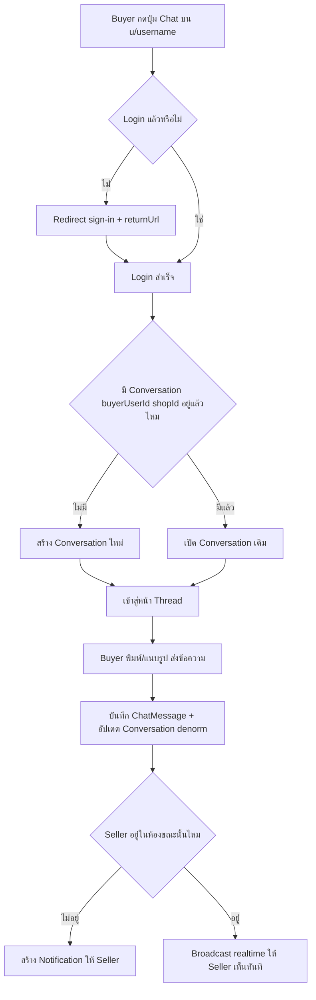
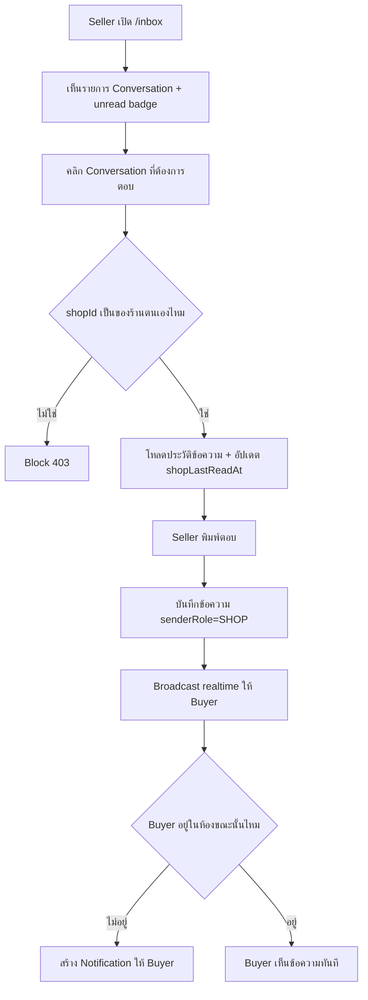
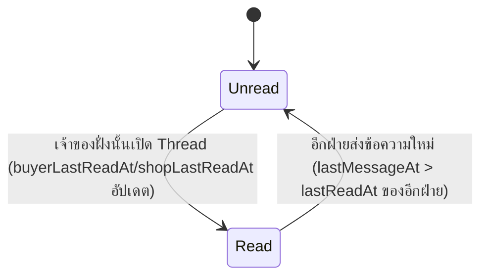

> **โมดูล:** M00011-DeepChat
> **ประเภทเอกสาร:** Business Requirements Document (BRD) — NON-TECHNICAL
> **เวอร์ชัน:** 1.0
> **วันที่จัดทำ:** 2026-07-03
> **สถานะ:** Draft — อิง Design Spec ที่ approve แล้ว, รอ sign-off ก่อนเข้า SRS
> **เจ้าของเอกสาร:** BA (ดู [[Feature-Docs-Ownership]])

# BRD: Deep Chat (Business Requirements Document)

---

## 1. บทนำ

### 1.1 วัตถุประสงค์ของเอกสาร

1. กำหนด Functional Requirements ระดับ non-technical สำหรับฟีเจอร์แชทในแอประหว่าง buyer กับ seller แบบ shop-anchored
2. กำหนดกฎการเริ่มบทสนทนา (buyer-initiate only), ข้อจำกัดเนื้อหาข้อความ, กฎ rate-limit/anti-spam, และเงื่อนไขการแจ้งเตือน
3. ระบุเงื่อนไขการรับงาน (Acceptance Criteria) แบบ Given/When/Then สำหรับทีม QA — โดยเฉพาะ scope ownership (ใครเห็นบทสนทนาไหนได้) และ zero-regression บนหน้าโปรไฟล์สาธารณะ/notification เดิม
4. สร้างความเข้าใจร่วมกันระหว่างทีมธุรกิจและทีมพัฒนาก่อนเริ่ม implement

### 1.2 ขอบเขตของระบบ

**Deep Chat** คือระบบแชทในแอปแบบ 1 บทสนทนาต่อคู่ (buyer, shop) ที่ buyer เป็นผู้เริ่มได้เท่านั้น รองรับข้อความ TEXT และ IMAGE (1 รูป/ข้อความ) realtime ผ่าน Supabase broadcast ทำงานบน 2 surface: buyer เว็บ (Vuexy `/messages`) และ seller เว็บ (Paces `/inbox`) เจ้าของร้าน (`Shop.userId`) เป็นผู้ตอบฝั่ง seller เท่านั้นใน MVP

**เข้าสู่ระบบ (Input):** คำสั่งเริ่มบทสนทนา (จากปุ่ม Chat บนโปรไฟล์ร้าน); ข้อความ TEXT/IMAGE ที่ผู้ใช้พิมพ์/แนบ; คำสั่ง mark-read เมื่อเปิดอ่านบทสนทนา

**ออกจากระบบ (Output):** Conversation record ใหม่หรือที่มีอยู่แล้ว; ChatMessage ที่ถูกบันทึก + broadcast แบบ realtime; Notification สำหรับผู้รับที่ไม่ได้อยู่ในห้องขณะนั้น; รายการ inbox ที่อัปเดต preview/unread state

**ระบบที่เกี่ยวข้อง:** `Notification` model เดิม, Supabase Realtime (`supabase-browser.ts`), `lib/storage` (อัปโหลดรูป), `api-rate-limit.ts`, หน้า `/u/[username]` (public profile), seller sidebar menu

### 1.3 กลุ่มผู้ใช้งาน

| กลุ่มผู้ใช้ | บทบาท | สิทธิ์การใช้งาน |
|-----------|--------|----------------|
| **Buyer (login แล้ว)** | ผู้เริ่มบทสนทนา, ผู้ส่ง/รับข้อความ | เห็นเฉพาะบทสนทนาที่ตนเองเป็น `buyerUserId`; เริ่มบทสนทนาใหม่กับร้านใดก็ได้ |
| **Buyer (ยังไม่ login)** | ไม่มีสิทธิ์แชท | คลิก Chat แล้ว redirect ไป sign-in |
| **Seller (เจ้าของร้าน)** | ผู้ตอบบทสนทนา | เห็นเฉพาะบทสนทนาที่ `shopId` เป็นของร้านตนเอง; ตอบได้เฉพาะบทสนทนาที่ buyer เริ่มไว้แล้ว |
| **Seller (ไม่ใช่เจ้าของร้าน / Business member)** | ไม่มีสิทธิ์ใน MVP | Phase 2 (Business member routing) |
| **Admin** | ไม่มีสิทธิ์เข้าถึงเนื้อหาบทสนทนา | นอกขอบเขต MVP |

---

## 2. ความต้องการหลัก (Functional Requirements)

### 2.1 การเริ่มบทสนทนา (Initiation & Identity)

#### FR-CHAT-01: Buyer เริ่มบทสนทนากับร้านค้า

**User Story:** ในฐานะ Buyer ที่ login แล้ว ฉันต้องการกดปุ่ม Chat บนโปรไฟล์ร้านแล้วเข้าสู่บทสนทนากับร้านนั้นได้ทันที เพื่อสอบถามสินค้าก่อนตัดสินใจซื้อโดยไม่ต้องออกจาก Deep

**Acceptance Criteria:**
- [ ] `[FR-CHAT-01-AC-01]` **Given** Buyer login แล้วและยังไม่เคยมี Conversation กับร้านนั้น **When** กดปุ่ม Chat บน `/u/[username]` **Then** ระบบสร้าง Conversation ใหม่ผูกกับ (buyerUserId ปัจจุบัน, shopId ของร้านนั้น) แล้วพาเข้าสู่หน้า Thread
- [ ] `[FR-CHAT-01-AC-02]` **Given** Buyer เคยมี Conversation กับร้านนั้นอยู่แล้ว **When** กดปุ่ม Chat ซ้ำ **Then** ระบบเปิด Conversation เดิม ไม่สร้างใหม่ซ้ำ (unique (buyerUserId, shopId))
- [ ] `[FR-CHAT-01-AC-03]` **Given** Buyer ยังไม่ login **When** กดปุ่ม Chat **Then** ระบบ redirect ไปหน้า sign-in พร้อม returnUrl กลับมาที่บทสนทนาเดิมหลัง login สำเร็จ
- [ ] `[FR-CHAT-01-AC-04]` Server-side ต้อง validate ownership ของ `buyerUserId` เทียบ session เสมอ — bypass ผ่าน URL ตรง ๆ ไม่ได้

#### FR-CHAT-02: Seller ห้ามเริ่มบทสนทนาใหม่กับ Buyer ที่ไม่เคยทักมาก่อน

**User Story:** ในฐานะระบบ ฉันต้องไม่มีช่องทางให้ Seller เริ่มบทสนทนากับ Buyer ที่ไม่เคยทักร้านมาก่อน เพื่อป้องกันการใช้แชทเป็นเครื่องมือ spam/marketing

**Acceptance Criteria:**
- [ ] `[FR-CHAT-02-AC-01]` ไม่มี UI/API endpoint ใดให้ Seller สร้าง Conversation ใหม่กับ Buyer ที่ยังไม่มี Conversation อยู่ก่อน
- [ ] `[FR-CHAT-02-AC-02]` Seller ตอบกลับได้เฉพาะ Conversation ที่มีอยู่แล้วในระบบ (สร้างโดย Buyer เท่านั้น) และ `shopId` เป็นของร้านตนเอง

#### FR-CHAT-03: Seller = เจ้าของร้านเท่านั้น (Owner-only)

**User Story:** ในฐานะระบบ ฉันต้องอนุญาตให้เฉพาะเจ้าของร้าน (`Shop.userId`) เข้าถึง/ตอบบทสนทนาของร้านนั้นได้ใน MVP

**Acceptance Criteria:**
- [ ] `[FR-CHAT-03-AC-01]` **Given** Shop มีเจ้าของคนหนึ่ง **When** session user ไม่ตรงกับ `Shop.userId` พยายามเข้าถึง Conversation ของร้านนั้น **Then** ระบบ block ที่ server-side (403/ownership check)
- [ ] `[FR-CHAT-03-AC-02]` Business member (feature 00008) ที่ไม่ใช่เจ้าของร้านไม่มีสิทธิ์เข้าถึงแชท — สืบทอด Out of Scope §7 PRD

---

### 2.2 การส่งข้อความ (Messaging Content)

#### FR-CHAT-04: ส่งข้อความ TEXT

**User Story:** ในฐานะผู้ใช้ (Buyer หรือ Seller) ฉันต้องการพิมพ์ข้อความส่งในบทสนทนา เพื่อสื่อสารกับอีกฝ่าย

**Acceptance Criteria:**
- [ ] `[FR-CHAT-04-AC-01]` **Given** เป็นคู่สนทนาที่ถูกต้องของ Conversation **When** ส่งข้อความ TEXT ที่ไม่เกินความยาวสูงสุดที่กำหนด **Then** บันทึกข้อความ, อัปเดต `lastMessageAt`/`lastMessagePreview`/`lastSenderRole` ของ Conversation, broadcast แบบ realtime ให้อีกฝ่าย
- [ ] `[FR-CHAT-04-AC-02]` **Given** ข้อความ TEXT ว่างเปล่าหรือเกินความยาวสูงสุด **When** พยายามส่ง **Then** ระบบปฏิเสธพร้อม error message
- [ ] `[FR-CHAT-04-AC-03]` `senderRole` ("BUYER"/"SHOP") ถูก derive จาก Conversation ตอนส่งเสมอ (snapshot กัน role drift ภายหลัง)

#### FR-CHAT-05: ส่งข้อความ IMAGE

**User Story:** ในฐานะผู้ใช้ ฉันต้องการแนบรูปภาพ 1 รูปในข้อความ เพื่ออธิบายสินค้า/ปัญหาได้ชัดเจนกว่าตัวอักษรอย่างเดียว

**Acceptance Criteria:**
- [ ] `[FR-CHAT-05-AC-01]` **Given** ไฟล์รูปภาพผ่านเงื่อนไขขนาด/ประเภทที่กำหนด (ตามข้อจำกัดเดียวกับระบบอัปโหลดรูปที่มีอยู่) **When** ส่งข้อความประเภท IMAGE **Then** บันทึก `imageUrl` และแสดงผลในบทสนทนา
- [ ] `[FR-CHAT-05-AC-02]` **Given** ไฟล์เกินขนาด หรือประเภทไฟล์ไม่รองรับ **When** พยายามแนบ **Then** ระบบปฏิเสธพร้อม error message ก่อนบันทึก
- [ ] `[FR-CHAT-05-AC-03]` 1 ข้อความมีได้สูงสุด 1 รูป — ไม่รองรับ multi-image ในข้อความเดียว

#### FR-CHAT-06: Rate-limit การส่งข้อความ (Anti-spam)

**User Story:** ในฐานะระบบ ฉันต้องจำกัดความถี่การส่งข้อความต่อผู้ใช้ เพื่อป้องกันการสแปมบทสนทนา

**Acceptance Criteria:**
- [ ] `[FR-CHAT-06-AC-01]` **Given** ผู้ใช้ส่งข้อความเกินอัตราที่กำหนดภายในช่วงเวลาที่กำหนด **When** ส่งข้อความเพิ่ม **Then** ระบบปฏิเสธชั่วคราวพร้อม error message (reuse `api-rate-limit.ts`)
- [ ] `[FR-CHAT-06-AC-02]` Rate-limit นับแยกต่อผู้ใช้ ไม่กระทบผู้ใช้อื่นที่ไม่เกี่ยวข้อง

---

### 2.3 Buyer Surface (Inbox + Thread)

#### FR-CHAT-07: Buyer Inbox — รายการบทสนทนาทั้งหมด

**User Story:** ในฐานะ Buyer ฉันต้องการเห็นรายการบทสนทนาทั้งหมดของฉันเรียงตามข้อความล่าสุด เพื่อกลับไปคุยต่อกับร้านที่เคยทักไว้ได้ง่าย

**Acceptance Criteria:**
- [ ] `[FR-CHAT-07-AC-01]` **Given** Buyer login แล้ว **When** เปิดหน้า Inbox (`/messages`) **Then** เห็นเฉพาะ Conversation ที่ตนเองเป็น `buyerUserId` เรียงจาก `lastMessageAt` ล่าสุดไปเก่าสุด
- [ ] `[FR-CHAT-07-AC-02]` แต่ละแถวแสดง preview ข้อความล่าสุด (`lastMessagePreview`) พร้อม prefix "คุณ:" ถ้า `lastSenderRole=BUYER`
- [ ] `[FR-CHAT-07-AC-03]` Conversation ที่มีข้อความใหม่กว่า `buyerLastReadAt` แสดงสถานะ unread ต่างจากที่อ่านแล้ว

#### FR-CHAT-08: Buyer Thread — ดู/ส่งข้อความ + Realtime

**User Story:** ในฐานะ Buyer ฉันต้องการเปิดบทสนทนากับร้านหนึ่งเพื่ออ่านข้อความทั้งหมดและส่งข้อความใหม่ โดยเห็นข้อความของ Seller แบบ realtime ถ้ากำลังเปิดหน้าอยู่

**Acceptance Criteria:**
- [ ] `[FR-CHAT-08-AC-01]` เปิด Thread แล้วโหลดประวัติข้อความแบบแบ่งหน้า (cursor-based) เรียงเวลาเก่า→ใหม่
- [ ] `[FR-CHAT-08-AC-02]` **Given** เปิด Thread ค้างไว้ **When** Seller ส่งข้อความใหม่ **Then** ข้อความปรากฏโดยไม่ต้องรีเฟรชหน้า (subscribe channel `chat:{conversationId}`) — ถ้า broadcast ไม่ทำงาน fallback ดึงข้อมูลใหม่เมื่อกลับมา focus หน้าจอ
- [ ] `[FR-CHAT-08-AC-03]` เปิด Thread แล้ว `buyerLastReadAt` ถูกอัปเดตเป็นเวลาปัจจุบัน (mark read)

---

### 2.4 Seller Surface (Inbox + Thread)

#### FR-CHAT-09: Seller Inbox — รายการบทสนทนาของร้าน + Unread Badge

**User Story:** ในฐานะ Seller (เจ้าของร้าน) ฉันต้องการเห็นรายการบทสนทนาทั้งหมดของร้านฉันพร้อมจำนวนที่ยังไม่ได้อ่าน เพื่อตอบลูกค้าได้ทันเวลา

**Acceptance Criteria:**
- [ ] `[FR-CHAT-09-AC-01]` **Given** Seller login แล้ว **When** เปิดหน้า Inbox (`/inbox`) **Then** เห็นเฉพาะ Conversation ที่ `shopId` เป็นของร้านตนเอง เรียงจาก `lastMessageAt` ล่าสุด
- [ ] `[FR-CHAT-09-AC-02]` เมนู seller dashboard แสดง unread badge (จำนวน Conversation ที่มีข้อความใหม่กว่า `shopLastReadAt`)
- [ ] `[FR-CHAT-09-AC-03]` Shop ที่ไม่เคยมี Conversation ใดเลย ไม่เห็น unread badge และเมนู Inbox แสดงสถานะว่าง (empty state) ไม่ error

#### FR-CHAT-10: Seller Thread — ตอบกลับ + Realtime

**User Story:** ในฐานะ Seller ฉันต้องการเปิดบทสนทนาหนึ่งเพื่ออ่านและตอบกลับ Buyer โดยเห็นข้อความใหม่แบบ realtime

**Acceptance Criteria:**
- [ ] `[FR-CHAT-10-AC-01]` เปิด Thread แล้วโหลดประวัติข้อความแบบแบ่งหน้าเหมือน FR-CHAT-08
- [ ] `[FR-CHAT-10-AC-02]` ส่งข้อความตอบกลับได้เฉพาะ Conversation ที่ `shopId` เป็นของร้านตนเอง (สืบทอด FR-CHAT-03)
- [ ] `[FR-CHAT-10-AC-03]` เปิด Thread แล้ว `shopLastReadAt` ถูกอัปเดตเป็นเวลาปัจจุบัน
- [ ] `[FR-CHAT-10-AC-04]` Toast แจ้งผลการส่ง/error ใช้ `pacesToast` เท่านั้น (Hard Rule 9) — ห้าม `react-toastify`/`alert()`

---

### 2.5 การแจ้งเตือน (Notification)

#### FR-CHAT-11: แจ้งเตือนผู้รับที่ไม่ได้อยู่ในห้องสนทนา

**User Story:** ในฐานะผู้ใช้ (Buyer หรือ Seller) ฉันต้องการได้รับการแจ้งเตือนเมื่อมีข้อความใหม่เข้ามาขณะที่ฉันไม่ได้เปิดหน้าบทสนทนานั้นอยู่ เพื่อไม่พลาดข้อความ

**Acceptance Criteria:**
- [ ] `[FR-CHAT-11-AC-01]` **Given** ผู้ส่งข้อความไม่ใช่ตัวเอง และผู้รับไม่ได้ subscribe อยู่ในห้องสนทนานั้น ณ ขณะส่ง **When** ข้อความถูกบันทึกสำเร็จ **Then** สร้าง `Notification` (`kind="chat_message"`, `refId=conversationId`, `userId`=ผู้รับ)
- [ ] `[FR-CHAT-11-AC-02]` Seller ที่เปิด dashboard อยู่ (ไม่ได้อยู่ในห้องสนทนานั้น) เห็นแจ้งเตือนแบบ `pacesToast.chat.*` (bottom-right ตาม Hard Rule 9) นอกเหนือจาก bell notification
- [ ] `[FR-CHAT-11-AC-03]` ไม่มี mobile push notification ใน MVP (web-only — สืบทอด Out of Scope PRD §5)

---

### 2.6 เปิดใช้งานปุ่ม Chat บนโปรไฟล์สาธารณะ

#### FR-CHAT-12: ปุ่ม Chat บน `/u/[username]` ใช้งานได้จริง

**User Story:** ในฐานะ Buyer ที่เข้าดูโปรไฟล์ร้านค้า ฉันต้องการกดปุ่ม Chat ที่เคย disabled แล้วเข้าสู่บทสนทนากับร้านนั้นได้จริง

**Acceptance Criteria:**
- [ ] `[FR-CHAT-12-AC-01]` ปุ่ม "Chat" บน `/u/[username]` (เดิม disabled พร้อม tooltip "เร็ว ๆ นี้") เปลี่ยนเป็น active — คลิกแล้วเรียก FR-CHAT-01
- [ ] `[FR-CHAT-12-AC-02]` ปุ่ม Follow บนหน้าเดียวกันยังคง disabled ตามเดิม (คนละฟีเจอร์ — สืบทอด Out of Scope PRD §5)
- [ ] `[FR-CHAT-12-AC-03]` หน้า `/u/[username]` ที่เหลือ (trust banner, badge, product grid, rating) ไม่มี behavior change ที่ไม่ตั้งใจ

---

## 3. Acceptance Criteria สรุป

### 3.1 Initiation & Identity
- Buyer login แล้วเริ่มบทสนทนาใหม่หรือเปิดของเดิมได้ถูกต้อง (1 คู่ = 1 conversation)
- Buyer ที่ยังไม่ login ถูก redirect ไป sign-in และกลับมาที่บทสนทนาเดิมได้
- Seller ตอบได้เฉพาะ Conversation ที่มีอยู่แล้ว ไม่มีช่องทางเริ่มบทสนทนาใหม่ฝั่ง seller
- Server-side บังคับ scope ownership ทุก endpoint

### 3.2 Messaging Content
- ส่ง TEXT/IMAGE ได้ตามข้อจำกัด (ความยาว/ขนาด/ประเภทไฟล์)
- Rate-limit ป้องกันการส่งถี่เกินไป

### 3.3 Buyer & Seller Surface
- Buyer/Seller เห็นเฉพาะบทสนทนาของตนเอง เรียงตามล่าสุด
- Realtime delivery ทำงาน (หรือ fallback fetch-on-focus)
- Mark-read อัปเดตถูกต้องแยกฝั่ง buyer/shop

### 3.4 Notification & Profile Integration
- ผู้รับที่ไม่ได้อยู่ในห้องได้รับ Notification ถูกต้อง
- ปุ่ม Chat บนโปรไฟล์สาธารณะใช้งานได้จริง ไม่กระทบส่วนอื่นของหน้า

---

## 4. Business Flows (กระบวนการทำงาน)

### 4.1 Flow หลัก: Buyer เริ่มบทสนทนา → ส่งข้อความ → Seller รับแจ้งเตือน

### 4.2 Flow: Seller ตอบกลับจาก Inbox

### 4.3 State ของการอ่าน (Read State ระดับ Conversation)

---

## 5. Use Case Scenarios

### Scenario 1: Best Case — Buyer สอบถามสินค้า Seller ตอบทันที

**ผู้เกี่ยวข้อง:** Buyer, Seller (เจ้าของร้าน)

**เงื่อนไขเริ่มต้น:** Buyer login แล้ว, ยังไม่เคยทักร้านนี้มาก่อน, Seller เปิด `/inbox` ค้างไว้

**ขั้นตอน:**
1. Buyer เข้า `/u/shopname` กดปุ่ม Chat
2. ระบบสร้าง Conversation ใหม่ พาเข้า Thread
3. Buyer พิมพ์ "มีไซส์ M ไหมคะ" ส่ง
4. Seller เห็นข้อความ realtime ใน `/inbox` (มีอยู่แล้ว ไม่ต้องรีเฟรช)
5. Seller เปิด Thread ตอบ "มีค่ะ พร้อมส่ง"
6. Buyer เห็นคำตอบ realtime

**ผลลัพธ์:** บทสนทนาเสร็จสมบูรณ์ ไม่มี guest chat, ไม่มีการหลุดออกจาก Deep

### Scenario 2: Buyer ยังไม่ Login กด Chat

**ผู้เกี่ยวข้อง:** Buyer (ไม่ login)

**เงื่อนไขเริ่มต้น:** ผู้เข้าชม `/u/shopname` ยังไม่มี session

**ขั้นตอน:**
1. กดปุ่ม Chat
2. ระบบ redirect ไปหน้า sign-in พร้อม returnUrl กลับมาที่ chat กับร้านนี้
3. Login สำเร็จ (OTP หรือ Facebook)
4. ระบบพากลับมาเปิด/สร้าง Conversation กับร้านนั้นทันที

**ผลลัพธ์:** ไม่มี guest chat เกิดขึ้น — บังคับ identity ก่อนเข้าห้องเสมอ

### Scenario 3: Edge Case — Buyer กดปุ่ม Chat ซ้ำหลายครั้งกับร้านเดิม

**ผู้เกี่ยวข้อง:** Buyer

**เงื่อนไขเริ่มต้น:** Buyer เคยมี Conversation กับร้าน A อยู่แล้ว (5 ข้อความ)

**ขั้นตอน:**
1. Buyer กลับไปหน้า `/u/shopA` อีกครั้งในวันถัดมา
2. กดปุ่ม Chat ซ้ำ

**ผลลัพธ์:** ระบบเปิด Conversation เดิม (5 ข้อความเดิมยังอยู่ครบ) ไม่สร้างแถวใหม่ซ้ำ (`@@unique([buyerUserId, shopId])` กันไว้)

### Scenario 4: Regression Check — Shop ที่ไม่เคยถูกทักแชท

**ผู้เกี่ยวข้อง:** Seller ร้านที่ไม่เคยมีใครทัก

**เงื่อนไขเริ่มต้น:** Shop ไม่มี Conversation ใดในระบบเลย

**ขั้นตอน:**
1. Seller login เข้า dashboard
2. เปิดเมนู `/inbox`

**ผลลัพธ์:** เห็นหน้าว่าง (empty state) ไม่มี error, เมนูอื่น (orders/products/dashboard) ทำงานเหมือนเดิมทุกประการ ไม่มี field/latency ใหม่ปรากฏในหน้าที่ไม่เกี่ยวข้อง

### Scenario 5: Seller พยายามเข้าถึง Conversation ของร้านอื่น (Security)

**ผู้เกี่ยวข้อง:** Seller B (ไม่ใช่เจ้าของร้าน A)

**เงื่อนไขเริ่มต้น:** มี Conversation ระหว่าง Buyer X กับ Shop A

**ขั้นตอน:**
1. Seller B (เจ้าของร้าน B) พยายามเรียก API `GET /api/chat/conversations/{conversationId ของร้าน A}/messages` ตรง ๆ

**ผลลัพธ์:** ระบบ block ที่ server-side (403) — ไม่ leak เนื้อหาบทสนทนาของร้านอื่น

---

## 6. ความต้องการด้านคุณภาพ (Quality Requirements)

### 6.1 ความถูกต้องของข้อมูล
- Conversation ต้องไม่มีคู่ (buyerUserId, shopId) ซ้ำกันในระบบเด็ดขาด (DB unique constraint)
- `lastMessagePreview`/`lastSenderRole`/`lastMessageAt` ต้อง sync ตรงกับ ChatMessage ล่าสุดจริงเสมอ (อัปเดตใน transaction เดียวกับการ insert ข้อความ)

### 6.2 ความรวดเร็ว
- ข้อความ broadcast ต้องปรากฏฝั่งตรงข้ามภายในเวลาที่ผู้ใช้รู้สึกว่า "ทันที" (realtime) เมื่อทั้งสองฝ่ายเปิดหน้าค้างไว้
- การโหลดประวัติข้อความต้องแบ่งหน้า (cursor) ไม่โหลดทั้งบทสนทนาทีเดียวเมื่อมีข้อความจำนวนมาก

### 6.3 ความน่าเชื่อถือ
- Realtime ล้มเหลว (Supabase connection ขาด) ต้องมี fallback fetch-on-focus ไม่ทำให้ข้อความหาย
- Rate-limit ต้องทำงานสม่ำเสมอไม่ว่า traffic จะสูงแค่ไหน (in-memory per-instance เป็น known-gap เดียวกับระบบเดิม — Redis = Phase 2)

### 6.4 ความปลอดภัย
- ทุก endpoint ต้อง scope ownership ที่ server-side (bypass URL ตรง ๆ ไม่ได้)
- ข้อความ/รูปภาพ (PII) ต้อง neutralize-at-source ก่อน serialize เข้า RSC flight (pattern เดียวกับที่แก้ปัญหา order detail PII leak)
- Buyer ต้อง login ก่อนส่งข้อความแรกเสมอ — ไม่มี endpoint ใดให้ guest ส่งข้อความได้

### 6.5 ความสะดวกในการใช้งาน (Usability)
- ข้อความ error ชัดเจนเมื่อส่งไม่สำเร็จ (rate-limit / เนื้อหาไม่ผ่านเงื่อนไข / ไม่มีสิทธิ์)
- Empty state ของ Inbox (ทั้งฝั่ง buyer ที่ยังไม่เคยทักใคร และฝั่ง seller ที่ยังไม่เคยถูกทัก) ต้องสื่อสารชัดเจน ไม่ใช่หน้าเปล่า

---

## 7. ข้อจำกัด (Constraints)

### 7.1 ข้อจำกัดทางธุรกิจ
- ไม่มี billing/subscription ผูกกับการใช้งานแชท
- Buyer-initiate-only — ไม่มีทางให้ seller เริ่มบทสนทนาใหม่ใน MVP
- Owner-only ฝั่ง seller — ไม่รองรับ Business member ตอบแทน

### 7.2 ข้อจำกัดทางเทคนิค
- Web-only surface (Vuexy buyer / Paces seller) — ไม่มี mobile API/push ใน MVP
- Realtime พึ่ง Supabase broadcast-from-DB (ไม่ใช่ persistent server socket) — Vercel serverless known-gap เดียวกับระบบประมูล
- ข้อความจำกัดที่ TEXT/IMAGE (1 รูป/ข้อความ) เท่านั้น

---

## 8. กฎทางธุรกิจ (Business Rules)

### 8.1 Identity & Initiation
- **BR-CHAT-01 (Login Required):** Buyer ต้อง login ก่อนส่งข้อความแรกเสมอ — ไม่มี guest chat
- **BR-CHAT-02 (Shop-anchored, 1 Conversation/คู่):** บทสนทนาผูกกับคู่ (buyerUserId, shopId) — 1 คู่มีได้ 1 conversation เท่านั้น (`@@unique`)
- **BR-CHAT-03 (Buyer-initiate Only):** Seller เริ่มบทสนทนาใหม่กับ Buyer ที่ไม่เคยทักมาก่อนไม่ได้
- **BR-CHAT-04 (Owner-only Seller):** ฝั่ง seller = เจ้าของร้าน (`Shop.userId`) เท่านั้นที่อ่าน/ตอบได้ใน MVP — Business member routing = Phase 2

### 8.2 Messaging Content
- **BR-CHAT-05 (Type Constraint):** ข้อความเป็น TEXT หรือ IMAGE เท่านั้น — 1 รูปต่อ 1 ข้อความ
- **BR-CHAT-06 (Length/Size Cap):** TEXT มีความยาวสูงสุดที่กำหนด; IMAGE จำกัดขนาด/ประเภทไฟล์ตามเงื่อนไขเดียวกับระบบอัปโหลดที่มีอยู่
- **BR-CHAT-07 (Rate-limit):** จำกัดความถี่การส่งข้อความต่อผู้ใช้ (reuse `api-rate-limit.ts`)

### 8.3 Notification & Read State
- **BR-CHAT-08 (Notification on Offline Recipient):** สร้าง `Notification` เมื่อผู้รับไม่ได้อยู่ในห้องสนทนาขณะข้อความมาถึง
- **BR-CHAT-09 (Read State ระดับ Conversation):** อ่านล่าสุดบันทึกที่ระดับบทสนทนา (`buyerLastReadAt`/`shopLastReadAt`) ไม่ใช่ต่อข้อความ
- **BR-CHAT-10 (No Mobile Push):** ไม่มี push notification บนมือถือใน MVP

### 8.4 Safety Scope Decisions
- **BR-CHAT-11 (Block/Report — Deferred):** ฟีเจอร์บล็อก/รายงานผู้ใช้ในบทสนทนาไม่อยู่ใน MVP build scope (Assumption — ยังไม่ใช่ decision ที่ล็อก ดู PRD §9.2)
- **BR-CHAT-12 (Scam-link Detection — Phase 2):** ไม่ตรวจจับลิงก์หลอกลวงในข้อความใน MVP

---

## 9. อภิธานศัพท์ (Glossary)

| คำศัพท์ | ความหมาย |
|---------|----------|
| **Conversation** | บทสนทนา 1 ห้อง ผูกกับคู่ (buyerUserId, shopId) หนึ่งคู่ |
| **ChatMessage** | ข้อความ 1 รายการในบทสนทนา — TEXT หรือ IMAGE |
| **senderRole** | บทบาทผู้ส่ง ("BUYER"/"SHOP") snapshot ไว้ตอนส่งข้อความ กัน role drift |
| **Broadcast-from-DB** | Insert ลง DB แล้ว broadcast ผ่าน Supabase channel ให้ client subscribe รับรู้ realtime |
| **Owner-only** | เจ้าของร้าน (`Shop.userId`) เท่านั้นที่มีสิทธิ์ตอบแชทฝั่ง seller ใน MVP |

---

## 10. Open Decisions ที่ต้อง Confirm ก่อนเข้า SRS

| # | เรื่อง | สถานะปัจจุบัน | ทางเลือก |
|---|------|----------------|---------|
| **OD-CHAT-A** | Block/Report ผู้ใช้ในบทสนทนา | **สมมติ defer ไป Phase 2** (design spec ทิ้งเป็นตัวเลือก ไม่ใช่ decision ล็อก) | (1) Defer ไป Phase 2 [assumed] (2) เพิ่ม `blockedByBuyer`/`blockedByShop` field เข้า MVP |

> D1-D7 อื่นทั้งหมด (anchor/surface/identity/message-type/realtime/seller-side/initiation) **ล็อกแล้ว** ตาม Design Spec — ไม่เปิดใหม่ในเอกสารนี้

---

**หมายเหตุ:**
สำหรับความต้องการทางธุรกิจระดับภาพรวม/personas/KPI ดู [[PRD]]
สำหรับ technical specification (architecture/API/data/NFR) ดู [[SRS]] (ยังไม่เริ่ม — รอ sign-off PRD/BRD ตาม Hard Rule 11)
