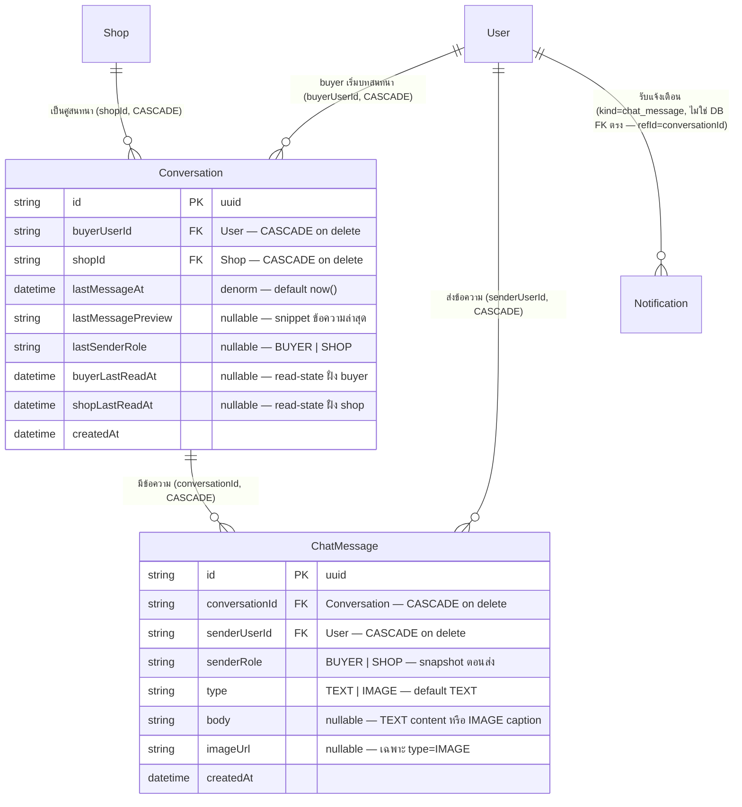

> **โมดูล:** M00011-DeepChat
> **ประเภทเอกสาร:** DATABASE Design
> **เวอร์ชัน:** 1.0
> **วันที่จัดทำ:** 2026-07-03
> **สถานะ:** Draft — schema แก้แล้วใน `prisma/schema.prisma` + migration file เขียนแล้ว (ยังไม่ apply ลง DB) รอ SRS/SDS ยืนยัน contract ก่อน build routes/service
> **เจ้าของเอกสาร:** SA/Database Agent (ดู [[Feature-Docs-Ownership]])

# DATABASE: Deep Chat

---

## 0. 🛑 สถานะการ apply (สำคัญ — อ่านก่อน)

- `prisma/schema.prisma` ถูกแก้แล้ว (model `Conversation`, `ChatMessage` + back-relation) — `npx prisma validate` ผ่าน
- Migration file เขียนแล้วที่ `prisma/migrations/20260703000300_add_deep_chat_schema/migration.sql` (hand-written, additive-only)
- **ยังไม่รัน `prisma migrate deploy` จริง** — Supabase dev=prod แชร์กัน (`docs/conventions/prisma-shared-db-drift.md` + memory `project_shared_db_drift_no_migrate_dev`) ต้องขอ user ยืนยันก่อน apply ทุกครั้ง
- **ห้าม `prisma migrate dev`** เด็ดขาด (DB มี orphaned migration นอก git — จะเสนอ `migrate reset` ลบข้อมูลทั้ง DB) — ใช้ `migrate deploy` เท่านั้น
- **ห้าม `prisma db pull`** เด็ดขาด (memory `feedback_qa_agent_no_prisma_pull`)

---

## 1. Overview

Deep Chat (M00011) เพิ่ม in-app chat แบบ shop-anchored (1 conversation ต่อคู่ `buyerUserId`+`shopId`) buyer-initiate only, รองรับข้อความ TEXT/IMAGE, realtime ผ่าน Supabase broadcast-from-DB — เอกสารนี้ตั้ง schema 2 table ใหม่ทั้งหมด (**ไม่มี table ใดถูก drop/rename, ไม่มี column เดิมถูกแก้ type/ลบ**)

- **เอกสารออกแบบต้นทาง:** Design Spec (APPROVED) `docs/superpowers/specs/2026-07-03-deep-chat-design.md` §3 (schema ระบุครบ) + `docs/20 - Features/00011 - Deep Chat/BRD.md` FR-CHAT-01..12, BR-CHAT-01..12. SRS/SDS ของโมดูลนี้ยังไม่เริ่ม (รอ PRD/BRD sign-off ตาม Hard Rule 11) — เอกสารนี้ตั้ง **FROZEN CONTRACT** ให้ SRS ยึดตาม (ชื่อ model/field ห้ามเปลี่ยนโดยไม่ sync กลับมาที่นี่)
- **Store ที่เกี่ยวข้อง:** PostgreSQL 16 host บน Supabase (DB เดียวสำหรับ dev + prod)
- **ORM:** Prisma (`prisma/schema.prisma`); migration tool = `prisma migrate deploy` + hand-written migration file (**ห้าม `migrate dev`**)
- **ไม่ใช้ RLS:** authorization อยู่ที่ `src/services/` (NextAuth session + service guard scope-by-ownership) ไม่ใช้ policy ใน DB — ทุก endpoint ต้อง scope ที่ WHERE clause (`buyerUserId`/`shopId` เทียบ session เสมอ, memory `feedback_rsc_dal_authz`)

### สิ่งที่ต้องเปลี่ยนแปลง (สรุปภาพรวม)

| Model | การเปลี่ยนแปลง | ประเภท |
|-------|----------------|--------|
| `Conversation` (ใหม่) | table ใหม่ — 1 ห้องต่อคู่ (buyerUserId, shopId), denorm last-message snapshot สำหรับ inbox list | New |
| `ChatMessage` (ใหม่) | table ใหม่ — ข้อความ TEXT/IMAGE, append-only | New |
| `User` (มีอยู่แล้ว) | เพิ่ม back-relation `buyerConversations`, `sentChatMessages` | Additive (relation only, ไม่มี DDL) |
| `Shop` (มีอยู่แล้ว) | เพิ่ม back-relation `conversations` | Additive (relation only, ไม่มี DDL) |
| `Notification` (มีอยู่แล้ว) | **ไม่แก้ schema** — reuse `kind` (TEXT, ไม่ constrain) ค่าใหม่ `"chat_message"` + `refId=conversationId` ที่ app layer | No DDL change |

### สิ่งที่ตรวจสอบแล้วว่าไม่ต้องสร้าง table ใหม่/ไม่ต้องแก้เพิ่ม

| ความต้องการ | Derivation |
|-------------|-----------|
| แจ้งเตือนผู้รับที่ offline (FR-CHAT-11, BR-CHAT-08) | reuse `Notification` เดิม 100% — `kind="chat_message"`, `refId=conversationId`, `userId`=ผู้รับ. ไม่ต้องมี column ใหม่บน `Notification` เพราะ `kind` เป็น `String` (ไม่ใช่ enum) รับค่าใหม่ได้โดยไม่มี DDL |
| Rate-limit ส่งข้อความ (BR-CHAT-07) | reuse `src/lib/api-rate-limit.ts` (in-memory per-instance, pattern เดิมจาก CSRF/RL feature 2026-06-06) — ไม่ต้องมีตารางเก็บ counter ใน DB |
| Read-state ต่อ "ห้อง" ไม่ใช่ต่อข้อความ (BR-CHAT-09) | `Conversation.buyerLastReadAt`/`shopLastReadAt` 2 field พอ — ไม่ต้องมี table แยก per-message-read-receipt (นั้นเป็น OOS-5 ตาม scope baseline) |
| IMAGE attachment | reuse `lib/storage` upload route เดิม (pattern เดียวกับ verification document/product image) — `ChatMessage.imageUrl` เก็บแค่ URL ที่ได้กลับมา ไม่มี table แยกสำหรับไฟล์ |
| senderRole กัน role drift (FR-CHAT-04-AC-03) | เก็บเป็น `String` column บน `ChatMessage` โดยตรง (snapshot ตอนส่ง) — ไม่ต้อง derive จาก join `Conversation` ทุกครั้งที่ query |

---

## 2. ERD



---

## 3. Tables

### 3.1 `Conversation` (PostgreSQL 16, Supabase — ใหม่)

1 ห้องบทสนทนาต่อคู่ (`buyerUserId`, `shopId`) — shop-anchored ตาม D1 ของ Design Spec, buyer-initiate only (BR-CHAT-03: ไม่มี endpoint ให้ seller สร้างแถวนี้ได้)

| Column | Type | Null | Default | Key | หมายเหตุ |
|--------|------|------|---------|-----|---------|
| `id` | `TEXT` | NO | `uuid()` (client-side, Prisma) | PK | uuid ตาม convention เดิมของระบบ (ไม่ใช่ DB-side `gen_random_uuid()`) |
| `buyerUserId` | `TEXT` | NO | — | FK, UNIQUE(composite), INDEX(composite) | อ้าง `User.id`; `ON DELETE CASCADE` — ลบ user = ลบบทสนทนาที่ user นั้นเป็น buyer (ไม่มี business rule ให้เก็บ orphan) |
| `shopId` | `TEXT` | NO | — | FK, UNIQUE(composite), INDEX(composite) | อ้าง `Shop.id`; `ON DELETE CASCADE` — ลบ shop = ลบบทสนทนาของร้านนั้น (สอดคล้อง `StockMovement.shopId` pattern เดิมของ feature 00009) |
| `lastMessageAt` | `TIMESTAMP(3)` | NO | `CURRENT_TIMESTAMP` | INDEX(composite) | denormalized — sync ใน transaction เดียวกับ `ChatMessage` insert เสมอ (`sendMessage()`, ห้ามอัปเดตแยก — BRD §6.1 "ความถูกต้องของข้อมูล") ใช้เรียง inbox ล่าสุดก่อน |
| `lastMessagePreview` | `TEXT` | YES | NULL | — | snippet ข้อความล่าสุดสำหรับ inbox list (กันต้อง join `ChatMessage` ทุกครั้งที่ render inbox) — ค่า `"[รูปภาพ]"` ถ้าข้อความล่าสุดเป็น `type=IMAGE` ไม่มี `body` (ตัดสินใจที่ app layer/service ไม่ใช่ DB) |
| `lastSenderRole` | `TEXT` | YES | NULL | — | `"BUYER"` \| `"SHOP"` — ใช้แสดง prefix "คุณ: " ที่แถว inbox เมื่อผู้ใช้ปัจจุบันเป็นฝั่งที่ส่งข้อความล่าสุด (FR-CHAT-07-AC-02) |
| `buyerLastReadAt` | `TIMESTAMP(3)` | YES | NULL | — | read-state ระดับห้อง ฝั่ง buyer (BR-CHAT-09) — `NULL`=ยังไม่เคยเปิดอ่าน; unread เมื่อ `lastMessageAt > buyerLastReadAt` |
| `shopLastReadAt` | `TIMESTAMP(3)` | YES | NULL | — | read-state ระดับห้อง ฝั่ง shop (owner-only, BR-CHAT-04) — logic เดียวกับข้างบน แยกฝั่ง |
| `createdAt` | `TIMESTAMP(3)` | NO | `CURRENT_TIMESTAMP` | — | เวลาที่บทสนทนาถูกสร้างครั้งแรก (immutable — ไม่มี `updatedAt` เพราะ mutation ทั้งหมดของแถวนี้คือ denorm field ที่มี semantic ชัดเจนอยู่แล้วผ่าน `lastMessageAt`) |

**ทำไม `@@unique([buyerUserId, shopId])` ไม่ใช่ unique เดี่ยวบน column ใดตัวหนึ่ง:** business rule คือ "1 คู่ (buyer, shop) มีได้ 1 conversation เท่านั้น" (BR-CHAT-02) ไม่ใช่ "1 buyer มีได้ 1 conversation" (ผิด — buyer คุยได้หลายร้าน) หรือ "1 shop มีได้ 1 conversation" (ผิด — shop คุยได้หลาย buyer) composite unique จึงถูกต้องตรง semantic เดียว และเป็น DB-level guard กัน race condition ที่ `getOrCreateConversation()` (2 request พร้อมกันจาก buyer เดิมกดปุ่ม Chat ซ้ำเร็ว ๆ — Prisma `P2002` แล้ว catch เพื่อ fallback หา existing row)

**ทำไมไม่ใช้ enum จริงสำหรับ `lastSenderRole`/`senderRole` (ต่างจาก `InventoryPackage` ของ feature 00009):** ค่า `"BUYER"`/`"SHOP"` เป็นค่าคงที่ทางความหมาย (role label) ไม่ใช่ state-machine ที่มี transition rule ซับซ้อนแบบ `InventoryEntitlementStatus` — เดินตาม convention เดิมของ `Order.status`/`Product.type` ที่เป็น `String` validate ที่ Valibot layer แทน ไม่เพิ่มความซับซ้อนของ enum migration (ต้อง `CREATE TYPE`/`ALTER TYPE ADD VALUE` ถ้าต้องขยายค่าในอนาคต เช่น Phase 2 Business member routing อาจต้องมี role ที่ 3)

### 3.2 `ChatMessage` (PostgreSQL 16, Supabase — ใหม่)

ข้อความ 1 รายการในบทสนทนา — TEXT หรือ IMAGE เท่านั้น (BR-CHAT-05, 1 รูป/ข้อความ) append-only (ไม่มี edit/delete ใน MVP — ไม่มี `updatedAt`, ไม่มี `deletedAt`)

| Column | Type | Null | Default | Key | หมายเหตุ |
|--------|------|------|---------|-----|---------|
| `id` | `TEXT` | NO | `uuid()` (client-side, Prisma) | PK | |
| `conversationId` | `TEXT` | NO | — | FK, INDEX(composite) | อ้าง `Conversation.id`; `ON DELETE CASCADE` — ลบห้อง = ลบข้อความทั้งหมดในห้องนั้น |
| `senderUserId` | `TEXT` | NO | — | FK | อ้าง `User.id`; `ON DELETE CASCADE` — ลบ user = ลบข้อความที่ user นั้นเคยส่ง (**ยอมรับ data-loss นี้** เพราะไม่มี business rule ให้เก็บข้อความของ user ที่ถูกลบทั้ง account — ต่างจาก order/review ที่ระบบยังไม่มี hard-delete user จริงในปัจจุบัน ความเสี่ยงนี้จึงต่ำ) |
| `senderRole` | `TEXT` | NO | — | — | `"BUYER"` \| `"SHOP"` — derive จาก `Conversation` ตอนส่งเสมอที่ service layer แล้ว snapshot ลง column นี้ (กัน role drift ถ้าอนาคตมี business-member routing เปลี่ยนบทบาทได้ — FR-CHAT-04-AC-03) ไม่ query join ย้อนกลับ `Conversation` เพื่อรู้ role ทุกครั้ง |
| `type` | `TEXT` | NO | `'TEXT'` | — | `"TEXT"` \| `"IMAGE"` — validate ที่ Valibot layer (SRS/API จะ lock ค่าที่ยอมรับ) |
| `body` | `TEXT` | YES | NULL | — | `type=TEXT`: เนื้อหาข้อความ (cap ความยาวสูงสุดที่ app layer, BR-CHAT-06 — design spec ตัวอย่าง 2000 ตัวอักษร รอ SRS lock ตัวเลขจริง); `type=IMAGE`: caption (optional, nullable ต่างจาก TEXT ที่ required) |
| `imageUrl` | `TEXT` | YES | NULL | — | เฉพาะ `type=IMAGE` — URL จาก `lib/storage` upload route เดิม (ไม่ใช่ DB FK — เหมือน `Product.images`/verification document pattern เดิม ที่เก็บ URL ตรง ไม่มี table ไฟล์แยก) |
| `createdAt` | `TIMESTAMP(3)` | NO | `CURRENT_TIMESTAMP` | INDEX(composite) | เวลาที่ส่งข้อความ — ใช้เรียง thread pagination (cursor-based, เก่า→ใหม่) |

**ทำไม `body` เป็น nullable แม้ `type=TEXT` (ไม่ใช่ NOT NULL):** DB ไม่บังคับ "TEXT ต้องมี body, IMAGE ต้องมี imageUrl" ด้วย CHECK constraint ในรอบนี้ — เดินตาม pattern เดิมของระบบที่ conditional-required-by-type validate ที่ Valibot/service layer เสมอ (เช่น `Order.shippingAddress` required-when-SHIPPED ก็ validate ที่ app layer ไม่ใช่ DB CHECK ข้าม column) เหตุผล: DB CHECK ข้าม 2 column แบบ conditional (`type='TEXT' → body NOT NULL`) ทำได้ใน Postgres แต่ Prisma schema ประกาศไม่ได้ (ต้องเขียน raw SQL แยกและ Prisma จะไม่รู้จัก เสี่ยง drift แบบเดียวกับ partial unique index ของ `Shop.userId` — ไม่คุ้มความซับซ้อนสำหรับ MVP นี้ที่มี Valibot คุมอยู่แล้วทุก endpoint)

**ทำไมไม่มี CHECK `body IS NOT NULL OR imageUrl IS NOT NULL` (กันข้อความว่างเปล่าทั้งคู่):** เหตุผลเดียวกับข้างบน — ปล่อยให้ Valibot validate ที่ `POST /api/chat/conversations/[id]/messages` (S-4) เป็นด่านเดียว ลด DB constraint ที่ Prisma DSL ประกาศไม่ได้ (ต้อง raw SQL) เพื่อลดความเสี่ยง schema drift

---

## 4. Indexes

| Table | Columns | Type | Rationale (query pattern ที่รองรับ) |
|-------|---------|------|--------------------------------------|
| `Conversation` | `(buyerUserId, shopId)` | UNIQUE composite | BR-CHAT-02 — 1 conversation ต่อคู่ (buyer, shop) เท่านั้น; ยังเป็น index ที่ `getOrCreateConversation()` ใช้ lookup ก่อนสร้างใหม่ (FR-CHAT-01-AC-02) |
| `Conversation` | `(shopId, lastMessageAt)` | BTREE composite | Seller inbox `/inbox` (S-11): `WHERE shopId = ? ORDER BY lastMessageAt DESC` (FR-CHAT-09-AC-01) |
| `Conversation` | `(buyerUserId, lastMessageAt)` | BTREE composite | Buyer inbox `/messages` (S-9): `WHERE buyerUserId = ? ORDER BY lastMessageAt DESC` (FR-CHAT-07-AC-01) |
| `ChatMessage` | `(conversationId, createdAt)` | BTREE composite | Thread pagination cursor-based (S-4 `GET .../messages`): `WHERE conversationId = ? ORDER BY createdAt ASC/DESC LIMIT ...` (FR-CHAT-08-AC-01, FR-CHAT-10-AC-01) — hot path เพราะทุกครั้งที่เปิด thread ต้อง query นี้ |

**หมายเหตุ FK column เดี่ยว (`senderUserId` บน `ChatMessage`, `buyerUserId`/`shopId` เดี่ยวบน `Conversation` นอกเหนือ composite):** ไม่เพิ่ม index เดี่ยวแยกต่างหาก — Postgres ใช้ leading column ของ composite index ได้อยู่แล้ว (`(buyerUserId, shopId)` ครอบ query ที่ filter แค่ `buyerUserId` ได้บางส่วน, `(shopId, lastMessageAt)` ครอบ filter แค่ `shopId`) ตัด index ซ้ำซ้อนที่เพิ่ม write overhead โดยไม่จำเป็น — สืบทอด pattern เดียวกับ `StockMovement` (feature 00009 §4)

**ไม่ใช้ GIN:** ไม่มี array/JSON field ในฟีเจอร์นี้ — ทุก index เป็น BTREE ปกติ

---

## 5. Migration Plan

### 5.1 ลำดับ (additive ล้วน, table ใหม่ทั้งคู่ว่างตอนสร้าง → ไม่ต้อง backfill/NOT VALID)

| ลำดับ | การเปลี่ยนแปลง | หมายเหตุ |
|-------|----------------|---------|
| 1 | `CREATE TABLE "Conversation"` (ทุก column ตาม §3.1) | table ใหม่ว่าง — ไม่กระทบใคร, ไม่ lock table เดิม |
| 2 | `CREATE UNIQUE INDEX` `(buyerUserId, shopId)` บน `Conversation` | table ว่างตอนสร้าง index — ไม่มีความเสี่ยง unique violation จากข้อมูลเก่า (ต่างจาก retrofit unique บนตารางที่มี row จริง) |
| 3 | `CREATE INDEX` x2 บน `Conversation` (`shopId, lastMessageAt` / `buyerUserId, lastMessageAt`) | table ว่าง — สร้างเร็ว ไม่ lock |
| 4 | `ALTER TABLE "Conversation" ADD CONSTRAINT ... FK` (buyerUserId→User CASCADE, shopId→Shop CASCADE) | อ้างตารางที่มี row จริง (`User`, `Shop`) แต่ `Conversation` เองว่าง — FK add ปลอดภัย ไม่ scan `Conversation` |
| 5 | `CREATE TABLE "ChatMessage"` (ทุก column ตาม §3.2) | table ใหม่ว่าง |
| 6 | `CREATE INDEX` `(conversationId, createdAt)` บน `ChatMessage` | table ว่าง |
| 7 | `ALTER TABLE "ChatMessage" ADD CONSTRAINT ... FK` (conversationId→Conversation CASCADE, senderUserId→User CASCADE) | |
| 8 | **ไม่มี DDL สำหรับ `Notification`** | reuse column เดิม 100% — ค่าใหม่ `kind="chat_message"` เป็น app-layer constant เท่านั้น |

รวมเป็น 1 migration file: `20260703000300_add_deep_chat_schema`

### 5.2 Migration SQL

ดูไฟล์เต็ม `prisma/migrations/20260703000300_add_deep_chat_schema/migration.sql` (เขียนแล้ว, ตรงกับ `prisma/schema.prisma` 100% — validate ผ่าน `npx prisma validate`) สรุปสาระสำคัญ:

```sql
CREATE TABLE "Conversation" (
    "id" TEXT NOT NULL,
    "buyerUserId" TEXT NOT NULL,
    "shopId" TEXT NOT NULL,
    "lastMessageAt" TIMESTAMP(3) NOT NULL DEFAULT CURRENT_TIMESTAMP,
    "lastMessagePreview" TEXT,
    "lastSenderRole" TEXT,
    "buyerLastReadAt" TIMESTAMP(3),
    "shopLastReadAt" TIMESTAMP(3),
    "createdAt" TIMESTAMP(3) NOT NULL DEFAULT CURRENT_TIMESTAMP,
    CONSTRAINT "Conversation_pkey" PRIMARY KEY ("id")
);
CREATE UNIQUE INDEX "Conversation_buyerUserId_shopId_key" ON "Conversation"("buyerUserId", "shopId");
CREATE INDEX "Conversation_shopId_lastMessageAt_idx" ON "Conversation"("shopId", "lastMessageAt");
CREATE INDEX "Conversation_buyerUserId_lastMessageAt_idx" ON "Conversation"("buyerUserId", "lastMessageAt");
ALTER TABLE "Conversation" ADD CONSTRAINT "Conversation_buyerUserId_fkey"
    FOREIGN KEY ("buyerUserId") REFERENCES "User"("id") ON DELETE CASCADE ON UPDATE CASCADE;
ALTER TABLE "Conversation" ADD CONSTRAINT "Conversation_shopId_fkey"
    FOREIGN KEY ("shopId") REFERENCES "Shop"("id") ON DELETE CASCADE ON UPDATE CASCADE;

CREATE TABLE "ChatMessage" (
    "id" TEXT NOT NULL,
    "conversationId" TEXT NOT NULL,
    "senderUserId" TEXT NOT NULL,
    "senderRole" TEXT NOT NULL,
    "type" TEXT NOT NULL DEFAULT 'TEXT',
    "body" TEXT,
    "imageUrl" TEXT,
    "createdAt" TIMESTAMP(3) NOT NULL DEFAULT CURRENT_TIMESTAMP,
    CONSTRAINT "ChatMessage_pkey" PRIMARY KEY ("id")
);
CREATE INDEX "ChatMessage_conversationId_createdAt_idx" ON "ChatMessage"("conversationId", "createdAt");
ALTER TABLE "ChatMessage" ADD CONSTRAINT "ChatMessage_conversationId_fkey"
    FOREIGN KEY ("conversationId") REFERENCES "Conversation"("id") ON DELETE CASCADE ON UPDATE CASCADE;
ALTER TABLE "ChatMessage" ADD CONSTRAINT "ChatMessage_senderUserId_fkey"
    FOREIGN KEY ("senderUserId") REFERENCES "User"("id") ON DELETE CASCADE ON UPDATE CASCADE;

-- Notification: ไม่มี DDL — reuse kind (TEXT) ค่าใหม่ "chat_message" ที่ app layer เท่านั้น
```

### 5.3 วิธี Apply (ยังไม่รัน — รอ Controller/user ยืนยัน)

```bash
# schema.prisma แก้แล้ว + migration.sql เขียนแล้ว (implementation stage นี้ทำแล้วทั้งคู่)
npx prisma generate
npx prisma validate
# 🛑 prod = dev Supabase แชร์กัน — ขอ user ยืนยันก่อนทุกครั้ง
npx dotenv -e .env.local -- npx prisma migrate deploy
# generate ใหม่ + restart dev server (client เก่าไม่มี model ใหม่ → session 500)
npx prisma generate
```

ดู `docs/conventions/prisma-shared-db-drift.md` — **ห้าม `prisma migrate dev`**; ใช้ `migrate deploy` + hand-written migration file เท่านั้น

**🛑 งานนี้ยังไม่ apply migration จริงลง Supabase** — apply เมื่อ Controller/user ยืนยันเท่านั้น (schema.prisma กับ migration.sql sync กันแล้ว พร้อม apply ทันทีที่ยืนยัน)

### 5.4 Rollback

| Migration step | Rollback | ผลกระทบ |
|-----------------|----------|---------|
| `CREATE TABLE "ChatMessage"` (+ FK, index) | `DROP TABLE "ChatMessage";` | ปลอดภัย **ก่อน** มีข้อความจริงเกิดขึ้น; หลัง launch = **data loss จริง** (ประวัติแชททั้งหมดหาย) — ต้อง `DROP TABLE "ChatMessage"` ก่อน `Conversation` เสมอ (FK dependency order) |
| `CREATE TABLE "Conversation"` (+ FK, unique, index) | `DROP TABLE "Conversation";` (ต้อง drop `ChatMessage` ก่อนถ้ายังไม่ CASCADE) หรือ `DROP TABLE "Conversation" CASCADE;` | ปลอดภัย **ก่อน** มีบทสนทนาจริงเกิดขึ้น; หลัง launch = **data loss จริง** (ทุกบทสนทนา + ข้อความหายทั้งหมดถ้าใช้ CASCADE) |
| Indexes (`Conversation_*_idx`, `ChatMessage_*_idx`) | `DROP INDEX ...` | ไม่มี data loss, กระทบ performance เท่านั้น |
| `Notification.kind="chat_message"` ค่าใหม่ | ไม่มี DDL ให้ rollback — หยุดเขียนค่าใหม่ที่ app layer ก็พอ (row เก่าที่มี `kind="chat_message"` ค้างไว้เป็นประวัติจริง ไม่จำเป็นต้อง revert) | ต่ำสุด — bell notification เดิม (auction/order kind) ไม่ถูกกระทบ (คนละค่า `kind`) |

**สรุป rollback:** ปลอดภัยสมบูรณ์เฉพาะ rollback ทันทีหลัง apply (ก่อนมี buyer เริ่มแชทจริง/seller ตอบจริง) — rollback หลัง launch (มีข้อมูลจริงแล้ว) ต้อง export `Conversation`+`ChatMessage` ก่อนเสมอ (feature หลักของ Deep Chat = ประวัติบทสนทนา — data loss ที่นี่กระทบ user experience โดยตรง ต่างจาก audit/reporting table)

### 5.5 ผลกระทบ

- **Downtime:** ไม่มี — `CREATE TABLE` บน table ใหม่ (ว่าง) ไม่กระทบใคร, ไม่ lock table เดิมเลย (ต่างจาก feature 00009 ที่ต้อง `ADD COLUMN`/CHECK บน table ที่มี row จริง — รอบนี้ 100% table ใหม่)
- **FK อ้างตารางที่มี row จริง (`User`, `Shop`):** `ALTER TABLE ... ADD CONSTRAINT ... FOREIGN KEY` จาก table ใหม่ (ว่าง) ไปหา table เดิม (มี row) — Postgres ตรวจแค่ว่าไม่มี row ใน `Conversation`/`ChatMessage` ที่ orphan (ซึ่งไม่มีอยู่แล้วเพราะ table ว่าง) ไม่ scan `User`/`Shop` เลย — ปลอดภัย metadata-level
- **CREATE INDEX:** plain (ไม่ `CONCURRENTLY`) — table ว่างตอนสร้าง ไม่มีความเสี่ยง lock (ต่างจาก retrofit index บนตารางใหญ่ที่มี row จริง)
- **Backward compat:** `User`/`Shop`/`Notification` เดิมที่ไม่แตะ relation ใหม่ ทำงานเหมือนเดิมทุกประการ; user/shop ที่ไม่เคยมี conversation ไม่ถูกกระทบเลย (empty state ที่ app layer, Scenario 4 BRD)
- **Growth risk (flag ให้ SRS/ops):** `ChatMessage` เป็น append-only ไม่มี edit/delete ใน MVP — จะโตต่อเนื่องตามปริมาณข้อความจริง (ไม่มี retention/archive policy ในรอบนี้ — ดู §6)

---

## 6. Retention / ข้อควรระวัง

- **Data Retention:** ไม่มี retention/archive job ใน MVP — `Conversation`/`ChatMessage` เก็บถาวรตราบเท่าที่ user/shop ไม่ถูกลบ (CASCADE). `ChatMessage` เป็นตารางที่จะโตเร็วที่สุดในฟีเจอร์นี้ (1 row ต่อข้อความ ไม่ batch) — flag เป็น future risk เดียวกับ `StockMovement` ของ feature 00009 ถ้า traffic แชทสูงขึ้นมาก (พิจารณา partition by `createdAt` ภายหลัง ไม่บล็อก MVP)
- **PII / ข้อมูลอ่อนไหว:** `ChatMessage.body`/`imageUrl` เป็น**เนื้อหาบทสนทนาจริงของผู้ใช้** (สูงกว่า PII ทั่วไปในระบบ — เทียบเท่า `Order.buyerContact`/`review.reviewerContact`) ต้อง **neutralize-at-source** ก่อน serialize เข้า RSC flight (BRD §6.4, pattern เดียวกับ `feedback_rsc_pii_neutralize_at_source` ที่แก้ order detail PII leak) — เป็นความรับผิดชอบของ developer ตอนสร้าง page/component ไม่ใช่ schema-level control (DB ไม่มี field-level encryption ในรอบนี้ — เดินตาม convention เดิมทั้งระบบที่ไม่ encrypt PII at-rest)
- **Ownership scope ต้องอยู่ที่ WHERE clause เสมอ:** ทุก query `Conversation`/`ChatMessage` ต้อง filter `buyerUserId`/`shopId` เทียบ session ที่ service layer (`chat.service.ts`) — ไม่มี RLS ช่วย (memory `feedback_rsc_dal_authz`); BRD Scenario 5 (seller เข้าถึง conversation ร้านอื่น) ต้อง block ที่ scope query ไม่ใช่ post-fetch check
- **Performance:** `ChatMessage` insert ต้องอยู่ใน **transaction เดียวกัน** กับ `Conversation` denorm update (`lastMessageAt`/`lastMessagePreview`/`lastSenderRole`) เสมอ (BRD §6.1) — ไม่ query แยกหลัง commit (เสี่ยง inconsistent snapshot ถ้ามีข้อความอื่นแทรกระหว่างกลาง)
- **Consistency ข้าม store:** ไม่มี — ทุกอย่างอยู่ใน Postgres เดียว ไม่มี cross-store sync ในฟีเจอร์นี้ (Supabase Realtime broadcast เป็น pub/sub ชั้นบน DB ไม่ใช่ store แยกที่ต้อง reconcile ข้อมูล)

---

## 7. Backward-compat note

- **`Notification` เดิม (auction/order kind):** ไม่ถูกกระทบเลย — `kind` เป็น `String` เดิมรับค่าใหม่ `"chat_message"` ได้โดยไม่มี DDL, query/filter ที่มีอยู่แล้ว (bell notification list) ยังทำงานปกติ 100% (BRD §Regression Gate ข้อ 3 ของ scope baseline)
- **`User`/`Shop` เดิม:** back-relation ใหม่ (`buyerConversations`, `sentChatMessages`, `conversations`) เป็น relation field เท่านั้น — ไม่มี column ใหม่บน table เดิม, ไม่มี query เดิมที่ query `User`/`Shop` ตรง ๆ (ไม่ include relation ใหม่) ถูกกระทบ
- **หน้า `/u/[username]` (S-8, sign-off แล้ว 2026-05-23):** schema เปลี่ยนไม่กระทบ query เดิมของหน้านี้เลย (trust banner/badge/product grid/rating ไม่แตะ `Conversation`/`ChatMessage`) — ปุ่ม Chat ที่จะเปิดใช้งานเป็นงาน UI/route (S-8) แยกจาก schema

---

## 8. Open Questions สำหรับ SRS

1. **ความยาวสูงสุดของ `ChatMessage.body`:** Design Spec §6 ยกตัวอย่าง "2000 ตัวอักษร" — เป็นตัวเลขชั่วคราว ยังไม่ล็อก SRS ต้อง confirm ตัวเลขจริง (validate ที่ Valibot, ไม่ใช่ DB constraint — ดู §3.2)
2. **Rate-limit threshold:** BR-CHAT-07 ระบุแค่ "จำกัดความถี่" ไม่ได้ระบุตัวเลข (msg/นาที) — SRS ต้อง lock ค่าที่ reuse `api-rate-limit.ts`
3. **IMAGE size/type cap:** BRD ระบุ "ตามเงื่อนไขเดียวกับระบบอัปโหลดที่มีอยู่" — SRS ต้องยืนยันว่าใช้ constant เดิมจาก `lib/storage` ตัวไหน (ไม่มีค่าใหม่เฉพาะแชท)
4. **OD-CHAT-A (Block/Report):** ยัง assumed-defer Phase 2 (BRD §10) — ถ้า Controller/user ตัดสินใจรวมเข้า MVP ภายหลัง ต้องกลับมาเพิ่ม `blockedByBuyer`/`blockedByShop` (Boolean, default false) บน `Conversation` — **ไม่ได้เพิ่มไว้ล่วงหน้าในรอบนี้** (YAGNI — ตาม Hard Rule ห้ามเดา field ที่ยังไม่ decision ล็อก)

---

## 9. Traceability

| Table / Field | BRD | Design Spec | สถานะ |
|--------------|-----|-------------|-------|
| `Conversation` (ทั้ง table) | FR-CHAT-01, 02, 03, 07, 09, BR-CHAT-01, 02, 03, 04, 09 | §3 D1/D3/D7 | Draft — **FROZEN CONTRACT** |
| `Conversation.lastMessageAt/lastMessagePreview/lastSenderRole` | FR-CHAT-07-AC-02, BRD §6.1 | §3 | Draft — **FROZEN CONTRACT** |
| `Conversation.buyerLastReadAt/shopLastReadAt` | FR-CHAT-08-AC-03, FR-CHAT-10-AC-03, BR-CHAT-09 | §3 | Draft — **FROZEN CONTRACT** |
| `ChatMessage` (ทั้ง table) | FR-CHAT-04, 05, 08, 10, BR-CHAT-05, 06 | §3 D4 | Draft — **FROZEN CONTRACT** |
| `ChatMessage.senderRole` snapshot | FR-CHAT-04-AC-03 | §3 | Draft — **FROZEN CONTRACT** |
| `Notification` reuse (`kind="chat_message"`) | FR-CHAT-11, BR-CHAT-08 | §3, §4 | Draft — reuse เดิม ไม่มี DDL |
| `User.buyerConversations/sentChatMessages`, `Shop.conversations` back-relation | — (structural) | §3 | Draft — **FROZEN CONTRACT** |

---

## 10. สรุป (Summary)

Migration หลัก = **2 table ใหม่ทั้งหมด** (`Conversation`, `ChatMessage`) + back-relation 3 field บน `User`/`Shop` (ไม่มี DDL) — **ไม่มี DDL change ใด ๆ กับ table เดิม** (`Notification` reuse column เดิม 100%). ทั้งหมด additive-only — ไม่มี table ใดถูก drop/rename, ไม่มี column เดิมถูกแก้ type/ลบ, ไม่มี ALTER บน table ที่มี row จริง (ต่างจาก feature 00009 ที่ต้องแก้ `InventoryEntitlement`/`Product` ที่มีข้อมูลอยู่แล้ว — รอบนี้ตารางใหม่ทั้งคู่ว่างตอนสร้าง จึง apply ง่ายและปลอดภัยกว่า)

**FROZEN CONTRACT สำหรับ SRS/planner (ชื่อห้ามเปลี่ยนไม่ sync กลับมาที่นี่):**
- Model `Conversation` ทั้งชื่อ table และชื่อ field ทุกตัว (`buyerUserId`, `shopId`, `lastMessageAt`, `lastMessagePreview`, `lastSenderRole`, `buyerLastReadAt`, `shopLastReadAt`, `createdAt`)
- Model `ChatMessage` ทั้งชื่อ table และชื่อ field ทุกตัว (`conversationId`, `senderUserId`, `senderRole`, `type`, `body`, `imageUrl`, `createdAt`)
- Unique constraint `@@unique([buyerUserId, shopId])` บน `Conversation`
- ค่า `Notification.kind = "chat_message"`, `Notification.refId = Conversation.id`
- Back-relation names: `User.buyerConversations`, `User.sentChatMessages`, `Shop.conversations`

**Open Questions ที่ flag ให้ SRS:** body length cap (#1), rate-limit threshold (#2), IMAGE size/type cap source (#3), block/report defer confirm (#4, OD-CHAT-A) — ดู §8

**สถานะ implementation ปัจจุบัน:**
- `prisma/schema.prisma` — แก้แล้ว, `npx prisma validate` ผ่าน
- `prisma/migrations/20260703000300_add_deep_chat_schema/migration.sql` — เขียนแล้ว, sync กับ schema 100%
- `npx prisma migrate deploy` — **ยังไม่รัน** รอ Controller/user ยืนยัน (touch shared dev=prod Supabase)
