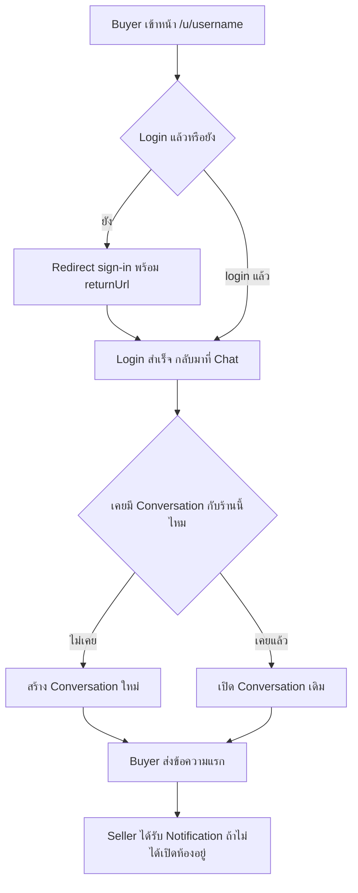
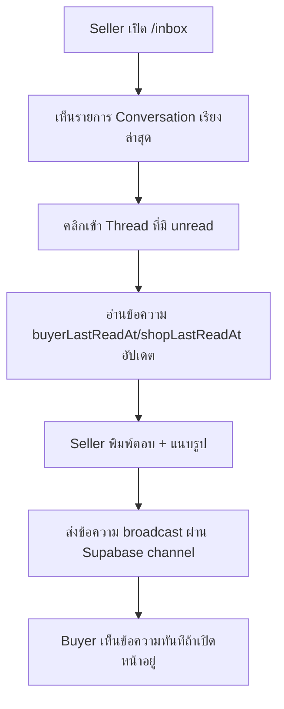

> **โมดูล:** M00011-DeepChat
> **ประเภทเอกสาร:** Product Requirements Document (PRD)
> **เวอร์ชัน:** 1.0
> **วันที่จัดทำ:** 2026-07-03
> **สถานะ:** Draft — อิง Design Spec ที่ user อนุมัติแล้ว (`docs/superpowers/specs/2026-07-03-deep-chat-design.md`, decision D1-D7 ล็อก) รอ sign-off ก่อนส่งต่อ SRS/SDS/DATABASE/API/Tests
> **เจ้าของเอกสาร:** BA + PO + PM (ดู [[Feature-Docs-Ownership]])

---

# PRD: Deep Chat (In-App Chat)

---

## Executive Summary

Deep Chat คือฟีเจอร์แชทในแอปแบบ shop-anchored ที่เปิดให้ผู้ซื้อ (buyer) ทักแชทหาร้านค้า (seller) เพื่อสอบถามสินค้าก่อนตัดสินใจซื้อ (pre-purchase inquiry) โดยไม่ต้องหนีออกจาก Deep ไปคุยใน FB/LINE ของผู้ขาย ปุ่ม "Chat" บนหน้าโปรไฟล์สาธารณะ `/u/[username]` ซึ่งถูกปิดใช้งานไว้ตั้งแต่การ redesign 2026-05-23 (placeholder "เร็ว ๆ นี้", FR-9.11 ใน `docs/PRD.md`/`docs/SRS.md`) จะถูกเปิดใช้งานจริงในฟีเจอร์นี้ MVP ครอบคลุมเฉพาะ web surface — buyer ผ่าน Vuexy (`/messages`), seller ผ่าน Paces (`/inbox`) — realtime ด้วย Supabase broadcast (reuse pattern เดียวกับระบบประมูล) คุณค่าทางธุรกิจหลักคือรักษาบทสนทนาการซื้อขายให้อยู่ใน platform ของ Deep เป็นการวาง foundation ของ trust loop ที่ต่อยอดได้ในอนาคต (response-rate metric, order context, mobile push) โดยไม่คิดค่าใช้จ่ายใน MVP (engagement feature ล้วน ไม่ผูก billing/subscription ใด ๆ)

---

## 1. Business Goals & KPIs

### 1.1 เป้าหมายทางธุรกิจ

| เป้าหมาย | รายละเอียด |
|----------|-----------|
| **รักษาบทสนทนาซื้อขายไว้ใน Deep** | ลด friction ที่ buyer ต้องหนีไปทักใน FB/LINE/IG ของ seller — ทุกการสอบถามก่อนซื้อเกิดขึ้นใน platform ที่ตรวจสอบย้อนหลังได้ |
| **เพิ่ม Conversion จาก Public Profile** | เปิดปุ่ม Chat ที่ถูก disable มาตั้งแต่ 2026-05-23 (FR-9.11) ให้ buyer ที่เข้าดูโปรไฟล์ร้านค้าติดต่อ seller ได้ทันทีโดยไม่ต้องหาช่องทางอื่น |
| **วาง Foundation ของ Trust Loop เชิง Engagement** | เก็บ timestamp ของบทสนทนาให้ครบ (แม้ยังไม่คำนวณ metric ใน MVP) เพื่อให้ response-rate/response-time ต่อยอดเป็น trust signal ได้ใน Phase 2 |
| **ไม่เพิ่มภาระต้นทุน/ความซับซ้อนให้ Seller ที่ไม่ใช้งาน** | Shop ที่ไม่เคยถูกทักแชท ไม่มี UI/notification ใด ๆ เปลี่ยนไปจากเดิม (zero-regression บน flow อื่น) |

### 1.2 ตัวชี้วัดความสำเร็จ (KPIs)

> เป้าหมายตัวเลขเป็นเป้าเบื้องต้น (proposed) ไม่มี baseline จริง — ปรับได้หลัง launch

| KPI | คำอธิบาย | เป้าหมาย (เสนอ) |
|-----|----------|---------|
| **Chat-to-Conversation Rate** | % ของการคลิกปุ่ม Chat บน `/u/[username]` ที่นำไปสู่การส่งข้อความจริงอย่างน้อย 1 ข้อความ | วัด baseline เดือนแรก |
| **Conversations Created / สัปดาห์** | จำนวน `Conversation` ใหม่ทั้งระบบ | วัด trend |
| **Messages / Conversation (เฉลี่ย)** | บ่งชี้ว่าเป็นบทสนทนาจริงหรือทักครั้งเดียวแล้วเงียบ | ≥ 3 ข้อความ/conversation |
| **Seller Reply Rate (ภายใน 24 ชม.)** | % ของ conversation ที่ seller ตอบกลับข้อความแรกของ buyer ภายใน 24 ชม. — วัด manual จาก timestamp (ยังไม่ใช่ trust metric อย่างเป็นทางการ) | ≥ 50% |
| **Zero Regression บน Public Profile/Order/Notification เดิม** | ไม่มี behavior change ที่ไม่ตั้งใจในหน้า `/u/[username]`, order flow, notification bell เดิม | Regression suite ผ่าน 100% |

---

## 2. User Personas (กลุ่มผู้ใช้งาน)

### 2.1 Buyer ที่กำลังตัดสินใจซื้อ (Pre-purchase Inquiry)

**ข้อมูลพื้นฐาน:** login แล้ว (มี Deep account), กำลังดูหน้าโปรไฟล์ร้าน `/u/[username]` หรือสินค้าของร้านนั้น

**เป้าหมาย:** ถามรายละเอียดสินค้า (สี/ไซส์/สต็อก/ระยะเวลาจัดส่ง) ก่อนตัดสินใจซื้อ โดยไม่ต้องออกจากแอป

**ความต้องการ:** ปุ่ม "Chat" ที่ใช้งานได้จริงบนโปรไฟล์ร้าน, ส่งข้อความ + รูปได้, เห็นบทสนทนาเก่าเมื่อกลับมาคุยกับร้านเดิมอีกครั้ง (ไม่สร้าง thread ใหม่ทุกครั้ง)

**จุดปวด (Pain Points):** ปุ่ม Chat เดิม disabled มาตลอด — ต้องเปิด FB/LINE แยกเพื่อทัก ทำให้บทสนทนาไม่อยู่ใน context เดียวกับ profile/trust score ของร้าน

**User Story:**
> ในฐานะ Buyer ที่กำลังดูโปรไฟล์ร้านค้า ฉันต้องการกดปุ่ม Chat แล้วทักถามร้านได้ทันที เพื่อสอบถามรายละเอียดสินค้าก่อนตัดสินใจซื้อโดยไม่ต้องออกจาก Deep ไปคุยในช่องทางอื่น

### 2.2 Seller เจ้าของร้าน (ตอบคำถามลูกค้า)

**ข้อมูลพื้นฐาน:** เจ้าของร้าน (`Shop.userId`) — ไม่รวม Business member ที่ไม่ใช่เจ้าของ (Phase 2)

**เป้าหมาย:** เห็นข้อความทักเข้ามาจาก buyer ที่สนใจซื้อ, ตอบกลับได้เร็วจาก dashboard เดียวกับที่จัดการ order/product

**ความต้องการ:** หน้า inbox (`/inbox`) แสดงรายการบทสนทนาเรียงตามล่าสุด, unread badge บนเมนู, thread ตอบกลับได้ทันที, แจ้งเตือนเมื่อมีข้อความใหม่ (ผ่านช่องทางเดิมที่มีอยู่แล้ว)

**จุดปวด:** ปัจจุบันต้องคอยเช็ค FB/LINE/IG หลายช่องทางพร้อมกัน ไม่มีที่รวมศูนย์คำถามลูกค้าที่มาจาก Deep โดยเฉพาะ

**User Story:**
> ในฐานะ Seller เจ้าของร้าน ฉันต้องการเห็นข้อความจาก buyer ทั้งหมดรวมในที่เดียวพร้อม unread badge บนเมนู เพื่อตอบคำถามลูกค้าได้เร็วจาก dashboard เดียวกับที่จัดการ order/product อยู่แล้ว โดยไม่ต้องสลับไปเช็คหลายช่องทาง

### 2.3 Seller ที่ไม่เคยถูกทักแชท (Regression-sensitive)

**ข้อมูลพื้นฐาน:** ร้านค้าที่ยังไม่มีใครเคยเริ่มบทสนทนาด้วย

**เป้าหมาย:** ใช้งาน dashboard/order/product เหมือนเดิมทุกประการ ไม่ถูกกระทบจากฟีเจอร์ใหม่

**ความต้องการ:** เมนูใหม่ (`/inbox`) ไม่รบกวน flow เดิม, ไม่มี error/behavior change ถ้าไม่มีบทสนทนาเข้ามา

**จุดปวด:** กลัวฟีเจอร์ใหม่ทำให้ dashboard ที่ใช้อยู่ช้าลงหรือซับซ้อนขึ้นทั้งที่ไม่เกี่ยวข้อง

**User Story:**
> ในฐานะ Seller ที่ไม่เคยถูกทักแชท ฉันต้องการให้ dashboard ทำงานเหมือนเดิมทุกประการ เพื่อไม่ถูกรบกวนจากฟีเจอร์ที่ฉันยังไม่ได้ใช้งาน

---

## 3. Business Requirements

### 3.1 ภาพรวม Functional Requirements (FR-CHAT-01..12)

> ตารางนี้เป็น **overview ระดับ feature** — รายละเอียด User Story เต็ม/Acceptance Criteria แบบ Given-When-Then ของแต่ละ FR ดูที่ [[BRD]] §2 (รหัสเดียวกัน)

| FR | ชื่อ | ภาพรวม | Priority |
|----|------|--------|----------|
| **FR-CHAT-01** | Buyer เริ่มบทสนทนากับร้านค้า | Buyer login แล้วกด Chat บนโปรไฟล์ร้าน → สร้าง/เปิด conversation ผูกกับ (buyerUserId, shopId) | Must |
| **FR-CHAT-02** | Seller ห้ามเริ่มบทสนทนาใหม่กับ Buyer ที่ไม่เคยทักมาก่อน | Anti-spam — ไม่มีช่องทางให้ seller เปิด conversation ใหม่เอง | Must |
| **FR-CHAT-03** | Seller = เจ้าของร้านเท่านั้น (Owner-only) | เฉพาะ `Shop.userId` เข้าถึง/ตอบบทสนทนาของร้านได้ใน MVP | Must |
| **FR-CHAT-04** | ส่งข้อความ TEXT | พิมพ์ข้อความตัวอักษร cap ความยาว | Must |
| **FR-CHAT-05** | ส่งข้อความ IMAGE | แนบรูป 1 รูป/ข้อความ (reuse `lib/storage`) | Must |
| **FR-CHAT-06** | Rate-limit การส่งข้อความ | จำกัดความถี่ต่อผู้ใช้ (reuse `api-rate-limit.ts`) | Must |
| **FR-CHAT-07** | Buyer Inbox | รายการบทสนทนาทั้งหมดของ buyer เรียงล่าสุด + unread state | Must |
| **FR-CHAT-08** | Buyer Thread + Realtime | อ่าน/ส่งข้อความ, realtime broadcast, mark-read | Must |
| **FR-CHAT-09** | Seller Inbox + Unread Badge | รายการบทสนทนาของร้าน + badge บนเมนู dashboard | Must |
| **FR-CHAT-10** | Seller Thread + Realtime | อ่าน/ตอบข้อความ, realtime broadcast, mark-read, toast=`pacesToast` | Must |
| **FR-CHAT-11** | แจ้งเตือนผู้รับที่ไม่อยู่ในห้อง | สร้าง `Notification` (`kind="chat_message"`) เมื่อผู้รับไม่ online ในห้องนั้น | Must |
| **FR-CHAT-12** | เปิดปุ่ม Chat บน `/u/[username]` | เปลี่ยนจาก disabled placeholder เป็น active — ปิด known gap FR-9.11 (บางส่วน) | Must |

### 3.2 การเริ่มบทสนทนา (Shop-anchored Initiation)

**ความต้องการ:**
- Buyer ที่ login แล้วกดปุ่ม "Chat" บนหน้าโปรไฟล์ร้าน (`/u/[username]`) แล้วเข้าสู่บทสนทนากับร้านนั้นได้ทันที — ถ้าเคยทักมาก่อนแล้ว เห็นบทสนทนาเดิมต่อ ไม่สร้างใหม่ซ้ำ (FR-CHAT-01)

**Business Rules:**
- บทสนทนา anchor ที่คู่ (buyer, shop) — 1 คู่ มีได้ 1 conversation เท่านั้น
- Buyer ต้อง login ก่อนเสมอ — ไม่มี guest chat (ต่างจาก guest order confirm ที่มีอยู่เดิม); ถ้ายัง login ปุ่ม Chat ต้อง redirect ไปหน้า sign-in แล้วพากลับมาที่บทสนทนาเดิมหลัง login สำเร็จ
- Buyer เป็นฝ่ายเริ่มบทสนทนาได้เท่านั้น — Seller ทักหา buyer ที่ไม่เคยทักมาก่อนไม่ได้ (FR-CHAT-02, anti-spam)

**เหตุผล:** ป้องกัน seller ใช้ช่องทางแชทเป็นเครื่องมือ spam/marketing เข้าหา buyer ที่ไม่ยินยอม และทำให้ scope ของ conversation ชัดเจน (1 คู่ 1 thread) ง่ายต่อการค้นหา/แสดงผลทั้งฝั่ง buyer และ seller

### 3.3 การส่งข้อความ (Text + Image)

**ความต้องการ:**
- ผู้ใช้ทั้งสองฝั่งส่งข้อความตัวอักษรหรือรูปภาพ (อย่างใดอย่างหนึ่งต่อ 1 ข้อความ) เข้าไปในบทสนทนาได้ (FR-CHAT-04, FR-CHAT-05)

**Business Rules:**
- ประเภทข้อความ = TEXT หรือ IMAGE เท่านั้น — 1 รูปต่อ 1 ข้อความ (ไม่ใช่ multi-image, ไม่ใช่ voice/ไฟล์อื่น)
- ข้อความตัวอักษรมีความยาวสูงสุดที่กำหนด (cap กันข้อความยาวผิดปกติ)
- รูปภาพต้องผ่านข้อจำกัดขนาด/ประเภทไฟล์เดียวกับระบบอัปโหลดรูปที่มีอยู่แล้วในระบบ (reuse `lib/storage`)
- มี rate-limit การส่งข้อความต่อผู้ใช้ ป้องกันการ spam ถี่เกินไป (FR-CHAT-06)

**เหตุผล:** จำกัดรูปแบบเนื้อหาให้ MVP เรียบง่าย ป้องกัน abuse (สแปม/ข้อความยาวเกิน/ไฟล์ผิดประเภท) โดยไม่ต้อง build ระบบตรวจสอบเนื้อหาที่ซับซ้อน (scam-link detection = Phase 2)

### 3.4 Buyer Inbox & Thread (Vuexy)

**ความต้องการ:**
- Buyer มีหน้ารวมบทสนทนาทั้งหมดของตัวเอง (inbox) เรียงตามข้อความล่าสุด พร้อมดูรายละเอียดบทสนทนากับแต่ละร้าน (thread) ได้ (FR-CHAT-07, FR-CHAT-08)

**Business Rules:**
- แสดงเฉพาะบทสนทนาที่ตัวเองเป็นคู่สนทนา (scope ownership ที่ session buyer เท่านั้น)
- ข้อความใหม่ที่เข้ามาระหว่างเปิดหน้าอยู่ต้องปรากฏแบบ realtime (หรือ fallback รีเฟรชเมื่อกลับมา focus หน้าจอ)

**เหตุผล:** buyer อาจคุยกับหลายร้านพร้อมกัน (สอบถามหลายร้านเพื่อเปรียบเทียบ) ต้องมีศูนย์กลางรวมบทสนทนาเดียว ไม่ใช่แค่เข้าถึงผ่านโปรไฟล์ร้านทีละร้าน

### 3.5 Seller Inbox & Thread (Paces)

**ความต้องการ:**
- Seller (เจ้าของร้าน) มีหน้ารวมบทสนทนาทั้งหมดของร้านตัวเอง พร้อมตอบกลับได้จาก dashboard เดียวกับที่จัดการ order/product (FR-CHAT-09, FR-CHAT-10)

**Business Rules:**
- แสดงเฉพาะบทสนทนาที่ shop ของตัวเองเป็นคู่สนทนา (scope ownership ที่ shop ของ session seller — FR-CHAT-03)
- มี unread indicator ที่เมนูหลักของ seller dashboard ให้เห็นว่ามีข้อความใหม่รอตอบ

**เหตุผล:** seller ต้องเห็นคำถามลูกค้าไวพอที่จะตอบทันเวลา (ตรงกับ pain point ปัจจุบันที่ต้องเช็คหลายช่องทาง) — วางไว้ในที่เดียวกับ dashboard ที่ใช้ประจำอยู่แล้ว

### 3.6 การแจ้งเตือนเมื่อมีข้อความใหม่ (Notification)

**ความต้องการ:**
- ผู้รับข้อความที่ไม่ได้เปิดหน้าบทสนทนานั้นอยู่ ต้องได้รับการแจ้งเตือนผ่านช่องทางที่มีอยู่แล้วในระบบ (bell/notification เดิม) (FR-CHAT-11)

**Business Rules:**
- สร้าง notification เมื่อผู้ส่งข้อความไม่ใช่ตัวเอง และผู้รับไม่ได้อยู่ในห้องสนทนานั้น ณ ขณะนั้น
- ไม่มี push notification บนมือถือใน MVP (web-only surface — mobile push = Phase 2)

**เหตุผล:** ให้ทั้ง buyer และ seller รู้ตัวว่ามีข้อความใหม่แม้ไม่ได้เปิดหน้าแชทค้างไว้ โดยไม่ต้องสร้างโครงสร้าง notification ใหม่ (reuse ของเดิม)

### 3.7 เปิดใช้งานปุ่ม Chat บนโปรไฟล์สาธารณะ

**ความต้องการ:**
- ปุ่ม "Chat" บนหน้า `/u/[username]` ที่เคย disabled พร้อม tooltip "เร็ว ๆ นี้" (FR-9.11 เดิมใน `docs/PRD.md`/`docs/SRS.md`) ต้องใช้งานได้จริง (FR-CHAT-12)

**Business Rules:**
- คลิกแล้วพาไปสู่บทสนทนากับร้านนั้น (สร้างใหม่ถ้ายังไม่เคยมี หรือเปิดของเดิมถ้ามีอยู่แล้ว)
- ถ้า buyer ยังไม่ login → redirect ไป sign-in พร้อม returnUrl กลับมาที่บทสนทนาเดิมหลัง login

**เหตุผล:** ปิด known gap ที่ระบุใน `docs/PRD.md` §11 แถว P9/SRS FR-9.11 (ส่วน Chat — ส่วน Follow ยังคง Phase 2)

### 3.8 มาตรการป้องกันการใช้งานผิดวัตถุประสงค์ (MVP-light Safety)

**ความต้องการ:**
- ระบบต้องมีมาตรการพื้นฐานป้องกัน spam/abuse โดยไม่ต้อง build ระบบตรวจจับเนื้อหาที่ซับซ้อนใน MVP

**Business Rules:**
- Rate-limit การส่งข้อความต่อผู้ใช้ (reuse infra rate-limit เดิมของระบบ — FR-CHAT-06)
- จำกัดความยาวข้อความและขนาด/ประเภทไฟล์รูปภาพ
- Buyer-initiate-only (§3.2) เป็นมาตรการป้องกัน spam หลักอยู่แล้ว

**เหตุผล:** สมดุลระหว่างความปลอดภัยพื้นฐานกับความเร็วในการ ship MVP — มาตรการเชิงลึก (block ผู้ใช้, report, scam-link detection) เลื่อนไป Phase 2 ตาม Design Spec §6-7

---

## 4. Business Rules & Constraints

### 4.1 กฎทางธุรกิจหลัก

| กฎ | คำอธิบาย |
|----|----------|
| **Shop-anchored** | บทสนทนาผูกกับคู่ (buyer, shop) ไม่ใช่ (buyer, seller-user) — 1 คู่ = 1 conversation เท่านั้น |
| **Buyer-initiate Only** | Seller เริ่มบทสนทนาใหม่กับ buyer ที่ไม่เคยทักมาก่อนไม่ได้ |
| **Login Required (Buyer)** | ไม่มี guest chat — buyer ต้อง login ก่อนส่งข้อความแรกเสมอ |
| **Owner-only (Seller)** | ฝั่ง seller = เจ้าของร้าน (`Shop.userId`) เท่านั้นที่อ่าน/ตอบได้ใน MVP |
| **TEXT/IMAGE Only** | ประเภทข้อความจำกัดที่ TEXT กับ IMAGE (1 รูป/ข้อความ) — ไม่มี voice/ไฟล์/multi-image |
| **ไม่คิดค่าใช้จ่าย** | ฟีเจอร์นี้เป็น engagement feature — ไม่มี billing/subscription ผูกกับการใช้งานแชทใน MVP |

### 4.2 ข้อจำกัดทางธุรกิจ

| ข้อจำกัด | รายละเอียด |
|---------|-----------|
| **Web-only Surface** | MVP รองรับเฉพาะ buyer เว็บ (Vuexy) และ seller เว็บ (Paces) — mobile app (`/api/app/chat/*`) และ push notification ยังไม่ทำ |
| **ไม่มี Order/Product Context** | บทสนทนาไม่ผูกกับ order หรือ product เฉพาะเจาะจงใน MVP (deep-linked context card = Phase 2) |
| **ไม่มี Business Member Routing** | Shop ที่มีสมาชิกหลายคน (feature 00008) — เฉพาะเจ้าของร้านตอบแชทได้ ยังไม่มีการมอบหมายให้สมาชิกคนอื่น |
| **ไม่มี Response-rate Trust Metric อย่างเป็นทางการ** | แม้ schema เก็บ timestamp ครบ แต่ยังไม่นำไปคำนวณ trust score/badge ใน MVP |

### 4.3 เงื่อนไขการมองเห็น/สิทธิ์การเข้าถึง

| Actor | เข้าถึงบทสนทนาใด | เงื่อนไข |
|-------|-------------------|---------|
| **Buyer** | เฉพาะบทสนทนาที่ตนเองเป็น `buyerUserId` | ต้อง login เป็น user คนนั้น |
| **Seller (เจ้าของร้าน)** | เฉพาะบทสนทนาที่ `shopId` เป็นของร้านตนเอง | session user = `Shop.userId` |
| **Admin** | ไม่มีสิทธิ์เข้าถึงเนื้อหาบทสนทนาใน MVP | นอกขอบเขต (§5) |

---

## 5. Out of Scope (นอกขอบเขต)

| หัวข้อ | คำอธิบาย |
|--------|----------|
| **Mobile App Chat (`/api/app/chat/*`) + Push Notification** | MVP = web only; มือถือ + push = Phase 2 |
| **Order/Product Deep-linked Context Card** | บทสนทนาไม่ผูกกับ order/product เฉพาะเจาะจงใน MVP |
| **Business Member Routing** | เฉพาะเจ้าของร้าน (`Shop.userId`) ตอบแชทได้ — มอบหมายให้สมาชิกร้านอื่นตอบ = Phase 2 |
| **Typing Indicator** | ไม่ทำใน MVP |
| **Per-message Read Receipt** | MVP มีแค่ read state ระดับบทสนทนา (อ่านล่าสุดเมื่อไร) ไม่ใช่ต่อข้อความ |
| **Seller-initiated / Broadcast Message** | Seller ทักหา buyer ก่อน หรือส่งข้อความหาลูกค้าหลายคนพร้อมกัน ไม่ทำใน MVP |
| **Scam-link Detection** | ตรวจจับลิงก์หลอกลวงในข้อความ = Phase 2 |
| **Response-rate/Response-time Trust Metric** | ไม่นำ timestamp ไปคำนวณ trust score/badge ใน MVP (แม้ schema เก็บพร้อมคำนวณย้อนหลังได้) |
| **Voice Message / Multi-image / File Attachment อื่น** | รองรับเฉพาะ TEXT + 1 รูป/ข้อความเท่านั้น |
| **Block/Report ผู้ใช้ในบทสนทนา** | ยังไม่ล็อกเป็น decision — ดู §9.2 Assumptions (ไม่อยู่ใน MVP build scope จนกว่า Controller/user ยืนยันเป็นอย่างอื่น) |
| **Follow System** | คนละฟีเจอร์กับ Chat แม้เดิมอยู่ปุ่มคู่กัน (FR-9.11) — ยังคง Phase 2 |

---

## 6. Risks & Mitigation (ความเสี่ยงและแนวทางแก้ไข)

### 6.1 ความเสี่ยงทางธุรกิจ

| ความเสี่ยง | ผลกระทบ | ระดับความรุนแรง | แนวทางแก้ไข |
|-----------|---------|-----------------|-------------|
| Seller ถูก buyer สแปมทักซ้ำ ๆ | ประสบการณ์ไม่ดี, seller ปิด dashboard ทิ้ง | กลาง | rate-limit + buyer-initiate-only (spam ต่อคู่ถูกจำกัดที่ 1 conversation อยู่แล้ว); block feature พิจารณาเพิ่มถ้าจำเป็นหลัง launch |
| ข้อความหลอกลวง/ลิงก์สแกมผ่านแชท | กระทบ trust ของ platform โดยตรง — ขัดกับ mission หลักของ Deep | สูง (แต่ยอมรับได้ใน MVP) | scam-link detection = Phase 2 ตาม design spec; MVP อาศัย buyer-initiate + login-required เป็นแนวป้องกันชั้นแรก |
| Seller เข้าใจผิดว่าแชทเป็นฟีเจอร์เสียเงิน | ความสับสน/ไม่กล้าใช้งาน | ต่ำ | สื่อสารชัดว่าฟีเจอร์นี้ฟรี ไม่ผูก billing |

### 6.2 ความเสี่ยงทางเทคนิค

| ความเสี่ยง | ผลกระทบ | แนวทางแก้ไข |
|-----------|---------|-------------|
| Realtime บน Vercel serverless (ไม่มี persistent server socket) | ข้อความอาจไม่ realtime สนิท | ใช้ Supabase Realtime broadcast-from-DB (client-side subscribe) แบบเดียวกับที่ auction ใช้งานได้แล้ว + fallback fetch-on-focus |
| 2 UI world (buyer Vuexy vs seller Paces) ต้อง build thread UI 2 ชุดคนละ theme | ต้นทุน dev เพิ่ม, ความเสี่ยง UI ไม่ sync กัน | `safepay-ux` ออก Design Spec แยก 2 ฝั่งตาม theme docs ของแต่ละฝั่ง (Hard Rule 8) |
| Shared DB drift (dev=prod Supabase เดียวกัน) | Migration ผิดพลาดกระทบข้อมูลจริง | ใช้ `migrate deploy` + hand-written migration เท่านั้น ห้าม `migrate dev` |
| PII ของบทสนทนา (ข้อความ/รูป) รั่วผ่าน RSC flight เหมือนที่เคยเกิดกับ seller order detail | ข้อมูลส่วนตัวรั่วผ่าน server component payload | apply pattern neutralize-at-source เดียวกับที่ใช้แก้ปัญหา PII leak ของ order detail |

---

## 7. Glossary (อภิธานศัพท์)

| คำศัพท์ | ความหมาย |
|---------|----------|
| **Conversation** | บทสนทนา 1 ห้อง ผูกกับคู่ (buyerUserId, shopId) หนึ่งคู่เท่านั้น |
| **ChatMessage** | ข้อความ 1 รายการภายใน Conversation หนึ่ง — TEXT หรือ IMAGE |
| **Shop-anchored** | รูปแบบการผูกบทสนทนากับร้านค้า (Shop) ไม่ใช่ตัวบุคคลผู้ขาย |
| **Buyer-initiate** | กฎที่บังคับให้ฝั่งผู้ซื้อเป็นผู้เริ่มบทสนทนาเท่านั้น |
| **Broadcast-from-DB** | รูปแบบ realtime ที่ insert ลง DB แล้ว broadcast ผ่าน Supabase channel ให้ client ที่ subscribe รับรู้ทันที |

---

## 8. Success Metrics (ตัวชี้วัดความสำเร็จ)

| ตัวชี้วัด | ค่าที่คาดหวัง | วิธีวัด |
|----------|---------------|--------|
| **ปุ่ม Chat ใช้งานได้จริง** | Buyer login แล้วกด Chat บน `/u/[username]` เข้าสู่บทสนทนาได้ 100% ของครั้งที่ทดสอบ | Playwright E2E |
| **Realtime Delivery** | ข้อความที่ส่งปรากฏฝั่งตรงข้ามโดยไม่ต้องรีเฟรชหน้า (broadcast) หรือปรากฏเมื่อกลับมา focus (fallback) | QA manual + E2E |
| **Zero Regression** | หน้า `/u/[username]`, order flow, notification bell เดิมไม่มี behavior change ที่ไม่ตั้งใจ | Regression suite |
| **1 Conversation ต่อคู่จริง** | ไม่มี buyer-shop pair ใดมีมากกว่า 1 conversation | DB constraint (`@@unique`) + test |

---

## 9. Dependencies & Assumptions

### 9.1 Dependencies

| ระบบ/ส่วนประกอบ | ความสัมพันธ์ |
|-----------------|-------------|
| **`Notification` model เดิม** | reuse สำหรับแจ้งเตือนข้อความใหม่ (`kind="chat_message"`, `refId=conversationId`) |
| **Supabase Realtime + `supabase-browser.ts`** | reuse pattern จาก auction (`useAuctionPresence`) สำหรับ broadcast-from-DB |
| **`lib/storage`** | reuse สำหรับอัปโหลดรูปภาพในข้อความ IMAGE |
| **`api-rate-limit.ts`** | reuse สำหรับ rate-limit การส่งข้อความ |
| **`pacesToast` (`pacesToast.chat.*`)** | ช่องทาง toast ฝั่ง seller (Hard Rule 9) |
| **หน้า `/u/[username]`** | จุดเปิดใช้งานปุ่ม Chat เดิมที่ disabled |
| **Vuexy chat views (`theme/vuexy/.../views/apps/chat/`)** | ต้นแบบ UI ฝั่ง buyer (Hard Rule 1 theme-copy) |
| **Paces docs (`theme/paces/Docs/index.html` + `paces-component-reference.md`)** | ต้นแบบ UI ฝั่ง seller |
| **`docs/PRD.md` §11 (P9 / FR-9.11)** | ต้อง sync สถานะ "Chat" เป็น CLOSED บางส่วนหลัง feature นี้ ship |

### 9.2 Assumptions

- **Block/Report conversation ไม่อยู่ใน MVP build scope** — Design Spec §6 ทิ้งเป็นตัวเลือก ("ถ้าทำใน MVP ... หรือ defer") ไม่ใช่ decision ที่ล็อกแล้วเหมือน D1-D7 เอกสารนี้จึง**สมมติ defer ไป Phase 2** เพื่อไม่ให้ scope บวมเกินสิ่งที่ผู้ใช้ approve ไว้ — ถ้า Controller/user ต้องการรวม MVP ต้องยกระดับเป็น requirement ใหม่ก่อนเข้า SRS
- **Notification channel ของ chat ใช้ `Notification` model เดิมตรง ๆ** ไม่มีช่องทางใหม่ (ไม่เหมือน 00009 ที่ต้องตัดสิน OD-E) — ยึดตาม Design Spec §4 ที่ระบุ reuse ชัดเจนแล้ว
- **Seller = เจ้าของร้านเดี่ยว** — แม้ระบบมี feature 00008 (Business Account, หลายสมาชิกต่อร้าน) แต่ Deep Chat MVP นี้ยังผูกกับ `Shop.userId` เท่านั้น ไม่รองรับ `ShopMember` ตอบแทน
- **ไม่มี proration/billing ใด ๆ** — ฟีเจอร์นี้ไม่ผูกกับ SellerWallet/entitlement ใด ๆ ทั้งสิ้น

### 9.3 Roadmap (Phase 2)

รายการที่ตั้งใจเลื่อนออกจาก MVP นี้ — ไม่ใช่ GAP:

| รายการ | เงื่อนไขก่อนเริ่ม |
|--------|-------------------|
| Mobile app chat (`/api/app/chat/*`) + push notification | ต้องมี Expo push infra พร้อม (มีอยู่แล้วบางส่วนจาก auction — `expo-push.ts`) |
| Order/product deep-linked context card | ต้องออกแบบ UI การแนบ order/product เข้าข้อความ |
| Business member routing (ตอบแทนเจ้าของร้าน) | ต่อยอดจาก `ShopMember` (feature 00008) |
| Typing indicator + per-message read receipt | เพิ่ม realtime event ใหม่บน channel เดิม |
| Response-rate/response-time trust metric | ใช้ timestamp ที่ schema เก็บไว้แล้วมาคำนวณ — ไม่ต้อง migration ใหม่ |
| Scam-link detection | ต้องเลือก/ผูก content-moderation service |
| Block/Report ผู้ใช้ในบทสนทนา | ต้อง confirm decision (§9.2) ก่อนเริ่ม |
| Follow system | คนละ scope จาก Chat — เดิมค้างตั้งแต่ FR-9.11 |

---

## 10. Known Gaps

> เชื่อมโยงกับ `docs/PRD.md` §11 (ตารางกลาง Known Gap ของทั้งระบบ)

| # | Known Gap เดิม | ผลจาก Feature 00011 | สถานะ |
|---|-----------------|----------------------|-------|
| P9 (main PRD §11) | `/u/{username}` follow/chat backend ยังไม่มี (FR-9.10 cross-platform stats placeholder, FR-9.11 Follow+Chat FAB disabled) | **ปิดครึ่งหนึ่ง** — ส่วน **Chat** เปิดใช้งานจริงผ่าน feature นี้ (FR-CHAT-12); ส่วน **Follow** และ **cross-platform stats (FR-9.10)** ยังคง OPEN (Phase 2) | PARTIAL CLOSE |
| ใหม่ (00011) | Response-rate/response-time ยังไม่เป็น trust signal อย่างเป็นทางการ แม้ schema เก็บ timestamp ครบ | เก็บข้อมูลพร้อมคำนวณย้อนหลังได้ทันทีที่ตัดสินใจทำ — ไม่ต้อง migration ใหม่ | OPEN (Phase 2) |
| ใหม่ (00011) | Block/Report ผู้ใช้ในบทสนทนา ยังไม่มี decision ล็อก | ดู §9.2 Assumptions — defer ไป Phase 2 โดย default | OPEN (รอ Controller/user confirm) |
| ใหม่ (00011) | Rate-limit เป็น in-memory per-instance (เหมือนระบบ rate-limit อื่นทั้งหมดของ Deep) | Known-gap เดียวกับ CSRF/RL เดิม (`docs/PRD.md` §11 แถว 11-12) — Redis = Phase 2 รวมกัน | OPEN (Phase 2, shared) |

---

## 11. Appendix — User Journeys

### 11.1 Buyer ทักร้านค้าครั้งแรกจากโปรไฟล์สาธารณะ

### 11.2 Seller ตอบกลับจาก Inbox แบบ Realtime

---

**หมายเหตุ:**
เอกสารนี้เป็นการบันทึกความต้องการทางธุรกิจ (Business Requirements) โดยไม่มีรายละเอียดทางเทคนิค
สำหรับ Functional Requirements / User Story / Acceptance Criteria แบบเต็ม (Given-When-Then) ดู [[BRD]] ของโมดูลนี้ (รหัส FR-CHAT-01..12 เดียวกัน)
สำหรับ technical specification ดู [[SRS]] ของโมดูลนี้ (ยังไม่เริ่ม — รอ sign-off PRD/BRD ก่อน ตาม Hard Rule 11)
