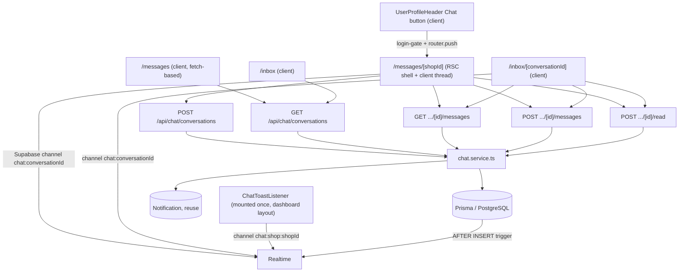

> **โมดูล:** M00011-DeepChat
> **ประเภทเอกสาร:** System Design Spec (SDS)
> **เวอร์ชัน:** 1.0
> **วันที่จัดทำ:** 2026-07-03
> **สถานะ:** Draft
> **เจ้าของเอกสาร:** SA (ดู [[Feature-Docs-Ownership]])

# SDS: Deep Chat (System Design Spec)

---

## 1. บทนำ & Scope

### 1.1 วัตถุประสงค์

SDS นี้กำหนดการออกแบบระดับ implementation ของ M00011 ให้ DEV เขียนโค้ดได้โดยไม่ต้องเดา — ทุก signature/path อ้างจากโค้ดจริงที่มีอยู่ ณ วันที่เขียน (2026-07-03)

### 1.2 Affected Files

**สร้างใหม่:**
- `src/services/chat.service.ts`
- `src/app/api/chat/conversations/route.ts` (POST + GET)
- `src/app/api/chat/conversations/[id]/messages/route.ts` (GET + POST)
- `src/app/api/chat/conversations/[id]/read/route.ts` (POST)
- `src/lib/chat-constants.ts` (body cap, rate-limit values, image allowed-types subset — เก็บแยกจาก `inventory-addon.ts` pattern ไม่ปน domain)
- `prisma/migrations/<timestamp>_chat_realtime_broadcast/migration.sql` (**ใหม่ — ยังไม่มีใน DATABASE.md ปัจจุบัน ต้อง dispatch `safepay-database` เพิ่ม ดู §9 FLAG-1**)
- Buyer UI (Vuexy): `src/app/(marketing)/(buyer-app)/messages/page.tsx`, `src/app/(marketing)/(buyer-app)/messages/[shopId]/page.tsx` + client component(s) (`safepay-ux` กำหนด path/ชื่อ component จริงอีกที)
- Seller UI (Paces): `src/app/(paces)/seller/(dashboard)/inbox/page.tsx`, `src/app/(paces)/seller/(dashboard)/inbox/[conversationId]/page.tsx` + client component(s) (`safepay-ux` กำหนด path/ชื่อ component จริงอีกที)
- Seller shop-wide toast listener component (mount ใน `(dashboard)/layout.tsx`) — ชื่อไฟล์ให้ `safepay-ux`/developer ตัดสินใจตอน implement (เช่น `ChatToastListener.tsx`)

**แก้ไข (additive ทั้งหมด — ไม่มี breaking signature):**
- `src/lib/validations.ts` — เพิ่ม `SendChatMessageSchema`, `StartConversationSchema`, `ChatMessagesQuerySchema`, `ChatConversationsQuerySchema`
- `src/views/pages/user-profile/UserProfileHeader.tsx` — เพิ่ม `shopId` เข้า `ProfileHeaderData`, เปิดปุ่ม Chat (ลบ `disabled`+`Tooltip` เฉพาะปุ่มนี้)
- `src/app/(marketing)/u/[username]/page.tsx` — ส่ง `shopId: user.shop?.id ?? null` เข้า `profileHeader`
- `src/app/(paces)/seller/(dashboard)/_seller-menu.ts` — เพิ่มเมนู "ข้อความ" (`url: '/inbox'`)
- `src/app/(paces)/seller/(dashboard)/layout.tsx` — เรียก `getUnreadCountForShop` (server-side) ผสม badge เข้า menu item + mount toast listener client component

**ไม่แตะ:** `Notification` model (reuse column เดิม 100%), ทุก route/service เดิมของ order/product/auction/wallet

### 1.3 เอกสารอ้างอิง

| เอกสาร | ความสัมพันธ์ |
|--------|-------------|
| [[SRS]] ของโมดูลนี้ | TFR-CHAT-01..12 ที่ SDS นี้ realize |
| [[DATABASE]] ของโมดูลนี้ | FROZEN CONTRACT — `Conversation`/`ChatMessage` |
| `prisma/migrations/20260701000003_auction_realtime_broadcast/migration.sql` (โค้ดจริง) | ต้นแบบ trigger — SDS §5 extend pattern นี้ |
| `src/hooks/useAuctionPresence.ts` + `src/app/(marketing)/a/[id]/AuctionDetailClient.tsx:144-179` (โค้ดจริง) | ต้นแบบ client subscribe (signal-only, ไม่เชื่อ payload) |
| `src/services/inventory-stock.service.ts:181-206` (โค้ดจริง) | ต้นแบบ cursor pagination (`getStockMovementHistory`) — SDS §3 ใช้ pattern เดียวกันเป๊ะ |
| `src/app/api/inventory/subscribe/route.ts`, `.../movements/route.ts` (โค้ดจริง) | ต้นแบบ route (auth→DAL→Valibot→service→error-map) |
| `src/lib/storage/types.ts` (โค้ดจริง) | `MAX_SIZE=5MB`, `ALLOWED_TYPES` (ต้อง subset ตัด PDF) |
| `src/app/(paces)/seller/(dashboard)/products/components/ProductImagesCardV2.tsx:54-61,158` (โค้ดจริง) | ยืนยัน pattern `fileId` (ไม่ใช่ URL เต็ม) ที่ `POST /api/upload` คืน + วิธี render `/api/files/{fileId}` |
| `src/app/(marketing)/a/[id]/AuctionBidPanel.tsx:114-119` (โค้ดจริง) | ต้นแบบ login-gate redirect `callbackUrl` |
| `src/lib/paces-toast.ts` (โค้ดจริง) | `pacesToast`/`pacesToast.chat.*` |
| `src/proxy.ts` (โค้ดจริง) | CSRF + global rate-limit — apply อัตโนมัติกับ `/api/chat/*` โดยไม่ต้องแก้ |
| `src/lib/subdomain.ts` (โค้ดจริง) | `getSubdomain(host)` — ใช้แยก role ใน `GET /api/chat/conversations` |
| `src/services/shop.service.ts:40-42` (โค้ดจริง) | `getShopByUserId` — personal shop เท่านั้น (convention เดิม, chat ตามนี้) |

### 1.4 ⚠️ Multi-shop reality (feature 00008) — คำอธิบายทำไมไม่ใช้ `resolveActiveShopContext`

`Shop.userId` **ไม่ unique** อีกต่อไปหลัง feature 00008 (Business Account) — 1 user มีได้หลาย Shop (1 PERSONAL + หลาย BUSINESS) มี helper ใหม่ `resolveActiveShopContext(session)` (`src/lib/shop-context.ts`) ที่ scope ตาม `session.user.activeShopId` + `ShopMember` membership แต่ **ยังไม่ถูก retrofit เข้า route ส่วนใหญ่ของ dashboard** — แม้แต่ feature 00009 (Deep Stock Pro, เขียนเมื่อ 2026-07-02) ก็ยังใช้ `getShopByUserId(userId)` (= personal shop only) ทุก route ใหม่ของมันเช่นกัน

**Chat MVP เดินตาม convention เดียวกับ 00009** (ไม่ใช่ debt ใหม่เฉพาะ Chat แต่เป็น debt ร่วมของทั้ง dashboard ที่ยังไม่ migrate) — `getShopByUserId(session.user.id)` ทุกจุดที่ต้องการ "shop ของ seller" ผลคือ: **ShopMember/BUSINESS-kind shop เข้าไม่ถึง chat เลยใน MVP นี้** (ไม่ใช่แค่ "ไม่ตอบแทนได้" ตาม BR-CHAT-04 ตั้งใจ แต่ "ไม่มี inbox ให้เห็นด้วยซ้ำ" ถ้า seller คนนั้นไม่มี PERSONAL shop) — เป็นพฤติกรรมเดียวกับ inventory/products/orders ทุกหน้าที่ยังไม่ migrate จึงสอดคล้อง ไม่ใช่ regression เฉพาะจุด

---

## 2. Architecture Overview

Extension ใหม่ทั้งหมด — ไม่แก้ subsystem เดิม, ไม่เพิ่ม cron, เพิ่ม 1 Postgres trigger ใหม่ (§5) และ 1 npm dependency ที่มีอยู่แล้ว (`@supabase/supabase-js` — ใช้ซ้ำจาก auction ไม่เพิ่มใหม่)



---

## 3. Component Design

### 3.1 `src/services/chat.service.ts` — FROZEN CONTRACT

```typescript
import { prisma } from '@/lib/prisma'
import type { Prisma } from '@prisma/client'

export type SenderRole = 'BUYER' | 'SHOP'
export type ChatMessageType = 'TEXT' | 'IMAGE'

export interface ConversationSummary {
  id: string
  buyerUserId: string
  shopId: string
  lastMessageAt: Date
  lastMessagePreview: string | null
  lastSenderRole: SenderRole | null
  buyerLastReadAt: Date | null
  shopLastReadAt: Date | null
  createdAt: Date
}

export interface ChatMessageView {
  id: string
  conversationId: string
  senderUserId: string
  senderRole: SenderRole
  type: ChatMessageType
  body: string | null
  imageUrl: string | null
  createdAt: Date
}

// ---- getOrCreateConversation ----
// buyerUserId ต้อง = session.user.id เสมอ (caller/route รับผิดชอบ ไม่รับจาก client body)
export async function getOrCreateConversation(
  buyerUserId: string,
  shopId: string,
): Promise<ConversationSummary> {
  const existing = await prisma.conversation.findUnique({
    where: { buyerUserId_shopId: { buyerUserId, shopId } },
  })
  if (existing) return existing

  const shop = await prisma.shop.findUnique({ where: { id: shopId }, select: { id: true } })
  if (!shop) throw new Error('SHOP_NOT_FOUND')

  try {
    return await prisma.conversation.create({ data: { buyerUserId, shopId } })
  } catch (e) {
    // race: อีก request สร้างไปพร้อมกัน — P2002 unique violation → หาแถวที่ชนะแทน
    const isUnique = (e as { code?: string })?.code === 'P2002'
    if (isUnique) {
      const winner = await prisma.conversation.findUnique({
        where: { buyerUserId_shopId: { buyerUserId, shopId } },
      })
      if (winner) return winner
    }
    throw e
  }
}

// ---- listConversationsForShop / listConversationsForBuyer ----
// shopId/buyerUserId ต้อง derive จาก session ที่ route แล้ว (ownership ผ่านมาจากผู้เรียก ไม่ verify ซ้ำในนี้
// — เหมือน pattern getStockMovementHistory(shop.id, ...) ของ 00009)
export async function listConversationsForShop(
  shopId: string,
  opts: { cursor?: string; take?: number } = {},
): Promise<{ items: ConversationSummary[]; nextCursor: string | null }> {
  return listConversations({ shopId }, opts)
}

export async function listConversationsForBuyer(
  buyerUserId: string,
  opts: { cursor?: string; take?: number } = {},
): Promise<{ items: ConversationSummary[]; nextCursor: string | null }> {
  return listConversations({ buyerUserId }, opts)
}

async function listConversations(
  where: { shopId?: string; buyerUserId?: string },
  opts: { cursor?: string; take?: number },
): Promise<{ items: ConversationSummary[]; nextCursor: string | null }> {
  const take = opts.take ?? 20
  const rows = await prisma.conversation.findMany({
    where: {
      ...where,
      ...(opts.cursor ? { lastMessageAt: { lt: new Date(opts.cursor) } } : {}),
    },
    orderBy: { lastMessageAt: 'desc' },
    take: take + 1, // +1 trick หา hasMore — ต้นแบบ getStockMovementHistory
  })
  const hasMore = rows.length > take
  const page = hasMore ? rows.slice(0, take) : rows
  return {
    items: page as ConversationSummary[],
    nextCursor: hasMore ? page[page.length - 1]!.lastMessageAt.toISOString() : null,
  }
}

// ---- getMessages ----
// conversationId มาจาก client (path param) — ต้อง verify ownership จริงในนี้ (ต่างจาก listConversations*)
export async function getMessages(
  conversationId: string,
  actorUserId: string,
  opts: { cursor?: string; take?: number } = {},
): Promise<{ items: ChatMessageView[]; nextCursor: string | null }> {
  await assertParticipant(conversationId, actorUserId)

  const take = opts.take ?? 30
  const rows = await prisma.chatMessage.findMany({
    where: {
      conversationId,
      ...(opts.cursor ? { createdAt: { lt: new Date(opts.cursor) } } : {}),
    },
    orderBy: { createdAt: 'desc' }, // ใหม่→เก่า (pagination); client reverse ก่อน render
    take: take + 1,
  })
  const hasMore = rows.length > take
  const page = hasMore ? rows.slice(0, take) : rows
  return {
    items: page as ChatMessageView[],
    nextCursor: hasMore ? page[page.length - 1]!.createdAt.toISOString() : null,
  }
}

// ---- sendMessage (tx: insert + denorm update + Notification) ----
export async function sendMessage(params: {
  conversationId: string
  senderUserId: string
  senderRole: SenderRole // caller (route) รู้อยู่แล้วว่าเป็นฝั่งไหน — ฟังก์ชันนี้ verify ซ้ำ ไม่ trust เฉย ๆ
  type: ChatMessageType
  body?: string | null
  imageUrl?: string | null
}): Promise<ChatMessageView> {
  return prisma.$transaction(async (tx) => {
    const conversation = await tx.conversation.findUnique({ where: { id: params.conversationId } })
    if (!conversation) throw new Error('CONVERSATION_NOT_FOUND')

    const shop = await tx.shop.findUnique({ where: { id: conversation.shopId }, select: { userId: true, shopName: true } })
    if (!shop) throw new Error('SHOP_NOT_FOUND') // defense — ไม่ควรเกิดจริง (FK CASCADE)

    // verify role vs. truth — กัน client ปลอม senderRole (FR-CHAT-04-AC-03)
    const isBuyerClaim = params.senderRole === 'BUYER'
    const ownerMatch = isBuyerClaim
      ? conversation.buyerUserId === params.senderUserId
      : shop.userId === params.senderUserId
    if (!ownerMatch) throw new Error('FORBIDDEN')

    const preview = params.type === 'IMAGE' ? '[รูปภาพ]' : (params.body ?? '').slice(0, 100)

    const message = await tx.chatMessage.create({
      data: {
        conversationId: params.conversationId,
        senderUserId: params.senderUserId,
        senderRole: params.senderRole,
        type: params.type,
        body: params.body ?? null,
        imageUrl: params.imageUrl ?? null,
      },
    })

    await tx.conversation.update({
      where: { id: params.conversationId },
      data: { lastMessageAt: message.createdAt, lastMessagePreview: preview, lastSenderRole: params.senderRole },
    })

    // Notification เสมอ (ไม่เช็ค presence — ดู SRS TFR-CHAT-11 rationale) ผู้รับ = อีกฝ่าย
    const recipientUserId = isBuyerClaim ? shop.userId : conversation.buyerUserId
    const senderLabel = isBuyerClaim
      ? (await tx.user.findUnique({ where: { id: params.senderUserId }, select: { displayName: true } }))?.displayName ?? 'ผู้ซื้อ'
      : shop.shopName
    await tx.notification.create({
      data: {
        userId: recipientUserId,
        kind: 'chat_message',
        title: `ข้อความใหม่จาก ${senderLabel}`,
        body: preview,
        refId: params.conversationId,
      },
    })

    return message as ChatMessageView
  })
}

// ---- markRead ----
export async function markRead(
  conversationId: string,
  actorUserId: string,
  role: SenderRole,
): Promise<void> {
  const conversation = await assertParticipant(conversationId, actorUserId)
  const field = role === 'BUYER' ? 'buyerLastReadAt' : 'shopLastReadAt'

  await prisma.$transaction([
    prisma.conversation.update({ where: { id: conversationId }, data: { [field]: new Date() } }),
    prisma.notification.updateMany({
      where: { userId: actorUserId, kind: 'chat_message', refId: conversationId, read: false },
      data: { read: true },
    }),
  ])
  void conversation // ใช้แค่ยืนยัน ownership ผ่านแล้วเท่านั้น
}

// ---- getUnreadCountForShop ----
export async function getUnreadCountForShop(shopId: string): Promise<number> {
  const rows = await prisma.conversation.findMany({
    where: { shopId, lastSenderRole: 'BUYER' },
    select: { shopLastReadAt: true, lastMessageAt: true },
  })
  return rows.filter((r) => r.shopLastReadAt === null || r.lastMessageAt > r.shopLastReadAt).length
}

// ---- internal: ownership guard ----
async function assertParticipant(conversationId: string, actorUserId: string) {
  const conversation = await prisma.conversation.findUnique({ where: { id: conversationId } })
  if (!conversation) throw new Error('CONVERSATION_NOT_FOUND')
  if (conversation.buyerUserId === actorUserId) return conversation
  const shop = await prisma.shop.findUnique({ where: { id: conversation.shopId }, select: { userId: true } })
  if (shop?.userId === actorUserId) return conversation
  throw new Error('FORBIDDEN')
}
```

### 3.2 `src/lib/chat-constants.ts` (ใหม่)

```typescript
export const CHAT_BODY_MAX_LENGTH = 2000
export const CHAT_RATE_LIMIT_MAX = 30
export const CHAT_RATE_LIMIT_WINDOW_MS = 60_000
export const CHAT_IMAGE_ALLOWED_TYPES = ['image/jpeg', 'image/png', 'image/webp'] as const
// CHAT_IMAGE_MAX_SIZE ไม่ redefine — import MAX_SIZE จาก '@/lib/storage' ตรง ๆ ที่ route
```

### 3.3 Route Handler Design (pattern อ้าง `src/app/api/inventory/subscribe/route.ts`/`.../movements/route.ts`)

**`POST /api/chat/conversations`** — auth 401 → parse `StartConversationSchema` (400) → `getOrCreateConversation(session.user.id, shopId)` → 404 ถ้า `SHOP_NOT_FOUND` → 200

**`GET /api/chat/conversations`** — auth 401 → `getSubdomain(request.headers.get('host') ?? '')`:
- `'seller'` → `getShopByUserId(userId)` (404 ถ้าไม่มี) → `listConversationsForShop(shop.id, {cursor, take})`
- อื่น (`'main'`) → `listConversationsForBuyer(userId, {cursor, take})`

**`GET /api/chat/conversations/[id]/messages`** — auth 401 → parse query (`ChatMessagesQuerySchema`, 400) → `getMessages(id, userId, {cursor, take})` → catch `CONVERSATION_NOT_FOUND` (404) / `FORBIDDEN` (403)

**`POST /api/chat/conversations/[id]/messages`** — auth 401 → `checkApiRateLimit(\`chat-send:${userId}\`, 30, 60_000)` ก่อน (429 ถ้าเกิน) → parse body (`SendChatMessageSchema`, 400) → **derive `senderRole`**: `getSubdomain(host)==='seller' ? 'SHOP' : 'BUYER'` (route รู้ context ของตัวเองจาก subdomain ไม่ต้องรับจาก client) → ถ้า IMAGE ตรวจ `imageUrl` (fileId) มีจริง → `sendMessage({...})` → catch `CONVERSATION_NOT_FOUND`(404)/`FORBIDDEN`(403) → 200/201

**`POST /api/chat/conversations/[id]/read`** — auth 401 → derive `role` จาก subdomain เหมือนข้างบน → `markRead(id, userId, role)` → catch เหมือนข้างบน → 200

### 3.4 Realtime Broadcast Wiring

- **DB trigger:** ดู SRS §7.2 (SQL เต็ม) — broadcast 2 ช่องทาง: `chat:{conversationId}` (ทุกข้อความ) + `chat:shop:{shopId}` (เฉพาะ `senderRole=BUYER`)
- **Client subscribe (thread, ทั้ง buyer/seller):**
  ```typescript
  const supabase = getSupabaseBrowserClient()
  const channel = supabase
    .channel(`chat:${conversationId}`)
    .on('broadcast', { event: 'update' }, () => {
      // signal-only — ไม่เชื่อ payload, refetch cursor ล่าสุด
      refetchNewerMessages()
      markReadDebounced()
    })
    .subscribe()
  return () => { supabase.removeChannel(channel) }
  ```
- **Client subscribe (seller shop-wide toast, mount ครั้งเดียวใน dashboard layout):**
  ```typescript
  const channel = supabase
    .channel(`chat:shop:${shopId}`)
    .on('broadcast', { event: 'new_message' }, () => {
      pacesToast.chat.info('คุณมีข้อความใหม่เข้ามา')
    })
    .subscribe()
  ```
- **Fallback:** `visibilitychange`/`focus` listener เรียก refetch เดียวกัน ถ้า `channel.subscribe()` status ไม่ `SUBSCRIBED`

### 3.5 Notification Wiring

ดู SRS TFR-CHAT-11 (rationale เต็ม) — สรุป: `sendMessage()` insert เสมอ, `markRead()` เคลียร์ `read=true` ของ conversation นั้น ผลลัพธ์ end-user เทียบเท่า presence-gate โดยไม่ต้องสร้าง infra ใหม่

### 3.6 Theme Source Mapping (สำหรับ `safepay-ux` — จะออก Design Spec จริงอีกที)

| S-id | Surface | Base theme file |
|------|---------|-----------------|
| S-9 (Buyer Inbox) | Vuexy | `theme/vuexy/typescript-version/full-version/src/views/apps/chat/SidebarLeft.tsx` |
| S-10 (Buyer Thread) | Vuexy | `theme/vuexy/typescript-version/full-version/src/views/apps/chat/ChatContent.tsx` + `SendMsgForm.tsx` |
| S-11 (Seller Inbox) | Paces | `theme/paces/Docs/index.html` + `docs/system/ui-guideline/paces-component-reference.md` — **ไม่มี chat-specific Paces demo page** ต้องประกอบจาก list/card primitive (เหมือน pattern order-list) |
| S-12 (Seller Thread) | Paces | เดียวกับ S-11 — ประกอบจาก card + form-input primitive |
| S-13 (Seller menu badge) | Paces | `_seller-menu.ts` + `applyInventoryGate` pattern เดิม (§3.9 ของ 00009 SDS) เป็นต้นแบบโครงสร้าง `badge: {className, text}` |

`safepay-ux` **ต้อง invoke ก่อน developer เสมอ** สำหรับ S-9..S-13 ทั้งหมด (Hard Rule 8) — ตารางนี้แค่ชี้ต้นทาง ไม่ใช่ Design Spec ฉบับสมบูรณ์

### 3.7 UI Wiring — S-8 Chat Button

ดู SRS TFR-CHAT-12 — สรุป diff: `ProfileHeaderData` +`shopId`, ปุ่ม chat ลบ `disabled`/`Tooltip`, เพิ่ม `onClick` login-gate + `router.push`

---

## 4. TC / S-id Mapping

| S-id | ไฟล์หลัก | TFR ที่ cover | Test focus |
|------|---------|---------------|-----------|
| S-1 | `prisma/schema.prisma` + migration + validations.ts | data model + validation baseline | migrate deploy ไม่กระทบ table เดิม, unique constraint |
| S-2 | `chat.service.ts` | TFR-01,03,04,05,06,07,08,09,10,11 | unit: getOrCreate ไม่ duplicate, sendMessage tx atomicity, ownership guard, unread count logic |
| S-3 | `api/chat/conversations/route.ts` | TFR-01,07,09 | 401/404, role-branch ถูก subdomain |
| S-4 | `api/chat/conversations/[id]/messages/route.ts` | TFR-04,05,06,08,10 | 403 cross-shop, rate-limit 429, length/type reject |
| S-5 | `api/chat/conversations/[id]/read/route.ts` + upload reuse | TFR-08,10 | read-state ถูกฝั่ง, upload constraint |
| S-6 | migration trigger ใหม่ (§9 FLAG-1) + client subscribe | TFR-08,10 | 2-browser E2E realtime |
| S-7 | `sendMessage`/`markRead` Notification logic + toast listener | TFR-11 | notification สร้าง+เคลียร์ถูกจังหวะ, toast bottom-right เท่านั้น |
| S-8 | `UserProfileHeader.tsx` + `u/[username]/page.tsx` | TFR-12 | login-gate, regression `/u/[username]` เดิม |
| S-9,S-10 | Vuexy buyer UI | TFR-07,08 | list/thread ถูกต้อง, safepay-ux sign-off |
| S-11,S-12,S-13 | Paces seller UI + menu badge | TFR-09,10 | Hard Rule 7/9/12 grep gate 0 |

---

## 5. FROZEN CONTRACT (batch ขนานต้อง sync)

- `chat.service.ts` ทุก function signature ใน §3.1 — **ห้ามเปลี่ยนโดยไม่ sync กลับเอกสารนี้** (Batch 2 = S-3/S-4/S-5 พึ่ง signature นี้ พร้อมกันได้เพราะคนละไฟล์)
- Error message string ที่ throw จาก service (`SHOP_NOT_FOUND`, `CONVERSATION_NOT_FOUND`, `FORBIDDEN`) — route ทุกตัว catch ด้วย string เดียวกัน (`e.message === '...'`)
- Realtime channel naming: `chat:{conversationId}` (per-conversation) และ `chat:shop:{shopId}` (shop-wide, buyer→shop เท่านั้น) — Batch 3 (S-6/S-7) และ Batch 5/6 (UI) ต้องใช้ชื่อ channel นี้ตรงกันเป๊ะ
- `ChatMessage.imageUrl` = raw `fileId` (ไม่ใช่ URL เต็ม) — render ผ่าน `` `/api/files/${imageUrl}` `` เสมอที่ UI layer

---

## 6. Error Handling

| Service error | HTTP status | Route message |
|----------------|-------------|----------------|
| `SHOP_NOT_FOUND` | 404 | `"ไม่พบร้านค้า"` |
| `CONVERSATION_NOT_FOUND` | 404 | `"ไม่พบบทสนทนา"` |
| `FORBIDDEN` | 403 | `"ไม่มีสิทธิ์เข้าถึงบทสนทนานี้"` |
| rate-limit เกิน (route-level check ก่อนเรียก service) | 429 | `"Rate limit exceeded"` |
| Valibot validate fail | 400 | first issue message |
| ไม่มี session | 401 | `"unauthorized"` |

---

## 7. Risks

- **Realtime trigger ยังไม่มีไฟล์จริง** — ถ้า Controller dispatch S-6 โดยไม่ dispatch `safepay-database` เขียน migration ก่อน จะ block (ดู §9 FLAG-1)
- **2 UI world** (Vuexy+Paces) — ต้อง build 2 ชุด, `safepay-ux` แยก spec ตาม role
- **Shared DB drift** — migration ใหม่ (trigger) ต้องขอ user ยืนยันก่อน apply เหมือน S-1 (`prisma migrate deploy` เท่านั้น ห้าม `migrate dev`)
- **`getUnreadCountForShop` fetch+filter ใน JS** — ยอมรับได้ที่ scale ปัจจุบัน, ถ้า conversation ต่อร้านโตมาก (หลักพัน+) ต้อง revisit เป็น raw SQL

---

## 8. Implementation Order

Batch 0 (S-1, solo) → Batch 1 (S-2, solo) → Batch 2 (S-3/S-4/S-5, parallel คนละไฟล์) → **checkpoint: dispatch `safepay-database` เขียน+apply realtime trigger migration** → Batch 3 (S-6/S-7, parallel) → Batch 4 (S-8, solo — เสี่ยง regression) → Batch 5 (S-9/S-10, parallel, ผ่าน `safepay-ux` ก่อน) → Batch 6 (S-11/S-12/S-13, parallel, ผ่าน `safepay-ux` ก่อน) → Batch 7 (S-14/S-15, blocking)

---

## 9. FLAGS FOR CONTROLLER (mismatch ที่พบระหว่างเขียน SRS/SDS — ต้อง acknowledge ก่อน dispatch)

### FLAG-1 (บล็อกจริง): Realtime broadcast ต้องมี Postgres trigger ใหม่ — DATABASE.md ปัจจุบันไม่มี

Design Spec D5 บอกให้ "reuse auction pattern (`supabase-browser.ts`)" — แต่ auction จริง ๆ ใช้ **2 pattern คนละแบบ**: (1) `useAuctionPresence.ts` = client-only viewer count (ไม่เกี่ยวกับ broadcast ข้อความ) (2) `prisma/migrations/20260701000003_auction_realtime_broadcast/migration.sql` = **Postgres `AFTER UPDATE` trigger เรียก `realtime.send()`** — นี่คือ pattern ที่ Chat ต้องการจริง (broadcast-from-DB) DATABASE.md ของ 00011 (migration `20260703000300_add_deep_chat_schema`) มีแค่ `CREATE TABLE` 2 ตาราง **ไม่มี trigger นี้** S-6 (Realtime wiring) จึง**ทำไม่ได้จนกว่าจะมี migration ที่ 2** สำหรับ `AFTER INSERT ON "ChatMessage"` trigger (SQL ร่างไว้แล้วใน SRS §7.2/SDS §3.4) — **ต้อง dispatch `safepay-database` เพิ่มก่อน Batch 3**

### FLAG-2 (ออกแบบ resolve แล้ว แต่ขอ confirm): FR-CHAT-11 "presence-gate" ตัวอักษร → simplification "insert-always + clear-on-read"

BRD เขียน AC ว่า "Given ผู้รับไม่ได้ subscribe อยู่ในห้อง...Then สร้าง Notification" ซึ่งหมายถึง server ต้องรู้ real-time presence ของผู้รับ ณ ขณะนั้น — โปรเจกต์ไม่มี server-side presence-lookup infra (Presence ที่มีอยู่เป็น client-only ephemeral, ไม่เคย query จาก server) สร้างใหม่ = over-engineer เกิน MVP ผม resolve ด้วยการ **insert Notification ทุกครั้งเสมอ แล้วเคลียร์อัตโนมัติเมื่อผู้รับเปิด/focus thread นั้น** (`markRead` ทำงานคู่กับ auto-mark-read-on-broadcast) — ผลลัพธ์ปลายทางที่ user เห็นเหมือนกัน (คนที่กำลังคุยอยู่ไม่มี unread ค้าง, คนที่ไม่อยู่มี unread ค้างจนเปิดอ่าน) แต่ implementation ไม่ใช่ presence-gate ตามตัวอักษร — ขอ confirm ว่ายอมรับได้

### FLAG-3 (สำคัญ): `Notification` table ไม่มี web bell UI consumer ปัจจุบัน — PRD/BRD "reuse ช่องทางเดิม" ไม่จริงสำหรับ web

grep ยืนยัน: ผู้อ่าน `Notification` model ปัจจุบันมีแค่ `src/app/api/app/notifications/*` (**mobile app REST API — OOS Phase 2 ของ Chat เอง**) ไม่มี bell dropdown ใด ๆ บน buyer (Vuexy) หรือ seller (Paces) web ที่ query ตาราง `Notification` เลย ("seller `/notifications`" ที่ 00009 ใช้เป็นคนละระบบ — อ่านจาก `activity.service.ts` แบบ aggregate ไม่ใช่ `Notification` table) **ผลคือ:** insert `Notification` row (kind=chat_message) มีประโยชน์แค่ forward-compat กับ mobile Phase 2 — ผู้ใช้ web จะไม่เห็น "bell notification" ใด ๆ จาก Chat ใน MVP นี้ (เห็นแค่ unread badge ที่มาจาก `Conversation` fields โดยตรง + `pacesToast` สำหรับ seller ที่ dashboard เปิดอยู่ตอนนั้น) — สอดคล้องกับ scope baseline S-9..S-13 (ไม่มี "สร้าง bell UI" อยู่ใน list อยู่แล้ว) แต่ **ขอ confirm ชัดเจนว่า user รับทราบ** buyer ที่ไม่ได้เปิดแอปจะไม่รู้ว่ามีข้อความใหม่เข้ามาเลยจนกว่าจะเข้า `/messages` เอง (ไม่มี bell, ไม่มี push ใน MVP)

### FLAG-4 (ไม่บล็อก, เพื่อบันทึกไว้): `ChatMessage.imageUrl` ชื่อ field vs ค่าจริงที่เก็บ

DATABASE.md §3.2 อธิบายว่า `imageUrl` เก็บ "URL จาก lib/storage" — แต่ pattern จริงในโค้ด (`Product.images`, `POST /api/upload`) เก็บ **raw `fileId`** ไม่ใช่ URL เต็ม ผม lock ความหมายให้ตรง pattern จริงใน SRS §TFR-CHAT-05/SDS §5 แล้ว (ไม่กระทบ schema, กระทบแค่ความเข้าใจตอน implement) — ไม่ต้องแก้ DATABASE.md เพียงต้องให้ developer อ่าน SRS/SDS ไม่ใช่ DATABASE.md อย่างเดียวสำหรับจุดนี้
