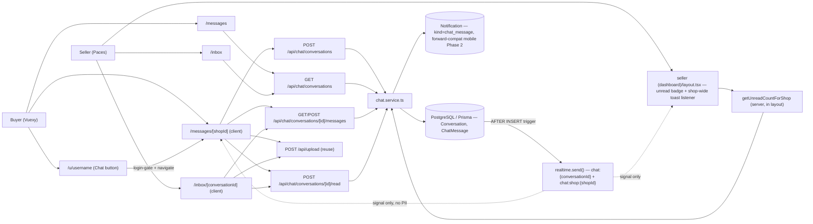
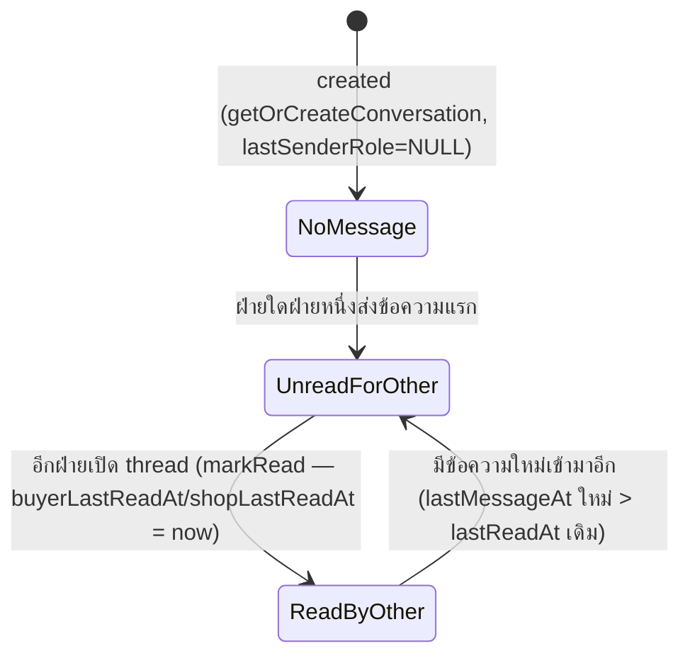

> **โมดูล:** M00011-DeepChat
> **ประเภทเอกสาร:** Software Requirements Specification (SRS) — TECHNICAL
> **เวอร์ชัน:** 1.0
> **วันที่จัดทำ:** 2026-07-03
> **สถานะ:** Draft
> **เจ้าของเอกสาร:** SA (ดู [[Feature-Docs-Ownership]])

# SRS: Deep Chat (Software Requirements Specification — Technical)

---

## 1. บทนำ

### 1.1 วัตถุประสงค์ของเอกสาร

เอกสารนี้กำหนดข้อกำหนดเชิงเทคนิคของ **Deep Chat (M00011)** — in-app chat แบบ shop-anchored (1 conversation ต่อคู่ `buyerUserId`+`shopId`), buyer-initiate only, ข้อความ TEXT/IMAGE, realtime ผ่าน Supabase broadcast-from-DB, 2 surface (buyer Vuexy `/messages`, seller Paces `/inbox`) ผู้อ่านเป้าหมาย: DEV ผู้ implement, QA ผู้ออกแบบ test case, Controller ผู้วางแผน dispatch เอกสารนี้ trace กลับ FR-CHAT-01..12/BR-CHAT-01..12 ใน [[BRD]] และ **FROZEN CONTRACT** ใน [[DATABASE]] (model `Conversation`/`ChatMessage`)

**หลักการออกแบบสำคัญ:** ไม่มี table/route เดิมถูกแก้ (additive ล้วน) — จุดเสี่ยง regression เดียวคือ S-8 ที่แก้หน้า `/u/[username]` (sign-off แล้ว 2026-05-23, live prod) ต้องแตะเฉพาะปุ่ม Chat เท่านั้น ส่วนอื่นห้ามเปลี่ยน

### 1.2 ขอบเขตเชิงระบบ (System Scope)

**ในขอบเขต:**
- `prisma/schema.prisma` — model `Conversation`, `ChatMessage` (ดู [[DATABASE]] — สร้างแล้ว รอ apply)
- `src/services/chat.service.ts` (ใหม่) — ทุก business logic ของ Chat
- `src/lib/validations.ts` — เพิ่ม chat schema (send message, pagination)
- Routes ใหม่ `src/app/api/chat/**`
- Realtime broadcast trigger (migration SQL ใหม่ — ดู §7.2 และ FLAG ใน SDS §9)
- Buyer UI: `/messages` (inbox), `/messages/[shopId]` (thread) — Vuexy
- Seller UI: `/inbox` (inbox), `/inbox/[conversationId]` (thread), menu unread badge — Paces
- เปิดปุ่ม Chat บน `/u/[username]` (`UserProfileHeader.tsx`) — เดิม disabled

**นอกขอบเขต (ตาม PRD §5 / scope baseline OOS-1..13):**
Mobile app `/api/app/chat/*` + push · order/product deep-linked context · Business member routing (ShopMember ตอบแทน) · typing indicator · per-message read receipt · seller-initiated/broadcast message · scam-link detection · response-rate trust metric (คำนวณ/แสดงจริง) · voice/multi-image/file attachment · block/report (`blockedByBuyer`/`blockedByShop`) · Follow system · admin เข้าถึง/moderate เนื้อหาบทสนทนา · แก้ logic ส่วนอื่นของ `/u/[username]` นอกปุ่ม Chat

### 1.3 เอกสารอ้างอิง

| เอกสาร | ความสัมพันธ์ |
|--------|-------------|
| [[PRD]] ของโมดูลนี้ | Business goals, KPI, personas |
| [[BRD]] ของโมดูลนี้ | FR-CHAT-01..12, BR-CHAT-01..12, AC เต็ม, Scenario 1-5 |
| [[DATABASE]] ของโมดูลนี้ | **FROZEN CONTRACT** — model `Conversation`/`ChatMessage` ทุก field, unique constraint, index |
| `docs/scope/2026-07-03-00011-deep-chat-scope-baseline.md` | S-1..S-15, batch plan, OOS list |
| `docs/superpowers/specs/2026-07-03-deep-chat-design.md` | Decision D1-D7 (APPROVED) |
| `src/hooks/useAuctionPresence.ts` + `src/lib/supabase-browser.ts` | ต้นแบบ client realtime subscribe pattern |
| `prisma/migrations/20260701000003_auction_realtime_broadcast/migration.sql` | ต้นแบบ **broadcast-from-DB trigger** จริง (ไม่ใช่ presence) — Chat ต้อง extend pattern นี้ ดู §7.2 |
| `src/lib/api-rate-limit.ts` + `src/proxy.ts` | rate-limit infra ที่ reuse |
| `src/lib/storage/types.ts` | `MAX_SIZE`/`ALLOWED_TYPES` ต้นทางของ IMAGE constraint |
| `src/lib/paces-toast.ts` | `pacesToast.chat.*` |
| `src/app/api/inventory/subscribe/route.ts`, `src/app/api/inventory/movements/route.ts` | ต้นแบบ route pattern (auth→DAL→Valibot→service→error-map) และ cursor pagination pattern |

### 1.4 นิยามและตัวย่อ

| คำ/ตัวย่อ | ความหมาย |
|-----------|----------|
| **Conversation** | ห้องบทสนทนา 1 คู่ (`buyerUserId`, `shopId`) — unique |
| **ChatMessage** | ข้อความ 1 รายการ, append-only, TEXT หรือ IMAGE |
| **senderRole** | `"BUYER"` \| `"SHOP"` — snapshot ตอนส่ง, verify (ไม่ใช่แค่ trust) กับ conversation จริงเสมอ |
| **Shop-anchored** | ผูกกับ Shop ไม่ใช่ตัวบุคคล seller |
| **Broadcast-from-DB** | Postgres trigger เรียก `realtime.send()` หลัง INSERT — client subscribe ผ่าน Supabase Realtime channel (ไม่ผ่าน `postgres_changes`/publication เพื่อคุม payload เอง — pattern เดียวกับ auction) |
| **Signal-only payload** | payload ของ broadcast มีแค่ id/flag พอให้ client ตัดสินใจ refetch — ไม่ฝัง PII/เนื้อหาจริง (ต้นแบบ auction: `currentPrice` ไม่ leak `reservePrice`; Chat: ไม่ฝัง `body`/`imageUrl`) |
| **PERSONAL shop** | Shop ที่ `kind='PERSONAL'` — Chat MVP ผูก seller-side กับ shop นี้เท่านั้น (`getShopByUserId`), ไม่แตะ BUSINESS-kind/ShopMember (สอดคล้อง debt เดิมของ dashboard ส่วนใหญ่ ดู SDS §1.4) |

---

## 2. ภาพรวมสถาปัตยกรรม

### 2.1 System Context



### 2.2 องค์ประกอบหลัก

| Component | หน้าที่ | สถานะ |
|-----------|---------|-------|
| `chat.service.ts` | `getOrCreateConversation`, `listConversationsForShop`, `listConversationsForBuyer`, `getMessages`, `sendMessage` (tx), `markRead`, `getUnreadCountForShop` | ใหม่ |
| `POST /api/chat/conversations` | start/get conversation by `shopId` (buyer-only) | ใหม่ |
| `GET /api/chat/conversations` | inbox — role จาก `getSubdomain(host)` | ใหม่ |
| `GET/POST /api/chat/conversations/[id]/messages` | thread cursor-pagination + ส่งข้อความ | ใหม่ |
| `POST /api/chat/conversations/[id]/read` | mark-read (แยก buyer/shop) + เคลียร์ Notification ค้าง | ใหม่ |
| Realtime trigger (migration SQL ใหม่, ยังไม่มี) | broadcast หลัง `ChatMessage` insert | **ใหม่ — ต้อง dispatch safepay-database เพิ่ม (ดู §7.2, FLAG)** |
| `/u/[username]` → `UserProfileHeader.tsx` | เปิดปุ่ม Chat (เดิม disabled) | แก้ (S-8) |
| seller `(dashboard)/layout.tsx` + `_seller-menu.ts` | unread badge บนเมนู + mount shop-wide toast listener | แก้ (S-13) |

---

## 3. ข้อกำหนดเชิงฟังก์ชันเชิงเทคนิค (TFR-CHAT-01..12)

### TFR-CHAT-01: Buyer เริ่มบทสนทนา (`getOrCreateConversation`)

- **Trace:** FR-CHAT-01, BR-CHAT-01/02
- **คำอธิบาย:** `getOrCreateConversation(buyerUserId, shopId)` — `buyerUserId` ต้อง = `session.user.id` เสมอ (route ไม่รับจาก client body) ทำใน `prisma.$transaction`:
  1. `tx.conversation.findUnique({where: {buyerUserId_shopId: {buyerUserId, shopId}}})` — เจอ → คืนเลย (ไม่สร้างใหม่)
  2. ไม่เจอ → `tx.shop.findUnique({where:{id: shopId}, select:{id:true}})` — ไม่พบ shop → throw `SHOP_NOT_FOUND`
  3. `tx.conversation.create({data: {buyerUserId, shopId}})` — race guard: ถ้า 2 request พร้อมกัน (`P2002` unique violation) → catch แล้ว `findUnique` อีกครั้งคืนแถวที่ชนะ (ไม่ throw ให้ user เห็น error)
- **Postcondition:** คืน `ConversationSummary` เสมอ (สร้างใหม่หรือของเดิม) — ไม่มี duplicate ต่อคู่ (`@@unique` DB-level backstop)
- **Error/Edge:** `shopId` ไม่มีจริง → 404; buyer พยายาม chat กับ shop ตัวเอง (self-chat) — **ไม่ block พิเศษ** ใน MVP (edge case ต่ำ, ไม่อยู่ใน AC ใด — ถ้า user เจอปัญหาจริงค่อยเพิ่ม guard ภายหลัง, YAGNI)

### TFR-CHAT-02: Seller ไม่มีช่องทางเริ่มบทสนทนาใหม่

- **Trace:** FR-CHAT-02, BR-CHAT-03
- **คำอธิบาย:** ไม่มี route ให้ seller เรียก `getOrCreateConversation` — ทุก route ฝั่ง seller (`GET /conversations`, `GET/POST .../messages`, `POST .../read`) รับเฉพาะ `conversationId` ที่**มีอยู่แล้ว** เป็น path param ไม่มี endpoint สร้างใหม่ที่ accept `shopId`+arbitrary `buyerUserId` จาก seller session
- **QA responsibility:** grep ยืนยันไม่มี route ใดให้ seller session เรียก `getOrCreateConversation`/`prisma.conversation.create` โดยตรง

### TFR-CHAT-03: Owner-only ฝั่ง Seller

- **Trace:** FR-CHAT-03, BR-CHAT-04
- **คำอธิบาย:** ฝั่ง seller ทุก route derive `shopId` จาก `getShopByUserId(session.user.id)` เท่านั้น (personal shop ของ session user — **ไม่ใช้** `resolveActiveShopContext`/`ShopMember`, สอดคล้อง debt เดิมของ dashboard ส่วนใหญ่รวมถึง feature 00009 ล่าสุด — ดู SDS §1.4/FLAG) ไม่รับ `shopId` จาก client เลย
- **สำหรับ route ที่รับ `conversationId`** (`messages`, `read`) — service ต้อง verify `conversation.shopId === shop.id` (จาก `getShopByUserId`) ก่อนดำเนินการ ไม่ตรง → throw `FORBIDDEN` → route คืน 403 (BRD Scenario 5)

### TFR-CHAT-04: ส่งข้อความ TEXT

- **Trace:** FR-CHAT-04, BR-CHAT-05/06
- **body length cap:** **2000 ตัวอักษร** (lock ตัวเลขจาก Design Spec §6 ตัวอย่าง — DATABASE.md Open Question #1 **resolved ที่นี่**) — Valibot `v.maxLength(2000)`, `v.minLength(1)` (ห้ามข้อความว่าง — FR-CHAT-04-AC-02)
- **senderRole:** function `sendMessage()` รับ `senderRole` เป็น param (ตาม frozen signature ใน scope baseline) **แต่ต้อง verify ไม่ใช่แค่ trust** — เทียบ `senderUserId` กับ `conversation.buyerUserId` (ถ้าอ้าง `BUYER`) หรือ `shop.userId` (ถ้าอ้าง `SHOP`) ไม่ตรง → throw `FORBIDDEN` (กัน client ปลอม role — defense-in-depth, ดู SDS §3.2)
- **postcondition:** insert `ChatMessage` + update `Conversation.{lastMessageAt, lastMessagePreview, lastSenderRole}` ใน tx เดียวกันเสมอ (BRD §6.1)

### TFR-CHAT-05: ส่งข้อความ IMAGE

- **Trace:** FR-CHAT-05, BR-CHAT-05/06
- **Upload flow:** client เรียก `POST /api/upload` เดิม (reuse 100%, ไม่มี endpoint ใหม่) ได้ `{fileId}` กลับมา แล้วส่ง `fileId` นั้นเป็น `imageUrl` field เข้า `POST /api/chat/conversations/[id]/messages` (`type: 'IMAGE'`)
- **⚠️ ชื่อ field เข้าใจผิดได้ — lock ความหมายที่นี่:** `ChatMessage.imageUrl` เก็บ **raw `fileId`** (string ที่ `POST /api/upload` คืนมา) **ไม่ใช่** URL เต็ม — ตรงกับ pattern จริงของ `Product.images` (`ProductImagesCardV2.tsx:60-61,158`: เก็บ `fileId`, render ผ่าน `` `/api/files/${id}` ``) ไม่ใช่ตามคำอธิบายตรงตัวใน DATABASE.md §3.2 ที่เขียนว่า "URL จาก lib/storage" (imprecise) — Frontend ต้อง render ด้วย `` `/api/files/${message.imageUrl}` `` เสมอ
- **IMAGE type constraint (DATABASE.md Open Question #3 resolved ที่นี่):** reuse `MAX_SIZE`/`ALLOWED_TYPES` จาก `src/lib/storage/types.ts` **แต่ต้องจำกัดเพิ่ม** — `ALLOWED_TYPES` เดิมมี `application/pdf` (สำหรับ L3 KYC) ซึ่ง**ไม่เหมาะกับ chat** (BR-CHAT-05 "1 รูปภาพ/ข้อความ" ไม่ใช่เอกสาร) จึง:
  - **ขนาด:** ใช้ `MAX_SIZE = 5 * 1024 * 1024` (5MB) ตรงตามที่มีอยู่ ไม่ต้องนิยามค่าใหม่
  - **ประเภท:** จำกัดเหลือ subset `['image/jpeg', 'image/png', 'image/webp']` — validate ที่ **ทั้ง client (dropzone accept) และ server** (route เช็คก่อนเรียก `saveFile`, ปฏิเสธ `application/pdf` แม้ `lib/storage` เดิมจะรับได้ก็ตาม — chat-specific narrower rule, ไม่แก้ `ALLOWED_TYPES` ส่วนกลาง เพราะ L3 KYC ยังต้องการ PDF)
- **1 รูป/ข้อความ:** enforced ที่ UI (input file ไม่ใช่ multiple) — ไม่มี server-side array field ให้ใส่เกิน 1 อยู่แล้ว (`imageUrl` เป็น `String?` เดี่ยว)

### TFR-CHAT-06: Rate-limit การส่งข้อความ

- **Trace:** FR-CHAT-06, BR-CHAT-07
- **ค่าที่ lock (DATABASE.md Open Question #2 resolved ที่นี่):** **30 ข้อความ/นาที ต่อ user** (ไม่ใช่ต่อ IP)
- **Implementation:** เรียก `checkApiRateLimit(`chat-send:${senderUserId}`, 30, 60_000)` ใน `POST /api/chat/conversations/[id]/messages` route **ก่อน** เรียก `sendMessage()` — key แยก namespace ต่างหากจาก global per-IP mutation limit ของ `src/proxy.ts` (auth 30/min **ต่อ IP รวมทุก mutation**) ซึ่งยัง apply อยู่ด้วย (2 ชั้น: per-IP ทั่วระบบ + per-user เฉพาะ chat-send) — ไม่ต้องแก้ `proxy.ts`
- เกิน quota → 429 `{error: "Rate limit exceeded"}` (message เดียวกับ pattern เดิม)

### TFR-CHAT-07: Buyer Inbox (`listConversationsForBuyer`)

- **Trace:** FR-CHAT-07
- **Query:** `WHERE buyerUserId = session.user.id ORDER BY lastMessageAt DESC` cursor-paginated (pattern เดียวกับ `getStockMovementHistory` — cursor = ISO `lastMessageAt` string ของแถวสุดท้าย, `take+1` trick หา `hasMore`, ไม่ใช้ Prisma native `cursor:` object)
- **Unread ต่อแถว:** คำนวณที่ route/mapping layer จาก field ที่ query มาแล้ว (`lastSenderRole === 'SHOP' && (buyerLastReadAt === null || lastMessageAt > buyerLastReadAt)`) — ไม่ต้อง query แยก
- **Preview prefix:** ถ้า `lastSenderRole === 'BUYER'` → prefix `"คุณ: "` หน้า `lastMessagePreview` (FR-CHAT-07-AC-02) — ทำที่ UI layer ไม่ใช่ DB

### TFR-CHAT-08: Buyer Thread + Realtime

- **Trace:** FR-CHAT-08
- **Cursor pagination:** `getMessages(conversationId, actorUserId, {cursor, take})` — query `ORDER BY createdAt DESC` (หน้าแรก = ล่าสุด N ข้อความ), cursor = ISO `createdAt` ของข้อความเก่าสุดที่เห็นแล้ว (`WHERE createdAt < cursor`) — **client reverse array ก่อน render** (แสดงเก่า→ใหม่ ตาม BRD, fetch ใหม่→เก่าเพื่อ pagination "load older on scroll up")
- **Realtime:** subscribe `chat:{conversationId}` broadcast channel (signal-only payload) → onEvent เรียก `GET .../messages` cursor ใหม่ (fetch ข้อความหลังสุดที่มี) — ไม่เชื่อ payload ตรง ๆ (pattern เดียวกับ `AuctionDetailClient.tsx`)
- **Fallback:** ถ้า Supabase channel ไม่ `SUBSCRIBED` ภายใน timeout หรือหลุด — fetch ใหม่ตอน `window focus`/`visibilitychange` (ไม่ block UI ถ้า realtime ล้มเหลว)
- **Mark-read:** `POST .../read` เรียกตอน mount thread **และ**ทุกครั้งที่ broadcast event เข้ามาขณะหน้ายัง focus (debounce ~1s กันยิงถี่) — TFR-CHAT-11 อาศัยพฤติกรรมนี้เคลียร์ Notification ที่ค้าง (ดู TFR-CHAT-11)

### TFR-CHAT-09: Seller Inbox + Unread Badge

- **Trace:** FR-CHAT-09
- **Query:** `listConversationsForShop(shopId, opts)` — เหมือน TFR-CHAT-07 แต่ `WHERE shopId = ?`
- **`getUnreadCountForShop(shopId)`:**
  ```
  rows = conversation.findMany({
    where: { shopId, lastSenderRole: 'BUYER' },
    select: { shopLastReadAt: true, lastMessageAt: true },
  })
  count = rows.filter(r => r.shopLastReadAt === null || r.lastMessageAt > r.shopLastReadAt).length
  ```
  **เหตุผลไม่ใช้ Prisma `where` เทียบ 2 คอลัมน์ในแถวเดียวกันตรง ๆ:** Prisma Client ไม่รองรับ field-to-field comparison ใน `where` (ต้อง raw SQL) — fetch+filter ใน JS เป็นทางเลือกที่ตรงไปตรงมาที่สุดสำหรับ MVP scale (chat เพิ่งเปิด, conversation ต่อร้านคาดว่าน้อยหลักสิบ ไม่ใช่หมื่น) หลีกเลี่ยง raw SQL ที่เพิ่มความซับซ้อน (ห้าม over-engineer) — ถ้า scale โตค่อย migrate เป็น `$queryRaw` ภายหลัง
  - `lastSenderRole: 'BUYER'` กรอง conversation ที่ยังไม่มีข้อความ (`lastSenderRole=NULL` ตอนสร้างใหม่) และกรอง conversation ที่ seller เพิ่งตอบเอง (ไม่ควรนับเป็น unread ของ shop เอง) ออกโดยอัตโนมัติ
- **Empty state:** shop ที่ไม่มี conversation เลย → `getUnreadCountForShop` คืน 0, `/inbox` render empty state (ไม่ error — FR-CHAT-09-AC-03)

### TFR-CHAT-10: Seller Thread + Realtime + Toast

- **Trace:** FR-CHAT-10
- เหมือน TFR-CHAT-08 ทุกประการ (thread pagination + realtime subscribe `chat:{conversationId}` + mark-read) ต่างที่ error/success feedback ต้องผ่าน `pacesToast` เท่านั้น (`pacesToast.success`/`pacesToast.error` — action-triggered = **top-right**, ไม่ใช่ `pacesToast.chat.*` ที่สงวนไว้สำหรับ toast ที่มาจาก "ระบบ" ไม่ใช่ action ของ user เอง — ผู้ใช้กดส่งเองคือ action, ดังนั้น success/error ของการกดส่งข้อความ = top-right ปกติ; `pacesToast.chat.*` (bottom-right) ใช้เฉพาะตอน**รับ**ข้อความใหม่แบบ passive/background ดู TFR-CHAT-11)
- **ห้าม** `react-toastify`/`alert()`/`swal` ดิบใน `(paces)/**` (Hard Rule 9 — reviewer grep gate)

### TFR-CHAT-11: แจ้งเตือนผู้รับ (Notification wiring — simplification จาก literal "presence-gate")

- **Trace:** FR-CHAT-11, BR-CHAT-08
- **⚠️ Design decision (resolve ambข้อ literal BRD wording — ดู FLAG ท้าย SDS):** การเช็ค "ผู้รับ subscribe อยู่ในห้องหรือไม่ ณ ขณะนั้น" แบบ real-time server-side ไม่มี infra รองรับในโปรเจกต์ (Presence pattern ที่มีอยู่ `useAuctionPresence.ts` เป็น client-only viewer-count ไม่เคย query จาก server) การสร้าง infra ใหม่สำหรับสิ่งนี้ = over-engineer เกินความจำเป็นของ MVP จึงออกแบบให้ได้ **ผลลัพธ์ปลายทางเทียบเท่า** ด้วยวิธีง่ายกว่า:
  1. `sendMessage()` **สร้าง `Notification` row เสมอ** (ไม่เช็ค presence) — `kind='chat_message'`, `refId=conversationId`, `userId`=ผู้รับ (อีกฝ่ายที่ไม่ใช่ผู้ส่ง), `title`/`body` ตาม §9 (enums/constants)
  2. `markRead(conversationId, actorUserId, role)` — นอกจากอัปเดต `buyerLastReadAt`/`shopLastReadAt` แล้ว **เคลียร์ Notification ค้างของ conversation นั้นด้วย**: `notification.updateMany({where: {userId: actorUserId, kind:'chat_message', refId: conversationId, read: false}, data: {read: true}})`
  3. เพราะ thread ที่เปิดอยู่เรียก mark-read อัตโนมัติทุกครั้งที่รับ broadcast (TFR-CHAT-08) — ผู้รับที่ "อยู่ในห้อง" จะมี Notification ถูกสร้างแล้วเคลียร์แทบจะทันที (sub-second) ส่วนผู้รับที่ไม่อยู่ในห้อง Notification จะค้าง `read=false` จนกว่าจะเปิดอ่านจริง — **ผลลัพธ์ตรง BR-CHAT-08 ทุกประการที่ผู้ใช้เห็น** แม้ implementation ไม่ใช่ presence-gate ตามตัวอักษร
- **Seller pacesToast (FR-CHAT-11-AC-02):** ต้องใช้ **channel ที่ 2** แยกจาก per-conversation channel — ดู §7.2 (shop-wide channel `chat:shop:{shopId}`, broadcast เฉพาะเมื่อ `senderRole='BUYER'`) เพราะ seller อาจอยู่หน้าอื่นของ dashboard (ไม่ใช่ `/inbox/[id]`) — listener mount ครั้งเดียวใน seller `(dashboard)/layout.tsx` (client wrapper) subscribe channel นี้แล้วเรียก `pacesToast.chat.info(...)` เมื่อ event เข้า (ไม่ fetch เนื้อหาเพิ่ม — ข้อความ generic "มีข้อความใหม่เข้ามา" + ลิงก์ไป `/inbox`)
- **ไม่มี web bell UI ใหม่ใน MVP นี้** (ดู FLAG-3 — `Notification` table ปัจจุบันมีแค่ mobile app `/api/app/notifications` เป็นผู้บริโภค ซึ่งเป็น OOS Phase 2) — insert แล้ว "พร้อมใช้" สำหรับ mobile Phase 2 แต่ web ไม่มี dropdown ใหม่มา render มันในรอบนี้ (ไม่อยู่ใน S-9..S-13 file list)
- **ไม่มี push mobile** (FR-CHAT-11-AC-03, สืบทอด OOS)

### TFR-CHAT-12: เปิดปุ่ม Chat บน `/u/[username]`

- **Trace:** FR-CHAT-12
- **ตำแหน่งจริงในโค้ด:** `src/views/pages/user-profile/UserProfileHeader.tsx:293-319` — client component (`'use client'`), ปุ่มวงกลม icon `tabler-message`, ปัจจุบัน `disabled` + `<Tooltip title='เร็ว ๆ นี้'>` ต้องลบ `disabled` + `Tooltip` ออกจากปุ่มนี้ (เฉพาะปุ่ม chat — ปุ่ม `⋯` และ `Follow` ข้าง ๆ **ต้องคง disabled ไว้เหมือนเดิม**, FR-CHAT-12-AC-02)
- **ต้องเพิ่ม field ใหม่เข้า `ProfileHeaderData`** (`UserProfileHeader.tsx:30-43`, ปัจจุบันไม่มี `shopId`): เพิ่ม `shopId?: string | null` — page.tsx (`src/app/(marketing)/u/[username]/page.tsx`) ส่ง `user.shop?.id ?? null` (additive, ไม่กระทบ field เดิม)
- **onClick behavior (client-side):**
  - ถ้า `!shopId` (buyer-only account, ไม่มีร้าน) → ปุ่ม chat **ยังคง disabled** (ไม่มี target ให้แชท — ไม่ต้องเปลี่ยน state เดิมของ conditional นี้)
  - ถ้ามี `shopId` และ `sessionStatus !== 'authenticated'` → `router.push('/auth/sign-in?callbackUrl=' + encodeURIComponent('/messages/' + shopId))` (pattern เดียวกับ `AuctionBidPanel.tsx:117` เป๊ะ)
  - ถ้า login แล้ว → `router.push('/messages/' + shopId)` ตรง ๆ (การ resolve/create conversation เกิดที่หน้า `/messages/[shopId]` เอง ไม่ต้องเรียก API จากปุ่มนี้)
- **Regression guard (FR-CHAT-12-AC-03):** ห้ามแตะ `ProfileBanner`, badge section, product grid, rating, `⋯`/`Follow` button styling ใด ๆ

---

## 4. Interface / API Specification (สรุป — รายละเอียดเต็มดู [[API]])

| Method | Path | คำอธิบาย | Auth |
|--------|------|----------|------|
| `POST` | `/api/chat/conversations` | start/get conversation by `shopId` | buyer session |
| `GET` | `/api/chat/conversations` | inbox — role จาก subdomain | buyer/seller session |
| `GET` | `/api/chat/conversations/[id]/messages` | thread history, cursor | participant session |
| `POST` | `/api/chat/conversations/[id]/messages` | ส่งข้อความ | participant session |
| `POST` | `/api/chat/conversations/[id]/read` | mark-read + เคลียร์ notification | participant session |

---

## 5. State Machine

### 5.1 Conversation Read State (ต่อฝั่ง, ไม่ใช่ต่อข้อความ — BR-CHAT-09)



### 5.2 ChatMessage Lifecycle

Append-only — ไม่มี state transition (ไม่มี edit/delete ใน MVP) สร้างครั้งเดียวคงอยู่ถาวร (จนกว่า `Conversation`/`User` ที่เกี่ยวข้องถูกลบ → CASCADE)

---

## 6. Routing

| Path | Surface | Auth | หมายเหตุ |
|------|---------|------|---------|
| `/messages` | buyer (Vuexy) | ต้อง login (redirect sign-in ถ้าไม่มี session, `callbackUrl=/messages`) | inbox list |
| `/messages/[shopId]` | buyer (Vuexy) | ต้อง login | thread — resolve/create conversation จาก `shopId` ตอน mount |
| `/inbox` | seller (Paces) | ต้อง login + มี personal shop | inbox list |
| `/inbox/[conversationId]` | seller (Paces) | ต้อง login + shop ownership match | thread |
| `/u/[username]` | public (Vuexy) | ไม่ต้อง login (ปุ่ม Chat login-gate เฉพาะ onClick) | entry point เดิม, เพิ่มแค่ปุ่ม active |

---

## 7. NFR (Non-Functional Requirements)

### 7.1 Realtime

- Broadcast-from-DB ผ่าน Postgres trigger (`realtime.send()`) — **ไม่ใช่** `postgres_changes`/publication (กัน payload เต็มแถวหลุด — pattern บังคับเดียวกับ auction, ป้องกัน `body`/`imageUrl` broadcast โดยไม่ตั้งใจ)
- Payload = **signal-only** (`{conversationId}` หรือ `{conversationId, messageId}`) — client ต้อง refetch ผ่าน authenticated GET endpoint เสมอ ไม่เชื่อ payload เป็นแหล่งข้อมูลจริง (เหตุผลเดียวกับ auction: broadcast channel เป็น anon-key, ไม่มี RLS, ใครมี conversationId ก็ subscribe ได้ — payload จึงต้องไม่มีอะไรอ่อนไหว)
- **§7.2 — Postgres trigger design (2 channel):**

```sql
-- ตัวอย่าง (Controller ต้อง dispatch safepay-database เขียนไฟล์จริง — ดู FLAG)
CREATE OR REPLACE FUNCTION public.chat_message_realtime_broadcast() RETURNS trigger AS $$
DECLARE
  v_shop_id TEXT;
BEGIN
  -- signal เฉพาะ id ไม่ฝัง body/imageUrl (PII — neutralize-at-broadcast)
  PERFORM realtime.send(
    jsonb_build_object('conversationId', NEW."conversationId", 'messageId', NEW.id),
    'update', 'chat:' || NEW."conversationId", false
  );

  IF NEW."senderRole" = 'BUYER' THEN
    SELECT "shopId" INTO v_shop_id FROM "Conversation" WHERE id = NEW."conversationId";
    PERFORM realtime.send(
      jsonb_build_object('conversationId', NEW."conversationId"),
      'new_message', 'chat:shop:' || v_shop_id, false
    );
  END IF;

  RETURN NEW;
EXCEPTION WHEN OTHERS THEN RETURN NEW;  -- fail-safe เหมือน auction — Realtime ล้มต้องไม่ rollback insert
END;
$$ LANGUAGE plpgsql;

CREATE TRIGGER chat_message_realtime_broadcast_trigger
  AFTER INSERT ON "ChatMessage" FOR EACH ROW EXECUTE FUNCTION public.chat_message_realtime_broadcast();
```

- Fallback: fetch-on-focus (`visibilitychange`/`window focus`) ถ้า channel ไม่ `SUBSCRIBED`

### 7.2 Rate-limit

- Global per-IP (proxy.ts, มีอยู่แล้ว, apply อัตโนมัติ) + per-user chat-send เฉพาะ (30/min, TFR-CHAT-06) — 2 ชั้น ไม่ทดแทนกัน
- Known-gap เดียวกับระบบเดิม: in-memory per-instance (Vercel serverless) — Redis = Phase 2 (ไม่ใช่ scope ของ feature นี้)

### 7.3 PII Neutralize-at-source

- `ChatMessage.body`/`imageUrl` = เนื้อหาบทสนทนาจริง (เทียบเท่า `Order.buyerContact`) — หน้าใดก็ตามที่ render ผ่าน **client component ที่อยู่ใต้ RSC ที่ serialize ทั้ง tree** (เช่น seller `(dashboard)` ใต้ `VerticalLayout` client) ต้อง mask/ไม่ fetch เกินสิทธิ์ที่ server boundary — เนื่องจาก Chat thread/inbox pages ในเอกสารนี้ **ทั้งหมด fetch ผ่าน client-side `fetch()` ไป REST endpoint ที่มี ownership guard ของตัวเอง** (ไม่ใช่ RSC prop-drill จาก server เข้า client tree) ความเสี่ยง RSC-flight-leak แบบที่เคยเกิดกับ order detail **ต่ำกว่าเดิมโดยธรรมชาติของ architecture นี้** — แต่ยังต้องระวัง: ห้าม pass เนื้อหา conversation ใด ๆ เป็น prop จาก RSC page (`page.tsx`) เข้า client component ยกเว้น `shopId`/`conversationId` (ไม่อ่อนไหว)

### 7.4 Performance

- Thread pagination cursor-based (ไม่โหลดทั้ง thread ทีเดียว) — `take` default 30, max 100 (Valibot bound)
- Inbox list cursor-based เช่นกัน — `take` default 20, max 50

---

## 8. Data Model Reference

ดู [[DATABASE]] §3 สำหรับ schema เต็ม — **FROZEN CONTRACT** ที่ SRS/SDS นี้ยึดตาม (ห้ามเปลี่ยนชื่อ model/field โดยไม่ sync กลับ DATABASE.md):
- `Conversation`: `id, buyerUserId, shopId, lastMessageAt, lastMessagePreview, lastSenderRole, buyerLastReadAt, shopLastReadAt, createdAt` — `@@unique([buyerUserId, shopId])`
- `ChatMessage`: `id, conversationId, senderUserId, senderRole, type, body, imageUrl, createdAt`
- `Notification` (reuse, ไม่มี DDL ใหม่): `kind="chat_message"`, `refId=Conversation.id`

---

## 9. Enums / Constants

| ชื่อ | ค่าที่ยอมรับ | ที่มา |
|------|-------------|-------|
| `senderRole` (Conversation.lastSenderRole, ChatMessage.senderRole) | `"BUYER"` \| `"SHOP"` | String column, validate ที่ Valibot |
| `ChatMessage.type` | `"TEXT"` \| `"IMAGE"` | String column, default `"TEXT"` |
| `Notification.kind` (ค่าใหม่) | `"chat_message"` | reuse `Notification` model เดิม |
| `CHAT_BODY_MAX_LENGTH` | `2000` | new constant, `src/lib/chat-constants.ts` |
| `CHAT_RATE_LIMIT_MAX` | `30` | new constant |
| `CHAT_RATE_LIMIT_WINDOW_MS` | `60_000` | new constant |
| `CHAT_IMAGE_ALLOWED_TYPES` | `['image/jpeg','image/png','image/webp']` | new constant — subset ของ `src/lib/storage/types.ts` `ALLOWED_TYPES` |
| `CHAT_IMAGE_MAX_SIZE` | `5 * 1024 * 1024` (= `src/lib/storage/types.ts` `MAX_SIZE`) | reuse ตรง — ไม่ redefine ค่าใหม่ |
| Notification title (chat, seller เป็นผู้รับ) | `` `ข้อความใหม่จาก ${buyer.displayName}` `` | app-layer constant/template |
| Notification title (chat, buyer เป็นผู้รับ) | `` `ข้อความใหม่จาก ${shop.shopName}` `` | app-layer constant/template |
| Notification body | preview ข้อความ (truncate ~100 ตัวอักษร) หรือ `"[รูปภาพ]"` ถ้า `type=IMAGE` ไม่มี `body` | เหมือน `Conversation.lastMessagePreview` logic |

---

## 10. Authorization Matrix

| Endpoint | Actor | เงื่อนไขผ่าน | เงื่อนไข block |
|----------|-------|-------------|----------------|
| `POST /api/chat/conversations` | Buyer (login) | `session.user.id` = `buyerUserId` เสมอ (ไม่รับจาก client) | ไม่มี session → 401 |
| `GET /api/chat/conversations` | Buyer หรือ Seller (login) | role จาก `getSubdomain(host)`; buyer → `buyerUserId=session.user.id`; seller → `shopId=getShopByUserId(session.user.id).id` | ไม่มี session → 401; seller ไม่มี personal shop → 404 |
| `GET .../[id]/messages` | Buyer หรือ Seller (login) | `conversation.buyerUserId === session.user.id` **หรือ** `shop.userId === session.user.id` (shop จาก `conversation.shopId`) | ไม่ match ทั้งคู่ → 403; conversation ไม่มีจริง → 404 |
| `POST .../[id]/messages` | Buyer หรือ Seller (login) | เหมือนข้างบน + rate-limit ผ่าน + Valibot ผ่าน | 403/404 เหมือนข้างบน; rate-limit เกิน → 429; validate fail → 400 |
| `POST .../[id]/read` | Buyer หรือ Seller (login) | เหมือน messages | 403/404 เหมือนข้างบน |
| Admin | ไม่มีสิทธิ์เข้าถึงเนื้อหาบทสนทนาใด ๆ | — | ไม่มี endpoint ให้ admin เรียกในฟีเจอร์นี้เลย (OOS-12) |
| Business member (ShopMember, ไม่ใช่ owner) | ไม่มีสิทธิ์ | — | `getShopByUserId` คืนเฉพาะ personal shop ของ `session.user.id` — ShopMember ที่ไม่ใช่ owner ไม่มีทางได้ `shopId` ผ่าน helper นี้เลย (BR-CHAT-04 enforced โดยธรรมชาติของ helper ที่ reuse) |

---

## 11. Validation Rules (Valibot — `src/lib/validations.ts`)

```typescript
export const SendChatMessageSchema = v.object({
  type: v.picklist(['TEXT', 'IMAGE']),
  body: v.optional(v.pipe(v.string(), v.maxLength(2000))),
  imageUrl: v.optional(v.pipe(v.string(), v.minLength(1))), // fileId จาก POST /api/upload
})
// ตรวจ conditional-required ที่ระดับ .check() หรือ route:
//   type='TEXT' → body ต้องมีจริง (minLength 1, ห้ามว่าง — FR-CHAT-04-AC-02)
//   type='IMAGE' → imageUrl ต้องมีจริง; body เป็น caption optional

export const StartConversationSchema = v.object({
  shopId: v.pipe(v.string(), v.uuid()),
})

export const ChatMessagesQuerySchema = v.object({
  cursor: v.optional(v.string()), // ISO datetime ของ createdAt ข้อความเก่าสุดที่เห็น
  take: v.optional(v.pipe(v.number(), v.integer(), v.minValue(1), v.maxValue(100)), 30),
})

export const ChatConversationsQuerySchema = v.object({
  cursor: v.optional(v.string()), // ISO datetime ของ lastMessageAt แถวสุดท้ายที่เห็น
  take: v.optional(v.pipe(v.number(), v.integer(), v.minValue(1), v.maxValue(50)), 20),
})

export const MarkChatReadSchema = v.object({}) // empty body — conversationId มาจาก path param, role derive จาก subdomain/ownership
```

---

## 12. Traceability

| Requirement | BRD | Design Spec | SRS Section |
|-------------|-----|-------------|-------------|
| Buyer initiate/get-or-create | FR-CHAT-01, BR-CHAT-01/02 | D1/D3/D7 | TFR-CHAT-01 |
| Seller ห้าม initiate | FR-CHAT-02, BR-CHAT-03 | D7 | TFR-CHAT-02 |
| Owner-only seller | FR-CHAT-03, BR-CHAT-04 | D6 | TFR-CHAT-03, §10 |
| TEXT/IMAGE + cap | FR-CHAT-04/05, BR-CHAT-05/06 | D4 | TFR-CHAT-04/05, §9 |
| Rate-limit | FR-CHAT-06, BR-CHAT-07 | §6 | TFR-CHAT-06 |
| Buyer/Seller inbox+thread | FR-CHAT-07..10 | §4-5 | TFR-CHAT-07..10 |
| Notification | FR-CHAT-11, BR-CHAT-08 | §4 | TFR-CHAT-11 |
| Chat button `/u/[username]` | FR-CHAT-12 | §4 | TFR-CHAT-12 |

**Open items ที่ SRS นี้ resolve แล้ว (เดิมเป็น Open Question ใน DATABASE.md §8):** body cap=2000, rate-limit=30/min/user, IMAGE constraint=reuse `MAX_SIZE` + subset `ALLOWED_TYPES` (ตัด PDF). **OD-CHAT-A (block/report):** ยัง defer Phase 2 ตาม BRD §10 — ไม่ implement field ใด ๆ ในรอบนี้

**Open items ที่ SRS นี้พบใหม่และ flag ให้ Controller (ไม่ใช่ resolve ฝ่ายเดียว):** ดู SDS §9 "FLAGS FOR CONTROLLER"
