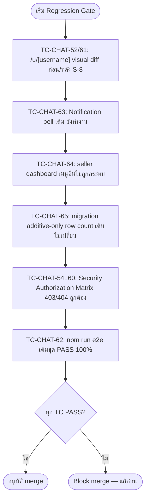

> **โมดูล:** M00011-DeepChat
> **ประเภทเอกสาร:** Test Case (E2E + API/Service Integration + Unit + Regression)
> **เวอร์ชัน:** 1.0
> **วันที่จัดทำ:** 2026-07-03
> **สถานะ:** Draft — เขียนก่อน implement (Documentation-First, Hard Rule 11) — **ห้าม execute** จนกว่า developer สร้างฟีเจอร์ครบ + migration `20260703000300_add_deep_chat_schema` apply แล้ว + realtime trigger `20260703000400_chat_realtime_broadcast` apply แล้ว
> **เจ้าของเอกสาร:** QA (ดู [[Feature-Docs-Ownership]])

# Test Case: Deep Chat (M00011)

---

## 1. Overview

ชุดทดสอบนี้ครอบคลุมฟีเจอร์ **Deep Chat (M00011)** — in-app chat แบบ shop-anchored (1 conversation ต่อคู่ `buyerUserId`+`shopId`), buyer-initiate only, ข้อความ TEXT/IMAGE, realtime ผ่าน Supabase broadcast-from-DB, 2 surface (buyer Vuexy `/messages`, seller Paces `/inbox`) + เปิดปุ่ม Chat บนโปรไฟล์สาธารณะ `/u/[username]` ที่เคย disabled ประกอบด้วย:

1. Initiation & Identity — buyer เริ่มบทสนทนา, seller ห้ามเริ่มใหม่, owner-only ฝั่ง seller (TFR-CHAT-01/02/03)
2. Messaging — TEXT (cap 2000), IMAGE (reuse upload, subset MIME, 1 รูป/ข้อความ), Rate-limit 30/min/user (TFR-CHAT-04/05/06)
3. Buyer Inbox + Thread + Realtime (TFR-CHAT-07/08)
4. Seller Inbox + Unread Badge + Thread + Realtime + `pacesToast` (TFR-CHAT-09/10)
5. Notification — Notification-always-then-clear-on-read pattern (TFR-CHAT-11)
6. เปิดปุ่ม Chat บน `/u/[username]` (TFR-CHAT-12, S-8 — สอบทานความเสี่ยง regression)
7. **Security — Authorization Matrix (SRS §10)** — ownership 403 cross-shop/cross-buyer (BRD Scenario 5)
8. **Regression Gate (Blocking)** — `/u/[username]` เดิม, notification bell เดิม, seller dashboard เดิม, `npm run e2e` เต็มชุด

ประเภทการทดสอบ: E2E Playwright (รวม **2-browser-session** สำหรับ realtime), API integration (`page.request.*`), Unit (Vitest — Valibot schema, constants), Service integration (Vitest — race condition `getOrCreateConversation`, `getUnreadCountForShop`, notification clear), Code review/grep (no-seller-initiate-route, `pacesToast`-only, PII neutralize-at-source, no-admin-chat-access)

**เอกสารต้นทาง:** [[BRD]] ของโมดูลนี้ — ทุก test case trace กลับ FR-CHAT-01..12/BR-CHAT-01..12 และ `[FR-CHAT-XX-AC-YY]`; รายละเอียด implementation อ้าง [[SRS]] (TFR-CHAT-01..12, Authorization Matrix §10), [[API]] (Error Code Summary §5), [[DATABASE]] (FROZEN CONTRACT §3), scope baseline `docs/scope/2026-07-03-00011-deep-chat-scope-baseline.md` (S-1..S-15)

**ขอบเขตชุดทดสอบ (Scope):**

- **In-scope:** buyer subdomain (`deepth.local:4000`), seller subdomain (`seller.deepth.local:4000`), Playwright E2E (single + 2-browser-context สำหรับ realtime), API integration, service-level integration (Vitest — race/notification/unread-count), Unit (Valibot schema + chat constants), Regression suite เต็มชุด (`npm run e2e`) รวม `/u/[username]` + notification bell + seller dashboard เดิม
- **Out-of-scope (ตรงกับ scope baseline OOS-1..13 — แตะ = CREEP):** mobile app `/api/app/chat/*` + push, order/product deep-linked context card, Business member routing, typing indicator, per-message read receipt, seller-initiated/broadcast message, scam-link detection, response-rate trust metric, voice/multi-image/file attachment อื่น, block/report ผู้ใช้, Follow system, admin เข้าถึง/moderate เนื้อหาบทสนทนา, แก้ logic ส่วนอื่นของ `/u/[username]` นอกปุ่ม Chat
- **สภาพแวดล้อม:**
  - dev server `http://deepth.local:4000` (buyer) + `http://seller.deepth.local:4000` (seller) — user รันเอง, ห้าม QA agent start เอง
  - DB: Supabase dev (`.env.local`) — **ต้อง apply migration `20260703000300` + `20260703000400` ก่อน** — ทุก test case ในเอกสารนี้ **Blocked** จนกว่าจะ apply
  - Playwright: `playwright.config.ts` (baseURL `http://seller.deepth.local:4000`, workers 1, ไม่ auto-start server) — test buyer subdomain ต้องเปิด `page.goto('http://deepth.local:4000/...')` เต็ม URL
  - Vitest: `npm run test` — unit/service-integration ที่ไม่ต้องใช้ browser
  - Auth bypass: `e2e/helpers/auth.ts` — `createSeller(state)` + `loginAs(context, seeded)`; ต้องมี/สร้าง helper คู่ขนานฝั่ง buyer (`createBuyer`/`loginAsBuyer`) ถ้ายังไม่มี
  - **2-browser-session pattern:** ใช้ Playwright `browser.newContext()` 2 อัน (context A = buyer, context B = seller) เปิดพร้อมกันใน test เดียว

**🛑 HIGH RISK — เหตุผลที่หมวด L (Regression) เป็น blocking gate:** S-8 แก้ไฟล์ `UserProfileHeader.tsx` ของหน้า `/u/[username]` ที่ **SIGNED-OFF + live prod แล้ว** (2026-05-23) — ความเสี่ยงสูงสุดคือ regression หน้านี้ (trust banner/badge/product grid/rating). นอกจากนี้ `Notification.kind` เป็นค่าใหม่ที่ insert เข้า table เดิมที่ bell notification ใช้อยู่

---

## 2. Test Scenarios

### หมวด A — Initiation & Identity (TFR-CHAT-01/02/03, FR-CHAT-01/02/03, BR-CHAT-01/02/03/04)

#### TC-CHAT-01: Buyer login แล้ว กดปุ่ม Chat ครั้งแรก → สร้าง Conversation ใหม่ + เข้า Thread
- **Linked to:** `[FR-CHAT-01-AC-01]` · **ประเภท:** E2E Playwright + DB verify
- **Steps:** `loginAsBuyer` → `page.goto('/u/{shopUsername}')` → คลิก Chat → รอ navigate `/messages/{shopId}` → Query DB
- **Expected:** URL `/messages/{shopId}`; `conversation.buyerUserId=session userId`, `shopId` ตรง, `lastMessageAt/lastMessagePreview/lastSenderRole=NULL`

#### TC-CHAT-02: กดซ้ำกับร้านเดิม → เปิด Conversation เดิม ไม่สร้างซ้ำ
- **Linked to:** `[FR-CHAT-01-AC-02]`, BRD Scenario 3 · **ประเภท:** E2E + DB verify
- **Expected:** `conversation` count = 1; 5 ข้อความเดิมอยู่ครบ; id เดียวกับก่อนหน้า

#### TC-CHAT-03: Buyer ยังไม่ login กด Chat → redirect sign-in + returnUrl
- **Linked to:** `[FR-CHAT-01-AC-03]`, BRD Scenario 2 · **ประเภท:** E2E
- **Steps:** ไม่ login → คลิก Chat → ตรวจ redirect `/auth/sign-in?callbackUrl=%2Fmessages%2F{shopId}` → login สำเร็จ
- **Expected:** หลัง login redirect กลับ `/messages/{shopId}`

#### TC-CHAT-04: Server-side ไม่รับ `buyerUserId` จาก client body
- **Linked to:** `[FR-CHAT-01-AC-04]` · **ประเภท:** API integration
- **Steps:** `loginAsBuyer(userA)` → POST `/api/chat/conversations {shopId, buyerUserId: userB.id}`
- **Expected:** `conversation.buyerUserId === userA.id` (field buyerUserId ใน body ถูกเพิกเฉย)

#### TC-CHAT-05 (Race): `getOrCreateConversation` เรียกพร้อมกัน 2 ครั้ง → แถวเดียว
- **ประเภท:** Service integration (Vitest) · **Steps:** `Promise.allSettled` 2 ครั้ง
- **Expected:** ทั้งคู่ resolve, id เดียวกัน, DB แถวเดียว — รันซ้ำ ≥10 รอบ

#### TC-CHAT-06: `shopId` ไม่มีจริง → 404 · #TC-CHAT-07: ไม่มี session → 401 · #TC-CHAT-08: `shopId` ไม่ใช่ uuid → 400 · #TC-CHAT-09: idempotency เรียกซ้ำคืนแถวเดิม (200, ไม่ 409)
- **ประเภท:** API integration

#### TC-CHAT-10: Code review — ไม่มี route ให้ seller สร้าง Conversation ใหม่
- **Linked to:** `[FR-CHAT-02-AC-01]` · **ประเภท:** grep — ไม่พบ code path ให้ seller session `create()`

#### TC-CHAT-11: Seller ตอบได้เฉพาะ Conversation ที่มีอยู่+ของร้านตน (positive baseline)
- **Linked to:** `[FR-CHAT-02-AC-02]` · **ประเภท:** E2E (negative → หมวด K)

#### TC-CHAT-12: Business member (ShopMember ไม่ใช่ owner) ไม่ resolve shopId เข้าถึงแชท
- **Linked to:** `[FR-CHAT-03-AC-02]` · **ประเภท:** Service integration
- **Expected:** `getShopByUserId(memberUserId)` ไม่คืน shop A; `GET /conversations` → 404

### หมวด B — Messaging TEXT (TFR-CHAT-04)

#### TC-CHAT-13: ส่ง TEXT ถูกต้อง → บันทึก + denorm + broadcast
- **Linked to:** `[FR-CHAT-04-AC-01]` · **Expected:** `chatMessage.body/type=TEXT/senderRole=BUYER`; `conversation.lastMessagePreview/lastSenderRole/lastMessageAt` อัปเดต

#### TC-CHAT-14: TEXT ว่าง → 400 · #TC-CHAT-15: TEXT >2000 → 400 (boundary 2000 = pass)

#### TC-CHAT-16: senderRole verify ไม่ trust client — buyer ปลอมเป็น SHOP → 403
- **Linked to:** `[FR-CHAT-04-AC-03]`

#### TC-CHAT-17: sendMessage tx correctness — insert + denorm ใน tx เดียว
- **Linked to:** BRD §6.1 · **Expected:** `lastMessagePreview` ตรง `chatMessage.body` ล่าสุดเสมอ

### หมวด C — Messaging IMAGE (TFR-CHAT-05)

#### TC-CHAT-18: อัปโหลดถูกเงื่อนไข → ส่ง IMAGE สำเร็จ, render `/api/files/{id}`
- **Linked to:** `[FR-CHAT-05-AC-01]` · **Expected:** `chatMessage.imageUrl === fileId` (raw fileId)

#### TC-CHAT-19: ไฟล์ >5MB → ปฏิเสธก่อนบันทึก · #TC-CHAT-20: `application/pdf` เข้า chat → ปฏิเสธ 400 (แคบกว่า lib/storage เดิม, server-side reject) · #TC-CHAT-21: IMAGE ไม่มี imageUrl → 400 · #TC-CHAT-22: input file ไม่มี `multiple` (1 รูป/ข้อความ)

### หมวด D — Rate-limit (TFR-CHAT-06)

#### TC-CHAT-23: ข้อความที่ 31 ใน 1 นาที → 429 (Retry-After: 60) · #TC-CHAT-24: rate-limit แยกต่อ user (userA ชน limit, userB 200)

### หมวด E — Buyer Inbox (TFR-CHAT-07)

#### TC-CHAT-25: inbox เฉพาะของตน เรียง lastMessageAt ล่าสุด · #TC-CHAT-26: prefix "คุณ:" เมื่อ lastSenderRole=BUYER · #TC-CHAT-27: unread state ต่างจาก read · #TC-CHAT-28: cursor pagination (25→20+5) · #TC-CHAT-29: empty state ไม่ error

### หมวด F — Buyer Thread + Realtime (TFR-CHAT-08)

#### TC-CHAT-30: thread pagination เก่า→ใหม่ (35 msg, scroll-up load older)

#### TC-CHAT-31 **[REALTIME 2-BROWSER]**: Buyer thread เปิดค้าง, Seller ส่ง → ปรากฏไม่ต้องรีเฟรช
- **Linked to:** `[FR-CHAT-08-AC-02]` · **ประเภท:** E2E 2 context (A=buyer thread, B=seller ส่ง)
- **Expected:** ข้อความปรากฏใน Context A โดยไม่ reload

#### TC-CHAT-32: realtime fallback — channel ไม่ SUBSCRIBED → fetch-on-focus (ข้อความไม่หาย)

#### TC-CHAT-33: เปิด thread → buyerLastReadAt อัปเดต · #TC-CHAT-34: cursor createdAt โหลดเก่ากว่า ไม่ duplicate

### หมวด G — Seller Inbox + Unread Badge (TFR-CHAT-09)

#### TC-CHAT-35: inbox เฉพาะร้านตน เรียงล่าสุด · #TC-CHAT-36: unread badge ตรง getUnreadCountForShop · #TC-CHAT-37: shop ไม่มี conversation → ไม่มี badge, empty state ไม่ error

#### TC-CHAT-38: getUnreadCountForShop combination correctness (Vitest)
- **Steps:** seed 5 conversation ต่างสถานะ → **Expected:** คืน 2 (เฉพาะ lastSenderRole=BUYER + unread)

#### TC-CHAT-39: conversation ที่ seller เพิ่งตอบเอง (lastSenderRole=SHOP) ไม่นับ unread ของ shop

### หมวด H — Seller Thread + Realtime + Toast (TFR-CHAT-10)

#### TC-CHAT-40: thread pagination เหมือน buyer · #TC-CHAT-41: ตอบเฉพาะร้านตน (positive) · #TC-CHAT-42: shopLastReadAt อัปเดต

#### TC-CHAT-43: Toast = pacesToast เท่านั้น (grep react-toastify = 0; success top-right)
- **Linked to:** `[FR-CHAT-10-AC-04]`, Hard Rule 9

#### TC-CHAT-44 **[REALTIME 2-BROWSER]**: Seller thread เปิดค้าง, Buyer ส่ง → ปรากฏ realtime

### หมวด I — Notification (TFR-CHAT-11)

#### TC-CHAT-45: ผู้รับ offline → สร้าง Notification (kind=chat_message, read=false) · #TC-CHAT-46: markRead เคลียร์ Notification ค้าง (read=true; ซ้ำ = no-op)

#### TC-CHAT-47 **[REALTIME 2-BROWSER]**: ผู้รับอยู่ในห้อง → Notification สร้างแล้วเคลียร์เกือบทันที (~2s → read=true)

#### TC-CHAT-48 **[REALTIME 2-BROWSER]**: Seller หน้า dashboard อื่น เห็น pacesToast.chat.* bottom-right (channel chat:shop:{shopId}, senderRole=BUYER)
- **Linked to:** `[FR-CHAT-11-AC-02]`

#### TC-CHAT-49: ไม่มี mobile push (grep chat.service ไม่มี push call)

### หมวด J — เปิดปุ่ม Chat บน /u/[username] (TFR-CHAT-12, S-8)

#### TC-CHAT-50: ปุ่ม Chat active, navigate ถูกต้อง · #TC-CHAT-51: Follow + "⋯" ยัง disabled เดิม

#### TC-CHAT-52 (🛑 Regression): trust banner/badge/product grid/rating ไม่เปลี่ยน (visual/DOM diff ก่อน/หลัง S-8)
- **Linked to:** `[FR-CHAT-12-AC-03]`, OOS-13

#### TC-CHAT-53: shopId=null (buyer-only account) → ปุ่ม Chat ยัง disabled

### หมวด K — Security: Authorization Matrix (SRS §10, BRD Scenario 5)

#### TC-CHAT-54 (🛑 Scenario 5): Seller B GET ข้อความ Conversation ร้าน A → 403 (ไม่ leak content)
#### TC-CHAT-55: Seller B POST เข้า Conversation ร้าน A → 403 (ไม่มี ChatMessage ใหม่)
#### TC-CHAT-56: Seller B mark-read Conversation ร้าน A → 403
#### TC-CHAT-57: Buyer X เข้า Conversation ของ Buyer Y (cross-buyer) → 403
#### TC-CHAT-58: conversationId ไม่มีจริง → 404 (แยกจาก 403 "มีจริงแต่ไม่มีสิทธิ์")
#### TC-CHAT-59: ไม่มี admin endpoint เข้าถึงเนื้อหาบทสนทนา (grep admin/** = 0, OOS-12)
#### TC-CHAT-60: PII neutralize-at-source — RSC page ส่ง prop เฉพาะ shopId/conversationId (ไม่ prop-drill content)

### หมวด L — 🛑 Regression Gate (Blocking ก่อน merge)

#### TC-CHAT-61 (🛑): `/u/[username]` visual/E2E เทียบก่อน/หลัง (= TC-CHAT-52 ยกระดับ blocking)
#### TC-CHAT-62 (🛑): `npm run e2e` เต็มชุด PASS 100%
#### TC-CHAT-63 (🛑): Notification bell เดิม (auction/order kind) ยังทำงานถูกหลังเพิ่ม kind=chat_message
#### TC-CHAT-64: seller dashboard เมนูอื่น (orders/products) ไม่ถูกกระทบ (Scenario 4)
#### TC-CHAT-65: Migration additive-only — row count User/Shop/Notification เดิมไม่เปลี่ยน; Conversation/ChatMessage ใหม่ว่าง

### หมวด M — Unit (Valibot / Constants)

#### TC-CHAT-66: SendChatMessageSchema conditional-required (TEXT ว่าง/เกิน → fail; IMAGE ไม่มี imageUrl → fail; ok → pass)
#### TC-CHAT-67: Query schema boundary (messages take 1-100 default30; conversations take 1-50 default20)
#### TC-CHAT-68: chat-constants ตรง SRS §9 (2000/30/60000/[jpeg,png,webp] ไม่มี pdf/5MB)

### หมวด N — Cross-cutting Infra

#### TC-CHAT-69: `/api/chat/*` mutation ไม่มี Origin → 403 (guardApi ไม่ exclude) · #TC-CHAT-70: มี Origin ถูกแต่ไม่มี cookie → 401 · #TC-CHAT-71: self-chat edge (ไม่ block, YAGNI) → ไม่ error

---

## 3. Traceability Matrix (ย่อ — full ใน source)

ทุก AC ใน [[BRD]] (FR-CHAT-01..12 รวม 34 AC) มี TC รองรับครบ. Realtime critical: TC-CHAT-31/44/47/48 (2-browser). Security blocking: TC-CHAT-54..60. Regression blocking: TC-CHAT-61/62/63/64/65.

| Requirement | Test Case |
|---|---|
| FR-CHAT-01 (initiate/get-or-create/redirect/ownership) | TC-CHAT-01..09 |
| FR-CHAT-02/03 (no-seller-initiate, owner-only) | TC-CHAT-10,11,12,54,55,56 |
| FR-CHAT-04/05/06 (TEXT/IMAGE/rate-limit) | TC-CHAT-13..24 |
| FR-CHAT-07/08 (buyer inbox+thread+realtime) | TC-CHAT-25..34 |
| FR-CHAT-09/10 (seller inbox+badge+thread+toast) | TC-CHAT-35..44 |
| FR-CHAT-11 (notification) | TC-CHAT-45..49 |
| FR-CHAT-12 (chat button /u/[username]) | TC-CHAT-50..53,61 |
| Security (Authorization Matrix, PII) | TC-CHAT-54..60 |
| Regression Gate (blocking) | TC-CHAT-61..65 |
| Unit / Infra | TC-CHAT-66..71 |

---

## 4. Flow

### Regression Gate ก่อน Merge (หมวด L)

---

## 5. Seed Strategy (Prisma)

เพิ่ม `e2e/helpers/chat-seed.ts`: `seedConversation(...)`, `seedChatMessage(...)`, `seedManyChatMessages(convId, sender, count)`, `seedChatNotification(userId, convId, {read})`, `cleanupChatFixtures(convIds[])`. + `createBuyer/loginAsBuyer` คู่ขนาน `e2e/helpers/auth.ts` (seller มีแล้ว). + 2-browser-session pattern (`browser.newContext()` 2 อัน) สำหรับ TC-CHAT-31/44/47/48.

---

## 6. Dependencies ก่อน Implement + รัน Test

| Dependency | ผลต่อ TC | สถานะ |
|---|---|---|
| Migration `20260703000300` (Conversation/ChatMessage) | ทุก TC | Blocked (ยังไม่ apply) |
| Migration `20260703000400` (realtime trigger) | TC-CHAT-31,32,44,47,48 | Blocked (ยังไม่ apply) |
| `chat.service.ts` | ทุก TC service | Blocked |
| Routes `/api/chat/**` | API TC | Blocked |
| Valibot schema + `chat-constants.ts` | TC-CHAT-66,67,68 | Blocked |
| Buyer UI (S-9/S-10) + Seller UI (S-11/12/13) + S-8 | UI TC | Blocked |
| `e2e/helpers/chat-seed.ts` + buyer auth helper + 2-browser pattern | ทุก seeded TC | ต้องสร้างก่อนรัน |

---

## 7. ผลล่าสุด

| Run | วันที่ | ผล | ผู้ทดสอบ |
|-----|--------|-----|---------|
| Pre-implement | 2026-07-03 | Blocked — feature ยังไม่ implement | shinobu22 (QA agent) |

---

## 8. สรุป

**71 test case** (TC-CHAT-01..71) ครอบ FR-CHAT-01..12 + 34 AC + Authorization Matrix (SRS §10) + Error Code Summary (API §5). จุดเสี่ยงสูงสุด: realtime 2-browser (TC-31/44/47/48), security ownership (TC-54..60), regression gate `/u/[username]` + notification bell + `npm run e2e` (TC-61..65). ประเภท: E2E Playwright / API integration / Service integration (Vitest) / Unit / Code review. เขียนก่อน implement (Hard Rule 11) — รันได้หลัง migration apply + feature ครบ.

**Open Questions:** OD-CHAT-A (block/report) defer Phase 2; ChatMessage growth (append-only ไม่มี retention) = monitoring item หลัง launch.
