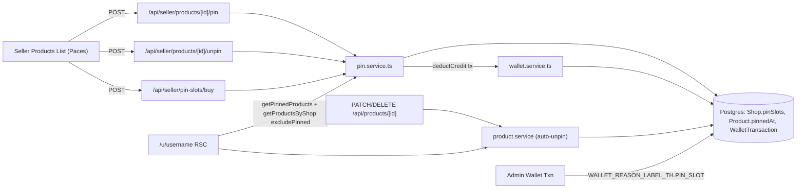

> **โมดูล:** M00012-PinProducts · **ประเภท:** SRS (TECHNICAL) · **สถานะ:** Draft

# SRS: Pin Products

## 1. บทนำ
กำหนดข้อกำหนดเชิงเทคนิคของ Pin Products (1 slot ฟรี + ซื้อเพิ่ม ฿99/slot ผ่าน `SellerWallet` เดิม) แทน `splitPinnedProducts` (interim 3 ชิ้นแรก) บนโปรไฟล์ `/u/[username]` + `/b/[slug]`. Trace: FR-PIN-01..09 / BR-PIN-01..13 / S-1..S-9.

**หลักการ:** additive ล้วน ยกเว้น 2 จุดแก้ที่ระบุ: (1) `product.service.ts::deleteProduct/updateProduct` auto-unpin hook (2) โปรไฟล์ + `views/pages/user-profile/{profile/index,index}.tsx` เปลี่ยน `splitPinnedProducts` → ข้อมูลปักหมุดจริง

### System Scope (in)
- `prisma/schema.prisma`: `Shop.pinSlots` (Int, default 1), `Product.pinnedAt` (DateTime?), index (dispatch safepay-database)
- `src/services/pin.service.ts` (ใหม่) — pin/unpin/buy business logic
- `src/services/product.service.ts` (แก้) — auto-unpin hook + `getProductsByShop` เพิ่ม `opts.excludePinned`
- `src/lib/pin-products.ts` (ใหม่) — `PIN_SLOT_PRICE = 99`
- `src/lib/inventory-addon.ts` (แก้) — `WALLET_REASON.PIN_SLOT` + `WALLET_REASON_LABEL_TH.PIN_SLOT='ปักหมุดสินค้า'` (registry เดิม; SMS_ORDER_LINK ก็อยู่ในนี้)
- `src/lib/validations.ts` — `BuyPinSlotSchema`
- Routes: `api/seller/products/[id]/{pin,unpin}/route.ts`, `api/seller/pin-slots/buy/route.ts`
- Seller UI: `(paces)/seller/(dashboard)/products/**` (toggle + indicator + Sweet Alert)
- Buyer UI: `(marketing)/{u/[username],b/[slug]}/page.tsx`, `views/pages/user-profile/{profile/index,index}.tsx`

### เอกสารอ้างอิงโค้ด
`wallet.service::deductCredit(shopId, amount, refId, description, reason, tx)` (reuse ตรง), `inventory-entitlement.service` (`$transaction` + `deductCredit(...,tx)` pattern), `api/inventory/subscribe/route.ts` (route pattern), `shop-context::requireActiveShop`, `inventory-addon::WALLET_REASON/_LABEL_TH`, `SubscribeButton.tsx` (Sweet Alert confirm+fetch), `paces-toast`, `profile/index.tsx::splitPinnedProducts`.

### นิยาม
- **Pin Slot:** `Shop.pinSlots` (Int, default 1, เพิ่มอย่างเดียว) · **Pinned Product:** `pinnedAt IS NOT NULL` · **pinnedCount:** derived count (ไม่เก็บ column) · **Auto-Unpin:** ล้าง `pinnedAt` เมื่อ `isActive` true→false · **Row lock:** `SELECT Shop FOR UPDATE` ใน `$transaction` — serialize pin/unpin/buy ต่อร้าน (cross-row cap ใช้ conditional-updateMany แบบ wallet ไม่ได้ — ดู SDS TD-001)

## 2. สถาปัตยกรรม

ไม่มี infra/queue/cron ใหม่ (Pin Slot ไม่หมดอายุ → ไม่ต้อง renewal cron ต่างจาก Deep Stock Pro)

## 3. TFR (เชิงเทคนิค)

### TFR-PIN-01 (FR-PIN-01, BR-PIN-01): Free Slot + Backfill
`Shop.pinSlots Int @default(1)`; migration `ADD COLUMN NOT NULL DEFAULT 1` backfill ทุกแถวในคำสั่งเดียว; แถวใหม่ได้ 1 จาก default (ไม่ต้องแก้ createShop/createProduct). Postcondition: ทุก Shop `pinSlots >= 1`.

### TFR-PIN-02 (FR-PIN-02, BR-PIN-02/03/04): ซื้อ Slot ฿99 atomic
`PIN_SLOT_PRICE=99` (`lib/pin-products.ts`); หักผ่าน `deductCredit(shopId, 99, productId, "ซื้อสล็อตปักหมุดสินค้า", WALLET_REASON.PIN_SLOT, tx)` — **reuse wallet.service** ใน `$transaction` เดียวกับเพิ่ม `pinSlots`+ปักหมุด. สำเร็จ → `WalletTransaction(DEDUCT, 99, reason=PIN_SLOT)` + `pinSlots+=1` ถาวร (ไม่มี TTL/renewal). เครดิตไม่พอ → `deductCredit` throw `INSUFFICIENT_CREDIT` → rollback ทั้งหมด. ไม่มี route ลด pinSlots (no downgrade, FR-PIN-02-AC-04).

### TFR-PIN-03 (FR-PIN-03, BR-PIN-05/08): Toggle + atomic slot-cap
- **Ownership:** route derive shopId จาก `requireActiveShop` (ไม่รับจาก client); service verify `tx.product.findFirst({where:{id, shopId}})` ไม่พบ → `PinProductNotFoundError` (404)
- **Atomic slot-cap:** `pinProduct` ต้อง row-lock Shop (`SELECT id FROM Shop WHERE id=$1 FOR UPDATE` ใน `$transaction`) ก่อนนับ `pinnedCount` เทียบ `pinSlots` — cap เป็น cross-row aggregate ใช้ conditional-updateMany ของ wallet ไม่ได้ (write-skew ภายใต้ READ COMMITTED). row lock = mutex ต่อร้าน
- **Idempotent:** pin/unpin ซ้ำ → คืนค่าเดิม ไม่ error/ไม่นับซ้ำ
- Postcondition: `pinnedCount ≤ pinSlots` เสมอ 100% แม้ concurrent. สินค้า `isActive=false` → `PinProductInactiveError` (400)

### TFR-PIN-04 (FR-PIN-04, BR-PIN-07): Slot-Full + Buy Inline (atomic)
slot เต็ม → UI Sweet Alert (ไม่เรียก /pin) → ยืนยัน → `POST /pin-slots/buy {productId}` → `buyPinSlotAndPin`:
1. row-lock Shop (FOR UPDATE)
2. verify ownership + isActive
3. ถ้าปักหมุดอยู่แล้ว (UI ล้าหลัง) → คืน state **ไม่หักซ้ำ** (idempotent กัน double-charge)
4. `deductCredit(...99...,'PIN_SLOT',tx)` — INSUFFICIENT → rollback ทั้งหมด
5. `shop.update({pinSlots:{increment:1}})`
6. `product.update({pinnedAt: now})`
7. คืน pinState ใน tx เดียว
ทุก step commit/rollback พร้อมกัน (single `$transaction`) — ไม่มี partial state. ยกเลิก dialog = client ไม่ยิง (ไม่มี server logic).

### TFR-PIN-05 (FR-PIN-05, BR-PIN-06): Swap ฟรี
`unpinProduct(A)` + `pinProduct(C)` 2 call อิสระ ไม่เรียก `deductCredit` เลย → ไม่มี WalletTransaction. ไม่จำกัดครั้ง (นอกจาก per-IP mutation limit เดิม).

### TFR-PIN-06 (FR-PIN-06, BR-PIN-09): Render เรียง pinnedAt desc
`getPinnedProducts(shopId)` = `findMany({where:{shopId, isActive:true, pinnedAt:{not:null}}, orderBy:{pinnedAt:'desc'}, include:{tags:true}})` ไม่มี take. โปรไฟล์เรียกคู่ `getProductsByShop(shopId, 12, {excludePinned:true})`. **ไม่มี fallback** — pinned=[] → ไม่ query สินค้าอื่นมาแทน (ต่างจาก splitPinnedProducts เดิม).

### TFR-PIN-07 (FR-PIN-07, BR-PIN-10): ซ่อนโซนเมื่อว่าง
`ProfileRightContent` เช็ค `pinnedProducts.length===0` → ไม่ render block. `ProfileTabsNav` (`views/pages/user-profile/index.tsx`) เช็คเงื่อนไขเดียวกันก่อน push tab `{id:'pinned-products'}` (สืบทอด pattern hasProducts เดิม เปลี่ยนแค่ที่มา).

### TFR-PIN-08 (FR-PIN-08, BR-PIN-11): Auto-Unpin
2 entry point ที่ตั้ง `isActive=false`:
1. `deleteProduct` — เดิม `update({data:{isActive:false}})` → **แก้** `update({data:{isActive:false, pinnedAt:null}})` unconditional (idempotent; single UPDATE = atomic)
2. `updateProduct` — เมื่อ `data.isActive===false` เท่านั้น → `scalarUpdate.pinnedAt = null` (ไม่แตะเมื่อ isActive true/undefined — reactivate ไม่ auto re-pin)
Postcondition: `pinSlots` ไม่เปลี่ยน; ไม่มี WalletTransaction. ไม่มี route ใหม่ (logic ที่ service layer).

### TFR-PIN-09 (FR-PIN-09, BR-PIN-13): Admin Label
เพิ่ม `WALLET_REASON.PIN_SLOT` + `WALLET_REASON_LABEL_TH.PIN_SLOT='ปักหมุดสินค้า'` ใน `inventory-addon.ts`. หน้า `admin/(dashboard)/topups/[id]/page.tsx` lookup `WALLET_REASON_LABEL_TH[t.reason??'']` อยู่แล้ว → ไม่ต้องแก้ UI. transaction เก่า reason=null → ไม่ relabel.

## 4. API (สรุป — เต็มที่ [[API]])
| Method | Path | Auth |
|--------|------|------|
| POST | `/api/seller/products/[id]/pin` | session + active shop ownership |
| POST | `/api/seller/products/[id]/unpin` | session + active shop ownership |
| POST | `/api/seller/pin-slots/buy` | session + active shop ownership + Valibot |

## 5. Data
| Entity | คำอธิบาย |
|--------|----------|
| `Shop.pinSlots` | จำนวน slot (ฟรี+ซื้อ), Int default 1 |
| `Product.pinnedAt` | timestamp ปักหมุด, null=ไม่ปัก |
| `WalletTransaction.reason='PIN_SLOT'` | ledger ซื้อ slot |

🛑 **dispatch safepay-database ก่อน** — ห้าม `migrate dev` (shared dev/prod). ดู DATABASE.md.

### Query Change — Profile
```ts
// เดิม: getProductsByShop(shop.id, 12) → splitPinnedProducts(products)
// ใหม่:
const [pinnedRaw, otherRaw] = await Promise.all([
  getPinnedProducts(shop.id),
  getProductsByShop(shop.id, 12, { excludePinned: true }),
])
```
`ProfileTabData.products` → `pinnedProducts` + `otherProducts` (breaking type change → แก้ 2 page.tsx + profile/index.tsx + views/pages/user-profile/index.tsx พร้อมกัน = **atomic commit**). `getProductsByShop` 6 call-site เดิมไม่กระทบ (`opts?` optional ท้ายสุด).

## 6. NFR
| ด้าน | ข้อกำหนด |
|------|----------|
| Correctness atomic | `pinnedCount ≤ pinSlots` เสมอ แม้ concurrent — row-lock FOR UPDATE + integration test race |
| Correctness billing | หัก ฿99 ตรง ไม่ double/partial — reuse deductCredit ใน tx |
| Performance | index `Product(shopId, pinnedAt)` |
| Zero Regression | โปรไฟล์ไม่เพี้ยนนอกจากแหล่งข้อมูลโซนปักหมุด |
| Security | ownership server-side ทุกครั้ง ไม่รับ shopId จาก client |

## 7. ข้อจำกัดเทคนิค
- ใช้ `$transaction(async (tx)=>...)` interactive (ห้าม array-form) เพราะมี conditional throw
- `SELECT FOR UPDATE` บรรทัดแรกสุดใน tx ก่อน query อื่นที่อ่าน Product/Shop ของร้าน
- ห้ามแก้ signature `deductCredit` — reuse ผ่าน `tx` param

## 8. ความเสี่ยง
| ความเสี่ยง | ผลกระทบ | ลด |
|-----------|---------|-----|
| ลืม row-lock | pinnedCount เกิน cap ภายใต้ concurrent | review + integration test 2 concurrent |
| ลืม `pinnedAt` ใน updateProduct/deleteProduct | auto-unpin ไม่ทำงาน สินค้าปิดค้าง pinned | QA test ทุก entry set isActive=false |
| type change ข้าม 4 ไฟล์ | tsc ไม่ผ่านถ้าแก้ไม่ครบ | atomic commit เดียว |

## 9. Traceability
FR-PIN-01→TFR-PIN-01→Shop.pinSlots · 02→02→buyPinSlotAndPin+wallet · 03→03→pinProduct/unpinProduct · 04→04→buyPinSlotAndPin+route · 05→05→pin/unpin(no wallet) · 06→06→getPinnedProducts+profile · 07→07→ProfileRightContent+tabs · 08→08→product.service · 09→09→inventory-addon label

**Open Questions:** ไม่มี
