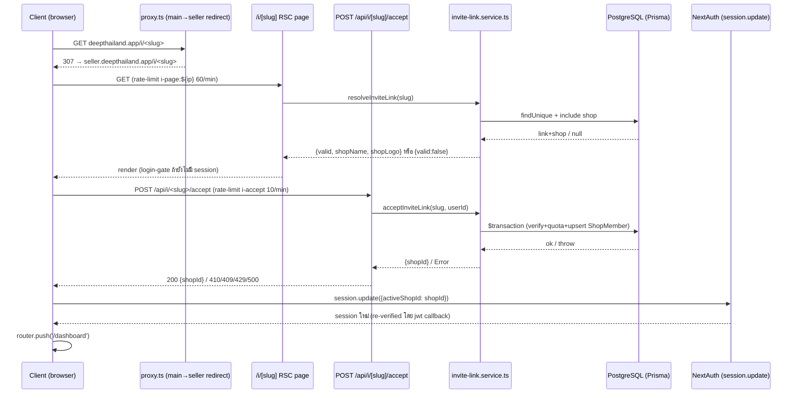

> **โมดูล:** M00012-ShopStaffInviteLinks
> **ประเภทเอกสาร:** API Contract — Back-fill (as-built)
> **เวอร์ชัน:** 1.0
> **วันที่จัดทำ:** 2026-07-04
> **สถานะ:** **As-built** — endpoint ทั้งหมดถูก implement + merge→main + deploy prod แล้วก่อนเอกสารนี้ถูกเขียน (ดู [[SRS]] §1.1)
> **เจ้าของเอกสาร:** SA (ดู [[Feature-Docs-Ownership]])

# API Contract: Shop Staff Invite Links

---

## 1. Overview

API ชุดนี้เป็นของใหม่ทั้งหมด (`/api/shops/current/invite-links*`, `/api/i/[slug]*`, `/api/shops/open-personal`) ไม่แก้ contract เดิมของ feature 00008 ใด ๆ — session-derived identity, ไม่รับ `shopId`/`userId` จาก client body (ยกเว้น `slug` ที่เป็น path param สาธารณะโดยตั้งใจ), error `{error: "<code>"}` แบบเดียวกับ endpoint เดิมของระบบ

**Provider:** Next.js 16 App Router Route Handlers (nodejs runtime)
**ผู้บริโภค:** `/admins` (seller Paces, RSC+client), `/i/[slug]` + `/i/invalid` (public landing, seller Paces direct route), `/choose-shop` (seller Paces direct route)
**Base URL:** `https://seller.deepthailand.app` (prod) — dev: `https://seller.deepth.local:4000`; ลิงก์เชิญเดิมอยู่บน main domain (`https://deepthailand.app/i/<slug>`) แต่ **proxy redirect ทันที** ไป seller subdomain ก่อนถึง route handler ใด ๆ (ดู [[SRS]] TFR-STAFF-13)
**ต้นทาง:** [[SDS]] §3; schema → [[DATABASE]] (migration `20260704000300_add_shop_invite_link` — apply แล้ว)

---

## 2. Authentication

| รายการ | ค่า |
|--------|-----|
| **วิธี (Auth Method)** | NextAuth v4 session cookie (per-subdomain — seller session) |
| **Header** | ไม่มี custom header — cookie ส่งอัตโนมัติจาก browser |
| **Token/Scope** | `getServerSession(authOptions)` → `session.user.id`; endpoint owner-only (invite-links CRUD) ต้อง `requireActiveShop().kind==='BUSINESS' && role==='OWNER'` เพิ่ม |
| **กรณีไม่ผ่าน** | ไม่มี session → 401 `{error:"unauthorized"}`; มี session แต่ไม่ใช่ owner ของ Business shop → 403 `{error:"NOT_OWNER"}` |

**ข้อยกเว้น:** `GET /api/i/[slug]` **ไม่ต้อง auth** (public landing resolve) — ป้องกันด้วย rate-limit + opaque error แทน (ดู §6, §7)

**CSRF/rate-limit ทั่วไป:** `guardApi` ใน `src/proxy.ts` (Origin-check mutation + per-IP rate-limit) apply อัตโนมัติกับทุก path ที่ขึ้นต้น `/api/*` **ยกเว้น** RSC page `/i/[slug]` ที่เรียก service ตรง (ไม่ผ่าน `/api` เลย — มี rate-limit แยกในตัว page เอง ดู §6)

---

## 3. Endpoint List

| Method | Path | คำอธิบาย | Auth | สถานะ |
|--------|------|----------|------|-------|
| `POST` | `/api/shops/current/invite-links` | owner สร้างลิงก์เชิญของ active shop | owner session (BUSINESS+OWNER) | as-built |
| `GET` | `/api/shops/current/invite-links` | list ลิงก์ active ของ active shop | owner session | as-built |
| `DELETE` | `/api/shops/current/invite-links/[slug]` | owner revoke ลิงก์ | owner session | as-built |
| `GET` | `/api/i/[slug]` | resolve ลิงก์ (public, rate-limited, opaque) | ไม่ต้อง auth | as-built |
| `POST` | `/api/i/[slug]/accept` | ยอมรับคำเชิญ | ต้อง login | as-built |
| `POST` | `/api/shops/open-personal` | เปิด Personal shop (become-seller, idempotent) | ต้อง login | as-built |

---

## 4. Endpoint Detail

### 4.1 `POST /api/shops/current/invite-links`

owner ของ active Business shop สร้างลิงก์เชิญใหม่ Trace: [[SDS]] §3.3 → [[SRS]] TFR-STAFF-01

**Request Body:**
```json
{ "expiryKey": "7d" }
```

| field | type | req | คำอธิบาย |
|-------|------|-----|----------|
| `expiryKey` | `"24h" \| "7d" \| "30d"` | no | default `DEFAULT_INVITE_EXPIRY_KEY = "7d"` ถ้าไม่ส่ง/omit |

**Valibot:** `inviteLinkCreateSchema`

**Success 201:**
```json
{
  "url": "https://deepthailand.app/i/AbC123xYz789",
  "slug": "AbC123xYz789",
  "expiresAt": "2026-07-11T10:00:00.000Z"
}
```

**Errors:**
| Status | เงื่อนไข | body |
|--------|----------|------|
| 400 | `expiryKey` ไม่ตรง picklist | `{"error":"VALIDATION_ERROR"}` |
| 401 | ไม่มี session | `{"error":"unauthorized"}` |
| 403 | ไม่มี active shop resolve ได้ / ไม่ใช่ `BUSINESS`+`OWNER` | `{"error":"NOT_OWNER"}` |
| 403 | shop ถูก `packageLockedAt` ล็อก | `{"error":"SHOP_LOCKED"}` |
| 403 | ไม่มี `BusinessPackageSubscription` ที่ `status='ACTIVE'` | `{"error":"NO_ACTIVE_PACKAGE"}` |
| 429 | rate-limit ทั่วไป (per-IP, `guardApi`) | `{"error":"Rate limit exceeded"}` |
| 500 | `SLUG_COLLISION` (unreachable ในทางปฏิบัติ) หรือ exception อื่น | `{"error":"INTERNAL_ERROR"}` |

**Idempotency:** ไม่ idempotent — เรียกซ้ำสร้างลิงก์ใหม่ทุกครั้ง (ไม่มี dedup ตาม intent — owner ตั้งใจสร้างหลายลิงก์ได้)

---

### 4.2 `GET /api/shops/current/invite-links`

list ลิงก์ที่ยัง active (ไม่ revoke, ไม่หมดอายุ) ของ active shop Trace: [[SDS]] §3.3 → [[SRS]] TFR-STAFF-02

**Query params:** ไม่มี (ไม่มี pagination — จำนวนลิงก์ต่อร้านคาดว่าน้อย)

**Success 200:**
```json
{
  "links": [
    { "url": "https://deepthailand.app/i/AbC123xYz789", "slug": "AbC123xYz789", "expiresAt": "2026-07-11T10:00:00.000Z", "createdAt": "2026-07-04T10:00:00.000Z" }
  ]
}
```

**Errors:**
| Status | เงื่อนไข | body |
|--------|----------|------|
| 401 | ไม่มี session | `{"error":"unauthorized"}` |
| 403 | ไม่ใช่ `BUSINESS`+`OWNER` | `{"error":"NOT_OWNER"}` |
| 429 | rate-limit ทั่วไป | `{"error":"Rate limit exceeded"}` |
| 500 | exception | `{"error":"INTERNAL_ERROR"}` |

---

### 4.3 `DELETE /api/shops/current/invite-links/[slug]`

owner revoke ลิงก์เชิญของ active shop Trace: [[SDS]] §3.3 → [[SRS]] TFR-STAFF-03

**Path param:** `slug`

**Success 204:** ไม่มี body

**Errors:**
| Status | เงื่อนไข | body |
|--------|----------|------|
| 401 | ไม่มี session | `{"error":"unauthorized"}` |
| 403 | ไม่ใช่ `BUSINESS`+`OWNER` ของ active shop **หรือ** `slug` ไม่ใช่ของ shop นี้ | `{"error":"NOT_OWNER"}` |
| 429 | rate-limit ทั่วไป | `{"error":"Rate limit exceeded"}` |
| 500 | exception | `{"error":"INTERNAL_ERROR"}` |

**Idempotency:** idempotent — revoke ลิงก์ที่ revoke ไปแล้ว ไม่ throw (no-op, ไม่ทับ `revokedAt` เดิม) แต่ยังคืน 204 เหมือนเดิม

---

### 4.4 `GET /api/i/[slug]`

resolve ลิงก์เชิญสำหรับหน้า landing สาธารณะ — **ไม่ต้อง auth** Trace: [[SDS]] §3.3 → [[SRS]] TFR-STAFF-04

**Path param:** `slug`

**Success 200 (valid):**
```json
{ "valid": true, "shopName": "ร้านนกน้อย", "shopLogo": "abc123.jpg" }
```

**Success 200 (invalid — opaque, ไม่แยก reason):**
```json
{ "valid": false }
```

**หมายเหตุสำคัญ (TD-006):** response **ไม่มี field `shopId`/`reason`** ไม่ว่ากรณีใด (แม้ `valid:true` ก็ไม่คืน `shopId` — ไม่จำเป็นสำหรับ landing display) — ป้องกัน oracle attack แยกแยะ `NOT_FOUND`/`EXPIRED`/`REVOKED`

**Errors:**
| Status | เงื่อนไข | body |
|--------|----------|------|
| 429 | เกิน 60 req/min/IP (key `${ip}:i-resolve`) | `{"error":"RATE_LIMITED"}` + header `Retry-After: 60` |

**Idempotency:** idempotent, read-only (ไม่มี side-effect)

**⚠️ หมายเหตุ dual-path:** endpoint นี้**ไม่ใช่**ทางเดียวที่ resolve slug — RSC page `/i/[slug]/page.tsx` เรียก `resolveInviteLink()` ตรง (ไม่ผ่าน endpoint นี้เลย) มี rate-limit แยกต่างหาก (key `i-page:${ip}`, 60/min เท่ากันแต่ bucket แยก) ดู [[SDS]] TD-005

---

### 4.5 `POST /api/i/[slug]/accept`

ผู้ใช้ที่ login แล้วกดยอมรับคำเชิญ — สร้าง `ShopMember(role=ADMIN)` Trace: [[SDS]] §3.3/§4.1 → [[SRS]] TFR-STAFF-05..08

**Path param:** `slug`

**Request Body:** `{}` (ว่าง — `userId` มาจาก session, ไม่รับจาก client)

**Success 200:**
```json
{ "shopId": "clx1a2b3c4d5e6f7g8h9i0j1" }
```

**สำคัญ (client ต้องทำต่อ):** route นี้**ไม่**ตั้ง `session.activeShopId` — client ต้องเรียก NextAuth `useSession().update({activeShopId: data.shopId})` เองหลังได้ 200 กลับไป แล้ว jwt callback จะ re-verify membership อีกชั้นก่อนเชื่อค่านี้จริง (mirror `/api/business/switch-context` constraint เดิม — ดู [[SDS]] TD-004)

**Errors:**
| Status | เงื่อนไข | body |
|--------|----------|------|
| 401 | ไม่มี session | `{"error":"unauthorized"}` |
| 410 | link ไม่มี/`revokedAt`ไม่ null/`expiresAt<=now()` | `{"error":"LINK_INVALID"}` |
| 409 | ผู้เรียกคือ owner ของ shop นี้เอง | `{"error":"ALREADY_OWNER"}` |
| 409 | โควตา `maxAdminsPerBusiness` เต็ม (ไม่นับผู้ที่เป็นสมาชิกอยู่แล้ว — idempotent bypass) | `{"error":"ADMIN_QUOTA_EXCEEDED"}` |
| 429 | เกิน 10 req/min/IP (key `${ip}:i-accept`, เข้มกว่า resolve เพราะมี side-effect) | `{"error":"RATE_LIMITED"}` + header `Retry-After: 60` |
| 500 | exception ไม่รู้จัก | `{"error":"INTERNAL_ERROR"}` |

**Idempotency:** idempotent สำหรับผู้ที่เป็นสมาชิกอยู่แล้ว (คืน 200 `{shopId}` เดิม ไม่สร้างแถวซ้ำ ไม่นับโควตาซ้ำ) — **ไม่** idempotent สำหรับผู้ที่ยังไม่เป็นสมาชิก (เรียก 2 ครั้งพร้อมกันตอนโควตาเหลือ 1 ที่ = มีคนเดียวสำเร็จ อีกคน `ADMIN_QUOTA_EXCEEDED`, TOCTOU known-gap ดู [[SRS]] §9)

**Side-effects:** insert/upsert `ShopMember(shopId, userId, role='ADMIN')` — ไม่มี broadcast/notification/email ใด ๆ (ตรงข้ามกับ feature 00011 Deep Chat ที่มี realtime — feature นี้ไม่มี real-time component เลย)

---

### 4.6 `POST /api/shops/open-personal`

login แล้ว "เปิดร้านของฉัน" — สร้าง Personal shop lazily (idempotent) Trace: [[SDS]] §3.12 → [[SRS]] TFR-STAFF-12

**Request Body:** ไม่มี (empty POST)

**Success 200:**
```json
{ "shopId": "clz9y8x7w6v5u4t3s2r1q0p9" }
```

**Errors:**
| Status | เงื่อนไข | body |
|--------|----------|------|
| 401 | ไม่มี session | `{"error":"unauthorized"}` |
| 500 | **exception ใด ๆ ก็ตาม** (ไม่มี typed-error catch เฉพาะ — ดู AS-BUILT DEVIATION ด้านล่าง) | `{"error":"INTERNAL_ERROR"}` |

**⚠️ AS-BUILT DEVIATION:** route นี้**ไม่มี** catch แยกตาม error type เหมือน endpoint อื่นของ feature นี้ (`NOT_OWNER`/`LINK_INVALID`/ฯลฯ) — ทุก exception ที่ไม่ใช่ "ไม่มี session" จบที่ generic 500 `INTERNAL_ERROR` เสมอ เพราะ `ensurePersonalShop`/`prisma.user.update` ที่เรียกใช้ไม่มี typed throw ให้แยกจับ ณ ตอนเขียน (ทั้งคู่เป็น idempotent operation ที่ไม่ได้ออกแบบให้ throw business-error)

**Idempotency:** idempotent เต็มรูปแบบ — เรียกซ้ำเมื่อมี Personal shop อยู่แล้ว คืน `shopId` เดิม (ไม่สร้างซ้ำ, `isShop=true` update ซ้ำไม่มีผลข้างเคียง) **แต่ไม่ atomic** (2 statement — `ensurePersonalShop` + `prisma.user.update` — ไม่ wrap `$transaction`; race window เล็กมากถ้า statement ที่ 2 fail ระหว่างกลาง จะเหลือ Personal shop สร้างแล้วแต่ `isShop` ยังเป็น `false`, เรียกซ้ำแก้ได้เพราะ idempotent ทั้งคู่)

---

## 5. Error Code Summary

| Error Code | HTTP Status | ใช้ที่ endpoint | ความหมาย |
|------------|-------------|-----------------|----------|
| `unauthorized` | 401 | ทุก endpoint ที่ auth required | ไม่มี session |
| `VALIDATION_ERROR` | 400 | `POST invite-links` | Valibot validate fail |
| `NOT_OWNER` | 403 | `invite-links` (POST/GET/DELETE) | ไม่ใช่ owner ของ Business shop, หรือ slug ไม่ใช่ของ shop นี้ (DELETE) |
| `SHOP_LOCKED` | 403 | `POST invite-links` | shop ถูก package lock |
| `NO_ACTIVE_PACKAGE` | 403 | `POST invite-links` | ไม่มี subscription ACTIVE |
| `LINK_INVALID` | 410 | `POST i/[slug]/accept` | ลิงก์ไม่มี/หมดอายุ/ถูก revoke |
| `ALREADY_OWNER` | 409 | `POST i/[slug]/accept` | ผู้เรียกคือ owner ของ shop นี้เอง |
| `ADMIN_QUOTA_EXCEEDED` | 409 | `POST i/[slug]/accept` | โควตา admin เต็ม |
| `RATE_LIMITED` | 429 | `GET i/[slug]`, `POST i/[slug]/accept` | rate-limit เฉพาะของ feature นี้ (แยกจาก global `guardApi`) |
| `Rate limit exceeded` | 429 | `invite-links*` (ผ่าน `guardApi` ทั่วไป) | rate-limit ระดับ proxy (per-IP global) |
| `INTERNAL_ERROR` | 500 | ทุก endpoint | exception ไม่รู้จัก/ไม่มี typed catch |

**โครง error response:**
```json
{ "error": "<ERROR_CODE>" }
```

---

## 6. Rate-limit Detail

| Layer | Key | Max | Window | Endpoint |
|-------|-----|-----|--------|----------|
| Global per-IP (`guardApi`, `proxy.ts`, มีอยู่แล้ว) | `${ip}:auth:mut` / `${ip}:auth:get` | mutation 30/unauth 100, read 120/unauth 200 | 60s | ทุก path `/api/shops/current/invite-links*`, `/api/i/[slug]/accept`, `/api/shops/open-personal` |
| Resolve per-IP (ใหม่, API route) | `${ip}:i-resolve` | 60/min | 60s | `GET /api/i/[slug]` เท่านั้น |
| Resolve per-IP (ใหม่, RSC page — **แยก bucket จากข้างบน**) | `i-page:${ip}` | 60/min | 60s | `/i/[slug]/page.tsx` (ไม่ผ่าน `/api`, ไม่ผ่าน `guardApi`) |
| Accept per-IP (ใหม่, เข้มกว่า resolve) | `${ip}:i-accept` | 10/min | 60s | `POST /api/i/[slug]/accept` เท่านั้น (มี side-effect) |

Known-gap: ทุก rate-limit เป็น in-memory per-instance (Vercel serverless) — เหมือนระบบเดิมทั้งหมด (Redis = Phase 2, ไม่ใช่ scope feature นี้)

---

## 7. Sequence — Accept Flow (cross-subdomain + client session.update)



---

## 8. Traceability

| Endpoint | SDS Component/Decision | SRS TFR |
|----------|--------------------------|--------|
| `POST /api/shops/current/invite-links` | [[SDS]] §3.3 | TFR-STAFF-01 |
| `GET /api/shops/current/invite-links` | [[SDS]] §3.3 | TFR-STAFF-02 |
| `DELETE /api/shops/current/invite-links/[slug]` | [[SDS]] §3.3 | TFR-STAFF-03 |
| `GET /api/i/[slug]` | [[SDS]] §3.3, TD-006 | TFR-STAFF-04 |
| `POST /api/i/[slug]/accept` | [[SDS]] §3.3, §4.1, TD-004 | TFR-STAFF-05..08 |
| `POST /api/shops/open-personal` | [[SDS]] §3.12 | TFR-STAFF-12 |

---

## 9. สรุป (Summary)

เอกสารนี้กำหนดสัญญาการเชื่อมต่อของ 6 endpoint ที่ implement จริงสำหรับ Shop Staff Invite Links (M00012) — as-built back-fill จากโค้ด `src/app/api/shops/current/invite-links/**`, `src/app/api/i/[slug]/**`, `src/app/api/shops/open-personal/route.ts`

**จุดสำคัญที่ dev คนถัดไปต้องรู้ก่อนแก้ต่อ:**
1. `GET /api/i/[slug]` **ไม่ใช่ทางเดียว** ที่ resolve slug — RSC page `/i/[slug]` เรียก service ตรง มี rate-limit bucket แยกต่างหาก (§4.4, §6)
2. `POST .../accept` และ `open-personal` **ไม่ตั้ง `session.activeShopId`** — client ต้องเรียก `session.update()` เองเสมอ (§4.5)
3. `open-personal` มี error-handling ที่หลวมกว่า endpoint อื่น (generic 500 เสมอ, ไม่มี typed catch — §4.6)
4. Response ของ `GET /api/i/[slug]` **ตั้งใจ opaque** — ห้ามเพิ่ม `reason`/`shopId` เข้า response แม้จะดู helpful สำหรับ UX (ละเมิด TD-006 security design)

**Open Questions:** ไม่มี (feature deploy สมบูรณ์แล้ว — ดู [[SRS]] §14 สำหรับ open items เชิง regression/quota-race ที่ยังไม่ปิด)
