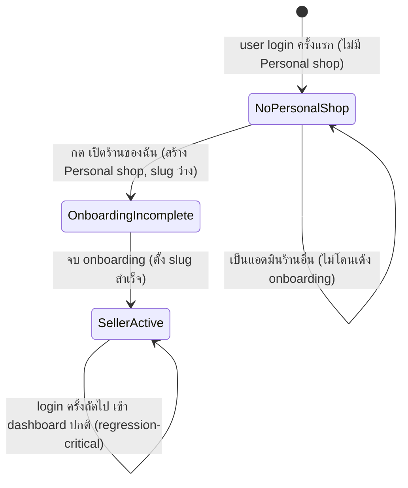

> **โมดูล:** M00012-ShopStaffInviteLinks
> **ประเภทเอกสาร:** Business Requirements Document (BRD) — NON-TECHNICAL
> **เวอร์ชัน:** 1.0
> **วันที่จัดทำ:** 2026-07-04
> **สถานะ:** **As-built — implement เสร็จ + merge→main + deploy prod แล้วก่อนเอกสารนี้ถูกเขียน** (back-fill ปิดหนี้ Hard Rule 11 — ไม่ใช่เอกสารที่รอ sign-off ก่อน implement) ดู `docs/scope/2026-07-04-00012-shop-staff-invite-scope-baseline.md`
> **เจ้าของเอกสาร:** BA (ดู [[Feature-Docs-Ownership]])

# BRD: Shop Staff Invite Links (พนักงาน) (Business Requirements Document)

---

## 1. บทนำ

### 1.1 วัตถุประสงค์ของเอกสาร

1. กำหนด Functional Requirements ระดับ non-technical ของฟีเจอร์เชิญพนักงานเข้าร้านผ่านลิงก์แชร์ (แทนการเชิญแบบกรอกเบอร์/อีเมลทีละคนเดิม)
2. กำหนดกฎการสร้าง/ใช้งานลิงก์เชิญ (อายุ, revoke, โควตา, idempotency) และกฎการแยก "แอดมินร้านคนอื่น" ออกจาก "การเป็นผู้ขาย (seller)"
3. ระบุเงื่อนไขการรับงาน (Acceptance Criteria) แบบ Given/When/Then สำหรับทีม QA — โดยเฉพาะ scope ownership (ใครสร้าง/revoke/ดูอะไรได้), regression บน login invariant เดิม, และ post-login routing ตามจำนวนร้าน
4. บันทึกสถานะจริงของการทดสอบ ณ วันที่จัดทำเอกสาร (back-fill) เพื่อให้ทีมถัดไปรู้ว่าอะไร verified แล้ว อะไรยัง pending

### 1.2 ขอบเขตของระบบ

**Shop Staff Invite Links** คือระบบที่เจ้าของร้าน BUSINESS สร้างลิงก์เชิญแบบ **reusable** (`deepthailand.app/i/<slug>`) มีวันหมดอายุที่เลือกได้ (24 ชม./7 วัน/30 วัน) และปิดใช้งาน (revoke) ได้ทุกเมื่อ ผู้ถูกเชิญ login แล้ว accept เพื่อกลายเป็น `ShopMember(role=ADMIN)` ของร้านนั้น **โดยไม่ถือเป็นผู้ขาย** ระบบเปลี่ยนพฤติกรรมเดิมที่ทุก user ต้องมีร้านส่วนตัว (Personal shop) auto-create ตอน login ให้เป็น **Lazy** (สร้างเฉพาะเมื่อ user ตั้งใจ) และเพิ่มหน้าเลือกร้าน (`/choose-shop`) สำหรับ user ที่เกี่ยวข้องกับมากกว่า 1 ร้าน

**เข้าสู่ระบบ (Input):** คำสั่งสร้าง/revoke ลิงก์เชิญ (พร้อมอายุที่เลือก); คำสั่งเปิดลิงก์เชิญ (`slug`); คำสั่งยอมรับคำเชิญ; คำสั่งถอดสมาชิก; คำสั่งเปิดร้านของตัวเอง

**ออกจากระบบ (Output):** `ShopInviteLink` record ใหม่/ที่ถูก revoke; `ShopMember(role=ADMIN)` ใหม่หรือ idempotent no-op; การสลับ active shop context (`session.activeShopId`); Personal shop ใหม่ (เมื่อกด "เปิดร้านของฉัน")

**ระบบที่เกี่ยวข้อง:** `ShopMember`/`BusinessPackageSubscription` (feature 00008), NextAuth (`src/lib/auth.ts`), `src/proxy.ts`, `src/lib/shop-context.ts`, FB/LINE OAuth + Phone-OTP provider เดิม, `api-rate-limit.ts`

### 1.3 กลุ่มผู้ใช้งาน

| กลุ่มผู้ใช้ | บทบาท | สิทธิ์การใช้งาน |
|-----------|--------|----------------|
| **Owner (ร้าน BUSINESS, package ACTIVE)** | ผู้สร้าง/revoke ลิงก์เชิญ, จัดการทีมงาน | สร้าง/revoke ลิงก์ของร้านตนเอง; ดู/ถอดสมาชิกร้านตนเอง |
| **Invitee (ผู้ถูกเชิญ — ยัง/มี Deep account)** | ผู้เปิดลิงก์และ accept | login ผ่านลิงก์แล้ว accept เป็น ADMIN ของร้านที่เชิญเท่านั้น |
| **Admin (ShopMember role=ADMIN)** | สมาชิกที่ accept แล้ว | เข้าถึง dashboard ของร้านที่เป็นสมาชิก — ไม่มีสิทธิ์สร้าง/revoke ลิงก์ |
| **User หลายร้าน (Personal + Business member)** | เลือกบริบทร้านที่ acting อยู่ | เห็นหน้า `/choose-shop` เมื่อมี ≥2 ร้าน |
| **Owner (ร้าน PERSONAL)** | ไม่มีสิทธิ์ในฟีเจอร์นี้ | ไม่เห็นเมนู "พนักงาน" — ฟีเจอร์นี้ใช้ได้เฉพาะ BUSINESS |

---

## 2. ความต้องการหลัก (Functional Requirements)

### 2.1 การสร้างและจัดการลิงก์เชิญ (Owner-side)

#### FR-STAFF-01: Owner สร้างลิงก์เชิญ

**User Story:** ในฐานะเจ้าของร้าน BUSINESS ฉันต้องการสร้างลิงก์เชิญที่เลือกอายุการใช้งานได้ เพื่อแชร์ให้คนเข้าร่วมทีมได้โดยไม่ต้องกรอกข้อมูลติดต่อทีละคน

**Acceptance Criteria:**
- [ ] `[FR-STAFF-01-AC-01]` **Given** ร้าน `kind === "BUSINESS"`, session user เป็น `role === "OWNER"`, package สถานะ ACTIVE (ไม่ถูกล็อก) **When** เลือกอายุลิงก์ (24ชม./7วัน/30วัน) แล้วกดสร้าง **Then** ระบบสร้าง `ShopInviteLink` ใหม่ พร้อมคืน URL เต็ม (`https://deepthailand.app/i/<slug>`) และวันหมดอายุ
- [ ] `[FR-STAFF-01-AC-02]` **Given** session user ไม่ใช่ owner ของร้าน **When** พยายามสร้างลิงก์ **Then** ระบบปฏิเสธ (403/ownership guard)
- [ ] `[FR-STAFF-01-AC-03]` **Given** ร้านเป็น `kind === "PERSONAL"` **When** พยายามสร้างลิงก์ **Then** ระบบปฏิเสธ
- [ ] `[FR-STAFF-01-AC-04]` **Given** ร้านถูกล็อก (package หมดอายุ/downgrade) หรือไม่มี subscription ACTIVE **When** พยายามสร้างลิงก์ **Then** ระบบปฏิเสธพร้อม error ระบุสาเหตุ (locked/ไม่มี package active)
- [ ] `[FR-STAFF-01-AC-05]` slug ที่สร้างต้อง unique ทั้งระบบ (retry ถ้าชนกัน) — ยาวอย่างน้อย 12 ตัวอักษร ยากต่อการเดา

#### FR-STAFF-02: Owner ดูรายการลิงก์เชิญที่ Active

**User Story:** ในฐานะเจ้าของร้าน ฉันต้องการเห็นรายการลิงก์เชิญที่ยังใช้งานได้ทั้งหมดของร้านฉัน เพื่อจัดการ/คัดลอกซ้ำได้

**Acceptance Criteria:**
- [ ] `[FR-STAFF-02-AC-01]` **Given** owner เปิดหน้าจัดการทีมงาน **When** ระบบดึงรายการลิงก์ **Then** แสดงเฉพาะลิงก์ที่ `revokedAt IS NULL` และ `expiresAt > now()` เรียงจากสร้างล่าสุด
- [ ] `[FR-STAFF-02-AC-02]` ลิงก์ที่หมดอายุหรือถูก revoke แล้ว **ไม่** ปรากฏในรายการนี้ (แต่ยังอยู่ใน DB เพื่อ audit trail อ่อน ๆ)

#### FR-STAFF-03: Owner Revoke ลิงก์เชิญ

**User Story:** ในฐานะเจ้าของร้าน ฉันต้องการปิดใช้งานลิงก์เชิญที่ไม่ต้องการใช้แล้ว เพื่อป้องกันไม่ให้มีคนเข้าร้านผ่านลิงก์นั้นอีก

**Acceptance Criteria:**
- [ ] `[FR-STAFF-03-AC-01]` **Given** ลิงก์เป็นของร้านตนเอง **When** owner กด revoke **Then** ระบบ set `revokedAt` ทันที ลิงก์ใช้ accept ไม่ได้อีกต่อไป
- [ ] `[FR-STAFF-03-AC-02]` **Given** ลิงก์ไม่ใช่ของร้านตนเอง หรือ session user ไม่ใช่ owner **When** พยายาม revoke **Then** ระบบปฏิเสธ (403)
- [ ] `[FR-STAFF-03-AC-03]` Revoke ซ้ำ (ลิงก์ที่ถูก revoke ไปแล้ว) ต้องเป็น idempotent — ไม่ throw error, ไม่ทับ timestamp เดิม
- [ ] `[FR-STAFF-03-AC-04]` ผู้ที่ accept ลิงก์นั้นไปแล้วก่อน revoke **ยังคงเป็นสมาชิก** ของร้าน (revoke ไม่กระทบสมาชิกภาพที่เกิดไปแล้ว)

---

### 2.2 การเปิดลิงก์และเข้าสู่ระบบ (Invitee-side)

#### FR-STAFF-04: หน้า Landing สาธารณะ `/i/[slug]`

**User Story:** ในฐานะผู้ถูกเชิญ ฉันต้องการเปิดลิงก์แล้วเห็นชัดเจนว่าร้านไหนเชิญฉัน เพื่อมั่นใจก่อนตัดสินใจเข้าร่วม

**Acceptance Criteria:**
- [ ] `[FR-STAFF-04-AC-01]` **Given** slug valid (ไม่หมดอายุ/ไม่ถูก revoke) **When** เปิด `/i/<slug>` **Then** แสดงชื่อร้าน + ข้อความเชิญชวนเป็นผู้ดูแล
- [ ] `[FR-STAFF-04-AC-02]` **Given** slug ไม่ valid (หมดอายุ/revoked/ไม่มีจริง) **When** เปิดลิงก์ **Then** redirect ไปหน้า `/i/invalid` แสดงข้อความกลาง ๆ ("ลิงก์เชิญนี้ใช้งานไม่ได้แล้ว") — **ไม่ระบุ**ว่าเป็นเพราะหมดอายุ/ถูกยกเลิก/ไม่มีจริง
- [ ] `[FR-STAFF-04-AC-03]` Response ของ resolve API (public, ไม่ auth) เมื่อ invalid ต้องไม่คืน `shopId`/field อื่นที่ไม่จำเป็นออกไป (ป้องกัน enumeration)

#### FR-STAFF-05: Login ผ่านลิงก์เชิญ (FB/LINE/OTP)

**User Story:** ในฐานะผู้ถูกเชิญที่ยังไม่ได้ login ฉันต้องการ login ด้วยช่องทางที่คุ้นเคย (Facebook/LINE/เบอร์ OTP) แล้วกลับมาที่ลิงก์เชิญเดิมทันที เพื่อไม่ต้องหาทางกลับมาเอง

**Acceptance Criteria:**
- [ ] `[FR-STAFF-05-AC-01]` **Given** เปิดลิงก์ valid แต่ยังไม่ login **When** เลือกช่องทาง login (FB/LINE/OTP) **Then** หลัง login สำเร็จ ระบบพากลับมาที่ `/i/<slug>` เดิม (ไม่ใช่หน้า default อื่น)
- [ ] `[FR-STAFF-05-AC-02]` ไม่มีทาง accept แบบ guest (ไม่ login) ได้ในทุกกรณี

---

### 2.3 การยอมรับคำเชิญ (Accept) และโควตา

#### FR-STAFF-06: Accept คำเชิญ → เป็น `ShopMember(ADMIN)`

**User Story:** ในฐานะผู้ถูกเชิญที่ login แล้ว ฉันต้องการกดปุ่มเดียวเพื่อยอมรับคำเชิญ แล้วเข้าสู่ dashboard ของร้านนั้นในฐานะแอดมินได้ทันที

**Acceptance Criteria:**
- [ ] `[FR-STAFF-06-AC-01]` **Given** login แล้ว และลิงก์ valid **When** กด "ยอมรับคำเชิญ" **Then** ระบบสร้าง `ShopMember(shopId, userId, role="ADMIN")` และ set บริบทการทำงานปัจจุบัน (`activeShopId`) เป็นร้านนั้น แล้วพาเข้า `/dashboard`
- [ ] `[FR-STAFF-06-AC-02]` Server-side ต้อง validate ownership/สิทธิ์เสมอ — bypass ผ่าน URL/request ตรง ๆ ไม่ได้
- [ ] `[FR-STAFF-06-AC-03]` การ accept ไม่กระทบร้าน/สมาชิกภาพอื่นของ user คนเดิม (ถ้ามีร้านอื่นอยู่แล้ว ยังคงอยู่ครบ)

#### FR-STAFF-07: บังคับโควตาแอดมินตอน Accept

**User Story:** ในฐานะระบบ ฉันต้องตรวจสอบโควตาจำนวนแอดมินสูงสุดของร้านทุกครั้งที่มีคน accept เพื่อไม่ให้ร้านมีแอดมินเกินสิทธิ์ที่ package อนุญาต

**Acceptance Criteria:**
- [ ] `[FR-STAFF-07-AC-01]` **Given** จำนวน `ShopMember(role=ADMIN)` ปัจจุบัน `>= maxAdminsPerBusiness` ของ tier ที่ owner สมัคร **When** มีคนพยายาม accept เพิ่ม **Then** ระบบปฏิเสธด้วย error โควตาเต็ม (ไม่สร้างสมาชิกภาพใหม่)
- [ ] `[FR-STAFF-07-AC-02]` **Given** owner ไม่มี `BusinessPackageSubscription` สถานะ ACTIVE **When** มีคน accept **Then** ถือว่าโควตาเป็น 0 (fail-closed) — ปฏิเสธเสมอ
- [ ] `[FR-STAFF-07-AC-03]` โควตาตรวจ ณ เวลา accept จริง ไม่ใช่ ณ เวลาที่สร้างลิงก์ (รองรับลิงก์ reusable ที่มีคนกดหลายครั้งต่างเวลา)

#### FR-STAFF-08: Accept ซ้ำ = Idempotent

**User Story:** ในฐานะผู้ใช้ที่เผลอกด accept ซ้ำหรือเปิดลิงก์เดิมอีกครั้งทั้งที่เป็นสมาชิกอยู่แล้ว ฉันต้องการให้ระบบพาเข้า dashboard ตามปกติ ไม่ error

**Acceptance Criteria:**
- [ ] `[FR-STAFF-08-AC-01]` **Given** user เป็น `ShopMember` ของร้านนั้นอยู่แล้ว **When** accept ลิงก์เดิมซ้ำ **Then** ระบบคืนผลสำเร็จตามปกติ (ไม่ throw, ไม่สร้างแถวซ้ำ, ไม่ตรวจโควตาซ้ำ)
- [ ] `[FR-STAFF-08-AC-02]` **Given** user เป็นเจ้าของร้าน (`OWNER`) ของร้านนั้นเอง **When** เปิดลิงก์เชิญของร้านตัวเองแล้วกด accept **Then** ระบบแจ้งว่าเป็นเจ้าของอยู่แล้ว ไม่สร้างสมาชิกภาพซ้ำ (ไม่ error 500)

---

### 2.4 Lazy Personal Shop (แยกแอดมินออกจาก Seller)

#### FR-STAFF-09: Lazy Personal Shop

**User Story:** ในฐานะผู้ถูกเชิญเข้าร่วมทีมของร้านอื่น ฉันไม่ต้องการถูกบังคับให้มีร้านของตัวเองหรือผ่าน onboarding ที่ไม่เกี่ยวข้องกับฉัน

**Acceptance Criteria:**
- [ ] `[FR-STAFF-09-AC-01]` **Given** user login (ทุก provider) แต่ไม่เคยกด "เปิดร้านของฉัน" **When** login สำเร็จ **Then** ระบบ **ไม่** สร้าง Personal shop ให้อัตโนมัติ
- [ ] `[FR-STAFF-09-AC-02]` **Given** user เป็นแอดมินของร้าน BUSINESS อื่น (ไม่มี Personal shop) **When** login **Then** ระบบไม่บังคับเข้าหน้า `/onboarding`
- [ ] `[FR-STAFF-09-AC-03]` **Given** seller เดิมที่มี Personal shop อยู่แล้วก่อน feature นี้ (มี slug ตั้งค่าแล้ว) **When** login **Then** เข้า `/dashboard` ตามปกติ ไม่ถูกกระทบพฤติกรรมใด ๆ (regression-critical — ดู Tests.md หมวด G)
- [ ] `[FR-STAFF-09-AC-04]` **Given** seller ที่มี Personal shop แต่ slug ยังว่าง (สมัครใหม่ยังไม่จบ onboarding เดิม) **When** login **Then** ยังคงเด้ง `/onboarding` เหมือนเดิม (ไม่เปลี่ยนพฤติกรรมนี้)

#### FR-STAFF-10: "เปิดร้านของฉัน" (Become-seller)

**User Story:** ในฐานะแอดมินที่ถูกเชิญ ฉันต้องการเปิดร้านของตัวเองได้ทุกเมื่อถ้าอยากเป็นผู้ขายจริง โดยไม่ต้องสมัครใหม่ตั้งแต่ต้น

**Acceptance Criteria:**
- [ ] `[FR-STAFF-10-AC-01]` **Given** user login แล้วยังไม่มี Personal shop **When** กด "เปิดร้านของฉัน" **Then** ระบบสร้าง Personal shop ใหม่ (`isShop=true`) แล้วพาเข้า `/onboarding` wizard เดิม
- [ ] `[FR-STAFF-10-AC-02]` **Given** user มี Personal shop อยู่แล้ว **When** เรียก action นี้ซ้ำ **Then** ระบบคืนร้านเดิม (idempotent) ไม่สร้างซ้ำ

---

### 2.5 Post-login Routing และการเลือกร้าน

#### FR-STAFF-11: Post-login Routing ตามจำนวนร้าน

**User Story:** ในฐานะผู้ใช้ที่อาจเกี่ยวข้องกับหลายร้าน (เป็นเจ้าของ + เป็นแอดมิน) ฉันต้องการให้ระบบพาไปจุดที่เหมาะสมหลัง login โดยไม่ต้องเดาเอง

**Acceptance Criteria:**
- [ ] `[FR-STAFF-11-AC-01]` **Given** user ไม่มีร้านใดเลย (ไม่มี Personal shop, ไม่มี ShopMember ใด ๆ) **When** เข้าสู่ seller subdomain **Then** แสดงหน้าชวน "เปิดร้านของฉัน" พร้อมช่องวางลิงก์เชิญ
- [ ] `[FR-STAFF-11-AC-02]` **Given** user มีร้านเดียว (ไม่ว่า Personal หรือ business membership เดียว) **When** login **Then** เข้า `/dashboard` ของร้านนั้นทันที ไม่ผ่านหน้าเลือกร้าน
- [ ] `[FR-STAFF-11-AC-03]` **Given** user มี ≥2 ร้าน (Personal + business membership อย่างน้อย 1, หรือเป็นแอดมินหลายร้าน) **When** login **Then** แสดงหน้า `/choose-shop` ให้เลือกก่อนเข้า dashboard
- [ ] `[FR-STAFF-11-AC-04]` เลือกร้านจาก `/choose-shop` แล้ว → set `activeShopId` ถูกต้องตรงกับร้านที่เลือก แล้วพาเข้า `/dashboard`
- [ ] `[FR-STAFF-11-AC-05]` วางลิงก์เชิญในช่อง input ของหน้า 0-ร้าน แล้วกดไป → parse slug จาก URL แล้วพาไป `/i/<slug>` ถูกต้อง; ลิงก์รูปแบบผิด → แสดง error ไม่ navigate

---

### 2.6 การจัดการทีมงานรวมที่เดียว

#### FR-STAFF-12: เมนู "พนักงาน" + หน้า `/admins`

**User Story:** ในฐานะเจ้าของร้าน BUSINESS ฉันต้องการหน้าเดียวที่รวมการจัดการลิงก์เชิญและรายชื่อสมาชิกทั้งหมด เพื่อไม่ต้องสลับไปมาหลายหน้า

**Acceptance Criteria:**
- [ ] `[FR-STAFF-12-AC-01]` **Given** session active shop เป็น `kind==="BUSINESS" && role==="OWNER"` **When** เปิดเมนู "พนักงาน" **Then** เห็นหน้า `/admins` แสดงทั้งการ์ดลิงก์เชิญ (active links) และการ์ดรายชื่อสมาชิกทั้งหมด (OWNER+ADMIN)
- [ ] `[FR-STAFF-12-AC-02]` **Given** session active shop ไม่ใช่ `BUSINESS`+`OWNER` (เช่น เป็น ADMIN, หรือเป็น PERSONAL) **When** ตรวจเมนู **Then** ไม่เห็นเมนู "พนักงาน" เลย (ซ่อน ไม่ใช่ disable)
- [ ] `[FR-STAFF-12-AC-03]` **Given** พยายามเข้า `/admins` ตรง ๆ โดยไม่ผ่านเงื่อนไข **When** RSC guard ตรวจ **Then** คืน not-found (ไม่ leak ข้อมูล)
- [ ] `[FR-STAFF-12-AC-04]` การ์ดสมาชิกแสดงตัวชี้วัดโควตา (เช่น "โควตาแอดมิน X/Y") ตาม tier ปัจจุบัน

#### FR-STAFF-13: Owner ถอดสมาชิกออกจากร้าน

**User Story:** ในฐานะเจ้าของร้าน ฉันต้องการถอดสมาชิกที่ไม่ต้องการออกจากร้านได้ เพื่อจัดการทีมงานให้เหมาะสม

**Acceptance Criteria:**
- [ ] `[FR-STAFF-13-AC-01]` **Given** เป็น owner ของร้าน **When** กดถอดสมาชิกที่เป็น ADMIN **Then** ลบแถว `ShopMember` นั้นออก สมาชิกคนนั้นเข้าถึงร้านนี้ไม่ได้อีก
- [ ] `[FR-STAFF-13-AC-02]` ปุ่มถอดสมาชิกต้อง **ไม่แสดง/ถูก block** สำหรับ (ก) ตัวเอง (owner ถอดตัวเองไม่ได้) และ (ข) แถวที่ role เป็น OWNER
- [ ] `[FR-STAFF-13-AC-03]` การถอดสมาชิกต้องมี confirm dialog ก่อน (ไม่ใช่ลบทันทีเมื่อคลิกครั้งเดียว)

---

### 2.7 Deprecate การเชิญแบบ Contact-match เดิม

#### FR-STAFF-14: Deprecate Contact-match Invite UI

**User Story:** ในฐานะเจ้าของร้าน ฉันต้องการให้การจัดการทีมงานทั้งหมดรวมอยู่ที่หน้าเดียว ไม่ต้องสับสนว่าจะใช้วิธีเชิญแบบไหน

**Acceptance Criteria:**
- [ ] `[FR-STAFF-14-AC-01]` หน้า UI เชิญแบบ contact-match เดิม (กรอกเบอร์/อีเมล) ถูกซ่อน/redirect ไปที่ `/admins` แทน
- [ ] `[FR-STAFF-14-AC-02]` ทุกลิงก์ในระบบที่เคยชี้ไปหน้าเชิญเดิม (เช่น dropdown เมนู "จัดการสมาชิก") ต้องอัปเดตให้ชี้ไป `/admins`
- [ ] `[FR-STAFF-14-AC-03]` **ไม่มีการลบ** schema/data ของ `ShopInvite` เดิม — คำเชิญ/ประวัติเก่ายังอยู่ครบใน DB

---

## 3. Acceptance Criteria สรุป

### 3.1 Link Lifecycle (สร้าง/ดู/revoke)
- ✅ สร้างลิงก์ได้เฉพาะ owner ของร้าน BUSINESS ที่ package ACTIVE
- ✅ รายการลิงก์แสดงเฉพาะที่ active (ไม่หมดอายุ/ไม่ revoke)
- ✅ Revoke ทันที idempotent — ไม่กระทบสมาชิกภาพที่เกิดไปแล้ว

### 3.2 Accept & Quota
- ✅ Accept สำเร็จสร้าง `ShopMember(ADMIN)` ถูกต้อง พร้อม set active shop
- ✅ โควตาตรวจตอน accept จริง fail-closed เมื่อไม่มี package ACTIVE
- ✅ Idempotent เมื่อเป็นสมาชิก/เจ้าของอยู่แล้ว

### 3.3 Lazy Personal Shop & Routing
- ✅ ไม่ auto-create Personal shop ตอน login อีกต่อไป
- ✅ Seller เดิมไม่ถูกกระทบพฤติกรรม (regression — ดู Tests.md หมวด G, **ยัง PENDING การยืนยันจริง**)
- ✅ Routing 0/1/≥2 ร้านทำงานถูกต้องตามเงื่อนไข

### 3.4 Team Management & Deprecation
- ✅ เมนู/หน้า `/admins` เห็นเฉพาะ BUSINESS+OWNER
- ✅ ถอดสมาชิกได้ถูกต้อง (ยกเว้นตัวเอง/owner)
- ✅ Contact-match UI เดิมถูกซ่อนโดยไม่ลบข้อมูล

---

## 4. Business Flows (กระบวนการทำงาน)

### 4.1 Flow หลัก: Owner สร้างลิงก์ → Invitee Accept → เป็นแอดมิน

```mermaid
flowchart TD
    A[Owner เปิด /admins] --> B[เลือกอายุลิงก์ กดสร้าง]
    B --> C{ผ่าน guard owner+BUSINESS+package ACTIVE}
    C -- ไม่ผ่าน --> D[ปฏิเสธ error]
    C -- ผ่าน --> E[สร้าง ShopInviteLink คืน URL]
    E --> F[Owner แชร์ลิงก์]
    F --> G[Invitee เปิด /i/slug]
    G --> H{slug valid}
    H -- ไม่ --> I[/i/invalid]
    H -- ใช่ --> J{login แล้ว}
    J -- ไม่ --> K[Login FB/LINE/OTP callback กลับ /i/slug] --> J
    J -- ใช่ --> L[กด ยอมรับคำเชิญ]
    L --> M{ตรวจ ALREADY_OWNER / LINK_INVALID / QUOTA}
    M -- ติด --> N[แจ้ง error ค้างหน้าเดิม]
    M -- ผ่าน --> O[upsert ShopMember ADMIN idempotent]
    O --> P[set activeShopId] --> Q[/dashboard]
```

### 4.2 Flow: Post-login Routing (0/1/≥2 ร้าน)

```mermaid
flowchart TD
    A[Login สำเร็จ] --> B{นับจำนวนร้านที่เกี่ยวข้อง}
    B -- 0 --> C[หน้าเปิดร้านของฉัน + วางลิงก์เชิญ]
    B -- 1 --> D[เข้า /dashboard ทันที]
    B -- มากกว่าหรือเท่ากับ 2 --> E[/choose-shop]
    E --> F[เลือกการ์ดร้าน] --> D
    C --> G{เลือก action}
    G -- เปิดร้านของฉัน --> H[POST open-personal สร้าง Personal shop] --> I[/onboarding]
    G -- วางลิงก์เชิญ --> J[parse slug] --> K[ไป /i/slug]
```

### 4.3 State: Lazy Personal Shop Gate



---

## 5. Use Case Scenarios

### Scenario 1: Best Case — Owner เชิญพนักงานใหม่สำเร็จ

**ผู้เกี่ยวข้อง:** Owner (ร้าน BUSINESS, package ACTIVE), พนักงานใหม่ (ยังไม่มี Deep account)

**เงื่อนไขเริ่มต้น:** ร้านมีโควตาแอดมินเหลือ

**ขั้นตอน:**
1. Owner เปิด `/admins` กด "สร้างลิงก์เชิญ" เลือกอายุ 7 วัน
2. คัดลอก URL ส่งในกลุ่มไลน์ทีมงาน
3. พนักงานใหม่เปิดลิงก์ → ยังไม่มี account → สมัครด้วย Facebook
4. หลัง login สำเร็จ ระบบพากลับมาที่ลิงก์เดิม กด "ยอมรับคำเชิญ"
5. เข้า `/dashboard` เป็นแอดมินของร้านนั้นทันที

**ผลลัพธ์:** `ShopMember(role=ADMIN)` ใหม่ถูกสร้าง, พนักงานใหม่ไม่มี Personal shop ของตัวเอง, ลิงก์เดิมยังใช้ซ้ำได้กับคนถัดไป

### Scenario 2: Edge Case — Owner เปิดลิงก์เชิญของร้านตัวเอง

**ผู้เกี่ยวข้อง:** Owner

**เงื่อนไขเริ่มต้น:** Owner สร้างลิงก์แล้วบังเอิญเปิดลิงก์นั้นเอง (เช่น ทดสอบ)

**ขั้นตอน:**
1. Owner เปิด `/i/<slug>` ของร้านตัวเอง (login อยู่แล้ว)
2. กด "ยอมรับคำเชิญ"

**ผลลัพธ์:** ระบบแจ้ง "คุณเป็นเจ้าของร้านนี้อยู่แล้ว" ไม่สร้าง `ShopMember` ซ้ำ ไม่ error 500

### Scenario 3: Quota Exceeded — โควตาแอดมินเต็ม

**ผู้เกี่ยวข้อง:** พนักงานคนที่เกินโควตา

**เงื่อนไขเริ่มต้น:** ร้านมีแอดมินครบตามโควตาของ tier แล้ว

**ขั้นตอน:**
1. คนใหม่เปิดลิงก์ที่ยัง valid → login → กด "ยอมรับคำเชิญ"

**ผลลัพธ์:** ระบบปฏิเสธด้วยข้อความ "ร้านนี้มีผู้ดูแลเต็มจำนวนแล้ว กรุณาติดต่อเจ้าของร้าน" — ไม่สร้างสมาชิกภาพ ไม่กระทบสมาชิกเดิม

### Scenario 4: Regression Check — Seller เดิม Login ปกติ

**ผู้เกี่ยวข้อง:** Seller ที่มี Personal shop + slug ตั้งค่าแล้วอยู่ก่อน feature นี้

**เงื่อนไขเริ่มต้น:** ไม่เคยเกี่ยวข้องกับฟีเจอร์เชิญพนักงานเลย

**ขั้นตอน:**
1. Login ปกติ (FB/LINE/OTP)

**ผลลัพธ์:** เข้า `/dashboard` ของร้านตัวเองทันที ไม่เห็นหน้า `/choose-shop`, ไม่ถูกเด้ง `/onboarding` — พฤติกรรมเหมือนก่อน deploy 100% (**หมายเหตุ: สถานะจริง PENDING การยืนยันเป็นลายลักษณ์อักษร — ดู Tests.md หมวด G**)

### Scenario 5: Multi-shop — User มีทั้งร้านตัวเองและเป็นแอดมินร้านอื่น

**ผู้เกี่ยวข้อง:** User ที่เป็นเจ้าของ Personal shop + แอดมินของร้าน BUSINESS อีกร้าน

**เงื่อนไขเริ่มต้น:** มี 2 ร้านที่เกี่ยวข้อง

**ขั้นตอน:**
1. Login → ระบบนับได้ 2 ร้าน → แสดง `/choose-shop`
2. เลือกร้านที่ต้องการ acting

**ผลลัพธ์:** `activeShopId` ถูก set ตรงกับร้านที่เลือก เข้า `/dashboard` ของร้านนั้น — สลับร้านได้ใหม่ภายหลังผ่านกลไกเดิม (switch-context)

---

## 6. ความต้องการด้านคุณภาพ (Quality Requirements)

### 6.1 ความถูกต้องของข้อมูล
- ไม่มี `ShopMember` แถวใดเกิน `maxAdminsPerBusiness` ของ tier ที่ owner สมัคร (ยอมรับความเสี่ยง TOCTOU race เล็กน้อยเมื่อ accept พร้อมกันหลายคน — ดู §7.2)
- `ShopInviteLink.slug` ต้อง unique ทั้งระบบเสมอ

### 6.2 ความรวดเร็ว
- การ resolve ลิงก์ (`GET /api/i/[slug]`) ต้องเร็วพอสำหรับหน้า landing สาธารณะ (index lookup ตรง `slug`)

### 6.3 ความน่าเชื่อถือ
- Login invariant เดิม (seller ที่มี Personal shop) ต้องไม่ถูกกระทบจากการเปลี่ยนแปลง Lazy Personal shop — **เป็นความเสี่ยงสูงสุดของฟีเจอร์นี้ ยังอยู่ระหว่างรอผลยืนยัน regression บน prod**

### 6.4 ความปลอดภัย
- ทุก endpoint ฝั่ง owner (สร้าง/list/revoke ลิงก์, ถอดสมาชิก) ต้อง scope ownership ที่ server-side
- หน้า resolve ลิงก์สาธารณะต้องไม่รั่วเหตุผลละเอียดเมื่อ invalid (ป้องกัน enumeration)
- ต้อง login ก่อน accept เสมอ — ไม่มี guest accept
- rate-limit การ resolve/accept ต่อ IP ป้องกัน brute-force slug

### 6.5 ความสะดวกในการใช้งาน (Usability)
- ข้อความ error ชัดเจนเมื่อ accept ไม่สำเร็จ (โควตาเต็ม/เจ้าของอยู่แล้ว/ลิงก์ไม่ถูกต้อง)
- หน้า `/choose-shop` ต้องสื่อสารชัดว่า "ถูกเชิญเป็นผู้ดูแล ≠ เป็นผู้ขาย และไม่มีร้านของตัวเอง — เปิดร้านเองได้ทุกเมื่อ"

---

## 7. ข้อจำกัด (Constraints)

### 7.1 ข้อจำกัดทางธุรกิจ
- ใช้ได้เฉพาะร้าน BUSINESS ที่มี package ACTIVE — ร้าน PERSONAL เชิญพนักงานไม่ได้
- Role ที่ได้จากการ accept คงเป็น ADMIN เดียว ไม่มี granularity

### 7.2 ข้อจำกัดทางเทคนิค
- โควตาบังคับที่ระดับ service/application layer เท่านั้น ไม่มี DB constraint (CHECK) รองรับ — มี TOCTOU race window เล็ก ๆ เมื่อ 2 คน accept พร้อมกันตอนโควตาเหลือ 1 ที่ (ยอมรับความเสี่ยงเดียวกับ `acceptShopInvite` เดิม)
- Lazy Personal shop เปลี่ยน invariant กลางของระบบ auth/proxy — ผลกระทบต่อ regression ยังไม่ verified ครบ ณ เวลาที่เขียนเอกสารนี้

---

## 8. กฎทางธุรกิจ (Business Rules)

### 8.1 Link Creation & Lifecycle
- **BR-STAFF-01 (BUSINESS-only):** สร้างลิงก์เชิญได้เฉพาะร้าน `kind === "BUSINESS"` เท่านั้น
- **BR-STAFF-02 (Owner-only):** สร้าง/revoke ลิงก์ และถอดสมาชิกทำได้เฉพาะ `role === "OWNER"` ของร้านนั้น
- **BR-STAFF-03 (Package ACTIVE Required):** ร้านต้องมี `BusinessPackageSubscription` สถานะ ACTIVE (ไม่ถูกล็อก) จึงสร้างลิงก์ใหม่ได้
- **BR-STAFF-04 (Reusable):** ลิงก์ใช้ซ้ำได้หลายครั้งจนถึงวันหมดอายุหรือถูก revoke — ไม่ใช่ single-use
- **BR-STAFF-05 (Absolute Expiry):** วันหมดอายุคำนวณ ณ ตอนสร้าง (24ชม./7วัน/30วัน, default 7วัน) ไม่เปลี่ยนตามการใช้งานภายหลัง

### 8.2 Accept & Quota
- **BR-STAFF-06 (Role = ADMIN Only):** บทบาทที่ได้จากการ accept ลิงก์คือ ADMIN เดียว ไม่มี role ย่อยกว่านี้ใน MVP
- **BR-STAFF-07 (Quota-at-accept):** โควตาแอดมินสูงสุดต่อร้าน (`maxAdminsPerBusiness` ตาม tier) ตรวจ ณ เวลา accept ไม่ใช่เวลาสร้างลิงก์
- **BR-STAFF-08 (Fail-closed):** ไม่มี package ACTIVE = โควตาเป็น 0 เสมอ (ปฏิเสธ accept ทุกครั้ง)
- **BR-STAFF-09 (Idempotent Accept):** เป็นสมาชิกอยู่แล้ว → accept ซ้ำต้องไม่ throw ไม่สร้างแถวซ้ำ
- **BR-STAFF-10 (Already-owner Guard):** เจ้าของร้านเปิดลิงก์ของร้านตัวเอง → แจ้งเป็นเจ้าของอยู่แล้ว ไม่สร้างสมาชิกภาพซ้ำ

### 8.3 Lazy Personal Shop & Routing
- **BR-STAFF-11 (Lazy Shop Creation):** Personal shop ถูกสร้างเฉพาะเมื่อ user กด "เปิดร้านของฉัน" อย่างชัดเจน — ไม่ใช่ side-effect ของการ login
- **BR-STAFF-12 (Routing by Shop Count):** 0 ร้าน→หน้าชวนเปิดร้าน/วางลิงก์, 1 ร้าน→เข้าตรง, ≥2 ร้าน→`/choose-shop`

### 8.4 Team Management & Deprecation
- **BR-STAFF-13 (Remove-member Guard):** ถอดสมาชิกทำได้เฉพาะ owner — ถอดตัวเอง/ถอด owner ไม่ได้
- **BR-STAFF-14 (Deprecate, Don't Delete):** Contact-match invite UI เดิมถูกซ่อน/redirect เท่านั้น — ไม่ลบ schema/data เดิม
- **BR-STAFF-15 (Capability-URL Security):** slug ต้อง login ก่อน accept เสมอ, rate-limit ต่อ IP, ความยาว/entropy สูงพอกันการเดา (ไม่ hash-at-rest เพราะเป็น capability-URL ที่ตั้งใจให้อยู่ใน URL แต่ต้น — ต่างจาก SMS unlock code)

---

## 9. อภิธานศัพท์ (Glossary)

| คำศัพท์ | ความหมาย |
|---------|----------|
| **ShopInviteLink** | ลิงก์เชิญพนักงานแบบ reusable ผูกกับ shop เดียว มีวันหมดอายุ + revoke ได้ |
| **ShopMember** | สมาชิกภาพของ user ต่อ shop (`OWNER`/`ADMIN`) — SSOT เดียว ไม่ว่าจะเข้ามาทางไหน |
| **Capability-URL** | URL ที่ตัวมันเองเป็นหลักฐานสิทธิ์การเข้าถึง (ไม่ต้อง hash เหมือน secret ที่พิมพ์เอง) |
| **Lazy Personal Shop** | invariant ใหม่ที่เลิก auto-create ร้านส่วนตัวตอน login — สร้างเฉพาะเมื่อ user ตั้งใจ |
| **Active Shop Context** | บริบทร้านที่ user กำลัง acting อยู่ในเซสชันปัจจุบัน (`activeShopId`) |
| **Fail-closed** | เมื่อไม่แน่ใจ/ไม่มีข้อมูล ให้ปฏิเสธ ไม่ใช่อนุญาต (ในที่นี้: ไม่มี package ACTIVE = โควตา 0) |

---

## 10. Open Decisions ที่ Resolve ระหว่าง Build (as-built)

> feature นี้ implement เสร็จก่อนเอกสารนี้ถูกเขียน — decision ต่อไปนี้ถูกตัดสินโดย Controller ระหว่าง build (ไม่ใช่ user sign-off ล่วงหน้าแบบปกติ) บันทึกไว้เพื่อความโปร่งใส

| # | เรื่อง | การตัดสินที่เกิดขึ้นจริง | ทางเลือกอื่นที่ไม่ได้เลือก |
|---|------|--------------------------|------------------------------|
| **OD-STAFF-A** | Invited-only user ที่ไม่มีเบอร์โทร ต้องยืนยันเบอร์ก่อน accept ไหม | **ไม่บังคับ** — social login ล้วนก็ accept ได้ | บังคับยืนยันเบอร์ก่อนเสมอ (เพิ่ม friction โดยไม่มี business rule ชัดรองรับ) |
| **OD-STAFF-B** | API contact-match เดิม (`inviteShopMember`/`/api/business/.../invites`) ปิด 410 หรือคงไว้ | **คงไว้แบบ dead** — ถอดเฉพาะ UI | ปิด 410 gone (เสี่ยง break ถ้ามี integration อื่นอ้างอิงอยู่) |
| **OD-STAFF-C** | TOCTOU quota race ตอน accept พร้อมกัน — ทำ atomic guard เต็มรูปหรือยอมรับความเสี่ยง | **ยอมรับความเสี่ยง** — เดินตาม pattern เดิมของ `acceptShopInvite` (feature 00008) | ทำ conditional-updateMany แบบ atomic เต็มรูปทันที (deferred เป็น Phase 2) |

> รายละเอียดเพิ่มเติม + สถานะทดสอบจริงของแต่ละ decision ดู `docs/scope/2026-07-04-00012-shop-staff-invite-scope-baseline.md` และ [[Tests]]

---

## 11. สรุป

เอกสาร BRD นี้อธิบายความต้องการหลักของ **Shop Staff Invite Links (พนักงาน)** แบบไม่ใช่เทคนิค

**จุดเด่นของระบบ:**
- ลดขั้นตอนเชิญพนักงานจากกรอกทีละคนเหลือแชร์ลิงก์เดียว (reusable, มีอายุ, revoke ได้)
- แยกสถานะ "แอดมินร้านคนอื่น" ออกจาก "การเป็นผู้ขาย" อย่างชัดเจนผ่าน Lazy Personal shop
- รวมการจัดการทีมงานไว้ที่เดียว (`/admins`) แทนที่กระจายหลายหน้า

**ผลลัพธ์ที่คาดหวัง:**
- Owner ร้าน BUSINESS ขยายทีมงานได้เร็วขึ้นอย่างมีนัยสำคัญเทียบวิธีเดิม
- ไม่มี regression ต่อ seller เดิม (**ยัง PENDING การยืนยันจริงบน prod ณ เวลาที่เขียนเอกสารนี้ — ดู PRD §10 Known Gaps และ Tests.md หมวด G**)

---

**หมายเหตุ:**
สำหรับความต้องการทางธุรกิจระดับภาพรวม/personas/KPI ดู [[PRD]]
สำหรับ data model ดู [[DATABASE]]
สำหรับสถานะการทดสอบแบบละเอียด (test case ต่อ AC, สถานะ pending/done จริง) ดู [[Tests]]
