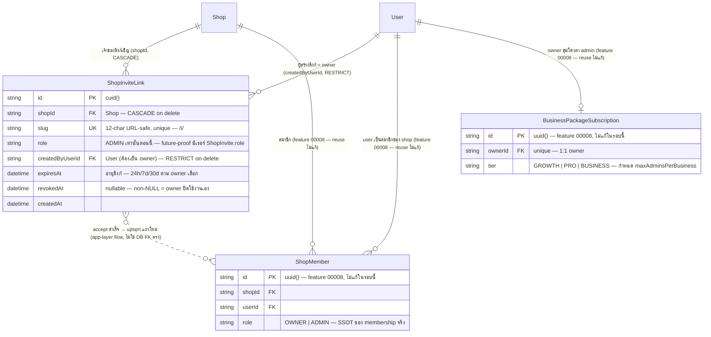

> **โมดูล:** M00012-ShopStaffInviteLinks
> **ประเภทเอกสาร:** DATABASE Design (Back-fill — as-built)
> **เวอร์ชัน:** 1.0
> **วันที่จัดทำ:** 2026-07-04
> **สถานะ:** **As-built** — schema/migration ถูก implement และ apply ลง Supabase (dev=prod แชร์) ไปแล้วก่อนเอกสารนี้ถูกเขียน (ละเมิด Hard Rule 11 Documentation-First ทางเทคนิค — เอกสารนี้เป็น back-fill เพื่อปิด doc-debt ไม่ใช่ spec ล่วงหน้า)
> **เจ้าของเอกสาร:** SA/Database Agent (ดู [[Feature-Docs-Ownership]])

# DATABASE: Shop Staff Invite Links

---

## 0. 🛑 สถานะการ apply (สำคัญ — อ่านก่อน)

- `prisma/schema.prisma` มี model `ShopInviteLink` แล้ว (บรรทัด 601-620) — `npx prisma validate` ผ่าน
- Migration เขียนไว้ที่ `prisma/migrations/20260704000300_add_shop_invite_link/migration.sql` (hand-written, additive-only — `CREATE TABLE` 1 ตัว)
- **Apply แล้วจริงลง Supabase** (dev=prod แชร์ตาม `docs/conventions/prisma-shared-db-drift.md`) ผ่าน `prisma migrate deploy` เมื่อ 2026-07-04 — commit ที่เขียน schema/migration คือ `7a6bbce` (comment ตอนนั้นว่า "ยังไม่ apply") ตามด้วย commit ถัดมาที่ apply จริงและต่อยอด service/route/UI จนถึง `ce48bcb`
- เอกสารนี้เป็น **back-fill DATABASE.md** ตาม Hard Rule 11 (Documentation-First) — งานจริงถูก implement ก่อนเอกสารฉบับนี้ถูกเขียน (เจตนา: ปิด doc-debt ของ feature 00012 ให้ ownership ครบตาม `docs/99 - Rules/Feature-Docs-Ownership.md`) **ไม่ใช่คำสั่งให้ทำ migration เพิ่มเติมใด ๆ ในรอบนี้**
- **ห้าม `prisma migrate dev`** เด็ดขาด (DB มี orphaned migration นอก git ของ feature อื่น — จะเสนอ `migrate reset` ลบข้อมูลทั้ง DB), **ห้าม `prisma db pull`** เด็ดขาด (memory `feedback_qa_agent_no_prisma_pull`) — ใช้ `migrate deploy` เท่านั้นถ้าจะแตะ schema เพิ่มในอนาคต
- Task นี้ **ไม่รัน prisma/db command ใด ๆ** — เป็นการเขียนเอกสารอย่างเดียว

---

## 1. Overview

Shop Staff Invite Links (feature 00012) เพิ่มวิธีที่ 2 ให้ owner ของ **BUSINESS shop** ชวนคนเข้ามาเป็น admin: แทนที่จะพิมพ์เบอร์โทร/อีเมลทีละคน (`ShopInvite` เดิม จาก feature 00008) owner กด "สร้างลิงก์เชิญ" ได้ลิงก์ `/i/<slug>` ที่แชร์ซ้ำได้ (โพสในกลุ่มไลน์ทีมงาน ฯลฯ) ใครก็ตามที่ login แล้วกดลิงก์และ accept จะกลายเป็น `ShopMember(role=ADMIN)` ของ shop นั้นทันที (ยังโดน quota คุมตอน accept — ดู §6)

เอกสารนี้เพิ่ม **table ใหม่ 1 ตัว** (`ShopInviteLink`) — ไม่แตะ table เดิมเลย, ไม่มี column ใดถูกเพิ่ม/ลบ/แก้ type บนตารางที่มีอยู่แล้ว

- **เอกสารออกแบบต้นทาง:** `docs/superpowers/plans/2026-07-04-shop-staff-invite-link.md` (implementation plan, Task 1.1-1.3) + `docs/superpowers/specs/2026-07-04-shop-staff-invite-link-design.md` (design/UX spec) — feature นี้ทำผ่าน superpowers plan/spec ไม่ใช่ full PRD/BRD/SRS/SDS ชุดเต็ม (extension เล็กบน feature 00008 ที่มี BRD/SRS ของตัวเองอยู่แล้ว)
- **Store ที่เกี่ยวข้อง:** PostgreSQL 16 host บน Supabase (DB เดียวสำหรับ dev + prod — `docs/conventions/prisma-shared-db-drift.md`)
- **ORM:** Prisma (`prisma/schema.prisma`); migration tool = `prisma migrate deploy` + hand-written migration file (**ห้าม `migrate dev`**)
- **ไม่ใช้ RLS:** authorization อยู่ที่ `src/services/invite-link.service.ts` (NextAuth session + owner-ownership guard ที่ WHERE clause: `shop.userId === ownerId && shop.kind === "BUSINESS"`) ไม่ใช้ policy ใน DB

### สิ่งที่เปลี่ยนแปลง (สรุปภาพรวม)

| Model | การเปลี่ยนแปลง | ประเภท |
|-------|----------------|--------|
| `ShopInviteLink` (ใหม่) | table ใหม่ — ลิงก์เชิญพนักงานแบบ reusable ต่อ 1 shop | New |
| `Shop` (มีอยู่แล้ว) | เพิ่ม back-relation `inviteLinks` | Additive (relation only, ไม่มี DDL) |
| `User` (มีอยู่แล้ว) | เพิ่ม back-relation `createdShopInviteLinks` | Additive (relation only, ไม่มี DDL) |

### Table ที่ reuse — ไม่ใช่ table ใหม่ของ feature นี้

| Table | Reuse อย่างไร | ที่มา |
|-------|---------------|-------|
| `ShopMember` | ปลายทางของ flow — `acceptInviteLink()` upsert แถวนี้ (`role="ADMIN"`) เมื่อ user accept ลิงก์สำเร็จ เป็น **membership SSOT เดียวกัน** ไม่ว่าจะเข้ามาทาง `ShopInvite` (contact-match) หรือ `ShopInviteLink` (ลิงก์) ก็ตกลงที่ table นี้ table เดียว | feature 00008 |
| `BusinessPackageSubscription` | source ของ quota — `acceptInviteLink()`/`createInviteLink()` query `sub.tier` → `BUSINESS_PACKAGE_TIER_CONFIG[tier].maxAdminsPerBusiness` เพื่อกัน admin เกินโควตาตอน accept (ไม่มี/ไม่ ACTIVE = fail-closed `maxAdmins=0`) | feature 00008 |
| `Shop` | เจ้าของ FK `shopId` + guard `kind === "BUSINESS"` (PERSONAL shop สร้างลิงก์เชิญไม่ได้) + `packageLockedAt` guard (shop ที่ถูกล็อกสร้างลิงก์ใหม่ไม่ได้) | (มีอยู่ก่อนแล้ว) |
| `ShopInvite` | **ไม่ reuse โดยตรง** — เป็นวิธีเชิญคู่ขนาน (contact-match, single-use ต่อคำเชิญ) ยกมาเทียบเพื่ออธิบายความต่างเท่านั้น (ดู §3.1 "ต่างจาก ShopInvite") | feature 00008 |

**สิ่งที่ต้องระวังไม่ให้สับสน:** `ShopInviteLink` ≠ `ShopInvite` — คนละ table คนละ semantics (ดูตาราง diff เต็มที่ §3.1) ทั้งคู่ลงเอยที่ `ShopMember` เดียวกันเมื่อ accept สำเร็จ

---

## 2. ERD



---

## 3. Tables

### 3.1 `ShopInviteLink` (PostgreSQL 16, Supabase — ใหม่)

ลิงก์เชิญพนักงานแบบ **reusable** ของ 1 shop — owner สร้างลิงก์ 1 ครั้ง แชร์ซ้ำได้จนกว่าจะหมดอายุ (`expiresAt`) หรือถูก owner ปิดเอง (`revokedAt`) ผู้ถูกเชิญ accept ผ่านลิงก์ (ไม่ผูก contact ล่วงหน้า) → กลายเป็น `ShopMember(role=ADMIN)`

| Column | Type | Null | Default | Key | หมายเหตุ |
|--------|------|------|---------|-----|---------|
| `id` | `TEXT` | NO | `cuid()` (client-side, Prisma) | PK | ตั้งใจใช้ `cuid()` ไม่ใช่ `uuid()` เหมือน model ส่วนใหญ่ของระบบ (`ShopMember`/`ShopInvite`/`BusinessPackageSubscription` ใช้ `uuid()`) — **ไม่มีเหตุผลทาง business** เพียงเป็นความไม่สม่ำเสมอเล็กน้อยตอน implement (ทั้งสอง generator ให้ string PK ที่ unique เพียงพอเท่ากันสำหรับ use case นี้ ไม่กระทบ query ใด ๆ) — flag ไว้ตรงนี้เผื่อ dev คนถัดไปสงสัยว่าทำไมไม่ตรง convention |
| `shopId` | `TEXT` | NO | — | FK, INDEX(composite) | อ้าง `Shop.id`; `ON DELETE CASCADE` — ลบ shop = ลบลิงก์เชิญของ shop นั้นทั้งหมด (ไม่มี business rule ให้เก็บลิงก์ของ shop ที่ไม่มีอยู่แล้ว — สอดคล้อง `ShopMember.shopId`/`ShopInvite.shopId` CASCADE pattern เดิม) |
| `slug` | `TEXT` | NO | — | **UNIQUE** | 12-char URL-safe random string (`generateInviteSlug()`, charset `[A-Za-z0-9]`, crypto.randomBytes + rejection sampling กัน modulo bias — ดู `src/lib/invite-link.ts`) คือ **primary lookup key** ของหน้า public landing `/i/[slug]` — ต้อง unique ทั้งระบบ (ข้าม shop) เพราะ URL ไม่มี shop identifier อื่นประกอบ |
| `role` | `TEXT` | NO | `'ADMIN'` | — | ปัจจุบันมีค่าเดียว `"ADMIN"` — เก็บเป็น column (ไม่ hardcode ที่ app layer) เพื่อ **future-proof** ถ้า Phase 2 มี RBAC granularity มากกว่า owner/admin (มิเรอร์ `ShopInvite.role` เพื่อให้ 2 ตารางนี้คู่ขนานกันสนิท ลด cognitive load ตอนอ่านโค้ดคู่กัน) |
| `createdByUserId` | `TEXT` | NO | — | FK | อ้าง `User.id`; **`ON DELETE RESTRICT`** (ต่างจาก `shopId` ที่เป็น CASCADE) — ดูเหตุผลเต็มด้านล่าง |
| `expiresAt` | `TIMESTAMP(3)` | NO | — | — | เวลาหมดอายุ — คำนวณตอนสร้างจาก `expiryKeyToDate(key)` (`src/lib/invite-link.ts`) 3 ตัวเลือก: 24h/7d/30d (default `7d`) เป็น**ค่า absolute ที่ freeze ตอนสร้าง** ไม่ใช่ TTL แบบ relative — เปลี่ยน default option ในอนาคตจะไม่กระทบลิงก์ที่สร้างไปแล้ว |
| `revokedAt` | `TIMESTAMP(3)` | YES | `NULL` | — | `NULL` = ยังใช้งานได้ (ยัง valid ถ้า `expiresAt` ยังไม่ถึง); non-`NULL` = owner สั่งปิดใช้งานเอง (`revokeInviteLink()`) — idempotent: revoke ซ้ำไม่ throw ทับ timestamp เดิม (เก็บเวลา revoke ครั้งแรกไว้เป็น audit trail อ่อน ๆ) |
| `createdAt` | `TIMESTAMP(3)` | NO | `CURRENT_TIMESTAMP` | — | เวลาสร้างลิงก์ — ใช้ sort หน้า owner management page (`listActiveInviteLinks()` — `orderBy: createdAt desc`); ไม่มี `updatedAt` เพราะ mutation เดียวของแถวนี้คือ set `revokedAt` ครั้งเดียว (ไม่มี field อื่นแก้ได้หลังสร้าง — append-then-one-flag-flip pattern เดียวกับ `TopUpRequest`/`ShopInvite` ที่ยังมี `updatedAt` เพราะมีหลาย field แก้ได้ แต่ที่นี่มีแค่ `revokedAt` field เดียวที่แก้ได้ จึงไม่จำเป็นต้องมี `updatedAt` แยก) |

**ทำไม `slug` เก็บเป็น plaintext ไม่ hash-at-rest (ต่างจาก `sms-code.service` ที่ hash SMS unlock code ก่อนเก็บ):**

| มิติ | `ShopInviteLink.slug` (plaintext) | SMS unlock code (`hash-at-rest`) |
|------|-----------------------------------|-----------------------------------|
| Lookup pattern | ต้อง `WHERE slug = ?` โดยตรงจาก URL segment ที่ผู้ใช้กด — เป็น **capability-URL** (ตัว URL เองคือ credential ที่พิสูจน์สิทธิ์ ไม่ใช่รหัสลับที่พิมพ์) | ต้อง compare กับค่าที่ user "พิมพ์" เข้ามา (ไม่ใช่ URL) — hash แล้ว compare ได้ปกติเพราะ input คือ string สั้นพิมพ์เอง |
| Lifetime/reusability | reusable จนกว่าจะหมดอายุ/revoke — ต้องอ่านค่ากลับมาแสดง URL เต็มให้ owner copy ซ้ำได้ (`buildInviteUrl(slug)`) ในหน้า management page | single-use — ใช้ครั้งเดียวแล้วถูก consume (mark used) ไม่มีความจำเป็นต้องอ่านค่ากลับมาแสดงซ้ำ |
| Exposure model | slug ถูกออกแบบให้ "อยู่ใน URL" ตั้งแต่ต้น (แชร์ผ่านไลน์กลุ่ม, ฝัง query param) — เทียบเท่า session token/API key แบบ bearer capability ไม่ใช่ secret ที่ควร hash เพื่อกันคนดู DB เห็น (ถ้า DB ถูก breach ทั้งฐาน แชท/URL ที่แชร์ไปแล้วก็รั่วอยู่ดี hash ไม่ได้ช่วยกรณีนี้) | code ถูกออกแบบให้ "พิมพ์" ไม่ใช่ "อยู่ใน URL" — hash-at-rest ป้องกันกรณี DB ถูก breach แล้วนำ code ไปใช้ยืนยันตัวแทน buyer จริง (impersonation risk สูงกว่าเพราะผูกกับ phone unlock) |
| Precedent ในระบบ | mirror `Shop.slug` (public shop URL — เก็บ plaintext เช่นกัน ด้วยเหตุผลเดียวกันคือ capability/identifier ที่ตั้งใจให้เปิดเผยผ่าน URL) | mirror `sms-code.service.ts` (`hashCode()` ก่อนเก็บ, compare ด้วย hash เท่านั้น) |

สรุป: **plaintext ถูกต้องสำหรับ use case นี้** — ไม่ใช่การมองข้าม security แต่เป็นเพราะ threat model ต่างกัน (reusable capability-URL vs single-use verification code)

**ทำไม FK `createdByUserId` เป็น `ON DELETE RESTRICT` (ต่างจาก `shopId` ที่เป็น `CASCADE`):** `createdByUserId` ต้องเป็น owner ของ shop เสมอ (guard ที่ service layer ตอนสร้าง) และ **owner ของ BUSINESS shop ไม่มี hard-delete flow ในระบบปัจจุบัน** (`User` ไม่มี endpoint ลบบัญชีจริง) — RESTRICT จึงเป็น **fail-safe ที่ไม่เคย trigger จริงในทางปฏิบัติปัจจุบัน** แต่ป้องกัน silent orphan (`createdByUserId` ชี้ user ที่ไม่มีอยู่แล้ว) ถ้าอนาคตมี hard-delete user จริง — เลือก RESTRICT (ไม่ใช่ SetNull) เพราะ column เป็น `String` (NOT NULL, ไม่ nullable) และไม่มี business rule รองรับ "ลิงก์เชิญที่ไม่รู้ว่าใครสร้าง" — ถ้าจะลบ user คนนั้นจริง flow ที่ถูกต้องคือลบ/revoke `ShopInviteLink` ของเขาก่อน (เทียบกับ `shopId` ที่เป็น CASCADE เพราะ "ลบ shop = ไม่มีที่ให้ลิงก์ชี้ไปแล้ว" เป็น business fact ที่ชัดกว่า)

**ต่างจาก `ShopInvite` (feature 00008) อย่างไร — ตารางเทียบ:**

| มิติ | `ShopInviteLink` (feature 00012, ตารางนี้) | `ShopInvite` (feature 00008, ของเดิม) |
|------|---------------------------------------------|------------------------------------------|
| วิธี target ผู้รับ | ไม่ผูก contact — ใครกดลิงก์ก็ accept ได้ (ไม่มี column `invitedContact`/`contactType`) | ผูกเบอร์โทร/อีเมล (`invitedContact` + `contactType`) จับคู่ตอน accept |
| จำนวนครั้งที่ใช้ได้ | reusable — ใช้ซ้ำได้จนกว่าหมดอายุ/revoke (ไม่มี "ถูก accept แล้ว" state) | ต่อ 1 คำเชิญ 1 คน — มี `status` state machine (`PENDING`→`ACCEPTED`/`CANCELLED`) |
| อายุการใช้งาน | มี `expiresAt` explicit (24h/7d/30d) | ไม่มี `expiresAt` — ใช้ `status` แทนควบคุมวงจรชีวิต |
| Duplicate-pending guard | ไม่ต้องมี (คนละ semantics — ลิงก์เดียวกันมีคนกดซ้ำได้อยู่แล้วโดย design) | มี comment เจตนา "ไม่ unique invitedContact กันชน CANCELLED ซ้ำ" — เป็น concern เฉพาะของโมเดล contact-match |
| PII exposure | ไม่มี — table นี้ไม่เก็บ contact ของผู้ถูกเชิญเลย (รู้จักกันแค่ตอน accept ผ่าน session) | มี — `invitedContact` เป็น PII เทียบเท่า `Order.buyerContact` ต้อง neutralize-at-source (comment เตือนในบรรทัด schema เดิม) |

### 3.2 `ShopMember`, `BusinessPackageSubscription` (PostgreSQL 16, Supabase — **ไม่ใช่ table ใหม่**)

ทั้งสอง table นี้มีอยู่แล้วจาก feature 00008 — feature 00012 **ไม่แก้ schema ของทั้งสองเลย** (ไม่มี column ใหม่, ไม่มี index ใหม่บนตารางเหล่านี้) รายละเอียดเต็มดู `docs/20 - Features/00008 - Business Account & Packages/DATABASE.md` §3 ที่นี่สรุปเฉพาะจุดที่ feature 00012 **อ่าน/เขียน** ผ่าน service layer:

- **`ShopMember`** — `acceptInviteLink()` (`src/services/invite-link.service.ts`) `upsert` แถวนี้ (`where: shopId_userId composite unique`, `create: {shopId, userId, role: "ADMIN"}`, `update: {}` idempotent) เป็นจุดที่ flow ของ feature 00012 "ลงเอย" ที่ table เดิม — **membership SSOT ยังเป็น `ShopMember` เจ้าเดียวเหมือนเดิม** ไม่ว่าจะมาจาก `ShopInvite` (contact-match) หรือ `ShopInviteLink` (ลิงก์)
- **`BusinessPackageSubscription`** — ทั้ง `createInviteLink()` และ `acceptInviteLink()` query `findUnique({where: {ownerId}})` เพื่ออ่าน `tier`/`status` แล้ว lookup `BUSINESS_PACKAGE_TIER_CONFIG[tier].maxAdminsPerBusiness` (constant ที่ `src/lib/business-package.ts` ไม่ใช่ column ใน DB) — ไม่มี ACTIVE subscription = **fail-closed** (`maxAdmins = 0`ไม่ใช่ unlimited) เดินตาม pattern เดิมของ `acceptShopInvite()` (feature 00008) เป๊ะ

---

## 4. Indexes

| Table | Columns | Type | Rationale (query pattern ที่รองรับ) |
|-------|---------|------|--------------------------------------|
| `ShopInviteLink` | `(slug)` | **UNIQUE** | primary lookup ของหน้า public landing `/i/[slug]` (`resolveInviteLink()`, `acceptInviteLink()`) — `WHERE slug = ?` เป็น O(1) index scan ต้อง unique อยู่แล้วตาม business rule (URL แต่ละอันชี้ shop เดียวเท่านั้น) index นี้ทำหน้าที่ทั้ง constraint และ query-accelerator ในตัวเดียว |
| `ShopInviteLink` | `(shopId, revokedAt)` | BTREE composite | หน้า owner management (`/admins`) เรียก `listActiveInviteLinks(shopId)`: `WHERE shopId = ? AND revokedAt IS NULL AND expiresAt > now() ORDER BY createdAt DESC` — leading column `shopId` filter ก่อน แล้ว `revokedAt` ช่วยตัด row ที่ revoke ไปแล้วออกจาก index scan ตั้งแต่ต้น (ไม่ต้อง fetch row มา filter `expiresAt`/sort ทีหลังทั้งหมด) — เป็น hot path เดียวของ table นี้ (owner เปิดหน้าจัดการลิงก์บ่อยกว่าสร้าง/revoke) |

**หมายเหตุ FK column เดี่ยว (`createdByUserId`):** ไม่เพิ่ม index แยกต่างหาก — ไม่มี query pattern ใน service ปัจจุบันที่ filter ด้วย `createdByUserId` เดี่ยว ๆ (ไม่มีหน้า "ดูลิงก์ทั้งหมดที่ user คนนี้เคยสร้าง" ข้าม shop) ถ้า Phase 2 ต้องการ audit view แบบนั้นค่อยเพิ่ม index ตอนนั้น (YAGNI — เดินตาม convention เดิมของระบบที่ไม่เพิ่ม index ล่วงหน้าไม่มี query จริงรองรับ)

**`expiresAt` ไม่มี index เดี่ยว:** ไม่มี cron/query ปัจจุบันที่ scan หา "ลิงก์ที่หมดอายุแล้ว" เป็น batch (expired ถูกกรองด้วย runtime check `expiresAt > now()` ที่ query อื่นซึ่งมี `shopId`/`slug` เป็น leading column อยู่แล้ว ไม่ scan ทั้งตาราง) — ถ้าอนาคตมี cron cleanup/archive ลิงก์หมดอายุ ค่อยพิจารณา index `(expiresAt)` แยกตอนนั้น

---

## 5. Migration Plan

### 5.1 ลำดับ (additive ล้วน, table ใหม่ว่างตอนสร้าง → ไม่ต้อง backfill/NOT VALID)

| ลำดับ | การเปลี่ยนแปลง | หมายเหตุ |
|-------|----------------|---------|
| 1 | `CREATE TABLE "ShopInviteLink"` (ทุก column ตาม §3.1) | table ใหม่ว่าง — ไม่กระทบใคร, ไม่ lock table เดิม |
| 2 | `CREATE UNIQUE INDEX "ShopInviteLink_slug_key"` | table ว่างตอนสร้าง index — ไม่มีความเสี่ยง unique violation จากข้อมูลเก่า |
| 3 | `CREATE INDEX "ShopInviteLink_shopId_revokedAt_idx"` | table ว่าง — สร้างเร็ว ไม่ lock |
| 4 | `ALTER TABLE "ShopInviteLink" ADD CONSTRAINT ... FOREIGN KEY ("shopId") ... ON DELETE CASCADE` | อ้างตารางที่มี row จริง (`Shop`) แต่ `ShopInviteLink` เองว่าง — FK add ปลอดภัย ไม่ scan `ShopInviteLink` |
| 5 | `ALTER TABLE "ShopInviteLink" ADD CONSTRAINT ... FOREIGN KEY ("createdByUserId") ... ON DELETE RESTRICT` | อ้างตารางที่มี row จริง (`User`) เช่นกัน — ปลอดภัยเหตุผลเดียวกัน |

รวมเป็น 1 migration file: `20260704000300_add_shop_invite_link` (ไฟล์เดียว ไม่มี migration ที่ 2 แยกสำหรับ unmanaged SQL แบบ feature 00008/00011 — feature นี้ไม่มี trigger/function/partial index ที่ Prisma DSL ประกาศไม่ได้)

### 5.2 Migration SQL (ตรงกับไฟล์จริง 100%)

```sql
-- Migration: add_shop_invite_link | Feature: 00012-ShopStaffInviteLinks | drafted 2026-07-04
-- SAFETY: additive only — table ใหม่ 1 ตัว (ShopInviteLink), ไม่มี ALTER/DROP บน table เดิม
-- ROLLBACK: table ว่างตอนสร้าง ปลอดภัย DROP ได้ทันทีหลัง apply ถ้ายังไม่มีลิงก์เชิญจริงเกิดขึ้น
-- (หลัง feature launch ต้อง export ก่อน DROP — data loss):
--   DROP TABLE "ShopInviteLink";

CREATE TABLE "ShopInviteLink" (
    "id"              TEXT NOT NULL,
    "shopId"          TEXT NOT NULL,
    "slug"            TEXT NOT NULL,
    "role"            TEXT NOT NULL DEFAULT 'ADMIN',
    "createdByUserId" TEXT NOT NULL,
    "expiresAt"       TIMESTAMP(3) NOT NULL,
    "revokedAt"       TIMESTAMP(3),
    "createdAt"       TIMESTAMP(3) NOT NULL DEFAULT CURRENT_TIMESTAMP,

    CONSTRAINT "ShopInviteLink_pkey" PRIMARY KEY ("id")
);

CREATE UNIQUE INDEX "ShopInviteLink_slug_key" ON "ShopInviteLink"("slug");
CREATE INDEX "ShopInviteLink_shopId_revokedAt_idx" ON "ShopInviteLink"("shopId", "revokedAt");

ALTER TABLE "ShopInviteLink" ADD CONSTRAINT "ShopInviteLink_shopId_fkey"
    FOREIGN KEY ("shopId") REFERENCES "Shop"("id") ON DELETE CASCADE ON UPDATE CASCADE;
ALTER TABLE "ShopInviteLink" ADD CONSTRAINT "ShopInviteLink_createdByUserId_fkey"
    FOREIGN KEY ("createdByUserId") REFERENCES "User"("id") ON DELETE RESTRICT ON UPDATE CASCADE;
```

### 5.3 สถานะ Apply จริง

- Apply แล้วผ่าน `npx dotenv -e .env.local -- npx prisma migrate deploy` ลง Supabase (dev=prod แชร์) เมื่อ 2026-07-04 (ตาม flow ที่ user ยืนยันก่อน touch shared DB ทุกครั้ง — `docs/conventions/prisma-shared-db-drift.md`)
- `npx prisma generate` รันหลัง apply ให้ Prisma Client รู้จัก model ใหม่ (dev server ต้อง restart หลัง migrate เสมอตาม memory `project_seller_auth_resume` — client เก่าที่ยังไม่ generate ใหม่จะทำให้ route ที่เรียก `prisma.shopInviteLink` 500)
- Feature ทำงานได้จริงบน branch ปัจจุบันแล้ว (commit ล่าสุด `ce48bcb` — service/route/UI ครบ, reviewer SHOULD-FIX ปิดแล้ว)
- **Task นี้ไม่ได้รัน `npx prisma validate`/`migrate deploy` ซ้ำ** — เอกสารอย่างเดียวตามคำสั่ง Controller

### 5.4 Rollback

| Migration step | Rollback | ผลกระทบ |
|-----------------|----------|---------|
| `CREATE TABLE "ShopInviteLink"` (+ FK, unique, index) | `DROP TABLE "ShopInviteLink";` | **ก่อนมีลิงก์เชิญจริงถูกสร้าง:** ปลอดภัย 100%. **ปัจจุบัน (หลัง launch จริง):** มีความเสี่ยง data loss — ลิงก์ที่ owner สร้างไว้ (ยัง active หรือ revoke แล้วก็ตาม) จะหายทั้งหมด ถ้ามีลิงก์ที่ยัง active อยู่ตอน rollback owner ต้องสร้างลิงก์ใหม่หลัง rollback (คนที่ถือ URL เก่าจะเจอ 404/NOT_FOUND ทันที) — **ต้อง export table ก่อน DROP เสมอถ้าจะ rollback ในสภาพที่มีข้อมูลจริงแล้ว** |
| FK `ShopInviteLink_shopId_fkey` / `ShopInviteLink_createdByUserId_fkey` | รวมอยู่ใน `DROP TABLE` เดียวกัน (Postgres drop constraint พร้อม table อัตโนมัติ) | ไม่มี rollback แยกเฉพาะ FK — table นี้ไม่มี column อื่นที่ FK ผูกอยู่นอกเหนือจากที่ประกาศตอนสร้าง |
| Index `ShopInviteLink_slug_key` / `ShopInviteLink_shopId_revokedAt_idx` | `DROP INDEX ...` (ถ้าต้องการ rollback เฉพาะ index ไม่ drop table) | ไม่มี data loss, กระทบ performance เท่านั้น (`slug` lookup จะกลายเป็น full table scan, ไม่มี unique constraint คุ้มครองอีกต่อไป — **ไม่แนะนำ** ทำแยกจาก table เพราะ unique index นี้เป็น business-rule guard ด้วย ไม่ใช่แค่ performance) |
| Relation field `Shop.inviteLinks` / `User.createdShopInviteLinks` | ลบ field ออกจาก `schema.prisma` (ไม่มี DDL — relation-only) | ไม่กระทบ DB เลย เป็นแค่ Prisma Client type ที่หายไป |

**สรุป rollback:** ปลอดภัยสมบูรณ์เฉพาะช่วงก่อน launch จริง (ไม่มีลิงก์ active) — **ปัจจุบันฟีเจอร์ deploy แล้วและมีแนวโน้มมีข้อมูลจริงเกิดขึ้น** rollback ใด ๆ ในเอกสารนี้ต้องผ่าน export-first เสมอ ตาม Hard Rule "ห้าม drop table/column เว้นแต่ Controller สั่งชัด" — **เอกสารนี้ไม่ได้เสนอ/แนะนำให้ rollback จริง** เพียงบันทึกไว้เป็น reference เผื่อ Controller ตัดสินใจในอนาคต

### 5.5 ผลกระทบ (Impact — ย้อนหลัง เพราะ apply ไปแล้ว)

- **Downtime:** ไม่มี — `CREATE TABLE` บน table ใหม่ (ว่าง) ไม่กระทบใคร, ไม่ lock table เดิมเลย
- **FK อ้างตารางที่มี row จริง (`Shop`, `User`):** `ALTER TABLE ... ADD CONSTRAINT ... FOREIGN KEY` จาก table ใหม่ (ว่าง) ไปหา table เดิม (มี row) — Postgres ตรวจแค่ว่าไม่มี row ใน `ShopInviteLink` ที่ orphan (ไม่มีอยู่แล้วเพราะ table ว่าง) ไม่ scan `Shop`/`User` เลย — ปลอดภัย metadata-level
- **CREATE INDEX:** plain (ไม่ `CONCURRENTLY`) — table ว่างตอนสร้าง ไม่มีความเสี่ยง lock
- **Backward compat:** `Shop`/`User` เดิมที่ไม่แตะ relation ใหม่ ทำงานเหมือนเดิมทุกประการ — shop ที่ไม่เคยสร้างลิงก์เชิญไม่ถูกกระทบเลย
- **Growth risk:** `ShopInviteLink` โตช้ากว่าตารางอื่นในระบบมาก (owner สร้างลิงก์นาน ๆ ครั้ง ไม่ใช่ per-transaction เหมือน `Order`/`ChatMessage`) — ไม่มี retention concern ในระยะสั้น (ดู §6)

---

## 6. Retention / ข้อควรระวัง

- **Data Retention:** ไม่มี retention/archive job — `ShopInviteLink` เก็บถาวรแม้หมดอายุ/ถูก revoke แล้ว (เป็น audit trail อ่อน ๆ ว่า shop เคยสร้างลิงก์อะไรบ้าง) แถวที่ `expiresAt` ผ่านไปนานแล้วไม่ถูกลบอัตโนมัติ — ไม่ใช่ปัญหาในระยะสั้นเพราะอัตราการสร้างต่ำ (owner สร้างเป็นครั้งคราว ไม่ใช่ทุก transaction) ถ้าอนาคตพบว่าตารางโตผิดปกติ (เช่น bug ทำให้สร้างลิงก์ซ้ำถี่) ค่อยพิจารณา cleanup cron
- **PII / ข้อมูลอ่อนไหว:** ไม่มี PII ใน table นี้โดยตรง — `slug` เป็น random token ไม่ใช่ข้อมูลระบุตัวตน, ไม่มี column เก็บ contact ของผู้ถูกเชิญ (ต่างจาก `ShopInvite.invitedContact` ที่เป็น PII) `createdByUserId` เป็น FK ไปหา owner ซึ่งไม่ใช่ PII โดยตัวมันเอง (เป็น system id) — **ไม่ต้อง neutralize-at-source สำหรับ table นี้**
- **Performance:** `createInviteLink()` มี retry-loop สูงสุด 5 ครั้งครอบทั้ง `$transaction` (ไม่ใช่แค่ insert เดี่ยว) เพื่อรับมือ `P2002` (slug ชนกัน) — ต้องเปิด transaction ใหม่ทั้งก้อนทุก attempt เพราะ Postgres mark ทั้ง transaction เป็น aborted หลัง unique violation ครั้งแรก (retry ในทรานแซกชันเดิมจะพังซ้ำด้วย aborted-transaction error) เป็นข้อควรระวังสำหรับ dev ที่จะแก้ service นี้ต่อ — อย่าย้าย insert ออกจาก transaction retry wrapper
- **Consistency ระหว่าง `ShopInviteLink` กับ `ShopMember`:** ไม่มี FK ตรงระหว่างสองตารางนี้ (ความสัมพันธ์เป็น app-layer flow เท่านั้น — accept สำเร็จ = upsert `ShopMember` แถวใหม่ แต่ `ShopInviteLink` แถวเดิมยังอยู่ไม่ถูกแก้ไข/ลบ) หมายความว่า **ไม่มีทางย้อนดูจาก `ShopMember` ว่า admin คนไหนเข้ามาผ่านลิงก์ไหน** (ถ้าต้องการ audit ระดับนั้นในอนาคต ต้องเพิ่ม column เชื่อม เช่น `ShopMember.joinedViaInviteLinkId` — ไม่ได้ทำในรอบนี้ เพราะไม่มี requirement ปัจจุบัน)
- **Quota enforcement เป็น runtime check ไม่ใช่ DB constraint:** โควตา admin สูงสุดต่อ shop (`maxAdminsPerBusiness`) ไม่มี CHECK constraint ใน DB — ตรวจที่ service layer เท่านั้น (`acceptInviteLink()` count `ShopMember` แล้วเทียบ config) มี race window เล็ก ๆ ระหว่าง 2 คน accept พร้อมกันตอนโควตาเหลือ 1 ที่สุดท้าย (ยอมรับความเสี่ยงนี้เหมือน `acceptShopInvite()` เดิมของ feature 00008 — ไม่ใช่จุดใหม่ของ feature นี้)

---

## 7. Backward-compat note

- **`ShopMember`/`BusinessPackageSubscription`/`ShopInvite` (feature 00008 เดิม):** ไม่ถูกกระทบเลย — ไม่มี column ใหม่, ไม่มี index ใหม่, ไม่มี constraint ใหม่บนตารางเหล่านี้ ฟีเจอร์ 00012 แค่ **อ่าน**ตารางเหล่านี้ผ่าน service layer (query เดิมทั้งหมดยังทำงานปกติ 100%)
- **`Shop`/`User` เดิม:** back-relation ใหม่ (`inviteLinks`, `createdShopInviteLinks`) เป็น relation field เท่านั้น — ไม่มี column ใหม่บน table เดิม, query เดิมที่ไม่ include relation ใหม่ไม่ถูกกระทบ
- **หน้า/route เดิมของ feature 00008** (`/api/shops/current/invites`, invite-by-contact flow) ยังทำงานเหมือนเดิมทุกประการ — ทั้งสองวิธีเชิญ (`ShopInvite` contact-match กับ `ShopInviteLink` ลิงก์) ทำงานคู่ขนานกันได้ ไม่ exclusive ต่อกัน

---

## 8. Traceability

| Table / Field | Plan/Spec | สถานะ |
|--------------|-----------|-------|
| `ShopInviteLink` (ทั้ง table) | `docs/superpowers/plans/2026-07-04-shop-staff-invite-link.md` Task 1.1-1.3 | As-built (apply แล้ว) |
| `ShopInviteLink.slug` unique | Task 1.2 (`generateInviteSlug()`) | As-built |
| `ShopInviteLink.shopId/createdByUserId` FK | Task 1.1 | As-built |
| `ShopInviteLink.expiresAt/revokedAt` lifecycle | Task 1.3 (`createInviteLink`/`revokeInviteLink`/`resolveInviteLink`) | As-built |
| Reuse `ShopMember` เป็นปลายทาง accept | Task 1.3 (`acceptInviteLink`) | As-built — ไม่มี schema change |
| Reuse `BusinessPackageSubscription` เป็น quota source | Task 1.3 (`acceptInviteLink`/`createInviteLink`) | As-built — ไม่มี schema change |
| `Shop.inviteLinks`/`User.createdShopInviteLinks` back-relation | โครงสร้าง (structural) | As-built — relation only |

---

## 9. สรุป (Summary)

Migration ของ feature 00012 = **table ใหม่ 1 ตัว** (`ShopInviteLink`) + back-relation 2 field บน `Shop`/`User` (ไม่มี DDL) — **ไม่มี DDL change ใด ๆ กับ table เดิม** (`ShopMember`, `BusinessPackageSubscription`, `ShopInvite` reuse 100% ผ่าน service layer เท่านั้น) ทั้งหมด additive-only — ไม่มี table ใดถูก drop/rename, ไม่มี column เดิมถูกแก้ type/ลบ, ไม่มี ALTER บน table ที่มี row จริง (table ใหม่ว่างตอนสร้าง จึง apply ปลอดภัยและง่าย)

**จุดออกแบบสำคัญที่ dev คนถัดไปควรรู้:**
1. `slug` เก็บ **plaintext โดยตั้งใจ** — เป็น capability-URL ไม่ใช่ secret ที่ต้อง hash (ต่างจาก sms-code) ดู §3.1
2. FK `createdByUserId` เป็น **RESTRICT** (ต่างจาก `shopId` ที่เป็น CASCADE) — เหตุผลคือ owner ไม่มี hard-delete flow จริงในระบบปัจจุบัน ดู §3.1
3. `id` ใช้ **`cuid()`** ต่างจาก convention ส่วนใหญ่ที่ใช้ `uuid()` — ไม่มีเหตุผลทาง business เป็นความไม่สม่ำเสมอเล็กน้อย ไม่กระทบ functionality
4. Composite index `(shopId, revokedAt)` รองรับ hot path เดียวของ table (owner management page) — ไม่มี index สำหรับ `createdByUserId` หรือ `expiresAt` เดี่ยว เพราะไม่มี query pattern จริงรองรับตอนนี้ (YAGNI)

**สถานะ implementation ปัจจุบัน (ณ เวลาที่เอกสารนี้ถูกเขียน):**
- `prisma/schema.prisma` — มี model `ShopInviteLink` แล้ว
- `prisma/migrations/20260704000300_add_shop_invite_link/migration.sql` — apply แล้วจริงลง Supabase (dev=prod)
- Service (`src/services/invite-link.service.ts`), lib (`src/lib/invite-link.ts`), routes, UI — ครบ ผ่าน reviewer แล้ว (commit `ce48bcb`)
- เอกสารนี้เป็น **back-fill ปิด doc-debt** — ไม่มี action เพิ่มเติมที่ต้องทำกับ DB ในรอบนี้

**Open Questions:** ไม่มี (feature นี้ deploy สมบูรณ์แล้ว — เอกสารนี้บันทึก as-built ไม่ใช่ spec ที่รอ decision)
