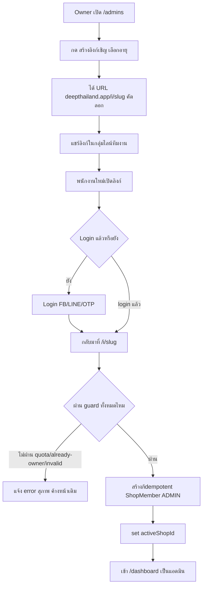

> **โมดูล:** M00012-ShopStaffInviteLinks
> **ประเภทเอกสาร:** Product Requirements Document (PRD)
> **เวอร์ชัน:** 1.0
> **วันที่จัดทำ:** 2026-07-04
> **สถานะ:** **As-built — implement เสร็จ + merge→main + deploy prod แล้วก่อนเอกสารนี้ถูกเขียน** (ละเมิด Hard Rule 11 Documentation-First ย้อนหลัง — เอกสารนี้เป็น back-fill เพื่อปิดหนี้เอกสาร ไม่ใช่ spec ล่วงหน้าที่รอ sign-off) ดู `docs/scope/2026-07-04-00012-shop-staff-invite-scope-baseline.md`
> **เจ้าของเอกสาร:** BA + PO + PM (ดู [[Feature-Docs-Ownership]])

---

# PRD: Shop Staff Invite Links (พนักงาน)

---

## Executive Summary

Shop Staff Invite Links ("พนักงาน") คือฟีเจอร์ที่เพิ่มวิธีที่ 2 ให้เจ้าของร้าน **BUSINESS** (paid package ACTIVE) ชวนคนเข้ามาช่วยดูแลร้านในฐานะ **แอดมิน** — แทนที่จะกรอกเบอร์โทร/อีเมลทีละคนแบบ contact-match เดิม (feature 00008 `ShopInvite`) เจ้าของร้านกดสร้าง **ลิงก์แชร์ reusable** (`deepthailand.app/i/<slug>`, เลือกอายุ 24 ชม./7 วัน/30 วัน, revoke ได้) แล้วแปะในกลุ่มไลน์ทีมงานได้เลย ผู้ถูกเชิญเปิดลิงก์ → login ด้วย Facebook/LINE/เบอร์ OTP → กด "ยอมรับคำเชิญ" → กลายเป็น `ShopMember(role=ADMIN)` ของร้านนั้นทันที **โดยไม่ถือเป็นผู้ขาย (seller)** — ระบบเปลี่ยน invariant เดิมที่ทุก user ต้องมี "ร้านส่วนตัว (Personal shop)" auto-create ตอน login มาเป็น **Lazy Personal shop** (สร้างเฉพาะเมื่อ user ตั้งใจกด "เปิดร้านของฉัน" เอง) ผู้ใช้ที่เป็นสมาชิกหลายร้าน (เจ้าของร้านตัวเอง + แอดมินร้านอื่น) จะเห็นหน้าเลือกร้าน `/choose-shop` หลัง login การจัดการทีมงานทั้งหมดถูกย้ายไปรวมที่เมนูซ้าย **"พนักงาน"** (`/admins`) คุณค่าทางธุรกิจหลักคือลด friction ของการขยายทีมงานร้าน BUSINESS ให้เร็วขึ้นมาก (จากกรอกทีละคนเป็นแชร์ลิงก์ครั้งเดียว) และวางรากฐานโมเดล "1 คนหลายร้าน/หลายบทบาท" ที่ระบบต้องรองรับระยะยาวตามทิศทาง Business Account (feature 00008)

---

## 1. Business Goals & KPIs

### 1.1 เป้าหมายทางธุรกิจ

| เป้าหมาย | รายละเอียด |
|----------|-----------|
| **ลดต้นทุนแรงงานของเจ้าของร้าน BUSINESS ในการขยายทีม** | เจ้าของร้านที่มีทีมงานหลายคน (เช่น จ้างแอดมินตอบแชท/แพ็คของ) ไม่ต้องกรอกเบอร์/อีเมลทีละคนอีกต่อไป — แชร์ลิงก์เดียวในกลุ่มก็จบ |
| **ลด friction ของขั้นตอน onboarding พนักงานใหม่** | พนักงานใหม่ไม่ต้องรอ owner กรอกเชิญแบบเจาะจงคน — เปิดลิงก์ที่มีอยู่แล้ว login แล้ว accept ได้ทันที ไม่ต้องรอ owner ทำ action ซ้ำทุกครั้งที่มีคนใหม่ |
| **แยก "เป็นแอดมินร้านคนอื่น" ออกจาก "เป็นผู้ขาย (seller)"** | คนที่ถูกจ้างมาช่วยดูแลร้าน ไม่ควรถูกบังคับให้มีร้านของตัวเอง/ผ่าน onboarding ของตัวเอง — ระบบต้องแยกสองสถานะนี้ออกจากกันชัดเจน แต่ยังเปิดทางให้ "เปิดร้านของฉัน" ได้ทุกเมื่อถ้าอยากเป็นผู้ขายจริง |
| **วางรากฐานโมเดล "1 คนหลายร้าน" ระยะยาว** | ผู้ใช้ 1 คนอาจเป็นเจ้าของร้านตัวเอง + แอดมินร้านอื่นพร้อมกันได้ — ต้องมีกลไก routing/สลับร้าน (`/choose-shop`) ที่ scale ต่อได้เมื่อจำนวนความสัมพันธ์ user-shop เพิ่มขึ้น |
| **ไม่เพิ่มภาระให้ seller ที่ไม่ใช้ฟีเจอร์นี้** | ร้าน PERSONAL หรือ BUSINESS ที่ไม่เคยสร้างลิงก์เชิญ ต้อง login/ใช้งานเหมือนเดิมทุกประการ (zero-regression — สำคัญเป็นพิเศษเพราะฟีเจอร์นี้แตะ invariant login กลางของทั้งระบบ) |

### 1.2 ตัวชี้วัดความสำเร็จ (KPIs)

> ยังไม่มี baseline จริงจาก prod (feature เพิ่ง deploy วันเดียวกับที่เขียนเอกสารนี้) — ตัวเลขเป็นเป้าเบื้องต้น ปรับได้หลังเก็บข้อมูลจริง

| KPI | คำอธิบาย | เป้าหมาย (เสนอ) |
|-----|----------|---------|
| **Time-to-invite** | เวลาเฉลี่ยตั้งแต่ owner ตัดสินใจเชิญ ถึงพนักงานคนแรกเข้าร้านสำเร็จ (เทียบกับ contact-match เดิมที่ต้องกรอกทีละคน) | ลดลงอย่างมีนัยสำคัญเทียบ contact-match |
| **Link Acceptance Rate** | % ของลิงก์ที่ถูกสร้างแล้วมีคน accept สำเร็จอย่างน้อย 1 ครั้ง | วัด baseline เดือนแรก |
| **New ShopMember ผ่านลิงก์ / สัปดาห์** | จำนวน `ShopMember(role=ADMIN)` ใหม่ที่เข้ามาผ่าน `ShopInviteLink` เทียบกับผ่าน `ShopInvite` (contact-match เดิม) | ติดตาม trend การเปลี่ยนพฤติกรรม owner |
| **Zero Regression บน Login/Onboarding เดิม** | seller เดิม (มี Personal shop อยู่แล้ว) login แล้วพฤติกรรมต้องเหมือนก่อน deploy 100% | Regression suite ผ่าน 100% (ปัจจุบัน **PENDING** — ดู §10 Known Gaps) |
| **Become-seller Conversion** | % ของแอดมินที่ถูกเชิญ ที่ภายหลังกด "เปิดร้านของฉัน" กลายเป็น seller เอง | วัด trend (ไม่ใช่ target บังคับ — เป็น org growth signal) |

---

## 2. User Personas (กลุ่มผู้ใช้งาน)

### 2.1 เจ้าของร้าน BUSINESS (Owner ที่ต้องการขยายทีม)

**ข้อมูลพื้นฐาน:** เป็นเจ้าของร้าน `Shop.kind === "BUSINESS"` ที่มี `BusinessPackageSubscription` สถานะ ACTIVE (ไม่ถูกล็อก) — มีทีมงานที่ต้องการให้เข้ามาช่วยตอบแชท/จัดการสินค้า/ดูออเดอร์

**เป้าหมาย:** เพิ่มคนเข้าทีมได้เร็วโดยไม่ต้องรู้เบอร์/อีเมลของทุกคนล่วงหน้า และควบคุมได้ว่าลิงก์ใช้ได้นานแค่ไหน/ปิดใช้งานได้เมื่อไหร่

**ความต้องการ:** ปุ่มสร้างลิงก์เชิญที่เลือกอายุได้ (24 ชม./7 วัน/30 วัน), คัดลอกลิงก์ง่าย, เห็นรายการลิงก์ที่ยัง active + revoke ได้ทันที, เห็นรายชื่อสมาชิกทั้งหมดในร้าน (พร้อมโควตาที่เหลือ), ลบสมาชิกที่ไม่ต้องการได้

**จุดปวด (Pain Points):** ฟอร์มเชิญแบบ contact-match เดิมต้องรู้เบอร์/อีเมลของแต่ละคนล่วงหน้า และต้องทำซ้ำทุกครั้งที่มีคนใหม่เข้าทีม — ไม่เหมาะกับร้านที่มีทีมงานหมุนเวียนบ่อยหรือจ้างคนผ่านการแนะนำต่อ ๆ กัน

**User Story:**
> ในฐานะเจ้าของร้าน BUSINESS ฉันต้องการสร้างลิงก์เชิญที่แชร์ซ้ำได้และกำหนดวันหมดอายุเอง เพื่อเพิ่มพนักงานเข้าทีมได้เร็วโดยไม่ต้องกรอกข้อมูลติดต่อของแต่ละคนทีละครั้ง

### 2.2 พนักงาน/เพื่อนที่ถูกเชิญ (Invitee — ไม่ใช่ Seller)

**ข้อมูลพื้นฐาน:** ได้รับลิงก์เชิญจาก owner ผ่านช่องทางนอกระบบ (ไลน์กลุ่ม/แชท) — อาจมี Deep account อยู่แล้วหรือยังไม่มี

**เป้าหมาย:** เข้าไปช่วยดูแลร้านของ owner ได้ทันทีโดยไม่ต้องผ่านขั้นตอนสมัครเป็นผู้ขาย/สร้างร้านของตัวเอง

**ความต้องการ:** เปิดลิงก์แล้วเห็นชัดว่าร้านไหนเชิญ, login ได้ง่ายด้วยช่องทางที่คุ้นเคย (Facebook/LINE/เบอร์ OTP), กดปุ่มเดียวเพื่อ accept, เข้าสู่ dashboard ของร้านนั้นได้ทันทีโดยไม่ถูกบังคับให้ตั้งค่าร้านของตัวเองก่อน (ไม่โดนเด้ง onboarding)

**จุดปวด (Pain Points):** ระบบเดิมสมมติว่าทุกคนที่ login เข้า seller subdomain ต้องมีร้านของตัวเอง (auto-create Personal shop) — ทำให้คนที่แค่ถูกจ้างมาช่วยดูแลร้านคนอื่น ถูกบังคับเข้า onboarding wizard ที่ไม่เกี่ยวข้องกับตัวเอง

**User Story:**
> ในฐานะคนที่ถูกเชิญให้ช่วยดูแลร้าน ฉันต้องการเปิดลิงก์ที่ได้รับมา login แล้วกดยอมรับคำเชิญ เพื่อเข้าไปช่วยจัดการร้านนั้นได้ทันทีโดยไม่ต้องมีร้านของตัวเองก่อน

### 2.3 ผู้ใช้ที่มีหลายร้าน (Multi-shop Identity)

**ข้อมูลพื้นฐาน:** เป็นเจ้าของ Personal shop ของตัวเอง **และ** เป็นแอดมินของร้าน BUSINESS อื่นด้วย (หรือเป็นแอดมินของหลายร้าน BUSINESS พร้อมกัน)

**เป้าหมาย:** สลับไปมาระหว่างร้านที่ตัวเองเกี่ยวข้องได้ง่าย ไม่สับสนว่ากำลัง "acting" อยู่ในบริบทร้านไหน

**ความต้องการ:** หลัง login ถ้ามีมากกว่า 1 ร้าน ต้องเห็นหน้าเลือกร้านชัดเจนก่อนเข้า dashboard; ถ้ามีร้านเดียวต้องเข้าตรงทันทีไม่ต้องเลือก (ลด friction สำหรับ user ส่วนใหญ่ที่ยังมีร้านเดียว)

**จุดปวด (Pain Points):** ถ้าระบบเดาผิดว่า user ควรอยู่ในบริบทร้านไหน อาจทำ action ผิดร้านโดยไม่รู้ตัว (เช่น สร้างลิงก์เชิญของร้านที่ไม่ตั้งใจ)

**User Story:**
> ในฐานะผู้ใช้ที่เป็นทั้งเจ้าของร้านตัวเองและแอดมินร้านอื่น ฉันต้องการเห็นหน้าเลือกร้านหลัง login เมื่อมีมากกว่า 1 ร้าน เพื่อให้แน่ใจว่าฉันกำลังทำงานในบริบทร้านที่ตั้งใจจริง ๆ

---

## 3. Business Requirements

### 3.1 ภาพรวม Functional Requirements (FR-STAFF-01..14)

> ตารางนี้เป็น **overview ระดับ feature** — รายละเอียด User Story เต็ม/Acceptance Criteria แบบ Given-When-Then ของแต่ละ FR ดูที่ [[BRD]] §2 (รหัสเดียวกัน)

| FR | ชื่อ | ภาพรวม | Priority |
|----|------|--------|----------|
| **FR-STAFF-01** | Owner สร้างลิงก์เชิญ | เลือกอายุ (24ชม./7วัน/30วัน) → สร้าง `ShopInviteLink` ใหม่ | Must |
| **FR-STAFF-02** | Owner ดูรายการลิงก์เชิญที่ active | เห็นเฉพาะลิงก์ที่ยังไม่หมดอายุ/ไม่ถูก revoke | Must |
| **FR-STAFF-03** | Owner revoke ลิงก์เชิญ | ปิดใช้งานลิงก์ทันที (คนที่เคย accept แล้วยังเป็นสมาชิกอยู่) | Must |
| **FR-STAFF-04** | หน้า landing สาธารณะ `/i/[slug]` | แสดงชื่อร้านที่เชิญ + สถานะลิงก์ (valid/invalid) โดยไม่รั่วรายละเอียด | Must |
| **FR-STAFF-05** | Login ผ่านลิงก์เชิญ (FB/LINE/OTP) | ผู้ถูกเชิญที่ยังไม่ login เห็นปุ่ม login พร้อม callback กลับมาที่ลิงก์เดิม | Must |
| **FR-STAFF-06** | Accept คำเชิญ → เป็น `ShopMember(ADMIN)` | login แล้วกดยอมรับ → สร้างสมาชิกภาพ + set active shop | Must |
| **FR-STAFF-07** | บังคับโควตาแอดมินตอน accept | เช็ค `maxAdminsPerBusiness` ตาม package tier ของ owner ก่อนสร้างสมาชิกภาพ | Must |
| **FR-STAFF-08** | Accept ซ้ำ = idempotent | เป็นสมาชิกอยู่แล้ว → accept ซ้ำไม่ error ไม่สร้างซ้ำ | Must |
| **FR-STAFF-09** | Lazy Personal shop | เลิก auto-create ร้านส่วนตัวตอน login — สร้างเฉพาะเมื่อผู้ใช้ตั้งใจ | Must |
| **FR-STAFF-10** | "เปิดร้านของฉัน" (become-seller) | ผู้ถูกเชิญที่ยังไม่มีร้าน กดเปิดร้านของตัวเองได้ทุกเมื่อ | Must |
| **FR-STAFF-11** | Post-login routing ตามจำนวนร้าน | 0 ร้าน→ชวนเปิดร้าน/วางลิงก์, 1 ร้าน→เข้าตรง, ≥2 ร้าน→`/choose-shop` | Must |
| **FR-STAFF-12** | เมนู "พนักงาน" + หน้า `/admins` | รวมการจัดการลิงก์เชิญ + รายชื่อสมาชิกไว้จุดเดียว | Must |
| **FR-STAFF-13** | Owner ถอดสมาชิกออกจากร้าน | ลบ `ShopMember` (ลบตัวเอง/ลบ owner ไม่ได้) | Must |
| **FR-STAFF-14** | Deprecate การเชิญแบบ contact-match | ซ่อน UI เดิม (ไม่ลบข้อมูล) — รวมทุกอย่างไว้ที่ `/admins` | Should |

### 3.2 การสร้างและจัดการลิงก์เชิญ (Owner-side)

**ความต้องการ:**
- เจ้าของร้าน BUSINESS ที่มี package ACTIVE (ไม่ถูกล็อก) สร้างลิงก์เชิญแบบ **reusable** ได้ เลือกอายุการใช้งาน (24 ชม./7 วัน/30 วัน — default 7 วัน) และปิดใช้งาน (revoke) ได้ทุกเมื่อ (FR-STAFF-01, FR-STAFF-02, FR-STAFF-03)

**Business Rules:**
- สร้างลิงก์ได้เฉพาะร้าน `kind === "BUSINESS"` เท่านั้น — ร้าน PERSONAL เชิญพนักงานไม่ได้ (BR-STAFF-01)
- ต้องเป็นเจ้าของร้าน (`role === "OWNER"`) เท่านั้นที่สร้าง/revoke ลิงก์ได้ (BR-STAFF-02)
- ร้านต้องไม่ถูกล็อก (package หมดอายุ/downgrade) จึงสร้างลิงก์ใหม่ได้ (BR-STAFF-03)
- ลิงก์ใช้ซ้ำได้หลายครั้งจนกว่าจะถึงวันหมดอายุหรือถูก revoke — ไม่ใช่ single-use (BR-STAFF-04)
- วันหมดอายุคำนวณ ณ เวลาที่สร้าง (absolute) ไม่ใช่ TTL แบบเลื่อนตามการใช้งาน (BR-STAFF-05)

**เหตุผล:** owner ร้าน BUSINESS มักมีทีมงานหมุนเวียน การเชิญทีละคนด้วย contact-match เดิมไม่ scale — ลิงก์ reusable ให้ owner แชร์ครั้งเดียวในกลุ่มไลน์ทีมงานแล้วให้คนใหม่เข้าเองได้ โดยยังควบคุมอายุ/ปิดใช้งานได้เพื่อจำกัดความเสี่ยง

### 3.3 การเปิดลิงก์และเข้าสู่ระบบ (Invitee-side)

**ความต้องการ:**
- ผู้ถูกเชิญเปิดลิงก์ `/i/<slug>` แล้วเห็นชื่อร้านที่เชิญชัดเจน — ถ้ายังไม่ login เห็นปุ่ม login (Facebook/LINE/เบอร์ OTP) ที่พาไปกลับมาที่ลิงก์เดิมหลัง login สำเร็จ (FR-STAFF-04, FR-STAFF-05)
- ลิงก์ที่ไม่ถูกต้อง (หมดอายุ/ถูก revoke/ไม่มีจริง) แสดงหน้าข้อความกลาง ๆ โดยไม่บอกเหตุผลละเอียด (ป้องกันการเดา slug ของร้านจริง)

**Business Rules:**
- ต้อง login ก่อนกด accept เสมอ — ไม่มี guest accept
- หน้า resolve ลิงก์ (public, ไม่ auth) ต้องไม่คืนข้อมูลที่ไม่จำเป็น (เช่น เหตุผลว่า "หมดอายุ" ต่าง "ถูก revoke" ต่าง "ไม่มีจริง") ให้ unauthenticated caller
- หน้า landing host อยู่บน seller subdomain เสมอ (ถ้าเปิดผ่าน main domain ต้อง redirect ไปหา seller subdomain ก่อน) — เลี่ยงปัญหา session ไม่ตรง subdomain

**เหตุผล:** ลิงก์เชิญเป็น capability-URL (ตัว URL เองคือสิทธิ์การเข้าถึง) จึงต้องจำกัดข้อมูลที่รั่วออกไปให้น้อยที่สุดเมื่อ invalid และบังคับ identity (login) ก่อนให้สิทธิ์ใด ๆ เสมอ

### 3.4 การยอมรับคำเชิญ (Accept) และโควตา

**ความต้องการ:**
- ผู้ถูกเชิญที่ login แล้วกด "ยอมรับคำเชิญ" จะกลายเป็น `ShopMember(role=ADMIN)` ของร้านนั้นทันที และระบบสลับบริบทการทำงาน (active shop) ให้อัตโนมัติ (FR-STAFF-06)
- ระบบตรวจโควตาจำนวนแอดมินสูงสุดของร้าน ณ ตอน accept (ไม่ใช่ตอนสร้างลิงก์) เพื่อรองรับกรณีลิงก์เดียวถูกใช้หลายครั้ง (FR-STAFF-07)
- คนที่เป็นสมาชิกอยู่แล้ว หรือกด accept ซ้ำ ต้องไม่เกิด error หรือสร้างสมาชิกภาพซ้ำซ้อน (FR-STAFF-08)

**Business Rules:**
- โควตาจำนวนแอดมินสูงสุดต่อร้านกำหนดตาม tier ของ package ที่เจ้าของร้านสมัคร (`maxAdminsPerBusiness`) — ไม่มี ACTIVE package ถือว่าโควตาเป็น 0 (fail-closed) (BR-STAFF-07, BR-STAFF-08)
- เจ้าของร้านเปิดลิงก์เชิญของร้านตัวเอง → ระบบแจ้งว่าเป็นเจ้าของอยู่แล้ว ไม่สร้างสมาชิกภาพซ้ำ (BR-STAFF-10)
- Accept ที่ทำซ้ำ (เป็นสมาชิกอยู่แล้ว) ต้องเป็น idempotent — คืนผลสำเร็จเหมือนเดิมโดยไม่สร้างแถวใหม่ (BR-STAFF-09)

**เหตุผล:** ลิงก์ reusable เปิดโอกาสให้คนหลายคนกด accept พร้อมกันได้ — โควตาจึงต้องเช็คที่จุดตัดสินใจจริง (ตอน accept) ไม่ใช่ตอนสร้างลิงก์ที่ยังไม่รู้ว่าใครจะมาใช้กี่คน

### 3.5 Lazy Personal Shop (แยก "แอดมิน" ออกจาก "seller")

**ความต้องการ:**
- ผู้ถูกเชิญที่ accept สำเร็จ **ไม่ถือเป็นผู้ขาย (seller)** — ระบบไม่สร้างร้านส่วนตัว (Personal shop) ให้อัตโนมัติเหมือนพฤติกรรมเดิมของ login (FR-STAFF-09)
- ผู้ถูกเชิญยังคงเปิดร้านของตัวเองได้ทุกเมื่อที่ต้องการ ผ่านปุ่ม "เปิดร้านของฉัน" (FR-STAFF-10)

**Business Rules:**
- Personal shop ถูกสร้างขึ้น **เฉพาะเมื่อ** user กดปุ่ม "เปิดร้านของฉัน" อย่างชัดเจน (Lazy) — ไม่ใช่ side-effect ของการ login (BR-STAFF-11)
- User ที่เป็นแอดมินของร้านอื่นแต่ยังไม่มี Personal shop ต้อง **ไม่** ถูกบังคับเข้าหน้า onboarding ของร้านตัวเอง (onboarding gate ผูกกับการมี Personal shop เท่านั้น)
- Seller เดิมที่มี Personal shop อยู่แล้วก่อน feature นี้ ต้องไม่ถูกกระทบพฤติกรรมใด ๆ (regression-critical)

**เหตุผล:** ระบบเดิมสมมติว่า "ทุกคนที่ login เข้า seller subdomain ต้องเป็น seller" ซึ่งไม่จริงอีกต่อไปเมื่อมีบทบาท "แอดมินร้านคนอื่น" เกิดขึ้น — ต้องแยก 2 สถานะนี้ออกจากกันที่ชั้น session/routing ไม่ใช่แค่ที่ UI

### 3.6 Post-login Routing ตามจำนวนร้าน

**ความต้องการ:**
- ระบบพา user ไปยังจุดที่เหมาะสมหลัง login โดยอิงจำนวนร้านที่ user เกี่ยวข้องด้วย (เป็นเจ้าของ หรือเป็นแอดมิน) (FR-STAFF-11)

**Business Rules:**
- **0 ร้าน** (ไม่มี Personal shop, ไม่เคยถูกเชิญ) → แสดงหน้าชวนเปิดร้านของตัวเอง หรือวางลิงก์เชิญที่ได้รับมา (BR-STAFF-12)
- **1 ร้าน** → เข้าสู่ dashboard ของร้านนั้นทันที ไม่ต้องเลือก (ลด friction สำหรับ user ส่วนใหญ่)
- **≥2 ร้าน** → แสดงหน้าเลือกร้าน `/choose-shop` ก่อนเข้า dashboard

**เหตุผล:** user ส่วนใหญ่ยังมีร้านเดียว — ไม่ควรเพิ่มขั้นตอนให้กับ majority case แต่ user ที่เริ่มมีหลายร้าน (ผลจากฟีเจอร์นี้) ต้องมีทางเลือกบริบทที่ชัดเจน ไม่เดาแทนผู้ใช้

### 3.7 การจัดการทีมงานรวมที่เดียว (เมนู "พนักงาน")

**ความต้องการ:**
- เจ้าของร้าน BUSINESS เห็นเมนู "พนักงาน" ที่รวมทั้งการจัดการลิงก์เชิญและรายชื่อสมาชิกทั้งหมดไว้ในหน้าเดียว (`/admins`) พร้อมถอดสมาชิกที่ไม่ต้องการออกได้ (FR-STAFF-12, FR-STAFF-13)

**Business Rules:**
- เมนูนี้แสดงเฉพาะเมื่อ user กำลัง acting อยู่ในบริบทร้าน `kind === "BUSINESS"` และมี `role === "OWNER"` เท่านั้น
- ถอดสมาชิกออกจากร้านทำได้เฉพาะ owner — ลบตัวเอง หรือลบ owner ไม่ได้ (BR-STAFF-13)

**เหตุผล:** รวมจุดจัดการทีมงานไว้ที่เดียวลดความสับสนเทียบกับของเดิมที่กระจายอยู่ใน sub-page ของ business settings

### 3.8 Deprecate การเชิญแบบ Contact-match เดิม

**ความต้องการ:**
- ระบบเลิกใช้ UI เชิญแบบกรอกเบอร์/อีเมลทีละคน (feature 00008) แล้วรวมทุกอย่างมาไว้ที่ `/admins` แทน (FR-STAFF-14)

**Business Rules:**
- ซ่อน/redirect หน้า UI เดิมที่ใช้กรอกเบอร์/อีเมลเชิญเจาะจงคน — **ไม่ลบข้อมูลเดิม** ในฐานข้อมูล (BR-STAFF-14)
- คำเชิญแบบ contact-match ที่มีอยู่แล้วในระบบ (ถ้ามี) ไม่ถูกยกเลิกอัตโนมัติ — ปล่อยตามสภาพ

**เหตุผล:** ลดความซับซ้อนของ UI ให้เหลือทางเดียว (ลิงก์) โดยไม่เสี่ยงต่อข้อมูลเดิมที่แชร์ระหว่าง dev/prod (shared Supabase DB — ห้าม drop table)

---

## 4. Business Rules & Constraints

### 4.1 กฎทางธุรกิจหลัก

| กฎ | คำอธิบาย |
|----|----------|
| **BUSINESS-only Invitation** | สร้างลิงก์เชิญได้เฉพาะร้าน `kind === "BUSINESS"` — ร้าน PERSONAL ไม่มีสิทธิ์ |
| **Owner-only Link Management** | สร้าง/revoke ลิงก์ และถอดสมาชิก ทำได้เฉพาะ `role === "OWNER"` |
| **Reusable + Time-boxed** | ลิงก์ใช้ซ้ำได้จนถึงวันหมดอายุ (absolute, เลือกได้ 24ชม./7วัน/30วัน) หรือถูก revoke |
| **Quota-at-accept** | โควตาแอดมินสูงสุดต่อร้าน (`maxAdminsPerBusiness` ตาม package tier) ตรวจตอนกด accept ไม่ใช่ตอนสร้างลิงก์ |
| **Role = ADMIN Only** | คนที่ accept ผ่านลิงก์ได้บทบาทเดียวคือ ADMIN — ไม่มี role ย่อยกว่านี้ใน MVP |
| **Lazy Personal Shop** | ร้านส่วนตัวไม่ auto-create ตอน login — สร้างเมื่อ user กด "เปิดร้านของฉัน" อย่างชัดเจนเท่านั้น |
| **Idempotent Accept** | Accept ซ้ำ (เป็นสมาชิกอยู่แล้ว) ต้องไม่ throw error และไม่สร้างแถวซ้ำ |

### 4.2 ข้อจำกัดทางธุรกิจ

| ข้อจำกัด | รายละเอียด |
|---------|-----------|
| **ไม่มี Role Granularity** | บทบาทของสมาชิกที่ถูกเชิญคงเป็น `ADMIN` เดียว — ไม่มีสิทธิ์ย่อยกว่านั้น (เช่น ตอบแชทได้อย่างเดียว/จัดการสต็อกอย่างเดียว) ใน MVP นี้ |
| **ไม่เชิญเข้า PERSONAL shop** | ฟีเจอร์นี้ใช้ได้เฉพาะร้าน BUSINESS เท่านั้น |
| **ไม่มี Email/SMS ส่งลิงก์อัตโนมัติ** | owner ต้องคัดลอกลิงก์ไปแชร์เองผ่านช่องทางนอกระบบ |
| **ไม่มี Audit Log การเข้า-ออกของแอดมิน** | ไม่มี timeline ประวัติว่าใครเข้า/ออกร้านเมื่อไหร่ผ่านลิงก์ไหน (Phase 2) |
| **ไม่ลบข้อมูลเชิญแบบ contact-match เดิม** | เฉพาะ UI ที่ถูกซ่อน/redirect — schema/data เดิมยังอยู่ครบ |

### 4.3 สิทธิ์การเข้าถึง (Authorization Matrix)

| Actor | สร้าง/revoke ลิงก์เชิญ | ดูรายชื่อสมาชิก | ถอดสมาชิก | เข้าเมนู "พนักงาน" |
|-------|------------------------|-------------------|-----------|----------------------|
| **Owner (BUSINESS)** | ได้ (ร้านตัวเอง เมื่อ package ACTIVE) | ได้ | ได้ (ยกเว้นลบตัวเอง/ยกเว้น owner) | เห็นเมนู |
| **Admin (ShopMember)** | ไม่ได้ | ไม่ได้ (ไม่มีหน้านี้) | ไม่ได้ | ไม่เห็นเมนู |
| **Owner (PERSONAL shop)** | ไม่ได้ (feature นี้ไม่รองรับ PERSONAL) | ไม่เกี่ยวข้อง | ไม่เกี่ยวข้อง | ไม่เห็นเมนู |
| **บุคคลทั่วไป (ไม่ login)** | ไม่ได้ | ไม่ได้ | ไม่ได้ | เห็นเฉพาะหน้า landing `/i/[slug]` (ไม่มี PII) |

---

## 5. Out of Scope (นอกขอบเขต)

| หัวข้อ | คำอธิบาย |
|--------|----------|
| **Role ย่อยกว่า ADMIN (Permission Granularity)** | ทุกคนที่ accept ได้บทบาทเดียวคือ ADMIN — field เผื่อไว้ในอนาคตแต่ยังไม่มี logic แยกสิทธิ์ |
| **เชิญเข้า PERSONAL Shop** | ฟีเจอร์นี้ใช้ได้เฉพาะร้าน BUSINESS เท่านั้น |
| **Email/SMS ส่งลิงก์อัตโนมัติ** | owner คัดลอกลิงก์ไปแชร์เอง ระบบไม่ส่งให้ |
| **Audit Log การเข้า-ออกของแอดมิน** | ไม่มี timeline ประวัติการเข้าร่วม/ออกจากร้านผ่านลิงก์ไหน |
| **ลบ/Drop ข้อมูล Contact-match Invite เดิม** | deprecate เฉพาะ UI — schema/service เดิม (`ShopInvite`) ยังอยู่ครบใน DB |
| **บังคับยืนยันเบอร์โทรก่อน Accept** | ผู้ถูกเชิญที่ login ด้วย social ล้วน (ไม่มีเบอร์) accept ได้โดยไม่ต้องยืนยันเบอร์เพิ่ม |
| **แก้ไข RBAC Granular ของ Business Account (feature 00008)** | ฟีเจอร์นี้ต่อยอด `ShopMember`/`BusinessPackageSubscription` เดิม โดยไม่แก้โครงสร้างสิทธิ์ของ 00008 |

---

## 6. Risks & Mitigation (ความเสี่ยงและแนวทางแก้ไข)

### 6.1 ความเสี่ยงทางธุรกิจ

| ความเสี่ยง | ผลกระทบ | ระดับความรุนแรง | แนวทางแก้ไข |
|-----------|---------|-----------------|-------------|
| ลิงก์เชิญหลุดไปถึงคนที่ owner ไม่ตั้งใจให้เข้าร้าน (แชร์ต่อในกลุ่มอื่น) | คนที่ไม่พึงประสงค์เข้าถึงข้อมูลร้าน/สั่งการในนามแอดมิน | กลาง | owner revoke ลิงก์ได้ทันที + โควตาจำกัดจำนวนแอดมินสูงสุด + login required ก่อน accept เสมอ |
| เข้าใจผิดว่า "เปิดร้านของฉัน" ผูกกับร้านที่ถูกเชิญ (สับสนสถานะ seller vs admin) | ผู้ใช้สับสนบทบาทตัวเอง | ต่ำ | ข้อความอธิบายชัดในหน้า `/choose-shop` ว่า "ถูกเชิญเป็นผู้ดูแล ≠ เป็นผู้ขาย และไม่มีร้านของตัวเอง — เปิดร้านเองได้ทุกเมื่อ" |

### 6.2 ความเสี่ยงทางเทคนิค

| ความเสี่ยง | ผลกระทบ | แนวทางแก้ไข |
|-----------|---------|-------------|
| **Lazy Personal shop แตะ invariant login กลางของทั้งระบบ** (`auth.ts`/`proxy.ts`/layout) | seller เดิมทุกคนอาจถูกกระทบ (login ไม่เข้า/วน redirect loop/เด้ง onboarding ผิด) ถ้าโค้ดพลาด | audit call site ทุกจุดที่สมมติ Personal shop ต้องมี (ก่อนแก้โค้ด) + regression test seller เดิมทุก provider (FB/LINE/OTP) — **ยังเป็นความเสี่ยงเปิดอยู่จริง ดู §10 Known Gaps** |
| TOCTOU quota race — 2 คน accept ลิงก์เดียวกันพร้อมกันตอนโควตาเหลือ 1 ที่ | อาจมีแอดมินเกินโควตาชั่วคราว | ยอมรับความเสี่ยงเดียวกับ `acceptShopInvite` เดิม (feature 00008) — ยังไม่ทำ conditional-updateMany แบบ atomic เต็มรูป — deferred |
| Cross-subdomain (main domain → seller subdomain redirect สำหรับ `/i/*`) | callback หลัง social login อาจกลับผิด subdomain | proxy redirect ก่อนเข้า landing เสมอ + `callbackUrl` ชี้ path เดียวกันบน seller subdomain |
| Shared prod DB (dev=prod Supabase เดียวกัน) | migration ผิดพลาดกระทบข้อมูลจริง | ใช้ hand-written migration + `migrate deploy` เท่านั้น + ขอ user ยืนยันก่อน apply (ทำถูกขั้นตอนแล้ว — ดู DATABASE.md) |

---

## 7. Glossary (อภิธานศัพท์)

| คำศัพท์ | ความหมาย |
|---------|----------|
| **ShopInviteLink** | ลิงก์เชิญพนักงานแบบ reusable ผูกกับ shop เดียว มีวันหมดอายุ + revoke ได้ |
| **ShopMember** | สมาชิกภาพของ user ต่อ shop (`OWNER`/`ADMIN`) — SSOT เดียวไม่ว่าจะเข้ามาทางไหน (feature 00008) |
| **Capability-URL** | URL ที่ตัวมันเองเป็นหลักฐานสิทธิ์การเข้าถึง (ไม่ต้องพิสูจน์ตัวตนเพิ่มเติมเพื่อ "รู้จัก" ลิงก์ — ต่างจาก secret ที่ต้อง hash) |
| **Lazy Personal Shop** | invariant ใหม่ที่เลิก auto-create ร้านส่วนตัวตอน login — สร้างเฉพาะเมื่อ user ตั้งใจ "เปิดร้านของฉัน" |
| **Active Shop / activeShopId** | บริบทร้านที่ user กำลัง acting อยู่ในเซสชันปัจจุบัน (สลับได้ผ่าน `/choose-shop` หรือ switch-context เดิม) |
| **Contact-match Invite** | วิธีเชิญเดิม (feature 00008, `ShopInvite`) ที่ผูกกับเบอร์/อีเมลเจาะจงต่อ 1 คน |

---

## 8. Success Metrics (ตัวชี้วัดความสำเร็จ)

| ตัวชี้วัด | ค่าที่คาดหวัง | วิธีวัด |
|----------|---------------|--------|
| **ลิงก์เชิญใช้งานได้จริงครบวงจร** | owner สร้างลิงก์ → invitee login → accept → เข้า dashboard เป็น ADMIN สำเร็จ 100% ของครั้งทดสอบ | E2E (ปัจจุบัน **PENDING** — ดู §10) |
| **Zero Regression บน Login เดิม** | seller เดิม (มี Personal shop) login ทุก provider (FB/LINE/OTP) ไม่เปลี่ยนพฤติกรรม | Regression manual/E2E (ปัจจุบัน **PENDING** — user กำลังทดสอบบน prod) |
| **โควตาไม่ถูกละเมิด** | ไม่มีร้านใดมีจำนวน `ShopMember(role=ADMIN)` เกิน `maxAdminsPerBusiness` ของ tier ตัวเอง | DB query ตรวจสอบเป็นระยะ |
| **ไม่มี PII รั่วจากหน้า landing ที่ invalid** | `GET /api/i/[slug]` เมื่อ invalid ต้องไม่คืน `shopId`/เหตุผลละเอียด | Code review + test (ปัจจุบัน code-review only) |

---

## 9. Dependencies & Assumptions

### 9.1 สิ่งที่ต้องพึ่งพา (Dependencies)

| ระบบ/ส่วนประกอบ | ความสัมพันธ์ |
|-----------------|-------------|
| **feature 00008 (Business Account & Packages)** | reuse `ShopMember` (SSOT สมาชิก), `BusinessPackageSubscription` (โควตา), `session.user.activeShopId/activeShopRole` |
| **`src/lib/shop-context.ts`** | helper ตัดสิน active shop context (`isShopMember`, `resolveActiveShopContext`, `requireActiveShop`) — ต้องปรับให้ทำงานได้แม้ไม่มี Personal shop |
| **`src/lib/auth.ts` (NextAuth callbacks)** | จุดคำนวณ `needsOnboarding`/`needsRegistration`/`isShop` ใหม่ตาม Lazy Personal shop |
| **`src/proxy.ts`** | force-redirect gate ของ seller subdomain + redirect `/i/*` จาก main domain ไป seller subdomain |
| **FB/LINE OAuth + Phone-OTP (provider เดิม)** | ช่องทาง login บนหน้า landing `/i/[slug]` — reuse ทั้งหมด ไม่มี provider ใหม่ |
| **`api-rate-limit.ts`** | reuse สำหรับ rate-limit การ resolve/accept ลิงก์ต่อ IP |

### 9.2 สมมติฐาน (Assumptions)

- **Invited-only user ที่ไม่มีเบอร์โทร ไม่ถูกบังคับยืนยันเบอร์ก่อน accept** — ตัดสินใจระหว่าง build (ไม่ใช่ decision ที่ user ล็อกไว้ล่วงหน้า) เพราะการบังคับยืนยันเบอร์จะเพิ่ม friction ของการเข้าร่วมทีมโดยไม่มี business rule ชัดเจนรองรับว่าจำเป็น
- **API contact-match เดิม (`inviteShopMember`/`acceptShopInvite`) คงไว้แบบ dead code** ไม่ปิด 410 — เพื่อไม่ตัดทางข้อมูลเดิมที่อาจมีการอ้างอิงอยู่ และลดความเสี่ยงต่อ regression
- **1 คนสามารถเป็นทั้งเจ้าของร้านตัวเองและแอดมินของร้าน BUSINESS อื่นพร้อมกันได้** — เป็นสมมติฐานพื้นฐานของโมเดล multi-shop ที่ `/choose-shop` ต้องรองรับ

### 9.3 Roadmap (Phase 2)

รายการที่ตั้งใจเลื่อนออกจาก MVP นี้ — ไม่ใช่ GAP:

| รายการ | เงื่อนไขก่อนเริ่ม |
|--------|-------------------|
| Role granularity ย่อยกว่า ADMIN | ต้องออกแบบ permission model ใหม่ต่อยอด `ShopInviteLink.role`/`ShopMember.role` |
| Audit log เข้า-ออกแอดมิน | ต้องเพิ่ม tracking table/event log ใหม่ |
| Email/SMS auto-send ลิงก์เชิญ | ต่อยอด infra SMS/email ที่มีอยู่ (`lib/sms.ts`) |
| เชิญเข้า PERSONAL shop | ต้องทบทวน business rule ว่า PERSONAL shop ควรมีแอดมินได้หรือไม่ |
| แก้ TOCTOU quota race แบบ atomic เต็มรูป | ต่อยอด conditional-updateMany pattern จาก wallet/sms-code |

---

## 10. Known Gaps

> เอกสารนี้ถูก **back-fill หลัง implement + deploy prod แล้ว** — Known Gaps ด้านล่างคือหนี้ที่ยังเปิดอยู่จริง ไม่ใช่ theoretical risk

| # | Known Gap | รายละเอียด | สถานะ |
|---|-----------|-----------|-------|
| 1 | **Hard Rule 11 (Documentation-First) ถูกละเมิดย้อนหลัง** | feature นี้ implement + merge→main + deploy prod (`0f2b197`) ก่อนเอกสารชุด PRD/BRD/DATABASE/Tests ถูกเขียน — เอกสารนี้เป็นการ back-fill ปิดหนี้ ไม่ใช่ spec ล่วงหน้าที่รอ sign-off | ปิดบางส่วน (เอกสารชุดนี้คือการปิดหนี้) |
| 2 | **E2E + Regression QA ยังไม่รันจริง** | ไม่มี Playwright spec สำหรับฟีเจอร์นี้ (`e2e/shop-staff-invite-link.spec.ts` ยังไม่มีไฟล์); regression บน seller เดิม (login FB/LINE/OTP, onboarding gate) กำลังให้ user ทดสอบเองบน prod — ยังไม่มีผลยืนยันเป็นลายลักษณ์อักษรกลับมา ณ วันที่เขียนเอกสารนี้ | **OPEN — critical เพราะแตะ login invariant กลาง** |
| 3 | **TOCTOU Quota Race ยังไม่ปิด** | 2 คน accept ลิงก์เดียวกันพร้อมกันตอนโควตาเหลือ 1 ที่ อาจทำให้แอดมินเกินโควตาชั่วคราว — ยอมรับความเสี่ยงเดียวกับ `acceptShopInvite` เดิม (feature 00008) ยังไม่ทำ atomic guard เต็มรูป | OPEN (deferred, accepted risk) |
| 4 | **Audit call-site (`requireActiveShop`/`resolveActiveShopContext`) ยังไม่มีรายงานแนบ** | Plan ระบุให้ dispatch audit ก่อนแก้โค้ด (Task 0.2) แต่ไม่มีรายงานเป็นไฟล์แยกให้ตรวจสอบย้อนหลังได้ | OPEN |
| 5 | **Traceability gap เรื่องหน้า contact-match เดิม** | ไม่มี test case ตรวจว่าหน้า `/business/[shopId]/invites` เดิม redirect/แสดงผลถูกต้องหลังถูก deprecate | OPEN (minor) |

---

## 11. Appendix — User Journeys

### 11.1 Owner สร้างลิงก์ → พนักงานใหม่ accept



### 11.2 Post-login Routing ตามจำนวนร้าน

```mermaid
flowchart TD
    A[User login สำเร็จ] --> B{จำนวนร้านที่เกี่ยวข้อง}
    B -- 0 ร้าน --> C[หน้าเปิดร้านของฉัน / วางลิงก์เชิญ]
    B -- 1 ร้าน --> D[เข้า /dashboard ของร้านนั้นทันที]
    B -- ≥2 ร้าน --> E[/choose-shop เลือกร้าน]
    E --> F[เลือกร้าน] --> D
    C --> G[กด เปิดร้านของฉัน] --> H[สร้าง Personal shop] --> I[/onboarding]
```

---

**หมายเหตุ:**
เอกสารนี้เป็นการบันทึกความต้องการทางธุรกิจ (Business Requirements) โดยไม่มีรายละเอียดทางเทคนิค
สำหรับ Functional Requirements / User Story / Acceptance Criteria แบบเต็ม (Given-When-Then) ดู [[BRD]] ของโมดูลนี้ (รหัส FR-STAFF-01..14 เดียวกัน)
สำหรับ data model ดู [[DATABASE]], สำหรับสถานะการทดสอบดู [[Tests]]
