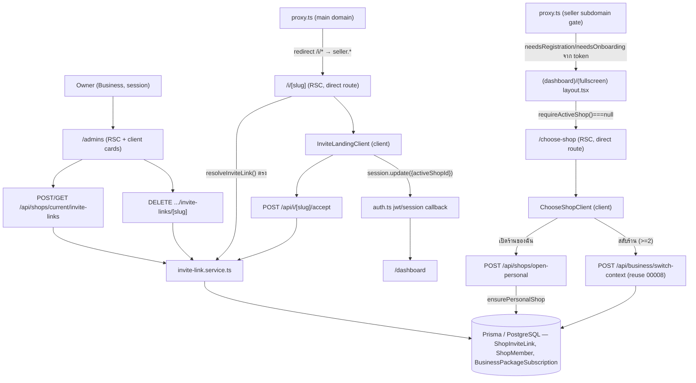
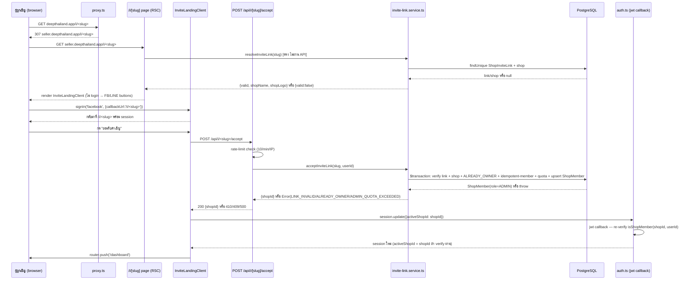
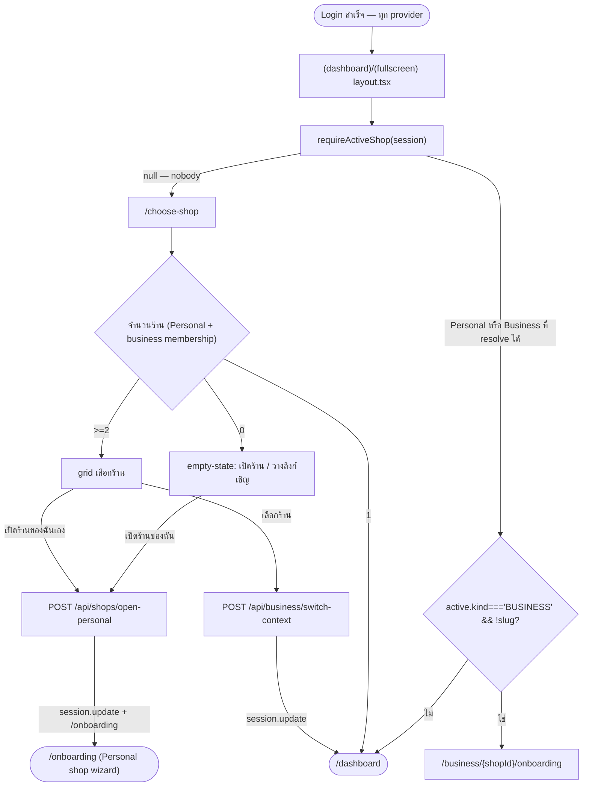

> **โมดูล:** M00012-ShopStaffInviteLinks
> **ประเภทเอกสาร:** System Design Spec (SDS) — Back-fill (as-built)
> **เวอร์ชัน:** 1.0
> **วันที่จัดทำ:** 2026-07-04
> **สถานะ:** **As-built** — งานจริงถูก implement + merge→main (`0f2b197`) + deploy prod แล้วก่อนเอกสารนี้ถูกเขียน (ดู [[SRS]] §1.1 หมายเหตุเดียวกัน)
> **เจ้าของเอกสาร:** SA (ดู [[Feature-Docs-Ownership]])

# SDS: Shop Staff Invite Links (System Design Spec)

---

## 1. บทนำ & References

### 1.1 วัตถุประสงค์

SDS นี้บันทึกการออกแบบ **as-built** ของ M00012 — ทุก signature/path อ้างจากโค้ดจริงที่มีอยู่ ณ วันที่เขียน (2026-07-04) ไม่ใช่ spec ล่วงหน้า ใช้เป็น reference สำหรับ dev ที่จะแก้/ต่อยอด feature นี้ต่อ

### 1.2 ขอบเขตการออกแบบ

ครอบคลุมทุก component ที่สร้าง/แก้จริงตาม [[SRS]] §1.2 — ดู §3 Component Design ด้านล่างสำหรับรายละเอียดต่อไฟล์

### 1.3 เอกสารอ้างอิง

| เอกสาร | ความสัมพันธ์ |
|--------|-------------|
| [[SRS]] ของโมดูลนี้ | TFR-STAFF-01..14 ที่ SDS นี้ realize |
| [[DATABASE]] ของโมดูลนี้ | schema `ShopInviteLink` เต็ม |
| `docs/superpowers/specs/2026-07-04-shop-staff-invite-link-design.md` | Design spec ต้นทาง |
| `docs/superpowers/specs/2026-07-04-shop-staff-invite-link-ux-spec.md` | UX Design Spec (theme-source mapping, reusable primitives) |
| `docs/superpowers/plans/2026-07-04-shop-staff-invite-link.md` | Implementation plan Task 0.1-5.2 |
| `docs/retro/2026-07-04-00012-shop-staff-invite-link.md` | บทเรียน + AS-BUILT deviation ที่พบระหว่าง review |
| `src/services/shop-member.service.ts` (`acceptShopInvite`) | ต้นแบบ transaction/quota pattern ที่ `acceptInviteLink` mirror ตรง ๆ |

---

## 2. Architecture Overview

Extension บน feature 00008 (`ShopMember`, `BusinessPackageSubscription` reuse ไม่แก้) + 1 invariant change กลาง (Lazy Personal shop) ที่แตะ `auth.ts`/`proxy.ts`/2 layout — ไม่มี cron ใหม่, ไม่มี realtime/broadcast, ไม่มี npm dependency ใหม่



---

## 3. Component Design

### 3.1 `src/lib/invite-link.ts` — pure lib (client-safe, no prisma import)

```typescript
export function generateInviteSlug(): string   // crypto.randomBytes + rejection sampling, [A-Za-z0-9] 12-char
export function buildInviteUrl(slug: string): string  // env NEXT_PUBLIC_BUYER_URL → dev fallback → prod fallback
export type InviteExpiryKey = "24h" | "7d" | "30d"
export const INVITE_EXPIRY_OPTIONS: readonly { key, ms, label }[]  // 3 ตัวเลือก, label ไทย
export const DEFAULT_INVITE_EXPIRY_KEY: InviteExpiryKey  // "7d"
export function expiryKeyToDate(key: InviteExpiryKey): Date  // throw ถ้า key ไม่รู้จัก (ไม่ควรเกิดถ้า Valibot ผ่านแล้ว)
```

**ทำไม rejection sampling (ไม่ใช่ `byte % 62` ตรง ๆ):** 62 symbols ไม่ลงตัวกับ 256 (`256 % 62 != 0`) — modulo ตรง ๆ จะทำให้ symbol แรก ๆ (index 0-7) ได้เปรียบทางสถิติเล็กน้อย (bias) `REJECT_THRESHOLD = floor(256/62)*62 = 248` — byte ≥248 ถูกทิ้งแล้วสุ่มใหม่ ส่วนใหญ่ผ่านรอบเดียว (สุ่ม batch ตามจำนวนตัวอักษรที่เหลือ) mirror เจตนาเดียวกับ `sms-code.service.ts` แต่ charset ต่างกัน (sms-code = 32 symbols ลงตัวพอดีกับ 256 จึงไม่ต้อง reject; invite slug = 62 symbols ต้อง reject)

**ทำไมไม่ตัด confusable characters (0/O/1/I) เหมือน sms-code:** sms-code ให้ user **พิมพ์** เอง (ตาแมวสับสน 0/O ได้) invite slug ผู้ใช้ **คลิกลิงก์** (copy-paste หรือคลิกตรง ๆ) ไม่มีปัญหาการพิมพ์ผิดจากความกำกวมของฟอนต์

### 3.2 `src/services/invite-link.service.ts` — FROZEN CONTRACT (5 functions)

signature จริงตาม [[SRS]] §3 — สรุปซ้ำที่นี่เพื่อความสมบูรณ์:

```typescript
createInviteLink(ownerId: string, shopId: string, expiryKey: InviteExpiryKey): Promise<{slug: string; expiresAt: Date}>
listActiveInviteLinks(shopId: string): Promise<{slug: string; expiresAt: Date; createdAt: Date}[]>
revokeInviteLink(ownerId: string, shopId: string, slug: string): Promise<void>
resolveInviteLink(slug: string): Promise<{valid: boolean; shopId?: string; shopName?: string; shopLogo?: string | null; reason?: "EXPIRED"|"REVOKED"|"NOT_FOUND"}>
acceptInviteLink(slug: string, userId: string): Promise<{shopId: string}>
```

**Design decision สำคัญที่ฝังในโค้ด (ดูรายละเอียดเต็มที่ [[SRS]] TFR-STAFF-01..08):**
- `createInviteLink`: retry-loop (max 5) **ครอบทั้ง `$transaction`** — Postgres mark ทั้ง transaction เป็น aborted หลัง `P2002` ครั้งแรก การ retry แค่ statement เดียวในทรานแซกชันเดิมจะพังซ้ำด้วย aborted-transaction error (mirror `order.service.ts` TD-001 pattern)
- `acceptInviteLink`: idempotent-member check (`existingMember`) มาก่อน quota check เสมอ — คนที่เป็นสมาชิกอยู่แล้วไม่ควรถูกบล็อกด้วยโควตาที่อาจเต็มไปแล้วหลังเข้าจริง (ไม่ใช่การเพิ่มสมาชิกใหม่)
- `acceptInviteLink`: `tx.shopMember.upsert` (ไม่ใช่ `.create`) เป็น safety-net ชั้นที่ 2 กัน race ระหว่าง `existingMember` check กับ insert จริง (ถ้ามี 2 request พร้อมกันผ่าน check แล้วมาชนกันที่ upsert — `update: {}` เป็น no-op)
- `resolveInviteLink`: คืน object พร้อม `reason` เสมอ (ไม่ throw) เพราะ caller เป็นทั้ง public API route และ RSC page ที่ต้องแสดงผลต่างกัน — **caller มีหน้าที่ไม่ leak `reason`/`shopId` ออกไปยัง unauthenticated response** (service เองไม่ gate ส่วนนี้ — เป็นหน้าที่ของ route/page)

### 3.3 API Routes — resolve/create/list/revoke/accept

รายละเอียดเต็ม request/response/error → [[API]] สรุปการต่อ component ที่นี่:

- **`POST/GET /api/shops/current/invite-links`**: `getServerSession` → `requireActiveShop` → guard `kind==='BUSINESS' && role==='OWNER'` (403 `NOT_OWNER` ถ้าไม่ผ่าน) → Valibot (`inviteLinkCreateSchema`, เฉพาะ POST) → เรียก service → map `Error.message` เป็น HTTP status (`NOT_OWNER`/`SHOP_LOCKED`/`NO_ACTIVE_PACKAGE` → 403; อื่น → 500 `INTERNAL_ERROR` พร้อม `console.error`)
- **`DELETE .../invite-links/[slug]`**: เหมือนข้างบน guard, เรียก `revokeInviteLink` → 204 (no body) สำเร็จ / 403 `NOT_OWNER` ถ้าไม่ผ่าน guard
- **`GET /api/i/[slug]`**: **ไม่ auth** — rate-limit ก่อน (`checkApiRateLimit`, 60/min, key `${ip}:i-resolve`) → `resolveInviteLink(slug)` → **strip `reason`/`shopId` ก่อนตอบ** เมื่อ `!valid` (คืนแค่ `{valid:false}`) → เมื่อ valid คืนเฉพาะ `{valid:true, shopName, shopLogo}` (ไม่คืน `shopId` แม้ valid — ไม่จำเป็นสำหรับ landing display)
- **`POST /api/i/[slug]/accept`**: auth required (401 ถ้าไม่มี) → rate-limit เข้มกว่า (10/min, key `${ip}:i-accept`) → `acceptInviteLink(slug, userId)` → map error (`LINK_INVALID`→410, `ALREADY_OWNER`→409, `ADMIN_QUOTA_EXCEEDED`→409, อื่น→500) → **route ไม่ set `session.activeShopId` เอง** (route handler set JWT ตรงไม่ได้ — client ต้องเรียก `session.update({activeShopId: data.shopId})` เองหลังได้ 200, ดู TD-004)

### 3.4 `src/app/(paces)/seller/i/[slug]/page.tsx` — RSC ที่เรียก service ตรง (ไม่ผ่าน API route)

⚠️ **จุดออกแบบสำคัญ (AS-BUILT, reviewer จับก่อน merge — ดู TD-005):** หน้านี้ไม่เรียก `GET /api/i/[slug]` (ไม่มีเหตุผลต้องผ่าน HTTP loopback สำหรับ RSC ที่ render server-side อยู่แล้ว) แต่เรียก `resolveInviteLink(slug)` **ตรง** — ผลคือ `guardApi` rate-limit ใน `proxy.ts` (ที่ครอบเฉพาะ path ขึ้นต้น `/api`) **ไม่ apply กับ traffic ที่มาทาง RSC page นี้เลย** ต้องมี `checkApiRateLimit` call แยกต่างหากในตัว page component เอง (key namespace `i-page:${ip}`, แยกจาก `i-resolve` ของ API route — ป้องกัน enumeration ทาง 2 ช่องทางพร้อมกันไม่ให้แชร์ quota เดียวกันโดยไม่ตั้งใจ ก็ยังปลอดภัยเพราะทั้งคู่จำกัดแยกกันคนละ 60/min)

```typescript
// สรุป logic (ไม่ใช่โค้ดเต็ม — ดูไฟล์จริงสำหรับรายละเอียด)
const ip = /* x-forwarded-for/x-real-ip */
if (!checkApiRateLimit(`i-page:${ip}`, 60, 60_000)) redirect('/i/invalid')
const result = await resolveInviteLink(slug)
if (!result.valid) redirect('/i/invalid')  // ไม่ leak reason
const hasSession = Boolean(session?.user?.id)
return <AuthCardShell><InviteLandingClient shopName shopLogo slug hasSession /></AuthCardShell>
```

### 3.5 `InviteLandingClient.tsx` — client accept flow

- ยังไม่ login: ปุ่ม FB/LINE (copy JSX จาก `SignInForm.tsx:93-148`, `callbackUrl=/i/<slug>`) + divider + link `/auth/sign-in?callbackUrl=/i/<slug>`
- login แล้ว: ปุ่ม "ยอมรับคำเชิญ" → `fetch POST /api/i/${slug}/accept` → 200 → `await update({activeShopId: data.shopId})` (NextAuth `useSession().update`) → `router.push('/dashboard')`; error → map ตาม status/body เป็น `pacesToast.error` message เฉพาะ (409 `ADMIN_QUOTA_EXCEEDED`/`ALREADY_OWNER`, 410 `LINK_INVALID`, อื่น → generic) — ค้างหน้าเดิมเสมอ (ไม่ redirect ตอน error)

### 3.6 `src/lib/auth.ts` — Lazy Personal shop gate (jwt + session callback)

**jwt callback (`auth.ts:552-597`):**
```typescript
// คำนวณเฉพาะตอน sign-in (user/account) หรือ session.update() — ไม่ query DB ทุก getToken
if (token.userId && (user || account || trigger === 'update')) {
  const u = await prisma.user.findUnique({
    where: { id: token.userId },
    select: { phone: true, shops: { where: { kind: 'PERSONAL' }, select: { id: true, slug: true } } },
  })
  const personal = u?.shops[0] ?? null
  token.needsRegistration = !!personal && !u?.phone   // เดิม: !u?.phone เฉย ๆ
  token.needsOnboarding = !!personal && !personal.slug // เดิม: !shopSlug เฉย ๆ

  if (trigger === 'update' && session?.activeShopId) {
    // re-verify ก่อนเชื่อ client-supplied shopId
    const ok = (await isShopMember(requestedShopId, token.userId)) || requestedShopId === personal?.id
    token.activeShopId = ok ? requestedShopId : (token.activeShopId ?? personal?.id ?? null)
  } else if (!token.activeShopId) {
    // default: personal → first business membership (createdAt asc) → null
    let defaultActive = personal?.id ?? null
    if (!defaultActive) {
      const firstBiz = await prisma.shopMember.findFirst({
        where: { userId: token.userId, shop: { kind: 'BUSINESS', deletedAt: null, purgedAt: null } },
        orderBy: { createdAt: 'asc' },
      })
      defaultActive = firstBiz?.shopId ?? null
    }
    token.activeShopId = defaultActive
  }
}
```

**session callback (`auth.ts:600-698`):** mirror logic เดียวกัน (`needsPhoneVerify`/`needsOnboarding` จาก `!!personal`) + **re-verify `activeShopId` ทุก render** (ไม่ trust JWT เฉย ๆ — JWT อายุ 30 วัน, membership อาจเปลี่ยนระหว่างทาง) fail-closed: error ใด ๆ ระหว่าง resolve → fallback Personal (หรือ `null`) เสมอ (ไม่ throw ทำ session callback พัง) เพิ่ม field ใหม่ `hasPersonalShop: !!personal` ให้ layout/`/choose-shop` ตัดสิน 0-shop/invited-only state ได้โดยไม่ต้อง query ซ้ำ

**ทำไมต้องแก้ทั้ง jwt และ session callback (ไม่ใช่แค่จุดเดียว):** NextAuth v4 — jwt callback เขียนลง token (ที่ persist ใน cookie), session callback อ่าน token มาแปลงเป็น `session.user` (ที่ client เห็น) ต้อง sync logic เดียวกันทั้งสองจุดไม่งั้น token/session เห็นค่าไม่ตรงกัน (เช่น proxy อ่าน token ตรง ๆ แต่ page อ่าน session)

### 3.7 `src/proxy.ts` — main redirect + seller gate exemption

```typescript
// main domain block
if (subdomain === 'main' && pathname.startsWith('/i/')) {
  const rootHost = host.replace(/^www\./, '')
  return NextResponse.redirect(`${protocol}//seller.${rootHost}${pathname}${search}`)
}

// seller subdomain gate — เพิ่ม exemption
const isExempt = pathname.startsWith('/auth') || pathname.startsWith('/api')
  || pathname.startsWith('/choose-shop') || pathname.startsWith('/i/') || pathname === '/i'
if (isAuthed && !isExempt) {
  // needsRegistration/needsOnboarding gate เดิม (ค่ามาจาก token ที่ auth.ts คำนวณใหม่แล้ว)
}
```

**ทำไม exempt `/choose-shop` และ `/i`:** invited-only user มี `needsRegistration=false`/`needsOnboarding=false` อยู่แล้วจากการแก้ §3.6 (ไม่ควรถูก gate ตั้งแต่ต้น) — exemption ที่นี่เป็น **defense-in-depth ชั้นที่ 2** กันเหนียว (เผื่อ edge case ที่ flag คำนวณผิดพลาด ก็ยังเข้า 2 route นี้ได้เสมอไม่ redirect loop)

### 3.8 `(dashboard)/layout.tsx` + `(fullscreen)/layout.tsx` — ถอด auto-create

**เดิม (ก่อน feature 00012):** `await ensurePersonalShop(userId)` เรียกทุกครั้งที่ layout render (auto-create Personal shop ถ้ายังไม่มี) แล้วค่อย resolve active shop

**ใหม่ (as-built):**
```typescript
const active = await requireActiveShop(session)
if (!active) redirect('/choose-shop')  // ไม่มีทั้ง Personal + business membership (nobody)
const shop = active.shop
if (active.kind === 'BUSINESS' && !shop.slug) {
  // D4 เดิม (feature 00008): business ที่ยังไม่ onboard → บังคับ business onboarding
  redirect(`/business/${shop.id}/onboarding`)
}
```

`requireActiveShop` (ไม่แก้ signature, มีอยู่แล้วจาก feature 00008) คืน `null` แทน throw เมื่อไม่มี context ให้ resolve — feature 00012 ใช้ property นี้ตรง ๆ เพื่อ redirect ไป `/choose-shop` แทนที่จะ auto-create เหมือนเดิม

### 3.9 `_seller-menu.ts` — `applyStaffMenu`

```typescript
export function applyStaffMenu(
  items: MenuItemType[],
  ctx: { kind: 'PERSONAL' | 'BUSINESS'; role: 'OWNER' | 'ADMIN' },
): MenuItemType[] {
  if (ctx.kind === 'BUSINESS' && ctx.role === 'OWNER') return items
  return items.map((group) => !group.children ? group : {
    ...group,
    children: group.children.filter((child) => child.slug !== 'seller:admins'),
  })
}
```

เมนู item: `{ url: '/admins', slug: 'seller:admins', label: 'พนักงาน', icon: 'users-group' }` ใน section `STORE` (mirror `applyInventoryGate` pattern — pure transform function แยกจาก static array ต้นฉบับ) **ต่างจาก `applyInventoryGate` ตรงที่ "ซ่อน" (filter ออก) ไม่ใช่ "disable + badge"** เพราะไม่มี use-case ให้ role อื่นเห็นเมนูนี้เลย (ไม่มี upsell hint ที่ต้องการโชว์)

### 3.10 `/admins/page.tsx` — RSC guard ซ้ำ

```typescript
const active = await requireActiveShop(session)
if (!active || active.kind !== 'BUSINESS' || active.role !== 'OWNER') notFound()
```

**ทำไม gate ซ้ำที่ RSC (เมนูซ่อนไปแล้วก็ตาม):** URL ตรงเข้าได้เสมอ (bookmark/พิมพ์เอง) ไม่ผูกกับสถานะเมนู — mirror หลักการเดียวกับ `invites/page.tsx` เดิม (`feedback_rsc_dal_authz`)

### 3.11 `/choose-shop/page.tsx` + `ChooseShopClient.tsx`

- RSC resolve `shops = [personalShop?, ...businessMemberships]` (mirror `/api/business/context/route.ts` เพื่อความ consistent) — `shops.length===1` → `redirect('/dashboard')` ทันที (ไม่ render หน้านี้เลย)
- Client: 0 ร้าน → empty-state (ปุ่ม "เปิดร้านของฉัน" + input วางลิงก์เชิญ, parse slug จาก URL เต็มหรือ slug ล้วนด้วย regex `/\/i\/([a-zA-Z0-9_-]+)\/?$/`); ≥2 ร้าน → grid card เลือกร้าน (`POST /api/business/switch-context`, reuse endpoint เดิม feature 00008) + ปุ่ม secondary "เปิดร้านของฉันเอง"
- ทั้ง 2 ปุ่ม "เปิดร้าน" (0-shop state และ ≥2-shop state) เรียก `handleOpenPersonal` เดียวกัน → `POST /api/shops/open-personal` → `session.update({activeShopId})` → `router.push('/onboarding')`

### 3.12 `POST /api/shops/open-personal/route.ts`

```typescript
export async function POST() {
  const session = await getServerSession(authOptions)
  const userId = session?.user?.id
  if (!userId) return NextResponse.json({ error: 'unauthorized' }, { status: 401 })
  try {
    const personalShop = await ensurePersonalShop(userId)  // idempotent, resolve-if-exists-else-create
    await prisma.user.update({ where: { id: userId }, data: { isShop: true } })
    return NextResponse.json({ shopId: personalShop.id })
  } catch (e: unknown) {
    console.error(...)
    return NextResponse.json({ error: 'INTERNAL_ERROR' }, { status: 500 })  // ⚠️ ไม่มี typed-error catch เฉพาะ
  }
}
```

⚠️ **AS-BUILT DEVIATION:** ไม่มี catch แยกตาม error type (ต่างจาก endpoint อื่นของ feature นี้) — `ensurePersonalShop`/`prisma.user.update` ไม่มี typed throw ให้แยกจับ ณ ตอนเขียน จึง fallback เป็น generic 500 เสมอเมื่อมี exception ใด ๆ ยังไม่ wrap ทั้ง 2 statement ใน `$transaction` (deferred NIT ตาม retro §4 — race window เล็ก ๆ ถ้า `ensurePersonalShop` สำเร็จแต่ `user.update` fail ระหว่างกลาง, ผลคือ Personal shop ถูกสร้างแล้วแต่ `isShop` ยังเป็น `false` — เรียกซ้ำได้เพราะ idempotent ทั้งคู่ แต่ไม่ atomic)

### 3.13 Deprecate contact-match invite UI (`business/[shopId]/invites/page.tsx`)

ตัด `InviteMemberForm`/`PendingInvitesTable` ออก เหลือเฉพาะ `CurrentMembersTable` (member-viewer) — **ไม่แตะ** `inviteShopMember`/`acceptShopInvite` (`shop-member.service.ts`) หรือ `ShopInvite` model/data (คงไว้ dead แต่ไม่ drop, ตาม OD-STAFF-B)

⚠️ **AS-BUILT DEVIATION (ต่างจาก plan Task 4.4):** plan ระบุให้แก้ TopBar dropdown (`UserDropdownDetailed.tsx`) ลิงก์ "จัดการสมาชิก" ให้ชี้ `/admins` — **grep ยืนยันว่าไม่มีคำว่า `admins` ในไฟล์นี้เลย** (ไม่ได้ทำจุดนี้จริง) เมนูซ้าย `_seller-menu.ts` (`/admins`) เป็นทางเข้าเดียวที่ implement จริงในโค้ด

---

## 4. Data Flow

### 4.1 Flow หลัก: Accept Invite Link (login-gate + cross-subdomain + session.update)



### 4.2 Flow: Post-login routing (Lazy Personal shop, 0/1/≥2 ร้าน)



---

## 5. Integration Points

| จุดเชื่อม | ประเภท | Protocol/Contract | ความเสี่ยงเมื่อล่ม |
|-----------|--------|---------------------|---------------------|
| `POST /api/business/switch-context` (feature 00008, reuse) | internal | REST/JSON, session-based | `/choose-shop` grid เลือกร้านใช้ endpoint นี้ตรง ๆ — ถ้าพัง = สลับร้านไม่ได้ (แต่ endpoint นี้ไม่ได้แก้โดย feature 00012) |
| NextAuth `session.update()` client hook | internal | client → `/api/auth/session` (NextAuth internal) → trigger `jwt` callback ด้วย `trigger==='update'` | ทุกจุดที่ต้องเปลี่ยน active shop (`accept`, `open-personal`, `switch-context`) พึ่งพา pattern นี้ — jwt callback ต้อง re-verify เสมอ (ไม่ trust ตรง ๆ) |
| `ensurePersonalShop` (feature 00008 `shop-context.ts`, reuse) | internal | function call, idempotent | `open-personal` เรียกตรง — ถ้า logic เปลี่ยน (breaking) กระทบทั้ง 00012 lazy-shop flow และ seller onboarding เดิม |

- **Timeout/Retry:** ไม่มี timeout พิเศษ (ทุก call เป็น internal Prisma/service เดียวกัน) `createInviteLink` มี retry policy เฉพาะกรณี slug ชน (§3.2)
- **สัญญา API เต็ม:** ดู [[API]]

---

## 6. Technical Decisions

### TD-001: `slug` เก็บ plaintext (capability-URL) ไม่ hash-at-rest

- **ตัดสินใจ:** `ShopInviteLink.slug` เก็บเป็น plaintext string, ไม่ hash เหมือน `sms-code.service.ts`
- **เหตุผล:** ลิงก์เป็น **reusable capability-URL** — ตัว URL เองคือ credential ที่ต้องอ่านค่ากลับมาแสดงซ้ำได้ (`buildInviteUrl(slug)` ในหน้า owner management) ต่างจาก SMS code ที่ single-use และ "พิมพ์" (ไม่ต้องอ่านค่ากลับมาแสดงซ้ำ) — mirror `Shop.slug` (public shop URL) ที่เก็บ plaintext ด้วยเหตุผลเดียวกัน
- **ทางเลือกที่ตัดทิ้ง:** hash-at-rest เหมือน sms-code — ตัดทิ้งเพราะจะทำให้ owner ไม่สามารถ copy ลิงก์เดิมซ้ำได้ (ต้อง regenerate ทุกครั้งที่ต้องการดู ซึ่งขัดกับ "reusable" ที่เป็น core requirement)
- **ผลกระทบ:** DB breach = ลิงก์ที่ยัง active หลุดได้ทันที — ยอมรับความเสี่ยงนี้เพราะชดเชยด้วย expiry + revoke + login-gate + rate-limit ที่ประกอบกัน (ดู [[DATABASE]] §3.1 ตารางเทียบเต็ม)

### TD-002: Reusable link + explicit `expiresAt` (ไม่ใช่ status state machine)

- **ตัดสินใจ:** `ShopInviteLink` ไม่มี `status` field (ต่างจาก `ShopInvite.status` ที่เป็น `PENDING→ACCEPTED/CANCELLED`) ใช้ `revokedAt`(nullable)+`expiresAt`(absolute datetime) แทน
- **เหตุผล:** ลิงก์ reusable โดย design (ใครกดก็ accept ได้ ไม่ผูก 1-invite-1-person) จึงไม่มี "ถูก accept แล้ว" state ที่ต้อง track ต่อคน — สถานะที่จำเป็นมีแค่ "ยัง valid ไหม" (คำนวณจาก 2 field นี้ ณ เวลา query)
- **ทางเลือกที่ตัดทิ้ง:** mirror `ShopInvite.status` state machine เต็มรูปแบบ — ตัดทิ้งเพราะไม่มี semantics ที่ต้องแทน (ไม่มี "1 คน 1 คำเชิญ" ให้ track)
- **ผลกระทบ:** query `listActiveInviteLinks` ต้องเช็คทั้ง `revokedAt IS NULL AND expiresAt > now()` ทุกครั้ง (ไม่มี pre-computed status column) — ยอมรับได้เพราะ index `(shopId, revokedAt)` รองรับ pattern นี้ตรง ๆ

### TD-003: Lazy Personal shop — gate ด้วย `!!personal` แทน blanket auto-create

- **ตัดสินใจ:** เลิก `await ensurePersonalShop(userId)` auto-call ใน layout ทุกครั้ง — สร้าง Personal shop เฉพาะเมื่อ user กด "เปิดร้านของฉัน" (`POST /api/shops/open-personal`) `needsRegistration`/`needsOnboarding` เปลี่ยนจาก `!phone`/`!shopSlug` เฉย ๆ เป็น `!!personal && !phone`/`!!personal && !slug`
- **เหตุผล:** invited-only user (ADMIN ของ business, ไม่ใช่ seller) ไม่ควรถูกบังคับผ่าน onboarding wizard ของ Personal shop ที่เขาไม่ได้ต้องการ — เดิม (auto-create ทุกคน) จะบังคับทุกคนกลายเป็น "ผู้ขาย" โดยไม่ได้เลือก
- **ทางเลือกที่ตัดทิ้ง:** (1) เพิ่ม field ใหม่แยก `isInvitedOnly` แล้ว branch logic เพิ่มอีกชั้น — ตัดทิ้งเพราะ `!!personal` ทำหน้าที่เดียวกันได้อยู่แล้ว (personal shop existence = ground truth ว่า "ตั้งใจเป็น seller" หรือไม่) ไม่ต้องเพิ่ม field ซ้ำซ้อน (2) auto-create Personal shop ให้ invited user ด้วยแต่ mark "hidden" — ตัดทิ้งเพราะเพิ่ม state ที่ต้องดูแลโดยไม่จำเป็น (YAGNI)
- **ผลกระทบ:** **สูงสุดของ feature นี้** — กระทบ `auth.ts`/`proxy.ts`/2 layout ที่ทุก seller เดิมเดินผ่านทุก request ถ้า derive ผิดพลาด = seller เดิมทุกคนกระทบ (login ไม่เข้า/vòng redirect loop) ต้อง downstream audit ก่อนแก้ (plan Task 0.2) + regression gate ก่อน sign-off (Tests.md หมวด G — **ยังไม่ปิดสมบูรณ์ ณ วันที่เขียนเอกสารนี้**)

### TD-004: `session.update({activeShopId})` client-side pattern (reuse จาก feature 00008 switch-context)

- **ตัดสินใจ:** ทุกจุดที่ต้องเปลี่ยน "shop ที่ active อยู่" หลัง API call สำเร็จ (`accept`, `open-personal`) ให้ **client** เรียก NextAuth `useSession().update({activeShopId})` เอง แทนที่ route handler จะ set session/JWT ตรง
- **เหตุผล:** Next.js 16 App Router route handler ไม่มีทางแก้ JWT cookie ของ NextAuth v4 ได้ตรง ๆ (ไม่ใช่ constraint ใหม่ของ feature นี้ — เป็น constraint เดียวกับที่ feature 00008 เจอมาก่อนแล้วกับ `switch-context`) `session.update()` เป็น client hook ที่ trigger `jwt` callback ด้วย `trigger==='update'` แล้ว jwt callback re-verify ownership/membership อีกชั้นก่อนเชื่อค่าที่ client ส่งมา (กัน client ปลอม `shopId`)
- **ทางเลือกที่ตัดทิ้ง:** ให้ route handler เขียน cookie ตรง (bypass NextAuth) — ตัดทิ้งเพราะ NextAuth v4 ไม่ expose API แบบนั้นให้ปลอดภัย (ต้องรู้ secret/encoding เอง เสี่ยง drift จาก NextAuth internal implementation)
- **ผลกระทบ:** ทุก flow ที่เปลี่ยน active shop มี **2 round-trip เสมอ** (API call → client `session.update` → navigate) — DEV คนถัดไปที่เพิ่ม flow แบบนี้ต้อง mirror pattern เดียวกัน ไม่ใช่พยายาม set session ฝั่ง server

### TD-005: RSC page ที่เรียก service ตรง ต้องมี rate-limit แยกเฉพาะตัว (ไม่พึ่ง `guardApi`)

- **ตัดสินใจ:** `/i/[slug]/page.tsx` (RSC) เรียก `checkApiRateLimit` เอง (key `i-page:${ip}`) แยกจาก `GET /api/i/[slug]` (key `${ip}:i-resolve`) แม้ทั้งคู่ทำงานเดียวกัน (resolve slug)
- **เหตุผล:** `guardApi` ใน `proxy.ts` ครอบเฉพาะ path ที่ขึ้นต้นด้วย `/api` — traffic ที่ hit RSC page ตรง (ไม่ใช่ fetch ไป `/api/...`) ไม่ผ่าน guard นี้เลย ถ้าไม่เพิ่ม rate-limit แยก จะเป็นช่องทางที่ brute-force slug ได้แบบไม่จำกัด (**reviewer จับจุดนี้ก่อน merge — เดิม design spec ไม่ได้ระบุจุดนี้ชัดเจน**)
- **ทางเลือกที่ตัดทิ้ง:** ให้ RSC page เรียก `fetch('/api/i/[slug]')` ภายในแทนเรียก service ตรง (จะได้ rate-limit ผ่าน `guardApi` ฟรี) — ตัดทิ้งเพราะเพิ่ม HTTP round-trip ที่ไม่จำเป็นสำหรับ server-side render (RSC เรียก service ได้ตรงอยู่แล้ว, การผ่าน HTTP loopback เป็น anti-pattern สำหรับ Next.js App Router)
- **ผลกระทบ:** ทุก RSC page ในอนาคตที่เรียก service ที่มี public/sensitive lookup ตรง ๆ (ไม่ผ่าน `/api`) ต้อง**จำ**เพิ่ม rate-limit เองเสมอ — ไม่มี automatic coverage จาก `proxy.ts`

### TD-006: Opaque error สำหรับ resolve — ไม่ leak `reason`/`shopId` เมื่อ invalid

- **ตัดสินใจ:** ทั้ง `GET /api/i/[slug]` และ RSC page คืนแค่ `{valid:false}` (API) หรือ `redirect('/i/invalid')` (RSC) เมื่อลิงก์ invalid — ไม่ส่ง `reason` (`NOT_FOUND`/`EXPIRED`/`REVOKED`) หรือ `shopId` กลับไปให้ client แม้ตอน valid ก็ไม่คืน `shopId` (คืนแค่ `shopName`/`shopLogo` ที่จำเป็นสำหรับ landing display)
- **เหตุผล:** ป้องกัน **oracle attack** — ถ้าผู้โจมตีแยกแยะได้ว่า slug นี้ "ไม่มีจริง" vs "หมดอายุ" vs "ถูก revoke" จะรู้ข้อมูลเพิ่มเกินจำเป็น (เช่น ยืนยันว่า slug รูปแบบนี้เคยมีอยู่จริง = ช่วย narrow การ enumerate) mirror pattern `/api/o/sms/[code]` ที่มีอยู่แล้วในระบบ (opaque เหมือนกัน)
- **ทางเลือกที่ตัดทิ้ง:** คืน `reason` ตรง ๆ ให้ UI แสดงข้อความเฉพาะเจาะจง (เช่น "ลิงก์นี้หมดอายุแล้ว" ต่างจาก "ลิงก์นี้ไม่มีอยู่จริง") — ตัดทิ้งเพราะ UX benefit เล็กน้อยไม่คุ้มกับ security surface ที่เพิ่มขึ้น (design spec ระบุชัดว่า "ไม่รั่วเหตุผล")
- **ผลกระทบ:** หน้า `/i/invalid` ใช้ข้อความกลาง ๆ เดียวสำหรับทุกกรณี invalid ("ลิงก์เชิญนี้ใช้งานไม่ได้แล้ว ลิงก์อาจหมดอายุ ถูกยกเลิก หรือไม่ถูกต้อง") — QA ต้องตรวจ response body จริงว่าไม่มี field เหล่านี้หลุดออกมา (ดู Tests.md TC-INV-36/76)

---

## 7. Error Handling

| Service error (throw string) | HTTP status | Route ที่ใช้ | ข้อความ error body |
|-------------------------------|-------------|--------------|----------------------|
| `NOT_OWNER` | 403 | invite-links (POST/GET/DELETE) | `{error:"NOT_OWNER"}` |
| `SHOP_LOCKED` | 403 | invite-links (POST) | `{error:"SHOP_LOCKED"}` |
| `NO_ACTIVE_PACKAGE` | 403 | invite-links (POST) | `{error:"NO_ACTIVE_PACKAGE"}` |
| `LINK_INVALID` | 410 | `i/[slug]/accept` | `{error:"LINK_INVALID"}` |
| `ALREADY_OWNER` | 409 | `i/[slug]/accept` | `{error:"ALREADY_OWNER"}` |
| `ADMIN_QUOTA_EXCEEDED` | 409 | `i/[slug]/accept` | `{error:"ADMIN_QUOTA_EXCEEDED"}` |
| `SLUG_COLLISION` (unreachable ในทางปฏิบัติ) | 500 | invite-links (POST) — ไม่มี catch เฉพาะ, ตกไปที่ generic | `{error:"INTERNAL_ERROR"}` |
| (ไม่มี session) | 401 | ทุก endpoint ที่ auth required | `{error:"unauthorized"}` |
| rate-limit เกิน | 429 | `i/[slug]` (resolve, RSC+API), `i/[slug]/accept` | `{error:"RATE_LIMITED"}` + header `Retry-After: 60` |
| Valibot validate fail | 400 | invite-links (POST) | `{error:"VALIDATION_ERROR"}` |
| exception อื่นทั้งหมด (รวม `open-personal` ทุกกรณี) | 500 | ทุก route | `{error:"INTERNAL_ERROR"}` (log `console.error` ก่อนตอบ) |

---

## 8. Risks (ดูรายละเอียดเต็มที่ [[SRS]] §9)

- **Lazy Personal shop invariant change** (สูงสุด) — regression gate ยังไม่ปิดสมบูรณ์ ณ วันที่เขียนเอกสารนี้ (ดู Tests.md หมวด G)
- **TOCTOU quota race** — inherited จาก feature 00008, deferred Phase 2
- **RSC page bypass `guardApi`** — ปิดแล้วด้วย rate-limit แยก (TD-005) แต่เป็น pattern ที่ dev คนถัดไปต้องจำเพิ่มเองทุกครั้งที่ทำ RSC page แบบเดียวกัน
- **`open-personal` ไม่ atomic** (2 statement ไม่ wrap `$transaction`) — deferred NIT

---

## 9. Traceability

| SRS Requirement (TFR) | SDS Element | สถานะ |
|---------------------------|-------------------------------------------|-------|
| TFR-STAFF-01 | §3.2 `createInviteLink` | As-built |
| TFR-STAFF-02 | §3.2 `listActiveInviteLinks` | As-built |
| TFR-STAFF-03 | §3.2 `revokeInviteLink` | As-built |
| TFR-STAFF-04 | §3.2 `resolveInviteLink` + §3.3 `GET /api/i/[slug]` + TD-006 | As-built |
| TFR-STAFF-05 | §3.2 `acceptInviteLink` + §3.3 `POST .../accept` + Flow §4.1 | As-built |
| TFR-STAFF-06 | §3.2 quota logic (TD ไม่มีแยก — inherited 00008 pattern) | As-built (known-gap) |
| TFR-STAFF-07 | §3.2 idempotent-member branch | As-built |
| TFR-STAFF-08 | §3.2 `ALREADY_OWNER` branch | As-built |
| TFR-STAFF-09 | §3.6 auth.ts jwt/session callback + TD-003 | As-built (high-risk) |
| TFR-STAFF-10 | §3.6 activeShopId resolution + TD-004 | As-built (high-risk) |
| TFR-STAFF-11 | §3.11 `/choose-shop` + Flow §4.2 | As-built |
| TFR-STAFF-12 | §3.12 `open-personal` route | As-built (generic-error deviation) |
| TFR-STAFF-13 | §3.7 proxy.ts | As-built |
| TFR-STAFF-14 | §3.9 `applyStaffMenu` + §3.10 RSC guard + §3.13 deprecate | As-built |
| NFR §7.1 (rate-limit/opaque) | TD-001, TD-005, TD-006 | As-built |

---

## 10. สรุป (Summary)

เอกสาร SDS นี้บันทึก **as-built design** ของ Shop Staff Invite Links (M00012) — ทุก component/decision อ้างจากโค้ดจริง ไม่ใช่ spec ล่วงหน้า

**ลำดับที่ build จริง (ตาม plan):** Phase 0 (feature docs skeleton + downstream audit) → Phase 1 (data model + lib + service) → Phase 2 (API routes) → Phase 3 (Lazy Personal shop — auth/proxy/layout, สูงเสี่ยงที่สุด) → Phase 4 (UI: choose-shop/landing/admins, ผ่าน safepay-ux ทุก task) → Phase 5 (E2E QA + docs sync — **ยังไม่ปิดสมบูรณ์**)

**AS-BUILT DEVIATION สำคัญที่บันทึกในเอกสารนี้:**
1. `open-personal` ไม่มี typed-error catch เฉพาะ (§3.12)
2. RSC page `/i/[slug]` ต้องมี rate-limit แยกเอง ไม่พึ่ง `guardApi` (TD-005 — จุดที่ reviewer จับได้ก่อน merge)
3. TopBar dropdown ไม่มีลิงก์ `/admins` จริง (plan Task 4.4 ระบุแต่ไม่ได้ implement — §3.13)
4. Plan ระบุแก้ `shop-context.ts` (`getFirstShopContext`) แต่ implementation จริงใส่ logic ไว้ใน `auth.ts` callback แทน (ผลลัพธ์เท่ากัน แต่ diff ไม่ตรง plan เดิม)

**Open Questions:** ดู [[SRS]] §14 (OD-INV-A quota race, OD-INV-B audit report ที่ยังไม่มีไฟล์แยก)
