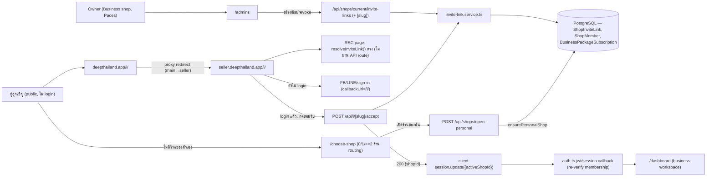
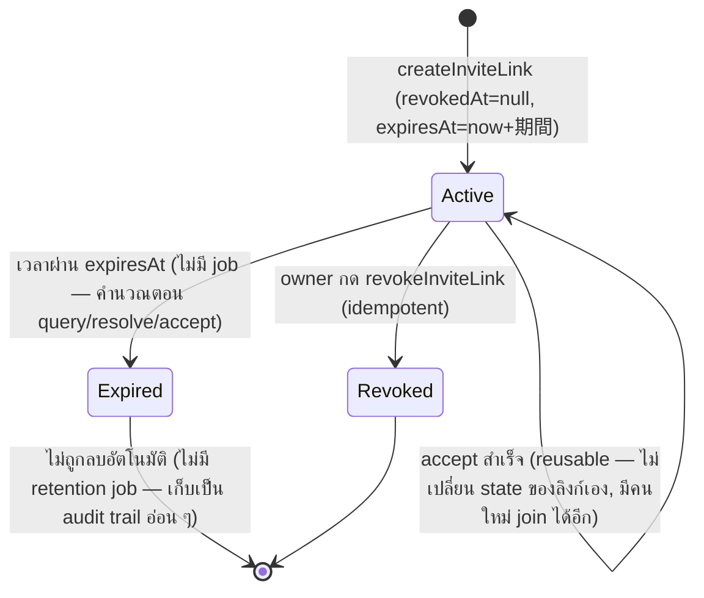
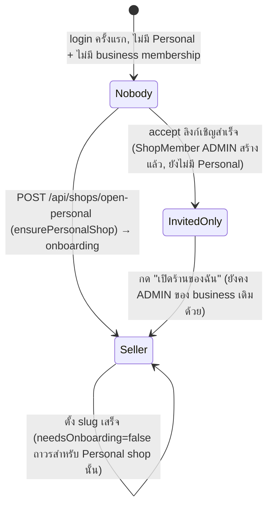

> **โมดูล:** M00012-ShopStaffInviteLinks
> **ประเภทเอกสาร:** Software Requirements Specification (SRS) — TECHNICAL (Back-fill — as-built)
> **เวอร์ชัน:** 1.0
> **วันที่จัดทำ:** 2026-07-04
> **สถานะ:** **As-built** — feature นี้ implement + merge→main (`0f2b197`) + deploy prod แล้ว **ก่อน** เอกสารนี้ถูกเขียน (ละเมิด Hard Rule 11 Documentation-First ย้อนหลัง — ดู `docs/scope/2026-07-04-00012-shop-staff-invite-scope-baseline.md` + `docs/retro/2026-07-04-00012-shop-staff-invite-link.md`). เอกสารนี้เป็น back-fill ปิด doc-debt ไม่ใช่ spec ล่วงหน้า
> **เจ้าของเอกสาร:** SA (ดู [[Feature-Docs-Ownership]])

# SRS: Shop Staff Invite Links (Software Requirements Specification — Technical)

---

## 1. บทนำ

### 1.1 วัตถุประสงค์ของเอกสาร

เอกสารนี้กำหนดข้อกำหนดเชิงเทคนิคของ **Shop Staff Invite Links (M00012, ชื่อ UI "พนักงาน")** — เจ้าของร้าน **BUSINESS** เชิญคนเข้ามาเป็น **แอดมิน** ของร้านด้วย **ลิงก์แชร์ reusable** (`deepthailand.app/i/<slug>`) แทนการเชิญแบบ contact-match (เบอร์/อีเมล) เดิมของ feature 00008 ผู้ถูกเชิญ login/register แล้วกลายเป็น `ShopMember(role=ADMIN)` **โดยไม่ถือเป็น seller** (ไม่มี Personal shop ของตัวเอง — invariant ใหม่ "Lazy Personal shop") แต่เปิดร้านเองได้ภายหลัง

**🛑 หมายเหตุ trace:** feature นี้**ไม่มี PRD/BRD formal** ที่ผ่าน user review ก่อน implement (Hard Rule 11 violation, ยอมรับเป็นหนี้โปร่งใสตาม retro) — เอกสารนี้จึง **trace TFR กลับ Design Spec + Implementation Plan แทน BRD FR-XXX** (mirror แนวทางเดียวกับ `Tests.md` ของ feature นี้) ID scheme `TFR-STAFF-01..14` ถูกกำหนด ณ ตอนเขียนเอกสารนี้เพื่อให้ตรงโครงสร้างมาตรฐาน (จะกลายเป็น FR-STAFF-01..14 1:1 ถ้ามีการเขียน BRD ย้อนหลังในอนาคต)

ผู้อ่านเป้าหมาย: DEV ที่ต้องแก้/ต่อยอด, QA ที่ออกแบบ regression test (โดยเฉพาะ Lazy Personal shop ที่กระทบ seller เดิมทุกคน), Controller ที่วางแผน dispatch งานต่อยอด

### 1.2 ขอบเขตเชิงระบบ (System Scope)

**ในขอบเขต (as-built):**
- `prisma/schema.prisma` — model `ShopInviteLink` (ดู [[DATABASE]] — apply แล้วจริง)
- `src/lib/invite-link.ts` — slug generation (crypto rejection-sampling) + URL build + expiry options
- `src/services/invite-link.service.ts` — `createInviteLink`/`listActiveInviteLinks`/`revokeInviteLink`/`resolveInviteLink`/`acceptInviteLink`
- `src/lib/validations.ts` — `inviteLinkCreateSchema`
- Routes ใหม่: `src/app/api/shops/current/invite-links/{route.ts,[slug]/route.ts}`, `src/app/api/i/[slug]/{route.ts,accept/route.ts}`, `src/app/api/shops/open-personal/route.ts`
- Seller UI (Paces): `/admins` (จัดการลิงก์+สมาชิก), `/i/[slug]` + `/i/invalid` (landing สาธารณะ), `/choose-shop` (post-login routing)
- **Lazy Personal shop invariant change** — `src/lib/auth.ts` (jwt/session callback), `src/proxy.ts` (force-redirect gate), `(dashboard)/layout.tsx` + `(fullscreen)/layout.tsx` (ถอด `ensurePersonalShop` auto-create), `src/lib/shop-context.ts` (`requireActiveShop`/`resolveActiveShopContext` ทำงานได้แม้ไม่มี Personal shop)
- เมนูซ้าย "พนักงาน" (`_seller-menu.ts` + `applyStaffMenu`)
- Deprecate contact-match invite UI เดิม (`business/[shopId]/invites/page.tsx` เหลือ member-viewer เท่านั้น ถอด `InviteMemberForm`/`PendingInvitesTable`)

**นอกขอบเขต (ตาม design spec §2 + scope baseline OOS-1..7):**
Role ย่อยกว่า `ADMIN` (permission granularity) · เชิญเข้า PERSONAL shop · Email/SMS ส่งลิงก์อัตโนมัติ · Audit log เข้า/ออกแอดมิน · ลบ/drop `ShopInvite` model/service เดิม (deprecate เฉพาะ UI ไม่ใช่ data/service) · บังคับยืนยันเบอร์ก่อน accept · แก้ RBAC granular ของ feature 00008

### 1.3 เอกสารอ้างอิง

| เอกสาร | ความสัมพันธ์ |
|--------|-------------|
| [[DATABASE]] ของโมดูลนี้ | schema `ShopInviteLink` เต็ม, index, migration, rationale plaintext-slug/RESTRICT-FK |
| `docs/superpowers/specs/2026-07-04-shop-staff-invite-link-design.md` | Design spec ต้นทาง (goal/scope/flow/security) |
| `docs/superpowers/specs/2026-07-04-shop-staff-invite-link-ux-spec.md` | UX Design Spec (safepay-ux gate output) — theme-source mapping, icon confirm |
| `docs/superpowers/plans/2026-07-04-shop-staff-invite-link.md` | Implementation plan Task 0.1-5.2 |
| `docs/scope/2026-07-04-00012-shop-staff-invite-scope-baseline.md` | S-1..S-14 as-built status + commit hash |
| `docs/retro/2026-07-04-00012-shop-staff-invite-link.md` | บทเรียน (Hard Rule 11 violation, git reset --hard incident, plan deviation) |
| `docs/20 - Features/00008 - Business Account & Packages/*` | feature ต้นทางที่ 00012 ต่อยอด (`ShopMember`, `BusinessPackageSubscription`, `ShopInvite`) |
| `src/services/shop-member.service.ts` (`acceptShopInvite`) | ต้นแบบ quota/transaction pattern ที่ `acceptInviteLink` mirror |
| `src/services/sms-code.service.ts` (`generateSecureCode`) | ต้นแบบ crypto random generation pattern (ต่างที่ charset ไม่ตัด confusable char) |
| `src/layouts/components/TopBar/components/UserDropdownDetailed.tsx` (`handleSwitch`) | ต้นแบบ `session.update({activeShopId})` + `/api/business/switch-context` ที่ `/choose-shop`/`/i/[slug]`/`open-personal` reuse pattern เดียวกัน |

### 1.4 นิยามและตัวย่อ

| คำ/ตัวย่อ | ความหมาย |
|-----------|----------|
| **Invite Link** (`ShopInviteLink`) | ลิงก์เชิญ reusable ต่อ 1 Business shop, มี `slug` (URL-safe 12 ตัวอักษร), `expiresAt`, `revokedAt?` |
| **Capability-URL** | ตัว URL เองคือ credential (ไม่ใช่ secret ที่พิมพ์) — `slug` เก็บ plaintext ตามเจตนา (ดู [[DATABASE]] §3.1) |
| **Lazy Personal shop** | invariant ใหม่: เลิก auto-create `Shop(kind=PERSONAL)` ตอน login ทุกครั้ง — สร้างเฉพาะเมื่อ user กด "เปิดร้านของฉัน" (`POST /api/shops/open-personal`) |
| **invited-only user** | user ที่เป็น `ShopMember(role=ADMIN)` ของ business shop อย่างน้อย 1 ร้าน แต่**ไม่มี** Personal shop ของตัวเอง — ไม่ถือเป็น seller |
| **`hasPersonalShop`** | field ใหม่บน `session.user` (`!!personal`) — แยก "ตั้งใจเป็น seller" ออกจาก "เป็นแค่ ADMIN business" |
| **Post-login routing** | logic ที่ `/choose-shop` ใช้ตัดสิน: 0 ร้าน → ชวนเปิดร้าน/วางลิงก์, 1 ร้าน → auto `/dashboard`, ≥2 ร้าน → grid เลือก |
| **Active shop context** | `ActiveShop`/`ActiveShopContext` (`src/lib/shop-context.ts`) — shop ที่ session กำลัง "acting" อยู่ (`session.user.activeShopId`), verify membership ทุกครั้งไม่ trust JWT เปล่า ๆ |

---

## 2. ภาพรวมสถาปัตยกรรม

### 2.1 System Context



### 2.2 องค์ประกอบหลัก

| Component | หน้าที่ | สถานะ |
|-----------|---------|-------|
| `src/lib/invite-link.ts` | `generateInviteSlug`, `buildInviteUrl`, `INVITE_EXPIRY_OPTIONS`, `expiryKeyToDate` (pure, client-safe) | ใหม่ |
| `src/services/invite-link.service.ts` | `createInviteLink`/`listActiveInviteLinks`/`revokeInviteLink`/`resolveInviteLink`/`acceptInviteLink` | ใหม่ |
| `POST/GET /api/shops/current/invite-links` | owner สร้าง/list ลิงก์ของ active shop | ใหม่ |
| `DELETE /api/shops/current/invite-links/[slug]` | owner revoke ลิงก์ | ใหม่ |
| `GET /api/i/[slug]` | resolve public (rate-limited, opaque error) | ใหม่ |
| `POST /api/i/[slug]/accept` | accept (auth required, rate-limited เข้มกว่า resolve) | ใหม่ |
| `POST /api/shops/open-personal` | สร้าง Personal shop lazily + `isShop=true` | ใหม่ |
| `src/lib/auth.ts` jwt/session callback | gate `needsRegistration`/`needsOnboarding` ด้วย `!!personal`, resolve `activeShopId` default (personal→first business membership→null), expose `hasPersonalShop` | แก้ (high-risk) |
| `src/proxy.ts` | main `/i/*` → seller subdomain redirect; seller gate ยกเว้น `/choose-shop`+`/i` | แก้ |
| `(dashboard)/layout.tsx` + `(fullscreen)/layout.tsx` | ถอด `ensurePersonalShop` auto-create → ใช้ `requireActiveShop`, redirect `/choose-shop` ถ้า `null` | แก้ (high-risk) |
| `_seller-menu.ts` (`applyStaffMenu`) | ซ่อนเมนู "พนักงาน" ยกเว้น `kind==='BUSINESS' && role==='OWNER'` | ใหม่ |
| `/admins`, `/i/[slug]`, `/i/invalid`, `/choose-shop` (UI) | หน้าจัดการ + landing + post-login routing | ใหม่ |
| `business/[shopId]/invites/page.tsx` | ลด scope เหลือ member-viewer เท่านั้น (ถอด invite form) | แก้ (deprecate) |

---

## 3. ข้อกำหนดเชิงฟังก์ชันเชิงเทคนิค (TFR-STAFF-01..14)

### TFR-STAFF-01: Owner สร้างลิงก์เชิญ (`createInviteLink`)

- **คำอธิบายเชิงเทคนิค:** `createInviteLink(ownerId, shopId, expiryKey)` — retry loop สูงสุด 5 รอบ **ครอบ `$transaction` ทั้งก้อน** (ไม่ใช่แค่ insert เดี่ยว, ดู [[DATABASE]] §6 เหตุผล aborted-transaction) แต่ละ attempt: (1) verify `shop.userId===ownerId && shop.kind==='BUSINESS'` else `NOT_OWNER`, (2) `shop.packageLockedAt!==null` → `SHOP_LOCKED`, (3) `BusinessPackageSubscription` ไม่มี/ไม่ `ACTIVE` → `NO_ACTIVE_PACKAGE`, (4) `generateInviteSlug()` + insert — ชน `P2002` (slug ซ้ำ) → retry ทั้ง transaction ใหม่
- **Precondition:** session เป็น owner ของ Business shop ที่ยัง ACTIVE package
- **Postcondition:** คืน `{slug, expiresAt}`; ไม่มี duplicate-pending guard (ต่างจาก `ShopInvite` — ลิงก์ reusable ไม่ผูก contact)
- **Error/Edge:** `attempt<4` ยัง retry ได้เมื่อชน unique; เกิน 4 ครั้ง (ปฏิบัติแทบไม่เกิดจริง — keyspace `62^12`) → throw `SLUG_COLLISION`

### TFR-STAFF-02: List ลิงก์ที่ยัง active (`listActiveInviteLinks`)

- **คำอธิบาย:** query `WHERE shopId=? AND revokedAt IS NULL AND expiresAt > now() ORDER BY createdAt DESC` — ใช้ composite index `(shopId, revokedAt)` ไม่คืน `createdByUserId` (ไม่จำเป็นต้องแสดงในหน้า owner)
- **Postcondition:** array ว่างเมื่อไม่มีลิงก์ active (ไม่ error)

### TFR-STAFF-03: Owner revoke ลิงก์เชิญ (`revokeInviteLink`)

- **คำอธิบาย:** verify `shop.userId===ownerId && shop.kind==='BUSINESS'` → `NOT_OWNER`; verify `link.shopId===shopId` → `NOT_OWNER` (ป้องกัน revoke ลิงก์ shop อื่น); ถ้า `revokedAt` ตั้งไว้แล้ว → **no-op idempotent** (ไม่ throw, ไม่ทับ timestamp เดิม)
- **Postcondition:** `revokedAt = now()` — ลิงก์ที่ join ไปแล้วยังเป็นสมาชิกเดิม (revoke ไม่กระทบ `ShopMember` ที่มีอยู่)

### TFR-STAFF-04: Resolve ลิงก์สาธารณะ (`resolveInviteLink`) — opaque ต่อ caller ที่ไม่ auth

- **คำอธิบาย:** คืน `{valid, shopId?, shopName?, shopLogo?, reason?}` แทน throw (caller คือหน้า public landing) แต่ **route/RSC ที่เรียกต้องไม่ leak `reason`/`shopId` ออกไปยัง unauthenticated client** — `reason` (`NOT_FOUND`/`REVOKED`/`EXPIRED`) ใช้ได้เฉพาะ internal decision (เช่น log) ไม่ serialize ออก response (ดู TD-006 ใน [[SDS]])
- **ลำดับตรวจ:** ไม่มี slug → `NOT_FOUND`; `revokedAt!==null` → `REVOKED`; `expiresAt<=now()` → `EXPIRED`; ผ่านหมด → `valid:true` พร้อม `shopId/shopName/shopLogo`

### TFR-STAFF-05: Accept ลิงก์เชิญ (`acceptInviteLink`) — full guard chain ใน 1 transaction

- **คำอธิบาย:** `acceptInviteLink(slug, userId)` ทำใน `$transaction` เดียว: (1) link ไม่มี/`revokedAt!==null`/`expiresAt<=now()` → `LINK_INVALID`; (2) shop ไม่พบ → `LINK_INVALID`; (3) `shop.userId===userId` (เจ้าของ shop เปิดลิงก์ตัวเอง) → `ALREADY_OWNER`; (4) เป็น `ShopMember` อยู่แล้ว → **idempotent**, คืน `{shopId}` ทันที **ข้าม quota check** (ไม่ใช่การเพิ่มสมาชิกใหม่ ไม่ควรถูกบล็อกด้วยโควตาที่อาจเต็มไปแล้วหลังเข้าจริง); (5) quota check (TFR-STAFF-06); (6) `tx.shopMember.upsert(...)` (`update:{}` idempotent กัน race ระหว่าง step 4 กับ step 6)
- **Postcondition:** `ShopMember(shopId, userId, role='ADMIN')` มีอยู่จริง; คืน `{shopId}` เสมอเมื่อสำเร็จ

### TFR-STAFF-06: Quota enforcement (fail-closed)

- **คำอธิบาย:** `sub = BusinessPackageSubscription.findUnique({ownerId: shop.userId})`; `maxAdmins = sub && sub.status==='ACTIVE' ? BUSINESS_PACKAGE_TIER_CONFIG[sub.tier].maxAdminsPerBusiness : 0` — **ไม่มี/ไม่ ACTIVE subscription = โควตา 0 (fail-closed) ไม่ใช่ unlimited**; `adminCount = count(ShopMember where shopId, role='ADMIN')`; `adminCount >= maxAdmins` → `ADMIN_QUOTA_EXCEEDED`
- **Known-gap (TOCTOU):** โควตาไม่มี DB CHECK constraint — race window เล็ก ๆ ระหว่าง 2 คน accept พร้อมกันตอนโควตาเหลือ 1 ที่สุดท้าย (inherited จาก `acceptShopInvite` เดิม feature 00008 — ไม่ใช่ regression ใหม่ของ feature นี้ แต่ก็ไม่ถูกปิดในรอบนี้เช่นกัน; deferred Phase 2 ตาม scope baseline)

### TFR-STAFF-07: Idempotent accept (สมาชิกอยู่แล้ว)

- ดู TFR-STAFF-05 step 4 — คืน `{shopId}` ปกติไม่ throw ไม่สร้างแถวซ้ำ (`tx.shopMember.upsert` เป็น safety-net ชั้นที่ 2 กัน race ระหว่าง check-then-act)

### TFR-STAFF-08: ALREADY_OWNER guard

- ดู TFR-STAFF-05 step 3 — เจ้าของ Business shop เปิดลิงก์เชิญของร้านตัวเอง (เช่น ทดสอบ/กดผิด) → throw `ALREADY_OWNER`, ไม่สร้าง `ShopMember` ซ้ำซ้อนกับ owner row ที่มีอยู่

### TFR-STAFF-09: Lazy Personal shop — gate `needsRegistration`/`needsOnboarding` ด้วย `!!personal`

- **คำอธิบายเชิงเทคนิค (jwt callback, `src/lib/auth.ts:566-567`):** `token.needsRegistration = !!personal && !u?.phone`; `token.needsOnboarding = !!personal && !personal.slug` — **เปลี่ยนจาก `!shopSlug` เปล่า ๆ** (เดิมทุก user ที่ไม่มี slug โดนบังคับ onboarding เพราะทุกคน "ต้องมี" Personal shop auto-create) เป็น **บังคับเฉพาะคนที่มี Personal shop อยู่แล้ว** (ตั้งใจเป็น seller) — invited-only user (มี ShopMember business แต่ไม่มี Personal) จึง `needsRegistration=false, needsOnboarding=false` เสมอ ไม่โดนเด้ง `/register`/`/onboarding`
- **session callback (`auth.ts:614-619`) mirror logic เดียวกัน** ให้ `session.user.needsPhoneVerify`/`needsOnboarding` ตรงกับ token
- **Precondition:** ต้อง query `u.shops.where(kind='PERSONAL')` (ไม่ใช่ `u.shop` singular เดิม — post feature 00008 Phase 2 cutover)
- **Postcondition:** seller เดิมที่มี Personal+slug → ไม่กระทบพฤติกรรม; seller ที่มี Personal แต่ยังไม่ตั้ง slug → ยังเด้ง onboarding เหมือนเดิม; invited-only/nobody → ไม่เด้งทั้งคู่

### TFR-STAFF-10: `activeShopId` default resolution (personal → first business membership → null)

- **คำอธิบาย:** jwt callback (`auth.ts:580-596`) — sign-in แรกที่ `!token.activeShopId`: default = `personal?.id`; ถ้าไม่มี Personal (invited-only) → หา `ShopMember` แรกที่ `shop.kind='BUSINESS', deletedAt:null, purgedAt:null` เรียง `createdAt asc` แทน; ถ้าไม่มีเลย (nobody) → `null`
- **session callback (`auth.ts:624-656`) re-verify ทุก render:** ไม่ trust `token.activeShopId` เปล่า ๆ — query `ShopMember` จริงกรอง `shop.deletedAt/purgedAt` เสมอ (กัน soft-deleted business ยัง resolve เป็น active); ไม่เจอ → fallback Personal (หรือ `null` ถ้าไม่มี Personal — invited-only ที่ยังไม่ได้เลือกร้าน)
- **`session.update({activeShopId})` (trigger==='update'):** client ส่งค่ามา ต้อง re-verify `isShopMember(requestedShopId, userId) || requestedShopId===personal?.id` ก่อนเชื่อ — กัน client ปลอม `shopId`

### TFR-STAFF-11: Post-login routing `/choose-shop` (0/1/≥2 ร้าน)

- **คำอธิบาย:** RSC `ChooseShopPage` resolve `shops = [personalShop? , ...businessMemberships]` (mirror `/api/business/context`) — **1 ร้าน → `redirect('/dashboard')` ทันที** (ไม่แสดงหน้านี้เลย); **≥2 ร้าน** → render grid `ChooseShopClient`; **0 ร้าน** → ไม่ redirect ในหน้านี้ (ClientComponent เองแสดง empty-state — ไม่มี early-return 0 ที่ RSC เพราะ 0 ก็ต้องแสดง UI ให้เลือกทำอะไรต่อ)
- **Trigger เข้าหน้านี้:** `(dashboard)/layout.tsx`/`(fullscreen)/layout.tsx` เมื่อ `requireActiveShop()` คืน `null` (ไม่มีทั้ง Personal + business membership ที่ resolve ได้)
- **เลือกร้าน:** `POST /api/business/switch-context` (reuse endpoint เดิมของ feature 00008) → `session.update({activeShopId})` → `/dashboard`

### TFR-STAFF-12: เปิดร้านของฉัน (`POST /api/shops/open-personal`)

- **คำอธิบาย:** เรียก `ensurePersonalShop(userId)` (idempotent — resolve-if-exists-else-create, invariant D1 เดิมของ feature 00008) แล้ว `prisma.user.update({isShop:true})` — **ไม่ wrap 2 statement นี้ใน `$transaction`** (เป็น NIT deferred ตาม retro §4)
- **⚠️ AS-BUILT DEVIATION:** route นี้ **ไม่มี typed-error catch เฉพาะ** — เพียง try/catch ทั่วไปที่ log แล้วคืน `{error:'INTERNAL_ERROR'}` 500 เสมอ (ต่างจาก endpoint อื่นของ feature นี้ที่ map `Error.message` เป็น HTTP status เฉพาะ) เพราะ `ensurePersonalShop`/`prisma.user.update` ไม่มี typed throw ที่ route ต้องแยกจับ ณ ตอนเขียน — ไม่ใช่ gap ที่ตั้งใจซ่อน แต่เป็นเพราะยังไม่มี error case เฉพาะที่ต้องแยก (idempotent ทั้งคู่)
- **Postcondition:** คืน `{shopId}` เสมอ (สร้างใหม่หรือของเดิม) — client เรียกต่อด้วย `session.update({activeShopId})` แล้ว `router.push('/onboarding')`

### TFR-STAFF-13: proxy.ts — main domain `/i/*` redirect + seller gate exemption

- **คำอธิบาย (main domain block):** `subdomain==='main' && pathname.startsWith('/i/')` → `NextResponse.redirect` ไป `https://seller.<rootHost>${pathname}${search}` (คง port ติดมาด้วยสำหรับ dev `deepth.local:4000`) — เหตุผล: login/accept ต้องเกิดใน **seller session** (session แยกตาม subdomain), ไม่ใช่ main/buyer session
- **คำอธิบาย (seller subdomain gate):** เพิ่ม `isExempt` รวม `pathname.startsWith('/choose-shop')` และ `pathname.startsWith('/i/') || pathname==='/i'` เข้ากับ exemption เดิม (`/auth`, `/api`) — invited-only user (flags เป็น `false` อยู่แล้วจาก TFR-STAFF-09) ไม่ควรโดน gate ซ้ำ แต่ exempt ไว้เป็น defense-in-depth กันเหนียว
- **Postcondition:** `curl -I http://deepth.local:4000/i/<slug>` → 307/302 ไป `http://seller.deepth.local:4000/i/<slug>`

### TFR-STAFF-14: เมนู "พนักงาน" + `/admins` visibility gate + deprecate contact-match UI

- **คำอธิบาย (`applyStaffMenu`, `_seller-menu.ts`):** runtime transform — `ctx.kind==='BUSINESS' && ctx.role==='OWNER'` → คืน items เดิมไม่แก้; อื่น ๆ (ADMIN หรือ PERSONAL) → **กรอง** child `slug==='seller:admins'` ออกจาก items ทั้งหมด (ซ่อน ไม่ใช่แค่ disable — ต่างจาก `applyInventoryGate` ที่ยัง badge/disable แต่โชว์เมนู เพราะเมนูนี้ไม่มี use-case ให้ role อื่นเห็นเลย)
- **RSC guard ซ้ำที่ `/admins/page.tsx`:** `!active || active.kind!=='BUSINESS' || active.role!=='OWNER'` → `notFound()` (ป้องกัน URL เข้าตรง — เมนูซ่อนอย่างเดียวไม่พอเพราะ URL bookmarked/พิมพ์เองเข้าได้เสมอ)
- **Deprecate:** `business/[shopId]/invites/page.tsx` ตัด `InviteMemberForm`/`PendingInvitesTable` ออก เหลือ **member-viewer เท่านั้น** (`CurrentMembersTable`) — **ไม่ลบ** `inviteShopMember`/`acceptShopInvite` service function หรือ `ShopInvite` model/data (deprecate เฉพาะ UI ตาม OD-STAFF-B, scope baseline Assumptions)

---

## 4. Interface / API Specification (สรุป — รายละเอียดเต็มดู [[API]])

| Method | Path | คำอธิบาย | Auth |
|--------|------|----------|------|
| `POST` | `/api/shops/current/invite-links` | owner สร้างลิงก์เชิญ | owner session (BUSINESS+OWNER) |
| `GET` | `/api/shops/current/invite-links` | list ลิงก์ active ของ shop ปัจจุบัน | owner session |
| `DELETE` | `/api/shops/current/invite-links/[slug]` | revoke ลิงก์ | owner session |
| `GET` | `/api/i/[slug]` | resolve ลิงก์ (public, rate-limited, opaque) | ไม่ต้อง auth |
| `POST` | `/api/i/[slug]/accept` | ยอมรับคำเชิญ | ต้อง login |
| `POST` | `/api/shops/open-personal` | เปิด Personal shop (become-seller) | ต้อง login |

---

## 5. State Machine

### 5.1 ShopInviteLink Lifecycle



### 5.2 User Shop-membership State (Lazy Personal shop)



---

## 6. Routing

| Path | Surface | Auth | หมายเหตุ |
|------|---------|------|---------|
| `deepthailand.app/i/<slug>` | main (Vuexy subdomain, แต่ redirect ทันที) | ไม่ต้อง login | proxy 307/302 → seller subdomain (TFR-STAFF-13) |
| `seller.deepthailand.app/i/<slug>` | seller (Paces), direct route นอก `(dashboard)`/`(fullscreen)` | ไม่ต้อง login (accept button ต้อง login) | own `AuthCardShell`, ไม่ผ่าน layout auto-create ใด ๆ |
| `/i/invalid` | seller (Paces) | ไม่ต้อง login | ข้อความกลาง ๆ ไม่รั่วเหตุผล invalid |
| `/choose-shop` | seller (Paces), direct route | ต้อง login | proxy exempt จาก force-redirect gate; layout redirect มาที่นี่เมื่อ `requireActiveShop()===null` |
| `/admins` | seller (Paces) ใต้ `(dashboard)` | ต้อง login + `kind==='BUSINESS' && role==='OWNER'` (else `notFound()`) | เมนูซ่อนสำหรับ role อื่น แต่ URL ตรงยัง gate ที่ RSC |

---

## 7. NFR (Non-Functional Requirements)

### 7.1 Security — Capability-URL + Rate-limit

- `slug` 12-char `[A-Za-z0-9]` (charset 62 symbol) generate ด้วย `crypto.randomBytes` + **rejection sampling** (กัน modulo bias ที่ 62 ไม่ลงตัวกับ 256) — keyspace `62^12` (~3.2×10^21) ป้องกัน brute-force ทางปฏิบัติ
- **2 ชั้น rate-limit แยก endpoint** (per-IP, key namespace ต่างกัน):
  - `GET /api/i/[slug]` (resolve, public API route): `60 req/min` — key `${ip}:i-resolve`
  - **RSC page `/i/[slug]/page.tsx` (เรียก `resolveInviteLink()` ตรง ไม่ผ่าน API route):** `60 req/min` **แยกต่างหาก** — key `i-page:${ip}` (สำคัญ: หน้านี้ **ไม่ผ่าน `guardApi` ใน proxy.ts** เพราะ proxy ครอบเฉพาะ path ที่ขึ้นต้น `/api` เท่านั้น — reviewer เคยจับเป็นจุดที่ rate-limit เดิมกลายเป็น dead code สำหรับ traffic ที่มาทาง RSC page โดยตรง จึงต้องมี rate-limit call แยกต่างหากในตัว page component เอง ดู TD-005 ใน [[SDS]])
  - `POST /api/i/[slug]/accept`: `10 req/min` (เข้มกว่า resolve เพราะมี side-effect สร้าง `ShopMember`) — key `${ip}:i-accept`
- **Opaque error:** `resolveInviteLink()` reason (`NOT_FOUND`/`EXPIRED`/`REVOKED`) และ `shopId` (ตอน invalid) **ไม่ serialize ออก** ทั้ง `GET /api/i/[slug]` response และ RSC page (`redirect('/i/invalid')` เฉย ๆ) — กัน oracle ที่ทำให้ผู้โจมตีแยกแยะสาเหตุ invalid ได้ (ดู TD-006)
- **Known-gap:** rate-limit เป็น in-memory per-instance (Vercel serverless) — เหมือนระบบเดิมทั้งหมด (Redis = Phase 2, ไม่ใช่ scope feature นี้)

### 7.2 Quota Consistency

- Quota (`maxAdminsPerBusiness`) enforce เป็น **runtime check ที่ service layer เท่านั้น** ไม่มี DB `CHECK` constraint — TOCTOU race window ยอมรับความเสี่ยงเดียวกับ `acceptShopInvite` เดิม (deferred Phase 2, ดู TFR-STAFF-06)

### 7.3 PII

- `ShopInviteLink` ไม่มี PII โดยตรง (`slug`=random token, ไม่ผูก contact ผู้ถูกเชิญล่วงหน้า — ต่างจาก `ShopInvite.invitedContact`) — ไม่ต้อง neutralize-at-source สำหรับ table นี้ (ดู [[DATABASE]] §6)
- หน้า `/admins` แสดง `displayName`/`createdAt` ของสมาชิก (ไม่ใช่ raw contact เทียบเท่า phone/email) — mirror `invites/page.tsx` เดิมที่ไม่ mask field เหล่านี้ (ต่างจาก `invitedContact` ที่เป็น raw PII ต้อง mask)

### 7.4 Cross-cutting risk — Lazy Personal shop invariant change

- แก้ `auth.ts` (jwt/session callback ที่ทุก provider ใช้ร่วมกัน — Facebook/LINE/Phone-OTP) + `proxy.ts` (gate ทุก route seller subdomain) + 2 layout file (ทุกหน้าใต้ `(dashboard)`/`(fullscreen)`) = **กระทบ seller เดิมทุกคนถ้าพัง** ไม่ใช่แค่ user ใหม่ของฟีเจอร์นี้ — ดู §8 Risks

---

## 8. ข้อจำกัดทางเทคนิคและการพึ่งพา

### 8.1 ข้อจำกัดทางเทคนิค

- Shared prod DB (dev=prod Supabase เดียวกัน) — migration ต้อง hand-written + `migrate deploy -e .env.local` เท่านั้น (ห้าม `migrate dev`/`db push`)
- Route handler ตั้ง `session.activeShopId` (JWT) ตรงไม่ได้ — ทุกจุดที่ต้องเปลี่ยน active shop (`accept`, `open-personal`, `switch-context`) ต้องให้ **client** เรียก `session.update({activeShopId})` เองหลัง API 200 แล้ว jwt callback re-verify อีกชั้น (constraint เดียวกับ feature 00008 switch-context)
- `_seller-menu.ts` ต้องคง static array (SSOT ให้ `getSellerPageTitle.ts`/`SellerMobileHeader.tsx` import ตรง) — `applyStaffMenu` เป็น pure transform แยกต่างหาก ไม่แก้ array ต้นฉบับ

### 8.2 การพึ่งพาภายใน

| Dependency | ประเภท | ความเสี่ยง |
|------------|--------|------------|
| `ShopMember`, `BusinessPackageSubscription` (feature 00008) | internal | ไม่แก้ schema เลย — reuse ผ่าน service layer เท่านั้น |
| `ensurePersonalShop` (`shop-context.ts`, feature 00008) | internal | ยังเป็น idempotent invariant D1 เดิม — feature 00012 เปลี่ยนแค่ "เมื่อไหร่ถูกเรียก" (lazy) ไม่เปลี่ยนตัว function |
| `auth.ts` jwt/session callback | internal, shared ทุก provider | high-risk — แก้ผิดกระทบ login ทุก seller ทุก provider (FB/LINE/Phone-OTP) |

### 8.3 สมมติฐานทางเทคนิค

- `requireActiveShop`/`resolveActiveShopContext` (feature 00008) ถูกออกแบบให้ทำงานได้แม้ไม่มี Personal shop อยู่แล้ว (คืน `null` แทน throw) — feature 00012 ใช้ property นี้ตรง ๆ ไม่ต้องแก้ signature
- `getSellerPageTitle.ts`/`getShopByUserId` เดิมที่ assume Personal shop ต้องมีเสมอ (ถ้ามี) — audit ตาม plan Task 0.2 ทำแล้ว (Explore agent) แต่**ไม่มีรายงานไฟล์แยกเก็บไว้** (ดู Tests.md §3 ช่องว่าง OD-INV-B — ยังไม่ปิดเป็นเอกสาร)

---

## 9. ความเสี่ยงเชิงสถาปัตยกรรม (Architectural Risks)

| ความเสี่ยง | ผลกระทบ | แนวทางลด |
|-----------|---------|----------|
| **Lazy Personal shop invariant change** (สูงสุด) | login ไม่เข้า/วน redirect loop/เด้ง onboarding ผิดสำหรับ seller เดิมทุกคน (ไม่ใช่แค่ user ใหม่) | Downstream audit ก่อนแก้ (plan Task 0.2, Explore agent) + regression gate PENDING-manual-prod (`docs/20 - Features/00012 - Shop Staff Invite Links/Tests.md` หมวด G, TC-INV-63..71) — **ยังไม่ปิดสมบูรณ์ ณ วันที่เขียนเอกสารนี้** |
| **TOCTOU quota race ตอน accept พร้อมกัน** | admin เกินโควตาชั่วคราว (inherited จาก feature 00008) | deferred Phase 2 — พิจารณา `SELECT FOR UPDATE`/advisory-lock |
| **auth.ts merge conflict กับ FB Account Switcher (feature 00008 ext)** | resolve แบบ static ตอน merge — ไม่ได้ทดสอบ runtime การทำงานร่วมกัน | user เทส prod เอง (revert path พร้อมใช้ `git revert -m 1 0f2b197`) |
| **RSC page `/i/[slug]` ไม่ผ่าน `guardApi`** | rate-limit เดิมที่คาดว่า apply ทั่วระบบ กลายเป็น dead code สำหรับ traffic ทาง RSC | เพิ่ม `checkApiRateLimit` แยกต่างหากในตัว page component (TD-005, ปิดแล้วก่อน merge — reviewer จับได้) |
| **git `reset --hard origin/main` บน feature branch ระหว่าง build** | เกือบเสียงาน 15 commits (กู้คืนด้วย `git reflog`) | บทเรียนบันทึกใน retro — ไม่ใช่ risk ที่เหลือค้างในโค้ด |

---

## 10. Authorization Matrix

| Endpoint | Actor | เงื่อนไขผ่าน | เงื่อนไข block |
|----------|-------|-------------|----------------|
| `POST/GET /api/shops/current/invite-links` | Owner (active shop) | `session` มี + `requireActiveShop().kind==='BUSINESS' && role==='OWNER'` | ไม่มี session → 401; ไม่ใช่ owner/ไม่ใช่ BUSINESS → 403 `NOT_OWNER` |
| `DELETE /api/shops/current/invite-links/[slug]` | Owner (active shop) | เหมือนข้างบน + `link.shopId===active.shop.id` | 403 `NOT_OWNER` ถ้า slug ไม่ใช่ของ shop นี้ |
| `GET /api/i/[slug]` | ใครก็ได้ (public) | rate-limit ผ่าน (60/min/IP) | เกิน limit → 429; ไม่มี auth check (ตั้งใจ — public landing) |
| `POST /api/i/[slug]/accept` | ผู้ใช้ที่ login แล้ว (คนไหนก็ได้ที่ไม่ใช่ owner ของ shop นั้น) | session มี + rate-limit ผ่าน (10/min/IP) + link valid + ไม่ใช่ owner + quota เหลือ (หรือเป็นสมาชิกอยู่แล้ว) | ไม่มี session → 401; link invalid → 410; เป็น owner → 409; quota เต็ม → 409 |
| `POST /api/shops/open-personal` | ผู้ใช้ที่ login แล้ว (คนไหนก็ได้) | session มี | ไม่มี session → 401 |
| Admin (platform) | ไม่มีสิทธิ์เข้าถึง invite-link ของ shop ใด | — | ไม่มี endpoint ให้ admin เรียกในฟีเจอร์นี้เลย |

---

## 11. Validation Rules (Valibot — `src/lib/validations.ts`)

```typescript
// ── feature 00012 Shop Staff Invite Link (Task 2.1) ──────────────────────────
export const inviteLinkCreateSchema = v.object({
  // omit ได้ — route ใช้ DEFAULT_INVITE_EXPIRY_KEY ('7d') แทนถ้าไม่ส่งมา
  expiryKey: v.optional(v.picklist(["24h", "7d", "30d"])),
});
```

- `GET/DELETE .../invite-links*` และ `GET /api/i/[slug]`, `POST /api/i/[slug]/accept`, `POST /api/shops/open-personal` **ไม่มี Valibot schema** (ไม่มี request body ที่ต้อง validate — `slug` มาจาก path param, `POST accept`/`open-personal` มี body ว่าง `{}`)

---

## 12. Enums / Constants

| ชื่อ | ค่าที่ยอมรับ | ที่มา |
|------|-------------|-------|
| `InviteExpiryKey` | `"24h" \| "7d" \| "30d"` | `src/lib/invite-link.ts` |
| `INVITE_EXPIRY_OPTIONS` | `[{key,ms,label}]` × 3 (24 ชั่วโมง/7 วัน/30 วัน) | `src/lib/invite-link.ts` |
| `DEFAULT_INVITE_EXPIRY_KEY` | `"7d"` | `src/lib/invite-link.ts` |
| `SLUG_CHARSET` | `[A-Za-z0-9]` (62 symbol) | `src/lib/invite-link.ts` (internal, ไม่ export) |
| `SLUG_LENGTH` | `12` | `src/lib/invite-link.ts` (internal) |
| Service error strings (throw) | `NOT_OWNER`, `SHOP_LOCKED`, `NO_ACTIVE_PACKAGE`, `LINK_INVALID`, `ALREADY_OWNER`, `ADMIN_QUOTA_EXCEEDED`, `SLUG_COLLISION` | `invite-link.service.ts` — route catch ด้วย string match (ดู [[API]] §5) |
| `ShopMember.role` (reuse, ไม่แก้) | `"OWNER" \| "ADMIN"` | feature 00008 |
| `ShopInviteLink.role` (column, ปัจจุบันค่าเดียว) | `"ADMIN"` | future-proof เท่านั้น — ไม่มี logic แยกตามค่านี้ในรอบนี้ |

---

## 13. Traceability Matrix

> **หมายเหตุ:** feature นี้ไม่มี BRD/FR-XXX formal (Hard Rule 11 debt) — คอลัมน์ "BRD FR-ID" ว่างไว้เจตนา (รอ back-fill BRD ในอนาคตถ้าต้องทำ 1:1)

| BRD FR-ID (รอ back-fill) | SRS TFR-ID | Component | สถานะ |
|-----------|------------|-----------|-------|
| (FR-STAFF-01) | TFR-STAFF-01 | `createInviteLink` | As-built |
| (FR-STAFF-02) | TFR-STAFF-02 | `listActiveInviteLinks` | As-built |
| (FR-STAFF-03) | TFR-STAFF-03 | `revokeInviteLink` | As-built |
| (FR-STAFF-04) | TFR-STAFF-04 | `resolveInviteLink` + `GET /api/i/[slug]` | As-built |
| (FR-STAFF-05) | TFR-STAFF-05 | `acceptInviteLink` + `POST /api/i/[slug]/accept` | As-built |
| (FR-STAFF-06) | TFR-STAFF-06 | quota logic ใน `acceptInviteLink`/`createInviteLink` | As-built (known-gap TOCTOU) |
| (FR-STAFF-07) | TFR-STAFF-07 | idempotent branch ใน `acceptInviteLink` | As-built |
| (FR-STAFF-08) | TFR-STAFF-08 | `ALREADY_OWNER` branch | As-built |
| (FR-STAFF-09) | TFR-STAFF-09 | `auth.ts` jwt/session callback | As-built (high-risk, regression PENDING) |
| (FR-STAFF-10) | TFR-STAFF-10 | `auth.ts` `activeShopId` resolution | As-built (high-risk, regression PENDING) |
| (FR-STAFF-11) | TFR-STAFF-11 | `/choose-shop` + `ChooseShopClient` | As-built |
| (FR-STAFF-12) | TFR-STAFF-12 | `POST /api/shops/open-personal` | As-built (generic-error deviation, ดู §3 TFR-STAFF-12) |
| (FR-STAFF-13) | TFR-STAFF-13 | `proxy.ts` main/seller gate | As-built |
| (FR-STAFF-14) | TFR-STAFF-14 | `applyStaffMenu` + `/admins` RSC guard + deprecate invites UI | As-built |

---

## 14. สรุป (Summary)

เอกสาร SRS นี้กำหนดข้อกำหนดเชิงเทคนิคของ **Shop Staff Invite Links (M00012)** แบบ **back-fill จากโค้ดจริง** (as-built) — ทุก TFR อ้างอิง path/signature/behavior ที่มีอยู่จริงในโค้ด ณ วันที่เขียน (2026-07-04, commit ล่าสุดที่เกี่ยวข้อง `ce48bcb`/merge `0f2b197`)

**ขอบเขตที่ครอบคลุม:** invite link lifecycle (create/list/revoke/resolve/accept) เต็ม, quota fail-closed, Lazy Personal shop invariant change (auth/proxy/layout), post-login routing 0/1/≥2 ร้าน, เมนู+หน้า `/admins`, deprecate contact-match UI เดิม

**AS-BUILT DEVIATION ที่บันทึกไว้ (ต้องรู้ก่อนแก้ต่อ):**
1. `POST /api/shops/open-personal` **ไม่มี typed-error catch เฉพาะ** — generic try/catch คืน 500 เสมอเมื่อ error (ดู TFR-STAFF-12)
2. RSC page `/i/[slug]` เรียก `resolveInviteLink()` **ตรง ไม่ผ่าน `GET /api/i/[slug]`** — ต้องมี rate-limit call แยกต่างหากในตัว page เอง (ไม่งั้น `guardApi` ที่ครอบเฉพาะ `/api/*` ช่วยไม่ได้) — reviewer จับจุดนี้ก่อน merge แล้ว ปัจจุบันแก้แล้ว (`i-page:${ip}` key)
3. **TopBar dropdown (`UserDropdownDetailed.tsx`) ไม่มีลิงก์ไปยัง `/admins`** — grep ยืนยันไม่มี string `admins` ในไฟล์นี้ (แผน Task 4.4 ระบุให้แก้ลิงก์ "จัดการสมาชิก" ชี้ `/admins` แต่ implementation จริงไม่ได้ทำจุดนี้ — เมนูซ้าย `_seller-menu.ts` เป็นทางเข้าเดียวที่มีจริงในโค้ด)

**ประเด็นที่ต้องตัดสินใจเพิ่ม (Open Questions, ยังไม่ปิด):**
- OD-INV-A: TOCTOU quota race — ยอมรับความเสี่ยงต่อ หรือแก้ด้วย `SELECT FOR UPDATE`/advisory-lock?
- OD-INV-B: audit call site `requireActiveShop`/`resolveActiveShopContext` (plan Task 0.2) มีรายงานจริงหรือไม่ — ถ้าไม่มีไฟล์แยก ต้องทำย้อนหลังก่อนปิดหนี้ regression เต็ม (ดู Tests.md)
- **PRD/BRD formal ของ feature นี้ยังไม่มี** — ถ้าต้องการ 1:1 FR-STAFF-01..14 อย่างเป็นทางการ ต้อง dispatch `safepay-product` เขียนย้อนหลัง
